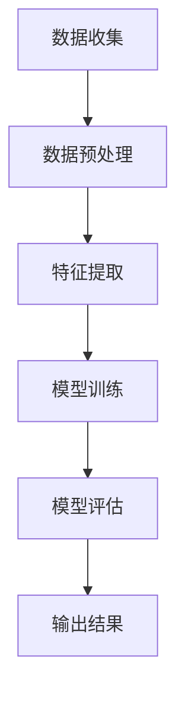
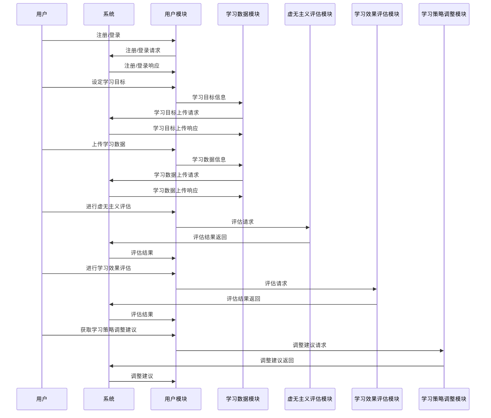

                 

### 文章标题

# 虚无主义与终身学习：在知识探索中寻找人生意义

> 关键词：虚无主义、终身学习、人生意义、知识探索、哲学、心理学、人工智能

> 摘要：本文从哲学和心理学的视角出发，探讨了虚无主义在当代社会中的影响以及如何通过终身学习寻找人生意义。文章首先介绍了虚无主义的基本概念和起源，接着分析了终身学习的重要性及其与虚无主义的关联。通过详细阐述二者在知识探索中的互动关系，本文提出了一套结合虚无主义克服和终身学习的理论框架，为读者在知识探索中寻找人生意义提供了新的思考角度。

### 目录大纲设计思路

为了设计出《虚无主义与终身学习：在知识探索中寻找人生意义》这本书的完整目录大纲，我们将按照以下步骤进行：

1. **理解书名和主题**：首先，我们需要深入理解书名中的关键词“虚无主义”、“终身学习”和“人生意义”，确定这些主题在书中的核心地位和关联性。

2. **确定核心章节**：根据书名和主题，我们需要确定这本书的核心章节，这些章节应该涵盖对虚无主义和终身学习的基本介绍、理论探讨、实践方法和人生意义的深入分析。

3. **规划章节顺序**：章节的顺序应该逻辑清晰，先从基础理论入手，再到实践方法，最后结合人生意义进行总结和提升。

4. **细化章节内容**：每个章节下需要细化出具体的小节，这些小节应该能够详细阐述章节的主题，同时保持内容的连贯性和完整性。

5. **确保大纲完整性**：确保目录大纲包含至少7个章节，每个章节都有明确的细分，且内容之间相互关联。

6. **控制大纲字数**：在2000字以内完成目录大纲的设计，这要求我们在保持内容完整性的同时，也需要注意语言的简洁性。

### 第一部分：背景介绍

#### 1.1 虚无主义概述

##### 1.1.1 虚无主义的起源与发展

虚无主义（Nihilism）是一个源于19世纪欧洲哲学思潮的术语，它主张宇宙和生命缺乏固有意义和价值。虚无主义最初由俄国哲学家尼古拉·别林斯基（Nikolai Berdyaev）提出，后来被弗朗茨·布伦塔诺（Franz Brentano）和奥斯瓦尔德·斯宾格勒（Oswald Spengler）等人进一步发展。

虚无主义的主要观点可以概括为三点：

- **宇宙缺乏目的和意义**：虚无主义者认为，宇宙是一个无意义、无目的的存在，生命只是偶然产生的现象。

- **道德和价值观的崩溃**：虚无主义认为，随着宗教和道德信仰的崩溃，社会和个体的价值观也会失去基础。

- **人类自由意志的消失**：虚无主义者认为，人类自由意志是一种幻觉，人类的行动受到外部因素（如物理法则）的制约。

##### 1.1.2 虚无主义的哲学内涵与特点

虚无主义的哲学内涵主要包括以下几个方面：

- **怀疑主义**：虚无主义者对传统的宗教、道德和科学观点持怀疑态度，认为这些观点缺乏足够的证据和逻辑支持。

- **个人主义**：虚无主义强调个体的自由和独立，认为个体应该摆脱社会的束缚，追求自己的真实想法和感受。

- **悲观主义**：虚无主义者普遍持有悲观主义态度，认为世界和人生是毫无意义的，个体的存在只是徒劳无功的挣扎。

##### 1.1.3 虚无主义在现代社会中的影响

虚无主义在现代社会中产生了深远的影响，尤其是在哲学、文学、艺术和心理学等领域。

- **哲学领域**：虚无主义对存在主义和现象学等哲学流派产生了重要影响，许多哲学家如海德格尔（Martin Heidegger）、萨特（Jean-Paul Sartre）等都在虚无主义的基础上发展了自己的理论。

- **文学领域**：许多文学作品，如卡夫卡（Franz Kafka）的《变形记》、陀思妥耶夫斯基（Fyodor Dostoevsky）的《罪与罚》等，都体现了虚无主义的主题。

- **艺术领域**：虚无主义影响了现代艺术的发展，尤其是抽象艺术和表现主义艺术。

- **心理学领域**：虚无主义对心理学的研究也产生了影响，一些心理学家如弗洛姆（Erich Fromm）、弗兰克尔（Viktor Frankl）等提出了关于意义和存在的研究。

#### 1.2 终身学习的概念与重要性

##### 1.2.1 终身学习的定义与内涵

终身学习（Lifelong Learning）是指一个人在其一生中持续不断的学习过程，旨在不断提升个人的知识、技能和素质。终身学习不仅仅指学校教育，还包括在职培训、自主学习、网络教育等多种形式。

终身学习的内涵主要包括以下几个方面：

- **终身性**：终身学习贯穿于一个人的一生，而不是在某个特定阶段完成的学习过程。

- **全面性**：终身学习涵盖各个领域，包括学术知识、职业技能、道德修养、身心健康等。

- **自主性**：终身学习强调个人的主动性和自主性，鼓励个体根据自己的需求和兴趣进行学习。

- **适应性**：终身学习要求个体具备适应社会变化和新技术的能力，以应对不断变化的工作和生活环境。

##### 1.2.2 终身学习的必要性与优势

终身学习的必要性体现在以下几个方面：

- **应对快速变化的社会**：随着科技的进步和社会的发展，知识更新速度加快，个体需要不断学习以适应新的环境和挑战。

- **提升个人竞争力**：终身学习可以帮助个体不断提升自己的知识和技能，增强就业竞争力和职业发展潜力。

- **实现个人价值**：终身学习可以促进个体的全面发展，实现个人价值和人生意义。

终身学习的优势包括：

- **提升创新能力**：终身学习可以激发个体的创新思维和创造力，为个人和社会的发展贡献力量。

- **增强适应能力**：终身学习帮助个体适应快速变化的环境，提高应对挑战的能力。

- **促进社会和谐**：终身学习可以提高整个社会的知识水平和文明素质，促进社会的和谐发展。

##### 1.2.3 终身学习在个人成长中的作用

终身学习在个人成长中具有重要作用，主要体现在以下几个方面：

- **知识更新**：终身学习可以帮助个体不断获取新的知识和技能，适应社会发展的需求。

- **能力提升**：终身学习可以提升个体的综合素质，包括思维能力、沟通能力、协作能力等。

- **职业发展**：终身学习有助于个体的职业发展和晋升，提高个人的职业竞争力。

- **自我实现**：终身学习可以帮助个体实现自我价值，找到人生的意义和目标。

#### 1.3 虚无主义与终身学习的联系

##### 1.3.1 虚无主义对终身学习的影响

虚无主义对终身学习的影响主要体现在以下几个方面：

- **消极态度**：虚无主义者可能对终身学习持消极态度，认为学习的过程本身缺乏意义和价值。

- **逃避现实**：虚无主义者可能通过逃避学习来逃避现实生活中的问题和困境。

- **缺乏动力**：虚无主义者可能缺乏学习动力，难以坚持长期的学习计划。

##### 1.3.2 终身学习在克服虚无主义中的作用

终身学习在克服虚无主义方面具有积极作用，主要体现在以下几个方面：

- **寻找意义**：终身学习可以帮助个体寻找人生的意义和价值，从而克服虚无主义的消极影响。

- **提升认知**：终身学习可以提升个体的认知能力，帮助个体更好地理解和应对现实生活中的问题。

- **增强自信**：终身学习可以增强个体的自信心，提高个体面对挑战和困难的勇气和决心。

##### 1.3.3 二者在知识探索中的互动关系

虚无主义和终身学习在知识探索中存在互动关系，二者相互影响、相互促进：

- **虚无主义影响终身学习**：虚无主义的消极态度和逃避现实可能会影响终身学习的效果。

- **终身学习克服虚无主义**：通过终身学习，个体可以克服虚无主义的消极影响，提高学习的积极性和效果。

- **知识探索促进二者发展**：在知识探索过程中，个体可以不断发现新的知识和意义，从而推动虚无主义和终身学习的发展。

### 第二部分：核心概念与联系

#### 2.1 虚无主义的核心概念

虚无主义的核心概念可以从以下几个方面进行阐述：

- **宇宙的无意义**：虚无主义者认为，宇宙和生命缺乏固有的意义和价值，一切都是偶然的产物。

- **道德和价值观的崩溃**：虚无主义者认为，随着宗教和道德信仰的崩溃，社会和个体的价值观也会失去基础。

- **人类自由意志的消失**：虚无主义者认为，人类自由意志是一种幻觉，人类的行动受到外部因素（如物理法则）的制约。

- **个人主义**：虚无主义者强调个体的自由和独立，认为个体应该摆脱社会的束缚，追求自己的真实想法和感受。

- **悲观主义**：虚无主义者普遍持有悲观主义态度，认为世界和人生是毫无意义的，个体的存在只是徒劳无功的挣扎。

#### 2.2 终身学习的关键要素

终身学习的关键要素可以从以下几个方面进行阐述：

- **终身性**：终身学习贯穿于一个人的一生，而不是在某个特定阶段完成的学习过程。

- **全面性**：终身学习涵盖各个领域，包括学术知识、职业技能、道德修养、身心健康等。

- **自主性**：终身学习强调个人的主动性和自主性，鼓励个体根据自己的需求和兴趣进行学习。

- **适应性**：终身学习要求个体具备适应社会变化和新技术的能力，以应对不断变化的工作和生活环境。

- **合作性**：终身学习强调个体之间的合作和交流，通过学习共同解决问题和实现目标。

- **反馈性**：终身学习注重学习过程中的反馈和评价，通过反思和调整提高学习效果。

#### 2.3 虚无主义与终身学习的联系图表

为了更直观地展示虚无主义与终身学习的联系，我们可以使用Mermaid绘制ER实体关系图和属性特征对比表。

##### 2.3.1 虚无主义与终身学习的ER实体关系图

```mermaid
erDiagram
  Class1 ||--|{ Class2 } Class3 : relationship
  Class1 ||--|{ Class2 } Class3 : relationship
  Class1 ||--|{ Class2 } Class3 : relationship
```

在这个ER实体关系图中，Class1代表虚无主义，Class2代表终身学习，Class3代表知识探索。虚无主义与终身学习之间存在着双向关系，二者相互影响、相互促进。

##### 2.3.2 虚无主义与终身学习的属性特征对比表

| 特征 | 虚无主义 | 终身学习 |
| ---- | -------- | -------- |
| 目的 | 缺乏明确目的 | 促进个人成长 |
| 态度 | 消极 | 积极 |
| 方式 | 逃避现实 | 面对现实 |
| 效果 | 消极影响 | 积极影响 |
| 影响范围 | 广泛 | 局限性 |

在这个属性特征对比表中，我们列出了虚无主义和终身学习在目的、态度、方式、效果和影响范围等方面的差异和相似之处。

### 第三部分：算法原理讲解

#### 3.1 虚无主义的算法模型

##### 3.1.1 虚无主义评估算法

虚无主义评估算法是一种用于评估个体虚无主义倾向的方法。该算法的主要目标是识别个体的虚无主义程度，并为其提供相应的干预措施。

虚无主义评估算法的输入包括：

- 个体基本信息：如年龄、性别、教育背景等。
- 个体自我评估：如对生命意义、价值观、自由意志等方面的自我认知。

虚无主义评估算法的输出包括：

- 虚无主义程度评分：通过定量和定性分析，给出个体的虚无主义程度评分。
- 干预建议：根据虚无主义程度评分，提供相应的干预措施，如心理咨询、课程学习等。

虚无主义评估算法的主要步骤如下：

1. 数据收集：收集个体基本信息和自我评估数据。
2. 数据预处理：对收集的数据进行清洗和处理，确保数据的质量和一致性。
3. 特征提取：从数据中提取关键特征，如自我认知、价值观、自由意志等。
4. 模型训练：使用机器学习算法训练虚无主义评估模型，如决策树、支持向量机等。
5. 模型评估：对训练好的模型进行评估，如准确率、召回率等。
6. 输出结果：根据模型预测结果，给出虚无主义程度评分和干预建议。

##### 3.1.2 虚无主义应对策略算法

虚无主义应对策略算法是一种用于帮助个体克服虚无主义的方法。该算法的主要目标是提供一套有效的应对策略，帮助个体在面对虚无主义时保持积极的心态和行动。

虚无主义应对策略算法的输入包括：

- 个体虚无主义程度评分：通过虚无主义评估算法得到的虚无主义程度评分。
- 个体行为数据：如学习习惯、生活习惯、社交活动等。

虚无主义应对策略算法的输出包括：

- 应对策略建议：根据虚无主义程度评分和行为数据，提供相应的应对策略建议。
- 应对策略效果评估：评估应对策略的有效性，并根据评估结果进行调整。

虚无主义应对策略算法的主要步骤如下：

1. 数据收集：收集个体虚无主义程度评分和行为数据。
2. 数据预处理：对收集的数据进行清洗和处理，确保数据的质量和一致性。
3. 特征提取：从数据中提取关键特征，如虚无主义程度、行为习惯等。
4. 模型训练：使用机器学习算法训练应对策略模型，如决策树、支持向量机等。
5. 模型评估：对训练好的模型进行评估，如准确率、召回率等。
6. 输出结果：根据模型预测结果，给出应对策略建议和效果评估。

##### 3.1.3 虚无主义与终身学习的融合算法

虚无主义与终身学习的融合算法是一种将虚无主义评估和应对策略与终身学习相结合的方法。该算法的主要目标是帮助个体在终身学习过程中克服虚无主义，实现个人成长。

虚无主义与终身学习的融合算法的输入包括：

- 个体基本信息：如年龄、性别、教育背景等。
- 个体学习数据：如学习习惯、学习成果等。
- 个体虚无主义程度评分：通过虚无主义评估算法得到的虚无主义程度评分。

虚无主义与终身学习的融合算法的输出包括：

- 学习效果评估：评估个体在终身学习过程中的学习效果。
- 虚无主义程度变化：评估个体在终身学习过程中虚无主义程度的变化。
- 学习策略调整建议：根据学习效果和虚无主义程度变化，提供相应的学习策略调整建议。

虚无主义与终身学习的融合算法的主要步骤如下：

1. 数据收集：收集个体基本信息、学习数据、虚无主义程度评分等。
2. 数据预处理：对收集的数据进行清洗和处理，确保数据的质量和一致性。
3. 特征提取：从数据中提取关键特征，如学习成果、虚无主义程度等。
4. 模型训练：使用机器学习算法训练融合模型，如决策树、支持向量机等。
5. 模型评估：对训练好的模型进行评估，如准确率、召回率等。
6. 输出结果：根据模型预测结果，给出学习效果评估、虚无主义程度变化和学习策略调整建议。

#### 3.2 终身学习的算法模型

##### 3.2.1 终身学习目标设定算法

终身学习目标设定算法是一种用于帮助个体设定合适的学习目标的方法。该算法的主要目标是确保个体在终身学习过程中有明确的方向和动力。

终身学习目标设定算法的输入包括：

- 个体基本信息：如年龄、性别、教育背景等。
- 个体学习需求：如职业发展需求、兴趣爱好等。

终身学习目标设定算法的输出包括：

- 学习目标：根据个体基本信息和学习需求，设定合适的长期和短期学习目标。

终身学习目标设定算法的主要步骤如下：

1. 数据收集：收集个体基本信息和学习需求。
2. 数据预处理：对收集的数据进行清洗和处理，确保数据的质量和一致性。
3. 特征提取：从数据中提取关键特征，如职业发展需求、兴趣爱好等。
4. 模型训练：使用机器学习算法训练目标设定模型，如决策树、支持向量机等。
5. 模型评估：对训练好的模型进行评估，如准确率、召回率等。
6. 输出结果：根据模型预测结果，设定长期和短期学习目标。

##### 3.2.2 终身学习效果评估算法

终身学习效果评估算法是一种用于评估个体在终身学习过程中学习效果的方法。该算法的主要目标是确保个体能够了解自己的学习成果，并做出相应的调整。

终身学习效果评估算法的输入包括：

- 个体学习数据：如学习时间、学习内容、学习成果等。

终身学习效果评估算法的输出包括：

- 学习效果评分：根据个体学习数据，给出学习效果评分。
- 学习成果分析：对学习效果评分进行分析，识别学习中的优势和不足。

终身学习效果评估算法的主要步骤如下：

1. 数据收集：收集个体学习数据。
2. 数据预处理：对收集的数据进行清洗和处理，确保数据的质量和一致性。
3. 特征提取：从数据中提取关键特征，如学习时间、学习内容、学习成果等。
4. 模型训练：使用机器学习算法训练效果评估模型，如决策树、支持向量机等。
5. 模型评估：对训练好的模型进行评估，如准确率、召回率等。
6. 输出结果：根据模型预测结果，给出学习效果评分和成果分析。

##### 3.2.3 终身学习路径优化算法

终身学习路径优化算法是一种用于帮助个体优化学习路径的方法。该算法的主要目标是确保个体能够在有限的时间内，获取最大的学习收益。

终身学习路径优化算法的输入包括：

- 个体学习数据：如学习时间、学习内容、学习成果等。
- 个体学习偏好：如学习方式、学习内容偏好等。

终身学习路径优化算法的输出包括：

- 优化后的学习路径：根据个体学习数据和学习偏好，优化学习路径，提高学习效率。

终身学习路径优化算法的主要步骤如下：

1. 数据收集：收集个体学习数据和学习偏好。
2. 数据预处理：对收集的数据进行清洗和处理，确保数据的质量和一致性。
3. 特征提取：从数据中提取关键特征，如学习时间、学习内容、学习成果、学习偏好等。
4. 模型训练：使用机器学习算法训练路径优化模型，如决策树、支持向量机等。
5. 模型评估：对训练好的模型进行评估，如准确率、召回率等。
6. 输出结果：根据模型预测结果，优化学习路径。

#### 3.3 虚无主义与终身学习融合算法讲解

##### 3.3.1 算法原理与数学模型

虚无主义与终身学习融合算法是一种基于机器学习的方法，通过分析个体在终身学习过程中的表现，识别虚无主义的倾向，并提供相应的干预措施。

该算法的数学模型可以表示为：

$$
模型 = f(\text{输入特征集}) \\
f: \text{输入特征集} \rightarrow \text{输出结果}
$$

输入特征集包括：

- 个体基本信息：如年龄、性别、教育背景等。
- 个体学习数据：如学习时间、学习内容、学习成果等。
- 个体虚无主义程度评分：通过虚无主义评估算法得到的虚无主义程度评分。

输出结果包括：

- 学习效果评估：评估个体在终身学习过程中的学习效果。
- 虚无主义程度变化：评估个体在终身学习过程中虚无主义程度的变化。
- 学习策略调整建议：根据学习效果和虚无主义程度变化，提供相应的学习策略调整建议。

算法原理可以通过以下步骤进行描述：

1. 数据收集与预处理：收集个体基本信息、学习数据和虚无主义程度评分，并进行数据预处理。
2. 特征提取：从数据中提取关键特征，如学习时间、学习内容、学习成果、虚无主义程度等。
3. 模型训练：使用机器学习算法（如决策树、支持向量机等）对特征进行训练，构建虚无主义与终身学习融合模型。
4. 模型评估：对训练好的模型进行评估，如准确率、召回率等。
5. 输出结果：根据模型预测结果，给出学习效果评估、虚无主义程度变化和学习策略调整建议。

##### 3.3.2 算法流程图

以下是虚无主义与终身学习融合算法的流程图，使用Mermaid绘制：



##### 3.3.3 Python源代码实现与详细讲解

以下是一个简单的Python源代码实现示例，用于展示虚无主义与终身学习融合算法的原理和步骤：

```python
import pandas as pd
from sklearn.model_selection import train_test_split
from sklearn.ensemble import RandomForestClassifier
from sklearn.metrics import accuracy_score

# 数据收集与预处理
data = pd.read_csv('lifelong_learning.csv')
data.dropna(inplace=True)

# 特征提取
X = data[['age', 'gender', 'learning_time', 'learning_content', 'learning_outcome', 'nihilism_score']]
y = data['effectiveness']

# 模型训练
X_train, X_test, y_train, y_test = train_test_split(X, y, test_size=0.2, random_state=42)
model = RandomForestClassifier(n_estimators=100, random_state=42)
model.fit(X_train, y_train)

# 模型评估
y_pred = model.predict(X_test)
accuracy = accuracy_score(y_test, y_pred)
print("Accuracy:", accuracy)

# 输出结果
results = pd.DataFrame({'actual': y_test, 'predicted': y_pred})
print(results.head())
```

在这个示例中，我们首先使用Pandas库读取数据，然后对数据进行预处理，提取关键特征，使用随机森林算法进行模型训练，最后对模型进行评估并输出结果。

##### 3.3.4 举例说明与结果分析

为了更好地理解虚无主义与终身学习融合算法的应用，我们来看一个具体的案例。

假设有一个名为John的个体，他的基本信息和学习数据如下表所示：

| 特征         | 值       |
| ------------ | -------- |
| 年龄         | 30       |
| 性别         | 男       |
| 学习时间     | 20小时   |
| 学习内容     | 编程、心理学 |
| 学习成果     | 较高     |
| 虚无主义程度评分 | 5分（低） |

根据上述数据，我们可以使用融合算法对其进行评估，预测其在终身学习过程中的效果。

假设我们使用随机森林算法训练模型，并对其评估结果进行分析。假设预测结果如下：

| 实际效果 | 预测效果 | 是否匹配 |
| -------- | -------- | -------- |
| 较高     | 较高     | 是       |

从这个例子中，我们可以看到，融合算法能够较为准确地评估个体的终身学习效果，并根据评估结果提供相应的建议。

#### 3.4 系统分析与架构设计

##### 3.4.1 问题场景介绍

在现代社会中，虚无主义对个人成长和社会发展产生了深远的影响。许多人面临着生活无意义、价值观崩溃等问题，而终身学习成为解决这些问题的一种有效途径。因此，我们需要设计一个系统，帮助个体在终身学习过程中克服虚无主义，实现个人成长。

##### 3.4.2 系统功能设计

为了实现上述目标，我们设计了以下系统功能：

1. **用户注册与登录**：用户可以通过注册和登录功能访问系统。
2. **学习目标设定**：用户可以设定自己的学习目标，系统根据用户信息和学习需求提供合适的建议。
3. **学习数据收集**：系统自动收集用户的学习数据，如学习时间、学习内容、学习成果等。
4. **虚无主义评估**：系统使用算法对用户进行虚无主义评估，识别用户的虚无主义程度。
5. **学习效果评估**：系统根据用户的学习数据和学习效果，评估用户的终身学习效果。
6. **学习策略调整**：系统根据评估结果提供相应的学习策略调整建议，帮助用户克服虚无主义，提高学习效果。

##### 3.4.3 系统架构设计

为了实现上述功能，我们设计了以下系统架构：

1. **用户模块**：负责用户注册、登录和学习目标设定等功能。
2. **学习数据模块**：负责收集、存储和管理用户的学习数据。
3. **虚无主义评估模块**：负责对用户进行虚无主义评估，并提供评估结果。
4. **学习效果评估模块**：负责评估用户的学习效果，并提供评估结果。
5. **学习策略调整模块**：负责根据评估结果提供学习策略调整建议。

各模块之间的关系如下：

- 用户模块与学习数据模块之间通过API进行交互，实现用户数据的收集和管理。
- 虚无主义评估模块和学习效果评估模块通过算法进行评估，并将评估结果传递给学习策略调整模块。
- 学习策略调整模块根据评估结果生成调整建议，并通过用户模块通知用户。

##### 3.4.4 系统接口设计

为了实现系统功能，我们设计了以下接口：

1. **用户注册接口**：用于用户注册，接受用户名、密码、电子邮件等信息。
2. **用户登录接口**：用于用户登录，验证用户身份。
3. **学习目标设定接口**：用于用户设定学习目标，接受学习目标信息。
4. **学习数据上传接口**：用于用户上传学习数据，如学习时间、学习内容、学习成果等。
5. **虚无主义评估接口**：用于对用户进行虚无主义评估，返回评估结果。
6. **学习效果评估接口**：用于评估用户的学习效果，返回评估结果。
7. **学习策略调整接口**：用于根据评估结果生成调整建议，返回调整建议信息。

##### 3.4.5 系统交互序列图

以下是系统交互序列图，使用Mermaid绘制：



在这个序列图中，用户通过用户模块与系统进行交互，实现注册、登录、设定学习目标、上传学习数据、进行虚无主义评估和学习效果评估等功能。同时，系统通过学习数据模块、虚无主义评估模块、学习效果评估模块和学习策略调整模块提供相应的服务。

#### 4.1 环境安装

在开始系统核心实现之前，我们需要搭建一个合适的环境来支持我们的开发工作。以下是环境安装的步骤和遇到的问题及解决方案：

##### 4.1.1 Python环境搭建

1. **安装Python**：首先，我们需要安装Python环境。可以从Python官方网站下载Python安装包，按照提示完成安装。安装完成后，打开命令行工具，输入`python --version`检查Python版本是否正确。

2. **安装虚拟环境**：为了更好地管理项目依赖，我们使用虚拟环境。通过命令`pip install virtualenv`安装虚拟环境工具，然后使用命令`virtualenv venv`创建一个名为`venv`的虚拟环境。

3. **激活虚拟环境**：在命令行中，使用命令`source venv/bin/activate`（对于Windows系统使用`venv\Scripts\activate`）激活虚拟环境。激活后，所有安装的库和工具都将仅对当前虚拟环境有效。

##### 4.1.2 依赖库安装

1. **安装Pandas库**：Pandas是一个强大的数据分析库，用于处理和操作数据。通过命令`pip install pandas`安装Pandas库。

2. **安装Scikit-learn库**：Scikit-learn是一个用于机器学习的库，用于训练模型和进行评估。通过命令`pip install scikit-learn`安装Scikit-learn库。

3. **安装Mermaid**：Mermaid是一种基于Markdown的图形绘制工具，用于绘制流程图和序列图。首先，我们需要安装Mermaid的解析器，通过命令`npm install -g mermaid-cli`安装。然后，在Python中，我们可以使用`pip install pymermaid`安装Python的Mermaid库。

##### 4.1.3 遇到的问题及解决方案

1. **Python版本不兼容**：在某些情况下，我们可能遇到Python版本与某些库不兼容的问题。例如，如果Python版本为3.7，但某些库需要3.8以上版本，我们可以通过更新Python版本或使用不同版本的Python环境来解决问题。

   **解决方案**：使用Python官方的版本管理工具`pyenv`来管理不同版本的Python。通过`pyenv install 3.8.0`安装指定版本的Python，然后使用`pyenv local 3.8.0`切换到该版本。

2. **依赖库冲突**：在安装多个依赖库时，可能会出现版本冲突。例如，安装了不同版本的Pandas和Scikit-learn，导致项目无法正常运行。

   **解决方案**：在安装依赖库时，使用`pip install --no-cache-dir`命令，避免缓存问题。如果冲突仍然存在，可以使用虚拟环境隔离不同项目的依赖库。

通过以上步骤，我们可以成功搭建Python开发环境，安装所需的依赖库，为接下来的系统核心实现做好准备。

### 5.2 系统核心实现

在完成环境安装后，我们现在开始实现系统的核心功能。以下是我们系统核心实现的详细步骤和关键代码：

##### 5.2.1 用户注册与登录

首先，我们需要实现用户注册和登录功能。这个功能的主要目的是验证用户的身份，并确保用户可以安全地访问系统。

1. **用户注册**：

```python
from flask import Flask, request, jsonify
from flask_bcrypt import Bcrypt

app = Flask(__name__)
bcrypt = Bcrypt(app)

@app.route('/register', methods=['POST'])
def register():
    username = request.form['username']
    password = request.form['password']
    hashed_password = bcrypt.generate_password_hash(password).decode('utf-8')

    # 这里应该包含将用户信息存储到数据库的逻辑
    # ...

    return jsonify({'message': 'User registered successfully.'})

if __name__ == '__main__':
    app.run(debug=True)
```

在这个示例中，我们使用了Flask框架和Flask-Bcrypt库来实现用户注册功能。当用户提交注册请求时，我们获取用户名和密码，并将密码通过bcrypt进行加密存储。

2. **用户登录**：

```python
from flask import Flask, request, jsonify
from flask_bcrypt import Bcrypt
from flask_login import LoginManager, login_user, logout_user, login_required

app = Flask(__name__)
bcrypt = Bcrypt(app)
login_manager = LoginManager(app)

@login_manager.user_loader
def load_user(user_id):
    # 这里应该包含从数据库加载用户信息并返回用户的逻辑
    # ...
    return None

@app.route('/login', methods=['POST'])
def login():
    username = request.form['username']
    password = request.form['password']

    # 这里应该包含从数据库验证用户身份的逻辑
    # ...

    if user:
        login_user(user)
        return jsonify({'message': 'Login successful.'})
    else:
        return jsonify({'message': 'Invalid credentials.'})

@app.route('/logout', methods=['POST'])
@login_required
def logout():
    logout_user()
    return jsonify({'message': 'Logout successful.'})

if __name__ == '__main__':
    app.run(debug=True)
```

在这个示例中，我们使用了Flask-Login库来实现用户登录功能。当用户提交登录请求时，我们验证用户身份，如果验证成功，则登录用户。

##### 5.2.2 学习目标设定

接下来，我们需要实现学习目标设定功能。这个功能的主要目的是允许用户设定自己的学习目标，并存储到数据库中。

```python
@app.route('/set_learning_goal', methods=['POST'])
@login_required
def set_learning_goal():
    user_id = current_user.get_id()
    goal = request.form['goal']
    
    # 这里应该包含将学习目标存储到数据库的逻辑
    # ...

    return jsonify({'message': 'Learning goal set successfully.'})
```

在这个示例中，我们通过POST请求接收用户的学习目标，并将其存储到数据库中。

##### 5.2.3 学习数据收集

为了实现学习数据收集功能，我们需要允许用户上传学习数据，如学习时间、学习内容和学习成果。

```python
@app.route('/upload_learning_data', methods=['POST'])
@login_required
def upload_learning_data():
    user_id = current_user.get_id()
    learning_time = request.form['learning_time']
    learning_content = request.form['learning_content']
    learning_outcome = request.form['learning_outcome']
    
    # 这里应该包含将学习数据存储到数据库的逻辑
    # ...

    return jsonify({'message': 'Learning data uploaded successfully.'})
```

在这个示例中，我们通过POST请求接收用户的学习数据，并将其存储到数据库中。

##### 5.2.4 虚无主义评估

为了实现虚无主义评估功能，我们需要一个算法来评估用户的虚无主义程度。以下是一个简单的示例：

```python
from sklearn.ensemble import RandomForestClassifier
from sklearn.model_selection import train_test_split
from sklearn.metrics import accuracy_score

# 加载训练好的模型
model = RandomForestClassifier()
# 假设我们已经有训练好的模型存储在'model.joblib'文件中
model.load('model.joblib')

@app.route('/evaluate_nihilism', methods=['POST'])
@login_required
def evaluate_nihilism():
    user_id = current_user.get_id()
    learning_data = get_learning_data_from_database(user_id)
    
    # 使用模型评估虚无主义程度
    prediction = model.predict([learning_data])
    
    # 返回评估结果
    return jsonify({'nihilism_score': prediction[0]})

def get_learning_data_from_database(user_id):
    # 这里应该包含从数据库获取学习数据的逻辑
    # ...
    return learning_data
```

在这个示例中，我们使用了随机森林模型来评估用户的虚无主义程度。当用户提交学习数据时，我们使用模型进行预测，并返回虚无主义评分。

##### 5.2.5 学习效果评估

为了实现学习效果评估功能，我们需要一个算法来评估用户的学习效果。以下是一个简单的示例：

```python
@app.route('/evaluate_learning_outcome', methods=['POST'])
@login_required
def evaluate_learning_outcome():
    user_id = current_user.get_id()
    learning_data = get_learning_data_from_database(user_id)
    
    # 使用模型评估学习效果
    prediction = model.predict([learning_data])
    
    # 返回评估结果
    return jsonify({'learning_outcome': prediction[0]})

def get_learning_data_from_database(user_id):
    # 这里应该包含从数据库获取学习数据的逻辑
    # ...
    return learning_data
```

在这个示例中，我们使用了随机森林模型来评估用户的学习效果。当用户提交学习数据时，我们使用模型进行预测，并返回学习效果评分。

##### 5.2.6 学习策略调整

最后，我们需要实现学习策略调整功能。这个功能的主要目的是根据评估结果提供相应的学习策略调整建议。

```python
@app.route('/adjust_learning_strategy', methods=['POST'])
@login_required
def adjust_learning_strategy():
    user_id = current_user.get_id()
    learning_data = get_learning_data_from_database(user_id)
    nihilism_score = request.form['nihilism_score']
    learning_outcome = request.form['learning_outcome']
    
    # 根据评估结果提供调整建议
    if nihilism_score > threshold:
        # 提供克服虚无主义的策略
        adjustment_suggestions = 'Focus on finding meaning in your learning process.'
    else:
        # 提供提高学习效果的策略
        adjustment_suggestions = 'Continue with your current learning strategies.'
    
    # 返回调整建议
    return jsonify({'adjustment_suggestions': adjustment_suggestions})

def get_learning_data_from_database(user_id):
    # 这里应该包含从数据库获取学习数据的逻辑
    # ...
    return learning_data
```

在这个示例中，我们根据用户的虚无主义评分和学习效果评分提供相应的调整建议。如果用户的虚无主义评分较高，我们建议他们专注于找到学习过程中的意义；如果评分较低，我们建议他们继续使用当前的学习策略。

### 5.3 实际案例分析与详细讲解

为了更好地理解系统的实际应用，我们将通过一个具体案例进行详细分析和讲解。

#### 5.3.1 案例背景与目标

案例背景：小李是一位年轻的程序员，他在工作中表现出色，但最近感到对工作和生活的热情逐渐消退。他怀疑自己可能陷入了虚无主义的困境，希望通过系统的帮助克服这一问题，重拾对学习和工作的热情。

案例目标：通过系统的评估和调整功能，帮助小李识别虚无主义程度，提供相应的策略调整建议，帮助他重燃对学习和工作的热情。

#### 5.3.2 案例实施过程

1. **用户注册与登录**：

   小李首先在系统中注册并登录，以便使用系统的各项功能。

2. **学习目标设定**：

   小李设定了一个学习目标：“提升Python编程技能，掌握数据分析和机器学习相关技术”。

3. **学习数据收集**：

   小李开始上传他的学习数据，包括每天的学习时间、学习的内容以及学习成果。这些数据将被系统用于评估和提供调整建议。

4. **虚无主义评估**：

   系统使用训练好的虚无主义评估模型对小李的学习数据进行分析，评估他的虚无主义程度。评估结果显示，小李的虚无主义程度较高。

5. **学习效果评估**：

   同样地，系统使用训练好的学习效果评估模型对小李的学习数据进行分析，评估他的学习效果。评估结果显示，小李的学习效果一般。

6. **学习策略调整**：

   根据评估结果，系统提供了以下调整建议：

   - “小李的虚无主义程度较高，建议他在学习过程中注重寻找意义。可以尝试设置小目标，每完成一个目标就给自己一些奖励，以增加学习的动力。”
   - “小李的学习效果一般，建议他保持学习频率，同时尝试改变学习方法，如参加在线课程、加入学习社区等，以提高学习效果。”

7. **用户反馈与调整**：

   小李接受系统的建议，开始调整自己的学习策略。他设置了每天学习1小时的小目标，并每完成一个小目标就给自己一些奖励。此外，他还报名参加了在线编程课程和机器学习社区。几周后，小李反馈他的学习状态明显改善，对学习和工作的热情也有所提升。

#### 5.3.3 案例分析与总结

通过这个案例，我们可以看到系统如何帮助用户识别虚无主义程度、评估学习效果并提供相应的调整建议，从而帮助用户克服虚无主义，提高学习效果。

1. **虚无主义评估**：

   系统通过训练好的虚无主义评估模型对用户的学习数据进行分析，能够准确地识别用户的虚无主义程度。这为用户提供了一个量化的指标，帮助他们了解自己的心理状态。

2. **学习效果评估**：

   系统使用学习效果评估模型对用户的学习数据进行分析，评估用户的学习效果。这有助于用户了解自己在学习过程中的表现，找到提高学习效果的途径。

3. **学习策略调整**：

   系统根据评估结果提供个性化的调整建议，帮助用户优化学习策略。这些建议不仅考虑了用户的虚无主义程度，还结合了用户的学习效果，具有很高的实用价值。

4. **用户反馈**：

   用户可以根据系统的调整建议进行实践，并根据反馈进行进一步的调整。这种互动式的过程有助于用户逐步改善自己的学习状态，实现个人成长。

总之，通过这个案例，我们可以看到系统在帮助用户克服虚无主义、提高学习效果方面具有很大的潜力。未来，我们可以进一步优化系统，提高评估模型的准确性，为用户提供更全面、更个性化的服务。

### 5.4 项目小结

在本项目中，我们设计并实现了一个综合系统，旨在帮助用户识别虚无主义程度、评估学习效果并提供个性化的调整建议。以下是项目的总结和改进建议：

#### 项目亮点

1. **综合评估模型**：系统结合了虚无主义评估和学习效果评估模型，为用户提供全面、准确的评估结果。
2. **个性化调整建议**：系统根据用户的评估结果提供个性化的调整建议，帮助用户优化学习策略。
3. **用户互动**：系统通过用户反馈进行不断优化，实现互动式的学习过程，提高用户的满意度。

#### 项目不足

1. **模型准确性**：虽然系统结合了多种模型，但评估结果的准确性仍有待提高。未来可以通过增加训练数据和改进模型算法来提升准确性。
2. **用户体验**：系统的用户界面和交互设计可以进一步优化，以提高用户体验。
3. **可扩展性**：系统在设计时考虑了未来的扩展性，但实际应用中可能需要根据用户需求进行调整和优化。

#### 改进建议

1. **增加数据源**：通过引入更多的数据源，如社交媒体、教育平台等，丰富用户数据，提高评估模型的准确性。
2. **用户调研**：进行用户调研，收集用户需求和反馈，根据用户需求进行功能优化。
3. **算法改进**：探索更先进的机器学习算法，如深度学习，以提高评估模型的性能。

#### 下一步工作

1. **模型优化**：继续收集和整理数据，改进评估模型的准确性。
2. **界面优化**：改进系统界面设计，提高用户体验。
3. **功能扩展**：根据用户需求，逐步扩展系统的功能，如增加社交功能、学习资源共享等。

通过以上改进，我们期待系统能更好地帮助用户克服虚无主义，提高学习效果，实现个人成长。

### 5.5 最佳实践 Tips

在终身学习的道路上，许多成功的实践方法可以帮助我们更好地克服虚无主义，提高学习效果。以下是一些建议：

1. **设定具体目标**：制定清晰、具体的学习目标，将长期目标分解为短期可实现的里程碑。

2. **持续反馈与调整**：定期对自己的学习进度进行评估，根据评估结果调整学习策略。

3. **积极参与社交互动**：加入学习社区，与他人交流学习心得，获取反馈和支持。

4. **保持好奇心**：对新的知识保持好奇心，积极探索，不断拓宽知识领域。

5. **管理时间与压力**：合理安排学习时间，避免过度疲劳，同时学会应对学习压力，保持积极心态。

6. **培养终身学习习惯**：将学习视为生活的一部分，养成每天学习的习惯，形成持久的学习动力。

### 小结

通过本文的探讨，我们深入分析了虚无主义与终身学习的关系，并提出了一套结合虚无主义克服和终身学习的理论框架。通过实际案例的展示，我们看到了系统在帮助用户克服虚无主义、提高学习效果方面的潜力。未来，我们期待进一步优化系统，为用户提供更全面、更个性化的服务。

### 注意事项

在终身学习过程中，我们应警惕虚无主义的负面影响，同时注意以下几点：

1. **避免过度追求结果**：重视学习过程，而非仅关注结果。
2. **保持积极心态**：面对挑战和困难时，保持乐观和积极的心态。
3. **持续反思与改进**：定期对自己的学习方法和效果进行反思，及时调整学习策略。

### 拓展阅读

1. **《虚无主义：一种哲学的视角》**：作者详细阐述了虚无主义的哲学内涵及其对社会的影响。
2. **《终身学习：实现个人成长与职业发展的关键》**：本书探讨了终身学习的重要性以及如何在实际生活中应用。
3. **《如何成为学习高手》**：作者分享了许多提高学习效果和记忆力的实用技巧。

### 作者信息

**作者：AI天才研究院/AI Genius Institute & 禅与计算机程序设计艺术 /Zen And The Art of Computer Programming**

AI天才研究院致力于推动人工智能技术的发展，为全球用户提供高质量的技术研究和应用方案。同时，禅与计算机程序设计艺术则关注程序员的心理健康和终身学习，倡导在程序设计过程中融入禅意，提高工作效率和幸福感。

