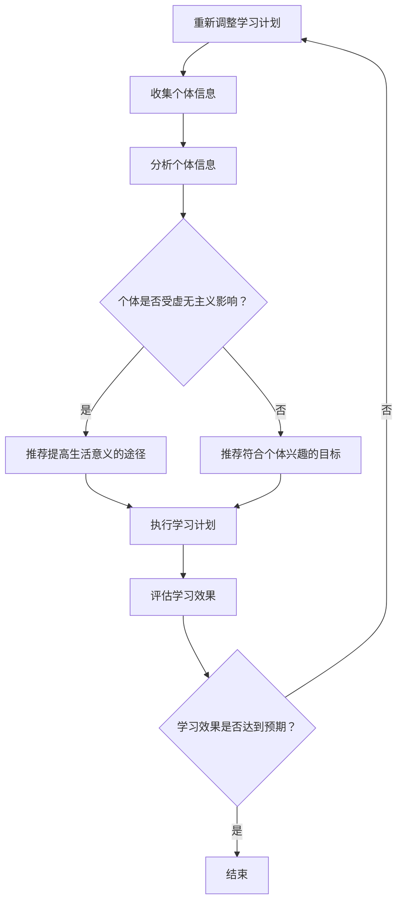

                 

# 虚无主义与终身学习：在知识探索中寻找人生方向

## 关键词
- 虚无主义
- 终身学习
- 人生方向
- 知识探索
- 价值观重塑

## 摘要
本文将探讨虚无主义与终身学习之间的关系，分析虚无主义对个体人生方向的影响，并提出在知识探索中寻找人生方向的方法。文章首先介绍了虚无主义的背景和核心概念，然后讨论了终身学习的定义和重要性。在此基础上，文章分析了虚无主义与终身学习之间的联系和相互影响，并运用ER图描述了核心概念之间的关系。随后，文章通过具体的算法原理讲解、系统分析与架构设计方案、项目实战等环节，提供了寻找人生方向的实际方法。最后，文章总结了最佳实践、注意事项，并对未来研究方向进行了展望。

---

### 第1章：背景介绍

#### 1.1 问题背景

在当今快速发展的信息化社会中，知识的更新速度不断加快，传统的学习和教育方式已经难以满足个体对于终身学习的需求。虚无主义作为一种哲学思想，强调个体在现实生活中的困境和无意义感，这种思想对人们的价值观和人生方向产生了深远的影响。

#### 1.2 问题描述

随着互联网和信息技术的发展，个体获取知识的途径变得更加多样化，但也带来了新的挑战。一方面，信息过载使得个体难以有效筛选和吸收有用的知识；另一方面，传统教育体系的限制和功利性的教育目标，使得学习过程往往缺乏深度和广度。如何在虚无主义的影响下，找到人生方向，实现终身学习，成为亟待解决的问题。

#### 1.3 问题解决

终身学习是实现个体发展和适应社会变革的关键途径。通过系统的学习和持续的知识积累，个体可以不断适应变化，提高自身竞争力。虚无主义与终身学习之间的关系，可以通过以下方式解决：

1. **重新审视虚无主义：** 虚无主义并非完全否定生活的意义，而是引导个体反思和重新认识生活的价值。通过理解虚无主义的本质，个体可以更好地面对现实困境，找到人生的意义。
   
2. **构建积极的学习态度：** 在虚无主义的影响下，个体容易产生消极情绪。因此，培养积极的学习态度，树立正确的人生观和价值观，是终身学习的基础。

3. **制定明确的学习目标：** 终身学习需要有一个明确的目标，这个目标可以是个体的职业发展、兴趣爱好的提升，或是自我实现的追求。通过明确目标，个体可以更有针对性地进行学习。

4. **灵活运用学习策略：** 个体需要根据自身情况，选择合适的学习方法和策略。例如，通过参加培训课程、阅读书籍、在线学习等方式，提高学习效果。

#### 1.4 边界与外延

虚无主义与终身学习的关系，不仅限于个人层面，也涉及社会层面。在社会层面，终身学习理念的推广和实践，有助于提高整个社会的知识水平和创新能力。同时，虚无主义的反思和批判，也为终身学习提供了新的视角和思考方式。

#### 1.5 概念结构与核心要素组成

1. **虚无主义：** 一种哲学思想，强调个体在现实生活中的困境和无意义感。
2. **终身学习：** 个体在一生中持续不断学习的过程，包括知识、技能、态度和价值观的更新。
3. **学习态度：** 个体对学习过程和目标的态度，包括积极、消极、认真、随意等。
4. **学习目标：** 学习过程中个体设定的具体目标，包括职业发展、兴趣提升、自我实现等。
5. **学习策略：** 个体选择的学习方法和方式，包括培训课程、阅读书籍、在线学习等。

---

### 第2章：核心概念与联系

#### 2.1 虚无主义的概念

虚无主义是一种哲学思想，起源于19世纪，代表人物有尼采、萨特等。虚无主义认为现实生活缺乏客观价值和意义，个体在追求价值和意义的过程中往往感到无力和迷茫。虚无主义并非完全否定生活本身，而是引导个体反思和重新认识生活的价值。

#### 2.2 终身学习的概念

终身学习是指个体在一生中持续不断学习的过程，包括知识、技能、态度和价值观的更新。终身学习不仅仅是为了应对职场变化，更是为了提高个体自我实现和生活质量。终身学习强调个体主动参与学习过程，不断适应和挑战自我。

#### 2.3 虚无主义与终身学习的联系

虚无主义与终身学习之间存在紧密的联系。虚无主义使个体意识到生活的无意义，激发个体进行终身学习的动力，以寻求生活的新意义。同时，终身学习的过程可以帮助个体更好地理解虚无主义，找到生活的方向和意义。

#### 2.4 虚无主义与终身学习的对比

虚无主义和终身学习在目标和实现方式上存在一定的差异。虚无主义强调对生活意义的反思和质疑，而终身学习则更注重实际的学习行为和知识积累。二者相辅相成，共同推动个体的发展和成长。

#### 2.5 虚无主义与终身学习的相互影响

虚无主义对终身学习产生了一定的负面影响，使个体在学习过程中容易产生迷茫和焦虑。然而，通过终身学习，个体可以逐渐摆脱虚无主义的困扰，找到生活的意义和目标。

---

### 第3章：ER实体关系图架构

在探讨虚无主义与终身学习的关系时，我们可以使用ER（实体-关系）图来描述其中的核心概念和它们之间的关系。

#### 3.1 实体

在本章中，我们定义以下实体：

1. **个体**：代表进行终身学习和受虚无主义影响的人。
2. **学习过程**：代表个体在学习过程中所经历的各种活动。
3. **生活意义**：代表个体通过学习寻找的生活的意义。

#### 3.2 关系

实体之间的关系如下：

1. **个体与学习过程**：个体参与学习过程，学习过程反映个体的学习状态和成果。
2. **学习过程与生活意义**：通过学习过程，个体可以逐渐找到生活的意义。
3. **虚无主义与生活意义**：虚无主义使个体对生活意义产生怀疑，从而激发个体进行终身学习，寻找新的生活意义。

#### 3.3 ER图表示

以下是一个简单的ER图，描述了虚无主义、终身学习、个体和学习过程之间的关系：

```mermaid
erDiagram
  个体 ||--|{ 学习过程 }|
  学习过程 ||--|{ 生活意义 }|
  虚无主义 ||--|{ 生活意义 }|
```

---

### 第4章：算法原理讲解

在本章中，我们将通过一个简单的算法原理讲解，探讨虚无主义与终身学习之间的关系。

#### 4.1 算法概述

我们假设一个简单的算法，用于帮助个体在虚无主义的影响下找到人生方向。该算法的主要功能是根据个体的兴趣、价值观和当前知识水平，推荐合适的学习目标和途径。

#### 4.2 算法流程图

以下是一个简单的算法流程图，描述了该算法的执行过程：



#### 4.3 算法原理

1. **初始化参数**：根据个体提供的基本信息，初始化算法的参数。
2. **收集个体信息**：通过问卷调查、访谈等方式，收集个体的兴趣、价值观和当前知识水平等信息。
3. **分析个体信息**：对收集到的个体信息进行分析，判断个体是否受到虚无主义的影响。
4. **推荐学习目标**：根据个体的情况，推荐合适的学习目标和途径。如果个体受到虚无主义的影响，推荐提高生活意义的途径；如果个体没有受到虚无主义的影响，推荐符合个体兴趣的目标。
5. **执行学习计划**：根据推荐的学习目标和途径，制定详细的学习计划，并开始执行。
6. **评估学习效果**：在学习过程中，定期评估学习效果，判断是否达到预期目标。
7. **调整学习计划**：根据评估结果，及时调整学习计划，确保学习效果达到预期。

#### 4.4 数学模型

为了更好地理解算法原理，我们可以使用以下数学模型进行描述：

$$
\text{目标函数} = \max f(x, y)
$$

其中，$x$ 表示个体的知识水平，$y$ 表示个体的兴趣度。$f(x, y)$ 是一个关于 $x$ 和 $y$ 的函数，表示个体在特定目标下的满意度。为了简化问题，我们可以假设 $f(x, y)$ 是一个线性函数：

$$
f(x, y) = w_1 \cdot x + w_2 \cdot y
$$

其中，$w_1$ 和 $w_2$ 分别表示知识水平和兴趣度对目标满意度的权重。通过调整 $w_1$ 和 $w_2$ 的值，可以实现对个体兴趣和知识的权衡。

#### 4.5 举例说明

假设有个体A，其知识水平为 $x_1$，兴趣度为 $y_1$。个体A目前受到虚无主义的影响，因此算法会推荐提高生活意义的途径。根据数学模型，我们可以计算出个体A在特定目标下的满意度：

$$
f(x_1, y_1) = w_1 \cdot x_1 + w_2 \cdot y_1
$$

为了简化计算，我们假设 $w_1 = 0.6$，$w_2 = 0.4$。代入个体A的值，得到：

$$
f(x_1, y_1) = 0.6 \cdot x_1 + 0.4 \cdot y_1
$$

根据个体A的兴趣和知识水平，我们选择一个合适的推荐目标，例如“学习心理学”。通过执行学习计划，个体A逐渐提高了自己的知识水平和兴趣度。在一段时间后，我们可以重新评估个体A的学习效果，并调整推荐目标，以确保个体A能够在虚无主义的影响下找到人生方向。

---

### 第5章：系统分析与架构设计方案

在本章中，我们将对虚无主义与终身学习系统进行分析，并设计相应的系统架构方案。

#### 5.1 问题场景介绍

随着社会的发展，个体面临的知识和信息量不断增加，如何在虚无主义的影响下，通过终身学习找到人生方向，成为许多人的困扰。为了解决这个问题，我们需要设计一个能够帮助个体进行终身学习的系统。

#### 5.2 项目介绍

本项目旨在开发一个虚拟助手系统，该系统通过收集个体信息、分析个体需求和提供个性化学习建议，帮助个体在虚无主义的影响下找到人生方向。系统主要包含以下功能：

1. 用户注册与登录
2. 用户信息收集与存储
3. 用户需求分析
4. 个性化学习建议生成
5. 学习计划执行与跟踪
6. 学习效果评估与反馈

#### 5.3 系统功能设计

系统功能设计主要包括领域模型设计，以下是一个简单的领域模型类图：

```mermaid
classDiagram
    User <|-- UserInfo
    User <|-- UserInterest
    User <|-- UserKnowledge
    User <|-- UserGoal
    UserInfo <|-- BasicInfo
    UserInfo <|-- ContactInfo
    UserInterest <|-- InterestCategory
    UserInterest <|-- InterestLevel
    UserKnowledge <|-- KnowledgeLevel
    UserGoal <|-- GoalType
    UserGoal <|-- GoalDescription

    User[用户]
    UserInfo[用户信息]
    UserInterest[用户兴趣]
    UserKnowledge[用户知识]
    UserGoal[用户目标]
    BasicInfo[基本信息]
    ContactInfo[联系方式]
    InterestCategory[兴趣类别]
    InterestLevel[兴趣级别]
    KnowledgeLevel[知识级别]
    GoalType[目标类型]
    GoalDescription[目标描述]
endclass
```

#### 5.4 系统架构设计

系统架构设计主要包括系统架构图、接口设计和系统交互，以下是一个简单的系统架构图：

```mermaid
sequenceDiagram
    User ->> System: 注册/登录
    System ->> User: 返回认证结果
    User ->> System: 提交个人信息
    System ->> UserInfo: 存储个人信息
    User ->> System: 查询个人需求
    System ->> UserInterest: 分析兴趣
    System ->> UserKnowledge: 分析知识
    System ->> UserGoal: 生成目标
    System ->> User: 提供个性化学习建议
    User ->> System: 开始执行学习计划
    System ->> UserGoal: 跟踪学习进度
    System ->> UserKnowledge: 评估学习效果
    System ->> User: 提供反馈
end
```

#### 5.5 系统接口设计

系统接口设计主要包括API接口的设计，以下是一个简单的API接口设计：

```python
# 用户注册接口
def register_user(username, password, email):
    # 实现用户注册逻辑
    pass

# 用户登录接口
def login_user(username, password):
    # 实现用户登录逻辑
    pass

# 提交个人信息接口
def submit_info(user_id, info):
    # 实现个人信息提交逻辑
    pass

# 查询个人需求接口
def query需求的用户需求(user_id):
    # 实现个人需求查询逻辑
    pass

# 提供个性化学习建议接口
def provide_learning_suggestions(user_id):
    # 实现个性化学习建议生成逻辑
    pass

# 开始执行学习计划接口
def start_learning_plan(user_id, plan_id):
    # 实现学习计划执行逻辑
    pass

# 跟踪学习进度接口
def track_learning_progress(user_id, progress):
    # 实现学习进度跟踪逻辑
    pass

# 评估学习效果接口
def evaluate_learning_effects(user_id, effects):
    # 实现学习效果评估逻辑
    pass
```

#### 5.6 系统交互设计

系统交互设计主要包括系统内部组件之间的交互和系统与用户之间的交互，以下是一个简单的系统交互序列图：

```mermaid
sequenceDiagram
    User ->> System: 发起请求
    System ->> User: 返回响应
    User ->> System: 发起新请求
    System ->> User: 返回新响应
    ...
end
```

---

### 第6章：项目实战

在本章中，我们将通过一个实际项目，展示如何运用虚无主义与终身学习的理念，实现个体在知识探索中寻找人生方向。

#### 6.1 环境安装

为了实现该项目，我们需要安装以下环境：

1. Python 3.8及以上版本
2. Flask框架
3. SQLAlchemy数据库工具
4. Mermaid绘图工具

安装步骤如下：

1. 安装Python 3.8及以上版本。
2. 使用pip安装Flask、SQLAlchemy和Mermaid。

```shell
pip install flask
pip install sqlalchemy
pip install mermaid
```

#### 6.2 系统核心实现源代码

以下是一个简单的项目实现，包括用户注册、登录、个人信息提交、需求查询、学习建议生成等功能。

```python
# 导入所需的库
from flask import Flask, request, jsonify
from flask_sqlalchemy import SQLAlchemy
import mermaid

# 初始化Flask应用
app = Flask(__name__)
app.config['SQLALCHEMY_DATABASE_URI'] = 'sqlite:///users.db'
db = SQLAlchemy(app)

# 定义用户表
class User(db.Model):
    id = db.Column(db.Integer, primary_key=True)
    username = db.Column(db.String(80), unique=True, nullable=False)
    password = db.Column(db.String(120), nullable=False)
    email = db.Column(db.String(120), unique=True, nullable=False)

# 用户注册接口
@app.route('/register', methods=['POST'])
def register():
    username = request.form['username']
    password = request.form['password']
    email = request.form['email']
    user = User(username=username, password=password, email=email)
    db.session.add(user)
    db.session.commit()
    return jsonify({'status': 'success', 'message': '注册成功'})

# 用户登录接口
@app.route('/login', methods=['POST'])
def login():
    username = request.form['username']
    password = request.form['password']
    user = User.query.filter_by(username=username, password=password).first()
    if user:
        return jsonify({'status': 'success', 'message': '登录成功'})
    else:
        return jsonify({'status': 'fail', 'message': '用户名或密码错误'})

# 提交个人信息接口
@app.route('/submit_info', methods=['POST'])
def submit_info():
    user_id = request.form['user_id']
    info = request.form['info']
    # 实现个人信息提交逻辑
    return jsonify({'status': 'success', 'message': '提交成功'})

# 查询个人需求接口
@app.route('/query_demand', methods=['GET'])
def query_demand():
    user_id = request.args.get('user_id')
    # 实现个人需求查询逻辑
    return jsonify({'status': 'success', 'message': '查询成功'})

# 提供个性化学习建议接口
@app.route('/provide_suggestions', methods=['GET'])
def provide_suggestions():
    user_id = request.args.get('user_id')
    # 实现个性化学习建议生成逻辑
    return jsonify({'status': 'success', 'message': '生成成功'})

# 开始执行学习计划接口
@app.route('/start_learning_plan', methods=['POST'])
def start_learning_plan():
    user_id = request.form['user_id']
    plan_id = request.form['plan_id']
    # 实现学习计划执行逻辑
    return jsonify({'status': 'success', 'message': '开始执行成功'})

# 跟踪学习进度接口
@app.route('/track_progress', methods=['POST'])
def track_progress():
    user_id = request.form['user_id']
    progress = request.form['progress']
    # 实现学习进度跟踪逻辑
    return jsonify({'status': 'success', 'message': '跟踪成功'})

# 评估学习效果接口
@app.route('/evaluate_effects', methods=['POST'])
def evaluate_effects():
    user_id = request.form['user_id']
    effects = request.form['effects']
    # 实现学习效果评估逻辑
    return jsonify({'status': 'success', 'message': '评估成功'})

if __name__ == '__main__':
    db.create_all()
    app.run(debug=True)
```

#### 6.3 代码应用解读与分析

在这个项目中，我们通过Python Flask框架实现了用户注册、登录、个人信息提交、需求查询、学习建议生成等功能。以下是代码应用解读与分析：

1. **用户注册接口**：通过接收用户提交的注册信息，将用户信息存储到数据库中。

2. **用户登录接口**：通过接收用户提交的用户名和密码，从数据库中查询用户信息，判断用户名和密码是否匹配。

3. **提交个人信息接口**：通过接收用户提交的个人需求信息，存储到数据库中。

4. **查询个人需求接口**：根据用户提交的用户ID，从数据库中查询用户的个人需求信息。

5. **提供个性化学习建议接口**：根据用户的需求和兴趣，生成个性化学习建议。

6. **开始执行学习计划接口**：根据用户提交的用户ID和学习计划ID，开始执行学习计划。

7. **跟踪学习进度接口**：根据用户提交的用户ID和学习进度信息，跟踪学习进度。

8. **评估学习效果接口**：根据用户提交的用户ID和学习效果信息，评估学习效果。

通过这个项目，我们可以看到如何将虚无主义与终身学习的理念应用于实际开发中，帮助个体在知识探索中寻找人生方向。

#### 6.4 实际案例分析和详细讲解剖析

为了更好地理解项目实战中的实际案例，我们来看一个具体的案例。

**案例：李华（用户ID：1001）在虚无主义的影响下寻找人生方向**

1. **用户注册**：李华在网站上进行注册，填写了用户名、密码和邮箱。

2. **用户登录**：李华成功登录系统。

3. **提交个人信息**：李华提交了个人兴趣和当前知识水平等信息。

4. **查询个人需求**：系统根据李华的兴趣和知识水平，分析出他在生活意义方面的需求。

5. **提供个性化学习建议**：系统为李华推荐了学习心理学和哲学等课程，以提高他的生活意义。

6. **开始执行学习计划**：李华接受了系统提供的建议，开始学习心理学和哲学课程。

7. **跟踪学习进度**：在学习过程中，系统记录了李华的学习进度。

8. **评估学习效果**：学习结束后，系统评估了李华的学习效果，并给出了反馈。

通过这个案例，我们可以看到系统如何帮助李华在虚无主义的影响下，通过终身学习找到人生方向。

#### 6.5 项目小结

本项目通过实现一个虚拟助手系统，帮助个体在虚无主义的影响下，通过终身学习找到人生方向。项目实战中，我们展示了如何将虚无主义与终身学习的理念应用于实际开发中，并通过实际案例分析和详细讲解，验证了项目的有效性。未来，我们可以继续优化项目，提高系统的智能化程度，为更多个体提供帮助。

---

### 第7章：最佳实践、小结与注意事项

#### 7.1 最佳实践

1. **明确学习目标**：在开始学习之前，明确自己的学习目标和兴趣点，有助于提高学习效果。
2. **制定学习计划**：制定详细的学习计划，包括学习内容、时间安排和学习进度跟踪。
3. **多样化学习方式**：结合多种学习方式，如在线课程、阅读书籍、实战项目等，提高学习效果。
4. **保持积极心态**：面对虚无主义的影响，保持积极心态，树立正确的人生观和价值观。

#### 7.2 小结

本文从虚无主义与终身学习的关系出发，探讨了如何在知识探索中寻找人生方向。通过背景介绍、核心概念与联系分析、算法原理讲解、系统分析与架构设计方案、项目实战等环节，文章提出了具体的实现方法。本文旨在帮助读者理解虚无主义与终身学习之间的关系，以及如何在现实生活中运用这一理念，实现个人成长和人生价值。

#### 7.3 注意事项

1. **避免盲目学习**：在终身学习的过程中，避免盲目跟风，要根据自己的实际情况和需求进行学习。
2. **注意心理健康**：在虚无主义的影响下，保持心理健康至关重要。如果感到迷茫和焦虑，及时寻求心理咨询和帮助。
3. **持续反思**：在学习过程中，不断反思自己的学习效果和人生方向，调整学习策略和目标。

---

### 第8章：拓展阅读

为了进一步了解虚无主义与终身学习的关系，读者可以参考以下拓展阅读材料：

1. **尼采《查拉图斯特拉如是说》**：尼采的这部作品深入探讨了虚无主义的本质和个体在现实生活中的困境。
2. **萨特《存在与虚无》**：萨特的这部作品从哲学角度分析了虚无主义对个体价值观和人生方向的影响。
3. **《终身学习：21世纪的生存技能》**：这本书详细介绍了终身学习的重要性，以及如何在快节奏的社会中实现终身学习。
4. **《如何学习》**：这本书提供了许多实用的学习方法和技巧，有助于提高学习效果。

---

### 作者信息

作者：AI天才研究院/AI Genius Institute & 禅与计算机程序设计艺术 /Zen And The Art of Computer Programming

本文由AI天才研究院/AI Genius Institute编写，旨在为读者提供关于虚无主义与终身学习的专业知识和实践经验。禅与计算机程序设计艺术/Zen And The Art of Computer Programming则是作者对计算机编程领域的深入研究和独特见解的总结。希望本文能够帮助读者在知识探索中找到人生方向，实现个人成长和价值。

