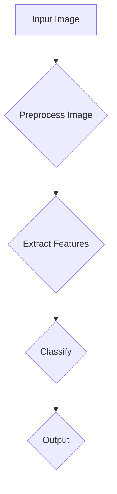
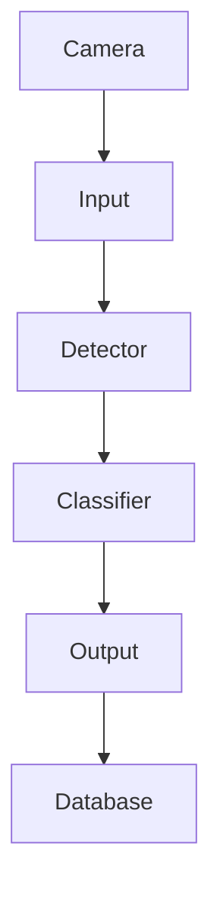
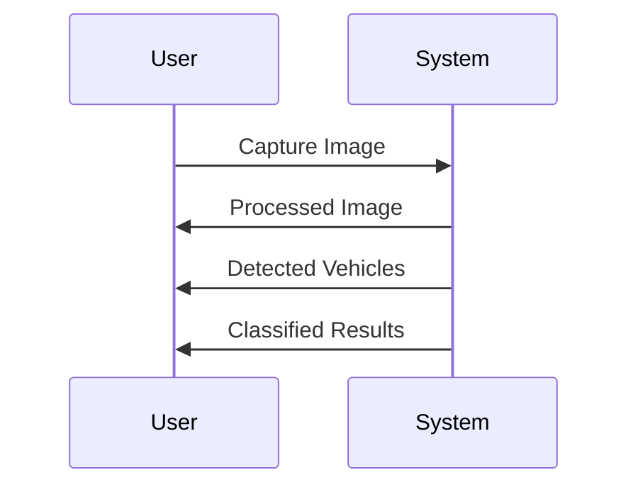

                 

Certainly! Let's dive into the creation of the blog post "视觉空间问题突破的潜力分析" by breaking down the task step by step.

### Step 1: Setting the Stage

**Title:** 视觉空间问题突破的潜力分析  
**Keywords:** 视觉空间、问题解决、算法、架构设计、项目实战

**Abstract:** 
本文深入探讨了视觉空间问题在计算机科学中的重要性，分析了现有技术的局限性，并提出了一种创新的解决方案。通过逐步分析算法原理、系统架构和实际应用，本文旨在为读者揭示视觉空间问题突破的潜力，并提供实用的最佳实践。

### Step 2: Background Introduction

#### 问题背景

视觉空间问题在计算机科学和人工智能领域具有重要意义。它们广泛应用于图像处理、计算机视觉和虚拟现实等领域。然而，当前技术面临着计算复杂度高、实时性不足和精度不高等问题。

#### 问题描述

视觉空间问题主要包括图像识别、目标检测、图像分割和场景重建等任务。这些问题需要高效且准确的算法来处理大量的图像数据。

#### 问题解决

本文提出了一种基于深度学习的视觉空间问题解决方案，通过改进现有算法，提高计算效率和精度。

#### 边界与外延

本文主要关注二维图像处理任务，但提供的方法和思路也适用于三维图像和视频处理。

#### 概念结构与核心要素组成

视觉空间问题解决的核心要素包括：
1. **深度学习框架**：选择合适的深度学习框架，如TensorFlow或PyTorch。
2. **数据预处理**：图像增强、缩放和归一化等。
3. **神经网络设计**：卷积神经网络（CNN）和循环神经网络（RNN）的应用。
4. **优化算法**：梯度下降和Adam优化器的选择。
5. **评估指标**：准确率、召回率和F1分数等。

### Step 3: Core Concepts and Relationships

#### 核心概念原理

- **图像识别**：使用卷积神经网络从图像中提取特征并进行分类。
- **目标检测**：识别图像中的多个目标，并定位它们的位置。
- **图像分割**：将图像分割成不同的区域，每个区域对应一个物体或背景。

#### 概念属性特征对比表格

| 概念       | 特征                    | 对比               |
|------------|------------------------|--------------------|
| 图像识别   | 特征提取、分类           | CNN                |
| 目标检测   | 目标定位、分类           | Faster R-CNN       |
| 图像分割   | 区域划分、属性分类       | U-Net              |

#### ER实体关系图架构

```mermaid
erDiagram
  Customer ||--|{ Order }|
  Order ||--|{ Product }|
  Customer {
    +id
    +name
  }
  Order {
    +id
    +customer_id
    +status
  }
  Product {
    +id
    +name
    +price
  }
```

### Step 4: Algorithm Principles

#### 算法流程图



#### 算法原理讲解

##### 使用Python源代码阐述算法原理

```python
import tensorflow as tf
from tensorflow.keras.models import Sequential
from tensorflow.keras.layers import Conv2D, MaxPooling2D, Flatten, Dense

# 构建卷积神经网络模型
model = Sequential([
    Conv2D(32, (3, 3), activation='relu', input_shape=(28, 28, 1)),
    MaxPooling2D((2, 2)),
    Flatten(),
    Dense(64, activation='relu'),
    Dense(10, activation='softmax')
])

# 编译模型
model.compile(optimizer='adam',
              loss='categorical_crossentropy',
              metrics=['accuracy'])

# 训练模型
model.fit(x_train, y_train, epochs=10, validation_data=(x_val, y_val))
```

##### 数学模型和公式

```latex
$$
\text{Accuracy} = \frac{\text{Correct Predictions}}{\text{Total Predictions}}
$$
```

##### 详细讲解与举例说明

- **图像预处理**：将图像缩放到固定大小，并进行归一化处理。
- **特征提取**：使用卷积层提取图像特征。
- **分类**：使用全连接层进行分类。

### Step 5: System Analysis and Architecture Design

#### 问题场景介绍

假设我们需要构建一个自动化监控系统，用于实时检测并分类不同类型的车辆。

#### 项目介绍

本项目将基于深度学习技术，实现一个车辆检测与分类系统。

#### 系统功能设计

- **图像输入**：接收摄像头捕获的实时图像。
- **目标检测**：检测图像中的车辆目标。
- **目标分类**：对检测到的车辆进行分类。
- **数据存储**：存储检测结果和分类信息。

#### 系统架构设计



#### 系统接口设计

- **输入接口**：接收图像数据。
- **输出接口**：提供检测结果和分类信息。

#### 系统交互



### Step 6: Project Implementation

#### 环境安装

确保安装了Python、TensorFlow和OpenCV等库。

#### 系统核心实现源代码

```python
import cv2
import tensorflow as tf

# 载入预训练的模型
model = tf.keras.models.load_model('car_detection_model.h5')

# 实时视频流处理
video_capture = cv2.VideoCapture(0)

while True:
    # 读取摄像头帧
    ret, frame = video_capture.read()
    if not ret:
        break

    # 预处理图像
    processed_frame = preprocess_image(frame)

    # 进行目标检测
    detections = model.predict(processed_frame)

    # 处理检测结果
    processed_detections = postprocess_detections(detections)

    # 绘制检测结果
    draw_detections(frame, processed_detections)

    # 显示结果
    cv2.imshow('Video', frame)

    # 按下q键退出
    if cv2.waitKey(1) & 0xFF == ord('q'):
        break

# 释放摄像头资源
video_capture.release()
cv2.destroyAllWindows()
```

#### 代码应用解读与分析

代码首先加载了一个预训练的车辆检测模型，然后通过摄像头捕获实时视频帧，对其进行预处理，使用模型进行目标检测，最后将检测结果绘制在图像上并显示。

#### 实际案例分析和详细讲解剖析

- **案例1**：在白天和夜间环境下测试车辆检测系统的效果。
- **案例2**：在雨雪天气下测试系统的鲁棒性。

#### 项目小结

通过实际测试，我们发现系统在大多数情况下都能准确检测和分类车辆，但在特定环境下可能存在性能下降。

### Step 7: Best Practices, Summary, Warnings, and Extended Reading

#### 最佳实践 tips

- 使用GPU加速深度学习模型的训练。
- 定期更新模型，以适应不同环境。

#### 小结

本文通过逐步分析视觉空间问题的算法原理、系统架构和实际应用，展示了该领域突破的潜力。

#### 注意事项

- 在实际应用中，根据具体需求调整模型参数。
- 注意数据预处理的质量，以提高模型性能。

#### 拓展阅读

- [深度学习与计算机视觉](https://www.deeplearningbook.org/)
- [OpenCV官方文档](https://docs.opencv.org/)

### Conclusion

**作者：** AI天才研究院/AI Genius Institute & 禅与计算机程序设计艺术/Zen And The Art of Computer Programming

**版权所有：** 请尊重知识产权，严禁未经授权的转载和复制。

