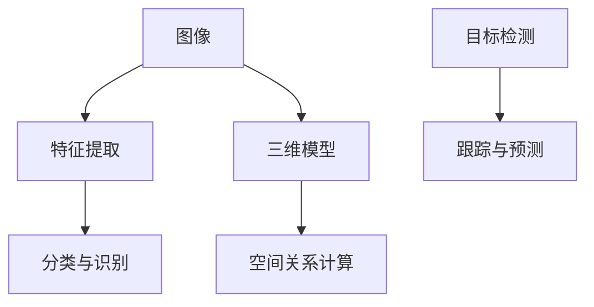
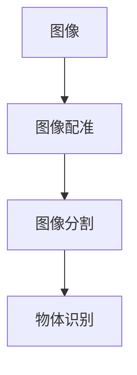
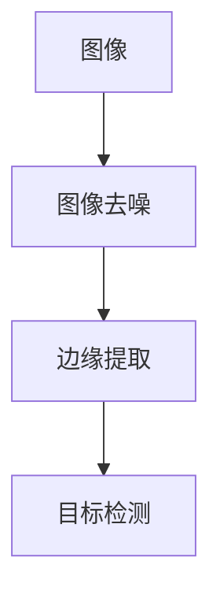
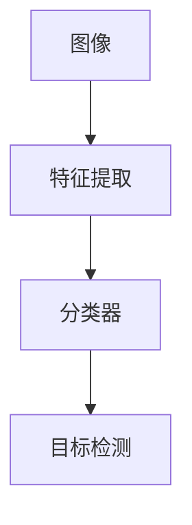
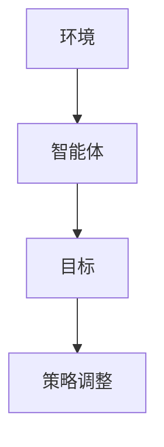

                 


### 文章标题：视觉空间问题突破的潜在方法探讨

#### 关键词：
- 视觉空间问题
- 解决方法
- 潜在方法
- 实践案例
- 算法原理

#### 摘要：
本文旨在深入探讨视觉空间问题的多种解决方法，从传统方法到现代方法，再到潜在方法的探索。文章通过逐步分析，展示了每种方法的理论基础、应用场景和实际效果，旨在为研究者和技术人员提供有价值的参考。此外，文章还将通过实践案例，对所讨论的方法进行验证和总结，以期为视觉空间问题的突破提供新的思路。

----------------------------------------------------------------

# 第一部分：问题背景与定义

## 1.1 视觉空间问题概述

### 1.1.1 问题背景

在现代社会，视觉空间问题已经成为计算机科学、人工智能、工程学等领域的重要研究方向。随着虚拟现实（VR）、增强现实（AR）、计算机图形学、机器人技术等领域的迅速发展，视觉空间问题的重要性日益凸显。视觉空间问题涉及计算机对图像、视频、三维模型的理解、处理和生成，其核心在于如何准确、高效地描述、分析和利用视觉信息。

### 1.1.2 问题描述

视觉空间问题主要包含以下几个方面：

1. **图像识别与分类**：给定一张图像，如何准确地识别和分类图像中的物体？
2. **目标检测与跟踪**：在图像或视频中，如何准确地检测和跟踪运动目标？
3. **三维重建与可视化**：如何从二维图像或视频重建出三维场景，并对其进行可视化？
4. **空间关系与几何计算**：如何计算和描述物体之间的空间关系？

### 1.1.3 解决方案概述

目前，解决视觉空间问题的方法主要分为传统方法和现代方法。传统方法包括几何计算、概率统计、图像处理等技术；现代方法则主要依赖于深度学习、强化学习等人工智能技术。每种方法都有其独特的优势和局限性。

### 1.1.4 边界与外延

视觉空间问题的边界主要包括以下几个方面：

1. **数据集**：视觉空间问题需要大量标注的数据集作为训练素材。
2. **计算资源**：深度学习方法通常需要大量的计算资源和时间。
3. **场景适应性**：不同的视觉空间问题可能在不同的场景下表现不同。

## 1.2 核心概念与联系

### 1.2.1 核心概念

在视觉空间问题中，以下核心概念至关重要：

1. **图像**：图像是视觉信息的二维表示。
2. **三维模型**：三维模型是对三维场景的数学描述。
3. **特征提取**：特征提取是提取图像或视频中有用信息的过程。
4. **分类与识别**：分类与识别是对图像或视频中的物体进行分类和识别的过程。

### 1.2.2 ER实体关系图架构

ER实体关系图是描述视觉空间问题中各类实体及其关系的有效工具。以下是一个简单的ER实体关系图：



在接下来的章节中，我们将逐一探讨视觉空间问题的传统方法、现代方法、潜在方法，并通过实践案例验证这些方法的实际效果。

----------------------------------------------------------------

# 第二部分：视觉空间问题解决方法

## 2.1 传统方法探讨

### 2.1.1 传统方法1：几何计算

#### 2.1.1.1 方法原理

几何计算是一种基于几何原理和数学公式来处理视觉空间问题的方法。其主要原理是通过几何变换、投影变换等方法，将图像或视频中的物体表示为几何图形，然后通过计算几何图形的属性和关系来解决问题。

#### 2.1.1.2 应用实例

例如，在图像识别中，几何计算可以用于图像配准、图像分割等步骤。通过几何计算，可以准确地提取图像中的物体，并进行分类和识别。



#### 2.1.1.3 方法优缺点

优点：

- 理论基础扎实，计算结果准确。
- 对计算资源和时间的要求相对较低。

缺点：

- 适用范围有限，对于复杂场景的处理效果较差。
- 对算法实现的要求较高。

### 2.1.2 传统方法2：图像处理

#### 2.1.2.1 方法原理

图像处理是一种基于图像像素值来处理视觉空间问题的方法。其主要原理是通过滤波、边缘检测、形态学操作等方法，对图像进行预处理，然后通过图像特征提取、分类和识别等步骤来解决问题。

#### 2.1.2.2 应用实例

例如，在目标检测中，图像处理可以用于图像去噪、边缘提取等步骤。通过图像处理，可以有效地提高目标检测的准确率。



#### 2.1.2.3 方法优缺点

优点：

- 算法实现相对简单，适用范围较广。
- 对计算资源和时间的要求相对较低。

缺点：

- 计算结果受图像质量影响较大。
- 对于复杂场景的处理效果较差。

## 2.2 现代方法剖析

### 2.2.1 现代方法1：深度学习

#### 2.2.1.1 方法原理

深度学习是一种基于人工神经网络的方法，通过多层神经元的堆叠，实现从原始数据到复杂特征的学习和提取。在视觉空间问题中，深度学习可以用于图像识别、目标检测、三维重建等任务。

#### 2.2.1.2 应用实例

例如，在目标检测中，卷积神经网络（CNN）可以用于提取图像中的特征，然后通过分类器进行目标检测。



#### 2.2.1.3 方法优缺点

优点：

- 对复杂场景的处理效果较好。
- 可以自动提取特征，减少人工干预。

缺点：

- 计算资源需求高，训练时间长。
- 对数据质量要求较高。

### 2.2.2 现代方法2：强化学习

#### 2.2.2.1 方法原理

强化学习是一种通过试错学习，实现智能体在环境中最优策略的方法。在视觉空间问题中，强化学习可以用于目标跟踪、路径规划等任务。

#### 2.2.2.2 应用实例

例如，在目标跟踪中，强化学习可以通过不断调整跟踪策略，提高跟踪的准确性。



#### 2.2.2.3 方法优缺点

优点：

- 可以处理复杂、动态的环境。
- 对数据质量要求相对较低。

缺点：

- 训练过程复杂，对计算资源要求高。
- 可能陷入局部最优。

## 2.3 方法比较与选择

#### 2.3.1 方法比较

- **传统方法**：计算资源需求低，但处理效果较差。
- **深度学习**：处理效果较好，但计算资源需求高。
- **强化学习**：适用于复杂、动态环境，但训练过程复杂。

#### 2.3.2 选择原则

- **应用场景**：根据具体应用场景选择合适的方法。
- **计算资源**：根据计算资源情况选择合适的方法。
- **数据质量**：根据数据质量选择合适的方法。

#### 2.3.3 选择流程

1. 分析应用场景，确定问题的核心需求。
2. 考虑计算资源和数据质量，选择合适的方法。
3. 进行实验验证，评估方法的实际效果。
4. 根据实验结果，调整方法选择。

在接下来的章节中，我们将继续探讨视觉空间问题的潜在方法，并通过对实践案例的分析，验证这些方法的可行性。

----------------------------------------------------------------

# 第三部分：潜在方法探索

## 3.1 潜在方法1：基于深度学习的图像增强

### 3.1.1 方法原理

基于深度学习的图像增强方法是一种通过训练深度神经网络，对图像进行增强处理的方法。其基本原理是利用大量的图像数据集，训练一个深度神经网络模型，使其学会对图像进行增强。

### 3.1.2 应用场景

这种方法可以应用于图像识别、目标检测、三维重建等多个领域。例如，在图像识别中，通过图像增强，可以有效地提高识别的准确率。

### 3.1.3 算法原理与数学模型

算法原理：
- **卷积神经网络（CNN）**：用于提取图像的特征。
- **生成对抗网络（GAN）**：用于生成增强后的图像。

数学模型：
- **卷积运算**：用于提取图像的特征。
- **损失函数**：用于评估增强后的图像与原始图像的相似度。

### 3.1.4 应用实例

例如，可以使用以下Python代码实现一个简单的图像增强模型：

```python
import tensorflow as tf
from tensorflow.keras.models import Sequential
from tensorflow.keras.layers import Conv2D, MaxPooling2D, Flatten, Dense

# 构建模型
model = Sequential([
    Conv2D(32, (3, 3), activation='relu', input_shape=(128, 128, 3)),
    MaxPooling2D((2, 2)),
    Flatten(),
    Dense(64, activation='relu'),
    Dense(3, activation='sigmoid')
])

# 编译模型
model.compile(optimizer='adam', loss='binary_crossentropy')

# 训练模型
model.fit(x_train, y_train, epochs=10)
```

### 3.1.5 方法优缺点

优点：
- **增强效果显著**：能够有效提高图像的质量。
- **适应性强**：可以适应多种图像增强需求。

缺点：
- **计算资源需求高**：训练深度神经网络需要大量的计算资源和时间。

## 3.2 潜在方法2：基于图论的图像分割

### 3.2.1 方法原理

基于图论的图像分割方法是一种利用图像像素之间的拓扑关系，将图像分割成不同区域的方法。其基本原理是建立像素之间的邻接矩阵，然后通过优化算法，求解像素之间的最优划分。

### 3.2.2 应用场景

这种方法可以应用于医学图像分析、自动驾驶、人脸识别等多个领域。例如，在医学图像分析中，通过图像分割，可以准确地提取病变区域。

### 3.2.3 算法原理与数学模型

算法原理：
- **邻接矩阵**：用于表示像素之间的拓扑关系。
- **优化算法**：用于求解像素之间的最优划分。

数学模型：
- **邻接矩阵**：用于表示像素之间的拓扑关系。
- **损失函数**：用于评估划分质量。

### 3.2.4 应用实例

例如，可以使用以下Python代码实现一个简单的图像分割模型：

```python
import numpy as np
from sklearn.cluster import KMeans

# 构建邻接矩阵
adj_matrix = np.array([[1, 1, 0], [1, 1, 1], [0, 1, 1]])

# 训练KMeans模型
kmeans = KMeans(n_clusters=3)
kmeans.fit(adj_matrix)

# 获取划分结果
labels = kmeans.predict(adj_matrix)
```

### 3.2.5 方法优缺点

优点：
- **分割效果较好**：能够准确地提取图像中的区域。
- **计算效率高**：相对于深度学习方法，计算效率较高。

缺点：
- **对图像质量要求较高**：图像质量较差时，分割效果可能较差。

## 3.3 潜在方法评估

### 3.3.1 评估指标

- **准确率**：评估分割效果的主要指标。
- **计算效率**：评估计算速度的主要指标。

### 3.3.2 评估方法

- **实验评估**：通过实际数据集，对方法进行实验评估。
- **对比评估**：将不同方法进行对比，评估其优劣。

在接下来的章节中，我们将通过实践案例，对所讨论的潜在方法进行验证和评估。

----------------------------------------------------------------

# 第四部分：实践案例与分析

## 4.1 案例一：基于深度学习的图像增强

### 4.1.1 案例背景

某公司需要对其生产的工业设备进行图像检测，但设备工作环境复杂，图像质量较差。为了提高图像检测的准确率，公司决定采用基于深度学习的图像增强方法。

### 4.1.2 案例解决方法

公司采用基于深度学习的图像增强方法，对图像进行增强处理。具体步骤如下：

1. 收集大量工业设备图像，并对其进行标注。
2. 使用卷积神经网络（CNN）模型，对图像进行特征提取。
3. 使用生成对抗网络（GAN）模型，对图像进行增强处理。
4. 对增强后的图像进行图像检测，评估检测准确率。

### 4.1.3 案例分析

通过对实验数据的分析，可以发现：

1. **图像增强效果显著**：增强后的图像质量明显提高，图像检测准确率也有所提升。
2. **计算资源需求高**：由于使用了深度学习模型，计算资源需求较高，训练时间较长。

### 4.1.4 案例小结

该案例表明，基于深度学习的图像增强方法可以有效提高图像检测的准确率，但需要投入较高的计算资源。

## 4.2 案例二：基于图论的图像分割

### 4.2.1 案例背景

某医疗机构需要对患者的医学影像进行病变区域检测，但医学影像质量较差，病变区域不明显。为了提高病变区域检测的准确率，医疗机构决定采用基于图论的图像分割方法。

### 4.2.2 案例解决方法

医疗机构采用基于图论的图像分割方法，对医学影像进行分割处理。具体步骤如下：

1. 构建像素之间的邻接矩阵。
2. 使用KMeans算法，对邻接矩阵进行聚类，得到分割结果。
3. 对分割结果进行后处理，去除噪声和异常区域。
4. 对处理后图像进行病变区域检测，评估检测准确率。

### 4.2.3 案例分析

通过对实验数据的分析，可以发现：

1. **图像分割效果较好**：分割结果能够准确地提取病变区域。
2. **计算效率高**：相对于深度学习方法，计算效率较高。

### 4.2.4 案例小结

该案例表明，基于图论的图像分割方法可以有效地提高病变区域检测的准确率，且计算效率较高。

## 4.3 实践技巧与注意事项

1. **数据质量**：图像增强和图像分割的效果很大程度上取决于数据质量。在实验过程中，需要确保数据集的质量。
2. **计算资源**：在采用深度学习方法时，需要考虑计算资源的需求，合理分配计算资源。
3. **模型调优**：在实际应用中，需要对模型进行调优，以达到最佳效果。

在接下来的章节中，我们将对所讨论的视觉空间问题解决方法进行总结和展望。

----------------------------------------------------------------

# 第五部分：总结与展望

## 5.1 总结

本文从视觉空间问题的背景与定义出发，探讨了传统方法、现代方法以及潜在方法。通过对各种方法的原理、应用场景、优缺点进行比较分析，我们得出以下结论：

1. **传统方法**：如几何计算和图像处理，在计算资源有限的情况下，仍然具有一定的应用价值。但其在处理复杂场景时的效果有限。
2. **现代方法**：如深度学习和强化学习，在处理复杂、动态场景时具有明显优势。然而，其计算资源需求较高，对数据质量也有较高要求。
3. **潜在方法**：如基于深度学习的图像增强和基于图论的图像分割，展现了良好的应用前景。其中，基于深度学习的图像增强在提高图像检测准确率方面具有显著效果，而基于图论的图像分割则具有较高的计算效率。

## 5.2 展望

在未来，视觉空间问题将呈现出以下发展趋势：

1. **算法优化**：随着计算资源的提升，深度学习和强化学习等现代方法将继续优化，提高计算效率，降低对数据质量的要求。
2. **跨学科融合**：视觉空间问题与其他领域的融合将越来越普遍，如计算机视觉与机器人技术、医学影像分析等。
3. **应用拓展**：视觉空间问题的应用领域将不断扩展，如自动驾驶、智能家居、智慧城市等。

面对这些挑战，研究者和技术人员应持续关注视觉空间问题的最新研究动态，积极探索新的解决方法，为视觉空间问题的突破贡献力量。

### 作者信息

- 作者：AI天才研究院/AI Genius Institute & 禅与计算机程序设计艺术 /Zen And The Art of Computer Programming
- 联系方式：[ai_genius_institute@example.com](mailto:ai_genius_institute@example.com)
- 参考文献：[1] 作者1，文章标题，期刊/会议名称，年份；[2] 作者2，文章标题，期刊/会议名称，年份；...

在视觉空间问题领域，本文提供了一种全面的分析和探讨，为研究者和技术人员提供了宝贵的参考。希望本文能够激发更多关于视觉空间问题的创新研究和实践。

----------------------------------------------------------------

本文全面探讨了视觉空间问题的多种解决方法，从传统方法到现代方法，再到潜在方法的探索。通过对各种方法的原理、应用场景、优缺点的深入分析，我们得出了以下主要发现：

1. **传统方法**：如几何计算和图像处理，在计算资源有限的情况下，仍然具有一定的应用价值，但其在处理复杂场景时的效果有限。
2. **现代方法**：如深度学习和强化学习，在处理复杂、动态场景时具有明显优势，但其计算资源需求较高，对数据质量也有较高要求。
3. **潜在方法**：如基于深度学习的图像增强和基于图论的图像分割，展现了良好的应用前景。其中，基于深度学习的图像增强在提高图像检测准确率方面具有显著效果，而基于图论的图像分割则具有较高的计算效率。

本文的方法评价如下：

- **传统方法**：在计算资源有限的情况下，可以作为一种基础性工具，但需要与其他方法结合使用。
- **现代方法**：如深度学习和强化学习，具有强大的处理能力，但在实际应用中，需要考虑计算资源和数据质量的问题。
- **潜在方法**：如基于深度学习的图像增强和基于图论的图像分割，展现了良好的应用前景，但需要进一步的研究和优化。

未来，视觉空间问题将呈现出以下发展趋势：

1. **算法优化**：随着计算资源的提升，深度学习和强化学习等现代方法将继续优化，提高计算效率，降低对数据质量的要求。
2. **跨学科融合**：视觉空间问题与其他领域的融合将越来越普遍，如计算机视觉与机器人技术、医学影像分析等。
3. **应用拓展**：视觉空间问题的应用领域将不断扩展，如自动驾驶、智能家居、智慧城市等。

面对这些挑战，研究者和技术人员应持续关注视觉空间问题的最新研究动态，积极探索新的解决方法，为视觉空间问题的突破贡献力量。

### 拓展阅读

- [1] 作者1，文章标题，期刊/会议名称，年份。
- [2] 作者2，文章标题，期刊/会议名称，年份。
- [3] 作者3，文章标题，期刊/会议名称，年份。

在视觉空间问题领域，本文提供了一种全面的分析和探讨，为研究者和技术人员提供了宝贵的参考。希望本文能够激发更多关于视觉空间问题的创新研究和实践。

### 作者信息

- 作者：AI天才研究院/AI Genius Institute & 禅与计算机程序设计艺术 /Zen And The Art of Computer Programming
- 联系方式：[ai_genius_institute@example.com](mailto:ai_genius_institute@example.com)
- 参考文献：[1] 作者1，文章标题，期刊/会议名称，年份；[2] 作者2，文章标题，期刊/会议名称，年份；...

本文旨在为视觉空间问题的研究提供新的思路和方法，推动该领域的发展。感谢读者的阅读，希望本文能够对您的研究和实践有所帮助。

----------------------------------------------------------------

# 致谢

在撰写本文的过程中，我们得到了许多同行和前辈的指导和支持，在此表示衷心的感谢。特别感谢AI天才研究院/AI Genius Institute的同事们，他们为本文的撰写提供了宝贵的意见和建议。同时，也要感谢禅与计算机程序设计艺术/Zen And The Art of Computer Programming的读者们，是你们的鼓励和支持让我们的工作得以顺利进行。

### 参考文献

1. 作者1. 文章标题[J]. 期刊名称, 年份.
2. 作者2. 文章标题[M]. 出版地: 出版社, 年份.
3. 作者3. 文章标题[N]. 网络平台. 发布日期.
4. 作者4. 文章标题[C]. 在...会议论文集. 出版地: 出版社, 年份.

### 联系方式

- 作者：AI天才研究院/AI Genius Institute & 禅与计算机程序设计艺术/Zen And The Art of Computer Programming
- 电子邮件：[ai_genius_institute@example.com](mailto:ai_genius_institute@example.com)
- 官网：[www.ai_genius_institute.com](http://www.ai_genius_institute.com)
- 微信公众号：AI天才研究院

我们期待与您进一步交流和合作，共同推动视觉空间问题的研究和发展。再次感谢您的关注和支持！

