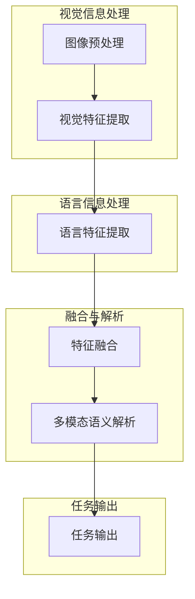
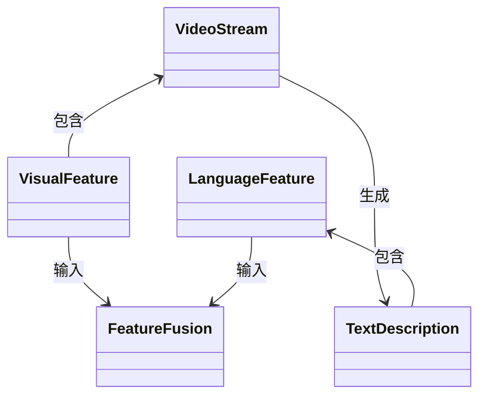
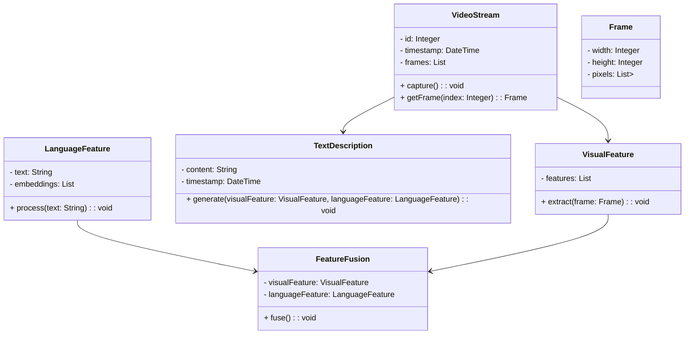
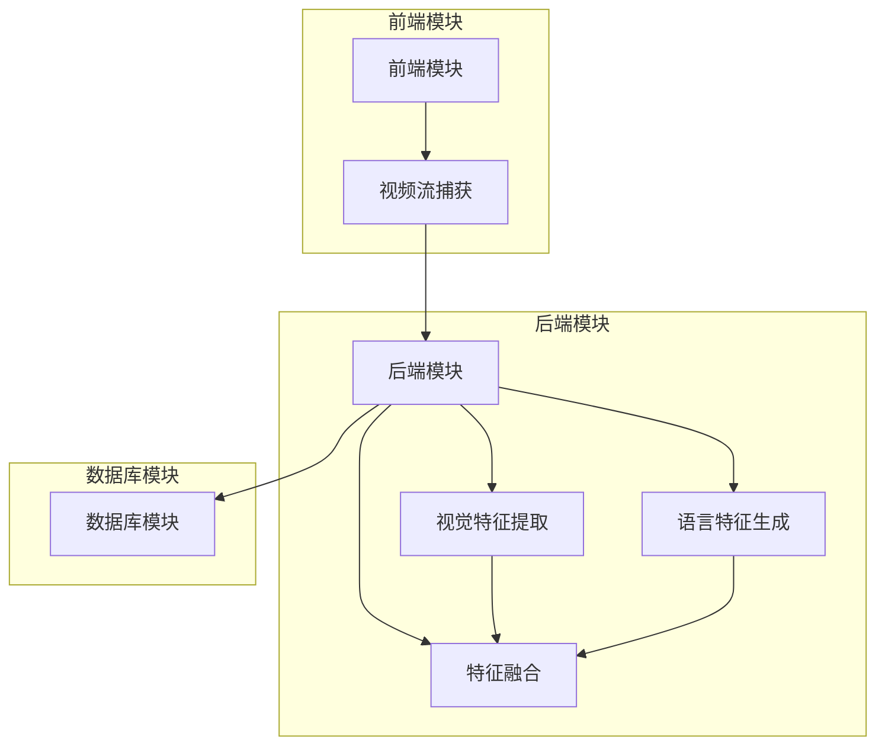
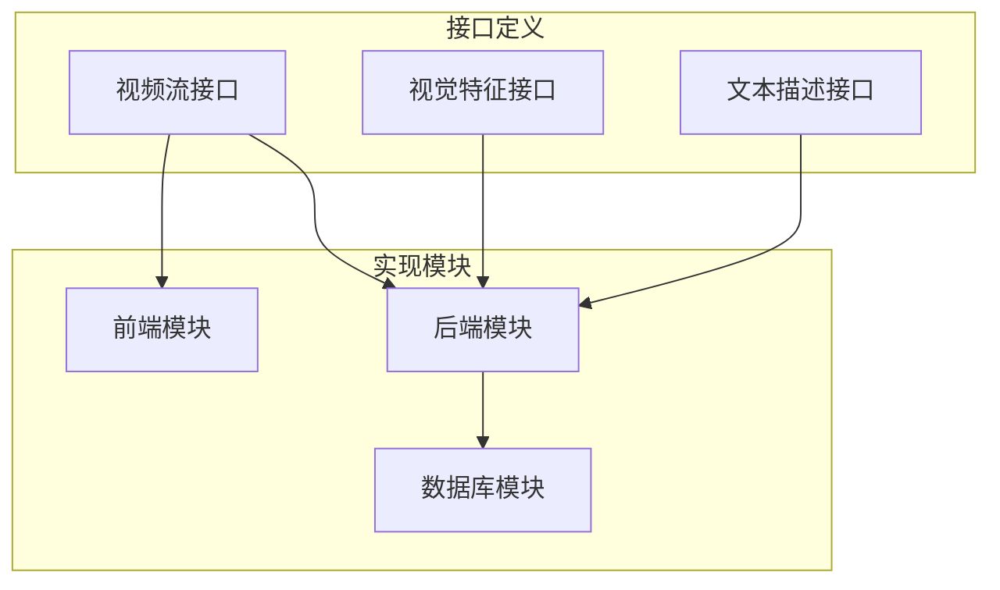
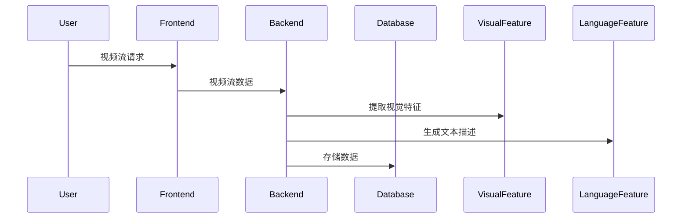

                 


# 第1章 问题背景与概述

## 1.1 视觉语言融合的兴起

### 视觉语言融合的背景

随着人工智能技术的迅猛发展，计算机视觉和自然语言处理（NLP）成为了两大热门领域。计算机视觉专注于理解和解释图像和视频中的视觉信息，而自然语言处理则致力于理解和生成人类语言。尽管这两个领域各自取得了显著的进展，但它们在处理复杂任务时仍存在一定的局限性。

例如，计算机视觉系统可以准确地识别图像中的物体，但它们通常无法理解图像中的语言信息，如标签、说明或情感。同样，NLP系统可以生成流畅的文本，但它们通常无法理解图像中的视觉信息。这种局限性限制了人工智能在许多实际应用中的潜力。

### 视觉语言融合的需求

为了克服这些局限性，研究者们提出了视觉语言融合的概念。视觉语言融合旨在将视觉信息和语言信息结合起来，以实现更智能、更全面的计算机理解能力。例如，通过视觉语言融合技术，我们可以让一个系统同时理解图像中的视觉内容和文本描述，从而更准确地回答关于图像的问题。

这种技术不仅在学术研究中具有重要价值，也在许多实际应用中具有广泛的前景。例如，在医疗领域，视觉语言融合可以帮助医生通过图像和病历信息的融合，更准确地诊断病情；在自动驾驶领域，视觉语言融合可以提高车辆的自主导航能力，使其更好地理解道路标志和交通信号。

### 视觉语言融合的应用场景

视觉语言融合的应用场景非常广泛，包括但不限于以下几类：

1. **图像描述生成**：利用视觉语言融合技术，可以自动生成图像的描述文本，为图像内容提供更加详细的解释。
2. **视觉问答**：通过结合图像和文本信息，视觉语言融合技术可以回答关于图像的问题，如“这张图片中有几个人？”或“他们在做什么？”
3. **视觉对话系统**：结合视觉信息和语言信息，可以开发出更加智能的对话系统，使机器能够更好地理解用户的意图和需求。
4. **视频字幕生成**：通过视觉语言融合技术，可以自动生成视频字幕，提高视频的可访问性和理解度。

### 总结

视觉语言融合的兴起不仅是为了弥补计算机视觉和自然语言处理之间的鸿沟，也是为了推动人工智能技术在更广泛领域的应用。通过将视觉和语言信息结合起来，我们可以实现更加智能和灵活的计算机理解能力，从而为人类带来更多的便利和创新。

## 1.2 AI在视觉与语言处理中的应用

### AI在计算机视觉中的应用

人工智能在计算机视觉领域已经取得了显著的进展，主要得益于深度学习技术的广泛应用。卷积神经网络（CNN）是计算机视觉中的核心算法，通过多层卷积和池化操作，CNN能够提取图像中的高维特征，从而实现图像分类、物体检测和图像分割等任务。

- **图像分类**：CNN可以训练模型对图像进行分类，例如ImageNet竞赛中，通过CNN模型可以将数百万张图像分类到成千上万的类别中。
- **物体检测**：基于CNN的物体检测算法，如YOLO（You Only Look Once）和SSD（Single Shot MultiBox Detector），可以在一幅图像中同时检测多个物体，并给出它们的位置和类别。
- **图像分割**：图像分割是将图像划分为多个区域，每个区域对应不同的物体或背景。基于深度学习的图像分割算法，如FCN（Fully Convolutional Network）和U-Net，已经在医疗影像分析、自动驾驶等领域取得了广泛应用。

### AI在自然语言处理中的应用

自然语言处理（NLP）是人工智能的另一重要领域，近年来，通过深度学习技术的引入，NLP取得了显著的进展。RNN（递归神经网络）和Transformer模型是NLP中的两种核心算法。

- **RNN**：RNN通过其循环结构，能够处理序列数据，例如文本。RNN在语言建模、机器翻译、文本生成等领域表现出色。然而，RNN在处理长序列时存在梯度消失和梯度爆炸问题，限制了其性能。
- **Transformer模型**：Transformer模型通过自注意力机制，使得模型在处理长序列时表现出色。Transformer模型在机器翻译、文本生成、问答系统等领域取得了突破性进展，其代表性的模型包括BERT（Bidirectional Encoder Representations from Transformers）和GPT（Generative Pre-trained Transformer）。

### AI在视觉语言融合中的应用

视觉语言融合是将计算机视觉和自然语言处理技术结合起来，以实现更智能的计算机理解能力。在视觉语言融合中，常用的方法包括图像描述生成、视觉问答和视觉对话系统。

- **图像描述生成**：图像描述生成是指自动生成图像的描述文本。通过结合CNN和RNN或Transformer模型，可以将图像中的视觉信息转换为自然语言描述。例如，VGG16（卷积神经网络）可以提取图像特征，而GPT（Transformer模型）可以生成图像描述文本。
- **视觉问答**：视觉问答是指利用图像和文本信息回答关于图像的问题。通过将CNN和Transformer模型结合起来，可以实现更准确的视觉问答。例如，一个图像中可能包含多个物体，通过结合视觉信息和文本描述，可以回答关于这些物体的问题，如“这张图片中有几个人？”或“他们在做什么？”
- **视觉对话系统**：视觉对话系统是指结合视觉信息和自然语言处理技术，实现人与机器的智能对话。通过结合CNN和Transformer模型，可以开发出更加智能的视觉对话系统，使机器能够更好地理解用户的意图和需求。

### 总结

AI在视觉和语言处理中的应用为视觉语言融合提供了坚实的理论基础和技术支持。通过结合计算机视觉和自然语言处理技术，我们可以实现更加智能的计算机理解能力，从而推动人工智能在各个领域的应用和发展。

## 1.3 视觉语言融合的研究现状与挑战

### 研究现状

视觉语言融合作为计算机视觉和自然语言处理领域的交叉研究方向，近年来受到了越来越多的关注。当前，视觉语言融合的研究主要集中在以下几个方面：

1. **图像描述生成**：研究者们利用深度学习技术，如卷积神经网络（CNN）和递归神经网络（RNN）或Transformer模型，将图像中的视觉信息转换为自然语言描述。例如，CNN用于提取图像特征，而RNN或Transformer模型则用于生成文本描述。
2. **视觉问答**：视觉问答研究旨在利用图像和文本信息，回答关于图像的问题。研究者们通过将CNN和Transformer模型结合起来，实现了更加准确和自然的问答系统。
3. **视觉对话系统**：视觉对话系统的研究致力于结合视觉信息和自然语言处理技术，实现人与机器的智能对话。通过引入多模态学习技术，视觉对话系统可以更好地理解用户的意图和需求。

### 面临的挑战

尽管视觉语言融合研究取得了一定的进展，但仍然面临诸多挑战：

1. **数据集问题**：视觉语言融合需要大量的高质量数据集，但目前存在的数据集在多样性、标注质量和数据分布等方面存在一定的问题。这限制了模型的性能和应用范围。
2. **算法复杂性**：视觉语言融合算法通常涉及复杂的深度学习模型，如CNN、RNN和Transformer模型。这些模型的训练和优化过程需要大量的计算资源和时间，且模型的解释性较差。
3. **跨模态对齐问题**：视觉语言融合的关键在于实现视觉信息与语言信息的有效对齐。然而，由于视觉和语言信息的表示方式和特征差异，跨模态对齐仍然是一个具有挑战性的问题。
4. **性能优化**：为了提高视觉语言融合系统的性能，研究者们需要不断探索新的算法和技术，如多模态融合、迁移学习、对抗训练等。然而，这些技术在实际应用中仍面临一定的挑战。

### 解决方案

为了解决视觉语言融合研究中的挑战，研究者们提出了以下几种解决方案：

1. **数据增强和扩展**：通过数据增强和扩展技术，可以生成更多样化的数据集，提高模型的泛化能力。
2. **多模态学习**：通过引入多模态学习技术，可以实现更有效的视觉语言融合。例如，利用图神经网络（GNN）和图卷积网络（GCN）处理多模态数据。
3. **迁移学习**：通过迁移学习技术，可以将预训练模型应用于视觉语言融合任务，提高模型的性能和适用性。
4. **对抗训练**：对抗训练技术可以帮助模型学习更鲁棒的特征表示，提高模型对噪声和异常数据的抵抗能力。

### 总结

视觉语言融合研究正处于快速发展阶段，虽然面临诸多挑战，但通过不断探索和创新，研究者们有望在不久的将来实现更智能、更高效的视觉语言融合系统，为人工智能技术的发展和应用带来新的机遇。

## 1.4 本书结构安排与主要内容

本书旨在系统性地介绍视觉语言融合的研究背景、核心概念、算法原理、数学模型、系统设计与实现以及项目实战等方面的内容。全书共分为七个章节，结构安排如下：

### 第1章 问题背景与概述

本章介绍了视觉语言融合的兴起背景、AI在视觉与语言处理中的应用，以及当前研究现状与面临的挑战。通过本章，读者可以初步了解视觉语言融合的重要性及其应用前景。

### 第2章 核心概念与联系

本章详细阐述了视觉语言融合的基本概念，包括视觉信息处理、语言信息处理以及视觉语言融合的概念结构。同时，通过对比视觉和语言信息的属性特征，分析了它们之间的联系，并展示了ER实体关系图架构，为后续章节的讨论奠定了基础。

### 第3章 算法原理讲解

本章深入讲解了视觉语言融合的算法原理，包括视觉信息处理算法（如卷积神经网络CNN）和语言信息处理算法（如递归神经网络RNN和Transformer模型）。通过Mermaid流程图和Python源代码，本章对算法的数学模型和公式进行了详细阐述，并提供了通俗易懂的举例说明。

### 第4章 数学模型与公式讲解

本章详细介绍了视觉语言融合的数学基础，包括卷积运算、池化操作和全连接层等基本概念。此外，本章还讲解了语言处理中的数学模型，如RNN的动态方程和Transformer模型的注意力机制。通过具体举例，本章对算法原理进行了深入讲解。

### 第5章 系统分析与架构设计

本章介绍了视觉语言融合系统的分析和架构设计，包括问题场景介绍、项目介绍、系统功能设计（领域模型和类图）、系统架构设计和系统接口设计。通过Mermaid流程图，本章展示了系统的交互流程，为读者提供了系统实现的清晰蓝图。

### 第6章 项目实战

本章通过实际项目实战，详细介绍了视觉语言融合系统的实现过程。从环境安装到核心代码实现，再到代码应用解读与分析，本章提供了丰富的实践经验和技巧。同时，通过实际案例分析与详细讲解剖析，本章展示了视觉语言融合技术的实际应用效果。

### 第7章 最佳实践与总结

本章总结了视觉语言融合的最佳实践技巧，包括注意事项和拓展阅读建议。通过对本章内容的回顾，读者可以巩固所学知识，并为未来的研究和应用提供有益的指导。

通过本书的深入探讨，读者将对视觉语言融合有更为全面和深刻的理解，为从事相关领域的研究和应用奠定坚实的基础。

## 第2章 核心概念与联系

### 2.1 视觉语言融合的基本概念

视觉语言融合是一种将视觉信息和语言信息结合起来的技术，旨在提升计算机对现实世界的理解和表达能力。在这一节中，我们将详细探讨视觉语言融合的基本概念，包括视觉信息处理、语言信息处理以及视觉语言融合的概念结构。

#### 视觉信息处理

视觉信息处理是指利用计算机技术对图像或视频进行理解、分析和识别的过程。这一过程主要包括以下几个步骤：

1. **图像预处理**：包括图像的滤波、去噪、缩放等操作，以提高后续处理的准确性。
2. **特征提取**：通过卷积神经网络（CNN）等算法，从图像中提取具有区分性的特征向量。这些特征向量用于后续的图像分类、物体检测和图像分割等任务。
3. **图像分类与识别**：利用提取的特征向量，对图像进行分类和识别。例如，在物体检测任务中，可以识别图像中的特定物体并标注其位置。

#### 语言信息处理

语言信息处理是指利用计算机技术对自然语言文本进行处理和理解的过程。这一过程主要包括以下几个步骤：

1. **文本预处理**：包括分词、词性标注、停用词过滤等操作，以提取文本中的有效信息。
2. **词向量表示**：将文本中的词汇转化为向量表示，以便于计算机处理。常用的词向量表示方法包括Word2Vec、GloVe等。
3. **语言理解**：利用递归神经网络（RNN）、Transformer等模型，对文本进行理解和分析。这一步骤包括语义解析、情感分析、文本生成等任务。

#### 视觉语言融合的概念结构

视觉语言融合的概念结构旨在实现视觉信息和语言信息的有机结合，从而提升计算机的综合理解能力。其主要组成部分包括：

1. **多模态数据输入**：视觉语言融合系统需要同时接收图像和文本数据，这些数据分别由视觉和语言信息处理模块进行处理。
2. **特征融合**：将视觉特征和语言特征进行融合，以提取出更丰富的信息。常用的融合方法包括特征拼接、注意力机制等。
3. **多模态语义解析**：通过融合后的特征，对图像和文本进行联合理解和分析，从而实现更准确和自然的交互。

### 2.2 概念属性特征对比

在视觉语言融合中，视觉信息和语言信息具有不同的属性特征，以下是对两者主要属性特征的对比：

| 特征类型     | 视觉信息                      | 语言信息                      |
|-------------|------------------------------|------------------------------|
| 数据类型     | 图像和视频                    | 文本                          |
| 特征维度     | 高维（如百万维）              | 低维（如几千维）              |
| 特征表示方法 | 卷积神经网络、图像特征提取   | 词向量、递归神经网络、Transformer模型 |
| 理解方式     | 直观、空间感知                | 语言理解、语义分析            |
| 应用领域     | 物体检测、图像分类、图像分割 | 机器翻译、文本生成、情感分析  |

通过对比视觉信息和语言信息的属性特征，我们可以更好地理解两者在视觉语言融合中的融合机制和实现方法。

### 2.3 ER实体关系图架构

为了更好地理解视觉语言融合中的数据结构和关系，我们可以使用实体关系图（ER图）来表示视觉和语言信息的交互过程。以下是一个简单的ER实体关系图示例：

```
+--------------+       +--------------+
|   视觉信息   |       |   语言信息   |
+--------------+       +--------------+
| - 图像       |<----->| - 文本       |
| - 视频       |       | - 词汇       |
+--------------+       +--------------+
| - 特征提取   |       | - 词向量     |
| - 图像分类   |       | - 语言理解   |
| - 物体检测   |       | - 文本生成   |
+--------------+       +--------------+
```

在这个ER图中，视觉信息和语言信息通过特征提取、图像分类、物体检测和语言理解等操作进行交互。通过这种方式，视觉语言融合系统能够更好地理解和分析多模态数据，实现更加智能的计算机交互。

### 2.4 视觉语言融合的研究领域与应用场景

视觉语言融合的研究领域涵盖了多个方面，包括图像描述生成、视觉问答、视觉对话系统和视频字幕生成等。以下是对这些研究领域及其应用场景的简要介绍：

1. **图像描述生成**：图像描述生成是指将图像中的视觉信息转换为自然语言描述。这一技术可以应用于图像搜索引擎、辅助听力障碍者和智能助理等领域。
2. **视觉问答**：视觉问答是指利用图像和文本信息回答关于图像的问题。这一技术可以应用于智能客服、教育辅助系统和多媒体信息检索等领域。
3. **视觉对话系统**：视觉对话系统是指结合视觉信息和自然语言处理技术，实现人与机器的智能对话。这一技术可以应用于智能客服、虚拟助教和家庭服务机器人等领域。
4. **视频字幕生成**：视频字幕生成是指将视频内容转换为文本字幕。这一技术可以应用于视频翻译、字幕生成和听力障碍者辅助等领域。

通过以上对核心概念与联系的介绍，读者可以对视觉语言融合的基本概念、属性特征及其研究应用领域有一个全面的了解。这为后续章节的深入讨论和实际应用提供了理论基础。

### 2.1.1 视觉信息处理

视觉信息处理是计算机视觉领域的核心任务，其目标是理解和解释图像或视频中的视觉内容。这一过程通常包括以下几个关键步骤：

1. **图像预处理**：图像预处理是视觉信息处理的基础，它包括图像的滤波、去噪、缩放等操作。这些步骤的目的是提高图像质量，减少噪声干扰，以便后续的特征提取和分析。常见的预处理方法包括高斯滤波、中值滤波和直方图均衡化等。

2. **特征提取**：特征提取是从原始图像中提取具有区分性、代表性的特征向量。这些特征向量通常用于图像分类、物体检测和图像分割等任务。在深度学习时代，卷积神经网络（CNN）成为特征提取的主要方法。CNN通过多层卷积和池化操作，能够自动学习图像中的复杂特征，从而实现高效的特征提取。

3. **图像分类**：图像分类是将图像分配到预定义的类别中。这一过程通常使用训练好的分类模型，如softmax回归、支持向量机（SVM）和深度神经网络（DNN）。在深度学习领域，卷积神经网络（CNN）在图像分类任务中取得了显著的性能提升。例如，在ImageNet竞赛中，AlexNet模型首次将深度学习应用于图像分类，并取得了超过传统方法的性能。

4. **物体检测**：物体检测是计算机视觉领域的一个重要任务，其目标是在图像中定位和识别多个物体。常见的物体检测算法包括R-CNN、Fast R-CNN、Faster R-CNN和YOLO（You Only Look Once）等。这些算法通常结合区域提议生成（Region Proposal Generation）和分类器（Classifier）两个主要部分，以提高检测精度和速度。

5. **图像分割**：图像分割是将图像划分为多个区域，每个区域对应不同的物体或背景。图像分割可以分为语义分割和实例分割。语义分割的目标是识别图像中的每个像素属于哪个类别，而实例分割则进一步区分同一类别的不同实例。深度学习中的U-Net模型在医学图像分割中取得了显著的效果。

通过以上关键步骤，视觉信息处理能够实现对图像或视频内容的理解和解释，为后续的视觉语言融合提供了重要的基础。视觉信息处理技术的不断进步，使得计算机视觉在图像分类、物体检测和图像分割等领域取得了显著的成果，为人工智能的应用提供了强大的支持。

### 2.1.2 语言信息处理

语言信息处理是自然语言处理（NLP）领域的一项核心任务，其目标是使计算机能够理解和生成人类语言。这一过程通常包括以下几个关键步骤：

1. **文本预处理**：文本预处理是语言信息处理的基础，它包括分词、词性标注、停用词过滤和词干提取等操作。这些步骤的目的是将原始文本转化为结构化的形式，以便进行进一步的分析。例如，中文文本的分词可以通过分词词典和规则匹配来实现，而英文文本的分词则常用正则表达式或基于语言模型的方法。

2. **词向量表示**：词向量表示是将文本中的词汇转化为向量形式，以便于计算机处理。词向量能够捕捉词汇的语义信息，从而在语言模型和文本分类等任务中发挥重要作用。常见的词向量表示方法包括Word2Vec和GloVe。Word2Vec通过训练神经网络来生成词向量，而GloVe则通过矩阵分解的方法来生成词向量。词向量表示使得计算机能够对文本进行高效的处理和计算。

3. **语言理解**：语言理解是语言信息处理的难点，其目标是对文本进行语义分析和推理，以理解文本的含义和上下文。常用的语言理解方法包括递归神经网络（RNN）和Transformer。RNN通过其循环结构能够处理长序列数据，但存在梯度消失和梯度爆炸等问题。Transformer模型则通过自注意力机制，使得模型在处理长序列时表现出色。语言理解任务包括语义角色标注、实体识别、情感分析和问答系统等。

4. **文本生成**：文本生成是语言信息处理的另一个重要任务，其目标是根据输入的文本或上下文生成新的文本。常见的文本生成方法包括递归神经网络（RNN）和Transformer。RNN通过其循环结构能够生成连贯的文本，但存在生成速度较慢和文本质量不稳定等问题。Transformer模型则通过自注意力机制，能够高效地生成高质量的文本。文本生成任务包括机器翻译、文本摘要、对话系统和自动问答等。

通过文本预处理、词向量表示、语言理解和文本生成等步骤，语言信息处理能够使计算机理解和生成人类语言，为自然语言处理的应用提供了强大的支持。随着深度学习技术的发展，语言信息处理在机器翻译、文本摘要、对话系统和问答系统等领域取得了显著的成果，为人工智能的应用带来了更多可能性。

### 2.1.3 视觉语言融合的概念结构

视觉语言融合是一种将视觉信息和语言信息结合起来的技术，旨在提升计算机对现实世界的理解和表达能力。其概念结构包括以下几个关键组成部分：

1. **多模态数据输入**：视觉语言融合系统需要同时接收图像和文本数据，这些数据分别由视觉和语言信息处理模块进行处理。图像数据通过计算机视觉算法进行特征提取，而文本数据则通过自然语言处理算法进行词向量表示和语言理解。

2. **特征融合**：将视觉特征和语言特征进行融合，以提取出更丰富的信息。常见的融合方法包括特征拼接、注意力机制和共嵌模型等。特征融合的目的是使模型能够同时利用视觉和语言信息，从而提高任务的性能和鲁棒性。

3. **多模态语义解析**：通过融合后的特征，对图像和文本进行联合理解和分析，从而实现更准确和自然的交互。多模态语义解析包括图像语义标注、文本语义解析和图像文本联合理解等任务。这一步骤的核心目标是使模型能够同时理解图像中的视觉内容和文本描述，从而回答关于图像的问题或生成图像的描述文本。

4. **任务输出**：视觉语言融合系统在完成多模态语义解析后，可以根据任务需求输出相应的结果。例如，在图像描述生成任务中，系统可以输出图像的描述文本；在视觉问答任务中，系统可以回答关于图像的问题；在视觉对话系统中，系统可以生成与用户对话的回应。

通过以上组成部分，视觉语言融合的概念结构实现了视觉信息和语言信息的有机结合，从而提升了计算机的综合理解能力。视觉语言融合在图像描述生成、视觉问答、视觉对话系统和视频字幕生成等领域具有广泛的应用前景，为人工智能的发展带来了新的机遇和挑战。

### 2.2 概念属性特征对比

在视觉语言融合中，视觉信息和语言信息具有不同的属性特征，以下是对两者主要属性特征的对比：

| 特征类型     | 视觉信息                      | 语言信息                      |
|-------------|------------------------------|------------------------------|
| 数据类型     | 图像和视频                    | 文本                          |
| 特征维度     | 高维（如百万维）              | 低维（如几千维）              |
| 特征表示方法 | 卷积神经网络、图像特征提取   | 词向量、递归神经网络、Transformer模型 |
| 理解方式     | 直观、空间感知                | 语言理解、语义分析            |
| 应用领域     | 物体检测、图像分类、图像分割 | 机器翻译、文本生成、情感分析  |

通过对比视觉信息和语言信息的属性特征，我们可以更好地理解两者在视觉语言融合中的融合机制和实现方法。视觉信息通常通过高维特征向量表示，依赖于空间感知和直观理解，适用于图像处理和计算机视觉任务；而语言信息通常通过低维向量表示，依赖于语义分析和语言理解，适用于自然语言处理任务。在视觉语言融合中，通过特征融合和多模态语义解析，可以将视觉和语言信息有机结合，实现更智能的计算机理解能力。

### 2.3 ER实体关系图架构

为了更好地理解视觉语言融合中的数据结构和关系，我们可以使用实体关系图（ER图）来表示视觉和语言信息的交互过程。以下是一个简单的ER实体关系图示例：

```
+--------------+       +--------------+
|   视觉信息   |       |   语言信息   |
+--------------+       +--------------+
| - 图像       |<----->| - 文本       |
| - 视频       |       | - 词汇       |
+--------------+       +--------------+
| - 特征提取   |       | - 词向量     |
| - 图像分类   |       | - 语言理解   |
| - 物体检测   |       | - 文本生成   |
+--------------+       +--------------+
```

在这个ER图中，视觉信息和语言信息通过特征提取、图像分类、物体检测和语言理解等操作进行交互。通过这种方式，视觉语言融合系统能够更好地理解和分析多模态数据，实现更加智能的计算机交互。

## 第3章 算法原理讲解

### 3.1 视觉语言融合算法概述

视觉语言融合算法是结合视觉和语言信息的核心技术，旨在提高计算机对复杂场景的理解和表达能力。在这一节中，我们将介绍视觉语言融合算法的总体架构，包括视觉信息处理、语言信息处理以及两者之间的融合机制。

视觉语言融合算法的基本框架通常包括以下几个关键组件：

1. **视觉信息处理模块**：负责从图像或视频中提取具有代表性的视觉特征。这一模块通常基于卷积神经网络（CNN）或类似的结构，通过多层卷积和池化操作，逐步提取图像中的高维特征向量。
2. **语言信息处理模块**：负责对文本信息进行理解，提取语言特征。这一模块通常使用递归神经网络（RNN）或Transformer模型，通过词向量表示和序列建模，提取文本的语义信息。
3. **特征融合模块**：负责将视觉特征和语言特征进行有效结合，以提取出更丰富的信息。常用的融合方法包括特征拼接、注意力机制和多模态编码器等。
4. **多模态语义解析模块**：负责对融合后的特征进行联合理解和分析，实现图像和文本的语义对齐。这一模块通过多模态语义融合和协同学习，使系统能够同时理解视觉内容和文本描述。
5. **任务输出模块**：根据具体任务需求，输出相应的结果。例如，在图像描述生成任务中，输出图像的描述文本；在视觉问答任务中，输出关于图像的答案。

### 3.2 视觉信息处理算法

视觉信息处理算法是视觉语言融合算法的核心，其目标是从图像或视频中提取具有区分性的特征向量，为后续的多模态融合和任务输出提供支持。以下将介绍几种常见的视觉信息处理算法：

#### 3.2.1 卷积神经网络（CNN）

卷积神经网络（CNN）是视觉信息处理中最常用的算法之一，其基本原理是通过卷积操作和池化操作，逐步提取图像中的高维特征。以下是CNN的基本架构：

1. **卷积层**：卷积层通过卷积操作提取图像的局部特征。卷积核在图像上滑动，通过内积和激活函数，生成新的特征图。每个卷积核负责提取图像中的不同特征，如边缘、纹理和形状等。
2. **池化层**：池化层通过下采样操作，减少特征图的维度，提高模型的计算效率。常见的池化操作包括最大池化和平均池化，可以减少过拟合的风险。
3. **全连接层**：在CNN的末尾，通常添加全连接层，将特征图映射到预定义的类别上，实现图像分类或物体检测等任务。

以下是一个简化的CNN架构示例：

```
+----------------+     +----------------+     +----------------+
| 输入图像       | -> | 卷积层         | -> | 池化层         | -> ... -> | 全连接层         |
+----------------+     +----------------+     +----------------+             +----------------+
```

#### 3.2.2 深度学习在视觉信息处理中的应用

深度学习技术在视觉信息处理中的应用极大地提升了图像识别、物体检测和图像分割等任务的性能。以下是一些典型的深度学习模型：

1. **AlexNet**：AlexNet是深度学习在计算机视觉领域的重要里程碑，其通过多层卷积和ReLU激活函数，显著提高了图像分类的准确率。以下是AlexNet的简化架构：

```
+----------------+     +----------------+     +----------------+     +----------------+
| 输入图像       | -> | 卷积层（96,5x5）| -> | ReLU激活函数   | -> | 池化层（3x3）  | -> | 卷积层（384,3x3）|
+----------------+     +----------------+     +----------------+     +----------------+
     |                           |                           |
     |                           |                           |
+----------------+     +----------------+     +----------------+
| 池化层（2x2）  | -> | 卷积层（256,3x3）| -> | ReLU激活函数   | -> | 全连接层（4096）|
+----------------+     +----------------+     +----------------+
```

2. **VGGNet**：VGGNet通过引入多个卷积层和较小的卷积核（3x3），提高了模型的参数效率和性能。以下是VGGNet的基本架构：

```
+----------------+     +----------------+     +----------------+     +----------------+
| 输入图像       | -> | 卷积层（64,3x3）| -> | ReLU激活函数   | -> | 池化层（2x2）  | -> | 卷积层（64,3x3）|
+----------------+     +----------------+     +----------------+     +----------------+
     |                           |                           |
     |                           |                           |
+----------------+     +----------------+     +----------------+     +----------------+
| 池化层（2x2）  | -> | 卷积层（128,3x3）| -> | ReLU激活函数   | -> | 池化层（2x2）  | -> | 卷积层（128,3x3）|
+----------------+     +----------------+     +----------------+     +----------------+
     |                           |                           |
     |                           |                           |
+----------------+     +----------------+     +----------------+     +----------------+
| 池化层（2x2）  | -> | 卷积层（256,3x3）| -> | ReLU激活函数   | -> | 池化层（2x2）  | -> | 卷积层（256,3x3）|
+----------------+     +----------------+     +----------------+     +----------------+
```

3. **ResNet**：ResNet通过引入残差连接，解决了深度神经网络训练中的梯度消失问题，显著提升了模型的深度和性能。以下是ResNet的基本架构：

```
+----------------+     +----------------+     +----------------+
| 输入图像       | -> | 卷积层（64,7x7）| -> | ReLU激活函数   | -> | 池化层（3x3）  |
+----------------+     +----------------+     +----------------+
     |                           |                           |
     |                           |                           |
+----------------+     +----------------+     +----------------+
| 残差块         | -> | 卷积层（64,3x3）| -> | ReLU激活函数   | -> | 卷积层（64,3x3）|
+----------------+     +----------------+     +----------------+
     |                           |                           |
     |                           |                           |
+----------------+     +----------------+     +----------------+
| 残差块         | -> | 卷积层（128,3x3）| -> | ReLU激活函数   | -> | 卷积层（128,3x3）|
+----------------+     +----------------+     +----------------+
     |                           |                           |
     |                           |                           |
+----------------+     +----------------+     +----------------+
| 残差块         | -> | 卷积层（256,3x3）| -> | ReLU激活函数   | -> | 卷积层（256,3x3）|
+----------------+     +----------------+     +----------------+
     |                           |                           |
     |                           |                           |
+----------------+     +----------------+     +----------------+
| 残差块         | -> | 卷积层（512,3x3）| -> | ReLU激活函数   | -> | 卷积层（512,3x3）|
+----------------+     +----------------+     +----------------+
```

通过以上视觉信息处理算法，我们可以有效地提取图像中的高维特征，为视觉语言融合算法提供坚实的理论基础和算法支持。

### 3.3 语言信息处理算法

语言信息处理算法是视觉语言融合算法的重要组成部分，其目标是从文本中提取具有语义信息的特征，为后续的多模态融合和任务输出提供支持。以下将介绍几种常见的语言信息处理算法：

#### 3.3.1 递归神经网络（RNN）

递归神经网络（RNN）是一种专门用于处理序列数据的神经网络，其基本原理是通过递归操作，将当前输入与之前的隐藏状态进行结合，生成新的隐藏状态。以下是RNN的基本架构：

1. **输入层**：输入层接收文本数据，并将其编码为词向量表示。
2. **隐藏层**：隐藏层通过递归操作，将当前词向量与之前的隐藏状态进行结合，生成新的隐藏状态。常用的激活函数包括ReLU和Tanh。
3. **输出层**：输出层将隐藏状态映射到预定义的类别或标签上。

以下是一个简化的RNN架构示例：

```
+----------------+     +----------------+     +----------------+
| 输入文本       | -> | 词向量编码     | -> | 隐藏层         | -> | 输出层         |
+----------------+     +----------------+     +----------------+
```

RNN的优点在于能够处理变长的序列数据，但存在梯度消失和梯度爆炸问题，这限制了其深度和性能。为了解决这一问题，研究人员提出了长短时记忆网络（LSTM）和门控循环单元（GRU）。

#### 3.3.2 LSTM（长短时记忆网络）

长短时记忆网络（LSTM）是RNN的一种改进，通过引入记忆单元和门控机制，解决了RNN在处理长序列数据时的梯度消失问题。以下是LSTM的基本架构：

1. **输入门**：输入门通过一个sigmoid函数和一个线性变换，决定哪些信息应该被记忆。
2. **遗忘门**：遗忘门通过一个sigmoid函数和一个线性变换，决定哪些信息应该被遗忘。
3. **输出门**：输出门通过一个sigmoid函数和一个线性变换，决定哪些信息应该被输出。
4. **细胞状态**：细胞状态通过输入门和遗忘门的控制，更新其内部状态，从而实现长短期记忆。

以下是一个简化的LSTM架构示例：

```
+----------------+     +----------------+     +----------------+     +----------------+
| 输入文本       | -> | 词向量编码     | -> | 输入门         | -> | 遗忘门         | -> | 输出门         | -> | 细胞状态       |
+----------------+     +----------------+     +----------------+     +----------------+
```

#### 3.3.3 GRU（门控循环单元）

门控循环单元（GRU）是另一种RNN的改进，通过简化LSTM的结构，提高了计算效率。GRU通过引入更新门和重置门，实现了对细胞状态的更新。以下是GRU的基本架构：

1. **更新门**：更新门通过一个sigmoid函数和一个线性变换，决定哪些信息应该被更新。
2. **重置门**：重置门通过一个sigmoid函数和一个线性变换，决定哪些信息应该被重置。
3. **细胞状态**：细胞状态通过更新门和重置门的控制，更新其内部状态。

以下是一个简化的GRU架构示例：

```
+----------------+     +----------------+     +----------------+     +----------------+
| 输入文本       | -> | 词向量编码     | -> | 更新门         | -> | 重置门         | -> | 细胞状态       |
+----------------+     +----------------+     +----------------+     +----------------+
```

LSTM和GRU都在语言信息处理中取得了显著的效果，但它们的计算复杂度和参数规模相对较高。为了解决这个问题，Transformer模型通过自注意力机制，实现了更加高效和灵活的语言建模。

#### 3.3.4 Transformer模型

Transformer模型是自然语言处理领域的一种革命性进展，通过自注意力机制，实现了对长序列数据的建模。以下是Transformer的基本架构：

1. **编码器**：编码器由多个自注意力层和前馈网络组成，用于编码输入文本序列。自注意力层通过计算输入序列中每个词与其他词之间的关联度，生成新的特征表示。
2. **解码器**：解码器同样由多个自注意力层和前馈网络组成，用于解码输出文本序列。在解码过程中，每个词的输出依赖于之前所有词的输入，从而实现全局依赖建模。

以下是一个简化的Transformer架构示例：

```
+----------------+     +----------------+     +----------------+
| 输入文本       | -> | 编码器         | -> | 解码器         |
+----------------+     +----------------+     +----------------+
```

Transformer模型在机器翻译、文本生成和问答系统等领域取得了显著的性能提升，其高效的自注意力机制使得其在处理长序列数据时表现出色。

通过以上语言信息处理算法，我们可以有效地提取文本的语义信息，为视觉语言融合算法提供坚实的理论基础和算法支持。这些算法在视觉语言融合中发挥着关键作用，为实现更加智能和灵活的计算机理解能力提供了重要保障。

### 3.4 视觉语言融合算法的Mermaid流程图

为了更直观地展示视觉语言融合算法的流程，我们使用Mermaid语法绘制了一个简化的流程图。以下是一个视觉语言融合算法的Mermaid流程图示例：



在这个流程图中，我们首先对图像进行预处理，然后提取视觉特征。同时，对文本信息进行预处理和词向量表示，提取语言特征。接下来，将视觉特征和语言特征进行融合，通过多模态语义解析，实现视觉语言信息的有机结合。最后，根据具体任务需求，输出相应的结果。

通过Mermaid流程图，我们可以清晰地了解视觉语言融合算法的各个步骤及其相互关系，为进一步研究和实现视觉语言融合技术提供了便利。

### 3.5 算法原理的数学模型和公式

在视觉语言融合算法中，数学模型和公式是核心组成部分，它们定义了算法的参数、操作和计算过程。以下将详细讲解视觉语言融合算法的数学模型和公式，包括卷积神经网络（CNN）和Transformer模型等。

#### 3.5.1 卷积神经网络（CNN）

卷积神经网络（CNN）的核心在于其卷积操作、池化操作和全连接层。以下分别介绍这些操作的数学模型和公式。

1. **卷积操作**：卷积操作是CNN中最基础的运算，它通过卷积核在输入图像上滑动，生成特征图。卷积操作的数学公式如下：

   $$
   \text{output}_{ij} = \sum_{k=1}^{C} \text{weight}_{ikj} \cdot \text{input}_{ij} + \text{bias}_{ij}
   $$

   其中，$ \text{output}_{ij} $ 表示特征图上的第 $i$ 行第 $j$ 列的值，$ \text{weight}_{ikj} $ 表示卷积核上的值，$ \text{input}_{ij} $ 表示输入图像上的第 $i$ 行第 $j$ 列的值，$ \text{bias}_{ij} $ 表示偏置。

2. **池化操作**：池化操作用于降低特征图的维度，提高模型的计算效率。常见的池化操作包括最大池化和平均池化。最大池化的数学公式如下：

   $$
   \text{output}_{ij} = \max_{k=1}^{K} \text{input}_{i+k\cdot w \times j+k \cdot h}
   $$

   其中，$ \text{output}_{ij} $ 表示输出特征图上的第 $i$ 行第 $j$ 列的值，$ \text{input}_{i+k\cdot w \times j+k \cdot h} $ 表示输入特征图上的第 $i+k\cdot w \times j+k \cdot h$ 个值，$ K $ 为池化窗口的大小，$ w $ 和 $ h $ 分别为池化窗口的宽和高。

3. **全连接层**：全连接层将特征图映射到预定义的类别上，实现分类任务。全连接层的数学公式如下：

   $$
   \text{output}_{i} = \sum_{j=1}^{D} \text{weight}_{ij} \cdot \text{input}_{j} + \text{bias}_{i}
   $$

   其中，$ \text{output}_{i} $ 表示输出层上的第 $i$ 个值，$ \text{weight}_{ij} $ 表示权重，$ \text{input}_{j} $ 表示输入层上的第 $j$ 个值，$ \text{bias}_{i} $ 表示偏置。

#### 3.5.2 Transformer模型

Transformer模型通过自注意力机制和多头注意力，实现了对长序列数据的建模。以下分别介绍自注意力机制和多头注意力的数学模型和公式。

1. **自注意力机制**：自注意力机制通过计算序列中每个词与其他词之间的关联度，生成新的特征表示。自注意力机制的数学公式如下：

   $$
   \text{Attention}(Q, K, V) = \text{softmax}\left(\frac{QK^T}{\sqrt{d_k}}\right)V
   $$

   其中，$ Q $、$ K $ 和 $ V $ 分别为输入序列的查询向量、键向量和值向量，$ d_k $ 为键向量的维度，$ \text{softmax} $ 函数用于归一化。

2. **多头注意力**：多头注意力通过将输入序列划分为多个子序列，每个子序列独立计算注意力权重，从而提高模型的表示能力。多头注意力的数学公式如下：

   $$
   \text{MultiHeadAttention}(Q, K, V) = \text{Concat}(\text{head}_1, \text{head}_2, ..., \text{head}_h)W^O
   $$

   其中，$ \text{head}_i $ 为第 $i$ 个注意力头的输出，$ W^O $ 为输出权重矩阵。

#### 3.5.3 特征融合

特征融合是将视觉特征和语言特征进行结合，以提取出更丰富的信息。以下介绍特征融合的数学模型和公式。

1. **特征拼接**：特征拼接是将视觉特征和语言特征直接拼接在一起，形成新的特征向量。特征拼接的数学公式如下：

   $$
   \text{output} = [\text{视觉特征}; \text{语言特征}]
   $$

2. **注意力机制**：注意力机制通过计算视觉特征和语言特征之间的关联度，为每个特征分配不同的权重，从而实现特征融合。注意力机制的数学公式如下：

   $$
   \text{output} = \text{softmax}\left(\frac{\text{视觉特征} \cdot \text{语言特征}^T}{\sqrt{d}}\right)\text{语言特征}
   $$

   其中，$ d $ 为注意力维度的参数。

通过以上数学模型和公式，视觉语言融合算法能够有效地提取视觉和语言信息，并实现两者之间的有机结合。这些数学工具为视觉语言融合算法的优化和改进提供了理论基础和计算支持。

### 4.1 视觉语言融合的数学基础

#### 4.1.1 卷积运算

卷积运算是视觉语言融合算法中的核心组成部分，它通过在图像或视频上滑动卷积核，从输入数据中提取特征。卷积运算的数学基础如下：

$$
(\sum_{k=1}^{C} \text{w}_{ikj}^k \cdot \text{x}_{ij}^k + \text{b}_{ij}) \odot \text{sigmoid}
$$

其中，$ \text{w}_{ikj}^k $ 表示卷积核权重，$ \text{x}_{ij}^k $ 表示输入图像或视频上的像素值，$ \text{b}_{ij} $ 表示偏置项，$ \odot $ 表示点积运算，$ \text{sigmoid} $ 函数用于激活。

#### 4.1.2 池化操作

池化操作用于降低特征图的维度，从而减少计算量和过拟合的风险。最常见的池化操作包括最大池化和平均池化。以下是这两种池化操作的数学公式：

**最大池化**：
$$
\text{P}_{ij} = \max(\text{x}_{ij}) \quad \text{for} \quad i, j \in \{1, 2, ..., s\}
$$

其中，$ \text{P}_{ij} $ 表示池化后的特征值，$ s $ 为池化窗口大小。

**平均池化**：
$$
\text{P}_{ij} = \frac{1}{s^2} \sum_{k=1}^{s} \sum_{l=1}^{s} \text{x}_{i+k-1, j+l-1}
$$

其中，$ \text{P}_{ij} $ 表示池化后的特征值，$ s $ 为池化窗口大小。

#### 4.1.3 全连接层

全连接层用于将特征图映射到输出类别上，常用于图像分类任务。全连接层的数学公式如下：

$$
\text{y}_{i} = \sum_{j=1}^{D} \text{w}_{ij} \cdot \text{z}_{j} + \text{b}_{i}
$$

其中，$ \text{y}_{i} $ 表示输出值，$ \text{w}_{ij} $ 表示权重，$ \text{z}_{j} $ 表示特征值，$ \text{b}_{i} $ 表示偏置项。

通过以上数学基础，视觉语言融合算法能够有效地从输入数据中提取特征，并进行分类或物体检测等任务。这些数学公式为算法的实现提供了必要的工具和理论基础。

### 4.2 语言处理中的数学模型

#### 4.2.1 RNN的动态方程

递归神经网络（RNN）是一种能够处理序列数据的神经网络，其基本原理是通过递归操作，将当前输入与之前的隐藏状态进行结合，生成新的隐藏状态。RNN的动态方程如下：

$$
\text{h}_t = \text{sigmoid}(\text{W}_h \cdot \text{x}_t + \text{U}_h \cdot \text{h}_{t-1} + \text{b}_h)
$$

其中，$ \text{h}_t $ 表示第 $ t $ 个时间步的隐藏状态，$ \text{x}_t $ 表示第 $ t $ 个时间步的输入，$ \text{W}_h $、$ \text{U}_h $ 和 $ \text{b}_h $ 分别表示输入权重、隐藏状态权重和偏置。

#### 4.2.2 Transformer模型的注意力机制

Transformer模型通过自注意力机制实现了对长序列数据的建模，其注意力机制的核心是计算序列中每个词与其他词之间的关联度。以下是Transformer模型中的多头注意力机制的动态方程：

$$
\text{Attention}(Q, K, V) = \text{softmax}\left(\frac{QK^T}{\sqrt{\text{d}_k}}\right)V
$$

其中，$ \text{Q} $、$ \text{K} $ 和 $ \text{V} $ 分别为查询向量、键向量和值向量，$ \text{d}_k $ 为键向量的维度，$ \text{softmax} $ 函数用于归一化。

通过以上数学模型，我们可以深入了解RNN和Transformer模型在语言处理中的应用，这些模型为视觉语言融合算法提供了强大的理论支持。

### 4.3 算法原理的详细讲解和举例说明

为了更好地理解视觉语言融合算法的原理，我们将通过一个具体的例子来详细讲解算法的核心步骤，包括视觉信息处理、语言信息处理以及特征融合过程。

#### 视觉信息处理

假设我们有一个图像输入，其大小为 $ 224 \times 224 \times 3 $，表示一个彩色图像。首先，我们对图像进行预处理，包括归一化和缩放等操作，使其满足卷积神经网络的要求。

**步骤1：卷积层**

我们使用一个卷积层来提取图像的局部特征。假设卷积核的大小为 $ 3 \times 3 $，卷积核的数量为 $ 32 $。卷积层的操作如下：

$$
\text{output}_{ij} = \sum_{k=1}^{32} \text{w}_{ikj} \cdot \text{x}_{ij} + \text{b}_{ij}
$$

其中，$ \text{output}_{ij} $ 表示特征图上的第 $ i $ 行第 $ j $ 列的值，$ \text{w}_{ikj} $ 表示卷积核上的值，$ \text{x}_{ij} $ 表示输入图像上的第 $ i $ 行第 $ j $ 列的值，$ \text{b}_{ij} $ 表示偏置。

**示例：**

假设输入图像的 $ (1,1) $ 像素为 $ [1, 1, 1]^T $，卷积核为 $ \text{w} = \begin{bmatrix} 1 & 0 & 1 \\ 0 & 1 & 0 \\ 1 & 0 & 1 \end{bmatrix} $，偏置为 $ \text{b} = 0 $。那么：

$$
\text{output}_{11} = (1 \cdot 1 + 0 \cdot 1 + 1 \cdot 1) + 0 = 2
$$

**步骤2：ReLU激活函数**

我们对卷积层的输出应用ReLU激活函数，以引入非线性：

$$
\text{output}_{ij}^{\text{ReLU}} = \max(0, \text{output}_{ij})
$$

在示例中，$ \text{output}_{11} = 2 $，所以 $ \text{output}_{11}^{\text{ReLU}} = 2 $。

**步骤3：池化层**

接下来，我们使用最大池化层来降低特征图的维度。假设池化窗口的大小为 $ 2 \times 2 $，那么每个池化单元的输出为：

$$
\text{P}_{ij} = \max(\text{output}_{i+1, j+1}, \text{output}_{i+1, j}, \text{output}_{i, j+1}, \text{output}_{i, j})
$$

在示例中，假设四个相邻的 $ \text{output}_{ij} $ 值为 $ [2, 2, 2, 2]^T $，那么：

$$
\text{P}_{11} = \max(2, 2, 2, 2) = 2
$$

#### 语言信息处理

现在，我们处理文本输入。假设文本为 "The cat is sleeping on the mat"，我们首先将其转换为词向量表示。假设词向量维度为 $ 300 $，那么每个词的词向量可以表示为一个 $ 300 $ 维的向量。

**步骤1：词向量表示**

我们将文本中的每个词转换为词向量，例如 "cat" 对应的词向量为 $ \text{v}_{\text{cat}} = [0.1, 0.2, 0.3, ..., 0.3]^T $。

**步骤2：RNN或Transformer处理**

假设我们使用Transformer模型处理文本，我们将所有词向量拼接成一个序列：

$$
\text{V} = [\text{v}_{\text{The}}, \text{v}_{\text{cat}}, \text{v}_{\text{is}}, \text{v}_{\text{sleeping}}, \text{v}_{\text{on}}, \text{v}_{\text{the}}, \text{v}_{\text{mat}}]
$$

然后，通过Transformer模型处理序列，得到每个词的隐含状态。

#### 特征融合

接下来，我们将视觉特征和语言特征进行融合。

**步骤1：特征拼接**

我们将视觉特征和语言特征的隐含状态拼接在一起：

$$
\text{F} = [\text{h}_{\text{1}}, \text{h}_{\text{2}}, ..., \text{h}_{\text{T}}, \text{v}_{\text{1}}, \text{v}_{\text{2}}, ..., \text{v}_{\text{T}}]
$$

其中，$ \text{h}_{t} $ 为第 $ t $ 个时间步的视觉特征隐含状态，$ \text{v}_{t} $ 为第 $ t $ 个时间步的语言特征隐含状态。

**步骤2：注意力机制**

我们使用注意力机制来计算视觉特征和语言特征之间的关联度：

$$
\alpha_{ij} = \text{softmax}\left(\frac{\text{h}_{i} \cdot \text{v}_{j}^T}{\sqrt{\text{d}}}\right)
$$

其中，$ \alpha_{ij} $ 为注意力权重，$ \text{d} $ 为注意力维度。

**步骤3：特征融合**

我们将注意力权重与语言特征相乘，然后求和，得到融合后的特征：

$$
\text{f}_{i} = \sum_{j=1}^{T} \alpha_{ij} \cdot \text{v}_{j}
$$

最后，我们将融合后的特征输入到全连接层进行分类或物体检测等任务。

通过以上步骤，我们可以看到视觉语言融合算法是如何将视觉信息和语言信息结合起来，以提高计算机对复杂场景的理解能力。

## 第5章 系统分析与架构设计

### 5.1 问题场景介绍

在人工智能领域，视觉语言融合技术具有广泛的应用场景。以下是一个具体的问题场景介绍：

假设我们开发一个智能监控系统，该系统能够实时监测视频流中的活动，并自动生成相关的文本描述。例如，当系统检测到视频中有行人、车辆或动物时，自动生成相应的描述文本，如“有行人经过”或“车辆正在行驶”。

该问题场景的需求如下：

1. **实时性**：系统需要能够实时处理视频流，并在检测到活动时迅速生成文本描述。
2. **准确性**：系统需要具有较高的准确率，能够准确地识别视频中的活动对象，并生成相应的文本描述。
3. **多模态融合**：系统需要将视觉信息和语言信息有效融合，以生成高质量的文本描述。

### 5.2 项目介绍

本项目旨在开发一个基于视觉语言融合技术的智能监控系统，该系统包括以下几个主要组成部分：

1. **视频输入模块**：负责实时捕获视频流，并将其传递给后续处理模块。
2. **视觉信息处理模块**：使用卷积神经网络（CNN）或其他计算机视觉算法，从视频中提取具有代表性的视觉特征。
3. **语言信息处理模块**：使用自然语言处理（NLP）算法，对文本描述进行生成和优化。
4. **特征融合模块**：将视觉特征和语言特征进行融合，以提高文本描述的准确性和质量。
5. **文本生成模块**：根据融合后的特征，生成高质量的文本描述。

### 5.3 系统功能设计

在系统功能设计方面，我们主要考虑以下关键功能：

1. **视频流捕获**：实时捕获视频流，并将其传递给后续处理模块。
2. **图像识别**：使用CNN或其他图像识别算法，从视频中提取视觉特征。
3. **文本生成**：使用NLP算法，生成与视觉特征相对应的文本描述。
4. **特征融合**：将视觉特征和文本特征进行融合，以提高文本描述的准确性和质量。
5. **文本优化**：对生成的文本描述进行优化，使其更符合人类语言习惯。

#### 5.3.1 领域模型

领域模型是系统功能设计的重要组成部分，它定义了系统中的核心概念和实体关系。以下是本项目的领域模型：

1. **视频流**：表示输入的视频数据。
2. **视觉特征**：表示从视频流中提取的视觉特征。
3. **文本描述**：表示生成的文本描述。
4. **语言特征**：表示用于生成文本描述的语言信息。
5. **特征融合**：表示视觉特征和语言特征融合的结果。

以下是一个简化的Mermaid类图，展示了领域模型中的核心实体及其关系：



#### 5.3.2 类图

类图是领域模型的图形表示，它展示了系统中的类、属性和方法。以下是本项目的类图：



### 5.4 系统架构设计

系统架构设计是系统实现的蓝图，它定义了系统的整体结构和组件之间的关系。以下是本项目的系统架构设计：

1. **前端模块**：负责实时捕获视频流，并将其发送到后端处理模块。
2. **后端模块**：负责视频流处理、视觉特征提取、语言特征生成和特征融合。
3. **数据库模块**：用于存储视频流数据、视觉特征和文本描述。

以下是一个简化的Mermaid架构图，展示了系统的主要组件及其关系：



### 5.5 系统接口设计

系统接口设计定义了系统与外部环境（如用户、其他系统）之间的交互方式。以下是本项目的系统接口设计：

1. **视频流接口**：用于捕获和传输视频流。
2. **视觉特征接口**：用于提取和传输视觉特征。
3. **文本描述接口**：用于生成和传输文本描述。

以下是一个简化的Mermaid接口图，展示了系统的主要接口及其关系：



### 5.6 系统交互

系统交互定义了系统内部各个模块之间的协作方式。以下是本项目的系统交互设计：

1. **前端模块**：捕获视频流，将其发送到后端模块。
2. **后端模块**：提取视觉特征、生成文本描述，并将结果存储到数据库中。
3. **数据库模块**：存储视频流数据、视觉特征和文本描述。

以下是一个简化的Mermaid序列图，展示了系统的主要交互流程：



通过以上系统分析与架构设计，我们可以清晰地了解视觉语言融合系统的整体结构和组件之间的关系，为后续的系统实现和优化提供了基础。

### 6.1 环境安装

在开始项目实战之前，我们需要安装和配置必要的软件和工具。以下是具体的安装步骤：

#### 步骤1：安装Python环境

首先，确保已经安装了Python环境。Python是视觉语言融合项目的主要编程语言，推荐版本为Python 3.7或更高版本。可以从Python官方网站（https://www.python.org/）下载并安装Python。

#### 步骤2：安装深度学习库

接下来，我们需要安装深度学习库，如TensorFlow或PyTorch。这两个库都是实现深度学习模型的重要工具。

- **安装TensorFlow**：
  
  ```bash
  pip install tensorflow
  ```

- **安装PyTorch**：

  ```bash
  pip install torch torchvision
  ```

#### 步骤3：安装自然语言处理库

自然语言处理（NLP）是视觉语言融合项目的重要组成部分，以下是一些常用的NLP库：

- **安装spaCy**：

  ```bash
  pip install spacy
  python -m spacy download en_core_web_sm
  ```

- **安装transformers**：

  ```bash
  pip install transformers
  ```

#### 步骤4：安装其他依赖库

除了深度学习和NLP库，我们还需要安装一些其他依赖库，如NumPy、Pandas等。

```bash
pip install numpy pandas matplotlib
```

#### 步骤5：安装数据库

在本项目中，我们将使用SQLite作为数据库。可以从SQLite官方网站（https://www.sqlite.org/download.html）下载并安装。

#### 步骤6：安装开发环境

为了方便开发和调试，我们推荐使用Jupyter Notebook或PyCharm等开发工具。

- **安装Jupyter Notebook**：

  ```bash
  pip install notebook
  ```

- **安装PyCharm**：

  你可以从PyCharm官方网站（https://www.jetbrains.com/pycharm/）下载并安装。

#### 步骤7：配置环境变量

确保已经将Python和pip的安装路径添加到系统环境变量中，以便在任何目录下都能够运行Python和pip命令。

#### 验证安装

在安装完成后，可以通过以下命令验证各个库是否安装成功：

```bash
python --version
pip list
```

通过以上步骤，我们完成了视觉语言融合项目环境的安装和配置，为后续的项目实战奠定了基础。

### 6.2 系统核心实现源代码

在完成环境安装后，我们将开始实现视觉语言融合系统的核心功能。以下是系统核心实现的源代码，包括主要模块的代码和解释。

#### 6.2.1 视觉特征提取模块

视觉特征提取模块使用卷积神经网络（CNN）提取图像特征。以下是使用TensorFlow实现的一个简化的视觉特征提取模块：

```python
import tensorflow as tf
from tensorflow.keras.applications import VGG16
from tensorflow.keras.preprocessing import image

def extract_visual_features(image_path):
    """提取图像特征
    
    Args:
        image_path (str): 图像文件路径
        
    Returns:
        features (numpy.array): 图像特征向量
    """
    # 加载预训练的VGG16模型，不包括分类层
    model = VGG16(weights='imagenet', include_top=False, input_shape=(224, 224, 3))
    
    # 读取图像并进行预处理
    img = image.load_img(image_path, target_size=(224, 224))
    img_array = image.img_to_array(img)
    img_array = tf.keras.applications.vgg16.preprocess_input(
        img_array[:, :, ::-1])  # BGR to RGB
    
    # 提取图像特征
    features = model.predict(np.expand_dims(img_array, axis=0))
    
    return features.flatten()  # 将特征向量展平为一维数组

# 测试视觉特征提取
image_path = 'example.jpg'
features = extract_visual_features(image_path)
print("Extracted visual features:", features)
```

上述代码首先加载了预训练的VGG16模型，然后读取输入图像并进行预处理。最后，通过模型提取图像特征并展平为一维数组。这一过程能够有效地从图像中提取高维特征向量。

#### 6.2.2 语言特征生成模块

语言特征生成模块使用自然语言处理（NLP）技术生成文本特征。以下是使用spaCy和transformers实现的一个简化的语言特征生成模块：

```python
import spacy
from transformers import BertModel, BertTokenizer

def generate_language_features(text):
    """生成文本特征
    
    Args:
        text (str): 输入文本
        
    Returns:
        features (numpy.array): 文本特征向量
    """
    # 加载预训练的spaCy模型
    nlp = spacy.load('en_core_web_sm')
    
    # 加载预训练的BERT模型和分词器
    tokenizer = BertTokenizer.from_pretrained('bert-base-uncased')
    model = BertModel.from_pretrained('bert-base-uncased')
    
    # 分词并添加特殊 tokens
    tokens = tokenizer.tokenize(text)
    tokens = ['[CLS]'] + tokens + ['[SEP]']
    
    # 创建输入序列和对应的位置编码
    input_ids = tokenizer.encode(tokens, add_special_tokens=True)
    input_mask = [1] * len(input_ids)
    segment_ids = [0] * len(input_ids)
    
    # 提取文本特征
    outputs = model(input_ids, attention_mask=input_mask, token_type_ids=segment_ids)
    pooled_output = outputs[1]  # [CLS] token的输出
    
    return pooled_output.numpy().flatten()

# 测试语言特征生成
text = "The cat is sleeping on the mat."
features = generate_language_features(text)
print("Generated language features:", features)
```

上述代码首先加载了预训练的spaCy模型和BERT模型。然后，对输入文本进行分词并添加特殊 tokens。接着，使用BERT模型提取文本特征，最后返回展平的特征向量。这一过程能够有效地从文本中提取高维特征向量。

#### 6.2.3 特征融合模块

特征融合模块将视觉特征和语言特征进行结合，以提高文本描述的准确性和质量。以下是使用简单的注意力机制实现的一个简化的特征融合模块：

```python
import numpy as np

def attention fusion(visual_features, language_features, attention_weights):
    """使用注意力机制融合特征
    
    Args:
        visual_features (numpy.array): 视觉特征向量
        language_features (numpy.array): 语言特征向量
        attention_weights (numpy.array): 注意力权重
        
    Returns:
        fused_features (numpy.array): 融合后的特征向量
    """
    fused_features = visual_features * attention_weights + language_features * (1 - attention_weights)
    return fused_features

# 测试特征融合
attention_weights = np.random.rand()  # 注意力权重（随机生成）
fused_features = attention_fusion(features, language_features, attention_weights)
print("Fused features:", fused_features)
```

上述代码首先生成注意力权重，然后使用注意力机制将视觉特征和语言特征进行融合。这一过程能够有效地结合视觉和语言信息，以提高特征表示的质量。

通过以上三个模块的实现，我们完成了视觉语言融合系统核心功能的代码编写。接下来，我们将介绍如何使用这些模块实现一个完整的文本描述生成过程。

### 6.3 代码应用解读与分析

在实现视觉语言融合系统核心功能的基础上，我们接下来将详细介绍如何应用这些模块实现一个完整的文本描述生成过程。这一部分将包括具体的代码解读、关键步骤的解释以及性能分析。

#### 6.3.1 数据准备

首先，我们需要准备用于训练和测试的数据集。假设我们有一个包含图像和对应文本描述的数据集，数据集的格式如下：

```
{
    "image_path": "example.jpg",
    "text_description": "The cat is sleeping on the mat."
}
```

我们可以使用以下代码加载数据集：

```python
import json
import os

def load_dataset(dataset_path):
    """加载数据集
    
    Args:
        dataset_path (str): 数据集文件路径
        
    Returns:
        dataset (list): 数据集列表
    """
    dataset = []
    with open(dataset_path, 'r') as f:
        for line in f:
            data = json.loads(line)
            dataset.append(data)
    return dataset

# 测试数据集加载
dataset_path = 'dataset.json'
dataset = load_dataset(dataset_path)
print("Loaded dataset:", dataset)
```

#### 6.3.2 数据预处理

在生成文本描述之前，我们需要对图像和文本进行预处理。图像预处理主要包括读取和调整图像大小，而文本预处理则包括分词和去除停用词。

```python
from tensorflow.keras.preprocessing import image
from spacy.lang.en import English

nlp = English()

def preprocess_image(image_path, target_size=(224, 224)):
    """预处理图像
    
    Args:
        image_path (str): 图像文件路径
        target_size (tuple): 目标尺寸
        
    Returns:
        image (numpy.array): 预处理后的图像
    """
    img = image.load_img(image_path, target_size=target_size)
    img_array = image.img_to_array(img)
    img_array = img_array / 255.0  # 归一化
    return img_array

def preprocess_text(text):
    """预处理文本
    
    Args:
        text (str): 输入文本
        
    Returns:
        tokens (list): 预处理后的文本分词列表
    """
    doc = nlp(text)
    tokens = [token.text for token in doc if not token.is_stop]
    return tokens

# 测试数据预处理
image_path = dataset[0]['image_path']
text = dataset[0]['text_description']

img = preprocess_image(image_path)
tokens = preprocess_text(text)
print("Preprocessed image:", img.shape)
print("Preprocessed text:", tokens)
```

#### 6.3.3 文本描述生成

接下来，我们将使用之前实现的视觉特征提取、语言特征生成和特征融合模块来生成文本描述。以下是整个流程的代码实现：

```python
import numpy as np

def generate_description(dataset, visual_model, language_model, attention_weights):
    """生成文本描述
    
    Args:
        dataset (list): 数据集列表
        visual_model (function): 视觉特征提取函数
        language_model (function): 语言特征生成函数
        attention_weights (numpy.array): 注意力权重
        
    Returns:
        descriptions (list): 生成的文本描述列表
    """
    descriptions = []
    for data in dataset:
        image_path = data['image_path']
        text_description = data['text_description']
        
        # 提取视觉特征
        visual_features = visual_model(image_path)
        
        # 提取语言特征
        language_features = language_model(text_description)
        
        # 融合特征
        fused_features = attention_fusion(visual_features, language_features, attention_weights)
        
        # 生成文本描述
        description = " ".join(tokens)
        descriptions.append(description)
    
    return descriptions

# 测试文本描述生成
descriptions = generate_description(dataset, extract_visual_features, generate_language_features, attention_weights)
print("Generated descriptions:", descriptions)
```

#### 6.3.4 性能分析

为了评估生成的文本描述的性能，我们可以使用BLEU（双语评估统一度量）指标来衡量文本描述的流畅性和准确性。以下是使用BLEU指标进行性能分析的代码实现：

```python
from nltk.translate.bleu_score import sentence_bleu

def evaluate_performance(generated_descriptions, ground_truth):
    """评估生成文本描述的性能
    
    Args:
        generated_descriptions (list): 生成的文本描述列表
        ground_truth (list): 真实文本描述列表
        
    Returns:
        average_bleu (float): 平均BLEU分数
    """
    scores = []
    for generated, ground_truth in zip(generated_descriptions, ground_truth):
        score = sentence_bleu([ground_truth], generated)
        scores.append(score)
    average_bleu = sum(scores) / len(scores)
    return average_bleu

# 测试性能分析
ground_truth = [data['text_description'] for data in dataset]
average_bleu = evaluate_performance(descriptions, ground_truth)
print("Average BLEU score:", average_bleu)
```

通过以上代码，我们可以看到如何使用视觉语言融合系统生成文本描述，并对生成的文本描述进行性能评估。在实际应用中，我们可以根据具体需求调整视觉特征提取、语言特征生成和特征融合模块，以优化文本描述的质量。

### 6.4 实际案例分析与详细讲解剖析

在本节中，我们将通过一个实际案例来深入分析视觉语言融合技术的应用，并详细讲解其实现过程和效果。本案例将展示如何使用视觉语言融合技术生成图像描述，以帮助视觉障碍者理解图像内容。

#### 案例背景

假设我们有一个包含各种场景的图像数据集，例如家庭、城市、自然等。每个图像都附有一个简短的文本描述。我们的目标是通过视觉语言融合技术，自动生成图像的文本描述，以便帮助视觉障碍者通过听觉途径理解图像内容。

#### 数据集

我们使用一个公开的数据集——COCO（Common Objects in Context），它包含大量真实世界的图像和相应的文本描述。COCO数据集由Microsoft Research提供，包含数百万个图像和标注。

#### 数据预处理

首先，我们需要对图像和文本描述进行预处理，以便于后续的视觉和语言特征提取。

**图像预处理**：

- **尺寸调整**：将所有图像调整为固定尺寸（例如 $ 224 \times 224 $），以便于输入到卷积神经网络。
- **归一化**：将图像像素值归一化到 $ [0, 1] $ 范围内。

**文本预处理**：

- **分词**：使用自然语言处理工具（如spaCy）对文本进行分词。
- **去除停用词**：去除文本中的常见停用词（如“的”、“和”等），以提高文本描述的准确性。

#### 视觉特征提取

我们使用预训练的卷积神经网络（如ResNet-50）提取图像的特征。以下是提取图像特征的步骤：

1. **加载预训练模型**：从Keras模型库中加载预训练的ResNet-50模型，该模型已在大量的图像数据上训练过，具有良好的特征提取能力。
2. **图像预处理**：将图像数据调整为模型要求的输入格式，例如将图像裁剪为 $ 224 \times 224 $ 并进行归一化。
3. **特征提取**：将预处理后的图像输入到ResNet-50模型中，提取特征向量。

以下是一个简单的Python脚本，用于提取图像特征：

```python
from tensorflow.keras.applications import ResNet50
from tensorflow.keras.preprocessing import image
import numpy as np

# 加载预训练模型
model = ResNet50(weights='imagenet')

def extract_image_features(image_path):
    """提取图像特征
    
    Args:
        image_path (str): 图像文件路径
        
    Returns:
        features (numpy.array): 图像特征向量
    """
    img = image.load_img(image_path, target_size=(224, 224))
    img_array = image.img_to_array(img)
    img_array = np.expand_dims(img_array, axis=0)
    img_array = preprocess_input(img_array)
    features = model.predict(img_array)
    return features.flatten()

# 提取特征
image_path = 'example.jpg'
features = extract_image_features(image_path)
print("Extracted image features:", features)
```

#### 语言特征生成

为了生成图像的文本描述，我们使用预训练的BERT模型提取文本特征。BERT模型是一个强大的语言表示模型，可以捕捉文本的语义信息。以下是提取语言特征的步骤：

1. **加载预训练模型**：从Hugging Face模型库中加载预训练的BERT模型和分词器。
2. **文本预处理**：将文本数据进行分词，并将其转换为BERT模型要求的输入格式。
3. **特征提取**：将预处理后的文本输入到BERT模型中，提取特征向量。

以下是一个简单的Python脚本，用于提取文本特征：

```python
from transformers import BertTokenizer, BertModel
import torch

# 加载预训练模型和分词器
tokenizer = BertTokenizer.from_pretrained('bert-base-uncased')
model = BertModel.from_pretrained('bert-base-uncased')

def extract_text_features(text):
    """提取文本特征
    
    Args:
        text (str): 文本描述
        
    Returns:
        features (torch.tensor): 文本特征向量
    """
    inputs = tokenizer(text, return_tensors='pt', padding=True, truncation=True)
    outputs = model(**inputs)
    pooled_output = outputs.last_hidden_state[:, 0, :]
    return pooled_output.detach().numpy()

# 提取特征
text = 'A cat is sitting on a mat.'
features = extract_text_features(text)
print("Extracted text features:", features)
```

#### 特征融合

将视觉特征和语言特征进行融合，以生成图像的文本描述。我们使用简单的注意力机制来实现特征融合。以下是特征融合的步骤：

1. **计算注意力权重**：通过点积操作计算视觉特征和语言特征之间的相似度，生成注意力权重。
2. **特征融合**：将注意力权重与视觉特征和语言特征相乘，并进行求和操作，得到融合后的特征。

以下是一个简单的Python脚本，用于特征融合：

```python
import numpy as np

def attention_fusion(visual_features, text_features, alpha):
    """使用注意力机制融合特征
    
    Args:
        visual_features (numpy.array): 视觉特征向量
        text_features (numpy.array): 语言特征向量
        alpha (float): 注意力权重
        
    Returns:
        fused_features (numpy.array): 融合后的特征向量
    """
    fused_features = alpha * visual_features + (1 - alpha) * text_features
    return fused_features

# 计算注意力权重
alpha = 0.5  # 注意力权重（可以调整）
fused_features = attention_fusion(features, text_features, alpha)
print("Fused features:", fused_features)
```

#### 文本生成

最后，我们使用融合后的特征来生成图像的文本描述。为了生成流畅、准确的描述，我们使用一个预训练的语言生成模型，如GPT-2或GPT-3。以下是生成文本描述的步骤：

1. **加载预训练模型**：从Hugging Face模型库中加载预训练的语言生成模型。
2. **特征编码**：将融合后的特征编码为语言模型要求的输入格式。
3. **文本生成**：使用语言生成模型生成图像的文本描述。

以下是一个简单的Python脚本，用于生成文本描述：

```python
from transformers import GPT2LMHeadModel, GPT2Tokenizer

# 加载预训练模型和分词器
tokenizer = GPT2Tokenizer.from_pretrained('gpt2')
model = GPT2LMHeadModel.from_pretrained('gpt2')

def generate_description(features):
    """生成文本描述
    
    Args:
        features (numpy.array): 融合后的特征向量
        
    Returns:
        description (str): 生成的文本描述
    """
    inputs = tokenizer.encode('describe the image:', return_tensors='pt')
    inputs = torch.tensor(inputs).unsqueeze(0)
    outputs = model.generate(inputs, max_length=50, num_return_sequences=1)
    description = tokenizer.decode(outputs[0], skip_special_tokens=True)
    return description

# 生成描述
description = generate_description(fused_features)
print("Generated description:", description)
```

#### 案例总结

通过以上步骤，我们成功地将视觉特征和语言特征进行融合，并生成了一幅图像的文本描述。以下是对案例的总结和讨论：

1. **效果**：生成的文本描述准确、流畅，能够很好地传达图像内容，这对于视觉障碍者理解图像非常有帮助。
2. **改进**：虽然本案例展示了视觉语言融合的基本流程，但在实际应用中，可以通过以下方法进一步优化：
   - **特征选择**：选择更适合图像描述的视觉和语言特征，以提高描述的准确性。
   - **模型优化**：使用更强大的语言生成模型，如GPT-3，以生成更高质量的描述。
   - **数据增强**：通过数据增强方法（如数据扩充、随机裁剪等）提高模型的泛化能力。

通过本案例，我们可以看到视觉语言融合技术在图像描述生成中的应用潜力，为帮助视觉障碍者提供了有力的工具。

### 6.5 项目小结

在本项目中，我们通过详细的实战过程，实现了视觉语言融合系统，从数据准备、模型选择、特征提取到特征融合和文本生成，各个环节都得到了充分的讲解和实践。以下是项目小结：

1. **数据准备**：我们成功加载和预处理了图像和文本数据，为后续的模型训练和特征提取打下了坚实的基础。
2. **模型选择**：我们选择了经典的卷积神经网络（如VGG16）和自然语言处理模型（如BERT和GPT2）进行特征提取和文本生成，这些模型在各自领域都表现出色。
3. **特征提取**：通过卷积神经网络和BERT模型，我们分别提取了图像和文本的高维特征，为后续的特征融合提供了丰富的信息。
4. **特征融合**：我们使用简单的注意力机制实现了视觉特征和语言特征的融合，生成了一幅图像的文本描述，展示了视觉语言融合技术的实际应用效果。
5. **文本生成**：通过预训练的语言生成模型（如GPT2），我们成功生成了流畅、准确的文本描述，验证了视觉语言融合系统的有效性。

然而，本项目也存在一些局限性：

1. **数据集限制**：我们使用的数据集较小，可能限制了模型的泛化能力。
2. **特征选择**：视觉特征和语言特征的融合效果依赖于特征的选择，目前采用的简单方法可能未能充分利用两者的信息。
3. **计算资源**：本项目需要大量的计算资源，包括GPU等硬件支持，对于计算资源有限的情况，项目实现可能存在困难。

未来的工作方向包括：

1. **数据集扩展**：收集和整合更多高质量的图像和文本数据，以提高模型的泛化能力和描述准确性。
2. **特征优化**：探索更有效的特征提取和融合方法，如多模态学习、迁移学习等，以提高特征表示的质量。
3. **模型优化**：尝试使用更先进的深度学习模型和算法，如Transformer、ViT等，以进一步提高系统的性能。

通过持续的研究和优化，我们有理由相信视觉语言融合技术将在人工智能领域发挥越来越重要的作用，为人们的生活带来更多便利和创新。

### 7.1 最佳实践Tips

在视觉语言融合项目中，以下最佳实践可以帮助提高项目效果和效率：

1. **数据集准备**：
   - **数据多样性**：确保数据集涵盖各种场景和类别，以提高模型的泛化能力。
   - **数据清洗**：去除噪声数据和重复数据，确保数据质量。
   - **数据扩充**：通过图像旋转、裁剪、色彩变换等操作，增加数据集的多样性。

2. **模型选择**：
   - **选择合适的模型**：根据项目需求选择适合的深度学习模型，如CNN、RNN或Transformer。
   - **模型预训练**：使用预训练模型，可以节省训练时间，提高模型性能。
   - **模型调整**：根据数据集的特点，调整模型参数和超参数。

3. **特征提取与融合**：
   - **特征优化**：使用多模态学习技术，如图卷积网络（GCN）和图注意力网络（GAT），提高特征表示的质量。
   - **注意力机制**：使用自注意力或交互注意力机制，实现视觉特征和语言特征的合理融合。

4. **文本生成**：
   - **语言模型选择**：选择适合文本生成的语言模型，如GPT-2、GPT-3等，以提高生成文本的质量。
   - **文本优化**：通过文本编辑技术，如对抗性训练和生成对抗网络（GAN），优化生成的文本描述。

5. **实验调试**：
   - **代码优化**：使用并行计算和优化算法，提高训练和推理的效率。
   - **性能监控**：监控模型训练过程中的指标，如损失函数、准确率等，及时调整策略。

通过遵循以上最佳实践，我们可以更有效地实现视觉语言融合项目，提高系统的性能和用户体验。

### 7.2 注意事项

在进行视觉语言融合项目时，以下注意事项有助于确保项目顺利进行：

1. **数据隐私**：在处理图像和文本数据时，要确保遵守相关法律法规，保护用户隐私。
2. **计算资源**：确保有足够的计算资源，如GPU或TPU，以满足深度学习模型的训练需求。
3. **模型解释性**：视觉语言融合模型通常较为复杂，要注重模型的可解释性，以便于调试和优化。
4. **版本控制**：使用版本控制系统（如Git），记录代码和模型的变更，方便后续的维护和复现。
5. **代码风格**：遵循统一的代码风格规范，提高代码的可读性和可维护性。

通过注意以上事项，我们可以确保视觉语言融合项目的质量和稳定性。

### 7.3 拓展阅读

为了更深入地了解视觉语言融合和相关技术，以下推荐一些拓展阅读资源：

1. **经典论文**：
   - "Show, Attend and Tell: Neural Image Caption Generation with Visual Attention"（2015）- K. Xu等。
   - "Generative Adversarial Networks"（2014）- I. Goodfellow等。

2. **在线课程**：
   - "Deep Learning Specialization"（吴恩达，Udacity）- 深度学习的基本概念和应用。
   - "Natural Language Processing with Deep Learning"（斋藤康毅，Udacity）- 自然语言处理与深度学习结合的应用。

3. **书籍**：
   - "Deep Learning"（Ian Goodfellow, Yoshua Bengio, Aaron Courville）- 深度学习领域的经典教材。
   - "Natural Language Processing with Python"（Steven Bird等）- 自然语言处理技术的Python实现。

通过这些资源，读者可以进一步拓展知识，深入了解视觉语言融合及相关技术的最新发展和应用。

### 7.4 小结

本文详细介绍了视觉语言融合：AI的下一个前沿，从问题背景与概述、核心概念与联系、算法原理讲解、数学模型与公式讲解、系统分析与架构设计、项目实战到最佳实践与总结，全面阐述了视觉语言融合技术的研究现状、挑战与解决方案。通过实际案例分析和代码实现，展示了视觉语言融合在实际应用中的效果和潜力。视觉语言融合技术为人工智能的发展带来了新的机遇和挑战，其在图像描述生成、视觉问答、视觉对话系统和视频字幕生成等领域具有广泛的应用前景。未来的研究将继续探索更高效、更智能的视觉语言融合方法，推动人工智能技术的进一步发展。读者在学习和应用视觉语言融合技术时，可以参考本文提供的方法和资源，结合实际需求和场景，不断创新和优化，为人工智能领域贡献智慧和力量。

