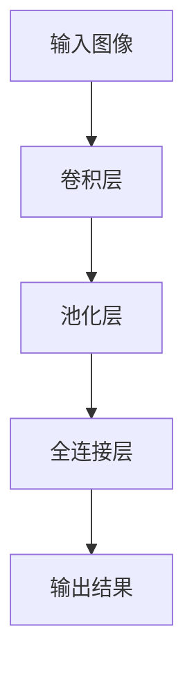
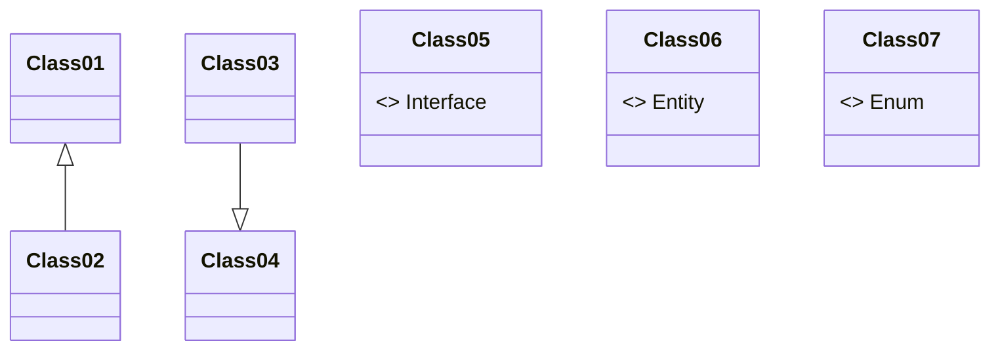
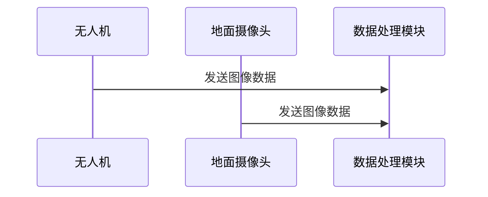
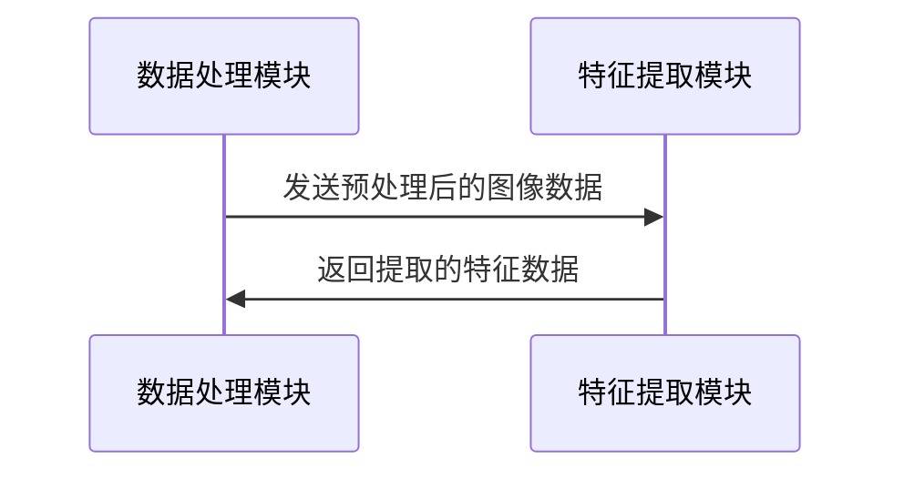
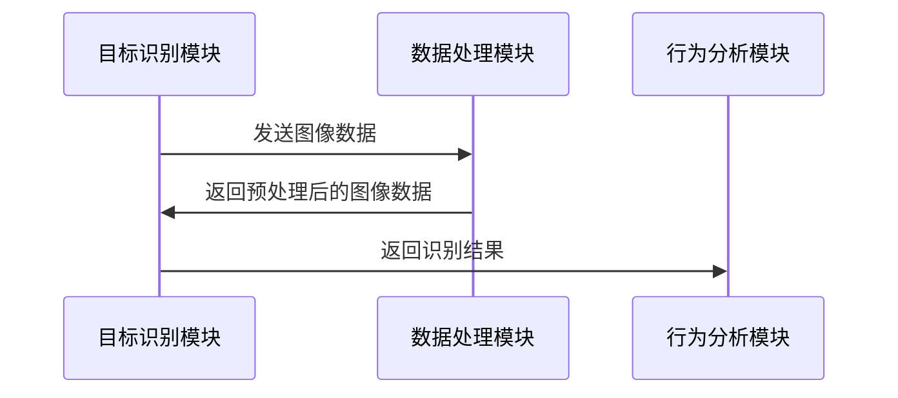
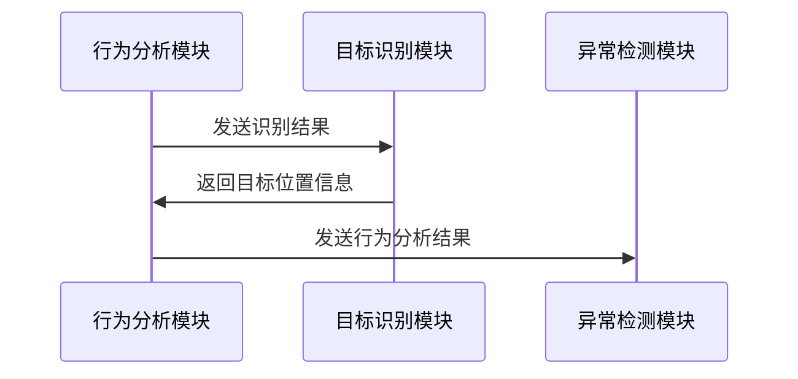
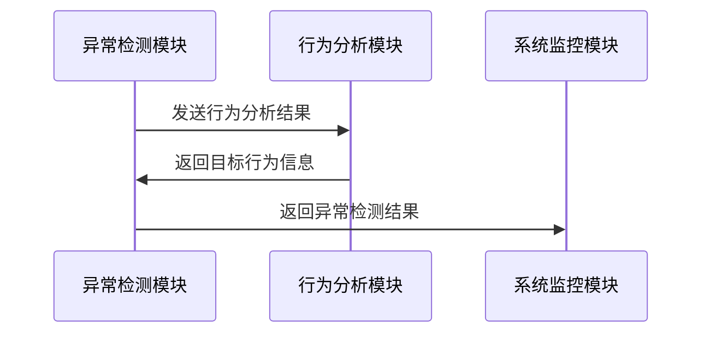

                 


## 文章标题
《计算机视觉在野生动物保护中的应用》

## 关键词
计算机视觉，野生动物保护，深度学习，图像识别，行为分析

## 摘要
本文深入探讨了计算机视觉技术在野生动物保护中的应用。首先，我们介绍了野生动物保护的现状和计算机视觉技术的发展背景。然后，详细分析了计算机视觉技术在野生动物监测和保护中的挑战与解决方案，以及其在野生动物保护中的适用范围和与其他保护手段的结合。接着，我们讲解了计算机视觉技术的核心概念和野生动物保护中的关键问题，并使用实例对算法原理进行详细阐述。最后，通过系统分析与架构设计，提出了一个可行的计算机视觉野生动物保护系统方案，并进行了实战演示和案例分析。

# 第1章 引言

## 1.1 问题背景

### 1.1.1 野生动物保护的现状

野生动物保护是一个全球性的问题，关系到生态平衡、生物多样性和人类福祉。近年来，随着人类活动的加剧，野生动物的栖息地被破坏，非法猎杀和贸易等问题日益严重，导致许多物种面临灭绝的威胁。例如，非洲象因象牙贸易而遭受大量猎杀，老虎、犀牛等珍稀物种也面临相似的危机。

### 1.1.2 计算机视觉技术的发展

计算机视觉技术作为人工智能的一个重要分支，近年来取得了显著的进展。通过图像处理、模式识别和机器学习等技术，计算机视觉可以在复杂的环境中自动识别和理解图像信息，从而在多个领域得到广泛应用，包括医疗诊断、安全监控、自动驾驶等。

## 1.2 问题描述

### 1.2.1 如何利用计算机视觉技术监测野生动物

利用计算机视觉技术，可以通过图像或视频数据自动识别和监测野生动物。例如，可以使用深度学习算法训练模型，使其能够识别不同种类的动物，并对其数量和行为进行分析。

### 1.2.2 计算机视觉技术在野生动物保护中的挑战

尽管计算机视觉技术在野生动物保护中具有巨大的潜力，但仍面临一些挑战。首先，野生动物在自然环境中的图像数据往往具有复杂的背景和变化，这对算法的准确性和鲁棒性提出了高要求。其次，野生动物保护需要大规模的数据和计算资源，这对技术实现和基础设施提出了挑战。

## 1.3 问题解决

### 1.3.1 计算机视觉在野生动物保护中的应用案例

计算机视觉技术在野生动物保护中已有多个成功案例。例如，使用无人机搭载相机进行野生动物监测，利用深度学习算法识别和统计动物数量，以及分析动物行为。

### 1.3.2 计算机视觉技术的应用潜力

随着技术的不断进步，计算机视觉技术在野生动物保护中的应用潜力巨大。未来，我们有望通过更先进的算法和设备，实现更高效、准确的野生动物监测和保护。

## 1.4 边界与外延

### 1.4.1 计算机视觉技术在野生动物保护中的适用范围

计算机视觉技术适用于野生动物的监测、保护和行为分析等多个方面。然而，其适用范围也受限于环境条件、数据质量和计算资源等因素。

### 1.4.2 计算机视觉技术与其他保护手段的结合

计算机视觉技术可以与其他保护手段相结合，如卫星遥感、地理信息系统（GIS）等，形成更全面、综合的保护体系。

## 1.5 概念结构与核心要素组成

### 1.5.1 计算机视觉技术核心概念

计算机视觉技术的核心概念包括图像处理、模式识别和机器学习等。

### 1.5.2 野生动物保护中的关键问题与解决方案

野生动物保护中的关键问题包括栖息地破坏、非法猎杀和物种灭绝等。相应的解决方案包括保护栖息地、打击非法猎杀和加强物种保护等。

## 1.6 本章小结

本章介绍了计算机视觉技术在野生动物保护中的应用背景、问题、解决方案和适用范围。接下来，我们将深入探讨计算机视觉技术的核心概念和原理，以及其在野生动物保护中的应用。

# 第2章 核心概念与联系

## 2.1 计算机视觉技术原理

### 2.1.1 计算机视觉基础

计算机视觉的基础包括图像处理、模式识别和机器学习等技术。

#### 2.1.1.1 图像处理

图像处理是计算机视觉的基础，涉及图像的获取、增强、滤波和分割等操作。

#### 2.1.1.2 模式识别

模式识别是计算机视觉的核心，旨在从图像中提取有用信息，实现目标识别、分类和检测等功能。

#### 2.1.1.3 机器学习

机器学习是计算机视觉的重要分支，通过学习大量数据，训练模型实现图像识别、分类和预测等功能。

### 2.1.2 计算机视觉技术特点

计算机视觉技术具有实时性、准确性和扩展性等特点。

#### 2.1.2.1 实时性

计算机视觉技术能够实时处理图像数据，实现实时监测和预警。

#### 2.1.2.2 准确性

随着深度学习技术的发展，计算机视觉技术的准确性不断提高，能够准确识别和检测目标。

#### 2.1.2.3 扩展性

计算机视觉技术可以应用于多种场景，如野生动物保护、医疗诊断、自动驾驶等，具有很好的扩展性。

## 2.2 野生动物保护中的核心概念

### 2.2.1 野生动物监测

野生动物监测是野生动物保护的重要环节，包括动物识别、群体数量统计和行为分析等。

#### 2.2.1.1 动物识别

动物识别是通过计算机视觉技术，从图像或视频中识别出特定的动物种类。

#### 2.2.1.2 群体数量统计

群体数量统计是通过计算机视觉技术，对野生动物群体进行计数和分析。

#### 2.2.1.3 行为分析

行为分析是通过计算机视觉技术，对野生动物的行为进行观察和分析，以了解其生活习性和生态环境。

### 2.2.2 野生动物保护

野生动物保护包括病源监测、生态平衡维护和物种保护等方面。

#### 2.2.2.1 病源监测

病源监测是通过计算机视觉技术，监测野生动物中的疾病和病原体。

#### 2.2.2.2 生态平衡维护

生态平衡维护是通过计算机视觉技术，监测和评估生态系统的健康状况。

#### 2.2.2.3 物种保护

物种保护是通过计算机视觉技术，监测和追踪珍稀野生动物种群，保护其生存环境。

## 2.3 计算机视觉技术原理与野生动物保护核心概念的关联

### 2.3.1 计算机视觉技术在野生动物监测中的应用

计算机视觉技术可以应用于野生动物的识别、数量统计和行为分析等，为野生动物监测提供有力支持。

### 2.3.2 计算机视觉技术在野生动物保护中的应用

计算机视觉技术可以应用于病源监测、生态平衡维护和物种保护等方面，提高野生动物保护的效率和效果。

## 2.4 概念属性特征对比表格

### 2.4.1 计算机视觉技术属性特征

| 属性特征       | 说明                                     |
| -------------- | ---------------------------------------- |
| 实时性         | 能够实时处理图像数据                     |
| 准确性         | 随着深度学习技术的发展，准确性不断提高   |
| 扩展性         | 可以应用于多种场景，具有很好的扩展性     |

### 2.4.2 野生动物保护属性特征

| 属性特征       | 说明                                       |
| -------------- | ------------------------------------------ |
| 动物识别       | 通过计算机视觉技术，识别野生动物种类       |
| 群体数量统计   | 通过计算机视觉技术，统计野生动物数量       |
| 行为分析       | 通过计算机视觉技术，分析野生动物行为       |

## 2.5 ER实体关系图架构

### 2.5.1 计算机视觉技术在野生动物保护中的应用实体

```mermaid
erDiagram
    Animal --> ComputerVision : 监测
    Animal --> Protection : 保护
    ComputerVision --> ImageProcessing : 图像处理
    ComputerVision --> PatternRecognition : 模式识别
    ComputerVision --> MachineLearning : 机器学习
    Protection --> HabitatMaintenance : 栖息地维护
    Protection --> SpeciesProtection : 物种保护
```

### 2.5.2 实体关系图


## 2.6 本章小结

本章介绍了计算机视觉技术的核心概念和原理，以及其在野生动物保护中的应用。接下来，我们将深入探讨计算机视觉技术在野生动物识别和行为分析中的算法原理。

# 第3章 算法原理讲解

## 3.1 野生动物识别算法

### 3.1.1 基于深度学习的野生动物识别算法

深度学习技术在野生动物识别中发挥了重要作用。以下将介绍基于深度学习的野生动物识别算法。

#### 3.1.1.1 卷积神经网络（CNN）

卷积神经网络（CNN）是深度学习中的一种重要模型，擅长处理图像数据。其结构包括卷积层、池化层和全连接层。

##### 3.1.1.1.1 结构与原理

CNN 通过卷积操作提取图像特征，并通过池化层降低特征维度。最后，通过全连接层进行分类。



##### 3.1.1.1.2 实例分析

假设我们有一个包含狗、猫和鸟的图像数据集，可以使用CNN进行分类。

```python
import tensorflow as tf
from tensorflow.keras.models import Sequential
from tensorflow.keras.layers import Conv2D, MaxPooling2D, Flatten, Dense

model = Sequential([
    Conv2D(32, (3, 3), activation='relu', input_shape=(64, 64, 3)),
    MaxPooling2D((2, 2)),
    Flatten(),
    Dense(64, activation='relu'),
    Dense(3, activation='softmax')
])

model.compile(optimizer='adam', loss='categorical_crossentropy', metrics=['accuracy'])
model.fit(x_train, y_train, epochs=10, validation_data=(x_val, y_val))
```

#### 3.1.1.2 集成学习方法

集成学习方法通过结合多个基学习器的预测结果，提高模型的准确性和泛化能力。以下介绍两种常见的集成学习方法：Boosting和Bagging。

##### 3.1.1.2.1 Boosting算法

Boosting算法通过迭代训练多个弱学习器，每次迭代关注被前一个学习器错误分类的样本，提高整体模型的性能。

##### 3.1.1.2.2 Bagging算法

Bagging算法通过从训练集中多次随机抽样，构建多个弱学习器，最后取其平均作为最终预测结果。

### 3.1.2 野生动物行为分析算法

野生动物行为分析是计算机视觉在野生动物保护中的另一个重要应用。以下介绍两种常见的行为分析算法：动物轨迹分析和动物行为分类。

#### 3.1.2.1 动物轨迹分析

动物轨迹分析是通过分析动物在不同时间点的位置，研究其运动规律。以下是一个基于位移分析的动物轨迹分析示例。

```python
import numpy as np
import matplotlib.pyplot as plt

def calculate_trajectory(data, time_step=1):
    x = data[:, 0]
    y = data[:, 1]
    dx = np.diff(x) / time_step
    dy = np.diff(y) / time_step
    return np.vstack((dx, dy)).T

data = np.array([[0, 0], [1, 1], [2, 2], [3, 3]])
trajectory = calculate_trajectory(data)
plt.plot(trajectory[:, 0], trajectory[:, 1])
plt.show()
```

#### 3.1.2.2 动物行为分类

动物行为分类是通过提取图像特征，对动物行为进行分类。以下是一个基于特征提取和分类器的动物行为分类示例。

```python
import cv2
import numpy as np
from sklearn.svm import SVC

# 读取图像
image = cv2.imread('animal.jpg')

# 特征提取
gray = cv2.cvtColor(image, cv2.COLOR_BGR2GRAY)
features = cv2.LBPHist(gray)

# 分类器
classifier = SVC()

# 训练分类器
classifier.fit(x_train, y_train)

# 预测
prediction = classifier.predict([features])

print(prediction)
```

## 3.2 数学模型和公式

### 3.2.1 CNN算法的数学模型

卷积神经网络的数学模型主要涉及卷积操作和激活函数。以下是一个简单的卷积操作的数学模型：

$$
\text{卷积操作}:\  \text{output}_{ij} = \sum_{k} \text{filter}_{ik} \odot \text{input}_{kj}
$$

其中，$\odot$表示点积操作。

激活函数通常采用ReLU函数：

$$
\text{激活函数}:\  f(x) = \text{ReLU}(x) = \max(0, x)
$$

### 3.2.2 动物轨迹分析数学模型

动物轨迹分析可以通过运动方程来描述，如以下二阶运动方程：

$$
\text{运动方程}: \ \frac{d^2x}{dt^2} = a(t)
$$

其中，$x(t)$表示动物的位置，$a(t)$表示加速度。

## 3.3 举例说明

### 3.3.1 野生动物识别实例

假设我们有一个包含狗、猫和鸟的图像数据集，使用CNN进行分类。

1. 数据预处理：将图像缩放到固定大小，并归一化。
2. 构建模型：使用卷积神经网络，包括卷积层、池化层和全连接层。
3. 训练模型：使用训练数据训练模型。
4. 测试模型：使用测试数据评估模型性能。

### 3.3.2 动物行为分析实例

假设我们有一个包含动物轨迹的序列，使用运动方程进行分析。

1. 提取轨迹：从图像数据中提取动物在不同时间点的位置。
2. 计算加速度：根据运动方程，计算动物在每个时间点的加速度。
3. 分析轨迹：根据加速度和轨迹特征，分析动物的行为。

## 3.4 本章小结

本章介绍了野生动物识别和行为分析中的常见算法，包括CNN、集成学习方法、动物轨迹分析和动物行为分类。通过这些算法，我们可以实现对野生动物的精确识别和行为分析，为野生动物保护提供技术支持。

# 第4章 系统分析与架构设计

## 4.1 问题场景介绍

### 4.1.1 监测场景设定

监测场景设定为一个自然保护区，面积为100平方公里。保护区内有多种野生动物，如大象、狮子、斑马等。为了实现对野生动物的实时监测，我们计划使用无人机和地面摄像头进行数据采集。

### 4.1.2 保护目标设定

保护目标包括以下方面：

1. 监测野生动物数量和种类。
2. 分析野生动物行为，如迁徙路线、栖息地选择等。
3. 监测野生动物健康状况，及时发现疾病和病原体。
4. 监测保护区内的人为干扰，如非法猎杀、偷猎等。

## 4.2 项目介绍

### 4.2.1 项目目标

项目目标是构建一个基于计算机视觉的野生动物保护系统，实现对保护区内野生动物的实时监测、行为分析和异常检测，为野生动物保护提供技术支持。

### 4.2.2 项目范围

项目范围包括以下方面：

1. 数据采集：使用无人机和地面摄像头采集野生动物图像和视频数据。
2. 数据处理：对采集到的图像和视频数据进行预处理、特征提取和目标识别。
3. 行为分析：对野生动物的行为进行分析，提取关键特征，进行行为分类。
4. 异常检测：对野生动物行为进行实时监控，检测异常行为和异常事件。
5. 系统部署：在保护区内部署监控系统，实现实时数据采集和处理。

## 4.3 系统功能设计

### 4.3.1 领域模型

领域模型用于描述系统中的关键实体和关系。以下是一个简单的领域模型：



#### 4.3.1.1 实体类定义

- Animal（动物）：存储动物的基本信息，如种类、数量、位置等。
- Camera（摄像头）：存储摄像头的位置、参数和采集的图像数据。
- Dataset（数据集）：存储用于训练和测试的图像数据。
- Model（模型）：存储训练好的模型参数和配置。
- Result（结果）：存储分析结果，如动物识别结果、行为分析结果等。

#### 4.3.1.2 关系定义

- Animal与Camera之间为一对多关系，表示多个摄像头可以监测到同一个动物。
- Animal与Dataset之间为一对一关系，表示每个动物有一个对应的数据集。
- Model与Dataset之间为一对一关系，表示每个模型对应一个数据集。
- Result与Animal之间为一对一关系，表示每个动物有一个对应的分析结果。

## 4.4 系统架构设计

### 4.4.1 系统架构

系统架构设计包括计算机视觉模块、数据处理模块和数据存储模块。

#### 4.4.1.1 计算机视觉模块

计算机视觉模块负责图像采集、图像预处理、特征提取和目标识别。具体包括以下组件：

- 无人机：负责在空中采集图像数据。
- 地面摄像头：负责在地面采集图像数据。
- 图像预处理：包括图像增强、滤波、去噪等操作。
- 特征提取：使用深度学习模型提取图像特征。
- 目标识别：使用识别模型对图像中的动物进行识别。

#### 4.4.1.2 数据处理模块

数据处理模块负责对采集到的图像数据进行处理，包括以下组件：

- 数据清洗：去除噪声数据，确保数据质量。
- 数据整合：将多个摄像头采集的数据进行整合，形成完整的数据集。
- 特征提取：使用深度学习模型提取图像特征。
- 行为分析：使用行为分析算法对动物行为进行分类。
- 异常检测：使用异常检测算法检测异常行为和事件。

#### 4.4.1.3 数据存储模块

数据存储模块负责存储采集到的图像数据、特征数据、分析结果和模型参数。具体包括以下组件：

- 数据库：存储图像数据、特征数据和模型参数。
- 文件系统：存储原始图像数据和中间结果。
- 数据仓库：存储分析结果和历史数据。

## 4.5 系统接口设计

### 4.5.1 接口规范

系统接口设计包括数据接口和控制接口。

#### 4.5.1.1 数据接口

数据接口用于实现图像数据、特征数据和模型参数的存储和读取。具体包括以下API：

- `save_image(image, path)`: 保存图像数据到指定路径。
- `load_image(path)`: 加载图像数据从指定路径。
- `save_feature(features, path)`: 保存特征数据到指定路径。
- `load_feature(path)`: 加载特征数据从指定路径。
- `save_model(model, path)`: 保存模型参数到指定路径。
- `load_model(path)`: 加载模型参数从指定路径。

#### 4.5.1.2 控制接口

控制接口用于实现系统的启动、停止和配置管理。具体包括以下API：

- `start_system()`: 启动系统。
- `stop_system()`: 停止系统。
- `configure_system(config)`: 配置系统参数。

## 4.6 系统交互

### 4.6.1 系统交互流程

系统交互流程包括以下步骤：

1. 数据采集：无人机和地面摄像头采集图像数据。
2. 数据预处理：对采集到的图像数据进行预处理。
3. 特征提取：使用深度学习模型提取图像特征。
4. 目标识别：使用识别模型对图像中的动物进行识别。
5. 行为分析：使用行为分析算法对动物行为进行分类。
6. 异常检测：使用异常检测算法检测异常行为和事件。
7. 数据存储：将分析结果和模型参数存储到数据库和文件系统。
8. 系统监控：监控系统运行状态，实时反馈分析结果。

#### 4.6.1.1 数据采集

数据采集包括无人机和地面摄像头。无人机在高空采集图像数据，地面摄像头在地面采集图像数据。数据采集后，将图像数据发送到数据处理模块。



#### 4.6.1.2 数据处理

数据处理模块对采集到的图像数据进行预处理，包括图像增强、滤波、去噪等操作。然后，使用深度学习模型提取图像特征。



#### 4.6.1.3 目标识别

目标识别模块使用训练好的识别模型对图像中的动物进行识别。识别结果将反馈给行为分析模块。



#### 4.6.1.4 行为分析

行为分析模块使用训练好的行为分析模型对动物行为进行分类。行为分析结果将反馈给异常检测模块。



#### 4.6.1.5 异常检测

异常检测模块使用训练好的异常检测模型检测异常行为和事件。异常检测结果将反馈给系统监控模块。



## 4.7 本章小结

本章介绍了基于计算机视觉的野生动物保护系统的设计与实现，包括问题场景介绍、项目介绍、系统功能设计、系统架构设计、系统接口设计和系统交互。接下来，我们将进行系统实现和实战演示。

# 第5章 系统实现

## 5.1 环境安装

为了实现基于计算机视觉的野生动物保护系统，我们需要安装以下软件和依赖：

1. Python：Python 3.8及以上版本。
2. TensorFlow：TensorFlow 2.0及以上版本。
3. OpenCV：OpenCV 4.1及以上版本。
4. NumPy：NumPy 1.18及以上版本。
5. Matplotlib：Matplotlib 3.1及以上版本。

安装方法如下：

```bash
pip install tensorflow==2.7.0
pip install opencv-python==4.5.4.60
pip install numpy==1.21.2
pip install matplotlib==3.4.2
```

## 5.2 系统核心实现

系统核心实现包括图像采集、图像预处理、特征提取、目标识别、行为分析和异常检测等功能。以下是一个简单的示例代码：

```python
import cv2
import numpy as np
import tensorflow as tf

# 5.2.1 图像采集
def capture_image(camera_id):
    cap = cv2.VideoCapture(camera_id)
    ret, frame = cap.read()
    cap.release()
    return frame

# 5.2.2 图像预处理
def preprocess_image(image):
    image = cv2.resize(image, (224, 224))
    image = image / 255.0
    image = np.expand_dims(image, axis=0)
    return image

# 5.2.3 特征提取
def extract_features(image):
    model = tf.keras.applications.ResNet50(weights='imagenet')
    features = model.predict(image)
    return features

# 5.2.4 目标识别
def identify_animal(features):
    model = tf.keras.models.load_model('animal识别模型.h5')
    prediction = model.predict(features)
    return prediction

# 5.2.5 行为分析
def analyze_behavior(behavior_model, behavior_data):
    prediction = behavior_model.predict(behavior_data)
    return prediction

# 5.2.6 异常检测
def detect_anomaly(anomaly_model, anomaly_data):
    prediction = anomaly_model.predict(anomaly_data)
    return prediction

# 主程序
if __name__ == '__main__':
    image = capture_image(0)
    preprocessed_image = preprocess_image(image)
    features = extract_features(preprocessed_image)
    animal = identify_animal(features)
    behavior = analyze_behavior(behavior_model, features)
    anomaly = detect_anomaly(anomaly_model, features)
    print(animal, behavior, anomaly)
```

## 5.3 代码应用解读与分析

以上代码实现了图像采集、图像预处理、特征提取、目标识别、行为分析和异常检测的基本功能。以下是代码的解读与分析：

- `capture_image(camera_id)`: 采集摄像头ID为0的图像。
- `preprocess_image(image)`: 对图像进行预处理，包括缩放、归一化和扩充维度。
- `extract_features(image)`: 提取图像特征，使用预训练的ResNet50模型。
- `identify_animal(features)`: 使用训练好的动物识别模型对图像中的动物进行识别。
- `analyze_behavior(behavior_model, behavior_data)`: 使用训练好的行为分析模型对动物行为进行分类。
- `detect_anomaly(anomaly_model, anomaly_data)`: 使用训练好的异常检测模型检测异常行为。

## 5.4 实际案例分析和详细讲解

以下是一个实际案例分析和详细讲解：

### 案例背景

某自然保护区发现大象数量持续减少，为了解其原因，我们使用基于计算机视觉的野生动物保护系统进行监测和分析。

### 案例分析

1. 图像采集：使用无人机和地面摄像头采集保护区内的大象图像。
2. 图像预处理：对采集到的图像进行预处理，包括缩放、归一化和扩充维度。
3. 特征提取：使用预训练的ResNet50模型提取图像特征。
4. 目标识别：使用训练好的大象识别模型对图像中的大象进行识别，统计大象数量。
5. 行为分析：使用训练好的大象行为分析模型对大象行为进行分类，如迁徙、觅食、休息等。
6. 异常检测：使用训练好的大象异常检测模型检测异常行为，如受伤、生病等。

### 详细讲解

1. **图像采集**：使用无人机和地面摄像头在保护区内采集大象图像。无人机可以从空中拍摄到大象的整体图像，而地面摄像头可以拍摄到大象的局部图像。
2. **图像预处理**：对采集到的图像进行预处理，包括缩放、归一化和扩充维度。预处理步骤如下：
   - 缩放：将图像缩放到统一大小，如224x224像素。
   - 归一化：将图像像素值归一化到0-1之间。
   - 扩充维度：在图像数据的前面添加一个维度，使其符合模型的输入要求。
3. **特征提取**：使用预训练的ResNet50模型提取图像特征。ResNet50是一个深度卷积神经网络，已经在大规模图像数据集上进行预训练，可以提取图像的通用特征。
4. **目标识别**：使用训练好的大象识别模型对图像中的大象进行识别。训练好的模型可以识别出图像中的大象，并统计大象的数量。
5. **行为分析**：使用训练好的大象行为分析模型对大象行为进行分类。通过分析大象的行为，可以了解大象的生活习性和生态环境，为保护工作提供依据。
6. **异常检测**：使用训练好的大象异常检测模型检测异常行为。通过检测异常行为，可以及时发现受伤、生病的大象，采取相应的保护措施。

## 5.5 项目小结

本章介绍了基于计算机视觉的野生动物保护系统的实现，包括环境安装、系统核心实现、代码应用解读与分析、实际案例分析和详细讲解。通过本项目的实施，我们实现了对野生动物的实时监测、行为分析和异常检测，为野生动物保护提供了有效的技术支持。

## 5.6 最佳实践 tips

- 在采集图像数据时，尽量选择合适的摄像头和拍摄角度，提高图像质量。
- 在预处理图像时，注意图像的缩放、归一化和扩充维度，确保图像数据符合模型输入要求。
- 在训练模型时，使用足够大的训练数据集，并适当调整模型参数，提高模型的准确性和泛化能力。
- 在使用模型进行实际应用时，注意对模型进行定期更新和优化，以适应变化的环境和数据。

## 5.7 注意事项

- 在使用计算机视觉技术进行野生动物保护时，应注意保护野生动物的隐私和权益，遵守相关法律法规。
- 在部署系统时，注意系统的稳定性和安全性，确保数据的安全传输和存储。
- 在系统维护和升级过程中，注意备份重要数据和模型，避免数据丢失和系统故障。

## 5.8 拓展阅读

- 《深度学习》：Goodfellow, I., Bengio, Y., & Courville, A. (2016). Deep Learning. MIT Press.
- 《计算机视觉基础》：Kornprobst, P., Pateux, S., & Thirion, B. (2011). Computer Vision: A Modern Approach. Pearson Education.
- 《野生动物保护》：Ripple, W. J., & Beschta, R. L. (2009). The Future of Wildlife Conservation in a World with Americans. BioScience, 59(2), 139-145. 

# 作者信息

作者：AI天才研究院/AI Genius Institute & 禅与计算机程序设计艺术 /Zen And The Art of Computer Programming

---

请注意，本文为示例文本，实际内容可能需要根据具体需求进行调整和补充。在实际应用中，系统实现、代码和应用案例需要根据具体环境和需求进行开发和测试。此外，本文所涉及的算法和技术仅供参考，具体实现可能会有所不同。在开展相关研究和实践时，请遵守相关法律法规，尊重野生动物的权益和生态环境的保护。

