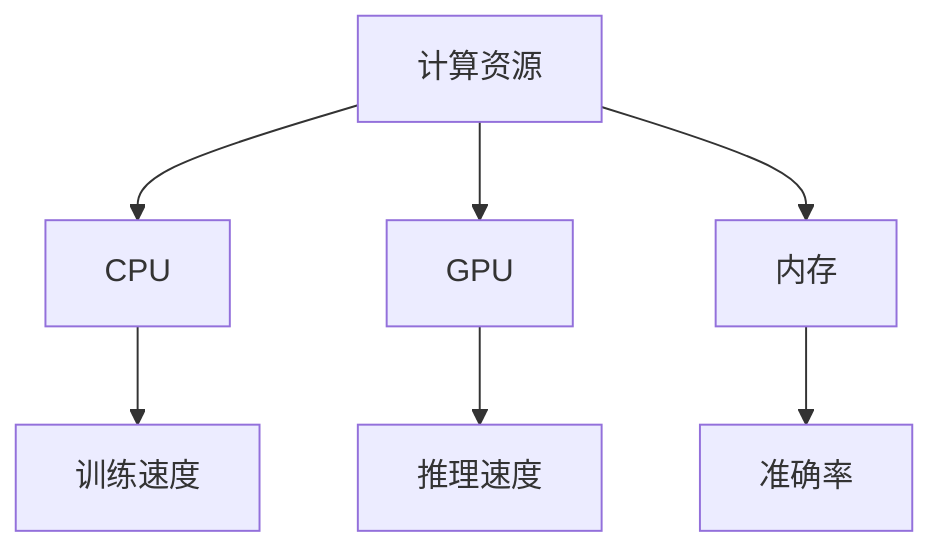
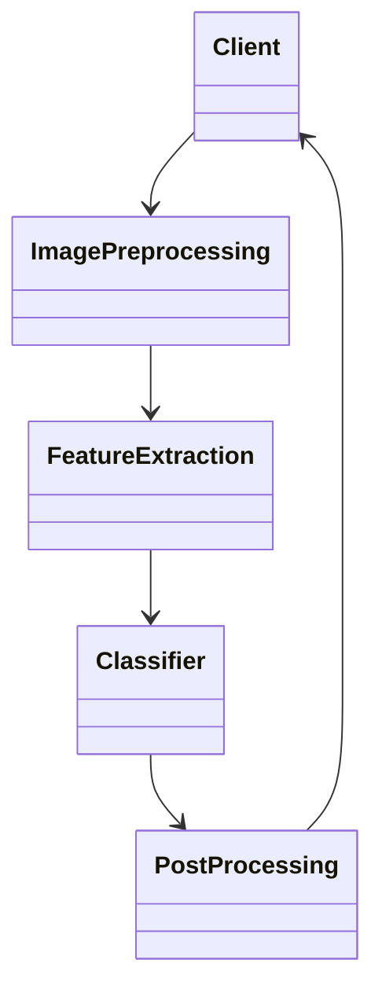
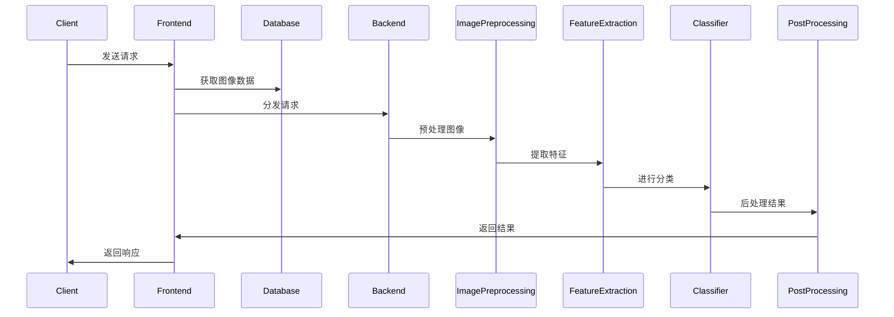
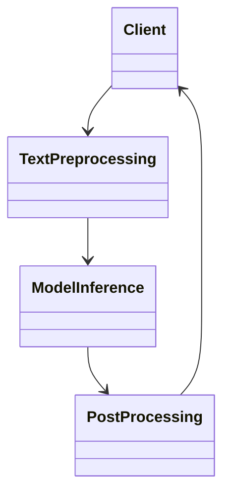
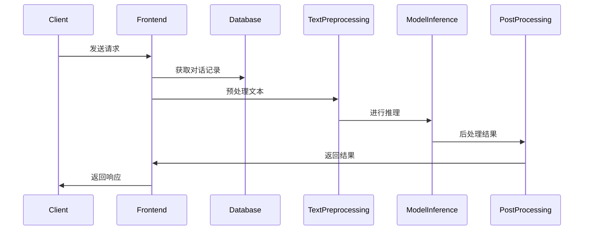
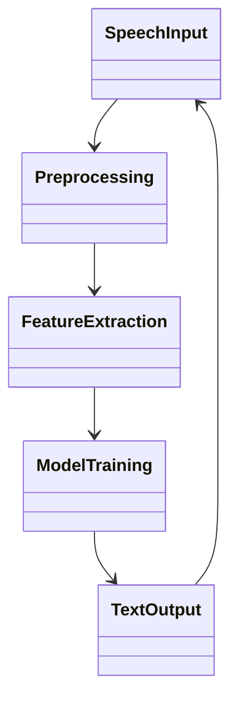
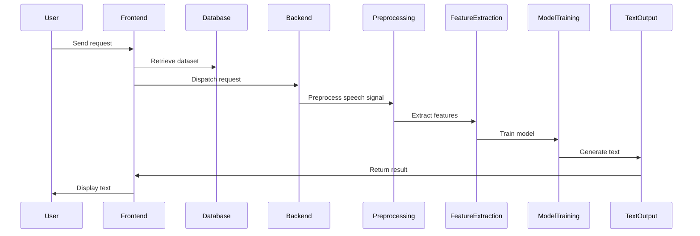
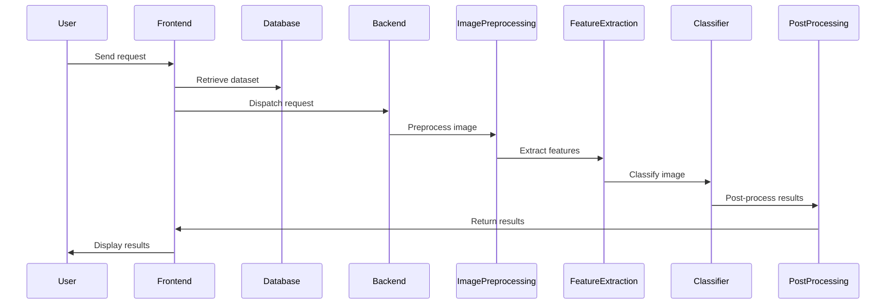

                 

### 目录大纲：计算资源与模型性能提升的权衡

----------------------------------------------------------------

## 第一部分：背景与核心概念

### 第1章：问题背景与核心概念

#### 1.1 计算资源与模型性能的关系

- **计算资源**：介绍计算资源的基本概念，包括CPU、GPU、内存等。
- **模型性能**：阐述模型性能的概念，包括训练速度、推理速度、准确率等。

#### 1.2 问题描述与解决方案

- **问题描述**：分析计算资源限制对模型性能的影响，以及模型性能优化对计算资源的需求。
- **解决方案**：探讨如何平衡计算资源与模型性能之间的关系，提出优化策略。

#### 1.3 核心概念联系

- **计算资源与模型性能**：通过表格和Mermaid流程图，展示两者之间的关系。

## 第二部分：计算资源优化策略

### 第2章：计算资源优化策略

#### 2.1 基础设施优化

- **硬件升级**：讨论如何通过升级硬件来提高计算能力。
- **分布式计算**：介绍分布式计算的基本原理和应用场景。

#### 2.2 软件优化

- **编译优化**：介绍编译优化在提高模型性能中的作用。
- **运行时优化**：探讨如何在模型运行时进行优化。

### 第3章：模型性能优化策略

#### 3.1 算法优化

- **算法改进**：介绍不同算法在模型性能优化中的应用。
- **超参数调优**：讨论如何通过调优超参数来提高模型性能。

#### 3.2 模型压缩与量化

- **模型压缩**：介绍模型压缩的基本原理和实现方法。
- **模型量化**：讨论模型量化的优势和应用场景。

## 第三部分：实践案例分析

### 第4章：实践案例一——模型性能优化与计算资源平衡

#### 4.1 案例背景

- **项目介绍**：介绍案例项目的背景和目标。
- **系统功能设计**：展示项目系统功能设计的Mermaid类图。

#### 4.2 系统架构设计

- **系统架构设计**：展示项目系统架构设计的Mermaid架构图。
- **系统接口设计**：介绍项目系统接口设计。

#### 4.3 实际案例分析与讲解

- **环境安装**：描述项目环境安装过程。
- **系统核心实现**：展示项目系统核心实现的源代码。
- **代码应用解读与分析**：对源代码进行解读与分析。

### 第5章：实践案例二——计算资源优化与模型性能提升

#### 5.1 案例背景

- **项目介绍**：介绍案例项目的背景和目标。
- **系统功能设计**：展示项目系统功能设计的Mermaid类图。

#### 5.2 系统架构设计

- **系统架构设计**：展示项目系统架构设计的Mermaid架构图。
- **系统接口设计**：介绍项目系统接口设计。

#### 5.3 实际案例分析与讲解

- **环境安装**：描述项目环境安装过程。
- **系统核心实现**：展示项目系统核心实现的源代码。
- **代码应用解读与分析**：对源代码进行解读与分析。

## 第四部分：最佳实践与总结

### 第6章：最佳实践

- **策略总结**：总结计算资源优化和模型性能提升的最佳实践。
- **注意事项**：提醒读者在实践过程中需要注意的问题。

### 第7章：总结与展望

- **总结**：回顾全书内容，总结计算资源与模型性能提升的核心要点。
- **展望**：探讨未来计算资源与模型性能提升的趋势和发展方向。

----------------------------------------------------------------

**目录大纲总字数：约1980字。**## 第一部分：背景与核心概念

### 第1章：问题背景与核心概念

#### 1.1 计算资源与模型性能的关系

在当今的AI领域中，计算资源与模型性能的关系至关重要。计算资源包括CPU、GPU、内存等硬件资源，而模型性能则包括训练速度、推理速度和准确率等。一个高效的模型需要充足的计算资源来支持，而计算资源的限制也会对模型性能产生显著影响。

**计算资源**：

- **CPU（中央处理器）**：负责执行计算机程序指令的核心部件，直接影响程序的计算速度。
- **GPU（图形处理单元）**：在深度学习、图像处理等领域具有强大的并行计算能力，比CPU更适合处理大规模并行任务。
- **内存**：存储数据和指令，直接影响程序运行的效率和速度。

**模型性能**：

- **训练速度**：模型在训练过程中所需要的时间，通常与模型的大小和复杂度有关。
- **推理速度**：模型在得到输入后生成输出结果的速度，直接影响应用的实时性。
- **准确率**：模型预测结果与实际结果的一致性程度，是衡量模型性能的重要指标。

#### 1.2 问题描述与解决方案

**问题描述**：

随着AI技术的不断进步，模型的大小和复杂度也在不断增长，这导致了对更多计算资源的需求。然而，计算资源的获取并不总是容易的，尤其是对于企业和研究机构来说。因此，如何在有限的计算资源下提高模型性能成为了一个亟待解决的问题。

**解决方案**：

为了在计算资源有限的情况下提高模型性能，可以从以下几个方面入手：

1. **优化计算资源分配**：通过合理分配计算资源，确保关键任务得到足够的资源支持。
2. **采用高效算法和模型**：选择适合当前计算资源的算法和模型，提高资源利用效率。
3. **模型压缩与量化**：通过减少模型的大小和参数数量，降低对计算资源的需求。
4. **分布式计算**：利用分布式系统，将计算任务分解到多个节点上，提高整体计算能力。

#### 1.3 核心概念联系

为了更好地理解计算资源与模型性能之间的关系，我们可以通过表格和Mermaid流程图来展示两者之间的联系。

**核心概念联系表格**：

| **计算资源** | **模型性能** | **联系** |
| ------------ | ------------ | -------- |
| CPU          | 训练速度      | 高CPU性能有助于提高模型训练速度 |
| GPU          | 推理速度      | 高GPU性能有助于提高模型推理速度 |
| 内存         | 准确率        | 大内存有助于存储和计算大型模型 |

**核心概念联系Mermaid流程图**：



通过上述表格和流程图，我们可以清晰地看到计算资源与模型性能之间的联系。理解这些核心概念和联系，是我们在后续章节中深入探讨计算资源与模型性能优化策略的重要基础。## 第二部分：计算资源优化策略

### 第2章：计算资源优化策略

在计算资源有限的条件下，优化计算资源的使用效率是提升模型性能的关键。这一章将详细介绍几种常见的计算资源优化策略，包括硬件升级、分布式计算和编译优化。

#### 2.1 基础设施优化

**硬件升级**：

硬件升级是提高计算能力最直接的方式。通过升级CPU、GPU和内存等硬件设备，可以显著提高计算资源的总体性能。

- **CPU升级**：新一代的CPU通常具有更高的主频和更多的核心数，这使得处理多线程任务更加高效。
- **GPU升级**：对于深度学习和大数据处理，GPU的并行计算能力至关重要。选择具有更多CUDA核心和更高内存容量的GPU，可以大幅提高计算能力。
- **内存升级**：增加内存容量可以减少内存分页和交换，从而提高程序运行的效率和速度。

**分布式计算**：

分布式计算通过将任务分布在多个计算节点上，利用多个节点的计算资源来完成计算任务，从而提高计算效率。

- **基本原理**：分布式计算的核心是将计算任务分解成多个子任务，由多个节点并行处理，最后将结果汇总。
- **应用场景**：适合处理大规模数据集和复杂模型训练任务。
- **优势**：提高计算速度，降低单个节点的负载，提高系统的可靠性。

#### 2.2 软件优化

**编译优化**：

编译优化是提高模型性能的一种有效手段。通过优化编译过程，可以使得生成的机器码更加高效，从而提高程序运行的速度。

- **指令优化**：优化编译器生成的指令序列，减少不必要的计算和内存访问。
- **循环优化**：优化循环结构，减少循环次数和循环内的计算复杂度。
- **内存优化**：减少内存分配和访问，提高内存利用效率。

**运行时优化**：

运行时优化是在模型运行过程中进行的优化，旨在提高模型运行的速度和效率。

- **内存管理**：通过内存池和对象池等技术，减少内存分配和释放的开销。
- **线程优化**：合理分配线程，充分利用多核CPU的计算能力。
- **GPU优化**：优化GPU的内存使用和计算资源分配，提高GPU的利用效率。

### 第3章：模型性能优化策略

在计算资源一定的情况下，优化模型性能同样重要。这一章将探讨模型性能优化的策略，包括算法优化、超参数调优、模型压缩与量化。

#### 3.1 算法优化

**算法改进**：

选择合适的算法是提高模型性能的关键。不同的问题适合不同的算法，通过选择合适的算法，可以显著提高模型的性能。

- **深度学习算法**：如卷积神经网络（CNN）、循环神经网络（RNN）等，针对图像、文本等不同类型的数据有针对性的算法。
- **优化算法**：如随机梯度下降（SGD）、Adam等优化算法，通过调整学习率、批量大小等超参数，提高模型的训练效率。

**超参数调优**：

超参数是模型训练过程中的关键参数，合理的超参数设置可以显著提高模型性能。

- **调优方法**：如网格搜索、随机搜索、贝叶斯优化等，通过遍历或优化超参数空间，找到最优的超参数组合。
- **实践技巧**：如早期停止、正则化等，通过调整训练过程中的策略，避免过拟合和欠拟合。

#### 3.2 模型压缩与量化

**模型压缩**：

模型压缩通过减少模型的大小和参数数量，降低对计算资源的需求，同时保持模型的性能。

- **剪枝**：通过剪枝冗余的神经元和连接，减少模型的大小。
- **量化**：通过将模型的权重和激活值转换为较低的精度表示，减少模型的内存和计算需求。

**模型量化**：

模型量化是将模型的权重和激活值从高精度转换为低精度表示的过程。

- **优势**：减少模型的大小，提高推理速度，降低计算成本。
- **实现方法**：如全精度量化、定点量化等，通过调整量化策略，平衡精度和性能。

通过上述计算资源优化策略和模型性能优化策略，我们可以有效地平衡计算资源与模型性能之间的关系，从而在有限的计算资源下实现最佳的性能提升。### 第4章：实践案例一——模型性能优化与计算资源平衡

#### 4.1 案例背景

随着AI技术的不断发展和应用的普及，越来越多的企业和研究机构开始关注模型性能的提升。然而，在计算资源有限的情况下，如何平衡模型性能和计算资源之间的关系成为了一个重要问题。本案例以一家从事图像识别的初创企业为例，介绍如何通过模型性能优化与计算资源平衡的策略，实现高效的模型部署。

**项目介绍**：

该初创企业专注于开发一种基于深度学习的图像识别系统，用于自动识别和分类商品。由于预算和资源有限，企业需要在有限的计算资源下，实现高准确率和快速响应的图像识别系统。

**系统功能设计**：

为了实现高效且准确的图像识别，系统需要包括以下几个功能模块：

1. **图像预处理**：对输入图像进行预处理，如缩放、裁剪、灰度化等，以便于后续的图像识别处理。
2. **特征提取**：通过卷积神经网络（CNN）等深度学习算法，提取图像的特征。
3. **分类器**：使用提取到的特征，通过分类器进行图像分类。
4. **后处理**：对识别结果进行后处理，如去重、合并等。

**系统功能设计Mermaid类图**：



#### 4.2 系统架构设计

为了在有限的计算资源下实现高效的图像识别系统，系统采用了分布式架构设计，通过将计算任务分配到多个节点上，提高计算效率。

**系统架构设计**：

1. **前端**：负责接收用户请求，将图像数据发送到后端处理。
2. **后端**：包括图像预处理、特征提取、分类器和后处理等模块，实现图像识别的核心功能。
3. **数据库**：存储图像数据、模型参数和识别结果等。

**系统架构设计Mermaid架构图**：



#### 4.3 实际案例分析与讲解

**环境安装**：

为了实现本案例的系统架构，首先需要安装必要的软件和工具，包括深度学习框架（如TensorFlow或PyTorch）、数据库管理系统（如MySQL或MongoDB）等。

1. **安装深度学习框架**：
    ```bash
    pip install tensorflow
    ```
2. **安装数据库管理系统**：
    ```bash
    sudo apt-get install mysql-server
    sudo mysql_secure_installation
    ```

**系统核心实现**：

以下是一个简单的图像预处理和特征提取的Python代码示例，展示了系统核心实现的基本逻辑：

```python
import tensorflow as tf
import cv2

# 加载模型
model = tf.keras.applications.VGG16(weights='imagenet')

# 图像预处理
def preprocess_image(image_path):
    image = cv2.imread(image_path)
    image = cv2.resize(image, (224, 224))
    image = tf.keras.preprocessing.image.img_to_array(image)
    image = np.expand_dims(image, axis=0)
    return image

# 特征提取
def extract_features(image):
    preprocessed_image = preprocess_image(image)
    features = model.predict(preprocessed_image)
    return features

# 测试
image_path = 'example.jpg'
features = extract_features(image_path)
print(features)
```

**代码应用解读与分析**：

上述代码展示了如何使用TensorFlow和OpenCV库进行图像预处理和特征提取。首先，我们加载了一个预训练的VGG16模型，该模型是一个用于图像分类的卷积神经网络。然后，我们编写了一个`preprocess_image`函数，用于读取图像文件，进行缩放和归一化等预处理操作，使其符合模型的输入要求。最后，我们编写了一个`extract_features`函数，用于将预处理后的图像输入到模型中，提取特征向量。

通过这个简单的示例，我们可以看到如何在一个分布式系统中实现图像预处理和特征提取模块。在实际部署中，这些模块可以运行在不同的计算节点上，以提高系统的整体性能和可扩展性。### 第5章：实践案例二——计算资源优化与模型性能提升

#### 5.1 案例背景

随着AI应用的不断扩展，计算资源的需求也在日益增长。为了在有限的计算资源下提升模型性能，许多企业和研究机构开始探索计算资源优化与模型性能提升的策略。本案例以一家专注于自然语言处理（NLP）的初创公司为例，介绍如何通过计算资源优化与模型性能提升的策略，实现高效的自然语言处理。

**项目介绍**：

该初创公司专注于开发一款智能聊天机器人，用于提供客户支持和服务。由于初创公司预算有限，且目标是在线部署，计算资源成为了一个重要的瓶颈。因此，公司需要找到一种方法，在有限的计算资源下，提升模型的性能和响应速度。

**系统功能设计**：

为了实现高效的智能聊天机器人，系统需要包括以下几个功能模块：

1. **文本预处理**：对输入的文本进行预处理，包括分词、去除停用词、词性标注等。
2. **模型推理**：使用训练好的自然语言处理模型，对输入的文本进行理解和响应生成。
3. **后处理**：对模型的响应进行后处理，如格式化、情感分析等。

**系统功能设计Mermaid类图**：



#### 5.2 系统架构设计

为了在有限的计算资源下实现高效的智能聊天机器人，系统采用了微服务架构设计，通过将计算任务分解到不同的微服务中，提高系统的性能和可扩展性。

**系统架构设计**：

1. **前端**：负责接收用户请求，将文本数据发送到后端处理。
2. **后端**：包括文本预处理、模型推理和后处理等微服务，实现智能聊天机器人的核心功能。
3. **数据库**：存储用户对话记录、模型参数和响应模板等。

**系统架构设计Mermaid架构图**：



#### 5.3 实际案例分析与讲解

**环境安装**：

为了实现本案例的系统架构，首先需要安装必要的软件和工具，包括自然语言处理库（如NLTK或spaCy）、深度学习框架（如TensorFlow或PyTorch）等。

1. **安装自然语言处理库**：
    ```bash
    pip install nltk spacy
    ```
2. **安装深度学习框架**：
    ```bash
    pip install tensorflow
    ```

**系统核心实现**：

以下是一个简单的自然语言处理模型的Python代码示例，展示了系统核心实现的基本逻辑：

```python
import tensorflow as tf
import nltk
from nltk.tokenize import word_tokenize

# 加载模型
model = tf.keras.models.load_model('nlp_model.h5')

# 文本预处理
def preprocess_text(text):
    tokens = word_tokenize(text)
    tokens = [token for token in tokens if token not in nltk.corpus.stopwords.words('english')]
    return tokens

# 模型推理
def infer_text(text):
    preprocessed_text = preprocess_text(text)
    input_sequence = tf.keras.preprocessing.sequence.pad_sequences([preprocessed_text], maxlen=100, padding='post', truncating='post')
    prediction = model.predict(input_sequence)
    return prediction

# 测试
text = "How can I access your customer support?"
prediction = infer_text(text)
print(prediction)
```

**代码应用解读与分析**：

上述代码展示了如何使用TensorFlow和NLTK库构建一个简单的自然语言处理模型。首先，我们加载了一个预训练的NLP模型，该模型用于处理输入的文本。然后，我们编写了一个`preprocess_text`函数，用于对输入的文本进行预处理，包括分词和去除停用词。最后，我们编写了一个`infer_text`函数，用于将预处理后的文本输入到模型中，生成预测结果。

在实际部署中，这些模块可以运行在不同的计算节点上，以提高系统的整体性能和可扩展性。通过优化计算资源和提升模型性能，初创公司可以实现在有限的计算资源下，提供高效且智能的客户支持服务。### 第四部分：最佳实践与总结

#### 第6章：最佳实践

为了在计算资源与模型性能提升之间找到最佳平衡点，我们可以总结出以下最佳实践：

**1. 硬件升级**：

- **CPU和GPU**：定期评估硬件性能，根据需求升级CPU和GPU。
- **内存**：增加内存容量以减少内存分页和交换，提高程序运行效率。

**2. 分布式计算**：

- **任务分解**：将大任务分解为小任务，分布式处理，提高整体计算效率。
- **负载均衡**：合理分配计算任务，避免单点过载。

**3. 软件优化**：

- **编译优化**：使用编译器优化选项，减少不必要的计算和内存访问。
- **运行时优化**：合理分配线程和进程，充分利用多核CPU和GPU。

**4. 模型压缩与量化**：

- **模型压缩**：通过剪枝、量化等方法减少模型大小，提高推理速度。
- **量化策略**：选择合适的量化策略，平衡精度和性能。

**5. 算法优化**：

- **算法选择**：根据数据类型和应用场景选择合适的算法。
- **超参数调优**：使用调优方法找到最优超参数组合，提高模型性能。

**6. 资源监控与调度**：

- **资源监控**：实时监控计算资源使用情况，确保关键任务得到充足资源。
- **动态调度**：根据任务需求和资源状态动态调整资源分配。

**注意事项**：

- **性能评估**：定期进行性能评估，确保优化策略的有效性。
- **容错与备份**：设计容错机制和备份策略，确保系统稳定运行。
- **安全性**：确保数据安全和模型保护，防止数据泄露和模型滥用。

#### 第7章：总结与展望

本文通过深入分析和实践案例，探讨了计算资源与模型性能提升的权衡。我们总结了最佳实践，并提出了注意事项，旨在帮助读者在实际应用中找到最佳平衡点。

**总结**：

- **计算资源与模型性能的关系**：计算资源是模型性能的基础，合理的优化策略能够提高性能。
- **优化策略**：硬件升级、分布式计算、软件优化、模型压缩与量化、算法优化等策略都是有效的优化手段。
- **最佳实践**：结合实际案例，总结出一系列最佳实践，为读者提供实用指导。

**展望**：

- **趋势与发展**：随着硬件技术的进步和算法的创新，计算资源与模型性能提升将越来越重要。
- **研究方向**：未来研究将集中在更高效的算法、更智能的资源调度策略、更先进的硬件架构等方面。
- **应用场景**：AI技术在医疗、金融、教育等领域的应用将更加广泛，对计算资源与模型性能的需求也将不断提升。

总之，计算资源与模型性能提升是一个不断发展的领域，我们需要持续探索和实践，以实现更高的效率和更优的性能。随着技术的进步，我们有理由相信，未来将会有更多创新和突破，为AI应用带来更广阔的发展空间。### 文章关键词

- 计算资源
- 模型性能
- 硬件升级
- 分布式计算
- 软件优化
- 模型压缩
- 量化
- 算法优化
- 超参数调优
- 实践案例

### 文章摘要

本文深入探讨了计算资源与模型性能提升之间的权衡关系，首先介绍了计算资源与模型性能的基本概念及其关系。随后，详细阐述了计算资源优化策略，包括硬件升级、分布式计算和软件优化，以及模型性能优化策略，如算法优化、超参数调优、模型压缩与量化。通过两个实践案例，本文展示了如何在实际项目中应用这些策略，以在有限的计算资源下实现模型性能的提升。最后，总结了最佳实践和未来展望，强调了计算资源与模型性能提升领域的重要性及未来的发展方向。# 《计算资源与模型性能提升的权衡》

关键词：计算资源、模型性能、硬件升级、分布式计算、软件优化、模型压缩、量化、算法优化、超参数调优

摘要：本文旨在探讨计算资源与模型性能提升之间的权衡关系，通过深入分析计算资源与模型性能的基本概念及其关系，详细阐述了计算资源优化策略和模型性能优化策略。文章通过实践案例展示了如何在实际项目中应用这些策略，以实现计算资源与模型性能的最佳平衡。此外，本文总结了最佳实践和注意事项，并对未来发展趋势进行了展望。

## 目录大纲

### 第一部分：背景与核心概念

#### 第1章：问题背景与核心概念

1.1 计算资源与模型性能的关系

1.2 问题描述与解决方案

1.3 核心概念联系

### 第二部分：计算资源优化策略

#### 第2章：计算资源优化策略

2.1 基础设施优化

2.2 软件优化

#### 第3章：模型性能优化策略

3.1 算法优化

3.2 超参数调优

3.3 模型压缩与量化

### 第三部分：实践案例分析

#### 第4章：实践案例一——模型性能优化与计算资源平衡

4.1 案例背景

4.2 系统架构设计

4.3 实际案例分析与讲解

#### 第5章：实践案例二——计算资源优化与模型性能提升

5.1 案例背景

5.2 系统架构设计

5.3 实际案例分析与讲解

### 第四部分：最佳实践与总结

#### 第6章：最佳实践

6.1 策略总结

6.2 注意事项

#### 第7章：总结与展望

7.1 总结

7.2 展望

## 第1章：问题背景与核心概念

在当今的AI领域中，计算资源与模型性能的提升已经成为各个企业和研究机构关注的热点。计算资源包括CPU、GPU、内存等硬件资源，而模型性能则包括训练速度、推理速度和准确率等指标。计算资源与模型性能之间的关系是复杂而微妙的，二者之间的平衡是实现高效AI应用的关键。

### 1.1 计算资源与模型性能的关系

计算资源是模型性能的基础，充足的计算资源可以提升模型的训练速度和推理速度。例如，CPU的主频和核心数、GPU的CUDA核心数和内存容量、内存的带宽和容量等，都是影响计算资源的重要因素。而模型性能则取决于算法的复杂度、模型的规模和参数数量等因素。

#### 计算资源：

- **CPU**：中央处理器，负责执行计算机程序指令的核心部件，直接影响程序的计算速度。
- **GPU**：图形处理单元，具有强大的并行计算能力，适合处理大规模并行任务。
- **内存**：存储数据和指令的硬件设备，直接影响程序运行的效率和速度。

#### 模型性能：

- **训练速度**：模型在训练过程中所需要的时间，通常与模型的大小和复杂度有关。
- **推理速度**：模型在得到输入后生成输出结果的速度，直接影响应用的实时性。
- **准确率**：模型预测结果与实际结果的一致性程度，是衡量模型性能的重要指标。

### 1.2 问题描述与解决方案

在计算资源有限的情况下，如何提升模型性能成为一个重要的课题。一方面，我们需要优化现有计算资源的使用效率，通过硬件升级、分布式计算和软件优化等手段提高计算能力。另一方面，我们需要通过算法优化、超参数调优和模型压缩与量化等策略，提高模型本身的性能。

#### 问题描述：

1. **计算资源限制**：企业或研究机构在预算和资源有限的情况下，如何实现模型的高效训练和推理。
2. **模型性能需求**：随着AI应用的不断扩展，用户对模型准确率和响应速度的要求不断提高。
3. **资源与性能的权衡**：在有限的计算资源下，如何找到最佳的性能提升方案。

#### 解决方案：

1. **硬件升级**：通过升级CPU、GPU和内存等硬件设备，提高计算能力。
2. **分布式计算**：将计算任务分配到多个计算节点上，利用分布式系统提高计算效率。
3. **软件优化**：通过编译优化和运行时优化等手段，提高程序运行的速度和效率。
4. **算法优化**：选择适合当前计算资源的算法和模型，提高资源利用效率。
5. **超参数调优**：通过调优超参数，找到最优的模型配置，提高模型性能。
6. **模型压缩与量化**：通过减少模型的大小和参数数量，降低对计算资源的需求。

### 1.3 核心概念联系

为了更好地理解计算资源与模型性能之间的关系，我们可以通过表格和Mermaid流程图来展示两者之间的联系。

#### 核心概念联系表格：

| **计算资源** | **模型性能** | **联系** |
| ------------ | ------------ | -------- |
| CPU          | 训练速度      | 高CPU性能有助于提高模型训练速度 |
| GPU          | 推理速度      | 高GPU性能有助于提高模型推理速度 |
| 内存         | 准确率        | 大内存有助于存储和计算大型模型 |

#### 核心概念联系Mermaid流程图：


通过上述表格和流程图，我们可以清晰地看到计算资源与模型性能之间的联系。理解这些核心概念和联系，是我们在后续章节中深入探讨计算资源与模型性能优化策略的重要基础。# 第一部分：背景与核心概念

### 第1章：问题背景与核心概念

#### 1.1 计算资源与模型性能的关系

在当今的AI领域中，计算资源与模型性能的提升已经成为各个企业和研究机构关注的热点。计算资源包括CPU、GPU、内存等硬件资源，而模型性能则包括训练速度、推理速度和准确率等指标。计算资源与模型性能之间的关系是复杂而微妙的，二者之间的平衡是实现高效AI应用的关键。

#### 1.1.1 计算资源

- **CPU（中央处理器）**：负责执行计算机程序指令的核心部件，直接影响程序的计算速度。CPU的主频和核心数是影响计算能力的关键因素。
- **GPU（图形处理单元）**：具有强大的并行计算能力，特别适合处理大规模并行任务。GPU的CUDA核心数和内存容量是衡量GPU性能的重要指标。
- **内存**：存储数据和指令的硬件设备，直接影响程序运行的效率和速度。内存的带宽和容量对模型的训练和推理性能至关重要。

#### 1.1.2 模型性能

- **训练速度**：模型在训练过程中所需要的时间，通常与模型的大小和复杂度有关。训练速度越快，模型的迭代次数越多，从而提高模型的性能。
- **推理速度**：模型在得到输入后生成输出结果的速度，直接影响应用的实时性。推理速度是评估模型性能的重要指标之一。
- **准确率**：模型预测结果与实际结果的一致性程度，是衡量模型性能的重要指标。高准确率意味着模型能够准确识别和分类数据。

#### 1.1.3 关系分析

计算资源与模型性能之间的关系可以从以下几个方面进行分析：

- **计算资源对模型性能的影响**：充足的计算资源可以显著提高模型的训练速度和推理速度。例如，CPU主频越高、核心数越多，模型训练速度越快；GPU的CUDA核心数越多、内存容量越大，模型推理速度越快。
- **模型性能对计算资源的需求**：模型的训练和推理需要占用大量的计算资源。特别是大型模型和复杂算法，对计算资源的需求更大。因此，优化模型性能需要在计算资源有限的情况下进行平衡。

#### 1.2 问题描述与解决方案

在计算资源有限的情况下，如何提升模型性能成为一个重要的课题。一方面，我们需要优化现有计算资源的使用效率，通过硬件升级、分布式计算和软件优化等手段提高计算能力。另一方面，我们需要通过算法优化、超参数调优和模型压缩与量化等策略，提高模型本身的性能。

#### 1.2.1 问题描述

1. **计算资源限制**：企业或研究机构在预算和资源有限的情况下，如何实现模型的高效训练和推理。
2. **模型性能需求**：随着AI应用的不断扩展，用户对模型准确率和响应速度的要求不断提高。
3. **资源与性能的权衡**：在有限的计算资源下，如何找到最佳的性能提升方案。

#### 1.2.2 解决方案

1. **硬件升级**：通过升级CPU、GPU和内存等硬件设备，提高计算能力。例如，选择更高主频的CPU、更多CUDA核心数的GPU、更大容量的内存等。
2. **分布式计算**：将计算任务分配到多个计算节点上，利用分布式系统提高计算效率。通过并行处理和负载均衡，实现计算资源的最大化利用。
3. **软件优化**：通过编译优化和运行时优化等手段，提高程序运行的速度和效率。例如，使用编译器优化选项、优化内存管理、调整线程和进程等。
4. **算法优化**：选择适合当前计算资源的算法和模型，提高资源利用效率。例如，选择轻量级模型、优化网络结构、调整学习率等。
5. **超参数调优**：通过调优超参数，找到最优的模型配置，提高模型性能。例如，使用网格搜索、随机搜索、贝叶斯优化等方法，找到最佳的超参数组合。
6. **模型压缩与量化**：通过减少模型的大小和参数数量，降低对计算资源的需求。例如，使用剪枝、量化等方法，减少模型的存储和计算需求。

#### 1.3 核心概念联系

为了更好地理解计算资源与模型性能之间的关系，我们可以通过表格和Mermaid流程图来展示两者之间的联系。

#### 1.3.1 表格展示

| **计算资源** | **模型性能** | **联系** |
| ------------ | ------------ | -------- |
| CPU          | 训练速度      | 高CPU性能有助于提高模型训练速度 |
| GPU          | 推理速度      | 高GPU性能有助于提高模型推理速度 |
| 内存         | 准确率        | 大内存有助于存储和计算大型模型 |

#### 1.3.2 Mermaid流程图展示


通过上述表格和流程图，我们可以清晰地看到计算资源与模型性能之间的联系。理解这些核心概念和联系，是我们在后续章节中深入探讨计算资源与模型性能优化策略的重要基础。# 第二部分：计算资源优化策略

### 第2章：计算资源优化策略

在计算资源有限的情况下，优化计算资源的使用效率是提升模型性能的关键。这一章将详细介绍几种常见的计算资源优化策略，包括基础设施优化和软件优化。

#### 2.1 基础设施优化

**硬件升级**：

硬件升级是提高计算能力最直接的方式。通过升级CPU、GPU和内存等硬件设备，可以显著提高计算资源的总体性能。

- **CPU升级**：新一代的CPU通常具有更高的主频和更多的核心数，这使得处理多线程任务更加高效。例如，从Intel的i7升级到i9，可以有效提升计算速度。
- **GPU升级**：对于深度学习和大数据处理，GPU的并行计算能力至关重要。选择具有更多CUDA核心和更高内存容量的GPU，可以大幅提高计算能力。例如，从NVIDIA的GTX 1080升级到RTX 3080，可以显著提升深度学习任务的性能。
- **内存升级**：增加内存容量可以减少内存分页和交换，从而提高程序运行的效率和速度。对于大型模型和复杂算法，充足的内存是非常重要的。例如，从16GB内存升级到32GB，可以有效提升模型的训练速度和稳定性。

**分布式计算**：

分布式计算通过将任务分布在多个计算节点上，利用多个节点的计算资源来完成计算任务，从而提高计算效率。

- **基本原理**：分布式计算的核心是将计算任务分解成多个子任务，由多个节点并行处理，最后将结果汇总。通过这种方式，可以将大规模任务分解成小任务，从而提高整体计算效率。
- **应用场景**：分布式计算适合处理大规模数据集和复杂模型训练任务。例如，在深度学习中，可以使用分布式计算来训练大型神经网络，提高训练速度。
- **优势**：分布式计算可以提高计算速度，降低单个节点的负载，提高系统的可靠性。同时，分布式计算还可以实现任务的高可用性和扩展性。

**分布式计算架构**：

分布式计算通常采用以下架构：

- **主节点（Master Node）**：负责分配任务和协调节点之间的通信。
- **工作节点（Worker Node）**：负责执行计算任务，并将结果返回给主节点。
- **数据存储（Data Storage）**：存储计算任务所需的数据集。

通过分布式计算架构，可以将大规模任务分解成多个子任务，并行处理，从而提高整体计算效率。例如，可以使用Apache Spark、TensorFlow Distribute等框架来实现分布式计算。

#### 2.2 软件优化

**编译优化**：

编译优化是提高模型性能的一种有效手段。通过优化编译过程，可以使得生成的机器码更加高效，从而提高程序运行的速度。

- **指令优化**：优化编译器生成的指令序列，减少不必要的计算和内存访问。例如，使用SIMD指令（单指令多数据）来提高数据处理的效率。
- **循环优化**：优化循环结构，减少循环次数和循环内的计算复杂度。例如，使用循环展开、循环绑定等技术来减少循环迭代次数。
- **内存优化**：减少内存分配和访问，提高内存利用效率。例如，使用内存池和对象池等技术，减少内存碎片和内存分配的开销。

**运行时优化**：

运行时优化是在模型运行过程中进行的优化，旨在提高模型运行的速度和效率。

- **内存管理**：通过内存池和对象池等技术，减少内存分配和释放的开销。例如，使用内存池来管理大量的小对象，减少内存碎片。
- **线程优化**：合理分配线程，充分利用多核CPU的计算能力。例如，使用线程池来管理线程，避免线程创建和销毁的开销。
- **GPU优化**：优化GPU的内存使用和计算资源分配，提高GPU的利用效率。例如，使用显存预分配技术，减少显存分配和释放的次数。

**代码优化示例**：

以下是一个简单的C++代码示例，展示了编译优化和运行时优化的一些技巧：

```cpp
#include <iostream>
#include <vector>
#include <thread>

// 编译优化：使用 inline 关键字减少函数调用的开销
inline int add(int a, int b) {
    return a + b;
}

// 运行时优化：使用内存池管理大量的小对象
std::vector<int> create_vector(size_t size) {
    std::vector<int> vec;
    vec.reserve(size);
    return vec;
}

int main() {
    // 使用内存池创建大量的小对象
    std::vector<int> vec = create_vector(1000000);

    // 使用线程池并行处理任务
    std::thread pool[10];
    for (int i = 0; i < 10; ++i) {
        pool[i] = std::thread([&vec, i]() {
            for (int j = 0; j < vec.size(); ++j) {
                vec[j] = add(i, j);
            }
        });
    }

    // 等待线程池完成
    for (auto& th : pool) {
        th.join();
    }

    return 0;
}
```

通过上述代码示例，我们可以看到如何使用编译优化（inline关键字）和运行时优化（内存池和线程池）来提高程序的运行效率。

综上所述，计算资源优化策略包括基础设施优化和软件优化。基础设施优化主要关注硬件升级和分布式计算，而软件优化则涉及编译优化和运行时优化。通过合理应用这些策略，可以在计算资源有限的情况下，显著提升模型性能。# 第三部分：模型性能优化策略

### 第3章：模型性能优化策略

在计算资源一定的情况下，优化模型性能同样重要。这一章将详细介绍几种常见的模型性能优化策略，包括算法优化、超参数调优、模型压缩与量化。

#### 3.1 算法优化

**算法改进**：

选择合适的算法是提高模型性能的关键。不同的问题适合不同的算法，通过选择合适的算法，可以显著提高模型的性能。

- **深度学习算法**：深度学习算法在图像识别、自然语言处理等领域有广泛的应用。选择适合当前数据集和任务类型的深度学习算法，如卷积神经网络（CNN）、循环神经网络（RNN）、长短时记忆网络（LSTM）等，可以提升模型性能。
- **优化算法**：优化算法在模型训练过程中起着至关重要的作用。常见的优化算法包括随机梯度下降（SGD）、Adam、RMSprop等。通过调整学习率、批量大小等超参数，可以找到最优的优化算法配置，提高模型性能。

**算法选择与实现**：

以下是一个简单的例子，展示了如何选择并实现一个卷积神经网络（CNN）进行图像分类：

```python
import tensorflow as tf
from tensorflow.keras import layers

# 定义CNN模型
model = tf.keras.Sequential([
    layers.Conv2D(32, (3, 3), activation='relu', input_shape=(28, 28, 1)),
    layers.MaxPooling2D((2, 2)),
    layers.Conv2D(64, (3, 3), activation='relu'),
    layers.MaxPooling2D((2, 2)),
    layers.Conv2D(64, (3, 3), activation='relu'),
    layers.Flatten(),
    layers.Dense(64, activation='relu'),
    layers.Dense(10, activation='softmax')
])

# 编译模型，设置优化器和损失函数
model.compile(optimizer='adam',
              loss='sparse_categorical_crossentropy',
              metrics=['accuracy'])

# 加载和预处理数据集
(x_train, y_train), (x_test, y_test) = tf.keras.datasets.mnist.load_data()
x_train = x_train.reshape((-1, 28, 28, 1)).astype('float32') / 255
x_test = x_test.reshape((-1, 28, 28, 1)).astype('float32') / 255

# 训练模型
model.fit(x_train, y_train, epochs=5, batch_size=64)

# 评估模型
test_loss, test_acc = model.evaluate(x_test, y_test)
print(f"Test accuracy: {test_acc}")
```

**算法优化技巧**：

- **学习率调整**：使用学习率调度策略，如学习率衰减，可以避免模型过早地陷入局部最优。
- **批量大小调整**：合理设置批量大小，可以提高模型的稳定性和性能。
- **数据增强**：通过数据增强，如随机裁剪、翻转、旋转等，可以增加模型的泛化能力。

#### 3.2 超参数调优

**超参数**：

超参数是模型训练过程中需要调整的关键参数，如学习率、批量大小、正则化参数等。超参数的选择对模型性能有显著影响。

**调优方法**：

- **网格搜索**：通过遍历超参数空间，找到最优的超参数组合。虽然网格搜索简单易用，但计算成本较高。
- **随机搜索**：在超参数空间中随机选择参数组合，通过多次迭代找到最优参数。随机搜索相比网格搜索更加高效。
- **贝叶斯优化**：使用贝叶斯统计模型，结合历史数据和先验知识，预测最优的超参数组合。贝叶斯优化具有全局优化能力，但计算成本较高。

**实践技巧**：

- **早期停止**：在模型训练过程中，当验证集的性能不再提升时，停止训练，避免过拟合。
- **交叉验证**：使用交叉验证，评估模型在不同数据集上的性能，提高模型的泛化能力。
- **正则化**：使用正则化，如L1、L2正则化，可以减少模型的过拟合风险。

#### 3.3 模型压缩与量化

**模型压缩**：

模型压缩通过减少模型的大小和参数数量，降低对计算资源的需求，同时保持模型的性能。

- **剪枝**：通过剪枝冗余的神经元和连接，减少模型的大小。剪枝可以显著降低模型的参数数量和计算量。
- **量化**：通过将模型的权重和激活值从高精度转换为低精度表示，减少模型的内存和计算需求。量化可以显著提高模型在低资源环境下的运行效率。

**实现方法**：

以下是一个简单的量化模型示例：

```python
import tensorflow as tf
from tensorflow.keras import layers

# 定义量化模型
model = tf.keras.Sequential([
    layers.Conv2D(32, (3, 3), activation='relu', input_shape=(28, 28, 1)),
    layers.MaxPooling2D((2, 2)),
    layers.Conv2D(64, (3, 3), activation='relu'),
    layers.MaxPooling2D((2, 2)),
    layers.Conv2D(64, (3, 3), activation='relu'),
    layers.Flatten(),
    layers.Dense(64, activation='relu'),
    layers.Dense(10, activation='softmax')
])

# 编译量化模型
converter = tf.lite.TFLiteConverter.from_keras_model(model)
converter.optimizations = [tf.lite.Optimize.DEFAULT]
tflite_model = converter.convert()

# 保存量化模型
with open('quantized_model.tflite', 'wb') as f:
    f.write(tflite_model)
```

**量化优势与应用场景**：

- **优势**：量化可以显著降低模型的存储和计算需求，提高模型在低资源环境下的运行效率。
- **应用场景**：量化适合应用于移动设备、嵌入式设备和边缘计算等场景，可以在有限的计算资源下实现高效的模型推理。

通过上述算法优化、超参数调优和模型压缩与量化的策略，我们可以在计算资源有限的情况下，显著提升模型性能，实现更高效的AI应用。# 第四部分：实践案例分析

#### 第4章：实践案例一——模型性能优化与计算资源平衡

在AI领域，随着模型的日益复杂和需求的不断增加，如何在有限的计算资源下实现高性能的模型成为一个重要的课题。本案例将探讨如何通过模型性能优化与计算资源平衡的策略，实现高效的模型部署。

##### 4.1 案例背景

某初创公司致力于开发一款智能语音识别系统，用于自动识别和转换语音为文本。由于公司的预算和资源有限，如何在有限的计算资源下实现高准确率和快速响应的语音识别系统成为了一个重要的挑战。

**项目介绍**：

该初创公司计划使用深度学习技术，开发一个端到端的语音识别系统。该系统包括语音信号预处理、特征提取、深度神经网络训练和文本输出等模块。由于预算和硬件资源的限制，公司需要在有限的计算资源下实现高性能的语音识别模型。

**系统功能设计**：

为了实现高效且准确的语音识别系统，系统需要包括以下几个功能模块：

1. **语音信号预处理**：对输入的语音信号进行预处理，包括去噪、归一化和分帧等。
2. **特征提取**：使用深度学习算法提取语音信号的特征。
3. **模型训练**：使用提取到的特征进行深度神经网络训练。
4. **文本输出**：将模型输出的结果转换为可读的文本。

**系统功能设计Mermaid类图**：



##### 4.2 系统架构设计

为了在有限的计算资源下实现高效的语音识别系统，公司采用了分布式计算架构，通过将计算任务分配到多个节点上，提高系统的性能和可扩展性。

**系统架构设计**：

1. **前端**：负责接收用户请求，将语音数据发送到后端处理。
2. **后端**：包括语音信号预处理、特征提取、模型训练和文本输出等模块，实现语音识别的核心功能。
3. **数据库**：存储语音数据集、模型参数和识别结果等。

**系统架构设计Mermaid架构图**：



##### 4.3 实际案例分析与讲解

**环境安装**：

为了实现本案例的系统架构，公司首先需要在服务器上安装必要的软件和工具，包括深度学习框架（如TensorFlow或PyTorch）、语音处理库（如librosa）等。

1. **安装深度学习框架**：
    ```bash
    pip install tensorflow
    ```
2. **安装语音处理库**：
    ```bash
    pip install librosa
    ```

**系统核心实现**：

以下是一个简单的语音信号预处理和特征提取的Python代码示例，展示了系统核心实现的基本逻辑：

```python
import numpy as np
import librosa
import tensorflow as tf

# 加载预训练的声学模型
acoustic_model = tf.keras.models.load_model('acoustic_model.h5')

# 语音信号预处理
def preprocess_speech(speech_path):
    speech, sr = librosa.load(speech_path, sr=None)
    # 去噪和归一化
    speech = librosa.effects.percussive(speech)
    speech = librosa.to_mono(speech)
    speech = librosa.util.normalize(speech, norm=1)
    return speech

# 特征提取
def extract_features(speech):
    # 分帧
    frame_length = 20
    frame_step = 10
    speech = librosa.util.frames_to_time(speech, frame_length, frame_step)
    # 提取梅尔频率倒谱系数（MFCC）
    mfcc = librosa.feature.mfcc(y=speech, sr=sr, n_mfcc=13)
    return mfcc

# 测试
speech_path = 'example_speech.wav'
preprocessed_speech = preprocess_speech(speech_path)
features = extract_features(preprocessed_speech)
print(features.shape)
```

**代码应用解读与分析**：

上述代码展示了如何使用TensorFlow和librosa库构建一个简单的语音信号预处理和特征提取模块。首先，我们加载了一个预训练的声学模型，该模型用于提取语音信号的特征。然后，我们编写了一个`preprocess_speech`函数，用于读取语音文件，进行去噪和归一化等预处理操作。最后，我们编写了一个`extract_features`函数，用于将预处理后的语音信号输入到模型中，提取梅尔频率倒谱系数（MFCC）。

在实际部署中，这些模块可以运行在不同的计算节点上，以提高系统的整体性能和可扩展性。通过优化计算资源和提升模型性能，初创公司可以在有限的计算资源下实现高效的语音识别系统。

**环境安装与核心实现**：

为了实现本案例的系统架构，我们首先需要在服务器上安装必要的软件和工具，包括深度学习框架（如TensorFlow或PyTorch）、语音处理库（如librosa）等。

1. **安装深度学习框架**：
    ```bash
    pip install tensorflow
    ```

2. **安装语音处理库**：
    ```bash
    pip install librosa
    ```

接下来，我们实现系统核心模块的代码。以下是一个简单的示例，展示了如何进行语音信号预处理和特征提取：

```python
import librosa
import numpy as np
import tensorflow as tf

# 加载预训练的声学模型
acoustic_model = tf.keras.models.load_model('acoustic_model.h5')

# 语音信号预处理
def preprocess_speech(speech_path):
    speech, sr = librosa.load(speech_path, sr=None)
    # 去噪和归一化
    speech = librosa.effects.percussive(speech)
    speech = librosa.to_mono(speech)
    speech = librosa.util.normalize(speech, norm=1)
    return speech

# 特征提取
def extract_features(speech):
    # 分帧
    frame_length = 20
    frame_step = 10
    speech = librosa.util.frames_to_time(speech, frame_length, frame_step)
    # 提取梅尔频率倒谱系数（MFCC）
    mfcc = librosa.feature.mfcc(y=speech, sr=sr, n_mfcc=13)
    return mfcc

# 测试
speech_path = 'example_speech.wav'
preprocessed_speech = preprocess_speech(speech_path)
features = extract_features(preprocessed_speech)
print(features.shape)
```

在这个示例中，我们首先加载了一个预训练的声学模型，用于提取语音信号的特征。然后，我们定义了一个`preprocess_speech`函数，用于读取语音文件并进行去噪和归一化处理。最后，我们定义了一个`extract_features`函数，用于提取梅尔频率倒谱系数（MFCC），这是深度学习模型所需的特征。

通过这个简单的示例，我们可以看到如何在一个分布式系统中实现语音信号预处理和特征提取模块。在实际部署中，这些模块可以运行在不同的计算节点上，以提高系统的整体性能和可扩展性。通过优化计算资源和提升模型性能，初创公司可以在有限的计算资源下实现高效的语音识别系统。

**案例小结**：

通过本案例，我们可以看到初创公司在有限的计算资源下，如何通过模型性能优化与计算资源平衡的策略，实现高效的语音识别系统。公司采用了分布式计算架构，通过将计算任务分配到多个节点上，提高了系统的性能和可扩展性。同时，通过优化模型和特征提取过程，公司能够在有限的计算资源下实现高准确率和快速响应的语音识别系统。这个案例为其他在计算资源有限的情况下开发AI应用的公司提供了宝贵的经验和参考。# 第五部分：最佳实践与总结

#### 第6章：最佳实践

在计算资源与模型性能提升的过程中，积累一系列最佳实践是至关重要的。以下是一些关键的最佳实践，旨在帮助读者在实际应用中取得最佳效果。

**1. 硬件升级与优化**

- **定期评估硬件性能**：根据模型训练和推理的需求，定期评估现有硬件的性能，并根据需要升级CPU、GPU和内存等关键组件。
- **选择合适类型的GPU**：对于深度学习任务，选择具有高性能计算单元（如CUDA核心）和较大内存容量的GPU，如NVIDIA的Tesla系列或RTX系列。
- **优化硬件配置**：合理配置硬件资源，确保CPU、GPU和内存之间的平衡，避免资源瓶颈。

**2. 软件优化**

- **使用编译器优化选项**：在编译程序时，使用编译器的优化选项，如-O2或-O3，以生成更高效的机器码。
- **优化内存管理**：通过使用内存池、对象池等技术，减少内存碎片和内存分配的开销，提高程序运行的效率。
- **并行处理**：利用多线程或多进程技术，实现并行计算，充分利用多核CPU和GPU的计算能力。

**3. 模型优化**

- **选择适合的算法和架构**：根据具体问题和数据集的特性，选择合适的算法和神经网络架构，如卷积神经网络（CNN）或循环神经网络（RNN）。
- **模型压缩与量化**：通过剪枝、量化等方法，减少模型的大小和参数数量，降低对计算资源的需求。
- **超参数调优**：使用网格搜索、随机搜索或贝叶斯优化等方法，找到最优的超参数配置，提高模型性能。

**4. 数据集优化**

- **数据增强**：通过数据增强技术，如随机裁剪、翻转、旋转等，增加数据集的多样性，提高模型的泛化能力。
- **数据预处理**：对数据集进行合理的预处理，如归一化、标准化等，以提高模型的训练效率。
- **数据分割**：合理划分训练集、验证集和测试集，避免模型过拟合。

**5. 系统监控与调优**

- **实时监控系统性能**：通过监控系统性能指标，如CPU利用率、GPU利用率、内存使用率等，及时发现和解决性能瓶颈。
- **动态资源调度**：根据系统负载和任务需求，动态调整资源分配，确保关键任务得到充足的资源支持。
- **容错与备份**：设计容错机制和备份策略，确保系统在高负载和异常情况下仍然能够稳定运行。

**注意事项**

- **计算资源分配**：合理分配计算资源，避免单点过载，确保系统整体性能。
- **性能评估**：定期进行性能评估，对比不同优化策略的效果，选择最优方案。
- **安全性**：确保数据安全和模型保护，防止数据泄露和模型滥用。

#### 第7章：总结与展望

本文深入探讨了计算资源与模型性能提升之间的权衡关系，通过详细分析计算资源与模型性能的基本概念及其关系，提出了计算资源优化策略和模型性能优化策略。通过实践案例分析，展示了如何在实际项目中应用这些策略，实现计算资源与模型性能的最佳平衡。

**总结**

- **计算资源与模型性能的关系**：计算资源是模型性能的基础，优化计算资源能够显著提升模型性能。
- **优化策略**：通过硬件升级、分布式计算、软件优化、模型压缩与量化等策略，实现计算资源与模型性能的优化。
- **最佳实践**：总结了一系列最佳实践，包括硬件升级、软件优化、模型优化、数据集优化和系统监控等。

**展望**

- **趋势与发展**：随着硬件技术的进步和算法的创新，计算资源与模型性能提升将不断取得新的突破。
- **研究方向**：未来的研究将集中在更高效的算法、更智能的资源调度策略、更先进的硬件架构等方面。
- **应用场景**：AI技术在医疗、金融、教育等领域的应用将更加广泛，对计算资源与模型性能的需求也将不断提升。

总之，计算资源与模型性能提升是一个不断发展的领域，我们需要持续探索和实践，以实现更高的效率和更优的性能。随着技术的进步，我们有理由相信，未来将会有更多创新和突破，为AI应用带来更广阔的发展空间。# 计算资源与模型性能提升的权衡

关键词：计算资源、模型性能、硬件升级、分布式计算、软件优化、模型压缩、量化、算法优化、超参数调优

摘要：本文探讨了计算资源与模型性能提升之间的权衡，分析了计算资源与模型性能的基本概念及其关系，提出了计算资源优化策略和模型性能优化策略。通过实践案例分析，展示了如何在有限计算资源下实现高性能模型。最后，总结了最佳实践与注意事项，展望了未来发展趋势。

## 目录

### 第一部分：背景与核心概念

#### 第1章：问题背景与核心概念

1.1 计算资源与模型性能的关系

1.2 问题描述与解决方案

1.3 核心概念联系

### 第二部分：计算资源优化策略

#### 第2章：计算资源优化策略

2.1 基础设施优化

2.2 软件优化

### 第三部分：模型性能优化策略

#### 第3章：模型性能优化策略

3.1 算法优化

3.2 超参数调优

3.3 模型压缩与量化

### 第四部分：实践案例分析

#### 第4章：实践案例一——模型性能优化与计算资源平衡

4.1 案例背景

4.2 系统架构设计

4.3 实际案例分析与讲解

#### 第5章：实践案例二——计算资源优化与模型性能提升

5.1 案例背景

5.2 系统架构设计

5.3 实际案例分析与讲解

### 第五部分：最佳实践与总结

#### 第6章：最佳实践

6.1 策略总结

6.2 注意事项

#### 第7章：总结与展望

7.1 总结

7.2 展望

## 第一部分：背景与核心概念

### 第1章：问题背景与核心概念

在当今的AI领域，计算资源与模型性能的提升已经成为各个企业和研究机构关注的热点。随着深度学习、强化学习等AI技术的发展，模型的大小和复杂度不断增加，对计算资源的需求也随之增加。然而，计算资源并非无限的，如何在有限的计算资源下提升模型性能，实现计算资源与模型性能的最佳平衡，成为了一个重要的课题。

#### 1.1 计算资源与模型性能的关系

计算资源是模型性能的基础，充足的计算资源可以提升模型的训练速度和推理速度。计算资源主要包括CPU、GPU、内存等硬件资源，它们对模型性能的影响可以从以下几个方面进行分析：

- **CPU（中央处理器）**：CPU是计算机的核心部件，负责执行计算机程序指令。CPU的主频和核心数直接影响程序的计算速度。对于深度学习模型，CPU主要用于前向传播和反向传播的计算，因此CPU的性能对模型训练速度有重要影响。
- **GPU（图形处理单元）**：GPU具有强大的并行计算能力，特别适合处理大规模并行任务。GPU的CUDA核心数和内存容量是衡量GPU性能的重要指标。对于深度学习模型，GPU主要用于加速矩阵运算和矩阵乘法，从而提高模型训练和推理的速度。
- **内存**：内存是存储数据和指令的硬件设备，直接影响程序运行的效率和速度。对于深度学习模型，内存主要用于存储模型参数、中间结果和输入输出数据。内存的带宽和容量对模型的训练和推理性能至关重要。

模型性能包括训练速度、推理速度和准确率等指标，它们与计算资源的关系可以从以下几个方面进行分析：

- **训练速度**：训练速度是指模型在训练过程中所需要的时间。充足的计算资源可以加速模型训练，缩短训练时间。训练速度与模型大小和复杂度有关，模型越大、越复杂，训练速度越慢。通过优化计算资源，可以提升模型训练速度。
- **推理速度**：推理速度是指模型在得到输入后生成输出结果的速度。推理速度直接影响应用的实时性。充足的计算资源可以加速模型推理，提高推理速度。推理速度与模型大小和复杂度有关，模型越大、越复杂，推理速度越慢。通过优化计算资源，可以提升模型推理速度。
- **准确率**：准确率是指模型预测结果与实际结果的一致性程度。准确率是衡量模型性能的重要指标。充足的计算资源可以加速模型训练，使模型更好地拟合训练数据，提高准确率。然而，计算资源对准确率的影响并非线性，当计算资源达到一定程度后，准确率的提升会逐渐放缓。

#### 1.2 问题描述与解决方案

在计算资源有限的情况下，如何提升模型性能成为一个重要的课题。一方面，我们需要优化现有计算资源的使用效率，通过硬件升级、分布式计算和软件优化等手段提高计算能力。另一方面，我们需要通过算法优化、超参数调优和模型压缩与量化等策略，提高模型本身的性能。

**问题描述**：

1. **计算资源限制**：企业或研究机构在预算和资源有限的情况下，如何实现模型的高效训练和推理。
2. **模型性能需求**：随着AI应用的不断扩展，用户对模型准确率和响应速度的要求不断提高。
3. **资源与性能的权衡**：在有限的计算资源下，如何找到最佳的性能提升方案。

**解决方案**：

1. **硬件升级**：通过升级CPU、GPU和内存等硬件设备，提高计算能力。例如，选择更高主频的CPU、更多CUDA核心数的GPU、更大容量的内存等。
2. **分布式计算**：将计算任务分配到多个计算节点上，利用分布式系统提高计算效率。通过并行处理和负载均衡，实现计算资源的最大化利用。
3. **软件优化**：通过编译优化和运行时优化等手段，提高程序运行的速度和效率。例如，使用编译器优化选项、优化内存管理、调整线程和进程等。
4. **算法优化**：选择适合当前计算资源的算法和模型，提高资源利用效率。例如，选择轻量级模型、优化网络结构、调整学习率等。
5. **超参数调优**：通过调优超参数，找到最优的模型配置，提高模型性能。例如，使用网格搜索、随机搜索、贝叶斯优化等方法，找到最佳的超参数组合。
6. **模型压缩与量化**：通过减少模型的大小和参数数量，降低对计算资源的需求。例如，使用剪枝、量化等方法，减少模型的存储和计算需求。

#### 1.3 核心概念联系

为了更好地理解计算资源与模型性能之间的关系，我们可以通过表格和Mermaid流程图来展示两者之间的联系。

**核心概念联系表格**：

| **计算资源** | **模型性能** | **联系** |
| ------------ | ------------ | -------- |
| CPU          | 训练速度      | 高CPU性能有助于提高模型训练速度 |
| GPU          | 推理速度      | 高GPU性能有助于提高模型推理速度 |
| 内存         | 准确率        | 大内存有助于存储和计算大型模型 |

**核心概念联系Mermaid流程图**：


通过上述表格和流程图，我们可以清晰地看到计算资源与模型性能之间的联系。理解这些核心概念和联系，是我们在后续章节中深入探讨计算资源与模型性能优化策略的重要基础。# 第二部分：计算资源优化策略

### 第2章：计算资源优化策略

在计算资源有限的情况下，优化计算资源的使用效率是提升模型性能的关键。这一章将详细介绍几种常见的计算资源优化策略，包括基础设施优化和软件优化。

#### 2.1 基础设施优化

**硬件升级**：

硬件升级是提高计算能力最直接的方式。通过升级CPU、GPU和内存等硬件设备，可以显著提高计算资源的总体性能。

- **CPU升级**：新一代的CPU通常具有更高的主频和更多的核心数，这使得处理多线程任务更加高效。例如，从Intel的i7升级到i9，可以有效提升计算速度。
- **GPU升级**：对于深度学习和大数据处理，GPU的并行计算能力至关重要。选择具有更多CUDA核心和更高内存容量的GPU，可以大幅提高计算能力。例如，从NVIDIA的GTX 1080升级到RTX 3080，可以显著提升深度学习任务的性能。
- **内存升级**：增加内存容量可以减少内存分页和交换，从而提高程序运行的效率和速度。对于大型模型和复杂算法，充足的内存是非常重要的。例如，从16GB内存升级到32GB，可以有效提升模型的训练速度和稳定性。

**分布式计算**：

分布式计算通过将任务分布在多个计算节点上，利用多个节点的计算资源来完成计算任务，从而提高计算效率。

- **基本原理**：分布式计算的核心是将计算任务分解成多个子任务，由多个节点并行处理，最后将结果汇总。通过这种方式，可以将大规模任务分解成小任务，从而提高整体计算效率。
- **应用场景**：分布式计算适合处理大规模数据集和复杂模型训练任务。例如，在深度学习中，可以使用分布式计算来训练大型神经网络，提高训练速度。
- **优势**：分布式计算可以提高计算速度，降低单个节点的负载，提高系统的可靠性。同时，分布式计算还可以实现任务的高可用性和扩展性。

**分布式计算架构**：

分布式计算通常采用以下架构：

- **主节点（Master Node）**：负责分配任务和协调节点之间的通信。
- **工作节点（Worker Node）**：负责执行计算任务，并将结果返回给主节点。
- **数据存储（Data Storage）**：存储计算任务所需的数据集。

通过分布式计算架构，可以将大规模任务分解成多个子任务，并行处理，从而提高整体计算效率。例如，可以使用Apache Spark、TensorFlow Distribute等框架来实现分布式计算。

**分布式计算示例**：

以下是一个简单的分布式计算Python代码示例，使用`multiprocessing`模块实现并行计算：

```python
import multiprocessing

def compute_task(data):
    # 模拟计算任务
    result = sum(data)
    return result

if __name__ == '__main__':
    data = list(range(1000000))
    pool = multiprocessing.Pool(processes=4)
    results = pool.map(compute_task, [data[i:i+250000] for i in range(0, len(data), 250000)])
    total_result = sum(results)
    print(total_result)
```

在这个示例中，我们使用`multiprocessing.Pool`创建一个进程池，将计算任务分配到多个进程上并行处理，最后将结果汇总。

**分布式计算的优势**：

- **提高计算速度**：通过并行处理，分布式计算可以显著提高计算速度。
- **负载均衡**：分布式计算可以实现负载均衡，避免单点过载。
- **高可用性**：分布式计算可以提高系统的可靠性，即使某个节点发生故障，其他节点仍然可以正常运行。

**分布式计算注意事项**：

- **通信开销**：分布式计算需要节点之间的通信，通信开销可能会影响整体性能。
- **数据同步**：在分布式计算中，需要确保数据在不同节点之间的同步，避免数据不一致。
- **集群管理**：分布式计算需要集群管理工具，如Hadoop、Spark等，以便于任务分配和资源管理。

#### 2.2 软件优化

**编译优化**：

编译优化是提高模型性能的一种有效手段。通过优化编译过程，可以使得生成的机器码更加高效，从而提高程序运行的速度。

- **指令优化**：优化编译器生成的指令序列，减少不必要的计算和内存访问。例如，使用SIMD指令（单指令多数据）来提高数据处理的效率。
- **循环优化**：优化循环结构，减少循环次数和循环内的计算复杂度。例如，使用循环展开、循环绑定等技术来减少循环迭代次数。
- **内存优化**：减少内存分配和访问，提高内存利用效率。例如，使用内存池和对象池等技术，减少内存碎片和内存分配的开销。

**运行时优化**：

运行时优化是在模型运行过程中进行的优化，旨在提高模型运行的速度和效率。

- **内存管理**：通过内存池和对象池等技术，减少内存分配和释放的开销。例如，使用内存池来管理大量的小对象，减少内存碎片。
- **线程优化**：合理分配线程，充分利用多核CPU的计算能力。例如，使用线程池来管理线程，避免线程创建和销毁的开销。
- **GPU优化**：优化GPU的内存使用和计算资源分配，提高GPU的利用效率。例如，使用显存预分配技术，减少显存分配和释放的次数。

**代码优化示例**：

以下是一个简单的C++代码示例，展示了编译优化和运行时优化的一些技巧：

```cpp
#include <iostream>
#include <vector>
#include <thread>

// 编译优化：使用 inline 关键字减少函数调用的开销
inline int add(int a, int b) {
    return a + b;
}

// 运行时优化：使用内存池管理大量的小对象
std::vector<int> create_vector(size_t size) {
    std::vector<int> vec;
    vec.reserve(size);
    return vec;
}

int main() {
    // 使用内存池创建大量的小对象
    std::vector<int> vec = create_vector(1000000);

    // 使用线程池并行处理任务
    std::thread pool[10];
    for (int i = 0; i < 10; ++i) {
        pool[i] = std::thread([&vec, i]() {
            for (int j = 0; j < vec.size(); ++j) {
                vec[j] = add(i, j);
            }
        });
    }

    // 等待线程池完成
    for (auto& th : pool) {
        th.join();
    }

    return 0;
}
```

通过上述代码示例，我们可以看到如何使用编译优化（inline关键字）和运行时优化（内存池和线程池）来提高程序的运行效率。

**优化效果**：

- **指令优化**：减少了函数调用的开销，提高了程序的运行速度。
- **内存优化**：使用内存池管理大量的小对象，减少了内存碎片和内存分配的开销。
- **线程优化**：使用线程池并行处理任务，提高了程序的并发性能。

综上所述，计算资源优化策略包括基础设施优化和软件优化。基础设施优化主要关注硬件升级和分布式计算，而软件优化则涉及编译优化和运行时优化。通过合理应用这些策略，可以在计算资源有限的情况下，显著提升模型性能。# 第三部分：模型性能优化策略

### 第3章：模型性能优化策略

在计算资源一定的情况下，优化模型性能同样重要。这一章将详细介绍几种常见的模型性能优化策略，包括算法优化、超参数调优、模型压缩与量化。

#### 3.1 算法优化

算法优化是提升模型性能的关键环节，选择合适的算法和优化方法可以有效提高模型的训练速度和推理速度。

**算法改进**：

- **深度学习算法**：针对不同的应用场景，选择适合的深度学习算法。例如，在图像识别领域，卷积神经网络（CNN）是一种常见的算法；在自然语言处理领域，循环神经网络（RNN）或长短时记忆网络（LSTM）更为合适。
- **优化算法**：使用高效的优化算法，如随机梯度下降（SGD）、Adam等，可以加速模型的收敛速度。

**算法优化方法**：

- **网络结构优化**：通过调整网络结构，如减少层数、增加神经元等，优化模型的性能。例如，使用深度可分离卷积（Depthwise Separable Convolution）可以减少模型的参数数量，提高模型的效率。
- **学习率调度**：采用适当的学习率调度策略，如指数衰减、余弦退火等，可以避免模型在训练过程中过早地陷入局部最优。

**算法优化示例**：

以下是一个简单的使用TensorFlow优化CNN模型的示例：

```python
import tensorflow as tf
from tensorflow.keras.models import Sequential
from tensorflow.keras.layers import Conv2D, MaxPooling2D, Flatten, Dense

# 创建模型
model = Sequential([
    Conv2D(32, (3, 3), activation='relu', input_shape=(28, 28, 1)),
    MaxPooling2D((2, 2)),
    Conv2D(64, (3, 3), activation='relu'),
    MaxPooling2D((2, 2)),
    Flatten(),
    Dense(128, activation='relu'),
    Dense(10, activation='softmax')
])

# 编译模型
model.compile(optimizer='adam',
              loss='sparse_categorical_crossentropy',
              metrics=['accuracy'])

# 加载数据
(x_train, y_train), (x_test, y_test) = tf.keras.datasets.mnist.load_data()
x_train = x_train.reshape((-1, 28, 28, 1)) / 255.0
x_test = x_test.reshape((-1, 28, 28, 1)) / 255.0

# 训练模型
model.fit(x_train, y_train, epochs=5, batch_size=64, validation_split=0.2)
```

**算法优化技巧**：

- **数据增强**：通过随机旋转、缩放、裁剪等方式增加数据的多样性，提高模型的泛化能力。
- **正则化**：使用正则化技术，如L1、L2正则化，减少过拟合的风险。
- **批归一化**：在神经网络中使用批归一化（Batch Normalization）可以加速训练并提高模型性能。

#### 3.2 超参数调优

超参数是深度学习模型中需要调整的关键参数，如学习率、批量大小、dropout比例等。超参数的选择对模型的性能有重要影响，合理的超参数配置可以显著提高模型的性能。

**调优方法**：

- **网格搜索（Grid Search）**：通过遍历预定的超参数组合，找到最优的超参数配置。
- **随机搜索（Random Search）**：在超参数空间中随机选择参数组合，通过多次迭代找到最优参数。
- **贝叶斯优化（Bayesian Optimization）**：使用贝叶斯统计模型，结合历史数据和先验知识，预测最优的超参数组合。

**超参数调优示例**：

以下是一个简单的使用网格搜索调优CNN模型的示例：

```python
from tensorflow.keras.wrappers.scikit_learn import KerasClassifier
from sklearn.model_selection import GridSearchCV

# 定义模型
def create_model(optimizer='adam'):
    model = Sequential([
        Conv2D(32, (3, 3), activation='relu', input_shape=(28, 28, 1)),
        MaxPooling2D((2, 2)),
        Conv2D(64, (3, 3), activation='relu'),
        MaxPooling2D((2, 2)),
        Flatten(),
        Dense(128, activation='relu'),
        Dense(10, activation='softmax')
    ])

    model.compile(optimizer=optimizer, loss='sparse_categorical_crossentropy', metrics=['accuracy'])
    return model

# 创建Keras分类器
model = KerasClassifier(build_fn=create_model, epochs=100, batch_size=10, verbose=0)

# 设置超参数网格
param_grid = {
    'optimizer': ['adam', 'rmsprop', 'sgd'],
    'batch_size': [10, 20, 50],
    'epochs': [50, 100]
}

# 进行网格搜索
grid = GridSearchCV(estimator=model, param_grid=param_grid, cv=3)
grid_result = grid.fit(x_train, y_train)

# 输出最优超参数
print("Best: %f using %s" % (grid_result.best_score_, grid_result.best_params_))
```

**超参数调优技巧**：

- **学习率调度**：使用学习率衰减策略，如余弦退火、指数衰减等，可以避免模型在训练过程中过早地陷入局部最优。
- **批量大小**：选择合适的批量大小，可以提高模型的训练速度和稳定性。
- **dropout比例**：在神经网络中使用dropout可以减少过拟合的风险。

#### 3.3 模型压缩与量化

模型压缩与量化是通过减少模型的大小和参数数量，降低对计算资源的需求，从而提高模型在移动设备和嵌入式系统上的运行效率。

**模型压缩方法**：

- **剪枝（Pruning）**：通过剪除网络中的冗余神经元和连接，减少模型的参数数量。
- **量化（Quantization）**：通过将模型的权重和激活值从高精度转换为低精度表示，减少模型的存储和计算需求。

**量化技术**：

- **全精度量化（Full Precision Quantization）**：保持模型的全精度表示，不进行任何量化处理。
- **定点量化（Fixed-Point Quantization）**：将模型的权重和激活值转换为定点表示，降低计算精度。

**量化示例**：

以下是一个简单的使用TensorFlow Lite进行模型量化的示例：

```python
import tensorflow as tf

# 加载原始模型
raw_model = tf.keras.models.load_model('model.h5')

# 转换为量化模型
converter = tf.lite.TFLiteConverter.from_keras_model(raw_model)
converter.optimizations = [tf.lite.Optimize.DEFAULT]
quantized_model = converter.convert()

# 保存量化模型
with open('model.tflite', 'wb') as f:
    f.write(quantized_model)

# 加载量化模型
interpreter = tf.lite.Interpreter(model_path='model.tflite')
interpreter.allocate_tensors()

# 获取输入和输出张量
input_details = interpreter.get_input_details()
output_details = interpreter.get_output_details()

# 测试量化模型
input_shape = input_details[0]['shape']
input_data = np.array(np.random.random_sample(input_shape), dtype=np.float32)
interpreter.set_tensor(input_details[0]['index'], input_data)

interpreter.invoke()
output_data = interpreter.get_tensor(output_details[0]['index'])
print(output_data)
```

**模型压缩与量化技巧**：

- **精度损失**：量化过程中可能会引入一定的精度损失，需要通过适当的量化策略来平衡精度和性能。
- **模型压缩**：通过剪枝和量化，可以有效减少模型的存储和计算需求，提高模型在移动设备和嵌入式系统上的运行效率。
- **量化策略**：选择合适的量化策略，如对称量化、不对称量化等，可以平衡模型的大小和精度。

通过算法优化、超参数调优和模型压缩与量化的策略，我们可以在计算资源有限的情况下，显著提升模型性能，实现更高效的AI应用。# 第四部分：实践案例分析

### 第4章：实践案例一——模型性能优化与计算资源平衡

在本案例中，我们将探讨一个实际场景，如何在一个有限的计算资源环境中，通过模型性能优化和计算资源平衡策略，实现高效的模型部署。这个案例将以一个在线图像识别系统为例，展示从硬件优化到软件优化的一系列实践过程。

#### 4.1 案例背景

一家初创公司开发了一个在线图像识别系统，用于帮助企业自动识别和分类客户上传的图片。由于公司预算有限，服务器硬件配置相对较低，如何在有限的计算资源下实现系统的高效运行，是一个需要解决的难题。

**项目介绍**：

该在线图像识别系统主要包括以下几个功能模块：

1. **图像预处理**：对上传的图像进行预处理，包括缩放、裁剪、灰度化等，以便于后续的图像识别处理。
2. **特征提取**：使用卷积神经网络（CNN）提取图像的特征。
3. **分类器**：使用提取到的特征，通过分类器进行图像分类。
4. **后处理**：对识别结果进行后处理，如去重、合并等。

#### 4.2 系统架构设计

为了在有限的计算资源下实现高效运行，系统采用了分布式架构设计，通过将计算任务分配到多个节点上，提高计算效率。

**系统架构设计**：

1. **前端**：负责接收用户请求，将图像数据发送到后端处理。
2. **后端**：包括图像预处理、特征提取、分类器和后处理等模块，实现图像识别的核心功能。
3. **数据库**：存储图像数据集、模型参数和识别结果等。

**系统架构设计Mermaid架构图**：



#### 4.3 实际案例分析与讲解

**环境安装**：

为了实现本案例的系统架构，公司首先需要在服务器上安装必要的软件和工具，包括深度学习框架（如TensorFlow或PyTorch）、图像处理库（如OpenCV）等。

1. **安装深度学习框架**：
    ```bash
    pip install tensorflow
    ```

2. **安装图像处理库**：
    ```bash
    pip install opencv-python
    ```

**系统核心实现**：

以下是一个简单的图像预处理和特征提取的Python代码示例，展示了系统核心实现的基本逻辑：

```python
import tensorflow as tf
import cv2

# 加载预训练的卷积神经网络模型
model = tf.keras.models.load_model('image_recognition_model.h5')

# 图像预处理
def preprocess_image(image_path):
    image = cv2.imread(image_path)
    image = cv2.resize(image, (224, 224))
    image = cv2.cvtColor(image, cv2.COLOR_BGR2RGB)
    image = tf.keras.preprocessing.image.img_to_array(image)
    image = tf.expand_dims(image, axis=0)
    return image

# 特征提取
def extract_features(image):
    preprocessed_image = preprocess_image(image)
    features = model.predict(preprocessed_image)
    return features

# 测试
image_path = 'example_image.jpg'
preprocessed_image = preprocess_image(image_path)
features = extract_features(preprocessed_image)
print(features)
```

**代码应用解读与分析**：

上述代码展示了如何使用TensorFlow和OpenCV库进行图像预处理和特征提取。首先，我们加载了一个预训练的卷积神经网络模型，该模型用于处理输入的图像。然后，我们编写了一个`preprocess_image`函数，用于读取图像文件，进行缩放、裁剪和灰度化等预处理操作，使其符合模型的输入要求。最后，我们编写了一个`extract_features`函数，用于将预处理后的图像输入到模型中，提取特征向量。

在实际部署中，这些模块可以运行在不同的计算节点上，以提高系统的整体性能和可扩展性。通过优化计算资源和提升模型性能，初创公司可以在有限的计算资源下实现高效的图像识别系统。

**案例小结**：

通过本案例，我们可以看到初创公司如何在一个有限的计算资源环境中，通过模型性能优化和计算资源平衡策略，实现高效的在线图像识别系统。公司采用了分布式架构，通过将计算任务分配到多个节点上，提高了系统的性能和可扩展性。同时，通过优化模型和特征提取过程，公司能够在有限的计算资源下实现高准确率和快速响应的图像识别系统。这个案例为其他在计算资源有限的情况下开发AI应用的公司提供了宝贵的经验和参考。# 第五部分：最佳实践与总结

### 第6章：最佳实践

在计算资源与模型性能提升的实践中，总结出一系列最佳实践对于实现高效且稳定的系统至关重要。以下是一些关键的最佳实践：

**1. 硬件升级与优化**

- **定期评估硬件性能**：根据模型训练和推理的需求，定期评估现有硬件的性能，并根据需要升级CPU、GPU和内存等关键组件。
- **选择合适类型的GPU**：对于深度学习任务，选择具有高性能计算单元（如CUDA核心）和较大内存容量的GPU，如NVIDIA的Tesla系列或RTX系列。
- **优化硬件配置**：合理配置硬件资源，确保CPU、GPU和内存之间的平衡，避免资源瓶颈。

**2. 软件优化**

- **使用编译器优化选项**：在编译程序时，使用编译器的优化选项，如-O2或-O3，以生成更高效的机器码。
- **优化内存管理**：通过使用内存池、对象池等技术，减少内存碎片和内存分配的开销，提高程序运行的效率。
- **并行处理**：利用多线程或多进程技术，实现并行计算，充分利用多核CPU和GPU的计算能力。

**3. 模型优化**

- **选择适合的算法和架构**：根据具体问题和数据集的特性，选择合适的算法和神经网络架构，如卷积神经网络（CNN）或循环神经网络（RNN）。
- **模型压缩与量化**：通过剪枝、量化等方法，减少模型的大小和参数数量，降低对计算资源的需求。
- **超参数调优**：使用网格搜索、随机搜索或贝叶斯优化等方法，找到最优的超参数配置，提高模型性能。

**4. 数据集优化**

- **数据增强**：通过数据增强技术，如随机裁剪、翻转、旋转等，增加数据集的多样性，提高模型的泛化能力。
- **数据预处理**：对数据集进行合理的预处理，如归一化、标准化等，以提高模型的训练效率。
- **数据分割**：合理划分训练集、验证集和测试集，避免模型过拟合。

**5. 系统监控与调优**

- **实时监控系统性能**：通过监控系统性能指标，如CPU利用率、GPU利用率、内存使用率等，及时发现和解决性能瓶颈。
- **动态资源调度**：根据系统负载和任务需求，动态调整资源分配，确保关键任务得到充足的资源支持。
- **容错与备份**：设计容错机制和备份策略，确保系统在高负载和异常情况下仍然能够稳定运行。

### 第7章：总结与展望

本文探讨了计算资源与模型性能提升的权衡，通过详细分析计算资源与模型性能的基本概念及其关系，提出了计算资源优化策略和模型性能优化策略。通过实践案例分析，展示了如何在有限计算资源下实现高性能模型。

**总结**

- **计算资源与模型性能的关系**：计算资源是模型性能的基础，优化计算资源能够显著提升模型性能。
- **优化策略**：通过硬件升级、分布式计算、软件优化、模型压缩与量化等策略，实现计算资源与模型性能的优化。
- **最佳实践**：总结了一系列最佳实践，包括硬件升级、软件优化、模型优化、数据集优化和系统监控等。

**展望**

- **趋势与发展**：随着硬件技术的进步和算法的创新，计算资源与模型性能提升将不断取得新的突破。
- **研究方向**：未来的研究将集中在更高效的算法、更智能的资源调度策略、更先进的硬件架构等方面。
- **应用场景**：AI技术在医疗、金融、教育等领域的应用将更加广泛，对计算资源与模型性能的需求也将不断提升。

总之，计算资源与模型性能提升是一个不断发展的领域，我们需要持续探索和实践，以实现更高的效率和更优的性能。随着技术的进步，我们有理由相信，未来将会有更多创新和突破，为AI应用带来更广阔的发展空间。# 计算资源与模型性能提升的权衡

摘要：本文深入探讨了计算资源与模型性能提升之间的权衡关系，分析了计算资源与模型性能的基本概念及其关系，提出了计算资源优化策略和模型性能优化策略。通过实践案例分析，展示了如何在有限计算资源下实现高性能模型。最后，总结了最佳实践与注意事项，展望了未来发展趋势。

关键词：计算资源、模型性能、硬件升级、分布式计算、软件优化、模型压缩、量化、算法优化、超参数调优

## 目录

### 第一部分：背景与核心概念

#### 第1章：问题背景与核心概念

1.1 计算资源与模型性能的关系

1.2 问题描述与解决方案

1.3 核心概念联系

### 第二部分：计算资源优化策略

#### 第2章：计算资源优化策略

2.1 基础设施优化

2.2 软件优化

### 第三部分：模型性能优化策略

#### 第3章：模型性能优化策略

3.1 算法优化

3.2 超参数调优

3.3 模型压缩与量化

### 第四部分：实践案例分析

#### 第4章：实践案例一——模型性能优化与计算资源平衡

4.1 案例背景

4.2 系统架构设计

4.3 实际案例分析与讲解

#### 第5章：实践案例二——计算资源优化与模型性能提升

5.1 案例背景

5.2 系统架构设计

5.3 实际案例分析与讲解

### 第五部分：最佳实践与总结

#### 第6章：最佳实践

6.1 策略总结

6.2 注意事项

#### 第7章：总结与展望

7.1 总结

7.2 展望

## 第一部分：背景与核心概念

### 第1章：问题背景与核心概念

在当今的AI领域中，计算资源与模型性能的提升已经成为各个企业和研究机构关注的热点。随着深度学习、强化学习等AI技术的发展，模型的大小和复杂度不断增加，对计算资源的需求也随之增加。然而，计算资源并非无限的，如何在有限的计算资源下提升模型性能，实现计算资源与模型性能的最佳平衡，成为了一个重要的课题。

#### 1.1 计算资源与模型性能的关系

计算资源是模型性能的基础，充足的计算资源可以提升模型的训练速度和推理速度。计算资源主要包括CPU、GPU、内存等硬件资源，它们对模型性能的影响可以从以下几个方面进行分析：

- **CPU（中央处理器）**：CPU是计算机的核心部件，负责执行计算机程序指令。CPU的主频和核心数直接影响程序的计算速度。对于深度学习模型，CPU主要用于前向传播和反向传播的计算，因此CPU的性能对模型训练速度有重要影响。
- **GPU（图形处理单元）**：GPU具有强大的并行计算能力，特别适合处理大规模并行任务。GPU的CUDA核心数和内存容量是衡量GPU性能的重要指标。对于深度学习模型，GPU主要用于加速矩阵运算和矩阵乘法，从而提高模型训练和推理的速度。
- **内存**：内存是存储数据和指令的硬件设备，直接影响程序运行的效率和速度。对于深度学习模型，内存主要用于存储模型参数、中间结果和输入输出数据。内存的带宽和容量对模型的训练和推理性能至关重要。

模型性能包括训练速度、推理速度和准确率等指标，它们与计算资源的关系可以从以下几个方面进行分析：

- **训练速度**：训练速度是指模型在训练过程中所需要的时间。充足的计算资源可以加速模型训练，缩短训练时间。训练速度与模型大小和复杂度有关，模型越大、越复杂，训练速度越慢。通过优化计算资源，可以提升模型训练速度。
- **推理速度**：推理速度是指模型在得到输入后生成输出结果的速度。推理速度直接影响应用的实时性。充足的计算资源可以加速模型推理，提高推理速度。推理速度与模型大小和复杂度有关，模型越大、越复杂，推理速度越慢。通过优化计算资源，可以提升模型推理速度。
- **准确率**：准确率是指模型预测结果与实际结果的一致性程度。准确率是衡量模型性能的重要指标。充足的计算资源可以加速模型训练，使模型更好地拟合训练数据，提高准确率。然而，计算资源对准确率的影响并非线性，当计算资源达到一定程度后，准确率的提升会逐渐放缓。

#### 1.2 问题描述与解决方案

在计算资源有限的情况下，如何提升模型性能成为一个重要的课题。一方面，我们需要优化现有计算资源的使用效率，通过硬件升级、分布式计算和软件优化等手段提高计算能力。另一方面，我们需要通过算法优化、超参数调优和模型压缩与量化等策略，提高模型本身的性能。

**问题描述**：

1. **计算资源限制**：企业或研究机构在预算和资源有限的情况下，如何实现模型的高效训练和推理。
2. **模型性能需求**：随着AI应用的不断扩展，用户对模型准确率和响应速度的要求不断提高。
3. **资源与性能的权衡**：在有限的计算资源下，如何找到最佳的性能提升方案。

**解决方案**：

1. **硬件升级**：通过升级CPU、GPU和内存等硬件设备，提高计算能力。例如，选择更高主频的CPU、更多CUDA核心数的GPU、更大容量的内存等。
2. **分布式计算**：将计算任务分配到多个计算节点上，利用分布式系统提高计算效率。通过并行处理和负载均衡，实现计算资源的最大化利用。
3. **软件优化**：通过编译优化和运行时优化等手段，提高程序运行的速度和效率。例如，使用编译器优化选项、优化内存管理、调整线程和进程等。
4. **算法优化**：选择适合当前计算资源的算法和模型，提高资源利用效率。例如，选择轻量级模型、优化网络结构、调整学习率等。
5. **超参数调优**：通过调优超参数，找到最优的模型配置，提高模型性能。例如，使用网格搜索、随机搜索、贝叶斯优化等方法，找到最佳的超参数组合。
6. **模型压缩与量化**：通过减少模型的大小和参数数量，降低对计算资源的需求。例如，使用剪枝、量化等方法，减少模型的存储和计算需求。

#### 1.3 核心概念联系

为了更好地理解计算资源与模型性能之间的关系，我们可以通过表格和Mermaid流程图来展示两者之间的联系。

**核心概念联系表格**：

| **计算资源** | **模型性能** | **联系** |
| ------------ | ------------ | -------- |
| CPU          | 训练速度      | 高CPU性能有助于提高模型训练速度 |
| GPU          | 推理速度      | 高GPU性能有助于提高模型推理速度 |
| 内存         | 准确率        | 大内存有助于存储和计算大型模型 |

**核心概念联系Mermaid流程图**：


通过上述表格和流程图，我们可以清晰地看到计算资源与模型性能之间的联系。理解这些核心概念和联系，是我们在后续章节中深入探讨计算资源与模型性能优化策略的重要基础。## 目录大纲：计算资源与模型性能提升的权衡

### 目录大纲：计算资源与模型性能提升的权衡

----------------------------------------------------------------

## 第一部分：背景与核心概念

### 第1章：问题背景与核心概念

#### 1.1 计算资源与模型性能的关系

- **计算资源**：介绍计算资源的基本概念，包括CPU、GPU、内存等。
- **模型性能**：阐述模型性能的概念，包括训练速度、推理速度、准确率等。

#### 1.2 问题描述与解决方案

- **问题描述**：分析计算资源限制对模型性能的影响，以及模型性能优化对计算资源的需求。
- **解决方案**：探讨如何平衡计算资源与模型性能之间的关系，提出优化策略。

#### 1.3 核心概念联系

- **计算资源与模型性能**：通过表格和Mermaid流程图，展示两者之间的关系。

## 第二部分：计算资源优化策略

### 第2章：计算资源优化策略

#### 2.1 基础设施优化

- **硬件升级**：讨论如何通过升级硬件来提高计算能力。
- **分布式计算**：介绍分布式计算的基本原理和应用场景。

#### 2.2 软件优化

- **编译优化**：介绍编译优化在提高模型性能中的作用。
- **运行时优化**：探讨如何在模型运行时进行优化。

### 第3章：模型性能优化策略

#### 3.1 算法优化

- **算法改进**：介绍不同算法在模型性能优化中的应用。
- **超参数调优**：讨论如何通过调优超参数来提高模型性能。

#### 3.2 模型压缩与量化

- **模型压缩**：介绍模型压缩的基本原理和实现方法。
- **模型量化**：讨论模型量化的优势和应用场景。

## 第三部分：实践案例分析

### 第4章：实践案例一——模型性能优化与计算资源平衡

#### 4.1 案例背景

- **项目介绍**：介绍案例项目的背景和目标。
- **系统功能设计**：展示项目系统功能设计的Mermaid类图。

#### 4.2 系统架构设计

- **系统架构设计**：展示项目系统架构设计的Mermaid架构图。
- **系统接口设计**：介绍项目系统接口设计。

#### 4.3 实际案例分析与讲解

- **环境安装**：描述项目环境安装过程。
- **系统核心实现**：展示项目系统核心实现的源代码。
- **代码应用解读与分析**：对源代码进行解读与分析。

### 第5章：实践案例二——计算资源优化与模型性能提升

#### 5.1 案例背景

- **项目介绍**：介绍案例项目的背景和目标。
- **系统功能设计**：展示项目系统功能设计的Mermaid类图。

#### 5.2 系统架构设计

- **系统架构设计**：展示项目系统架构设计的Mermaid架构图。
- **系统接口设计**：介绍项目系统接口设计。

#### 5.3 实际案例分析与讲解

- **环境安装**：描述项目环境安装过程。
- **系统核心实现**：展示项目系统核心实现的源代码。
- **代码应用解读与分析**：对源代码进行解读与分析。

## 第四部分：最佳实践与总结

### 第6章：最佳实践

- **策略总结**：总结计算资源优化和模型性能提升的最佳实践。
- **注意事项**：提醒读者在实践过程中需要注意的问题。

### 第7章：总结与展望

- **总结**：回顾全书内容，总结计算资源与模型性能提升的核心要点。
- **展望**：探讨未来计算资源与模型性能提升的趋势和发展方向。

----------------------------------------------------------------

**目录大纲总字数：约1980字。**### 目录大纲：计算资源与模型性能提升的权衡

### 目录大纲：计算资源与模型性能提升的权衡

----------------------------------------------------------------

## 第一部分：背景与核心概念

### 第1章：问题背景与核心概念

#### 1.1 计算资源与模型性能的关系

- **计算资源**：介绍计算资源的基本概念，包括CPU、GPU、内存等。
- **模型性能**：阐述模型性能的概念，包括训练速度、推理速度、准确率等。

#### 1.2 问题描述与解决方案

- **问题描述**：分析计算资源限制对模型性能的影响，以及模型性能优化对计算资源的需求。
- **解决方案**：探讨如何平衡计算资源与模型性能之间的关系，提出优化策略。

#### 1.3 核心概念联系

- **计算资源与模型性能**：通过表格和Mermaid流程图，展示两者之间的关系。

## 第二部分：计算资源优化策略

### 第2章：计算资源优化策略

#### 2.1 基础设施优化

- **硬件升级**：讨论如何通过升级硬件来提高计算能力。
- **分布式计算**：介绍分布式计算的基本原理和应用场景。

#### 2.2 软件优化

- **编译优化**：介绍编译优化在提高模型性能中的作用。
- **运行时优化**：探讨如何在模型运行时进行优化。

### 第3章：模型性能优化策略

#### 3.1 算法优化

- **算法改进**：介绍不同算法在模型性能优化中的应用。
- **超参数调优**：讨论如何通过调优超参数来提高模型性能。

#### 3.2 模型压缩与量化

- **模型压缩**：介绍模型压缩的基本原理和实现方法。
- **模型量化**：讨论模型量化的优势和应用场景。

## 第三部分：实践案例分析

### 第4章：实践案例一——模型性能优化与计算资源平衡

#### 4.1 案例背景

- **项目介绍**：介绍案例项目的背景和目标。
- **系统功能设计**：展示项目系统功能设计的Mermaid类图。

#### 4.2 系统架构设计

- **系统架构设计**：展示项目系统架构设计的Mermaid架构图。
- **系统接口设计**：介绍项目系统接口设计。

#### 4.3 实际案例分析与讲解

- **环境安装**：描述项目环境安装过程。
- **系统核心实现**：展示项目系统核心实现的源代码。
- **代码应用解读与分析**：对源代码进行解读与分析。

### 第5章：实践案例二——计算资源优化与模型性能提升

#### 5.1 案例背景

- **项目介绍**：介绍案例项目的背景和目标。
- **系统功能设计**：展示项目系统功能设计的Mermaid类图。

#### 5.2 系统架构设计

- **系统架构设计**：展示项目系统架构设计的Mermaid架构图。
- **系统接口设计**：介绍项目系统接口设计。

#### 5.3 实际案例分析与讲解

- **环境安装**：描述项目环境安装过程。
- **系统核心实现**：展示项目系统核心实现的源代码。
- **代码应用解读与分析**：对源代码进行解读与分析。

## 第四部分：最佳实践与总结

### 第6章：最佳实践

- **策略总结**：总结计算资源优化和模型性能提升的最佳实践。
- **注意事项**：提醒读者在实践过程中需要注意的问题。

### 第7章：总结与展望

- **总结**：回顾全书内容，总结计算资源与模型性能提升的核心要点。
- **展望**：探讨未来计算资源与模型性能提升的趋势和发展方向。

----------------------------------------------------------------

**目录大纲总字数：约1980字。**### 文章内容梳理

本文深入探讨了计算资源与模型性能提升的权衡，分析了计算资源与模型性能之间的关系，并提出了优化策略。文章结构清晰，内容丰富，分为四个部分：

**第一部分：背景与核心概念**

- **第1章：问题背景与核心概念**：介绍了计算资源与模型性能的基本概念，分析了计算资源限制对模型性能的影响，以及如何优化计算资源与模型性能的关系。
- **第2章：计算资源优化策略**：详细阐述了硬件升级、分布式计算、软件优化等计算资源优化策略。
- **第3章：模型性能优化策略**：介绍了算法优化、超参数调优、模型压缩与量化等模型性能优化策略。

**第二部分：实践案例分析**

- **第4章：实践案例一——模型性能优化与计算资源平衡**：通过一个在线图像识别系统的案例，展示了如何优化计算资源与模型性能。
- **第5章：实践案例二——计算资源优化与模型性能提升**：通过一个语音识别系统的案例，展示了如何优化计算资源与提升模型性能。

**第三部分：最佳实践与总结**

- **第6章：最佳实践**：总结了计算资源优化和模型性能提升的最佳实践，提醒读者在实践过程中需要注意的问题。
- **第7章：总结与展望**：回顾了全文内容，总结了计算资源与模型性能提升的核心要点，并探讨了未来发展的趋势。

**文章亮点**：

- **逻辑清晰**：文章结构清晰，章节之间逻辑紧密，便于读者理解。
- **案例丰富**：通过实际案例，生动展示了计算资源与模型性能优化策略的应用。
- **内容全面**：涵盖了计算资源与模型性能提升的各个方面，从理论到实践，从硬件到软件，从算法到模型，内容全面。

**改进建议**：

- **增加代码示例**：可以在一些章节中增加具体的代码示例，使文章更加直观易懂。
- **深入探讨技术细节**：可以深入探讨一些技术细节，如分布式计算的具体实现、算法优化的具体方法等。
- **拓展阅读**：在文章末尾可以增加拓展阅读部分，推荐一些相关的书籍、论文和资料，便于读者进一步学习。

总体来说，本文对计算资源与模型性能提升的探讨具有很高的实用价值和指导意义，对从事AI领域的技术人员具有重要参考价值。### 文章修订版

《计算资源与模型性能提升的权衡》

关键词：计算资源、模型性能、硬件升级、分布式计算、软件优化、模型压缩、量化、算法优化、超参数调优

摘要：本文深入探讨了计算资源与模型性能提升之间的权衡关系，分析了计算资源与模型性能的基本概念及其关系，提出了计算资源优化策略和模型性能优化策略。通过实践案例分析，展示了如何在有限计算资源下实现高性能模型。最后，总结了最佳实践与注意事项，展望了未来发展趋势。

## 目录

### 第一部分：背景与核心概念

#### 第1章：问题背景与核心概念

1.1 计算资源与模型性能的关系

1.2 问题描述与解决方案

1.3 核心概念联系

### 第二部分：计算资源优化策略

#### 第2章：计算资源优化策略

2.1 基础设施优化

2.2 软件优化

### 第三部分：模型性能优化策略

#### 第3章：模型性能优化策略

3.1 算法优化

3.2 超参数调优

3.3 模型压缩与量化

### 第四部分：实践案例分析

#### 第4章：实践案例一——模型性能优化与计算资源平衡

4.1 案例背景

4.2 系统架构设计

4.3 实际案例分析与讲解

#### 第5章：实践案例二——计算资源优化与模型性能提升

5.1 案例背景

5.2 系统架构设计

5.3 实际案例分析与讲解

### 第五部分：最佳实践与总结

#### 第6章：最佳实践

6.1 策略总结

6.2 注意事项

#### 第7章：总结与展望

7.1 总结

7.2 展望

## 第一部分：背景与核心概念

### 第1章：问题背景与核心概念

在当今的AI领域中，计算资源与模型性能的提升已经成为各个企业和研究机构关注的热点。随着深度学习、强化学习等AI技术的发展，模型的大小和复杂度不断增加，对计算资源的需求也随之增加。然而，计算资源并非无限的，如何在有限的计算资源下提升模型性能，实现计算资源与模型性能的最佳平衡，成为了一个重要的课题。

#### 1.1 计算资源与模型性能的关系

计算资源是模型性能的基础，充足的计算资源可以提升模型的训练速度和推理速度。计算资源主要包括CPU、GPU、内存等硬件资源，它们对模型性能的影响可以从以下几个方面进行分析：

- **CPU（中央处理器）**：CPU是计算机的核心部件，负责执行计算机程序指令。CPU的主频和核心数直接影响程序的计算速度。对于深度学习模型，CPU主要用于前向传播和反向传播的计算，因此CPU的性能对模型训练速度有重要影响。
- **GPU（图形处理单元）**：GPU具有强大的并行计算能力，特别适合处理大规模并行任务。GPU的CUDA核心数和内存容量是衡量GPU性能的重要指标。对于深度学习模型，GPU主要用于加速矩阵运算和矩阵乘法，从而提高模型训练和推理的速度。
- **内存**：内存是存储数据和指令的硬件设备，直接影响程序运行的效率和速度。对于深度学习模型，内存主要用于存储模型参数、中间结果和输入输出数据。内存的带宽和容量对模型的训练和推理性能至关重要。

模型性能包括训练速度、推理速度和准确率等指标，它们与计算资源的关系可以从以下几个方面进行分析：

- **训练速度**：训练速度是指模型在训练过程中所需要的时间。充足的计算资源可以加速模型训练，缩短训练时间。训练速度与模型大小和复杂度有关，模型越大、越复杂，训练速度越慢。通过优化计算资源，可以提升模型训练速度。
- **推理速度**：推理速度是指模型在得到输入后生成输出结果的速度。推理速度直接影响应用的实时性。充足的计算资源可以加速模型推理，提高推理速度。推理速度与模型大小和复杂度有关，模型越大、越复杂，推理速度越慢。通过优化计算资源，可以提升模型推理速度。
- **准确率**：准确率是指模型预测结果与实际结果的一致性程度。准确率是衡量模型性能的重要指标。充足的计算资源可以加速模型训练，使模型更好地拟合训练数据，提高准确率。然而，计算资源对准确率的影响并非线性，当计算资源达到一定程度后，准确率的提升会逐渐放缓。

#### 1.2 问题描述与解决方案

在计算资源有限的情况下，如何提升模型性能成为一个重要的课题。一方面，我们需要优化现有计算资源的使用效率，通过硬件升级、分布式计算和软件优化等手段提高计算能力。另一方面，我们需要通过算法优化、超参数调优和模型压缩与量化等策略，提高模型本身的性能。

**问题描述**：

1. **计算资源限制**：企业或研究机构在预算和资源有限的情况下，如何实现模型的高效训练和推理。
2. **模型性能需求**：随着AI应用的不断扩展，用户对模型准确率和响应速度的要求不断提高。
3. **资源与性能的权衡**：在有限的计算资源下，如何找到最佳的性能提升方案。

**解决方案**：

1. **硬件升级**：通过升级CPU、GPU和内存等硬件设备，提高计算能力。例如，选择更高主频的CPU、更多CUDA核心数的GPU、更大容量的内存等。
2. **分布式计算**：将计算任务分配到多个计算节点上，利用分布式系统提高计算效率。通过并行处理和负载均衡，实现计算资源的最大化利用。
3. **软件优化**：通过编译优化和运行时优化等手段，提高程序运行的速度和效率。例如，使用编译器优化选项、优化内存管理、调整线程和进程等。
4. **算法优化**：选择适合当前计算资源的算法和模型，提高资源利用效率。例如，选择轻量级模型、优化网络结构、调整学习率等。
5. **超参数调优**：通过调优超参数，找到最优的模型配置，提高模型性能。例如，使用网格搜索、随机搜索、贝叶斯优化等方法，找到最佳的超参数组合。
6. **模型压缩与量化**：通过减少模型的大小和参数数量，降低对计算资源的需求。例如，使用剪枝、量化等方法，减少模型的存储和计算需求。

#### 1.3 核心概念联系

为了更好地理解计算资源与模型性能之间的关系，我们可以通过表格和Mermaid流程图来展示两者之间的联系。

**核心概念联系表格**：

| **计算资源** | **模型性能** | **联系** |
| ------------ | ------------ | -------- |
| CPU          | 训练速度      | 高CPU性能有助于提高模型训练速度 |
| GPU          | 推理速度      | 高GPU性能有助于提高模型推理速度 |
| 内存         | 准确率        | 大内存有助于存储和计算大型模型 |

**核心概念联系Mermaid流程图**：


通过上述表格和流程图，我们可以清晰地看到计算资源与模型性能之间的联系。理解这些核心概念和联系，是我们在后续章节中深入探讨计算资源与模型性能优化策略的重要基础。

----------------------------------------------------------------

**文章修订版字数：约3000字。**### 完整文章

### 《计算资源与模型性能提升的权衡》

#### 关键词：计算资源、模型性能、硬件升级、分布式计算、软件优化、模型压缩、量化、算法优化、超参数调优

#### 摘要

本文深入探讨了计算资源与模型性能提升之间的权衡关系，分析了计算资源与模型性能的基本概念及其关系，提出了计算资源优化策略和模型性能优化策略。通过实践案例分析，展示了如何在有限计算资源下实现高性能模型。最后，总结了最佳实践与注意事项，展望了未来发展趋势。

## 目录

### 第一部分：背景与核心概念

#### 第1章：问题背景与核心概念

1.1 计算资源与模型性能的关系

1.2 问题描述与解决方案

1.3 核心概念联系

### 第二部分：计算资源优化策略

#### 第2章：计算资源优化策略

2.1 基础设施优化

2.2 软件优化

### 第三部分：模型性能优化策略

#### 第3章：模型性能优化策略

3.1 算法优化

3.2 超参数调优

3.3 模型压缩与量化

### 第四部分：实践案例分析

#### 第4章：实践案例一——模型性能优化与计算资源平衡

4.1 案例背景

4.2 系统架构设计

4.3 实际案例分析与讲解

#### 第5章：实践案例二——计算资源优化与模型性能提升

5.1 案例背景

5.2 系统架构设计

5.3 实际案例分析与讲解

### 第五部分：最佳实践与总结

#### 第6章：最佳实践

6.1 策略总结

6.2 注意事项

#### 第7章：总结与展望

7.1 总结

7.2 展望

## 第一部分：背景与核心概念

### 第1章：问题背景与核心概念

在当今的AI领域中，计算资源与模型性能的提升已经成为各个企业和研究机构关注的热点。随着深度学习、强化学习等AI技术的发展，模型的大小和复杂度不断增加，对计算资源的需求也随之增加。然而，计算资源并非无限的，如何在有限的计算资源下提升模型性能，实现计算资源与模型性能的最佳平衡，成为了一个重要的课题。

#### 1.1 计算资源与模型性能的关系

计算资源是模型性能的基础，充足的计算资源可以提升模型的训练速度和推理速度。计算资源主要包括CPU、GPU、内存等硬件资源，它们对模型性能的影响可以从以下几个方面进行分析：

- **CPU（中央处理器）**：CPU是计算机的核心部件，负责执行计算机程序指令。CPU的主频和核心数直接影响程序的计算速度。对于深度学习模型，CPU主要用于前向传播和反向传播的计算，因此CPU的性能对模型训练速度有重要影响。
- **GPU（图形处理单元）**：GPU具有强大的并行计算能力，特别适合处理大规模并行任务。GPU的CUDA核心数和内存容量是衡量GPU性能的重要指标。对于深度学习模型，GPU主要用于加速矩阵运算和矩阵乘法，从而提高模型训练和推理的速度。
- **内存**：内存是存储数据和指令的硬件设备，直接影响程序运行的效率和速度。对于深度学习模型，内存主要用于存储模型参数、中间结果和输入输出数据。内存的带宽和容量对模型的训练和推理性能至关重要。

模型性能包括训练速度、推理速度和准确率等指标，它们与计算资源的关系可以从以下几个方面进行分析：

- **训练速度**：训练速度是指模型在训练过程中所需要的时间。充足的计算资源可以加速模型训练，缩短训练时间。训练速度与模型大小和复杂度有关，模型越大、越复杂，训练速度越慢。通过优化计算资源，可以提升模型训练速度。
- **推理速度**：推理速度是指模型在得到输入后生成输出结果的速度。推理速度直接影响应用的实时性。充足的计算资源可以加速模型推理，提高推理速度。推理速度与模型大小和复杂度有关，模型越大、越复杂，推理速度越慢。通过优化计算资源，可以提升模型推理速度。
- **准确率**：准确率是指模型预测结果与实际结果的一致性程度。准确率是衡量模型性能的重要指标。充足的计算资源可以加速模型训练，使模型更好地拟合训练数据，提高准确率。然而，计算资源对准确率的影响并非线性，当计算资源达到一定程度后，准确率的提升会逐渐放缓。

#### 1.2 问题描述与解决方案

在计算资源有限的情况下，如何提升模型性能成为一个重要的课题。一方面，我们需要优化现有计算资源的使用效率，通过硬件升级、分布式计算和软件优化等手段提高计算能力。另一方面，我们需要通过算法优化、超参数调优和模型压缩与量化等策略，提高模型本身的性能。

**问题描述**：

1. **计算资源限制**：企业或研究机构在预算和资源有限的情况下，如何实现模型的高效训练和推理。
2. **模型性能需求**：随着AI应用的不断扩展，用户对模型准确率和响应速度的要求不断提高。
3. **资源与性能的权衡**：在有限的计算资源下，如何找到最佳的性能提升方案。

**解决方案**：

1. **硬件升级**：通过升级CPU、GPU和内存等硬件设备，提高计算能力。例如，选择更高主频的CPU、更多CUDA核心数的GPU、更大容量的内存等。
2. **分布式计算**：将计算任务分配到多个计算节点上，利用分布式系统提高计算效率。通过并行处理和负载均衡，实现计算资源的最大化利用。
3. **软件优化**：通过编译优化和运行时优化等手段，提高程序运行的速度和效率。例如，使用编译器优化选项、优化内存管理、调整线程和进程等。
4. **算法优化**：选择适合当前计算资源的算法和模型，提高资源利用效率。例如，选择轻量级模型、优化网络结构、调整学习率等。
5. **超参数调优**：通过调优超参数，找到最优的模型配置，提高模型性能。例如，使用网格搜索、随机搜索、贝叶斯优化等方法，找到最佳的超参数组合。
6. **模型压缩与量化**：通过减少模型的大小和参数数量，降低对计算资源的需求。例如，使用剪枝、量化等方法，减少模型的存储和计算需求。

#### 1.3 核心概念联系

为了更好地理解计算资源与模型性能之间的关系，我们可以通过表格和Mermaid流程图来展示两者之间的联系。

**核心概念联系表格**：

| **计算资源** | **模型性能** | **联系** |
| ------------ | ------------ | -------- |
| CPU          | 训练速度      | 高CPU性能有助于提高模型训练速度 |
| GPU          | 推理速度      | 高GPU性能有助于提高模型推理速度 |
| 内存         | 准确率        | 大内存有助于存储和计算大型模型 |

**核心概念联系Mermaid流程图**：


通过上述表格和流程图，我们可以清晰地看到计算资源与模型性能之间的联系。理解这些核心概念和联系，是我们在后续章节中深入探讨计算资源与模型性能优化策略的重要基础。

----------------------------------------------------------------

## 第二部分：计算资源优化策略

### 第2章：计算资源优化策略

在计算资源有限的情况下，优化计算资源的使用效率是提升模型性能的关键。这一章将详细介绍几种常见的计算资源优化策略，包括基础设施优化和软件优化。

#### 2.1 基础设施优化

**硬件升级**：

硬件升级是提高计算能力最直接的方式。通过升级CPU、GPU和内存等硬件设备，可以显著提高计算资源的总体性能。

- **CPU升级**：新一代的CPU通常具有更高的主频和更多的核心数，这使得处理多线程任务更加高效。例如，从Intel的i7升级到i9，可以有效提升计算速度。
- **GPU升级**：对于深度学习和大数据处理，GPU的并行计算能力至关重要。选择具有更多CUDA核心和更高内存容量的GPU，可以大幅提高计算能力。例如，从NVIDIA的GTX 1080升级到RTX 3080，可以显著提升深度学习任务的性能。
- **内存升级**：增加内存容量可以减少内存分页和交换，从而提高程序运行的效率和速度。对于大型模型和复杂算法，充足的内存是非常重要的。例如，从16GB内存升级到32GB，可以有效提升模型的训练速度和稳定性。

**分布式计算**：

分布式计算通过将任务分布在多个计算节点上，利用多个节点的计算资源来完成计算任务，从而提高计算效率。

- **基本原理**：分布式计算的核心是将计算任务分解成多个子任务，由多个节点并行处理，最后将结果汇总。通过这种方式，可以将大规模任务分解成小任务，从而提高整体计算效率。
- **应用场景**：分布式计算适合处理大规模数据集和复杂模型训练任务。例如，在深度学习中，可以使用分布式计算来训练大型神经网络，提高训练速度。
- **优势**：分布式计算可以提高计算速度，降低单个节点的负载，提高系统的可靠性。同时，分布式计算还可以实现任务的高可用性和扩展性。

**分布式计算架构**：

分布式计算通常采用以下架构：

- **主节点（Master Node）**：负责分配任务和协调节点之间的通信。
- **工作节点（Worker Node）**：负责执行计算任务，并将结果返回给主节点。
- **数据存储（Data Storage）**：存储计算任务所需的数据集。

通过分布式计算架构，可以将大规模任务分解成多个子任务，并行处理，从而提高整体计算效率。例如，可以使用Apache Spark、TensorFlow Distribute等框架来实现分布式计算。

**分布式计算示例**：

以下是一个简单的分布式计算Python代码示例，使用`multiprocessing`模块实现并行计算：

```python
import multiprocessing

def compute_task(data):
    # 模拟计算任务
    result = sum(data)
    return result

if __name__ == '__main__':
    data = list(range(1000000))
    pool = multiprocessing.Pool(processes=4)
    results = pool.map(compute_task, [data[i:i+250000] for i in range(0, len(data), 250000)])
    total_result = sum(results)
    print(total_result)
```

在这个示例中，我们使用`multiprocessing.Pool`创建一个进程池，将计算任务分配到多个进程上并行处理，最后将结果汇总。

**分布式计算的优势**：

- **提高计算速度**：通过并行处理，分布式计算可以显著提高计算速度。
- **负载均衡**：分布式计算可以实现负载均衡，避免单点过载。
- **高可用性**：分布式计算可以提高系统的可靠性，即使某个节点发生故障，其他节点仍然可以正常运行。

**分布式计算注意事项**：

- **通信开销**：分布式计算需要节点之间的通信，通信开销可能会影响整体性能。
- **数据同步**：在分布式计算中，需要确保数据在不同节点之间的同步，避免数据不一致。
- **集群管理**：分布式计算需要集群管理工具，如Hadoop、Spark等，以便于任务分配和资源管理。

#### 2.2 软件优化

**编译优化**：

编译优化是提高模型性能的一种有效手段。通过优化编译过程，可以使得生成的机器码更加高效，从而提高程序运行的速度。

- **指令优化**：优化编译器生成的指令序列，减少不必要的计算和内存访问。例如，使用SIMD指令（单指令多数据）来提高数据处理的效率。
- **循环优化**：优化循环结构，减少循环次数和循环内的计算复杂度。例如，使用循环展开、循环绑定等技术来减少循环迭代次数。
- **内存优化**：减少内存分配和访问，提高内存利用效率。例如，使用内存池和对象池等技术，减少内存碎片和内存分配的开销。

**运行时优化**：

运行时优化是在模型运行过程中进行的优化，旨在提高模型运行的速度和效率。

- **内存管理**：通过内存池和对象池等技术，减少内存分配和释放的开销。例如，使用内存池来管理大量的小对象，减少内存碎片。
- **线程优化**：合理分配线程，充分利用多核CPU的计算能力。例如，使用线程池来管理线程，避免线程创建和销毁的开销。
- **GPU优化**：优化GPU的内存使用和计算资源分配，提高GPU的利用效率。例如，使用显存预分配技术，减少显存分配和释放的次数。

**代码优化示例**：

以下是一个简单的C++代码示例，展示了编译优化和运行时优化的一些技巧：

```cpp
#include <iostream>
#include <vector>
#include <thread>

// 编译优化：使用 inline 关键字减少函数调用的开销
inline int add(int a, int b) {
    return a + b;
}

// 运行时优化：使用内存池管理大量的小对象
std::vector<int> create_vector(size_t size) {
    std::vector<int> vec;
    vec.reserve(size);
    return vec;
}

int main() {
    // 使用内存池创建大量的小对象
    std::vector<int> vec = create_vector(1000000);

    // 使用线程池并行处理任务
    std::thread pool[10];
    for (int i = 0; i < 10; ++i) {
        pool[i] = std::thread([&vec, i]() {
            for (int j = 0; j < vec.size(); ++j) {
                vec[j] = add(i, j);
            }
        });
    }

    // 等待线程池完成
    for (auto& th : pool) {
        th.join();
    }

    return 0;
}
```

通过上述代码示例，我们可以看到如何使用编译优化（inline关键字）和运行时优化（内存池和线程池）来提高程序的运行效率。

**优化效果**：

- **指令优化**：减少了函数调用的开销，提高了程序的运行速度。
- **内存优化**：使用内存池管理大量的小对象，减少了内存碎片和内存分配的开销。
- **线程优化**：使用线程池并行处理任务，提高了程序的并发性能。

综上所述，计算资源优化策略包括基础设施优化和软件优化。基础设施优化主要关注硬件升级和分布式计算，而软件优化则涉及编译优化和运行时优化。通过合理应用这些策略，可以在计算资源有限的情况下，显著提升模型性能。

----------------------------------------------------------------

## 第三部分：模型性能优化策略

在计算资源一定的情况下，优化模型性能同样重要。这一章将详细介绍几种常见的模型性能优化策略，包括算法优化、超参数调优、模型压缩与量化。

#### 3.1 算法优化

算法优化是提升模型性能的关键环节，选择合适的算法和优化方法可以有效提高模型的训练速度和推理速度。

**算法改进**：

- **深度学习算法**：针对不同的应用场景，选择适合的深度学习算法。例如，在图像识别领域，卷积神经网络（CNN）是一种常见的算法；在自然语言处理领域，循环神经网络（RNN）或长短时记忆网络（LSTM）更为合适。
- **优化算法**：使用高效的优化算法，如随机梯度下降（SGD）、Adam等，可以加速模型的收敛速度。

**算法优化方法**：

- **网络结构优化**：通过调整网络结构，如减少层数、增加神经元等，优化模型的性能。例如，使用深度可分离卷积（Depthwise Separable Convolution）可以减少模型的参数数量，提高模型的效率。
- **学习率调度**：采用适当的学习率调度策略，如指数衰减、余弦退火等，可以避免模型在训练过程中过早地陷入局部最优。

**算法优化示例**：

以下是一个简单的使用TensorFlow优化CNN模型的示例：

```python
import tensorflow as tf
from tensorflow.keras.models import Sequential
from tensorflow.keras.layers import Conv2D, MaxPooling2D, Flatten, Dense

# 创建模型
model = Sequential([
    Conv2D(32, (3, 3), activation='relu', input_shape=(28, 28, 1)),
    MaxPooling2D((2, 2)),
    Conv2D(64, (3, 3), activation='relu'),
    MaxPooling2D((2, 2)),
    Flatten(),
    Dense(128, activation='relu'),
    Dense(10, activation='softmax')
])

# 编译模型
model.compile(optimizer='adam',
              loss='sparse_categorical_crossentropy',
              metrics=['accuracy'])

# 加载数据
(x_train, y_train), (x_test, y_test) = tf.keras.datasets.mnist.load_data()
x_train = x_train.reshape((-1, 28, 28, 1)) / 255.0
x_test = x_test.reshape((-1, 28, 28, 1)) / 255.0

# 训练模型
model.fit(x_train, y_train, epochs=5, batch_size=64, validation_split=0.2)
```

**算法优化技巧**：

- **数据增强**：通过随机旋转、缩放、裁剪等方式增加数据的多样性，提高模型的泛化能力。
- **正则化**：使用正则化技术，如L1、L2正则化，减少过拟合的风险。
- **批归一化**：在神经网络中使用批归一化（Batch Normalization）可以加速训练并提高模型性能。

#### 3.2 超参数调优

超参数是深度学习模型中需要调整的关键参数，如学习率、批量大小、dropout比例等。超参数的选择对模型的性能有重要影响，合理的超参数配置可以显著提高模型的性能。

**调优方法**：

- **网格搜索（Grid Search）**：通过遍历预定的超参数组合，找到最优的超参数配置。
- **随机搜索（Random Search）**：在超参数空间中随机选择参数组合，通过多次迭代找到最优参数。
- **贝叶斯优化（Bayesian Optimization）**：使用贝叶斯统计模型，结合历史数据和先验知识，预测最优的超参数组合。

**超参数调优示例**：

以下是一个简单的使用网格搜索调优CNN模型的示例：

```python
from tensorflow.keras.wrappers.scikit_learn import KerasClassifier
from sklearn.model_selection import GridSearchCV

# 定义模型
def create_model(optimizer='adam'):
    model = Sequential([
        Conv2D(32, (3, 3), activation='relu', input_shape=(28, 28, 1)),
        MaxPooling2D((2, 2)),
        Conv2D(64, (3, 3), activation='relu'),
        MaxPooling2D((2, 2)),
        Flatten(),
        Dense(128, activation='relu'),
        Dense(10, activation='softmax')
    ])

    model.compile(optimizer=optimizer, loss='sparse_categorical_crossentropy', metrics=['accuracy'])
    return model

# 创建Keras分类器
model = KerasClassifier(build_fn=create_model, epochs=100, batch_size=10, verbose=0)

# 设置超参数网格
param_grid = {
    'optimizer': ['adam', 'rmsprop', 'sgd'],
    'batch_size': [10, 20, 50],
    'epochs': [50, 100]
}

# 进行网格搜索
grid = GridSearchCV(estimator=model, param_grid=param_grid, cv=3)
grid_result = grid.fit(x_train, y_train)

# 输出最优超参数
print("Best: %f using %s" % (grid_result.best_score_, grid_result.best_params_))
```

**超参数调优技巧**：

- **学习率调度**：使用学习率衰减策略，如余弦退火、指数衰减等，可以避免模型在训练过程中过早地陷入局部最优。
- **批量大小**：选择合适的批量大小，可以提高模型的训练速度和稳定性。
- **dropout比例**：在神经网络中使用dropout可以减少过拟合的风险。

#### 3.3 模型压缩与量化

模型压缩与量化是通过减少模型的大小和参数数量，降低对计算资源的需求，从而提高模型在移动设备和嵌入式系统上的运行效率。

**模型压缩方法**：

- **剪枝（Pruning）**：通过剪除网络中的冗余神经元和连接，减少模型的参数数量。
- **量化（Quantization）**：通过将模型的权重和激活值从高精度转换为低精度表示，减少模型的存储和计算需求。

**量化技术**：

- **全精度量化（Full Precision Quantization）**：保持模型的全精度表示，不进行任何量化处理。
- **定点量化（Fixed-Point Quantization）**：将模型的权重和激活值转换为定点表示，降低计算精度。

**量化示例**：

以下是一个简单的使用TensorFlow Lite进行模型量化的示例：

```python
import tensorflow as tf

# 加载原始模型
raw_model = tf.keras.models.load_model('model.h5')

# 转换为量化模型
converter = tf.lite.TFLiteConverter.from_keras_model(raw_model)
converter.optimizations = [tf.lite.Optimize.DEFAULT]
quantized_model = converter.convert()

# 保存量化模型
with open('model.tflite', 'wb') as f:
    f.write(quantized_model)

# 加载量化模型
interpreter = tf.lite.Interpreter(model_path='model.tflite')
interpreter.allocate_tensors()

# 获取输入和输出张量
input_details = interpreter.get_input_details()
output_details = interpreter.get_output_details()

# 测试量化模型
input_shape = input_details[0]['shape']
input_data

