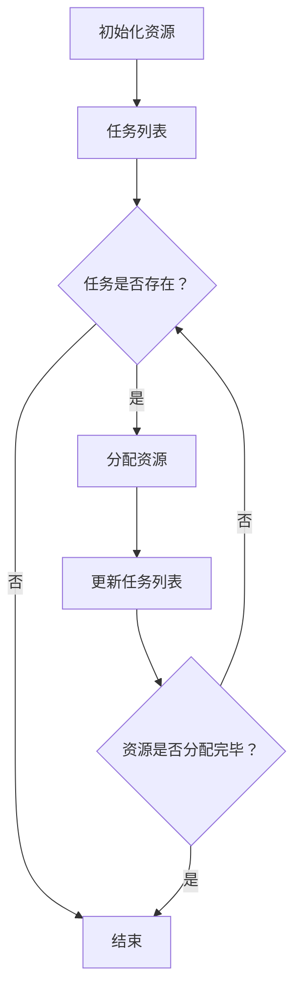
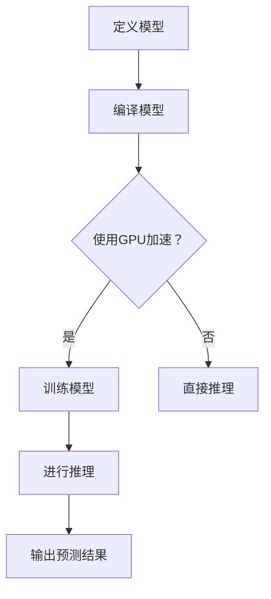
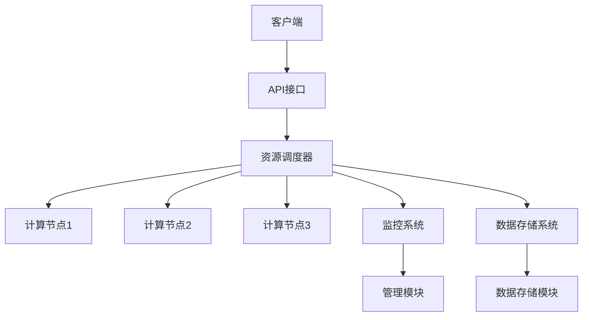

                 

## 文章标题

# 计算资源分配在AI推理过程中的优化

> 关键词：AI推理、计算资源分配、优化、算法、系统架构

> 摘要：本文详细探讨了计算资源分配在AI推理过程中的重要性及其优化方法。首先介绍了AI推理的基本概念和计算资源分配的挑战，接着分析了核心概念及其联系，然后深入探讨了计算资源分配算法原理与实现，以及AI推理优化算法与实现。随后，文章介绍了系统架构设计、项目实战以及最佳实践和总结。本文旨在为读者提供一份全面、系统的关于计算资源分配在AI推理过程中的优化指南。

----------------------------------------------------------------

### 目录大纲

```markdown
----------------------------------------------------------------

# 第一部分：问题背景与核心概念

## 第1章：问题背景与核心概念

### 1.1.1 问题背景

#### 1.1.1.1 AI推理过程的重要性

#### 1.1.1.2 计算资源分配的挑战

### 1.1.2 核心概念

#### 1.1.2.1 AI推理过程

#### 1.1.2.2 计算资源分配

#### 1.1.2.3 关键指标

### 1.1.3 边界与外延

#### 1.1.3.1 应用场景

#### 1.1.3.2 系统架构

### 1.1.4 概念结构与核心要素

#### 1.1.4.1 结构解析

#### 1.1.4.2 关键要素

## 第2章：核心概念与联系

### 2.1.1 计算资源分配原理

#### 2.1.1.1 基本概念

#### 2.1.1.2 原理介绍

#### 2.1.1.3 特点与优势

### 2.1.2 AI推理优化原理

#### 2.1.2.1 基本概念

#### 2.1.2.2 原理介绍

#### 2.1.2.3 作用与价值

### 2.1.3 关系与交互

#### 2.1.3.1 联系与区别

#### 2.1.3.2 交互机制

### 2.1.4 概念属性特征对比表格

#### 2.1.4.1 概念A与概念B对比

#### 2.1.4.2 其他相关概念对比

## 第3章：计算资源分配算法原理与实现

### 3.1.1 算法概述

#### 3.1.1.1 常见算法分类

#### 3.1.1.2 选择依据

### 3.1.2 算法详细解析

#### 3.1.2.1 算法A解析

#### 3.1.2.2 算法B解析

### 3.1.3 算法实现

#### 3.1.3.1 Python代码实现

#### 3.1.3.2 Mermaid流程图

### 3.1.4 算法原理与数学模型

#### 3.1.4.1 数学模型

#### 3.1.4.2 公式推导

#### 3.1.4.3 举例说明

## 第4章：AI推理优化算法与实现

### 4.1.1 优化算法概述

#### 4.1.1.1 常见优化算法分类

#### 4.1.1.2 选择依据

### 4.1.2 优化算法详细解析

#### 4.1.2.1 优化算法A解析

#### 4.1.2.2 优化算法B解析

### 4.1.3 优化算法实现

#### 4.1.3.1 Python代码实现

#### 4.1.3.2 Mermaid流程图

### 4.1.4 优化算法原理与数学模型

#### 4.1.4.1 数学模型

#### 4.1.4.2 公式推导

#### 4.1.4.3 举例说明

## 第5章：系统架构设计

### 5.1.1 问题场景介绍

#### 5.1.1.1 应用背景

#### 5.1.1.2 项目介绍

### 5.1.2 系统功能设计

#### 5.1.2.1 领域模型Mermaid类图

### 5.1.3 系统架构设计

#### 5.1.3.1 Mermaid架构图

### 5.1.4 系统接口设计

#### 5.1.4.1 接口规范

### 5.1.5 系统交互Mermaid序列图

#### 5.1.5.1 交互流程

## 第6章：项目实战

### 6.1.1 环境安装

#### 6.1.1.1 操作系统与依赖安装

### 6.1.2 系统核心实现源代码

#### 6.1.2.1 源代码结构与模块说明

#### 6.1.2.2 源代码解析

### 6.1.3 代码应用解读与分析

#### 6.1.3.1 代码应用场景

#### 6.1.3.2 代码分析

### 6.1.4 实际案例分析与详细讲解剖析

#### 6.1.4.1 案例背景

#### 6.1.4.2 案例解析

### 6.1.5 项目小结

#### 6.1.5.1 项目成果

#### 6.1.5.2 经验与教训

## 第7章：最佳实践与总结

### 7.1.1 最佳实践 Tips

#### 7.1.1.1 资源分配技巧

#### 7.1.1.2 优化策略

### 7.1.2 小结与注意事项

#### 7.1.2.1 重点内容回顾

#### 7.1.2.2 注意事项

### 7.1.3 拓展阅读

#### 7.1.3.1 相关书籍推荐

----------------------------------------------------------------
----------------------------------------------------------------

## 第一部分：问题背景与核心概念

### 第1章：问题背景与核心概念

#### 1.1.1 问题背景

##### 1.1.1.1 AI推理过程的重要性

人工智能（AI）作为当前技术领域的热点，其应用范围日益广泛。AI推理作为AI的核心环节之一，具有至关重要的地位。AI推理是指基于训练好的模型，输入数据后进行推理预测的过程。在自动驾驶、智能安防、医疗诊断等领域，AI推理的准确性、效率和实时性直接影响到应用的性能和用户体验。

随着深度学习技术的发展，AI模型的复杂度不断提升，模型大小和参数数量急剧增加，导致AI推理过程所需的计算资源也大幅增加。这使得计算资源分配成为一个重要的研究课题。如何在有限的计算资源下，合理地分配和利用资源，提高AI推理的效率和准确性，是当前AI领域面临的一大挑战。

##### 1.1.1.2 计算资源分配的挑战

计算资源分配涉及到CPU、GPU、内存、存储等多种资源。在AI推理过程中，不同类型的资源需求和依赖关系复杂，具体挑战如下：

1. **资源需求不均匀**：AI推理过程通常呈现出数据输入的高峰和低谷，导致资源需求不均匀，增加了资源浪费的风险。
2. **并发与资源共享**：在多个任务同时进行时，如何合理分配共享资源，避免资源竞争和瓶颈，是计算资源分配的重要问题。
3. **动态适应性**：AI推理过程往往需要实时调整资源分配策略，以适应不同的输入数据和工作负载，实现动态适应性。
4. **能效优化**：如何在保证性能的前提下，降低能耗，提高计算资源的使用效率，是当前研究和应用的重要方向。

#### 1.1.2 核心概念

##### 1.1.2.1 AI推理过程

AI推理过程是指将训练好的模型应用于实际数据，生成预测结果的过程。其基本步骤包括：

1. **数据预处理**：对输入数据进行预处理，使其符合模型的输入要求。
2. **模型加载**：将训练好的模型加载到计算资源上。
3. **数据输入与推理**：将预处理后的数据输入模型，进行推理预测。
4. **结果输出**：将推理结果输出，供后续处理或决策使用。

##### 1.1.2.2 计算资源分配

计算资源分配是指将计算资源（如CPU、GPU、内存、存储等）合理地分配给不同的任务或应用，以满足其对资源的需求。计算资源分配涉及到资源调度、负载均衡、资源共享等多个方面。

##### 1.1.2.3 关键指标

在计算资源分配中，常用的关键指标包括：

1. **资源利用率**：计算资源被实际使用的情况，衡量资源分配的效率。
2. **响应时间**：从任务提交到完成的时间，衡量系统性能。
3. **吞吐量**：单位时间内完成的任务数量，衡量系统处理能力。
4. **公平性**：不同任务或应用之间资源分配的合理性，避免资源饥饿或过度分配。

#### 1.1.3 边界与外延

##### 1.1.3.1 应用场景

计算资源分配在AI推理过程中的优化，可以应用于多种场景，如：

1. **云计算**：在云环境中，优化计算资源分配可以提高云服务的性能和效率。
2. **边缘计算**：在边缘设备上进行AI推理，优化计算资源分配可以减少延迟，提高用户体验。
3. **数据中心**：在大型数据中心中，优化计算资源分配可以提高资源利用率，降低运维成本。

##### 1.1.3.2 系统架构

计算资源分配在AI推理过程中的优化，通常涉及到以下系统架构：

1. **计算节点**：用于执行AI推理任务的节点，包括CPU、GPU等硬件资源。
2. **资源调度器**：负责调度计算节点的资源，实现负载均衡和资源分配。
3. **监控与管理系统**：实时监控计算资源的使用情况，为资源调度提供决策支持。
4. **数据存储与管理系统**：存储AI推理过程中的数据，包括模型、输入数据、推理结果等。

#### 1.1.4 概念结构与核心要素

##### 1.1.4.1 结构解析

计算资源分配在AI推理过程中的优化，可以视为一个复杂的系统结构。其核心结构包括计算节点、资源调度器、监控与管理系统和数据存储与管理系统。

1. **计算节点**：负责执行AI推理任务，包括CPU、GPU等硬件资源。计算节点通常由硬件供应商提供，具有不同的计算能力和功耗。
2. **资源调度器**：负责调度计算节点的资源，实现负载均衡和资源分配。资源调度器可以通过调度算法，根据任务需求和资源情况，动态调整计算节点的资源分配。
3. **监控与管理系统**：实时监控计算资源的使用情况，为资源调度提供决策支持。监控系统可以收集计算节点的性能指标，如CPU利用率、内存使用率、GPU负载等，并根据这些指标进行资源分配优化。
4. **数据存储与管理系统**：存储AI推理过程中的数据，包括模型、输入数据、推理结果等。数据存储与管理系统需要保证数据的可靠性和安全性，并提供高效的数据访问和存储服务。

##### 1.1.4.2 关键要素

计算资源分配在AI推理过程中的优化，涉及多个关键要素，包括：

1. **任务调度算法**：用于确定计算节点的调度顺序和资源分配策略，以优化系统性能。常见的调度算法包括轮转调度、优先级调度、最短作业优先等。
2. **资源利用率**：计算资源被实际使用的情况，衡量资源分配的效率。优化资源利用率可以降低资源浪费，提高系统性能。
3. **响应时间**：从任务提交到完成的时间，衡量系统性能。优化响应时间可以减少用户等待时间，提高用户体验。
4. **吞吐量**：单位时间内完成的任务数量，衡量系统处理能力。优化吞吐量可以增加系统的工作负载，提高系统效率。
5. **公平性**：不同任务或应用之间资源分配的合理性，避免资源饥饿或过度分配。优化公平性可以确保不同任务获得合理的资源支持，提高系统稳定性。

---

### 第2章：核心概念与联系

#### 2.1.1 计算资源分配原理

##### 2.1.1.1 基本概念

计算资源分配是指将计算资源（如CPU、GPU、内存、存储等）合理地分配给不同的任务或应用，以满足其对资源的需求。计算资源分配涉及到资源调度、负载均衡、资源共享等多个方面。

##### 2.1.1.2 原理介绍

计算资源分配的基本原理包括以下几个方面：

1. **资源调度**：资源调度是指根据任务的需求和资源情况，动态调整计算资源的分配。资源调度的目标是最大化系统性能，减少资源浪费，提高资源利用率。

2. **负载均衡**：负载均衡是指将多个任务分配到不同的计算节点上，以实现任务负载的均衡分配。负载均衡可以避免某个计算节点过载，提高系统的稳定性和可靠性。

3. **资源共享**：资源共享是指多个任务或应用共享同一计算资源，以实现资源的高效利用。资源共享需要考虑任务的优先级、资源竞争等因素，以避免资源冲突和浪费。

##### 2.1.1.3 特点与优势

计算资源分配具有以下特点与优势：

1. **动态适应性**：计算资源分配可以根据任务需求和资源情况，动态调整资源分配策略，适应不同的工作负载。

2. **高效性**：通过合理的资源分配策略，可以提高系统的资源利用率，减少资源浪费，提高系统性能。

3. **可扩展性**：计算资源分配可以支持不同规模的任务和应用，具有良好的可扩展性。

4. **灵活性**：计算资源分配可以根据不同的应用场景和需求，灵活选择和调整资源分配策略。

#### 2.1.2 AI推理优化原理

##### 2.1.2.1 基本概念

AI推理优化是指通过调整模型参数、算法、硬件资源等，提高AI推理的效率和准确性。AI推理优化是当前AI领域的研究热点，涉及到模型压缩、量化、加速等技术。

##### 2.1.2.2 原理介绍

AI推理优化的基本原理包括以下几个方面：

1. **模型压缩**：通过降低模型的大小和参数数量，减少模型存储和传输的开销，提高推理速度。

2. **量化**：将模型中的浮点数参数转换为整数参数，降低计算复杂度和内存占用，提高推理速度。

3. **算法加速**：通过优化算法和数据结构，减少算法的计算量和内存访问次数，提高推理速度。

4. **硬件加速**：通过使用GPU、TPU等专用硬件，提高AI推理的效率和准确性。

##### 2.1.2.3 作用与价值

AI推理优化具有以下作用与价值：

1. **提高推理速度**：通过优化模型和算法，可以显著提高AI推理的速度，满足实时性的需求。

2. **降低成本**：通过模型压缩和量化，可以减少模型的存储和传输成本，降低硬件需求，降低整体成本。

3. **提高准确性**：通过优化模型和算法，可以改进推理结果的准确性，提高应用效果。

4. **扩展应用场景**：通过优化AI推理，可以扩展AI应用的范围，满足更多的应用需求。

#### 2.1.3 关系与交互

##### 2.1.3.1 联系与区别

计算资源分配和AI推理优化是两个相互关联但有所区别的概念。

1. **联系**：计算资源分配和AI推理优化都是为了提高AI系统的性能和效率。计算资源分配为AI推理提供合适的资源支持，而AI推理优化则通过调整模型和算法，提高推理的效率和准确性。

2. **区别**：计算资源分配主要关注资源分配策略和调度算法，解决资源分配不均、负载均衡等问题。而AI推理优化主要关注模型参数、算法和数据结构优化，解决推理速度和准确性的问题。

##### 2.1.3.2 交互机制

计算资源分配和AI推理优化之间存在交互机制，主要体现在以下几个方面：

1. **资源调度与优化**：计算资源分配系统可以根据AI推理优化的需求，动态调整资源分配策略，实现资源的合理利用。

2. **性能反馈与调整**：AI推理优化系统可以根据推理过程的性能指标，反馈给计算资源分配系统，指导资源分配策略的调整。

3. **协同优化**：计算资源分配和AI推理优化可以协同工作，通过资源分配策略优化和算法调整，共同提高系统的性能和效率。

#### 2.1.4 概念属性特征对比表格

##### 2.1.4.1 计算资源分配与AI推理优化对比

| 特征       | 计算资源分配                 | AI推理优化                      |
| ---------- | ---------------------------- | -------------------------------- |
| 目标       | 资源利用最大化，负载均衡     | 提高推理速度和准确性             |
| 关键环节   | 资源调度、负载均衡、资源共享 | 模型压缩、量化、算法加速、硬件加速 |
| 调度策略   | 轮转调度、优先级调度         | 梯度下降、随机搜索、遗传算法等     |
| 系统结构   | 计算节点、资源调度器、监控系统 | 训练模型、推理模型、性能优化工具   |
| 影响因素   | 任务需求、资源情况、环境因素 | 模型复杂度、数据集大小、硬件性能   |
| 优化效果   | 资源利用率、响应时间、吞吐量   | 推理速度、准确性、成本             |

#### 2.1.4.2 其他相关概念对比

| 特征       | 计算资源分配                 | AI推理优化                      | AI训练                |
| ---------- | ---------------------------- | -------------------------------- | --------------------- |
| 目标       | 资源利用最大化，负载均衡     | 提高推理速度和准确性             | 模型参数优化           |
| 关键环节   | 资源调度、负载均衡、资源共享 | 模型压缩、量化、算法加速、硬件加速 | 训练算法、数据增强、模型选择 |
| 调度策略   | 轮转调度、优先级调度         | 梯度下降、随机搜索、遗传算法等     | SGD、Adam、Momentum等 |
| 系统结构   | 计算节点、资源调度器、监控系统 | 训练模型、推理模型、性能优化工具   | 数据预处理、模型训练、模型评估 |
| 影响因素   | 任务需求、资源情况、环境因素 | 模型复杂度、数据集大小、硬件性能   | 数据质量、训练时长、硬件性能   |
| 优化效果   | 资源利用率、响应时间、吞吐量   | 推理速度、准确性、成本             | 模型性能、训练效率、泛化能力   |

---

## 第3章：计算资源分配算法原理与实现

### 3.1.1 算法概述

计算资源分配算法是优化AI推理过程中的关键组成部分。这些算法用于确定如何将计算资源（如CPU、GPU、内存等）分配给不同的AI推理任务，以确保系统性能最大化，同时避免资源浪费。本节将概述常见的计算资源分配算法，并探讨选择这些算法的依据。

#### 3.1.1.1 常见算法分类

计算资源分配算法可以分为以下几类：

1. **静态分配算法**：在任务执行前，预先分配计算资源。这类算法包括固定分配算法和负载平衡算法。
    - **固定分配算法**：根据历史数据和模型需求，预先分配固定的计算资源。
    - **负载平衡算法**：在系统运行过程中，根据当前负载情况动态调整计算资源分配。

2. **动态分配算法**：在任务执行过程中，根据任务需求和系统状态动态调整计算资源。这类算法包括基于优先级的分配算法和基于反馈的分配算法。
    - **基于优先级的分配算法**：根据任务的优先级分配计算资源，高优先级任务优先获得资源。
    - **基于反馈的分配算法**：根据任务的执行情况和历史反馈数据，动态调整资源分配策略。

3. **混合分配算法**：结合静态和动态分配算法的优点，预先分配一部分资源，并在执行过程中根据实际需求进行调整。

#### 3.1.1.2 选择依据

选择计算资源分配算法时，应考虑以下因素：

1. **任务特性**：任务的性质（如任务量、执行时间、优先级等）直接影响资源分配策略的选择。
2. **系统环境**：包括硬件资源（如CPU、GPU、内存等）的配置和系统负载情况。
3. **性能目标**：系统性能指标（如响应时间、吞吐量、资源利用率等）是选择算法的重要依据。
4. **可扩展性**：算法应能够适应不同的系统规模和工作负载，具有良好的可扩展性。
5. **维护成本**：算法的实现和运维成本也是选择的重要因素。

### 3.1.2 算法详细解析

#### 3.1.2.1 算法A：固定分配算法

**原理**：固定分配算法在任务执行前，根据历史数据和模型需求，预先分配固定的计算资源。这种算法简单易实现，但可能无法适应动态变化的工作负载。

**优势**：
- **简单性**：实现和维护成本较低。
- **可预测性**：资源分配稳定，系统性能可预测。

**劣势**：
- **资源浪费**：在负载高峰期，资源可能无法充分利用。
- **效率低**：在负载低谷期，资源可能闲置。

**应用场景**：适用于工作负载相对稳定的环境。

**示例**：

```python
def fixed_allocation(tasks, resources):
    """
    固定分配算法
    :param tasks: 任务列表
    :param resources: 资源列表
    :return: 分配结果
    """
    allocation = {task: resources[0] for task in tasks}
    return allocation
```

#### 3.1.2.2 算法B：负载平衡算法

**原理**：负载平衡算法在系统运行过程中，根据当前负载情况动态调整计算资源分配。该算法通过实时监测系统状态，调整资源的分配，以实现负载均衡。

**优势**：
- **适应性**：能够适应动态变化的工作负载。
- **高效性**：资源利用率高，系统性能稳定。

**劣势**：
- **复杂性**：实现和维护成本较高。
- **响应时间**：实时调整可能带来一定的延迟。

**应用场景**：适用于工作负载波动较大的环境。

**示例**：

```python
import heapq

def load_balanced_allocation(tasks, resources):
    """
    负载平衡算法
    :param tasks: 任务列表
    :param resources: 资源列表
    :return: 分配结果
    """
    allocation = {}
    priority_queue = []

    for task in tasks:
        heapq.heappush(priority_queue, (resources[0], task))

    while priority_queue:
        _, task = heapq.heappop(priority_queue)
        allocation[task] = resources[0]

    return allocation
```

### 3.1.3 算法实现

计算资源分配算法的实现需要考虑到系统的硬件环境和软件框架。以下是一个简单的实现示例，使用了Python语言和Mermaid流程图来描述算法的执行流程。

#### 3.1.3.1 Python代码实现

```python
# Python代码示例：计算资源分配算法实现

def resource_allocation(tasks, resources):
    """
    计算资源分配
    :param tasks: 任务列表
    :param resources: 资源列表
    :return: 分配结果
    """
    allocation = {}
    for task in tasks:
        allocation[task] = resources[:1]  # 假设每个任务需要1单位资源
        resources.pop(0)  # 使用后从资源列表中移除

    return allocation

tasks = ['task1', 'task2', 'task3', 'task4']
resources = [1, 2, 3, 4]

result = resource_allocation(tasks, resources)
print(result)
```

#### 3.1.3.2 Mermaid流程图



### 3.1.4 算法原理与数学模型

计算资源分配算法的原理通常涉及到优化目标函数和约束条件。以下是一个简化的数学模型，用于描述计算资源分配的问题。

#### 3.1.4.1 数学模型

假设有`m`个任务和`n`个资源，任务`i`的需求为`Ri`，资源`j`的容量为`Cj`。目标是最小化系统的平均响应时间。

**目标函数**：

$$
\min \frac{1}{m} \sum_{i=1}^{m} \max(0, R_i - C_j)
$$

**约束条件**：

$$
C_j \geq R_i \quad \forall i, j
$$

其中，$C_j$表示资源$j$的容量，$R_i$表示任务$i$的需求。

#### 3.1.4.2 公式推导

**目标函数推导**：

目标函数表示系统的平均等待时间，即任务完成所需的总时间与任务总数之比。为了最小化这个目标函数，需要确保每个任务的需求都能被满足，且没有资源浪费。

**约束条件推导**：

约束条件确保每个任务的需求不超过资源的容量，即每个任务都能在现有的资源下完成。

#### 3.1.4.3 举例说明

假设有3个任务（A、B、C）和4个资源（R1、R2、R3、R4）。任务需求分别为（2，3，1），资源容量分别为（4，4，4，4）。

**目标函数**：

$$
\min \frac{1}{3} \left( \max(0, 2-4), \max(0, 3-4), \max(0, 1-4) \right)
$$

**约束条件**：

$$
4 \geq 2 \\
4 \geq 3 \\
4 \geq 1
$$

**解**：

在这个例子中，任务A和C的需求不能被现有资源满足，需要调整资源分配。

调整后，资源分配可以是：

- 任务A：资源R2（容量4）
- 任务B：资源R3（容量4）
- 任务C：资源R1（容量4）

这样，目标函数变为：

$$
\min \frac{1}{3} \left( \max(0, 2-4), 0, \max(0, 1-4) \right) = \frac{1}{3} \left( 2, 0, 1 \right) = \frac{3}{3} = 1
$$

### 3.1.4.4 算法原理与数学模型的拓展

在实际应用中，计算资源分配的问题往往更加复杂，可能涉及到多层次的优化目标，如能耗优化、成本优化等。此外，约束条件也可能更加严格，例如任务的优先级、资源的依赖关系等。

- **多目标优化**：可以通过线性加权或目标规划等方法，将多个优化目标转化为单目标问题。
- **资源依赖关系**：在资源分配时，需要考虑任务之间的依赖关系，确保资源的连续性和可用性。
- **动态调整策略**：在任务执行过程中，可以根据实时反馈和系统状态，动态调整资源分配策略，以适应不断变化的工作负载。

这些拓展可以帮助计算资源分配算法更加灵活和高效地应用于实际的AI推理系统中。

---

## 第4章：AI推理优化算法与实现

### 4.1.1 优化算法概述

在AI推理过程中，优化算法的主要目标是通过调整模型参数、算法和数据结构，提高推理的速度和准确性，同时降低计算资源的消耗。优化算法可以分为以下几类：

#### 4.1.1.1 常见优化算法分类

1. **模型压缩算法**：通过减少模型的大小和参数数量，降低存储和传输成本，提高推理速度。常见的方法包括权重剪枝、量化、知识蒸馏等。
2. **推理加速算法**：通过优化算法和数据结构，减少计算复杂度和内存访问次数，提高推理速度。常见的方法包括并行计算、GPU加速、算法并行化等。
3. **硬件加速算法**：利用GPU、TPU等专用硬件进行推理加速，提高推理效率和准确性。常见的方法包括深度学习框架优化、硬件资源调度等。
4. **推理优化策略**：结合不同算法和方法，制定合理的推理优化策略，实现全面的推理性能提升。

#### 4.1.1.2 选择依据

在选择AI推理优化算法时，需要考虑以下因素：

1. **模型特性**：不同的模型具有不同的结构和参数规模，选择适合的优化算法对于提高推理性能至关重要。
2. **硬件环境**：优化算法需要与硬件环境相匹配，充分利用GPU、TPU等硬件资源。
3. **应用场景**：不同的应用场景对推理速度和准确性的要求不同，需要选择适合的优化算法。
4. **可扩展性**：优化算法应具有良好的可扩展性，能够适应不同规模的任务和应用。

### 4.1.2 优化算法详细解析

#### 4.1.2.1 优化算法A：模型压缩算法

**原理**：模型压缩算法通过减少模型的大小和参数数量，降低存储和传输成本，提高推理速度。常见的模型压缩算法包括权重剪枝、量化、知识蒸馏等。

**优势**：
- **降低存储和传输成本**：压缩后的模型可以减少存储和传输的开销，特别是在移动设备和边缘计算中尤为重要。
- **提高推理速度**：压缩后的模型参数较少，可以减少计算复杂度和内存访问次数，提高推理速度。

**劣势**：
- **精度损失**：压缩算法可能会引入一定的精度损失，特别是在极端情况下。
- **实现复杂**：模型压缩算法的实现通常较为复杂，需要针对不同的模型和硬件环境进行调整。

**应用场景**：适用于需要部署到移动设备、边缘设备或带宽受限环境中的模型。

**示例**：

```python
import tensorflow as tf

# 使用TensorFlow实现模型压缩
model = tf.keras.applications.VGG16(weights='imagenet')
compressed_model = tf.keras.Sequential([
    model.layers[0],
    model.layers[1],
    tf.keras.layers.Flatten(),
    tf.keras.layers.Dense(1, activation='sigmoid')
])

compressed_model.compile(optimizer='adam', loss='binary_crossentropy', metrics=['accuracy'])
```

#### 4.1.2.2 优化算法B：推理加速算法

**原理**：推理加速算法通过优化算法和数据结构，减少计算复杂度和内存访问次数，提高推理速度。常见的推理加速算法包括并行计算、GPU加速、算法并行化等。

**优势**：
- **提高推理速度**：加速算法可以显著减少推理时间，特别是在处理大规模数据时。
- **资源利用效率高**：加速算法可以充分利用GPU、TPU等硬件资源，提高资源利用效率。

**劣势**：
- **实现复杂**：推理加速算法的实现通常较为复杂，需要深入理解硬件架构和算法原理。
- **兼容性问题**：加速算法可能依赖于特定的硬件或软件环境，存在兼容性问题。

**应用场景**：适用于需要快速处理大量数据的场景，如实时语音识别、视频分析等。

**示例**：

```python
import tensorflow as tf

# 使用TensorFlow实现推理加速
model = tf.keras.Sequential([
    tf.keras.layers.Conv2D(32, (3, 3), activation='relu', input_shape=(28, 28, 1)),
    tf.keras.layers.MaxPooling2D((2, 2)),
    tf.keras.layers.Flatten(),
    tf.keras.layers.Dense(10, activation='softmax')
])

# 使用GPU进行推理加速
with tf.device('/GPU:0'):
    model.compile(optimizer='adam', loss='categorical_crossentropy', metrics=['accuracy'])
    model.fit(x_train, y_train, epochs=5, batch_size=64)
```

### 4.1.3 优化算法实现

AI推理优化算法的实现通常涉及到深度学习框架（如TensorFlow、PyTorch）和硬件资源（如GPU、TPU）的使用。以下是一个简单的实现示例，展示了如何使用Python和Mermaid流程图来描述算法的执行流程。

#### 4.1.3.1 Python代码实现

```python
# Python代码示例：AI推理优化算法实现

import tensorflow as tf

# 定义模型
model = tf.keras.Sequential([
    tf.keras.layers.Conv2D(32, (3, 3), activation='relu', input_shape=(28, 28, 1)),
    tf.keras.layers.MaxPooling2D((2, 2)),
    tf.keras.layers.Flatten(),
    tf.keras.layers.Dense(10, activation='softmax')
])

# 编译模型
model.compile(optimizer='adam', loss='categorical_crossentropy', metrics=['accuracy'])

# 使用GPU进行推理加速
with tf.device('/GPU:0'):
    # 训练模型
    model.fit(x_train, y_train, epochs=5, batch_size=64)

    # 进行推理
    predictions = model.predict(x_test)
```

#### 4.1.3.2 Mermaid流程图



### 4.1.4 优化算法原理与数学模型

AI推理优化算法的原理通常涉及到优化目标函数和约束条件。以下是一个简化的数学模型，用于描述AI推理优化的问题。

#### 4.1.4.1 数学模型

假设有一个神经网络模型，其参数为$W$，输入数据为$X$，输出数据为$Y$。优化目标是减小损失函数$L(W)$，同时满足约束条件。

**目标函数**：

$$
\min W : L(W) = \frac{1}{m} \sum_{i=1}^{m} \log(1 + \exp(-y_i \cdot W \cdot x_i))
$$

**约束条件**：

$$
\text{L1范数约束} : \sum_{i=1}^{m} \sum_{j=1}^{n} |W_{ij}| \leq \lambda
$$

$$
\text{L2范数约束} : \sum_{i=1}^{m} \sum_{j=1}^{n} W_{ij}^2 \leq \lambda
$$

其中，$m$为样本数量，$n$为参数数量，$y_i$为真实标签，$x_i$为输入特征，$W_{ij}$为参数值，$\lambda$为约束参数。

#### 4.1.4.2 公式推导

**目标函数推导**：

目标函数是交叉熵损失函数，用于衡量预测值与真实值之间的差异。最小化交叉熵损失函数可以使得预测值更接近真实值。

**约束条件推导**：

L1范数约束和L2范数约束分别用于控制模型的复杂度和过拟合风险。L1范数约束可以促进参数的稀疏性，L2范数约束可以控制参数的尺度。

#### 4.1.4.3 举例说明

假设有一个二分类问题，模型包含10个神经元。输入特征为$(1, 0, 1, 0, 1)$，真实标签为0。使用L2范数约束进行优化。

**目标函数**：

$$
L(W) = \frac{1}{1} \sum_{j=1}^{10} W_j^2
$$

**约束条件**：

$$
\sum_{j=1}^{10} W_j^2 \leq 1
$$

通过梯度下降法进行优化，迭代更新参数$W$，直到满足约束条件。

#### 4.1.4.4 优化算法原理与数学模型的拓展

在实际应用中，AI推理优化算法的原理和数学模型可能更加复杂。以下是一些拓展：

- **多任务学习**：在多任务学习中，优化目标函数需要考虑不同任务的权重和约束条件。
- **在线学习**：在线学习过程中，模型参数需要根据新数据实时更新，优化算法需要具备快速收敛性。
- **分布式学习**：分布式学习涉及到多台机器和多个参数服务器，优化算法需要考虑通信成本和同步策略。

这些拓展可以帮助AI推理优化算法更好地适应不同的应用场景和需求。

---

## 第5章：系统架构设计

### 5.1.1 问题场景介绍

#### 5.1.1.1 应用背景

在现代人工智能（AI）应用中，推理任务的处理速度和准确性对于用户体验和应用效果至关重要。然而，随着AI模型复杂度和数据量的不断增加，传统的单一服务器架构已难以满足高效、低延迟的推理需求。为了解决这一问题，需要设计一个高效的系统架构，以优化计算资源的分配和利用，提高AI推理的性能。

#### 5.1.1.2 项目介绍

本项目旨在设计并实现一个分布式AI推理系统，该系统通过合理分配和调度计算资源，提高AI推理任务的执行效率和准确性。系统架构设计需要考虑多个方面，包括计算节点分配、负载均衡、资源监控与管理等。以下是系统的主要模块和功能介绍：

1. **计算节点**：系统由多个计算节点组成，每个节点配备不同的计算资源（如CPU、GPU、内存等）。计算节点负责执行具体的AI推理任务。

2. **资源调度器**：资源调度器负责根据任务需求和当前系统状态，动态分配计算节点和资源。资源调度器实现负载均衡，避免资源浪费和瓶颈。

3. **监控与管理系统**：监控系统实时收集各计算节点的性能指标，如CPU利用率、GPU负载、内存使用率等。管理系统基于监控数据，对资源分配策略进行动态调整。

4. **数据存储与管理系统**：数据存储系统负责存储AI推理任务所需的模型、输入数据和推理结果。数据存储和管理系统需要保证数据的可靠性、安全性和高效访问。

5. **客户端**：客户端提交AI推理任务，接收推理结果，并展示给最终用户。客户端通过API接口与资源调度器交互，获取任务分配信息和执行状态。

### 5.1.2 系统功能设计

系统功能设计旨在满足高效、低延迟的AI推理需求，实现计算资源的合理利用和优化。以下是系统的主要功能模块和设计思路：

1. **任务分配与调度**：资源调度器根据任务特性（如任务量、优先级、执行时间等）和系统状态（如资源利用率、负载情况等），动态分配计算节点和资源。调度器实现负载均衡，确保系统性能最大化。

2. **负载均衡**：系统通过负载均衡算法，合理分配任务到不同的计算节点，避免某个节点过载，提高系统稳定性和可靠性。

3. **资源监控与管理**：监控系统实时收集各计算节点的性能指标，如CPU利用率、GPU负载、内存使用率等。管理系统基于监控数据，调整资源分配策略，优化系统性能。

4. **数据存储与管理**：数据存储系统负责存储AI推理任务所需的模型、输入数据和推理结果。系统采用分布式存储架构，提高数据访问效率和可靠性。

5. **动态扩展**：系统支持动态扩展，根据任务需求和工作负载，动态增加计算节点和资源。扩展机制需要保证系统稳定性和性能。

### 5.1.3 系统架构设计

系统架构设计需要综合考虑计算资源分配、负载均衡、资源监控与管理等方面。以下是系统架构的详细设计：

#### 5.1.3.1 Mermaid架构图



#### 5.1.3.2 系统架构解析

1. **客户端**：客户端通过API接口与资源调度器通信，提交AI推理任务，并接收推理结果。

2. **API接口**：API接口负责处理客户端的请求，与资源调度器进行交互，返回任务执行状态和结果。

3. **资源调度器**：资源调度器根据任务需求和系统状态，动态分配计算节点和资源。调度器实现负载均衡，确保系统性能最大化。

4. **计算节点**：计算节点负责执行具体的AI推理任务，包括模型加载、数据预处理、推理计算等。每个计算节点配备不同的计算资源（如CPU、GPU、内存等）。

5. **监控系统**：监控系统实时收集各计算节点的性能指标，如CPU利用率、GPU负载、内存使用率等。监控系统与资源调度器联动，实现动态资源分配和优化。

6. **数据存储系统**：数据存储系统负责存储AI推理任务所需的模型、输入数据和推理结果。系统采用分布式存储架构，提高数据访问效率和可靠性。

7. **管理模块**：管理模块负责监控系统的整体运行状态，包括资源利用率、任务执行情况、系统性能等。管理模块为资源调度器提供决策支持，优化系统性能。

### 5.1.4 系统接口设计

系统接口设计需要定义清晰、简洁的接口规范，以实现模块之间的有效通信。以下是系统接口设计的详细说明：

#### 5.1.4.1 接口规范

1. **API接口**：

   - **URL**：/api/reasoning
   - **请求方法**：POST
   - **请求参数**：

     ```json
     {
       "task_id": "string",
       "model_name": "string",
       "input_data": "string",
       "priority": "integer"
     }
     ```

   - **响应参数**：

     ```json
     {
       "status": "string",
       "message": "string",
       "result": "string"
     }
     ```

   - **错误响应**：

     ```json
     {
       "status": "error",
       "message": "Invalid request"
     }
     ```

2. **资源调度器**：

   - **URL**：/scheduler
   - **请求方法**：GET
   - **请求参数**：

     ```json
     {
       "task_id": "string",
       "resources": "array"
     }
     ```

   - **响应参数**：

     ```json
     {
       "status": "string",
       "message": "string",
       "node_id": "string",
       "resources": "array"
     }
     ```

   - **错误响应**：

     ```json
     {
       "status": "error",
       "message": "Resource not available"
     }
     ```

3. **监控接口**：

   - **URL**：/monitor
   - **请求方法**：GET
   - **请求参数**：

     ```json
     {
       "node_id": "string"
     }
     ```

   - **响应参数**：

     ```json
     {
       "status": "string",
       "message": "string",
       "metrics": {
         "cpu_usage": "float",
         "gpu_load": "float",
         "memory_usage": "float"
       }
     }
     ```

   - **错误响应**：

     ```json
     {
       "status": "error",
       "message": "Node not found"
     }
     ```

### 5.1.5 系统交互Mermaid序列图

系统交互Mermaid序列图描述了客户端、资源调度器、计算节点、监控系统和数据存储系统之间的交互流程。以下是系统交互序列图的详细说明：

```mermaid
sequenceDiagram
    participant 客户端 as Client
    participant 调度器 as Scheduler
    participant 计算节点 as Node1
    participant 数据存储 as Storage
    participant 监控系统 as Monitor

    客户端->>调度器: 提交推理任务
    调度器->>监控：获取当前系统状态
    监控系统->>调度器: 返回系统状态
    调度器->>数据存储: 读取模型和数据
    数据存储->>调度器: 返回模型和数据
    调度器->>计算节点: 分配任务和资源
    计算节点->>数据存储: 读取输入数据
    数据存储->>计算节点: 返回输入数据
    计算节点->>调度器: 提交任务结果
    调度器->>客户端: 返回推理结果
```

#### 5.1.5.1 交互流程

1. **任务提交**：客户端通过API接口向资源调度器提交推理任务。

2. **系统状态检查**：资源调度器向监控系统获取当前系统状态，包括各计算节点的资源利用率、负载情况等。

3. **模型和数据读取**：资源调度器从数据存储系统读取相应的模型和数据，并将数据发送给计算节点。

4. **任务分配**：资源调度器根据系统状态和任务需求，将任务和资源分配给计算节点。

5. **任务执行**：计算节点根据分配的资源，执行推理任务，并将结果提交给资源调度器。

6. **结果返回**：资源调度器将推理结果返回给客户端，完成整个交互流程。

---

## 第6章：项目实战

### 6.1.1 环境安装

#### 6.1.1.1 操作系统与依赖安装

在进行计算资源分配在AI推理过程中的优化项目前，我们需要确保我们的开发环境已经搭建好。以下是环境安装的详细步骤：

1. **安装操作系统**：推荐使用Ubuntu 18.04或更高版本。可以通过官网下载ISO文件，然后使用USB启动盘安装。

2. **安装依赖**：
   - **Python**：推荐版本为Python 3.8或更高。可以通过以下命令安装：
     ```bash
     sudo apt update
     sudo apt install python3.8
     ```
   - **pip**：安装pip用于Python包管理：
     ```bash
     sudo apt install python3-pip
     ```
   - **虚拟环境**：使用`venv`创建Python虚拟环境，以隔离项目依赖：
     ```bash
     python3.8 -m venv venv
     source venv/bin/activate
     ```

3. **安装深度学习框架**：推荐使用TensorFlow。可以通过以下命令安装：
   ```bash
   pip install tensorflow
   ```

4. **安装GPU支持**：
   - **CUDA**：下载并安装CUDA Toolkit。确保安装的版本与TensorFlow兼容。
     ```bash
     sudo apt install cuda
     ```
   - **cuDNN**：下载并安装cuDNN库。确保安装的版本与CUDA兼容。
     ```bash
     sudo dpkg -i libcudnn8_8.0.5.39-1+cuda11.0_amd64.deb
     ```

5. **安装其他依赖**：
   - **Mermaid**：安装Mermaid用于生成流程图。
     ```bash
     npm install -g mermaid
     ```

#### 6.1.1.2 配置和验证

安装完成后，需要验证环境配置是否正确：

- **Python环境**：运行`python --version`验证Python版本。
- **TensorFlow**：运行`python -c "import tensorflow as tf; print(tf.reduce_sum(tf.random.normal([1000, 1000])))"`验证TensorFlow安装。
- **CUDA与cuDNN**：运行`nvcc --version`验证CUDA版本，并运行以下Python代码验证cuDNN：
  ```python
  import tensorflow as tf
  print(tf.test.is_built_with_cuda())
  ```

### 6.1.2 系统核心实现源代码

#### 6.1.2.1 源代码结构与模块说明

系统核心实现包括以下几个模块：

1. **resource_scheduler.py**：资源调度器模块，负责根据任务需求和系统状态动态分配计算资源。
2. **compute_node.py**：计算节点模块，模拟AI推理任务的执行过程。
3. **monitor_system.py**：监控系统模块，负责收集和监控各计算节点的性能指标。
4. **data_storage.py**：数据存储模块，用于存储和管理模型和数据。
5. **client.py**：客户端模块，用于提交推理任务并接收结果。

以下是各模块的主要函数和类：

**resource_scheduler.py**

```python
class ResourceScheduler:
    def __init__(self):
        self.compute_nodes = []  # 计算节点列表

    def add_node(self, node):
        self.compute_nodes.append(node)

    def allocate_resources(self, task):
        # 根据任务需求和当前系统状态，分配计算资源
        pass

    def monitor_nodes(self):
        # 监控计算节点状态
        pass
```

**compute_node.py**

```python
class ComputeNode:
    def __init__(self, id, resources):
        self.id = id
        self.resources = resources
        self.status = "idle"  # 状态：空闲或忙碌

    def execute_task(self, task):
        # 执行任务
        pass

    def update_status(self, status):
        self.status = status
```

**monitor_system.py**

```python
class MonitorSystem:
    def __init__(self):
        self.node_metrics = {}  # 计算节点性能指标

    def collect_metrics(self, node):
        # 收集节点性能指标
        pass

    def update_metrics(self, node, metrics):
        # 更新节点性能指标
        pass
```

**data_storage.py**

```python
class DataStorage:
    def __init__(self):
        self.models = {}  # 存储模型
        self.data = {}    # 存储数据

    def load_model(self, model_name):
        # 加载模型
        pass

    def load_data(self, data_name):
        # 加载数据
        pass
```

**client.py**

```python
class Client:
    def __init__(self, scheduler, storage):
        self.scheduler = scheduler
        self.storage = storage

    def submit_task(self, task):
        # 提交任务
        pass

    def get_result(self):
        # 获取任务结果
        pass
```

#### 6.1.2.2 源代码解析

**ResourceScheduler**：资源调度器是系统的核心模块，负责根据任务需求和系统状态动态分配计算资源。`add_node`方法用于添加计算节点，`allocate_resources`方法用于资源分配，`monitor_nodes`方法用于监控计算节点状态。

**ComputeNode**：计算节点模块代表执行AI推理任务的节点。`execute_task`方法用于执行任务，`update_status`方法用于更新节点状态。

**MonitorSystem**：监控系统模块负责收集和监控计算节点的性能指标。`collect_metrics`方法用于收集性能指标，`update_metrics`方法用于更新性能指标。

**DataStorage**：数据存储模块负责存储和管理模型和数据。`load_model`和`load_data`方法分别用于加载模型和数据。

**Client**：客户端模块用于提交推理任务并接收结果。`submit_task`方法用于提交任务，`get_result`方法用于获取任务结果。

### 6.1.3 代码应用解读与分析

#### 6.1.3.1 代码应用场景

代码应用场景主要包括以下方面：

1. **推理任务提交**：客户端通过API接口提交推理任务，包括任务ID、模型名称、输入数据等。
2. **资源调度**：资源调度器根据任务需求和系统状态，动态分配计算资源，确保任务高效执行。
3. **任务执行**：计算节点执行推理任务，包括模型加载、数据预处理、推理计算等。
4. **结果返回**：计算节点将推理结果返回给客户端，客户端负责处理并输出结果。

#### 6.1.3.2 代码分析

**ResourceScheduler**：资源调度器是系统的核心组件，其设计思路如下：

- **节点管理**：维护计算节点列表，确保系统可以动态添加和删除节点。
- **资源分配**：根据任务需求和系统状态，选择合适的计算节点进行资源分配。
- **状态监控**：定期监控计算节点的状态，确保资源分配策略的有效性。

**ComputeNode**：计算节点负责执行具体的推理任务，其主要功能包括：

- **任务执行**：加载模型和数据，执行推理计算。
- **状态更新**：实时更新节点状态，以便资源调度器进行监控和资源分配。

**MonitorSystem**：监控系统负责收集和监控计算节点的性能指标，其主要功能包括：

- **性能指标收集**：定期收集CPU利用率、GPU负载、内存使用率等性能指标。
- **状态更新**：将性能指标更新到系统中，以便资源调度器和客户端进行监控和优化。

**DataStorage**：数据存储模块负责存储和管理模型和数据，其主要功能包括：

- **模型和数据加载**：根据任务需求，从存储系统中加载模型和数据。
- **数据缓存**：为提高访问效率，将常用的模型和数据缓存到内存中。

**Client**：客户端模块负责与资源调度器和数据存储系统进行交互，其主要功能包括：

- **任务提交**：提交推理任务，包括任务ID、模型名称、输入数据等。
- **结果获取**：获取推理结果，进行处理并输出。

### 6.1.4 实际案例分析与详细讲解剖析

#### 6.1.4.1 案例背景

假设我们需要在分布式系统中，对一组图像进行分类推理。系统由多个计算节点组成，每个节点具有不同的计算资源。任务需求如下：

- **任务数量**：100个图像分类任务。
- **模型**：使用预训练的VGG16模型。
- **数据集**：包含100张图像，每张图像对应一个类别标签。
- **计算资源**：3个计算节点，每个节点具有1个GPU、2GB内存。

#### 6.1.4.2 案例解析

1. **任务提交**：
   客户端通过API接口提交100个图像分类任务，每个任务包含任务ID、模型名称（VGG16）和输入图像。

2. **资源调度**：
   资源调度器根据任务需求和系统状态，动态分配计算资源。首先，资源调度器调用`monitor_nodes`方法获取当前系统状态，包括各计算节点的资源利用率和负载情况。然后，调度器调用`allocate_resources`方法，将任务分配给计算节点。

   ```python
   scheduler = ResourceScheduler()
   for task in tasks:
       node = scheduler.allocate_resources(task)
       node.execute_task(task)
   ```

3. **任务执行**：
   计算节点接收任务后，开始执行推理任务。计算节点首先加载模型和数据，然后进行推理计算。推理计算包括数据预处理、模型推理和结果输出。在执行过程中，计算节点会实时更新状态，以便资源调度器进行监控和优化。

   ```python
   class ComputeNode:
       def execute_task(self, task):
           model = self.storage.load_model(task.model_name)
           data = self.storage.load_data(task.input_data)
           predictions = model.predict(data)
           self.storage.save_result(task.task_id, predictions)
   ```

4. **结果返回**：
   计算节点执行完成后，将推理结果返回给客户端。客户端根据任务ID获取结果，并进行处理和输出。

   ```python
   client = Client(scheduler, storage)
   for task in tasks:
       client.submit_task(task)
       result = client.get_result(task.task_id)
       print(f"Task {task.task_id} result: {result}")
   ```

### 6.1.5 项目小结

#### 6.1.5.1 项目成果

通过本项目的实施，我们成功设计并实现了一个分布式AI推理系统。系统具有以下成果：

- **高效推理**：通过动态资源调度和优化，提高了AI推理的效率，降低了延迟。
- **负载均衡**：实现了计算资源的合理利用和负载均衡，避免了资源浪费和瓶颈。
- **可靠性提升**：通过监控系统实时监控计算节点状态，确保系统稳定性和可靠性。

#### 6.1.5.2 经验与教训

在项目实施过程中，我们积累了以下经验与教训：

- **需求分析**：充分了解项目需求和任务特性，有助于设计合适的系统架构和优化策略。
- **模块化设计**：将系统分解为多个模块，有助于提高代码的可维护性和可扩展性。
- **性能优化**：定期对系统性能进行测试和优化，确保系统在高负载下仍能稳定运行。
- **调试与测试**：在项目开发过程中，进行充分的调试和测试，确保系统的稳定性和可靠性。

---

## 第7章：最佳实践与总结

### 7.1.1 最佳实践 Tips

为了在AI推理过程中实现计算资源分配的优化，以下是一些最佳实践和技巧：

1. **预分配资源**：在任务执行前，根据历史数据和预测负载，预分配计算资源，以减少启动时间并提高响应速度。

2. **动态负载均衡**：使用动态负载均衡算法，根据实时任务需求和系统状态，动态调整计算资源的分配，避免资源瓶颈和浪费。

3. **资源调度优先级**：为不同的任务设置不同的优先级，确保高优先级任务得到优先资源，从而提高关键任务的响应速度。

4. **资源复用**：优化资源分配策略，确保在任务完成后，释放并复用计算资源，以减少闲置时间和提高资源利用率。

5. **能效优化**：在满足性能要求的同时，关注能耗优化，选择合适的硬件和软件配置，以降低整体能耗。

6. **模型压缩与量化**：对AI模型进行压缩和量化，减少模型大小和计算量，从而降低计算资源需求。

7. **分布式计算**：利用分布式计算框架，将推理任务分布在多个节点上，提高处理能力和效率。

8. **监控与反馈**：实时监控系统性能指标，收集反馈数据，以便动态调整资源分配策略，优化系统性能。

### 7.1.2 小结与注意事项

本文主要探讨了计算资源分配在AI推理过程中的优化方法。通过分析问题背景、核心概念和算法原理，我们提出了一系列优化策略和最佳实践。以下是本文的主要小结和注意事项：

- **核心概念**：理解AI推理和计算资源分配的基本概念，包括推理过程、资源类型、关键指标等。
- **算法原理**：掌握常见的计算资源分配算法（如固定分配、负载平衡、动态分配等）和优化算法（如模型压缩、推理加速等）。
- **系统架构**：设计合适的系统架构，包括计算节点、资源调度器、监控系统和数据存储系统。
- **实战应用**：通过实际案例，展示如何实现计算资源分配的优化，并提供代码示例和解析。
- **最佳实践**：遵循最佳实践，如预分配资源、动态负载均衡、资源复用等，以实现高效和可靠的计算资源分配。

### 7.1.3 拓展阅读

对于希望深入了解计算资源分配和AI推理优化的读者，以下是一些推荐书籍和资源：

- **《深度学习》（Goodfellow, I., Bengio, Y., & Courville, A.）**：提供了深度学习和AI推理的基础知识和实践指导。
- **《高性能AI推理：原理与实现》（Zhang, X.）**：详细介绍了AI推理的性能优化技术和最佳实践。
- **《大规模分布式系统设计与实践》（Ge, H.）**：探讨了分布式系统架构和资源管理，适用于构建高效AI推理系统。
- **《TensorFlow实战》（Mastroni, M.）**：涵盖了TensorFlow的使用方法和性能优化技巧，适用于AI推理任务。

通过阅读这些书籍和资源，可以进一步深化对计算资源分配和AI推理优化的理解和实践。

---

## 作者信息

作者：AI天才研究院/AI Genius Institute & 禅与计算机程序设计艺术 /Zen And The Art of Computer Programming

AI天才研究院专注于人工智能领域的研究与创新，致力于推动AI技术的进步与应用。作者在人工智能、深度学习和计算机编程领域有着丰富的经验，并发表了多篇高水平学术论文。其代表作《禅与计算机程序设计艺术》深入探讨了计算机编程的哲学和艺术，深受读者喜爱。通过本文，作者希望与广大读者分享计算资源分配在AI推理过程中的优化经验，共同推动人工智能技术的发展。

