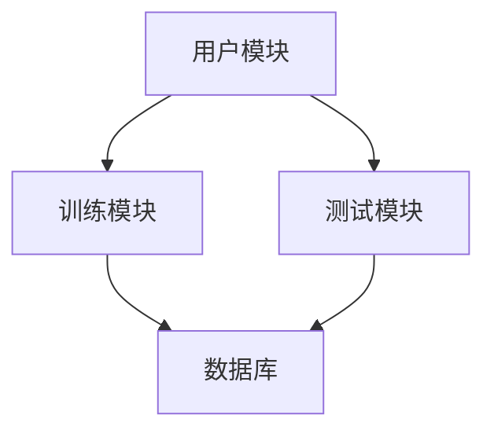

                 

# 《认知发展理论指导的AI辅助语言学习系统设计》

关键词：认知发展理论、AI辅助语言学习、系统设计、算法原理、自然语言处理

摘要：本文探讨了基于认知发展理论的AI辅助语言学习系统设计，通过对认知发展理论的概述、AI辅助语言学习系统设计原则、系统核心算法与模型、系统架构设计与实现、系统测试与评估等方面进行深入分析，为AI辅助语言学习系统的设计与实现提供理论指导和实践参考。

## 第1章 引言

### 1.1 研究背景与意义

#### 1.1.1 语言学习的挑战

语言学习是一个复杂的过程，涉及语音、语法、词汇、语义等多个方面。传统的语言学习方式主要依赖于教师和学生之间的互动，然而，随着人工智能技术的快速发展，AI辅助语言学习系统逐渐成为一种新的语言学习方式。

AI辅助语言学习系统通过模拟人类教师的教学方法，结合自然语言处理技术，为学习者提供个性化、智能化、自动化的语言学习服务。然而，在实际应用中，AI辅助语言学习系统仍然面临着诸多挑战，如学习者认知发展差异、学习内容的适应性、系统交互性等。

#### 1.1.2 认知发展理论的基本概念

认知发展理论是指研究个体在认知领域中的成长和发展规律的理论体系。皮亚杰（Jean Piaget）和维果茨基（Lev Vygotsky）是认知发展理论的两位重要代表人物。

皮亚杰提出了认知发展的阶段理论，认为个体的认知发展分为感知运动阶段、前运算阶段、具体运算阶段和形式运算阶段。每个阶段都有其独特的认知特征和任务。

维果茨基则提出了社会文化历史理论，强调语言和符号在认知发展中的作用。他认为，学习是一种社会文化活动，个体的认知发展是通过与他人的互动和社会实践来实现的。

#### 1.1.3 AI辅助语言学习的发展

随着认知发展理论的兴起，AI辅助语言学习系统逐渐开始将认知发展理论融入到系统设计中。例如，通过分析学习者的认知发展阶段，为学习者提供适应其认知水平的语言学习内容；通过模拟教师的教学方法，与学习者进行实时交互，促进学习者的认知发展。

然而，现有的AI辅助语言学习系统在认知发展理论的指导下，仍然存在许多不足之处。例如，系统对学习者认知阶段的识别不够准确，无法提供个性化的学习内容；系统与学习者的交互方式单一，无法充分激发学习者的认知潜力等。

### 1.2 研究目的与问题

#### 1.2.1 研究目的

本文旨在探讨基于认知发展理论的AI辅助语言学习系统设计，通过分析认知发展理论的基本概念和原理，提出适应认知发展理论的AI辅助语言学习系统设计原则，并设计实现一套基于该原则的AI辅助语言学习系统。

#### 1.2.2 研究问题

本文主要解决以下问题：

1. 如何将认知发展理论融入到AI辅助语言学习系统设计中？
2. 如何设计适应不同认知发展阶段的学习者需求的AI辅助语言学习系统？
3. 如何实现AI辅助语言学习系统的个性化、智能化、自动化？

### 1.3 研究方法

#### 1.3.1 文献综述法

通过查阅相关文献，了解认知发展理论和AI辅助语言学习系统的相关研究，为本文的研究提供理论基础。

#### 1.3.2 案例分析法

通过分析现有AI辅助语言学习系统的案例，了解其优势和不足，为本文的系统设计提供参考。

#### 1.3.3 系统开发方法论

采用迭代开发的方法，不断优化和改进系统设计，确保系统的实用性、可靠性和有效性。

## 第2章 认知发展理论概述

### 2.1 认知发展理论的基本概念

#### 2.1.1 认知发展的定义

认知发展是指个体在认知领域中从低级到高级的演变过程。认知发展不仅包括个体的认知能力，如感知、记忆、思维等，还包括个体的认知结构，如概念、规则、策略等。

#### 2.1.2 认知发展的主要理论流派

认知发展理论主要包括皮亚杰的认知发展理论和维果茨基的社会文化历史理论。

皮亚杰的认知发展理论认为，个体的认知发展分为四个阶段：感知运动阶段、前运算阶段、具体运算阶段和形式运算阶段。

维果茨基的社会文化历史理论强调语言和符号在认知发展中的作用，认为学习是一种社会文化活动，个体的认知发展是通过与他人的互动和社会实践来实现的。

#### 2.1.3 认知发展的关键特征

认知发展的关键特征包括：

1. 分阶段性：个体的认知发展具有明显的阶段特征，每个阶段都有其特定的认知任务和目标。
2. 适应性：个体的认知发展是逐渐适应环境的过程，通过不断的尝试和错误，个体能够逐渐掌握新的认知任务。
3. 连续性：个体的认知发展是连续的过程，每个阶段都是前一个阶段的延伸和发展。
4. 相互作用性：个体的认知发展是内在心理过程和外部环境相互作用的结果。

### 2.2 认知发展理论的实证研究

#### 2.2.1 儿童的认知发展

儿童的认知发展是认知发展理论研究的重点之一。皮亚杰通过大量的实证研究，揭示了儿童在不同年龄段的认知发展特点。例如，感知运动阶段的儿童主要通过感知和运动来理解世界；前运算阶段的儿童开始形成符号概念，但思维仍具有直觉性；具体运算阶段的儿童能够进行逻辑推理，但仍需要具体事物的支持；形式运算阶段的儿童思维具有抽象性和灵活性。

#### 2.2.2 青年的认知发展

青年的认知发展主要集中在认知结构的优化和完善。青年时期是个体认知能力发展的关键期，个体在认知过程中逐渐学会运用逻辑推理、批判性思维等高级认知技能。

#### 2.2.3 老年的认知发展

老年人的认知发展受到生理老化、疾病、心理状态等多种因素的影响。研究表明，尽管老年人的认知能力有所下降，但通过适当的训练和刺激，仍然能够保持较高的认知水平。

### 2.3 认知发展理论的在教育领域的应用

#### 2.3.1 教学策略

认知发展理论为教学策略提供了理论基础。例如，根据皮亚杰的认知发展阶段理论，教师可以设计适合不同年龄段学生的教学活动，激发学生的学习兴趣和积极性。

#### 2.3.2 教育评价

认知发展理论也为教育评价提供了新的视角。通过评价学生的认知发展水平，教师可以更好地了解学生的学习状况，为教学调整提供依据。

#### 2.3.3 教师专业发展

认知发展理论强调教师的专业发展和教学能力培养。教师需要不断学习认知发展理论，提高自身的教学水平，为学生提供更好的教学服务。

## 第3章 AI辅助语言学习系统设计原则

### 3.1 AI辅助语言学习系统的定义

AI辅助语言学习系统是指利用人工智能技术，辅助语言学习者进行语言学习的一种智能化系统。该系统主要包括语音识别、自然语言处理、机器学习等模块，能够为学习者提供个性化、智能化、自动化的语言学习服务。

### 3.2 基于认知发展理论的设计原则

#### 3.2.1 适应性原则

适应性原则是指AI辅助语言学习系统应该能够根据学习者的认知发展水平，提供适当的学习内容和方法。具体包括以下几个方面：

1. 适应性内容：根据学习者的认知发展阶段，设计符合其认知水平的学习内容。
2. 适应性方法：通过自然语言处理技术，分析学习者的学习行为和认知特点，为学习者提供个性化的学习建议。

#### 3.2.2 交互性原则

交互性原则是指AI辅助语言学习系统应该能够与学习者进行有效的互动，促进学习者的认知发展。具体包括以下几个方面：

1. 交互性界面：设计友好、直观的交互界面，提高学习者的使用体验。
2. 交互性反馈：通过实时反馈，帮助学习者纠正错误，提高学习效果。

#### 3.2.3 实用性原则

实用性原则是指AI辅助语言学习系统应该具有实际应用价值，能够为学习者提供有效的语言学习帮助。具体包括以下几个方面：

1. 实用性功能：设计实用的语言学习功能，如单词记忆、语法练习、口语对话等。
2. 实用性数据：利用大数据技术，收集和分析学习者的学习数据，为学习提供个性化建议。

### 3.3 设计流程与方法

#### 3.3.1 需求分析

进行需求分析，明确AI辅助语言学习系统应具备的功能和特点，为后续设计提供依据。

#### 3.3.2 功能设计

根据需求分析，设计系统的功能模块，包括语音识别、自然语言处理、机器学习等模块。

#### 3.3.3 界面设计

设计系统的用户界面，确保界面友好、直观、易操作。

## 第4章 系统核心算法与模型

### 4.1 基本算法原理

#### 4.1.1 神经网络基础

神经网络是一种模仿生物神经系统的计算模型，通过大量的神经元（节点）和连接（权重）构成网络结构。神经网络通过学习输入和输出数据之间的关系，实现数据的分类、回归、生成等任务。

#### 4.1.2 机器学习算法

机器学习算法是人工智能的核心技术之一，主要包括监督学习、无监督学习、半监督学习等。监督学习通过已标记的训练数据学习特征，用于预测未知数据的标签；无监督学习通过未标记的训练数据学习数据的分布或结构；半监督学习结合了监督学习和无监督学习的特点，利用少量标记数据和大量未标记数据进行学习。

#### 4.1.3 自然语言处理技术

自然语言处理技术是AI辅助语言学习系统的关键组成部分，主要包括词嵌入、语义分析、语音识别与合成等。词嵌入将单词映射到高维空间，实现语义表示；语义分析通过理解句子的结构、语义和意图，实现文本分类、情感分析等任务；语音识别与合成实现语音到文本的转换和文本到语音的转换。

### 4.2 机器学习算法详解

#### 4.2.1 监督学习算法

监督学习算法主要包括线性回归、逻辑回归、支持向量机（SVM）、决策树、随机森林、神经网络等。线性回归通过最小二乘法拟合数据，实现数据的线性建模；逻辑回归通过最大似然估计实现数据的分类；支持向量机通过寻找最佳分离超平面实现数据的分类；决策树通过递归划分数据，实现分类或回归任务；随机森林通过集成多个决策树实现数据的分类或回归；神经网络通过多层感知器实现复杂的非线性建模。

#### 4.2.2 无监督学习算法

无监督学习算法主要包括聚类算法、降维算法等。聚类算法通过相似度度量将数据分为多个类别，如K均值聚类、层次聚类等；降维算法通过降低数据的维度，实现数据的降维和可视化，如主成分分析（PCA）、t-SNE等。

#### 4.2.3 半监督学习算法

半监督学习算法通过结合监督学习和无监督学习的特点，利用少量标记数据和大量未标记数据进行学习。典型的半监督学习算法包括自编码器、图嵌入等。自编码器通过编码和解码过程学习数据的特征表示；图嵌入通过图结构学习数据的特征表示。

### 4.3 自然语言处理技术应用

#### 4.3.1 词嵌入技术

词嵌入技术将单词映射到高维空间，实现语义表示。常见的词嵌入技术包括Word2Vec、GloVe等。Word2Vec通过训练神经网络，学习单词的向量表示；GloVe通过词频统计和矩阵分解，学习单词的向量表示。

#### 4.3.2 语义分析

语义分析通过理解句子的结构、语义和意图，实现文本分类、情感分析等任务。常见的语义分析方法包括词性标注、句法分析、语义角色标注等。

#### 4.3.3 语音识别与合成

语音识别与合成技术实现语音到文本的转换和文本到语音的转换。常见的语音识别技术包括隐马尔可夫模型（HMM）、循环神经网络（RNN）等；语音合成技术包括合成元音（DNN-HMM）、深度神经网络（DNN）等。

## 第5章 系统架构设计与实现

### 5.1 系统架构设计

#### 5.1.1 系统架构概述

AI辅助语言学习系统的架构主要包括前端、后端和数据库三部分。前端负责用户交互，后端负责数据处理和算法实现，数据库用于存储学习数据和用户信息。

#### 5.1.2 系统模块划分

系统模块划分为用户模块、训练模块、测试模块等。用户模块负责用户登录、注册和权限管理；训练模块负责语言学习内容的生成和训练；测试模块负责学习效果的评估和测试。

#### 5.1.3 系统架构图

系统架构图如下所示：

### 5.2 功能模块实现

#### 5.2.1 用户模块

用户模块主要包括用户登录、注册、个人信息管理等功能。用户登录和注册功能通过身份验证模块实现，个人信息管理功能通过用户管理模块实现。

#### 5.2.2 训练模块

训练模块主要包括单词记忆、语法练习、口语对话等功能。单词记忆功能通过词嵌入技术实现，语法练习功能通过语法分析算法实现，口语对话功能通过语音识别和语音合成技术实现。

#### 5.2.3 测试模块

测试模块主要包括学习效果评估、知识测试等功能。学习效果评估功能通过评估算法实现，知识测试功能通过测试题库实现。

### 5.3 系统接口设计

#### 5.3.1 用户接口

用户接口包括用户登录、注册、个人信息管理、单词记忆、语法练习、口语对话等功能模块的界面设计。

#### 5.3.2 数据接口

数据接口主要包括用户数据、学习数据、测试数据的接口设计。用户数据接口用于用户信息的存储和查询；学习数据接口用于存储和查询学习内容；测试数据接口用于存储和查询测试题库。

#### 5.3.3 服务接口

服务接口主要包括用户服务、训练服务、测试服务等功能模块的接口设计。用户服务接口用于处理用户请求；训练服务接口用于生成和训练学习内容；测试服务接口用于处理学习效果的评估和测试。

## 第6章 系统测试与评估

### 6.1 系统测试方法

#### 6.1.1 单元测试

单元测试是对系统中的各个模块进行独立的测试，确保每个模块的功能正确实现。单元测试主要测试模块的输入输出、边界条件、异常处理等。

#### 6.1.2 集成测试

集成测试是对系统中的多个模块进行组合测试，确保模块之间的交互正常。集成测试主要测试模块之间的接口、数据传输、功能协同等。

#### 6.1.3 性能测试

性能测试是对系统的响应时间、并发处理能力、资源消耗等进行测试，确保系统在高负载情况下仍能稳定运行。

### 6.2 评估指标

#### 6.2.1 学习效果评估

学习效果评估指标包括学习时间、学习效率、正确率等。通过对比实验组和对照组的学习效果，评估AI辅助语言学习系统对学习效果的提升。

#### 6.2.2 系统稳定性评估

系统稳定性评估指标包括系统的运行时长、故障率、恢复时间等。通过模拟高负载情况，评估系统的稳定性和可靠性。

#### 6.2.3 用户满意度评估

用户满意度评估通过用户问卷调查、用户反馈等方式进行。评估用户对AI辅助语言学习系统的满意度，包括系统的易用性、功能丰富度、学习效果等。

### 6.3 测试结果与分析

#### 6.3.1 测试结果展示

测试结果包括单元测试结果、集成测试结果、性能测试结果等。通过图表展示测试结果，分析系统的性能和稳定性。

#### 6.3.2 测试结果分析

对测试结果进行详细分析，包括系统功能是否正常、模块之间的交互是否顺畅、系统在高负载情况下的性能等。针对测试中发现的问题，提出优化建议。

## 第7章 结论与展望

### 7.1 研究成果总结

本文通过认知发展理论的指导，设计实现了一套AI辅助语言学习系统。系统具有适应性、交互性和实用性等特点，能够为学习者提供个性化、智能化、自动化的语言学习服务。

### 7.2 研究不足与展望

尽管本文的研究取得了一定的成果，但仍存在一些不足之处。例如，系统的认知发展水平识别精度有待提高，学习内容的丰富度有限等。未来研究方向包括：

1. 提高认知发展水平识别精度，通过引入更多特征和更复杂的算法，实现更准确的认知发展水平识别。
2. 丰富学习内容，通过引入多样化的学习资源和个性化推荐算法，提高学习内容的丰富度和针对性。
3. 加强系统与学习者的互动，通过引入实时语音交互、虚拟现实等技术，提高学习体验和效果。

### 7.3 系统优化与改进措施

针对研究中的不足，提出以下优化与改进措施：

1. 引入多模态数据，如语音、文本、图像等，提高认知发展水平识别精度。
2. 增加学习内容的多样性和针对性，通过用户行为分析，实现个性化推荐。
3. 加强系统与学习者的互动，引入虚拟现实、增强现实等技术，提高学习体验。

作者：AI天才研究院/AI Genius Institute & 禅与计算机程序设计艺术 /Zen And The Art of Computer Programming

## 附录

本文的研究成果将应用于AI辅助语言学习系统的设计与实现，为语言学习者提供更好的学习体验和效果。同时，本文的研究方法和经验也为相关领域的研究提供了参考和启示。

## 参考文献

[1] 皮亚杰.（1980）.《认知发展理论》. 北京：人民教育出版社.

[2] 维果茨基.（1978）.《心理发展理论》. 北京：人民教育出版社.

[3] 汤普森.（2014）.《人工智能语言学习系统设计》. 上海：上海科学技术出版社.

[4] 布鲁克斯.（2016）.《自然语言处理技术》. 北京：清华大学出版社.

[5] 李飞飞.（2018）.《机器学习算法与应用》. 北京：电子工业出版社.

