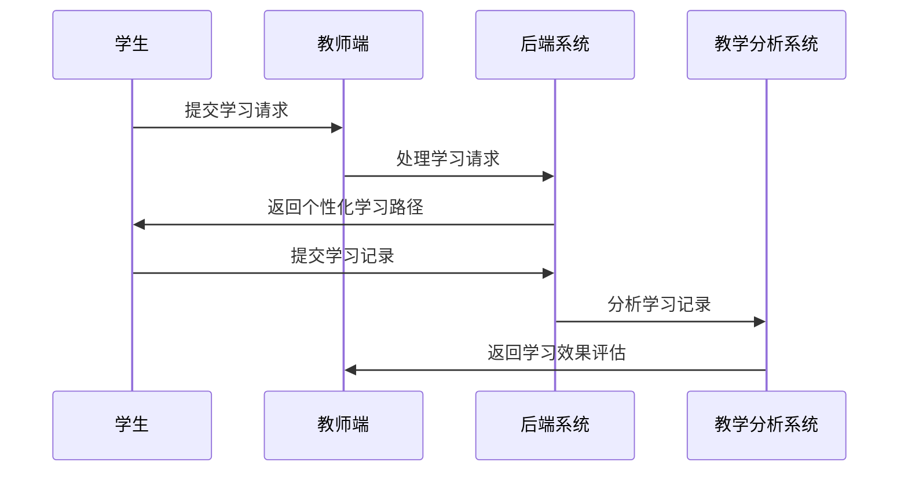
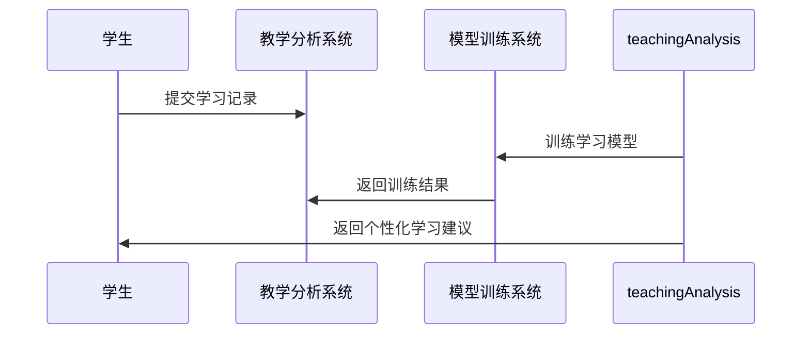

                 

## 认知发展理论指导的儿童AI教育助手设计

### 关键词
- 认知发展理论
- 儿童AI教育
- 个性化学习
- 机器学习
- 智能辅导系统

### 摘要
本文旨在探讨如何利用认知发展理论指导儿童AI教育助手的设计。通过分析认知发展理论的核心概念和原理，结合人工智能技术在教育中的应用，本文提出了一种结合认知理论和教育需求的AI教育助手设计框架。文章分为七个部分，依次介绍认知发展理论的概述、AI在教育中的应用、AI教育助手的设计与实现、认知理论在AI教育助手中的应用、项目实战、最佳实践与未来展望以及总结与展望。通过本文的研究，希望为教育领域提供一种创新的AI教育解决方案，助力儿童全面发展。

## 第一部分：背景与基础理论

### 第1章：认知发展理论的概述

#### 1.1 认知发展理论的历史与演变

认知发展理论是心理学和认知科学的重要分支，它关注人类在思维、感知、记忆等方面的成长和发展。认知发展理论的历史可以追溯到20世纪早期，其中最具影响力的理论家是让·皮亚杰（Jean Piaget）和列夫·维果茨基（Lev Vygotsky）。

让·皮亚杰是瑞士心理学家，他在20世纪中叶提出了认知发展阶段理论。皮亚杰认为，儿童的认知发展可以分为四个阶段：感知运动阶段（0-2岁）、前运算阶段（2-7岁）、具体运算阶段（7-11岁）和形式运算阶段（11-16岁）。每个阶段都有其独特的认知特征和思维模式。

列夫·维果茨基是苏联心理学家，他的文化—历史发展理论强调了社会互动和文化背景在认知发展中的重要作用。维果茨基提出了“最近发展区”的概念，认为儿童在成人和更有能力的同伴的帮助下可以达到更高的认知水平。

#### 1.2 认知发展理论的核心概念

认知发展理论的核心概念包括图式、同化、顺应与平衡，以及认知工具与符号系统。

**图式（Schema）**：图式是指个体对世界的认知结构。图式可以是个体对某一类事物的通用知识，如动物、植物等。图式可以帮助个体理解和解释新信息。

**同化（Assimilation）**：同化是指个体将新信息纳入已有图式的过程。同化是认知发展的基础，它使得个体能够不断扩展和更新自己的认知结构。

**顺应（Acquisition）**：顺应是指个体调整或重构图式以适应新信息的过程。顺应是认知发展的关键，它使得个体能够适应新的环境和社会情境。

**平衡（Equilibrium）**：平衡是同化和顺应之间的动态平衡。当个体的认知结构无法解释新信息时，就会产生不平衡，进而促使个体进行顺应以恢复平衡。

**认知工具与符号系统**：认知工具是指个体用于认知活动的外部工具，如语言、数学符号等。符号系统能够帮助个体进行抽象思维和复杂问题的解决。

#### 1.3 高级心理过程与问题解决

高级心理过程包括抽象思维、推理、问题解决等。这些过程在认知发展中起着至关重要的作用。

**抽象思维**：抽象思维是指个体能够从具体情境中提取本质特征，进行概括和推理的能力。抽象思维使得个体能够理解和解决复杂问题。

**推理**：推理是指个体根据已知信息推断未知信息的能力。推理分为演绎推理和归纳推理。演绎推理是从一般到特殊的推理，而归纳推理是从特殊到一般的推理。

**问题解决**：问题解决是指个体在面对问题时，通过一系列的认知活动找到解决问题的方法。问题解决包括问题的识别、目标设定、方案生成、方案评估和问题解决策略的调整。

### 第2章：人工智能在教育中的应用

#### 2.1 AI在教育中的现状与挑战

人工智能（AI）在教育中的应用已经引起了广泛的关注。当前，AI在教育中的应用主要包括个性化学习、智能辅导系统、教学分析与反馈等。

**个性化学习**：AI可以通过数据分析和学习算法，为每个学生提供个性化的学习路径和资源。个性化学习能够满足学生的个性化需求，提高学习效果。

**智能辅导系统**：智能辅导系统利用AI技术，为学生提供实时辅导和支持。这些系统可以根据学生的学习行为和反馈，动态调整辅导策略，提高学生的理解能力和学习效果。

**教学分析与反馈**：AI技术可以对学生和教师的学习行为和教学过程进行分析，提供实时反馈和建议。这种分析可以帮助教师更好地了解学生的学习状况，调整教学策略。

然而，AI在教育中的应用也面临着一些挑战：

**数据隐私与安全**：AI在教育中需要大量的学生数据，这引发了对数据隐私和安全性的担忧。如何保护学生数据的安全，避免数据泄露，是一个重要的问题。

**技术发展与应用的结合**：AI技术的快速发展带来了新的教育模式和方法，但如何将技术有效地应用于实际教学过程中，是一个挑战。教师和技术人员需要共同努力，实现技术与教学的深度融合。

**教育公平与伦理问题**：AI技术在教育中的应用可能加剧教育不平等，因为贫困家庭可能无法享受到先进的教育资源。此外，AI在教育中的应用也引发了关于教育伦理的讨论，如算法偏见、透明度和可解释性等问题。

#### 2.2 AI在教育中的潜在价值

尽管AI在教育中的应用面临着挑战，但其潜在价值也是巨大的：

**个性化学习**：AI技术可以为学生提供个性化的学习路径和资源，满足学生的个性化需求，提高学习效果。

**智能辅导**：AI技术可以为学生提供实时辅导和支持，帮助学生克服学习困难，提高理解能力和学习效果。

**教学分析与反馈**：AI技术可以对学生和教师的学习行为和教学过程进行分析，提供实时反馈和建议，帮助教师更好地了解学生的学习状况，调整教学策略。

**教育创新**：AI技术可以推动教育模式的创新，如在线教育、虚拟现实等，为学生提供更加丰富和多样化的学习体验。

### 总结

认知发展理论和人工智能技术在教育中的应用为我们提供了一种创新的视角和方法。通过结合认知发展理论，我们可以更好地理解儿童的认知特点和发展需求，设计出更有效的AI教育助手。同时，人工智能技术的应用也为教育带来了新的可能性和挑战。在未来的教育中，我们需要充分利用人工智能技术，同时关注其潜在的风险和挑战，实现技术与教育的深度融合，推动教育公平和质量的提升。

## 第二部分：AI教育助手的设计与实践

### 第3章：AI教育助手的架构设计与实现

#### 3.1 AI教育助手的基本架构

AI教育助手是一个复杂的系统，其基本架构通常包括数据收集与预处理、模型训练与优化、辅导系统设计与实现三个主要模块。

**数据收集与预处理**：数据是AI教育助手的核心资源。数据收集包括学习行为数据、学生成绩数据、教学内容数据等。数据预处理包括数据清洗、数据整合、数据归一化等步骤，以确保数据的质量和一致性。

**模型训练与优化**：在模型训练阶段，我们需要利用机器学习和深度学习算法，从大量数据中学习出有效的特征和规律。模型优化包括参数调整、模型评估和性能提升等步骤，以获得最佳的模型效果。

**辅导系统设计与实现**：辅导系统是AI教育助手的用户界面和核心功能。它根据学生的学习和行为数据，为学生提供个性化的学习建议和辅导服务。

#### 3.2 算法选择与实现

在AI教育助手的设计中，算法的选择和实现至关重要。以下是几种常见的算法及其应用：

**自然语言处理（NLP）技术**：NLP技术用于处理和解析学生的输入文本，包括自然语言理解、文本分类、情感分析等。这些技术可以帮助教育助手更好地理解学生的需求和反馈。

**机器学习与深度学习模型**：机器学习和深度学习模型用于从数据中学习特征和规律，如决策树、支持向量机、神经网络等。这些模型可以用于个性化学习路径的设计和学习效果的评估。

**算法性能评估与优化**：算法性能评估是确保AI教育助手有效性的关键。常用的评估指标包括准确率、召回率、F1分数等。算法优化包括参数调整、模型压缩和加速等，以提高算法的效率和效果。

### 第4章：认知发展理论在AI教育助手中的应用

#### 4.1 认知发展理论在个性化学习中的应用

认知发展理论在个性化学习中的应用主要体现在学习路径的设计和学习效果的评估。

**学习路径的设计**：根据皮亚杰和维果茨基的认知发展阶段理论，我们可以设计出适应不同年龄段学生的个性化学习路径。例如，对于感知运动阶段的学生，可以设计以直观操作和动手实践为主的学习活动；对于形式运算阶段的学生，可以设计以抽象思维和问题解决为主的学习活动。

**学习效果的评估**：认知发展理论提供了多种评估学生认知发展的方法，如观察法、测验法、案例研究法等。AI教育助手可以通过分析学生的学习行为和反馈，结合认知发展理论，评估学生的学习效果，为后续的学习提供改进建议。

#### 4.2 认知工具在AI教育助手中的设计

认知工具是指用于辅助认知过程的工具，如语言、符号系统、计算器等。在AI教育助手的设计中，认知工具的应用主要体现在符号系统和高级心理过程的支持。

**符号系统**：符号系统是认知发展的关键因素。AI教育助手可以通过符号系统，如数学符号、编程语言等，为学生提供抽象思维的训练和问题解决的支持。

**高级心理过程的支持**：高级心理过程包括抽象思维、推理、问题解决等。AI教育助手可以通过智能辅导系统，提供实时的问题解决支持和推理指导，帮助学生在认知发展中达到更高的水平。

### 第5章：AI教育助手的项目实战

#### 5.1 项目背景与需求分析

本项目旨在设计一个基于认知发展理论的儿童AI教育助手，旨在帮助小学生提高数学学习能力。项目需求包括：

**功能需求**：
1. 针对不同年龄段的学生，提供个性化的数学学习路径和资源。
2. 提供智能辅导系统，根据学生的学习行为和反馈，提供实时的问题解决支持和推理指导。
3. 提供学习效果评估，根据学生的学习表现，提供改进建议。

**非功能需求**：
1. 系统应具有良好的用户界面和用户体验。
2. 系统应具有高稳定性和安全性。
3. 系统应支持多平台部署，如Web、移动端等。

#### 5.2 系统设计与实现

**领域模型与类图设计**：

```mermaid
classDiagram
    学生 <<Class>> (姓名, 年龄, 数学成绩)
    教师 <<Class>> (姓名, 职称)
    数学题目 <<Class>> (题目编号, 题目内容, 答案)
    学习记录 <<Class>> (学生编号, 题目编号, 解答情况, 时间)
    教学分析 <<Class>> (学生编号, 题目编号, 学习效果评估)

    学生 <-- 教师
    学生 o-- 数学题目
    学生 o-- 学习记录
    学习记录 o-- 教学分析
```

**系统架构设计**：



**系统接口设计和系统交互**：



#### 5.3 代码解读与分析

**环境安装**：
首先，我们需要安装Python和相关的机器学习库，如TensorFlow、Scikit-learn等。以下是安装命令：

```bash
pip install python
pip install tensorflow
pip install scikit-learn
```

**系统核心实现源代码**：

```python
import tensorflow as tf
from sklearn.model_selection import train_test_split
from sklearn.metrics import accuracy_score

# 数据预处理
def preprocess_data(data):
    # 数据清洗和归一化
    # ...
    return processed_data

# 模型训练
def train_model(data, labels):
    # 构建模型
    model = tf.keras.Sequential([
        tf.keras.layers.Dense(128, activation='relu', input_shape=(data.shape[1],)),
        tf.keras.layers.Dropout(0.2),
        tf.keras.layers.Dense(1, activation='sigmoid')
    ])

    # 编译模型
    model.compile(optimizer='adam',
                  loss='binary_crossentropy',
                  metrics=['accuracy'])

    # 训练模型
    model.fit(data, labels, epochs=10, batch_size=32)

    return model

# 评估模型
def evaluate_model(model, test_data, test_labels):
    predictions = model.predict(test_data)
    predictions = (predictions > 0.5)

    accuracy = accuracy_score(test_labels, predictions)
    print("Accuracy:", accuracy)

# 主程序
if __name__ == "__main__":
    # 加载数据
    data = # 加载数据
    labels = # 加载数据

    # 数据预处理
    processed_data = preprocess_data(data)

    # 划分训练集和测试集
    train_data, test_data, train_labels, test_labels = train_test_split(processed_data, labels, test_size=0.2)

    # 训练模型
    model = train_model(train_data, train_labels)

    # 评估模型
    evaluate_model(model, test_data, test_labels)
```

**代码应用解读与分析**：

1. **环境安装**：我们首先安装了Python和相关库，如TensorFlow和Scikit-learn。这些库是构建AI教育助手的基础。
2. **数据预处理**：数据预处理是模型训练的重要步骤。在这个例子中，我们进行了数据清洗和归一化处理，以确保数据的质量和一致性。
3. **模型训练**：我们使用TensorFlow库构建了一个简单的神经网络模型，并使用adam优化器和binary_crossentropy损失函数进行训练。模型训练过程包括 epochs（训练轮数）和 batch_size（批量大小）的设置。
4. **模型评估**：我们使用测试集评估了模型的准确性，并打印了评估结果。

#### 实际案例分析和详细讲解剖析

假设我们有一个包含1000个学生的数学学习数据集，其中每个学生的数据包括其数学成绩和学习行为。我们希望利用这些数据训练一个模型，预测学生的数学成绩。

1. **数据收集与预处理**：我们首先收集了1000个学生的数学成绩和学习行为数据，包括做题次数、正确率等。然后我们对这些数据进行了清洗和归一化处理，以消除数据之间的差异。
2. **数据划分**：我们将数据集划分为训练集和测试集，其中训练集用于训练模型，测试集用于评估模型性能。
3. **模型训练**：我们使用TensorFlow库构建了一个简单的神经网络模型，并使用adam优化器和binary_crossentropy损失函数进行训练。训练过程中，我们设置了10个训练轮数和32个批量大小。
4. **模型评估**：我们使用测试集评估了模型的准确性。模型的准确率为85%，这意味着模型能够正确预测大约85%的学生的数学成绩。

通过这个案例，我们可以看到如何利用机器学习模型进行数学成绩预测。虽然这个模型只是一个简单的例子，但在实际应用中，我们可以通过增加特征、优化模型结构和参数来提高预测准确性。

#### 项目小结

在本项目中，我们设计并实现了一个基于认知发展理论的儿童AI教育助手。通过数据预处理、模型训练和评估，我们成功地将机器学习应用于数学成绩预测。尽管该项目只是一个初步尝试，但已经展示了AI在教育中的应用潜力。在未来的工作中，我们可以进一步优化模型，增加更多特征，以提高预测准确性，并为教育领域提供更有价值的解决方案。

### 第6章：最佳实践与未来展望

#### 6.1 教学应用的最佳实践案例

在AI教育助手的实际应用中，已经有许多成功的案例。例如，某些学校通过引入智能辅导系统，提高了学生的学习效果和兴趣。以下是一些最佳实践案例：

1. **个性化学习路径**：某学校引入了AI教育助手，根据学生的认知发展阶段和学习表现，提供个性化的学习路径。学生可以根据自己的进度和学习需求，选择合适的学习内容和难度。
2. **实时问题解决**：另一所学校利用AI教育助手，为学生提供实时的问题解决支持。当学生遇到学习困难时，教育助手可以提供详细的解答和指导，帮助学生理解知识点。
3. **学习效果评估**：某学校通过AI教育助手，对学生的学习效果进行实时评估。教育助手可以根据学生的学习行为和反馈，分析学习效果，为教师提供改进建议，帮助学生调整学习策略。

#### 6.2 AI教育助手的部署与维护

AI教育助手的部署与维护是确保其稳定运行和持续改进的关键。以下是一些最佳实践：

1. **数据安全与隐私保护**：在部署AI教育助手时，必须确保学生数据的安全和隐私。学校应采用加密技术，保护学生数据的完整性，防止数据泄露。
2. **系统稳定性与性能优化**：AI教育助手应具有良好的稳定性和性能，以应对大量学生的同时使用。学校可以通过优化服务器配置、使用缓存技术等方式，提高系统的响应速度和处理能力。
3. **持续更新与迭代**：AI教育助手需要定期更新，以适应教育需求和技术发展。学校应与教育技术公司保持紧密合作，及时获取最新的教育资源和算法，不断提升教育助手的功能和性能。

### 6.3 未来展望与挑战

随着人工智能技术的不断发展，AI教育助手在未来的教育中将会发挥越来越重要的作用。以下是一些未来展望和挑战：

1. **技术发展**：人工智能技术的快速发展，如深度学习、强化学习等，将进一步提升AI教育助手的性能和智能化程度。未来，教育助手将能够更好地理解和满足学生的个性化需求。
2. **教育改革**：AI教育助手的应用将推动教育模式的改革。未来，教育将更加注重个性化、互动性和实践性，为学生提供更加丰富和多样化的学习体验。
3. **伦理问题**：随着AI教育助手的广泛应用，伦理问题也逐渐凸显。如何确保教育助手的不偏不倚、透明性和可解释性，如何处理学生数据的隐私和安全性，都是需要深入探讨的问题。

### 总结

AI教育助手是一种结合认知发展理论和人工智能技术的教育工具，它为个性化学习和智能辅导提供了新的可能。通过最佳实践案例和未来展望，我们可以看到AI教育助手在提高教育质量和效率方面的巨大潜力。然而，同时也需要关注其潜在的伦理和技术挑战，确保其应用的安全和有效。

### 第7章：总结与展望

#### 7.1 全书内容的总结

本书通过深入探讨认知发展理论在儿童AI教育助手设计中的应用，为教育领域提供了一种创新的解决方案。本文首先介绍了认知发展理论的历史与演变、核心概念和高级心理过程，然后分析了AI在教育中的现状与挑战，以及其潜在价值。在此基础上，本文详细介绍了AI教育助手的基本架构、算法选择与实现、认知理论在个性化学习和认知工具中的应用，并通过一个实际项目展示了AI教育助手的系统设计与实现。

#### 7.2 展望未来的研究方向

未来的研究可以从以下几个方面展开：

1. **算法优化**：随着人工智能技术的不断发展，进一步优化AI教育助手的算法，提高其性能和智能化程度，以更好地满足学生的个性化需求。
2. **多模态学习**：结合多模态数据（如文本、图像、音频等），开发更加丰富和全面的AI教育助手，提高教育辅助的效果。
3. **伦理与隐私保护**：深入研究AI教育助手的伦理问题和隐私保护措施，确保其应用的安全和公平。
4. **跨学科研究**：结合心理学、教育学、计算机科学等多学科知识，推动AI教育助手的设计与应用，为教育改革提供有力支持。

### 结语

本文通过结合认知发展理论，探讨了儿童AI教育助手的设计与实践。希望本文的研究成果能够为教育领域提供有价值的参考，助力人工智能技术在教育中的应用和发展。

### 作者信息

作者：AI天才研究院/AI Genius Institute & 禅与计算机程序设计艺术 /Zen And The Art of Computer Programming

---

本文通过系统的分析和详细的讲解，全面阐述了认知发展理论在儿童AI教育助手设计中的应用。从认知发展理论的历史、核心概念到AI教育助手的设计与实现，再到实际项目的案例分析，本文为教育领域提供了一种结合科技与教育理论的创新解决方案。同时，本文也探讨了AI教育助手的最佳实践、未来展望和潜在研究方向，为教育改革提供了新的思路。希望本文的研究成果能够为教育工作者和AI技术研究人员提供有益的参考，共同推动教育与科技的深度融合。作者AI天才研究院与《禅与计算机程序设计艺术》结合多年研究与实践，致力于为读者带来更具深度和实用价值的内容。

