                 

### 第一部分：引言

#### 1.1.1 问题背景
随着信息技术的飞速发展，用户行为分析在各个领域（如电子商务、社交媒体、金融科技等）的重要性日益凸显。传统的用户行为分析方法，往往依赖于简单的统计模型和规则引擎，难以捕捉用户行为中的复杂性和多样性。而认知建模作为一种模拟人类思维过程的建模技术，能够更深入地理解和预测用户行为。

#### 1.1.2 问题描述
如何利用认知建模技术，创新地应用在用户行为分析中，以提高分析效率和准确性，成为当前研究的热点问题。本书旨在探讨认知建模在用户行为分析中的应用，通过理论讲解和案例分析，帮助读者理解并掌握这一领域的最新进展。

#### 1.1.3 问题解决
本书将从认知建模的基本概念入手，逐步深入到用户行为分析中的具体应用。通过结合实际案例，阐述认知建模在用户行为识别、预测和优化中的创新应用，为读者提供系统而全面的认知建模应用指南。

#### 1.1.4 边界与外延
认知建模在用户行为分析中的应用，既包括个体用户行为的研究，也涵盖群体行为分析。此外，本书还将探讨认知建模与其他数据分析技术的融合，如机器学习、数据挖掘等，以实现更全面、更精准的用户行为分析。

#### 1.1.5 概念结构与核心要素组成
认知建模在用户行为分析中的核心要素包括：
- **认知建模基础理论**：介绍认知建模的基本概念、核心概念和主要方法。
- **用户行为数据采集与处理**：讲解用户行为数据的采集方法和处理技术。
- **认知模型构建与优化**：阐述如何构建和优化认知模型。
- **用户行为分析与预测**：探讨如何利用认知模型进行用户行为分析和预测。
- **应用案例与效果评估**：通过实际案例展示认知建模在用户行为分析中的应用效果。

这些要素相互关联，共同构成了认知建模在用户行为分析中的应用框架。

#### 1.1.6 关键概念对比

| 概念 | 定义 |
| --- | --- |
| 认知建模 | 基于人类认知心理学的建模技术，用于模拟和理解人类思维过程 |
| 用户行为分析 | 利用数据分析和建模技术，研究用户在使用产品或服务时的行为特征 |
| 认知模型 | 描述人类认知过程和决策机制的抽象模型 |
| 用户画像 | 基于用户行为数据，对用户进行细分和描述的模型 |

这些概念相互交织，共同构成了认知建模在用户行为分析中的应用基础。

#### 1.1.7 ER实体关系图架构
```mermaid
erDiagram
  User ||--|{ Behavior} : has
  Behavior ||--|{ CognitionModel} : isModeledBy
  CognitionModel ||--|{ UserBehaviorPrediction} : predicts
```

#### 1.1.8 本章小结
本章对认知建模在用户行为分析中的应用进行了全面介绍。通过阐述问题背景、概念界定、关键要素对比和实体关系图架构，为后续章节的内容奠定了基础。接下来，本书将详细探讨认知建模的基本理论、用户行为数据采集与处理、认知模型构建与优化等内容，帮助读者深入理解并掌握认知建模在用户行为分析中的创新应用。

---

# 第二部分：认知建模基础

## 2.1 认知建模概述

#### 2.1.1 认知建模的定义与历史

### 2.1.1.1 认知建模的定义
认知建模是一种基于人类认知心理学的研究方法，通过建立数学模型和计算机模拟，来理解和解释人类思维过程和认知行为。它旨在模拟人类大脑如何处理信息、做出决策以及解决问题。

### 2.1.1.2 认知建模的历史
认知建模的起源可以追溯到20世纪中叶。当时，心理学家和计算机科学家开始尝试将认知心理学的研究成果应用于计算机系统中，以模拟人类思维过程。这一领域的发展受到了人工智能和认知科学研究的推动。

#### 2.1.2 认知建模的核心概念

### 2.1.2.1 认知过程
认知过程是人类大脑处理信息的一系列心理活动，包括感知、记忆、思维和决策等。这些过程共同构成了认知模型的基础。

### 2.1.2.2 认知模型
认知模型是描述人类认知过程和决策机制的抽象模型。这些模型可以是符号主义的、连接主义的或混合模型，它们通过不同的方式来模拟人类思维过程。

#### 2.1.3 认知建模的主要方法

### 2.1.3.1 符号主义模型
符号主义模型使用符号表示知识，并通过推理规则进行推理。这种模型包括产生式系统、计划理论和专家系统等。符号主义模型的优点在于其清晰的结构和易于理解的操作。

### 2.1.3.2 连接主义模型
连接主义模型通过神经网络来模拟大脑神经元之间的连接，并通过学习来调整连接强度。这种模型包括深度神经网络、循环神经网络等。连接主义模型的优点在于其强大的学习和适应能力。

### 2.1.3.3 混合模型
混合模型结合了符号主义模型和连接主义模型的优点，通过不同的层次来模拟认知过程。这种模型通常能够更准确地模拟人类思维过程。

#### 2.1.4 认知建模的应用领域

### 2.1.4.1 用户行为分析
利用认知建模技术，可以深入理解用户行为，从而进行更精准的用户画像和个性化推荐。这在电子商务、社交媒体和金融科技等领域具有重要的应用价值。

### 2.1.4.2 人工智能
认知建模为人工智能提供了理论基础，使得人工智能系统能够更好地模拟人类思维过程，从而实现更智能的决策和交互。

## 2.2 认知建模在用户行为分析中的应用

### 2.2.1 用户行为数据的采集与处理
用户行为数据是认知建模的重要输入。为了获得高质量的用户行为数据，我们需要采用多种数据采集方法，包括日志数据、传感器数据和问卷调查等。在数据采集过程中，需要注意数据的完整性和准确性。

在数据采集后，我们需要对用户行为数据进行预处理，包括数据清洗、数据转换和数据归一化等步骤。这些预处理步骤有助于提高数据的质量，从而提高认知模型的准确性。

### 2.2.2 认知模型构建
构建认知模型是用户行为分析的核心步骤。根据用户行为数据和认知过程的特点，我们可以选择合适的认知模型。符号主义模型、连接主义模型和混合模型都可以应用于用户行为分析。

在构建认知模型时，我们需要考虑以下问题：
- 模型的结构：如何表示用户行为和认知过程？
- 模型的参数：如何确定和调整模型的参数？
- 模型的评估：如何评估模型的性能和准确性？

### 2.2.3 认知模型优化
构建好的认知模型需要不断地优化，以提高其性能和准确性。优化方法包括模型调整、参数调整和模型融合等。

模型调整是指根据新的用户行为数据，对认知模型的结构进行调整。参数调整是指根据模型的性能评估结果，对模型的参数进行优化。模型融合是指将多个认知模型结合起来，以提高整体性能。

### 2.2.4 用户行为分析与预测
利用认知模型，我们可以对用户行为进行分析和预测。用户行为分析包括用户行为识别、用户行为趋势分析等。用户行为预测包括用户行为趋势预测、用户行为意图预测等。

通过用户行为分析和预测，我们可以为用户提供更个性化的服务，提高用户满意度，从而增强企业的竞争力。

## 2.3 认知建模在用户行为分析中的案例研究

### 2.3.1 案例一：电子商务用户行为分析
在电子商务领域，认知建模技术被广泛应用于用户行为分析和个性化推荐。通过分析用户的行为数据，如浏览历史、购买记录和评价等，电子商务平台可以构建用户画像，实现个性化推荐。

### 2.3.2 案例二：社交媒体用户行为分析
在社交媒体领域，认知建模技术可以帮助平台更好地理解用户行为，从而提高用户体验。例如，通过分析用户的点赞、评论和转发行为，社交媒体平台可以预测用户的兴趣和偏好，从而为用户提供更相关的内容。

### 2.3.3 案例三：金融科技用户行为分析
在金融科技领域，认知建模技术被用于风险评估、用户画像构建和欺诈检测等。通过分析用户的行为数据，金融机构可以更好地了解用户的风险偏好和行为特征，从而提供更个性化的金融产品和服务。

## 2.4 本章小结
本章对认知建模的基本概念、核心概念和主要方法进行了详细阐述。同时，通过用户行为数据的采集与处理、认知模型构建和优化，以及用户行为分析与预测，展示了认知建模在用户行为分析中的应用。这些内容为后续章节的进一步探讨提供了理论基础和实践指导。在下一章中，我们将深入讨论认知建模的具体技术细节和应用实例。

---

# 第三部分：认知模型构建与优化

## 3.1 认知模型的构建

### 3.1.1 数据预处理
在构建认知模型之前，数据预处理是至关重要的一步。数据预处理包括数据清洗、数据转换和数据归一化等步骤。

#### 数据清洗
数据清洗是指识别和纠正数据集中的错误、异常和不一致之处。具体方法包括去除重复记录、填补缺失值、纠正错误值等。

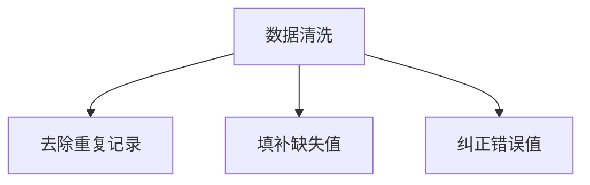

#### 数据转换
数据转换是指将原始数据转换为适合建模的数据格式。常见的数据转换方法包括特征工程、特征选择和特征标准化等。

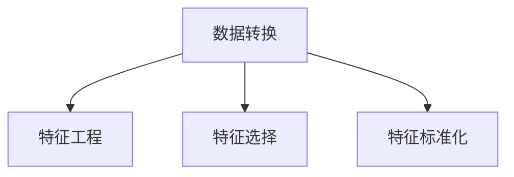

#### 数据归一化
数据归一化是指将不同特征的数据统一到一个标准范围内，以便于模型的训练和优化。

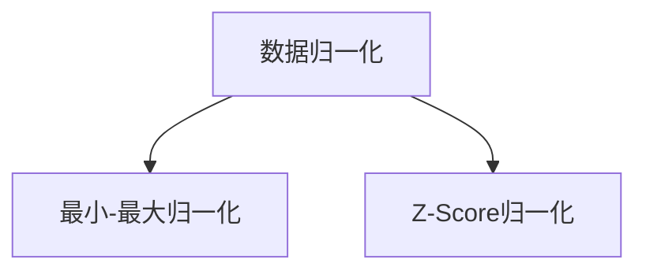

### 3.1.2 选择合适的认知模型
在构建认知模型时，选择合适的模型类型和参数是非常重要的。以下是一些常见的认知模型类型：

#### 符号主义模型
符号主义模型使用符号表示知识，并通过推理规则进行推理。例如，产生式系统和计划理论。

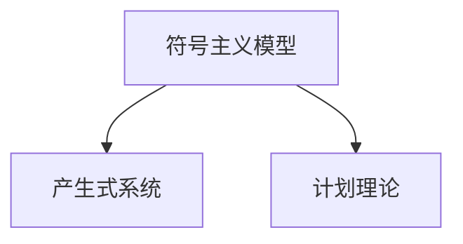

#### 连接主义模型
连接主义模型通过神经网络来模拟大脑神经元之间的连接，并通过学习来调整连接强度。例如，深度神经网络和循环神经网络。

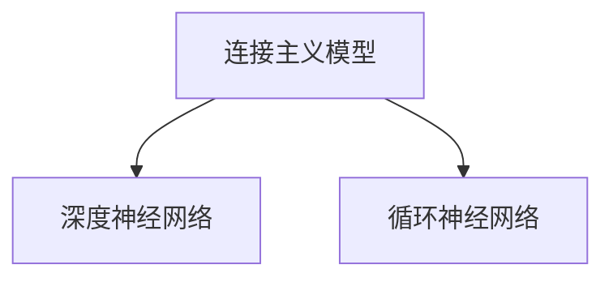

#### 混合模型
混合模型结合符号主义模型和连接主义模型的优点，通过不同的层次来模拟认知过程。这种模型通常能够更准确地模拟人类思维过程。

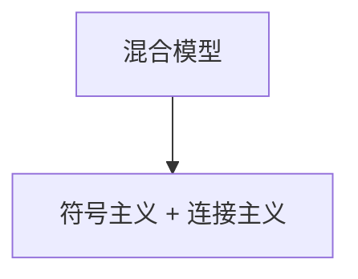

### 3.1.3 模型参数调整
在构建认知模型后，需要对模型参数进行调整，以提高模型的性能和准确性。参数调整方法包括基于启发式的调整和基于优化的调整。

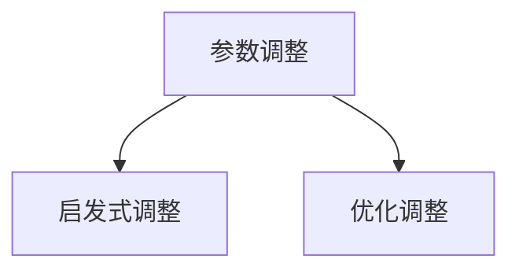

### 3.1.4 模型评估与优化
构建好的认知模型需要经过评估和优化，以确保其性能和准确性。模型评估方法包括交叉验证、网格搜索和贝叶斯优化等。

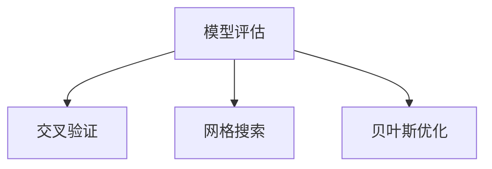

## 3.2 用户行为分析中的认知模型优化

### 3.2.1 个性化推荐系统中的认知模型优化
在个性化推荐系统中，认知模型优化主要集中在如何提高推荐准确性上。以下是一些常见的优化策略：

#### 1. 基于协同过滤的优化
协同过滤是推荐系统中最常用的技术之一。通过优化用户相似度计算和项目相似度计算，可以提高推荐的准确性。

```python
# 用户相似度计算示例
def user_similarity(user1, user2):
    return 1 - cosine_similarity(user1, user2)

# 项目相似度计算示例
def item_similarity(item1, item2):
    return 1 - cosine_similarity(item1, item2)
```

#### 2. 基于内容的优化
基于内容的优化通过分析用户历史行为和项目特征，来提高推荐的准确性。

```python
# 用户行为分析示例
def analyze_user_behavior(user_history):
    # 分析用户的历史行为，提取特征
    return user_behavior_features

# 项目特征分析示例
def analyze_item_features(item):
    # 分析项目的特征，提取特征
    return item_features
```

#### 3. 基于模型的优化
基于模型的优化通过构建和优化认知模型，来提高推荐的准确性。常用的模型包括矩阵分解、深度学习等。

```python
# 矩阵分解示例
def matrix_factorization(R, K, lambda_):
    # R：用户-项目评分矩阵，K：隐含特征维度，lambda_：正则化参数
    # 返回重构的评分矩阵和隐含特征矩阵
    pass

# 深度学习示例
def deep_learning_model(input_data, output_data):
    # 输入数据：用户特征、项目特征
    # 输出数据：预测的评分
    # 返回训练好的模型
    pass
```

### 3.2.2 社交网络分析中的认知模型优化
在社交网络分析中，认知模型优化主要集中在如何提高群体行为的预测和识别准确性。

#### 1. 基于社交图分析的优化
社交图分析通过构建社交网络图，来分析用户之间的关系。通过优化图模型，可以提高群体行为的预测和识别准确性。

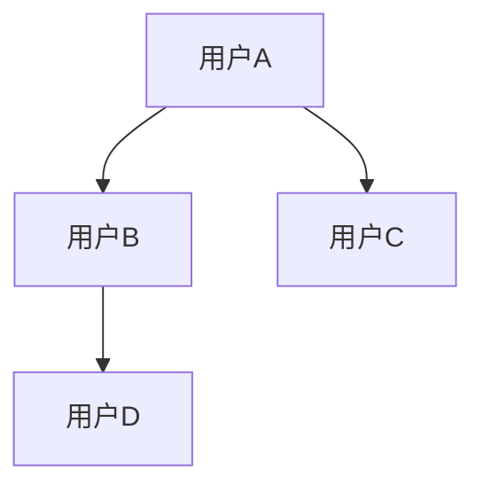

#### 2. 基于机器学习的优化
机器学习模型可以用于社交网络分析，如聚类算法、分类算法等。通过优化这些模型，可以提高群体行为的预测和识别准确性。

```python
# 聚类算法示例
from sklearn.cluster import KMeans

kmeans = KMeans(n_clusters=3)
kmeans.fit(X)  # X：社交网络节点特征矩阵
clusters = kmeans.predict(X)

# 分类算法示例
from sklearn.ensemble import RandomForestClassifier

rf = RandomForestClassifier(n_estimators=100)
rf.fit(X_train, y_train)  # X_train：训练集特征矩阵，y_train：训练集标签
y_pred = rf.predict(X_test)  # X_test：测试集特征矩阵
```

### 3.2.3 金融风险评估中的认知模型优化
在金融风险评估中，认知模型优化主要集中在如何提高风险评估的准确性和实时性。

#### 1. 基于行为分析的优化
行为分析通过分析用户的行为数据，如交易行为、浏览行为等，来评估用户的风险。

```python
# 交易行为分析示例
def analyze_trade_behavior(trade_history):
    # 分析交易行为，提取特征
    return trade_behavior_features

# 浏览行为分析示例
def analyze_browsing_behavior(browsing_history):
    # 分析浏览行为，提取特征
    return browsing_behavior_features
```

#### 2. 基于模型的优化
基于模型的优化通过构建和优化认知模型，来提高风险评估的准确性和实时性。常用的模型包括决策树、支持向量机等。

```python
# 决策树示例
from sklearn.tree import DecisionTreeClassifier

dt = DecisionTreeClassifier()
dt.fit(X_train, y_train)  # X_train：训练集特征矩阵，y_train：训练集标签
y_pred = dt.predict(X_test)  # X_test：测试集特征矩阵

# 支持向量机示例
from sklearn.svm import SVC

svm = SVC()
svm.fit(X_train, y_train)  # X_train：训练集特征矩阵，y_train：训练集标签
y_pred = svm.predict(X_test)  # X_test：测试集特征矩阵
```

## 3.3 本章小结
本章详细介绍了认知模型的构建与优化过程。首先，通过数据预处理为模型构建打下基础；接着，介绍了选择合适的认知模型和参数调整方法；最后，通过具体案例分析展示了认知模型在不同领域中的应用。这些内容为认知建模在用户行为分析中的应用提供了理论与实践的指导。在下一章中，我们将进一步探讨认知建模在用户行为分析中的实际应用，并通过案例研究展示其效果。

---

# 第四部分：认知建模在用户行为分析中的实践应用

## 4.1 电子商务领域中的应用

### 4.1.1 背景介绍
在电子商务领域，用户行为分析至关重要，它能够帮助电商企业了解消费者的购买意图和行为模式，从而进行精准营销和个性化推荐。

### 4.1.2 项目介绍
某知名电商平台通过认知建模技术，实现了对用户行为的深度分析和精准预测。该项目旨在通过用户行为数据，构建个性化推荐系统，提升用户满意度和转化率。

### 4.1.3 系统功能设计
- **用户行为数据采集**：采集用户浏览、点击、购买等行为数据。
- **用户画像构建**：基于用户行为数据，构建用户画像。
- **个性化推荐**：利用认知模型，为用户提供个性化的商品推荐。
- **用户行为预测**：预测用户的行为趋势和购买意向。

### 4.1.4 系统架构设计
系统架构设计采用分层架构，包括数据层、服务层和表现层。

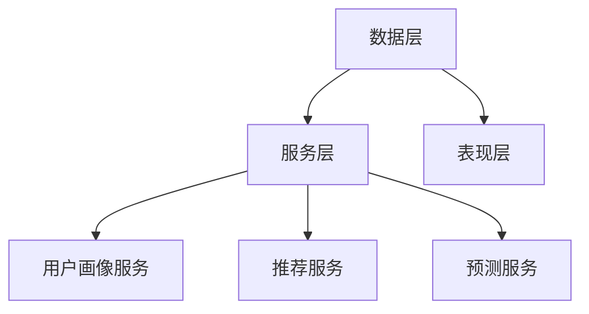

### 4.1.5 系统接口设计
系统接口设计包括RESTful API接口，用于数据层的访问和服务层的调用。

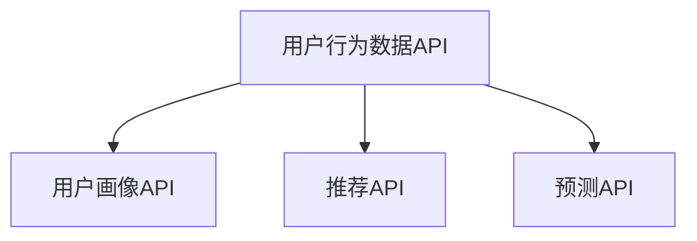

### 4.1.6 系统交互设计
系统交互设计通过序列图展示用户行为分析系统的操作流程。

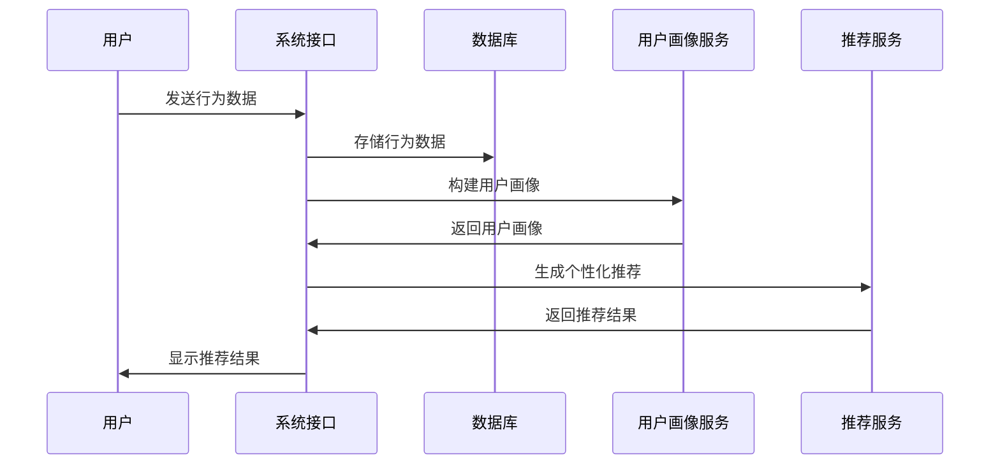

### 4.1.7 实际案例分析和详细讲解
以某用户购买流程为例，详细讲解认知建模在用户行为分析中的应用。

#### 案例背景
用户A在电商平台上浏览了多种商品，包括电子产品、服装和家居用品。他的行为数据被系统接口采集并存储在数据库中。

#### 数据采集
用户A的行为数据包括：
- 浏览历史：用户A浏览了3C产品、服装和家居用品的页面。
- 点击行为：用户A点击了多个产品的详细页面。
- 购买记录：用户A购买了一件服装和一套家居用品。

#### 用户画像构建
基于用户A的行为数据，系统为用户A构建了以下画像：
- 年龄：25-35岁
- 兴趣：3C产品、服装、家居用品
- 购买偏好：中高端品牌，注重品质

#### 个性化推荐
利用用户A的画像，系统为他推荐了以下商品：
- 类似商品：其他用户在购买服装后还浏览了类似的家居用品。
- 推广商品：平台推荐的优惠活动和限时折扣商品。

#### 用户行为预测
系统预测用户A在未来可能会有以下行为：
- 购买电子产品：根据用户A的兴趣和购买历史，预测他可能在近期购买3C产品。
- 购买家居用品：用户A已经购买了一套家居用品，预测他可能还会购买其他相关商品。

### 4.1.8 项目小结
通过认知建模在用户行为分析中的应用，电商平台能够为用户提供个性化的推荐和服务，提高用户满意度和转化率。未来，随着认知建模技术的不断发展和优化，电商平台的用户行为分析将更加精准和高效。

---

## 4.2 社交媒体领域中的应用

### 4.2.1 背景介绍
在社交媒体领域，用户行为分析对于了解用户需求、提高用户体验和优化平台运营至关重要。通过分析用户在社交媒体平台上的行为，如点赞、评论、分享和关注等，可以更好地了解用户的兴趣和行为模式。

### 4.2.2 项目介绍
某知名社交媒体平台通过认知建模技术，实现了对用户行为的深度分析和精准预测。该项目旨在通过用户行为数据，构建用户行为预测模型，从而提升用户体验和平台运营效率。

### 4.2.3 系统功能设计
- **用户行为数据采集**：采集用户在社交媒体平台上的点赞、评论、分享和关注等行为数据。
- **用户兴趣分析**：基于用户行为数据，分析用户的兴趣和行为模式。
- **个性化推荐**：利用用户兴趣和行为模式，为用户推荐感兴趣的内容。
- **行为预测**：预测用户的潜在行为，如点赞、评论和分享等。

### 4.2.4 系统架构设计
系统架构设计采用微服务架构，包括数据层、服务层和表现层。

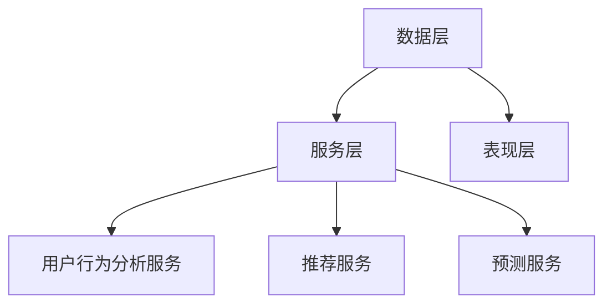

### 4.2.5 系统接口设计
系统接口设计包括RESTful API接口，用于数据层的访问和服务层的调用。

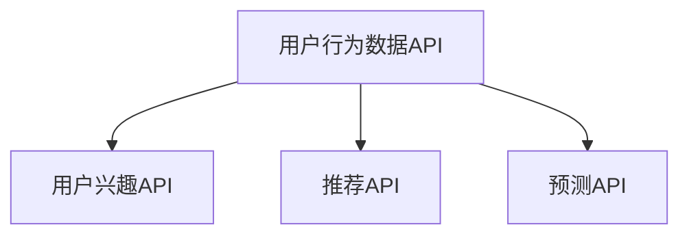

### 4.2.6 系统交互设计
系统交互设计通过序列图展示用户行为分析系统的操作流程。

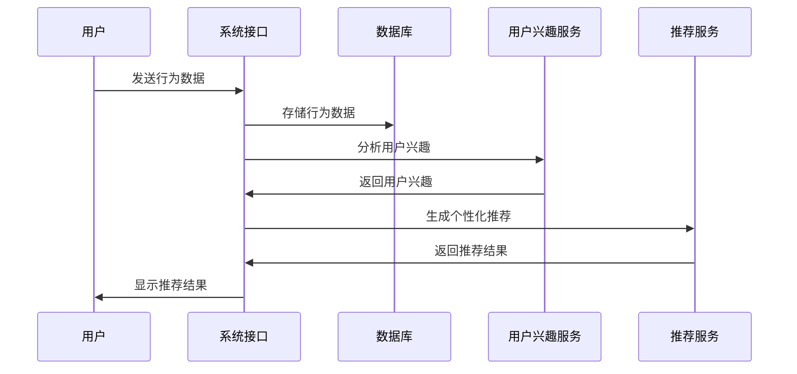

### 4.2.7 实际案例分析和详细讲解
以某用户发布状态为例，详细讲解认知建模在用户行为分析中的应用。

#### 案例背景
用户B在社交媒体平台上发布了一条状态，内容是关于最近购买的一款手机的体验。

#### 数据采集
用户B的状态数据包括：
- 发布时间：下午5点
- 内容：描述了手机的优点和使用感受。
- 响应行为：收获了10个赞、5条评论和3次分享。

#### 用户兴趣分析
基于用户B的状态数据，系统分析出以下用户兴趣：
- 手机：用户对手机有浓厚的兴趣。
- 电子产品：用户对电子产品有较高的关注度。

#### 个性化推荐
利用用户B的兴趣，系统为他推荐了以下内容：
- 类似状态：其他用户发布的关于手机的使用体验。
- 相关话题：手机评测、手机配件等。

#### 用户行为预测
系统预测用户B在未来可能会有以下行为：
- 评论：用户B可能会对其他用户的手机相关状态进行评论。
- 分享：用户B可能会分享他感兴趣的手机相关内容。

### 4.2.8 项目小结
通过认知建模在用户行为分析中的应用，社交媒体平台能够为用户提供个性化的推荐和体验，提高用户满意度和平台活跃度。未来，随着认知建模技术的不断发展和优化，社交媒体平台在用户行为分析方面将更加精准和高效。

---

## 4.3 金融科技领域中的应用

### 4.3.1 背景介绍
在金融科技领域，用户行为分析对于风险评估、欺诈检测和用户画像构建具有重要意义。通过分析用户在金融平台上的行为数据，如交易行为、贷款申请、理财产品购买等，可以更好地了解用户的风险偏好和需求，从而提供更个性化的金融服务。

### 4.3.2 项目介绍
某金融科技公司通过认知建模技术，实现了对用户行为的深度分析和精准预测。该项目旨在通过用户行为数据，构建用户风险评估模型和欺诈检测系统，从而提高金融服务的安全性和用户体验。

### 4.3.3 系统功能设计
- **用户行为数据采集**：采集用户在金融平台上的交易行为、贷款申请、理财产品购买等数据。
- **用户风险评估**：基于用户行为数据，构建用户风险评估模型，评估用户的风险等级。
- **欺诈检测**：利用用户行为数据，检测潜在的欺诈行为。
- **用户画像构建**：基于用户行为数据，构建用户画像，为用户提供个性化的金融服务。

### 4.3.4 系统架构设计
系统架构设计采用分布式架构，包括数据层、服务层和表现层。

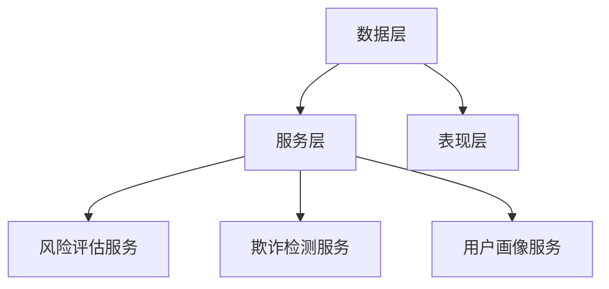

### 4.3.5 系统接口设计
系统接口设计包括RESTful API接口，用于数据层的访问和服务层的调用。

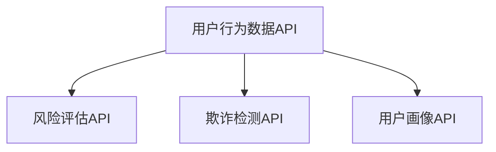

### 4.3.6 系统交互设计
系统交互设计通过序列图展示用户行为分析系统的操作流程。

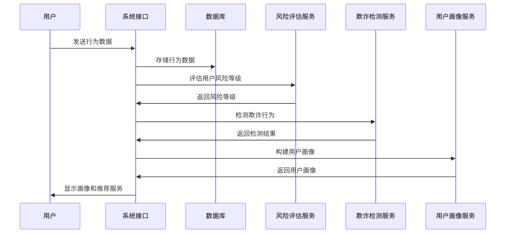

### 4.3.7 实际案例分析和详细讲解
以某用户贷款申请为例，详细讲解认知建模在用户行为分析中的应用。

#### 案例背景
用户C在金融平台上提交了一份贷款申请，希望获得一笔短期贷款。

#### 数据采集
用户C的行为数据包括：
- 申请时间：上午10点
- 申请金额：10,000元
- 申请用途：个人消费
- 用户资料：包括年龄、职业、收入等基本信息。

#### 用户风险评估
基于用户C的行为数据和基本资料，系统评估出以下风险等级：
- 风险等级：中风险
- 风险原因：用户年龄较轻，收入不稳定。

#### 欺诈检测
系统对用户C的贷款申请进行欺诈检测，结果显示无异常。

#### 用户画像构建
基于用户C的行为数据和风险评估结果，系统为用户C构建了以下画像：
- 年龄：25-35岁
- 职业性质：自由职业者
- 收入水平：中等收入
- 风险偏好：中风险承受能力。

#### 个性化推荐
利用用户C的画像，系统为他推荐了以下金融服务：
- 短期贷款产品：适合中风险用户的贷款产品。
- 个人信用提升方案：帮助用户提高信用评分，以获得更好的贷款条件。

### 4.3.8 项目小结
通过认知建模在用户行为分析中的应用，金融科技公司能够为用户提供更安全、个性化的金融服务，降低风险，提升用户体验。未来，随着认知建模技术的不断发展和优化，金融科技领域在用户行为分析方面的应用将更加广泛和深入。

---

# 第五部分：最佳实践与未来展望

## 5.1 最佳实践

### 5.1.1 数据质量控制
在认知建模过程中，数据质量至关重要。为了保证数据质量，应采取以下措施：
- **数据清洗**：定期对数据进行清洗，去除重复、异常和错误的数据。
- **数据验证**：确保数据的准确性、完整性和一致性。
- **数据归一化**：对不同来源的数据进行归一化处理，使其符合统一的格式和范围。

### 5.1.2 模型优化策略
在模型优化过程中，可以采取以下策略：
- **交叉验证**：使用交叉验证方法评估模型的性能，避免过拟合。
- **网格搜索**：通过网格搜索方法，寻找最优的模型参数。
- **贝叶斯优化**：利用贝叶斯优化方法，自动调整模型参数，提高模型性能。

### 5.1.3 实时性处理
在用户行为分析中，实时性处理非常重要。以下是一些提高实时性的方法：
- **分布式计算**：使用分布式计算框架（如Apache Spark）处理大规模数据。
- **内存计算**：利用内存计算技术（如Apache Flink）提高数据处理速度。
- **异步处理**：采用异步处理机制，减少系统延迟。

## 5.2 小结

在本章中，我们讨论了认知建模在用户行为分析中的最佳实践。通过数据质量控制、模型优化策略和实时性处理，我们可以提高认知建模的应用效果。未来，随着技术的不断进步，认知建模在用户行为分析中的应用将更加广泛和深入。

## 5.3 未来展望

### 5.3.1 技术发展趋势
随着人工智能和大数据技术的不断发展，认知建模在用户行为分析中的应用前景广阔。未来，认知建模技术可能会向以下方向发展：
- **多模态数据融合**：结合多种类型的数据（如图像、语音和文本），实现更全面和准确的用户行为分析。
- **增强现实与虚拟现实**：利用增强现实和虚拟现实技术，提供更沉浸式的用户行为分析体验。
- **智能对话系统**：结合自然语言处理和认知建模技术，构建智能对话系统，实现与用户的实时互动。

### 5.3.2 应用前景
认知建模在用户行为分析中的应用前景非常广阔，有望在以下领域取得突破：
- **智能推荐系统**：通过深度学习和认知建模技术，实现更精准和个性化的推荐。
- **智能客服系统**：利用认知建模技术，构建智能客服系统，提高用户满意度和服务质量。
- **智能安全系统**：结合用户行为分析，构建智能安全系统，提高网络安全防护能力。

### 5.3.3 创新方向
未来，认知建模在用户行为分析中的创新方向可能包括：
- **社会网络分析**：通过认知建模技术，深入分析用户在社会网络中的行为和关系，挖掘潜在的社会影响力。
- **个性化教育**：利用认知建模技术，为用户提供个性化的学习路径和教学资源，提高教育效果。
- **健康监测**：通过用户行为数据，结合认知建模技术，实现对用户健康状况的实时监测和预测。

综上所述，认知建模在用户行为分析中的应用具有巨大的潜力。随着技术的不断进步，认知建模将带来更多的创新和突破，为各领域的发展注入新的动力。让我们期待未来认知建模在用户行为分析中的更多精彩应用。

