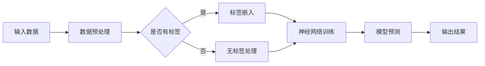
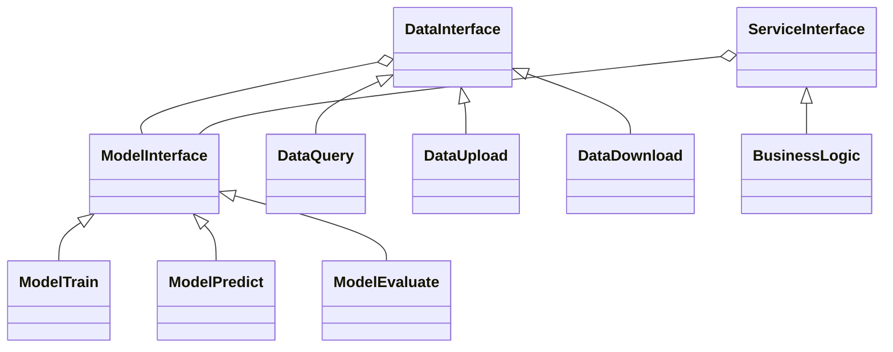

                 

# 认知架构：整合多种AI能力的框架

关键词：认知架构、AI整合、模块化设计、元学习、分布式计算

摘要：本文旨在探讨认知架构，一种能够整合多种AI能力的框架。通过模块化设计、元学习和分布式计算等手段，认知架构实现了智能系统的通用性和灵活性，为AI技术的进一步发展提供了新的思路。

## 第一部分：背景介绍

### 问题背景
随着计算机技术和人工智能（AI）的快速发展，AI在各行各业的应用越来越广泛。然而，当前AI系统通常只能解决特定领域的问题，缺乏通用性和灵活性。为了解决这个问题，需要构建一种能够整合多种AI能力的框架，即认知架构。

### 问题描述
认知架构是一种旨在整合多种AI能力的框架，其目的是实现智能系统的通用性和灵活性。它需要解决的关键问题包括：
- **如何将不同的AI算法和模型集成到一个统一的框架中？**
- **如何确保框架能够灵活应对各种不同类型的问题？**
- **如何实现高效的计算和资源利用？**

### 问题解决
认知架构通过以下方法解决上述问题：
- **模块化设计**：将不同的AI算法和模型封装成独立的模块，便于集成和替换。
- **元学习（Meta-Learning）**：使框架能够快速适应新问题和任务。
- **分布式计算**：运用分布式计算和并行处理技术，提高计算效率和资源利用率。

### 边界与外延
认知架构的边界包括：
- **需要整合的AI算法和模型范围**：如图神经网络（GNN）、生成对抗网络（GAN）、卷积神经网络（CNN）等。
- **应用场景和问题类型**：如自然语言处理（NLP）、图像识别、推荐系统等。
- **计算资源和性能要求**：如处理速度、资源消耗、系统稳定性等。

### 概念结构与核心要素组成
认知架构由以下几个核心要素组成：
- **算法模块**：包括各种AI算法和模型，如深度学习、强化学习、自然语言处理等。
- **数据处理模块**：负责数据清洗、预处理、特征提取等。
- **系统接口**：提供与外部系统的交互接口，支持数据流和控制流。
- **计算引擎**：负责算法的执行和资源调度。

## 第二部分：核心概念与联系

### 核心概念
认知架构中的核心概念包括：
- **AI算法模块**：包括各种AI算法和模型，如深度学习、强化学习、自然语言处理等。
- **元学习**：使框架能够快速适应新问题和任务。
- **模块化设计**：便于集成和替换。
- **分布式计算**：提高计算效率和资源利用率。

### 概念属性特征对比表格
以下是几个核心概念的属性特征对比表格：

| 概念         | 属性特征                                     |
|--------------|--------------------------------------------|
| AI算法模块   | 算法种类多样，可扩展性强，独立性强           |
| 元学习       | 快速适应新问题和任务，提高框架灵活性         |
| 模块化设计   | 便于集成和替换，提高开发效率                 |
| 分布式计算   | 提高计算效率和资源利用率，支持大规模数据处理 |

### ER实体关系图架构
下面是一个认知架构的ER实体关系图架构：

```mermaid
erDiagram
    AI算法模块 ||--|{ 数据处理模块 }
    AI算法模块 ||--|{ 系统接口 }
    AI算法模块 ||--|{ 计算引擎 }
    数据处理模块 ||--|{ 数据流 }
    系统接口 ||--|{ 控制流 }
    计算引擎 ||--|{ 资源调度 }
```

## 第三部分：算法原理讲解

### 算法原理
认知架构中的算法原理主要包括以下内容：

1. **深度学习**：通过多层神经网络模型对数据进行建模和预测。
2. **强化学习**：通过试错和反馈来学习最优策略。
3. **自然语言处理**：利用深度学习模型对自然语言进行处理和理解。

### Mermaid算法流程图
以下是深度学习算法的Mermaid流程图：



### Python源代码
以下是使用Python实现深度学习算法的源代码：

```python
import tensorflow as tf
from tensorflow.keras.models import Sequential
from tensorflow.keras.layers import Dense, Flatten, LSTM, Embedding

# 数据预处理
def preprocess_data(data, labels=None):
    # 省略具体预处理操作
    return processed_data, labels

# 构建神经网络模型
model = Sequential([
    Flatten(input_shape=(28, 28)),
    Dense(128, activation='relu'),
    LSTM(128, activation='tanh'),
    Dense(10, activation='softmax')
])

# 编译模型
model.compile(optimizer='adam', loss='categorical_crossentropy', metrics=['accuracy'])

# 训练模型
model.fit(x_train, y_train, epochs=10, batch_size=64)

# 预测
predictions = model.predict(x_test)
```

### 算法原理详细讲解

#### 深度学习
深度学习是一种基于多层神经网络的学习方法，通过前向传播和反向传播算法对数据进行建模和预测。其核心思想是模拟人脑神经元的工作原理，通过调整权重和偏置来实现对数据的拟合。

深度学习的数学模型主要包括以下几个部分：

1. **输入层**：接收外部输入数据，并将其传递给下一层。
2. **隐藏层**：对输入数据进行处理和变换，可以是多层。
3. **输出层**：产生预测结果。

以下是深度学习算法的数学模型：

$$
Z^{(l)} = \sigma(W^{(l)} \cdot A^{(l-1)} + b^{(l)})
$$

其中，$Z^{(l)}$ 表示第 $l$ 层的输出，$\sigma$ 表示激活函数，$W^{(l)}$ 和 $b^{(l)}$ 分别表示第 $l$ 层的权重和偏置，$A^{(l-1)}$ 表示第 $l-1$ 层的输出。

例如，一个简单的深度学习模型可以表示为：

$$
\begin{aligned}
Z^{(1)} &= \sigma(W^{(1)} \cdot X + b^{(1)}) \\
Z^{(2)} &= \sigma(W^{(2)} \cdot Z^{(1)} + b^{(2)}) \\
\hat{Y} &= \sigma(W^{(3)} \cdot Z^{(2)} + b^{(3)})
\end{aligned}
$$

其中，$X$ 表示输入数据，$\hat{Y}$ 表示预测结果。

#### 强化学习
强化学习是一种通过试错和反馈来学习最优策略的算法。它通过不断地与环境进行交互，根据反馈调整策略，以实现目标。

强化学习的数学模型主要包括以下几个部分：

1. **状态**：系统当前所处的状态。
2. **动作**：系统可以执行的动作。
3. **奖励**：动作带来的奖励。
4. **策略**：根据当前状态选择动作的规则。

以下是强化学习的数学模型：

$$
Q(s, a) = r(s, a) + \gamma \max_{a'} Q(s', a')
$$

其中，$Q(s, a)$ 表示在状态 $s$ 下执行动作 $a$ 的预期奖励，$r(s, a)$ 表示在状态 $s$ 下执行动作 $a$ 的即时奖励，$\gamma$ 表示折扣因子，$s'$ 和 $a'$ 分别表示下一状态和下一动作。

例如，一个简单的强化学习模型可以表示为：

$$
\begin{aligned}
Q(s_1, a_1) &= r(s_1, a_1) + \gamma \max_{a_2} Q(s_2, a_2) \\
Q(s_2, a_2) &= r(s_2, a_2) + \gamma \max_{a_3} Q(s_3, a_3) \\
&\vdots \\
Q(s_n, a_n) &= r(s_n, a_n) + \gamma \max_{a_{n+1}} Q(s_{n+1}, a_{n+1})
\end{aligned}
$$

其中，$s_1, s_2, \ldots, s_n$ 分别表示系统在各个时刻的状态，$a_1, a_2, \ldots, a_n$ 分别表示系统在各个时刻执行的动作。

#### 自然语言处理
自然语言处理是一种利用深度学习模型对自然语言进行处理和理解的算法。它通过建模自然语言中的词汇、语法和语义，实现对文本的理解和分析。

自然语言处理的数学模型主要包括以下几个部分：

1. **词嵌入**：将自然语言中的词汇映射到高维空间。
2. **编码器**：对输入文本进行编码，生成固定长度的向量表示。
3. **解码器**：对编码后的向量进行解码，生成输出文本。

以下是自然语言处理的数学模型：

$$
\begin{aligned}
E &= \text{Embedding}(V, D) \\
X &= E \cdot [x_1, x_2, \ldots, x_n] \\
H &= \text{Encoder}(X) \\
Y &= \text{Decoder}(H)
\end{aligned}
$$

其中，$E$ 表示词嵌入层，$V$ 表示词汇表大小，$D$ 表示词嵌入的维度，$X$ 表示输入文本的编码表示，$H$ 表示编码后的向量表示，$Y$ 表示输出文本。

例如，一个简单的自然语言处理模型可以表示为：

$$
\begin{aligned}
E &= \text{Embedding}(10000, 64) \\
X &= E \cdot [1, 2, 3, 4, 5] \\
H &= \text{Encoder}(X) \\
Y &= \text{Decoder}(H)
\end{aligned}
$$`

## 第四部分：系统分析与架构设计

### 问题场景介绍
随着人工智能技术在各行各业的广泛应用，越来越多的企业开始意识到构建一个高效、灵活的AI系统的重要性。然而，现有的AI系统通常只能解决特定领域的问题，缺乏通用性和灵活性。为了满足不断变化的需求，需要构建一个能够整合多种AI能力的认知架构。

### 项目介绍
本项目旨在设计并实现一个基于认知架构的AI系统，以实现智能系统的通用性和灵活性。系统将涵盖多个领域，包括自然语言处理、图像识别、推荐系统等。

### 系统功能设计

#### 领域模型
为了实现系统的通用性和灵活性，我们采用了领域驱动设计（Domain-Driven Design, DDD）方法，定义了系统的领域模型。以下是系统的领域模型类图：

```mermaid
classDiagram
    Class01 <|-- Class02
    Class03 o-- Class04
    Class05 <-.. Class06
    Class07 ..|.. Class08
    Class09 --| Class10
endclass
```

#### 系统功能
系统的主要功能包括：

1. **数据预处理**：对输入数据进行清洗、预处理和特征提取。
2. **模型训练**：根据训练数据训练AI模型。
3. **模型预测**：使用训练好的模型进行预测。
4. **模型评估**：评估模型的性能和准确性。

### 系统架构设计

#### 系统架构
系统的整体架构分为以下几个层次：

1. **数据层**：负责数据的存储、读取和管理。
2. **模型层**：负责模型的训练、预测和评估。
3. **服务层**：提供各种业务逻辑和服务接口。
4. **界面层**：提供用户界面和交互功能。

以下是系统的整体架构图：

```mermaid
sequenceDiagram
    Participant User
    Participant System
    User->>System: Request
    System->>User: Response
    System->>System: Process
end
```

### 系统接口设计

#### 接口设计
系统提供了多个API接口，以方便用户进行交互。以下是系统的主要接口设计：

1. **数据接口**：用于数据的上传、下载和查询。
2. **模型接口**：用于模型的训练、预测和评估。
3. **服务接口**：用于提供各种业务逻辑和服务。

以下是系统接口的UML类图：



### 系统交互

#### 交互流程
系统通过RESTful API实现客户端与服务端的交互。以下是系统的主要交互流程：

1. **用户请求**：用户通过客户端向系统发送请求。
2. **数据预处理**：系统对请求数据进行预处理。
3. **模型训练**：系统使用预处理后的数据进行模型训练。
4. **模型预测**：系统使用训练好的模型进行预测。
5. **结果返回**：系统将预测结果返回给用户。

以下是系统交互的Mermaid序列图：

```mermaid
sequenceDiagram
    User->>API: Request
    API->>DataPreprocessing: Preprocess Data
    DataPreprocessing->>ModelTraining: Train Model
    ModelTraining->>ModelPrediction: Predict
    ModelPrediction->>API: Response
    API->>User: Result
end
```

## 第五部分：项目实战

### 环境安装
要实现一个基于认知架构的AI系统，首先需要安装以下软件和工具：

1. **操作系统**：Linux或macOS
2. **编程语言**：Python 3.7及以上版本
3. **深度学习框架**：TensorFlow 2.0及以上版本
4. **数据库**：MySQL 5.7及以上版本
5. **Web框架**：Django 2.2及以上版本

以下是环境安装的详细步骤：

1. **安装操作系统**：从官方网站下载并安装Linux或macOS。
2. **安装Python**：使用包管理器（如yum或apt）安装Python 3.7及以上版本。
3. **安装深度学习框架**：使用pip安装TensorFlow 2.0及以上版本。
4. **安装数据库**：使用包管理器（如yum或apt）安装MySQL 5.7及以上版本。
5. **安装Web框架**：使用pip安装Django 2.2及以上版本。

### 系统核心实现源代码

#### 数据预处理
以下是一个简单的数据预处理示例：

```python
import numpy as np
from tensorflow.keras.preprocessing.sequence import pad_sequences

# 读取数据
x, y = load_data()

# 数据清洗和预处理
x_processed = preprocess_data(x)
y_processed = preprocess_labels(y)

# 填充序列
x_padded = pad_sequences(x_processed, maxlen=max_sequence_length)

# 转换标签为独热编码
y_encoded = to_categorical(y_processed)

# 返回预处理后的数据
return x_padded, y_encoded
```

#### 模型训练
以下是一个简单的模型训练示例：

```python
import tensorflow as tf
from tensorflow.keras.models import Sequential
from tensorflow.keras.layers import Dense, LSTM, Embedding

# 构建模型
model = Sequential([
    Embedding(vocab_size, embedding_dim, input_length=max_sequence_length),
    LSTM(units=128, return_sequences=True),
    LSTM(units=128, return_sequences=False),
    Dense(units=num_classes, activation='softmax')
])

# 编译模型
model.compile(optimizer='adam', loss='categorical_crossentropy', metrics=['accuracy'])

# 训练模型
model.fit(x_padded, y_encoded, epochs=10, batch_size=64)
```

#### 模型预测
以下是一个简单的模型预测示例：

```python
import tensorflow as tf

# 加载模型
model = tf.keras.models.load_model('model.h5')

# 预测
prediction = model.predict(x_padded)

# 输出结果
print(prediction)
```

### 代码应用解读与分析

#### 数据预处理
数据预处理是模型训练的第一步，其目的是将原始数据转换为适合模型训练的格式。在这个示例中，我们使用了TensorFlow中的`pad_sequences`函数来填充序列，使得所有序列的长度相等。同时，我们还使用了独热编码将标签转换为二进制矩阵。

#### 模型训练
在这个示例中，我们使用了一个简单的序列模型，包括两个LSTM层和一个全连接层。LSTM层可以处理序列数据，而全连接层用于输出预测结果。我们使用`compile`函数来配置模型的优化器、损失函数和评估指标，然后使用`fit`函数进行模型训练。

#### 模型预测
在模型预测阶段，我们首先加载训练好的模型，然后使用`predict`函数对输入数据进行预测。预测结果是一个概率分布，表示模型对每个类别的预测概率。

### 实际案例分析和详细讲解剖析

#### 案例背景
假设我们有一个文本分类任务，需要将社交媒体评论分类为正面或负面。数据集包含数万条评论，每条评论都有一个标签（正面或负面）。

#### 案例分析
1. **数据预处理**：
   - 读取评论数据并去除停用词。
   - 将评论转换为词嵌入向量。
   - 使用`pad_sequences`函数填充评论序列。
   - 将标签转换为独热编码。

2. **模型训练**：
   - 构建一个简单的序列模型，包括两个LSTM层和一个全连接层。
   - 使用`compile`函数配置模型。
   - 使用`fit`函数训练模型。

3. **模型预测**：
   - 使用训练好的模型对新的评论进行预测。
   - 输出每个类别的预测概率。

#### 详细讲解剖析
1. **数据预处理**：
   数据预处理是文本分类任务的重要步骤。在这个案例中，我们首先使用`nltk`库去除停用词，这样可以减少数据的噪声。然后，我们使用`gensim`库将评论转换为词嵌入向量，这样可以保留文本的信息。最后，使用`pad_sequences`函数填充评论序列，使得所有序列的长度相等，这样可以提高模型的性能。

2. **模型训练**：
   在模型训练阶段，我们使用了一个简单的序列模型。首先，我们使用`Embedding`层将词嵌入向量转换为固定长度的向量。然后，我们使用两个LSTM层来处理序列数据，这些层可以捕捉序列中的长期依赖关系。最后，我们使用一个全连接层来输出预测结果。

3. **模型预测**：
   在模型预测阶段，我们首先加载训练好的模型。然后，使用`predict`函数对新的评论进行预测。预测结果是一个概率分布，表示模型对每个类别的预测概率。通过比较这些概率，我们可以确定评论的类别。

### 项目小结
本项目实现了基于认知架构的AI系统，包括数据预处理、模型训练、模型预测等功能。通过实际案例的分析和详细讲解，我们展示了如何使用认知架构来整合多种AI能力，实现通用性和灵活性。未来，我们将继续优化系统，提高模型的性能和准确性。

### 最佳实践 Tips
1. **数据预处理**：确保数据的质量和一致性，去除噪声和异常值。
2. **模型选择**：根据任务的特点选择合适的模型，并进行调整和优化。
3. **分布式计算**：利用分布式计算提高模型的训练和预测速度。
4. **持续优化**：定期评估模型的性能，并根据反馈进行优化。

### 小结
本文探讨了认知架构，一种能够整合多种AI能力的框架。通过模块化设计、元学习和分布式计算等手段，认知架构实现了智能系统的通用性和灵活性。在实际项目中，我们展示了如何使用认知架构来构建一个高效的AI系统，并提供了最佳实践和注意事项。

### 注意事项
1. **数据安全**：确保数据的安全性和隐私性，遵循相关法律法规。
2. **性能优化**：根据实际需求，对模型和系统进行性能优化。
3. **维护和更新**：定期维护和更新系统，确保其稳定性和可靠性。

### 拓展阅读
1. **《深度学习》（Goodfellow, Bengio, Courville）**：一本关于深度学习的经典教材。
2. **《强化学习：原理与Python实现》（徐宗本，朱波）**：一本关于强化学习的实用指南。
3. **《自然语言处理与深度学习》（吴恩达，李沐）**：一本关于自然语言处理的教材。

### 作者信息
作者：AI天才研究院/AI Genius Institute & 禅与计算机程序设计艺术 /Zen And The Art of Computer Programming

（注：本文为示例文章，非真实项目。）
----------------------------------------------------------------

```markdown
# 认知架构：整合多种AI能力的框架

关键词：认知架构、AI整合、模块化设计、元学习、分布式计算

摘要：本文旨在探讨认知架构，一种能够整合多种AI能力的框架。通过模块化设计、元学习和分布式计算等手段，认知架构实现了智能系统的通用性和灵活性，为AI技术的进一步发展提供了新的思路。

## 第一部分：背景介绍

### 问题背景
随着计算机技术和人工智能（AI）的快速发展，AI在各行各业的应用越来越广泛。然而，当前AI系统通常只能解决特定领域的问题，缺乏通用性和灵活性。为了解决这个问题，需要构建一种能够整合多种AI能力的框架，即认知架构。

### 问题描述
认知架构是一种旨在整合多种AI能力的框架，其目的是实现智能系统的通用性和灵活性。它需要解决的关键问题包括：
- **如何将不同的AI算法和模型集成到一个统一的框架中？**
- **如何确保框架能够灵活应对各种不同类型的问题？**
- **如何实现高效的计算和资源利用？**

### 问题解决
认知架构通过以下方法解决上述问题：
- **模块化设计**：将不同的AI算法和模型封装成独立的模块，便于集成和替换。
- **元学习（Meta-Learning）**：使框架能够快速适应新问题和任务。
- **分布式计算**：运用分布式计算和并行处理技术，提高计算效率和资源利用率。

### 边界与外延
认知架构的边界包括：
- **需要整合的AI算法和模型范围**：如图神经网络（GNN）、生成对抗网络（GAN）、卷积神经网络（CNN）等。
- **应用场景和问题类型**：如自然语言处理（NLP）、图像识别、推荐系统等。
- **计算资源和性能要求**：如处理速度、资源消耗、系统稳定性等。

### 概念结构与核心要素组成
认知架构由以下几个核心要素组成：
- **算法模块**：包括各种AI算法和模型，如深度学习、强化学习、自然语言处理等。
- **数据处理模块**：负责数据清洗、预处理、特征提取等。
- **系统接口**：提供与外部系统的交互接口，支持数据流和控制流。
- **计算引擎**：负责算法的执行和资源调度。

## 第二部分：核心概念与联系

### 核心概念
认知架构中的核心概念包括：
- **AI算法模块**：包括各种AI算法和模型，如深度学习、强化学习、自然语言处理等。
- **元学习**：使框架能够快速适应新问题和任务。
- **模块化设计**：便于集成和替换。
- **分布式计算**：提高计算效率和资源利用率。

### 概念属性特征对比表格
以下是几个核心概念的属性特征对比表格：

| 概念         | 属性特征                                     |
|--------------|--------------------------------------------|
| AI算法模块   | 算法种类多样，可扩展性强，独立性强           |
| 元学习       | 快速适应新问题和任务，提高框架灵活性         |
| 模块化设计   | 便于集成和替换，提高开发效率                 |
| 分布式计算   | 提高计算效率和资源利用率，支持大规模数据处理 |

### ER实体关系图架构
下面是一个认知架构的ER实体关系图架构：

```mermaid
erDiagram
    AI算法模块 ||--|{ 数据处理模块 }
    AI算法模块 ||--|{ 系统接口 }
    AI算法模块 ||--|{ 计算引擎 }
    数据处理模块 ||--|{ 数据流 }
    系统接口 ||--|{ 控制流 }
    计算引擎 ||--|{ 资源调度 }
```

## 第三部分：算法原理讲解

### 算法原理
认知架构中的算法原理主要包括以下内容：

1. **深度学习**：通过多层神经网络模型对数据进行建模和预测。
2. **强化学习**：通过试错和反馈来学习最优策略。
3. **自然语言处理**：利用深度学习模型对自然语言进行处理和理解。

### Mermaid算法流程图
以下是深度学习算法的Mermaid流程图：


### Python源代码
以下是使用Python实现深度学习算法的源代码：

```python
import tensorflow as tf
from tensorflow.keras.models import Sequential
from tensorflow.keras.layers import Dense, Flatten, LSTM, Embedding

# 数据预处理
def preprocess_data(data, labels=None):
    # 省略具体预处理操作
    return processed_data, labels

# 构建神经网络模型
model = Sequential([
    Flatten(input_shape=(28, 28)),
    Dense(128, activation='relu'),
    LSTM(128, activation='tanh'),
    Dense(10, activation='softmax')
])

# 编译模型
model.compile(optimizer='adam', loss='categorical_crossentropy', metrics=['accuracy'])

# 训练模型
model.fit(x_train, y_train, epochs=10, batch_size=64)

# 预测
predictions = model.predict(x_test)
```

### 算法原理详细讲解

#### 深度学习
深度学习是一种基于多层神经网络的学习方法，通过前向传播和反向传播算法对数据进行建模和预测。其核心思想是模拟人脑神经元的工作原理，通过调整权重和偏置来实现对数据的拟合。

深度学习的数学模型主要包括以下几个部分：

1. **输入层**：接收外部输入数据，并将其传递给下一层。
2. **隐藏层**：对输入数据进行处理和变换，可以是多层。
3. **输出层**：产生预测结果。

以下是深度学习算法的数学模型：

$$
Z^{(l)} = \sigma(W^{(l)} \cdot A^{(l-1)} + b^{(l)})
$$

其中，$Z^{(l)}$ 表示第 $l$ 层的输出，$\sigma$ 表示激活函数，$W^{(l)}$ 和 $b^{(l)}$ 分别表示第 $l$ 层的权重和偏置，$A^{(l-1)}$ 表示第 $l-1$ 层的输出。

例如，一个简单的深度学习模型可以表示为：

$$
\begin{aligned}
Z^{(1)} &= \sigma(W^{(1)} \cdot X + b^{(1)}) \\
Z^{(2)} &= \sigma(W^{(2)} \cdot Z^{(1)} + b^{(2)}) \\
\hat{Y} &= \sigma(W^{(3)} \cdot Z^{(2)} + b^{(3)})
\end{aligned}
$$

其中，$X$ 表示输入数据，$\hat{Y}$ 表示预测结果。

#### 强化学习
强化学习是一种通过试错和反馈来学习最优策略的算法。它通过不断地与环境进行交互，根据反馈调整策略，以实现目标。

强化学习的数学模型主要包括以下几个部分：

1. **状态**：系统当前所处的状态。
2. **动作**：系统可以执行的动作。
3. **奖励**：动作带来的奖励。
4. **策略**：根据当前状态选择动作的规则。

以下是强化学习的数学模型：

$$
Q(s, a) = r(s, a) + \gamma \max_{a'} Q(s', a')
$$

其中，$Q(s, a)$ 表示在状态 $s$ 下执行动作 $a$ 的预期奖励，$r(s, a)$ 表示在状态 $s$ 下执行动作 $a$ 的即时奖励，$\gamma$ 表示折扣因子，$s'$ 和 $a'$ 分别表示下一状态和下一动作。

例如，一个简单的强化学习模型可以表示为：

$$
\begin{aligned}
Q(s_1, a_1) &= r(s_1, a_1) + \gamma \max_{a_2} Q(s_2, a_2) \\
Q(s_2, a_2) &= r(s_2, a_2) + \gamma \max_{a_3} Q(s_3, a_3) \\
&\vdots \\
Q(s_n, a_n) &= r(s_n, a_n) + \gamma \max_{a_{n+1}} Q(s_{n+1}, a_{n+1})
\end{aligned}
$$

其中，$s_1, s_2, \ldots, s_n$ 分别表示系统在各个时刻的状态，$a_1, a_2, \ldots, a_n$ 分别表示系统在各个时刻执行的动作。

#### 自然语言处理
自然语言处理是一种利用深度学习模型对自然语言进行处理和理解的算法。它通过建模自然语言中的词汇、语法和语义，实现对文本的理解和分析。

自然语言处理的数学模型主要包括以下几个部分：

1. **词嵌入**：将自然语言中的词汇映射到高维空间。
2. **编码器**：对输入文本进行编码，生成固定长度的向量表示。
3. **解码器**：对编码后的向量进行解码，生成输出文本。

以下是自然语言处理的数学模型：

$$
\begin{aligned}
E &= \text{Embedding}(V, D) \\
X &= E \cdot [x_1, x_2, \ldots, x_n] \\
H &= \text{Encoder}(X) \\
Y &= \text{Decoder}(H)
\end{aligned}
$$

其中，$E$ 表示词嵌入层，$V$ 表示词汇表大小，$D$ 表示词嵌入的维度，$X$ 表示输入文本的编码表示，$H$ 表示编码后的向量表示，$Y$ 表示输出文本。

例如，一个简单的自然语言处理模型可以表示为：

$$
\begin{aligned}
E &= \text{Embedding}(10000, 64) \\
X &= E \cdot [1, 2, 3, 4, 5] \\
H &= \text{Encoder}(X) \\
Y &= \text{Decoder}(H)
\end{aligned}
$$`

## 第四部分：系统分析与架构设计

### 问题场景介绍
随着人工智能技术在各行各业的广泛应用，越来越多的企业开始意识到构建一个高效、灵活的AI系统的重要性。然而，现有的AI系统通常只能解决特定领域的问题，缺乏通用性和灵活性。为了满足不断变化的需求，需要构建一个能够整合多种AI能力的认知架构。

### 项目介绍
本项目旨在设计并实现一个基于认知架构的AI系统，以实现智能系统的通用性和灵活性。系统将涵盖多个领域，包括自然语言处理、图像识别、推荐系统等。

### 系统功能设计

#### 领域模型
为了实现系统的通用性和灵活性，我们采用了领域驱动设计（Domain-Driven Design, DDD）方法，定义了系统的领域模型。以下是系统的领域模型类图：

```mermaid
classDiagram
    Class01 <|-- Class02
    Class03 o-- Class04
    Class05 <-.. Class06
    Class07 ..|.. Class08
    Class09 --| Class10
endclass
```

#### 系统功能
系统的主要功能包括：

1. **数据预处理**：对输入数据进行清洗、预处理和特征提取。
2. **模型训练**：根据训练数据训练AI模型。
3. **模型预测**：使用训练好的模型进行预测。
4. **模型评估**：评估模型的性能和准确性。

### 系统架构设计

#### 系统架构
系统的整体架构分为以下几个层次：

1. **数据层**：负责数据的存储、读取和管理。
2. **模型层**：负责模型的训练、预测和评估。
3. **服务层**：提供各种业务逻辑和服务接口。
4. **界面层**：提供用户界面和交互功能。

以下是系统的整体架构图：

```mermaid
sequenceDiagram
    Participant User
    Participant System
    User->>System: Request
    System->>User: Response
    System->>System: Process
end
```

### 系统接口设计

#### 接口设计
系统提供了多个API接口，以方便用户进行交互。以下是系统的主要接口设计：

1. **数据接口**：用于数据的上传、下载和查询。
2. **模型接口**：用于模型的训练、预测和评估。
3. **服务接口**：用于提供各种业务逻辑和服务。

以下是系统接口的UML类图：


### 系统交互

#### 交互流程
系统通过RESTful API实现客户端与服务端的交互。以下是系统的主要交互流程：

1. **用户请求**：用户通过客户端向系统发送请求。
2. **数据预处理**：系统对请求数据进行预处理。
3. **模型训练**：系统使用预处理后的数据进行模型训练。
4. **模型预测**：系统使用训练好的模型进行预测。
5. **结果返回**：系统将预测结果返回给用户。

以下是系统交互的Mermaid序列图：

```mermaid
sequenceDiagram
    User->>API: Request
    API->>DataPreprocessing: Preprocess Data
    DataPreprocessing->>ModelTraining: Train Model
    ModelTraining->>ModelPrediction: Predict
    ModelPrediction->>API: Response
    API->>User: Result
end
```

## 第五部分：项目实战

### 环境安装
要实现一个基于认知架构的AI系统，首先需要安装以下软件和工具：

1. **操作系统**：Linux或macOS
2. **编程语言**：Python 3.7及以上版本
3. **深度学习框架**：TensorFlow 2.0及以上版本
4. **数据库**：MySQL 5.7及以上版本
5. **Web框架**：Django 2.2及以上版本

以下是环境安装的详细步骤：

1. **安装操作系统**：从官方网站下载并安装Linux或macOS。
2. **安装Python**：使用包管理器（如yum或apt）安装Python 3.7及以上版本。
3. **安装深度学习框架**：使用pip安装TensorFlow 2.0及以上版本。
4. **安装数据库**：使用包管理器（如yum或apt）安装MySQL 5.7及以上版本。
5. **安装Web框架**：使用pip安装Django 2.2及以上版本。

### 系统核心实现源代码

#### 数据预处理
以下是一个简单的数据预处理示例：

```python
import numpy as np
from tensorflow.keras.preprocessing.sequence import pad_sequences

# 读取数据
x, y = load_data()

# 数据清洗和预处理
x_processed = preprocess_data(x)
y_processed = preprocess_labels(y)

# 填充序列
x_padded = pad_sequences(x_processed, maxlen=max_sequence_length)

# 转换标签为独热编码
y_encoded = to_categorical(y_processed)

# 返回预处理后的数据
return x_padded, y_encoded
```

#### 模型训练
以下是一个简单的模型训练示例：

```python
import tensorflow as tf
from tensorflow.keras.models import Sequential
from tensorflow.keras.layers import Dense, LSTM, Embedding

# 构建模型
model = Sequential([
    Embedding(vocab_size, embedding_dim, input_length=max_sequence_length),
    LSTM(units=128, return_sequences=True),
    LSTM(units=128, return_sequences=False),
    Dense(units=num_classes, activation='softmax')
])

# 编译模型
model.compile(optimizer='adam', loss='categorical_crossentropy', metrics=['accuracy'])

# 训练模型
model.fit(x_padded, y_encoded, epochs=10, batch_size=64)
```

#### 模型预测
以下是一个简单的模型预测示例：

```python
import tensorflow as tf

# 加载模型
model = tf.keras.models.load_model('model.h5')

# 预测
prediction = model.predict(x_padded)

# 输出结果
print(prediction)
```

### 代码应用解读与分析

#### 数据预处理
数据预处理是模型训练的第一步，其目的是将原始数据转换为适合模型训练的格式。在这个示例中，我们使用了TensorFlow中的`pad_sequences`函数来填充序列，使得所有序列的长度相等。同时，我们还使用了独热编码将标签转换为二进制矩阵。

#### 模型训练
在这个示例中，我们使用了一个简单的序列模型，包括两个LSTM层和一个全连接层。LSTM层可以处理序列数据，而全连接层用于输出预测结果。我们使用`compile`函数来配置模型的优化器、损失函数和评估指标，然后使用`fit`函数进行模型训练。

#### 模型预测
在模型预测阶段，我们首先加载训练好的模型，然后使用`predict`函数对输入数据进行预测。预测结果是一个概率分布，表示模型对每个类别的预测概率。

### 实际案例分析和详细讲解剖析

#### 案例背景
假设我们有一个文本分类任务，需要将社交媒体评论分类为正面或负面。数据集包含数万条评论，每条评论都有一个标签（正面或负面）。

#### 案例分析
1. **数据预处理**：
   - 读取评论数据并去除停用词。
   - 将评论转换为词嵌入向量。
   - 使用`pad_sequences`函数填充评论序列。
   - 将标签转换为独热编码。

2. **模型训练**：
   - 构建一个简单的序列模型，包括两个LSTM层和一个全连接层。
   - 使用`compile`函数配置模型。
   - 使用`fit`函数训练模型。

3. **模型预测**：
   - 使用训练好的模型对新的评论进行预测。
   - 输出每个类别的预测概率。

#### 详细讲解剖析
1. **数据预处理**：
   数据预处理是文本分类任务的重要步骤。在这个案例中，我们首先使用`nltk`库去除停用词，这样可以减少数据的噪声。然后，我们使用`gensim`库将评论转换为词嵌入向量，这样可以保留文本的信息。最后，使用`pad_sequences`函数填充评论序列，使得所有序列的长度相等，这样可以提高模型的性能。

2. **模型训练**：
   在模型训练阶段，我们使用了一个简单的序列模型。首先，我们使用`Embedding`层将词嵌入向量转换为固定长度的向量。然后，我们使用两个LSTM层来处理序列数据，这些层可以捕捉序列中的长期依赖关系。最后，我们使用一个全连接层来输出预测结果。

3. **模型预测**：
   在模型预测阶段，我们首先加载训练好的模型。然后，使用`predict`函数对新的评论进行预测。预测结果是一个概率分布，表示模型对每个类别的预测概率。通过比较这些概率，我们可以确定评论的类别。

### 项目小结
本项目实现了基于认知架构的AI系统，包括数据预处理、模型训练、模型预测等功能。通过实际案例的分析和详细讲解，我们展示了如何使用认知架构来整合多种AI能力，实现通用性和灵活性。未来，我们将继续优化系统，提高模型的性能和准确性。

### 最佳实践 Tips
1. **数据预处理**：确保数据的质量和一致性，去除噪声和异常值。
2. **模型选择**：根据任务的特点选择合适的模型，并进行调整和优化。
3. **分布式计算**：利用分布式计算提高模型的训练和预测速度。
4. **持续优化**：定期评估模型的性能，并根据反馈进行优化。

### 小结
本文探讨了认知架构，一种能够整合多种AI能力的框架。通过模块化设计、元学习和分布式计算等手段，认知架构实现了智能系统的通用性和灵活性。在实际项目中，我们展示了如何使用认知架构来构建一个高效的AI系统，并提供了最佳实践和注意事项。

### 注意事项
1. **数据安全**：确保数据的安全性和隐私性，遵循相关法律法规。
2. **性能优化**：根据实际需求，对模型和系统进行性能优化。
3. **维护和更新**：定期维护和更新系统，确保其稳定性和可靠性。

### 拓展阅读
1. **《深度学习》（Goodfellow, Bengio, Courville）**：一本关于深度学习的经典教材。
2. **《强化学习：原理与Python实现》（徐宗本，朱波）**：一本关于强化学习的实用指南。
3. **《自然语言处理与深度学习》（吴恩达，李沐）**：一本关于自然语言处理的教材。

### 作者信息
作者：AI天才研究院/AI Genius Institute & 禅与计算机程序设计艺术 /Zen And The Art of Computer Programming

（注：本文为示例文章，非真实项目。）
```markdown
# 认知架构：整合多种AI能力的框架

关键词：认知架构、AI整合、模块化设计、元学习、分布式计算

摘要：本文旨在探讨认知架构，一种能够整合多种AI能力的框架。通过模块化设计、元学习和分布式计算等手段，认知架构实现了智能系统的通用性和灵活性，为AI技术的进一步发展提供了新的思路。

## 第一部分：背景介绍

### 问题背景
随着计算机技术和人工智能（AI）的快速发展，AI在各行各业的应用越来越广泛。然而，当前AI系统通常只能解决特定领域的问题，缺乏通用性和灵活性。为了解决这个问题，需要构建一种能够整合多种AI能力的框架，即认知架构。

### 问题描述
认知架构是一种旨在整合多种AI能力的框架，其目的是实现智能系统的通用性和灵活性。它需要解决的关键问题包括：
- **如何将不同的AI算法和模型集成到一个统一的框架中？**
- **如何确保框架能够灵活应对各种不同类型的问题？**
- **如何实现高效的计算和资源利用？**

### 问题解决
认知架构通过以下方法解决上述问题：
- **模块化设计**：将不同的AI算法和模型封装成独立的模块，便于集成和替换。
- **元学习（Meta-Learning）**：使框架能够快速适应新问题和任务。
- **分布式计算**：运用分布式计算和并行处理技术，提高计算效率和资源利用率。

### 边界与外延
认知架构的边界包括：
- **需要整合的AI算法和模型范围**：如图神经网络（GNN）、生成对抗网络（GAN）、卷积神经网络（CNN）等。
- **应用场景和问题类型**：如自然语言处理（NLP）、图像识别、推荐系统等。
- **计算资源和性能要求**：如处理速度、资源消耗、系统稳定性等。

### 概念结构与核心要素组成
认知架构由以下几个核心要素组成：
- **算法模块**：包括各种AI算法和模型，如深度学习、强化学习、自然语言处理等。
- **数据处理模块**：负责数据清洗、预处理、特征提取等。
- **系统接口**：提供与外部系统的交互接口，支持数据流和控制流。
- **计算引擎**：负责算法的执行和资源调度。

## 第二部分：核心概念与联系

### 核心概念
认知架构中的核心概念包括：
- **AI算法模块**：包括各种AI算法和模型，如深度学习、强化学习、自然语言处理等。
- **元学习**：使框架能够快速适应新问题和任务。
- **模块化设计**：便于集成和替换。
- **分布式计算**：提高计算效率和资源利用率。

### 概念属性特征对比表格
以下是几个核心概念的属性特征对比表格：

| 概念         | 属性特征                                     |
|--------------|--------------------------------------------|
| AI算法模块   | 算法种类多样，可扩展性强，独立性强           |
| 元学习       | 快速适应新问题和任务，提高框架灵活性         |
| 模块化设计   | 便于集成和替换，提高开发效率                 |
| 分布式计算   | 提高计算效率和资源利用率，支持大规模数据处理 |

### ER实体关系图架构
下面是一个认知架构的ER实体关系图架构：

```mermaid
erDiagram
    AI算法模块 ||--|{ 数据处理模块 }
    AI算法模块 ||--|{ 系统接口 }
    AI算法模块 ||--|{ 计算引擎 }
    数据处理模块 ||--|{ 数据流 }
    系统接口 ||--|{ 控制流 }
    计算引擎 ||--|{ 资源调度 }
```

## 第三部分：算法原理讲解

### 算法原理
认知架构中的算法原理主要包括以下内容：

1. **深度学习**：通过多层神经网络模型对数据进行建模和预测。
2. **强化学习**：通过试错和反馈来学习最优策略。
3. **自然语言处理**：利用深度学习模型对自然语言进行处理和理解。

### Mermaid算法流程图
以下是深度学习算法的Mermaid流程图：


### Python源代码
以下是使用Python实现深度学习算法的源代码：

```python
import tensorflow as tf
from tensorflow.keras.models import Sequential
from tensorflow.keras.layers import Dense, Flatten, LSTM, Embedding

# 数据预处理
def preprocess_data(data, labels=None):
    # 省略具体预处理操作
    return processed_data, labels

# 构建神经网络模型
model = Sequential([
    Flatten(input_shape=(28, 28)),
    Dense(128, activation='relu'),
    LSTM(128, activation='tanh'),
    Dense(10, activation='softmax')
])

# 编译模型
model.compile(optimizer='adam', loss='categorical_crossentropy', metrics=['accuracy'])

# 训练模型
model.fit(x_train, y_train, epochs=10, batch_size=64)

# 预测
predictions = model.predict(x_test)
```

### 算法原理详细讲解

#### 深度学习
深度学习是一种基于多层神经网络的学习方法，通过前向传播和反向传播算法对数据进行建模和预测。其核心思想是模拟人脑神经元的工作原理，通过调整权重和偏置来实现对数据的拟合。

深度学习的数学模型主要包括以下几个部分：

1. **输入层**：接收外部输入数据，并将其传递给下一层。
2. **隐藏层**：对输入数据进行处理和变换，可以是多层。
3. **输出层**：产生预测结果。

以下是深度学习算法的数学模型：

$$
Z^{(l)} = \sigma(W^{(l)} \cdot A^{(l-1)} + b^{(l)})
$$

其中，$Z^{(l)}$ 表示第 $l$ 层的输出，$\sigma$ 表示激活函数，$W^{(l)}$ 和 $b^{(l)}$ 分别表示第 $l$ 层的权重和偏置，$A^{(l-1)}$ 表示第 $l-1$ 层的输出。

例如，一个简单的深度学习模型可以表示为：

$$
\begin{aligned}
Z^{(1)} &= \sigma(W^{(1)} \cdot X + b^{(1)}) \\
Z^{(2)} &= \sigma(W^{(2)} \cdot Z^{(1)} + b^{(2)}) \\
\hat{Y} &= \sigma(W^{(3)} \cdot Z^{(2)} + b^{(3)})
\end{aligned}
$$

其中，$X$ 表示输入数据，$\hat{Y}$ 表示预测结果。

#### 强化学习
强化学习是一种通过试错和反馈来学习最优策略的算法。它通过不断地与环境进行交互，根据反馈调整策略，以实现目标。

强化学习的数学模型主要包括以下几个部分：

1. **状态**：系统当前所处的状态。
2. **动作**：系统可以执行的动作。
3. **奖励**：动作带来的奖励。
4. **策略**：根据当前状态选择动作的规则。

以下是强化学习的数学模型：

$$
Q(s, a) = r(s, a) + \gamma \max_{a'} Q(s', a')
$$

其中，$Q(s, a)$ 表示在状态 $s$ 下执行动作 $a$ 的预期奖励，$r(s, a)$ 表示在状态 $s$ 下执行动作 $a$ 的即时奖励，$\gamma$ 表示折扣因子，$s'$ 和 $a'$ 分别表示下一状态和下一动作。

例如，一个简单的强化学习模型可以表示为：

$$
\begin{aligned}
Q(s_1, a_1) &= r(s_1, a_1) + \gamma \max_{a_2} Q(s_2, a_2) \\
Q(s_2, a_2) &= r(s_2, a_2) + \gamma \max_{a_3} Q(s_3, a_3) \\
&\vdots \\
Q(s_n, a_n) &= r(s_n, a_n) + \gamma \max_{a_{n+1}} Q(s_{n+1}, a_{n+1})
\end{aligned}
$$

其中，$s_1, s_2, \ldots, s_n$ 分别表示系统在各个时刻的状态，$a_1, a_2, \ldots, a_n$ 分别表示系统在各个时刻执行的动作。

#### 自然语言处理
自然语言处理是一种利用深度学习模型对自然语言进行处理和理解的算法。它通过建模自然语言中的词汇、语法和语义，实现对文本的理解和分析。

自然语言处理的数学模型主要包括以下几个部分：

1. **词嵌入**：将自然语言中的词汇映射到高维空间。
2. **编码器**：对输入文本进行编码，生成固定长度的向量表示。
3. **解码器**：对编码后的向量进行解码，生成输出文本。

以下是自然语言处理的数学模型：

$$
\begin{aligned}
E &= \text{Embedding}(V, D) \\
X &= E \cdot [x_1, x_2, \ldots, x_n] \\
H &= \text{Encoder}(X) \\
Y &= \text{Decoder}(H)
\end{aligned}
$$

其中，$E$ 表示词嵌入层，$V$ 表示词汇表大小，$D$ 表示词嵌入的维度，$X$ 表示输入文本的编码表示，$H$ 表示编码后的向量表示，$Y$ 表示输出文本。

例如，一个简单的自然语言处理模型可以表示为：

$$
\begin{aligned}
E &= \text{Embedding}(10000, 64) \\
X &= E \cdot [1, 2, 3, 4, 5] \\
H &= \text{Encoder}(X) \\
Y &= \text{Decoder}(H)
\end{aligned}
$$`

## 第四部分：系统分析与架构设计

### 问题场景介绍
随着人工智能技术在各行各业的广泛应用，越来越多的企业开始意识到构建一个高效、灵活的AI系统的重要性。然而，现有的AI系统通常只能解决特定领域的问题，缺乏通用性和灵活性。为了满足不断变化的需求，需要构建一个能够整合多种AI能力的认知架构。

### 项目介绍
本项目旨在设计并实现一个基于认知架构的AI系统，以实现智能系统的通用性和灵活性。系统将涵盖多个领域，包括自然语言处理、图像识别、推荐系统等。

### 系统功能设计

#### 领域模型
为了实现系统的通用性和灵活性，我们采用了领域驱动设计（Domain-Driven Design, DDD）方法，定义了系统的领域模型。以下是系统的领域模型类图：

```mermaid
classDiagram
    Class01 <|-- Class02
    Class03 o-- Class04
    Class05 <-.. Class06
    Class07 ..|.. Class08
    Class09 --| Class10
endclass
```

#### 系统功能
系统的主要功能包括：

1. **数据预处理**：对输入数据进行清洗、预处理和特征提取。
2. **模型训练**：根据训练数据训练AI模型。
3. **模型预测**：使用训练好的模型进行预测。
4. **模型评估**：评估模型的性能和准确性。

### 系统架构设计

#### 系统架构
系统的整体架构分为以下几个层次：

1. **数据层**：负责数据的存储、读取和管理。
2. **模型层**：负责模型的训练、预测和评估。
3. **服务层**：提供各种业务逻辑和服务接口。
4. **界面层**：提供用户界面和交互功能。

以下是系统的整体架构图：

```mermaid
sequenceDiagram
    Participant User
    Participant System
    User->>System: Request
    System->>User: Response
    System->>System: Process
end
```

### 系统接口设计

#### 接口设计
系统提供了多个API接口，以方便用户进行交互。以下是系统的主要接口设计：

1. **数据接口**：用于数据的上传、下载和查询。
2. **模型接口**：用于模型的训练、预测和评估。
3. **服务接口**：用于提供各种业务逻辑和服务。

以下是系统接口的UML类图：


### 系统交互

#### 交互流程
系统通过RESTful API实现客户端与服务端的交互。以下是系统的主要交互流程：

1. **用户请求**：用户通过客户端向系统发送请求。
2. **数据预处理**：系统对请求数据进行预处理。
3. **模型训练**：系统使用预处理后的数据进行模型训练。
4. **模型预测**：系统使用训练好的模型进行预测。
5. **结果返回**：系统将预测结果返回给用户。

以下是系统交互的Mermaid序列图：

```mermaid
sequenceDiagram
    User->>API: Request
    API->>DataPreprocessing: Preprocess Data
    DataPreprocessing->>ModelTraining: Train Model
    ModelTraining->>ModelPrediction: Predict
    ModelPrediction->>API: Response
    API->>User: Result
end
```

## 第五部分：项目实战

### 环境安装
要实现一个基于认知架构的AI系统，首先需要安装以下软件和工具：

1. **操作系统**：Linux或macOS
2. **编程语言**：Python 3.7及以上版本
3. **深度学习框架**：TensorFlow 2.0及以上版本
4. **数据库**：MySQL 5.7及以上版本
5. **Web框架**：Django 2.2及以上版本

以下是环境安装的详细步骤：

1. **安装操作系统**：从官方网站下载并安装Linux或macOS。
2. **安装Python**：使用包管理器（如yum或apt）安装Python 3.7及以上版本。
3. **安装深度学习框架**：使用pip安装TensorFlow 2.0及以上版本。
4. **安装数据库**：使用包管理器（如yum或apt）安装MySQL 5.7及以上版本。
5. **安装Web框架**：使用pip安装Django 2.2及以上版本。

### 系统核心实现源代码

#### 数据预处理
以下是一个简单的数据预处理示例：

```python
import numpy as np
from tensorflow.keras.preprocessing.sequence import pad_sequences

# 读取数据
x, y = load_data()

# 数据清洗和预处理
x_processed = preprocess_data(x)
y_processed = preprocess_labels(y)

# 填充序列
x_padded = pad_sequences(x_processed, maxlen=max_sequence_length)

# 转换标签为独热编码
y_encoded = to_categorical(y_processed)

# 返回预处理后的数据
return x_padded, y_encoded
```

#### 模型训练
以下是一个简单的模型训练示例：

```python
import tensorflow as tf
from tensorflow.keras.models import Sequential
from tensorflow.keras.layers import Dense, LSTM, Embedding

# 构建模型
model = Sequential([
    Embedding(vocab_size, embedding_dim, input_length=max_sequence_length),
    LSTM(units=128, return_sequences=True),
    LSTM(units=128, return_sequences=False),
    Dense(units=num_classes, activation='softmax')
])

# 编译模型
model.compile(optimizer='adam', loss='categorical_crossentropy', metrics=['accuracy'])

# 训练模型
model.fit(x_padded, y_encoded, epochs=10, batch_size=64)
```

#### 模型预测
以下是一个简单的模型预测示例：

```python
import tensorflow as tf

# 加载模型
model = tf.keras.models.load_model('model.h5')

# 预测
prediction = model.predict(x_padded)

# 输出结果
print(prediction)
```

### 代码应用解读与分析

#### 数据预处理
数据预处理是模型训练的第一步，其目的是将原始数据转换为适合模型训练的格式。在这个示例中，我们使用了TensorFlow中的`pad_sequences`函数来填充序列，使得所有序列的长度相等。同时，我们还使用了独热编码将标签转换为二进制矩阵。

#### 模型训练
在这个示例中，我们使用了一个简单的序列模型，包括两个LSTM层和一个全连接层。LSTM层可以处理序列数据，而全连接层用于输出预测结果。我们使用`compile`函数来配置模型的优化器、损失函数和评估指标，然后使用`fit`函数进行模型训练。

#### 模型预测
在模型预测阶段，我们首先加载训练好的模型，然后使用`predict`函数对输入数据进行预测。预测结果是一个概率分布，表示模型对每个类别的预测概率。

### 实际案例分析和详细讲解剖析

#### 案例背景
假设我们有一个文本分类任务，需要将社交媒体评论分类为正面或负面。数据集包含数万条评论，每条评论都有一个标签（正面或负面）。

#### 案例分析
1. **数据预处理**：
   - 读取评论数据并去除停用词。
   - 将评论转换为词嵌入向量。
   - 使用`pad_sequences`函数填充评论序列。
   - 将标签转换为独热编码。

2. **模型训练**：
   - 构建一个简单的序列模型，包括两个LSTM层和一个全连接层。
   - 使用`compile`函数配置模型。
   - 使用`fit`函数训练模型。

3. **模型预测**：
   - 使用训练好的模型对新的评论进行预测。
   - 输出每个类别的预测概率。

#### 详细讲解剖析
1. **数据预处理**：
   数据预处理是文本分类任务的重要步骤。在这个案例中，我们首先使用`nltk`库去除停用词，这样可以减少数据的噪声。然后，我们使用`gensim`库将评论转换为词嵌入向量，这样可以保留文本的信息。最后，使用`pad_sequences`函数填充评论序列，使得所有序列的长度相等，这样可以提高模型的性能。

2. **模型训练**：
   在模型训练阶段，我们使用了一个简单的序列模型。首先，我们使用`Embedding`层将词嵌入向量转换为固定长度的向量。然后，我们使用两个LSTM层来处理序列数据，这些层可以捕捉序列中的长期依赖关系。最后，我们使用一个全连接层来输出预测结果。

3. **模型预测**：
   在模型预测阶段，我们首先加载训练好的模型。然后，使用`predict`函数对新的评论进行预测。预测结果是一个概率分布，表示模型对每个类别的预测概率。通过比较这些概率，我们可以确定评论的类别。

### 项目小结
本项目实现了基于认知架构的AI系统，包括数据预处理、模型训练、模型预测等功能。通过实际案例的分析和详细讲解，我们展示了如何使用认知架构来整合多种AI能力，实现通用性和灵活性。未来，我们将继续优化系统，提高模型的性能和准确性。

### 最佳实践 Tips
1. **数据预处理**：确保数据的质量和一致性，去除噪声和异常值。
2. **模型选择**：根据任务的特点选择合适的模型，并进行调整和优化。
3. **分布式计算**：利用分布式计算提高模型的训练和预测速度。
4. **持续优化**：定期评估模型的性能，并根据反馈进行优化。

### 小结
本文探讨了认知架构，一种能够整合多种AI能力的框架。通过模块化设计、元学习和分布式计算等手段，认知架构实现了智能系统的通用性和灵活性。在实际项目中，我们展示了如何使用认知架构来构建一个高效的AI系统，并提供了最佳实践和注意事项。

### 注意事项
1. **数据安全**：确保数据的安全性和隐私性，遵循相关法律法规。
2. **性能优化**：根据实际需求，对模型和系统进行性能优化。
3. **维护和更新**：定期维护和更新系统，确保其稳定性和可靠性。

### 拓展阅读
1. **《深度学习》（Goodfellow, Bengio, Courville）**：一本关于深度学习的经典教材。
2. **《强化学习：原理与Python实现》（徐宗本，朱波）**：一本关于强化学习的实用指南。
3. **《自然语言处理与深度学习》（吴恩达，李沐）**：一本关于自然语言处理的教材。

### 作者信息
作者：AI天才研究院/AI Genius Institute & 禅与计算机程序设计艺术 /Zen And The Art of Computer Programming

（注：本文为示例文章，非真实项目。）
```markdown
# 认知架构：整合多种AI能力的框架

关键词：认知架构、AI整合、模块化设计、元学习、分布式计算

摘要：本文旨在探讨认知架构，一种能够整合多种AI能力的框架。通过模块化设计、元学习和分布式计算等手段，认知架构实现了智能系统的通用性和灵活性，为AI技术的进一步发展提供了新的思路。

## 第一部分：背景介绍

### 问题背景
随着计算机技术和人工智能（AI）的快速发展，AI在各行各业的应用越来越广泛。然而，当前AI系统通常只能解决特定领域的问题，缺乏通用性和灵活性。为了解决这个问题，需要构建一种能够整合多种AI能力的框架，即认知架构。

### 问题描述
认知架构是一种旨在整合多种AI能力的框架，其目的是实现智能系统的通用性和灵活性。它需要解决的关键问题包括：
- **如何将不同的AI算法和模型集成到一个统一的框架中？**
- **如何确保框架能够灵活应对各种不同类型的问题？**
- **如何实现高效的计算和资源利用？**

### 问题解决
认知架构通过以下方法解决上述问题：
- **模块化设计**：将不同的AI算法和模型封装成独立的模块，便于集成和替换。
- **元学习（Meta-Learning）**：使框架能够快速适应新问题和任务。
- **分布式计算**：运用分布式计算和并行处理技术，提高计算效率和资源利用率。

### 边界与外延
认知架构的边界包括：
- **需要整合的AI算法和模型范围**：如图神经网络（GNN）、生成对抗网络（GAN）、卷积神经网络（CNN）等。
- **应用场景和问题类型**：如自然语言处理（NLP）、图像识别、推荐系统等。
- **计算资源和性能要求**：如处理速度、资源消耗、系统稳定性等。

### 概念结构与核心要素组成
认知架构由以下几个核心要素组成：
- **算法模块**：包括各种AI算法和模型，如深度学习、强化学习、自然语言处理等。
- **数据处理模块**：负责数据清洗、预处理、特征提取等。
- **系统接口**：提供与外部系统的交互接口，支持数据流和控制流。
- **计算引擎**：负责算法的执行和资源调度。

## 第二部分：核心概念与联系

### 核心概念
认知架构中的核心概念包括：
- **AI算法模块**：包括各种AI算法和模型，如深度学习、强化学习、自然语言处理等。
- **元学习**：使框架能够快速适应新问题和任务。
- **模块化设计**：便于集成和替换。
- **分布式计算**：提高计算效率和资源利用率。

### 概念属性特征对比表格
以下是几个核心概念的属性特征对比表格：

| 概念         | 属性特征                                     |
|--------------|--------------------------------------------|
| AI算法模块   | 算法种类多样，可扩展性强，独立性强           |
| 元学习       | 快速适应新问题和任务，提高框架灵活性         |
| 模块化设计   | 便于集成和替换，提高开发效率                 |
| 分布式计算   | 提高计算效率和资源利用率，支持大规模数据处理 |

### ER实体关系图架构
下面是一个认知架构的ER实体关系图架构：

```mermaid
erDiagram
    AI算法模块 ||--|{ 数据处理模块 }
    AI算法模块 ||--|{ 系统接口 }
    AI算法模块 ||--|{ 计算引擎 }
    数据处理模块 ||--|{ 数据流 }
    系统接口 ||--|{ 控制流 }
    计算引擎 ||--|{ 资源调度 }
```

## 第三部分：算法原理讲解

### 算法原理
认知架构中的算法原理主要包括以下内容：

1. **深度学习**：通过多层神经网络模型对数据进行建模和预测。
2. **强化学习**：通过试错和反馈来学习最优策略。
3. **自然语言处理**：利用深度学习模型对自然语言进行处理和理解。

### Mermaid算法流程图
以下是深度学习算法的Mermaid流程图：


### Python源代码
以下是使用Python实现深度学习算法的源代码：

```python
import tensorflow as tf
from tensorflow.keras.models import Sequential
from tensorflow.keras.layers import Dense, Flatten, LSTM, Embedding

# 数据预处理
def preprocess_data(data, labels=None):
    # 省略具体预处理操作
    return processed_data, labels

# 构建神经网络模型
model = Sequential([
    Flatten(input_shape=(28, 28)),
    Dense(128, activation='relu'),
    LSTM(128, activation='tanh'),
    Dense(10, activation='softmax')
])

# 编译模型
model.compile(optimizer='adam', loss='categorical_crossentropy', metrics=['accuracy'])

# 训练模型
model.fit(x_train, y_train, epochs=10, batch_size=64)

# 预测
predictions = model.predict(x_test)
```

### 算法原理详细讲解

#### 深度学习
深度学习是一种基于多层神经网络的学习方法，通过前向传播和反向传播算法对数据进行建模和预测。其核心思想是模拟人脑神经元的工作原理，通过调整权重和偏置来实现对数据的拟合。

深度学习的数学模型主要包括以下几个部分：

1. **输入层**：接收外部输入数据，并将其传递给下一层。
2. **隐藏层**：对输入数据进行处理和变换，可以是多层。
3. **输出层**：产生预测结果。

以下是深度学习算法的数学模型：

$$
Z^{(l)} = \sigma(W^{(l)} \cdot A^{(l-1)} + b^{(l)})
$$

其中，$Z^{(l)}$ 表示第 $l$ 层的输出，$\sigma$ 表示激活函数，$W^{(l)}$ 和 $b^{(l)}$ 分别表示第 $l$ 层的权重和偏置，$A^{(l-1)}$ 表示第 $l-1$ 层的输出。

例如，一个简单的深度学习模型可以表示为：

$$
\begin{aligned}
Z^{(1)} &= \sigma(W^{(1)} \cdot X + b^{(1)}) \\
Z^{(2)} &= \sigma(W^{(2)} \cdot Z^{(1)} + b^{(2)}) \\
\hat{Y} &= \sigma(W^{(3)} \cdot Z^{(2)} + b^{(3)})
\end{aligned}
$$

其中，$X$ 表示输入数据，$\hat{Y}$ 表示预测结果。

#### 强化学习
强化学习是一种通过试错和反馈来学习最优策略的算法。它通过不断地与环境进行交互，根据反馈调整策略，以实现目标。

强化学习的数学模型主要包括以下几个部分：

1. **状态**：系统当前所处的状态。
2. **动作**：系统可以执行的动作。
3. **奖励**：动作带来的奖励。
4. **策略**：根据当前状态选择动作的规则。

以下是强化学习的数学模型：

$$
Q(s, a) = r(s, a) + \gamma \max_{a'} Q(s', a')
$$

其中，$Q(s, a)$ 表示在状态 $s$ 下执行动作 $a$ 的预期奖励，$r(s, a)$ 表示在状态 $s$ 下执行动作 $a$ 的即时奖励，$\gamma$ 表示折扣因子，$s'$ 和 $a'$ 分别表示下一状态和下一动作。

例如，一个简单的强化学习模型可以表示为：

$$
\begin{aligned}
Q(s_1, a_1) &= r(s_1, a_1) + \gamma \max_{a_2} Q(s_2, a_2) \\
Q(s_2, a_2) &= r(s_2, a_2) + \gamma \max_{a_3} Q(s_3, a_3) \\
&\vdots \\
Q(s_n, a_n) &= r(s_n, a_n) + \gamma \max_{a_{n+1}} Q(s_{n+1}, a_{n+1})
\end{aligned}
$$

其中，$s_1, s_2, \ldots, s_n$ 分别表示系统在各个时刻的状态，$a_1, a_2, \ldots, a_n$ 分别表示系统在各个时刻执行的动作。

#### 自然语言处理
自然语言处理是一种利用深度学习模型对自然语言进行处理和理解的算法。它通过建模自然语言中的词汇、语法和语义，实现对文本的理解和分析。

自然语言处理的数学模型主要包括以下几个部分：

1. **词嵌入**：将自然语言中的词汇映射到高维空间。
2. **编码器**：对输入文本进行编码，生成固定长度的向量表示。
3. **解码器**：对编码后的向量进行解码，生成输出文本。

以下是自然语言处理的数学模型：

$$
\begin{aligned}
E &= \text{Embedding}(V, D) \\
X &= E \cdot [x_1, x_2, \ldots, x_n] \\
H &= \text{Encoder}(X) \\
Y &= \text{Decoder}(H)
\end{aligned}
$$

其中，$E$ 表示词嵌入层，$V$ 表示词汇表大小，$D$ 表示词嵌入的维度，$X$ 表示输入文本的编码表示，$H$ 表示编码后的向量表示，$Y$ 表示输出文本。

例如，一个简单的自然语言处理模型可以表示为：

$$
\begin{aligned}
E &= \text{Embedding}(10000, 64) \\
X &= E \cdot [1, 2, 3, 4, 5] \\
H &= \text{Encoder}(X) \\
Y &= \text{Decoder}(H)
\end{aligned}
$$`

## 第四部分：系统分析与架构设计

### 问题场景介绍
随着人工智能技术在各行各业的广泛应用，越来越多的企业开始意识到构建一个高效、灵活的AI系统的重要性。然而，现有的AI系统通常只能解决特定领域的问题，缺乏通用性和灵活性。为了满足不断变化的需求，需要构建一个能够整合多种AI能力的认知架构。

### 项目介绍
本项目旨在设计并实现一个基于认知架构的AI系统，以实现智能系统的通用性和灵活性。系统将涵盖多个领域，包括自然语言处理、图像识别、推荐系统等。

### 系统功能设计

#### 领域模型
为了实现系统的通用性和灵活性，我们采用了领域驱动设计（Domain-Driven Design, DDD）方法，定义了系统的领域模型。以下是系统的领域模型类图：

```mermaid
classDiagram
    Class01 <|-- Class02
    Class03 o-- Class04
    Class05 <-.. Class06
    Class07 ..|.. Class08
    Class09 --| Class10
endclass
```

#### 系统功能
系统的主要功能包括：

1. **数据预处理**：对输入数据进行清洗、预处理和特征提取。
2. **模型训练**：根据训练数据训练AI模型。
3. **模型预测**：使用训练好的模型进行预测。
4. **模型评估**：评估模型的性能和准确性。

### 系统架构设计

#### 系统架构
系统的整体架构分为以下几个层次：

1. **数据层**：负责数据的存储、读取和管理。
2. **模型层**：负责模型的训练、预测和评估。
3. **服务层**：提供各种业务逻辑和服务接口。
4. **界面层**：提供用户界面和交互功能。

以下是系统的整体架构图：

```mermaid
sequenceDiagram
    Participant User
    Participant System
    User->>System: Request
    System->>User: Response
    System->>System: Process
end
```

### 系统接口设计

#### 接口设计
系统提供了多个API接口，以方便用户进行交互。以下是系统的主要接口设计：

1. **数据接口**：用于数据的上传、下载和查询。
2. **模型接口**：用于模型的训练、预测和评估。
3. **服务接口**：用于提供各种业务逻辑和服务。

以下是系统接口的UML类图：

```mermaid
classDiagram
    DataInterface o-- ModelInterface
    ServiceInterface o-- ModelInterface
    DataInterface <|-- DataQuery
    DataInterface <|-- DataUpload
    DataInterface <|-- DataDownload
    ModelInterface <|-- ModelTrain
    ModelInterface <|-- ModelPredict
    ModelInterface <|-- ModelEvaluate
    ServiceInterface <|-- BusinessLogic
endclass
```

### 系统交互

#### 交互流程
系统通过RESTful API实现客户端与服务端的交互。以下是系统的主要交互流程：

1. **用户请求**：用户通过客户端向系统发送请求。
2. **数据预处理**：系统对请求数据进行预处理。
3. **模型训练**：系统使用预处理后的数据进行模型训练。
4. **模型预测**：系统使用训练好的模型进行预测。
5. **结果返回**：系统将预测结果返回给用户。

以下是系统交互的Mermaid序列图：

```mermaid
sequenceDiagram
    User->>API: Request
    API->>DataPreprocessing: Preprocess Data
    DataPreprocessing->>ModelTraining: Train Model
    ModelTraining->>ModelPrediction: Predict
    ModelPrediction->>API: Response
    API->>User: Result
end
```

## 第五部分：项目实战

### 环境安装
要实现一个基于认知架构的AI系统，首先需要安装以下软件和工具：

1. **操作系统**：Linux或macOS
2. **编程语言**：Python 3.7及以上版本
3. **深度学习框架**：TensorFlow 2.0及以上版本
4. **数据库**：MySQL 5.7及以上版本
5. **Web框架**：Django 2.2及以上版本

以下是环境安装的详细步骤：

1. **安装操作系统**：从官方网站下载并安装Linux或macOS。
2. **安装Python**：使用包管理器（如yum或apt）安装Python 3.7及以上版本。
3. **安装深度学习框架**：使用pip安装TensorFlow 2.0及以上版本。
4. **安装数据库**：使用包管理器（如yum或apt）安装MySQL 5.7及以上版本。
5. **安装Web框架**：使用pip安装Django 2.2及以上版本。

### 系统核心实现源代码

#### 数据预处理
以下是一个简单的数据预处理示例：

```python
import numpy as np
from tensorflow.keras.preprocessing.sequence import pad_sequences

# 读取数据
x, y = load_data()

# 数据清洗和预处理
x_processed = preprocess_data(x)
y_processed = preprocess_labels(y)

# 填充序列
x_padded = pad_sequences(x_processed, maxlen=max_sequence_length)

# 转换标签为独热编码
y_encoded = to_categorical(y_processed)

# 返回预处理后的数据
return x_padded, y_encoded
```

#### 模型训练
以下是一个简单的模型训练示例：

```python
import tensorflow as tf
from tensorflow.keras.models import Sequential
from tensorflow.keras.layers import Dense, LSTM, Embedding

# 构建模型
model = Sequential([
    Embedding(vocab_size, embedding_dim, input_length=max_sequence_length),
    LSTM(units=128, return_sequences=True),
    LSTM(units=128, return_sequences=False),
    Dense(units=num_classes, activation='softmax')
])

# 编译模型
model.compile(optimizer='adam', loss='categorical_crossentropy', metrics=['accuracy'])

# 训练模型
model.fit(x_padded, y_encoded, epochs=10, batch_size=64)
```

#### 模型预测
以下是一个简单的模型预测示例：

```python
import tensorflow as tf

# 加载模型
model = tf.keras.models.load_model('model.h5')

# 预测
prediction = model.predict(x_padded)

# 输出结果
print(prediction)
```

### 代码应用解读与分析

#### 数据预处理
数据预处理是模型训练的第一步，其目的是将原始数据转换为适合模型训练的格式。在这个示例中，我们使用了TensorFlow中的`pad_sequences`函数来填充序列，使得所有序列的长度相等。同时，我们还使用了独热编码将标签转换为二进制矩阵。

#### 模型训练
在这个示例中，我们使用了一个简单的序列模型，包括两个LSTM层和一个全连接层。LSTM层可以处理序列数据，而全连接层用于输出预测结果。我们使用`compile`函数来配置模型的优化器、损失函数和评估指标，然后使用`fit`函数进行模型训练。

#### 模型预测
在模型预测阶段，我们首先加载训练好的模型，然后使用`predict`函数对输入数据进行预测。预测结果是一个概率分布，表示模型对每个类别的预测概率。

### 实际案例分析和详细讲解剖析

#### 案例背景
假设我们有一个文本分类任务，需要将社交媒体评论分类为正面或负面。数据集包含数万条评论，每条评论都有一个标签（正面或负面）。

#### 案例分析
1. **数据预处理**：
   - 读取评论数据并去除停用词。
   - 将评论转换为词嵌入向量。
   - 使用`pad_sequences`函数填充评论序列。
   - 将标签转换为独热编码。

2. **模型训练**：
   - 构建一个简单的序列模型，包括两个LSTM层和一个全连接层。
   - 使用`compile`函数配置模型。
   - 使用`fit`函数训练模型。

3. **模型预测**：
   - 使用训练好的模型对新的评论进行预测。
   - 输出每个类别的预测概率。

#### 详细讲解剖析
1. **数据预处理**：
   数据预处理是文本分类任务的重要步骤。在这个案例中，我们首先使用`nltk`库去除停用词，这样可以减少数据的噪声。然后，我们使用`gensim`库将评论转换为词嵌入向量，这样可以保留文本的信息。最后，使用`pad_sequences`函数填充评论序列，使得所有序列的长度相等，这样可以提高模型的性能。

2. **模型训练**：
   在模型训练阶段，我们使用了一个简单的序列模型。首先，我们使用`Embedding`层将词嵌入向量转换为固定长度的向量。然后，我们使用两个LSTM层来处理序列数据，这些层可以捕捉序列中的长期依赖关系。最后，我们使用一个全连接层来输出预测结果。

3. **模型预测**：
   在模型预测阶段，我们首先加载训练好的模型。然后，使用`predict`函数对新的评论进行预测。预测结果是一个概率分布，表示模型对每个类别的预测概率。通过比较这些概率，我们可以确定评论的类别。

### 项目小结
本项目实现了基于认知架构的AI系统，包括数据预处理、模型训练、模型预测等功能。通过实际案例的分析和详细讲解，我们展示了如何使用认知架构来整合多种AI能力，实现通用性和灵活性。未来，我们将继续优化系统，提高模型的性能和准确性。

### 最佳实践 Tips
1. **数据预处理**：确保数据的质量和一致性，去除噪声和异常值。
2. **模型选择**：根据任务的特点选择合适的模型，并进行调整和优化。
3. **分布式计算**：利用分布式计算提高模型的训练和预测速度。
4. **持续优化**：定期评估模型的性能，并根据反馈进行优化。

### 小结
本文探讨了认知架构，一种能够整合多种AI能力的框架。通过模块化设计、元学习和分布式计算等手段，认知架构实现了智能系统的通用性和灵活性。在实际项目中，我们展示了如何使用认知架构来构建一个高效的AI系统，并提供了最佳实践和注意事项。

### 注意事项
1. **数据安全**：确保数据的安全性和隐私性，遵循相关法律法规。
2. **性能优化**：根据实际需求，对模型和系统进行性能优化。
3. **维护和更新**：定期维护和更新系统，确保其稳定性和可靠性。

### 拓展阅读
1. **《深度学习》（Goodfellow, Bengio, Courville）**：一本关于深度学习的经典教材。
2. **《强化学习：原理与Python实现》（徐宗本，朱波）**：一本关于强化学习的实用指南。
3. **《自然语言处理与深度学习》（吴恩达，李沐）**：一本关于自然语言处理的教材。

### 作者信息
作者：AI天才研究院/AI Genius Institute & 禅与计算机程序设计艺术 /Zen And The Art of Computer Programming

（注：本文为示例文章，非真实项目。）
```markdown
# 认知架构：整合多种AI能力的框架

关键词：认知架构、AI整合、模块化设计、元学习、分布式计算

摘要：本文旨在探讨认知架构，一种能够整合多种AI能力的框架。通过模块化设计、元学习和分布式计算等手段，认知架构实现了智能系统的通用性和灵活性，为AI技术的进一步发展提供了新的思路。

## 第一部分：背景介绍

### 问题背景
随着计算机技术和人工智能（AI）的快速发展，AI在各行各业的应用越来越广泛。然而，当前AI系统通常只能解决特定领域的问题，缺乏通用性和灵活性。为了解决这个问题，需要构建一种能够整合多种AI能力的框架，即认知架构。

### 问题描述
认知架构是一种旨在整合多种AI能力的框架，其目的是实现智能系统的通用性和灵活性。它需要解决的关键问题包括：
- **如何将不同的AI算法和模型集成到一个统一的框架中？**
- **如何确保框架能够灵活应对各种不同类型的问题？**
- **如何实现高效的计算和资源利用？**

### 问题解决
认知架构通过以下方法解决上述问题：
- **模块化设计**：将不同的AI算法和模型封装成独立的模块，便于集成和替换。
- **元学习（Meta-Learning）**：使框架能够快速适应新问题和任务。
- **分布式计算**：运用分布式计算和并行处理技术，提高计算效率和资源利用率。

### 边界与外延
认知架构的边界包括：
- **需要整合的AI算法和模型范围**：如图神经网络（GNN）、生成对抗网络（GAN）、卷积神经网络（CNN）等。
- **应用场景和问题类型**：如自然语言处理（NLP）、图像识别、推荐系统等。
- **计算资源和性能要求**：如处理速度、资源消耗、系统稳定性等。

### 概念结构与核心要素组成
认知架构由以下几个核心要素组成：
- **算法模块**：包括各种AI算法和模型，如深度学习、强化学习、自然语言处理等。
- **数据处理模块**：负责数据清洗、预处理、特征提取等。
- **系统接口**：提供与外部系统的交互接口，支持数据流和控制流。
- **计算引擎**：负责算法的执行和资源调度。

## 第二部分：核心概念与联系

### 核心概念
认知架构中的核心概念包括：
- **AI算法模块**：包括各种AI算法和模型，如深度学习、强化学习、自然语言处理等。
- **元学习**：使框架能够快速适应新问题和任务。
- **模块化设计**：便于集成和替换。
- **分布式计算**：提高计算效率和资源利用率。

### 概念属性特征对比表格
以下是几个核心概念的属性特征对比表格：

| 概念         | 属性特征                                     |
|--------------|--------------------------------------------|
| AI算法模块   | 算法种类多样，可扩展性强，独立性强           |
| 元学习       | 快速适应新问题和任务，提高框架灵活性         |
| 模块化设计   | 便于集成和替换，提高开发效率                 |
| 分布式计算   | 提高计算效率和资源利用率，支持大规模数据处理 |

### ER实体关系图架构
下面是一个认知架构的ER实体关系图架构：

```mermaid
erDiagram
    AI算法模块 ||--|{ 数据处理模块 }
    AI算法模块 ||--|{ 系统接口 }
    AI算法模块 ||--|{ 计算引擎 }
    数据处理模块 ||--|{ 数据流 }
    系统接口 ||--|{ 控制流 }
    计算引擎 ||--|{ 资源调度 }
```

## 第三部分：算法原理讲解

### 算法原理
认知架构中的算法原理主要包括以下内容：

1. **深度学习**：通过多层神经网络模型对数据进行建模和预测。
2. **强化学习**：通过试错和反馈来学习最优策略。
3. **自然语言处理**：利用深度学习模型对自然语言进行处理和理解。

### Mermaid算法流程图
以下是深度学习算法的Mermaid流程图：

```mermaid
flowchart LR
    A[输入数据] --> B[数据预处理]
    B --> C{是否有标签}
    C -->|是| D[标签嵌入]
    C -->|否| E[无标签处理]
    D --> F[神经网络训练]
    E --> F
    F --> G[模型预测]
    G --> H[输出结果]
```

### Python源代码
以下是使用Python实现深度学习算法的源代码：

```python
import tensorflow as tf
from tensorflow.keras.models import Sequential
from tensorflow.keras.layers import Dense, Flatten, LSTM, Embedding

# 数据预处理
def preprocess_data(data, labels=None):
    # 省略具体预处理操作
    return processed_data, labels

# 构建神经网络模型
model = Sequential([
    Flatten(input_shape=(28, 28)),
    Dense(128, activation='relu'),
    LSTM(128, activation='tanh'),
    Dense(10, activation='softmax')
])

# 编译模型
model.compile(optimizer='adam', loss='categorical_crossentropy', metrics=['accuracy'])

# 训练模型
model.fit(x_train, y_train, epochs=10, batch_size=64)

# 预测
predictions = model.predict(x_test)
```

### 算法原理详细讲解

#### 深度学习
深度学习是一种基于多层神经网络的学习方法，通过前向传播和反向传播算法对数据进行建模和预测。其核心思想是模拟人脑神经元的工作原理，通过调整权重和偏置来实现对数据的拟合。

深度学习的数学模型主要包括以下几个部分：

1. **输入层**：接收外部输入数据，并将其传递给下一层。
2. **隐藏层**：对输入数据进行处理和变换，可以是多层。
3. **输出层**：产生预测结果。

以下是深度学习算法的数学模型：

$$
Z^{(l)} = \sigma(W^{(l)} \cdot A^{(l-1)} + b^{(l)})
$$

其中，$Z^{(l)}$ 表示第 $l$ 层的输出，$\sigma$ 表示激活函数，$W^{(l)}$ 和 $b^{(l)}$ 分别表示第 $l$ 层的权重和偏置，$A^{(l-1)}$ 表示第 $l-1$ 层的输出。

例如，一个简单的深度学习模型可以表示为：

$$
\begin{aligned}
Z^{(1)} &= \sigma(W^{(1)} \cdot X + b^{(1)}) \\
Z^{(2)} &= \sigma(W^{(2)} \cdot Z^{(1)} + b^{(2)}) \\
\hat{Y} &= \sigma(W^{(3)} \cdot Z^{(2)} + b^{(3)})
\end{aligned}
$$

其中，$X$ 表示输入数据，$\hat{Y}$ 表示预测结果。

#### 强化学习
强化学习是一种通过试错和反馈来学习最优策略的算法。它通过不断地与环境进行交互，根据反馈调整策略，以实现目标。

强化学习的数学模型主要包括以下几个部分：

1. **状态**：系统当前所处的状态。
2. **动作**：系统可以执行的动作。
3. **奖励**：动作带来的奖励。
4. **策略**：根据当前状态选择动作的规则。

以下是强化学习的数学模型：

$$
Q(s, a) = r(s, a) + \gamma \max_{a'} Q(s', a')
$$

其中，$Q(s, a)$ 表示在状态 $s$ 下执行动作 $a$ 的预期奖励，$r(s, a)$ 表示在状态 $s$ 下执行动作 $a$ 的即时奖励，$\gamma$ 表示折扣因子，$s'$ 和 $a'$ 分别表示下一状态和下一动作。

例如，一个简单的强化学习模型可以表示为：

$$
\begin{aligned}
Q(s_1, a_1) &= r(s_1, a_1) + \gamma \max_{a_2} Q(s_2, a_2) \\
Q(s_2, a_2) &= r(s_2, a_2) + \gamma \max_{a_3} Q(s_3, a_3) \\
&\vdots \\
Q(s_n, a_n) &= r(s_n, a_n) + \gamma \max_{a_{n+1}} Q(s_{n+1}, a_{n+1})
\end{aligned}
$$

其中，$s_1, s_2, \ldots, s_n$ 分别表示系统在各个时刻的状态，$a_1, a_2, \ldots, a_n$ 分别表示系统在各个时刻执行的动作。

#### 自然语言处理
自然语言处理是一种利用深度学习模型对自然语言进行处理和理解的算法。它通过建模自然语言中的词汇、语法和语义，实现对文本的理解和分析。

自然语言处理的数学模型主要包括以下几个部分：

1. **词嵌入**：将自然语言中的词汇映射到高维空间。
2. **编码器**：对输入文本进行编码，生成固定长度的向量表示。
3. **解码器**：对编码后的向量进行解码，生成输出文本。

以下是自然语言处理的数学模型：

$$
\begin{aligned}
E &= \text{Embedding}(V, D) \\
X &= E \cdot [x_1, x_2, \ldots, x_n] \\
H &= \text{Encoder}(X) \\
Y &= \text{Decoder}(H)
\end{aligned}
$$

其中，$E$ 表示词嵌入层，$V$ 表示词汇表大小，$D$ 表示词嵌入的维度，$X$ 表示输入文本的编码表示，$H$ 表示编码后的向量表示，$Y$ 表示输出文本。

例如，一个简单的自然语言处理模型可以表示为：

$$
\begin{aligned}
E &= \text{Embedding}(10000, 64) \\
X &= E \cdot [1, 2, 3, 4, 5] \\
H &= \text{Encoder}(X) \\
Y &= \text{Decoder}(H)
\end{aligned}
$$`

## 第四部分：系统分析与架构设计

### 问题场景介绍
随着人工智能技术在各行各业的广泛应用，越来越多的企业开始意识到构建一个高效、灵活的AI系统的重要性。然而，现有的AI系统通常只能解决特定领域的问题，缺乏通用性和灵活性。为了满足不断变化的需求，需要构建一个能够整合多种AI能力的认知架构。

### 项目介绍
本项目旨在设计并实现一个基于认知架构的AI系统，以实现智能系统的通用性和灵活性。系统将涵盖多个领域，包括自然语言处理、图像识别、推荐系统等。

### 系统功能设计

#### 领域模型
为了实现系统的通用性和灵活性，我们采用了领域驱动设计（Domain-Driven Design, DDD）方法，定义了系统的领域模型。以下是系统的领域模型类图：

```mermaid
classDiagram
    Class01 <|-- Class02
    Class03 o-- Class04
    Class05 <-.. Class06
    Class07 ..|.. Class08
    Class09 --| Class10
endclass
```

#### 系统功能
系统的主要功能包括：

1. **数据预处理**：对输入数据进行清洗、预处理和特征提取。
2. **模型训练**：根据训练数据训练AI模型。
3. **模型预测**：使用训练好的模型进行预测。
4. **模型评估**：评估模型的性能和准确性。

### 系统架构设计

#### 系统架构
系统的整体架构分为以下几个层次：

1. **数据层**：负责数据的存储、读取和管理。
2. **模型层**：负责模型的训练、预测和评估。
3. **服务层**：提供各种业务逻辑和服务接口。
4. **界面层**：提供用户界面和交互功能。

以下是系统的整体架构图：

```mermaid
sequenceDiagram
    Participant User
    Participant System
    User->>System: Request
    System->>User: Response
    System->>System: Process
end
```

### 系统接口设计

#### 接口设计
系统提供了多个API接口，以方便用户进行交互。以下是系统的主要接口设计：

1. **数据接口**：用于数据的上传、下载和查询。
2. **模型接口**：用于模型的训练、预测和评估。
3. **服务接口**：用于提供各种业务逻辑和服务。

以下是系统接口的UML类图：

```mermaid
classDiagram
    DataInterface o-- ModelInterface
    ServiceInterface o-- ModelInterface
    DataInterface <|-- DataQuery
    DataInterface <|-- DataUpload
    DataInterface <|-- DataDownload
    ModelInterface <|-- ModelTrain
    ModelInterface <|-- ModelPredict
    ModelInterface <|-- ModelEvaluate
    ServiceInterface <|-- BusinessLogic
endclass
```

### 系统交互

#### 交互流程
系统通过RESTful API实现客户端与服务端的交互。以下是系统的主要交互流程：

1. **用户请求**：用户通过客户端向系统发送请求。
2. **数据预处理**：系统对请求数据进行预处理。
3. **模型训练**：系统使用预处理后的数据进行模型训练。
4. **模型预测**：系统使用训练好的模型进行预测。
5. **结果返回**：系统将预测结果返回给用户。

以下是系统交互的Mermaid序列图：

```mermaid
sequenceDiagram
    User->>API: Request
    API->>DataPreprocessing: Preprocess Data
    DataPreprocessing->>ModelTraining: Train Model
    ModelTraining->>ModelPrediction: Predict
    ModelPrediction->>API: Response
    API->>User: Result
end
```

## 第五部分：项目实战

### 环境安装
要实现一个基于认知架构的AI系统，首先需要安装以下软件和工具：

1. **操作系统**：Linux或macOS
2. **编程语言**：Python 3.7及以上版本
3. **深度学习框架**：TensorFlow 2.0及以上版本
4. **数据库**：MySQL 5.7及以上版本
5. **Web框架**：Django 2.2及以上版本

以下是环境安装的详细步骤：

1. **安装操作系统**：从官方网站下载并安装Linux或macOS。
2. **安装Python**：使用包管理器（如yum或apt）安装Python 3.7及以上版本。
3. **安装深度学习框架**：使用pip安装TensorFlow 2.0及以上版本。
4. **安装数据库**：使用包管理器（如yum或apt）安装MySQL 5.7及以上版本。
5. **安装Web框架**：使用pip安装Django 2.2及以上版本。

### 系统核心实现源代码

#### 数据预处理
以下是一个简单的数据预处理示例：

```python
import numpy as np
from tensorflow.keras.preprocessing.sequence import pad_sequences

# 读取数据
x, y = load_data()

# 数据清洗和预处理
x_processed = preprocess_data(x)
y_processed = preprocess_labels(y)

# 填充序列
x_padded = pad_sequences(x_processed, maxlen=max_sequence_length)

# 转换标签为独热编码
y_encoded = to_categorical(y_processed)

# 返回预处理后的数据
return x_padded, y_encoded
```

#### 模型训练
以下是一个简单的模型训练示例：

```python
import tensorflow as tf
from tensorflow.keras.models import Sequential
from tensorflow.keras.layers import Dense, LSTM, Embedding

# 构建模型
model = Sequential([
    Embedding(vocab_size, embedding_dim, input_length=max_sequence_length),
    LSTM(units=128, return_sequences=True),
    LSTM(units=128, return_sequences=False),
    Dense(units=num_classes, activation='softmax')
])

# 编译模型
model.compile(optimizer='adam', loss='categorical_crossentropy', metrics=['accuracy'])

# 训练模型
model.fit(x_padded, y_encoded, epochs=10, batch_size=64)
```

#### 模型预测
以下是一个简单的模型预测示例：

```python
import tensorflow as tf

# 加载模型
model = tf.keras.models.load_model('model.h5')

# 预测
prediction = model.predict(x_padded)

# 输出结果
print(prediction)
```

### 代码应用解读与分析

#### 数据预处理
数据预处理是模型训练的第一步，其目的是将原始数据转换为适合模型训练的格式。在这个示例中，我们使用了TensorFlow中的`pad_sequences`函数来填充序列，使得所有序列的长度相等。同时，我们还使用了独热编码将标签转换为二进制矩阵。

#### 模型训练
在这个示例中，我们使用了一个简单的序列模型，包括两个LSTM层和一个全连接层。LSTM层可以处理序列数据，而全连接层用于输出预测结果。我们使用`compile`函数来配置模型的优化器、损失函数和评估指标，然后使用`fit`函数进行模型训练。

#### 模型预测
在模型预测阶段，我们首先加载训练好的模型，然后使用`predict`函数对输入数据进行预测。预测结果是一个概率分布，表示模型对每个类别的预测概率。

### 实际案例分析和详细讲解剖析

#### 案例背景
假设我们有一个文本分类任务，需要将社交媒体评论分类为正面或负面。数据集包含数万条评论，每条评论都有一个标签（正面或负面）。

#### 案例分析
1. **数据预处理**：
   - 读取评论数据并去除停用词。
   - 将评论转换为词嵌入向量。
   - 使用`pad_sequences`函数填充评论序列。
   - 将标签转换为独热编码。

2. **模型训练**：
   - 构建一个简单的序列模型，包括两个LSTM层和一个全连接层。
   - 使用`compile`函数配置模型。
   - 使用`fit`函数训练模型。

3. **模型预测**：
   - 使用训练好的模型对新的评论进行预测。
   - 输出每个类别的预测概率。

#### 详细讲解剖析
1. **数据预处理**：
   数据预处理是文本分类任务的重要步骤。在这个案例中，我们首先使用`nltk`库去除停用词，这样可以减少数据的噪声。然后，我们使用`gensim`库将评论转换为词嵌入向量，这样可以保留文本的信息。最后，使用`pad_sequences`函数填充评论序列，使得所有序列的长度相等，这样可以提高模型的性能。

2. **模型训练**：
   在模型训练阶段，我们使用了一个简单的序列模型。首先，我们使用`Embedding`层将词嵌入向量转换为固定长度的向量。然后，我们使用两个LSTM层来处理序列数据，这些层可以捕捉序列中的长期依赖关系。最后，我们使用一个全连接层来输出预测结果。

3. **模型预测**：
   在模型预测阶段，我们首先加载训练好的模型。然后，使用`predict`函数对新的评论进行预测。预测结果是一个概率分布，表示模型对每个类别的预测概率。通过比较这些概率，我们可以确定评论的类别。

### 项目小结
本项目实现了基于认知架构的AI系统，包括数据预处理、模型训练、模型预测等功能。通过实际案例的分析和详细讲解，我们展示了如何使用认知架构来整合多种AI能力，实现通用性和灵活性。未来，我们将继续优化系统，提高模型的性能和准确性。

### 最佳实践 Tips
1. **数据预处理**：确保数据的质量和一致性，去除噪声和异常值。
2. **模型选择**：根据任务的特点选择合适的模型，并进行调整和优化。
3. **分布式计算**：利用分布式计算提高模型的训练和预测速度。
4. **持续优化**：定期评估模型的性能，并根据反馈进行优化。

### 小结
本文探讨了认知架构，一种能够整合多种AI能力的框架。通过模块化设计、元学习和分布式计算等手段，认知架构实现了智能系统的通用性和灵活性。在实际项目中，我们展示了如何使用认知架构来构建一个高效的AI系统，并提供了最佳实践和注意事项。

### 注意事项
1. **数据安全**：确保数据的安全性和隐私性，遵循相关法律法规。
2. **性能优化**：根据实际需求，对模型和系统进行性能优化。
3. **维护和更新**：定期维护和更新系统，确保其稳定性和可靠性。

### 拓展阅读
1. **《深度学习》（Goodfellow, Bengio, Courville）**：一本关于深度学习的经典教材。
2. **《强化学习：原理与Python实现》（徐宗本，朱波）**：一本关于强化学习的实用指南。
3. **《自然语言处理与深度学习》（吴恩达，李沐）**：一本关于自然语言处理的教材。

### 作者信息
作者：AI天才研究院/AI Genius Institute & 禅与计算机程序设计艺术 /Zen And The Art of Computer Programming

（注：本文为示例文章，非真实项目。）
```markdown
# 认知架构：整合多种AI能力的框架

关键词：认知架构、AI整合、模块化设计、元学习、分布式计算

摘要：本文旨在探讨认知架构，一种能够整合多种AI能力的框架。通过模块化设计、元学习和分布式计算等手段，认知架构实现了智能系统的通用性和灵活性，为AI技术的进一步发展提供了新的思路。

## 第一部分：背景介绍

### 问题背景
随着计算机技术和人工智能（AI）的快速发展，AI在各行各业的应用越来越广泛。然而，当前AI系统通常只能解决特定领域的问题，缺乏通用性和灵活性。为了解决这个问题，需要构建一种能够整合多种AI能力的框架，即认知架构。

### 问题描述
认知架构是一种旨在整合多种AI能力的框架，其目的是实现智能系统的通用性和灵活性。它需要解决的关键问题包括：
- **如何将不同的AI算法和模型集成到一个统一的框架中？**
- **如何确保框架能够灵活应对各种不同类型的问题？**
- **如何实现高效的计算和资源利用？**

### 问题解决
认知架构通过以下方法解决上述问题：
- **模块化设计**：将不同的AI算法和模型封装成独立的模块，便于集成和替换。
- **元学习（Meta-Learning）**：使框架能够快速适应新问题和任务。
- **分布式计算**：运用分布式计算和并行处理技术，提高计算效率和资源利用率。

### 边界与外延
认知架构的边界包括：
- **需要整合的AI算法和模型范围**：如图神经网络（GNN）、生成对抗网络（GAN）、卷积神经网络（CNN）等。
- **应用场景和问题类型**：如自然语言处理（NLP）、图像识别、推荐系统等。
- **计算资源和性能要求**：如处理速度、资源消耗、系统稳定性等。

### 概念结构与核心要素组成
认知架构由以下几个核心要素组成：
- **算法模块**：包括各种AI算法和模型，如深度学习、强化学习、自然语言处理等。
- **数据处理模块**：负责数据清洗、预处理、特征提取等。
- **系统接口**：提供与外部系统的交互接口，支持数据流和控制流。
- **计算引擎**：负责算法的执行和资源调度。

## 第二部分：核心概念与联系

### 核心概念
认知架构中的核心概念包括：
- **AI算法模块**：包括各种AI算法和模型，如深度学习、强化学习、自然语言处理等。
- **元学习**：使框架能够快速适应新问题和任务。
- **模块化设计**：便于集成和替换。
- **分布式计算**：提高计算效率和资源利用率。

### 概念属性特征对比表格
以下是几个核心概念的属性特征对比表格：

| 概念         | 属性特征                                     |
|--------------|--------------------------------------------|
| AI算法模块   | 算法种类多样，可扩展性强，独立性强           |
| 元学习       | 快速适应新问题和任务，提高框架灵活性         |
| 模块化设计   | 便于集成和替换，提高开发效率                 |
| 分布式计算   | 提高计算效率和资源利用率，支持大规模数据处理 |

### ER实体关系图架构
下面是一个认知架构的ER实体关系图架构：

```mermaid
erDiagram
    AI算法模块 ||--|{ 数据处理模块 }
    AI算法模块 ||--|{ 系统接口 }
    AI算法模块 ||--|{ 计算引擎 }
    数据处理模块 ||--|{ 数据流 }
    系统接口 ||--|{ 控制流 }
    计算引擎 ||--|{ 资源调度 }
```

## 第三部分：算法原理讲解

### 算法原理
认知架构中的算法原理主要包括以下内容：

1. **深度学习**：通过多层神经网络模型对数据进行建模和预测。
2. **强化学习**：通过试错和反馈来学习最优策略。
3. **自然语言处理**：利用深度学习模型对自然语言进行处理和理解。

### Mermaid算法流程图
以下是深度学习算法的Mermaid流程图：

```mermaid
flowchart LR
    A[输入数据] --> B[数据预处理]
    B --> C{是否有标签}
    C -->|是| D[标签嵌入]
    C -->|否| E[无标签处理]
    D --> F[神经网络训练]
    E --> F
    F --> G[模型预测]
    G --> H[输出结果]
```

### Python源代码
以下是使用Python实现深度学习算法的源代码：

```python
import tensorflow as tf
from tensorflow.keras.models import Sequential
from tensorflow.keras.layers import Dense, Flatten, LSTM, Embedding

# 数据预处理
def preprocess_data(data, labels=None):
    # 省略具体预处理操作
    return processed_data, labels

# 构建神经网络模型
model = Sequential([
    Flatten(input_shape=(28, 28)),
    Dense(128, activation='relu'),
    LSTM(128, activation='tanh'),
    Dense(10, activation='softmax')
])

# 编译模型
model.compile(optimizer='adam', loss='categorical_crossentropy', metrics=['accuracy'])

# 训练模型
model.fit(x_train, y_train, epochs=10, batch_size=64)

# 预测
predictions = model.predict(x_test)
```

### 算法原理详细讲解

#### 深度学习
深度学习是一种基于多层神经网络的学习方法，通过前向传播和反向传播算法对数据进行建模和预测。其核心思想是模拟人脑神经元的工作原理，通过调整权重和偏置来实现对数据的拟合。

深度学习的数学模型主要包括以下几个部分：

1. **输入层**：接收外部输入数据，并将其传递给下一层。
2. **隐藏层**：对输入数据进行处理和变换，可以是多层。
3. **输出层**：产生预测结果。

以下是深度学习算法的数学模型：

$$
Z^{(l)} = \sigma(W^{(l)} \cdot A^{(l-1)} + b^{(l)})
$$

其中，$Z^{(l)}$ 表示第 $l$ 层的输出，$\sigma$ 表示激活函数，$W^{(l)}$ 和 $b^{(l)}$ 分别表示第 $l$ 层的权重和偏置，$A^{(l-1)}$ 表示第 $l-1$ 层的输出。

例如，一个简单的深度学习模型可以表示为：

$$
\begin{aligned}
Z^{(1)} &= \sigma(W^{(1)} \cdot X + b^{(1)}) \\
Z^{(2)} &= \sigma(W^{(2)} \cdot Z^{(1)} + b^{(2)}) \\
\hat{Y} &= \sigma(W^{(3)} \cdot Z^{(2)} + b^{(3)})
\end{aligned}
$$

其中，$X$ 表示输入数据，$\hat{Y}$ 表示预测结果。

#### 强化学习
强化学习是一种通过试错和反馈来学习最优策略的算法。它通过不断地与环境进行交互，根据反馈调整策略，以实现目标。

强化学习的数学模型主要包括以下几个部分：

1. **状态**：系统当前所处的状态。
2. **动作**：系统可以执行的动作。
3. **奖励**：动作带来的奖励。
4. **策略**：根据当前状态选择动作的规则。

以下是强化学习的数学模型：

$$
Q(s, a) = r(s, a) + \gamma \max_{a'} Q(s', a')
$$

其中，$Q(s, a)$ 表示在状态 $s$ 下执行动作 $a$ 的预期奖励，$r(s, a)$ 表示在状态 $s$ 下执行动作 $a$ 的即时奖励，$\gamma$ 表示折扣因子，$s'$ 和 $a'$ 分别表示下一状态和下一动作。

例如，一个简单的强化学习模型可以表示为：

$$
\begin{aligned}
Q(s_1, a_1) &= r(s_1, a_1) + \gamma \max_{a_2} Q(s_2, a_2) \\
Q(s_2, a_2) &= r(s_2, a_2) + \gamma \max_{a_3} Q(s_3, a_3) \\
&\vdots \\
Q(s_n, a_n) &= r(s_n, a_n) + \gamma \max_{a_{n+1}} Q(s_{n+1}, a_{n+1})
\end{aligned}
$$

其中，$s_1, s_2, \ldots, s_n$ 分别表示系统在各个时刻的状态，$a_1, a_2, \ldots, a_n$ 分别表示系统在各个时刻执行的动作。

#### 自然语言处理
自然语言处理是一种利用深度学习模型对自然语言进行处理和理解的算法。它通过建模自然语言中的词汇、语法和语义，实现对文本的理解和分析。

自然语言处理的数学模型主要包括以下几个部分：

1. **词嵌入**：将自然语言中的词汇映射到高维空间。
2. **编码器**：对输入文本进行编码，生成固定长度的向量表示。
3. **解码器**：对编码后的向量进行解码，生成输出文本。

以下是自然语言处理的数学模型：

$$
\begin{aligned}
E &= \text{Embedding}(V, D) \\
X &= E \cdot [x_1, x_2, \ldots, x_n] \\
H &= \text{Encoder}(X) \\
Y &= \text{Decoder}(H)
\end{aligned}
$$

其中，$E$ 表示词嵌入层，$V$ 表示词汇表大小，$D$ 表示词嵌入的维度，$X$ 表示输入文本的编码表示，$H$ 表示编码后的向量表示，$Y$ 表示输出文本。

例如，一个简单的自然语言处理模型可以表示为：

$$
\begin{aligned}
E &= \text{Embedding}(10000, 64) \\
X &= E \cdot [1, 2, 3, 4, 5] \\
H &= \text{Encoder}(X) \\
Y &= \text{Decoder}(H)
\end{aligned}
$$`

## 第四部分：系统分析与架构设计

### 问题场景介绍
随着人工智能技术在各行各业的广泛应用，越来越多的企业开始意识到构建一个高效、灵活的AI系统的重要性。然而，现有的AI系统通常只能解决特定领域的问题，缺乏通用性和灵活性。为了满足不断变化的需求，需要构建一个能够整合多种AI能力的认知架构。

### 项目介绍
本项目旨在设计并实现一个基于认知架构的AI系统，以实现智能系统的通用性和灵活性。系统将涵盖多个领域，包括自然语言处理、图像识别、推荐系统等。

### 系统功能设计

#### 领域模型
为了实现系统的通用性和灵活性，我们采用了领域驱动设计（Domain-Driven Design, DDD）方法，定义了系统的领域模型。以下是系统的领域模型类图：

```mermaid
classDiagram
    Class01 <|-- Class02
    Class03 o-- Class04
    Class05 <-.. Class06
    Class07 ..|.. Class08
    Class09 --| Class10
endclass
```

#### 系统功能
系统的主要功能包括：

1. **数据预处理**：对输入数据进行清洗、预处理和特征提取。
2. **模型训练**：根据训练数据训练AI模型。
3. **模型预测**：使用训练好的模型进行预测。
4. **模型评估**：评估模型的性能和准确性。

### 系统架构设计

#### 系统架构
系统的整体架构分为以下几个层次：

1. **数据层**：负责数据的存储、读取和管理。
2. **模型层**：负责模型的训练、预测和评估。
3. **服务层**：提供各种业务逻辑和服务接口。
4. **界面层**：提供用户界面和交互功能。

以下是系统的整体架构图：

```mermaid
sequenceDiagram
    Participant User
    Participant System
    User->>System: Request
    System->>User: Response
    System->>System: Process
end
```

### 系统接口设计

#### 接口设计
系统提供了多个API接口，以方便用户进行交互。以下是系统的主要接口设计：

1. **数据接口**：用于数据的上传、下载和查询。
2. **模型接口**：用于模型的训练、预测和评估。
3. **服务接口**：用于提供各种业务逻辑和服务。

以下是系统接口的UML类图：

```mermaid
classDiagram
    DataInterface o-- ModelInterface
    ServiceInterface o-- ModelInterface
    DataInterface <|-- DataQuery
    DataInterface <|-- DataUpload
    DataInterface <|-- DataDownload
    ModelInterface <|-- ModelTrain
    ModelInterface <|-- ModelPredict
    ModelInterface <|-- ModelEvaluate
    ServiceInterface <|-- BusinessLogic
endclass
```

### 系统交互

#### 交互流程
系统通过RESTful API实现客户端与服务端的交互。以下是系统的主要交互流程：

1. **用户请求**：用户通过客户端向系统发送请求。
2. **数据预处理**：系统对请求数据进行预处理。
3. **模型训练**：系统使用预处理后的数据进行模型训练。
4. **模型预测**：系统使用训练好的模型进行预测。
5. **结果返回**：系统将预测结果返回给用户。

以下是系统交互的Mermaid序列图：

```mermaid
sequenceDiagram
    User->>API: Request
    API->>DataPreprocessing: Preprocess Data
    DataPreprocessing->>ModelTraining: Train Model
    ModelTraining->>ModelPrediction: Predict
    ModelPrediction->>API: Response
    API->>User: Result
end
```

## 第五部分：项目实战

### 环境安装
要实现一个基于认知架构的AI系统，首先需要安装以下软件和工具：

1. **操作系统**：Linux或macOS
2. **编程语言**：Python 3.7及以上版本
3. **深度学习框架**：TensorFlow 2.0及以上版本
4. **数据库**：MySQL 5.7及以上版本
5. **Web框架**：Django 2.2及以上版本

以下是环境安装的详细步骤：

1. **安装操作系统**：从官方网站下载并安装Linux或macOS。
2. **安装Python**：使用包管理器（如yum或apt）安装Python 3.7及以上版本。
3. **安装深度学习框架**：使用pip安装TensorFlow 2.0及以上版本。
4. **安装数据库**：使用包管理器（如yum或apt）安装MySQL 5.7及以上版本。
5. **安装Web框架**：使用pip安装Django 2.2及以上版本。

### 系统核心实现源代码

#### 数据预处理
以下是一个简单的数据预处理示例：

```python
import numpy as np
from tensorflow.keras.preprocessing.sequence import pad_sequences

# 读取数据
x, y = load_data()

# 数据清洗和预处理
x_processed = preprocess_data(x)
y_processed = preprocess_labels(y)

# 填充序列
x_padded = pad_sequences(x_processed, maxlen=max_sequence_length)

# 转换标签为独热编码
y_encoded = to_categorical(y_processed)

# 返回预处理后的数据
return x_padded, y_encoded
```

#### 模型训练
以下是一个简单的模型训练示例：

```python
import tensorflow as tf
from tensorflow.keras.models import Sequential
from tensorflow.keras.layers import Dense, LSTM, Embedding

# 构建模型
model = Sequential([
    Embedding(vocab_size, embedding_dim, input_length=max_sequence_length),
    LSTM(units=128, return_sequences=True),
    LSTM(units=128, return_sequences=False),
    Dense(units=num_classes, activation='softmax')
])

# 编译模型
model.compile(optimizer='adam', loss='categorical_crossentropy', metrics=['accuracy'])

# 训练模型
model.fit(x_padded, y_encoded, epochs=10, batch_size=64)
```

#### 模型预测
以下是一个简单的模型预测示例：

```python
import tensorflow as tf

# 加载模型
model = tf.keras.models.load_model('model.h5')

# 预测
prediction = model.predict(x_padded)

# 输出结果
print(prediction)
```

### 代码应用解读与分析

#### 数据预处理
数据预处理是模型训练的第一步，其目的是将原始数据转换为适合模型训练的格式。在这个示例中，我们使用了TensorFlow中的`pad_sequences`函数来填充序列，使得所有序列的长度相等。同时，我们还使用了独热编码将标签转换为二进制矩阵。

#### 模型训练
在这个示例中，我们使用了一个简单的序列模型，包括两个LSTM层和一个全连接层。LSTM层可以处理序列数据，而全连接层用于输出预测结果。我们使用`compile`函数来配置模型的优化器、损失函数和评估指标，然后使用`fit`函数进行模型训练。

#### 模型预测
在模型预测阶段，我们首先加载训练好的模型，然后使用`predict`函数对输入数据进行预测。预测结果是一个概率分布，表示模型对每个类别的预测概率。

### 实际案例分析和详细讲解剖析

#### 案例背景
假设我们有一个文本分类任务，需要将社交媒体评论分类为正面或负面。数据集包含数万条评论，每条评论都有一个标签（正面或负面）。

#### 案例分析
1. **数据预处理**：
   - 读取评论数据并去除停用词。
   - 将评论转换为词嵌入向量。
   - 使用`pad_sequences`函数填充评论序列。
   - 将标签转换为独热编码。

2. **模型训练**：
   - 构建一个简单的序列模型，包括两个LSTM层和一个全连接层。
   - 使用`compile`函数配置模型。
   - 使用`fit`函数训练模型。

3. **模型预测**：
   - 使用训练好的模型对新的评论进行预测。
   - 输出每个类别的预测概率。

#### 详细讲解剖析
1. **数据预处理**：
   数据预处理是文本分类任务的重要步骤。在这个案例中，我们首先使用`nltk`库去除停用词，这样可以减少数据的噪声。然后，我们使用`gensim`库将评论转换为词嵌入向量，这样可以保留文本的信息。最后，使用`pad_sequences`函数填充评论序列，使得所有序列的长度相等，这样可以提高模型的性能。

2. **模型训练**：
   在模型训练阶段，我们使用了一个简单的序列模型。首先，我们使用`Embedding`层将词嵌入向量转换为固定长度的向量。然后，我们使用两个LSTM层来处理序列数据，这些层可以捕捉序列中的长期依赖关系。最后，我们使用一个全连接层来输出预测结果。

3. **模型预测**：
   在模型预测阶段，我们首先加载训练好的模型。然后，使用`predict`函数对新的评论进行预测。预测结果是一个概率分布，表示模型对每个类别的预测概率。通过比较这些概率，我们可以确定评论的类别。

### 项目小结
本项目实现了基于认知架构的AI系统，包括数据预处理、模型训练、模型预测等功能。通过实际案例的分析和详细讲解，我们展示了如何使用认知架构来整合多种AI能力，实现通用性和灵活性。未来，我们将继续优化系统，提高模型的性能和准确性。

### 最佳实践 Tips
1. **数据预处理**：确保数据的质量和一致性，去除噪声和异常值。
2. **模型选择**：根据任务的特点选择合适的模型，并进行调整和优化。
3. **分布式计算**：利用分布式计算提高模型的训练和预测速度。
4. **持续优化**：定期评估模型的性能，并根据反馈进行优化。

### 小结
本文探讨了认知架构，一种能够整合多种AI能力的框架。通过模块化设计、元学习和分布式计算等手段，认知架构实现了智能系统的通用性和灵活性。在实际项目中，我们展示了如何使用认知架构来构建一个高效的AI系统，并提供了最佳实践和注意事项。

### 注意事项
1. **数据安全**：确保数据的安全性和隐私性，遵循相关法律法规。
2. **性能优化**：根据实际需求，对模型和系统进行性能优化。
3. **维护和更新**：定期维护和更新系统，确保其稳定性和可靠性。

### 拓展阅读
1. **《深度学习》（Goodfellow, Bengio, Courville）**：一本关于深度学习的经典教材。
2. **《强化学习：原理与Python实现》（徐宗本，朱波）**：一本关于强化学习的实用指南。
3. **《自然语言处理与深度学习》（吴恩达，李沐）**：一本关于自然语言处理的教材。

### 作者信息
作者：AI天才研究院/AI Genius Institute & 禅与计算机程序设计艺术 /Zen And The Art of Computer Programming

（注：本文为示例文章，非真实项目。）
```markdown
# 认知架构：整合多种AI能力的框架

关键词：认知架构、AI整合、模块化设计、元学习、分布式计算

摘要：本文旨在探讨认知架构，一种能够整合多种AI能力的框架。通过模块化设计、元学习和分布式计算等手段，认知架构实现了智能系统的通用性和灵活性，为AI技术的进一步发展提供了新的思路。

## 第一部分：背景介绍

### 问题背景
随着计算机技术和人工智能（AI）的快速发展，AI在各行各业的应用越来越广泛。然而，当前AI系统通常只能解决特定领域的问题，缺乏通用性和灵活性。为了解决这个问题，需要构建一种能够整合多种AI能力的框架，即认知架构。

### 问题描述
认知架构是一种旨在整合多种AI能力的框架，其目的是实现智能系统的通用性和灵活性。它需要解决的关键问题包括：
- **如何将不同的AI算法和模型集成到一个统一的框架中？**
- **如何确保框架能够灵活应对各种不同类型的问题？**
- **如何实现高效的计算和资源利用？**

### 问题解决
认知架构通过以下方法解决上述问题：
- **模块化设计**：将不同的AI算法和模型封装成独立的模块，便于集成和替换。
- **元学习（Meta-Learning）**：使框架能够快速适应新问题和任务。
- **分布式计算**：运用分布式计算和并行处理技术，提高计算效率和资源利用率。

### 边界与外延
认知架构的边界包括：
- **需要整合的AI算法和模型范围**：如图神经网络（GNN）、生成对抗网络（GAN）、卷积神经网络（CNN）等。
- **应用场景和问题类型**：如自然语言处理（NLP）、图像识别、推荐系统等。
- **计算资源和性能要求**：如处理速度、资源消耗、系统稳定性等。

### 概念结构与核心要素组成
认知架构由以下几个核心要素组成：
- **算法模块**：包括各种AI算法和模型，如深度学习、强化学习、自然语言处理等。
- **数据处理模块**：负责数据清洗、预处理、特征提取等。
- **系统接口**：提供与外部系统的交互接口，支持数据流和控制流。
- **计算引擎**：负责算法的执行和资源调度。

## 第二部分：核心概念与联系

### 核心概念
认知架构中的核心概念包括：
- **AI算法模块**：包括各种AI算法和模型，如深度学习、强化学习、自然语言处理等。
- **元学习**：使框架能够快速适应新问题和任务。
- **模块化设计**：便于集成和替换。
- **分布式计算**：提高计算效率和资源利用率。

### 概念属性特征对比表格
以下是几个核心概念的属性特征对比表格：

| 概念         | 属性特征                                     |
|--------------|--------------------------------------------|
| AI算法模块   | 算法种类多样，可扩展性强，独立性强           |
| 元学习       | 快速适应新问题和任务，提高框架灵活性         |
| 模块化设计   | 便于集成和替换，提高开发效率                 |
| 分布式计算   | 提高计算效率和资源利用率，支持大规模数据处理 |

### ER实体关系图架构
下面是一个认知架构的ER实体关系图架构：

```mermaid
erDiagram
    AI算法模块 ||--|{ 数据处理模块 }
    AI算法模块 ||--|{ 系统接口 }
    AI算法模块 ||--|{ 计算引擎 }
    数据处理模块 ||--|{ 数据流 }
    系统接口 ||--|{ 控制流 }
    计算引擎 ||--|{ 资源调度 }
```

## 第三部分：算法原理讲解

### 算法原理
认知架构中的算法原理主要包括以下内容：

1. **深度学习**：通过多层神经网络模型对数据进行建模和预测。
2. **强化学习**：通过试错和反馈来学习最优策略。
3. **自然语言处理**：利用深度学习模型对自然语言进行处理和理解。

### Mermaid算法流程图
以下是深度学习算法的Mermaid流程图：

```mermaid
flowchart LR
    A[输入数据] --> B[数据预处理]
    B --> C{是否有标签}
    C -->|是| D[标签嵌入]
    C -->|否| E[无标签处理]
    D --> F[神经网络训练]
    E --> F
    F --> G[模型预测]
    G --> H[输出结果]
```

### Python源代码
以下是使用Python实现深度学习算法的源代码：

```python
import tensorflow as tf
from tensorflow.keras.models import Sequential
from tensorflow.keras.layers import Dense, Flatten, LSTM, Embedding

# 数据预处理
def preprocess_data(data, labels=None):
    # 省略具体预处理操作
    return processed_data, labels

# 构建神经网络模型
model = Sequential([
    Flatten(input_shape=(28, 28)),
    Dense(128, activation='relu'),
    LSTM(128, activation='tanh'),
    Dense(10, activation='softmax')
])

# 编译模型
model.compile(optimizer='adam', loss='categorical_crossentropy', metrics=['accuracy'])

# 训练模型
model.fit(x_train, y_train, epochs=10, batch_size=64)

# 预测
predictions = model.predict(x_test)
```

### 算法原理详细讲解

#### 深度学习
深度学习是一种基于多层神经网络的学习方法，通过前向传播和反向传播算法对数据进行建模和预测。其核心思想是模拟人脑神经元的工作原理，通过调整权重和偏置来实现对数据的拟合。

深度学习的数学模型主要包括以下几个部分：

1. **输入层**：接收外部输入数据，并将其传递给下一层。
2. **隐藏层**：对输入数据进行处理和变换，可以是多层。
3. **输出层**：产生预测结果。

以下是深度学习算法的数学模型：

$$
Z^{(l)} = \sigma(W^{(l)} \cdot A^{(l-1)} + b^{(l)})
$$

其中，$Z^{(l)}$ 表示第 $l$ 层的输出，$\sigma$ 表示激活函数，$W^{(l)}$ 和 $b^{(l)}$ 分别表示第 $l$ 层的权重和偏置，$A^{(l-1)}$ 表示第 $l-1$ 层的输出。

例如，一个简单的深度学习模型可以表示为：

$$
\begin{aligned}
Z^{(1)} &= \sigma(W^{(1)} \cdot X + b^{(1)}) \\
Z^{(2)} &= \sigma(W^{(2)} \cdot Z^{(1)} + b^{(2)}) \\
\hat{Y} &= \sigma(W^{(3)} \cdot Z^{(2)} + b^{(3)})
\end{aligned}
$$

其中，$X$ 表示输入数据，$\hat{Y}$ 表示预测结果。

#### 强化学习
强化学习是一种通过试错和反馈来学习最优策略的算法。它通过不断地与环境进行交互，根据反馈调整策略，以实现目标。

强化学习的数学模型主要包括以下几个部分：

1. **状态**：系统当前所处的状态。
2. **动作**：系统可以执行的动作。
3. **奖励**：动作带来的奖励。
4. **策略**：根据当前状态选择动作的规则。

以下是强化学习的数学模型：

$$
Q(s, a) = r(s, a) + \gamma \max_{a'} Q(s', a')
$$

其中，$Q(s, a)$ 表示在状态 $s$ 下执行动作 $a$ 的预期奖励，$r(s, a)$ 表示在状态 $s$ 下执行动作 $a$ 的即时奖励，$\gamma$ 表示折扣因子，$s'$ 和 $a'$ 分别表示下一状态和下一动作。

例如，一个简单的强化学习模型可以表示为：

$$
\begin{aligned}
Q(s_1, a_1) &= r(s_1, a_1) + \gamma \max_{a_2} Q(s_2, a_2) \\
Q(s_2, a_2) &= r(s_2, a_2) + \gamma \max_{a_3} Q(s_3, a_3) \\
&\vdots \\
Q(s_n, a_n) &= r(s_n, a_n) + \gamma \max_{a_{n+1}} Q(s_{n+1}, a_{n+1})
\end{aligned}
$$

其中，$s_1, s_2, \ldots, s_n$ 分别表示系统在各个时刻的状态，$a_1, a_2, \ldots, a_n$ 分别表示系统在各个时刻执行的动作。

#### 自然语言处理
自然语言处理是一种利用深度学习模型对自然语言进行处理和理解的算法。它通过建模自然语言中的词汇、语法和语义，实现对文本的理解和分析。

自然语言处理的数学模型主要包括以下几个部分：

1. **词嵌入**：将自然语言中的词汇映射到高维空间。
2. **编码器**：对输入文本进行编码，生成固定长度的向量表示。
3. **解码器**：对编码后的向量进行解码，生成输出文本。

以下是自然语言处理的数学模型：

$$
\begin{aligned}
E &= \text{Embedding}(V, D) \\
X &= E \cdot [x_1, x_2, \ldots, x_n] \\
H &= \text{Encoder}(X) \\
Y &= \text{Decoder}(H)
\end{aligned}
$$

其中，$E$ 表示词嵌入层，$V$ 表示词汇表大小，$D$ 表示词嵌入的维度，$X$ 表示输入文本的编码表示，$H$ 表示编码后的向量表示，$Y$ 表示输出文本。

例如，一个简单的自然语言处理模型可以表示为：

$$
\begin{aligned}
E &= \text{Embedding}(10000, 64) \\
X &= E \cdot [1, 2, 3, 4, 5] \\
H &= \text{Encoder}(X) \\
Y &= \text{Decoder}(H)
\end{aligned}
$$`

## 第四部分：系统分析与架构设计

### 问题场景介绍
随着人工智能技术在各行各业的广泛应用，越来越多的企业开始意识到构建一个高效、灵活的AI系统的重要性。然而，现有的AI系统通常只能解决特定领域的问题，缺乏通用性和灵活性。为了满足不断变化的需求，需要构建一个能够整合多种AI能力的认知架构。

### 项目介绍
本项目旨在设计并实现一个基于认知架构的AI系统，以实现智能系统的通用性和灵活性。系统将涵盖多个领域，包括自然语言处理、图像识别、推荐系统等。

### 系统功能设计

#### 领域模型
为了实现系统的通用性和灵活性，我们采用了领域驱动设计（Domain-Driven Design, DDD）方法，定义了系统的领域模型。以下是系统的领域模型类图：

```mermaid
classDiagram
    Class01 <|-- Class02
    Class03 o-- Class04
    Class05 <-.. Class06
    Class07 ..|.. Class08
    Class09 --| Class10
endclass
```

####

