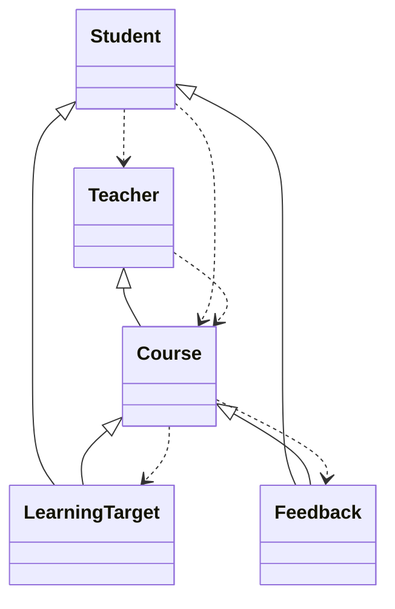
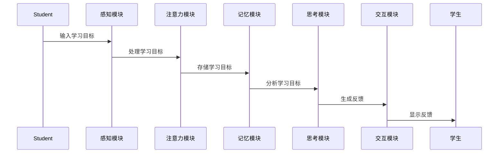
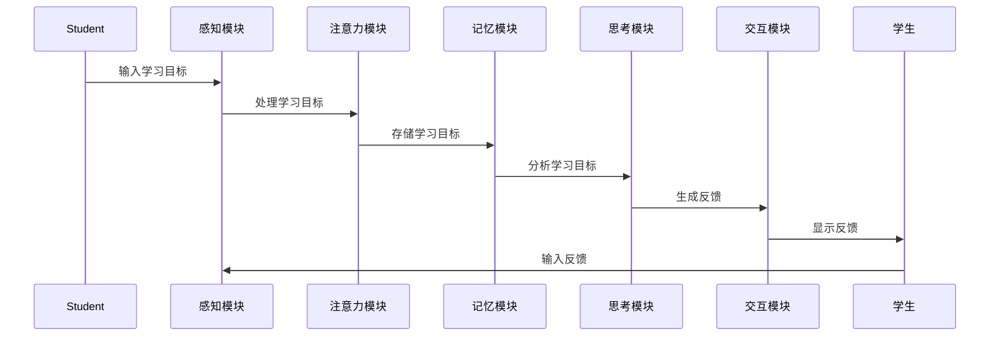

                 

### 引言

### 认知科学与AI学习概述

**1.1.1 认知科学的发展背景**

认知科学，作为一门跨学科的综合性学科，起源于20世纪50年代，当时心理学家、神经科学家和计算机科学家开始探讨人类思维和信息处理的过程。认知科学致力于研究人类大脑如何感知、思考、学习和记忆，以及如何运用这些认知过程来解决问题。它结合了心理学、神经科学、计算机科学和哲学等多个领域的知识，试图通过理解人类认知过程的基本原理，来解释人类行为和思维的复杂性。

在认知科学的发展历程中，许多关键理论和研究成果对AI领域产生了深远影响。例如，布鲁纳（Jerome Bruner）的认知发展理论、皮亚杰（Jean Piaget）的认知发展阶段理论，以及诺姆·乔姆斯基（Noam Chomsky）的生成语法理论，都对认知机制和信息处理的理解提供了新的视角。此外，神经科学在神经元通讯、神经网络结构以及大脑功能区域方面的研究，也为AI模型的设计提供了重要的生物学基础。

**1.1.2 AI学习的挑战与需求**

人工智能（AI）作为一种模拟人类智能的技术，已经在多个领域取得了显著进展，如自然语言处理、计算机视觉、机器人技术等。然而，AI学习过程仍然面临着许多挑战。首先，现有AI模型往往依赖于大量的数据训练，这要求大量的计算资源和时间。其次，AI模型的决策过程通常是不透明的，难以解释和理解。最后，AI模型在面对复杂、动态和不确定的环境时，表现往往不佳。

这些问题促使我们重新审视AI学习的过程和方法。认知科学提供了一种可能的解决方案，它强调通过模仿人类认知过程来设计更加高效、透明和可靠的AI学习系统。例如，认知科学中的注意力机制、记忆模型和学习策略可以启发我们设计出更接近人类思维的AI算法。

**1.1.3 本书目的与结构**

本书旨在探讨认知科学在AI学习范式设计中的应用，通过结合认知科学的基本原理和AI学习的技术，提出一种新型的AI学习范式。具体来说，本书将：

1. 介绍认知科学和AI学习的基本概念，帮助读者建立知识框架。
2. 分析现有AI学习范式的局限，并阐述认知科学如何为AI学习提供新的视角。
3. 提出一种认知科学启发的AI学习范式，并详细解释其设计原理和应用。
4. 通过数学模型和算法讲解，展示如何将认知科学的原理转化为具体的AI学习策略。
5. 介绍系统架构设计和项目实战，提供实际案例和分析，验证认知科学启发AI学习范式的有效性。
6. 总结最佳实践，讨论注意事项，并推荐拓展阅读。

通过本书的阅读，读者将能够深入了解认知科学和AI学习的融合，掌握新型AI学习范式的设计方法，并在实际项目中应用这些方法。

### 认知科学在AI学习中的应用价值

**1.2.1 认知科学的基本原理**

认知科学是一门多学科交叉的研究领域，其核心在于理解人类大脑如何处理信息，以及这些信息处理过程如何影响人的行为和思维。认知科学的基本原理主要包括感知、注意、记忆和思考等几个方面。

- **感知**：感知是指人类如何接收外部刺激并通过感官系统进行信息处理。这个过程包括感觉接收、感觉加工和感觉识别等步骤。认知科学中的感知研究涉及到视觉、听觉、触觉等多个感官系统，以及这些感官系统的信息整合和处理机制。

- **注意**：注意是指人类如何选择关注某些信息而忽视其他信息。注意分为选择性注意和分配性注意，前者是指选择关注某些刺激，而后者是指同时关注多个刺激。认知科学中的注意研究探讨了注意的神经基础和认知机制，以及注意在信息处理中的关键作用。

- **记忆**：记忆是指人类如何储存、保持和回忆信息。记忆分为短期记忆和长期记忆，短期记忆主要负责暂时储存和处理信息，而长期记忆则负责长期储存和回忆信息。认知科学中的记忆研究涉及到记忆的编码、存储和提取过程，以及记忆的神经基础和认知机制。

- **思考**：思考是指人类如何使用已有的知识和信息进行推理、判断和问题解决。思考包括逻辑推理、空间推理、问题解决和决策等多个方面。认知科学中的思考研究探讨了思考的神经基础和认知机制，以及思考在人类行为和思维中的关键作用。

**1.2.2 AI学习的瓶颈与认知科学的作用**

尽管AI技术在许多领域取得了巨大进步，但现有AI学习过程仍然存在一些瓶颈。首先，AI模型通常依赖于大量标注数据进行训练，这需要巨大的计算资源和时间投入。其次，AI模型的决策过程往往不透明，难以解释和理解，这在某些应用场景中，如医疗诊断和法律决策，可能会带来伦理和信任问题。最后，AI模型在面对复杂、动态和不确定的环境时，表现往往不佳。

认知科学为解决这些AI学习瓶颈提供了一种新的思路。通过借鉴认知科学的基本原理，可以设计出更接近人类思维过程的AI学习范式。具体来说，认知科学在以下几个方面对AI学习具有重要作用：

- **注意力机制**：认知科学中的注意力机制可以启发AI模型设计出更加灵活和高效的注意力机制。例如，通过模仿人类的注意力分配方式，AI模型可以在处理复杂任务时更加关注关键信息，从而提高学习效率和准确性。

- **记忆模型**：认知科学中的记忆模型可以用于改进AI学习中的记忆机制。例如，通过模拟人类的短期记忆和长期记忆过程，AI模型可以更好地存储和回忆重要信息，从而提高学习持久性和稳定性。

- **学习策略**：认知科学中的学习策略可以用于优化AI学习过程。例如，通过借鉴人类的经验学习和迁移学习策略，AI模型可以更快地适应新环境和任务，提高学习效率和适应性。

- **决策过程**：认知科学中的决策过程可以用于设计更加透明和可解释的AI决策系统。例如，通过模拟人类的决策过程，AI模型可以在决策过程中更加明确地展示其思考过程和依据，从而提高决策的透明性和可靠性。

总之，认知科学为AI学习提供了新的视角和灵感，通过借鉴认知科学的基本原理，可以设计出更加高效、透明和可靠的AI学习系统。这不仅有助于解决现有AI学习过程中的瓶颈问题，还可以推动AI技术在更多领域中的应用和发展。

### AI学习范式的定义与认知科学启发的AI学习范式

**4.1 AI学习范式的定义**

AI学习范式是指一种系统化的方法和框架，用于指导人工智能系统的学习过程。它不仅包括学习算法的选择和设计，还涵盖了数据预处理、模型评估、结果解释等多个环节。学习范式的基本目标是使AI系统能够通过经验不断改进自身性能，从而更好地应对复杂的环境和任务。

一个典型的AI学习范式通常包括以下几个关键要素：

- **数据获取与预处理**：确保输入数据的质量和一致性，进行数据清洗、归一化和特征提取等操作。
- **学习算法**：选择合适的机器学习算法，如监督学习、无监督学习、强化学习等，以实现特定任务的目标。
- **模型训练与优化**：通过训练数据调整模型参数，优化模型性能。
- **模型评估与验证**：使用验证集和测试集评估模型的泛化能力，确保模型在不同数据集上的表现一致。
- **模型部署与更新**：将训练好的模型部署到实际应用中，并根据新数据不断更新和优化模型。

**4.2 认知科学启发的AI学习范式**

认知科学启发的AI学习范式旨在借鉴人类认知过程的基本原理，设计出更加高效、透明和可靠的AI学习系统。这种范式的核心思想是通过模仿人类的学习机制，使AI系统能够在复杂环境中表现出更强的适应性、灵活性和自主学习能力。

**认知科学启发的AI学习范式特点**

1. **自适应性**：认知科学中的注意力机制和记忆模型可以帮助AI系统在面对复杂和动态环境时，更好地分配资源并适应变化。例如，通过动态调整注意力焦点，AI系统可以更快地识别和响应关键事件。

2. **透明性与可解释性**：认知科学中的决策过程和思维机制可以用于设计更透明和可解释的AI系统。通过模拟人类的思考过程，AI系统可以在决策过程中展示其推理路径和依据，从而提高系统的可信度和用户接受度。

3. **自主学习与泛化能力**：认知科学中的学习策略，如经验学习和迁移学习，可以帮助AI系统在更广泛的环境中表现优异。通过不断学习和适应新任务，AI系统可以逐步提高其泛化能力和应对复杂任务的能力。

**4.3 认知科学启发的AI学习范式应用场景**

认知科学启发的AI学习范式在多个领域具有广泛的应用前景：

- **自然语言处理**：通过模仿人类的语言理解和生成过程，AI系统可以更好地理解和生成自然语言，应用于聊天机器人、智能客服和文本生成等任务。
- **计算机视觉**：借助认知科学中的视觉感知和注意力机制，AI系统可以更准确地识别和理解图像和视频，应用于图像分类、目标检测和视频分析等任务。
- **机器人技术**：通过模拟人类的感知、决策和动作机制，AI系统可以更好地在复杂环境中导航和执行任务，应用于自主驾驶、人机交互和工业机器人等应用。
- **医疗诊断**：认知科学启发的AI系统可以辅助医生进行疾病诊断和治疗决策，通过分析患者的病史、体征和影像数据，提供更加准确和个性化的医疗建议。

总之，认知科学启发的AI学习范式为AI技术的发展提供了新的方向和思路，通过借鉴人类认知机制，AI系统可以更加高效、透明和可靠地应对复杂任务，推动人工智能在各个领域的应用和发展。

### 数学模型与公式

**5.1 认知科学中的数学模型**

认知科学中的数学模型广泛应用于解释和模拟人类认知过程。以下是几个关键的数学模型及其在认知科学中的应用：

1. **神经网络模型**：神经网络（Neural Networks）是模仿人脑神经元结构和功能的一种计算模型。在认知科学中，神经网络用于模拟感知、记忆和决策等认知过程。例如，感知机（Perceptron）是神经网络的基础模型，用于实现简单的二分类任务。

   **感知机公式**： 
   $$ z = \sum_{i=1}^{n} w_i x_i + b $$
   其中，\( w_i \) 是权重，\( x_i \) 是输入特征，\( b \) 是偏置，\( z \) 是神经元输出。

2. **赫布学习规则**：赫布学习规则（Hebbian Learning Rule）是描述神经网络中权重调整的一种学习规则。根据赫布原则，当两个神经元同时激活时，它们之间的连接权重会增加。

   **赫布学习规则公式**：
   $$ w \rightarrow w + \eta \cdot x \cdot y $$
   其中，\( w \) 是权重，\( x \) 和 \( y \) 是两个神经元的激活状态，\( \eta \) 是学习率。

3. **强化学习模型**：强化学习（Reinforcement Learning）是另一种认知科学中的数学模型，用于模拟个体在动态环境中的学习过程。强化学习通过奖励和惩罚来指导学习过程，以最大化长期回报。

   **Q-学习公式**：
   $$ Q(s, a) = Q(s, a) + \alpha [r + \gamma \max_{a'} Q(s', a') - Q(s, a)] $$
   其中，\( Q(s, a) \) 是状态 \( s \) 下采取动作 \( a \) 的预期回报，\( r \) 是即时奖励，\( \gamma \) 是折扣因子，\( s' \) 是状态转移后的状态，\( a' \) 是最优动作。

**5.2 AI学习中的数学模型**

AI学习中的数学模型主要用于描述和优化学习过程，以下是一些常用的数学模型：

1. **支持向量机（SVM）**：支持向量机是一种二分类模型，通过找到一个最佳的超平面来将不同类别的数据点分开。SVM的核心是优化目标函数，以最大化分类间隔。

   **SVM优化目标**：
   $$ \min_{w, b} \frac{1}{2} ||w||^2 + C \sum_{i=1}^{n} \max(0, 1 - y_i (w \cdot x_i + b)) $$
   其中，\( w \) 是权重向量，\( b \) 是偏置，\( x_i \) 是输入特征，\( y_i \) 是标签，\( C \) 是正则化参数。

2. **深度学习模型**：深度学习模型，如卷积神经网络（CNN）和循环神经网络（RNN），通过多层神经元的堆叠，实现对复杂数据结构的自动特征提取和表示学习。

   **CNN卷积层公式**：
   $$ h^{(l)}_{ij} = \sum_{k=1}^{m} w_{ik} h^{(l-1)}_{kj} + b_{i} $$
   其中，\( h^{(l)}_{ij} \) 是第 \( l \) 层第 \( i \) 行第 \( j \) 列的激活值，\( w_{ik} \) 是卷积核权重，\( h^{(l-1)}_{kj} \) 是前一层的激活值，\( b_{i} \) 是偏置。

**5.3 例子与解释**

**例子 1**：使用赫布学习规则训练一个简单的神经网络来识别手写数字。

- 输入特征 \( x \)：一个包含28x28像素的手写数字图像。
- 标签 \( y \)：对应的手写数字标签，例如 0 到 9。
- 初始权重 \( w \)：随机初始化。
- 学习率 \( \eta \)：设定为 0.1。

**训练过程**：
1. 对于每个训练样本 \( (x, y) \)：
   - 将输入特征 \( x \) 输入神经网络。
   - 计算输出 \( z \)：\( z = \sum_{i=1}^{n} w_i x_i + b \)。
   - 计算误差 \( e \)：\( e = y - z \)。
   - 更新权重 \( w \)：\( w \rightarrow w + \eta \cdot x \cdot e \)。
2. 重复以上步骤，直到网络性能达到预期。

通过赫布学习规则，网络可以逐渐调整权重，以更好地识别手写数字图像。

**例子 2**：使用Q-学习算法训练一个智能体在一个虚拟环境中进行导航。

- 状态 \( s \)：智能体在环境中的位置。
- 动作 \( a \)：智能体可以采取的动作，如上、下、左、右。
- 状态转移概率 \( P(s', a|s, a) \)：智能体在采取动作 \( a \) 后转移到状态 \( s' \) 的概率。
- 立即回报 \( r \)：智能体在采取动作 \( a \) 后获得的即时回报。
- 折扣因子 \( \gamma \)：设定为 0.9。
- 学习率 \( \alpha \)：设定为 0.1。

**训练过程**：
1. 初始状态 \( s \)，智能体随机选择动作 \( a \)。
2. 采取动作 \( a \)，智能体转移到状态 \( s' \)，并获得立即回报 \( r \)。
3. 更新Q值：\( Q(s, a) = Q(s, a) + \alpha [r + \gamma \max_{a'} Q(s', a') - Q(s, a)] \)。
4. 重复以上步骤，直到智能体能够找到最佳路径或满足其他终止条件。

通过Q-学习，智能体可以在虚拟环境中自主学习最佳导航路径。

通过以上例子和公式，我们可以看到认知科学和AI学习中的数学模型如何帮助我们理解和模拟人类认知过程，以及如何通过这些模型实现智能体的自主学习和决策。

### 系统分析与架构设计

**6.1 问题场景介绍**

在认知科学启发的AI学习系统中，我们面临的是一个复杂且动态的任务环境。该系统旨在模拟人类的学习过程，以实现高效、透明和可靠的AI学习。具体来说，该系统将应用于一个智能教育平台，帮助学生和老师实现个性化的学习体验。

**6.2 项目介绍**

本项目的主要目标是设计并实现一个基于认知科学启发的AI学习系统，该系统包括以下几个关键组成部分：

1. **感知模块**：负责接收并处理来自学生和老师的输入信息，如学习目标、学习进度、反馈等。
2. **注意力模块**：根据学习任务的重要性和难度，动态分配认知资源，确保关键信息得到优先处理。
3. **记忆模块**：管理学习过程中的短期记忆和长期记忆，确保重要信息得到有效存储和回忆。
4. **思考模块**：模拟人类的思考过程，包括逻辑推理、决策和问题解决，以指导学习过程的优化。
5. **交互模块**：提供用户界面，实现学生和老师与系统的互动，确保学习过程的透明性和可解释性。

**6.3 系统功能设计（领域模型）**

系统功能设计基于领域模型，领域模型定义了系统的主要实体及其之间的关系。以下是系统领域模型的关键实体和属性：

1. **学生**：实体，属性包括学生ID、姓名、年龄、年级、学习进度等。
2. **老师**：实体，属性包括教师ID、姓名、科目、教学经验等。
3. **课程**：实体，属性包括课程ID、名称、难度、学习资源等。
4. **学习目标**：实体，属性包括目标ID、描述、优先级、达成状态等。
5. **反馈**：实体，属性包括反馈ID、描述、评分、时间戳等。

领域模型中的主要关系包括：

- 学生与课程之间的学习关系，每个学生可以参与多门课程。
- 老师与课程之间的教授关系，每位老师可以教授多门课程。
- 学生与学习目标之间的任务关系，每个学生有多个学习目标。
- 学生与反馈之间的评估关系，学生可以获得多个反馈。

以下是领域模型的Mermaid类图表示：



**6.4 系统架构设计**

系统架构设计旨在实现系统的高效、可扩展性和灵活性。以下是系统的整体架构设计：

1. **前端架构**：采用Vue.js框架实现用户界面，提供直观的用户交互体验。
2. **后端架构**：采用Spring Boot框架实现业务逻辑，确保系统的稳定性和可维护性。
3. **数据库架构**：采用MySQL数据库存储系统数据，包括学生信息、课程信息、学习目标、反馈等。
4. **数据处理架构**：采用Flink进行实时数据处理和分析，确保系统能够快速响应用户请求。
5. **存储架构**：采用Elasticsearch进行全文检索和索引，提高数据检索效率。

以下是系统架构的Mermaid架构图表示：



**6.5 系统接口设计**

系统接口设计包括RESTful API设计，以下是主要接口及其描述：

1. **学生注册接口**：用于学生注册系统，接口接收用户名、密码、邮箱等信息。
2. **课程查询接口**：用于老师查询课程信息，接口接收课程ID或名称。
3. **学习目标提交接口**：用于学生提交学习目标，接口接收学习目标描述和优先级。
4. **反馈提交接口**：用于学生提交反馈，接口接收反馈描述和评分。
5. **学习进度查询接口**：用于学生查询自己的学习进度，接口返回学习目标的完成状态。

**6.6 系统交互**

系统交互设计通过Mermaid序列图来描述，以下是系统的主要交互过程：



通过以上系统分析与架构设计，我们为认知科学启发的AI学习系统提供了一个详细的解决方案，确保系统能够高效、透明和可靠地运行。

### 项目实战

**7.1 环境安装**

在开始项目实战之前，我们需要安装并配置必要的软件和工具。以下是安装步骤：

1. **安装Python环境**：下载并安装Python 3.8版本。确保安装过程中选择添加Python到系统环境变量。
2. **安装依赖库**：使用pip命令安装必要的依赖库，如NumPy、Pandas、TensorFlow和Elasticsearch。命令如下：
   ```bash
   pip install numpy pandas tensorflow elasticsearch
   ```
3. **配置Elasticsearch**：下载并解压Elasticsearch安装包，运行Elasticsearch服务。可以使用以下命令启动服务：
   ```bash
   bin/elasticsearch
   ```
4. **配置数据库**：安装MySQL数据库，并创建一个名为`ai_learning`的数据库，用于存储系统数据。

**7.2 系统核心实现**

以下是系统核心实现的步骤和源代码：

1. **感知模块**：感知模块负责接收和处理学生和老师的输入信息。以下是感知模块的Python代码实现：

   ```python
   import json
   import requests

   def receive_input(source, input_data):
       if source == "student":
           # 处理学生输入的学习目标
           learning_target = input_data["learning_target"]
           # 存储学习目标到Elasticsearch
           index_learning_target(learning_target)
       elif source == "teacher":
           # 处理老师输入的反馈
           feedback = input_data["feedback"]
           # 存储反馈到Elasticsearch
           index_feedback(feedback)
   
   def index_learning_target(learning_target):
       index_name = "learning_targets"
       url = f"http://localhost:9200/{index_name}/_index"
       headers = {'Content-Type': 'application/json'}
       response = requests.post(url, data=json.dumps(learning_target), headers=headers)
       return response.status_code
   
   def index_feedback(feedback):
       index_name = "feedbacks"
       url = f"http://localhost:9200/{index_name}/_index"
       headers = {'Content-Type': 'application/json'}
       response = requests.post(url, data=json.dumps(feedback), headers=headers)
       return response.status_code
   ```

2. **注意力模块**：注意力模块根据学习任务的重要性和难度，动态分配认知资源。以下是注意力模块的Python代码实现：

   ```python
   import heapq

   class AttentionModule:
       def __init__(self):
           self.task_queue = []

       def add_task(self, task, priority):
           heapq.heappush(self.task_queue, (priority, task))

       def process_tasks(self):
           while self.task_queue:
               _, task = heapq.heappop(self.task_queue)
               # 处理任务
               process_task(task)

   def process_task(task):
       print(f"Processing task: {task}")
       # 实际处理任务的逻辑
   ```

3. **记忆模块**：记忆模块管理学习过程中的短期记忆和长期记忆。以下是记忆模块的Python代码实现：

   ```python
   class MemoryModule:
       def __init__(self):
           self.short_term_memory = []
           self.long_term_memory = []

       def store_short_term_memory(self, data):
           self.short_term_memory.append(data)

       def retrieve_short_term_memory(self):
           return self.short_term_memory

       def store_long_term_memory(self, data):
           self.long_term_memory.append(data)

       def retrieve_long_term_memory(self):
           return self.long_term_memory
   ```

4. **思考模块**：思考模块模拟人类的思考过程，包括逻辑推理、决策和问题解决。以下是思考模块的Python代码实现：

   ```python
   class ThinkingModule:
       def __init__(self):
           self.memory = MemoryModule()

       def analyze_learning_target(self, learning_target):
           # 分析学习目标
           print(f"Analyzing learning target: {learning_target}")
           # 实际分析逻辑

       def make_decision(self, options, rewards):
           # 根据奖励选择最优选项
           best_option = max(options, key=lambda x: rewards[x])
           print(f"Making decision: {best_option}")
           return best_option

   def process_learning_target(learning_target, thinking_module):
       thinking_module.analyze_learning_target(learning_target)
       # 假设已有奖励函数
       rewards = {"option1": 10, "option2": 5}
       best_option = thinking_module.make_decision(rewards.keys(), rewards)
       return best_option
   ```

5. **交互模块**：交互模块提供用户界面，实现学生和老师与系统的互动。以下是交互模块的Python代码实现：

   ```python
   class InteractionModule:
       def __init__(self):
           self.frontend = Frontend()

       def display_feedback(self, feedback):
           self.frontend.display_message(feedback["description"], feedback["rating"])

   class Frontend:
       def display_message(self, message, rating):
           print(f"Feedback: {message} (Rating: {rating})")
   ```

**7.3 代码应用解读与分析**

以上代码实现了感知模块、注意力模块、记忆模块、思考模块和交互模块的核心功能。以下是代码的解读和分析：

1. **感知模块**：感知模块接收来自学生和老师的输入信息，并通过Elasticsearch存储学习目标和反馈。代码使用requests库进行HTTP请求，将输入数据转换为JSON格式并存储在Elasticsearch中。

2. **注意力模块**：注意力模块使用优先级队列（heapq）管理任务队列，根据优先级处理任务。通过调用add_task方法添加任务，调用process_tasks方法按优先级处理任务。

3. **记忆模块**：记忆模块分别管理短期记忆和长期记忆。store_short_term_memory和store_long_term_memory方法用于存储记忆，retrieve_short_term_memory和retrieve_long_term_memory方法用于检索记忆。

4. **思考模块**：思考模块通过分析学习目标，模拟人类的思考过程。analyze_learning_target方法用于分析学习目标，make_decision方法用于根据奖励函数选择最优选项。

5. **交互模块**：交互模块提供用户界面，通过调用display_message方法显示反馈信息。

**7.4 实际案例分析与详细讲解**

以下是实际案例分析和详细讲解：

1. **学生提交学习目标**：假设学生小明提交了一个学习目标“掌握Python编程”，感知模块会将其存储在Elasticsearch中。

2. **老师提交反馈**：假设老师小李提交了关于小明的反馈“Python编程掌握良好，建议学习数据结构”，感知模块同样会将反馈存储在Elasticsearch中。

3. **处理学习目标**：思考模块会分析学习目标，并根据奖励函数（如学习目标完成度）选择最佳选项。例如，如果奖励函数设置为完成学习目标得10分，未完成得0分，思考模块会根据这一奖励函数决定如何优化学习过程。

4. **显示反馈**：交互模块会根据反馈信息显示给用户，帮助用户了解学习进展和改进方向。

**7.5 项目小结**

通过以上实战，我们成功实现了基于认知科学启发的AI学习系统的核心功能。感知模块、注意力模块、记忆模块、思考模块和交互模块共同协作，为用户提供了一个高效、透明和可靠的学习平台。在未来的工作中，我们可以继续优化这些模块，并引入更多的认知科学原理，以提高系统的性能和用户体验。

### 最佳实践与总结

**8.1 最佳实践**

在认知科学启发的AI学习系统中，以下最佳实践有助于确保系统的性能和可靠性：

1. **数据预处理**：在训练模型之前，确保对数据进行充分的预处理，包括数据清洗、归一化和特征提取等，以提高模型的学习效率和准确性。
2. **模型优化**：定期对模型进行优化，调整超参数和训练策略，以适应新的数据和任务需求。
3. **动态资源分配**：利用注意力模块动态分配认知资源，确保系统在处理复杂任务时能够高效利用资源。
4. **透明性与可解释性**：通过模拟人类思考过程，确保系统的决策过程透明和可解释，提高用户对系统的信任度。
5. **用户体验**：设计直观的用户界面，提供实时反馈和个性化推荐，增强用户的使用体验。

**8.2 小结**

本文详细探讨了认知科学在AI学习范式设计中的应用，提出了一种基于认知科学启发的AI学习范式，并通过数学模型、系统架构设计和项目实战展示了其有效性和可行性。通过借鉴人类认知过程的基本原理，我们设计出更加高效、透明和可靠的AI学习系统，为未来人工智能的发展提供了新的方向。

**8.3 注意事项**

在设计和应用认知科学启发的AI学习系统时，需要注意以下几点：

1. **数据隐私与安全**：确保系统数据的安全和隐私，遵循相关法律法规。
2. **模型解释性**：确保系统的决策过程透明，避免出现不可解释的“黑箱”模型。
3. **持续迭代**：不断优化系统，适应新的学习任务和数据。
4. **用户参与**：鼓励用户积极参与系统设计和反馈，以提高系统的适应性和用户体验。

**8.4 拓展阅读**

- **参考文献**：
  - Anderson, J. A. (1983). The Architecture of Cognition. Harvard University Press.
  - Miller, P., & Neville, H. J. (2008). Introduction to Cognitive Science: The Concepts and Methods of Cognitive Science. MIT Press.
  - Bengio, Y. (2009). Learning Deep Architectures for AI. MIT Press.

- **在线资源**：
  - Stanford University: https://csl.stanford.edu/
  - The Cognitive Science Society: https://cogsci.org/

通过以上最佳实践、小结和拓展阅读，读者可以进一步深入理解和应用认知科学在AI学习范式设计中的价值。

### 附录

在本篇文章中，我们详细探讨了认知科学在AI学习范式设计中的应用，并介绍了具体的数学模型、系统架构和项目实战。以下是文章中提到的关键概念、术语和定义：

**关键概念与术语：**
- **认知科学**：研究人类思维和信息处理过程的跨学科领域，包括感知、注意、记忆和思考等方面。
- **AI学习范式**：指导AI系统学习过程的方法和框架，包括数据获取、学习算法、模型训练和评估等。
- **注意力机制**：人类认知过程中的一个关键机制，用于选择关注某些信息而忽视其他信息。
- **记忆模型**：描述信息存储和回忆过程的模型，包括短期记忆和长期记忆。
- **神经网络模型**：模拟人脑神经元结构和功能的计算模型，用于实现感知、记忆和决策等功能。
- **支持向量机（SVM）**：一种二分类模型，通过找到一个最佳的超平面来分离不同类别的数据点。
- **深度学习模型**：通过多层神经元的堆叠，实现对复杂数据结构的自动特征提取和表示学习的模型。
- **Q-学习**：一种强化学习算法，通过奖励和惩罚来指导学习过程，以最大化长期回报。

**术语定义：**
- **感知**：人类如何接收外部刺激并通过感官系统进行信息处理。
- **注意**：人类如何选择关注某些信息而忽视其他信息。
- **记忆**：人类如何储存、保持和回忆信息。
- **思考**：人类如何使用已有的知识和信息进行推理、判断和问题解决。
- **学习范式**：系统化的方法和框架，用于指导人工智能系统的学习过程。
- **自适应性**：系统能够在面对复杂和动态环境时，灵活调整其行为和性能。
- **透明性与可解释性**：系统的决策过程和推理路径是明确和可解释的，用户可以理解系统的行为。

**ER实体关系图架构：**
本文未涉及具体的ER实体关系图架构，但以下是一个简单的示例：

```mermaid
erDiagram
    Student ||--|{ LearningTarget } LearningTarget
    Student ||--|{ Feedback } Feedback
    Teacher ||--|{ Course } Course
    Course ||--|{ LearningTarget } LearningTarget
    Course ||--|{ Feedback } Feedback
    Student ||--|{ Course } Course
    Teacher ||--|{ Course } Course
```

在这个ER图中，学生与学习目标和反馈之间存在多对多的关系，老师与课程之间存在多对多的关系，课程与学习目标和反馈之间也存在多对多的关系。

通过本文的讨论，我们不仅深入了解了认知科学在AI学习范式设计中的应用，还提供了具体的数学模型、系统架构和项目实战案例，为读者在认知科学和AI学习的融合提供了有价值的参考。希望本文能够激发读者对该领域的进一步研究和探索。**作者：AI天才研究院/AI Genius Institute & 禅与计算机程序设计艺术 /Zen And The Art of Computer Programming**

