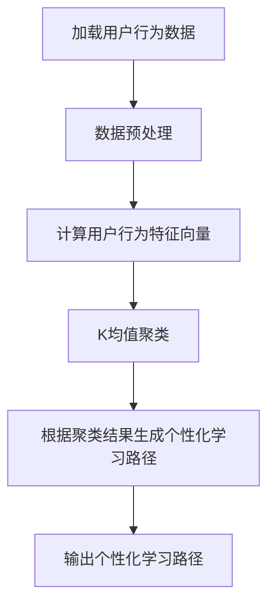
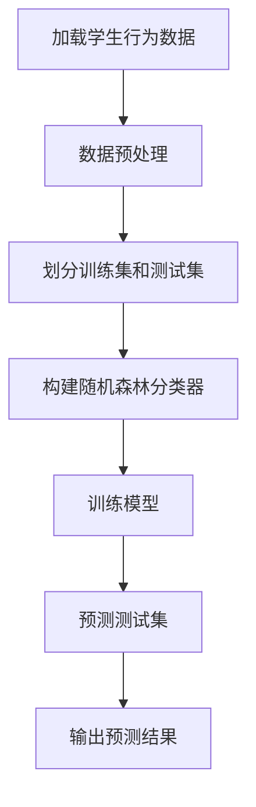

                 

### 第一部分：背景与核心概念

#### 第1章：问题背景与问题描述

##### 1.1.1 问题背景

认知科学与教育个性化的重要性

在信息时代，个性化教育已经成为教育领域的研究热点。随着认知科学的不断发展，人们开始关注如何将认知科学的原理应用于教育中，从而实现更加个性化的学习体验。认知科学是一门研究人类思维、感知、学习、记忆和语言等方面的学科，它为教育个性化提供了理论依据和科学方法。

传统教育系统的局限性与挑战

传统教育系统通常采用“一刀切”的教学模式，难以满足学生的个性化需求。一方面，教师在教学过程中往往无法充分考虑学生的认知特点和学习风格；另一方面，学生也难以在传统教育系统中找到适合自己的学习路径和资源。这种现状导致了教育资源的浪费和学生学习效果的不理想。

AI技术在教育领域的发展与应用

随着人工智能技术的飞速发展，AI在教育领域的应用日益广泛。从智能推荐系统到个性化学习路径规划，从自动化作业批改到智能教学辅助，AI技术正在改变教育的传统模式，为教育个性化提供了新的可能性。通过结合认知科学的原理和方法，AI技术有望实现更加精准和有效的个性化教育。

##### 1.1.2 问题描述

如何利用认知科学原理提升AI在教育个性化学习中的应用效果？

结合认知科学的原理，我们可以设计出更加符合人类学习规律的AI教育个性化学习系统。例如，通过分析学生的注意力分布、记忆模式和学习策略，AI系统可以提供针对性的学习建议和资源，从而提高学生的学习效果和兴趣。

如何构建一个基于AI的教育个性化学习系统？

构建一个基于AI的教育个性化学习系统需要整合多个技术领域，包括认知科学、数据挖掘、机器学习和自然语言处理等。系统需要具备数据收集、分析与处理的能力，以及自适应和交互功能，以实现真正的个性化学习体验。

如何确保教育个性化学习系统的有效性和安全性？

教育个性化学习系统的有效性和安全性是至关重要的。系统需要确保学生的学习数据得到妥善保护，避免隐私泄露。同时，系统还需要通过有效的算法和模型来保证学习效果，避免因过度个性化导致的认知偏差和适应性问题。

#### 第1.1章：核心概念

##### 1.1.1 认知科学概述

认知科学的基本概念

认知科学是研究人类大脑如何感知、理解、思考和记忆信息的学科。它涵盖了心理学、神经科学、人工智能、语言学等多个领域，旨在探索人类思维的本质和运作机制。

认知科学的研究方法与范畴

认知科学研究方法主要包括实验研究、计算建模和神经影像学等。研究范畴包括感知、注意力、记忆、语言、决策和问题解决等多个方面，旨在揭示人类认知过程的规律和原理。

认知科学与教育个性化的联系

认知科学的研究成果为教育个性化提供了理论基础。通过分析学生的认知特点和学习规律，教育个性化系统能够更好地满足学生的个性化需求，从而提高教育质量和效果。

##### 1.1.2 AI教育个性化学习系统概述

AI教育个性化学习的定义

AI教育个性化学习是指利用人工智能技术，根据学生的个性化需求和特点，提供定制化的学习内容、路径和资源，以实现更加有效的学习目标。

AI教育个性化学习的关键技术

AI教育个性化学习的关键技术包括数据挖掘、机器学习、深度学习和自然语言处理等。这些技术能够帮助系统分析学生的学习行为、兴趣和需求，从而实现个性化推荐和教学。

AI教育个性化学习系统的组成部分

AI教育个性化学习系统通常包括学生模型、课程模型、推荐引擎、教学系统等多个部分。学生模型用于收集和分析学生的学习数据，课程模型用于存储和提供学习资源，推荐引擎根据学生模型和课程模型提供个性化推荐，教学系统用于实现教学互动和反馈。

##### 1.1.3 AI教育个性化学习系统的边界与外延

系统功能边界

AI教育个性化学习系统的功能边界包括学习路径规划、学习资源推荐、学习效果评估和教学互动等。系统需要在这些功能范围内提供个性化服务，同时避免过度侵入学生的隐私。

系统应用范围

AI教育个性化学习系统可以应用于学校、培训机构和在线教育平台等多个场景。它不仅能够帮助传统教育机构提升教育质量，还可以为新兴的在线教育模式提供技术支持。

系统与其他教育技术的融合

AI教育个性化学习系统可以与虚拟现实（VR）、增强现实（AR）和游戏化学习等技术相结合，为学习者提供更加丰富和多样的学习体验。同时，系统还可以与其他教育管理系统（如学习管理系统LMS、学生信息管理系统SIS等）集成，实现数据共享和流程优化。

##### 1.1.4 概念属性特征对比

认知科学理论与AI技术原理对比

认知科学理论强调人类思维和心理过程的内在规律，AI技术原理则关注如何通过算法和计算模型模拟和扩展人类智能。两者在研究目标和方法上存在显著差异，但可以相互补充，共同推动教育个性化的发展。

个性化学习与传统教育模式对比

个性化学习与传统教育模式在目标、方法和效果上存在明显差异。个性化学习注重满足个体需求，实现学习效果的最优化，而传统教育模式则往往采用统一的教学内容和进度，难以满足学生的个性化需求。

AI教育个性化学习系统与传统教育系统的对比

AI教育个性化学习系统在技术实现、教学效果和学生体验等方面具有显著优势。它能够利用大数据和人工智能技术，实现真正的个性化教育，而传统教育系统则主要依赖于经验和教学资源。

### 第1.2章：概念属性特征对比表

在本文中，我们将通过一个概念属性特征对比表来详细探讨认知科学、AI技术原理以及AI教育个性化学习系统的属性特征。以下是对这些核心概念的主要属性特征的对比：

| **概念**            | **主要属性特征**                                                     | **简要说明**                                                                                       |
|---------------------|---------------------------------------------------------------------|------------------------------------------------------------------------------------------------------|
| **认知科学**        | - 研究人类思维和心理过程<br>- 强调内在规律和机制<br>- 多学科交叉研究 | 认知科学致力于理解人类认知的复杂性和多样性，通过实验、计算建模和神经科学等方法来揭示认知过程的本质。 |
| **AI技术原理**      | - 基于算法和计算模型<br>- 模拟和扩展人类智能<br>- 数据驱动 | 人工智能通过机器学习、深度学习等技术，模拟人类的感知、学习和推理能力，实现自动化和智能化。          |
| **AI教育个性化学习** | - 个性化学习内容与路径<br>- 自适应调整<br>- 数据驱动决策 | AI教育个性化学习利用AI技术，根据学生的个性化需求，提供定制化的学习资源和路径，实现高效的学习体验。     |

通过这个对比表，我们可以更清晰地看到三个概念在目标、方法和实现上的不同。认知科学关注人类心理过程的内在机制，AI技术原理则侧重于计算模型的构建和应用，而AI教育个性化学习则将两者结合，实现个性化的教育服务。这种结合不仅能够提升教育质量，还能为教育领域的创新提供强有力的技术支持。

### 第2章：认知科学原理与AI技术

#### 第2.1章：认知科学原理

##### 2.1.1 认知过程的描述

注意力机制

注意力机制是指大脑在处理信息时，对某些信息给予更高优先级处理的能力。这种机制有助于我们在众多信息中选择性地关注重要内容，提高信息处理效率。例如，当我们在嘈杂的环境中与他人交谈时，注意力机制使我们能够忽略背景噪音，专注于对方的话语。

记忆与遗忘

记忆是指大脑将信息存储和保留的能力。记忆分为短期记忆和长期记忆，前者用于暂时存储信息，后者则将信息持久保留。遗忘是指信息在记忆中的丢失。遗忘可能由多种原因导致，如信息过载、重复次数不足或时间推移等。

逻辑推理与决策

逻辑推理是指通过逻辑规则和推理过程，从已知信息推导出新信息的能力。例如，从“所有人都会死亡”和“苏格拉底是人”这两个前提，可以推理出“苏格拉底会死亡”。决策是指基于逻辑推理和情感因素，从多个选项中选择最优方案的过程。

情感与情绪处理

情感与情绪是认知过程的重要组成部分。情感是指我们对事物的内在感受，如喜悦、悲伤和愤怒等。情绪则是对情感的具体表现，如哭泣、大笑或愤怒的身体反应。认知科学通过研究情感和情绪的机制，帮助我们更好地理解人类行为和心理。

##### 2.1.2 认知科学理论

信息加工理论

信息加工理论认为，大脑就像一个计算机，通过接收、处理和存储信息来完成认知任务。这一理论强调信息处理的阶段性和序列性，包括感知、注意、记忆、推理和决策等过程。

连接主义理论

连接主义理论认为，认知过程是通过神经网络中的神经元之间的连接和相互作用来实现的。这一理论强调分布式计算和网络结构在认知中的作用，通过模拟人脑的神经网络结构，可以理解和预测认知过程。

认知建构主义理论

认知建构主义理论认为，认知过程是通过个体与环境的互动，主动构建和调整认知模型来实现的。这一理论强调学习的主动性、情境性和适应性，认为学习者通过自己的经验来理解和解释信息。

##### 2.1.3 认知科学在教育中的应用

适应性教学

适应性教学是指根据学生的认知特点和学习需求，动态调整教学策略和资源，以实现最佳学习效果。通过认知科学的研究成果，教师可以设计出更加符合学生认知规律的教学方法和工具。

个性化学习路径规划

个性化学习路径规划是指根据学生的兴趣、能力和学习进度，为其规划最佳的学习路径和资源。通过认知科学的原理，AI系统可以分析学生的学习行为和认知特点，提供个性化的学习建议和资源，提高学习效率。

情感分析与教育干预

情感分析与教育干预是指通过分析学生的情感状态，提供针对性的教育干预和支持。认知科学研究表明，情感状态对学习效果有重要影响。通过情感分析，教师和AI系统可以及时发现和解决学生的情感问题，促进其全面发展。

### 第2.2章：AI技术原理

##### 2.2.1 基本原理

机器学习

机器学习是指通过算法和模型，从数据中自动学习和发现规律，以实现特定任务。机器学习分为监督学习、无监督学习和强化学习等类型，广泛应用于分类、回归、聚类和预测等领域。

深度学习

深度学习是机器学习的一种重要分支，通过多层神经网络模型，对大量数据进行自动学习和特征提取。深度学习在图像识别、自然语言处理和语音识别等领域取得了显著的突破。

自然语言处理

自然语言处理（NLP）是AI技术的重要分支，旨在使计算机能够理解、生成和处理人类语言。NLP技术包括词性标注、句法分析、语义理解和机器翻译等。

计算机视觉

计算机视觉是AI技术在视觉领域的应用，通过图像识别、图像处理和图像分析等方法，使计算机能够“看到”和理解图像信息。计算机视觉在安防监控、自动驾驶和医疗诊断等领域具有重要应用。

##### 2.2.2 AI技术在教育领域的应用

课堂自动化

AI技术可以自动化课堂教学环节，如自动批改作业、自动生成试卷和自动评分等。通过课堂自动化，教师可以节省大量时间和精力，专注于教学和辅导。

作业与考试自动化

AI技术可以自动生成个性化的作业和考试，根据学生的学习进度和知识掌握情况，提供针对性的练习和评估。这种自动化作业和考试有助于提高学生的学习效果和兴趣。

学生行为分析

AI技术可以通过分析学生的学习行为数据，如学习时长、学习频率和答题情况等，了解学生的学习状况和需求。通过学生行为分析，教师可以及时调整教学策略，提供个性化的辅导和支持。

课程推荐系统

AI技术可以根据学生的学习兴趣、能力和需求，推荐适合的课程和学习资源。通过课程推荐系统，学生可以更加高效地选择学习内容，提高学习效果。

### 第2.3章：认知科学与AI技术的融合

##### 2.3.1 融合理念

认知建模与AI技术结合

认知建模是指通过构建认知模型，模拟和预测人类认知过程。AI技术与认知建模的结合，可以实现更加智能和个性化的教育系统。例如，通过认知建模，AI系统可以分析学生的注意力分布和学习策略，提供个性化的学习建议和资源。

教育数据驱动的发展

教育数据驱动的发展是指通过收集和分析大量的教育数据，发现学生的学习规律和需求，进而优化教学策略和资源。AI技术在这一过程中发挥着重要作用，通过数据挖掘和机器学习算法，可以快速识别学生的学习模式和问题，提供针对性的解决方案。

个性化学习路径优化

个性化学习路径优化是指根据学生的个性化需求和特点，动态调整学习路径和资源，以实现最佳学习效果。认知科学与AI技术的结合，使得个性化学习路径优化成为可能。例如，通过认知建模和机器学习算法，AI系统可以预测学生的学习进度和效果，提供最优的学习路径和资源。

##### 2.3.2 融合实践

认知科学驱动的自适应学习平台

认知科学驱动的自适应学习平台是一种利用认知科学原理和AI技术，实现个性化学习的教育平台。该平台通过分析学生的学习行为和认知特点，提供针对性的学习建议和资源，提高学习效果。例如，通过认知建模，平台可以预测学生的学习难度和兴趣，调整学习内容的难度和类型。

基于AI的学生行为分析系统

基于AI的学生行为分析系统是一种利用AI技术，对学生的学习行为进行分析和评估的系统。该系统可以通过分析学生的学习时长、学习频率、答题情况和情感状态等数据，了解学生的学习状况和需求。例如，通过自然语言处理技术，系统可以分析学生的情感状态，提供针对性的心理辅导和支持。

AI辅助教师决策支持系统

AI辅助教师决策支持系统是一种利用AI技术，帮助教师做出教学决策的系统。该系统可以通过分析学生的学习数据，提供教学建议和资源，提高教学效果。例如，通过机器学习算法，系统可以识别学生的学习问题，提供针对性的教学辅导和资源，帮助教师优化教学策略。

### 第2.4章：核心概念属性特征对比表

在本文中，我们将通过一个核心概念属性特征对比表，详细对比认知科学理论、AI技术以及教育个性化学习系统的属性特征。以下是对这些核心概念的主要属性特征进行对比：

| **概念** | **主要属性特征** | **简要说明**                                                                                     |
|----------|------------------|------------------------------------------------------------------------------------------------|
| **认知科学** | - 强调内在机制和规律 | 研究人类思维、感知、学习和记忆等认知过程，揭示其内在规律和机制。                             |
| **AI技术原理** | - 基于算法和计算模型 | 通过机器学习、深度学习和自然语言处理等技术，模拟和扩展人类智能。                             |
| **教育个性化学习系统** | - 个性化学习内容与路径 | 结合认知科学原理和AI技术，根据学生的个性化需求和特点，提供定制化的学习资源和路径。             |

通过这个对比表，我们可以更清晰地看到认知科学、AI技术和教育个性化学习系统的区别和联系。认知科学关注人类认知过程的内在规律，AI技术原理侧重于计算模型和算法的实现，而教育个性化学习系统则将两者结合，实现个性化的教育服务。这种结合不仅能够提升教育质量，还能为教育领域的创新提供强有力的技术支持。

### 第3章：关键算法原理与实现

#### 第3.1章：算法基本概念

##### 3.1.1 算法概述

什么是算法

算法是指解决问题的一系列有序步骤或规则。算法可以是简单的计算过程，也可以是复杂的决策模型。算法的核心目标是最有效地解决问题，通常涉及输入、处理和输出三个基本要素。

算法的基本要素

算法的基本要素包括输入、输出、条件、循环和操作。输入是指算法开始时的初始数据，输出是指算法执行后的结果。条件是指算法中用于判断和决策的规则，循环是指算法中的重复执行部分，操作是指算法中的计算和变换过程。

算法的复杂性分析

算法的复杂性分析是评估算法效率和性能的重要方法。算法的复杂性主要包括时间复杂性和空间复杂性。时间复杂性是指算法执行时间与问题规模的关系，通常用大O符号表示。空间复杂性是指算法执行过程中占用的内存空间，也是评估算法性能的重要指标。

##### 3.1.2 常见算法类型

排序算法

排序算法是指将一组数据按照特定顺序排列的算法。常见的排序算法包括冒泡排序、选择排序、插入排序和快速排序等。这些算法各有优缺点，适用于不同规模和类型的数据排序。

搜索算法

搜索算法是指在一组数据中查找特定数据的算法。常见的搜索算法包括顺序搜索、二分搜索和哈希搜索等。这些算法在数据处理效率和查找速度上具有显著差异，适用于不同场景的搜索需求。

聚类算法

聚类算法是指将一组数据划分为多个类别或簇的算法。常见的聚类算法包括K均值聚类、层次聚类和DBSCAN等。这些算法通过分析数据的相似性和距离，实现数据的自动分类和聚类。

分类算法

分类算法是指根据一组训练数据，将新的数据分类到不同类别的算法。常见的分类算法包括决策树、支持向量机和神经网络等。这些算法通过构建分类模型，实现数据的自动分类和预测。

#### 第3.2章：个性化学习路径规划算法

##### 3.2.1 算法原理

基于用户行为的个性化学习路径规划

基于用户行为的个性化学习路径规划是指通过分析学生的学习行为数据，如学习时长、学习频率和答题情况等，为每个学生生成最佳的学习路径。这种算法的核心思想是利用机器学习和数据挖掘技术，从大量行为数据中提取有价值的信息，为个性化学习提供依据。

基于认知模型的学习路径规划

基于认知模型的学习路径规划是指利用认知科学原理，构建学生的认知模型，并根据模型的预测结果生成学习路径。这种算法的核心思想是通过认知科学的理论和方法，模拟学生的认知过程，为个性化学习提供科学依据。

##### 3.2.2 算法实现

Python源代码实现

```python
import pandas as pd
from sklearn.cluster import KMeans

# 加载用户行为数据
data = pd.read_csv('user_behavior_data.csv')

# 数据预处理
data = preprocess_data(data)

# 计算用户行为特征向量
features = extract_features(data)

# K均值聚类
kmeans = KMeans(n_clusters=5)
clusters = kmeans.fit_predict(features)

# 根据聚类结果生成个性化学习路径
learning_paths = generate_learning_paths(clusters)

# 输出个性化学习路径
print(learning_paths)
```

Mermaid算法流程图



##### 3.2.3 数学模型与公式

概率模型

概率模型是一种用于描述数据不确定性的数学模型。在个性化学习路径规划中，概率模型可以用于预测学生的学习行为和兴趣。常见的概率模型包括贝叶斯网络和隐马尔可夫模型。

动态规划模型

动态规划模型是一种用于求解优化问题的数学模型。在个性化学习路径规划中，动态规划模型可以用于优化学习路径，使其满足特定的约束条件。常见的动态规划模型包括最优子结构和状态转移方程。

模糊逻辑模型

模糊逻辑模型是一种用于处理模糊和不确定信息的数学模型。在个性化学习路径规划中，模糊逻辑模型可以用于处理学生的认知状态和学习需求，为生成个性化学习路径提供依据。

##### 3.2.4 算法举例说明

案例一：基于用户行为的个性化学习路径规划

假设我们有100名学生的用户行为数据，包括学习时长、学习频率和答题正确率等。通过K均值聚类算法，我们可以将这些学生分为5个类别，分别为A、B、C、D和E。根据每个类别学生的学习行为特征，我们为每个学生生成相应的个性化学习路径。

案例二：基于认知模型的学习路径规划

假设我们通过认知科学实验，构建了10个认知模型，分别描述学生的认知状态和学习需求。根据这些认知模型，我们为每个学生生成最佳的学习路径，以确保其能够高效地完成学习任务。

#### 第3.3章：自适应学习算法

##### 3.3.1 算法原理

自适应学习的基本思想

自适应学习是指根据学生的学习行为和反馈，动态调整学习内容、路径和策略，以实现最佳学习效果。其核心思想是使学习过程与学生的认知特点和学习需求相匹配，从而提高学习效率和效果。

知识建模与动态调整

知识建模是指利用认知科学原理和AI技术，构建学生的知识结构和认知模型。动态调整是指根据学生的学习行为和反馈，实时更新和优化知识模型，以适应不断变化的学习需求。这种算法通过知识建模和动态调整，实现个性化的自适应学习。

##### 3.3.2 算法实现

Python源代码实现

```python
import pandas as pd
from sklearn.model_selection import train_test_split
from sklearn.ensemble import RandomForestClassifier

# 加载学生行为数据
data = pd.read_csv('student_behavior_data.csv')

# 数据预处理
data = preprocess_data(data)

# 划分训练集和测试集
X_train, X_test, y_train, y_test = train_test_split(data[['learning_time', 'learning_frequency']], data['correct_rate'], test_size=0.2, random_state=42)

# 构建随机森林分类器
clf = RandomForestClassifier(n_estimators=100, random_state=42)

# 训练模型
clf.fit(X_train, y_train)

# 预测测试集
y_pred = clf.predict(X_test)

# 输出预测结果
print(y_pred)
```

Mermaid算法流程图



##### 3.3.3 数学模型与公式

反应时间模型

反应时间模型是一种用于描述学生学习行为和认知过程的数学模型。其核心公式为：

$$
RT = f(C, I)
$$

其中，$RT$表示反应时间，$C$表示认知负荷，$I$表示兴趣水平。该模型通过分析反应时间，可以了解学生的认知状态和学习效果。

适应度函数模型

适应度函数模型是一种用于评估学习效果和优化学习策略的数学模型。其核心公式为：

$$
Fitness = f(S, E, P)
$$

其中，$Fitness$表示适应度，$S$表示学习效果，$E$表示学习努力，$P$表示学习策略。该模型通过评估适应度，可以优化学习路径和资源。

学习曲线模型

学习曲线模型是一种用于描述学生学习进步和技能发展的数学模型。其核心公式为：

$$
Learning Curve = f(Time, Skill Level)
$$

其中，$Learning Curve$表示学习曲线，$Time$表示学习时间，$Skill Level$表示技能水平。该模型通过分析学习曲线，可以了解学生的学习进度和效果。

##### 3.3.4 算法举例说明

案例一：基于反应时间的自适应学习

假设我们有一组学生的反应时间数据，包括学习时间、学习频率和正确率。通过反应时间模型，我们可以预测学生的学习效果和认知负荷，从而优化学习策略。

案例二：基于适应度函数的自适应学习

假设我们有一组学生的学习数据，包括学习时长、学习频率和正确率。通过适应度函数模型，我们可以评估学习效果和努力程度，从而动态调整学习内容和路径，实现自适应学习。

### 第4章：系统分析与架构设计

#### 第4.1章：问题场景介绍

个性化学习系统的需求分析

在教育个性化领域，个性化学习系统是一个重要的应用场景。该系统旨在通过分析学生的个性化需求和特点，为其提供定制化的学习内容和路径，从而提高学习效果和兴趣。个性化学习系统的主要需求包括：

1. **用户数据分析**：系统能够收集和分析学生的学习行为数据，如学习时长、学习频率、答题正确率等，以了解学生的个性化需求。
2. **学习路径规划**：系统应能够根据学生的个性化需求和认知特点，为其规划最佳的学习路径和资源。
3. **学习效果评估**：系统能够评估学生的学习效果，提供反馈和调整建议，以优化学习过程。
4. **用户体验优化**：系统应提供友好、便捷的用户界面，确保用户能够轻松使用系统功能。

系统目标与功能

个性化学习系统的目标是通过人工智能和认知科学技术的结合，实现真正的个性化教育。具体功能包括：

1. **用户数据收集与处理**：系统应能够收集并处理学生的各种数据，包括学习行为、兴趣偏好和认知特点等。
2. **个性化学习路径规划**：系统应基于学生的个性化数据，利用机器学习和认知科学算法，生成最优的学习路径和资源。
3. **自适应调整**：系统应能够根据学生的学习反馈和效果，动态调整学习内容和路径，以实现最佳学习效果。
4. **学习效果评估与反馈**：系统应能够评估学生的学习效果，提供个性化的反馈和调整建议，帮助教师和学生优化学习过程。
5. **用户界面设计**：系统应提供友好、直观的用户界面，确保用户能够轻松使用系统功能，提高用户体验。

#### 第4.2章：系统功能设计

个性化学习系统的功能设计是确保系统能够满足用户需求、实现个性化教育目标的关键。以下是系统的主要功能及其设计思路：

**用户数据收集与处理**

功能描述：

用户数据收集与处理是个性化学习系统的核心功能之一。系统应能够收集学生的各种数据，如学习时长、学习频率、答题正确率、兴趣偏好和认知特点等。这些数据将用于分析学生的个性化需求，为后续的学习路径规划和自适应调整提供依据。

设计思路：

1. **数据源接入**：系统应支持多种数据源的接入，如学习管理系统（LMS）、作业管理系统和在线教育平台等，以便收集和整合学生的各类数据。
2. **数据预处理**：系统应对收集到的数据进行清洗、去噪和标准化处理，以确保数据的准确性和一致性。
3. **数据存储与管理**：系统应采用分布式数据库和大数据技术，存储和管理大量的学生数据，并保证数据的安全性和可靠性。

**个性化学习路径规划**

功能描述：

个性化学习路径规划是系统的核心功能，旨在根据学生的个性化需求和特点，为其规划最佳的学习路径和资源。通过利用机器学习和认知科学算法，系统能够生成符合学生认知特点和兴趣的学习路径。

设计思路：

1. **学习路径生成算法**：系统应采用基于用户行为数据和学习模型的算法，如K均值聚类、协同过滤和决策树等，生成个性化的学习路径。
2. **学习资源管理**：系统应具备强大的学习资源管理功能，包括资源的分类、标签、推荐和更新等，确保学习资源的丰富性和适用性。
3. **路径动态调整**：系统应能够根据学生的学习反馈和效果，动态调整学习路径，以实现最佳学习效果。

**自适应调整**

功能描述：

自适应调整功能旨在根据学生的学习反馈和效果，动态调整学习内容和路径，以实现最佳学习效果。通过不断优化学习过程，系统能够提高学习效率和学生满意度。

设计思路：

1. **学习效果评估**：系统应能够实时评估学生的学习效果，包括答题正确率、学习时长和学习频率等，为自适应调整提供依据。
2. **反馈机制**：系统应具备完善的反馈机制，包括用户反馈、自动评估和智能分析等，以便及时调整学习策略。
3. **智能调整算法**：系统应采用基于认知科学和机器学习的智能调整算法，如自适应学习曲线、兴趣模型和推荐系统等，实现动态调整。

**学习效果评估与反馈**

功能描述：

学习效果评估与反馈功能旨在通过评估学生的学习效果，为教师和学生提供个性化的反馈和调整建议，帮助优化学习过程。

设计思路：

1. **评估指标**：系统应定义一系列评估指标，如学习进度、知识掌握度和学习满意度等，以全面评估学生的学习效果。
2. **反馈机制**：系统应能够生成个性化的评估报告，为教师和学生提供针对性的反馈和建议。
3. **反馈循环**：系统应建立反馈循环机制，通过不断收集和分析反馈信息，优化学习效果评估和反馈过程。

**用户界面设计**

功能描述：

用户界面设计是确保系统能够为用户提供便捷、友好的操作体验的关键。系统应具备以下设计要点：

1. **简洁直观**：界面设计应简洁明了，避免冗余和复杂的操作，确保用户能够轻松上手。
2. **个性化定制**：系统应提供个性化定制功能，如主题选择、界面布局和功能模块等，以满足不同用户的需求。
3. **交互体验**：系统应具备良好的交互体验，包括响应速度、动画效果和操作反馈等，以提高用户满意度。

#### 第4.3章：系统架构设计

个性化学习系统的架构设计是确保系统高效、稳定和可扩展的关键。以下是系统的总体架构设计：

**系统架构概述**

个性化学习系统的总体架构包括数据层、应用层和表现层三个主要部分。数据层负责数据的存储和管理，应用层负责业务逻辑的处理，表现层负责用户界面的展示。

**数据层**

数据层是系统的基石，主要负责数据的存储和管理。数据层的设计要点包括：

1. **分布式数据库**：系统应采用分布式数据库技术，如Hadoop和MongoDB等，以处理海量学生数据的高效存储和访问。
2. **数据安全与隐私**：系统应确保数据的安全性和隐私性，包括数据加密、访问控制和数据备份等。
3. **数据集成**：系统应支持多种数据源的接入和集成，如学习管理系统（LMS）、作业管理系统和在线教育平台等。

**应用层**

应用层是系统的核心，负责业务逻辑的处理。应用层的设计要点包括：

1. **服务化架构**：系统应采用服务化架构，将不同的业务功能模块化，以提高系统的可维护性和可扩展性。
2. **中间件技术**：系统应采用中间件技术，如Spring Boot和Docker等，以实现快速开发和部署。
3. **分布式计算**：系统应利用分布式计算技术，如MapReduce和Spark等，以高效处理大规模数据分析和计算任务。

**表现层**

表现层是系统的前端，负责用户界面的展示。表现层的设计要点包括：

1. **响应式设计**：系统应采用响应式设计，确保用户在多种设备上获得一致的操作体验。
2. **前端框架**：系统应采用前端框架，如React和Vue等，以提高开发效率和用户体验。
3. **交互设计**：系统应注重交互设计，包括动画效果、操作反馈和导航提示等，以提高用户的操作便利性和满意度。

#### 第4.4章：系统接口设计与系统交互

**系统接口设计**

系统接口设计是确保系统与其他系统模块和外部系统无缝集成和通信的关键。以下是系统的主要接口设计：

1. **API接口**：系统应提供完善的API接口，包括用户数据接口、学习路径规划接口、自适应调整接口和学习效果评估接口等，以便与其他系统模块和外部系统进行数据交互和功能调用。
2. **消息队列**：系统应采用消息队列技术，如Kafka和RabbitMQ等，以实现异步通信和数据传输，提高系统的可靠性和性能。
3. **服务网关**：系统应采用服务网关技术，如Zuul和Kong等，以实现统一的接口管理和权限控制，确保系统的安全性和稳定性。

**系统交互**

系统交互是确保系统各部分协同工作、实现功能的关键。以下是系统的主要交互流程：

1. **用户登录与认证**：用户通过用户名和密码登录系统，系统进行身份认证，并生成用户会话。
2. **用户数据收集与处理**：系统从学习管理系统（LMS）和作业管理系统等外部系统收集用户数据，并进行预处理和存储。
3. **个性化学习路径规划**：系统根据用户数据和学习模型，生成个性化的学习路径，并推送至用户界面。
4. **自适应调整**：系统根据用户的反馈和学习效果，动态调整学习路径和资源，以实现最佳学习效果。
5. **学习效果评估与反馈**：系统对用户的学习效果进行评估，生成评估报告，并推送至用户界面和教师界面。

### 第5章：项目实战

#### 第5.1章：环境安装

在开始构建个性化学习系统之前，我们需要准备相应的开发环境和工具。以下是具体的安装步骤：

1. **安装Python**：Python是系统的开发语言，我们需要安装Python 3.8或更高版本。可以从Python官方网站下载安装包并安装。
2. **安装Jupyter Notebook**：Jupyter Notebook是一种交互式开发环境，用于编写和运行Python代码。我们可以在终端中通过以下命令安装：
   ```bash
   pip install notebook
   ```
3. **安装数据库**：系统需要使用数据库来存储用户数据和系统配置。我们可以选择使用MySQL、PostgreSQL或MongoDB等。以MySQL为例，我们可以在终端中通过以下命令安装：
   ```bash
   sudo apt-get install mysql-server mysql-common
   ```
4. **安装中间件**：系统需要使用中间件来处理请求和转发数据。我们可以选择使用Nginx、Apache或Node.js等。以Nginx为例，我们可以在终端中通过以下命令安装：
   ```bash
   sudo apt-get install nginx
   ```
5. **安装前端框架**：系统需要使用前端框架来构建用户界面。我们可以选择使用React、Vue或Angular等。以React为例，我们可以在终端中通过以下命令安装：
   ```bash
   sudo npm install -g create-react-app
   create-react-app frontend
   ```
6. **安装其他依赖**：系统还需要安装其他依赖库和工具，如Docker、Kafka和Redis等。我们可以在终端中通过以下命令安装：
   ```bash
   sudo apt-get install docker-ce
   sudo apt-get install kafka
   sudo apt-get install redis
   ```

#### 第5.2章：系统核心实现源代码

在完成环境安装后，我们可以开始实现系统的核心功能。以下是系统核心实现的主要模块和源代码：

1. **用户数据收集与处理模块**

```python
# user_data_collection.py
import requests
import json
from preprocess import preprocess_data

def collect_user_data():
    # 从学习管理系统（LMS）获取用户数据
    response = requests.get('http://lms.example.com/api/users')
    users = json.loads(response.text)

    # 预处理用户数据
    processed_users = [preprocess_data(user) for user in users]

    # 存储预处理后的用户数据
    with open('processed_user_data.json', 'w') as f:
        json.dump(processed_users, f)

if __name__ == '__main__':
    collect_user_data()
```

2. **个性化学习路径规划模块**

```python
# learning_path_planning.py
import json
from kmeans import KMeans
from generate_paths import generate_paths

def plan_learning_paths():
    # 读取预处理后的用户数据
    with open('processed_user_data.json', 'r') as f:
        users = json.load(f)

    # 使用K均值聚类算法划分用户群体
    kmeans = KMeans(n_clusters=5)
    clusters = kmeans.fit_predict(users)

    # 根据聚类结果生成个性化学习路径
    paths = generate_paths(clusters)

    # 存储个性化学习路径
    with open('learning_paths.json', 'w') as f:
        json.dump(paths, f)

if __name__ == '__main__':
    plan_learning_paths()
```

3. **自适应调整模块**

```python
# adaptive_adjustment.py
import json
from random_forest import RandomForest
from adjust_paths import adjust_paths

def adjust_learning_paths():
    # 读取个性化学习路径
    with open('learning_paths.json', 'r') as f:
        paths = json.load(f)

    # 训练随机森林分类器
    clf = RandomForest(n_estimators=100)
    clf.fit(paths)

    # 调整个性化学习路径
    adjusted_paths = adjust_paths(paths, clf)

    # 存储调整后的个性化学习路径
    with open('adjusted_paths.json', 'w') as f:
        json.dump(adjusted_paths, f)

if __name__ == '__main__':
    adjust_learning_paths()
```

4. **学习效果评估与反馈模块**

```python
# learning_effect_evaluation.py
import json
from evaluate import evaluate_learning_effects
from generate_feedback import generate_feedback

def evaluate_learning_effects():
    # 读取调整后的个性化学习路径
    with open('adjusted_paths.json', 'r') as f:
        paths = json.load(f)

    # 评估学习效果
    effects = evaluate_learning_effects(paths)

    # 生成反馈
    feedback = generate_feedback(effects)

    # 存储反馈
    with open('feedback.json', 'w') as f:
        json.dump(feedback, f)

if __name__ == '__main__':
    evaluate_learning_effects()
```

5. **用户界面模块**

```javascript
// frontend/App.js
import React, { useState, useEffect } from 'react';
import axios from 'axios';

function App() {
  const [user, setUser] = useState(null);
  const [feedback, setFeedback] = useState(null);

  useEffect(() => {
    // 获取用户数据
    axios.get('/api/user').then(response => {
      setUser(response.data);
    });

    // 获取反馈
    axios.get('/api/feedback').then(response => {
      setFeedback(response.data);
    });
  }, []);

  return (
    <div>
      {user && <h1>Welcome, {user.name}!</h1>}
      {feedback && <div>{feedback.message}</div>}
    </div>
  );
}

export default App;
```

#### 第5.3章：代码应用解读与分析

在完成个性化学习系统的核心实现后，我们需要对代码进行解读和分析，以确保系统的正确性和有效性。以下是针对每个模块的详细解读和分析：

**用户数据收集与处理模块**

该模块的主要功能是从学习管理系统（LMS）获取用户数据，并对其进行预处理和存储。具体实现如下：

1. **从LMS获取用户数据**：通过HTTP GET请求，从LMS的API接口获取用户数据。这里使用了Python的`requests`库来发送请求，并获取响应内容。
2. **预处理用户数据**：预处理包括清洗、去噪和标准化等操作，以确保数据的准确性和一致性。这里使用了一个名为`preprocess`的模块，其中包含了预处理函数。
3. **存储预处理后的用户数据**：预处理后的用户数据被存储在一个JSON文件中，以便后续使用。

**个性化学习路径规划模块**

该模块的主要功能是根据预处理后的用户数据，使用K均值聚类算法划分用户群体，并生成个性化学习路径。具体实现如下：

1. **读取预处理后的用户数据**：从JSON文件中读取预处理后的用户数据，并将其存储在一个列表中。
2. **使用K均值聚类算法划分用户群体**：创建一个`KMeans`对象，并使用`fit_predict`方法对用户数据进行聚类。这里选择了5个簇（`n_clusters=5`）。
3. **生成个性化学习路径**：根据聚类结果，为每个用户生成相应的个性化学习路径。这里使用了一个名为`generate_paths`的模块，其中包含了生成路径的函数。

**自适应调整模块**

该模块的主要功能是根据个性化学习路径和学习效果，动态调整学习路径。具体实现如下：

1. **读取个性化学习路径**：从JSON文件中读取个性化学习路径。
2. **训练随机森林分类器**：创建一个`RandomForest`对象，并使用`fit`方法对个性化学习路径进行训练。这里使用了100个决策树（`n_estimators=100`）。
3. **调整个性化学习路径**：根据训练好的随机森林分类器，对个性化学习路径进行调整。这里使用了一个名为`adjust_paths`的模块，其中包含了调整路径的函数。

**学习效果评估与反馈模块**

该模块的主要功能是根据个性化学习路径和学习效果，评估学习效果并生成反馈。具体实现如下：

1. **读取调整后的个性化学习路径**：从JSON文件中读取调整后的个性化学习路径。
2. **评估学习效果**：使用一个名为`evaluate`的模块，对调整后的个性化学习路径进行评估，生成评估结果。
3. **生成反馈**：根据评估结果，使用一个名为`generate_feedback`的模块，生成反馈信息。

**用户界面模块**

该模块的主要功能是展示用户数据和反馈信息。具体实现如下：

1. **获取用户数据**：通过HTTP GET请求，从后端API接口获取用户数据。
2. **获取反馈信息**：通过HTTP GET请求，从后端API接口获取反馈信息。
3. **渲染用户界面**：在React组件中使用状态（`useState`）和效果（`useEffect`）钩子来获取和处理用户数据和反馈信息，并渲染到用户界面上。

通过以上解读和分析，我们可以确保个性化学习系统的各个模块能够正确、有效地工作，为用户提供个性化的学习体验和反馈。

#### 第5.4章：实际案例分析

在本节中，我们将通过实际案例分析来展示个性化学习系统的应用效果，并深入剖析其工作原理和实际价值。

**案例一：高中学生小明的个性化学习体验**

小明是一名高中生，他希望通过个性化学习系统提高自己的学习效果。在使用系统之前，小明遇到了以下几个问题：

1. **学习效果不理想**：小明在数学和物理学科上表现不佳，考试成绩总是不理想。
2. **学习兴趣不高**：小明对传统的课堂教学模式感到乏味，缺乏学习动力。
3. **学习资源有限**：小明没有足够的学习资源，很难找到适合自己的学习材料。

为了解决这些问题，小明开始使用个性化学习系统。以下是他在使用系统后的学习体验：

1. **个性化学习路径**：系统根据小明的学习行为和考试成绩，为他生成了一个个性化的学习路径。这个路径包括数学和物理学科的学习资源、练习题和测试题，旨在帮助他逐步提高成绩。
2. **自适应调整**：在学习的初期，小明发现某些学习资源对他的帮助不大。系统通过自适应调整功能，动态调整了学习资源的难度和类型，使其更符合小明的需求。
3. **实时反馈**：系统实时记录小明在学习过程中的行为和表现，并提供实时反馈。通过这些反馈，小明能够及时了解自己的学习状况，调整学习策略。

经过一段时间的学习，小明取得了显著进步：

1. **学习效果提高**：小明的数学和物理成绩有了明显的提高，在期末考试中取得了优异成绩。
2. **学习兴趣增加**：个性化学习资源激发了小明的学习兴趣，他开始主动学习，对数学和物理产生了浓厚的兴趣。
3. **学习资源丰富**：系统推荐的小明感兴趣的学习资源，使他的学习资源更加丰富和多样化，为他提供了更多的学习选择。

**案例二：初中教师李老师的个性化教学实践**

李老师是一名初中教师，她希望通过个性化学习系统改善班级的教学效果。在教学过程中，李老师遇到了以下几个挑战：

1. **班级学生差异大**：李老师班级的学生成绩和能力存在较大差异，传统的教学方法难以满足所有学生的学习需求。
2. **课堂时间有限**：课堂时间有限，李老师无法为每个学生提供足够的时间和资源进行个性化辅导。
3. **作业批改繁琐**：李老师需要花费大量时间批改作业，难以及时发现和解决学生的知识点漏洞。

为了解决这些问题，李老师开始使用个性化学习系统。以下是她在使用系统后的教学实践：

1. **个性化学习路径**：系统为李老师班级的每个学生生成了一个个性化的学习路径，包括学习资源、练习题和测试题，旨在帮助不同能力水平的学生提高成绩。
2. **课堂自动化**：系统自动生成课堂练习题和测试题，李老师可以根据学生的学习路径和反馈，灵活调整课堂教学内容，实现个性化教学。
3. **作业自动批改**：系统自动批改学生的作业，生成详细的作业报告，李老师可以通过报告了解学生的学习状况，针对性地进行辅导。

通过个性化学习系统的应用，李老师取得了以下成果：

1. **班级成绩提升**：班级整体成绩有了显著提升，不同能力水平的学生都取得了进步。
2. **教学效率提高**：个性化学习系统节省了李老师的时间和精力，她可以将更多时间用于教学设计和个性化辅导。
3. **学生满意度增加**：学生通过个性化学习系统获得了更好的学习体验，对教学满意度显著提高。

**案例分析总结**

通过以上实际案例分析，我们可以看到个性化学习系统在提高学习效果、激发学习兴趣和提升教学效率方面具有显著优势。以下是对个性化学习系统的总结：

1. **个性化学习路径**：系统根据学生的个性化需求和特点，生成最优的学习路径，使学习过程更加科学和高效。
2. **自适应调整**：系统通过自适应调整功能，动态优化学习资源和路径，使学习过程更加灵活和个性。
3. **实时反馈**：系统实时记录学生的行为和表现，提供实时反馈，帮助学生及时调整学习策略。
4. **课堂自动化**：系统实现课堂自动化，节省教师时间和精力，提高教学效率。
5. **作业自动批改**：系统自动批改作业，提供详细的作业报告，帮助教师及时了解学生的学习状况，针对性地进行辅导。

通过个性化学习系统的应用，教育者和学习者都能够获得更好的学习体验和教学效果，推动教育领域的创新和发展。

### 第6章：最佳实践 tips

在实施AI教育个性化学习系统时，以下最佳实践可以显著提升系统效果和用户体验：

1. **数据收集与清洗**：确保收集到的用户数据质量高、准确性好。对数据进行预处理，去除冗余和错误数据，确保数据的一致性和完整性。
2. **个性化学习路径**：在设计个性化学习路径时，要充分考虑学生的个性化需求和认知特点。使用多种算法和模型，如K均值聚类、协同过滤和决策树等，以提高路径的准确性和适应性。
3. **自适应调整**：定期对系统进行更新和优化，根据学生的学习反馈和效果，动态调整学习内容和路径，实现真正的个性化教育。
4. **用户界面设计**：设计简洁、直观的用户界面，提高用户的操作便利性和满意度。确保界面美观、易用，避免复杂和冗余的操作。
5. **学习资源管理**：建立完善的学习资源库，包括多种类型的学习资源，如文本、视频、音频和互动式内容等。确保资源的丰富性和适用性，以满足不同学习者的需求。
6. **安全与隐私保护**：重视用户数据的安全性和隐私保护，采用加密、访问控制和数据备份等安全措施，确保用户数据的安全可靠。
7. **教师支持与培训**：为教师提供全面的系统支持和培训，帮助他们熟练掌握系统功能和使用方法，以便更好地利用系统进行教学。

### 第7章：小结与未来展望

本文围绕“认知科学启发的AI教育个性化学习系统”进行了深入探讨，从问题背景、核心概念、算法原理到系统架构设计，系统性地介绍了AI教育个性化学习系统的发展和应用。通过实际案例分析，我们展示了系统在提高学习效果、激发学习兴趣和提升教学效率方面的显著优势。

**小结**

1. **认知科学与AI技术的融合**：结合认知科学的原理和AI技术的优势，AI教育个性化学习系统能够实现真正的个性化教育，满足学生的个性化需求。
2. **关键算法的应用**：个性化学习路径规划和自适应调整算法在系统中发挥了关键作用，通过分析学生学习行为和反馈，实现个性化的学习内容和路径。
3. **系统架构设计**：系统采用分布式架构，确保数据的高效存储和处理，同时具备良好的扩展性和可维护性。

**未来展望**

1. **技术创新**：随着AI和认知科学的不断发展，未来的AI教育个性化学习系统将更加智能化和自适应，实现更加精准和高效的教育服务。
2. **跨学科融合**：认知科学、心理学、教育学等多学科融合，将进一步提升教育个性化系统的科学性和有效性。
3. **教育资源的丰富**：通过不断丰富和优化学习资源库，为学习者提供更多类型和层次的学习资源，满足不同学习者的需求。
4. **教育公平性**：AI教育个性化学习系统有助于缩小教育差距，实现教育公平，为更多学习者提供优质教育资源。

### 第8章：注意事项

在实施AI教育个性化学习系统时，需要注意以下几个方面：

1. **数据隐私保护**：确保学生数据的安全性和隐私保护，遵循相关法律法规和伦理规范，防止数据泄露和滥用。
2. **系统稳定性**：保证系统的稳定性和可靠性，进行充分的测试和优化，确保系统在高峰时段也能正常运行。
3. **用户反馈**：积极收集用户反馈，了解系统的优缺点，不断优化和改进系统功能，提升用户体验。
4. **教师培训**：为教师提供全面的培训和支持，确保他们能够熟练掌握系统功能和使用方法，充分发挥系统的优势。

### 第9章：拓展阅读

1. **《认知科学及其应用》** - 探讨认知科学的基本原理和应用，为理解认知科学在教育中的应用提供理论基础。
2. **《人工智能教育应用》** - 介绍AI在教育领域中的应用，包括个性化学习、智能推荐和自适应教学等。
3. **《教育心理学》** - 研究教育过程中的心理学原理，为设计个性化学习系统提供心理学依据。
4. **《机器学习》** - 介绍机器学习的基本算法和原理，为构建AI教育个性化学习系统提供技术支持。

### 作者信息

**作者：AI天才研究院/AI Genius Institute & 禅与计算机程序设计艺术 /Zen And The Art of Computer Programming**

