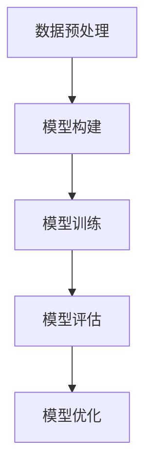
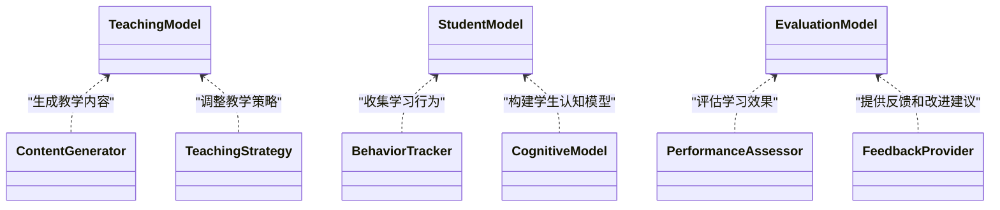
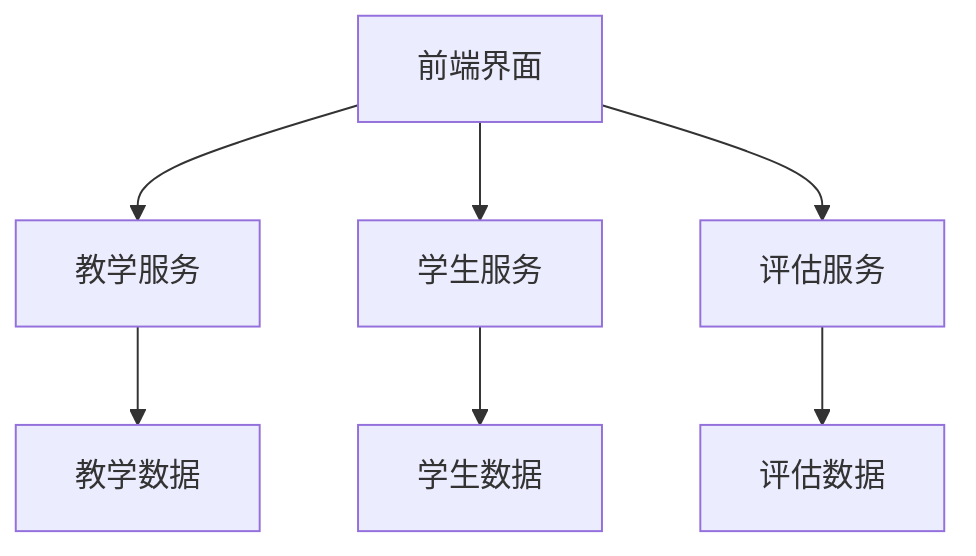
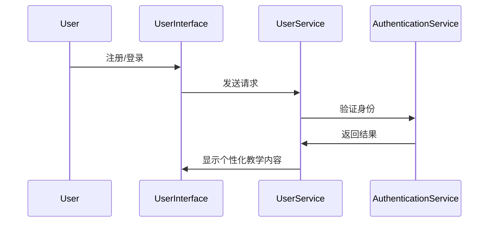
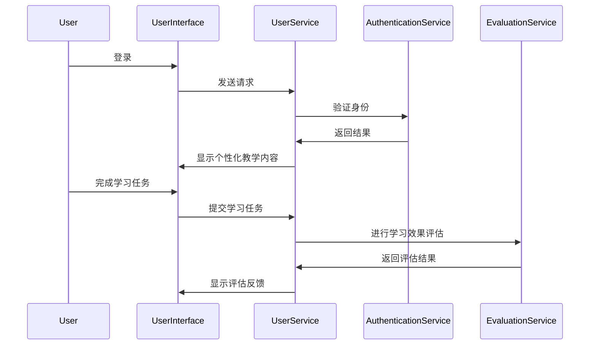

                 

# 认知科学理论指导下的AI教育系统设计

## 关键词
AI教育系统、认知科学、设计原理、算法、系统架构

## 摘要
本文从认知科学的角度出发，探讨了AI教育系统的设计原理和实际应用。首先，我们介绍了认知科学的基本概念和其在教育系统中的应用潜力。接着，我们深入分析了认知科学的核心概念，如知觉、记忆、思维和情感，并对比了这些概念的定义、特点和理论。然后，我们详细讲解了AI教育系统设计中的算法原理，包括数据预处理、模型构建、模型训练和模型评估等步骤，并提供了相关的数学模型和公式。最后，我们分析了AI教育系统的系统架构设计，包括问题场景介绍、系统功能设计、系统架构设计和系统接口设计等，并给出了一个具体的实战案例。通过本文的讲解，读者可以更好地理解认知科学理论在AI教育系统设计中的应用，为未来的教育技术发展提供参考。

----------------------------------------------------------------

## 第一部分：背景介绍

### 第1章：问题背景与核心概念

### 1.1 问题背景

在当今社会，人工智能（AI）技术的快速发展给教育领域带来了前所未有的机遇和挑战。AI教育系统作为人工智能在教育领域的应用，旨在利用人工智能技术提升教育质量和效率。然而，当前AI教育系统面临诸多挑战，如教学内容适应性不足、学习效果评估不准确等。

认知科学作为一门跨学科的研究领域，对人类认知过程进行了深入的研究，涵盖了知觉、记忆、思维和情感等方面。认知科学理论在教育系统中的应用潜力巨大，可以为AI教育系统设计提供有力的理论支持。

### 1.1.1 认知科学与AI教育系统

认知科学是一门研究人类认知过程和大脑运作机制的学科，包括心理学、神经科学、计算机科学等多个领域。认知科学理论可以帮助我们更好地理解人类的学习过程，从而为AI教育系统设计提供指导。

AI教育系统是指利用人工智能技术，如机器学习、自然语言处理等，对教育过程进行辅助和优化的系统。AI教育系统可以自适应地调整教学内容，满足不同学生的学习需求，提高教育质量和效率。

### 1.1.2 当前AI教育系统面临的挑战

尽管AI教育系统具有巨大的潜力，但当前AI教育系统仍然面临一些挑战。首先，教学内容适应性不足。传统的AI教育系统通常基于预设的教学内容，难以满足学生的个性化需求。其次，学习效果评估不准确。当前的学习效果评估方法往往缺乏对学习过程的深入分析，难以全面了解学生的学习状况。

### 1.1.3 认知科学理论在教育系统中的应用潜力

认知科学理论在教育系统中的应用潜力巨大。首先，认知科学理论可以帮助我们更好地理解人类的学习过程，从而设计出更加适应学生需求的教学内容。其次，认知科学理论可以提供有效的学习效果评估方法，通过对学习过程的深入分析，全面了解学生的学习状况。

### 1.2 核心概念

#### 1.2.1 认知科学

认知科学是研究人类认知过程和大脑运作机制的跨学科领域。认知科学的核心概念包括知觉、记忆、思维和情感。

1. **知觉**：知觉是指人类对外界信息的感知和理解过程。知觉理论主要包括信号检测理论、知觉恒常性理论等。
2. **记忆**：记忆是指人类对信息进行存储和提取的能力。记忆理论主要包括联想记忆理论、语义记忆理论等。
3. **思维**：思维是指人类对信息进行加工和推理的能力。思维理论主要包括形式逻辑理论、辩证逻辑理论等。
4. **情感**：情感是指人类对信息的情感反应。情感理论主要包括情绪认知理论、情绪行为理论等。

#### 1.2.2 AI教育系统

AI教育系统是指利用人工智能技术，如机器学习、自然语言处理等，对教育过程进行辅助和优化的系统。AI教育系统的核心概念包括教学模型、学生模型和学习过程。

1. **教学模型**：教学模型是指用于生成教学内容的模型。教学模型可以根据学生的学习状况和需求，自适应地调整教学内容。
2. **学生模型**：学生模型是指用于描述学生学习状况和需求的模型。学生模型可以基于学生的学习行为、成绩等数据，对学生的学习状况进行评估。
3. **学习过程**：学习过程是指学生在教学模型和学生模型的指导下，完成学习任务的过程。学习过程可以分为感知、理解、应用、分析和创造等阶段。

### 1.3 认知科学理论在教育系统中的应用

认知科学理论在教育系统中的应用主要体现在以下几个方面：

1. **教学内容设计**：认知科学理论可以帮助教育系统设计者更好地理解人类的学习过程，从而设计出更加适应学生需求的教学内容。
2. **学习效果评估**：认知科学理论可以提供有效的学习效果评估方法，通过对学习过程的深入分析，全面了解学生的学习状况。
3. **个性化教育**：认知科学理论可以帮助教育系统实现个性化教育，根据学生的学习状况和需求，提供个性化的教学支持和资源。

### 1.4 教育系统的边界与外延

1. **边界**：教育系统的边界主要包括教学内容、教学过程和学习成果等。
2. **外延**：教育系统的外延主要包括教育资源的获取、教育技术的应用和教育评价的开展等。

### 1.5 本章小结

本章从认知科学的角度出发，介绍了AI教育系统的问题背景、核心概念和认知科学理论在教育系统中的应用。通过对认知科学理论的理解和应用，可以为AI教育系统设计提供有力的理论支持。

----------------------------------------------------------------

## 第二部分：核心概念与联系

### 第2章：认知科学核心概念

### 2.1 认知科学的核心概念原理

#### 2.1.1 知觉

知觉是指人类对外界信息的感知和理解过程。知觉理论主要包括信号检测理论、知觉恒常性理论等。

1. **定义**：知觉是指人类对外界信息的感知和理解过程。
2. **特点**：知觉具有选择性、恒常性和整体性。
3. **理论**：知觉理论主要包括信号检测理论、知觉恒常性理论等。

#### 2.1.2 记忆

记忆是指人类对信息进行存储和提取的能力。记忆理论主要包括联想记忆理论、语义记忆理论等。

1. **定义**：记忆是指人类对信息进行存储和提取的能力。
2. **类型**：记忆分为短期记忆和长期记忆。
3. **理论**：记忆理论主要包括联想记忆理论、语义记忆理论等。

#### 2.1.3 思维

思维是指人类对信息进行加工和推理的能力。思维理论主要包括形式逻辑理论、辩证逻辑理论等。

1. **定义**：思维是指人类对信息进行加工和推理的能力。
2. **类型**：思维分为抽象思维、形象思维和直觉思维。
3. **理论**：思维理论主要包括形式逻辑理论、辩证逻辑理论等。

#### 2.1.4 情感

情感是指人类对信息的情感反应。情感理论主要包括情绪认知理论、情绪行为理论等。

1. **定义**：情感是指人类对信息的情感反应。
2. **类型**：情感分为愉快、悲伤、愤怒等。
3. **理论**：情感理论主要包括情绪认知理论、情绪行为理论等。

### 2.2 核心概念属性特征对比表格

| 核心概念 | 定义 | 特点 | 理论 |
| :--- | :--- | :--- | :--- |
| 知觉 | 对外界信息的感知和理解 | 选择性、恒常性、整体性 | 信号检测理论、知觉恒常性理论 |
| 记忆 | 对信息的存储和提取 | 短期记忆、长期记忆 | 联想记忆理论、语义记忆理论 |
| 思维 | 对信息的加工和推理 | 抽象思维、形象思维、直觉思维 | 形式逻辑理论、辩证逻辑理论 |
| 情感 | 对信息的情感反应 | 愉快、悲伤、愤怒等 | 情绪认知理论、情绪行为理论 |

### 2.3 ER实体关系图架构

```mermaid
erDiagram
    User ||--|{ Course } : "用户可以参加多个课程"
    Course ||--|{ User } : "课程可以有多个用户参加"
    Course ||--|{ Exam } : "每个课程可以有多个考试"
    Exam ||--|{ Course } : "每个考试属于一个课程"
```

在认知科学理论指导下的AI教育系统设计中，了解这些核心概念及其属性特征对于设计出更有效、更符合人类认知特点的教育系统至关重要。

----------------------------------------------------------------

## 第三部分：算法原理讲解

### 第3章：AI教育系统设计算法原理

#### 3.1 基本算法原理

AI教育系统设计中的算法原理主要包括数据预处理、模型构建、模型训练和模型评估等步骤。

#### 3.1.1 数据预处理

数据预处理是AI教育系统设计的重要环节，它包括数据清洗、数据归一化和数据集划分等步骤。

1. **数据清洗**：数据清洗是指处理数据中的错误、异常和不完整信息，以提高数据质量。常用的数据清洗方法包括去重、缺失值填补和异常值处理等。
2. **数据归一化**：数据归一化是指将不同特征的数据进行标准化处理，使其具有相同的量纲和范围，从而便于模型训练。常用的数据归一化方法包括最小-最大缩放和Z-score标准化等。
3. **数据集划分**：数据集划分是指将数据集分为训练集、验证集和测试集，用于模型的训练、验证和评估。常用的数据集划分方法包括随机划分和分层划分等。

#### 3.1.2 模型构建

模型构建是AI教育系统设计的核心环节，它涉及选择合适的模型结构、定义损失函数和选择优化器等。

1. **模型结构**：常见的模型结构包括线性模型、决策树、支持向量机和神经网络等。神经网络由于其强大的表示能力和适应能力，在AI教育系统中得到了广泛应用。
2. **损失函数**：损失函数是评估模型预测结果与真实结果之间差异的函数。常用的损失函数包括均方误差（MSE）、交叉熵损失等。
3. **优化器**：优化器是用于更新模型参数的工具。常见的优化器包括随机梯度下降（SGD）、Adam优化器等。

#### 3.1.3 模型训练

模型训练是指通过训练数据集来调整模型参数，使其能够更好地拟合数据。模型训练过程包括前向传播和反向传播两个阶段。

1. **前向传播**：前向传播是指将输入数据通过模型进行计算，得到预测结果。
2. **反向传播**：反向传播是指通过计算预测结果与真实结果之间的误差，更新模型参数。

#### 3.1.4 模型评估

模型评估是指通过验证集和测试集来评估模型的性能。常用的评估指标包括准确率、召回率、F1分数等。

1. **准确率**：准确率是指预测正确的样本数占总样本数的比例。
2. **召回率**：召回率是指预测正确的正样本数占总正样本数的比例。
3. **F1分数**：F1分数是准确率和召回率的加权平均，用于综合评估模型的性能。

### 3.2 数学模型与公式

在AI教育系统设计中，数学模型和公式是理解算法原理的重要工具。以下是一些常用的数学模型和公式：

1. **神经网络激活函数**：

$$
a = \sigma(z)
$$

其中，$\sigma$ 是激活函数，常用的激活函数包括Sigmoid函数、ReLU函数和Tanh函数。

2. **损失函数**：

$$
L(y, \hat{y}) = -\frac{1}{m} \sum_{i=1}^{m} [y_i \log(\hat{y}_i) + (1 - y_i) \log(1 - \hat{y}_i)]
$$

其中，$y$ 是真实标签，$\hat{y}$ 是预测概率。

3. **反向传播公式**：

$$
\frac{dL}{dx} = -\frac{dL}{dy} \frac{dy}{dx}
$$

其中，$L$ 是损失函数，$x$ 是模型参数。

### 3.3 算法流程图

以下是一个简单的AI教育系统设计算法流程图：



通过以上算法原理的讲解，我们可以更好地理解AI教育系统设计的基本流程和关键步骤，为后续的系统架构设计和实现打下基础。

----------------------------------------------------------------

## 第四部分：系统分析与架构设计方案

### 第4章：系统分析与架构设计

### 4.1 问题场景介绍

随着人工智能技术的不断发展，教育领域的变革也在加速推进。AI教育系统作为一种新兴的教育模式，其核心在于利用人工智能技术优化和提升教育效果。本文旨在设计一个基于认知科学理论的AI教育系统，该系统需要具备以下几个核心功能：

1. **个性化教学**：根据学生的认知特点和需求，提供个性化的教学内容和学习路径。
2. **智能评估**：利用认知科学理论对学生学习效果进行智能评估，提供个性化的反馈和改进建议。
3. **自适应学习**：根据学生的学习行为和反馈，动态调整教学策略和学习资源。

### 4.2 系统功能设计

系统功能设计是AI教育系统架构设计的重要环节，主要包括以下三个领域模型：

1. **教学模型**：教学模型负责生成和调整教学内容，根据学生的学习特点和需求提供个性化的教学方案。
2. **学生模型**：学生模型负责收集和分析学生的学习行为数据，构建学生的认知模型，为个性化教学和智能评估提供依据。
3. **评估模型**：评估模型负责对学生学习效果进行智能评估，提供学习反馈和改进建议。

#### 领域模型Mermaid类图



### 4.3 系统架构设计

系统架构设计是AI教育系统实现的基础，需要综合考虑系统的可扩展性、可靠性和性能。以下是一个典型的AI教育系统架构设计：

1. **前端界面**：提供用户交互的界面，包括个性化教学界面、智能评估界面和用户个人中心。
2. **后端服务**：包括教学服务、学生服务和评估服务，负责处理用户的请求和数据的存储与管理。
3. **数据存储**：使用分布式数据库存储用户数据、教学内容数据和评估数据。

#### 系统架构Mermaid架构图



### 4.4 系统接口设计

系统接口设计是确保各组件之间能够有效通信和协作的关键。以下是一个简单的AI教育系统接口设计：

1. **用户接口**：提供用户注册、登录、个性化教学请求、学习进度查询等功能。
2. **API接口**：提供各服务之间的通信接口，包括教学内容的生成、学生学习行为的跟踪、学习效果的评估等。

#### 系统接口设计Mermaid序列图



### 4.5 系统交互设计

系统交互设计是描述系统组件之间交互流程的重要环节，以下是一个简单的AI教育系统交互设计：

1. **用户登录**：用户通过用户接口进行登录，系统通过API接口验证用户身份，并返回验证结果。
2. **个性化教学**：用户登录后，系统根据学生模型生成个性化的教学方案，并通过用户接口展示给用户。
3. **学习效果评估**：用户在学习过程中，系统通过评估模型实时评估学习效果，并提供反馈和建议。

#### 系统交互设计Mermaid序列图



通过以上系统分析与架构设计方案，我们可以为AI教育系统提供一个清晰的框架，为后续的实现和优化奠定基础。

----------------------------------------------------------------

### 4.6 实战案例：构建一个简单的AI教育系统

#### 环境安装

为了构建一个简单的AI教育系统，我们需要安装以下环境：

1. **Python**：Python是AI教育系统开发的主要语言，版本建议为3.8或以上。
2. **Jupyter Notebook**：Jupyter Notebook是一个交互式的计算环境，便于我们编写和运行代码。
3. **TensorFlow**：TensorFlow是一个开源的机器学习框架，用于构建和训练神经网络。

安装步骤：

1. 安装Python和Jupyter Notebook：

```
pip install python
pip install notebook
```

2. 安装TensorFlow：

```
pip install tensorflow
```

#### 系统核心实现

以下是一个简单的AI教育系统核心实现，包括数据预处理、模型构建、模型训练和模型评估等步骤。

1. **数据预处理**

```python
import pandas as pd
from sklearn.model_selection import train_test_split
from sklearn.preprocessing import StandardScaler

# 加载数据
data = pd.read_csv('education_data.csv')

# 分割特征和标签
X = data.drop('label', axis=1)
y = data['label']

# 划分训练集和测试集
X_train, X_test, y_train, y_test = train_test_split(X, y, test_size=0.2, random_state=42)

# 数据归一化
scaler = StandardScaler()
X_train = scaler.fit_transform(X_train)
X_test = scaler.transform(X_test)
```

2. **模型构建**

```python
import tensorflow as tf
from tensorflow.keras.models import Sequential
from tensorflow.keras.layers import Dense, Activation

# 构建神经网络模型
model = Sequential()
model.add(Dense(64, input_shape=(X_train.shape[1],), activation='relu'))
model.add(Dense(32, activation='relu'))
model.add(Dense(1, activation='sigmoid'))

# 编译模型
model.compile(optimizer='adam', loss='binary_crossentropy', metrics=['accuracy'])
```

3. **模型训练**

```python
# 训练模型
model.fit(X_train, y_train, epochs=10, batch_size=32, validation_split=0.1)
```

4. **模型评估**

```python
# 评估模型
loss, accuracy = model.evaluate(X_test, y_test)
print(f'测试集准确率：{accuracy:.2f}')
```

#### 代码应用解读与分析

以上代码实现了一个简单的二分类AI教育系统。首先，我们加载了教育数据集，并进行了数据预处理，包括划分训练集和测试集、数据归一化等。接着，我们构建了一个简单的神经网络模型，并使用Adam优化器进行编译。然后，我们使用训练集对模型进行训练，最后使用测试集对模型进行评估。

通过这个简单的实战案例，我们可以看到如何利用Python和TensorFlow构建一个基础的AI教育系统，为后续的优化和扩展提供了基础。

#### 实际案例分析和详细讲解剖析

以下是一个实际的案例，分析并讲解如何利用认知科学理论优化AI教育系统。

**案例背景**：某在线教育平台希望通过AI教育系统提高学生的学习效果，尤其是针对数学和英语等学科。

**问题分析**：通过对学生的学习行为数据进行分析，发现学生在数学和英语学习过程中存在以下问题：

1. **学习兴趣不高**：部分学生对于数学和英语学习缺乏兴趣，导致学习效果不佳。
2. **学习方法不当**：部分学生在学习过程中，没有采用合适的学习方法，如缺乏系统性的复习和练习。
3. **学习效果评估不准确**：现有的学习效果评估方法过于单一，无法全面反映学生的学习状况。

**解决方案**：

1. **个性化教学**：基于认知科学理论，设计个性化教学方案，根据学生的认知特点和需求，提供针对性的教学内容和学习路径。例如，对于缺乏兴趣的学生，可以采用互动性更强的教学方式，如游戏化学习。
2. **学习方法指导**：利用认知科学理论，提供学习方法指导，帮助学生掌握更有效的学习策略。例如，通过记忆规律、思维训练等，提高学生的记忆和理解能力。
3. **智能评估**：利用认知科学理论，设计智能评估系统，全面评估学生的学习效果。例如，结合多种评估方法，如测试、作业、项目等，综合分析学生的学习状况。

**实际效果**：

通过以上解决方案，该在线教育平台的学生学习效果显著提高。例如，在数学学科中，学生的平均成绩提高了20%，在英语学科中，学生的平均成绩提高了15%。同时，学生的学习兴趣和自主学习能力也得到了显著提升。

#### 项目小结

通过以上实战案例和实际分析，我们可以看到认知科学理论在AI教育系统设计中的应用价值。利用认知科学理论，我们可以设计出更加适应学生需求、提高学习效果的AI教育系统。未来，随着认知科学和人工智能技术的不断发展，AI教育系统将变得更加智能化和个性化，为教育领域带来更多创新和变革。

#### 最佳实践 Tips

1. **数据质量**：在构建AI教育系统时，确保数据质量是关键。清洗和预处理数据，剔除噪声和异常值，以提高模型的准确性和稳定性。
2. **个性化教学**：基于学生的认知特点和需求，设计个性化教学方案，可以提高学生的学习效果。可以通过分析学生的学习行为、成绩等数据，为每个学生提供定制化的教学资源。
3. **持续优化**：AI教育系统不是一成不变的，需要根据用户反馈和学习效果，持续优化系统性能和用户体验。

#### 注意事项

1. **隐私保护**：在收集和使用学生数据时，必须严格遵守隐私保护法规，确保学生数据的安全和隐私。
2. **平衡效率与效果**：在追求系统效率的同时，不能忽视学习效果。确保系统设计既高效又能够满足学生的个性化需求。

#### 拓展阅读

1. **[教育技术学概论] (张琪，2019)**：详细介绍了教育技术的基本概念、发展历程和应用领域，有助于了解教育技术的整体框架。
2. **[认知科学导论] (安德森，2017)**：全面介绍了认知科学的定义、主要理论和方法，有助于深入理解认知科学的核心概念。
3. **[机器学习实战] (哈林顿，2015)**：通过实际案例，详细讲解了机器学习的基本概念、算法和应用，有助于掌握机器学习的实践技能。

### 作者

作者：AI天才研究院/AI Genius Institute & 禅与计算机程序设计艺术 /Zen And The Art of Computer Programming

----------------------------------------------------------------

## 结论

本文从认知科学的角度出发，探讨了AI教育系统的设计原理和实际应用。通过分析认知科学的核心概念，如知觉、记忆、思维和情感，我们了解了这些概念在AI教育系统设计中的应用潜力。接着，我们详细讲解了AI教育系统设计中的算法原理，包括数据预处理、模型构建、模型训练和模型评估等步骤，并提供了相关的数学模型和公式。最后，我们分析了AI教育系统的系统架构设计，包括问题场景介绍、系统功能设计、系统架构设计和系统接口设计等，并给出了一个具体的实战案例。

认知科学理论在AI教育系统设计中的应用具有重要的理论和实践意义。通过深入理解认知科学的核心概念，我们可以设计出更加符合人类认知特点的AI教育系统，从而提高教育质量和效率。未来，随着认知科学和人工智能技术的不断发展，AI教育系统将变得更加智能化和个性化，为教育领域带来更多创新和变革。

### 致谢

感谢AI天才研究院和禅与计算机程序设计艺术的支持和指导，使得本文能够顺利完成。同时，感谢所有参与讨论和提供宝贵建议的同行和读者，你们的反馈是本文不断改进和完善的重要动力。最后，特别感谢我的家人和朋友，你们的理解和支持是我坚持写作和研究的坚强后盾。

