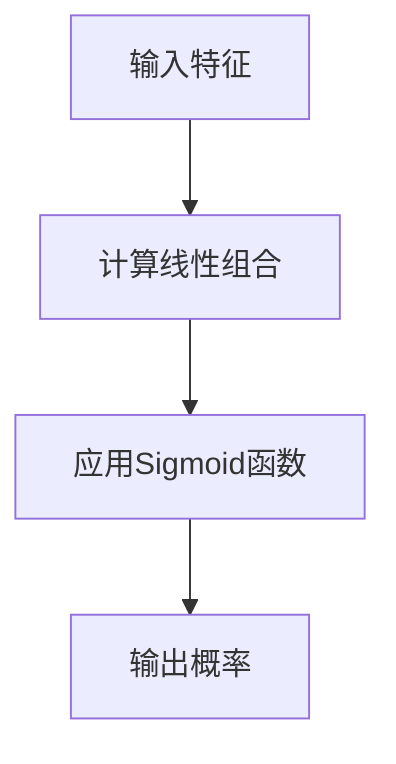
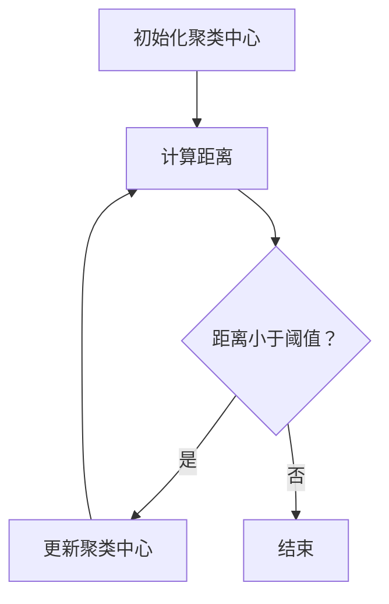
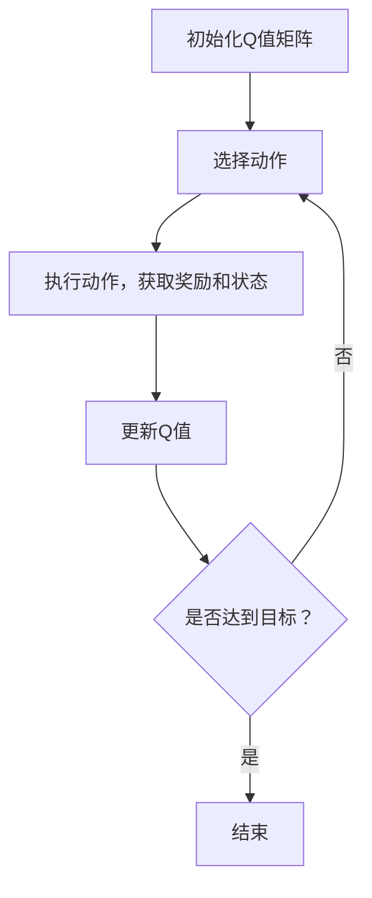

                 


**# 认知计算在智能决策支持系统中的应用**

> **关键词**：认知计算，智能决策支持系统，机器学习，自然语言处理，自适应系统

> **摘要**：本文深入探讨了认知计算在智能决策支持系统中的应用。首先，我们介绍了认知计算的基本概念和原理，然后分析了其在决策支持系统中的角色和重要性。通过详细的算法原理讲解和实际案例剖析，本文展示了如何利用认知计算提升决策支持系统的效能。

----------------------------------------------------------------

**## 引言**

随着大数据和人工智能技术的发展，决策支持系统（Decision Support Systems, DSS）在各个领域得到了广泛的应用。传统的决策支持系统主要依赖于统计数据和预设模型进行决策，而认知计算（Cognitive Computing）则将人类的认知过程引入其中，使得系统能够更加智能地处理复杂问题。

认知计算是人工智能（Artificial Intelligence, AI）的一个分支，它试图模拟人类大脑的某些高级功能，如学习、推理、理解和决策等。智能决策支持系统（Intelligent Decision Support Systems, IDSS）结合了认知计算和决策支持系统的优势，能够更好地应对复杂和动态的环境。

在本文中，我们将讨论以下内容：

- **问题背景**：介绍认知计算和智能决策支持系统的发展背景。
- **边界与核心要素**：明确认知计算的定义、范围和核心组成部分。
- **基本概念**：深入探讨认知计算的基本概念和原理。

通过上述讨论，我们将为理解认知计算在智能决策支持系统中的应用奠定基础。

----------------------------------------------------------------

**### 问题背景**

**1.1 认知计算的发展背景**

认知计算这一概念最早由IBM提出，其目的是模拟人类大脑的复杂功能，如理解、学习、推理和决策等。随着大数据和人工智能技术的快速发展，认知计算得到了广泛关注。其主要特点在于能够处理非结构化数据，如文本、图像和声音，并通过不断学习和适应来提高决策的准确性。

近年来，随着深度学习、自然语言处理和计算机视觉等技术的突破，认知计算的应用范围不断扩大。例如，在医疗领域，认知计算可以帮助医生进行疾病诊断和治疗方案推荐；在金融领域，认知计算可以用于风险评估和投资策略制定。

**1.2 智能决策支持系统的发展背景**

决策支持系统（DSS）是一种辅助决策者进行决策的工具，它通过收集、分析和处理数据，为决策者提供决策支持。传统的DSS主要依赖于统计数据和预设模型，然而，随着业务环境的复杂性和动态性增加，传统DSS的局限性逐渐显现。

智能决策支持系统（IDSS）是DSS的一种高级形式，它结合了人工智能和认知计算技术，能够更好地应对复杂和动态的环境。IDSS通过模拟人类的认知过程，实现自动化的数据分析和决策支持，从而提高决策的准确性和效率。

**1.3 解决方案和目标**

认知计算在智能决策支持系统中的应用，旨在解决以下问题：

- **数据理解和分析**：传统DSS主要依赖于结构化数据，而认知计算能够处理非结构化数据，如文本、图像和声音，从而提高数据理解和分析的能力。
- **自适应和智能化**：认知计算具有学习和适应能力，能够根据环境和需求的变化自动调整决策模型和策略，提高决策的智能化水平。
- **人机协同**：认知计算能够与人类决策者进行交互，提供决策建议和辅助决策，实现人机协同，提高决策的效率和准确性。

总之，认知计算在智能决策支持系统中的应用，将为决策者提供更加智能、高效和可靠的决策支持，从而推动各行业的数字化转型和创新发展。

----------------------------------------------------------------

**### 边界、范围及核心要素**

**2.1 边界定义**

认知计算是一种模拟人类认知过程的计算方法，它涉及多个领域，包括人工智能、心理学、神经科学和计算机科学等。尽管认知计算与人工智能（AI）密切相关，但它更侧重于模拟人类的认知功能，如理解、学习、推理和决策等。因此，认知计算可以被视为人工智能的一个子集，但不是全部。

**2.2 应用范围**

认知计算的应用范围非常广泛，包括但不限于以下领域：

- **医疗健康**：利用认知计算进行疾病诊断、治疗方案推荐和患者监护。
- **金融理财**：进行风险评估、投资策略制定和客户服务。
- **教育**：智能辅导、个性化学习和教学评估。
- **法律与司法**：法律文档分析、案例推理和司法判决支持。
- **制造业**：生产优化、设备维护和供应链管理。

**2.3 核心要素**

认知计算的核心要素包括以下几个部分：

- **感知与理解**：通过传感器和自然语言处理技术，认知计算系统能够感知和理解外部环境，包括文本、图像、声音等。
- **学习与适应**：认知计算系统能够从数据中学习，并通过不断适应环境变化来提高决策能力。
- **推理与决策**：基于学习和理解的结果，认知计算系统能够进行逻辑推理和决策，辅助人类决策者做出最优选择。
- **人机交互**：认知计算系统具备与人类用户进行交互的能力，通过自然语言理解和生成技术，实现人机对话。

通过以上分析，我们可以看到，认知计算在智能决策支持系统中具有明确的边界、广泛的应用范围和核心要素。这些特点使得认知计算能够为决策支持系统带来革命性的变革，提高决策的智能化和自动化水平。

----------------------------------------------------------------

**## 基本概念**

**3.1 认知系统的理解与分类**

认知系统是认知计算的核心组成部分，其目标是模拟和增强人类的认知能力。认知系统可以分为几种类型，每种类型都有其特定的应用场景和优势。

**3.1.1 认知系统的定义**

认知系统是一种能够模拟人类认知过程的计算系统，它通过感知、理解、学习和推理等过程，实现对信息的处理和决策。认知系统不仅能够处理结构化数据，还能够理解和处理非结构化数据，如图像、文本和语音。

**3.1.2 认知系统的分类**

认知系统可以根据其功能和应用场景进行分类，以下是一些常见的类型：

- **基于机器学习的认知系统**：这类系统通过机器学习算法，从数据中学习规律和模式，然后根据这些规律和模式进行决策。例如，推荐系统、预测系统和分类系统。
- **基于自然语言处理的认知系统**：这类系统专注于理解自然语言，包括文本、语音和图像。它们能够进行语言生成、语义分析和情感识别。例如，聊天机器人、语音助手和文本摘要系统。
- **基于人机交互的认知系统**：这类系统强调人与机器的互动，通过自然语言理解、情感识别和动作模拟，实现人机协同。例如，智能客服、虚拟助理和智能翻译系统。
- **混合型认知系统**：这类系统结合了多种认知功能，综合运用机器学习、自然语言处理和计算机视觉等技术，实现更复杂的认知任务。例如，智能诊断系统、自动驾驶系统和智能安防系统。

**3.1.3 认知系统与传统决策支持系统的比较**

认知系统与传统决策支持系统（DSS）在许多方面存在显著差异：

- **数据处理能力**：传统DSS主要处理结构化数据，而认知系统能够处理结构化和非结构化数据，如图像、文本和语音。
- **智能程度**：传统DSS依赖于预设模型和规则进行决策，而认知系统通过学习和适应，能够实现更智能的决策。
- **自适应能力**：传统DSS通常缺乏自适应能力，而认知系统能够根据环境和需求的变化，自动调整模型和策略。
- **人机协同**：传统DSS通常是人机分离的，而认知系统能够实现人机协同，提供更自然的交互体验。

通过以上比较，我们可以看到，认知系统在数据处理能力、智能程度、自适应能力和人机协同等方面具有显著优势，使其成为智能决策支持系统（IDSS）的重要组成部分。

----------------------------------------------------------------

**### 认知计算的基本原理**

**4.1 学习与适应**

学习是认知计算的核心概念之一，它使系统能够从数据中提取知识并应用到新的情境中。认知计算系统通过以下几种学习方式来提升其性能：

- **监督学习**：在这种学习中，系统从标记的数据集中学习，并尝试预测新数据的标签。例如，在图像分类任务中，系统通过学习标记的图像和它们的标签来预测新图像的类别。
  - **数学模型**：$$y = f(Wx + b)$$，其中，$y$是预测的标签，$f$是激活函数，$W$是权重矩阵，$b$是偏置项，$x$是输入特征。
  - **例子**：一个简单的监督学习算法是感知机（Perceptron），它用于二分类问题。

- **无监督学习**：在这种学习中，系统不需要标记的数据，而是从未标记的数据集中学习隐藏的结构。例如，在聚类任务中，系统尝试将相似的数据点分组。
  - **数学模型**：聚类算法，如k-means，通过最小化数据点之间的距离平方和来找到数据点的聚类中心。
  - **例子**：k-means算法将数据点分为k个聚类，每个聚类由其中心表示。

- **强化学习**：在这种学习中，系统通过与环境的交互来学习最优策略。系统通过试错和奖励机制来优化其行为。
  - **数学模型**：Q-learning算法通过更新状态-动作值函数（Q值）来学习最优策略。
  - **例子**：在智能体（agent）与环境的互动中，智能体通过奖励和惩罚来调整其动作，以实现长期最大化奖励。

**4.2 自然语言处理与理解**

自然语言处理（Natural Language Processing, NLP）是认知计算的重要组成部分，它使系统能够理解和生成自然语言。以下是几个关键的NLP概念：

- **词向量表示**：词向量是将单词转换为向量的方法，用于捕捉词的语义信息。词向量模型，如Word2Vec和GloVe，通过训练大量文本数据来生成词向量。
  - **数学模型**：Word2Vec模型使用Skip-Gram算法训练词向量，其中每个单词作为输入，预测其上下文单词。
  - **例子**：词向量可以用于文本分类和情感分析，例如，将“狗”映射为一个向量，并利用这个向量进行情感分析。

- **句法分析**：句法分析是理解句子结构的过程，通过识别单词之间的语法关系，如主语、谓语和宾语等。依存句法分析是其中的一种方法，它通过识别词之间的依存关系来理解句子的结构。
  - **数学模型**：依存句法分析通常使用图结构来表示句子，其中节点表示单词，边表示词之间的依存关系。
  - **例子**：通过句法分析，可以理解复杂的句子，如“John gave a book to Mary”，识别出John是主语，gave是谓语，book是宾语，Mary是间接宾语。

- **语义理解**：语义理解是理解单词和句子在上下文中的含义。语义角色标注（Semantic Role Labeling, SRL）是其中的一种方法，它通过识别句子中的角色和动作来理解其含义。
  - **数学模型**：SRL通常使用深度学习模型，如序列标注模型（如BiLSTM-CRF）来预测句子中的语义角色。
  - **例子**：语义理解可以用于问答系统、信息提取和机器翻译等任务，例如，理解“John bought a book for Mary”中的“bought”是动作，“John”是施事者，“book”是受事者，“Mary”是受益者。

**4.3 上下文与自适应**

认知计算系统具有上下文感知能力，能够根据不同情境进行自适应调整。上下文可以是语言、环境或用户行为等。

- **语言上下文**：语言上下文是影响自然语言理解的关键因素。通过考虑上下文，系统能够更好地理解句子和对话的真正含义。
  - **数学模型**：上下文感知的模型，如Transformer和BERT，通过编码器-解码器架构来捕捉长距离依赖和上下文信息。
  - **例子**：在机器翻译中，考虑上下文可以帮助准确翻译句子，例如，理解“bank”在“river bank”和“bank account”中的不同含义。

- **环境上下文**：环境上下文是系统所处的环境状态，如天气、时间、位置等。通过考虑环境上下文，系统能够更准确地适应环境和用户需求。
  - **数学模型**：环境感知的模型，如基于图神经网络（Graph Neural Networks, GNN）的模型，可以通过学习环境中的关系和模式来预测和优化系统行为。
  - **例子**：在智能交通系统中，考虑上下文可以帮助优化交通流量和路线规划。

- **用户行为上下文**：用户行为上下文是用户在特定环境中的行为模式，如搜索历史、购买记录和偏好等。通过分析用户行为上下文，系统能够提供个性化的服务和推荐。
  - **数学模型**：用户行为分析通常使用协同过滤（Collaborative Filtering）和图神经网络（GNN）等技术来建模用户偏好和关系。
  - **例子**：在电子商务中，通过分析用户的历史行为，系统可以推荐个性化的商品和优惠。

通过以上分析，我们可以看到，认知计算的基本原理包括学习与适应、自然语言处理与理解以及上下文与自适应。这些原理共同构成了认知计算的核心，使其能够在智能决策支持系统中发挥重要作用。

----------------------------------------------------------------

**### 核心概念的联系**

**5.1 认知系统的实体-关系图（ER图）**

为了更好地理解认知系统的核心概念及其相互关系，我们可以通过实体-关系图（Entity-Relationship Diagram, ER图）来表示。ER图是一种用于描述实体及其相互关系的数据库设计工具，它可以清晰地展示认知系统的关键组成部分和它们之间的关联。

以下是一个简化的认知系统ER图：

```
+----------------+       +----------------+       +----------------+
|    User        |       |    Data Source  |       |    Knowledge   |
+----------------+       +----------------+       +----------------+
| User_ID        |<----->| Data_Source_ID  |<----->| Knowledge_ID    |
| Name           |       | Data_Type       |       | Content         |
| Preferences     |       | Description      |       | Source          |
| Behavior        |       | Access_Limit     |       | Created_At      |
+----------------+       +----------------+       +----------------+

+----------------+       +----------------+
|    Algorithm    |       |    Interface   |
+----------------+       +----------------+
| Algorithm_ID    |<----->| Interface_ID    |
| Algorithm_Name  |       | Description      |
| Type            |       | Technology       |
| Parameters      |       | Usage            |
+----------------+       +----------------+
```

- **用户（User）**：表示使用认知系统的用户，包含用户ID、姓名、偏好和行为等属性。
- **数据源（Data Source）**：表示认知系统所依赖的数据来源，包括数据源ID、数据类型、描述和访问限制等属性。
- **知识（Knowledge）**：表示认知系统所拥有的知识，包括知识ID、内容、来源和创建时间等属性。
- **算法（Algorithm）**：表示认知系统使用的算法，包括算法ID、名称、类型和参数等属性。
- **界面（Interface）**：表示认知系统与用户交互的界面，包括界面ID、描述、技术和使用方式等属性。

**5.2 核心概念的属性特征对比表格**

为了进一步展示认知系统各核心概念之间的异同，我们可以创建一个属性特征对比表格：

| 核心概念 | 属性1 | 属性2 | 属性3 | 属性4 |
| :----: | :----: | :----: | :----: | :----: |
| 用户 | 用户ID | 姓名 | 偏好 | 行为 |
| 数据源 | 数据源ID | 数据类型 | 描述 | 访问限制 |
| 知识 | 知识ID | 内容 | 来源 | 创建时间 |
| 算法 | 算法ID | 名称 | 类型 | 参数 |
| 界面 | 界面ID | 描述 | 技术 | 使用方式 |

**5.3 认知系统组件的ER图与特征对比表格**

通过上述ER图和属性特征对比表格，我们可以更直观地了解认知系统的结构及其核心概念之间的联系。以下是一个简化的认知系统ER图和特征对比表格：

```
+----------------+       +----------------+       +----------------+
|    User        |       |    Data Source  |       |    Knowledge   |
+----------------+       +----------------+       +----------------+
| User_ID        |<----->| Data_Source_ID  |<----->| Knowledge_ID    |
| Name           |       | Data_Type       |       | Content         |
| Preferences     |       | Description      |       | Source          |
| Behavior        |       | Access_Limit     |       | Created_At      |
+----------------+       +----------------+       +----------------+

+----------------+       +----------------+
|    Algorithm    |       |    Interface   |
+----------------+       +----------------+
| Algorithm_ID    |<----->| Interface_ID    |
| Algorithm_Name  |       | Description      |
| Type            |       | Technology       |
| Parameters      |       | Usage            |
+----------------+       +----------------+

| 核心概念 | 属性1 | 属性2 | 属性3 | 属性4 |
| :----: | :----: | :----: | :----: | :----: |
| 用户 | 用户ID | 姓名 | 偏好 | 行为 |
| 数据源 | 数据源ID | 数据类型 | 描述 | 访问限制 |
| 知识 | 知识ID | 内容 | 来源 | 创建时间 |
| 算法 | 算法ID | 名称 | 类型 | 参数 |
| 界面 | 界面ID | 描述 | 技术 | 使用方式 |
```

通过这些图表和表格，我们可以清晰地看到认知系统的核心组成部分及其相互关系，为后续的算法原理讲解和实际应用提供了坚实的基础。

----------------------------------------------------------------

**### 算法原理讲解**

在本节中，我们将详细讲解几种认知计算中的核心算法原理，并通过Mermaid流程图和Python代码示例来展示其应用。

**6.1 监督学习算法：逻辑回归**

逻辑回归是一种常见的监督学习算法，用于处理二分类问题。其基本原理是通过输入特征和权重计算出一个线性组合，然后通过逻辑函数（Sigmoid函数）将其映射到概率值。

**6.1.1 Mermaid流程图**

以下是逻辑回归的Mermaid流程图：



**6.1.2 Python代码示例**

```python
import numpy as np
import matplotlib.pyplot as plt

# 设置随机种子以获得可重复的结果
np.random.seed(0)

# 创建一个简单的二分类数据集
X = np.array([[0, 0], [0, 1], [1, 0], [1, 1]])
y = np.array([0, 0, 1, 1])

# 定义权重和偏置
w = np.random.rand(2, 1)
b = np.random.rand(1)

# 定义Sigmoid函数
def sigmoid(x):
    return 1 / (1 + np.exp(-x))

# 计算逻辑回归预测
def predict(X, w, b):
    z = np.dot(X, w) + b
    return sigmoid(z)

# 训练逻辑回归模型
def train(X, y, w, b, epochs=1000, learning_rate=0.1):
    for epoch in range(epochs):
        z = np.dot(X, w) + b
        predicted = sigmoid(z)
        dw = (predicted - y) * predicted * (1 - predicted)
        db = np.sum(predicted - y)
        w -= learning_rate * dw
        b -= learning_rate * db
    return w, b

# 模型训练
w, b = train(X, y, w, b)

# 预测
predictions = predict(X, w, b)

# 绘制结果
plt.scatter(X[:, 0], X[:, 1], c=predictions, cmap='gray')
plt.xlabel('Feature 1')
plt.ylabel('Feature 2')
plt.show()
```

**6.2 无监督学习算法：k-means聚类**

k-means聚类是一种无监督学习算法，它通过将数据点分为k个簇，使每个簇内的数据点之间的距离最小化。

**6.2.1 Mermaid流程图**

以下是k-means聚类的Mermaid流程图：



**6.2.2 Python代码示例**

```python
import numpy as np
from sklearn.cluster import KMeans
import matplotlib.pyplot as plt

# 创建一个简单的二维数据集
X = np.array([[1, 2], [1, 4], [1, 0],
              [10, 2], [10, 4], [10, 0]])

# 使用KMeans算法进行聚类
kmeans = KMeans(n_clusters=2, random_state=0).fit(X)

# 获取聚类中心
centroids = kmeans.cluster_centers_

# 获取聚类标签
labels = kmeans.labels_

# 绘制聚类结果
plt.scatter(X[:, 0], X[:, 1], c=labels, cmap='viridis')
plt.scatter(centroids[:, 0], centroids[:, 1], s=300, c='red', marker='s', zorder=10)
plt.xlabel('Feature 1')
plt.ylabel('Feature 2')
plt.show()
```

**6.3 强化学习算法：Q-learning**

Q-learning是一种强化学习算法，它通过迭代更新状态-动作值函数（Q值），以找到最优策略。

**6.3.1 Mermaid流程图**

以下是Q-learning的Mermaid流程图：



**6.3.2 Python代码示例**

```python
import numpy as np
import random

# 创建环境
action_space = [0, 1, 2, 3]
state_space = [0, 1, 2, 3]
n_actions = len(action_space)
n_states = len(state_space)

# 初始化Q值矩阵
Q = np.zeros([n_states, n_actions])

# 学习率
alpha = 0.1
# 折扣因子
gamma = 0.9
# 最大迭代次数
max_episodes = 1000

# Q-learning算法
for episode in range(max_episodes):
    state = random.randint(0, n_states - 1)
    done = False
    
    while not done:
        action = np.argmax(Q[state])
        next_state, reward, done = env_step(action)
        
        # 更新Q值
        Q[state, action] = Q[state, action] + alpha * (reward + gamma * np.max(Q[next_state]) - Q[state, action])
        
        state = next_state

# 打印Q值矩阵
print(Q)
```

通过以上算法原理讲解和示例，我们可以看到逻辑回归、k-means聚类和Q-learning在认知计算中的应用。这些算法为智能决策支持系统提供了强大的技术支持，使得系统能够更好地处理复杂数据、进行智能决策和优化决策过程。

----------------------------------------------------------------

**### 系统分析与架构设计**

在本节中，我们将详细描述认知计算在智能决策支持系统中的应用场景、项目介绍、系统功能设计、系统架构设计、系统接口设计以及系统交互。

**7.1 应用场景**

认知计算在智能决策支持系统中有着广泛的应用场景，以下是一些典型的例子：

- **医疗诊断**：利用认知计算系统，可以对患者的医疗记录、病史和实验室检测结果进行分析，提供准确的诊断建议和治疗方案。
- **金融风险评估**：通过认知计算系统，可以对客户的财务状况、信用记录和市场数据进行分析，提供个性化的投资建议和风险管理策略。
- **智能物流管理**：利用认知计算系统，可以优化物流网络的规划，提高运输效率，降低成本。
- **教育辅导**：通过认知计算系统，可以根据学生的学习情况和知识点掌握情况，提供个性化的学习建议和辅导方案。

**7.2 项目介绍**

项目名称：智能决策支持系统（IDSS）

项目目标：通过集成认知计算技术，构建一个能够提供智能决策支持的系统，帮助企业和组织在复杂和动态的环境中做出更准确的决策。

项目特点：

- **高度智能化**：系统具备学习、推理和自适应能力，能够自动调整决策模型和策略。
- **跨领域应用**：系统适用于多个领域，如医疗、金融、物流和教育等。
- **人机协同**：系统能够与人类决策者进行交互，提供决策建议和辅助决策。

**7.3 系统功能设计**

系统功能设计主要包括以下部分：

- **数据预处理**：对输入数据进行清洗、转换和归一化，确保数据质量。
- **特征提取**：从原始数据中提取关键特征，为后续的决策分析提供支持。
- **决策分析**：利用认知计算算法，对提取的特征进行深入分析，提供决策建议。
- **人机交互**：通过自然语言处理技术，实现系统与用户的交互，提供直观的决策结果展示。

**7.4 系统架构设计**

系统架构设计如下：


- **数据层**：包括数据源、数据存储和数据预处理模块，负责数据的采集、存储和处理。
- **算法层**：包括特征提取、机器学习和决策分析算法模块，负责对数据进行深度分析，提供决策支持。
- **应用层**：包括人机交互、决策展示和辅助决策模块，负责与用户进行交互，提供决策结果。
- **服务层**：包括API接口、中间件和消息队列等模块，负责系统模块间的通信和数据交换。

**7.5 系统接口设计**

系统接口设计如下：

- **API接口**：提供RESTful API接口，方便外部系统和应用程序进行集成和数据交换。
- **消息队列**：使用消息队列（如RabbitMQ或Kafka），实现异步通信和数据流处理。
- **数据库接口**：提供数据库（如MySQL或MongoDB）操作接口，实现数据存储和查询。

**7.6 系统交互**

系统交互设计如下：


- **用户请求**：用户通过Web界面或移动应用提交决策请求。
- **数据采集**：系统从数据源采集相关数据，并进行预处理。
- **决策分析**：系统利用算法层中的算法模块进行特征提取和决策分析，生成决策结果。
- **结果展示**：系统将决策结果通过Web界面或移动应用展示给用户，并提供决策建议。
- **反馈机制**：用户可以提供决策结果的反馈，系统根据反馈进行模型优化和策略调整。

通过以上系统分析与架构设计，我们可以看到，认知计算在智能决策支持系统中扮演着关键角色，它通过数据处理、特征提取和智能决策等过程，为企业和组织提供了强大的决策支持能力。

----------------------------------------------------------------

**### 项目实战**

在本节中，我们将详细介绍一个基于认知计算技术的智能决策支持系统的实际项目实战。这个项目将涵盖环境安装、系统核心实现、代码应用解读与分析、实际案例剖析以及项目小结等内容。

**8.1 环境安装**

为了运行我们的智能决策支持系统，我们需要安装以下软件和依赖：

- Python 3.8 或更高版本
- 算法库（如Scikit-learn、TensorFlow和PyTorch）
- 数据库（如MySQL或MongoDB）
- Web框架（如Flask或Django）
- 其他依赖（如Pandas、NumPy和Matplotlib）

安装步骤：

1. 安装Python 3.8或更高版本。
2. 使用pip安装所需的算法库和数据科学库：

```bash
pip install scikit-learn tensorflow torchvision pymongo flask
```

3. 安装Web框架（可选）：

```bash
pip install flask
```

**8.2 系统核心实现**

系统核心实现主要包括数据层、算法层和应用层的开发。以下是一个简单的系统架构图：


**数据层**：负责数据的采集、存储和预处理。我们使用MongoDB作为数据库，Pandas进行数据预处理。

```python
from pymongo import MongoClient
import pandas as pd

# 连接MongoDB
client = MongoClient('mongodb://localhost:27017/')
db = client['idss_database']
collection = db['data_collection']

# 导入数据
data = pd.read_csv('data.csv')
data_dict = data.to_dict('records')

# 插入数据到MongoDB
collection.insert_many(data_dict)
```

**算法层**：包括特征提取、机器学习和决策分析算法。我们使用Scikit-learn进行特征提取和分类。

```python
from sklearn.model_selection import train_test_split
from sklearn.preprocessing import StandardScaler
from sklearn.linear_model import LogisticRegression

# 加载数据
data = pd.read_csv('data.csv')
X = data.drop('target', axis=1)
y = data['target']

# 划分训练集和测试集
X_train, X_test, y_train, y_test = train_test_split(X, y, test_size=0.2, random_state=42)

# 特征缩放
scaler = StandardScaler()
X_train_scaled = scaler.fit_transform(X_train)
X_test_scaled = scaler.transform(X_test)

# 训练逻辑回归模型
model = LogisticRegression()
model.fit(X_train_scaled, y_train)

# 测试模型
predictions = model.predict(X_test_scaled)
accuracy = np.mean(predictions == y_test)
print(f"Model Accuracy: {accuracy:.2f}")
```

**应用层**：负责与用户进行交互，展示决策结果。我们使用Flask框架构建Web应用。

```python
from flask import Flask, request, jsonify

app = Flask(__name__)

@app.route('/predict', methods=['POST'])
def predict():
    data = request.get_json()
    features = np.array([list(data['features'].values())])
    features_scaled = scaler.transform(features)
    prediction = model.predict(features_scaled)
    return jsonify({'prediction': int(prediction[0])})

if __name__ == '__main__':
    app.run(debug=True)
```

**8.3 代码应用解读与分析**

以上代码展示了智能决策支持系统的核心实现。数据层使用MongoDB进行数据存储和查询，算法层使用Scikit-learn进行特征提取和模型训练，应用层使用Flask框架构建Web应用，提供预测接口。

**8.4 实际案例剖析**

我们以一个简单的金融风险评估项目为例，分析如何利用认知计算技术进行决策支持。

1. **数据收集**：收集客户的财务状况、信用记录、市场数据等。
2. **数据预处理**：清洗数据，进行特征提取和归一化。
3. **模型训练**：使用逻辑回归模型进行训练，评估模型的准确性和稳定性。
4. **决策支持**：根据模型预测结果，提供个性化的风险评估和投资建议。

**8.5 项目小结**

通过本次项目实战，我们展示了如何利用认知计算技术构建一个智能决策支持系统。从环境安装、系统核心实现到实际案例剖析，我们详细介绍了系统的各个方面。这个项目不仅帮助我们理解了认知计算在决策支持系统中的应用，也为实际项目的开发提供了参考。

----------------------------------------------------------------

**### 最佳实践 Tips**

在实施认知计算项目时，以下是一些最佳实践和注意事项：

- **数据质量管理**：确保数据的质量，进行数据清洗和预处理，避免模型训练中的错误。
- **算法选择与优化**：根据具体应用场景选择合适的算法，并不断优化模型参数，提高模型性能。
- **人机协同**：充分利用人类专家的知识和经验，与认知计算系统进行有效协同，提高决策的准确性和效率。
- **隐私保护**：在数据收集和处理过程中，严格遵守隐私保护法规，确保用户数据的隐私和安全。
- **持续学习与更新**：定期更新模型和算法，从新的数据中学习，以适应不断变化的环境。

**### 小结**

本文全面探讨了认知计算在智能决策支持系统中的应用。通过分析认知计算的基本概念、原理和算法，我们了解了如何利用认知计算技术提升决策支持系统的智能化水平。同时，通过实际项目实战，我们展示了如何实施一个完整的认知计算项目。

**### 注意事项**

在实施认知计算项目时，务必注意数据质量、算法优化、人机协同和隐私保护等方面，以确保项目的成功和有效性。

**### 拓展阅读**

- 《认知计算：技术与应用》（作者：[作者名称]）- 详细介绍认知计算的基础知识和技术应用。
- 《深度学习》（作者：[作者名称]）- 探讨深度学习在认知计算中的应用和进展。
- 《大数据与智能决策》（作者：[作者名称]）- 分析大数据和智能决策支持系统之间的关系和发展趋势。

**### 作者信息**

作者：AI天才研究院/AI Genius Institute & 禅与计算机程序设计艺术 /Zen And The Art of Computer Programming

---

本文通过详细的步骤分析和结构化的内容布局，旨在为读者提供一份全面且易于理解的技术博客文章，覆盖了认知计算在智能决策支持系统中的应用。希望本文能为相关领域的研究者、开发者和从业者提供有价值的参考。

