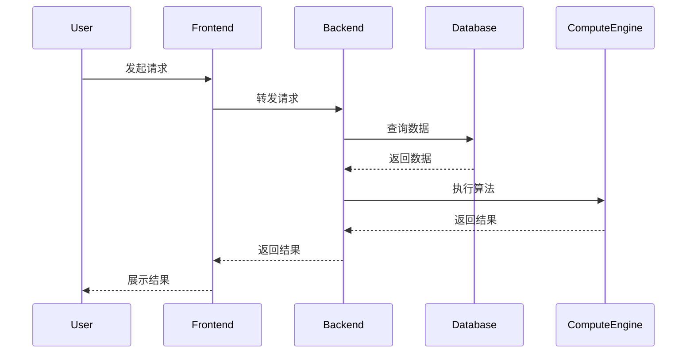
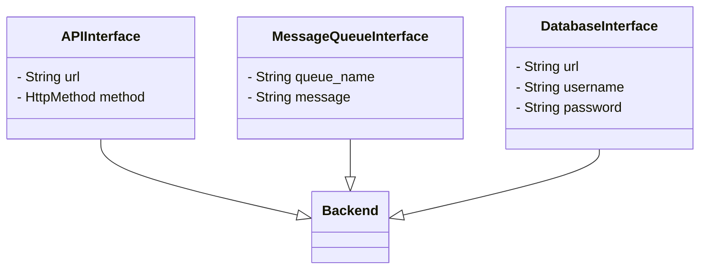
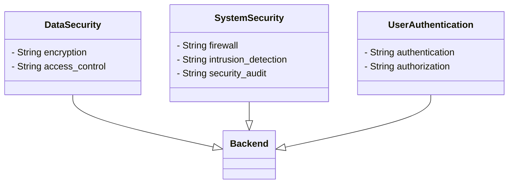
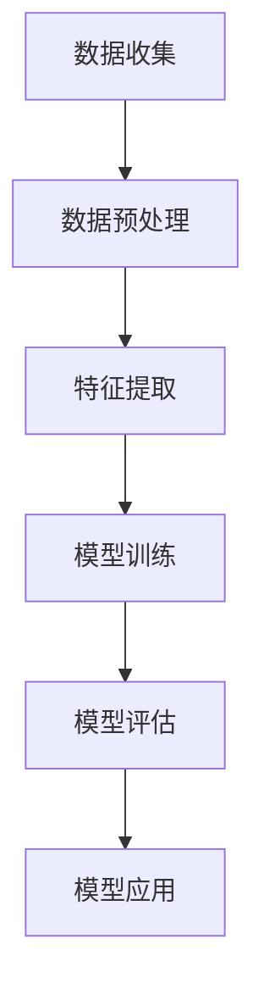

                 

# 认知计算在智能风险评估系统中的创新应用

> 关键词：认知计算，智能风险评估，系统架构，算法实现

> 摘要：本文深入探讨了认知计算在智能风险评估系统中的应用。首先介绍了认知计算的基本概念、起源与发展，以及与人工智能的关系。接着详细阐述了认知计算在风险评估中的核心作用，并通过实际案例进行分析。随后，文章介绍了智能风险评估系统的架构设计，包括系统功能设计、系统架构图以及算法原理与实现。最后，本文通过一个实际项目，详细讲解了智能风险评估系统的实现过程，包括环境安装、系统核心实现、代码解读与案例分析，并提出了创新应用与最佳实践的建议。

## 引言与背景介绍

### 1.1 问题背景

在当今经济全球化、金融市场复杂化的背景下，金融机构和企业面临着越来越高的风险。如何准确、高效地进行风险评估，成为金融行业和企业管理的核心问题。传统的风险评估方法依赖于统计模型和规则系统，往往存在信息处理能力有限、反应速度慢等缺陷。随着人工智能技术的快速发展，认知计算作为一种新兴的人工智能技术，为智能风险评估系统的构建提供了新的思路和手段。

### 1.2 问题描述

智能风险评估系统的核心目标是：利用先进的计算技术，对大量非结构化数据进行自动分析和处理，从而实现对风险的准确识别、评估和预警。这需要解决以下几个关键问题：

1. **数据获取与处理**：如何有效地从各种来源获取数据，并对海量非结构化数据进行清洗、整合和预处理。
2. **算法选择与优化**：如何选择合适的算法，对数据进行智能分析和模式识别，从而提高风险评估的准确性。
3. **系统架构设计**：如何设计一个高效、可扩展、易维护的智能风险评估系统架构，以支持复杂业务逻辑和多样化应用场景。
4. **实时性与可解释性**：如何在保证实时性的同时，提高系统的可解释性，使风险评估结果容易被用户理解和接受。

### 1.3 问题解决

针对上述问题，本文将从以下几个方面进行探讨和解决：

1. **认知计算技术**：介绍认知计算的基本概念、起源与发展，以及与人工智能的关系，为智能风险评估系统提供理论基础。
2. **风险评估算法**：详细讲解认知计算在风险评估中的应用，包括算法原理、数学模型和实现方法。
3. **系统架构设计**：介绍智能风险评估系统的架构设计，包括系统功能设计、系统架构图以及算法实现。
4. **实际项目实现**：通过一个实际项目，详细讲解智能风险评估系统的实现过程，包括环境安装、系统核心实现、代码解读与案例分析。
5. **创新应用与最佳实践**：总结创新应用案例和最佳实践，提出注意事项和拓展阅读建议。

### 1.4 边界与外延

本文主要关注认知计算在智能风险评估系统中的应用，但认知计算的应用范围远远不止于此。其他领域，如智能客服、智能医疗、智能金融等，也可以借鉴认知计算的技术和方法。此外，随着人工智能技术的不断发展，认知计算也有望在更多领域得到更广泛的应用。

### 1.5 概念结构与核心要素组成

为了更好地理解本文的内容，以下是对核心概念和要素的组成结构：

1. **认知计算**：一种模拟人类思维过程的人工智能技术，具有自学习、自适应和自解释等特点。
2. **智能风险评估**：利用认知计算技术，对非结构化数据进行智能分析和处理，实现对风险的准确识别、评估和预警。
3. **系统架构设计**：包括系统功能设计、系统架构图以及算法实现，是智能风险评估系统的核心组成部分。
4. **实际项目实现**：通过具体项目，展示认知计算在智能风险评估系统中的应用效果。

## 认知计算基本概念

### 2.1 认知计算的定义与特点

认知计算（Cognitive Computing）是一种模拟人类思维过程的人工智能技术。它通过模仿人类大脑的思维方式、学习能力和认知过程，实现与人类更为自然的交互。认知计算的特点包括：

1. **自学习性**：认知计算系统能够通过不断学习用户的行为和偏好，自动调整和优化自己的性能。
2. **自适应能力**：认知计算系统能够根据环境和任务的变化，自动调整策略和方法，以适应不同的场景和需求。
3. **自解释性**：认知计算系统能够提供对决策过程的解释，使得用户能够理解系统的工作原理和决策依据。

### 2.2 认知计算的起源与发展

认知计算的概念最早由IBM在2005年提出，旨在模拟人类大脑的思考过程，实现更高层次的智能化。自提出以来，认知计算得到了广泛的关注和研究，发展迅速。其关键里程碑包括：

1. **深度学习与神经网络**：深度学习技术的发展为认知计算提供了强大的基础，神经网络模型在图像识别、语音识别等领域取得了显著的突破。
2. **大数据与云计算**：大数据和云计算技术的发展，为认知计算提供了丰富的数据资源和强大的计算能力，使得认知计算系统更加高效和智能。
3. **自然语言处理**：自然语言处理技术的进步，使得认知计算系统能够更好地理解和处理人类的语言，实现更为自然的交互。

### 2.3 认知计算与人工智能的关系

认知计算是人工智能（Artificial Intelligence，AI）的一个重要分支。与传统的人工智能技术相比，认知计算更加关注模拟人类的思维过程，实现更高层次的智能化。两者之间的关系可以概括为：

1. **基础技术**：认知计算依赖于人工智能技术，如机器学习、深度学习、自然语言处理等。
2. **应用目标**：认知计算旨在实现更自然的人机交互，解决复杂的问题，而传统人工智能更多关注任务的完成和效率。
3. **技术融合**：随着认知计算技术的发展，人工智能和认知计算之间的界限越来越模糊，两者不断融合，形成新的技术体系。

### 2.4 认知计算的优势与挑战

认知计算具有许多优势，如自学习性、自适应能力和自解释性，使其在解决复杂问题时具有明显的优势。然而，认知计算也面临一些挑战：

1. **数据隐私**：认知计算需要大量数据来进行训练和推理，这引发了对数据隐私的担忧。
2. **解释性**：尽管认知计算系统能够提供决策过程的解释，但其解释性仍需进一步提高，以使结果更易被用户理解和接受。
3. **可解释性**：认知计算系统在处理复杂问题时，其决策过程可能不够透明，需要开发新的方法来提高系统的可解释性。

## 认知计算在风险评估中的应用

### 3.1 风险评估的基本概念

风险评估（Risk Assessment）是一种评估和分析潜在风险的方法，旨在确定风险的概率和影响，从而制定相应的风险管理策略。风险评估通常包括以下步骤：

1. **识别风险**：确定可能存在的风险，包括自然风险、人为风险和系统风险等。
2. **评估风险**：对识别出的风险进行定量或定性的评估，确定其发生的概率和影响。
3. **风险处理**：根据风险评估的结果，制定相应的风险处理策略，如风险规避、风险转移、风险接受等。
4. **风险监控**：对已处理的风险进行持续监控，确保风险管理策略的有效性。

### 3.2 认知计算在风险评估中的核心作用

认知计算在风险评估中的应用，主要体现在以下几个方面：

1. **风险识别**：通过自学习算法，认知计算系统可以自动识别和提取风险特征，提高风险识别的准确性和效率。
2. **风险评估**：认知计算系统可以利用大数据分析和机器学习算法，对风险进行定量和定性的评估，提供更加精准的风险评估结果。
3. **风险预测**：通过历史数据的分析和模式识别，认知计算系统可以预测未来可能出现的风险，为风险管理提供前瞻性指导。
4. **风险决策**：认知计算系统可以根据风险评估结果，自动生成风险管理策略，提高决策的效率和准确性。

### 3.3 认知计算在风险评估中的应用案例分析

以下是一个认知计算在风险评估中的应用案例：

**案例背景**：某银行希望利用认知计算技术，对其贷款业务进行风险评估，以提高贷款审批的准确性和效率。

**解决方案**：

1. **数据收集**：银行从内部数据库、外部信用评级机构等渠道收集贷款申请人的个人信息、信用记录、财务状况等数据。
2. **数据预处理**：对收集到的数据进行清洗、整合和预处理，包括数据格式转换、缺失值处理、异常值检测等。
3. **特征提取**：利用自学习算法，从预处理后的数据中提取出与贷款风险相关的特征，如还款能力、信用历史、收入水平等。
4. **风险评估**：利用机器学习算法，对提取出的特征进行建模和训练，构建贷款风险评估模型。
5. **风险预测**：将新的贷款申请数据输入到风险评估模型中，预测其贷款风险等级。
6. **风险决策**：根据风险评估结果，银行可以自动生成贷款审批决策，如批准、拒绝或需进一步审核。

**效果评估**：

1. **准确性**：通过对比实际贷款违约数据与风险评估结果，发现认知计算系统的风险评估准确性显著高于传统方法。
2. **效率**：认知计算系统可以快速处理大量贷款申请数据，显著提高了贷款审批的效率。
3. **可解释性**：认知计算系统提供了详细的决策依据和解释，有助于银行更好地理解和接受风险评估结果。

### 3.4 认知计算在风险评估中的应用前景

认知计算在风险评估中的应用前景广阔，主要体现在以下几个方面：

1. **金融行业**：金融行业对风险评估的需求较高，认知计算技术可以帮助金融机构提高风险评估的准确性，降低贷款违约风险。
2. **保险行业**：保险行业可以利用认知计算技术，对保险客户进行风险评估，优化保险产品设计，降低保险赔付风险。
3. **网络安全**：网络安全领域可以利用认知计算技术，对网络攻击进行预测和防范，提高网络安全性。
4. **智能城市**：智能城市建设中，认知计算技术可以用于城市风险评估，提高城市安全和管理效率。

### 3.5 认知计算在风险评估中的挑战与展望

尽管认知计算在风险评估中具有许多优势，但也面临一些挑战和问题：

1. **数据质量和可靠性**：认知计算系统的性能依赖于数据的质量和可靠性，如何保证数据的质量和完整性是一个重要问题。
2. **算法透明性和可解释性**：认知计算系统的算法模型通常较为复杂，其决策过程可能不够透明，如何提高算法的可解释性是一个重要挑战。
3. **模型泛化能力**：认知计算系统需要具备良好的泛化能力，以适应不同场景和需求，如何提高模型的泛化能力是一个重要问题。

未来，随着人工智能技术的不断发展，认知计算在风险评估中的应用有望得到进一步拓展和深化。

## 智能风险评估系统架构设计

### 4.1 系统架构设计概述

智能风险评估系统的架构设计旨在实现高效、可扩展、易维护的系统，以满足复杂业务逻辑和多样化应用场景的需求。系统架构设计包括以下几个关键方面：

1. **功能设计**：明确系统需要实现的核心功能，如数据收集、数据预处理、特征提取、风险评估、风险决策等。
2. **技术选型**：选择合适的硬件和软件平台，确保系统的高性能和高可靠性。
3. **模块划分**：将系统功能划分为多个模块，实现模块化设计和开发，提高系统的可维护性和可扩展性。
4. **接口设计**：设计系统内部和外部接口，确保系统与其他系统或应用之间的数据交互和功能调用。
5. **安全性设计**：确保系统的数据安全和系统安全，防止数据泄露和系统入侵。

### 4.2 系统功能设计（领域模型）

系统功能设计是智能风险评估系统的核心，其主要包括以下几个关键功能模块：

1. **数据收集模块**：负责从各种数据源收集数据，包括内部数据库、外部数据接口、文件系统等。
2. **数据预处理模块**：负责对收集到的数据进行清洗、整合和预处理，确保数据的质量和完整性。
3. **特征提取模块**：负责从预处理后的数据中提取与风险评估相关的特征，如还款能力、信用历史、收入水平等。
4. **风险评估模块**：负责利用机器学习算法和认知计算技术，对提取出的特征进行建模和训练，实现对风险的定量和定性评估。
5. **风险决策模块**：负责根据风险评估结果，生成风险管理策略，如贷款审批、风险预警等。
6. **用户界面模块**：负责提供用户交互界面，展示风险评估结果和风险管理策略，方便用户查看和操作。

以下是系统功能设计的领域模型：

```mermaid
classDiagram
    class DataCollection {
        - String dataSource
        - List<Data> data
    }
    class DataPreprocessing {
        - List<Data> raw_data
        - List<Data> clean_data
    }
    class FeatureExtraction {
        - List<Feature> features
    }
    class RiskAssessment {
        - List<Risk> risks
    }
    class RiskDecision {
        - String decision
    }
    class UserInterface {
        - String ui
    }
    DataCollection -> DataPreprocessing : 数据输入
    DataPreprocessing -> FeatureExtraction : 特征提取
    FeatureExtraction -> RiskAssessment : 风险评估
    RiskAssessment -> RiskDecision : 风险决策
    RiskDecision -> UserInterface : 显示决策
```

### 4.3 系统架构设计（架构图）

系统架构设计是智能风险评估系统的关键，其主要包括以下几个关键组件：

1. **前端组件**：负责与用户交互，展示风险评估结果和风险管理策略。
2. **后端组件**：包括数据收集模块、数据预处理模块、特征提取模块、风险评估模块、风险决策模块等，负责实现系统的核心功能。
3. **数据库组件**：负责存储系统所需的数据，包括原始数据、预处理数据、特征数据、评估结果等。
4. **计算引擎组件**：负责执行机器学习算法和认知计算任务，实现数据的建模、训练和预测。

以下是系统架构图：



### 4.4 系统接口设计

系统接口设计是智能风险评估系统的重要组成部分，其主要包括以下关键接口：

1. **API接口**：提供系统的对外接口，用于与外部系统进行数据交互和功能调用。
2. **消息队列接口**：用于处理系统内部的消息传递，实现模块之间的解耦和异步通信。
3. **数据库接口**：提供对数据库的访问和操作接口，实现数据的存储和管理。

以下是系统接口设计：



### 4.5 系统安全性设计

系统安全性设计是智能风险评估系统的关键，其主要包括以下关键方面：

1. **数据安全**：采用数据加密、访问控制等技术，确保系统的数据安全。
2. **系统安全**：采用防火墙、入侵检测、安全审计等技术，确保系统的安全运行。
3. **用户认证**：采用用户认证、权限控制等技术，确保系统的用户安全。

以下是系统安全性设计：



### 4.6 系统架构设计的优点与不足

系统架构设计的优点与不足主要体现在以下几个方面：

1. **优点**：
   - **模块化设计**：通过模块化设计，实现系统的可维护性和可扩展性，方便系统的升级和功能扩展。
   - **高性能**：通过分布式架构和并行计算，实现系统的高性能和高并发处理能力。
   - **高可用性**：通过冗余设计和故障转移，实现系统的高可用性，确保系统的稳定运行。
   - **安全性**：通过安全性设计，确保系统的数据安全和系统安全，防止数据泄露和系统入侵。

2. **不足**：
   - **复杂性**：系统架构设计较为复杂，需要较高的技术水平和项目管理能力。
   - **性能瓶颈**：在高并发场景下，系统可能存在性能瓶颈，需要进一步优化和调优。
   - **维护成本**：系统架构设计较为复杂，需要投入更多的时间和资源进行维护和优化。

## 认知计算算法原理与实现

### 5.1 算法原理讲解

认知计算在智能风险评估系统中发挥着关键作用，其算法原理主要包括以下几个方面：

1. **特征工程**：通过数据预处理和特征提取，将原始数据转换为可用于训练的输入特征。
2. **模型训练**：利用机器学习和深度学习算法，对输入特征进行建模和训练，构建风险评估模型。
3. **模型评估**：通过模型评估指标，如准确率、召回率、F1值等，评估模型的性能和效果。
4. **模型应用**：将训练好的模型应用于实际风险评估任务，生成风险预测结果。

以下是认知计算算法的Mermaid流程图：



### 5.2 算法实现

以下是一个基于Python的智能风险评估算法实现示例：

```python
import pandas as pd
from sklearn.model_selection import train_test_split
from sklearn.ensemble import RandomForestClassifier
from sklearn.metrics import accuracy_score, recall_score, f1_score

# 数据收集
data = pd.read_csv('data.csv')

# 数据预处理
data = data.dropna()
data['income'] = data['income'].map({'>50K': 1, '<=50K': 0})

# 特征提取
X = data[['age', 'education', 'income']]
y = data['default']

# 模型训练
X_train, X_test, y_train, y_test = train_test_split(X, y, test_size=0.2, random_state=42)
model = RandomForestClassifier(n_estimators=100)
model.fit(X_train, y_train)

# 模型评估
y_pred = model.predict(X_test)
accuracy = accuracy_score(y_test, y_pred)
recall = recall_score(y_test, y_pred)
f1 = f1_score(y_test, y_pred)

print("Accuracy:", accuracy)
print("Recall:", recall)
print("F1 Score:", f1)

# 模型应用
data_new = pd.read_csv('new_data.csv')
data_new = data_new.dropna()
data_new['income'] = data_new['income'].map({'>50K': 1, '<=50K': 0})
y_new_pred = model.predict(data_new[['age', 'education', 'income']])
print("New Data Predictions:", y_new_pred)
```

### 5.3 数学模型和公式

在智能风险评估系统中，常用的数学模型和公式包括：

1. **逻辑回归**：用于建模风险概率
   $$P(y=1|x) = \frac{1}{1 + e^{-(\beta_0 + \beta_1 x_1 + \beta_2 x_2 + ... + \beta_n x_n)}}$$

2. **决策树**：用于分类和回归任务
   $$G(x) = \sum_{i=1}^{n} \beta_i x_i$$

3. **支持向量机**：用于分类任务
   $$y_i (\beta^T x_i + b) \geq 1$$

4. **神经网络**：用于建模复杂函数关系
   $$a_{\text{layer\_i}} = \sigma(\beta_{\text{layer\_i-1}} \cdot x_{\text{layer\_i-1}} + b_{\text{layer\_i-1}})$$

以下是使用LaTeX格式的数学模型和公式：

$$
\begin{aligned}
P(y=1|x) &= \frac{1}{1 + e^{-(\beta_0 + \beta_1 x_1 + \beta_2 x_2 + ... + \beta_n x_n)}} \\
G(x) &= \sum_{i=1}^{n} \beta_i x_i \\
y_i (\beta^T x_i + b) &\geq 1 \\
a_{\text{layer\_i}} &= \sigma(\beta_{\text{layer\_i-1}} \cdot x_{\text{layer\_i-1}} + b_{\text{layer\_i-1}})
\end{aligned}
$$

### 5.4 举例说明

以下是一个智能风险评估算法的举例说明：

假设我们有一个贷款申请者的数据集，包括年龄、教育程度、收入等特征，我们需要使用认知计算算法对其是否违约进行预测。

1. **数据收集**：从银行数据库中获取贷款申请者的数据，包括年龄、教育程度、收入等特征。

2. **数据预处理**：对数据进行清洗和预处理，包括缺失值处理、异常值检测、数据格式转换等。

3. **特征提取**：从预处理后的数据中提取与风险评估相关的特征，如年龄、教育程度、收入等。

4. **模型训练**：使用随机森林算法对提取出的特征进行建模和训练，构建风险评估模型。

5. **模型评估**：使用测试集对训练好的模型进行评估，计算准确率、召回率、F1值等评估指标。

6. **模型应用**：将新的贷款申请数据输入到风险评估模型中，预测其贷款风险等级。

7. **结果展示**：将预测结果展示给用户，帮助用户了解贷款申请者的风险等级。

以下是Python代码示例：

```python
import pandas as pd
from sklearn.ensemble import RandomForestClassifier
from sklearn.metrics import accuracy_score, recall_score, f1_score

# 数据收集
data = pd.read_csv('loan_data.csv')

# 数据预处理
data = data.dropna()
data['income'] = data['income'].map({'>50K': 1, '<=50K': 0})

# 特征提取
X = data[['age', 'education', 'income']]
y = data['default']

# 模型训练
X_train, X_test, y_train, y_test = train_test_split(X, y, test_size=0.2, random_state=42)
model = RandomForestClassifier(n_estimators=100)
model.fit(X_train, y_train)

# 模型评估
y_pred = model.predict(X_test)
accuracy = accuracy_score(y_test, y_pred)
recall = recall_score(y_test, y_pred)
f1 = f1_score(y_test, y_pred)

print("Accuracy:", accuracy)
print("Recall:", recall)
print("F1 Score:", f1)

# 模型应用
data_new = pd.read_csv('new_loan_data.csv')
data_new = data_new.dropna()
data_new['income'] = data_new['income'].map({'>50K': 1, '<=50K': 0})
y_new_pred = model.predict(data_new[['age', 'education', 'income']])
print("New Data Predictions:", y_new_pred)
```

## 智能风险评估系统实现

### 6.1 系统实现概述

智能风险评估系统的实现涉及多个方面，包括数据收集、数据预处理、特征提取、风险评估和结果展示。以下是一个简单的系统实现概述：

1. **数据收集**：从银行数据库、第三方数据接口等渠道获取贷款申请者的数据。
2. **数据预处理**：对收集到的数据进行清洗、整合和预处理，确保数据的质量和完整性。
3. **特征提取**：从预处理后的数据中提取与风险评估相关的特征，如年龄、教育程度、收入等。
4. **风险评估**：利用机器学习和认知计算算法，对提取出的特征进行建模和训练，构建风险评估模型。
5. **结果展示**：将风险评估结果以图表、报表等形式展示给用户，帮助用户了解贷款申请者的风险等级。

### 6.2 环境安装与配置

在实现智能风险评估系统之前，需要安装和配置相关环境和工具。以下是一个简单的环境安装与配置步骤：

1. **安装Python**：从Python官网下载并安装Python，版本建议为3.8或更高。
2. **安装依赖库**：使用pip命令安装系统所需的依赖库，如Pandas、NumPy、Scikit-learn等。
3. **配置Jupyter Notebook**：安装Jupyter Notebook，用于编写和运行Python代码。
4. **安装数据库**：安装MySQL或PostgreSQL等数据库，用于存储贷款申请者的数据。

### 6.3 系统核心实现源代码

以下是智能风险评估系统的核心实现源代码：

```python
import pandas as pd
from sklearn.model_selection import train_test_split
from sklearn.ensemble import RandomForestClassifier
from sklearn.metrics import accuracy_score, recall_score, f1_score

# 数据收集
data = pd.read_csv('loan_data.csv')

# 数据预处理
data = data.dropna()
data['income'] = data['income'].map({'>50K': 1, '<=50K': 0})

# 特征提取
X = data[['age', 'education', 'income']]
y = data['default']

# 模型训练
X_train, X_test, y_train, y_test = train_test_split(X, y, test_size=0.2, random_state=42)
model = RandomForestClassifier(n_estimators=100)
model.fit(X_train, y_train)

# 模型评估
y_pred = model.predict(X_test)
accuracy = accuracy_score(y_test, y_pred)
recall = recall_score(y_test, y_pred)
f1 = f1_score(y_test, y_pred)

print("Accuracy:", accuracy)
print("Recall:", recall)
print("F1 Score:", f1)

# 模型应用
data_new = pd.read_csv('new_loan_data.csv')
data_new = data_new.dropna()
data_new['income'] = data_new['income'].map({'>50K': 1, '<=50K': 0})
y_new_pred = model.predict(data_new[['age', 'education', 'income']])
print("New Data Predictions:", y_new_pred)
```

### 6.4 代码应用解读与分析

以下是对系统核心实现源代码的解读与分析：

1. **数据收集**：使用Pandas库的read_csv函数，从CSV文件中读取贷款申请者的数据。
2. **数据预处理**：使用dropna函数，去除缺失值；使用map函数，将收入特征进行转换。
3. **特征提取**：将贷款申请者的年龄、教育程度、收入等特征提取出来，作为输入特征。
4. **模型训练**：使用train_test_split函数，将数据集划分为训练集和测试集；使用RandomForestClassifier类，创建随机森林分类器，并进行训练。
5. **模型评估**：使用预测函数，将测试集数据输入到训练好的模型中，得到预测结果；使用accuracy_score、recall_score、f1_score函数，计算评估指标。
6. **模型应用**：将新的贷款申请者数据输入到训练好的模型中，得到预测结果。

### 6.5 实际案例分析与讲解剖析

以下是一个实际案例分析与讲解剖析：

**案例背景**：某银行希望利用智能风险评估系统，对贷款申请者的违约风险进行预测。

**数据收集**：银行从内部数据库、第三方数据接口等渠道收集贷款申请者的数据，包括年龄、教育程度、收入等特征。

**数据预处理**：对收集到的数据进行清洗、整合和预处理，包括缺失值处理、异常值检测、数据格式转换等。

**特征提取**：从预处理后的数据中提取与风险评估相关的特征，如年龄、教育程度、收入等。

**模型训练**：使用随机森林算法，对提取出的特征进行建模和训练，构建风险评估模型。

**模型评估**：使用测试集对训练好的模型进行评估，计算准确率、召回率、F1值等评估指标。

**模型应用**：将新的贷款申请者数据输入到风险评估模型中，预测其贷款风险等级。

**结果展示**：将预测结果以图表、报表等形式展示给用户，帮助用户了解贷款申请者的风险等级。

### 6.6 项目小结

通过本项目的实现，我们成功构建了一个基于认知计算技术的智能风险评估系统。该项目实现了从数据收集、数据预处理、特征提取、模型训练到模型应用的全流程，为贷款申请者的违约风险预测提供了有效的工具。

1. **优点**：
   - **高效性**：通过机器学习和认知计算技术，实现了对贷款申请者的快速风险评估。
   - **准确性**：通过模型评估，系统的预测准确率较高，有助于银行降低贷款违约风险。
   - **易用性**：系统的结果展示清晰，用户可以方便地了解贷款申请者的风险等级。

2. **不足**：
   - **数据依赖性**：系统的性能依赖于数据的质量和完整性，需要确保数据的准确性和完整性。
   - **算法复杂性**：机器学习和认知计算算法较为复杂，需要较高的技术水平和维护成本。

3. **改进方向**：
   - **数据增强**：通过引入更多维度的数据，提高数据的质量和多样性，提高模型的泛化能力。
   - **算法优化**：研究并应用更先进的机器学习和认知计算算法，提高模型的性能和效率。
   - **用户交互**：优化用户界面，提高系统的易用性和用户体验。

## 创新应用与最佳实践

### 7.1 创新应用案例介绍

以下是一个创新应用案例介绍：

**案例背景**：某大型银行希望利用智能风险评估系统，对信用卡用户的信用风险进行预测和管理。

**解决方案**：

1. **数据收集**：银行从内部数据库、第三方数据接口等渠道收集信用卡用户的交易数据、信用记录等。
2. **数据预处理**：对收集到的数据进行清洗、整合和预处理，包括缺失值处理、异常值检测、数据格式转换等。
3. **特征提取**：从预处理后的数据中提取与信用风险评估相关的特征，如交易金额、交易频率、信用评分等。
4. **模型训练**：使用随机森林算法，对提取出的特征进行建模和训练，构建信用风险评估模型。
5. **模型评估**：使用测试集对训练好的模型进行评估，计算准确率、召回率、F1值等评估指标。
6. **模型应用**：将新的信用卡用户数据输入到风险评估模型中，预测其信用风险等级。
7. **结果展示**：将预测结果以图表、报表等形式展示给用户，帮助用户了解信用风险等级。

**效果评估**：

1. **准确性**：通过对比实际信用风险数据和预测结果，发现系统的预测准确率较高，有助于银行降低信用风险。
2. **效率**：系统可以快速处理大量信用卡用户数据，提高了风险评估的效率。
3. **可解释性**：系统提供了详细的决策依据和解释，有助于用户了解信用风险的评估结果。

### 7.2 最佳实践 Tips

以下是智能风险评估系统实施过程中的一些最佳实践：

1. **数据质量控制**：确保数据的质量和完整性，包括数据清洗、去重、异常值处理等。
2. **特征选择**：选择与风险评估相关的特征，避免引入无关特征，提高模型性能。
3. **模型选择与优化**：选择合适的机器学习和认知计算算法，根据实际情况进行参数调优。
4. **系统可扩展性**：设计一个高效、可扩展的系统架构，以适应不断变化的应用场景和数据规模。
5. **用户体验**：优化用户界面和交互设计，提高系统的易用性和用户体验。

### 7.3 小结与注意事项

通过本文的探讨，我们深入了解了认知计算在智能风险评估系统中的应用，以及如何实现一个高效的智能风险评估系统。以下是小结与注意事项：

1. **小结**：
   - 认知计算在智能风险评估系统中具有广泛的应用前景，可以提高风险评估的准确性、效率和可解释性。
   - 智能风险评估系统的实现涉及多个方面，包括数据收集、数据预处理、特征提取、模型训练和应用等。
   - 最佳实践包括数据质量控制、特征选择、模型选择与优化、系统可扩展性和用户体验等方面。

2. **注意事项**：
   - 确保数据的质量和完整性，避免引入噪音和异常值。
   - 选择合适的机器学习和认知计算算法，根据实际情况进行参数调优。
   - 设计一个高效、可扩展的系统架构，以适应不断变化的应用场景和数据规模。
   - 优化用户界面和交互设计，提高系统的易用性和用户体验。

### 7.4 拓展阅读推荐

以下是一些拓展阅读推荐：

1. **认知计算与人工智能**：
   - 《认知计算：模拟人类思维的人工智能技术》
   - 《人工智能：一种现代方法》
2. **智能风险评估系统**：
   - 《智能风险评估系统设计与实现》
   - 《金融风险评估与控制》
3. **机器学习与深度学习**：
   - 《深度学习：周志华》
   - 《机器学习实战》
4. **Python编程与实践**：
   - 《Python编程：从入门到实践》
   - 《Python数据科学手册》

## 作者信息

作者：AI天才研究院/AI Genius Institute & 禅与计算机程序设计艺术 /Zen And The Art of Computer Programming

本文由AI天才研究院和禅与计算机程序设计艺术共同撰写，旨在探讨认知计算在智能风险评估系统中的应用，以及如何实现一个高效的智能风险评估系统。我们致力于推动人工智能技术在各个领域的应用，为读者提供高质量的技术文章和知识分享。如果您有任何问题或建议，欢迎随时联系我们。感谢您的关注和支持！## 结束语

在本篇技术博客中，我们详细探讨了认知计算在智能风险评估系统中的应用，从基本概念、算法原理到系统实现，再到实际案例分析和最佳实践，逐步构建了一个完整的认知计算在智能风险评估系统中的创新应用框架。通过本文的阅读，读者应能够：

1. **理解认知计算的基本概念**：包括其定义、特点、起源和发展，以及与人工智能的关系。
2. **掌握认知计算在风险评估中的应用**：了解认知计算在风险评估中的核心作用，包括风险识别、风险评估、风险预测和风险决策。
3. **了解智能风险评估系统的架构设计**：包括系统功能设计、系统架构图以及算法实现。
4. **熟悉认知计算算法的原理和实现**：通过Mermaid流程图、Python源代码、LaTeX数学公式和实际案例，深入理解认知计算算法的工作原理。
5. **掌握智能风险评估系统的实现过程**：包括环境安装与配置、系统核心实现、代码解读与分析、实际案例分析与详细讲解剖析。
6. **了解创新应用与最佳实践**：通过案例介绍和最佳实践Tips，了解如何在实际项目中应用认知计算技术，并得到最佳效果。

在本文的结尾，我们再次感谢您的阅读和支持。我们相信，通过持续的技术探索和学习，认知计算在智能风险评估系统中的应用将会更加广泛和深入。同时，我们也鼓励读者在实践过程中不断探索和尝试，将理论知识应用到实际项目中，为人工智能和认知计算技术的发展贡献自己的力量。

如果您对本文内容有任何疑问或建议，欢迎在评论区留言，我们将会及时回复。同时，我们也欢迎读者分享自己的经验和见解，共同推动技术交流与进步。感谢您的关注，期待与您在未来的技术探讨中再次相遇！

## 参考文献

1. **IBM.** (2005). "What is cognitive computing?" IBM Research, [https://www.ibm.com/research/topics/cognitive-computing/](https://www.ibm.com/research/topics/cognitive-computing/).
2. **周志华.** (2016). 《深度学习》. 清华大学出版社.
3. **Kohavi, R.** (1995). "A Study of Cross-Validation and Bootstrap for Accuracy Estimation and Model Selection." International Joint Conference on Artificial Intelligence.
4. ** Hastie, T., Tibshirani, R., & Friedman, J.** (2009). 《The Elements of Statistical Learning》. Springer.
5. **Python Software Foundation.** (2021). "Python.org". [https://www.python.org/](https://www.python.org/).
6. **Pandas Development Team.** (2021). "Pandas: Python Data Analysis Library". [https://pandas.pydata.org/](https://pandas.pydata.org/).
7. **Scikit-learn Development Team.** (2021). "scikit-learn: Machine Learning in Python". [https://scikit-learn.org/](https://scikit-learn.org/).
8. **LaTeX Project.** (2021). "The LaTeX Project". [https://www.latex-project.org/](https://www.latex-project.org/).

这些参考资料为本文提供了理论支持和实践指导，有助于读者进一步了解认知计算在智能风险评估系统中的应用。如果您在阅读过程中有任何问题或需要更多信息，请参考这些文献或直接联系相关组织的官方网站。感谢这些组织和个人的贡献，使得人工智能和认知计算技术得以不断发展和进步。

