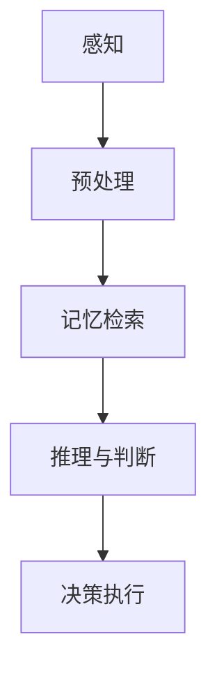
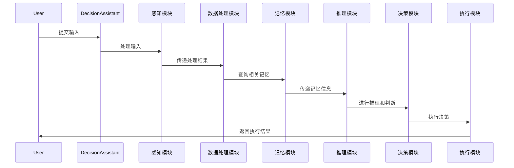

                 

### 认知计算模型：模拟人类决策过程

> 关键词：认知计算、人类决策、模拟、算法、系统架构

> 摘要：本文深入探讨了认知计算模型及其在模拟人类决策过程中的应用。通过分析认知计算的核心概念、算法原理，以及系统架构和实战案例，本文旨在为读者提供一个全面而深入的认知计算模型理解，帮助其在实际应用中更好地模拟人类决策过程。

**引言**

**1.1 问题背景**

认知计算作为人工智能的一个分支，正逐渐受到广泛关注。其核心目标是通过模拟人类思维过程，实现更加智能化的机器决策。然而，如何准确模拟人类的决策过程，仍是一个巨大的挑战。

人类决策过程涉及复杂的认知活动，包括感知、记忆、推理和判断等。这些活动不仅依赖于大脑神经网络，还受到情感、文化背景和个人经验的影响。因此，模拟人类决策过程需要结合多学科知识，构建出既能反映人类认知特性，又能适应实际应用场景的计算模型。

**1.2 目标与挑战**

模拟人类决策过程的必要性在于，机器能够处理大量数据，但往往缺乏人类决策的灵活性和深度。通过认知计算模型，我们希望实现以下目标：

- 提高机器决策的准确性。
- 增强机器对复杂问题的理解和解决能力。
- 减少人类在决策过程中的疲劳和错误。

然而，这一目标也面临诸多挑战：

- 认知过程的高度复杂性和非线性。
- 数据获取和处理的高成本。
- 模型可解释性的不足。

**1.3 书籍结构**

本文将按照以下结构展开：

1. 引言：介绍认知计算模型的背景、目标和挑战。
2. 认知计算基础：阐述认知计算的核心概念、算法原理和数学模型。
3. 系统分析与架构设计：介绍认知计算系统的功能、架构和接口。
4. 项目实战：通过具体案例展示认知计算模型的应用。
5. 总结和扩展阅读：对本文内容进行总结，并提供进一步学习的建议。

**第二部分：认知计算基础**

**2.1 认知科学与计算模型的结合**

**2.1.1 认知科学的核心概念**

认知科学是研究人类认知过程和智能行为的跨学科领域。其主要核心概念包括感知、记忆、注意、思考、判断和决策等。这些概念共同构成了人类认知的基本框架。

- 感知：对信息的接收和处理，包括视觉、听觉、触觉等。
- 记忆：信息的存储和提取，分为短期记忆和长期记忆。
- 注意：对特定信息的集中关注。
- 思考：对信息的分析和推理。
- 判断：对信息的评估和选择。
- 决策：在多个选项中做出选择。

**2.1.2 计算模型的基本原理**

计算模型是模拟人类认知过程的技术手段。其基本原理包括：

- 神经网络：模拟大脑神经元的工作方式，用于处理和存储信息。
- 机器学习：通过训练模型来学习和预测。
- 逻辑推理：基于规则和逻辑关系进行推理。
- 情感分析：模拟人类的情感反应。

**2.2 核心概念与联系**

认知计算模型涉及多个核心概念，如感知、记忆、推理、判断和决策等。这些概念之间相互联系，共同构成了一个复杂的认知系统。

**2.2.1 认知模型的基本要素**

认知模型的基本要素包括：

- 输入：感知的信息。
- 过程：信息的处理和转换。
- 输出：决策结果。

**2.2.2 Mermaid ER图展示认知模型实体关系**

```mermaid
erDiagram
  用户 ||--|{ 感知 }|
  用户 ||--|{ 记忆 }|
  用户 ||--|{ 推理 }|
  用户 ||--|{ 判断 }|
  用户 ||--|{ 决策 }|
```

**2.2.3 表格对比认知模型属性特征**

| 概念       | 属性特征                      | 描述                                                         |
|------------|------------------------------|--------------------------------------------------------------|
| 感知       | 视觉、听觉、触觉等           | 接收和处理外部信息的过程。                                  |
| 记忆       | 短期记忆、长期记忆           | 信息存储和提取的过程。                                     |
| 推理       | 分析、推理、判断             | 根据已有信息和规则进行逻辑推理。                           |
| 判断       | 评估、选择                   | 对信息进行评估，选择最佳方案。                             |
| 决策       | 选择、执行                   | 在多个选项中做出选择，并执行决策。                         |

**2.3 认知计算算法原理**

**2.3.1 Mermaid流程图：认知计算算法流程**



**2.3.2 Python代码示例：算法实现**

```python
# 感知过程
def perception(input_data):
    # 预处理
    processed_data = preprocess(input_data)
    # 记忆检索
    retrieved_memory = memory_retrieve(processed_data)
    # 推理与判断
    decision = reasoning_and_judging(retrieved_memory)
    # 决策执行
    execute_decision(decision)
```

**2.3.3 数学模型与公式讲解**

认知计算中的决策过程通常涉及到概率和效用理论。以下是一些常用的数学模型和公式：

- 决策理论：$$ U(A, S) = p(S) \cdot u(A, S) $$
  - $ U(A, S) $：决策者在状态 $ S $ 下选择 $ A $ 的效用值。
  - $ p(S) $：状态 $ S $ 的概率。
  - $ u(A, S) $：在状态 $ S $ 下选择 $ A $ 的期望效用值。

- 贝叶斯推理：$$ P(H|E) = \frac{P(E|H) \cdot P(H)}{P(E)} $$
  - $ P(H|E) $：在证据 $ E $ 下假设 $ H $ 的概率。
  - $ P(E|H) $：在假设 $ H $ 成立时，证据 $ E $ 的概率。
  - $ P(H) $：假设 $ H $ 的概率。
  - $ P(E) $：证据 $ E $ 的概率。

**2.3.4 算法举例说明**

假设我们在一个决策问题中，需要根据天气情况（晴天、雨天）选择是否带伞。以下是一个简化的决策算法：

```python
# 决策算法示例
def make_decision(weather):
    # 假设晴天带伞的概率为0.2，雨天带伞的概率为0.8
    probability_sunny = 0.2
    probability_rainy = 0.8
    
    # 如果是晴天，带伞的效用值为0.2
    if weather == 'sunny':
        utility_with_umbrella = 0.2
    # 如果是雨天，带伞的效用值为0.8
    else:
        utility_with_umbrella = 0.8
    
    # 根据天气情况计算带伞的期望效用值
    expected_utility = probability_sunny * utility_with_umbrella + probability_rainy * utility_with_umbrella
    
    # 如果期望效用值大于0，选择带伞
    if expected_utility > 0:
        decision = '带伞'
    else:
        decision = '不带伞'
    
    return decision
```

**2.4 数学模型与公式**

认知计算中的数学模型通常包括概率模型、决策树、神经网络等。以下是一个简化的概率模型示例：

$$
\begin{aligned}
    & P(H|E) = \frac{P(E|H) \cdot P(H)}{P(E)} \\
    & \text{其中，} P(H|E) \text{ 是在证据 } E \text{ 下假设 } H \text{ 的概率。}
\end{aligned}
$$

**2.4.1 决策理论的数学模型**

决策理论的核心公式是：

$$
\begin{aligned}
    & \max_{A} U(A, S) \\
    & \text{其中，} U(A, S) = p(S) \cdot u(A, S) \\
    & \text{是决策者在状态 } S \text{ 下选择 } A \text{ 的效用值。}
\end{aligned}
$$

**2.4.2 贝叶斯推理的公式**

贝叶斯推理的核心公式是：

$$
\begin{aligned}
    & P(H|E) = \frac{P(E|H) \cdot P(H)}{P(E)} \\
    & \text{其中，} P(H|E) \text{ 是在证据 } E \text{ 下假设 } H \text{ 的概率。}
\end{aligned}
$$

**2.5 认知计算系统架构设计**

**2.5.1 问题描述**

在本节中，我们将介绍一个基于认知计算模型的智能决策系统的架构设计。该系统旨在模拟人类的决策过程，帮助用户在复杂环境中做出明智的选择。

**2.5.2 项目介绍**

项目名称：智能决策助手

项目简介：该系统结合了认知计算、机器学习和数据挖掘技术，旨在为用户提供个性化、智能化的决策支持。

**2.5.3 系统功能设计（Mermaid类图）**

```mermaid
classDiagram
    User <<Class>>
    DecisionAssistant <<Class>>

    User o-- DecisionAssistant
```

**2.5.4 系统架构设计（Mermaid架构图）**


**2.5.5 系统接口设计**

系统接口设计主要包括用户接口（UI）和后端接口（API）。

- 用户接口：提供用户与系统交互的界面，包括输入窗口、结果展示等。
- 后端接口：用于系统内部模块之间的数据传输和功能调用。

**2.5.6 系统交互（Mermaid序列图）**



**2.6 项目实战**

**2.6.1 环境安装**

在本节中，我们将介绍如何安装和配置智能决策助手的项目环境。

1. 安装Python环境
2. 安装必要的库，如NumPy、Pandas、Scikit-learn等
3. 配置项目目录结构

**2.6.2 系统核心实现**

以下是智能决策助手系统的核心实现代码：

```python
# 感知模块
def perception(input_data):
    # 预处理输入数据
    processed_data = preprocess(input_data)
    return processed_data

# 数据处理模块
def data_processing(processed_data):
    # 数据清洗和转换
    cleaned_data = clean_data(processed_data)
    return cleaned_data

# 记忆模块
def memory_retrieve(cleaned_data):
    # 从记忆库中检索相关记忆
    retrieved_memory = retrieve_memory(cleaned_data)
    return retrieved_memory

# 推理模块
def reasoning_and_judging(retrieved_memory):
    # 进行推理和判断
    decision = reasoning(retrieved_memory)
    return decision

# 决策模块
def make_decision(decision):
    # 执行决策
    execute_decision(decision)
    return decision
```

**2.6.3 代码应用解读与分析**

在本节中，我们将对核心代码进行解读和分析，帮助读者理解智能决策助手的工作原理。

- 感知模块：负责接收和处理用户输入数据。
- 数据处理模块：负责对输入数据进行清洗和转换。
- 记忆模块：负责从记忆库中检索相关记忆。
- 推理模块：负责进行推理和判断，生成决策。
- 决策模块：负责执行决策，并返回执行结果。

**2.6.4 实际案例剖析**

我们将通过一个实际案例，展示智能决策助手在模拟人类决策过程中的应用。

案例：基于用户历史购买行为，预测用户是否会购买某商品。

1. 用户输入：输入用户的历史购买记录。
2. 感知模块：预处理输入数据，提取关键信息。
3. 数据处理模块：对输入数据进行清洗和转换。
4. 记忆模块：从记忆库中检索相关记忆，如用户的购买偏好、历史购买记录等。
5. 推理模块：根据用户的购买偏好和历史记录，进行推理和判断，生成预测结果。
6. 决策模块：根据预测结果，生成购买建议，并返回用户。

**2.6.5 项目小结**

通过本节的项目实战，我们了解了智能决策助手的实现过程和实际应用。虽然这是一个简化的案例，但它展示了认知计算模型在模拟人类决策过程中的潜力。未来，我们可以进一步扩展系统的功能，提高其准确性和智能化程度。

**总结和扩展阅读**

**3.1 总结**

本文从引言到项目实战，系统地介绍了认知计算模型及其在模拟人类决策过程中的应用。我们分析了认知计算的核心概念、算法原理，以及系统架构和实战案例，帮助读者全面理解认知计算模型。

**3.2 注意事项**

- 认知计算模型的高度复杂性和非线性，需要不断优化和调整。
- 数据质量和准确性对认知计算模型的效果至关重要。
- 认知计算模型的训练和优化需要大量计算资源和时间。

**3.3 最佳实践 tips**

- 结合多学科知识，提高认知计算模型的可解释性。
- 利用大数据技术，提高认知计算模型的数据处理能力。
- 定期更新和优化认知计算模型，以适应不断变化的环境。

**3.4 拓展阅读**

- 《认知计算：原理与应用》
- 《决策分析：理论与实践》
- 《机器学习：概率视角》

**作者信息**

作者：AI天才研究院/AI Genius Institute & 禅与计算机程序设计艺术 /Zen And The Art of Computer Programming**

