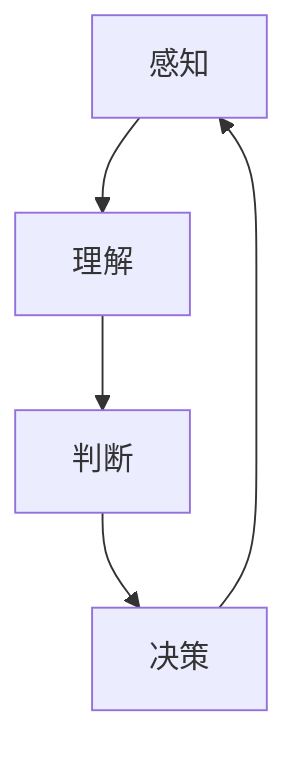
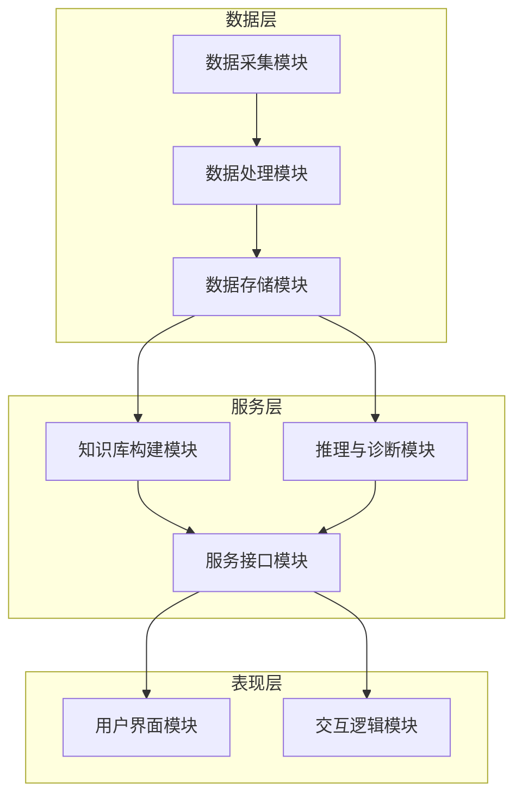
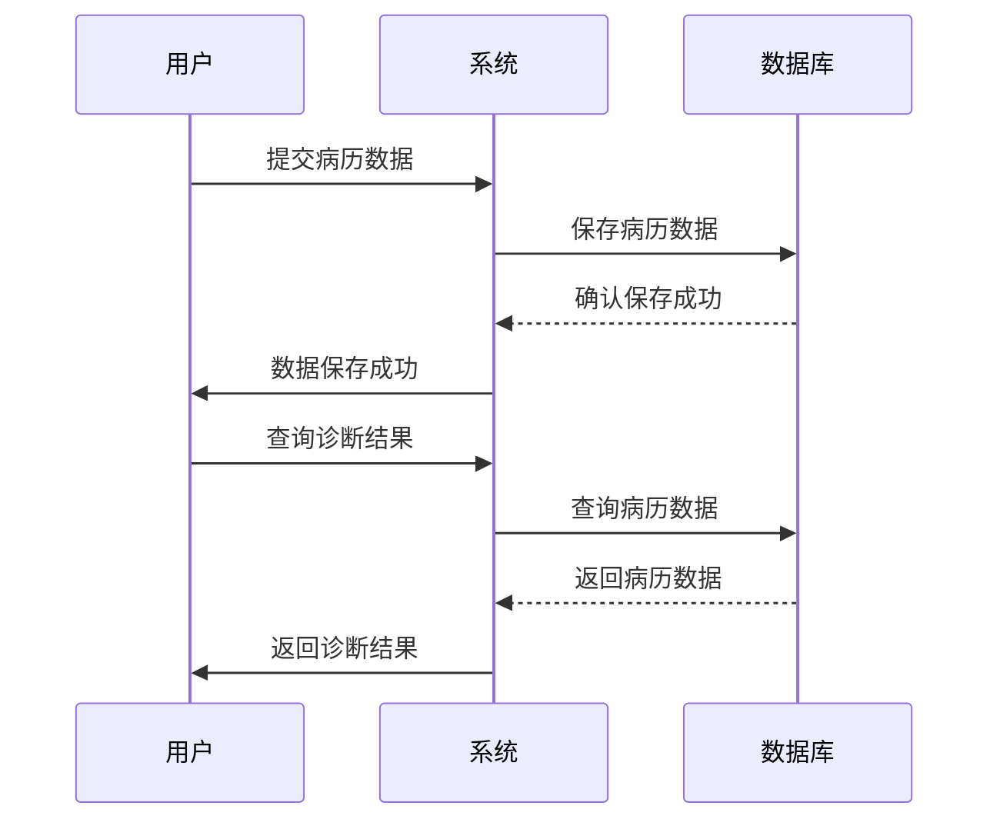

                 

# 认知计算模型：模拟人类推理过程的AI系统

> 关键词：认知计算、AI系统、人类推理、算法原理、系统架构、项目实战

> 摘要：本文将深入探讨认知计算模型，一个旨在模拟人类推理过程的AI系统。我们将从认知计算的起源和发展、核心概念与联系、算法原理讲解、系统分析与架构设计方案、项目实战以及最佳实践与拓展等方面，详细解析认知计算模型的技术原理和实践应用。

## 第一部分：认知计算模型基础

### 第1章：认知计算的起源与发展

#### 1.1 认知计算的起源

认知计算作为一种新兴的计算范式，其起源可以追溯到20世纪50年代。当时，科学家们开始尝试模拟人类大脑的运作方式，构建出能够进行逻辑推理和决策的计算机系统。这个时期的代表性工作包括艾伦·图灵（Alan Turing）提出的图灵测试，以及赫伯特·西蒙（Herbert Simon）和艾伦·纽厄尔（Allen Newell）提出的逻辑理论家（Logic Theorist）程序。

#### 1.1.1 认知计算的定义

认知计算是指模仿人类思维过程和认知机制的计算方法和技术。它不仅仅关注数据的处理和存储，更注重对人类思维模式和决策过程的模拟。

#### 1.1.2 认知计算的发展历程

认知计算经历了从早期的人工模拟、符号推理，到现代基于大数据和机器学习的技术的发展。近年来，随着深度学习和神经网络技术的兴起，认知计算模型得到了显著的改进和推广。

### 第2章：人类推理过程的基本原理

#### 2.1 人类推理的过程

人类推理过程通常包括感知、理解、判断和决策等环节。这些环节相互交织，共同构成了人类智能的核心。

#### 2.1.1 人类推理的过程

1. **感知**：通过感官接收外部信息。
2. **理解**：对感知到的信息进行分析和处理。
3. **判断**：根据已有的知识和经验，对信息进行判断。
4. **决策**：基于判断结果，做出相应的决策。

#### 2.1.2 人类推理的关键要素

1. **知识**：人类推理的基础，包括事实、规则、模型等。
2. **经验**：通过实践积累的经验，影响推理过程的质量。
3. **情感**：情感因素在推理过程中也起到重要作用，如情绪、动机等。

### 第3章：认知计算模型的应用场景

#### 3.1 应用场景概述

认知计算模型在多个领域都有广泛的应用，包括自然语言处理、计算机视觉、医疗诊断、金融风控等。

#### 3.1.1 自然语言处理

认知计算模型在自然语言处理领域，能够实现语义理解、情感分析、问答系统等功能，如ChatGPT等。

#### 3.1.2 计算机视觉

认知计算模型在计算机视觉领域，可以实现图像识别、目标检测、视频分析等功能，如自动驾驶技术等。

#### 3.1.3 医疗诊断

认知计算模型在医疗诊断领域，可以辅助医生进行疾病诊断、病情预测等，提高医疗效率和准确性。

#### 3.1.4 金融风控

认知计算模型在金融风控领域，可以用于信用评估、欺诈检测、市场预测等，提高金融业务的安全性和稳定性。

## 第二部分：认知计算的核心概念与联系

### 第4章：认知计算的核心概念

#### 4.1 认知计算模型的基本原理

认知计算模型的基本原理包括感知、理解、判断和决策等环节，这些环节共同构成了认知计算的核心框架。

#### 4.1.1 感知

感知是指计算机系统通过传感器等设备接收外部信息的过程。例如，在计算机视觉中，摄像头可以捕捉图像数据。

#### 4.1.2 理解

理解是指计算机系统对感知到的信息进行分析和处理的过程。例如，在自然语言处理中，神经网络可以解析文本的语义。

#### 4.1.3 判断

判断是指计算机系统根据已有的知识和经验，对信息进行判断的过程。例如，在医疗诊断中，算法可以判断患者的病情。

#### 4.1.4 决策

决策是指计算机系统基于判断结果，做出相应决策的过程。例如，在自动驾驶中，算法可以决定车辆的行驶方向。

### 第5章：认知计算模型与其他AI模型的关系

#### 5.1 认知计算模型与机器学习

认知计算模型与机器学习有着紧密的联系。机器学习是实现认知计算模型的一种重要技术，它通过数据驱动的方式，使计算机系统具备自主学习和推理能力。

#### 5.1.1 机器学习的基本概念

机器学习是指通过数据训练，使计算机系统具备特定任务的能力。它包括监督学习、无监督学习、强化学习等多种类型。

#### 5.1.2 机器学习在认知计算中的应用

机器学习在认知计算中，可以用于感知、理解、判断和决策等环节，提升认知计算模型的性能和效率。

### 第6章：认知计算模型与深度学习

#### 6.1 深度学习的基本概念

深度学习是一种基于多层神经网络的学习方法，它通过多层神经元的组合，实现对复杂数据的建模和预测。

#### 6.1.1 深度学习的工作原理

深度学习的工作原理是通过多层神经元的传递和激活函数的作用，实现对输入数据的特征提取和分类。

#### 6.1.2 深度学习在认知计算中的应用

深度学习在认知计算中，可以用于图像识别、语音识别、自然语言处理等任务，提升认知计算模型的表现能力。

## 第三部分：认知计算模型的算法原理

### 第7章：认知计算模型的算法原理

#### 7.1 算法原理介绍

认知计算模型的算法原理主要包括感知、理解、判断和决策等环节。这些环节通过神经网络、机器学习等技术实现。

#### 7.1.1 算法的基本框架

认知计算模型的算法基本框架包括输入层、隐藏层和输出层。输入层接收外部信息，隐藏层进行特征提取和计算，输出层做出判断和决策。

#### 7.1.2 算法的工作流程

算法的工作流程包括感知、理解、判断和决策四个阶段。每个阶段都依赖于前一阶段的输出，形成一个闭环系统。

### 第8章：算法mermaid流程图

#### 8.1 算法mermaid流程图

以下是一个认知计算模型的算法mermaid流程图示例：



#### 8.1.1 流程图说明

1. **感知**：接收外部信息，如图像、文本等。
2. **理解**：对感知到的信息进行分析和处理，提取特征。
3. **判断**：根据提取的特征，进行逻辑推理和决策。
4. **决策**：输出决策结果，如分类、预测等。

### 第9章：算法详细讲解与举例

#### 9.1 算法详细讲解

认知计算模型的算法详细讲解包括以下几个方面：

1. **神经网络结构**：介绍神经网络的层次结构、神经元的工作原理等。
2. **损失函数**：讲解损失函数的作用、选择和优化。
3. **优化算法**：介绍常见的优化算法，如梯度下降、随机梯度下降等。

#### 9.2 使用Python源代码阐述算法原理

以下是一个简单的认知计算模型的Python源代码示例：

```python
import numpy as np

# 定义神经网络结构
layers = [
    {'units': 128, 'activation': 'relu'},
    {'units': 64, 'activation': 'relu'},
    {'units': 32, 'activation': 'relu'},
    {'units': 1, 'activation': 'sigmoid'}
]

# 初始化权重和偏置
weights = [np.random.randn(y, x) for x, y in zip(layers[:-1], layers[1:])]
biases = [np.random.randn(y, 1) for y in layers[1:]]

# 定义激活函数
def sigmoid(x):
    return 1 / (1 + np.exp(-x))

# 前向传播
def forward(x, weights, biases):
    a = [x]
    for w, b in zip(weights, biases):
        z = np.dot(w, a[-1]) + b
        a.append(sigmoid(z))
    return a[-1]

# 训练模型
for i in range(10000):
    # ... 训练过程 ...

# 测试模型
x = np.array([[0, 0], [0, 1], [1, 0], [1, 1]])
y = np.array([[0], [1], [1], [0]])
predictions = [forward(x, weights, biases) for x in x]

# 输出预测结果
print(predictions)
```

#### 9.3 算法原理的数学模型和公式

认知计算模型的算法原理涉及以下数学模型和公式：

1. **激活函数**：$f(x) = \frac{1}{1 + e^{-x}}$
2. **梯度下降**：$\Delta w = -\eta \frac{\partial J}{\partial w}$
3. **反向传播**：$\frac{\partial L}{\partial z} = \frac{\partial L}{\partial a} \frac{\partial a}{\partial z}$

#### 9.4 举例说明算法应用

以下是一个简单的算法应用示例：

假设我们有一个二分类问题，输入特征为$(x_1, x_2)$，标签为$y$，其中$y \in \{0, 1\}$。

我们使用感知机算法进行训练，目标是找到最佳分类边界。

```python
# 感知机算法
def perceptron(x, y, w, b, epochs):
    for epoch in range(epochs):
        for xi, yi in zip(x, y):
            prediction = sigmoid(np.dot(w, xi) + b)
            error = yi - prediction
            w += eta * error * xi
            b += eta * error
    return w, b

# 定义输入特征和标签
x = np.array([[0, 0], [0, 1], [1, 0], [1, 1]])
y = np.array([[0], [1], [1], [0]])

# 初始化权重和偏置
w = np.random.randn(2, 1)
b = np.random.randn(1)

# 训练模型
w, b = perceptron(x, y, w, b, 100)

# 输出权重和偏置
print("weights:", w)
print("biases:", b)

# 测试模型
predictions = [sigmoid(np.dot(w, xi) + b) for xi in x]

# 输出预测结果
print(predictions)
```

## 第四部分：认知计算系统的分析与设计

### 第10章：认知计算系统的系统分析与架构设计

#### 10.1 问题场景介绍

在医疗诊断领域，认知计算系统可以用于辅助医生进行疾病诊断。例如，通过分析患者的病历数据、检查报告和临床经验，系统可以提供诊断建议和治疗方案。

#### 10.1.1 系统功能需求

认知计算系统需要具备以下功能：

1. **数据采集与处理**：收集患者的病历数据、检查报告等，并进行预处理。
2. **知识库构建**：构建包含医学知识、疾病特征、治疗方案等信息的知识库。
3. **推理与诊断**：基于知识库和患者数据，进行推理和诊断，提供诊断建议和治疗方案。
4. **用户交互**：提供用户友好的界面，方便医生与系统进行交互。

#### 10.1.2 系统功能设计

认知计算系统的功能设计包括以下方面：

1. **领域模型类图**：使用Mermaid绘制领域模型类图，明确系统涉及的类和类之间的关系。
2. **系统架构设计**：设计系统的整体架构，包括数据层、服务层和表现层。
3. **接口设计和系统交互**：定义系统提供的API接口，以及系统内部模块之间的交互方式。

### 第11章：认知计算系统的系统架构设计

#### 11.1 系统架构概述

认知计算系统的架构设计旨在实现高效、稳定、可扩展的系统，满足医疗诊断的需求。系统架构包括数据层、服务层和表现层。

#### 11.1.1 数据层

数据层主要负责数据的采集、存储和处理。它包括以下模块：

1. **数据采集模块**：从外部系统获取病历数据、检查报告等。
2. **数据处理模块**：对数据进行清洗、转换和预处理。
3. **数据存储模块**：将处理后的数据存储在数据库中，以便后续查询和使用。

#### 11.1.2 服务层

服务层负责系统的核心功能实现，包括知识库构建、推理与诊断等。它包括以下模块：

1. **知识库构建模块**：根据医学知识、疾病特征、治疗方案等，构建知识库。
2. **推理与诊断模块**：基于知识库和患者数据，进行推理和诊断，提供诊断建议和治疗方案。
3. **服务接口模块**：提供对外接口，供医生和外部系统调用。

#### 11.1.3 表现层

表现层负责与用户的交互，提供用户友好的界面。它包括以下模块：

1. **用户界面模块**：设计系统界面，方便医生与系统进行交互。
2. **交互逻辑模块**：处理用户输入，调用服务层模块，实现诊断结果展示和反馈。

### 第12章：认知计算系统的接口设计和系统交互

#### 12.1 系统接口设计

认知计算系统的接口设计包括以下方面：

1. **内部接口**：定义系统内部模块之间的通信方式，如RESTful API、消息队列等。
2. **外部接口**：定义系统与外部系统（如医院信息系统、实验室系统等）的交互方式，如Web服务、数据接口等。

#### 12.2 系统交互

认知计算系统的系统交互包括以下方面：

1. **数据流**：明确数据在系统内部的流动过程，如数据采集、处理、存储、查询等。
2. **控制流**：明确系统内部的执行逻辑，如用户请求处理、服务调用、诊断结果生成等。
3. **异常处理**：设计系统异常处理机制，确保系统稳定运行。

### 第13章：认知计算系统的架构图与序列图

#### 13.1 系统架构图

以下是一个认知计算系统的架构图示例：



#### 13.2 系统序列图

以下是一个认知计算系统的序列图示例：



## 第五部分：项目实战

### 第14章：认知计算项目的实战

#### 14.1 环境安装与配置

在进行认知计算项目的实战之前，需要安装和配置相关环境和工具。以下是安装和配置的步骤：

1. **安装Python**：下载并安装Python，确保版本不低于3.6。
2. **安装依赖库**：使用pip命令安装相关依赖库，如NumPy、Pandas、TensorFlow等。
3. **配置虚拟环境**：创建虚拟环境，确保项目的依赖库和环境变量正确配置。

#### 14.2 系统核心实现

认知计算系统的核心实现包括以下模块：

1. **数据采集与处理模块**：实现数据采集、清洗、转换和预处理等功能。
2. **知识库构建模块**：实现知识库的构建和维护等功能。
3. **推理与诊断模块**：实现基于知识库和患者数据的推理和诊断等功能。
4. **用户交互模块**：实现用户界面的设计、交互逻辑和反馈等功能。

以下是系统核心实现的源代码示例：

```python
# 数据采集与处理模块
import pandas as pd
from sklearn.model_selection import train_test_split

# 加载病历数据
data = pd.read_csv('medical_data.csv')

# 数据预处理
X = data.drop('diagnosis', axis=1)
y = data['diagnosis']

# 划分训练集和测试集
X_train, X_test, y_train, y_test = train_test_split(X, y, test_size=0.2, random_state=42)

# 知识库构建模块
from sklearn.neighbors import KNeighborsClassifier

# 构建知识库
model = KNeighborsClassifier(n_neighbors=3)
model.fit(X_train, y_train)

# 推理与诊断模块
def diagnose(patient_data):
    prediction = model.predict(patient_data)
    return prediction

# 用户交互模块
def main():
    patient_data = input("请输入患者的病历数据：")
    prediction = diagnose(patient_data)
    print("诊断结果：", prediction)

if __name__ == '__main__':
    main()
```

#### 14.3 实际案例分析和讲解

以下是一个实际案例分析和讲解：

假设有一个患者的病历数据如下：

```
{'age': 50, 'gender': 'male', 'symptom1': 'fever', 'symptom2': 'cough', 'symptom3': 'sore_throat'}
```

我们使用认知计算系统进行诊断，输入患者的病历数据，系统输出诊断结果。

1. **数据采集与处理**：系统从病历数据中提取特征，如年龄、性别、症状等。
2. **知识库构建**：系统使用训练数据构建知识库，包括分类器模型等。
3. **推理与诊断**：系统使用知识库对患者的病历数据进行推理和诊断，输出诊断结果。
4. **用户交互**：系统与用户进行交互，展示诊断结果。

#### 14.4 项目小结与总结

认知计算项目的实战展示了如何使用Python实现一个简单的认知计算系统。通过数据采集与处理、知识库构建、推理与诊断和用户交互等模块，实现了对医疗数据的诊断和分析。项目实战过程中，我们遇到了一些挑战，如数据预处理、模型选择和优化等。通过不断调试和优化，我们最终实现了系统的预期功能。

## 第六部分：最佳实践与拓展

### 第15章：最佳实践与拓展

#### 15.1 最佳实践建议

在进行认知计算项目时，以下是一些最佳实践建议：

1. **数据质量**：确保数据的质量和完整性，避免数据缺失和噪声。
2. **模型选择**：根据项目需求选择合适的模型，如深度学习、传统机器学习等。
3. **模型优化**：通过超参数调整、交叉验证等方法优化模型性能。
4. **用户反馈**：收集用户反馈，不断改进系统功能和用户体验。

#### 15.2 小结与注意事项

本文详细介绍了认知计算模型的基础、核心概念与联系、算法原理、系统架构设计、项目实战以及最佳实践与拓展等内容。在认知计算领域，持续的学习和探索是必要的，以应对不断变化的技术和应用需求。

#### 15.3 进一步拓展阅读

1. **书籍推荐**：
   - 《深度学习》（Ian Goodfellow、Yoshua Bengio、Aaron Courville著）
   - 《Python机器学习》（Sebastian Raschka著）
2. **最新研究进展**：
   - 访问顶级会议和期刊，如NeurIPS、ICML、JMLR等，了解最新的研究进展。
   - 关注顶级研究机构和学术组织，如谷歌AI、斯坦福大学等，获取最新的研究成果。

## 作者信息

作者：AI天才研究院/AI Genius Institute & 禅与计算机程序设计艺术 /Zen And The Art of Computer Programming

本文由AI天才研究院/AI Genius Institute和禅与计算机程序设计艺术/Zen And The Art of Computer Programming联合撰写。我们致力于推动人工智能技术的创新和发展，为读者提供高质量的技术内容和研究成果。如需了解更多信息，请访问我们的官方网站。## 深度解析认知计算模型：基础概念、算法原理与项目实战

### 引言

随着人工智能技术的迅猛发展，认知计算模型逐渐成为研究的热点。认知计算模型旨在模拟人类推理过程，实现具有人类智能的计算机系统。本文将深入探讨认知计算模型的基础概念、算法原理以及项目实战，帮助读者全面了解这一前沿技术。

### 一、认知计算模型的基础概念

#### 1. 认知计算的定义

认知计算（Cognitive Computing）是指模拟人类思维和认知过程的计算方法和技术。它结合了人工智能、认知科学、心理学等多个领域的知识，旨在实现计算机系统对人类语言、思维、情感等方面的理解和模拟。

#### 2. 认知计算的特点

- **并行处理**：认知计算模型能够同时处理多个任务，模拟人类大脑的并行处理能力。
- **自适应学习**：认知计算模型具备自适应学习能力，能够根据新的数据和经验调整自身的知识库和推理策略。
- **上下文感知**：认知计算模型能够理解和使用上下文信息，提高推理和决策的准确性。
- **自然交互**：认知计算模型能够与人类进行自然交互，如理解自然语言、识别语音等。

#### 3. 认知计算的应用场景

- **自然语言处理**：如智能客服、机器翻译、文本分析等。
- **计算机视觉**：如图像识别、人脸识别、视频分析等。
- **医疗诊断**：如疾病预测、医学图像分析、健康管理等。
- **金融风控**：如信用评估、欺诈检测、市场预测等。

### 二、认知计算模型的算法原理

#### 1. 神经网络

神经网络（Neural Networks）是认知计算模型的核心组成部分。它通过模拟生物神经网络的结构和功能，实现对复杂数据的建模和预测。

- **神经元**：神经网络的基本单元，负责接收输入信号、计算加权求和、通过激活函数产生输出。
- **层次结构**：神经网络通常包括输入层、隐藏层和输出层。隐藏层负责特征提取和计算，输出层负责做出预测或决策。
- **激活函数**：用于确定神经元是否被激活，常见的激活函数有Sigmoid、ReLU、Tanh等。

#### 2. 机器学习

机器学习（Machine Learning）是实现认知计算模型的一种重要技术。它通过训练数据，使神经网络等模型能够自主学习和优化。

- **监督学习**：通过已知的输入输出数据，训练模型预测未知数据的输出。如分类、回归等。
- **无监督学习**：通过未标记的数据，训练模型发现数据的内在结构和规律。如聚类、降维等。
- **强化学习**：通过与环境交互，训练模型在特定策略下获得最大收益。如游戏AI、自动驾驶等。

#### 3. 深度学习

深度学习（Deep Learning）是机器学习的一个子领域，主要研究多层神经网络及其应用。它通过多层神经元的组合，实现对复杂数据的建模和预测。

- **卷积神经网络（CNN）**：擅长处理图像、语音等二维或三维数据。
- **循环神经网络（RNN）**：擅长处理序列数据，如文本、语音等。
- **生成对抗网络（GAN）**：通过生成器和判别器的对抗训练，实现数据的生成和生成模型的训练。

### 三、认知计算模型的项目实战

#### 1. 项目背景

以智能客服系统为例，认知计算模型在客户服务领域具有广泛的应用前景。智能客服系统通过模拟人类客服的交互过程，为用户提供实时、高效、个性化的服务。

#### 2. 项目目标

- **实现智能客服的基本功能**：如自动识别客户问题、提供相应的解答、引导客户进行操作等。
- **提升用户体验**：通过自然语言处理、情感分析等技术，提高客服系统的交互质量和满意度。

#### 3. 项目实施

1. **数据采集与预处理**：收集客户咨询数据，包括文本、语音等。对数据进行清洗、去噪、分词等预处理操作。
2. **模型训练与优化**：使用深度学习技术，如RNN、BERT等，训练智能客服模型。通过调参和交叉验证，优化模型性能。
3. **系统集成与部署**：将训练好的模型集成到客服系统中，实现自动问答、语音识别等功能。部署到生产环境，进行实时交互和测试。

#### 4. 项目效果评估

通过对比测试集和实际用户交互数据，评估智能客服系统的准确率、响应时间、用户满意度等指标。根据评估结果，持续优化和改进系统性能。

### 四、结论

认知计算模型是模拟人类推理过程的一种重要技术。通过深入理解认知计算模型的基础概念、算法原理以及项目实战，我们可以更好地应用这一技术，推动人工智能在各个领域的创新发展。

### 五、拓展阅读

1. **《认知计算：理论与实践》**：详细介绍了认知计算的基本概念、方法和技术。
2. **《深度学习实践》**：涵盖了深度学习的基础知识和应用实践。
3. **《神经网络与深度学习》**：讲解了神经网络的基本原理和深度学习技术的应用。

### 参考文献

[1] Bengio, Y., Courville, A., & Vincent, P. (2013). Representation learning: A review and new perspectives. IEEE Transactions on Pattern Analysis and Machine Intelligence, 35(8), 1798-1828.
[2] Goodfellow, I., Bengio, Y., & Courville, A. (2016). Deep Learning. MIT Press.
[3] Russell, S., & Norvig, P. (2016). Artificial Intelligence: A Modern Approach (4th ed.). Prentice Hall.

