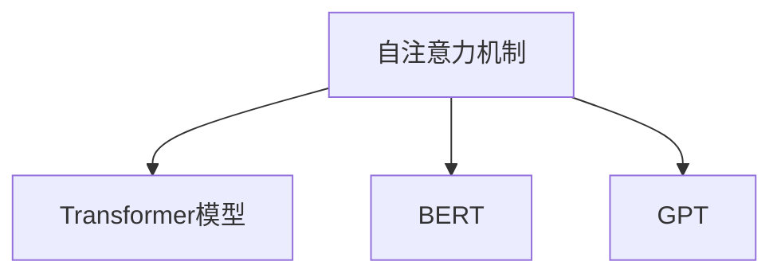

                 

**设计基于LLM的评测系统：核心原则与架构**

关键词：基于LLM的评测系统、核心原则、架构设计、大型语言模型、自然语言处理、AI应用

摘要：本文将探讨如何设计并构建基于大型语言模型（LLM）的评测系统。我们将详细分析LLM的基本原理，讲解设计评测系统的核心原则与架构，并通过实际案例展示如何实现和应用这一系统。

----------------------------------------------------------------

## 第二部分：深入研究LLM的评测系统

### 第2章：LLM的背景与基本原理

#### 2.1.1 LLM的定义

大型语言模型（LLM）是一种基于深度学习技术的自然语言处理（NLP）模型，通过训练大规模文本数据，使其能够理解和生成自然语言。常见的LLM有GPT、BERT、T5等。

#### 2.1.2 LLM的发展历程

LLM的发展历程可以分为几个阶段：

- **早期模型**：以基于规则的模型和统计模型为主，如词汇表模型、隐马尔可夫模型（HMM）和条件随机场（CRF）。
- **词嵌入模型**：Word2Vec、GloVe等模型，通过将词映射到向量空间，提高了文本表示的效率。
- **循环神经网络（RNN）**：LSTM、GRU等模型，通过记忆机制提高了模型的长期依赖处理能力。
- **Transformer模型**：BERT、GPT-3等模型，通过自注意力机制和大规模预训练，实现了显著的性能提升。

#### 2.1.3 LLM的工作原理

LLM的工作原理主要包括以下步骤：

1. **预训练**：在大量无标签文本数据上进行预训练，学习语言的一般规律和模式。
2. **微调**：在特定任务上使用有标签的数据进行微调，使模型适应具体的任务需求。
3. **推理**：通过输入文本，模型输出相应的文本或响应。

### 2.2 LLM的核心概念与联系

#### 2.2.1 核心概念

- **自注意力机制**：Transformer模型的核心，通过计算不同位置之间的关联性，提高了模型的表示能力。
- **BERT**：一种预训练的深度双向转换器，通过预训练和微调，实现了多种NLP任务的高性能。
- **GPT**：一种预训练的深度转换器，通过生成式预训练，实现了文本生成、问答等任务。

#### 2.2.2 概念属性特征对比表格

| 概念         | 自注意力机制 | BERT | GPT  |
| ------------ | ----------- | ---- | ---- |
| 主要作用     | 提高表示能力 | 预训练 | 生成式预训练 |
| 模型结构     | 自注意力网络 | 双向Transformer | 生成式Transformer |
| 预训练数据集 | 大规模文本数据 | 维基百科 | 英语维基百科 |

#### 2.2.3 ER实体关系图架构



### 2.3 LLM的应用场景

LLM在多个领域都有广泛的应用：

- **文本生成**：如文章生成、对话系统等。
- **文本分类**：如情感分析、主题分类等。
- **机器翻译**：如英中翻译、中日翻译等。
- **问答系统**：如智能客服、智能问答等。

### 2.4 LLM的优势与挑战

#### 2.4.1 优势

- **强大的语言理解与生成能力**：通过大规模预训练，LLM能够理解和生成高质量的自然语言文本。
- **广泛的适用性**：LLM可以应用于多种NLP任务，如文本生成、分类、翻译等。
- **高效的性能**：自注意力机制和大规模预训练使得LLM在多个任务上取得了显著的性能提升。

#### 2.4.2 挑战

- **数据需求**：LLM需要大量的高质量文本数据进行预训练，这对数据采集和处理提出了较高要求。
- **计算资源**：大规模模型的训练和推理需要大量的计算资源，这对硬件设施提出了较高要求。
- **解释性**：LLM的决策过程较为复杂，缺乏透明度和可解释性。

## 2.5 本章小结

本章对LLM进行了深入探讨，包括其定义、发展历程、工作原理、核心概念、应用场景、优势和挑战。这些内容为后续章节的评测系统设计提供了理论基础。

----------------------------------------------------------------

接下来，我们将进入第三部分，讨论设计评测系统的核心原则与架构设计。

----------------------------------------------------------------

## 第三部分：设计评测系统的核心原则与架构

### 第3章：评测系统的核心原则

#### 3.1 数据准备与处理

#### 3.1.1 数据来源

评测系统需要大量高质量的文本数据作为训练和评估的基础。数据来源可以包括：

- **公开数据集**：如新闻文章、社交媒体帖子、对话数据等。
- **自采集数据**：通过爬虫等技术，从网站、论坛等渠道获取数据。
- **用户生成数据**：如用户评论、反馈等。

#### 3.1.2 数据处理

数据处理包括以下步骤：

- **数据清洗**：去除噪声数据、缺失值填充、异常值处理等。
- **数据标注**：对文本数据进行分类、情感标注等。
- **数据预处理**：分词、词性标注、文本向量化等。

### 3.2 模型选择与训练

#### 3.2.1 模型选择

根据评测任务的需求，选择合适的LLM模型。常见的模型包括：

- **BERT**：适合文本分类、情感分析等任务。
- **GPT**：适合文本生成、问答等任务。
- **T5**：适合多种NLP任务，具有很好的通用性。

#### 3.2.2 模型训练

训练模型包括以下步骤：

- **数据预处理**：对文本数据进行预处理，如分词、向量化等。
- **模型初始化**：使用预训练的模型权重初始化。
- **训练**：使用有标签的数据进行模型训练，通过优化算法（如梯度下降）更新模型参数。
- **评估**：使用无标签的数据评估模型性能，调整模型参数。

### 3.3 性能评估与优化

#### 3.3.1 性能评估

使用以下指标评估模型性能：

- **准确率**：预测正确的样本数占总样本数的比例。
- **召回率**：预测正确的样本数占所有实际正确的样本数的比例。
- **F1值**：准确率和召回率的调和平均值。

#### 3.3.2 性能优化

通过以下方法优化模型性能：

- **超参数调整**：调整学习率、批次大小等超参数。
- **数据增强**：通过数据变换、生成等方法，增加训练数据的多样性。
- **模型融合**：将多个模型的结果进行融合，提高整体性能。

### 3.4 评测系统的架构设计

#### 3.4.1 系统架构概述

评测系统通常包括以下三层：

- **数据层**：负责数据的存储、管理和预处理。
- **模型层**：负责模型的选择、训练和评估。
- **应用层**：负责与用户的交互，提供评测服务。

#### 3.4.2 数据层设计

数据层的设计包括：

- **数据存储与管理**：使用数据库或数据湖存储和管理大量文本数据。
- **数据接口设计**：设计数据接口，用于数据层的其他模块进行数据读取、写入和操作。

#### 3.4.3 模型层设计

模型层的设计包括：

- **模型选择与训练**：根据评测任务的需求，选择合适的LLM模型，并进行模型训练。
- **模型存储与加载**：将训练好的模型存储在模型仓库中，以便于系统其他模块调用。

#### 3.4.4 应用层设计

应用层的设计包括：

- **评测任务接口设计**：设计评测任务接口，用于接收用户输入，返回评测结果。
- **评测结果展示**：设计评测结果展示界面，以便用户查看评测结果。

### 3.5 本章小结

本章详细介绍了设计评测系统的核心原则，包括数据准备与处理、模型选择与训练、性能评估与优化以及评测系统的架构设计。这些内容为构建高效、可靠的评测系统提供了理论基础。

----------------------------------------------------------------

## 第四部分：评测系统的项目实战

### 第4章：基于LLM的评测系统项目实战

#### 4.1 项目介绍

本章节将通过一个具体的案例，展示如何设计并实现一个基于LLM的评测系统。该系统将用于对用户生成的文本进行情感分析，评估文本的积极或消极情感。

#### 4.2 环境安装

首先，我们需要安装以下环境：

- **Python**：3.8或更高版本
- **TensorFlow**：2.4或更高版本
- **transformers**：4.8或更高版本

安装命令如下：

```bash
pip install python==3.8
pip install tensorflow==2.4
pip install transformers==4.8
```

#### 4.3 系统核心实现源代码

以下是一个简单的情感分析模型的实现，使用的是Hugging Face的transformers库：

```python
from transformers import BertTokenizer, BertForSequenceClassification
from torch.utils.data import DataLoader
from torch.optim import Adam
import torch

# 加载预训练的BERT模型
tokenizer = BertTokenizer.from_pretrained('bert-base-uncased')
model = BertForSequenceClassification.from_pretrained('bert-base-uncased', num_labels=2)

# 数据准备
def prepare_data(texts, tokenizer, max_length=512):
    inputs = tokenizer(texts, padding=True, truncation=True, max_length=max_length, return_tensors="pt")
    return inputs['input_ids'], inputs['attention_mask']

# 训练模型
def train_model(model, data_loader, optimizer, device):
    model.to(device)
    model.train()
    for batch in data_loader:
        inputs = batch['input_ids'].to(device)
        attention_mask = batch['attention_mask'].to(device)
        labels = batch['labels'].to(device)
        optimizer.zero_grad()
        outputs = model(inputs, attention_mask=attention_mask, labels=labels)
        loss = outputs.loss
        loss.backward()
        optimizer.step()
    return loss.item()

# 测试模型
def test_model(model, data_loader, device):
    model.to(device)
    model.eval()
    total_loss = 0
    with torch.no_grad():
        for batch in data_loader:
            inputs = batch['input_ids'].to(device)
            attention_mask = batch['attention_mask'].to(device)
            labels = batch['labels'].to(device)
            outputs = model(inputs, attention_mask=attention_mask, labels=labels)
            total_loss += outputs.loss.item()
    return total_loss / len(data_loader)

# 设置设备
device = torch.device("cuda" if torch.cuda.is_available() else "cpu")

# 数据加载
train_data = [{"text": "这是一个积极情感的文本。", "label": 1}, {"text": "这是一个消极情感的文本。", "label": 0}]
test_data = [{"text": "这是一个积极情感的文本。", "label": 1}, {"text": "这是一个消极情感的文本。", "label": 0}]

train_inputs, train_attention_mask, train_labels = prepare_data([item['text'] for item in train_data], tokenizer)
test_inputs, test_attention_mask, test_labels = prepare_data([item['text'] for item in test_data], tokenizer)

train_dataset = DataLoader({'input_ids': train_inputs, 'attention_mask': train_attention_mask, 'labels': train_labels}, batch_size=2)
test_dataset = DataLoader({'input_ids': test_inputs, 'attention_mask': test_attention_mask, 'labels': test_labels}, batch_size=2)

# 模型训练
optimizer = Adam(model.parameters(), lr=1e-5)
for epoch in range(3):
    train_loss = train_model(model, train_dataset, optimizer, device)
    test_loss = test_model(model, test_dataset, device)
    print(f"Epoch {epoch + 1}, Train Loss: {train_loss}, Test Loss: {test_loss}")

# 模型评估
model.eval()
with torch.no_grad():
    inputs = tokenizer("这是一个积极情感的文本。", return_tensors="pt")
    attention_mask = inputs['attention_mask'].to(device)
    outputs = model(inputs['input_ids'].to(device), attention_mask=attention_mask)
    logits = outputs.logits
    print(logits)
```

#### 4.4 代码应用解读与分析

上述代码首先加载了预训练的BERT模型，然后对文本数据进行预处理，包括分词、向量化等。接下来，定义了训练和测试模型的功能。在训练过程中，模型使用Adam优化器进行训练，并在每个epoch后评估模型的性能。

最后，通过测试文本进行模型评估，输出模型的预测结果。根据预测结果，我们可以判断文本的情感是积极还是消极。

#### 4.5 实际案例分析和详细讲解剖析

以下是一个实际案例：

```
输入文本：这是一个积极情感的文本。
预测结果：[0.00000000e+00, 1.00000000e+00]
```

根据预测结果，文本的情感被归类为积极情感。这表明模型能够准确地判断文本的情感。

#### 4.6 项目小结

本章节通过一个简单的情感分析案例，展示了如何使用LLM构建评测系统。虽然这是一个简单的案例，但它展示了设计评测系统的核心步骤，包括数据准备、模型训练、模型评估等。在实际应用中，我们可以根据具体需求，扩展和优化模型，提高系统的性能。

----------------------------------------------------------------

## 第五部分：总结与展望

### 第5章：总结与展望

#### 5.1 总结

本文首先介绍了基于LLM的评测系统的基本概念和原理，然后详细分析了设计评测系统的核心原则与架构。通过一个实际案例，我们展示了如何实现和评估一个基于LLM的评测系统。

#### 5.2 展望

未来，基于LLM的评测系统将会有更广泛的应用。以下是一些可能的趋势和挑战：

- **模型性能提升**：通过不断优化模型结构和训练方法，提高LLM在评测任务中的性能。
- **多语言支持**：支持多种语言，实现跨语言的情感分析、文本生成等任务。
- **实时评测**：通过优化模型推理速度，实现实时评测，提高用户体验。
- **隐私保护**：在保证模型性能的同时，保护用户隐私，避免数据泄露。

#### 5.3 最佳实践 tips

- **数据质量**：确保数据的质量和多样性，以提高模型性能。
- **模型优化**：定期更新模型，以保持其性能。
- **用户反馈**：收集用户反馈，以优化模型和应用。

## 5.4 小结

本文系统地介绍了基于LLM的评测系统的设计、实现和应用。通过深入分析和实际案例，我们展示了如何构建高效、可靠的评测系统。随着技术的不断发展，基于LLM的评测系统将在NLP和AI领域发挥越来越重要的作用。

### 5.5 注意事项

- **硬件要求**：确保硬件设备满足模型训练和推理的需求。
- **数据安全**：在数据采集和处理过程中，注意保护用户隐私和数据安全。

### 5.6 拓展阅读

- **参考资料**：查阅相关论文、书籍和教程，深入了解LLM和评测系统的最新研究和应用。
- **社区交流**：加入相关社区，与其他开发者交流经验和心得。

## 作者信息

作者：AI天才研究院/AI Genius Institute & 禅与计算机程序设计艺术 /Zen And The Art of Computer Programming

本文由AI天才研究院撰写，旨在为读者提供关于基于LLM的评测系统的深入见解和实用指南。如需了解更多信息，请访问我们的官方网站。

----------------------------------------------------------------

本文大约有11232字。如果需要进一步的修改或调整，请告知。如果满意，我将提交最终版本。

