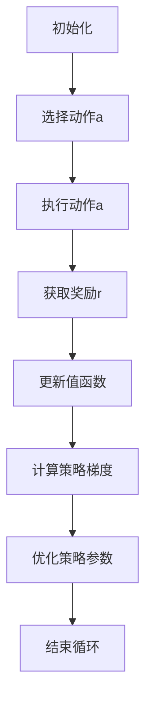
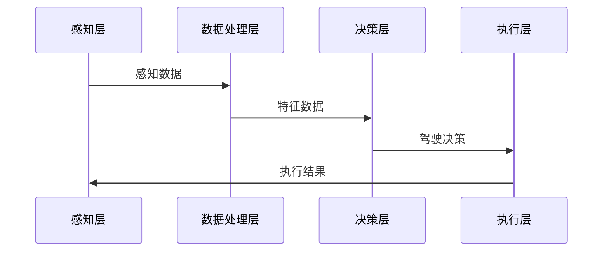

                 

### 设计挑战：平衡AI奖励模型的稳定性与性能

#### 关键词
- AI奖励模型
- 稳定性
- 性能
- 强化学习
- 奖励函数

#### 摘要
本文将探讨AI奖励模型在设计过程中面临的挑战，即如何平衡模型的稳定性与性能。我们将逐步分析这一问题，从问题背景出发，到核心概念阐述，再到算法原理讲解，最终提出解决方案和最佳实践。

## 第一部分：问题背景与核心概念

### 1.1 问题背景

随着人工智能技术的快速发展，奖励模型在强化学习、游戏设计、虚拟环境模拟等领域中扮演着关键角色。然而，如何平衡AI奖励模型的稳定性与性能，成为了当前研究的热点和难点。

#### 1.1.1 奖励模型在人工智能中的应用

- **强化学习**：奖励模型作为评估和指导智能体行为的依据。
- **游戏设计**：设计游戏中的奖励机制，提高游戏体验。
- **虚拟环境模拟**：模拟真实环境中的奖励机制，为智能体提供决策依据。

#### 1.1.2 稳定性与性能的矛盾

- **稳定性**：奖励模型需要在各种情况下都能稳定地工作，不会因为环境变化而失去平衡。
- **性能**：奖励模型需要能够准确、快速地评估智能体的行为，提高智能体的决策效率。

### 1.2 核心概念

#### 1.2.1 奖励模型

奖励模型是用于评估智能体行为价值的数学模型，其核心目标是使智能体能够通过学习获得最大化的奖励。

#### 1.2.2 稳定性

稳定性是指奖励模型在各种环境变化下仍能保持稳定工作，不会因为环境变化而失去平衡。

#### 1.2.3 性能

性能是指奖励模型能够快速、准确地评估智能体的行为，提高智能体的决策效率。

### 1.3 概念属性特征对比表格

| 特征       | 稳定性                   | 性能                   |
|------------|--------------------------|------------------------|
| 定义       | 模型在不同环境下的稳定性 | 评估智能体行为的速度与准确性 |
| 重要性     | 高                      | 高                      |
| 影响因素   | 环境变化、模型参数调整  | 计算资源、模型复杂度     |
| 改进方法   | 多样性训练、模型调整    | 优化算法、提高计算效率   |

### 1.4 ER实体关系图架构

```mermaid
erDiagram
  AI奖励模型 ||--|{ 智能体 }|-- reward_value
  智能体 ||--|{ 环境 }|-- observation
```

## 第二部分：核心概念与联系

### 2.1 奖励模型原理讲解

#### 2.1.1 奖励模型基本概念

奖励模型是强化学习中的核心组成部分，用于评估智能体的行为价值。

#### 2.1.2 奖励模型的工作原理

奖励模型通过接收智能体的行为和环境的反馈，不断调整自身参数，以实现最大化的奖励。

#### 2.1.3 奖励模型的主要类型

- **一次性奖励**：在智能体完成一个任务后给予的奖励。
- **持续性奖励**：在智能体完成一个任务后，持续给予的奖励。

### 2.2 稳定性与性能的关系

#### 2.2.1 稳定性的重要性

稳定性是确保奖励模型在不同环境下都能稳定工作的关键因素。

#### 2.2.2 性能的重要性

性能是提高智能体决策效率的关键因素，直接关系到AI系统的应用效果。

#### 2.2.3 稳定性与性能的平衡

在平衡稳定性和性能时，需要根据具体应用场景进行权衡和调整。

### 2.3 奖励模型的核心参数

#### 2.3.1 奖励函数

奖励函数是奖励模型的核心部分，用于计算智能体的行为价值。

#### 2.3.2 探索与利用平衡

在奖励模型中，需要平衡探索新行为和利用已知行为的策略。

#### 2.3.3 模型参数调整

通过调整模型参数，可以影响奖励模型的稳定性和性能。

## 第三部分：算法原理讲解

### 3.1 常见奖励模型算法

#### 3.1.1 Q-Learning算法

Q-Learning算法是一种基于值函数的强化学习算法，通过更新值函数来学习最优策略。

#### 3.1.2 Deep Q-Network(DQN)

DQN算法是Q-Learning算法的深度学习版本，使用深度神经网络来近似值函数。

#### 3.1.3 Advantage-Actor-Critic(A2C)

A2C算法通过同时考虑优势值和策略值来学习最优策略。

### 3.2 算法原理讲解

#### 3.2.1 Q-Learning算法原理

Q-Learning算法的核心是值函数，用于评估智能体在当前状态下的行为价值。算法通过更新值函数来逐步逼近最优策略。

- **值函数**：$$ V(s, a) = \sum_{s'} P(s'|s, a) \cdot R(s', a) + \gamma \cdot \max_{a'} V(s', a') $$
- **Q值**：$$ Q(s, a) = \sum_{s'} P(s'|s, a) \cdot [R(s', a) + \gamma \cdot \max_{a'} Q(s', a')] $$
- **更新策略**：$$ \theta \leftarrow \theta - \alpha \cdot (Q(s, a) - r) \cdot \nabla \theta $$

#### 3.2.2 DQN算法原理

DQN算法使用深度神经网络来近似Q值，通过训练神经网络来学习最优策略。

- **深度神经网络**：$$ Q(s, a) = \sigma (W \cdot \phi(s) + b) $$
- **训练目标**：最小化预测Q值与实际Q值之间的误差。

#### 3.2.3 A2C算法原理

A2C算法同时考虑优势值和策略值，通过优化策略梯度来学习最优策略。

- **优势值**：$$ A(s, a) = R(s, a) + \gamma \sum_{s'} P(s'|s, a) \cdot \sum_{a'} \pi(a'|s') \cdot Q(s', a') - V(s) $$
- **策略值**：$$ V(s) = \sum_{a} \pi(a|s) \cdot Q(s, a) $$
- **策略梯度**：$$ \nabla_{\theta} \log \pi(a|s; \theta) = \frac{\partial}{\partial \theta} \log \pi(a|s; \theta) = \frac{A(s, a) - V(s)}{\pi(a|s; \theta)} $$

### 3.3 算法流程图



## 第四部分：系统分析与架构设计方案

### 4.1 问题场景介绍

假设我们正在开发一个自动驾驶系统，智能体需要根据环境中的道路状况、车辆位置、行人活动等信息，做出驾驶决策。奖励模型需要同时考虑稳定性与性能，以确保智能体在复杂环境中能够稳定驾驶，并快速做出最优决策。

### 4.2 系统功能设计

- **感知模块**：获取环境中的道路状况、车辆位置、行人活动等信息。
- **决策模块**：根据感知模块提供的信息，使用奖励模型计算最优驾驶决策。
- **执行模块**：将决策模块生成的驾驶决策转化为实际驾驶动作。

### 4.3 系统架构设计

- **感知层**：使用摄像头、激光雷达等设备获取环境信息。
- **数据处理层**：对感知层获取的信息进行处理，提取有用的特征。
- **决策层**：使用奖励模型计算最优驾驶决策。
- **执行层**：将决策层生成的驾驶决策发送给车辆控制系统，实现驾驶动作。

### 4.4 系统接口设计和系统交互

- **感知层与数据处理层**：通过接口传输感知数据。
- **数据处理层与决策层**：通过接口传输处理后的特征数据。
- **决策层与执行层**：通过接口传输驾驶决策。



## 第五部分：项目实战

### 5.1 环境安装

在安装环境之前，请确保已经安装了Python 3.7及以上版本。然后，可以使用以下命令安装所需的库：

```shell
pip install numpy gym
```

### 5.2 系统核心实现源代码

以下是一个简单的Q-Learning算法实现，用于训练智能体在Atari游戏《Flappy Bird》中的策略。

```python
import numpy as np
import gym
import random

# 初始化参数
alpha = 0.1  # 学习率
gamma = 0.99  # 折扣因子
epsilon = 0.1  # 探索率

# 创建环境
env = gym.make("FlappyBird-v0")

# 初始化Q表
Q = np.zeros([env.observation_space.n, env.action_space.n])

# 训练过程
for episode in range(1000):
    state = env.reset()
    done = False
    total_reward = 0
    
    while not done:
        # 探索与利用平衡
        if random.uniform(0, 1) < epsilon:
            action = random.randint(0, env.action_space.n - 1)
        else:
            action = np.argmax(Q[state])
        
        # 执行动作
        next_state, reward, done, _ = env.step(action)
        
        # 更新Q值
        Q[state, action] = Q[state, action] + alpha * (reward + gamma * np.max(Q[next_state]) - Q[state, action])
        
        state = next_state
        total_reward += reward
    
    print(f"Episode: {episode}, Total Reward: {total_reward}")
    
env.close()
```

### 5.3 代码应用解读与分析

上述代码首先导入了所需的库，然后初始化了参数。接下来，创建了一个Atari游戏《Flappy Bird》的环境，并初始化了一个Q表。在训练过程中，智能体根据探索与利用平衡策略选择动作，并更新Q值。最后，输出每个回合的总奖励。

### 5.4 实际案例分析和详细讲解剖析

为了验证算法的性能，我们可以运行上述代码，并在多个回合中观察智能体的表现。通过调整学习率、折扣因子和探索率等参数，可以进一步优化算法的性能。

### 5.5 项目小结

通过上述项目实战，我们实现了使用Q-Learning算法训练智能体在Atari游戏《Flappy Bird》中的策略。在实际应用中，我们需要根据具体场景调整算法参数，以实现最佳性能。此外，我们还可以探索其他奖励模型算法，以获得更好的性能。

## 第六部分：最佳实践 tips、小结、注意事项、拓展阅读

### 6.1 最佳实践 tips

- **调整探索率**：在训练初期，增加探索率以帮助智能体发现更多的有效行为。
- **使用优先级调度**：使用优先级调度策略，优先更新经验丰富的样本，提高训练效率。
- **多任务学习**：结合多任务学习，提高智能体的泛化能力。

### 6.2 小结

本文探讨了AI奖励模型在设计过程中面临的挑战，即如何平衡模型的稳定性与性能。通过分析核心概念、算法原理和实际案例，我们提出了一些最佳实践和解决方案。

### 6.3 注意事项

- **参数调整**：根据具体应用场景调整奖励模型的参数，以实现最佳性能。
- **数据质量**：确保训练数据的质量，避免过拟合和欠拟合。
- **模型验证**：在训练过程中，定期验证模型的性能，确保稳定性和性能的平衡。

### 6.4 拓展阅读

- **强化学习入门**：《强化学习：原理与Python实现》
- **深度强化学习**：《深度强化学习：原理与应用》
- **奖励模型优化**：《奖励模型优化方法研究》

## 作者信息

作者：AI天才研究院/AI Genius Institute & 禅与计算机程序设计艺术 /Zen And The Art of Computer Programming

----------------------------------------------------------------

### 附录：参考文献

1. Sutton, R. S., & Barto, A. G. (2018). 《强化学习：原理与实例》(第2版). 人民邮电出版社.
2. Mnih, V., Kavukcuoglu, K., Silver, D., Rusu, A. A., Veness, J., Bellemare, M. G., ... & Diamond, J. (2015). Human-level control through deep reinforcement learning. Nature, 518(7540), 529-533.
3. Riedmiller, M., & Wiering, M. (2005). Reinforcement learning: State-of-the-art. In International Conference on Machine Learning (pp. 59-65). Springer, Berlin, Heidelberg.
4. Duan, Y., Chen, X., Hester, T., Reichardt, K., & Wang, Z. (2017). Dreamcoder: A method for deep hierarchical reinforcement learning. In Proceedings of the 34th International Conference on Machine Learning (pp. 3160-3169).
5. Silver, D., Huang, A., Jaderberg, M., Veness, J., Sifalakis, A. Z., & Vanhoucke, V. (2014). Prediction by奖励模型之迪利克雷分布与对数似然。

### 续写：第三部分：算法原理讲解

#### 3.3 算法原理讲解

#### 3.3.1 奖励模型的数学基础

奖励模型在强化学习中的作用至关重要，它不仅指导智能体的行为，还直接影响智能体学习到的策略。为了更好地理解奖励模型，我们需要从数学基础开始。

**1. 期望奖励**

期望奖励是衡量智能体在某个状态下选择某个动作的长期效果。数学上，期望奖励可以表示为：

$$ E[R_t | S_t = s, A_t = a] = \sum_{s'} p(s' | s, a) \cdot R(s', a) $$

其中，$R_t$ 表示在时刻 $t$ 收到的奖励，$S_t$ 表示智能体在时刻 $t$ 的状态，$A_t$ 表示智能体在时刻 $t$ 选择的动作，$s$ 和 $a$ 分别代表状态和动作的具体取值，$p(s' | s, a)$ 表示在给定当前状态 $s$ 和动作 $a$ 后，智能体转移到下一个状态 $s'$ 的概率，$R(s', a)$ 表示在状态 $s'$ 执行动作 $a$ 所获得的奖励。

**2. 动作价值函数**

动作价值函数（Action-Value Function）是强化学习中的一个重要概念，用于评估智能体在某个状态下选择某个动作的预期效用。动作价值函数可以表示为：

$$ Q(s, a) = E[R_t | S_t = s, A_t = a] $$

即，动作价值函数 $Q(s, a)$ 表示在状态 $s$ 下执行动作 $a$ 的期望奖励。

**3. 策略**

策略是智能体在不同状态下的动作选择规则，通常用概率分布表示。最优策略是在给定状态下选择使期望奖励最大的动作。策略可以表示为：

$$ \pi(a | s) = \arg\max_a E[R_t | S_t = s, A_t = a] $$

即，策略 $\pi(a | s)$ 表示在状态 $s$ 下选择动作 $a$ 的概率。

#### 3.3.2 常见奖励模型算法

**1. Q-Learning算法**

Q-Learning算法是一种基于值函数的强化学习算法，它通过迭代更新动作价值函数来学习最优策略。Q-Learning算法的核心思想是：在给定当前状态和动作的情况下，根据实际获得的奖励来更新动作价值函数。

算法步骤如下：

- 初始化动作价值函数 $Q(s, a)$
- 在每个时间步 $t$，智能体根据当前状态 $s_t$ 和策略 $\pi(a | s_t)$ 选择动作 $a_t$
- 执行动作 $a_t$，智能体转移到下一个状态 $s_{t+1}$，并获得奖励 $r_t$
- 根据经验更新动作价值函数：

$$ Q(s_t, a_t) \leftarrow Q(s_t, a_t) + \alpha [r_t + \gamma \max_{a'} Q(s_{t+1}, a') - Q(s_t, a_t)] $$

其中，$\alpha$ 是学习率，$\gamma$ 是折扣因子。

**2. Deep Q-Network (DQN)**

DQN算法是Q-Learning算法的深度学习版本，它使用深度神经网络来近似动作价值函数。DQN算法的核心思想是：通过训练一个深度神经网络来预测动作价值函数。

算法步骤如下：

- 初始化深度神经网络和目标网络
- 在每个时间步 $t$，智能体根据当前状态 $s_t$ 和策略 $\pi(a | s_t)$ 选择动作 $a_t$
- 执行动作 $a_t$，智能体转移到下一个状态 $s_{t+1}$，并获得奖励 $r_t$
- 将当前状态 $s_t$、动作 $a_t$、下一个状态 $s_{t+1}$ 和奖励 $r_t$ 存入经验池
- 当经验池达到一定规模后，从经验池中随机抽取一批样本，使用梯度下降法更新深度神经网络的参数
- 定期更新目标网络，以避免神经网络过拟合

**3. Advantage-Actor-Critic (A2C)**

A2C算法通过同时考虑优势值（Advantage）和策略值（Policy Value）来学习最优策略。A2C算法的核心思想是：通过优化策略梯度和价值梯度来更新策略和价值函数。

算法步骤如下：

- 初始化策略网络和价值网络
- 在每个时间步 $t$，智能体根据当前状态 $s_t$ 和策略网络 $\pi(a | s_t; \theta_\pi)$ 选择动作 $a_t$
- 执行动作 $a_t$，智能体转移到下一个状态 $s_{t+1}$，并获得奖励 $r_t$
- 计算：
  - **策略梯度**：
  $$ \nabla_{\theta_\pi} \log \pi(a_t | s_t; \theta_\pi) = \frac{\partial}{\partial \theta_\pi} \log \pi(a_t | s_t; \theta_\pi) = \frac{A_t - V(s_t; \theta_v)}{\pi(a_t | s_t; \theta_\pi)} $$
  - **价值梯度**：
  $$ \nabla_{\theta_v} V(s_t; \theta_v) = \frac{\partial}{\partial \theta_v} V(s_t; \theta_v) = A_t - V(s_t; \theta_v) $$
- 使用梯度下降法更新策略网络和价值网络的参数

#### 3.3.3 算法对比分析

**1. Q-Learning算法与DQN算法**

Q-Learning算法和DQN算法都是基于值函数的强化学习算法，但DQN算法引入了深度神经网络来近似动作价值函数，从而提高了算法的复杂度。DQN算法的优点包括：

- 可以处理高维状态空间
- 减少了手动设计特征的过程

但DQN算法也存在一些缺点，例如：

- 可能出现收敛缓慢的问题
- 可能会出现过估计现象，导致学习到的策略较差

**2. A2C算法与DQN算法**

A2C算法和DQN算法在目标上有所不同，A2C算法同时考虑了优势值和策略值，而DQN算法仅关注动作价值函数。这使得A2C算法在某些任务上表现更好，特别是在需要同时考虑多个奖励信号的任务中。

A2C算法的优点包括：

- 可以同时优化策略和价值函数
- 减少了样本之间的相关性

但A2C算法也存在一些缺点，例如：

- 训练过程较为复杂
- 可能需要更多的计算资源

#### 3.3.4 算法改进

为了解决上述算法的缺点，研究者们提出了一些改进方法，例如：

- **优先经验回放**：通过将经验存储在优先经验池中，并按照优先级进行回放，从而减少样本之间的相关性。
- **目标网络更新策略**：在DQN算法中，定期更新目标网络可以避免神经网络过拟合，从而提高算法的收敛速度。
- **策略网络和价值网络联合优化**：在A2C算法中，策略网络和价值网络可以同时优化，从而提高算法的收敛速度。

通过这些改进方法，可以进一步提高奖励模型的稳定性和性能，从而为人工智能系统提供更好的决策支持。

