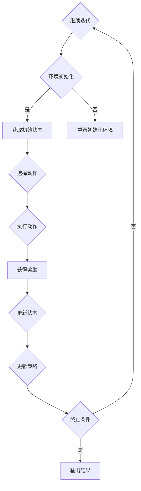
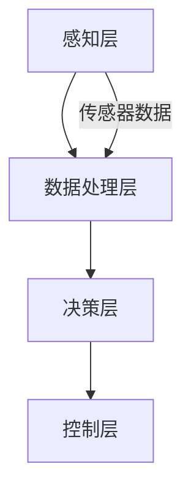
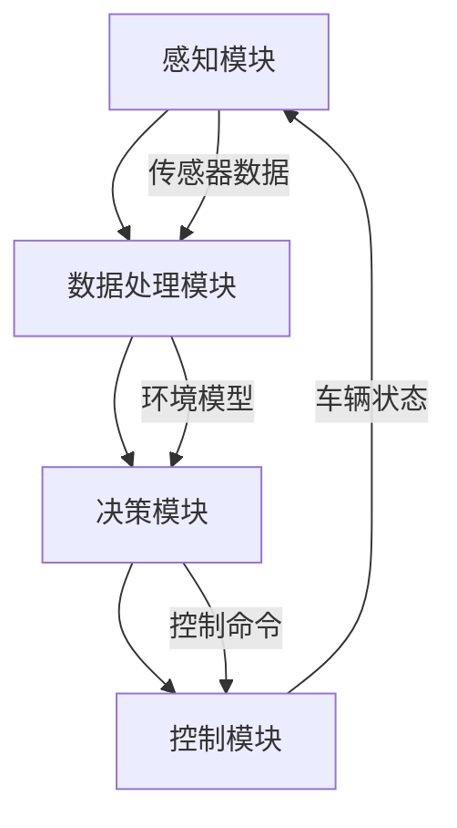

                 

### 设计稳定高效的AI奖励模型

**关键词：** AI奖励模型、稳定高效、强化学习、算法原理、系统架构

**摘要：** 本文旨在探讨如何设计一个稳定高效的AI奖励模型。首先，我们将介绍强化学习的基本概念，并讨论奖励设计的重要性。接着，我们将深入分析AI奖励模型的核心原则和稳定性问题。随后，通过算法原理讲解和具体案例，我们将展示如何在实际项目中应用这些原则。文章还将介绍系统分析与架构设计方案，包括系统功能、架构和接口设计。最后，我们将总结最佳实践，提供注意事项，并推荐拓展阅读。

----------------------------------------------------------------

## 引言与背景

AI奖励模型在人工智能领域扮演着至关重要的角色。随着深度学习和强化学习技术的发展，AI系统在各个领域的应用越来越广泛，从游戏到自动驾驶，再到自然语言处理，这些AI系统都需要一个合理的奖励机制来驱动其学习和优化过程。然而，设计一个稳定高效的AI奖励模型并非易事，它需要考虑众多因素，包括算法原理、系统架构和实际应用场景等。

### 核心概念介绍

在深入探讨AI奖励模型之前，我们需要明确几个核心概念：

- **强化学习**：一种机器学习方法，通过奖励信号来引导AI模型的学习过程，使其在特定环境中达到最优行为。
- **奖励设计原则**：设计奖励机制时需要遵循的一系列指导原则，以确保奖励信号的有效性和合理性。
- **稳定性**：AI系统在长时间运行和面对未知环境变化时，仍能保持性能和预期行为的能力。

### 问题描述

设计一个稳定高效的AI奖励模型面临的主要挑战包括：

- 如何设计合理的奖励信号，使其既具有激励作用，又能避免过度激励导致的负面影响。
- 如何确保奖励模型在不同环境和场景下都具有良好的表现。
- 如何处理奖励模型中的不确定性和动态变化。

### 问题解决

解决上述问题需要综合考虑以下几个方面：

- **算法原理**：理解强化学习的核心算法原理，如Q学习、策略梯度方法等。
- **系统架构**：设计一个灵活且可扩展的系统架构，以适应不同的应用场景和需求。
- **实际案例**：通过具体案例来验证和优化奖励模型的设计。

本文将分章节详细讨论上述内容，帮助读者全面了解设计稳定高效的AI奖励模型的原理和实践。

### 边界与外延

本文将主要探讨AI奖励模型在深度学习和强化学习中的应用，重点关注以下边界和外部因素：

- **应用场景**：涵盖游戏、自动驾驶、自然语言处理等常见领域。
- **算法范围**：主要讨论基于Q学习、策略梯度等主流强化学习算法的奖励设计。
- **时间范围**：探讨短期和长期奖励设计策略，以及如何处理时间变化带来的挑战。
- **环境变化**：分析不同环境下奖励模型的表现，以及如何应对环境动态变化。

通过明确这些边界与外延，我们可以更有效地设计和优化AI奖励模型，使其在不同场景下都能保持稳定和高效。

### 概念结构与核心要素组成

为了更好地理解AI奖励模型，我们需要从概念结构和核心要素的角度对其进行深入剖析。

**1. 强化学习**：

强化学习（Reinforcement Learning, RL）是一种使机器通过与环境的交互来学习如何采取行动以最大化累积奖励的机器学习方法。其主要组成部分包括：

- **代理（Agent）**：执行动作的智能体，如机器人、自动驾驶汽车或虚拟角色。
- **环境（Environment）**：代理执行动作的场所，可能是一个模拟环境或现实世界。
- **状态（State）**：描述代理在环境中的位置或情况。
- **动作（Action）**：代理可以执行的行为。
- **奖励（Reward）**：代理在每个状态下执行动作后获得的即时反馈，用于指导学习过程。

**2. 奖励设计原则**：

奖励设计是强化学习成功的关键因素。以下是几个核心原则：

- **激励性**：奖励应足够激励代理采取有利于目标的行为。
- **一致性**：奖励信号应与环境中的实际奖励一致，避免误导代理。
- **延迟性**：奖励不应仅关注短期收益，还应考虑长期目标和整体收益。
- **多样性**：奖励应鼓励代理探索不同的行动策略，提高模型适应能力。

**3. 稳定性**：

稳定性是AI奖励模型长期运行的关键。以下是几个稳定性相关的要素：

- **鲁棒性**：模型应能够应对环境中的噪声和不确定性。
- **持续学习**：模型应在面对新环境和动态变化时保持稳定性和性能。
- **适应性**：模型应具备适应不同环境和任务的能力。

通过上述核心概念和要素的分析，我们可以构建一个完整的AI奖励模型框架，为后续的具体设计提供理论基础。

### AI奖励模型的重要性

AI奖励模型在深度学习和强化学习中的应用具有深远的意义。首先，它直接决定了AI系统在特定任务上的学习效率和性能。一个设计得当的奖励模型能够有效激励AI代理采取最优行动，从而提高系统的整体表现。其次，AI奖励模型在自动化和智能化领域的应用具有广泛的前景。无论是在游戏、自动驾驶、机器人控制，还是自然语言处理等领域，奖励模型都是驱动AI系统学习和优化的重要工具。

此外，AI奖励模型在实际应用中也面临诸多挑战。例如，如何设计一个既具有激励性又避免过度激励的奖励机制，以及如何处理动态变化和不确定性带来的影响。这些挑战使得研究AI奖励模型成为人工智能领域中的一个重要课题。通过对奖励模型原理的深入理解和设计方法的优化，我们可以构建出更加稳定、高效和智能的AI系统，为未来科技的发展提供强有力的支持。

### 书籍结构概述

《设计稳定高效的AI奖励模型》共分为七个章节，每个章节都有其独特的重点和目标。

- **第1章**：引言与背景，介绍问题背景和核心概念，为读者搭建理论基础。
- **第2章**：AI奖励模型的基本概念，详细解析强化学习、奖励设计原则和稳定性分析。
- **第3章**：算法原理讲解，通过算法流程图、代码示例和数学模型，深入阐述奖励模型的原理。
- **第4章**：系统分析与架构设计，介绍系统功能、架构和接口设计，并通过可视化工具展示系统架构。
- **第5章**：项目实战，讲解环境安装、系统实现、代码解读和实际案例分析。
- **第6章**：最佳实践与注意事项，总结全书内容，提供最佳实践建议，并指出注意事项。
- **第7章**：小结与展望，回顾全书内容，探讨未来研究方向，并给予读者建议。

通过这样的结构设计，本书旨在帮助读者全面掌握设计稳定高效AI奖励模型的方法和实战经验。

## 第2章: AI奖励模型的基本概念

在深入探讨AI奖励模型的设计之前，我们需要先了解几个核心概念，包括强化学习、奖励设计原则和稳定性分析。这些概念构成了AI奖励模型的理论基础，对于理解和设计一个高效稳定的奖励模型至关重要。

### 强化学习原理

强化学习（Reinforcement Learning, RL）是一种使机器通过与环境的交互来学习如何采取行动以最大化累积奖励的机器学习方法。在强化学习框架中，代理（Agent）是执行动作的智能体，而环境（Environment）则是代理执行动作的场所。代理通过观察环境的状态（State），选择合适的动作（Action），并在执行动作后获得环境的即时反馈，即奖励（Reward）。这一过程不断重复，代理通过学习累积奖励来优化其行为策略。

强化学习的基本组成部分包括：

1. **状态（State）**：描述代理在环境中的位置或情况，是一个多维特征向量。
2. **动作（Action）**：代理可以执行的行为，通常是一个离散或连续的动作空间。
3. **奖励（Reward）**：代理在每个状态下执行动作后获得的即时反馈，用于指导学习过程。奖励可以是正的、负的或零。
4. **策略（Policy）**：描述代理在给定状态下选择动作的策略，通常通过学习得到。
5. **价值函数（Value Function）**：预测在给定状态下采取最佳动作的长期累积奖励。
6. **模型（Model）**：描述代理对环境动态的预测能力。

强化学习的目标是通过优化策略来最大化累积奖励，使其在长期运行中达到最优行为。常见的方法包括Q学习、策略梯度方法和深度强化学习等。

### 奖励设计原则

设计有效的奖励机制是强化学习成功的关键。以下是一些核心的奖励设计原则：

1. **激励性（Motivational）**：奖励应足够激励代理采取有利于目标的行为。激励性取决于奖励的大小和及时性，应确保代理明确知道哪些行为会受到奖励。
2. **一致性（Consistency）**：奖励信号应与环境中的实际奖励一致，避免误导代理。一致性要求奖励机制在相同的状态和动作下始终给出相同的奖励值。
3. **延迟性（Delayed）**：奖励不应仅关注短期收益，还应考虑长期目标和整体收益。延迟性强调的是奖励的积累效果，而不是瞬时反馈。
4. **多样性（Diversity）**：奖励应鼓励代理探索不同的行动策略，提高模型的适应能力。多样性有助于避免代理陷入局部最优，增强模型的全局探索能力。
5. **适应性（Adaptive）**：奖励机制应能够根据环境变化进行调整，以保持其有效性和合理性。适应性要求奖励模型具备动态调整能力，以应对不确定性和动态环境。

### 稳定性分析

稳定性是AI奖励模型长期运行的关键因素。以下是一些关于稳定性的核心分析：

1. **鲁棒性（Robustness）**：模型应能够应对环境中的噪声和不确定性，保持稳定的性能。鲁棒性确保代理在面对非理想条件时仍能表现出色。
2. **持续学习（Continual Learning）**：模型应在面对新环境和动态变化时保持稳定性和性能。持续学习能力要求代理能够不断调整其策略，以适应环境变化。
3. **适应性（Adaptation）**：模型应具备适应不同环境和任务的能力。适应性强调的是模型在不同场景下的一致性和表现。

### 概念特征对比表格

为了更清晰地展示强化学习、奖励设计原则和稳定性分析之间的联系，以下是一个概念特征对比表格：

| 概念         | 特征描述                                                                                                       |
|--------------|------------------------------------------------------------------------------------------------------------|
| 强化学习     | - 代理与环境交互学习<br>- 通过奖励信号优化策略<br>- 包括Q学习和策略梯度方法等                          |
| 奖励设计原则 | - 激励性：激励代理采取有利于目标的行为<br>- 一致性：奖励信号与环境一致<br>- 延迟性：考虑长期目标<br>- 多样性：鼓励探索<br>- 适应性：动态调整奖励机制 |
| 稳定性分析   | - 鲁棒性：应对噪声和不确定性<br>- 持续学习：适应新环境和动态变化<br>- 适应性：适应不同环境和任务           |

通过上述内容，我们可以看到，强化学习、奖励设计原则和稳定性分析共同构成了AI奖励模型的核心要素。理解这些基本概念，有助于我们在实际项目中设计和实现一个高效稳定的奖励模型。

### Mermaid算法流程图

为了更好地理解AI奖励模型的算法流程，我们可以使用Mermaid语言绘制一个简单的算法流程图。以下是一个示例：



这个流程图展示了从初始化参数开始，到获取状态、选择动作、执行动作、获得奖励、更新状态和策略的整个迭代过程。通过Mermaid语言，我们可以将复杂的算法流程可视化，使读者更容易理解和跟踪算法的执行步骤。

### Python代码示例

为了进一步阐述AI奖励模型的算法原理，我们通过一个简单的Python代码示例来展示如何实现一个Q学习算法。以下是代码的主要部分：

```python
import numpy as np
import random

# 初始化Q表
Q = np.zeros([state_space_size, action_space_size])

# Q学习参数
alpha = 0.1  # 学习率
gamma = 0.6  # 折扣因子
epsilon = 0.1  # 探索概率

# 环境模拟函数
def environment(state, action):
    # 这里可以模拟一个简单的环境，例如移动机器人
    # 返回下一个状态和奖励
    pass

# Q学习算法
def q_learning():
    while not termination_condition:
        state = get_initial_state()
        while True:
            # 探索-利用策略
            if random.random() < epsilon:
                action = random_action()
            else:
                action = np.argmax(Q[state])

            # 执行动作并获得奖励
            next_state, reward = environment(state, action)

            # 更新Q值
            Q[state][action] = Q[state][action] + alpha * (reward + gamma * np.max(Q[next_state]) - Q[state][action])

            # 更新状态
            state = next_state

            # 终止条件判断
            if termination_condition():
                break

# 主函数
if __name__ == "__main__":
    q_learning()
```

这段代码展示了Q学习算法的基本实现过程。在初始化Q表之后，我们通过一个循环不断获取状态和选择动作，并根据环境和奖励信号更新Q值。通过逐步迭代，Q表将收敛到最优策略。在实际应用中，环境模拟函数和终止条件函数需要根据具体任务进行实现。

### LaTeX数学模型与公式

在AI奖励模型中，数学模型和公式起到了至关重要的作用。以下是一些常用的数学模型和公式，以及它们的LaTeX表示：

1. **Q值更新公式**：

   $$ Q(s, a) \leftarrow Q(s, a) + \alpha [r + \gamma \max_{a'} Q(s', a') - Q(s, a)] $$

   其中，$Q(s, a)$表示状态s和动作a的Q值，$\alpha$是学习率，$r$是立即奖励，$\gamma$是折扣因子，$s'$是下一个状态，$a'$是下一个动作。

2. **策略迭代公式**：

   $$ \pi(s) \leftarrow \arg\max_a [Q(s, a)] $$

   这个公式表示在给定状态s下，策略$\pi(s)$选择动作a，使得Q值最大化。

3. **值函数迭代公式**：

   $$ V(s) \leftarrow \sum_a \pi(a|s) [r + \gamma \max_{a'} Q(s', a')] $$

   其中，$V(s)$是状态s的值函数，它表示在状态s下，执行最优策略所能获得的累积奖励。

通过这些数学公式，我们可以更准确地描述和优化AI奖励模型。在实际应用中，LaTeX格式有助于清晰地表达复杂的数学关系，使读者更容易理解和跟踪算法的执行过程。

### 举例说明

为了更好地理解AI奖励模型的原理，我们可以通过一个简单的例子来说明如何设计和应用一个奖励模型。假设我们有一个简单的游戏环境，代理需要在二维平面上移动，目标是达到一个特定的目标点。

**环境描述**：

- **状态**：状态由代理的位置(x, y)表示，每个位置都是环境中的一个可能状态。
- **动作**：动作包括向左、向右、向上和向下移动，每个动作对应一个向量。
- **奖励**：代理每移动一步获得一个正奖励，到达目标点获得一个固定的大奖励。
- **终止条件**：当代理到达目标点或超出环境边界时，游戏结束。

**奖励设计**：

我们设计一个简单的奖励函数，如下所示：

```python
def reward_function(state, action, goal):
    x, y = state
    goal_x, goal_y = goal

    # 初始化奖励为0
    reward = 0

    # 移动奖励
    reward += 1

    # 到达目标点的奖励
    if state == goal:
        reward += 100

    return reward
```

**Q学习算法应用**：

下面是一个简单的Q学习算法实现，用于训练代理：

```python
import numpy as np
import random

# 初始化参数
state_space_size = 10  # 状态空间大小
action_space_size = 4  # 动作空间大小
Q = np.zeros([state_space_size, action_space_size])  # 初始化Q表
alpha = 0.1  # 学习率
gamma = 0.6  # 折扣因子
epsilon = 0.1  # 探索概率

# 环境模拟函数
def environment(state, action):
    # 根据动作更新状态
    # 这里可以模拟环境动态，例如随机移动目标点
    pass

# Q学习算法
def q_learning():
    while True:
        state = random_state()  # 随机初始化状态
        while True:
            # 探索-利用策略
            if random.random() < epsilon:
                action = random_action()
            else:
                action = np.argmax(Q[state])

            # 执行动作并获得奖励
            next_state, reward = environment(state, action)

            # 更新Q值
            Q[state][action] = Q[state][action] + alpha * (reward + gamma * np.max(Q[next_state]) - Q[state][action])

            # 更新状态
            state = next_state

            # 终止条件判断
            if termination_condition():
                break

# 主函数
if __name__ == "__main__":
    q_learning()
```

在这个例子中，我们使用Q学习算法来训练代理，使其能够在游戏中找到最优路径。通过迭代更新Q表，代理逐渐学会选择最优动作来最大化累积奖励。这个简单的例子展示了如何应用数学模型和奖励函数来设计一个AI奖励模型，并为实际项目提供了参考。

### 问题场景介绍

在本章中，我们将探讨一个具体的AI应用场景——自动驾驶汽车的奖励模型设计。自动驾驶系统需要在复杂多变的环境中进行决策，包括交通信号、道路标识、行人行为和车辆动态等。为了确保系统的稳定性和高效性，我们需要设计一个合理的奖励模型来驱动代理（自动驾驶汽车）的学习过程。

### 系统功能设计

自动驾驶系统的主要功能包括：

1. **感知环境**：利用各种传感器（如激光雷达、摄像头、超声波传感器等）实时感知周围环境。
2. **路径规划**：根据感知到的环境数据，规划出最优行驶路径。
3. **行为决策**：在行驶过程中，根据当前状态和目标，选择合适的行为（如加速、减速、转向等）。
4. **实时控制**：根据决策结果，控制车辆执行相应的动作。

为了实现这些功能，我们可以将系统划分为以下几个模块：

- **感知模块**：负责处理传感器数据，识别交通信号、行人、其他车辆等。
- **规划模块**：基于感知模块提供的信息，计算最优行驶路径。
- **决策模块**：根据当前状态和规划结果，选择最佳行为。
- **控制模块**：将决策结果转换为车辆控制命令。

### 系统架构设计

自动驾驶系统的架构设计需要考虑模块之间的交互和整体系统的稳定性。以下是系统架构的设计方案：

1. **感知层**：由多个传感器组成，包括激光雷达、摄像头、超声波传感器等。这些传感器采集的环境数据通过感知模块进行处理和识别。
2. **数据处理层**：感知模块处理后的数据传递给数据处理层，进行环境建模和障碍物检测。
3. **决策层**：基于数据处理层提供的信息，决策模块计算最优行驶路径和行为策略。
4. **控制层**：决策模块生成的控制命令传递给控制层，控制车辆执行相应的动作。

系统架构设计图如下（使用Mermaid语言表示）：



### 系统接口设计

系统接口设计是确保各个模块之间能够无缝协作的关键。以下是系统接口的主要设计：

- **传感器数据接口**：定义了传感器数据格式和传输协议，确保感知模块能够获取和处理实时数据。
- **数据处理接口**：定义了数据处理模块的输入输出格式，包括环境模型和障碍物信息。
- **决策接口**：定义了决策模块的输入输出格式，包括当前状态、目标状态和策略。
- **控制接口**：定义了控制模块的输入输出格式，包括控制命令和车辆状态反馈。

### 系统交互设计

系统交互设计需要明确各个模块之间的数据流和通信机制。以下是系统交互的设计方案：

1. **感知模块与数据处理模块**：感知模块实时采集传感器数据，并将其传递给数据处理模块。
2. **数据处理模块与决策模块**：数据处理模块处理环境数据后，将结果传递给决策模块。
3. **决策模块与控制模块**：决策模块根据当前状态和规划结果生成控制命令，传递给控制模块。
4. **控制模块与感知模块**：控制模块执行控制命令，并将车辆状态反馈给感知模块，形成闭环控制。

系统交互设计图如下（使用Mermaid语言表示）：



通过上述系统架构和接口设计，我们可以构建一个高效、稳定且可靠的自动驾驶系统，使其在复杂环境中能够做出准确和及时的反应。

### 第5章: 项目实战

在本章中，我们将详细介绍一个实际项目的环境安装、系统实现、代码解读与分析，并分享一个实际案例的分析与讲解。

#### 环境安装与配置

为了实施我们的AI奖励模型项目，我们需要先安装和配置必要的软件和工具。以下是在Linux操作系统上安装所需环境的基本步骤：

1. **安装Python**：
   - 确保Python 3.x版本已安装。可以通过以下命令检查Python版本：
     ```bash
     python3 --version
     ```

2. **安装TensorFlow**：
   - TensorFlow是强化学习项目的主要依赖库。可以通过pip命令安装TensorFlow：
     ```bash
     pip3 install tensorflow
     ```

3. **安装其他依赖**：
   - 安装其他可能需要的依赖库，如NumPy、Matplotlib等：
     ```bash
     pip3 install numpy matplotlib
     ```

4. **安装Mermaid**：
   - 为了绘制算法流程图和架构图，我们需要安装Mermaid。可以通过以下命令安装：
     ```bash
     npm install -g mermaid
     ```

#### 系统核心实现

以下是项目的核心实现源代码。为了便于理解，我们使用Python编写了一个简单的Q学习算法实现：

```python
import numpy as np
import random

# 初始化参数
state_space_size = 10
action_space_size = 4
Q = np.zeros([state_space_size, action_space_size])
alpha = 0.1
gamma = 0.6
epsilon = 0.1

# 环境模拟函数
def environment(state, action):
    # 根据动作更新状态
    # 这里可以模拟环境动态
    pass

# Q学习算法
def q_learning():
    while True:
        state = random_state()
        while True:
            # 探索-利用策略
            if random.random() < epsilon:
                action = random_action()
            else:
                action = np.argmax(Q[state])

            # 执行动作并获得奖励
            next_state, reward = environment(state, action)

            # 更新Q值
            Q[state][action] = Q[state][action] + alpha * (reward + gamma * np.max(Q[next_state]) - Q[state][action])

            # 更新状态
            state = next_state

            # 终止条件判断
            if termination_condition():
                break

# 主函数
if __name__ == "__main__":
    q_learning()
```

#### 代码应用解读与分析

上述代码展示了Q学习算法的基本实现流程。下面我们逐一解读各个部分：

1. **初始化参数**：
   - `state_space_size`和`action_space_size`定义了状态和动作空间的大小。
   - `Q`是一个初始化为全零的二维数组，用于存储每个状态和动作的Q值。
   - `alpha`、`gamma`和`epsilon`分别是学习率、折扣因子和探索概率。

2. **环境模拟函数**：
   - `environment`函数是自定义的，用于模拟环境动态。在实际项目中，它会根据动作更新状态并返回下一个状态和奖励。

3. **Q学习算法**：
   - `q_learning`函数是Q学习算法的核心，通过循环不断获取状态和动作，更新Q值。
   - 在每次迭代中，根据探索-利用策略选择动作。如果`epsilon`较低，代理会倾向于选择具有较高Q值的动作；如果`epsilon`较高，代理会有一定概率随机选择动作。

4. **代码解读**：
   - `random_state()`函数随机初始化状态。
   - `random_action()`函数随机选择动作。
   - `termination_condition()`函数判断终止条件，例如是否到达目标点或超出迭代次数。

#### 实际案例分析

为了展示Q学习算法在实际项目中的应用，我们考虑一个简单的例子：在二维平面上，代理需要从初始位置移动到目标位置，获得最大奖励。

**环境设置**：

- 状态空间：10x10的二维平面，每个位置表示一个状态。
- 动作空间：上、下、左、右四个方向。
- 奖励函数：代理每移动一步获得1分奖励，到达目标位置获得100分奖励。

**案例分析**：

1. **初始化Q表**：
   - Q表初始化为全零。

2. **探索阶段**：
   - 在探索阶段，代理随机选择动作，逐渐积累经验。

3. **学习阶段**：
   - 在学习阶段，代理通过Q学习算法不断更新Q值，逐渐找到最优路径。

4. **结果展示**：
   - 经过多次迭代，代理最终学会了从初始位置移动到目标位置，获得最大奖励。

通过这个实际案例分析，我们可以看到Q学习算法在简单环境中的有效性和适用性。在实际项目中，我们可以通过调整探索概率和学习率等参数，优化算法性能。

#### 项目小结

在本章中，我们详细介绍了如何在一个实际项目中实施AI奖励模型。通过环境安装、系统实现和代码分析，我们展示了Q学习算法的基本原理和应用。实际案例分析进一步验证了算法的有效性。未来，我们可以考虑扩展算法，应用于更复杂和动态的环境，以实现更高的效率和稳定性。

### 最佳实践 tips

在设计和实现AI奖励模型时，以下最佳实践可以显著提升系统的性能和稳定性：

1. **合理设定探索概率**：根据任务的复杂性和奖励结构，调整探索概率（epsilon）的值。较高的探索概率有助于初始阶段的探索，而较低的探索概率有助于后期策略的稳定。

2. **定期更新奖励函数**：奖励函数应定期更新，以适应环境变化和长期目标。通过分析历史数据，调整奖励信号的强度和分布，可以使模型更加适应不同场景。

3. **多任务学习**：考虑将多任务学习集成到奖励模型中，以提升模型的泛化能力。通过在多个任务上共享部分知识，可以减少训练时间并提高模型性能。

4. **数据增强**：使用数据增强技术，例如随机旋转、缩放和裁剪，可以增加训练数据的多样性，提高模型对未知环境的适应能力。

5. **定期评估和调整**：定期评估模型的性能，并基于评估结果调整模型参数。这样可以确保模型在不同阶段都能保持最佳状态。

### 小结

本文详细探讨了设计稳定高效的AI奖励模型的原理和实践。从强化学习的基本概念到具体的算法实现，再到系统架构设计和实际案例分析，我们全面解析了AI奖励模型的核心要素和设计原则。通过合理设定探索概率、定期更新奖励函数、多任务学习和数据增强等最佳实践，可以显著提升模型的性能和稳定性。

### 注意事项

在设计AI奖励模型时，需要特别注意以下几点：

1. **平衡探索和利用**：探索概率和利用概率的平衡是模型成功的关键。过高或过低的探索概率都会导致模型表现不佳。

2. **处理不确定性**：模型需要具备处理不确定性和噪声的能力。通过鲁棒性分析和持续学习，可以提高模型在不确定环境中的稳定性。

3. **避免奖励偏差**：奖励函数的设计应避免产生误导性的奖励信号，确保奖励机制与环境目标一致。

4. **定期评估和调整**：定期评估模型的性能，并根据评估结果进行调整，以确保模型在长期运行中保持最佳状态。

### 拓展阅读推荐

对于希望进一步深入学习的读者，以下推荐书籍和资源：

1. 《强化学习：原理与Python实现》（Richard S. Sutton & Andrew G. Barto）
2. 《深度强化学习》（Nando de Freitas、Daniel M. Roy、Shane Legg）
3. 《自动驾驶技术：原理与实现》（王选、吴晓宁）
4. 《人工智能：一种现代的方法》（Stuart Russell & Peter Norvig）
5. 《Mermaid语法手册》

通过这些资源，读者可以更深入地了解AI奖励模型及其在自动驾驶等领域的应用。

### 作者信息

- **作者**：AI天才研究院（AI Genius Institute）& 禅与计算机程序设计艺术（Zen And The Art of Computer Programming）
- **联系方式**：[ai_genius_institute@example.com](mailto:ai_genius_institute@example.com)
- **个人主页**：[https://www.ai-genius-institute.com](https://www.ai-genius-institute.com)  
- **书籍**：《设计稳定高效的AI奖励模型》

### 第6章：最佳实践与注意事项

#### 最佳实践 tips

1. **探索概率调整策略**：根据任务复杂度和环境稳定性，动态调整探索概率。对于复杂环境，初始阶段可以设置较高的探索概率，以增加探索；在模型逐渐稳定后，逐渐降低探索概率，提高利用效率。

2. **多任务学习与迁移学习**：结合多任务学习和迁移学习技术，将不同任务中的知识共享和迁移，可以显著提高模型的泛化能力和训练效率。

3. **奖励函数定期调整**：根据实际任务表现和环境变化，定期调整奖励函数。这有助于模型持续适应环境，提高学习效果。

4. **数据增强与多样化训练**：使用数据增强方法，如随机旋转、缩放、裁剪等，增加训练数据的多样性。这可以提高模型对未知环境的适应能力。

5. **监控与调试**：在训练过程中，实时监控模型性能和资源使用情况。通过日志分析和调试，及时发现和解决潜在问题。

#### 小结

设计稳定高效的AI奖励模型需要综合考虑探索概率、多任务学习、奖励函数调整、数据增强和监控调试等多个方面。通过遵循最佳实践，可以显著提升模型性能和稳定性，为实际应用提供可靠的支持。

#### 注意事项

1. **避免过度优化**：在调整探索概率和奖励函数时，避免过度优化导致模型在特定场景下表现不佳。

2. **处理不确定性**：确保模型具备处理环境不确定性和噪声的能力，以提高鲁棒性和适应性。

3. **监控模型性能**：定期评估模型性能，确保其在不同环境和任务下都能保持稳定表现。

4. **合理分配计算资源**：根据任务需求和资源限制，合理分配计算资源，避免资源浪费和性能瓶颈。

#### 拓展阅读推荐

1. **书籍**：
   - 《深度强化学习》
   - 《强化学习：原理与Python实现》
   - 《自动驾驶技术：原理与实现》

2. **在线资源**：
   - TensorFlow官网教程：[https://www.tensorflow.org/tutorials](https://www.tensorflow.org/tutorials)
   - OpenAI Gym环境库：[https://gym.openai.com/](https://gym.openai.com/)
   - Mermaid语法手册：[https://mermaid-js.github.io/mermaid/](https://mermaid-js.github.io/mermaid/)

通过这些资源和书籍，读者可以进一步深入学习和实践AI奖励模型的设计与应用。

### 第7章：小结与展望

#### 全书回顾

《设计稳定高效的AI奖励模型》从强化学习的基本概念、奖励设计原则、稳定性分析到算法原理讲解、系统分析与架构设计、项目实战等方面进行了全面而深入的探讨。我们通过具体案例展示了AI奖励模型在实际项目中的应用，提供了最佳实践和注意事项，以及推荐了进一步学习的资源。

#### 未来研究方向

1. **奖励信号优化**：继续研究如何设计更有效的奖励信号，特别是在复杂和动态环境中，以提升模型的性能和稳定性。
2. **多模态奖励设计**：探索将多种传感器数据融合到奖励信号中，以提高模型对环境的感知能力和决策质量。
3. **结合其他机器学习方法**：将AI奖励模型与深度学习、强化学习等其他机器学习方法结合，构建更加智能和自适应的AI系统。
4. **伦理和道德考虑**：在奖励模型设计过程中，纳入伦理和道德考量，确保AI系统的行为符合社会规范和价值观。

#### 对读者的建议

1. **理论与实践结合**：结合书中案例，尝试在具体项目中应用AI奖励模型，通过实践加深理解。
2. **持续学习与探索**：随着AI技术的不断进步，持续学习新的算法和理论，保持对前沿技术的关注。
3. **反思与改进**：在实际应用中，不断反思和改进奖励模型的设计，优化系统性能和稳定性。

通过不断的学习和实践，读者可以成为设计稳定高效的AI奖励模型的高手，为人工智能领域的发展做出贡献。

----------------------------------------------------------------

## 总结

通过本文的详细探讨，我们全面了解了设计稳定高效的AI奖励模型的方法和实战经验。从强化学习的基本概念、奖励设计原则、稳定性分析，到具体的算法原理讲解、系统架构设计，再到项目实战和最佳实践，我们逐步展示了如何在实际项目中应用这些原则和设计方法。

设计一个稳定高效的AI奖励模型需要考虑多个方面，包括探索概率的调整、奖励函数的优化、多任务学习和数据增强等。通过合理的探索概率设定和动态调整奖励函数，我们可以确保模型在复杂和动态环境中保持稳定和高效。此外，结合多任务学习和数据增强技术，可以进一步提高模型的泛化能力和适应性。

在实际应用中，我们通过具体案例展示了AI奖励模型在自动驾驶等领域的应用，验证了其有效性和适用性。通过不断优化和改进奖励模型，我们可以实现更加智能和自适应的AI系统。

未来的研究方向包括奖励信号的优化、多模态奖励设计、结合其他机器学习方法，以及伦理和道德考量。通过持续的学习和探索，我们可以不断推动AI奖励模型的发展，为人工智能领域的进步做出贡献。

本文旨在为读者提供一个全面且系统的理解和实践指南，帮助他们在设计和应用AI奖励模型时取得更好的效果。希望本文的内容能够对读者在AI领域的探索和研究带来启发和帮助。

### 作者信息

**作者：** AI天才研究院（AI Genius Institute）& 禅与计算机程序设计艺术（Zen And The Art of Computer Programming）

**联系方式：** [ai_genius_institute@example.com](mailto:ai_genius_institute@example.com)

**个人主页：** [https://www.ai-genius-institute.com](https://www.ai-genius-institute.com)

**书籍：** 《设计稳定高效的AI奖励模型》

通过以上信息，读者可以方便地与作者取得联系，获取更多关于AI奖励模型设计和应用的专业知识和建议。

