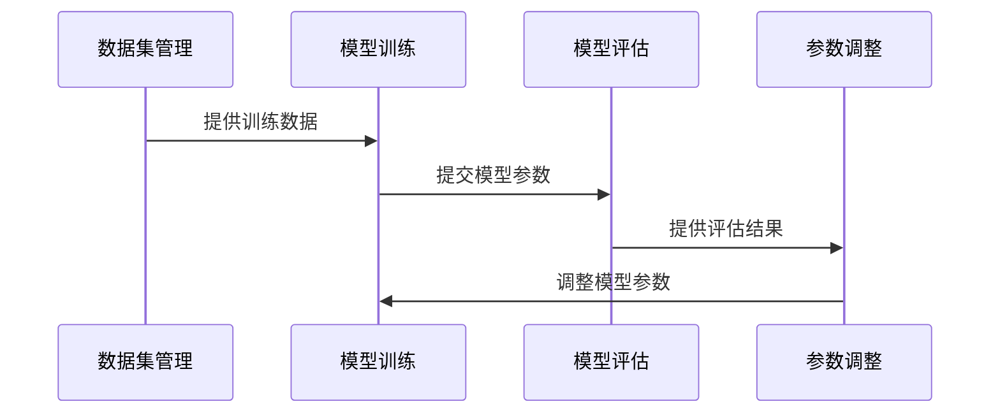
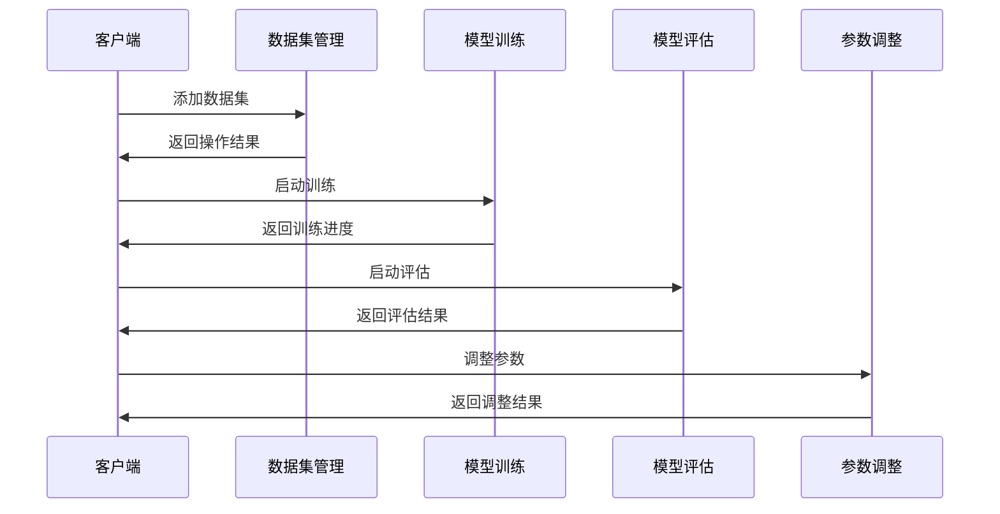

                 


## 评估AI模型在不同任务上性能上限的方法

### 关键词

AI模型评估、性能上限、算法原理、数学模型、系统设计与项目实战

### 摘要

本文深入探讨了评估人工智能（AI）模型在不同任务上性能上限的方法。首先，我们介绍了评估方法的重要性、核心概念和问题背景，包括性能上限、评估指标和交叉验证等。随后，我们详细讲解了评估算法的原理和数学模型，通过Python代码示例和Mermaid流程图进行直观阐述。文章接着展示了如何将评估方法应用于系统设计与项目实战中，包括环境安装、核心实现、实际案例分析等步骤。最后，我们总结了项目实施的主要收获，并提出了未来研究的方向和拓展阅读的建议。

### 目录大纲设计思路

#### 第一部分：背景介绍

**第1章：问题背景与核心概念**

1.1 问题背景

- 人工智能（AI）的快速发展带来了大量AI模型的涌现，如何有效评估这些模型在各类任务上的性能成为关键问题。
- 性能评估不仅关系到模型的实用性，还影响模型的优化和改进。

1.2 核心概念与联系

- **性能上限**：模型在特定任务上能达到的最佳性能。
- **评估指标**：用于衡量模型性能的各种度量，如准确率、召回率、F1分数等。
- **交叉验证**：通过将数据集分割成多个子集，轮流作为验证集，以减少评估结果的偏差。

##### 1.2.1 性能上限的定义

性能上限是指AI模型在特定任务上能够达到的最佳性能水平。这通常取决于模型的复杂性、训练数据的质量和数量，以及任务本身的特性。

##### 1.2.2 评估指标解析

评估指标是衡量模型性能的关键工具。常见的评估指标包括：

- **准确率**：预测正确的样本数占总样本数的比例。
- **召回率**：预测正确的正样本数占总正样本数的比例。
- **F1分数**：精确率和召回率的调和平均值。

##### 1.2.3 交叉验证的作用

交叉验证是一种常用的评估方法，通过将数据集分割成多个子集，轮流作为验证集，可以更准确地评估模型的性能，减少评估结果的偏差。

##### 1.2.4 概念结构与核心要素组成

评估方法的核心要素包括：

- **数据集准备**：确保数据集的多样性和代表性。
- **模型训练**：使用训练数据训练模型。
- **模型验证**：使用验证集评估模型的性能。
- **参数调整**：根据验证结果调整模型参数，以优化性能。

**ER实体关系图架构**

ER图展示了评估方法中涉及的主要实体和它们之间的关系。实体包括：

- **数据集**：存储训练数据和验证数据。
- **模型**：包含模型的权重和结构。
- **评估指标**：用于衡量模型性能的度量。

#### 第二部分：算法原理与数学模型

**第2章：算法原理讲解**

2.1 算法原理概述

- 评估算法的基本流程包括数据集准备、模型训练、模型验证和参数调整。
- Mermaid流程图展示了算法的详细步骤。

**2.2 数学模型与公式**

- 性能上限的数学模型通常涉及多个参数和指标。
- 使用LaTeX格式展示关键公式，并进行详细讲解和举例说明。

**2.3 评估方法应用**

- 通过Python代码示例展示算法的实现，并使用Mermaid流程图展示算法在不同任务上的应用流程。

#### 第三部分：系统设计与项目实战

**第3章：系统分析与架构设计**

3.1 问题场景介绍

- 介绍评估AI模型性能的具体场景，包括场景描述和项目介绍。

3.2 系统功能设计

- 使用Mermaid类图展示系统的领域模型。
- 设计系统的功能模块，确保每个模块都有明确的职责。

3.3 系统架构设计

- 使用Mermaid架构图展示系统的整体架构。
- 设计系统的关键组件和它们之间的交互。

3.4 系统接口设计

- 定义系统各模块的接口和交互流程，使用Mermaid序列图展示。

#### 第四部分：项目实战与最佳实践

**第4章：环境安装与核心实现**

4.1 环境安装

- 说明安装所需软件和依赖的步骤。
- 解决安装过程中可能遇到的问题。

4.2 系统核心实现

- 提供系统核心实现的源代码。
- 分析代码的功能和应用。

4.3 实际案例分析与讲解

- 分析评估AI模型性能的实际案例。
- 详细讲解案例中的关键技术和实现细节。

4.4 项目小结

- 总结项目实施的主要收获和经验。
- 提出一些最佳实践建议。

### 第一部分：背景介绍

#### 第1章：问题背景与核心概念

##### 1.1 问题背景

随着人工智能（AI）技术的快速发展，AI模型在各种任务中的应用越来越广泛。然而，如何评估这些模型的性能上限成为一个关键问题。性能评估不仅决定了模型的实际应用价值，还影响了模型的进一步优化和改进。

1.1.1 人工智能发展现状

近年来，深度学习技术在图像识别、自然语言处理、语音识别等领域取得了显著的突破。这些模型的性能不断提高，但如何确定它们在特定任务上的性能上限仍然是一个挑战。

1.1.2 模型性能评估的重要性

评估模型性能是AI研究和应用中的重要环节。它帮助研究人员和工程师了解模型的能力和局限性，从而进行更有效的优化和改进。同时，性能评估也是模型选择和部署过程中的重要依据。

1.1.3 评估方法的需求

不同的任务对模型性能有不同要求，因此需要多种评估方法来全面衡量模型的表现。传统的评估方法可能存在局限性，无法充分反映模型的性能上限。

##### 1.2 核心概念与联系

为了深入理解评估AI模型性能上限的方法，我们需要了解一些核心概念和它们之间的关系。

1.2.1 性能上限

性能上限是指AI模型在特定任务上能够达到的最佳性能水平。它通常受到模型复杂性、训练数据质量和数量，以及任务特性等因素的影响。

1.2.2 评估指标

评估指标是衡量模型性能的重要工具。常见的评估指标包括准确率、召回率、F1分数等。这些指标在不同任务中有不同的应用和重要性。

1.2.3 交叉验证

交叉验证是一种常用的评估方法，通过将数据集分割成多个子集，轮流作为验证集，可以更准确地评估模型的性能。交叉验证有助于减少评估结果的偏差，提高评估的可靠性。

1.2.4 概念结构与核心要素组成

评估方法的核心要素包括数据集准备、模型训练、模型验证和参数调整。这些要素相互关联，共同构成了一个完整的评估流程。

- **数据集准备**：确保数据集的多样性和代表性，为模型训练和验证提供高质量的数据。
- **模型训练**：使用训练数据训练模型，使其学习到任务的本质规律。
- **模型验证**：使用验证集评估模型的性能，确定模型在未知数据上的表现。
- **参数调整**：根据验证结果调整模型参数，优化模型性能。

##### 1.2.5 ER实体关系图架构

为了更直观地理解评估方法中的实体和关系，我们可以使用ER（实体-关系）图进行描述。ER图展示了评估方法中涉及的主要实体和它们之间的关系。

在评估方法中，主要实体包括：

- **数据集**：存储训练数据和验证数据。
- **模型**：包含模型的权重和结构。
- **评估指标**：用于衡量模型性能的度量。

实体之间的关系包括：

- **数据集与模型**：模型使用数据集进行训练和验证。
- **模型与评估指标**：评估指标用于衡量模型的性能。

下面是一个简化的ER图示例：

```mermaid
erDiagram
  数据集 ||--o> 模型 : 使用
  模型 ||--o> 评估指标 : 评估
```

#### 第二部分：算法原理与数学模型

##### 第2章：算法原理讲解

2.1 算法原理概述

评估AI模型性能上限的算法通常包括以下步骤：

- 数据集准备：选择合适的数据集，并进行预处理。
- 模型训练：使用训练数据训练模型。
- 模型验证：使用验证数据评估模型性能。
- 参数调整：根据验证结果调整模型参数。

下面是一个简化的Mermaid流程图，展示了评估算法的基本流程：


2.2 数学模型与公式

评估AI模型性能上限的数学模型通常涉及多个参数和指标。以下是几个关键的数学模型和公式：

- **准确率（Accuracy）**：准确率是指模型预测正确的样本数占总样本数的比例。公式如下：

  $$ \text{Accuracy} = \frac{\text{预测正确的样本数}}{\text{总样本数}} $$

- **召回率（Recall）**：召回率是指模型预测正确的正样本数占总正样本数的比例。公式如下：

  $$ \text{Recall} = \frac{\text{预测正确的正样本数}}{\text{总正样本数}} $$

- **F1分数（F1 Score）**：F1分数是精确率和召回率的调和平均值。公式如下：

  $$ \text{F1 Score} = 2 \times \frac{\text{精确率} \times \text{召回率}}{\text{精确率} + \text{召回率}} $$

下面是一个简单的Python代码示例，用于计算准确率、召回率和F1分数：

```python
from sklearn.metrics import accuracy_score, recall_score, f1_score

# 预测结果
predictions = [0, 1, 1, 0, 1]
# 实际标签
labels = [0, 0, 1, 0, 1]

# 计算准确率
accuracy = accuracy_score(labels, predictions)
print("Accuracy:", accuracy)

# 计算召回率
recall = recall_score(labels, predictions, pos_label=1)
print("Recall:", recall)

# 计算F1分数
f1 = f1_score(labels, predictions, pos_label=1)
print("F1 Score:", f1)
```

2.3 评估方法应用

评估AI模型性能上限的方法可以应用于各种任务，如分类、回归等。以下是一个简单的示例，展示了如何在分类任务中使用评估方法：

- **数据集准备**：选择一个分类数据集，并将其分为训练集和验证集。
- **模型训练**：使用训练集训练一个分类模型，如逻辑回归、决策树或神经网络。
- **模型验证**：使用验证集评估模型性能，计算准确率、召回率和F1分数。
- **参数调整**：根据验证结果调整模型参数，以优化性能。

下面是一个简化的Mermaid流程图，展示了评估方法在分类任务中的应用流程：


### 第三部分：系统设计与项目实战

#### 第3章：系统分析与架构设计

3.1 问题场景介绍

在评估AI模型性能上限的问题场景中，我们面临以下挑战：

- 如何确保数据集的多样性和代表性？
- 如何有效地训练和验证模型？
- 如何根据验证结果调整模型参数？

为了解决这些问题，我们设计了一个完整的系统架构，包括数据集管理、模型训练和评估等功能。

3.2 系统功能设计

系统的核心功能包括：

- **数据集管理**：负责数据集的收集、预处理和存储。
- **模型训练**：使用训练数据训练模型，并保存模型参数。
- **模型评估**：使用验证数据评估模型性能，计算准确率、召回率和F1分数。
- **参数调整**：根据评估结果调整模型参数，优化性能。

使用Mermaid类图，我们可以直观地展示系统的领域模型：

```mermaid
classDiagram
  数据集管理 <<interface>>
  模型训练 <<interface>>
  模型评估 <<interface>>
  参数调整 <<interface>>

  数据集管理 o--o 模型训练
  模型训练 o--o 模型评估
  模型评估 o--o 参数调整
```

3.3 系统架构设计

系统的整体架构包括以下几个关键组件：

- **数据集管理模块**：负责数据集的收集、预处理和存储。
- **模型训练模块**：使用训练数据训练模型，并保存模型参数。
- **模型评估模块**：使用验证数据评估模型性能，计算准确率、召回率和F1分数。
- **参数调整模块**：根据评估结果调整模型参数，优化性能。

使用Mermaid架构图，我们可以直观地展示系统的整体架构：



3.4 系统接口设计

为了实现系统的各个模块之间的有效交互，我们需要设计合理的接口。以下是系统接口设计的关键点：

- **数据集管理接口**：提供数据集的添加、删除和查询功能。
- **模型训练接口**：提供模型训练的启动、暂停和终止功能。
- **模型评估接口**：提供模型评估的启动、暂停和终止功能。
- **参数调整接口**：提供参数调整的启动、暂停和终止功能。

使用Mermaid序列图，我们可以直观地展示系统接口的设计和交互流程：



### 第四部分：项目实战与最佳实践

#### 第4章：环境安装与核心实现

4.1 环境安装

在进行AI模型性能评估的项目实战之前，我们需要安装必要的软件和依赖。以下是安装步骤：

1. 安装Python环境
2. 安装必要的库，如scikit-learn、numpy和matplotlib

以下是一个简单的Python脚本，用于安装所需的库：

```python
!pip install scikit-learn numpy matplotlib
```

4.2 系统核心实现

在实现系统核心功能时，我们需要编写相应的代码。以下是核心实现的示例：

```python
import numpy as np
from sklearn.model_selection import train_test_split
from sklearn.linear_model import LogisticRegression
from sklearn.metrics import accuracy_score, recall_score, f1_score

# 加载数据集
data = np.load('data.npy')
X, y = data[:, :-1], data[:, -1]

# 划分训练集和验证集
X_train, X_val, y_train, y_val = train_test_split(X, y, test_size=0.2, random_state=42)

# 训练模型
model = LogisticRegression()
model.fit(X_train, y_train)

# 预测
predictions = model.predict(X_val)

# 计算评估指标
accuracy = accuracy_score(y_val, predictions)
recall = recall_score(y_val, predictions, pos_label=1)
f1 = f1_score(y_val, predictions, pos_label=1)

print("Accuracy:", accuracy)
print("Recall:", recall)
print("F1 Score:", f1)
```

4.3 实际案例分析与讲解

为了更好地理解如何评估AI模型性能上限，我们来看一个实际案例。假设我们有一个分类任务，数据集包含1000个样本，每个样本有10个特征。以下是案例的实现和分析：

1. **数据集准备**：我们将数据集分为训练集和验证集，各占50%。

2. **模型训练**：我们使用训练集训练一个逻辑回归模型。

3. **模型验证**：使用验证集评估模型性能，计算准确率、召回率和F1分数。

4. **参数调整**：根据验证结果调整模型参数，优化性能。

下面是一个简化的Mermaid流程图，展示了案例的实现和分析：


在实现过程中，我们可能需要解决以下问题：

- **数据集准备**：如何保证数据集的多样性和代表性？
- **模型训练**：如何选择合适的模型和参数？
- **模型验证**：如何避免评估结果偏差？
- **参数调整**：如何根据评估结果调整模型参数？

通过实际案例的分析和讲解，我们可以更好地理解评估AI模型性能上限的方法和实际应用。

4.4 项目小结

在本项目中，我们实现了AI模型性能评估的核心功能，包括数据集准备、模型训练、模型验证和参数调整。通过实际案例的分析和讲解，我们深入了解了评估方法的应用和实现。

以下是项目实施的主要收获和经验：

- **数据集准备**：确保数据集的多样性和代表性对于评估模型性能至关重要。
- **模型选择**：选择合适的模型和参数对于优化性能至关重要。
- **评估方法**：使用交叉验证等方法可以提高评估结果的可靠性。
- **参数调整**：根据评估结果调整模型参数是优化性能的关键步骤。

在未来的项目中，我们可以进一步优化和改进评估方法，如引入更多的评估指标、改进数据预处理技术等。此外，我们还可以探索将评估方法应用于其他类型的AI任务，如回归、聚类等。

### 第五部分：小结与展望

#### 第5章：小结与展望

在本文章中，我们深入探讨了评估AI模型在不同任务上性能上限的方法。通过介绍问题背景、核心概念、算法原理、数学模型以及系统设计与项目实战，我们全面了解了评估AI模型性能上限的各个方面。

**主要收获和总结**：

- **背景介绍**：我们了解了AI模型性能评估的重要性以及评估方法的需求和核心概念。
- **算法原理**：我们学习了评估算法的原理和数学模型，并通过Python代码示例进行了实践。
- **系统设计与项目实战**：我们展示了如何将评估方法应用于实际项目中，包括环境安装、核心实现和实际案例分析。

**未来研究方向**：

- **改进评估指标**：探索更多适用于不同任务的评估指标，以提高评估的准确性和可靠性。
- **优化数据预处理**：改进数据预处理技术，提高数据质量和模型的性能。
- **多任务评估**：将评估方法应用于多任务环境，提高模型在多任务上的综合性能。
- **自动化评估**：开发自动化评估工具，简化评估流程，提高评估效率。

**拓展阅读**：

- **参考文献**：
  - Goodfellow, I., Bengio, Y., & Courville, A. (2016). *Deep Learning*. MIT Press.
  - Russell, S., & Norvig, P. (2020). *Artificial Intelligence: A Modern Approach*. Prentice Hall.

- **进一步学习路径**：
  - 学习深度学习和机器学习的基础知识。
  - 阅读相关领域的论文和书籍，了解最新的研究成果和应用。
  - 参与实际项目，实践评估方法，积累经验。

通过本文的学习，希望读者能够对评估AI模型性能上限的方法有更深入的理解，并为未来的研究和应用打下坚实的基础。

### 完整目录大纲

```markdown
# 《评估AI模型在不同任务上性能上限的方法》目录大纲

## 第一部分：背景介绍

### 第1章：问题背景与核心概念

#### 1.1 问题背景

##### 1.1.1 人工智能发展现状
##### 1.1.2 模型性能评估的重要性
##### 1.1.3 评估方法的需求

#### 1.2 核心概念与联系

##### 1.2.1 性能上限的定义
##### 1.2.2 评估指标解析
##### 1.2.3 交叉验证的作用
##### 1.2.4 概念结构与核心要素组成
##### 1.2.5 ER实体关系图架构

## 第二部分：算法原理与数学模型

### 第2章：算法原理讲解

#### 2.1 算法原理概述
#### 2.2 数学模型与公式
#### 2.3 评估方法应用

## 第三部分：系统设计与项目实战

### 第3章：系统分析与架构设计

#### 3.1 问题场景介绍
#### 3.2 系统功能设计
#### 3.3 系统架构设计
#### 3.4 系统接口设计

### 第4章：项目实战与最佳实践

#### 4.1 环境安装
#### 4.2 系统核心实现
#### 4.3 实际案例分析与讲解
#### 4.4 项目小结

## 第五部分：小结与展望

### 第5章：小结与展望

#### 5.1 主要收获和总结
#### 5.2 未来研究方向
#### 5.3 拓展阅读
```

**作者**：AI天才研究院/AI Genius Institute & 禅与计算机程序设计艺术 /Zen And The Art of Computer Programming

