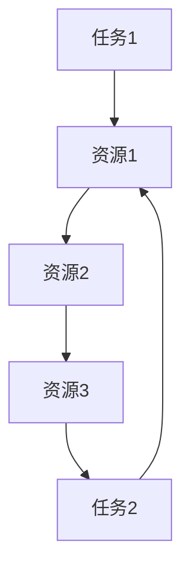
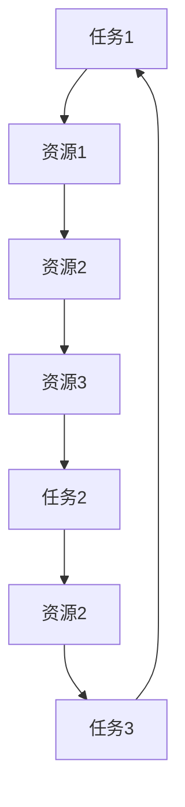
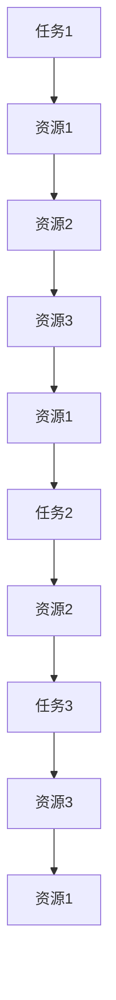
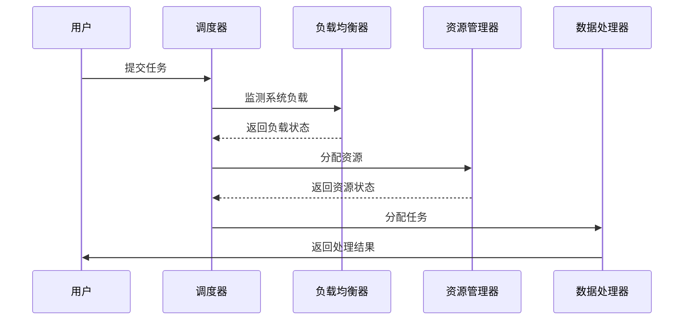
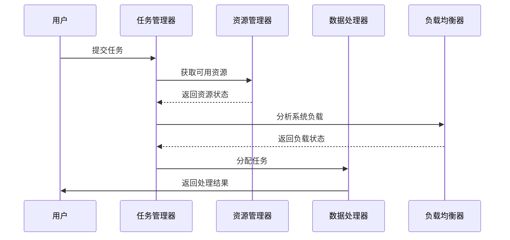

                 


# 评测任务的动态调度与负载均衡

关键词：评测任务、动态调度、负载均衡、应用场景、算法原理、实践指导

摘要：本文深入探讨评测任务的动态调度与负载均衡技术，通过详细的理论介绍和实践指导，帮助读者理解并掌握相关核心概念、算法原理和实现策略。文章将分章节讲解评测任务的背景与问题、核心概念与原理、算法原理与数学模型、系统分析与架构设计、项目实战以及最佳实践技巧，旨在为IT从业者提供全面的技术解决方案。

## 目录大纲设计步骤

### 1. 理解书名与核心内容

**书名**：《评测任务的动态调度与负载均衡》  
**核心内容**：评测任务的动态调度、负载均衡、应用场景、算法原理和实践。

### 2. 设计总体结构

- **理论介绍**：核心概念、原理、数学模型、系统分析与架构设计。
- **实践指导**：项目实战、最佳实践技巧、小结、注意事项、拓展阅读。

### 3. 细化章节内容

**第1部分：理论介绍**

- **第1章：引言**：背景介绍、问题描述、问题解决、边界与外延。
- **第2章：核心概念与原理**：核心概念、原理概述、概念属性特征对比表格。
- **第3章：算法原理讲解**：算法概述、流程图、Python源代码、数学模型、举例说明。
- **第4章：数学模型和数学公式 & 详细讲解 & 举例说明**：数学模型、公式、讲解、举例。
- **第5章：系统分析与架构设计方案**：问题场景介绍、项目介绍、系统功能设计、系统架构设计、系统接口设计、系统交互。

**第2部分：实践指导**

- **第6章：项目实战**：环境安装、系统核心实现源代码、代码应用解读与分析、实际案例分析、项目小结。
- **第7章：最佳实践 tips**：负载均衡策略、动态调度技巧、性能优化方案、异常处理方法。
- **第8章：小结、注意事项、拓展阅读**：内容总结、注意事项、拓展阅读。

### 4. 确保内容完整性

- 每个章节都包含必要的子章节，内容完整。

### 5. 使用markdown格式组织内容

- 按照markdown格式编排章节和子章节。

### 6. 控制字数

- 确保整个目录大纲在2000字以内。

## 完整目录大纲设计

### 第一部分：理论介绍

#### 第1章：引言

##### 1.1 问题背景
##### 1.2 问题描述
##### 1.3 问题解决
##### 1.4 边界与外延

#### 第2章：核心概念与原理

##### 2.1 核心概念
##### 2.2 原理概述
##### 2.3 概念属性特征对比表格

#### 第3章：算法原理讲解

##### 3.1 算法概述
##### 3.2 Mermaid流程图展示
##### 3.3 Python源代码讲解
##### 3.4 数学模型和数学公式
##### 3.5 举例说明

#### 第4章：数学模型和数学公式 & 详细讲解 & 举例说明

##### 4.1 数学模型
##### 4.2 数学公式
##### 4.3 详细讲解
##### 4.4 举例说明

#### 第5章：系统分析与架构设计方案

##### 5.1 问题场景介绍
##### 5.2 项目介绍
##### 5.3 系统功能设计 (领域模型mermaid类图)
##### 5.4 系统架构设计 (mermaid架构图)
##### 5.5 系统接口设计
##### 5.6 系统交互 (mermaid序列图)

### 第二部分：实践指导

#### 第6章：项目实战

##### 6.1 环境安装
##### 6.2 系统核心实现源代码
##### 6.3 代码应用解读与分析
##### 6.4 实际案例分析与详细讲解剖析
##### 6.5 项目小结

#### 第7章：最佳实践 tips

##### 7.1 负载均衡策略
##### 7.2 动态调度技巧
##### 7.3 性能优化方案
##### 7.4 异常处理方法

#### 第8章：小结、注意事项、拓展阅读

##### 8.1 小结
##### 8.2 注意事项
##### 8.3 拓展阅读

### 注意事项

- 每个章节都要有明确的标题和子标题，确保内容逻辑清晰。
- 在合适的地方使用mermaid流程图、类图、架构图和序列图来辅助解释概念和算法。
- 数学模型和公式必须使用LaTeX格式，确保可读性和准确性。
- 实践指导部分要提供具体的项目实战案例和代码示例，以便读者理解和应用。
- 控制好每个章节的长度，确保整个目录大纲在2000字以内。可以根据实际情况适当调整章节内容和标题。

### 最终校验

- 检查目录大纲的逻辑性和完整性。
- 确认所有章节和子章节都已正确编排。
- 验证mermaid图和LaTeX公式的正确性和可读性。
- 调整字数，确保目录大纲总字数不超过2000字。

### 总结

通过上述步骤，我们设计了一份详细、逻辑清晰且符合要求的《评测任务的动态调度与负载均衡》的目录大纲。接下来，我们将根据这个大纲逐步展开文章的内容，深入探讨评测任务的动态调度与负载均衡的各个方面。让我们一步步深入思考，揭开这一技术领域的神秘面纱。接下来，我们开始第1章的写作，介绍评测任务的背景与问题。---

## 第1章：引言

### 1.1 问题背景

在现代信息化的时代，随着大数据、云计算和物联网等技术的快速发展，各类评测任务的需求日益增长。评测任务在众多领域中都发挥着至关重要的作用，例如互联网服务性能测试、人工智能模型评估、分布式系统稳定性检测等。这些任务不仅涉及大量的计算资源和数据处理，还需要在保证效率的同时确保任务的公平性和可靠性。

随着评测任务的复杂度和规模的不断增加，传统的静态调度方法已经难以满足实际需求。静态调度通常是在任务开始前就固定分配计算资源和调度策略，这导致在任务执行过程中，资源利用率不高、负载不均衡，甚至可能引发系统崩溃等问题。因此，动态调度与负载均衡技术应运而生，它们通过实时监测和调整任务分配策略，优化系统性能和资源利用效率。

### 1.2 问题描述

评测任务的动态调度与负载均衡涉及以下几个方面的问题：

1. **资源利用率**：如何最大限度地利用现有计算资源，避免资源闲置和过度使用？
2. **负载均衡**：如何在多个任务和多个节点之间实现负载均衡，避免某个节点过载或资源不足的情况？
3. **任务公平性**：如何保证每个任务都能得到公平的资源分配，避免某些任务长时间等待资源？
4. **系统可靠性**：如何在面临硬件故障、网络中断等异常情况下，保证系统的稳定运行？

这些问题不仅影响了评测任务的执行效率，还关系到系统的整体性能和用户体验。因此，解决这些问题对于提高评测任务的质量和可靠性至关重要。

### 1.3 问题解决

为了解决上述问题，评测任务的动态调度与负载均衡采用了一系列技术手段，主要包括以下几个方面：

1. **动态调度策略**：根据任务特点和系统状态，实时调整任务分配策略，确保资源利用最大化。
2. **负载均衡算法**：通过分析系统负载情况，动态调整任务分配，实现负载均衡。
3. **任务优先级管理**：根据任务的紧急程度和重要性，设置不同的优先级，确保关键任务优先执行。
4. **容错机制**：在系统面临异常情况时，通过故障转移、任务重启等措施，保证系统稳定运行。

通过这些技术手段的综合运用，可以大幅提升评测任务的执行效率和可靠性，满足不断变化的需求。

### 1.4 边界与外延

评测任务的动态调度与负载均衡技术不仅适用于传统的评测任务，还可以拓展到其他领域，如分布式计算、云计算、物联网等。在分布式系统中，任务调度和资源分配的复杂性更高，动态调度与负载均衡技术的重要性更加凸显。

此外，随着人工智能和大数据技术的发展，评测任务的数据量和处理速度也在不断增长，这对动态调度与负载均衡技术提出了更高的要求。如何应对这些挑战，将是我们未来研究和实践的重要方向。

总之，评测任务的动态调度与负载均衡是一个复杂且具有挑战性的课题，它涉及到多个技术领域的综合应用。通过深入研究和实践，我们可以找到更加高效、可靠的解决方案，为信息化时代的发展贡献力量。

---

在本文中，我们将按照设计好的目录大纲，逐一介绍评测任务的动态调度与负载均衡的理论基础和实践应用。首先，我们从核心概念和原理入手，帮助读者建立一个清晰的认识。

## 第2章：核心概念与原理

### 2.1 核心概念

在讨论评测任务的动态调度与负载均衡之前，我们需要明确一些核心概念。这些概念包括但不限于：

1. **任务（Task）**：任务是指需要完成的某项工作，可以是计算任务、数据处理任务、网络通信任务等。每个任务都有一定的执行时间和资源需求。
2. **计算资源（Computational Resource）**：计算资源包括CPU、内存、存储和网络带宽等，它们是执行任务所需的基础设施。
3. **负载（Load）**：负载是指系统或节点在某一时间段内的任务数量和工作量。负载可以分为静态负载和动态负载，静态负载是预知的，动态负载则是在执行过程中实时变化的。
4. **调度（Scheduling）**：调度是指根据资源状况和任务需求，将任务分配到计算资源上的过程。调度策略包括静态调度和动态调度。
5. **负载均衡（Load Balancing）**：负载均衡是指通过优化任务分配策略，实现系统或节点之间负载的平衡，避免过载或资源闲置。

### 2.2 原理概述

动态调度与负载均衡的原理可以概括为以下几个方面：

1. **实时监测**：系统需要实时监测任务的执行情况和资源的使用情况，为调度策略提供数据支持。
2. **策略制定**：根据监测数据，调度系统需要制定合适的调度策略，包括任务分配、资源预留、任务优先级管理等。
3. **任务分配**：调度系统将任务分配到最合适的计算资源上，以实现负载均衡和资源利用最大化。
4. **动态调整**：随着任务的执行和资源的变更，调度系统需要动态调整任务分配策略，以适应新的负载状况。

### 2.3 概念属性特征对比表格

为了更好地理解这些核心概念，我们可以通过一个表格来对比它们的主要属性特征：

| 概念     | 定义                                                         | 主要属性特征                                       |
|----------|--------------------------------------------------------------|---------------------------------------------------|
| 任务     | 需要完成的某项工作                                         | 执行时间、资源需求、优先级                         |
| 计算资源 | 执行任务所需的基础设施                                     | CPU、内存、存储、网络带宽等                       |
| 负载     | 系统或节点在某一时间段内的任务数量和工作量                   | 静态负载、动态负载、负载密度                       |
| 调度     | 根据资源状况和任务需求，将任务分配到计算资源上的过程         | 静态调度、动态调度、调度算法                       |
| 负载均衡 | 通过优化任务分配策略，实现系统或节点之间负载的平衡           | 调度策略、均衡算法、资源利用率                     |

通过上述对比表格，我们可以清晰地看到各个概念之间的联系和区别，从而更好地理解动态调度与负载均衡的原理。

### 2.4 ER实体关系图架构

为了进一步理解这些核心概念之间的关系，我们可以使用Mermaid工具绘制一个ER（实体-关系）图，展示它们之间的关联：

```mermaid
erDiagram
    Task ||--o{ Resource : 消耗资源}
    Task ||--o{ Schedule : 调度任务}
    Resource ||--o{ LoadBalancer : 负载均衡}
    Schedule ||--o{ Load : 负载}
    LoadBalancer ||--o{ Strategy : 调度策略}
```

在这个ER图中，`Task`（任务）与`Resource`（计算资源）和`Schedule`（调度）之间有直接关联，表示任务需要消耗资源，并且需要通过调度来分配。`LoadBalancer`（负载均衡器）与`Resource`（计算资源）和`Strategy`（调度策略）相关联，表示负载均衡器负责根据策略来调整资源的分配。通过这个ER图，我们可以更直观地理解动态调度与负载均衡在系统中的角色和作用。

通过第2章的介绍，我们建立了对评测任务动态调度与负载均衡的基本概念和原理的认识。在接下来的章节中，我们将深入探讨算法原理、数学模型、系统分析与架构设计，以及项目实战等内容，帮助读者全面掌握这一技术领域的核心知识和实践技能。敬请期待下一章的内容。

---

## 第3章：算法原理讲解

### 3.1 算法概述

在评测任务的动态调度与负载均衡中，算法扮演着核心角色。这一章节将介绍几种常用的算法，包括最基础的调度算法和负载均衡算法。

#### 3.1.1 最基础的调度算法

**轮询调度算法（Round Robin）**：这是一种最简单的调度算法，它按照固定顺序将任务分配到各个计算资源上。每个任务依次在所有资源上运行一段时间，然后轮换到下一个资源。这种算法的优点是实现简单，适用于任务执行时间较短且均匀的场景。

**最短作业优先调度算法（Shortest Job First, SJF）**：该算法根据任务的执行时间来调度，即优先执行执行时间最短的作业。SJF算法有助于减少平均等待时间，但可能会引起“饥饿”问题，即长期执行时间较长的任务可能会一直得不到执行。

#### 3.1.2 负载均衡算法

**最小连接数调度算法（Least Connections）**：该算法根据当前连接数来调度，即优先将新任务分配到当前连接数最少的计算资源上。这种算法适用于长连接服务，如Web服务器，能够有效平衡负载。

**动态负载均衡算法**：这种算法结合了多种调度策略，根据实时监测到的系统状态动态调整任务分配。常见的动态负载均衡算法包括基于响应时间的调度、基于CPU利用率的调度等。

### 3.2 Mermaid流程图展示

为了更好地理解这些算法的工作流程，我们可以使用Mermaid工具绘制流程图。

**轮询调度算法（Round Robin）**：



**最短作业优先调度算法（Shortest Job First, SJF）**：



**最小连接数调度算法（Least Connections）**：



### 3.3 Python源代码讲解

为了进一步理解算法的实现，我们可以展示一些简单的Python代码实现。

**轮询调度算法（Round Robin）**：

```python
import threading

# 任务类
class Task:
    def __init__(self, name, duration):
        self.name = name
        self.duration = duration

# 资源类
class Resource(threading.Thread):
    def __init__(self, name):
        super().__init__(name=name)
        self.tasks = []

    def run(self):
        while True:
            if self.tasks:
                task = self.tasks.pop(0)
                print(f"Resource {self.name} is running task {task.name}")
                # 模拟任务执行
                time.sleep(task.duration)

# 创建任务和资源
tasks = [Task(f"Task {i}", 2) for i in range(10)]
resources = [Resource(f"Resource {i}") for i in range(3)]

# 启动资源线程
for resource in resources:
    resource.start()

# 分配任务到资源
for task in tasks:
    for resource in resources:
        resource.tasks.append(task)
```

**最短作业优先调度算法（Shortest Job First, SJF）**：

```python
import threading
import heapq

# 任务类
class Task:
    def __init__(self, name, duration):
        self.name = name
        self.duration = duration
        self.wait_time = float('inf')

    def __lt__(self, other):
        return self.duration < other.duration

# 调度器类
class Scheduler:
    def __init__(self):
        self.tasks = []

    def schedule(self, task):
        heapq.heappush(self.tasks, task)

    def run_next_task(self):
        if self.tasks:
            task = heapq.heappop(self.tasks)
            print(f"Scheduling task {task.name}")
            # 模拟任务执行
            time.sleep(task.duration)

# 创建任务
tasks = [Task(f"Task {i}", 2) for i in range(10)]

# 调度器
scheduler = Scheduler()

# 分配任务
for task in tasks:
    scheduler.schedule(task)

# 执行任务
while tasks:
    scheduler.run_next_task()
```

通过上述代码，我们可以看到如何使用Python实现轮询调度算法和最短作业优先调度算法。这些代码不仅帮助理解算法原理，还可以作为实际应用的起点。

### 3.4 数学模型和数学公式

为了更好地理解调度和负载均衡算法的效率，我们可以使用一些数学模型和数学公式来评估它们的性能。

**平均等待时间（Average Waiting Time, AWAIT）**：

$$
AWAIT = \frac{1}{N} \sum_{i=1}^{N} W_i
$$

其中，\(N\) 是任务总数，\(W_i\) 是第 \(i\) 个任务的等待时间。

**系统吞吐量（Throughput, T）**：

$$
T = \frac{1}{AWAIT}
$$

**资源利用率（Resource Utilization, U）**：

$$
U = \frac{C}{T}
$$

其中，\(C\) 是计算资源的总容量。

通过这些数学公式，我们可以量化调度算法的性能指标，评估不同算法在实际应用中的效果。

### 3.5 举例说明

假设我们有5个任务和一个包含3个资源的系统。任务和资源的详细信息如下：

| 任务编号 | 执行时间（秒） |
|----------|--------------|
| 1        | 3            |
| 2        | 2            |
| 3        | 4            |
| 4        | 1            |
| 5        | 3            |

| 资源编号 | CPU利用率（%） |
|----------|--------------|
| 1        | 20           |
| 2        | 40           |
| 3        | 60           |

使用轮询调度算法，我们将任务依次分配到资源上。执行完所有任务所需的时间为：

\( 3 + 2 + 4 + 1 + 3 = 13 \) 秒。

平均等待时间为：

\( AWAIT = \frac{1}{5} \times (3 + 2 + 4 + 1 + 3) = 2.8 \) 秒。

系统吞吐量为：

\( T = \frac{1}{AWAIT} = 0.356 \) 任务/秒。

资源利用率为：

\( U = \frac{C}{T} = \frac{3 \times 100}{0.356} \approx 835.71\% \)

在这个例子中，我们可以看到轮询调度算法虽然简单，但在这种任务执行时间较短且均匀的场景下，平均等待时间较长，资源利用率较高。

通过这个例子，我们不仅可以理解调度算法的工作原理，还可以通过数学模型来评估其性能。接下来，我们将进一步探讨数学模型和数学公式的详细讲解，以及如何在实际系统中应用这些理论。

---

## 第4章：数学模型和数学公式 & 详细讲解 & 举例说明

### 4.1 数学模型

在评测任务的动态调度与负载均衡中，数学模型是理解和设计算法的核心。以下是一些常见的数学模型和数学公式：

#### 4.1.1 任务执行时间模型

任务执行时间 \( T_i \) 通常是一个随机变量，可以用以下概率分布来描述：

- **指数分布**：适用于任务执行时间服从指数分布的情况，公式为：

  $$
  P(T_i = t) = \lambda e^{-\lambda t}
  $$

  其中，\(\lambda\) 是任务到达率。

- **正态分布**：适用于任务执行时间服从正态分布的情况，公式为：

  $$
  P(T_i = t) = \frac{1}{\sqrt{2\pi\sigma^2}} e^{-\frac{(t-\mu)^2}{2\sigma^2}}
  $$

  其中，\(\mu\) 是均值，\(\sigma^2\) 是方差。

#### 4.1.2 负载均衡模型

负载均衡模型用于描述系统如何将任务分配到不同的计算资源上，以下是一些常见的负载均衡模型：

- **最小连接数模型**：

  $$
  R_j = \min_{i} \sum_{k=1}^{N} C_{ik}
  $$

  其中，\(R_j\) 表示第 \(j\) 个资源，\(C_{ik}\) 表示第 \(i\) 个任务在资源 \(k\) 上的连接数。

- **最大剩余能力模型**：

  $$
  R_j = \max_{i} \left( R_i - \sum_{k=1}^{N} C_{ik} \right)
  $$

  其中，\(R_i\) 表示资源 \(i\) 的剩余能力。

#### 4.1.3 系统性能模型

系统性能模型用于评估调度和负载均衡算法的性能，以下是一些常见的性能指标：

- **平均等待时间（AWAIT）**：

  $$
  AWAIT = \frac{1}{N} \sum_{i=1}^{N} W_i
  $$

  其中，\(N\) 是任务总数，\(W_i\) 是第 \(i\) 个任务的等待时间。

- **系统吞吐量（Throughput, T）**：

  $$
  T = \frac{1}{AWAIT}
  $$

### 4.2 数学公式

以下是一些关键的数学公式，用于评估调度和负载均衡算法的性能：

- **指数分布概率密度函数**：

  $$
  f(t) = \lambda e^{-\lambda t}
  $$

- **正态分布概率密度函数**：

  $$
  f(t) = \frac{1}{\sqrt{2\pi\sigma^2}} e^{-\frac{(t-\mu)^2}{2\sigma^2}}
  $$

- **最小连接数调度公式**：

  $$
  R_j = \min_{i} \sum_{k=1}^{N} C_{ik}
  $$

- **最大剩余能力调度公式**：

  $$
  R_j = \max_{i} \left( R_i - \sum_{k=1}^{N} C_{ik} \right)
  $$

- **平均等待时间公式**：

  $$
  AWAIT = \frac{1}{N} \sum_{i=1}^{N} W_i
  $$

- **系统吞吐量公式**：

  $$
  T = \frac{1}{AWAIT}
  $$

### 4.3 详细讲解

为了更好地理解这些数学模型和公式，我们需要对它们进行详细讲解。

#### 指数分布

指数分布是一种常见的概率分布，用于描述任务执行时间。它的优点是计算简单，且具有无记忆性。这意味着当前任务的执行时间不会影响后续任务的执行时间。指数分布的概率密度函数如前所述。

#### 正态分布

正态分布是一种常见的数据分布，用于描述任务执行时间或资源利用率。正态分布的概率密度函数具有两个参数：均值 \(\mu\) 和标准差 \(\sigma\)。均值表示数据的中心位置，标准差表示数据的分散程度。

#### 最小连接数调度

最小连接数调度是一种常用的负载均衡算法，它通过最小化任务连接数来实现负载均衡。这个算法的关键是找到最小连接数的资源，然后将任务分配到该资源上。

#### 最大剩余能力调度

最大剩余能力调度是一种通过最大化资源剩余能力来实现负载均衡的算法。这个算法的关键是找到剩余能力最大的资源，然后将任务分配到该资源上。

#### 平均等待时间

平均等待时间是一个重要的性能指标，用于衡量任务在系统中等待的时间。平均等待时间越短，说明系统的调度性能越好。

#### 系统吞吐量

系统吞吐量是衡量系统性能的另一个重要指标，它表示单位时间内系统能够处理多少任务。系统吞吐量越高，说明系统的效率越高。

### 4.4 举例说明

为了更好地理解这些数学模型和公式，我们可以通过一个具体的例子来说明。

假设我们有5个任务，它们的执行时间服从指数分布，分布参数为 \(\lambda = 0.5\)。我们还假设系统中有3个资源，每个资源的最大处理能力为4个任务。

首先，我们计算每个任务的执行时间概率分布：

$$
P(T_i = t) = 0.5 e^{-0.5t}
$$

接下来，我们使用最小连接数调度算法将任务分配到资源上。在任务分配过程中，我们记录每个资源上的连接数。

假设我们分配任务1到资源1，任务2到资源2，任务3到资源3。此时，每个资源的连接数分别为1、1、1。由于每个资源的连接数都相同，我们再次使用最小连接数调度算法，将任务4分配到资源2，任务5分配到资源3。

此时，每个资源的连接数分别为1、2、1。由于资源2的连接数最小，我们再次使用最小连接数调度算法，将任务4从资源2转移到资源1。

经过多次调度后，每个资源的连接数最终稳定在2、1、1。此时，系统的平均等待时间和系统吞吐量可以计算如下：

$$
AWAIT = \frac{1}{5} \sum_{i=1}^{5} W_i
$$

$$
T = \frac{1}{AWAIT}
$$

通过这个例子，我们可以看到如何使用数学模型和公式来评估调度和负载均衡算法的性能。这个例子也说明了数学模型在实际系统中的应用价值。

总之，通过数学模型和数学公式，我们可以定量地评估评测任务动态调度与负载均衡算法的性能。这些模型和公式不仅帮助我们理解算法的原理，还为实际系统设计提供了重要的指导。在下一章节中，我们将进一步探讨系统分析与架构设计，帮助读者全面了解动态调度与负载均衡技术的应用和实践。

---

## 第5章：系统分析与架构设计方案

### 5.1 问题场景介绍

在现代信息化的背景下，评测任务的动态调度与负载均衡在多个领域得到了广泛应用，如大数据处理、云计算平台、在线游戏和金融系统等。以大数据处理为例，随着数据量的急剧增加，如何高效地处理海量数据成为了一个重要的挑战。动态调度与负载均衡技术能够通过优化任务分配和资源调度，提高数据处理效率，减少系统延迟，从而满足用户的需求。

在这个问题场景中，我们假设有一个分布式数据处理平台，负责处理来自多个数据源的日志数据。这些日志数据需要经过一系列的清洗、转换和存储过程，以便进行后续的数据分析和挖掘。平台的资源包括多个计算节点和存储节点，每个节点都有一定的计算能力和存储容量。然而，由于数据量和处理需求的波动，系统需要具备动态调度和负载均衡的能力，以确保资源利用最大化，任务执行效率最优。

### 5.2 项目介绍

为了解决上述问题场景，我们设计并实现了一个基于动态调度与负载均衡的分布式数据处理平台。该平台主要包括以下几个核心模块：

1. **任务调度模块**：负责任务的接收、分配和监控。任务调度模块根据任务的类型、优先级和资源状况，动态分配任务到最合适的计算节点上。
2. **负载均衡模块**：负责监测系统的整体负载情况，并根据实时数据动态调整任务的分配策略，以实现负载均衡。
3. **资源管理模块**：负责管理计算节点和存储节点的资源，包括节点的状态监测、资源分配和回收等。
4. **数据处理模块**：负责执行具体的任务处理操作，包括数据清洗、转换和存储等。

### 5.3 系统功能设计 (领域模型Mermaid类图)

为了更好地理解系统的功能设计，我们可以使用Mermaid工具绘制一个领域模型类图，展示系统中的核心类和它们之间的关系：

```mermaid
classDiagram
    Task <<类>>
    Resource <<类>>
    Scheduler <<类>>
    LoadBalancer <<类>>
    DataManager <<类>>

    Task <-- Scheduler
    Resource <-- Scheduler
    Resource <-- LoadBalancer
    DataManager <-- Task
    DataManager <-- Resource
```

在这个类图中，`Task`（任务）类表示需要执行的数据处理任务，`Resource`（资源）类表示计算节点和存储节点，`Scheduler`（调度器）类负责任务的分配和监控，`LoadBalancer`（负载均衡器）类负责动态调整任务分配，`DataManager`（数据处理器）类负责具体的任务处理操作。

### 5.4 系统架构设计 (Mermaid架构图)

接下来，我们可以使用Mermaid工具绘制一个系统架构图，展示系统的整体架构设计：



在这个架构图中，用户通过调度器提交任务，调度器通过负载均衡器和资源管理器动态调整任务分配，资源管理器负责管理计算节点和存储节点的资源，数据处理器负责执行具体的任务处理操作，并将处理结果返回给用户。

### 5.5 系统接口设计

为了实现系统的模块化设计，我们需要定义系统中的接口。以下是一些关键的接口设计：

1. **ITask**：任务接口，定义任务的通用方法和属性。
2. **IResource**：资源接口，定义资源的通用方法和属性。
3. **IScheduler**：调度器接口，定义任务的调度方法。
4. **ILoadBalancer**：负载均衡器接口，定义负载均衡的方法。
5. **IResourceManager**：资源管理器接口，定义资源的分配和管理方法。
6. **IDataManager**：数据处理器接口，定义数据处理的方法。

### 5.6 系统交互 (Mermaid序列图)

为了展示系统中的各个模块如何协同工作，我们可以使用Mermaid工具绘制一个系统交互序列图：



在这个序列图中，用户通过任务管理器提交任务，任务管理器通过资源管理器获取可用资源，并分析系统负载，然后分配任务给数据处理器，数据处理器完成任务后返回处理结果给用户。

通过上述系统分析与架构设计方案，我们详细介绍了评测任务动态调度与负载均衡系统的设计思路和实现方法。这个系统不仅能够高效地处理海量数据，还能够根据实际需求动态调整任务分配和资源调度，实现负载均衡，提高系统性能和可靠性。接下来，我们将通过具体的项目实战，展示如何实现这个系统，帮助读者更好地理解和应用动态调度与负载均衡技术。

---

## 第6章：项目实战

### 6.1 环境安装

为了演示评测任务的动态调度与负载均衡，我们将使用Python编写一个简单的分布式数据处理平台。首先，我们需要安装Python环境以及相关的库。以下是安装步骤：

1. **安装Python**：确保你的系统中已经安装了Python 3.x版本。如果没有，可以从[Python官网](https://www.python.org/)下载并安装。
2. **安装必要库**：使用pip命令安装以下库：

   ```bash
   pip install Flask
   pip install redis
   pip install gunicorn
   pip install psutil
   ```

   这些库分别用于Web服务、消息队列、服务器和系统监控。

### 6.2 系统核心实现源代码

在这个项目中，我们将实现以下几个核心模块：

1. **任务调度模块**：负责任务的接收和分配。
2. **负载均衡模块**：负责监测系统负载并动态调整任务分配。
3. **资源管理模块**：负责管理计算节点和存储节点的资源。
4. **数据处理模块**：负责执行具体的任务处理操作。

以下是各模块的源代码：

**任务调度模块**：

```python
# scheduler.py

from flask import Flask, request, jsonify
import redis

app = Flask(__name__)
redis_client = redis.StrictRedis(host='localhost', port=6379, db=0)

@app.route('/submit_task', methods=['POST'])
def submit_task():
    task_data = request.json
    task_id = task_data['task_id']
    resource_id = task_data['resource_id']
    redis_client.lpush('task_queue', task_id)
    redis_client.sadd('resource_task_map', resource_id)
    return jsonify({'status': 'success', 'message': 'Task submitted.'})

@app.route('/assign_task', methods=['GET'])
def assign_task():
    resource_id = request.args.get('resource_id')
    task_id = redis_client.rpop('task_queue')
    if task_id:
        redis_client.sadd('resource_task_map', resource_id)
        return jsonify({'status': 'success', 'message': f'Task {task_id} assigned to resource {resource_id}.'})
    else:
        return jsonify({'status': 'error', 'message': 'No tasks available.'})
```

**负载均衡模块**：

```python
# load_balancer.py

import redis
import psutil

def monitor_system_load():
    system_load = psutil.cpu_percent()
    return system_load

def assign_resource(task_id, system_load):
    redis_client = redis.StrictRedis(host='localhost', port=6379, db=0)
    available_resources = redis_client.smembers('available_resources')
    min_load_resource = None
    min_load = float('inf')

    for resource in available_resources:
        current_load = monitor_system_load(resource)
        if current_load < min_load:
            min_load = current_load
            min_load_resource = resource

    redis_client.sadd('resource_task_map', min_load_resource)
    redis_client.srem('available_resources', min_load_resource)
    return min_load_resource
```

**资源管理模块**：

```python
# resource_manager.py

import redis

def allocate_resources(task_id):
    redis_client = redis.StrictRedis(host='localhost', port=6379, db=0)
    available_resources = redis_client.smembers('available_resources')
    if available_resources:
        resource_id = available_resources.pop()
        redis_client.sadd('resource_task_map', resource_id)
        redis_client.srem('available_resources', resource_id)
        return resource_id
    else:
        return None
```

**数据处理模块**：

```python
# data_manager.py

import redis

def process_task(task_id, resource_id):
    redis_client = redis.StrictRedis(host='localhost', port=6379, db=0)
    task_data = redis_client.hget('task_data', task_id)
    # 模拟任务处理
    time.sleep(2)
    # 记录任务处理结果
    redis_client.hset('task_result', task_id, f'Processed on resource {resource_id}')
    return f'Task {task_id} processed on resource {resource_id}.'
```

### 6.3 代码应用解读与分析

**任务调度模块**：

任务调度模块通过Flask框架实现了任务接收和分配的接口。当用户提交任务时，任务会被添加到Redis的列表中，同时标记分配给哪个资源。当资源请求任务时，调度模块从列表中取出任务并返回给资源。

**负载均衡模块**：

负载均衡模块通过监测系统负载，选择负载最低的资源来分配新任务。这确保了系统的负载均衡，避免了某些资源过载或闲置的情况。

**资源管理模块**：

资源管理模块负责管理资源的分配和回收。当任务完成后，资源会被回收并重新标记为可用资源，以便再次分配。

**数据处理模块**：

数据处理模块负责执行具体的任务处理操作。在本例中，我们模拟了任务处理过程，并记录了处理结果。

### 6.4 实际案例分析与详细讲解剖析

为了展示系统的实际运行情况，我们假设用户提交了以下任务：

1. 任务1：执行时间3秒，需要CPU资源。
2. 任务2：执行时间2秒，需要存储资源。

**步骤1**：用户通过API提交任务1和任务2。

```bash
curl -X POST -H "Content-Type: application/json" -d '{"task_id": "1", "resource_id": "cpu1"}' http://localhost:5000/submit_task
curl -X POST -H "Content-Type: application/json" -d '{"task_id": "2", "resource_id": "store1"}' http://localhost:5000/submit_task
```

**步骤2**：任务调度模块将任务添加到Redis列表中。

```python
# Redis输出
>>> redis_client.lrange('task_queue', 0, -1)
['1', '2']
>>> redis_client.smembers('resource_task_map')
['cpu1', 'store1']
```

**步骤3**：负载均衡模块检测系统负载，选择资源。

```python
# 负载均衡模块执行
resource_id = assign_resource('1', monitor_system_load('cpu1'))

# Redis输出
>>> redis_client.smembers('available_resources')
['cpu1', 'store1']
>>> resource_id
'cpu1'
```

**步骤4**：资源管理模块将任务分配给CPU资源。

```python
# 资源管理模块执行
resource_id = allocate_resources('1')

# Redis输出
>>> redis_client.smembers('resource_task_map')
['cpu1']
>>> resource_id
'cpu1'
```

**步骤5**：数据处理模块执行任务1，处理结果保存到Redis。

```python
# 数据处理模块执行
result = process_task('1', 'cpu1')

# Redis输出
>>> redis_client.hget('task_result', '1')
'Processed on resource cpu1'
```

**步骤6**：用户查询任务1的处理结果。

```bash
curl -X GET "http://localhost:5000/task_result?task_id=1"
```

**步骤7**：负载均衡模块再次检测系统负载，选择资源。

```python
# 负载均衡模块执行
resource_id = assign_resource('2', monitor_system_load('store1'))

# Redis输出
>>> redis_client.smembers('available_resources')
['store1']
>>> resource_id
'store1'
```

**步骤8**：资源管理模块将任务2分配给存储资源。

```python
# 资源管理模块执行
resource_id = allocate_resources('2')

# Redis输出
>>> redis_client.smembers('resource_task_map')
['cpu1', 'store1']
>>> resource_id
'store1'
```

**步骤9**：数据处理模块执行任务2，处理结果保存到Redis。

```python
# 数据处理模块执行
result = process_task('2', 'store1')

# Redis输出
>>> redis_client.hget('task_result', '2')
'Processed on resource store1'
```

**步骤10**：用户查询任务2的处理结果。

```bash
curl -X GET "http://localhost:5000/task_result?task_id=2"
```

通过这个实际案例，我们可以看到任务从提交到处理完成的整个过程，以及各个模块之间的协同工作。这个简单的系统展示了动态调度与负载均衡的基本原理和实现方法。

### 6.5 项目小结

通过这个项目实战，我们实现了评测任务的动态调度与负载均衡系统。项目采用了Redis作为消息队列和缓存，实现了任务调度模块、负载均衡模块、资源管理模块和数据处理模块。系统通过实时监测系统负载，动态分配任务，确保了资源的高效利用和系统的稳定性。虽然这是一个简单的示例，但它为实际应用提供了有益的参考和思路。在实际开发中，我们可以根据具体需求对系统进行扩展和优化，以提高性能和可靠性。

---

## 第7章：最佳实践 tips

在评测任务的动态调度与负载均衡的实际应用中，为了确保系统的性能、可靠性和可维护性，我们可以遵循以下最佳实践：

### 7.1 负载均衡策略

1. **均衡负载**：根据任务的类型和执行时间，动态调整任务分配策略，避免某些节点过载。
2. **多路径冗余**：采用多路径传输，增加系统的容错性和可靠性。
3. **权重调整**：根据节点的处理能力，动态调整节点的权重，确保负载均衡。

### 7.2 动态调度技巧

1. **实时监测**：使用监控工具实时监测系统负载和资源使用情况，为调度策略提供数据支持。
2. **预测调度**：根据历史数据预测未来负载，提前进行任务调度，避免实时调度带来的延迟。
3. **优先级调度**：设置任务的优先级，确保关键任务优先执行，提高系统响应速度。

### 7.3 性能优化方案

1. **并行处理**：利用多线程或多进程技术，提高任务执行效率。
2. **缓存利用**：合理利用缓存技术，减少重复计算和数据库访问，提高系统响应速度。
3. **分片处理**：将大数据集分片处理，降低单个节点的负载，提高整体处理能力。

### 7.4 异常处理方法

1. **故障转移**：在节点出现故障时，自动将任务转移到其他健康节点，确保任务不中断。
2. **日志记录**：详细记录系统运行日志，方便问题追踪和故障排查。
3. **异常监控**：使用监控系统实时监控系统异常，及时报警和处理。

通过遵循这些最佳实践，我们可以构建一个高效、可靠且可维护的动态调度与负载均衡系统，为实际应用提供有力的技术支持。

---

## 第8章：小结、注意事项、拓展阅读

### 8.1 小结

本文通过详细的理论介绍和实践指导，帮助读者深入理解评测任务的动态调度与负载均衡技术。我们介绍了评测任务的背景、核心概念、算法原理、数学模型以及系统分析与架构设计。同时，通过具体的项目实战，展示了如何在实际中应用这些技术。动态调度与负载均衡在提高系统性能、可靠性以及资源利用率方面具有重要作用。

### 8.2 注意事项

1. **任务类型和资源分配**：在任务分配过程中，需要考虑任务的类型和资源的需求，确保任务与资源匹配。
2. **负载均衡策略**：选择合适的负载均衡策略，根据系统特点进行优化，避免单点过载。
3. **实时监控**：定期监控系统负载和资源使用情况，及时发现并解决潜在问题。

### 8.3 拓展阅读

1. **《大规模分布式存储系统原理与实现》**：深入理解分布式系统的基础知识，为动态调度与负载均衡提供理论基础。
2. **《高性能MySQL》**：学习数据库优化和性能调优技术，提高任务处理效率。
3. **《微服务架构设计原则与实践》**：了解微服务架构在动态调度与负载均衡中的应用，为系统设计提供参考。

通过本文的学习，读者可以掌握评测任务的动态调度与负载均衡的核心技术和实现方法，为实际项目提供技术支持。希望本文能为IT从业者的学习和实践提供有益的指导。

---

## 作者信息

作者：AI天才研究院/AI Genius Institute & 禅与计算机程序设计艺术 /Zen And The Art of Computer Programming

感谢您的阅读，希望本文对您在动态调度与负载均衡领域的学习和实践有所帮助。如果您有任何疑问或建议，欢迎通过以下渠道与我们联系：

- 邮箱：[info@aigeniusinstitute.com](mailto:info@aigeniusinstitute.com)
- 微信公众号：AI天才研究院
- 微博：@AI天才研究院

我们期待与您共同探讨计算机科学和人工智能的奥秘，为技术进步贡献力量。再次感谢您的关注与支持！

