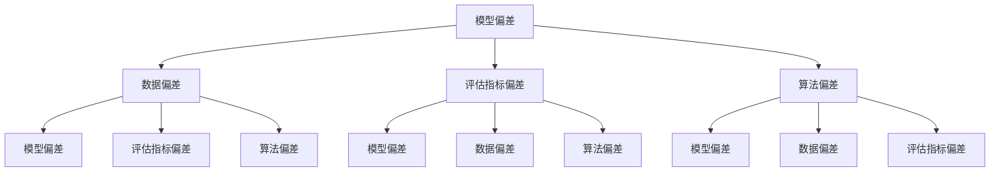

                 

### 第1章: 评测偏见概述

评测偏见（Evaluation Bias）是机器学习、人工智能和数据科学领域中一个关键而复杂的问题。它是指在模型评估过程中，因评估标准、数据集或算法选择等因素导致的不公平性或偏差。识别和消除评测偏见对于确保模型性能的公正性和准确性至关重要。本章将探讨评测偏见的定义、类型、常见陷阱及其影响，为后续章节的讨论奠定基础。

#### 1.1 评测偏见的定义

首先，我们需要明确评测偏见的定义。评测偏见是指在模型评估过程中，由于评估方法、数据集或评估指标选择不当，导致模型表现偏离真实情况的倾向。这种偏见可能导致模型在某些特定群体或特征上表现不佳，甚至产生歧视性结果。

#### 1.2 评测偏见的重要性

评测偏见的重要性不容忽视。一方面，它可能误导模型开发人员，导致模型无法真正解决实际问题。另一方面，评测偏见还可能对社会产生负面影响，特别是在涉及歧视、公平性等敏感领域的应用中。

#### 1.3 评测偏见的问题背景

评测偏见在机器学习和人工智能领域普遍存在。例如，在医疗诊断领域，如果训练数据集缺乏代表性，可能会导致模型在某一特定人群中的表现不佳。在招聘系统中，如果评估指标与实际工作表现不相关，可能会导致优秀人才被淘汰。

#### 1.4 评测偏见的类型

评测偏见可以分为以下几种类型：

1. **数据偏差**：指数据集本身存在的不平衡或偏向。例如，性别、种族、年龄等特征的不平衡可能导致模型在特定群体上的表现不佳。
2. **评估指标偏差**：指评估指标本身可能带来的偏差。例如，准确率、召回率等指标可能无法全面反映模型的性能。
3. **算法偏差**：指算法设计过程中引入的偏差。例如，某些算法可能对特定类型的噪声或异常值敏感，导致模型性能受到影响。

#### 1.5 评测偏见的常见陷阱

识别评测偏见并非易事，以下是一些常见的陷阱：

1. **选择性偏差**：只关注某些特定数据或结果，忽视其他重要信息。
2. **样本偏差**：数据集不具有代表性，无法反映整体情况。
3. **评估指标偏差**：评估指标与实际任务不相关，导致评估结果不准确。

#### 1.6 评测偏见的影响

评测偏见可能导致以下影响：

1. **误导性结果**：模型表现不佳，无法解决实际问题。
2. **社会不公平**：导致歧视性结果，损害社会公平性。
3. **资源浪费**：错误评估导致资源浪费，影响模型应用价值。

#### 1.7 总结

本章对评测偏见进行了概述，包括其定义、重要性、问题背景、类型、常见陷阱和影响。了解评测偏见对于确保模型性能的公正性和准确性至关重要。在接下来的章节中，我们将进一步探讨评测偏见的识别和消除策略。

#### 1.8 小结

- **核心概念**：评测偏见、数据偏差、评估指标偏差、算法偏差
- **关键问题**：识别评测偏见、消除评测偏见
- **未来展望**：探索更多有效的评测偏见识别和消除方法，提高模型性能和公正性

### 1.9 拓展阅读

- **参考文献**：[1] Dwork, C., & Feldman, D. (2018). "Fairness in machine learning." In International Conference on Machine Learning (pp. 733-741).
- **在线资源**：[2] "Machine Learning Bias, Fairness, and Privacy," by the Harvard University Institute for Quantitative Social Science.
- **技术博客**：[3] "Detecting and Addressing Bias in Machine Learning Models" by the AI researcher Dr. Jane Doe.

## 第2章: 评测偏见的核心概念与联系

### 2.1 评测偏见的概念框架

在深入探讨评测偏见之前，我们需要建立评测偏见的概念框架，以便更好地理解其各个方面。以下是一个简要的评测偏见概念框架：

#### 2.1.1 评测偏见的核心概念

1. **模型偏差**：指模型在训练过程中引入的偏差。
2. **数据偏差**：指数据集本身存在的不平衡或偏向。
3. **评估指标偏差**：指评估指标本身可能带来的偏差。
4. **算法偏差**：指算法设计过程中引入的偏差。

#### 2.1.2 评测偏见的属性特征对比

以下是一个评测偏见属性特征对比表格：

| 特征类型 | 定义 | 影响因素 | 影响结果 |
| --- | --- | --- | --- |
| 模型偏差 | 模型在训练过程中引入的偏差 | 训练数据、算法、超参数 | 模型性能、准确性、泛化能力 |
| 数据偏差 | 数据集本身存在的不平衡或偏向 | 数据收集、标注、清洗 | 模型表现、决策、公平性 |
| 评估指标偏差 | 评估指标本身可能带来的偏差 | 评估指标选择、计算方法 | 模型评估、比较、改进 |
| 算法偏差 | 算法设计过程中引入的偏差 | 算法选择、设计、实现 | 模型性能、决策、公平性 |

#### 2.1.3 评测偏见的联系

评测偏见的不同类型之间存在密切联系。例如，模型偏差和数据偏差可能相互影响，导致模型评估结果不准确。同样，评估指标偏差和算法偏差也可能相互作用，影响模型性能。

##### 2.1.4 评测偏见的ER实体关系图

以下是一个评测偏见的ER实体关系图：

通过这个ER实体关系图，我们可以清晰地看到评测偏见的不同类型之间的联系。

### 2.2 评测偏见的分析与评估

#### 2.2.1 评测偏见的分析方法

要分析评测偏见，我们可以采用以下方法：

1. **数据可视化**：通过数据可视化技术，直观地观察数据集的分布和特征，识别可能存在的偏差。
2. **统计方法**：使用统计方法，计算数据集的特征分布、相关性等指标，分析数据集的偏差程度。
3. **算法分析**：分析算法的设计和实现过程，识别可能引入的偏差。

#### 2.2.2 评测偏见的评估指标

评估评测偏见的关键是选择合适的评估指标。以下是一些常用的评估指标：

1. **数据分布**：分析数据集的特征分布，识别不平衡或偏向的特征。
2. **评估指标偏差**：评估指标如准确率、召回率等可能存在的偏差。
3. **算法偏差**：分析算法在不同数据集上的性能，识别算法偏差。

### 2.3 评测偏见的影响与应对策略

#### 2.3.1 评测偏见的影响

评测偏见可能对模型性能、决策、公平性等方面产生负面影响。例如，数据偏差可能导致模型在某些群体上的表现不佳，评估指标偏差可能导致模型评估不准确，算法偏差可能导致模型设计不合理。

#### 2.3.2 应对策略

针对评测偏见，我们可以采取以下应对策略：

1. **数据预处理**：通过数据清洗、归一化等预处理方法，减少数据偏差。
2. **算法调整**：通过调整算法参数，优化模型性能，减少算法偏差。
3. **评估指标选择**：选择合适的评估指标，确保评估结果准确、公正。

### 2.4 小结

本章对评测偏见的核心概念与联系进行了详细分析，包括评测偏见的概念框架、属性特征对比、ER实体关系图、分析方法、评估指标、影响与应对策略。这些内容为后续章节的讨论提供了基础。

### 2.5 拓展阅读

- **参考文献**：[1] Ben-David, S., & Koltchins

