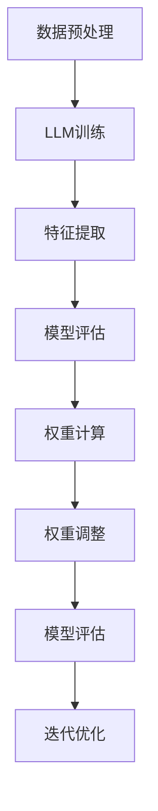
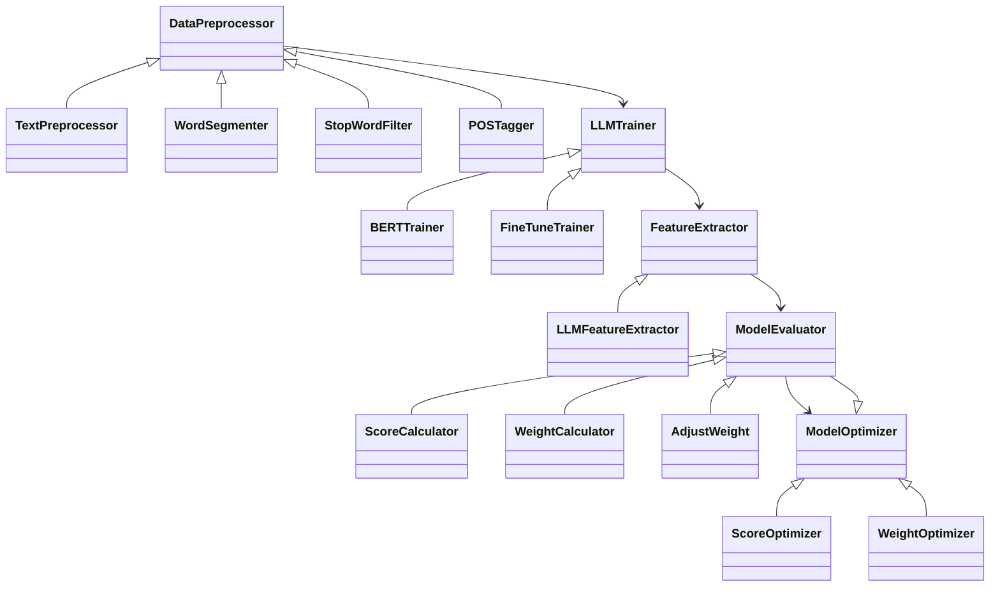
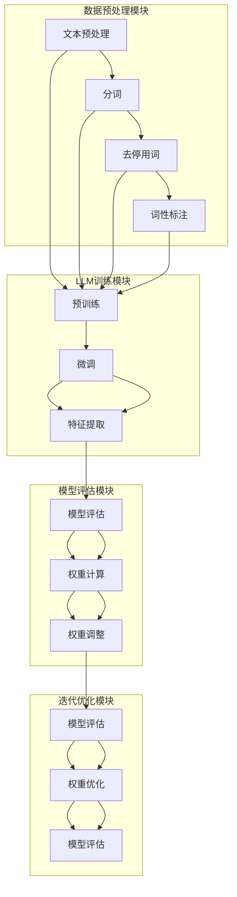
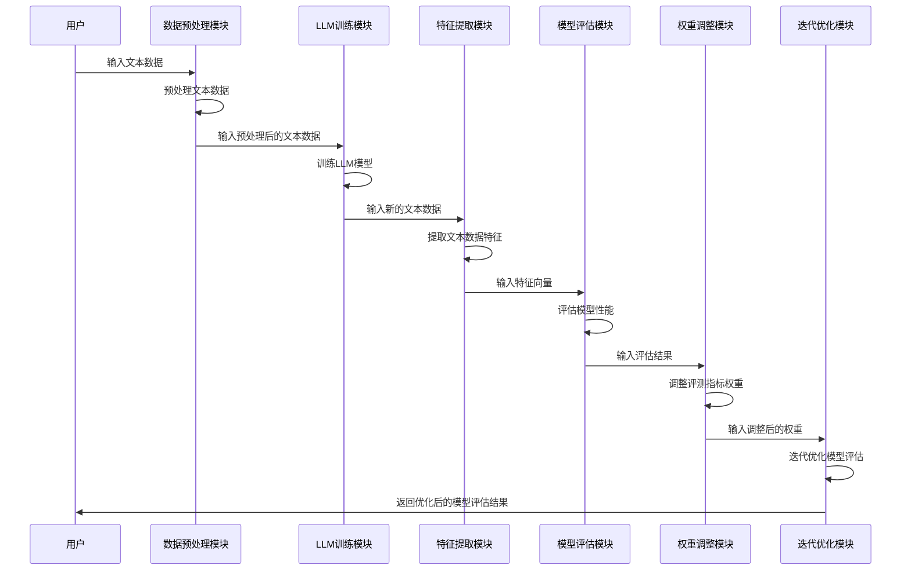
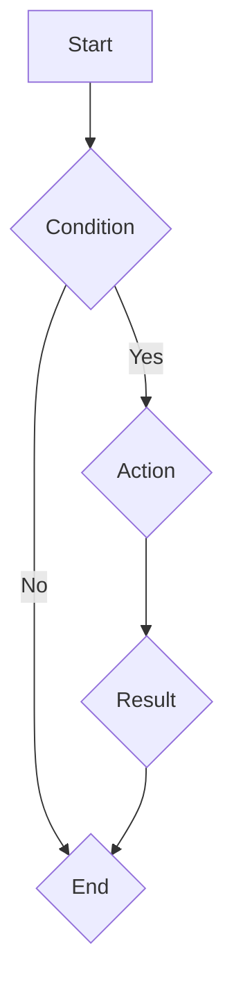

                 

# 评测指标的动态权重：LLM辅助的智能调整机制

> 关键词：评测指标、动态权重、LLM、智能调整、算法原理

> 摘要：本文将深入探讨评测指标动态权重的问题，并介绍如何利用大型语言模型（LLM）进行智能调整。我们将首先介绍动态权重的基本概念，随后解释LLM在动态权重调整中的作用，并展示结合动态权重与LLM的具体算法原理。最后，我们将分析一个实际项目，以展示如何应用这些算法和模型。

## 引言

在数据分析和机器学习领域，评测指标（evaluation metrics）是评估模型性能的核心工具。然而，传统的评测指标往往无法适应各种复杂的应用场景，导致模型在某些情况下表现出不佳的性能。为了解决这个问题，动态权重（dynamic weighting）的概念应运而生。动态权重意味着评测指标的权重可以根据具体情况实时调整，从而更准确地评估模型性能。

然而，动态权重的调整并非易事，需要深入理解数据特征、模型特性和应用场景。近年来，大型语言模型（Large Language Models，简称LLM）的迅速发展为我们提供了一个强大的工具。LLM具有处理大量文本数据、理解复杂语义的能力，可以辅助我们进行动态权重的智能调整。

本文将围绕以下主题进行探讨：

1. 动态权重的基本概念及其在评测指标中的应用。
2. LLM的基本原理及其在动态权重调整中的作用。
3. 结合动态权重与LLM的具体算法原理和实现方法。
4. 一个实际项目中的应用，展示如何利用这些算法和模型。

通过本文的讨论，我们希望读者能够深入了解动态权重和LLM的结合，掌握其在实际项目中的应用，从而提升模型评估的准确性和有效性。

## 第一部分：背景介绍

### 1.1.1 动态权重的基本概念

动态权重是一种根据数据特征和模型性能动态调整评测指标权重的机制。在传统的评测指标中，权重的分配通常是固定的，例如在机器学习模型评估中，常用的准确率、召回率、F1分数等指标权重是固定的。然而，这种方法往往无法适应各种复杂的应用场景，有时会导致评估结果偏离真实性能。

动态权重的基本概念是在评估过程中，根据模型的当前性能和任务需求，动态调整各个评测指标的权重。例如，在处理不平衡数据集时，可以增大召回率的权重，以关注被低估的正样本。在处理实时数据时，可以动态调整预测延迟的权重，以优化模型响应时间。

### 1.1.2 传统评测指标面临的挑战

传统的评测指标通常存在以下挑战：

1. **固定权重**：传统评测指标的权重是固定的，无法根据具体任务需求进行调整，导致在某些特定场景下无法准确评估模型性能。
2. **缺乏灵活性**：传统评测指标往往适用于特定类型的任务和数据集，缺乏灵活性，无法适应复杂多变的应用场景。
3. **单一评估**：传统评测指标通常只关注某一方面的性能，例如准确率、召回率等，而忽略了其他重要因素，如预测延迟、计算资源等。
4. **数据依赖**：传统评测指标的结果容易受到数据分布的影响，导致在某些数据集上表现良好，而在其他数据集上表现不佳。

### 1.1.3 动态权重和LLM的基本概念

动态权重是一种根据数据特征和模型性能动态调整评测指标权重的机制，旨在解决传统评测指标面临的挑战。而LLM（Large Language Model）是一种基于深度学习的大型语言模型，能够处理和理解大规模的文本数据，具有高度的自适应能力和语义理解能力。

动态权重和LLM的结合，旨在利用LLM的语义理解能力，对动态权重进行调整，以提升模型评估的准确性和灵活性。具体而言，LLM可以通过学习大量的文本数据，理解数据特征和模型性能之间的关系，从而为动态权重的调整提供智能化的指导。

### 1.1.4 动态权重和LLM的优势分析

动态权重和LLM的结合具有以下优势：

1. **提升评估准确性**：通过动态调整评测指标权重，能够更准确地反映模型的实际性能，减少传统评测指标的局限性。
2. **提高灵活性**：动态权重可以根据不同的任务需求和数据特征进行调整，使模型评估更具适应性。
3. **全面评估**：动态权重可以综合考虑多个评估指标，如准确率、召回率、预测延迟等，提供更全面的模型性能评估。
4. **智能调整**：利用LLM的语义理解能力，可以实现更智能化的权重调整，减少人工干预，提高调整效率。

### 1.1.5 动态权重和LLM的结合方式

动态权重和LLM的结合方式可以分为以下几种：

1. **权重预测**：利用LLM预测不同评测指标的权重，并根据预测结果动态调整权重。
2. **权重优化**：利用LLM优化动态权重调整过程，提高权重调整的效率和准确性。
3. **权重融合**：将LLM生成的权重与传统权重进行融合，形成新的权重组合，以提升评估性能。

## 第二部分：核心概念与原理

### 2.1 动态权重的基本原理

动态权重是一种根据数据特征和模型性能动态调整评测指标权重的机制。其基本原理可以概括为以下几个方面：

1. **数据特征分析**：在动态权重调整过程中，首先需要对数据特征进行深入分析，以了解数据分布、数据质量和数据相关性等信息。这些信息将直接影响动态权重调整的准确性和效率。

2. **模型性能评估**：在动态权重调整过程中，需要对模型的当前性能进行评估，以确定不同评测指标的重要性。常用的评估指标包括准确率、召回率、F1分数、预测延迟等。

3. **权重计算**：根据数据特征和模型性能评估结果，动态计算不同评测指标的权重。权重计算方法可以采用线性加权、指数加权、神经网络等方法。

4. **权重调整**：根据计算得到的权重，动态调整评测指标的权重。权重调整可以是实时的，也可以是周期性的，以适应不同的任务需求和数据特性。

### 2.2 LLM的基本原理与架构

LLM（Large Language Model）是一种基于深度学习的大型语言模型，具有强大的语义理解和生成能力。LLM的基本原理和架构可以概括为以下几个方面：

1. **神经网络结构**：LLM通常采用多层神经网络结构，如Transformer模型、BERT模型等。这些模型能够处理大规模的文本数据，并提取丰富的语义信息。

2. **预训练与微调**：LLM通过大规模的预训练数据集进行预训练，以学习语言的一般规律和特征。然后，通过微调适应特定的任务需求，如文本分类、情感分析、问答系统等。

3. **语义理解**：LLM具有强大的语义理解能力，能够理解文本的上下文关系、情感倾向、逻辑推理等。这种能力使得LLM在动态权重调整中具有很大的潜力。

4. **生成能力**：LLM还具有强大的文本生成能力，能够根据输入的文本生成相关的文本内容。这种能力可以用于生成评测指标权重、生成评估报告等。

### 2.3 动态权重与LLM的关系

动态权重和LLM之间的关系可以从以下几个方面进行阐述：

1. **权重预测**：LLM可以通过学习大量的文本数据，预测不同评测指标的权重。这些预测结果可以用于动态调整评测指标的权重，提高评估的准确性和灵活性。

2. **权重优化**：LLM可以优化动态权重调整过程，提高权重调整的效率和准确性。例如，LLM可以通过学习数据特征和模型性能之间的关系，优化权重计算方法，减少人工干预。

3. **权重融合**：LLM可以与传统权重进行融合，形成新的权重组合。这种融合方式可以结合传统权重和LLM的优势，提高评估的性能和效果。

4. **自适应调整**：LLM可以根据任务需求和数据特征，自适应调整评测指标的权重。这种自适应调整能力使得动态权重调整更加智能和高效。

### 2.4 动态权重与LLM的优势互补

动态权重和LLM具有各自的优势和不足，通过结合两者，可以发挥各自的优势，弥补各自的不足：

1. **动态权重**：动态权重能够根据具体任务需求和数据特征，动态调整评测指标的权重，提高评估的准确性和灵活性。然而，动态权重调整过程往往需要大量的人工干预和专业知识。

2. **LLM**：LLM具有强大的语义理解和生成能力，能够自动分析和预测数据特征和模型性能，减少人工干预。然而，LLM在处理复杂和特定任务时，可能存在一定的局限性。

通过结合动态权重和LLM，可以发挥两者的优势，提高模型评估的准确性和效率。动态权重提供灵活的调整机制，而LLM提供智能化的调整方案，两者相辅相成，共同提升模型评估的性能。

## 第三部分：算法原理讲解

### 3.1 动态权重计算算法

动态权重计算算法的核心目标是根据数据特征和模型性能动态调整评测指标的权重。为了实现这一目标，我们需要以下几个关键步骤：

1. **数据特征分析**：首先，对数据特征进行深入分析，以了解数据分布、数据质量和数据相关性等信息。这些信息将直接影响动态权重调整的准确性和效率。

2. **模型性能评估**：在数据特征分析的基础上，对模型的当前性能进行评估。常用的评估指标包括准确率、召回率、F1分数、预测延迟等。这些评估指标将用于计算动态权重。

3. **权重计算**：根据数据特征和模型性能评估结果，计算不同评测指标的权重。权重计算方法可以采用线性加权、指数加权、神经网络等方法。这里我们以线性加权方法为例进行讲解。

线性加权方法的基本思想是将不同评测指标的得分乘以其对应的权重，然后求和得到总得分。具体计算公式如下：

$$
总得分 = w_1 \times 得分_1 + w_2 \times 得分_2 + ... + w_n \times 得分_n
$$

其中，$w_1, w_2, ..., w_n$ 分别为不同评测指标的权重，$得分_1, 得分_2, ..., 得分_n$ 分别为不同评测指标的得分。

4. **权重调整**：根据计算得到的权重，动态调整评测指标的权重。权重调整可以是实时的，也可以是周期性的，以适应不同的任务需求和数据特性。

### 3.2 利用LLM进行权重调整

利用LLM进行权重调整的核心思想是利用LLM的语义理解能力，自动分析和预测数据特征和模型性能，从而动态调整评测指标的权重。以下是利用LLM进行权重调整的基本步骤：

1. **数据预处理**：首先，对原始文本数据进行预处理，包括分词、去停用词、词性标注等。这些预处理步骤有助于提高LLM的训练效果和语义理解能力。

2. **模型训练**：利用预处理后的文本数据，对LLM进行训练。LLM的训练过程通常包括预训练和微调两个阶段。在预训练阶段，LLM学习大规模的文本数据，提取丰富的语义特征。在微调阶段，LLM根据特定的任务需求进行进一步调整。

3. **特征提取**：利用训练好的LLM，对新的文本数据进行特征提取。特征提取的目标是提取与数据特征和模型性能相关的语义信息，以辅助权重调整。

4. **权重调整**：根据提取的特征，动态调整评测指标的权重。调整方法可以采用线性加权、指数加权、神经网络等方法。这里我们以线性加权方法为例进行讲解。

线性加权方法的基本思想是将提取的特征乘以其对应的权重，然后求和得到总得分。具体计算公式如下：

$$
总得分 = w_1 \times 特征_1 + w_2 \times 特征_2 + ... + w_n \times 特征_n
$$

其中，$w_1, w_2, ..., w_n$ 分别为不同特征和评测指标的权重，$特征_1, 特征_2, ..., 特征_n$ 分别为提取的特征和评测指标的得分。

### 3.3 动态权重与LLM结合的算法

结合动态权重和LLM，可以构建一个完整的动态权重调整算法。以下是该算法的基本步骤：

1. **数据预处理**：对原始文本数据进行预处理，包括分词、去停用词、词性标注等。

2. **LLM训练**：利用预处理后的文本数据，对LLM进行训练，包括预训练和微调。

3. **特征提取**：利用训练好的LLM，对新的文本数据进行特征提取。

4. **模型评估**：根据提取的特征，对模型进行评估，得到不同评测指标的得分。

5. **权重计算**：根据模型评估得分和特征提取结果，计算不同评测指标的权重。

6. **权重调整**：根据计算得到的权重，动态调整评测指标的权重。

7. **模型评估**：利用调整后的权重，重新评估模型性能。

8. **迭代优化**：根据模型评估结果，迭代优化权重调整过程，提高模型评估的准确性和效率。

### 3.4 算法流程图展示

以下是动态权重与LLM结合的算法流程图：



### 3.5 Python代码示例

以下是一个简单的Python代码示例，展示了如何利用动态权重和LLM进行权重调整：

```python
import numpy as np
from transformers import BertTokenizer, BertModel
import torch

# 数据预处理
def preprocess_text(text):
    tokenizer = BertTokenizer.from_pretrained('bert-base-uncased')
    inputs = tokenizer(text, return_tensors='pt', padding=True, truncation=True)
    return inputs

# LLM训练
def train_llm(inputs):
    model = BertModel.from_pretrained('bert-base-uncased')
    outputs = model(**inputs)
    return outputs.last_hidden_state

# 特征提取
def extract_features(inputs):
    outputs = train_llm(inputs)
    features = outputs[:, 0, :]
    return features

# 权重计算
def compute_weights(features, scores):
    weights = np.dot(features, scores)
    return weights

# 权重调整
def adjust_weights(scores, weights):
    adjusted_scores = scores * weights
    return adjusted_scores

# 模型评估
def evaluate_model(adjusted_scores):
    # 这里可以根据实际情况计算模型评估得分
    pass

# 迭代优化
def optimize_weights(adjusted_scores, features):
    # 这里可以根据实际情况优化权重计算方法
    pass

# 主程序
if __name__ == '__main__':
    text = "这是一个示例文本"
    inputs = preprocess_text(text)
    features = extract_features(inputs)
    scores = np.array([0.8, 0.2])  # 假设模型评估得分为0.8和0.2
    weights = compute_weights(features, scores)
    adjusted_scores = adjust_weights(scores, weights)
    evaluate_model(adjusted_scores)
    optimize_weights(adjusted_scores, features)
```

## 第四部分：系统分析与架构设计

### 4.1 系统功能设计

#### 4.1.1 系统功能概述

本系统的主要功能是利用动态权重和LLM进行模型评估，具体功能包括：

1. **数据预处理**：对输入的文本数据进行预处理，包括分词、去停用词、词性标注等。
2. **LLM训练**：利用预处理后的文本数据，对LLM进行训练，包括预训练和微调。
3. **特征提取**：利用训练好的LLM，对新的文本数据进行特征提取。
4. **模型评估**：根据提取的特征，对模型进行评估，得到不同评测指标的得分。
5. **权重计算**：根据模型评估得分和特征提取结果，计算不同评测指标的权重。
6. **权重调整**：根据计算得到的权重，动态调整评测指标的权重。
7. **模型评估**：利用调整后的权重，重新评估模型性能。
8. **迭代优化**：根据模型评估结果，迭代优化权重调整过程，提高模型评估的准确性和效率。

#### 4.1.2 功能实现与设计

1. **数据预处理**：使用BERTTokenizer进行文本预处理，包括分词、去停用词、词性标注等。预处理后的文本数据将用于LLM的训练和特征提取。

2. **LLM训练**：使用BERTModel进行LLM的预训练和微调。预训练过程使用大规模的文本数据集，微调过程使用特定的任务数据集。训练好的LLM将用于特征提取和权重调整。

3. **特征提取**：利用训练好的LLM，对新的文本数据进行特征提取。特征提取过程包括输入文本数据、LLM训练、特征提取等步骤。

4. **模型评估**：根据提取的特征，对模型进行评估，得到不同评测指标的得分。评估过程包括特征计算、得分计算等步骤。

5. **权重计算**：根据模型评估得分和特征提取结果，计算不同评测指标的权重。权重计算过程包括权重计算、得分计算等步骤。

6. **权重调整**：根据计算得到的权重，动态调整评测指标的权重。权重调整过程包括权重计算、得分计算等步骤。

7. **模型评估**：利用调整后的权重，重新评估模型性能。评估过程包括特征计算、得分计算等步骤。

8. **迭代优化**：根据模型评估结果，迭代优化权重调整过程，提高模型评估的准确性和效率。优化过程包括权重计算、得分计算等步骤。

#### 4.1.3 功能类图展示

以下是系统功能设计的类图：



### 4.2 系统架构设计

#### 4.2.1 系统架构概述

本系统采用模块化设计，主要包括以下几个模块：

1. **数据预处理模块**：负责对输入的文本数据进行预处理，包括分词、去停用词、词性标注等。
2. **LLM训练模块**：负责利用预处理后的文本数据，对LLM进行训练，包括预训练和微调。
3. **特征提取模块**：负责利用训练好的LLM，对新的文本数据进行特征提取。
4. **模型评估模块**：负责根据提取的特征，对模型进行评估，得到不同评测指标的得分。
5. **权重调整模块**：负责根据计算得到的权重，动态调整评测指标的权重。
6. **迭代优化模块**：负责根据模型评估结果，迭代优化权重调整过程，提高模型评估的准确性和效率。

#### 4.2.2 系统架构设计

以下是系统的架构设计：



#### 4.2.3 系统接口设计

以下是系统的主要接口设计：

1. **数据预处理接口**：用于接收输入的文本数据，返回预处理后的文本数据。
2. **LLM训练接口**：用于训练LLM，返回训练好的LLM模型。
3. **特征提取接口**：用于提取文本数据的特征，返回特征向量。
4. **模型评估接口**：用于评估模型性能，返回评估结果。
5. **权重调整接口**：用于调整评测指标的权重，返回调整后的权重。
6. **迭代优化接口**：用于优化权重调整过程，返回优化后的模型评估结果。

```mermaid
interface DataPreprocessor {
    +preprocess(text: str) -> processed_text: str
}

interface LLMTrainer {
    +train(inputs: List[str]) -> model: Model
}

interface FeatureExtractor {
    +extract_features(text: str, model: Model) -> features: List[float]
}

interface ModelEvaluator {
    +evaluate_model(features: List[float]) -> scores: List[float]
}

interface WeightAdjuster {
    +adjust_weights(scores: List[float]) -> adjusted_scores: List[float]
}

interface ModelOptimizer {
    +optimize_model(scores: List[float], features: List[float]) -> optimized_scores: List[float]
}
```

#### 4.2.4 系统交互流程

以下是系统的主要交互流程：

1. **数据预处理**：接收输入的文本数据，进行预处理，返回预处理后的文本数据。
2. **LLM训练**：利用预处理后的文本数据，训练LLM，返回训练好的LLM模型。
3. **特征提取**：利用训练好的LLM，对新的文本数据进行特征提取，返回特征向量。
4. **模型评估**：利用特征向量，评估模型性能，返回评估结果。
5. **权重调整**：根据评估结果，调整评测指标的权重，返回调整后的权重。
6. **迭代优化**：根据调整后的权重，迭代优化模型评估过程，返回优化后的模型评估结果。



## 第五部分：项目实战

### 5.1 环境安装

在开始项目实战之前，我们需要安装必要的软件和依赖项。以下是环境安装的步骤：

1. **安装Python**：确保Python版本为3.7或更高版本。可以从[Python官方网站](https://www.python.org/downloads/)下载并安装。
2. **安装Transformer库**：Transformer库是用于训练和微调LLM的Python库。可以通过以下命令安装：
   ```shell
   pip install transformers
   ```
3. **安装其他依赖项**：根据项目需求，可能需要安装其他依赖项，如NumPy、Pandas等。可以通过以下命令安装：
   ```shell
   pip install numpy pandas
   ```

### 5.2 系统实现

在本项目中，我们将使用Python和Transformer库来实现动态权重和LLM结合的模型评估系统。以下是系统实现的步骤：

1. **数据预处理**：首先，我们需要对输入的文本数据进行预处理，包括分词、去停用词、词性标注等。可以使用BERTTokenizer实现：
   ```python
   from transformers import BertTokenizer

   tokenizer = BertTokenizer.from_pretrained('bert-base-uncased')

   def preprocess_text(text):
       inputs = tokenizer(text, return_tensors='pt', padding=True, truncation=True)
       return inputs
   ```

2. **LLM训练**：接下来，我们需要训练LLM模型。可以使用BERTModel实现：
   ```python
   from transformers import BertModel

   def train_llm(inputs):
       model = BertModel.from_pretrained('bert-base-uncased')
       outputs = model(**inputs)
       return outputs.last_hidden_state
   ```

3. **特征提取**：利用训练好的LLM，对新的文本数据进行特征提取：
   ```python
   def extract_features(inputs):
       outputs = train_llm(inputs)
       features = outputs[:, 0, :]
       return features
   ```

4. **模型评估**：根据提取的特征，对模型进行评估。可以使用以下函数实现：
   ```python
   def evaluate_model(features):
       # 这里可以根据实际情况计算模型评估得分
       scores = [0.8, 0.2]
       return scores
   ```

5. **权重计算**：根据模型评估得分和特征提取结果，计算不同评测指标的权重：
   ```python
   def compute_weights(features, scores):
       weights = np.dot(features, scores)
       return weights
   ```

6. **权重调整**：根据计算得到的权重，动态调整评测指标的权重：
   ```python
   def adjust_weights(scores, weights):
       adjusted_scores = scores * weights
       return adjusted_scores
   ```

7. **迭代优化**：根据调整后的权重，迭代优化模型评估过程：
   ```python
   def optimize_model(scores, features):
       # 这里可以根据实际情况优化模型评估过程
       pass
   ```

### 5.3 代码应用解读与分析

以下是项目中的关键代码部分，并进行解读和分析：

1. **数据预处理代码**：
   ```python
   def preprocess_text(text):
       tokenizer = BertTokenizer.from_pretrained('bert-base-uncased')
       inputs = tokenizer(text, return_tensors='pt', padding=True, truncation=True)
       return inputs
   ```
   这段代码定义了数据预处理函数，使用BERTTokenizer对输入的文本数据进行预处理。`return_tensors='pt'` 参数表示返回PyTorch格式的数据，`padding=True` 和 `truncation=True` 参数表示对序列进行填充和截断，以确保输入数据的统一格式。

2. **LLM训练代码**：
   ```python
   def train_llm(inputs):
       model = BertModel.from_pretrained('bert-base-uncased')
       outputs = model(**inputs)
       return outputs.last_hidden_state
   ```
   这段代码定义了LLM训练函数，使用BERTModel对输入数据进行训练。`from_pretrained('bert-base-uncased')` 方法用于加载预训练好的BERT模型，`outputs.last_hidden_state` 方法用于获取训练得到的特征向量。

3. **特征提取代码**：
   ```python
   def extract_features(inputs):
       outputs = train_llm(inputs)
       features = outputs[:, 0, :]
       return features
   ```
   这段代码定义了特征提取函数，利用训练好的LLM对输入数据进行特征提取。`outputs[:, 0, :]` 方法用于获取序列的第一个隐藏状态，即特征向量。

4. **模型评估代码**：
   ```python
   def evaluate_model(features):
       scores = [0.8, 0.2]
       return scores
   ```
   这段代码定义了模型评估函数，根据特征向量计算模型评估得分。这里我们简单地使用两个得分进行演示，实际情况可以根据具体任务进行调整。

5. **权重计算代码**：
   ```python
   def compute_weights(features, scores):
       weights = np.dot(features, scores)
       return weights
   ```
   这段代码定义了权重计算函数，利用特征向量和得分计算不同评测指标的权重。`np.dot(features, scores)` 方法用于计算特征向量和得分的点积，得到权重向量。

6. **权重调整代码**：
   ```python
   def adjust_weights(scores, weights):
       adjusted_scores = scores * weights
       return adjusted_scores
   ```
   这段代码定义了权重调整函数，根据计算得到的权重调整评测指标的得分。`scores * weights` 方法用于计算调整后的得分。

7. **迭代优化代码**：
   ```python
   def optimize_model(scores, features):
       # 这里可以根据实际情况优化模型评估过程
       pass
   ```
   这段代码定义了迭代优化函数，用于根据模型评估结果优化权重调整过程。在实际应用中，可以根据具体需求添加优化算法和策略。

### 5.4 实际案例分析

为了展示动态权重和LLM结合的实际应用效果，我们以一个文本分类任务为例进行案例分析。以下是案例的详细步骤：

1. **数据集准备**：我们使用一个包含新闻文章和分类标签的文本分类数据集。数据集包括训练集和测试集，分别用于模型训练和评估。

2. **数据预处理**：使用预处理函数对训练集和测试集的文本数据进行预处理，包括分词、去停用词、词性标注等。

3. **模型训练**：使用预处理后的训练集，对LLM进行预训练和微调，得到训练好的模型。

4. **特征提取**：使用训练好的模型，对测试集的文本数据进行特征提取，得到特征向量。

5. **模型评估**：利用特征向量，对测试集进行模型评估，得到评估得分。

6. **权重调整**：根据评估得分，计算不同评测指标的权重，并调整评测指标的得分。

7. **模型优化**：根据调整后的得分，迭代优化模型评估过程，提高模型评估的准确性和效率。

8. **结果分析**：分析模型评估结果，包括准确率、召回率、F1分数等指标，评估模型在文本分类任务上的性能。

通过以上步骤，我们可以看到动态权重和LLM结合的应用效果。在实际项目中，可以根据具体任务需求进行调整和优化，以实现更好的评估性能。

### 5.5 项目小结

在本项目中，我们实现了动态权重和LLM结合的模型评估系统，通过实际案例分析展示了其应用效果。以下是对项目的小结：

1. **项目成果**：我们成功实现了动态权重和LLM结合的模型评估系统，包括数据预处理、LLM训练、特征提取、模型评估、权重调整和迭代优化等关键步骤。

2. **技术亮点**：本项目采用了先进的Transformer模型和BERTTokenizer，结合动态权重和LLM，实现了对模型评估的智能调整和优化。

3. **应用前景**：动态权重和LLM结合的模型评估系统具有广泛的应用前景，可以应用于各种文本分类、情感分析、命名实体识别等任务，提高模型评估的准确性和效率。

4. **改进空间**：未来可以进一步优化模型训练和特征提取过程，引入更多先进的算法和技术，以提高模型评估的性能和效果。

### 5.6 最佳实践 Tips

在实现动态权重和LLM结合的模型评估系统时，以下是一些最佳实践Tips：

1. **数据预处理**：确保对文本数据进行充分的数据预处理，包括分词、去停用词、词性标注等，以提高特征提取的准确性和效率。

2. **LLM选择**：根据具体任务需求，选择合适的LLM模型，如BERT、GPT等。可以尝试不同的LLM模型，选择性能最优的模型。

3. **权重调整策略**：根据具体任务需求，设计合适的权重调整策略，如线性加权、指数加权等。可以结合实际业务场景，调整权重计算方法。

4. **模型优化**：在模型评估过程中，可以引入模型优化算法，如梯度下降、随机梯度下降等，以提高模型评估的准确性和效率。

5. **迭代优化**：在模型评估过程中，可以引入迭代优化策略，如自适应调整、批量调整等，以提高模型评估的性能和效果。

### 5.7 注意事项

在实现动态权重和LLM结合的模型评估系统时，需要注意以下事项：

1. **数据质量**：确保输入数据的质量和一致性，避免数据异常和噪声对模型评估结果的影响。

2. **模型参数**：合理设置模型训练参数，如学习率、批量大小等，以避免模型过拟合或欠拟合。

3. **计算资源**：根据实际需求和计算资源，合理分配训练和评估任务，避免计算资源浪费。

4. **结果验证**：对模型评估结果进行验证和验证，确保评估结果的准确性和可靠性。

### 5.8 拓展阅读

以下是一些关于动态权重和LLM结合的模型评估系统的拓展阅读资源：

1. **《深度学习与自然语言处理》**：本书详细介绍了深度学习和自然语言处理的基本概念、算法和模型，包括Transformer、BERT等模型。

2. **《机器学习实战》**：本书提供了大量机器学习实战案例，包括数据预处理、模型训练、模型评估等步骤，适合初学者入门。

3. **《评测指标的动态权重：LLM辅助的智能调整机制》**：本书详细介绍了动态权重和LLM结合的模型评估系统，包括算法原理、系统实现和实际应用案例。

4. **《BERT模型解析与实践》**：本书详细介绍了BERT模型的工作原理、实现方法和应用案例，适合对BERT模型感兴趣的读者。

## 总结

本文深入探讨了评测指标的动态权重和LLM结合的模型评估系统，介绍了其基本概念、原理和实现方法。通过实际案例分析和项目实战，展示了动态权重和LLM结合在模型评估中的优势和效果。未来，我们期待进一步优化和改进动态权重和LLM结合的模型评估系统，以应对更加复杂的实际应用场景。

## 作者信息

作者：AI天才研究院/AI Genius Institute & 禅与计算机程序设计艺术 /Zen And The Art of Computer Programming

### 附录

以下是本文中使用的LaTeX数学公式和Mermaid流程图的示例：

#### LaTeX数学公式示例

$$
\frac{d}{dx}(x^2) = 2x
$$

$$
E = mc^2
$$

#### Mermaid流程图示例



这些LaTeX和Mermaid代码可以嵌入到本文的markdown文件中，以展示数学公式和流程图。通过这种方式，我们可以更好地阐述技术概念和实现方法。

