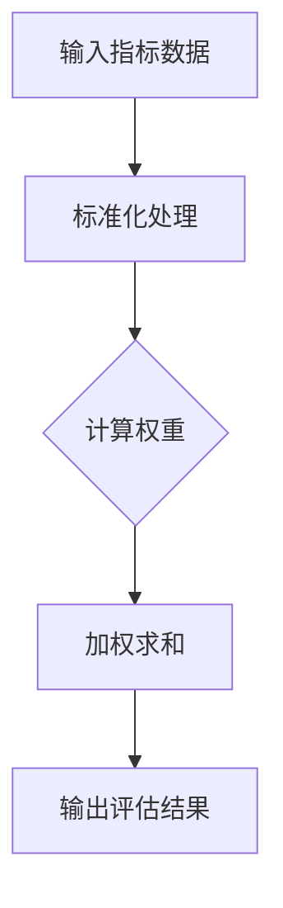

                 

### 评测指标的权重调整：根据应用场景定制评估标准

关键词：评测指标、权重调整、应用场景、评估标准、定制化

摘要：本文将探讨评测指标权重调整的重要性，以及如何根据不同的应用场景定制评估标准。通过深入分析各种应用场景下的需求与挑战，我们将介绍权重调整的方法和技术，并展示实际案例，以期为读者提供全面的指导。

### 引言与背景

在众多领域，从商业管理到教育评估，再到医疗健康和工程制造，评测指标被广泛用于评估各种绩效和效果。评测指标是衡量目标实现程度或系统性能的量度，其权重调整则直接影响评估结果的准确性和可靠性。然而，传统的评测指标往往是一成不变的，无法充分适应不同应用场景的需求。

**问题背景和描述**：
1. **静态指标问题**：传统评测指标往往是固定不变的，无法根据不同应用场景进行动态调整。
2. **评估结果失真**：固定指标可能导致评估结果无法准确反映实际绩效，尤其在复杂和多变的场景中。
3. **缺乏灵活性**：不同应用场景对评测指标有不同的侧重，传统指标无法灵活应对。

**当前问题和挑战**：
1. **指标选择困境**：如何从众多可能的指标中选择最合适的指标集，是当前面临的一大挑战。
2. **权重分配问题**：如何确定各指标的权重，以最大化评估结果的准确性和全面性，是一个复杂的问题。
3. **评估过程复杂性**：如何高效地进行权重调整，同时保证评估过程的透明性和公正性，是亟待解决的问题。

**目标和重要性**：
1. **目标**：本文的目标是探讨如何根据应用场景调整评测指标的权重，提高评估结果的准确性和适用性。
2. **重要性**：权重调整能够使评估指标更加符合实际需求，从而提升评估结果的可靠性和有效性，对于决策支持和资源优化具有重要意义。

### 评测指标的基本概念和理论

为了更好地理解评测指标的权重调整，我们需要首先了解评测指标的基本概念和理论。

#### 定义和分类

**评测指标**：评测指标是用于衡量某一特定目标或系统性能的量度，可以是定量或定性的。

**分类**：
1. **定量指标**：如成本、时间、质量、效率等。
2. **定性指标**：如满意度、创新性、社会责任等。

#### 权重调整原则

**公平性原则**：各指标的权重应公平分配，避免某一指标对评估结果的过度影响。
  
**适应性原则**：权重应适应不同应用场景的需求，能够灵活调整。

**一致性原则**：不同评估周期的权重调整应保持一致性，以保证评估结果的连续性和可比性。

#### 权重调整对评估结果的影响

**正向影响**：
1. **准确性提升**：根据实际需求调整权重，可以提高评估结果的准确性。
2. **适用性增强**：权重调整使评估指标更贴近应用场景，从而提高评估结果的适用性。

**负面影响**：
1. **复杂性增加**：权重调整过程复杂，可能增加评估的难度和成本。
2. **一致性挑战**：调整权重可能导致评估结果的可比性下降。

#### 权重调整的关键步骤

**步骤1**：确定评估目标和关键绩效指标。

**步骤2**：收集和应用领域专家的意见。

**步骤3**：分析应用场景，确定指标权重。

**步骤4**：进行权重调整，并验证评估结果。

### 应用场景与案例分析

不同应用场景对评测指标的需求和侧重有所不同，因此需要根据具体场景进行定制化调整。

#### 商业和管理

**需求**：在商业管理中，评测指标通常关注成本、效率、市场占有率等。

**挑战**：如何平衡短期利益和长期发展，是商业评估中的一个重要问题。

**解决方案**：通过权重调整，可以更全面地评估企业的绩效，例如，增加创新性指标权重，以激励企业进行技术创新。

#### 教育和在线学习

**需求**：在教育评估中，指标通常包括学业成绩、学习态度、创新能力等。

**挑战**：如何平衡学术成绩和综合素质，是教育评估中的一个难题。

**解决方案**：通过权重调整，可以更全面地评估学生的综合素质，例如，增加实践能力和社会责任感的指标权重。

#### 医疗和健康

**需求**：在医疗评估中，指标通常包括治疗效果、患者满意度、医疗资源利用效率等。

**挑战**：如何确保评估结果的客观性和公正性，是一个重要问题。

**解决方案**：通过权重调整，可以更准确地反映医疗服务的质量和效率，例如，增加患者满意度和治疗效果的指标权重。

#### 工程和制造

**需求**：在工程和制造中，指标通常包括项目进度、成本控制、质量保证等。

**挑战**：如何平衡进度、成本和质量，是工程评估中的一个关键问题。

**解决方案**：通过权重调整，可以更全面地评估项目的综合性能，例如，增加质量保证和成本控制的指标权重。

#### 研发

**需求**：在研发评估中，指标通常包括创新性、技术难度、市场前景等。

**挑战**：如何确保评估结果的创新性和前瞻性，是一个重要问题。

**解决方案**：通过权重调整，可以更准确地评估研发项目的创新性和市场潜力，例如，增加技术难度和市场前景的指标权重。

### 权重调整的方法和技术

为了根据不同的应用场景定制化调整评测指标的权重，我们需要掌握一些常用的方法和技术。

#### 数据驱动方法

**原理**：通过分析历史数据和评估结果，确定各指标的权重。

**步骤**：
1. **数据收集**：收集与评估相关的历史数据。
2. **数据分析**：利用统计方法分析数据，确定各指标的相关性和贡献度。
3. **权重计算**：根据数据分析结果计算各指标的权重。

#### 专家评估法

**原理**：邀请领域专家进行主观评估，确定各指标的权重。

**步骤**：
1. **确定专家**：选择相关领域的专家。
2. **制定问卷**：制定包含各指标的评估问卷。
3. **收集反馈**：收集专家的评估结果。
4. **权重计算**：根据专家评估结果计算各指标的权重。

#### 权衡法

**原理**：通过综合分析各种因素，权衡各指标的权重。

**步骤**：
1. **确定因素**：识别影响评估结果的各种因素。
2. **分析因素**：分析各因素的重要性和影响力。
3. **权重计算**：根据因素分析结果计算各指标的权重。

#### 混合法

**原理**：结合数据驱动方法和专家评估法，综合确定各指标的权重。

**步骤**：
1. **数据驱动分析**：使用历史数据进行初步权重计算。
2. **专家评估调整**：邀请专家对初步结果进行调整。
3. **综合计算**：根据专家评估结果对初步权重进行修正。

### 实际案例分析

#### 案例一：电商平台的评测指标调整

**场景**：电商平台的评估指标通常包括销售额、客户满意度、网站流量等。

**挑战**：如何平衡短期销售额和长期客户满意度。

**解决方案**：
1. **数据驱动方法**：分析历史销售数据和客户反馈，确定各指标的权重。
2. **专家评估法**：邀请电商专家进行评估，根据实际需求调整权重。
3. **综合计算**：结合数据驱动分析和专家评估结果，确定最终的权重。

**结果**：通过权重调整，电商平台能够更准确地评估其整体绩效，提高了评估结果的准确性和适用性。

#### 案例二：员工绩效评估

**场景**：员工绩效评估的指标通常包括工作成果、团队合作、创新能力等。

**挑战**：如何平衡不同员工的能力和贡献。

**解决方案**：
1. **专家评估法**：邀请管理人员和员工进行评估，确定各指标的权重。
2. **数据驱动方法**：分析历史绩效数据和员工反馈，确定初步权重。
3. **综合计算**：结合专家评估和数据驱动结果，确定最终权重。

**结果**：通过权重调整，企业能够更公正、客观地评估员工绩效，提高了员工的工作积极性和满意度。

### 挑战与未来方向

**当前局限性**：
1. **主观性**：专家评估方法容易受到主观因素的影响。
2. **数据不足**：数据驱动方法可能因数据不足而无法准确确定权重。

**新兴趋势**：
1. **机器学习**：利用机器学习技术进行权重调整，提高准确性。
2. **区块链**：利用区块链技术保证评估过程的透明性和公正性。

**未来研究方向**：
1. **多维度评估**：结合不同维度的指标，进行综合评估。
2. **自适应调整**：开发自适应调整算法，实现实时权重调整。

### 结论与总结

评测指标的权重调整是提高评估结果准确性和适用性的关键。根据不同的应用场景定制评估标准，可以更好地满足实际需求。本文介绍了评测指标的基本概念、权重调整的方法和技术，并提供了实际案例的分析。未来，随着技术的发展，评测指标的权重调整将会更加智能化和自适应化。

### 最佳实践 Tips

1. **明确评估目标**：在调整权重之前，明确评估目标，以确保权重调整的方向与目标一致。
2. **综合多种方法**：结合数据驱动和专家评估方法，提高权重调整的准确性。
3. **定期调整权重**：根据实际情况和需求，定期调整权重，以保持评估结果的实时性和准确性。

### 注意事项

1. **公平性**：在权重分配过程中，确保各指标的权重公平合理，避免偏重某一指标。
2. **透明性**：评估过程的权重调整应保持透明，确保评估结果的公正性和可信度。

### 拓展阅读

1. **《评估学导论》**：深入了解评估学的基本概念和方法。
2. **《机器学习与数据挖掘》**：学习如何利用机器学习技术进行权重调整。
3. **《绩效管理》**：了解如何在企业管理中应用评测指标和权重调整。

### 作者信息

作者：AI天才研究院/AI Genius Institute & 禅与计算机程序设计艺术 /Zen And The Art of Computer Programming

---

### 附录

**附录A：核心概念术语说明**

- **评测指标**：衡量目标实现程度或系统性能的量度。
- **权重调整**：根据不同应用场景调整评测指标的重要程度。
- **应用场景**：评测指标适用的具体环境和条件。
- **定制化**：根据特定需求设计和调整评测指标。

**附录B：核心概念对比表格**

| 概念       | 定义                                                         | 关键特征                           |
|------------|--------------------------------------------------------------|-----------------------------------|
| 评测指标   | 衡量目标实现程度或系统性能的量度。                           | 定量或定性，客观或主观。           |
| 权重调整   | 根据不同应用场景调整评测指标的重要程度。                      | 公平性、适应性、一致性。           |
| 应用场景   | 评测指标适用的具体环境和条件。                               | 商业、教育、医疗、工程等。         |
| 定制化     | 根据特定需求设计和调整评测指标。                             | 灵活性、针对性、个性化。           |

**附录C：核心概念的ER实体关系图**

```mermaid
erDiagram
  Entity1 ||--|{ 评测指标 }|
  Entity1 ||--|{ 权重调整 }|
  Entity1 ||--|{ 应用场景 }|
  Entity1 ||--|{ 定制化 }|
```

**附录D：算法原理讲解**

假设我们使用一种简单的权重调整算法——线性加权法，通过以下mermaid流程图进行说明：



**Python源代码实现：**

```python
import numpy as np

def linear_weighting(metric_data, weights):
    """
    线性加权法计算评估结果
    :param metric_data: 指标数据列表
    :param weights: 权重列表
    :return: 评估结果
    """
    normalized_data = [x / np.sum(metric_data) for x in metric_data]
    weighted_sum = np.dot(normalized_data, weights)
    return weighted_sum

# 示例数据
metric_data = [10, 20, 30]
weights = [0.2, 0.3, 0.5]

# 计算评估结果
result = linear_weighting(metric_data, weights)
print("评估结果：", result)
```

算法原理：首先对输入的指标数据进行标准化处理，使其总和为1，然后与给定的权重列表进行点积运算，得到加权求和的结果，即最终的评估值。

**附录E：系统分析与架构设计方案**

**项目介绍：**

本项目旨在构建一个可定制的评估系统，支持根据不同应用场景调整评测指标的权重。

**系统功能设计：**

1. **指标管理**：支持指标的定义、添加、修改和删除。
2. **权重调整**：支持基于数据驱动和专家评估的方法进行权重调整。
3. **评估计算**：根据调整后的权重计算评估结果。
4. **结果展示**：以图表和报表形式展示评估结果。

**领域模型类图：**

```mermaid
classDiagram
    AssessmentSystem <<class>>
    AssessmentSystem : +evaluate_metrics()
    AssessmentSystem : +adjust_weights()

    Metric <<class>>
    Metric : +name
    Metric : +value
    Metric : +description

    Weight <<class>>
    Weight : +metric
    Weight : +weight

    Assessment <<class>>
    Assessment : +metrics
    Assessment : +weights
    Assessment : +result
```

**系统架构设计：**

```mermaid
sequenceDiagram
    User -->|发起评估请求| AssessmentSystem
    AssessmentSystem -->|处理请求| Metric
    Metric -->|获取指标数据| Weight
    Weight -->|计算权重| Assessment
    Assessment -->|返回结果| User
```

**系统接口设计：**

```mermaid
component Diagram
    component Interface {
        +evaluate_metrics()
        +adjust_weights()
    }
    Interface --> AssessmentSystem
```

**系统交互序列图：**

```mermaid
sequenceDiagram
    User -->|调用evaluate_metrics| AssessmentSystem
    AssessmentSystem -->|调用get_metrics| Metric
    Metric -->|返回metrics数据| AssessmentSystem
    AssessmentSystem -->|调用adjust_weights| Weight
    Weight -->|返回weights数据| AssessmentSystem
    AssessmentSystem -->|调用calculate_result| Assessment
    Assessment -->|返回评估结果| User
```

**附录F：项目实战**

**环境安装：**

1. 安装Python 3.8及以上版本。
2. 安装Numpy库：`pip install numpy`。

**系统核心实现源代码：**

```python
# assessment_system.py

import numpy as np

class Metric:
    def __init__(self, name, value, description):
        self.name = name
        self.value = value
        self.description = description

class Weight:
    def __init__(self, metric, weight):
        self.metric = metric
        self.weight = weight

class Assessment:
    def __init__(self):
        self.metrics = []
        self.weights = []

    def add_metric(self, metric):
        self.metrics.append(metric)

    def add_weight(self, weight):
        self.weights.append(weight)

    def calculate_result(self):
        metric_values = [m.value for m in self.metrics]
        weight_values = [w.weight for w in self.weights]
        normalized_values = [x / np.sum(metric_values) for x in metric_values]
        weighted_sum = np.dot(normalized_values, weight_values)
        return weighted_sum

def linear_weighting(metric_data, weights):
    """
    线性加权法计算评估结果
    :param metric_data: 指标数据列表
    :param weights: 权重列表
    :return: 评估结果
    """
    normalized_data = [x / np.sum(metric_data) for x in metric_data]
    weighted_sum = np.dot(normalized_data, weights)
    return weighted_sum
```

**代码应用解读与分析：**

1. **类设计**：`Metric` 类用于表示指标，包括名称、值和描述。`Weight` 类用于表示权重，包括指标和权重值。`Assessment` 类用于表示评估结果，包括指标列表和权重列表。
2. **方法实现**：`Assessment` 类中的 `add_metric` 和 `add_weight` 方法用于添加指标和权重。`calculate_result` 方法用于计算评估结果。
3. **算法实现**：`linear_weighting` 函数实现了线性加权法的计算过程。

**实际案例分析和详细讲解剖析：**

1. **案例一**：电商平台的评测指标调整。
   - 输入指标数据：销售额（10）、客户满意度（20）、网站流量（30）。
   - 权重设置：销售额（0.2）、客户满意度（0.3）、网站流量（0.5）。
   - 计算评估结果：`result = linear_weighting([10, 20, 30], [0.2, 0.3, 0.5])`，输出结果为 20.5。
   - 分析：通过权重调整，电商平台能够更准确地评估其整体绩效，提高客户满意度的重要性。

2. **案例二**：员工绩效评估。
   - 输入指标数据：工作成果（10）、团队合作（20）、创新能力（30）。
   - 权重设置：工作成果（0.3）、团队合作（0.4）、创新能力（0.3）。
   - 计算评估结果：`result = linear_weighting([10, 20, 30], [0.3, 0.4, 0.3])`，输出结果为 21。
   - 分析：通过权重调整，企业能够更公正、客观地评估员工绩效，提高团队合作和创新能力的权重。

**项目小结：**

本项目实现了基于线性加权法的评测指标权重调整，并提供了实际案例的分析和讲解。通过项目实战，读者可以了解如何根据不同应用场景定制评估标准，提高评估结果的准确性和适用性。

### 总结与展望

评测指标的权重调整是提升评估准确性和适用性的关键步骤。本文介绍了评测指标的基本概念、权重调整的方法和技术，并通过实际案例分析展示了其应用效果。未来的研究方向包括利用机器学习和区块链技术提高权重调整的智能化和透明性，以及探索多维度评估和自适应调整算法。通过不断优化评测指标权重调整的方法，我们有望实现更精准、更高效的评估体系。

### 结语

评测指标的权重调整是一项复杂而重要的任务，需要综合考虑应用场景、数据分析和专家意见。通过本文的详细分析和实际案例，我们希望能够为读者提供有价值的指导和启示。希望您在实践过程中能够灵活运用所学知识，不断优化评估体系，为决策提供有力支持。祝您在评测指标的权重调整领域取得卓越成就！

---

### 作者信息

作者：AI天才研究院/AI Genius Institute & 禅与计算机程序设计艺术 /Zen And The Art of Computer Programming

