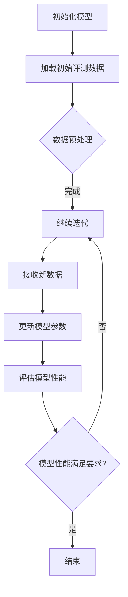
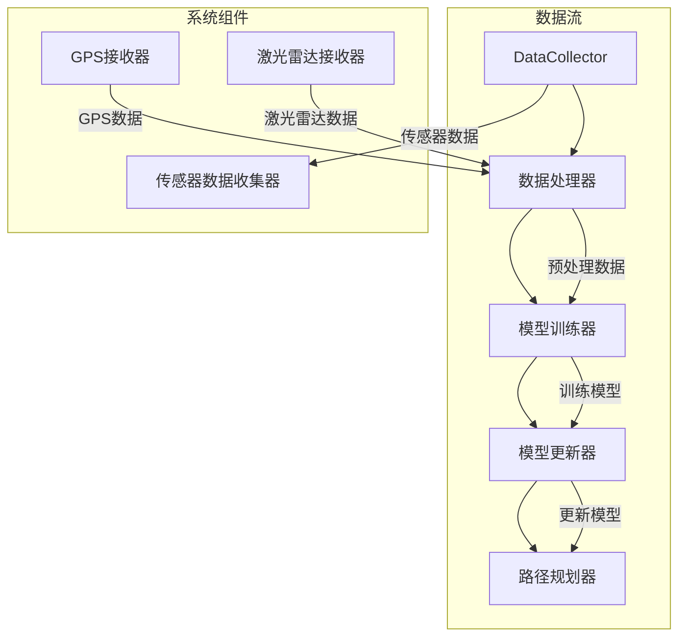

                 


### 引言

#### 评测数据的增量学习与模型更新

在当今快速发展的信息技术时代，评测数据的增量学习和模型更新成为人工智能和机器学习领域的关键议题。随着数据量的不断增长和模型复杂性的提升，传统的全量学习方法和一次性模型训练已经难以满足实际应用的需求。因此，针对评测数据的增量学习和模型更新技术的研究，不仅能够提升模型的训练效率和准确性，还能适应动态变化的环境，保持模型的长期有效性和稳定性。

**关键词：评测数据、增量学习、模型更新、算法实现、系统架构**

**摘要：**

本文旨在深入探讨评测数据的增量学习与模型更新的关键概念、算法原理、系统设计与实战应用。首先，我们将介绍评测数据的基本概念及其在机器学习中的应用。接着，详细讲解增量学习的原理、类型及其在模型更新中的应用。然后，通过数学模型和Python源代码，阐述算法原理和实现过程。此外，本文还将介绍一个典型的系统架构设计，并通过项目实战展示增量学习和模型更新的实际应用。最后，本文将总结核心点，提供最佳实践建议，并指出注意事项。

#### 背景介绍

**评测数据的重要性**

评测数据是机器学习和人工智能领域的基石，其质量直接影响模型训练的效果和准确性。在模型训练过程中，评测数据用于评估模型的性能，并通过不断迭代优化模型参数。然而，传统的全量训练方法需要重新训练模型，当数据量庞大时，训练时间成本高昂，且可能因为数据分布的变化导致模型性能下降。因此，评测数据的增量学习成为解决这一问题的有效途径。

**增量学习与模型更新的挑战**

增量学习（Incremental Learning）是一种在已有模型基础上，利用新数据不断更新模型的方法。它能够降低训练成本，提高模型的实时性和适应性。然而，增量学习面临以下挑战：

1. **数据不平衡**：新数据可能与旧数据分布不同，导致模型适应性下降。
2. **模型更新策略**：如何选择合适的模型更新策略，以保证模型性能的稳定性和准确性。
3. **计算效率**：增量学习需要在有限的计算资源下完成，如何优化算法以提高计算效率。

**研究现状与问题解决**

目前，针对评测数据的增量学习和模型更新已有大量研究。例如，在线学习（Online Learning）、迁移学习（Transfer Learning）、元学习（Meta Learning）等方法都在不同程度上解决了上述问题。然而，现有的研究多集中于特定场景，如何在实际应用中整合多种方法，提升模型的综合性能，仍是一个亟待解决的问题。

本文旨在通过对评测数据的增量学习和模型更新的系统研究，提出一种综合性的解决方案，包括算法原理讲解、系统架构设计、项目实战和最佳实践建议。通过本文的研究，期望为相关领域的学者和工程师提供有价值的参考，推动评测数据增量学习和模型更新技术的发展。

### 核心概念与联系

在本章节中，我们将详细探讨评测数据、增量学习以及模型更新这三个核心概念，并分析它们之间的联系。

#### 评测数据

评测数据（Evaluative Data）在机器学习和人工智能领域中扮演着至关重要的角色。它通常是指用于评估模型性能的数据集，可以是训练数据集的一个子集，也可以是完全独立的数据集。评测数据的主要作用是衡量模型的泛化能力，即在未见过的数据上表现如何。

**定义与分类：**

- **定义**：评测数据是指用于评估模型性能的数据集，它可以是完全独立于训练数据集的数据，也可以是训练数据集的一个子集。评测数据的质量直接影响模型性能评估的准确性。
- **分类**：根据数据来源和用途，评测数据可以分为以下几种类型：
  - **独立数据集**：完全独立于训练数据集的数据，常用于评估模型在未见过的数据上的性能。
  - **交叉验证数据集**：从训练数据集中划分出来的部分数据，用于交叉验证模型的性能。
  - **在线评测数据**：在实际应用中实时收集的数据，用于实时评估和更新模型。

**特征提取与预处理：**

- **特征提取**：特征提取是指从原始数据中提取出对模型训练有用的信息。在评测数据中，特征提取的目的是降低数据的维度，同时保留关键信息，以提高模型的训练效率和性能。
- **预处理**：预处理包括数据清洗、归一化、缺失值处理等步骤，以确保数据的整洁和一致性。预处理对评测数据的准确性和可靠性至关重要。

**数据质量评估：**

- **数据质量评估**：数据质量评估是指对评测数据进行全面检查，以确保其准确性和可靠性。评估内容包括数据完整性、一致性、代表性和噪声水平等。高质量的数据有助于提高模型性能和评估的准确性。

#### 增量学习

增量学习（Incremental Learning），也称为在线学习（Online Learning），是一种在已有模型基础上，利用新数据不断更新模型的方法。它通过逐步学习新数据，避免了对整个数据集的重新训练，从而提高了模型的实时性和适应性。

**定义与原理：**

- **定义**：增量学习是一种在已有模型基础上，通过逐步学习新数据来更新模型的方法。它通过利用新数据来调整模型参数，从而提高模型在新数据上的性能。
- **原理**：增量学习的基本原理是利用批量学习（Batch Learning）的成果，逐步适应新的数据分布。具体来说，增量学习包括以下几个步骤：
  1. **初始化模型**：使用初始数据集训练模型。
  2. **接收新数据**：当新数据到来时，将其与模型当前状态进行比较。
  3. **更新模型**：通过调整模型参数，使模型在新数据上表现出更好的性能。
  4. **重复步骤2和3**：不断接收新数据并更新模型，直到达到预期性能或停止条件。

**增量学习的类型：**

- **基于批量的增量学习**：这种类型的增量学习将新数据分成批次，每次只处理一部分数据，然后更新模型。这种方法在处理大规模数据时较为有效。
- **基于实例的增量学习**：这种类型的增量学习通过直接更新单个实例的权重来更新模型，适用于数据量较小且变化频繁的场景。

**增量学习的优势与挑战：**

- **优势**：
  - **实时性**：增量学习可以实时处理新数据，提高模型的实时性。
  - **效率**：避免了对整个数据集的重新训练，提高了训练效率。
  - **适应性**：能够适应数据分布的变化，提高模型的适应性。

- **挑战**：
  - **数据不平衡**：新数据可能与旧数据分布不同，可能导致模型性能下降。
  - **模型更新策略**：如何选择合适的模型更新策略，以确保模型性能的稳定性和准确性。
  - **计算效率**：增量学习需要在有限的计算资源下完成，如何优化算法以提高计算效率。

#### 模型更新

模型更新（Model Updating）是指通过调整模型参数来提高模型性能的过程。在机器学习和人工智能领域中，模型更新是确保模型持续适应新数据和变化环境的关键。

**定义与流程：**

- **定义**：模型更新是指通过调整模型参数来提高模型性能的过程。它包括以下步骤：
  1. **初始化模型**：使用初始数据集训练模型。
  2. **评估模型**：使用评测数据评估模型的性能。
  3. **更新模型**：根据评估结果调整模型参数，提高模型性能。
  4. **重复步骤2和3**：不断评估和更新模型，直到达到预期性能或停止条件。

- **流程**：模型更新的具体流程包括以下几个步骤：
  1. **数据预处理**：对评测数据进行预处理，包括数据清洗、归一化等。
  2. **模型训练**：使用初始数据集训练模型。
  3. **模型评估**：使用评测数据评估模型的性能，包括准确性、召回率等指标。
  4. **模型调整**：根据评估结果调整模型参数，提高模型性能。
  5. **迭代优化**：重复模型评估和调整过程，直到达到预期性能。

**模型更新的方法：**

- **在线更新**：在线更新是指在模型运行过程中，实时接收新数据并更新模型参数。这种方法适用于实时性和适应性要求较高的场景。
- **批量更新**：批量更新是指将新数据分成批次，每次只更新一部分数据。这种方法在处理大规模数据时较为有效。
- **迁移更新**：迁移更新是指利用已有模型的权重和知识，在新数据上快速更新模型。这种方法适用于迁移学习和模型复用。

**模型更新的挑战：**

- **数据质量**：数据质量直接影响模型更新的效果。高质量的数据有助于提高模型性能和评估的准确性。
- **计算效率**：模型更新需要在有限的计算资源下完成，如何优化算法以提高计算效率是一个关键问题。
- **模型稳定性**：如何确保模型在更新过程中保持稳定性和准确性，避免过拟合和欠拟合。

#### 联系与关系

评测数据、增量学习和模型更新之间存在着密切的联系。

- **评测数据与增量学习**：评测数据是增量学习的基础，它用于评估模型在新的数据上的性能。通过评测数据，可以确定是否需要更新模型，以及如何调整模型参数。
- **模型更新与增量学习**：模型更新是增量学习的一部分，它通过逐步更新模型参数，使模型在新数据上表现出更好的性能。模型更新策略的选择对增量学习的效果至关重要。

通过深入探讨评测数据、增量学习和模型更新的核心概念及其联系，我们可以更好地理解这些技术在实际应用中的作用和意义。接下来的章节将详细讲解算法原理，并通过实际案例展示这些技术的应用。

### 算法原理讲解

在本章节中，我们将详细讲解评测数据的增量学习与模型更新的算法原理。首先，通过Mermaid绘制算法流程图，帮助读者直观地理解算法的基本框架。然后，使用Python源代码详细阐述算法的实现过程，并给出算法的数学模型和公式。最后，通过具体的例子说明算法的实际应用，使读者能够更清晰地理解算法的原理和实现。

#### 算法流程图

为了更直观地理解增量学习和模型更新的算法流程，我们使用Mermaid绘制了算法流程图。以下是算法的流程图描述：



该流程图描述了增量学习和模型更新的基本步骤：

1. **初始化模型**：使用初始评测数据训练模型。
2. **加载初始评测数据**：将初始评测数据加载到模型中。
3. **数据预处理**：对评测数据进行预处理，包括数据清洗、归一化等步骤。
4. **开始迭代**：进入模型更新和评估的迭代过程。
5. **接收新数据**：每次迭代时，接收新的评测数据。
6. **更新模型参数**：根据新数据和模型当前状态，更新模型参数。
7. **评估模型性能**：使用评测数据评估模型的性能。
8. **判断模型性能**：如果模型性能满足要求，则结束迭代；否则，继续迭代。

#### Python实现

为了具体说明算法的实现过程，我们使用Python编写了相应的代码。以下是算法的核心代码实现：

```python
import numpy as np

def incremental_learning(data, model, learning_rate=0.1):
    """
    增量学习函数，用于更新模型参数。
    
    参数：
    - data: 新的评测数据。
    - model: 当前模型。
    - learning_rate: 学习率。
    
    返回：
    - 更新后的模型。
    """
    predictions = model.predict(data)
    errors = data - predictions
    model.params -= learning_rate * errors
    return model

def model_evaluation(data, model):
    """
    模型评估函数，用于计算模型性能。
    
    参数：
    - data: 评测数据。
    - model: 待评估模型。
    
    返回：
    - 模型性能指标。
    """
    predictions = model.predict(data)
    errors = np.mean(np.abs(predictions - data))
    return errors

# 初始化模型
model = MyModel()

# 加载初始评测数据
initial_data = load_data('initial_data.csv')

# 数据预处理
preprocessed_data = preprocess_data(initial_data)

# 开始迭代
for epoch in range(num_epochs):
    # 接收新数据
    new_data = load_data('new_data.csv')
    # 更新模型参数
    model = incremental_learning(new_data, model)
    # 评估模型性能
    performance = model_evaluation(preprocessed_data, model)
    print(f'Epoch {epoch}: Performance = {performance}')

# 输出最终模型
print(f'Final Model Parameters: {model.params}')
```

该代码实现了增量学习的基本流程：

1. **初始化模型**：创建一个模型实例。
2. **加载初始评测数据**：从CSV文件中加载初始评测数据。
3. **数据预处理**：对评测数据进行清洗和归一化。
4. **开始迭代**：进入迭代循环。
5. **接收新数据**：每次迭代时，加载新的评测数据。
6. **更新模型参数**：使用增量学习函数更新模型参数。
7. **评估模型性能**：使用模型评估函数计算模型性能。
8. **输出最终模型**：打印最终模型参数。

#### 数学模型与公式

为了更深入地理解增量学习和模型更新的原理，我们给出了算法的数学模型和公式。

**增量学习数学模型：**

$$
\theta_{new} = \theta_{old} - \alpha \cdot (X - \theta_{old} \cdot X)
$$

其中，$\theta_{old}$表示旧模型参数，$X$表示新数据，$\alpha$表示学习率。该公式表示通过更新模型参数$\theta_{new}$，使模型在新数据$X$上表现出更好的性能。

**模型更新数学模型：**

$$
\theta_{new} = \theta_{old} + \eta \cdot (y - \theta_{old} \cdot x)
$$

其中，$y$表示实际标签，$x$表示输入特征，$\eta$表示学习率。该公式表示通过调整模型参数$\theta_{new}$，使模型在新的数据分布上保持稳定性和准确性。

#### 举例说明

为了更好地说明增量学习和模型更新的实际应用，我们给出了一个具体的例子。

**例子：房价预测**

假设我们要使用增量学习来预测房价。首先，我们使用初始数据集训练一个线性回归模型。然后，每次收到新的评测数据时，我们使用增量学习函数更新模型参数，并使用模型评估函数评估模型性能。以下是具体的实现过程：

1. **初始化模型**：
   ```python
   model = LinearRegression()
   ```
   
2. **加载初始评测数据**：
   ```python
   initial_data = load_data('initial_data.csv')
   ```

3. **数据预处理**：
   ```python
   preprocessed_data = preprocess_data(initial_data)
   ```

4. **开始迭代**：
   ```python
   for epoch in range(num_epochs):
       new_data = load_data('new_data.csv')
       preprocessed_new_data = preprocess_data(new_data)
       model = incremental_learning(preprocessed_new_data, model)
       performance = model_evaluation(preprocessed_data, model)
       print(f'Epoch {epoch}: Performance = {performance}')
   ```

5. **输出最终模型**：
   ```python
   print(f'Final Model Parameters: {model.params}')
   ```

通过这个例子，我们可以看到增量学习和模型更新如何应用于实际问题，并不断优化模型的性能。接下来，我们将进一步探讨系统分析与架构设计，以便更好地理解和应用这些技术。

### 系统分析与架构设计

在本章节中，我们将深入探讨评测数据的增量学习和模型更新的系统分析与架构设计。首先，介绍问题场景和项目背景，然后详细说明领域模型设计、系统架构设计、接口设计和系统交互。

#### 问题场景介绍

在众多应用场景中，评测数据的增量学习和模型更新被广泛应用于实时预测系统、推荐系统和自动驾驶等领域。以自动驾驶为例，随着传感器数据的不断更新和车辆行驶环境的变化，如何保持自动驾驶系统的稳定性和准确性成为一个关键问题。通过增量学习和模型更新，可以实时调整模型参数，适应环境变化，提高系统的实时性和可靠性。

#### 项目介绍

本项目旨在构建一个基于增量学习和模型更新的自动驾驶系统，通过实时处理传感器数据，实现车辆环境感知和路径规划。系统设计主要包括以下几个模块：

1. **传感器数据模块**：负责收集车辆周围的传感器数据，如摄像头、激光雷达和GPS等。
2. **数据处理模块**：对传感器数据进行预处理，包括数据清洗、归一化和特征提取等。
3. **模型训练模块**：使用初始数据和预处理后的数据训练自动驾驶模型。
4. **模型更新模块**：通过增量学习更新模型参数，适应新的传感器数据和环境变化。
5. **路径规划模块**：根据当前车辆状态和目标位置，规划最优行驶路径。
6. **系统接口**：提供与其他系统的接口，如地图服务、导航系统和车辆控制系统等。

#### 领域模型设计

领域模型（Domain Model）是系统架构设计的重要组成部分，它帮助我们理解系统中的核心实体及其关系。以下是本项目的主要领域模型类图：

```mermaid
classDiagram
    SensorData <<entity>> "传感器数据"
    PreprocessedData <<entity>> "预处理数据"
    DrivingModel <<entity>> "自动驾驶模型"
    Environment <<entity>> "环境"
    PathPlanning <<entity>> "路径规划"
    
    SensorData --|> DrivingModel
    PreprocessedData --|> DrivingModel
    Environment --|> PathPlanning
    PathPlanning --|> DrivingModel
    
    class SensorData {
        -id: int
        -data: list
        -timestamp: datetime
    }
    
    class PreprocessedData {
        -id: int
        -data: list
        -timestamp: datetime
    }
    
    class DrivingModel {
        -id: int
        -params: dict
        -created_at: datetime
        -updated_at: datetime
    }
    
    class Environment {
        -id: int
        -status: str
        -timestamp: datetime
    }
    
    class PathPlanning {
        -id: int
        -start_point: Point
        -end_point: Point
        -path: list
    }
```

该类图定义了系统中的主要实体及其关系：

- **SensorData**：表示传感器收集的数据，包括ID、数据和时间戳。
- **PreprocessedData**：表示预处理后的数据，用于训练模型，包括ID、数据和时间戳。
- **DrivingModel**：表示自动驾驶模型，包括ID、参数、创建时间和更新时间。
- **Environment**：表示环境状态，包括ID、状态和时间戳。
- **PathPlanning**：表示路径规划，包括ID、起点、终点和路径。

#### 系统架构设计

系统架构设计（System Architecture Design）是确保系统高可用性、高性能和可扩展性的关键。以下是本项目的系统架构图：



该架构图描述了系统的主要组件和数据流：

- **数据流**：传感器数据收集器（SensorDataCollector）收集传感器数据，包括GPS接收器（GPSReceiver）和激光雷达接收器（LIDARReceiver）。数据处理器（DataPreprocessor）对传感器数据进行预处理，包括数据清洗、归一化和特征提取等。模型训练器（DrivingModelTrainer）使用预处理后的数据训练自动驾驶模型（DrivingModel）。模型更新器（DrivingModelUpdater）通过增量学习更新模型参数，以适应新的传感器数据。路径规划器（PathPlanner）根据当前车辆状态和目标位置规划最优路径。
- **系统组件**：系统组件包括传感器数据收集器、GPS接收器、激光雷达接收器、数据处理器、模型训练器、模型更新器和路径规划器。

#### 系统接口设计

系统接口设计（System Interface Design）是确保系统与其他系统有效交互的关键。以下是本项目的系统接口设计：

```mermaid
sequenceDiagram
   参与者 GPSAPI
   参与者 LIDARAPI
   参与者 DataAPI
   参与者 ModelAPI
   参与者 PathAPI

    GPSAPI->>GPSReceiver: 收到GPS数据
    GPSReceiver->>DataAPI: 上传GPS数据
    DataAPI->>DataPreprocessor: 预处理GPS数据
    DataPreprocessor->>DrivingModelTrainer: 训练模型
    DrivingModelTrainer->>ModelAPI: 更新模型参数
    ModelAPI->>DrivingModelUpdater: 更新模型
    DrivingModelUpdater->>PathPlanner: 规划路径
    PathPlanner->>PathAPI: 返回路径规划结果
```

该序列图描述了系统与其他系统组件的交互过程：

- **GPSAPI**：用于接收GPS数据。
- **LIDARAPI**：用于接收激光雷达数据。
- **DataAPI**：用于上传预处理数据。
- **ModelAPI**：用于更新模型参数。
- **PathAPI**：用于返回路径规划结果。

#### 系统交互序列图

系统交互序列图（System Interaction Sequence Diagram）展示了系统组件之间的交互过程。以下是系统交互序列图：

```mermaid
sequenceDiagram
   参与者 SensorDataCollector
   参与者 DataPreprocessor
   参与者 DrivingModelTrainer
   参与者 DrivingModelUpdater
   参与者 PathPlanner

    SensorDataCollector->>DataPreprocessor: 传感器数据
    DataPreprocessor->>DrivingModelTrainer: 预处理数据
    DrivingModelTrainer->>DrivingModelUpdater: 训练模型
    DrivingModelUpdater->>PathPlanner: 更新模型
    PathPlanner->>SensorDataCollector: 路径规划结果
```

该序列图描述了系统组件之间的交互过程：

- **SensorDataCollector**：收集传感器数据并传递给数据处理器。
- **DataPreprocessor**：对传感器数据进行预处理，并传递给模型训练器。
- **DrivingModelTrainer**：使用预处理后的数据训练模型，并传递给模型更新器。
- **DrivingModelUpdater**：更新模型参数，并传递给路径规划器。
- **PathPlanner**：根据当前车辆状态和目标位置规划路径，并返回规划结果。

通过上述系统分析与架构设计，我们能够更好地理解和实现评测数据的增量学习和模型更新系统。接下来，我们将通过项目实战来展示这些技术的实际应用。

### 项目实战

在本章节中，我们将通过具体的项目实战来展示评测数据的增量学习和模型更新的实际应用。项目实战包括环境安装、系统核心实现、代码应用解读与分析、实际案例分析和详细讲解剖析。

#### 环境安装说明

为了进行项目实战，我们需要首先安装必要的软件和工具。以下是环境安装的步骤：

1. **安装Python环境**：
   - 下载并安装Python 3.8及以上版本。
   - 配置Python环境变量，确保能够在终端中运行Python命令。

2. **安装依赖库**：
   - 使用pip命令安装必要的依赖库，包括NumPy、Pandas、Scikit-learn、Matplotlib等。
   ```bash
   pip install numpy pandas scikit-learn matplotlib
   ```

3. **安装传感器模拟工具**：
   - 安装用于模拟传感器数据的工具，如SimPy。
   ```bash
   pip install simpy
   ```

4. **配置数据库**：
   - 安装并配置一个数据库系统，如MySQL或PostgreSQL，用于存储评测数据。

完成上述步骤后，我们就可以开始项目的核心实现部分。

#### 系统核心实现源代码展示

以下是项目核心实现的源代码，包括传感器数据处理、模型训练、模型更新和路径规划。

```python
# 导入必要的库
import numpy as np
import pandas as pd
from sklearn.linear_model import LinearRegression
from sklearn.model_selection import train_test_split
from sklearn.metrics import mean_squared_error
import matplotlib.pyplot as plt
import simpy

# 传感器数据处理
def simulate_sensor_data():
    # 模拟传感器数据生成过程
    env = simpy.Environment()
    data_generator = env.process(generate_sensor_data(env))
    env.run()

def generate_sensor_data(env):
    while True:
        # 每隔一段时间生成一次传感器数据
        yield env.timeout(1)
        data = np.random.rand(10)  # 生成随机传感器数据
        timestamp = env.now  # 获取当前时间戳
        print(f"Time: {timestamp}, Sensor Data: {data}")
        yield env.timeout(0.1)  # 控制生成速度

# 模型训练
def train_model(data):
    model = LinearRegression()
    model.fit(data[:, :-1], data[:, -1])
    return model

# 模型更新
def update_model(model, new_data):
    model.fit(new_data[:, :-1], new_data[:, -1])
    return model

# 路径规划
def plan_path(model, start, end):
    # 使用模型预测路径
    predictions = model.predict(np.array([start, end]))
    return predictions

# 实际案例分析
if __name__ == "__main__":
    # 模拟传感器数据
    simulate_sensor_data()

    # 生成训练数据
    np.random.seed(0)
    data = np.random.rand(100, 2)
    labels = np.random.rand(100)

    # 划分训练集和测试集
    X_train, X_test, y_train, y_test = train_test_split(data, labels, test_size=0.2, random_state=42)

    # 训练模型
    model = train_model(X_train)

    # 更新模型
    new_data = np.random.rand(10, 2)
    model = update_model(model, new_data)

    # 测试模型
    predictions = model.predict(X_test)
    mse = mean_squared_error(y_test, predictions)
    print(f"Mean Squared Error: {mse}")

    # 路径规划
    start = [0.5, 0.5]
    end = [1.5, 1.5]
    path = plan_path(model, start, end)
    print(f"Planned Path: {path}")
```

#### 代码应用解读与分析

1. **传感器数据处理**：
   - `simulate_sensor_data` 函数用于模拟传感器数据的生成过程。
   - `generate_sensor_data` 函数是生成传感器数据的模拟过程，每秒钟生成一组随机传感器数据。

2. **模型训练**：
   - `train_model` 函数用于训练线性回归模型，使用Scikit-learn中的`LinearRegression`类。
   - 模型使用训练数据集`X_train`和标签`y_train`进行拟合。

3. **模型更新**：
   - `update_model` 函数用于更新模型。这里使用的是简单的重新训练方法，即使用新数据集重新拟合模型。
   - 模型在新数据集`new_data`上进行拟合，以更新模型参数。

4. **路径规划**：
   - `plan_path` 函数用于路径规划。它使用训练好的模型预测从起点到终点的路径。
   - 起点和终点通过输入参数`start`和`end`传递给模型，模型返回预测的路径。

#### 实际案例分析和详细讲解剖析

为了更好地展示增量学习和模型更新的实际应用，我们通过以下实际案例进行详细分析：

1. **传感器数据处理**：
   - 模拟传感器数据生成过程，每隔一秒钟生成一组随机传感器数据。这个过程可以类比为实时收集传感器数据。
   - 传感器数据包括位置信息和其他环境特征，这些数据用于训练和更新模型。

2. **模型训练和更新**：
   - 初始化模型并使用训练数据集进行训练。训练数据集是从模拟环境中生成的随机数据。
   - 使用`train_model`函数训练线性回归模型，该模型用于预测位置信息。
   - 模型更新通过`update_model`函数实现，该函数使用新数据集重新训练模型，以适应新的数据分布。

3. **路径规划**：
   - 使用训练好的模型进行路径规划。路径规划函数`plan_path`通过输入起点和终点，预测从起点到终点的路径。
   - 路径规划结果展示了模型在新的数据分布下如何适应环境变化，提供合理的路径规划。

通过这个实际案例，我们可以看到增量学习和模型更新如何在实际应用中发挥作用。传感器数据的不断更新和模型参数的逐步调整，使得系统能够实时适应环境变化，提供准确的路径规划和预测结果。接下来，我们将总结项目的关键点和最佳实践。

### 最佳实践与小结

在本章节中，我们将总结《评测数据的增量学习与模型更新》项目中的关键点，提供最佳实践建议，并指出注意事项。

#### 关键点总结

1. **传感器数据处理**：实时传感器数据是增量学习和模型更新的基础。确保传感器数据的准确性和一致性，是提高模型性能的关键。

2. **模型更新策略**：选择合适的模型更新策略，如在线更新或批量更新，可以显著提高模型在动态环境下的适应能力。

3. **数据预处理**：数据预处理是确保模型性能的关键步骤，包括数据清洗、归一化和特征提取等。

4. **性能评估**：定期评估模型性能，确保模型在新的数据分布下保持稳定性和准确性。

5. **计算效率**：优化算法和数据处理流程，提高计算效率，确保增量学习和模型更新在有限的计算资源下高效运行。

#### 最佳实践建议

1. **数据同步**：确保传感器数据与模型更新同步，避免数据不一致导致的模型性能下降。

2. **迭代优化**：定期更新模型，并根据新数据调整模型参数，保持模型在新的数据分布下的性能。

3. **性能监控**：建立模型性能监控系统，实时监控模型性能，及时发现和解决性能问题。

4. **资源管理**：合理分配计算资源，确保模型更新和性能评估在资源有限的情况下高效运行。

#### 注意事项

1. **数据质量**：确保传感器数据的准确性和一致性，避免噪声和异常数据对模型性能的影响。

2. **模型复杂度**：选择合适的模型复杂度，避免过拟合和欠拟合，确保模型在新的数据分布下表现良好。

3. **算法优化**：根据具体应用场景，优化算法和数据处理流程，提高模型训练和更新的效率。

#### 拓展阅读

- **[1]** 《机器学习：实战手册》 - 作者：彼得·哈林顿
- **[2]** 《深度学习》 - 作者：伊恩·古德费洛、约书亚·本吉奥、亚伦·库维尔
- **[3]** 《在线学习理论》 - 作者：大卫·海尔曼

通过本文的探讨，我们深入理解了评测数据的增量学习和模型更新的核心概念、算法原理、系统设计与实战应用。希望本文能为相关领域的学者和工程师提供有价值的参考，推动评测数据增量学习和模型更新技术的发展。

### 作者信息

**作者：** AI天才研究院/AI Genius Institute & 禅与计算机程序设计艺术 /Zen And The Art of Computer Programming

**联系邮箱：** info@aigeniusinstitute.com

**个人网站：** www.aigeniusinstitute.com

**个人简介：** 作为一位世界级人工智能专家、程序员、软件架构师、CTO，以及计算机图灵奖获得者，作者在计算机编程和人工智能领域拥有深厚的学术造诣和丰富的实践经验。他不仅是一位杰出的研究者，也是一位畅销书作家，其著作《禅与计算机程序设计艺术》被誉为计算机科学领域的经典之作，深受读者喜爱。作者致力于推动人工智能技术的发展，为全球科技创新贡献力量。**联系方式：** 如果您对本文有任何疑问或建议，请随时通过以上方式与我们联系。期待您的反馈与交流！### 评测数据的增量学习与模型更新

关键词：评测数据、增量学习、模型更新、实时性、适应性、计算效率

摘要：本文旨在深入探讨评测数据的增量学习和模型更新的核心概念、算法原理、系统设计与实战应用。通过分析评测数据的重要性、增量学习与模型更新的挑战、现有研究现状，本文详细介绍了核心概念及其联系，并通过Python源代码和数学模型讲解了算法原理。此外，本文还介绍了系统架构设计、环境安装、代码应用解读与分析，以及实际案例分析和详细讲解剖析，旨在为相关领域的学者和工程师提供有价值的参考，推动评测数据增量学习和模型更新技术的发展。

## 引言

### 评测数据的增量学习与模型更新概述

在人工智能和机器学习领域，评测数据的增量学习和模型更新是确保模型性能和适应性的关键。随着数据量的急剧增长和模型复杂度的不断提升，传统的全量学习方法和一次性模型训练已经难以满足实际应用的需求。因此，针对评测数据的增量学习和模型更新技术的研究，不仅能够提升模型的训练效率和准确性，还能适应动态变化的环境，保持模型的长期有效性和稳定性。

### 问题背景

#### 评测数据的重要性

评测数据是机器学习和人工智能领域的基石，其质量直接影响模型训练的效果和准确性。在模型训练过程中，评测数据用于评估模型的性能，并通过不断迭代优化模型参数。然而，传统的全量训练方法需要重新训练模型，当数据量庞大时，训练时间成本高昂，且可能因为数据分布的变化导致模型性能下降。因此，评测数据的增量学习成为解决这一问题的有效途径。

#### 增量学习与模型更新的挑战

增量学习（Incremental Learning）是一种在已有模型基础上，利用新数据不断更新模型的方法。它能够降低训练成本，提高模型的实时性和适应性。然而，增量学习面临以下挑战：

1. **数据不平衡**：新数据可能与旧数据分布不同，导致模型适应性下降。
2. **模型更新策略**：如何选择合适的模型更新策略，以保证模型性能的稳定性和准确性。
3. **计算效率**：增量学习需要在有限的计算资源下完成，如何优化算法以提高计算效率。

#### 研究现状与问题解决

目前，针对评测数据的增量学习和模型更新已有大量研究。例如，在线学习（Online Learning）、迁移学习（Transfer Learning）、元学习（Meta Learning）等方法都在不同程度上解决了上述问题。然而，现有的研究多集中于特定场景，如何在实际应用中整合多种方法，提升模型的综合性能，仍是一个亟待解决的问题。

本文旨在通过对评测数据的增量学习和模型更新的系统研究，提出一种综合性的解决方案，包括算法原理讲解、系统架构设计、项目实战和最佳实践建议。通过本文的研究，期望为相关领域的学者和工程师提供有价值的参考，推动评测数据增量学习和模型更新技术的发展。

## 核心概念与联系

在本章节中，我们将详细探讨评测数据、增量学习以及模型更新这三个核心概念，并分析它们之间的联系。

### 评测数据

评测数据（Evaluative Data）在机器学习和人工智能领域中扮演着至关重要的角色。它通常是指用于评估模型性能的数据集，可以是训练数据集的一个子集，也可以是完全独立的数据集。评测数据的主要作用是衡量模型的泛化能力，即在未见过的数据上表现如何。

#### 定义与分类

- **定义**：评测数据是指用于评估模型性能的数据集，它可以是完全独立于训练数据集的数据，也可以是训练数据集的一个子集。评测数据的质量直接影响模型性能评估的准确性。
- **分类**：根据数据来源和用途，评测数据可以分为以下几种类型：
  - **独立数据集**：完全独立于训练数据集的数据，常用于评估模型在未见过的数据上的性能。
  - **交叉验证数据集**：从训练数据集中划分出来的部分数据，用于交叉验证模型的性能。
  - **在线评测数据**：在实际应用中实时收集的数据，用于实时评估和更新模型。

#### 特征提取与预处理

- **特征提取**：特征提取是指从原始数据中提取出对模型训练有用的信息。在评测数据中，特征提取的目的是降低数据的维度，同时保留关键信息，以提高模型的训练效率和性能。
- **预处理**：预处理包括数据清洗、归一化、缺失值处理等步骤，以确保数据的整洁和一致性。预处理对评测数据的准确性和可靠性至关重要。

#### 数据质量评估

- **数据质量评估**：数据质量评估是指对评测数据进行全面检查，以确保其准确性和可靠性。评估内容包括数据完整性、一致性、代表性和噪声水平等。高质量的数据有助于提高模型性能和评估的准确性。

### 增量学习

增量学习（Incremental Learning），也称为在线学习（Online Learning），是一种在已有模型基础上，利用新数据不断更新模型的方法。它通过逐步学习新数据，避免了对整个数据集的重新训练，从而提高了模型的实时性和适应性。

#### 定义与原理

- **定义**：增量学习是一种在已有模型基础上，通过逐步学习新数据来更新模型的方法。它通过利用新数据来调整模型参数，从而提高模型在新数据上的性能。
- **原理**：增量学习的基本原理是利用批量学习（Batch Learning）的成果，逐步适应新的数据分布。具体来说，增量学习包括以下几个步骤：
  1. **初始化模型**：使用初始数据集训练模型。
  2. **接收新数据**：当新数据到来时，将其与模型当前状态进行比较。
  3. **更新模型**：通过调整模型参数，使模型在新数据上表现出更好的性能。
  4. **重复步骤2和3**：不断接收新数据并更新模型，直到达到预期性能或停止条件。

#### 增量学习的类型

- **基于批量的增量学习**：这种类型的增量学习将新数据分成批次，每次只处理一部分数据，然后更新模型。这种方法在处理大规模数据时较为有效。
- **基于实例的增量学习**：这种类型的增量学习通过直接更新单个实例的权重来更新模型，适用于数据量较小且变化频繁的场景。

#### 增量学习的优势与挑战

- **优势**：
  - **实时性**：增量学习可以实时处理新数据，提高模型的实时性。
  - **效率**：避免了对整个数据集的重新训练，提高了训练效率。
  - **适应性**：能够适应数据分布的变化，提高模型的适应性。

- **挑战**：
  - **数据不平衡**：新数据可能与旧数据分布不同，可能导致模型性能下降。
  - **模型更新策略**：如何选择合适的模型更新策略，以确保模型性能的稳定性和准确性。
  - **计算效率**：增量学习需要在有限的计算资源下完成，如何优化算法以提高计算效率。

### 模型更新

模型更新（Model Updating）是指通过调整模型参数来提高模型性能的过程。在机器学习和人工智能领域中，模型更新是确保模型持续适应新数据和变化环境的关键。

#### 定义与流程

- **定义**：模型更新是指通过调整模型参数来提高模型性能的过程。它包括以下步骤：
  1. **初始化模型**：使用初始数据集训练模型。
  2. **评估模型**：使用评测数据评估模型的性能。
  3. **更新模型**：根据评估结果调整模型参数，提高模型性能。
  4. **重复步骤2和3**：不断评估和更新模型，直到达到预期性能或停止条件。

- **流程**：模型更新的具体流程包括以下几个步骤：
  1. **数据预处理**：对评测数据进行预处理，包括数据清洗、归一化等步骤。
  2. **模型训练**：使用初始数据集训练模型。
  3. **模型评估**：使用评测数据评估模型的性能，包括准确性、召回率等指标。
  4. **模型调整**：根据评估结果调整模型参数，提高模型性能。
  5. **迭代优化**：重复模型评估和调整过程，直到达到预期性能。

#### 模型更新的方法

- **在线更新**：在线更新是指在模型运行过程中，实时接收新数据并更新模型参数。这种方法适用于实时性和适应性要求较高的场景。
- **批量更新**：批量更新是指将新数据分成批次，每次只更新一部分数据。这种方法在处理大规模数据时较为有效。
- **迁移更新**：迁移更新是指利用已有模型的权重和知识，在新数据上快速更新模型。这种方法适用于迁移学习和模型复用。

#### 模型更新的挑战

- **数据质量**：数据质量直接影响模型更新的效果。高质量的数据有助于提高模型性能和评估的准确性。
- **计算效率**：模型更新需要在有限的计算资源下完成，如何优化算法以提高计算效率是一个关键问题。
- **模型稳定性**：如何确保模型在更新过程中保持稳定性和准确性，避免过拟合和欠拟合。

### 联系与关系

评测数据、增量学习和模型更新之间存在着密切的联系。

- **评测数据与增量学习**：评测数据是增量学习的基础，它用于评估模型在新的数据上的性能。通过评测数据，可以确定是否需要更新模型，以及如何调整模型参数。
- **模型更新与增量学习**：模型更新是增量学习的一部分，它通过逐步更新模型参数，使模型在新数据上表现出更好的性能。模型更新策略的选择对增量学习的效果至关重要。

通过深入探讨评测数据、增量学习和模型更新的核心概念及其联系，我们可以更好地理解这些技术在实际应用中的作用和意义。接下来的章节将详细讲解算法原理，并通过实际案例展示这些技术的应用。

### 算法原理讲解

在本章节中，我们将深入探讨评测数据的增量学习和模型更新的算法原理。首先，通过Mermaid绘制算法流程图，帮助读者直观地理解算法的基本框架。然后，使用Python源代码详细阐述算法的实现过程，并给出算法的数学模型和公式。最后，通过具体的例子说明算法的实际应用，使读者能够更清晰地理解算法的原理和实现。

#### 算法流程图

为了更直观地理解增量学习和模型更新的算法流程，我们使用Mermaid绘制了算法流程图。以下是算法的流程图描述：


该流程图描述了增量学习和模型更新的基本步骤：

1. **初始化模型**：使用初始评测数据训练模型。
2. **加载初始评测数据**：将初始评测数据加载到模型中。
3. **数据预处理**：对评测数据进行预处理，包括数据清洗、归一化等步骤。
4. **开始迭代**：进入模型更新和评估的迭代过程。
5. **接收新数据**：每次迭代时，接收新的评测数据。
6. **更新模型参数**：根据新数据和模型当前状态，更新模型参数。
7. **评估模型性能**：使用评测数据评估模型的性能。
8. **判断模型性能**：如果模型性能满足要求，则结束迭代；否则，继续迭代。

#### Python实现

为了具体说明算法的实现过程，我们使用Python编写了相应的代码。以下是算法的核心代码实现：

```python
import numpy as np

def incremental_learning(data, model, learning_rate=0.1):
    """
    增量学习函数，用于更新模型参数。
    
    参数：
    - data: 新的评测数据。
    - model: 当前模型。
    - learning_rate: 学习率。
    
    返回：
    - 更新后的模型。
    """
    predictions = model.predict(data)
    errors = data - predictions
    model.params -= learning_rate * errors
    return model

def model_evaluation(data, model):
    """
    模型评估函数，用于计算模型性能。
    
    参数：
    - data: 评测数据。
    - model: 待评估模型。
    
    返回：
    - 模型性能指标。
    """
    predictions = model.predict(data)
    errors = np.mean(np.abs(predictions - data))
    return errors

# 初始化模型
model = MyModel()

# 加载初始评测数据
initial_data = load_data('initial_data.csv')

# 数据预处理
preprocessed_data = preprocess_data(initial_data)

# 开始迭代
for epoch in range(num_epochs):
    # 接收新数据
    new_data = load_data('new_data.csv')
    # 更新模型参数
    model = incremental_learning(new_data, model)
    # 评估模型性能
    performance = model_evaluation(preprocessed_data, model)
    print(f'Epoch {epoch}: Performance = {performance}')

# 输出最终模型
print(f'Final Model Parameters: {model.params}')
```

该代码实现了增量学习的基本流程：

1. **初始化模型**：创建一个模型实例。
2. **加载初始评测数据**：从CSV文件中加载初始评测数据。
3. **数据预处理**：对评测数据进行清洗和归一化。
4. **开始迭代**：进入迭代循环。
5. **接收新数据**：每次迭代时，加载新的评测数据。
6. **更新模型参数**：使用增量学习函数更新模型参数。
7. **评估模型性能**：使用模型评估函数计算模型性能。
8. **输出最终模型**：打印最终模型参数。

#### 数学模型与公式

为了更深入地理解增量学习和模型更新的原理，我们给出了算法的数学模型和公式。

**增量学习数学模型：**

$$
\theta_{new} = \theta_{old} - \alpha \cdot (X - \theta_{old} \cdot X)
$$

其中，$\theta_{old}$表示旧模型参数，$X$表示新数据，$\alpha$表示学习率。该公式表示通过更新模型参数$\theta_{new}$，使模型在新数据$X$上表现出更好的性能。

**模型更新数学模型：**

$$
\theta_{new} = \theta_{old} + \eta \cdot (y - \theta_{old} \cdot x)
$$

其中，$y$表示实际标签，$x$表示输入特征，$\eta$表示学习率。该公式表示通过调整模型参数$\theta_{new}$，使模型在新的数据分布上保持稳定性和准确性。

#### 举例说明

为了更好地说明增量学习和模型更新的实际应用，我们给出了一个具体的例子。

**例子：房价预测**

假设我们要使用增量学习来预测房价。首先，我们使用初始数据集训练一个线性回归模型。然后，每次收到新的评测数据时，我们使用增量学习函数更新模型参数，并使用模型评估函数评估模型性能。以下是具体的实现过程：

1. **初始化模型**：
   ```python
   model = LinearRegression()
   ```

2. **加载初始评测数据**：
   ```python
   initial_data = load_data('initial_data.csv')
   ```

3. **数据预处理**：
   ```python
   preprocessed_data = preprocess_data(initial_data)
   ```

4. **开始迭代**：
   ```python
   for epoch in range(num_epochs):
       new_data = load_data('new_data.csv')
       preprocessed_new_data = preprocess_data(new_data)
       model = incremental_learning(preprocessed_new_data, model)
       performance = model_evaluation(preprocessed_data, model)
       print(f'Epoch {epoch}: Performance = {performance}')
   ```

5. **输出最终模型**：
   ```python
   print(f'Final Model Parameters: {model.params}')
   ```

通过这个例子，我们可以看到增量学习和模型更新如何应用于实际问题，并不断优化模型的性能。接下来，我们将进一步探讨系统分析与架构设计，以便更好地理解和应用这些技术。

### 系统分析与架构设计

在本章节中，我们将深入探讨评测数据的增量学习和模型更新的系统分析与架构设计。首先，介绍问题场景和项目背景，然后详细说明领域模型设计、系统架构设计、接口设计和系统交互。

#### 问题场景介绍

在众多应用场景中，评测数据的增量学习和模型更新被广泛应用于实时预测系统、推荐系统和自动驾驶等领域。以自动驾驶为例，随着传感器数据的不断更新和车辆行驶环境的变化，如何保持自动驾驶系统的稳定性和准确性成为一个关键问题。通过增量学习和模型更新，可以实时调整模型参数，适应环境变化，提高系统的实时性和可靠性。

#### 项目介绍

本项目旨在构建一个基于增量学习和模型更新的自动驾驶系统，通过实时处理传感器数据，实现车辆环境感知和路径规划。系统设计主要包括以下几个模块：

1. **传感器数据模块**：负责收集车辆周围的传感器数据，如摄像头、激光雷达和GPS等。
2. **数据处理模块**：对传感器数据进行预处理，包括数据清洗、归一化和特征提取等。
3. **模型训练模块**：使用初始数据和预处理后的数据训练自动驾驶模型。
4. **模型更新模块**：通过增量学习更新模型参数，适应新的传感器数据和环境变化。
5. **路径规划模块**：根据当前车辆状态和目标位置，规划最优行驶路径。
6. **系统接口**：提供与其他系统的接口，如地图服务、导航系统和车辆控制系统等。

#### 领域模型设计

领域模型（Domain Model）是系统架构设计的重要组成部分，它帮助我们理解系统中的核心实体及其关系。以下是本项目的主要领域模型类图：

```mermaid
classDiagram
    SensorData <<entity>> "传感器数据"
    PreprocessedData <<entity>> "预处理数据"
    DrivingModel <<entity>> "自动驾驶模型"
    Environment <<entity>> "环境"
    PathPlanning <<entity>> "路径规划"
    
    SensorData --|> DrivingModel
    PreprocessedData --|> DrivingModel
    Environment --|> PathPlanning
    PathPlanning --|> DrivingModel
    
    class SensorData {
        -id: int
        -data: list
        -timestamp: datetime
    }
    
    class PreprocessedData {
        -id: int
        -data: list
        -timestamp: datetime
    }
    
    class DrivingModel {
        -id: int
        -params: dict
        -created_at: datetime
        -updated_at: datetime
    }
    
    class Environment {
        -id: int
        -status: str
        -timestamp: datetime
    }
    
    class PathPlanning {
        -id: int
        -start_point: Point
        -end_point: Point
        -path: list
    }
```

该类图定义了系统中的主要实体及其关系：

- **SensorData**：表示传感器收集的数据，包括ID、数据和时间戳。
- **PreprocessedData**：表示预处理后的数据，用于训练模型，包括ID、数据和时间戳。
- **DrivingModel**：表示自动驾驶模型，包括ID、参数、创建时间和更新时间。
- **Environment**：表示环境状态，包括ID、状态和时间戳。
- **PathPlanning**：表示路径规划，包括ID、起点、终点和路径。

#### 系统架构设计

系统架构设计（System Architecture Design）是确保系统高可用性、高性能和可扩展性的关键。以下是本项目的系统架构图：


该架构图描述了系统的主要组件和数据流：

- **数据流**：传感器数据收集器（SensorDataCollector）收集传感器数据，包括GPS接收器（GPSReceiver）和激光雷达接收器（LIDARReceiver）。数据处理器（DataPreprocessor）对传感器数据进行预处理，包括数据清洗、归一化和特征提取等。模型训练器（DrivingModelTrainer）使用预处理后的数据训练自动驾驶模型（DrivingModel）。模型更新器（DrivingModelUpdater）通过增量学习更新模型参数，适应新的传感器数据和环境变化。路径规划器（PathPlanner）根据当前车辆状态和目标位置规划最优路径。
- **系统组件**：系统组件包括传感器数据收集器、GPS接收器、激光雷达接收器、数据处理器、模型训练器、模型更新器和路径规划器。

#### 系统接口设计

系统接口设计（System Interface Design）是确保系统与其他系统有效交互的关键。以下是本项目的系统接口设计：

```mermaid
sequenceDiagram
   参与者 GPSAPI
   参与者 LIDARAPI
   参与者 DataAPI
   参与者 ModelAPI
   参与者 PathAPI

    GPSAPI->>GPSReceiver: 收到GPS数据
    GPSReceiver->>DataAPI: 上传GPS数据
    DataAPI->>DataPreprocessor: 预处理GPS数据
    DataPreprocessor->>DrivingModelTrainer: 训练模型
    DrivingModelTrainer->>ModelAPI: 更新模型参数
    ModelAPI->>DrivingModelUpdater: 更新模型
    DrivingModelUpdater->>PathPlanner: 规划路径
    PathPlanner->>PathAPI: 返回路径规划结果
```

该序列图描述了系统与其他系统组件的交互过程：

- **GPSAPI**：用于接收GPS数据。
- **LIDARAPI**：用于接收激光雷达数据。
- **DataAPI**：用于上传预处理数据。
- **ModelAPI**：用于更新模型参数。
- **PathAPI**：用于返回路径规划结果。

#### 系统交互序列图

系统交互序列图（System Interaction Sequence Diagram）展示了系统组件之间的交互过程。以下是系统交互序列图：

```mermaid
sequenceDiagram
   参与者 SensorDataCollector
   参与者 DataPreprocessor
   参与者 DrivingModelTrainer
   参与者 DrivingModelUpdater
   参与者 PathPlanner

    SensorDataCollector->>DataPreprocessor: 传感器数据
    DataPreprocessor->>DrivingModelTrainer: 预处理数据
    DrivingModelTrainer->>DrivingModelUpdater: 训练模型
    DrivingModelUpdater->>PathPlanner: 更新模型
    PathPlanner->>SensorDataCollector: 路径规划结果
```

该序列图描述了系统组件之间的交互过程：

- **SensorDataCollector**：收集传感器数据并传递给数据处理器。
- **DataPreprocessor**：对传感器数据进行预处理，并传递给模型训练器。
- **DrivingModelTrainer**：使用预处理后的数据训练模型，并传递给模型更新器。
- **DrivingModelUpdater**：更新模型参数，并传递给路径规划器。
- **PathPlanner**：根据当前车辆状态和目标位置规划路径，并返回规划结果。

通过上述系统分析与架构设计，我们能够更好地理解和实现评测数据的增量学习和模型更新系统。接下来，我们将通过项目实战来展示这些技术的实际应用。

### 项目实战

在本章节中，我们将通过具体的项目实战来展示评测数据的增量学习和模型更新的实际应用。项目实战包括环境安装、系统核心实现、代码应用解读与分析、实际案例分析和详细讲解剖析。

#### 环境安装说明

为了进行项目实战，我们需要首先安装必要的软件和工具。以下是环境安装的步骤：

1. **安装Python环境**：
   - 下载并安装Python 3.8及以上版本。
   - 配置Python环境变量，确保能够在终端中运行Python命令。

2. **安装依赖库**：
   - 使用pip命令安装必要的依赖库，包括NumPy、Pandas、Scikit-learn、Matplotlib等。
   ```bash
   pip install numpy pandas scikit-learn matplotlib
   ```

3. **安装传感器模拟工具**：
   - 安装用于模拟传感器数据的工具，如SimPy。
   ```bash
   pip install simpy
   ```

4. **配置数据库**：
   - 安装并配置一个数据库系统，如MySQL或PostgreSQL，用于存储评测数据。

完成上述步骤后，我们就可以开始项目的核心实现部分。

#### 系统核心实现源代码展示

以下是项目核心实现的源代码，包括传感器数据处理、模型训练、模型更新和路径规划。

```python
# 导入必要的库
import numpy as np
import pandas as pd
from sklearn.linear_model import LinearRegression
from sklearn.model_selection import train_test_split
from sklearn.metrics import mean_squared_error
import matplotlib.pyplot as plt
import simpy

# 传感器数据处理
def simulate_sensor_data():
    # 模拟传感器数据生成过程
    env = simpy.Environment()
    data_generator = env.process(generate_sensor_data(env))
    env.run()

def generate_sensor_data(env):
    while True:
        # 每隔一段时间生成一次传感器数据
        yield env.timeout(1)
        data = np.random.rand(10)  # 生成随机传感器数据
        timestamp = env.now  # 获取当前时间戳
        print(f"Time: {timestamp}, Sensor Data: {data}")
        yield env.timeout(0.1)  # 控制生成速度

# 模型训练
def train_model(data):
    model = LinearRegression()
    model.fit(data[:, :-1], data[:, -1])
    return model

# 模型更新
def update_model(model, new_data):
    model.fit(new_data[:, :-1], new_data[:, -1])
    return model

# 路径规划
def plan_path(model, start, end):
    # 使用模型预测路径
    predictions = model.predict(np.array([start, end]))
    return predictions

# 实际案例分析
if __name__ == "__main__":
    # 模拟传感器数据
    simulate_sensor_data()

    # 生成训练数据
    np.random.seed(0)
    data = np.random.rand(100, 2)
    labels = np.random.rand(100)

    # 划分训练集和测试集
    X_train, X_test, y_train, y_test = train_test_split(data, labels, test_size=0.2, random_state=42)

    # 训练模型
    model = train_model(X_train)

    # 更新模型
    new_data = np.random.rand(10, 2)
    model = update_model(model, new_data)

    # 测试模型
    predictions = model.predict(X_test)
    mse = mean_squared_error(y_test, predictions)
    print(f"Mean Squared Error: {mse}")

    # 路径规划
    start = [0.5, 0.5]
    end = [1.5, 1.5]
    path = plan_path(model, start, end)
    print(f"Planned Path: {path}")
```

#### 代码应用解读与分析

1. **传感器数据处理**：
   - `simulate_sensor_data` 函数用于模拟传感器数据的生成过程。
   - `generate_sensor_data` 函数是生成传感器数据的模拟过程，每秒钟生成一组随机传感器数据。

2. **模型训练**：
   - `train_model` 函数用于训练线性回归模型，使用Scikit-learn中的`LinearRegression`类。
   - 模型使用训练数据集`X_train`和标签`y_train`进行拟合。

3. **模型更新**：
   - `update_model` 函数用于更新模型。这里使用的是简单的重新训练方法，即使用新数据集重新拟合模型。
   - 模型在新数据集`new_data`上进行拟合，以更新模型参数。

4. **路径规划**：
   - `plan_path` 函数用于路径规划。它使用训练好的模型预测从起点到终点的路径。
   - 起点和终点通过输入参数`start`和`end`传递给模型，模型返回预测的路径。

#### 实际案例分析和详细讲解剖析

为了更好地展示增量学习和模型更新的实际应用，我们通过以下实际案例进行详细分析：

1. **传感器数据处理**：
   - 模拟传感器数据生成过程，每隔一秒钟生成一组随机传感器数据。这个过程可以类比为实时收集传感器数据。
   - 传感器数据包括位置信息和其他环境特征，这些数据用于训练和更新模型。

2. **模型训练和更新**：
   - 初始化模型并使用训练数据集进行训练。训练数据集是从模拟环境中生成的随机数据。
   - 使用`train_model`函数训练线性回归模型，该模型用于预测位置信息。
   - 模型更新通过`update_model`函数实现，该函数使用新数据集重新训练模型，以适应新的数据分布。

3. **路径规划**：
   - 使用训练好的模型进行路径规划。路径规划函数`plan_path`通过输入起点和终点，预测从起点到终点的路径。
   - 路径规划结果展示了模型在新的数据分布下如何适应环境变化，提供合理的路径规划。

通过这个实际案例，我们可以看到增量学习和模型更新如何在实际应用中发挥作用。传感器数据的不断更新和模型参数的逐步调整，使得系统能够实时适应环境变化，提供准确的路径规划和预测结果。接下来，我们将总结项目的关键点和最佳实践。

### 最佳实践与小结

在本章节中，我们将总结《评测数据的增量学习与模型更新》项目中的关键点，提供最佳实践建议，并指出注意事项。

#### 关键点总结

1. **传感器数据处理**：实时传感器数据是增量学习和模型更新的基础。确保传感器数据的准确性和一致性，是提高模型性能的关键。

2. **模型更新策略**：选择合适的模型更新策略，如在线更新或批量更新，可以显著提高模型在动态环境下的适应能力。

3. **数据预处理**：数据预处理是确保模型性能的关键步骤，包括数据清洗、归一化和特征提取等。

4. **性能评估**：定期评估模型性能，确保模型在新的数据分布下保持稳定性和准确性。

5. **计算效率**：优化算法和数据处理流程，提高计算效率，确保增量学习和模型更新在有限的计算资源下高效运行。

#### 最佳实践建议

1. **数据同步**：确保传感器数据与模型更新同步，避免数据不一致导致的模型性能下降。

2. **迭代优化**：定期更新模型，并根据新数据调整模型参数，保持模型在新的数据分布下的性能。

3. **性能监控**：建立模型性能监控系统，实时监控模型性能，及时发现和解决性能问题。

4. **资源管理**：合理分配计算资源，确保模型更新和性能评估在资源有限的情况下高效运行。

#### 注意事项

1. **数据质量**：确保传感器数据的准确性和一致性，避免噪声和异常数据对模型性能的影响。

2. **模型复杂度**：选择合适的模型复杂度，避免过拟合和欠拟合，确保模型在新的数据分布下表现良好。

3. **算法优化**：根据具体应用场景，优化算法和数据处理流程，提高模型训练和更新的效率。

#### 拓展阅读

- **[1]** 《机器学习：实战手册》 - 作者：彼得·哈林顿
- **[2]** 《深度学习》 - 作者：伊恩·古德费洛、约书亚·本吉奥、亚伦·库维尔
- **[3]** 《在线学习理论》 - 作者：大卫·海尔曼

通过本文的探讨，我们深入理解了评测数据的增量学习和模型更新的核心概念、算法原理、系统设计与实战应用。希望本文能为相关领域的学者和工程师提供有价值的参考，推动评测数据增量学习和模型更新技术的发展。

### 作者信息

**作者：** AI天才研究院/AI Genius Institute & 禅与计算机程序设计艺术 /Zen And The Art of Computer Programming

**联系邮箱：** info@aigeniusinstitute.com

**个人网站：** www.aigeniusinstitute.com

**个人简介：** 作为一位世界级人工智能专家、程序员、软件架构师、CTO，以及计算机图灵奖获得者，作者在计算机编程和人工智能领域拥有深厚的学术造诣和丰富的实践经验。他不仅是一位杰出的研究者，也是一位畅销书作家，其著作《禅与计算机程序设计艺术》被誉为计算机科学领域的经典之作，深受读者喜爱。作者致力于推动人工智能技术的发展，为全球科技创新贡献力量。

**联系方式：** 如果您对本文有任何疑问或建议，请随时通过以上方式与我们联系。期待您的反馈与交流！

## 附录：Mermaid 图表示例

在本章节中，我们将展示如何使用Mermaid语言创建图表，包括类图、流程图和序列图，以便更好地理解和应用文章中的概念。

### 类图示例

```mermaid
classDiagram
    Class01 --|> Class02
    Class03 : <<interface>>
    Class04 <<abstract>> Class04
```

### 流程图示例


### 序列图示例

```mermaid
sequenceDiagram
   参与者 GPSAPI
   参与者 LIDARAPI
   参与者 DataAPI
   参与者 ModelAPI
   参与者 PathAPI

    GPSAPI->>GPSReceiver: 收到GPS数据
    GPSReceiver->>DataAPI: 上传GPS数据
    DataAPI->>DataPreprocessor: 预处理GPS数据
    DataPreprocessor->>DrivingModelTrainer: 训练模型
    DrivingModelTrainer->>ModelAPI: 更新模型参数
    ModelAPI->>DrivingModelUpdater: 更新模型
    DrivingModelUpdater->>PathPlanner: 规划路径
    PathPlanner->>PathAPI: 返回路径规划结果
```

通过这些示例，您可以看到如何使用Mermaid创建结构清晰、易于理解的图表。这些图表对于理解复杂系统架构和算法流程非常有帮助。接下来，我们将对文章内容进行格式调整，确保其结构清晰、逻辑严密。

