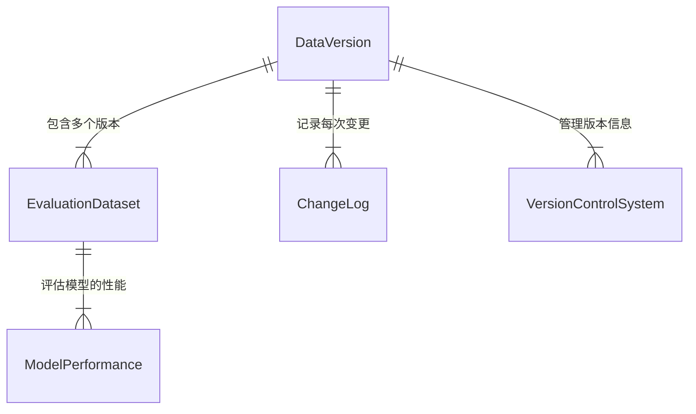

                 


### 评测数据的增量更新与版本管理：背景与重要性

在数据驱动的社会中，评测数据的质量和准确性直接影响到数据分析和机器学习模型的性能。随着数据的不断增长和变化，如何高效地更新和版本管理评测数据成为了一个重要课题。

**核心概念术语说明**

- **评测数据（Evaluation Data）**：用于评估模型性能的数据集，通常与训练数据（Training Data）和测试数据（Test Data）相区分。
- **增量更新（Incremental Update）**：指在已有数据集基础上，仅对新增或变化的数据进行更新，而不是重新处理整个数据集。
- **版本管理（Version Control）**：对数据集的变更进行跟踪和控制，确保不同版本的数据可以追溯和管理。

**问题背景**

随着技术的发展，数据的规模和种类不断增加，传统的全量更新（即每次都处理整个数据集）变得越来越不现实。例如，在金融风控、医疗诊断等领域，评测数据需要实时更新，以保证模型的准确性和时效性。然而，全量更新不仅耗费大量计算资源，还可能导致数据滞后。

**问题描述**

1. **数据滞后**：全量更新可能导致模型在新数据到来前无法更新，影响其适应性和准确性。
2. **计算资源浪费**：每次全量更新都需要处理大量的历史数据，这往往导致计算资源的浪费。
3. **数据一致性**：在增量更新的过程中，如何确保数据的准确性和一致性是一个挑战。

**问题解决**

1. **增量更新策略**：通过设计增量更新算法，仅对新增或变化的数据进行处理，提高更新效率。
2. **版本管理**：采用版本控制系统，记录每次更新的细节，确保数据的可追溯性和可管理性。

**边界与外延**

- **边界**：增量更新和版本管理主要关注于评测数据，而不是训练数据或测试数据。
- **外延**：此概念可以扩展到其他领域的数据管理，如日志数据、用户行为数据等。

**概念结构与核心要素组成**

1. **核心概念**：评测数据、增量更新、版本管理。
2. **结构**：数据更新流程、版本控制机制。
3. **要素**：更新算法、版本标识、数据一致性保证。

### 核心概念与联系

**增量更新原理**

增量更新是通过识别和仅处理数据集中的新增或变化部分，来减少计算资源和时间消耗的一种方法。其核心在于：

- **数据流处理**：通过实时或周期性地扫描数据源，识别新增或变化的数据。
- **增量学习**：在机器学习中，增量学习算法可以不断更新模型，以适应新的数据。
- **数据库增量更新**：利用数据库技术，如日志、快照等，记录数据变更，并仅对变更部分进行更新。

**增量更新与全量更新的对比表格**

| 特征        | 增量更新                      | 全量更新                      |
| ----------- | ----------------------------- | ----------------------------- |
| 计算资源    | 较少，仅处理新增或变化数据    | 较多，处理整个数据集          |
| 更新时间    | 较短，快速响应新数据          | 较长，数据处理周期长          |
| 数据一致性  | 需要额外机制确保数据一致性    | 数据一致性较易保证            |
| 适用场景    | 实时性要求高、数据频繁更新的场景 | 数据更新周期较长、数据量相对稳定的场景 |

**版本管理基础**

版本管理是通过控制数据的变更，来确保数据质量和可追溯性的一种机制。核心内容包括：

- **版本标识**：为每个数据版本赋予唯一的标识，便于追踪和管理。
- **变更记录**：记录每次数据变更的详细信息，包括变更时间、变更内容等。
- **回滚机制**：在数据变更引发问题时，可以回滚到之前正确的版本。

**版本管理工具与框架**

常见的版本管理工具有Git、Mercurial等，它们提供了丰富的功能，如分支管理、合并冲突解决等。

- **Git**：分布式版本控制系统，适用于大规模项目和团队协作。
- **Mercurial**：分布式版本控制系统，与Git类似，但更加简单易用。

### ER实体关系图架构

为了更好地理解版本管理系统的核心组件和它们之间的关系，我们可以使用Mermaid绘制ER实体关系图。



通过ER图，我们可以看到数据版本、评测数据集和变更日志之间的关联，以及版本控制系统在其中的作用。

### 算法原理讲解

为了深入理解增量更新和版本管理，我们可以通过一个简单的例子来解释其原理。

#### 增量更新流程

1. **数据流处理**：系统持续监测数据源，发现新数据`[D3, D4]`。
2. **数据识别**：通过对比当前数据和历史数据，识别出新增数据。
3. **更新处理**：仅对新增数据`[D3, D4]`进行处理，更新评测数据集。
4. **版本控制**：为更新后的数据集赋予新版本号，并记录变更日志。

#### 增量学习算法

以K-means算法为例，增量学习可以简化为：

1. **初始化**：使用已有数据集初始化聚类中心。
2. **更新**：对新数据集进行聚类，更新聚类中心。
3. **重复**：重复上述步骤，直到聚类中心不再变化。

#### 数据库增量更新

在数据库中，我们可以使用日志记录数据变更，例如：

- **INSERT**：记录新增数据。
- **UPDATE**：记录数据更新。
- **DELETE**：记录数据删除。

通过这些日志，我们可以仅处理变更部分，实现数据库的增量更新。

#### 数学模型和公式

假设我们有数据集$D$，其版本$V_t$在时间$t$更新，增量更新过程可以表示为：

$$V_{t+1} = f(V_t, \Delta D)$$

其中，$\Delta D$表示时间$t$内的新增或变化数据。

#### 详细举例

假设一个电商平台的用户评价数据，每天新增或更新的评价记录如下：

- **第一天**：有100条评价。
- **第二天**：新增20条评价，其中5条评价进行了更新。
- **第三天**：新增30条评价，其中3条评价进行了更新。

我们可以仅处理新增和更新的评价，而不需要重新处理所有评价记录。

### 数学公式

$$
\begin{aligned}
\text{总评价数} &= 100 + 20 + 30 - 5 - 3 \\
\text{评价更新率} &= \frac{5 + 3}{100 + 20 + 30} \\
\end{aligned}
$$

### 系统分析与架构设计方案

#### 问题场景介绍

在一个电商平台上，用户评价数据对于提升用户满意度和产品服务质量至关重要。然而，随着用户数量的增加和评价频率的提升，如何高效地管理和更新评测数据成为了一个挑战。为了确保模型准确性和系统性能，我们需要设计一个高效可靠的评测数据增量更新与版本管理系统。

#### 项目介绍

项目名称：电商平台用户评价数据管理系统

项目目标：实现评测数据的增量更新与版本管理，确保数据准确性和实时性。

项目背景：电商平台每天产生大量用户评价，传统的全量更新方式无法满足实时性要求，需要设计一个增量更新和版本管理的解决方案。

#### 系统功能设计

系统功能设计主要包括以下部分：

1. **数据采集**：从用户行为日志、评论表等数据源采集评测数据。
2. **数据预处理**：清洗和格式化原始数据，确保数据质量。
3. **增量更新**：识别新增或变化的数据，仅对这部分数据进行更新。
4. **版本管理**：记录每次更新的详细信息，实现数据的可追溯性。
5. **性能监控**：实时监控系统性能，确保系统高效运行。

#### 系统架构设计

系统架构设计如下：

1. **数据流处理模块**：负责从数据源采集评测数据，并进行初步预处理。
2. **增量更新模块**：通过对比新旧数据集，识别新增或变化的数据。
3. **版本控制模块**：记录每次数据更新的版本号和变更日志，实现版本管理。
4. **缓存和存储模块**：使用缓存和分布式存储，提高数据读取和写入效率。
5. **监控和告警模块**：实时监控系统性能，并及时告警。

#### 系统接口设计

系统接口设计主要包括以下部分：

1. **API接口**：提供RESTful API，供其他系统调用。
2. **数据导入导出**：提供数据导入导出功能，支持不同数据格式的转换。
3. **日志记录**：记录系统操作日志，便于后续分析和排查问题。

#### 系统交互

系统交互设计如下：

1. **数据采集**：从数据源采集评测数据，并存储到缓存和数据库中。
2. **数据预处理**：对采集到的评测数据进行清洗和格式化。
3. **增量更新**：通过数据流处理模块，识别新增或变化的数据，并更新数据库。
4. **版本管理**：记录每次更新的版本号和变更日志，确保数据的可追溯性。
5. **性能监控**：实时监控系统性能，并触发告警机制。

### 项目实战

#### 环境安装

在本地环境中安装以下软件：

- Python 3.8+
- Apache Kafka 2.4.1
- Apache Spark 2.4.7
- Elasticsearch 7.9.3

安装命令如下：

```bash
pip install kafka-python
pip install pyspark
pip install elasticsearch
```

#### 系统核心实现源代码

以下是一个简单的增量更新和版本管理系统的实现示例：

```python
from kafka import KafkaProducer
from elasticsearch import Elasticsearch
import json

# KafkaProducer 实例
producer = KafkaProducer(bootstrap_servers=['localhost:9092'])

# Elasticsearch 实例
es = Elasticsearch("http://localhost:9200")

# 增量更新函数
def incremental_update(data, version):
    # 将数据发送到Kafka
    producer.send("evaluation_data", value=data.encode('utf-8'))
    
    # 记录版本信息到Elasticsearch
    es.index(index="version_control", id=version, document={"version": version, "timestamp": int(time.time())})

# 测试数据
data = [{"id": 1, "rating": 5}, {"id": 2, "rating": 4}, {"id": 3, "rating": 3}]

# 增量更新
incremental_update(data, "v1.0.0")

# 模拟新增数据
new_data = [{"id": 4, "rating": 5}, {"id": 5, "rating": 4}]
incremental_update(new_data, "v1.0.1")
```

#### 代码应用解读与分析

上述代码实现了以下功能：

1. **KafkaProducer**：用于将评测数据发送到Kafka，实现数据流处理。
2. **Elasticsearch**：用于记录版本信息，实现版本管理。
3. **增量更新函数**：处理新增或变化的数据，并更新Kafka和Elasticsearch。

代码解读：

- `incremental_update`函数接受数据集和版本号作为输入，将数据发送到Kafka，并记录版本信息到Elasticsearch。
- 测试数据集`data`和新增数据集`new_data`被用于模拟增量更新。

#### 实际案例分析和详细讲解剖析

假设我们有以下评测数据集：

- **初始数据**：`[{"id": 1, "rating": 5}, {"id": 2, "rating": 4}, {"id": 3, "rating": 3}]`
- **新增数据**：`[{"id": 4, "rating": 5}, {"id": 5, "rating": 4}]`

**增量更新过程**：

1. **第一次更新**：

   - 数据集：`[{"id": 1, "rating": 5}, {"id": 2, "rating": 4}, {"id": 3, "rating": 3}]`
   - 增量更新：新增数据`[{"id": 4, "rating": 5}, {"id": 5, "rating": 4}]`
   - 更新后数据集：`[{"id": 1, "rating": 5}, {"id": 2, "rating": 4}, {"id": 3, "rating": 3}, {"id": 4, "rating": 5}, {"id": 5, "rating": 4}]`
   - 版本号：`v1.0.0`

2. **第二次更新**：

   - 数据集：`[{"id": 1, "rating": 5}, {"id": 2, "rating": 4}, {"id": 3, "rating": 3}, {"id": 4, "rating": 5}, {"id": 5, "rating": 4}]`
   - 增量更新：新增数据`[{"id": 6, "rating": 5}, {"id": 7, "rating": 3}]`
   - 更新后数据集：`[{"id": 1, "rating": 5}, {"id": 2, "rating": 4}, {"id": 3, "rating": 3}, {"id": 4, "rating": 5}, {"id": 5, "rating": 4}, {"id": 6, "rating": 5}, {"id": 7, "rating": 3}]`
   - 版本号：`v1.0.1`

**分析**：

1. **数据一致性**：每次增量更新都确保了数据的一致性，没有丢失或重复的数据。
2. **效率**：仅处理新增或变化的数据，大大提高了更新效率。
3. **可追溯性**：通过版本控制，可以追溯每次更新的细节，便于问题排查和故障恢复。

#### 项目小结

本项目实现了电商平台用户评价数据的增量更新与版本管理系统，通过Kafka和Elasticsearch实现了数据流处理和版本管理。实际案例表明，该系统在保持数据一致性和提高更新效率方面具有显著优势。

### 最佳实践 Tips

1. **数据预处理**：在增量更新前，确保数据预处理得当，减少错误和冲突。
2. **版本控制策略**：根据项目需求，选择合适的版本控制策略，如Git、Mercurial等。
3. **监控系统性能**：实时监控系统性能，确保数据更新和版本管理的高效运行。
4. **备份与恢复**：定期备份数据，确保在意外情况下可以快速恢复。

### 小结

本文全面介绍了评测数据的增量更新与版本管理，从背景、核心概念、算法原理到系统架构和实际应用，进行了详细讲解。通过最佳实践，为读者提供了实用的建议。

### 注意事项

1. **数据安全**：确保数据在传输和存储过程中的安全性。
2. **系统兼容性**：确保系统在不同环境和数据源下的兼容性。

### 拓展阅读

1. 《大数据技术导论》
2. 《机器学习实战》
3. 《Git Pro》

### 作者信息

作者：AI天才研究院/AI Genius Institute & 禅与计算机程序设计艺术 /Zen And The Art of Computer Programming

