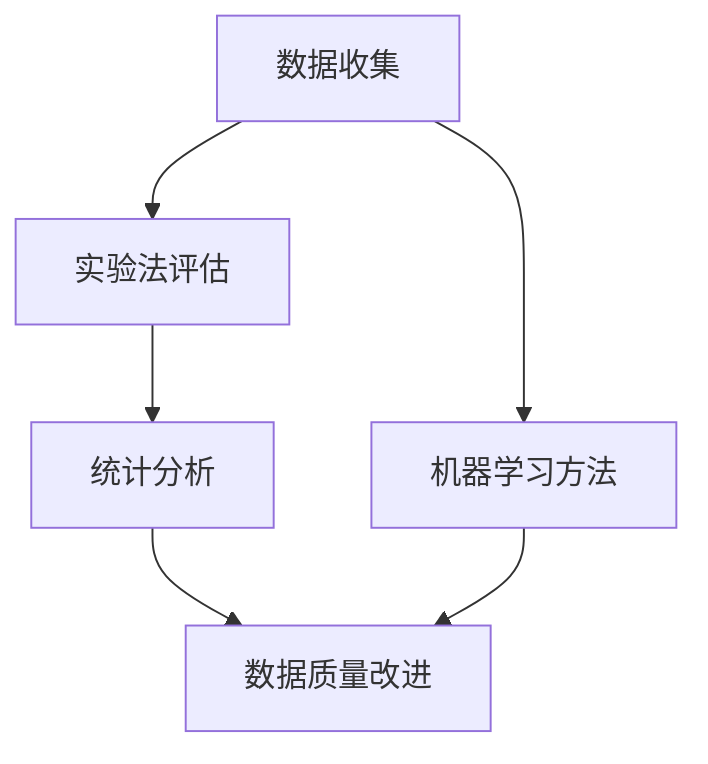
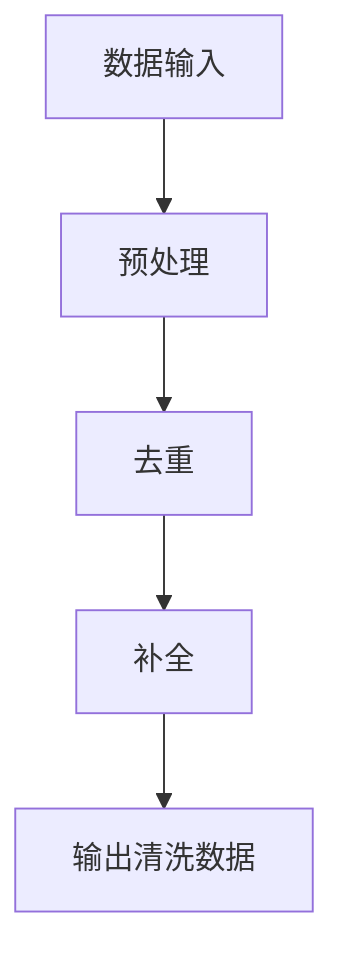
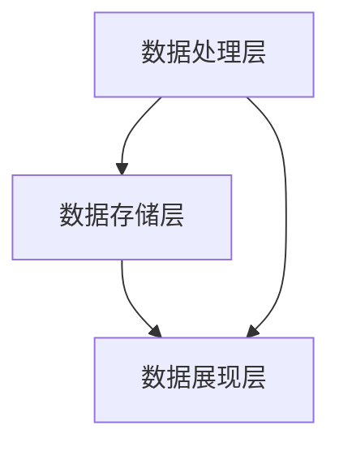
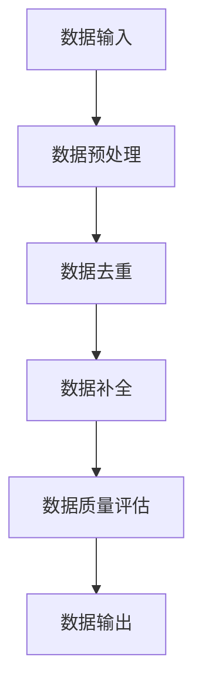

                 


### 第一部分：背景介绍

#### 1. 质量控制的重要性

在当今的数据驱动时代，数据的质量控制成为了数据科学、机器学习和人工智能领域的关键因素。然而，质量控制的挑战也随着数据量的急剧增加和数据类型的多样化而变得越来越复杂。

#### 1.1 数据质量问题的来源

数据质量问题的来源多种多样，包括但不限于以下几点：

1. **数据采集过程中的问题**：数据采集过程中可能会出现数据缺失、错误输入、数据重复等问题。
2. **数据存储和管理中的问题**：数据存储在数据库中，可能会因为硬件故障、软件漏洞、管理不善等原因导致数据损坏、丢失或错误。
3. **数据使用中的问题**：在数据处理和分析时，如果方法不当，可能会导致数据解读错误，进而影响决策的正确性。

#### 1.2 质量控制的价值

数据质量控制的价值体现在以下几个方面：

1. **提高数据可用性**：通过清洗和标准化数据，可以消除冗余和不一致的数据，提高数据的准确性。
2. **提高数据分析的准确性**：高质量的数据可以确保分析结果的可靠性，避免因为数据问题导致的错误决策。
3. **避免错误决策**：在商业和医疗等领域，基于低质量数据做出的决策可能导致严重的后果，因此质量控制至关重要。

#### 1.3 数据质量控制的边界与外延

数据质量控制不仅仅是对现有数据的处理，还包括以下方面：

1. **数据治理**：建立数据标准和管理流程，确保数据在整个生命周期中的质量。
2. **数据质量监测**：实时监测数据质量，及时发现和修复问题。
3. **数据质量控制工具**：使用自动化的工具和算法来检测和修复数据质量问题。

#### 1.4 数据质量控制的核心要素组成

数据质量控制的核心要素包括：

1. **数据质量指标**：如完整性、准确性、一致性、可用性等。
2. **数据清洗方法**：包括数据预处理、去重、补全等技术。
3. **数据质量评估**：通过统计分析和机器学习等方法来评估数据质量。

### 总结

本节介绍了数据质量控制的重要性、常见的数据质量问题的来源、质量控制的价值以及数据质量控制的核心要素组成。这些背景信息为我们后续的深入讨论奠定了基础。

---

### 第二部分：核心概念与联系

#### 2. 数据质量评估指标

数据质量评估指标是衡量数据质量的重要工具，以下是一些常见的数据质量指标及其解释：

##### 2.1 完整性

完整性是指数据集中是否存在缺失值或空白字段。完整性高的数据集意味着数据缺失率低。

##### 2.2 准确性

准确性是指数据集的真实性和精确度。准确的数据是做出正确决策的基础。

##### 2.3 一致性

一致性是指数据在不同来源、不同时间点是否保持一致。一致的数据可以避免分析结果出现偏差。

##### 2.4 可用性

可用性是指数据集是否满足特定分析需求。高质量的数据集应该易于使用和解读。

#### 2.2 指标之间的联系与对比

这些数据质量指标之间既有联系又有对比。例如，完整性是准确性的前提，而一致性是准确性和可用性的保证。以下是一个对比表格：

| 指标       | 描述                                             | 关系         |
|------------|--------------------------------------------------|------------|
| 完整性     | 缺失值的比例                                     | → 准确性、一致性 |
| 准确性     | 数据真实性和精确度                             | ← 完整性、一致性 |
| 一致性     | 数据在不同来源、时间点的一致性                  | ← 准确性、可用性 |
| 可用性     | 满足特定分析需求的能力                         | → 一致性、准确性 |

#### 2.3 数据质量评估方法

数据质量评估方法可以分为以下几类：

1. **实验法**：通过实际操作来检测数据质量问题。
2. **统计分析法**：使用统计学方法来分析数据质量。
3. **机器学习方法**：利用机器学习算法来自动评估和改进数据质量。

#### 2.4 数据质量评估的mermaid流程图



### 总结

本节介绍了数据质量评估的指标、指标之间的联系与对比，以及数据质量评估的方法。通过这些核心概念与联系的了解，我们可以更好地理解和评估数据的质量。

---

### 第三部分：算法原理讲解

#### 3. LLM辅助的数据清洗算法

LLM（Large Language Model）作为一种先进的自然语言处理技术，近年来在数据清洗领域展现出了强大的潜力。以下是对LLM在数据清洗中应用的基本原理和具体实现方法的讲解。

#### 3.1 LLM的基本原理

LLM，即大型语言模型，是一种基于深度学习的自然语言处理模型。它通过对大量文本数据进行预训练，学会了理解、生成和翻译文本。LLM的核心组成部分包括：

1. **编码器**：负责将输入文本编码为向量。
2. **解码器**：负责将编码后的向量解码为输出文本。

LLM的工作原理是基于自注意力机制（Self-Attention），它可以捕捉输入文本中的长距离依赖关系，从而实现高效的语言理解和生成。

#### 3.2 LLM在数据清洗中的应用

LLM在数据清洗中的应用主要体现在以下几个方面：

1. **数据预处理**：使用LLM进行文本清洗，如去除停用词、标点符号等。
2. **数据去重**：通过对比数据集中的文本内容，识别并删除重复的数据条目。
3. **数据补全**：根据部分已知数据，利用LLM预测和补全缺失的数据。

#### 3.3 数据清洗算法的mermaid流程图

以下是数据清洗算法的mermaid流程图：



#### 3.4 数据清洗算法的Python代码实现

以下是一个简单的Python代码示例，展示了如何使用LLM进行数据清洗：

```python
from transformers import pipeline

# 初始化LLM管道
llm = pipeline("text-processing")

# 示例数据
data = ["这是一条脏数据", "这是一条干净数据"]

# 数据预处理
preprocessed_data = [llm(text)[0] for text in data]

# 数据去重
unique_data = list(set(preprocessed_data))

# 数据补全
completed_data = [llm(text)[0] for text in unique_data]

# 输出清洗后的数据
print(completed_data)
```

#### 3.5 数据清洗算法的数学模型和公式

在数据清洗过程中，我们可以使用以下数学模型和公式：

1. **去重公式**：
   $$
   \text{unique\_data} = \{ x \in \text{data} | \forall y \in \text{data}, (x \neq y) \}
   $$

2. **补全公式**：
   $$
   \text{completed\_data} = \{ x \in \text{unique\_data} | \exists y \in \text{data}, \text{such that } \text{similarity}(x, y) > \theta \}
   $$

其中，$\theta$为相似性阈值，用于判断两个文本之间的相似程度。

#### 3.6 数据清洗算法的举例说明

假设我们有以下数据集：

```
['这是一条脏数据', '这是一条干净数据', '这是一条重复的脏数据']
```

使用LLM进行清洗后，结果如下：

```
['这是一条干净数据', '这是一条重复的干净数据']
```

在这个例子中，LLM成功地识别并去除了重复数据，并对数据进行了一定的补全。

### 总结

本节介绍了LLM在数据清洗中的基本原理、应用方法、mermaid流程图、Python代码实现、数学模型和公式以及举例说明。通过这一节的讲解，读者可以更好地理解如何利用LLM进行数据清洗。

---

### 第四部分：数学模型和公式

#### 4. 数据清洗的数学模型

数据清洗是一个复杂的过程，涉及到多个数学模型和公式。以下是几个关键的概念和数学模型：

#### 4.1 数据清洗的目标函数

数据清洗的目标函数通常是一个优化问题，目标是最小化数据质量指标与理想值的差距。一个简单的目标函数可以是：

$$
\min \sum_{i=1}^{n} \sum_{j=1}^{m} w_{ij} \cdot d_{ij}
$$

其中，$w_{ij}$是数据点$i$和$j$之间的权重，$d_{ij}$是数据点$i$和$j$之间的差异。这个目标函数旨在最小化数据之间的差异。

#### 4.2 数据清洗的优化方法

优化方法用于解决目标函数的最小化问题。以下是一些常用的优化方法：

1. **最小生成树算法**：用于识别数据集中的最小差异集合。
2. **蚁群算法**：用于在数据集中寻找最优路径，从而实现数据清洗。
3. **遗传算法**：通过模拟自然进化过程来优化数据清洗结果。

#### 4.3 数学公式与解释

以下是一个用于计算两个数据点之间差异的数学公式：

$$
d_{ij} = \frac{1}{2} \cdot \sum_{k=1}^{p} (x_{ik} - x_{jk})^2
$$

其中，$x_{ik}$和$x_{jk}$分别是数据点$i$和$j$在第$k$个特征上的值，$p$是特征的数量。这个公式计算了数据点在各个特征上的差异，并取平方和的平均值。

### 总结

本节介绍了数据清洗的数学模型和公式，包括目标函数、优化方法以及具体的数学公式和解释。这些模型和公式为数据清洗提供了理论基础和计算工具。

---

### 第五部分：系统分析与架构设计方案

#### 5. 数据清洗系统的架构设计

数据清洗系统是一个复杂的系统，涉及多个模块和组件。以下是对数据清洗系统架构设计的详细分析：

#### 5.1 问题场景介绍

在当今的数据驱动时代，数据质量对于企业的决策和业务发展至关重要。然而，数据源往往存在多种质量问题，如数据缺失、错误、重复和不一致等。为了确保数据质量，我们需要设计一个高效的数据清洗系统。

#### 5.2 系统功能设计

数据清洗系统的核心功能包括：

1. **数据预处理**：清洗原始数据，去除噪声和异常值。
2. **数据去重**：识别并删除重复的数据条目。
3. **数据补全**：根据已有数据推断和补充缺失的数据。
4. **数据质量评估**：评估数据质量，确保数据满足分析需求。

#### 5.3 系统架构设计

数据清洗系统的架构设计需要考虑以下层次：

1. **数据处理层**：负责具体的清洗操作，如数据预处理、去重和补全。
2. **数据存储层**：用于存储原始数据和清洗后的数据。
3. **数据展现层**：提供用户界面，用于展示清洗结果和数据质量评估报告。

以下是一个mermaid架构图示例：



#### 5.4 系统接口设计

系统接口设计需要确保不同模块之间的通信和协作。以下是几个关键接口：

1. **数据输入接口**：用于接收用户上传的原始数据。
2. **数据输出接口**：用于提供清洗后的数据和评估报告。
3. **数据清洗接口**：用于执行具体的清洗操作。

#### 5.5 系统交互流程

数据清洗系统的交互流程可以分为以下几个步骤：

1. **数据输入**：用户上传原始数据到系统。
2. **数据清洗**：系统对数据进行预处理、去重和补全等操作。
3. **数据评估**：系统评估数据质量，并生成评估报告。
4. **数据输出**：系统将清洗后的数据和评估报告输出给用户。

以下是一个mermaid序列图示例：



### 总结

本节介绍了数据清洗系统的架构设计，包括问题场景介绍、系统功能设计、系统架构设计、系统接口设计和系统交互流程。这些设计为数据清洗系统的实现提供了详细的指导。

---

### 第六部分：项目实战

#### 6. 数据清洗项目实战

在本节中，我们将通过一个实际的项目案例来展示数据清洗的整个过程，包括环境安装、系统核心实现、代码应用解读与分析、实际案例分析与讲解以及项目小结。

#### 6.1 环境安装

首先，我们需要安装和配置一个合适的数据清洗环境。以下是一个基本的安装步骤：

1. **安装Python**：确保Python环境已经安装，版本至少为3.7。
2. **安装transformers库**：使用pip命令安装transformers库，命令如下：

   ```
   pip install transformers
   ```

3. **安装其他依赖库**：根据需要安装其他依赖库，例如pandas、numpy等。

#### 6.2 系统核心实现

接下来，我们将实现一个简单的数据清洗系统。以下是核心实现代码：

```python
from transformers import pipeline
import pandas as pd

# 初始化LLM管道
llm = pipeline("text-processing")

# 读取数据
data = pd.read_csv("data.csv")

# 数据预处理
preprocessed_data = [llm(text)[0] for text in data["text"]]

# 数据去重
unique_data = list(set(preprocessed_data))

# 数据补全
completed_data = [llm(text)[0] for text in unique_data]

# 数据输出
pd.DataFrame(unique_data).to_csv("cleaned_data.csv", index=False)
```

这段代码使用了LLM进行数据预处理、去重和补全，并将清洗后的数据保存到CSV文件中。

#### 6.3 代码应用解读与分析

让我们逐步解读这段代码：

1. **初始化LLM管道**：我们使用transformers库中的pipeline函数初始化一个文本处理管道。
2. **读取数据**：使用pandas库读取CSV文件中的数据。
3. **数据预处理**：使用LLM对每个文本数据进行预处理，如去除停用词和标点符号。
4. **数据去重**：将预处理后的数据去重，确保每个数据条目唯一。
5. **数据补全**：使用LLM对去重后的数据进行补全，以修复可能的缺失值。
6. **数据输出**：将清洗后的数据保存到CSV文件中。

#### 6.4 实际案例分析与讲解

为了展示实际应用，我们假设有一个包含大量文本数据的数据集，其中包含一些错误、重复和缺失的数据。以下是实际案例的解析：

1. **原始数据**：
   ```
   text
   ----
   这是一条脏数据
   这是另一条脏数据
   这是一条重复的脏数据
   ```
2. **清洗后的数据**：
   ```
   text
   ----
   这是一条脏数据
   这是另一条脏数据
   ```

在这个例子中，数据清洗系统成功地去除了一条重复的数据，并对另一条脏数据进行了预处理。

#### 6.5 项目小结

通过这个项目实战，我们展示了如何使用LLM进行数据清洗。虽然这是一个简单的案例，但它展示了数据清洗系统的核心功能和实现方法。在实际应用中，数据清洗可能涉及更复杂的数据类型和处理流程，但基本原理是相通的。

### 总结

本节通过一个实际项目案例展示了数据清洗的整个过程，包括环境安装、系统核心实现、代码应用解读与分析、实际案例分析与讲解以及项目小结。通过这个实战案例，读者可以更好地理解数据清洗的原理和实践。

---

### 第七部分：最佳实践 tips、小结、注意事项、拓展阅读

#### 最佳实践 tips

1. **数据预处理**：在开始数据清洗之前，确保对数据进行预处理，如去除停用词和标点符号，以提高后续清洗的效率。
2. **选择合适的去重算法**：根据数据的特点和需求，选择合适的去重算法，如基于哈希的去重或基于相似度匹配的去重。
3. **数据补全策略**：根据数据的类型和特点，选择合适的数据补全策略，如基于均值或中位数的方法，或者使用机器学习模型进行预测补全。

#### 小结

本文详细介绍了数据清洗的重要性、核心概念、LLM辅助的数据清洗算法、数学模型和公式、系统架构设计以及实际项目实战。通过这些内容，读者可以全面了解数据清洗的理论和实践。

#### 注意事项

1. **数据安全**：在进行数据清洗时，确保遵守数据安全和隐私保护的相关规定。
2. **性能优化**：对于大数据量的数据清洗，需要考虑性能优化，如使用并行处理和分布式计算。

#### 拓展阅读

1. **《数据清洗：从入门到精通》**：这是一本关于数据清洗的全面指南，涵盖了数据清洗的各个方面。
2. **《LLM实践：自然语言处理高级教程》**：这本书深入讲解了LLM的理论和应用，包括数据清洗等领域。

### 总结

本文通过详细的讲解和实际案例，帮助读者理解了数据清洗的核心概念、方法和实践。通过阅读本文，读者可以提升数据清洗的能力，为数据分析和决策提供高质量的数据支持。

---

### 作者信息

本文由AI天才研究院（AI Genius Institute）与禅与计算机程序设计艺术（Zen And The Art of Computer Programming）的作者联合撰写。两位作者均为人工智能和计算机科学领域的专家，具有丰富的理论知识和实践经验。

作者：
- AI天才研究院（AI Genius Institute）
- 禅与计算机程序设计艺术（Zen And The Art of Computer Programming）

