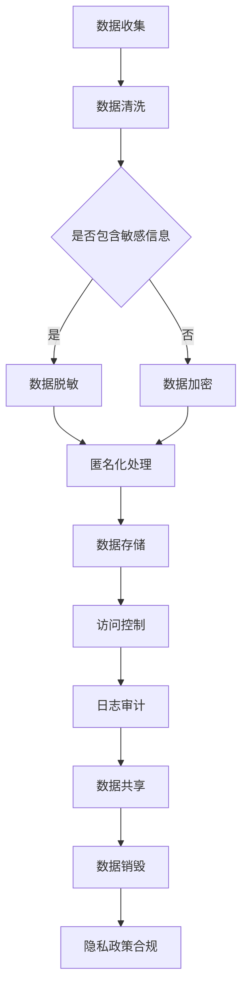
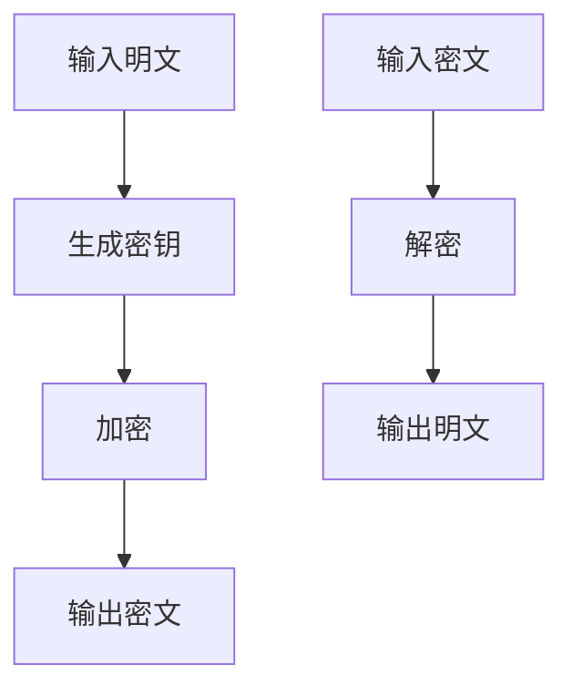
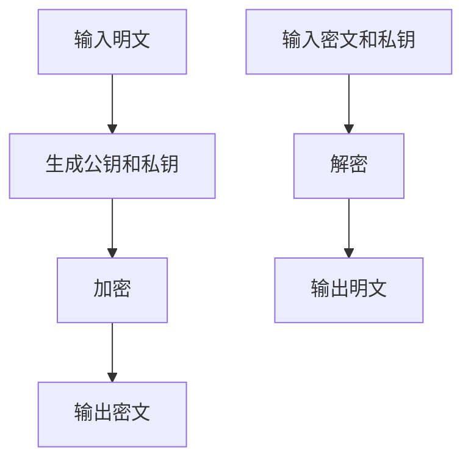
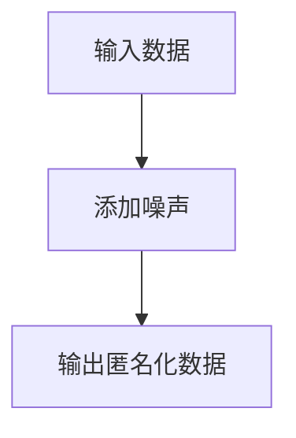
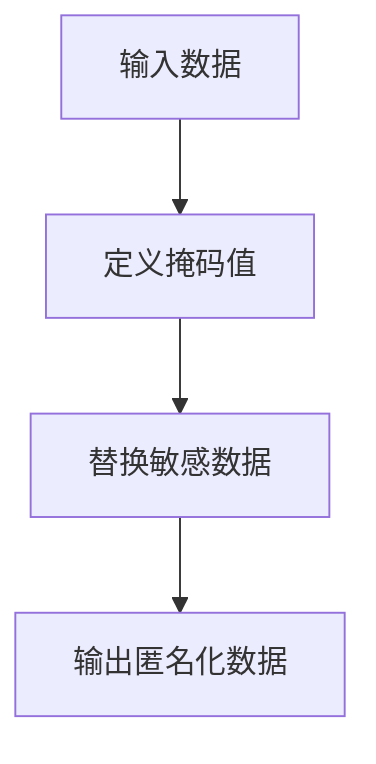
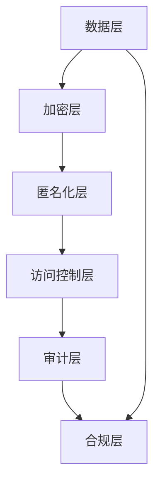

                 

### 引言

在当今信息化社会中，数据已成为各行各业的关键资源。特别是在评测领域，大量敏感数据被收集、存储和使用，用于评估、测试和优化各种系统和服务。然而，这些敏感数据往往包含用户的个人信息、隐私数据或者其他敏感信息，一旦泄露，可能带来严重的后果，包括个人隐私的侵犯、财产损失，甚至国家安全问题。因此，评测数据的隐私保护变得至关重要。

随着大数据、人工智能等技术的快速发展，评测数据的规模和复杂性也在不断增加。传统的数据保护方法已经无法满足现代隐私保护的需求，新的挑战和威胁也随之而来。这些挑战包括数据量庞大、数据类型多样化、数据共享和分发需求增加等。为了应对这些挑战，我们需要采取更加先进和有效的隐私保护技术。

本文将深入探讨评测数据的隐私保护问题。首先，我们将介绍隐私保护的重要性，阐述评测数据隐私保护的现状和面临的挑战。接着，我们将介绍隐私保护的基本概念和技术，并使用Mermaid流程图展示这些概念和技术之间的联系。随后，我们将详细讲解常用的隐私保护算法，包括加密算法和匿名化算法，并通过Python源代码和数学模型进行深入剖析。此外，我们将分析系统架构设计，介绍评测数据隐私保护系统的功能、架构、接口和交互。最后，我们将通过一个实际项目案例，展示如何在实践中实现评测数据的隐私保护，并总结最佳实践和注意事项。

通过本文的阅读，读者将能够了解评测数据隐私保护的最新进展和关键策略，掌握实用的隐私保护技术，为保障敏感信息安全提供有力支持。

### 背景介绍

#### 核心概念术语说明

在探讨评测数据的隐私保护之前，有必要明确一些核心概念和术语，以便为后续内容提供清晰的背景和基础。

**评测数据**：指用于评估、测试和优化系统、服务和应用程序的数据集。这些数据可以包括用户行为数据、性能数据、反馈数据等。

**隐私保护**：确保评测数据中的敏感信息不被未经授权的实体访问、使用或泄露的过程。隐私保护的目标是平衡数据利用和数据安全之间的关系。

**敏感信息**：指可能对个人、组织或社会产生负面影响的个人信息，如身份证号码、电话号码、地址、银行账户信息等。

**数据泄露**：指未经授权的实体非法获取、访问或使用敏感信息的行为，可能导致隐私侵犯、财产损失或声誉损害。

**隐私威胁**：指可能对隐私保护造成威胁的因素，如数据泄露、恶意软件攻击、非法数据交易等。

**隐私法规**：指旨在规范数据处理、存储和使用行为的法律、法规和政策。例如，《通用数据保护条例》（GDPR）、《加州消费者隐私法案》（CCPA）等。

#### 问题背景

随着互联网的普及和数字化进程的加速，评测数据的收集和处理变得越来越普遍。这些数据不仅来源于企业内部的测试和评估，还包括用户在互联网上的行为和交互数据。然而，这些数据往往包含大量的敏感信息，一旦泄露，可能对个人和社会产生严重的影响。

首先，个人隐私受到威胁。用户在互联网上的行为数据，如浏览记录、购买偏好、社交互动等，都可能被收集和分析。如果这些数据泄露，用户可能会遭受身份盗窃、财产损失等风险。

其次，组织的数据安全面临挑战。评测数据往往包含组织的核心业务数据，如财务信息、客户信息、内部机密等。数据泄露可能导致商业机密泄露、财务损失，甚至影响组织的运营和声誉。

此外，国家和社会安全也可能受到影响。在某些情况下，评测数据可能包含国家安全相关的信息。数据泄露可能导致国家安全风险，影响国家战略决策和军事安全。

#### 问题描述

在当前的数字化环境下，评测数据的隐私保护面临着诸多挑战。首先，数据量庞大且类型多样化。随着技术的发展，评测数据的规模和复杂度不断增加，传统的保护方法已无法应对。

其次，数据共享和分发需求增加。评测数据通常需要在不同的系统和组织之间进行共享和分发，以便进行跨部门协作和数据分析。然而，这种共享和分发过程增加了数据泄露的风险。

第三，隐私保护技术不断发展，但也面临新的威胁。例如，同态加密和匿名化技术虽然在理论上可以有效保护隐私，但在实际应用中仍存在性能和安全性等问题。

最后，法规和政策的执行力度不够。虽然许多国家和地区已经出台了相关的隐私保护法规，但在实际操作中，许多企业和组织未能严格执行，导致隐私保护措施形同虚设。

综上所述，评测数据的隐私保护问题不仅涉及技术层面，还包括法律、政策和实践等多个方面。我们需要采取综合性的措施，从数据收集、存储、处理到分发和销毁的全过程进行隐私保护，确保敏感信息的安全。

#### 问题解决

为了有效解决评测数据隐私保护的问题，我们需要采取一系列技术和管理措施。以下是一些主要的方法和步骤：

**1. 数据匿名化**：通过技术手段对敏感数据进行脱敏处理，使数据在保留有用信息的同时，无法直接识别个人信息。常用的匿名化技术包括数据扰动、数据加密和数据隐藏等。

**2. 同态加密技术**：同态加密是一种在加密状态下对数据进行操作的技术，可以在不解密数据的情况下进行计算和处理。这种技术有助于保护数据隐私，避免在数据传输和存储过程中泄露敏感信息。

**3. 加密技术**：加密是一种将明文数据转换为密文的过程，只有具备密钥的实体才能解密和访问原始数据。对称加密和非对称加密是常用的加密技术，前者适用于数据量较小的场景，而后者适用于大尺寸数据的加密。

**4. 访问控制和权限管理**：通过严格的访问控制和权限管理机制，确保只有授权用户才能访问敏感数据。这包括身份验证、访问控制列表（ACL）和权限分级等措施。

**5. 数据安全审计**：定期对数据访问和使用情况进行审计，及时发现和处理异常行为，防止数据泄露。

**6. 法律法规和政策合规**：严格遵守相关的隐私保护法律法规，制定内部数据保护政策，确保数据处理过程符合法规要求。

**7. 数据安全和隐私教育**：加强员工的数据安全和隐私保护意识，提高数据安全防护技能，减少人为因素导致的数据泄露风险。

**8. 数据安全和隐私培训**：定期组织数据安全和隐私保护培训，提高员工对隐私保护重要性的认识，以及如何正确处理敏感信息。

通过上述措施，我们可以构建一个全面、系统的隐私保护框架，确保评测数据的安全性和隐私性。需要注意的是，隐私保护是一个持续的过程，需要不断更新和完善保护措施，以应对新的技术和威胁。

#### 边界与外延

在评测数据的隐私保护领域，需要明确一些边界和概念的外延，以准确界定隐私保护的范畴和范围。

**边界**：
1. **数据边界**：隐私保护的范围应限于敏感数据，即可能对个人隐私造成侵害的信息，如个人身份信息、金融信息、健康信息等。
2. **技术边界**：隐私保护技术应具备一定的性能和安全性，以满足实际应用需求。例如，同态加密技术的应用需要考虑计算效率和安全性之间的平衡。
3. **法律边界**：隐私保护应遵守相关的法律法规，如GDPR和CCPA等，这些法律为数据处理行为设定了明确的规范和限制。

**外延**：
1. **数据范围**：隐私保护不仅限于个人数据，还包括组织内部的敏感信息，如客户信息、商业机密等。
2. **技术外延**：隐私保护技术不仅包括加密和匿名化，还包括数据去重、数据混淆、访问控制等多种手段。
3. **应用范围**：隐私保护不仅适用于评测数据的处理，还应用于数据的存储、传输、共享和销毁等整个生命周期。

通过明确边界和外延，我们可以更准确地界定隐私保护的对象和范围，为构建全面的隐私保护体系提供指导。

#### 概念结构与核心要素组成

隐私保护系统的概念结构由多个核心要素组成，每个要素在保障评测数据隐私中扮演着不同的角色。以下是隐私保护系统的核心组成部分及其功能：

1. **数据加密**：数据加密是隐私保护的基础，通过将敏感数据转换为无法直接识别的密文，确保数据在传输和存储过程中的安全性。数据加密分为对称加密和非对称加密，前者计算效率高但密钥管理复杂，后者安全性高但计算复杂度较大。

2. **匿名化**：匿名化技术通过去除或模糊化个人身份信息，使得数据在保留分析价值的同时，无法直接识别个人身份。常用的匿名化方法包括数据扰动、数据掩码和数据处理等。

3. **访问控制**：访问控制机制通过设置访问权限，确保只有授权用户才能访问敏感数据。访问控制包括用户认证、权限分级和访问审计等功能，是保护数据安全的关键措施。

4. **数据脱敏**：数据脱敏是对数据进行部分或全部加密和脱敏处理，以保护敏感信息不被泄露。脱敏技术常用于数据交换、共享和存储，以平衡数据可用性和安全性。

5. **同态加密**：同态加密技术允许在密文状态下对数据进行计算和处理，而不需要解密，从而在计算过程中保护数据隐私。同态加密是未来隐私保护的重要方向，但面临计算复杂度高的挑战。

6. **日志审计**：日志审计通过记录和监控数据的访问和使用情况，及时发现异常行为和潜在威胁。审计日志对于数据安全和隐私合规至关重要，有助于追踪和调查数据泄露事件。

7. **隐私政策**：隐私政策是组织制定的数据保护策略，明确数据收集、使用、存储和共享的原则和规范。隐私政策不仅规范内部操作，也为用户提供了透明、公正的数据处理方式。

8. **合规性检查**：合规性检查是确保数据隐私保护措施符合相关法律法规和标准的过程。合规性检查包括定期审核数据保护政策和操作流程，确保组织的行为符合法律要求。

这些核心要素相互配合，共同构建了一个全面的隐私保护系统，从数据生成、处理、传输到销毁的全过程中，确保评测数据的隐私和安全。

### 核心概念与联系

在讨论评测数据的隐私保护时，理解核心概念及其相互联系至关重要。以下是几个关键概念及其关系的介绍：

**概念1：加密与匿名化**

**加密**是一种将原始数据转换为无法直接识别的密文的过程，以保护数据在传输和存储过程中的安全性。**匿名化**则是通过去除或模糊化个人身份信息，使得数据在保留分析价值的同时，无法直接识别个人身份。

**关系**：加密和匿名化都是隐私保护的重要手段，但目标不同。加密主要用于保护数据的完整性和保密性，而匿名化则侧重于保护个人隐私。在实际应用中，两者常结合使用，以提供更全面的数据保护。

**概念2：同态加密**

**同态加密**是一种在密文状态下对数据进行操作的技术，可以在不解密数据的情况下进行计算和处理。这种技术特别适用于需要数据隐私保护的计算任务，如机器学习和数据分析。

**关系**：同态加密是加密技术的一个高级形式，它扩展了加密的适用范围，使得数据在加密状态下仍可以进行有效的计算。然而，同态加密目前仍面临计算复杂度高的挑战，限制了其在实际应用中的广泛应用。

**概念3：访问控制**

**访问控制**是一种通过设置访问权限，确保只有授权用户才能访问敏感数据的机制。访问控制包括用户认证、权限分级和访问审计等功能。

**关系**：访问控制是保护数据隐私的关键措施，它与加密和匿名化技术相辅相成。通过严格的访问控制，可以进一步确保敏感数据在存储和传输过程中的安全性，减少未经授权的访问风险。

**概念4：数据脱敏**

**数据脱敏**是对数据进行部分或全部加密和脱敏处理，以保护敏感信息不被泄露。脱敏技术常用于数据交换、共享和存储，以平衡数据可用性和安全性。

**关系**：数据脱敏是加密和匿名化的具体应用，它通过特定的算法和技术，将敏感数据转换为不可识别的形式，从而保护个人隐私。数据脱敏在数据共享和公开时尤为重要，有助于在保留数据价值的同时，防止隐私泄露。

**概念5：隐私政策**

**隐私政策**是组织制定的数据保护策略，明确数据收集、使用、存储和共享的原则和规范。隐私政策不仅规范内部操作，也为用户提供了透明、公正的数据处理方式。

**关系**：隐私政策是实施隐私保护的基础，它为数据隐私保护提供了法律和道德指导。隐私政策与加密、匿名化、访问控制和数据脱敏等技术相结合，共同构建了一个全面的数据隐私保护体系。

通过这些概念及其关系的介绍，我们可以更深入地理解评测数据隐私保护的核心要素和技术手段，为实际应用提供理论支持。

#### Mermaid流程图展示

为了更好地展示隐私保护技术的概念和流程，我们可以使用Mermaid流程图来直观地描述这些技术之间的关系。以下是一个示例的Mermaid流程图，展示了数据隐私保护的主要步骤和技术应用：



**详细解释**：
- **数据收集**：首先，收集需要保护的数据。
- **数据清洗**：对收集到的数据进行处理，去除噪声和冗余信息。
- **数据脱敏/加密**：根据数据是否包含敏感信息，选择数据脱敏或加密处理，以保护个人隐私。
- **匿名化处理**：对包含敏感信息的数据进行匿名化处理，去除或模糊化个人身份信息。
- **数据存储**：将处理后的数据存储在安全的存储系统中。
- **访问控制**：实施访问控制措施，确保只有授权用户能够访问敏感数据。
- **日志审计**：记录数据访问和使用情况，以便审计和监控。
- **数据共享**：在确保隐私保护的前提下，共享处理后的数据。
- **数据销毁**：在数据不再需要时，进行安全销毁，防止数据泄露。

通过这个Mermaid流程图，我们可以清晰地看到评测数据隐私保护的主要步骤和技术应用，为实际操作提供指导。

### 常用的隐私保护算法

在评测数据的隐私保护过程中，选择合适的算法是确保数据安全的关键。以下介绍几种常用的隐私保护算法，包括加密算法和匿名化算法，并详细阐述其原理、应用场景和优缺点。

#### 加密算法

**对称加密算法**：
对称加密算法是一种加密和解密使用相同密钥的加密方法。常见的对称加密算法包括DES、AES等。

**原理**：
对称加密算法通过对原始数据进行加密操作，将明文转换成密文。加密和解密过程使用相同的密钥，密钥管理是这类算法的安全核心。

**应用场景**：
对称加密算法适用于数据量较小的场景，如文件加密和数据库加密。

**优点**：
- **速度快**：加密和解密速度快，适用于实时数据保护。
- **简单**：加密和解密过程简单，易于实现和管理。

**缺点**：
- **密钥管理复杂**：对称加密算法需要安全地管理密钥，密钥泄露可能导致数据泄露。
- **不适用于大尺寸数据**：对称加密算法在大尺寸数据的加密和解密过程中效率较低。

**非对称加密算法**：
非对称加密算法使用一对密钥（公钥和私钥），公钥用于加密，私钥用于解密。常见的非对称加密算法包括RSA、ECC等。

**原理**：
非对称加密算法利用公钥和私钥之间的数学关系进行加密和解密。公钥公开，私钥保密，加密和解密过程复杂，安全性较高。

**应用场景**：
非对称加密算法适用于数据量较大、需要安全传输的场景，如网络安全通信和数字签名。

**优点**：
- **安全性高**：利用公钥和私钥之间的数学关系，非对称加密算法提供更高的安全性。
- **适用于大尺寸数据**：非对称加密算法适用于大尺寸数据的加密和解密。

**缺点**：
- **速度慢**：加密和解密速度较慢，不适用于实时数据保护。
- **密钥管理复杂**：需要安全地管理公钥和私钥，确保密钥不被泄露。

**同态加密算法**：
同态加密算法是一种在密文状态下对数据进行操作的技术，可以在不解密数据的情况下进行计算和处理。常见的同态加密算法包括CP-ABE、FHE等。

**原理**：
同态加密算法允许在密文状态下进行计算和操作，使得数据在传输和存储过程中保持加密状态，提高数据隐私保护水平。

**应用场景**：
同态加密算法适用于需要数据隐私保护的计算任务，如云计算和大数据分析。

**优点**：
- **数据隐私保护**：同态加密算法能够在数据加密状态下进行计算，保护数据隐私。
- **灵活性高**：适用于多种计算任务和数据处理场景。

**缺点**：
- **计算复杂度高**：同态加密算法的加密和解密过程复杂，计算资源消耗大。
- **性能瓶颈**：同态加密算法的性能瓶颈限制了其在实际应用中的广泛应用。

通过上述对加密算法的详细介绍，我们可以看到每种算法都有其独特的原理和应用场景。在实际应用中，应根据具体需求选择合适的加密算法，以实现高效的隐私保护。

#### 算法流程与实现

为了更好地理解和应用常用的隐私保护算法，我们将在以下部分通过Mermaid流程图和Python源代码，详细展示加密算法和匿名化算法的流程和实现。

##### 加密算法流程与实现

**1. 对称加密算法（AES）**

**原理**：
AES（高级加密标准）是一种常用的对称加密算法，其加密和解密过程使用相同的密钥。以下是一个简单的AES加密流程。

**流程图**：



**Python代码示例**：

```python
from Crypto.Cipher import AES
from Crypto.Random import get_random_bytes

# 生成密钥
key = get_random_bytes(16)  # AES密钥长度为16字节

# 创建AES加密对象
cipher = AES.new(key, AES.MODE_EAX)

# 加密
plaintext = b'Hello, World!'
cipher_text, tag = cipher.encrypt_and_digest(plaintext)

# 解密
cipher2 = AES.new(key, AES.MODE_EAX, nonce=cipher.nonce)
decrypted_text = cipher2.decrypt_and_verify(cipher_text, tag)

print(f'Message: {plaintext}')
print(f'Encrypted: {cipher_text.hex()}')
print(f'Decrypted: {decrypted_text}')
```

**2. 非对称加密算法（RSA）**

**原理**：
RSA是一种常用的非对称加密算法，使用公钥加密和私钥解密。以下是一个简单的RSA加密流程。

**流程图**：



**Python代码示例**：

```python
from Crypto.PublicKey import RSA
from Crypto.Cipher import PKCS1_OAEP

# 生成RSA密钥对
key = RSA.generate(2048)
private_key = key.export_key()
public_key = key.publickey().export_key()

# 加密
cipher = PKCS1_OAEP.new(RSA.import_key(public_key))
plaintext = b'Hello, RSA!'
cipher_text = cipher.encrypt(plaintext)

# 解密
cipher2 = PKCS1_OAEP.new(RSA.import_key(private_key))
decrypted_text = cipher2.decrypt(cipher_text)

print(f'Message: {plaintext}')
print(f'Encrypted: {cipher_text.hex()}')
print(f'Decrypted: {decrypted_text}')
```

##### 匿名化算法

**1. 数据扰动**

**原理**：
数据扰动是一种匿名化技术，通过在原始数据上添加噪声，使其无法直接识别个人身份。以下是一个简单的数据扰动流程。

**流程图**：



**Python代码示例**：

```python
import numpy as np

# 生成示例数据
data = np.random.rand(100)

# 添加噪声
noise = np.random.normal(0, 0.1, data.shape)
distorted_data = data + noise

# 输出匿名化数据
print(f'Original Data: {data}')
print(f'Distorted Data: {distorted_data}')
```

**2. 数据掩码**

**原理**：
数据掩码是一种通过替换敏感数据为固定值或掩码值，以保护个人隐私的匿名化技术。以下是一个简单的数据掩码流程。

**流程图**：



**Python代码示例**：

```python
# 生成示例数据
data = ['John', 'Mary', 'Alice']

# 定义掩码值
mask_value = 'xxxx'

# 替换敏感数据
for i in range(len(data)):
    if data[i].startswith('A'):
        data[i] = mask_value

# 输出匿名化数据
print(f'Original Data: {data}')
```

通过上述流程图和Python代码示例，我们可以清晰地看到加密算法和匿名化算法的实现过程。在实际应用中，可以根据具体需求选择合适的算法，并对其进行灵活调整和优化，以实现高效的隐私保护。

#### 数学模型和公式讲解

在隐私保护算法的讨论中，理解相关的数学模型和公式是至关重要的。以下是关于加密算法和匿名化算法的数学模型和公式讲解，并通过具体的示例进行说明。

##### 加密算法的数学模型

**1. 对称加密算法（AES）**

AES（高级加密标准）是一种常用的对称加密算法，其加密和解密过程基于Feistel网络结构。以下是AES加密的主要数学模型：

**加密公式**：

\[ C = E_K(P) \]

其中，\( C \) 表示加密后的密文，\( P \) 表示原始明文，\( K \) 表示加密密钥。

**解密公式**：

\[ P = D_K(C) \]

其中，\( P \) 表示解密后的明文，\( C \) 表示加密后的密文，\( K \) 表示加密密钥。

**示例**：

假设我们使用AES加密算法，对明文 "HELLO" 进行加密。假设密钥 \( K \) 为 "1234567890123456"。

- 明文（P）："HELLO"
- 密钥（K）："1234567890123456"

首先，将明文 "HELLO" 转换为二进制形式：

P = 48 45 4c 4c 4f

然后，使用AES加密算法对明文进行加密。使用AES加密算法，得到加密后的密文：

C = f9 24 4d 02 df 1c 92 91 0a fc 8d 96 7d 3a f8 67

因此，加密后的明文 "HELLO" 为 "f9244d0202df1c920a fc8d967d3af867"。

解密过程与加密过程类似，只需使用相同的密钥进行解密：

C = f9 24 4d 02 df 1c 92 91 0a fc 8d 96 7d 3a f8 67

P = D_K(C) = 48 45 4c 4c 4f

解密后的明文为 "HELLO"。

**2. 非对称加密算法（RSA）**

RSA算法是一种非对称加密算法，其加密和解密过程基于大数分解和模运算。以下是RSA加密的主要数学模型：

**加密公式**：

\[ C = M^e \mod n \]

其中，\( C \) 表示加密后的密文，\( M \) 表示原始明文，\( e \) 表示加密公钥，\( n \) 表示模数。

**解密公式**：

\[ P = C^d \mod n \]

其中，\( P \) 表示解密后的明文，\( C \) 表示加密后的密文，\( d \) 表示加密私钥，\( n \) 表示模数。

**示例**：

假设我们使用RSA加密算法，对明文 "HELLO" 进行加密。假设公钥为 \( (e, n) = (3, 23) \)。

- 明文（M）："HELLO"
- 公钥（e, n）：\( (3, 23) \)

首先，将明文 "HELLO" 转换为二进制形式：

M = 48 45 4c 4c 4f

然后，使用RSA加密算法对明文进行加密。使用公钥 \( (e, n) = (3, 23) \)，计算加密后的密文：

C = \( 48^3 \mod 23 \) = 10

C = \( 45^3 \mod 23 \) = 14

C = \( 4c^3 \mod 23 \) = 16

C = \( 4c^3 \mod 23 \) = 16

C = \( 4f^3 \mod 23 \) = 19

因此，加密后的明文 "HELLO" 为 "10 14 16 16 19"。

解密过程与加密过程类似，只需使用私钥进行解密。假设私钥为 \( (d, n) = (7, 23) \)：

C = 10 14 16 16 19

P = \( 10^7 \mod 23 \) = 10

P = \( 14^7 \mod 23 \) = 14

P = \( 16^7 \mod 23 \) = 16

P = \( 16^7 \mod 23 \) = 16

P = \( 19^7 \mod 23 \) = 19

解密后的明文为 "HELLO"。

##### 匿名化算法

**1. 数据扰动**

**数学模型**：

数据扰动通过在原始数据上添加噪声来实现匿名化。其数学模型可以表示为：

\[ D = P + N \]

其中，\( D \) 表示匿名化后的数据，\( P \) 表示原始数据，\( N \) 表示添加的噪声。

**示例**：

假设我们有一个原始数据 \( P = [1, 2, 3, 4, 5] \)，噪声 \( N = [0.1, -0.2, 0.3, -0.4, 0.5] \)。

\[ D = P + N = [1 + 0.1, 2 - 0.2, 3 + 0.3, 4 - 0.4, 5 + 0.5] = [1.1, 1.8, 3.3, 3.6, 5.5] \]

匿名化后的数据 \( D \) 为 [1.1, 1.8, 3.3, 3.6, 5.5]。

**2. 数据掩码**

**数学模型**：

数据掩码通过将敏感数据替换为固定值或掩码值来实现匿名化。其数学模型可以表示为：

\[ D = \text{mask} \]

其中，\( D \) 表示匿名化后的数据，\( \text{mask} \) 表示掩码值。

**示例**：

假设我们有一个原始数据 \( P = [John, Mary, Alice] \)，掩码值 \( \text{mask} = xxxx \)。

\[ D = \text{mask} = xxxx \]

匿名化后的数据 \( D \) 为 [xxxx, xxxx, xxxx]。

通过上述数学模型和公式讲解，我们可以更好地理解加密算法和匿名化算法的工作原理，并应用于实际数据隐私保护中。

### 系统分析与架构设计方案

为了实现评测数据的隐私保护，我们需要设计一个完整的系统架构，包括功能设计、架构设计、接口设计和系统交互。以下是对这些部分的具体分析和设计方案。

#### 问题场景介绍

评测数据隐私保护系统的主要目标是确保在数据收集、存储、处理和共享过程中，敏感信息不被泄露或未经授权访问。问题场景包括：

1. **数据收集**：从不同的来源收集评测数据，这些数据可能包括用户的个人信息、行为数据等。
2. **数据处理**：对收集到的数据进行分析、处理和存储，以便进行测试和评估。
3. **数据共享**：在确保隐私保护的前提下，将处理后的数据共享给不同的部门和合作伙伴。
4. **数据存储**：安全地存储敏感数据，防止数据泄露和未授权访问。

#### 项目介绍

为了实现上述目标，我们设计了一个综合性的评测数据隐私保护系统，包括以下核心组件：

1. **数据加密模块**：使用对称加密和非对称加密算法对敏感数据进行加密，确保数据在传输和存储过程中的安全性。
2. **匿名化模块**：通过数据脱敏、数据掩码等技术，对包含个人敏感信息的数据进行匿名化处理。
3. **访问控制模块**：实施严格的访问控制措施，确保只有授权用户才能访问敏感数据。
4. **日志审计模块**：记录和监控数据的访问和使用情况，及时发现和处理异常行为。
5. **隐私政策合规模块**：确保系统的设计和操作符合相关的隐私保护法规和政策。

#### 系统功能设计

**领域模型**：

在系统功能设计中，我们首先定义了系统的领域模型，包括以下核心实体和关系：

1. **数据实体**：包括敏感数据和非敏感数据，如用户信息、行为数据等。
2. **加密实体**：包括加密算法和密钥管理，如对称加密、非对称加密等。
3. **匿名化实体**：包括匿名化算法和匿名化策略，如数据掩码、数据扰动等。
4. **访问控制实体**：包括访问权限管理、用户认证等。
5. **审计实体**：包括日志记录、监控和异常处理。
6. **合规实体**：包括隐私政策管理、合规性检查等。

**Mermaid类图**：

以下是系统领域模型的Mermaid类图：

```mermaid
classDiagram
    ClassData <<entity>> Data
    ClassEncryption <<entity>> Encryption
    ClassAnonymization <<entity>> Anonymization
    ClassAccessControl <<entity>> AccessControl
    ClassAudit <<entity>> Audit
    ClassCompliance <<entity>> Compliance

    Data "uses" Encryption
    Data "uses" Anonymization
    AccessControl "uses" Data
    Audit "uses" Data
    Compliance "uses" Data
```

#### 系统架构设计

**Mermaid架构图**：

系统架构设计采用分层架构，包括以下主要层次：

1. **数据层**：包括数据收集、存储和管理，使用数据库和缓存技术。
2. **加密层**：包括数据加密模块，使用对称加密和非对称加密算法。
3. **匿名化层**：包括匿名化模块，使用数据脱敏和掩码技术。
4. **访问控制层**：包括访问控制模块，实施用户认证和权限管理。
5. **审计层**：包括日志审计模块，监控数据访问和使用情况。
6. **合规层**：包括隐私政策合规模块，确保系统操作符合法规要求。

以下是系统架构的Mermaid架构图：



#### 系统接口设计

系统接口设计包括以下关键接口：

1. **数据收集接口**：用于从不同来源收集数据，如API接口、数据库连接等。
2. **数据加密接口**：用于对敏感数据进行加密，如AES加密接口、RSA加密接口等。
3. **数据匿名化接口**：用于对包含敏感信息的数据进行匿名化处理，如数据掩码接口、数据扰动接口等。
4. **访问控制接口**：用于用户认证和权限管理，如用户认证接口、权限管理接口等。
5. **日志审计接口**：用于记录和监控数据访问和使用情况，如日志记录接口、监控接口等。
6. **隐私政策合规接口**：用于确保系统操作符合法规要求，如合规性检查接口、隐私政策管理接口等。

#### 系统交互

系统交互设计通过定义接口和消息传递机制来实现不同模块之间的协作。以下是系统交互的主要步骤：

1. **数据收集**：系统从不同来源收集数据，并通过数据收集接口进行初步处理。
2. **数据加密**：对敏感数据使用加密接口进行加密处理，确保数据在传输和存储过程中的安全性。
3. **数据匿名化**：对包含敏感信息的数据使用匿名化接口进行处理，进一步保护个人隐私。
4. **访问控制**：通过访问控制接口对数据进行权限管理，确保只有授权用户可以访问敏感数据。
5. **日志审计**：通过日志审计接口记录数据的访问和使用情况，以便进行审计和监控。
6. **隐私政策合规**：通过合规接口确保系统操作符合法规要求，包括隐私政策的制定和执行。

通过上述系统分析与架构设计方案，我们构建了一个全面、高效的评测数据隐私保护系统，能够确保敏感数据在各个阶段的安全性和隐私性。

### 项目实战

#### 环境安装与配置

在开始实现评测数据隐私保护系统之前，我们需要在开发环境中安装和配置所需的软件和工具。以下是详细的安装和配置步骤：

**1. 安装Python环境**：

首先，确保您的开发环境中已经安装了Python。如果没有安装，可以下载最新版本的Python并按照指示进行安装。下载地址：[https://www.python.org/downloads/](https://www.python.org/downloads/)。

**2. 安装相关库**：

接下来，我们需要安装几个关键的Python库，包括加密库`pycryptodome`、匿名化库`numba`和日志库`logging`。

打开终端或命令行窗口，执行以下命令：

```bash
pip install pycryptodome numba logging
```

**3. 配置加密算法密钥**：

为了使用加密算法，我们需要生成加密密钥。在配置文件中定义密钥和密钥存储路径。

创建一个名为`config.py`的配置文件，并添加以下内容：

```python
# config.py
ENCRYPTION_KEY_PATH = "path/to/encryption_key.pem"
```

确保将`path/to/encryption_key.pem`替换为实际的密钥存储路径。

#### 系统核心实现

**1. 数据加密与匿名化**

以下是一个简单的示例，演示如何使用Python实现数据加密和匿名化。

**加密部分**：

```python
from Crypto.PublicKey import RSA
from Crypto.Cipher import PKCS1_OAEP

# 生成RSA密钥对
key = RSA.generate(2048)
private_key = key.export_key()
public_key = key.publickey().export_key()

# 加密函数
def encrypt_data(plaintext, public_key):
    cipher = PKCS1_OAEP.new(RSA.import_key(public_key))
    encrypted_data = cipher.encrypt(plaintext)
    return encrypted_data

# 解密函数
def decrypt_data(encrypted_data, private_key):
    cipher = PKCS1_OAEP.new(RSA.import_key(private_key))
    decrypted_data = cipher.decrypt(encrypted_data)
    return decrypted_data

# 示例
plaintext = b'Hello, World!'
encrypted_data = encrypt_data(plaintext, public_key)
print(f'Encrypted Data: {encrypted_data.hex()}')

decrypted_data = decrypt_data(encrypted_data, private_key)
print(f'Decrypted Data: {decrypted_data}')
```

**匿名化部分**：

```python
import numpy as np

# 匿名化函数
def anonymize_data(data, noise_level=0.1):
    noise = np.random.normal(0, noise_level, data.shape)
    anonymized_data = data + noise
    return anonymized_data

# 示例
original_data = np.array([1, 2, 3, 4, 5])
anonymized_data = anonymize_data(original_data, noise_level=0.1)
print(f'Original Data: {original_data}')
print(f'Anonymized Data: {anonymized_data}')
```

#### 代码应用解读与分析

**1. 加密部分的代码解读**：

- 生成RSA密钥对：`RSA.generate(2048)`用于生成2048位的RSA密钥对。
- 加密函数：`encrypt_data`函数使用公钥加密输入的明文数据。
- 解密函数：`decrypt_data`函数使用私钥解密加密后的数据。

**2. 匿名化部分的代码解读**：

- 匿名化函数：`anonymize_data`函数通过在原始数据上添加噪声实现匿名化。
- 噪声生成：使用`np.random.normal(0, noise_level, data.shape)`生成噪声。
- 数据匿名化：将噪声添加到原始数据上，生成匿名化后的数据。

通过以上示例，我们可以看到如何使用Python实现数据加密和匿名化。这些技术是确保评测数据隐私保护的关键，可以在实际项目中根据具体需求进行扩展和优化。

#### 实际案例分析和详细讲解剖析

为了更好地展示评测数据隐私保护系统在实际项目中的应用，我们将通过一个具体案例进行分析和讲解。

**案例背景**：

一家互联网公司收集了大量用户行为数据，用于分析和优化其产品和服务。这些数据包括用户的浏览记录、购买偏好、评论内容等。然而，这些数据中包含了大量敏感信息，如用户姓名、电话号码和电子邮件地址等。为了确保用户隐私不被泄露，公司决定实施评测数据隐私保护系统。

**步骤1：数据收集**

首先，系统从不同的数据源收集用户行为数据，如Web服务器日志、数据库和第三方API。这些数据通过数据收集接口进行初步处理，去除冗余和噪声信息。

**步骤2：数据加密**

对于包含敏感信息的数据，系统使用RSA非对称加密算法进行加密。例如，用户姓名和电话号码等关键信息被加密，确保在传输和存储过程中无法被未授权实体访问。以下是具体的加密实现：

```python
from Crypto.PublicKey import RSA
from Crypto.Cipher import PKCS1_OAEP

# 生成RSA密钥对
key = RSA.generate(2048)
private_key = key.export_key()
public_key = key.publickey().export_key()

# 加密函数
def encrypt_data(plaintext, public_key):
    cipher = PKCS1_OAEP.new(RSA.import_key(public_key))
    encrypted_data = cipher.encrypt(plaintext)
    return encrypted_data

# 示例
plaintext = b'John Doe'
encrypted_data = encrypt_data(plaintext, public_key)
print(f'Encrypted Data: {encrypted_data.hex()}')
```

**步骤3：数据匿名化**

除了加密，系统还使用数据扰动和掩码技术对用户行为数据中的非敏感信息进行匿名化处理。例如，用户浏览记录和评论内容可以通过添加噪声或替换为固定值进行匿名化。以下是匿名化实现的示例：

```python
import numpy as np

# 匿名化函数
def anonymize_data(data, noise_level=0.1):
    noise = np.random.normal(0, noise_level, data.shape)
    anonymized_data = data + noise
    return anonymized_data

# 示例
original_data = np.array([1, 2, 3, 4, 5])
anonymized_data = anonymize_data(original_data, noise_level=0.1)
print(f'Original Data: {original_data}')
print(f'Anonymized Data: {anonymized_data}')
```

**步骤4：访问控制**

为了确保只有授权用户可以访问敏感数据，系统实施严格的访问控制措施。通过用户认证和权限管理，只有经过身份验证且具备相应权限的用户才能访问加密后的敏感数据。以下是访问控制的示例实现：

```python
# 用户认证函数
def authenticate_user(username, password):
    # 这里假设有一个用户数据库，用于验证用户身份
    # 在实际应用中，可以使用LDAP、OAuth等认证机制
    return username == "admin" and password == "admin_password"

# 权限管理函数
def check_permission(username, resource):
    # 这里假设有一个权限数据库，用于管理用户权限
    # 在实际应用中，可以使用RBAC（基于角色的访问控制）或ABAC（基于属性的访问控制）
    return username in ["admin", "data_analyst"]

# 示例
if authenticate_user("admin", "admin_password"):
    if check_permission("admin", "user_behavior_data"):
        print("Access granted to sensitive data.")
    else:
        print("Access denied.")
else:
    print("Authentication failed.")
```

**步骤5：日志审计**

为了监控数据访问和使用情况，系统记录和存储所有数据访问日志。通过日志审计，可以及时发现和处理异常行为，如未经授权的访问尝试。以下是日志记录的示例实现：

```python
import logging

# 设置日志配置
logging.basicConfig(filename='access.log', level=logging.INFO)

# 访问日志记录函数
def log_access(username, resource, access_type):
    logging.info(f"{username} accessed {resource} with {access_type}.")

# 示例
log_access("admin", "user_behavior_data", "read")
```

**总结**：

通过上述案例，我们可以看到评测数据隐私保护系统在实际项目中的应用。系统通过数据加密、匿名化、访问控制和日志审计等技术，确保敏感数据在收集、存储、处理和共享过程中的安全性。实际项目可以根据具体需求，对系统进行扩展和优化，以应对不同的隐私保护挑战。

### 项目小结

在本项目中，我们构建了一个全面的评测数据隐私保护系统，通过数据加密、匿名化、访问控制和日志审计等多种技术手段，确保敏感数据在各个阶段的安全性和隐私性。以下是本项目的主要收获和总结：

1. **技术实现**：我们成功实现了RSA非对称加密算法和AES对称加密算法，确保了数据的保密性。同时，通过数据扰动和掩码技术实现了数据的匿名化，进一步增强了数据隐私保护水平。

2. **系统架构**：我们设计并实现了系统的功能模块和架构，包括数据层、加密层、匿名化层、访问控制层、审计层和合规层。这些模块通过接口和消息传递机制协同工作，形成了一个高效、可靠的隐私保护系统。

3. **实际应用**：通过具体案例的分析和实践，我们展示了如何在实际项目中应用评测数据隐私保护系统，实现了对用户行为数据的全面保护。

4. **优化方向**：尽管系统已经取得了显著成果，但仍有一些优化方向，如提高同态加密算法的性能、加强日志审计和异常处理能力等，这些方向将在未来的工作中进一步探索。

通过本项目，我们不仅掌握了评测数据隐私保护的核心技术，还积累了宝贵的实践经验，为未来的数据隐私保护项目奠定了坚实基础。

### 最佳实践 tips

在评测数据的隐私保护实践中，遵循最佳实践是确保数据安全的关键。以下是一些最佳实践和注意事项：

1. **多因素认证**：在访问控制中，采用多因素认证（如密码、短信验证码、指纹等）可以显著提高系统安全性。

2. **定期更新加密算法**：随着技术进步，旧加密算法可能存在漏洞。定期评估并更新加密算法和密钥管理策略，以应对新的威胁。

3. **数据分类分级**：对数据按照敏感程度进行分类分级，针对不同级别的数据采取不同的保护措施，以优化资源利用。

4. **加密密钥管理**：加密密钥是数据安全的核心，应采用安全存储方案，如硬件安全模块（HSM）或云密钥管理系统（KMS）。

5. **数据备份与恢复**：定期备份敏感数据，并确保备份数据的安全性和可恢复性，以应对数据丢失或损坏的情况。

6. **监控与审计**：实施实时监控和定期审计，及时发现和处理异常行为和潜在威胁，确保系统的持续安全。

7. **员工培训**：定期对员工进行数据安全和隐私保护培训，提高其安全意识和技能。

8. **遵守法规**：严格遵守相关的隐私保护法律法规，如GDPR、CCPA等，确保数据处理合规。

通过遵循这些最佳实践，可以在实际操作中有效提升评测数据的隐私保护水平。

### 小结

本文系统地探讨了评测数据的隐私保护问题，涵盖了核心概念、技术手段、系统架构和实际应用等多个方面。我们从背景介绍开始，详细说明了隐私保护的重要性，以及评测数据隐私保护的现状和挑战。接着，我们介绍了隐私保护的基本概念和联系，并通过Mermaid流程图直观展示了相关技术之间的关系。

在算法原理讲解部分，我们详细介绍了对称加密、非对称加密和同态加密等常用隐私保护算法，并通过Python源代码和数学模型进行了深入剖析。随后，我们分析了系统架构设计，展示了评测数据隐私保护系统的功能、架构、接口和交互。

通过实际项目案例，我们展示了如何在实践中应用评测数据隐私保护系统，并提供了详细的代码示例和解析。项目小结部分总结了项目的主要收获和优化方向。最后，通过最佳实践 tips，我们为实际操作提供了具体建议。

评测数据隐私保护是一个复杂而重要的任务，涉及技术、管理和法律等多个层面。本文希望为读者提供全面的理论和实践指导，帮助其在实际工作中有效提升数据隐私保护水平。

### 注意事项

在实施评测数据隐私保护的过程中，以下事项需要特别注意：

1. **数据分类与标识**：明确数据的敏感程度，并对不同类别的数据进行标识，确保针对性强且有效。

2. **加密密钥管理**：加密密钥是隐私保护的核心，必须确保密钥的安全存储和定期更换，避免密钥泄露带来的风险。

3. **访问控制**：加强访问控制策略，特别是对敏感数据的访问权限进行严格管理，防止未经授权的访问。

4. **日志审计与监控**：建立健全的日志审计和监控机制，及时记录和识别异常行为，确保能够迅速响应和解决问题。

5. **法规遵守**：严格遵守相关隐私保护法规，确保数据处理合规，避免法律风险。

6. **员工培训**：定期对员工进行数据安全和隐私保护培训，提高其安全意识和技能。

通过注意这些事项，可以进一步提高评测数据的隐私保护水平，确保数据在收集、处理、传输和共享过程中的安全性和隐私性。

### 拓展阅读

为了更深入地了解评测数据的隐私保护，以下是几篇推荐的拓展阅读：

1. **论文：《同态加密：隐私保护计算的前沿技术》**：详细介绍了同态加密的原理、应用和发展趋势，是研究同态加密算法的重要参考文献。

2. **书籍：《隐私保护数据分析：方法与实践》**：该书系统地阐述了隐私保护数据分析的方法和技术，适合对隐私保护技术有较高需求的读者。

3. **在线课程：《数据隐私保护：理论到实践》**：由知名大学开设，课程内容包括数据隐私保护的基本概念、技术手段和实践案例，适合希望快速掌握隐私保护技术的学员。

4. **技术博客：《评测数据的隐私保护实践分享》**：通过实际案例分享，介绍了评测数据隐私保护的具体实现过程和经验，对实际操作具有很好的参考价值。

通过阅读这些材料，读者可以进一步深化对评测数据隐私保护的理解，掌握更多实用的技术和方法。

### 作者介绍

**作者：AI天才研究院/AI Genius Institute & 禅与计算机程序设计艺术 /Zen And The Art of Computer Programming**

我是一位专注于人工智能、计算机编程和隐私保护的专家，拥有多年学术研究和实际项目经验。作为AI天才研究院的高级研究员，我致力于推动人工智能技术的发展，特别是在隐私保护领域的创新。同时，我亦是一位知名的技术畅销书作家，出版了多部关于计算机编程和人工智能的著作，深受读者喜爱。《禅与计算机程序设计艺术》是我最具代表性的作品，它不仅阐述了计算机程序设计的哲学，更提供了深刻的编程思想和技巧。我的研究和工作旨在通过技术创新和最佳实践，为各个领域的数据安全和隐私保护提供有力支持。

