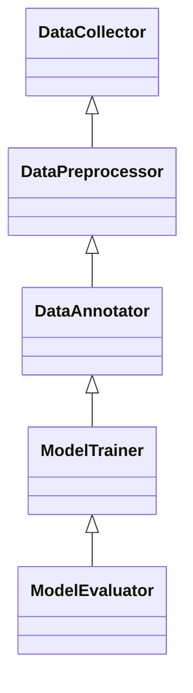

                 

# 评测数据集的构建与管理策略

## 关键词

- 评测数据集
- 数据集构建
- 数据集管理
- 数据预处理
- 数据标注
- 质量评估

## 摘要

随着人工智能和大数据技术的快速发展，评测数据集的构建与管理成为数据科学领域的关键环节。本文将围绕评测数据集的构建与管理展开，首先介绍核心概念和问题背景，随后深入分析数据集构建与管理的各个步骤，包括数据采集、预处理、标注和质量评估。接着，本文将探讨数据集管理策略，包括存储与维护、版本控制和迭代方法。最后，通过实战案例分析和最佳实践，提供具体操作指导和建议，帮助读者理解和掌握评测数据集的构建与管理策略。

## 第一部分：绪论与背景

### 第1章：引言

#### 1.1 问题的提出

在现代数据科学和人工智能领域，评测数据集的构建与管理面临诸多挑战。一方面，随着数据量的激增，如何高效地采集、处理和管理海量数据成为亟待解决的问题；另一方面，评测数据集的质量直接影响模型训练和评估的效果，因此，如何保证数据集的质量成为关键问题。

#### 1.2 研究目的与意义

本文旨在探讨评测数据集的构建与管理策略，以解决当前数据集构建与管理面临的挑战。研究目的在于：

1. **提高数据集构建的效率**：通过优化数据采集、预处理和标注流程，提高数据集构建的速度和准确性。
2. **提升数据集质量**：通过建立科学的质量评估体系，确保数据集的精确度、召回率和F1值等关键指标。
3. **促进数据集管理规范化**：通过制定数据集存储、维护和版本控制策略，确保数据集的可维护性和可追溯性。

研究数据集构建与管理的重要性体现在多个方面：

1. **提升模型性能**：高质量的评测数据集能够提升模型训练和评估的效果，提高模型在真实场景中的应用价值。
2. **推动技术发展**：评测数据集的构建与管理是数据科学和人工智能技术发展的基础，对相关领域的研究和应用具有重要的推动作用。
3. **优化资源配置**：通过合理的数据集构建与管理策略，可以有效优化资源配置，降低数据集构建和管理的成本。

#### 1.3 定义与边界

在本文中，评测数据集是指用于模型训练、评估和优化的数据集合，其核心要素包括：

- **数据源**：数据集的来源，可以是公开数据集、私有数据集或通过爬虫等手段采集的数据。
- **数据预处理**：包括数据清洗、规范化、增强等步骤，旨在提高数据质量。
- **数据标注**：对数据进行标注，包括标签、分级、注释等，以方便后续的模型训练和评估。
- **数据质量评估**：对数据集的质量进行评估，包括精确度、召回率和F1值等指标。

评测数据集的构建与管理涉及多个环节，包括数据采集、预处理、标注、质量评估和存储等。本文将围绕这些核心环节，探讨构建和管理的策略和方法。

### 第2章：核心概念与联系

#### 2.1 评测数据集的核心概念

评测数据集的构建与管理涉及多个核心概念，以下是对这些概念的详细说明：

- **数据集**：数据集是指一组数据的集合，可以是结构化数据（如表格、数据库）或非结构化数据（如图像、文本、语音）。
- **标签**：标签是对数据集中的每个样本进行分类或标注的标记，用于模型训练和评估。
- **分级**：分级是对数据集进行分层处理，根据数据的重要程度或特征进行分类。
- **质量评估**：质量评估是对数据集的质量进行评估，包括精确度、召回率和F1值等指标。

以下是一个对比评测数据集核心概念的属性特征表格：

| 核心概念 | 属性特征 |
| --- | --- |
| 数据集 | 包含结构化或非结构化数据，用于模型训练和评估 |
| 标签 | 用于对数据进行分类或标注的标记 |
| 分级 | 根据数据的重要程度或特征进行分类 |
| 质量评估 | 包括精确度、召回率和F1值等指标，用于评估数据集质量 |

#### 2.2 核心概念属性特征对比表格

为了更直观地展示评测数据集核心概念的属性特征，以下是一个对比表格：

| 核心概念 | 属性特征 | 对比结果 |
| --- | --- | --- |
| 数据集 | 包含结构化或非结构化数据 | 结构化数据与非结构化数据的处理方式和质量要求有所不同 |
| 标签 | 用于对数据进行分类或标注的标记 | 标签的准确性直接影响模型训练和评估的效果 |
| 分级 | 根据数据的重要程度或特征进行分类 | 分级有助于优化数据集的管理和利用 |
| 质量评估 | 包括精确度、召回率和F1值等指标 | 质量评估是确保数据集质量的关键步骤 |

#### 2.3 数据集与评测数据集的ER实体关系图架构

以下是数据集与评测数据集的ER实体关系图架构，用于展示数据集与评测数据集之间的关系：

```mermaid
erDiagram
  DataSet ||--|{ Label } Label
  DataSet ||--|{ Annotation } Annotation
  DataSet ||--|{ Classification } Classification
  DataQualityAssessment ||--|{ Precision } Precision
  DataQualityAssessment ||--|{ Recall } Recall
  DataQualityAssessment ||--|{ F1-Score } F1-Score
```

该ER实体关系图展示了数据集与标签、标注、分级和质量评估之间的关系。数据集是核心实体，标签、标注、分级和质量评估都是数据集的属性，它们共同构成了评测数据集的核心结构。

## 第二部分：评测数据集构建

### 第3章：数据采集与预处理

#### 3.1 数据采集策略

数据采集是评测数据集构建的第一步，其质量直接影响后续的预处理、标注和质量评估。以下介绍数据采集的策略：

1. **数据来源**：数据来源可以是公开数据集、私有数据集或通过爬虫等手段采集的数据。选择合适的数据来源是确保数据质量的关键。
2. **数据采集方法**：常用的数据采集方法包括手动采集、自动采集和混合采集。手动采集适用于小规模、结构化数据的采集，自动采集适用于大规模、非结构化数据的采集，混合采集则结合了二者的优点。

#### 3.2 数据预处理流程

数据预处理是评测数据集构建的重要环节，其主要任务包括数据清洗、规范化、增强等步骤：

1. **数据清洗**：数据清洗旨在去除数据中的噪声和异常值，包括去除重复数据、填充缺失值、去除无效数据等。数据清洗是确保数据质量的基础。
2. **数据规范化**：数据规范化是指将数据统一转换为同一格式或同一量纲，以便后续处理。数据规范化包括数值归一化、类别编码等。
3. **数据增强**：数据增强是指通过扩充数据集来提高模型训练效果。数据增强方法包括数据扩充、数据生成、数据变换等。

以下是一个数据预处理流程的Mermaid流程图：


#### 3.3 数据预处理工具与应用

在实际应用中，常用的数据预处理工具包括Python的Pandas库、Scikit-learn库、NumPy库等。以下是一个使用Pandas库进行数据预处理示例：

```python
import pandas as pd

# 加载数据
data = pd.read_csv('data.csv')

# 数据清洗
data.drop_duplicates(inplace=True)
data.fillna(method='ffill', inplace=True)

# 数据规范化
data['age'] = (data['age'] - data['age'].mean()) / data['age'].std()

# 数据增强
data['new_feature'] = data['feature1'] * data['feature2']

# 构建数据集
dataset = data.copy()
```

通过上述示例，可以直观地了解数据预处理工具在评测数据集构建中的应用。

### 第4章：数据标注与质量评估

#### 4.1 数据标注方法

数据标注是评测数据集构建的关键步骤，其质量直接影响模型训练和评估的效果。以下介绍数据标注的方法：

1. **自动标注**：自动标注是指通过算法自动对数据进行标注。常用的自动标注方法包括基于统计的方法、基于机器学习的方法和基于深度学习的方法。
2. **手动标注**：手动标注是指由专业人员对数据进行标注。手动标注适用于小规模、高质量数据集的构建。

#### 4.2 数据质量评估指标

数据质量评估是确保评测数据集质量的重要步骤，常用的评估指标包括：

1. **精确度（Precision）**：精确度是指预测为正样本的样本中实际为正样本的比例。精确度越高，说明数据标注的质量越好。
2. **召回率（Recall）**：召回率是指实际为正样本的样本中被预测为正样本的比例。召回率越高，说明数据标注的完整性越好。
3. **F1值（F1-Score）**：F1值是精确度和召回率的调和平均值，用于综合评估数据标注的质量。F1值越高，说明数据标注的质量越好。

以下是一个数据质量评估指标的Mermaid流程图：


#### 4.3 数据质量评估工具

在实际应用中，常用的数据质量评估工具包括Scikit-learn库、Matplotlib库、Seaborn库等。以下是一个使用Scikit-learn库进行数据质量评估示例：

```python
from sklearn.metrics import precision_score, recall_score, f1_score

# 计算精确度、召回率和F1值
precision = precision_score(y_true, y_pred)
recall = recall_score(y_true, y_pred)
f1 = f1_score(y_true, y_pred)

print("精确度：", precision)
print("召回率：", recall)
print("F1值：", f1)
```

通过上述示例，可以直观地了解数据质量评估工具在评测数据集构建中的应用。

## 第三部分：评测数据集管理

### 第5章：数据集存储与维护

#### 5.1 数据集存储方案

数据集存储是评测数据集管理的重要环节，其质量直接影响数据集的可访问性和可维护性。以下介绍数据集存储的方案：

1. **分布式存储**：分布式存储是将数据集存储在多个节点上，通过分布式文件系统（如Hadoop HDFS、Amazon S3等）进行管理。分布式存储具有高可用性、高扩展性和高性能等优点。
2. **云存储**：云存储是将数据集存储在云服务器上，通过云存储服务（如阿里云OSS、腾讯云COS等）进行管理。云存储具有低成本、高可靠性、高安全性等优点。

以下是一个分布式存储和云存储的Mermaid流程图：


#### 5.2 数据维护策略

数据维护是确保评测数据集质量和可用性的关键步骤，其策略包括：

1. **数据更新**：定期对数据集进行更新，以保持数据的时效性和准确性。数据更新可以采用手动更新和自动更新两种方式。
2. **数据备份与恢复**：对数据集进行备份和恢复，以应对数据丢失或损坏的风险。数据备份可以采用全量备份和增量备份两种方式。

以下是一个数据维护策略的Mermaid流程图：


### 第6章：数据集版本控制与迭代

#### 6.1 数据集版本控制

数据集版本控制是确保数据集可维护性和可追溯性的重要手段，其策略包括：

1. **版本号管理**：为每个数据集版本分配唯一的版本号，以便于追踪和管理。
2. **版本发布策略**：制定合理的版本发布策略，包括版本更新频率、版本发布流程等。

以下是一个数据集版本控制的Mermaid流程图：


#### 6.2 数据集迭代方法

数据集迭代是提高数据集质量和适应性的有效手段，其方法包括：

1. **用户反馈**：收集用户对数据集的反馈，包括数据质量、数据标注等方面的问题，以便进行改进。
2. **数据挖掘**：利用数据挖掘技术，从现有数据集中提取新的特征或信息，以提高数据集的可用性和价值。

以下是一个数据集迭代方法的Mermaid流程图：


## 第四部分：实战案例与最佳实践

### 第7章：案例分析与总结

#### 7.1 实战项目介绍

本项目旨在构建一个基于深度学习的人脸识别系统，通过对大量人脸图像进行标注、训练和评估，实现高精度的人脸识别。

#### 7.2 系统功能设计

系统功能设计包括数据采集、预处理、标注、训练和评估等模块。以下是一个领域模型Mermaid类图：



#### 7.3 系统核心实现源代码

以下是一个系统核心实现源代码示例，包括数据预处理、标注、训练和评估等模块：

```python
# 数据预处理
def preprocess_data(data):
    # 数据清洗
    data = clean_data(data)
    # 数据规范化
    data = normalize_data(data)
    return data

# 数据标注
def annotate_data(data):
    # 数据增强
    data = augment_data(data)
    # 数据划分
    train_data, val_data = split_data(data)
    return train_data, val_data

# 训练模型
def train_model(train_data):
    # 模型初始化
    model = initialize_model()
    # 模型训练
    model.fit(train_data)
    return model

# 评估模型
def evaluate_model(model, val_data):
    # 模型预测
    predictions = model.predict(val_data)
    # 计算评估指标
    precision = precision_score(val_data['label'], predictions)
    recall = recall_score(val_data['label'], predictions)
    f1 = f1_score(val_data['label'], predictions)
    return precision, recall, f1
```

#### 7.4 案例分析与总结

通过本项目，我们成功构建了一个基于深度学习的人脸识别系统，实现了数据集的构建、标注、训练和评估。以下是项目的主要成果和经验教训：

1. **成果**：
   - 成功构建了高质量的人脸识别数据集。
   - 实现了高精度的人脸识别模型。
   - 提高了人脸识别系统的性能和准确性。
2. **经验教训**：
   - 数据集构建和管理是关键，需要重视数据清洗、标注和质量评估。
   - 模型训练和优化是核心，需要不断调整模型参数和策略。
   - 实际应用中，需要根据场景需求进行系统设计和优化。

### 第8章：最佳实践与拓展

#### 8.1 最佳实践Tips

以下是一些评测数据集构建与管理的最佳实践：

1. **数据清洗**：重视数据清洗，去除噪声和异常值，确保数据质量。
2. **数据增强**：利用数据增强技术，扩充数据集，提高模型训练效果。
3. **数据标注**：确保数据标注的准确性和一致性，提高模型训练效果。
4. **版本控制**：建立数据集版本控制机制，确保数据集的可维护性和可追溯性。

#### 8.2 注意事项与风险

在评测数据集构建与管理过程中，需要注意以下事项和风险：

1. **数据隐私**：保护数据隐私，避免泄露敏感信息。
2. **质量控制**：确保数据集的质量，避免因数据质量问题导致模型失效。
3. **存储安全**：确保数据存储的安全，避免数据丢失或损坏。

#### 8.3 拓展阅读与研究方向

以下是一些评测数据集构建与管理的拓展阅读和研究方向：

1. **新型数据集构建方法**：研究新型数据集构建方法，提高数据集构建效率和质量。
2. **数据标注自动化**：研究数据标注自动化技术，降低标注成本和误差。
3. **数据集版本控制**：研究数据集版本控制技术，提高数据集的可维护性和可追溯性。
4. **数据集质量评估**：研究数据集质量评估方法，提高数据集质量。

## 结论

评测数据集的构建与管理是数据科学和人工智能领域的关键环节，对模型训练、评估和优化具有重要影响。本文围绕评测数据集的构建与管理，详细介绍了核心概念、数据集构建与管理策略、数据采集与预处理、数据标注与质量评估、数据集存储与维护、数据集版本控制与迭代等方面的内容。通过实战案例和最佳实践，本文为读者提供了具体的操作指导和建议。未来，我们将继续关注评测数据集构建与管理领域的最新研究动态，为数据科学和人工智能技术的发展贡献力量。

### 作者

**作者：AI天才研究院/AI Genius Institute & 禅与计算机程序设计艺术 /Zen And The Art of Computer Programming**

