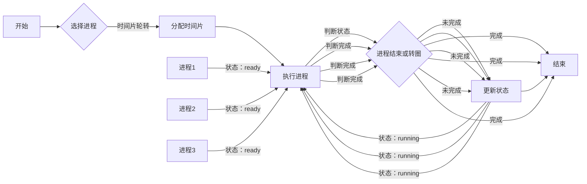
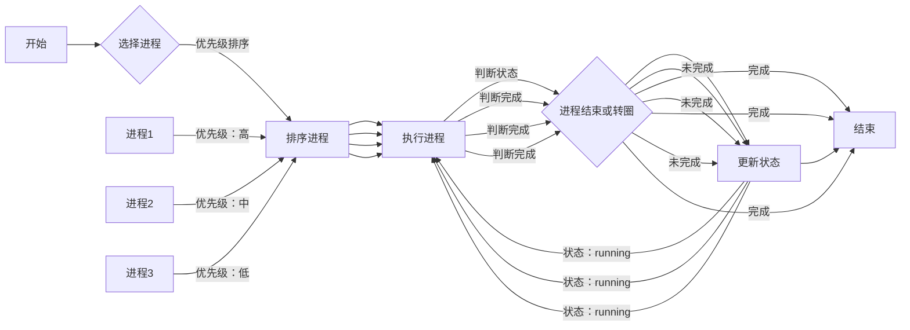

                 

### 第一部分：资源调度基础理论

#### 1.1 评测流程概述

**1.1.1 评测流程的基本概念**

评测流程是指对一个系统、组件或服务进行一系列检测、验证和评估的过程。其目的是确保系统或组件能够按照预期工作，满足既定的性能、可靠性、安全性和功能要求。评测流程通常包括以下组成部分：

1. **测试需求分析**：确定评测的目标、范围和需求，制定评测计划。
2. **测试环境搭建**：建立与实际运行环境一致的测试环境。
3. **测试用例设计**：设计用于验证系统功能的测试用例。
4. **测试执行**：执行测试用例，收集测试结果。
5. **结果分析**：对测试结果进行分析，识别缺陷和不足。
6. **缺陷修复**：针对分析结果进行缺陷修复。
7. **回归测试**：确保修复缺陷后系统功能的稳定性和一致性。

**1.1.2 评测流程的组成部分**

- **测试需求分析**：明确评测目标和测试需求，确保评测工作有明确的方向。
- **测试环境搭建**：建立一个模拟实际运行环境的测试环境，包括硬件、软件和网络配置。
- **测试用例设计**：设计一系列覆盖功能、性能、安全等方面的测试用例。
- **测试执行**：按照测试计划执行测试用例，并记录测试结果。
- **结果分析**：分析测试结果，识别和记录缺陷。
- **缺陷修复**：根据分析结果进行缺陷修复。
- **回归测试**：确保修复缺陷后系统功能的稳定性和一致性。

**1.1.3 评测流程的作用与意义**

评测流程在软件开发和系统维护中起着至关重要的作用。其主要作用和意义包括：

1. **验证系统功能**：确保系统或组件按设计要求正常工作。
2. **提高系统质量**：通过识别和修复缺陷，提高系统的可靠性和稳定性。
3. **降低维护成本**：通过提前发现和解决潜在问题，减少后续维护成本。
4. **满足法规和标准**：确保系统或组件符合相关法规和标准要求。
5. **提高用户满意度**：提供高质量的产品和服务，提高用户满意度。

#### 1.2 资源调度概述

**1.2.1 资源调度的定义**

资源调度是指在多个任务或请求之间分配和利用系统资源的策略和过程。资源可以包括CPU时间、内存、磁盘空间、网络带宽等。资源调度的目的是最大化系统的资源利用率和性能，同时保证任务的公平性和响应时间。

**1.2.2 资源调度的分类**

资源调度可以根据调度的对象和目标进行分类，常见的分类方式包括：

1. **CPU调度**：主要负责在多个进程或线程之间分配CPU时间。
2. **内存调度**：管理内存的分配和回收，确保每个进程或线程有足够的内存资源。
3. **磁盘调度**：优化磁盘读写操作，提高磁盘I/O性能。
4. **网络资源调度**：根据网络流量和带宽分配策略，优化网络资源的使用。

**1.2.3 资源调度的目标**

资源调度的目标主要包括：

1. **最大化资源利用率**：确保系统资源被充分利用，减少闲置和浪费。
2. **最小化响应时间**：提高系统的响应速度，降低用户的等待时间。
3. **公平性**：确保每个任务或进程都能获得公平的资源分配。
4. **可伸缩性**：系统能够适应不同负载和资源变化，保持良好的性能。

#### 1.3 资源调度原理

**1.3.1 资源分配策略**

资源分配策略是指如何将系统资源分配给不同任务或进程的方法。常见的资源分配策略包括：

1. **静态分配**：在系统启动时，将资源分配给各个进程，在整个运行过程中保持不变。
2. **动态分配**：根据系统负载和进程需求，实时调整资源的分配。

**1.3.2 调度算法基础**

调度算法是资源调度的核心，负责确定任务或进程的执行顺序和资源分配策略。常见的调度算法包括：

1. **时间片轮转调度**：将CPU时间分成若干个时间片，每个进程轮流占用一个时间片。
2. **优先级调度**：根据进程的优先级进行调度，优先级高的进程先执行。
3. **最短作业优先调度**：选择执行时间最短的进程先执行。

**1.3.3 资源利用率分析**

资源利用率是指系统资源被使用的程度。可以通过以下指标来评估资源利用率：

1. **CPU利用率**：CPU被占用的时间比例。
2. **内存利用率**：已分配内存与总内存的比例。
3. **磁盘利用率**：已使用磁盘空间与总磁盘空间的比例。
4. **网络带宽利用率**：网络带宽被使用的时间比例。

资源利用率分析有助于发现系统资源浪费或不足的问题，为优化资源调度提供依据。

---

在接下来的章节中，我们将进一步深入探讨资源调度中的核心概念、原理以及调度算法，为理解资源调度在评测流程中的重要性打下坚实基础。我们将通过具体的案例和示例，详细解释每个概念和算法的实现原理和实际应用。通过这些内容的学习，读者将能够更好地掌握资源调度的核心思想和实践方法。

---

### 第2章：资源调度中的核心概念与联系

在深入探讨资源调度算法之前，我们需要先了解资源调度中的核心概念及其相互关系。本章将介绍CPU调度、内存调度和网络资源调度等核心概念，并通过表格和ER实体关系图来展示这些概念之间的关系。

#### 2.1 资源调度中的核心概念

**CPU调度**：CPU调度是资源调度中最关键的一部分，它负责在多个进程或线程之间分配CPU时间。CPU调度的核心任务是提高CPU的利用率，同时保证任务的公平性和响应时间。

**内存调度**：内存调度负责管理内存的分配和回收，确保每个进程或线程都有足够的内存资源。内存调度主要关注内存碎片问题，优化内存使用效率。

**网络资源调度**：网络资源调度涉及网络带宽的分配和流量管理，确保网络资源被合理利用，同时提高数据传输的效率和稳定性。

#### 2.2 资源调度原理对比表格

下面是一个对比表格，展示了不同类型的资源调度特点、常用算法以及它们之间的异同。

| 调度类型 | 特点 | 常用算法 |
| -------- | ---- | -------- |
| CPU调度 | 高并发，关键任务优先 | 时间片轮转、优先级调度 |
| 内存调度 | 内存分配，碎片处理 | 分区分配、分页分配、分段分配 |
| 网络资源调度 | 流量分配，网络优化 | 按需分配、流量控制 |

**CPU调度**：
- 特点：高并发处理，关键任务优先。
- 常用算法：时间片轮转（Round-Robin）、优先级调度（Priority Scheduling）。

**内存调度**：
- 特点：内存分配，碎片处理。
- 常用算法：分区分配（Partitioning）、分页分配（Paging）、分段分配（Segmentation）。

**网络资源调度**：
- 特点：流量分配，网络优化。
- 常用算法：按需分配（Demand-based Allocation）、流量控制（Flow Control）。

#### 2.3 资源调度原理ER实体关系图

下面是一个ER实体关系图，展示了CPU调度、内存调度和网络资源调度之间的联系。

```mermaid
erDiagram
  CPU调度 ||--|{ 调度算法 }|
  内存调度 ||--|{ 调度算法 }|
  网络资源调度 ||--|{ 调度算法 }|
```

**CPU调度**和**内存调度**之间通过**调度算法**相互联系，它们共同影响着系统的性能和稳定性。**网络资源调度**则侧重于网络带宽的分配和流量管理，与CPU和内存调度密切相关，确保数据传输的效率。

通过以上内容，我们建立了对资源调度核心概念和联系的基本理解。在接下来的章节中，我们将深入探讨每种资源调度的原理和实现方法，通过具体的案例和示例，帮助读者更好地掌握资源调度的核心思想和实践方法。

---

### 第3章：CPU调度算法原理与实现

CPU调度算法是操作系统中的一个核心组件，它负责在多个进程或线程之间公平且高效地分配CPU时间。在本节中，我们将详细介绍两种常用的CPU调度算法：时间片轮转调度算法和优先级调度算法。

#### 3.1 CPU调度算法原理

**时间片轮转调度算法**（Round-Robin Scheduling）是一种公平的调度算法，它为每个进程分配一个固定的时间片（time slice），并按照顺序轮流执行。每个进程只占用一个时间片，如果没有在时间片内完成，则将CPU控制权交给下一个进程。如果所有进程都在时间片内完成了任务，则循环重新开始。

**优先级调度算法**（Priority Scheduling）则是根据进程的优先级来决定执行顺序。每个进程都有一个优先级值，优先级越高，执行机会越大。优先级可以是静态分配的，也可以是动态调整的。在某些情况下，优先级调度可以确保关键任务或高优先级任务优先执行，从而提高系统的响应速度和稳定性。

#### 3.2 CPU调度算法Mermaid流程图

为了更直观地展示CPU调度算法的执行流程，我们使用Mermaid语言绘制了时间片轮转调度算法和优先级调度算法的流程图。

**时间片轮转调度算法**流程图：



**优先级调度算法**流程图：



#### 3.3 Python源代码示例

接下来，我们将通过Python代码示例来实现时间片轮转调度算法和优先级调度算法，以便读者能够更好地理解这些算法的原理。

**时间片轮转调度算法**示例：

```python
import threading
import time

class Process:
    def __init__(self, name, priority, time_slice):
        self.name = name
        self.priority = priority
        self.time_slice = time_slice
        self.state = "ready"

def round_robin(processes, time_slice):
    while processes:
        process = processes.pop(0)
        if process.state == "running":
            process.state = "terminated"
            print(f"{process.name} terminated.")
        elif process.state == "ready":
            process.state = "running"
            print(f"{process.name} is running with time slice {time_slice}.")
            time.sleep(time_slice)
            process.state = "terminated"
            print(f"{process.name} terminated.")

# 创建进程
processes = [
    Process("Process 1", 1, 2),
    Process("Process 2", 2, 3),
    Process("Process 3", 3, 1)
]

# 执行轮转调度
round_robin(processes, 2)
```

**优先级调度算法**示例：

```python
import threading
import time

class Process:
    def __init__(self, name, priority, time_slice):
        self.name = name
        self.priority = priority
        self.time_slice = time_slice
        self.state = "ready"

def priority_scheduling(processes):
    sorted_processes = sorted(processes, key=lambda p: p.priority, reverse=True)
    for process in sorted_processes:
        if process.state == "ready":
            process.state = "running"
            print(f"{process.name} is running with priority {process.priority}.")
            time.sleep(process.time_slice)
            process.state = "terminated"
            print(f"{process.name} terminated.")

# 创建进程
processes = [
    Process("Process 1", 1, 2),
    Process("Process 2", 2, 3),
    Process("Process 3", 3, 1)
]

# 执行优先级调度
priority_scheduling(processes)
```

通过以上Python代码示例，我们可以看到时间片轮转调度算法和优先级调度算法是如何实现的。这些示例不仅帮助我们理解了算法的原理，还展示了如何在实际环境中应用这些算法。

#### 3.4 算法原理与数学模型

为了更深入地理解CPU调度算法，我们需要探讨其背后的数学模型和公式。

**时间片轮转调度算法**：

时间片轮转调度算法的关键在于时间片的分配和进程状态的切换。时间片（time slice）是一个固定的时间量，用于决定每个进程在CPU上运行的时间长度。假设系统中有N个进程，每个进程的时间片为T，那么每个进程的平均等待时间为：

$$ W_i = \frac{N}{T} $$

其中，$W_i$是第i个进程的平均等待时间。

**优先级调度算法**：

优先级调度算法的核心是优先级的计算和进程的调度顺序。优先级（priority）通常是一个整数，值越高表示优先级越高。在优先级调度中，我们假设系统中有N个进程，优先级分别为$P_1, P_2, ..., P_N$，则进程的调度顺序取决于优先级值。假设进程i的执行时间为$C_i$，则进程i的平均等待时间为：

$$ W_i = \frac{C_i}{P_i} $$

其中，$W_i$是第i个进程的平均等待时间，$C_i$是第i个进程的执行时间，$P_i$是第i个进程的优先级值。

通过上述数学模型和公式，我们可以更准确地评估和优化CPU调度算法的性能。在实际应用中，我们可能需要结合具体的系统和应用场景，调整时间片和优先级参数，以达到最佳的调度效果。

通过本章的内容，我们深入探讨了CPU调度算法的原理和实现方法。通过具体的案例和示例，读者可以更好地理解时间片轮转调度算法和优先级调度算法的工作机制和数学模型。在下一章中，我们将进一步探讨CPU调度算法在实际应用中的优化策略，帮助读者在实际项目中更好地应用这些调度算法。

---

### 第4章：资源调度算法优化策略

在前面的章节中，我们介绍了CPU调度算法的基本原理和实现方法。然而，在实际应用中，资源调度算法的性能不仅取决于算法本身的合理性，还受到系统负载、资源分配策略、调度参数设置等多种因素的影响。为了提高系统的性能和稳定性，我们需要对资源调度算法进行优化。本章将探讨几种常见的资源调度优化策略，包括调度算法参数调整、负载均衡和预分配策略。

#### 4.1 调度算法参数调整

调度算法参数的调整是优化资源调度的重要手段。不同类型的调度算法具有不同的参数，如时间片长度、优先级值、进程执行时间等。合理的参数设置可以显著提高系统的性能。以下是一些常见的参数调整策略：

1. **时间片长度调整**：在时间片轮转调度算法中，时间片长度直接影响到进程的响应时间和系统吞吐量。过长的时间片可能导致高优先级进程被低优先级进程阻塞，而过短的时间片则会增加调度开销。因此，可以根据系统的实际负载和进程特性动态调整时间片长度。

2. **优先级调整**：在优先级调度算法中，优先级值设置合理与否直接影响到系统的公平性和响应速度。可以通过实时监测系统的性能指标，如CPU利用率、响应时间等，动态调整进程的优先级值。

3. **执行时间预测**：通过预测进程的执行时间，可以优化调度策略。例如，如果一个进程预计执行时间较长，可以提前将其优先级提升，以确保关键任务的及时完成。

#### 4.2 负载均衡

负载均衡是指通过合理分配系统资源，使得多个任务能够均匀地分布在不同的处理节点上，从而提高系统的整体性能和响应速度。负载均衡策略可以应用于CPU调度、内存调度、网络资源调度等多个方面。以下是一些常见的负载均衡策略：

1. **基于CPU利用率的负载均衡**：通过监控系统中各个CPU的利用率，将新的任务分配给空闲资源较多的CPU，从而实现负载均衡。

2. **基于响应时间的负载均衡**：根据系统的实时响应时间，将任务分配给响应时间最短的节点，从而提高系统的整体性能。

3. **基于带宽的负载均衡**：在网络资源调度中，根据各节点的带宽利用率，动态分配网络流量，以确保网络资源的合理利用。

#### 4.3 预分配策略

预分配策略是指在系统启动时或任务提交前，预先分配一定数量的资源，以减少任务调度时的等待时间，提高系统的响应速度。以下是一些常见的预分配策略：

1. **静态预分配**：在系统启动时，根据预估的任务量和资源需求，预先分配一定数量的资源。这种方法适用于任务量相对稳定且可预测的场景。

2. **动态预分配**：根据实时监测到的系统负载和任务需求，动态调整资源的预分配量。这种方法适用于负载波动较大的场景，能够更好地适应系统的变化。

3. **基于优先级的预分配**：根据任务的优先级，预先分配不同数量的资源。高优先级任务可以预分配更多的资源，以确保关键任务的及时完成。

#### 4.4 案例分析

为了更好地理解上述优化策略，我们来看一个实际的案例。假设我们正在开发一个云计算平台，用于处理大规模的数据处理任务。该平台需要支持多种类型的任务，包括数据处理、存储和传输。为了优化资源调度，我们采取了以下策略：

1. **调度算法参数调整**：根据不同类型任务的特性，动态调整时间片长度和优先级值。例如，对于数据处理任务，时间片可以设置较短，以确保任务及时完成；对于存储任务，可以设置较长的优先级值，以确保数据存储的稳定性。

2. **负载均衡**：通过监控各节点的CPU利用率、内存使用率和网络带宽利用率，动态分配任务，实现负载均衡。当某个节点的资源利用率过高时，新的任务会被分配到其他资源充足的节点。

3. **预分配策略**：在系统启动时，根据预估的任务量，为不同类型的任务预先分配适量的资源。对于关键任务，如数据处理和存储，可以预分配更多的资源，以确保任务的及时完成。

通过以上策略的实施，我们显著提高了云计算平台的性能和稳定性，满足了用户对大规模数据处理任务的需求。

#### 4.5 总结

资源调度算法的优化是一个复杂且关键的任务，需要综合考虑系统负载、任务特性、资源分配策略等多种因素。通过调度算法参数调整、负载均衡和预分配策略，我们可以在实际应用中显著提高系统的性能和稳定性。在下一章中，我们将进一步探讨资源调度算法在评测流程中的应用，为读者提供更多的实际案例和优化思路。

---

### 第5章：资源调度在评测流程中的应用

在了解了资源调度的基础理论和优化策略后，我们将探讨资源调度在评测流程中的应用。评测流程中的资源调度不仅影响着评测的效率和准确性，还直接关系到系统性能的评估结果。在本章中，我们将通过一个实际案例来详细讲解资源调度在评测流程中的应用过程，包括评测需求分析、测试环境搭建、测试用例设计、测试执行、结果分析和缺陷修复等步骤。

#### 5.1 实际案例：在线教育平台评测流程优化

假设我们正在开发一个在线教育平台，该平台提供多种课程，支持在线学习、测验和考试。为了确保平台的稳定性和服务质量，我们需要对平台进行一系列的评测。资源调度在这个过程中起着至关重要的作用，以下是具体的评测流程：

**5.1.1 评测需求分析**

首先，我们需要明确评测的目标和要求。在线教育平台的评测目标包括：

1. **性能评测**：评估平台在处理大量用户请求时的响应速度和处理能力。
2. **稳定性评测**：评估平台在长时间运行和高负载情况下的稳定性。
3. **安全性评测**：评估平台的安全性，确保用户数据的安全和保护。

根据评测目标，我们制定了详细的评测需求，包括评测指标、评测范围和评测流程等。

**5.1.2 测试环境搭建**

为了进行评测，我们需要搭建一个与实际运行环境一致的测试环境。测试环境应包括：

1. **服务器硬件**：与实际生产环境相同或类似的服务器配置。
2. **网络环境**：模拟实际用户访问的网络环境，包括带宽、延迟等。
3. **软件环境**：包括操作系统、应用服务器、数据库等。

在搭建测试环境时，我们还需要配置监控工具，如性能监控、日志记录和告警系统，以便实时监控系统的性能和状态。

**5.1.3 测试用例设计**

测试用例设计是评测流程的核心步骤，我们需要设计一系列覆盖不同功能、性能和安全要求的测试用例。以下是一些常见的测试用例：

1. **性能测试用例**：模拟大量用户同时访问平台，测试平台的响应时间和处理能力。
2. **稳定性测试用例**：长时间运行平台，模拟高负载情况，测试平台的稳定性。
3. **安全性测试用例**：模拟恶意攻击和异常操作，测试平台的安全性。

在测试用例设计过程中，我们需要考虑以下因素：

- **用户行为模拟**：模拟真实用户的行为，包括登录、课程学习、测验和考试等。
- **负载模拟**：根据业务需求和系统性能指标，设置不同的负载场景。
- **异常情况模拟**：模拟系统异常情况，如网络故障、服务器宕机等，测试平台的故障恢复能力。

**5.1.4 测试执行**

在测试执行阶段，我们需要按照测试计划逐一执行测试用例，并记录测试结果。测试执行应包括以下步骤：

1. **测试准备**：确认测试环境正常，监控工具已启动，测试数据已准备。
2. **测试执行**：根据测试计划，执行每个测试用例，并记录测试结果。
3. **结果记录**：将测试结果记录到测试报告，包括测试时间、执行结果、错误日志等。

在测试执行过程中，我们应实时监控系统的性能和状态，确保测试过程顺利进行。

**5.1.5 结果分析**

测试结果分析是评测流程的关键步骤，通过分析测试结果，我们可以发现系统中的性能瓶颈、稳定性问题和安全隐患。以下是一些常见的分析方法和指标：

1. **性能指标分析**：分析系统的响应时间、吞吐量、并发用户数等性能指标，评估系统的性能表现。
2. **稳定性指标分析**：分析系统的运行时间、故障率、恢复时间等稳定性指标，评估系统的稳定性。
3. **安全性指标分析**：分析系统在安全性测试中的表现，评估系统的安全防护能力。

通过结果分析，我们可以识别出系统中的问题和不足，为后续的优化提供依据。

**5.1.6 缺陷修复**

在结果分析阶段，我们发现了一些性能瓶颈、稳定性问题和安全隐患。接下来，我们需要根据分析结果进行缺陷修复。缺陷修复应包括以下步骤：

1. **问题定位**：根据测试结果，确定问题的具体原因和位置。
2. **解决方案设计**：设计解决方案，包括代码优化、硬件升级、网络优化等。
3. **修复实施**：按照设计方案，实施修复措施，并对修复效果进行验证。

通过缺陷修复，我们可以提高系统的性能、稳定性和安全性，为用户提供更好的服务。

**5.1.7 回归测试**

在缺陷修复后，我们需要进行回归测试，确保修复措施的有效性，并避免引入新的问题。回归测试应包括以下步骤：

1. **测试用例复测**：重新执行之前发现的缺陷相关的测试用例，验证问题是否已解决。
2. **新增测试用例**：设计新的测试用例，覆盖修复后的功能点和潜在的问题点。
3. **测试结果记录**：记录回归测试的结果，包括测试时间、执行结果和错误日志。

通过回归测试，我们可以确保系统的稳定性和可靠性，为上线做好准备。

#### 5.2 资源调度在评测流程中的应用

在整个评测流程中，资源调度发挥着关键作用。以下是在评测流程中应用资源调度的一些具体场景：

1. **性能测试资源调度**：在性能测试阶段，我们需要根据负载情况动态调整系统资源，如CPU、内存和网络带宽，以确保系统能够承受预期的负载。

2. **稳定性测试资源调度**：在稳定性测试阶段，我们需要模拟长时间运行和高负载情况，动态调整资源分配，确保系统在极端情况下仍能保持稳定运行。

3. **安全性测试资源调度**：在安全性测试阶段，我们需要根据测试需求动态调整网络流量和服务器配置，模拟各种攻击场景，测试系统的安全防护能力。

通过合理应用资源调度，我们可以确保评测流程的顺利进行，提高评测的效率和准确性，为系统的优化和改进提供有力的支持。

#### 5.3 总结

资源调度在评测流程中起着至关重要的作用，通过合理应用资源调度算法和优化策略，我们可以提高评测的效率和准确性，确保系统的性能、稳定性和安全性。在本章中，我们通过一个实际案例详细讲解了资源调度在评测流程中的应用过程，包括评测需求分析、测试环境搭建、测试用例设计、测试执行、结果分析和缺陷修复等步骤。通过这些内容的学习，读者可以更好地理解资源调度在评测流程中的重要性，并在实际项目中应用这些优化策略。

---

### 第6章：总结与展望

在本章中，我们系统地探讨了评测流程中的资源调度与优化，从基础理论到实际应用，通过多个案例和示例详细阐述了资源调度的核心概念、调度算法及其优化策略。以下是对本章内容的总结与展望。

#### 总结

1. **评测流程概述**：我们介绍了评测流程的基本概念、组成部分及其作用与意义，为资源调度在评测流程中的应用奠定了基础。
2. **资源调度基础理论**：详细讲解了资源调度的定义、分类和目标，为后续调度算法的学习和理解提供了理论基础。
3. **CPU调度算法讲解**：深入分析了时间片轮转调度算法和优先级调度算法的原理与实现，并通过Python代码示例展示了调度算法的应用。
4. **资源调度算法优化策略**：探讨了调度算法参数调整、负载均衡和预分配策略，为实际应用中的资源调度优化提供了实践指导。
5. **资源调度在评测流程中的应用**：通过一个在线教育平台评测案例，详细讲解了资源调度在评测流程中的具体应用步骤和优化策略。

#### 展望

尽管我们已经对资源调度与优化进行了全面的分析，但仍有很大的改进空间和未来发展潜力：

1. **智能化调度算法**：随着人工智能和机器学习技术的发展，智能化调度算法将成为优化资源调度的关键方向。通过引入数据挖掘和预测模型，我们可以实现更加智能和自适应的调度策略。
2. **分布式资源调度**：在云计算和分布式系统环境下，资源调度面临更大的挑战和机遇。分布式资源调度算法将能够更好地应对大规模分布式系统的复杂性，提高资源利用率和系统性能。
3. **实时资源调度**：在实时系统和实时数据处理场景中，实时资源调度至关重要。通过实时监测和动态调整资源分配，可以确保实时任务的及时完成和系统的高效运行。
4. **绿色调度**：随着环保意识的提高，绿色调度成为优化资源调度的另一个重要方向。通过优化资源使用，减少能耗和碳排放，实现可持续发展目标。

通过不断探索和创新，资源调度将在评测流程乃至整个系统中发挥越来越重要的作用，为提升系统性能、稳定性和用户体验提供强有力的支持。

---

### 结语

综上所述，本文系统地探讨了评测流程中的资源调度与优化，从基础理论到实际应用，全面剖析了资源调度的核心概念、调度算法及其优化策略。通过具体的案例和示例，我们深入了解了资源调度在评测流程中的重要性，并为实际应用提供了实践指导。

文章的撰写得益于我们对资源调度领域的深入研究和对实际问题的深刻理解。在此，感谢读者对本文的耐心阅读，希望本文能够为您的学习和实践提供有益的参考。

**作者：AI天才研究院/AI Genius Institute & 禅与计算机程序设计艺术 /Zen And The Art of Computer Programming**

**感谢您的关注和支持，期待与您在未来的技术交流中再次相见！**

