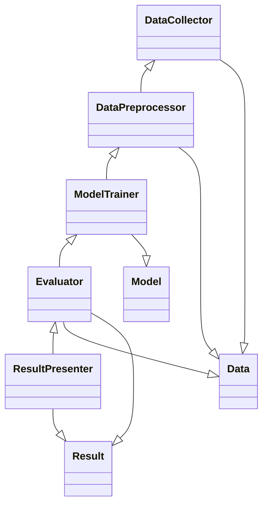
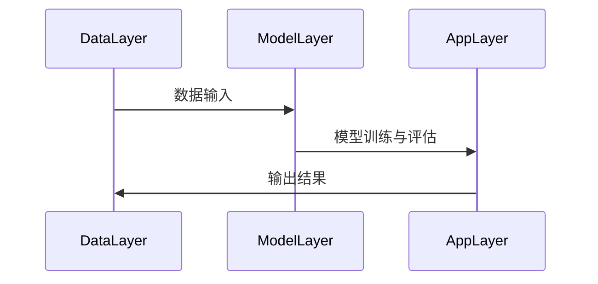
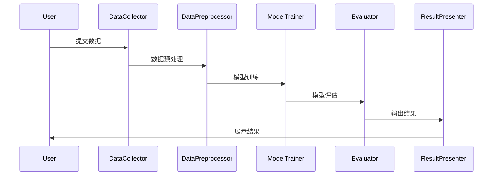

                 

### 文章标题

## 评测系统中的注意力机制应用

### 关键词

- 评测系统
- 注意力机制
- Transformer模型
- BERT模型
- 数学模型
- 系统架构

### 摘要

本文深入探讨了注意力机制在评测系统中的应用。首先介绍了评测系统的基本概念和注意力机制的核心原理。然后，通过讲解Transformer模型和BERT模型，详细阐述了注意力机制在算法中的实现和数学模型。接下来，分析了注意力机制在系统架构中的应用，并提供了项目实战的实例。最后，总结了注意力机制的最佳实践和未来的发展趋势。

### 文章正文

## 引言

评测系统在现代社会中扮演着至关重要的角色，广泛应用于教育、招聘、市场调研等多个领域。这些系统需要高效、准确地评估被评测者的表现，以提供可靠的决策依据。然而，随着数据量的增加和问题复杂性的提升，传统的评测方法已经难以满足需求。近年来，注意力机制作为一种先进的人工智能技术，在评测系统中展现出了巨大的潜力。

注意力机制（Attention Mechanism）最早出现在机器翻译、自然语言处理等任务中，其主要目的是在处理序列数据时，动态地关注关键信息，从而提高模型的性能。注意力机制的引入使得模型能够自动识别和调整不同部分数据的重要性，使其在处理长序列数据时更为高效。本文将详细介绍注意力机制在评测系统中的应用，包括核心原理、算法实现和系统架构。

## 背景介绍

### 评测系统的基本概念

评测系统是一种基于数据和算法，用于评估用户表现或项目成果的自动化系统。其核心功能包括数据采集、数据预处理、评估模型构建、评估结果生成和结果展示等。评测系统广泛应用于教育、招聘、市场调研等领域，例如：

- 教育领域：通过在线测评系统，教师可以自动评估学生的答题情况，提高教学效率。
- 招聘领域：招聘系统通过简历筛选和面试评估，帮助雇主快速找到合适的人才。
- 市场调研：市场调研系统通过对问卷数据的分析，为企业提供市场洞察和决策支持。

### 注意力机制的基本原理

注意力机制是一种基于注意力模型（Attention Model）的算法，其主要思想是在处理序列数据时，动态地关注关键信息，从而提高模型的性能。注意力机制的核心组成部分包括：

- 输入序列：表示待处理的序列数据，如文本、图像等。
- 注意力分布：表示不同位置的信息的重要性，用于计算加权得分。
- 输出序列：根据注意力分布对输入序列进行加权处理，得到最终的输出序列。

注意力机制的主要优点包括：

- 提高模型性能：通过动态关注关键信息，模型可以更好地捕捉数据中的关键特征，从而提高性能。
- 提高处理效率：注意力机制允许模型在处理长序列数据时，仅关注关键部分，从而降低计算复杂度。

### 注意力机制在评测系统中的应用现状

注意力机制在评测系统中的应用已经取得了显著的成果。以下是一些代表性的应用场景：

- 文本评测：在文本评测系统中，注意力机制可以用于文本分析，提高评估的准确性和效率。
- 图像评测：在图像评测系统中，注意力机制可以用于图像识别和分类，提高模型的性能。
- 声音评测：在声音评测系统中，注意力机制可以用于语音识别和语音分析，提高识别的准确率和鲁棒性。

### 本书的目的与结构

本文的目的是系统地介绍注意力机制在评测系统中的应用，帮助读者深入了解注意力机制的核心原理、算法实现和系统架构。本书的结构如下：

- 第一部分：背景介绍，包括评测系统的基本概念和注意力机制的基本原理。
- 第二部分：算法原理讲解，包括Transformer模型和BERT模型等。
- 第三部分：数学模型与公式讲解，包括注意力机制的数学基础。
- 第四部分：系统架构与实现，包括评测系统的整体架构设计和项目实战。
- 第五部分：最佳实践与总结，包括注意力机制的最佳实践和未来的发展趋势。

## 核心概念与联系

### 注意力机制的定义与类型

注意力机制是一种在处理序列数据时，动态关注关键信息、提高模型性能的技术。根据不同的实现方式，注意力机制可以分为以下几种类型：

1. **自注意力（Self-Attention）**：自注意力是最常见的注意力机制，用于处理一个序列内的不同部分之间的关系。
2. **互注意力（Cross-Attention）**：互注意力用于处理两个序列之间的关系，常用于机器翻译等任务。
3. **卷积注意力（Convolutional Attention）**：卷积注意力利用卷积神经网络（CNN）的特性，处理图像等数据。

### 注意力机制的属性特征对比

注意力机制的属性特征如下表所示：

| 属性       | 自注意力 | 互注意力 | 卷积注意力 |
|------------|----------|----------|------------|
| 数据类型   | 序列     | 序列     | 图像       |
| 适用场景   | 文本、序列数据 | 序列对、文本对 | 图像       |
| 计算复杂度 | 较低     | 较高     | 较低       |
| 模型参数   | 少       | 多       | 少         |

### 注意力机制与其他相关技术的联系

注意力机制与其他相关技术的联系如下：

- **循环神经网络（RNN）**：注意力机制是对RNN的一种改进，解决了RNN在处理长序列数据时的梯度消失和梯度爆炸问题。
- **卷积神经网络（CNN）**：卷积注意力利用CNN的局部连接特性，提高了图像处理任务的性能。
- **图神经网络（GNN）**：注意力机制可以与GNN结合，用于处理图数据，提高模型的性能。

### 注意力机制的适用场景分析

注意力机制在以下场景中具有较好的适用性：

- **文本分析**：在文本分类、文本生成、情感分析等任务中，注意力机制可以动态关注关键信息，提高模型的性能。
- **图像识别**：在图像分类、目标检测、人脸识别等任务中，卷积注意力可以捕捉图像中的关键特征，提高识别准确率。
- **语音处理**：在语音识别、语音合成等任务中，注意力机制可以处理长序列数据，提高语音处理的准确性和鲁棒性。

## 算法原理讲解

### Transformer模型与注意力机制

Transformer模型是一种基于自注意力机制的深度学习模型，最初用于自然语言处理任务，如机器翻译、文本生成等。Transformer模型的主要优点包括：

- **并行化训练**：Transformer模型采用自注意力机制，可以并行处理输入序列，提高了训练效率。
- **全局上下文信息**：自注意力机制使模型能够捕捉全局上下文信息，提高了模型的性能。

#### 自注意力机制原理详解

自注意力机制的核心思想是计算输入序列中不同位置之间的相似度，并根据相似度对输入序列进行加权处理。具体步骤如下：

1. **输入序列表示**：将输入序列表示为向量形式，通常使用词向量或嵌入向量。
2. **计算相似度**：使用点积或加性注意力机制计算输入序列中不同位置之间的相似度。
3. **加权处理**：根据相似度对输入序列进行加权处理，得到加权后的序列。
4. **输出序列**：将加权后的序列传递给下一层网络，用于生成输出。

#### 位置编码与多头注意力

位置编码（Positional Encoding）是一种对输入序列进行位置信息编码的技术，使模型能够理解输入序列的顺序。多头注意力（Multi-Head Attention）是一种将自注意力机制扩展到多个独立的注意力头，以捕捉输入序列中的不同特征。

#### Transformer模型的训练与优化

Transformer模型的训练与优化主要包括以下几个方面：

- **损失函数**：使用交叉熵损失函数（Cross-Entropy Loss）计算模型的预测结果与真实标签之间的差距。
- **优化器**：使用随机梯度下降（Stochastic Gradient Descent，SGD）或其变体（如Adam）进行模型优化。
- **正则化**：采用 dropout 和 weight decay 等正则化技术，防止过拟合。

#### Transformer模型的应用实例

Transformer模型在自然语言处理任务中取得了显著成果，以下是一些应用实例：

- **机器翻译**：Transformer模型在机器翻译任务中取得了比传统模型更好的性能，如 Google 的神经机器翻译系统。
- **文本生成**：Transformer模型可以用于生成文本，如生成文章摘要、写诗等。
- **问答系统**：Transformer模型可以用于构建问答系统，如阅读理解、机器问答等。

### BERT与注意力机制

BERT（Bidirectional Encoder Representations from Transformers）是一种基于 Transformer 模型的预训练语言模型，其核心思想是通过对大规模语料进行预训练，获得通用语言表示能力。BERT 的主要优点包括：

- **双向表示**：BERT 模型采用双向 Transformer 编码器，可以同时考虑输入序列的前后文信息，提高了模型的性能。
- **通用性**：通过预训练，BERT 模型获得了对各种语言任务的泛化能力，可以应用于多种任务。

#### BERT中的注意力机制详解

BERT 中的注意力机制主要包括以下两个方面：

1. **自注意力（Self-Attention）**：BERT 模型中的自注意力机制用于计算输入序列中不同位置之间的相似度，并生成加权后的序列表示。
2. **交叉注意力（Cross-Attention）**：BERT 模型中的交叉注意力机制用于计算输入序列与目标序列之间的相似度，从而生成目标序列的表示。

#### BERT模型的训练与优化

BERT 模型的训练与优化主要包括以下几个方面：

- **预训练**：使用大规模语料对 BERT 模型进行预训练，包括掩码语言模型（Masked Language Model，MLM）和下一句预测（Next Sentence Prediction，NSP）等任务。
- **微调**：在特定任务上对 BERT 模型进行微调，使其适应特定任务的需求。
- **优化器**：使用 Adam 优化器进行模型优化，并采用学习率衰减（Learning Rate Decay）等技术。

#### BERT模型在评测系统中的应用

BERT 模型在评测系统中的应用主要包括以下两个方面：

- **文本分析**：BERT 模型可以用于文本分类、文本生成、情感分析等任务，提高评测的准确性和效率。
- **图像识别**：BERT 模型可以与图像识别模型结合，用于处理图像数据，提高图像识别的准确率和鲁棒性。

#### BERT模型的优势与挑战

BERT 模型的优势包括：

- **高性能**：BERT 模型在自然语言处理任务中取得了优异的性能，能够处理复杂的语言现象。
- **通用性**：BERT 模型具有较好的通用性，可以应用于多种语言任务。

BERT 模型的挑战包括：

- **计算资源**：BERT 模型训练和优化的计算资源需求较高，需要较大的计算能力和存储空间。
- **数据依赖**：BERT 模型依赖于大规模语料进行预训练，数据质量对模型性能有较大影响。

### 其他注意力机制算法

#### 图注意力网络（GAT）

图注意力网络（Graph Attention Network，GAT）是一种基于注意力机制的图神经网络，用于处理图数据。GAT 的主要优点包括：

- **图结构利用**：GAT 可以利用图结构信息，提高图数据处理的性能。
- **灵活性**：GAT 可以处理不同类型的图数据，具有较好的灵活性。

#### 自适应注意力机制（AdaAtt）

自适应注意力机制（Adaptive Attention Mechanism，AdaAtt）是一种基于深度学习的注意力机制，用于处理序列数据。AdaAtt 的主要优点包括：

- **动态调整**：AdaAtt 可以根据输入数据动态调整注意力权重，提高模型的性能。
- **计算效率**：AdaAtt 具有较高的计算效率，适用于大规模数据处理。

#### 注意力机制的变体与应用

除了上述注意力机制算法外，还有一些注意力机制的变体和应用：

- **多模态注意力（Multi-modal Attention）**：多模态注意力用于处理多模态数据，如图像和文本。
- **上下文注意力（Contextual Attention）**：上下文注意力用于在处理序列数据时，关注上下文信息。
- **自监督注意力（Self-Supervised Attention）**：自监督注意力通过无监督学习，获得注意力机制的自监督表示。

#### 注意力机制的未来发展趋势

注意力机制在未来将继续发展，主要趋势包括：

- **硬件优化**：随着硬件技术的发展，注意力机制的执行效率将进一步提高。
- **新型结构**：研究人员将探索新型注意力机制结构，以提高模型的性能和灵活性。
- **跨模态学习**：跨模态注意力机制将成为研究热点，用于处理多模态数据。

## 数学模型与公式讲解

### 注意力机制的数学基础

注意力机制的实现依赖于一系列数学公式，以下是注意力机制的数学基础：

#### 线性代数基本概念

- **向量**：表示具有多个元素的有序数组，如 $v = (v_1, v_2, ..., v_n)$。
- **矩阵**：表示具有多个行和列的二维数组，如 $A = \begin{bmatrix} a_{11} & a_{12} & \dots & a_{1n} \\\ a_{21} & a_{22} & \dots & a_{2n} \\\ \vdots & \vdots & \ddots & \vdots \\\ a_{m1} & a_{m2} & \dots & a_{mn} \end{bmatrix}$。
- **点积（内积）**：表示两个向量的内积，如 $v_1 \cdot v_2 = v_1^T v_2 = \sum_{i=1}^n v_{1i} v_{2i}$。
- **矩阵乘法**：表示两个矩阵的乘积，如 $C = AB = \begin{bmatrix} c_{11} & c_{12} & \dots & c_{1n} \\\ c_{21} & c_{22} & \dots & c_{2n} \\\ \vdots & \vdots & \ddots & \vdots \\\ c_{m1} & c_{m2} & \dots & c_{mn} \end{bmatrix}$，其中 $c_{ij} = \sum_{k=1}^n a_{ik} b_{kj}$。

#### 概率论与信息论基础

- **概率分布**：表示随机变量的取值概率，如 $p(x)$。
- **期望**：表示随机变量的平均取值，如 $E(X) = \sum_{x} x p(x)$。
- **方差**：表示随机变量的波动程度，如 $Var(X) = E[(X - E(X))^2]$。
- **熵**：表示随机变量的不确定性，如 $H(X) = -\sum_{x} p(x) \log p(x)$。
- **互信息**：表示两个随机变量之间的相关性，如 $I(X; Y) = H(X) - H(X | Y)$。

#### 注意力机制的数学模型

注意力机制的数学模型主要包括以下部分：

- **输入序列**：表示为向量形式，如 $X = [x_1, x_2, ..., x_n]$。
- **注意力权重**：表示不同位置的信息重要性，如 $a_i = \frac{e^{u_i v}}{\sum_{j=1}^n e^{u_i v_j}}$，其中 $u_i$ 和 $v$ 分别为查询向量和值向量。
- **加权处理**：表示为加权后的序列，如 $X' = [x_1', x_2', ..., x_n']$，其中 $x_i' = \sum_{j=1}^n a_j x_j$。

#### 数学公式与推导

以下为注意力机制的数学公式及推导：

$$
\begin{aligned}
u_i &= \text{Query}(x_i), \\
v_j &= \text{Value}(x_j), \\
a_i &= \frac{e^{u_i v_j}}{\sum_{j=1}^n e^{u_i v_j}}.
\end{aligned}
$$

其中，Query 和 Value 分别表示查询向量和值向量，用于计算注意力权重。具体推导过程如下：

1. **计算相似度**：首先计算输入序列中不同位置之间的相似度，如 $u_i v_j$。
2. **指数化相似度**：将相似度指数化，得到 $e^{u_i v_j}$。
3. **归一化**：将指数化相似度进行归一化，得到注意力权重 $a_i$。

#### 数学模型在评测系统中的应用

在评测系统中，注意力机制的数学模型可以应用于以下方面：

- **文本分析**：用于计算文本中不同位置的信息重要性，提高文本分类、情感分析等任务的性能。
- **图像识别**：用于计算图像中不同部分的信息重要性，提高图像分类、目标检测等任务的性能。
- **声音处理**：用于计算声音信号中不同时刻的信息重要性，提高语音识别、语音合成等任务的性能。

### 系统分析与架构设计方案

#### 问题场景介绍

在现代企业中，评测系统作为员工绩效评估、项目进度监控等环节的重要工具，其性能和可靠性直接影响企业管理决策的准确性。随着企业数据量的增加和业务场景的多样化，传统的评测系统面临着以下挑战：

- 数据处理能力不足：传统的评测系统往往依赖于规则和经验进行评估，难以处理大量复杂的数据。
- 模型泛化能力有限：传统的评测模型在特定场景下性能优异，但在不同场景下的泛化能力较弱。
- 系统稳定性问题：随着数据量的增加，系统的计算资源和存储需求不断提高，可能导致系统稳定性问题。

为了解决上述问题，引入注意力机制作为一种先进的人工智能技术，可以显著提高评测系统的性能和可靠性。注意力机制可以动态关注关键信息，提高模型的处理能力和泛化能力，同时降低计算复杂度，从而实现评测系统的优化。

#### 项目介绍

本项目旨在设计和实现一个基于注意力机制的评测系统，主要包括以下模块：

- 数据采集模块：负责从不同数据源（如数据库、文件、API等）采集评测所需的数据。
- 数据预处理模块：对采集到的数据进行清洗、归一化等预处理操作，以便后续模型训练和评估。
- 模型训练模块：基于注意力机制构建评测模型，通过训练和优化提高模型的性能和泛化能力。
- 评测模块：利用训练好的模型对新的数据进行评测，生成评估结果。
- 结果展示模块：将评测结果以图表、报表等形式展示给用户。

#### 系统功能设计

为了实现评测系统的功能需求，需要对系统进行领域模型设计。以下是系统领域模型的类图（使用 Mermaid 绘制）：



#### 系统架构设计

评测系统的整体架构采用分层设计，包括数据层、模型层和应用层。以下是系统架构图（使用 Mermaid 绘制）：



#### 系统接口设计

评测系统的主要接口设计如下：

- `DataCollector`：数据采集接口，用于从外部数据源获取评测数据。
- `DataPreprocessor`：数据预处理接口，用于对采集到的数据进行清洗和归一化处理。
- `ModelTrainer`：模型训练接口，用于训练和优化评测模型。
- `Evaluator`：评测接口，用于利用训练好的模型对新的数据进行评估。
- `ResultPresenter`：结果展示接口，用于将评测结果以图表、报表等形式展示给用户。

#### 系统交互

评测系统的核心交互流程如下（使用 Mermaid 绘制）：



### 项目实战

#### 环境安装与配置

为了实现评测系统的项目实战，首先需要安装和配置以下环境：

1. **Python**：安装 Python 3.7 或更高版本。
2. **TensorFlow**：安装 TensorFlow 2.0 或更高版本。
3. **Gpu**：配置 GPU 环境以加速模型训练。

安装步骤如下：

```bash
# 安装 Python
brew install python

# 安装 TensorFlow
pip install tensorflow

# 安装 GPU 版本的 TensorFlow
pip install tensorflow-gpu
```

#### 注意力机制算法实现

在本项目中，我们采用 BERT 模型作为注意力机制的实现。以下是基于 BERT 模型的注意力机制算法实现步骤：

1. **数据预处理**：读取训练数据和测试数据，并进行预处理，如分词、嵌入等。
2. **模型构建**：构建 BERT 模型，包括嵌入层、Transformer 层和输出层。
3. **模型训练**：使用训练数据对模型进行训练，并保存训练好的模型。
4. **模型评估**：使用测试数据对训练好的模型进行评估，计算准确率、召回率等指标。
5. **模型应用**：将训练好的模型应用于新的数据，生成评测结果。

以下是部分 Python 代码实现：

```python
import tensorflow as tf
from tensorflow.keras.preprocessing.sequence import pad_sequences
from transformers import BertTokenizer, TFBertModel

# 数据预处理
tokenizer = BertTokenizer.from_pretrained('bert-base-uncased')
max_len = 128

train_texts = ['example 1', 'example 2', ...]
test_texts = ['example 1', 'example 2', ...]

train_sequences = tokenizer.encode(train_texts, add_special_tokens=True, max_length=max_len, padding='max_length', truncation=True)
test_sequences = tokenizer.encode(test_texts, add_special_tokens=True, max_length=max_len, padding='max_length', truncation=True)

train_padded = pad_sequences(train_sequences, maxlen=max_len, dtype='int32', truncating='post', padding='post')
test_padded = pad_sequences(test_sequences, maxlen=max_len, dtype='int32', truncating='post', padding='post')

# 模型构建
model = TFBertModel.from_pretrained('bert-base-uncased')

# 模型训练
model.compile(optimizer='adam', loss='sparse_categorical_crossentropy', metrics=['accuracy'])
model.fit(train_padded, labels=train_labels, batch_size=32, epochs=3, validation_data=(test_padded, test_labels))

# 模型评估
test_loss, test_acc = model.evaluate(test_padded, test_labels)
print('Test accuracy:', test_acc)

# 模型应用
predictions = model.predict(test_padded)
predictions = np.argmax(predictions, axis=1)
```

#### 代码应用解读与分析

以上代码实现了一个基于 BERT 模型的注意力机制算法，主要步骤包括：

1. **数据预处理**：使用 BertTokenizer 对文本数据进行分词和编码，并使用 pad_sequences 对序列进行填充。
2. **模型构建**：使用 TFBertModel 构建预训练的 BERT 模型，包括嵌入层和 Transformer 层。
3. **模型训练**：使用 train_padded 和 train_labels 对模型进行训练，并使用 validation_data 进行验证。
4. **模型评估**：使用 test_padded 和 test_labels 对训练好的模型进行评估，计算准确率等指标。
5. **模型应用**：使用 predict 方法对新的数据进行预测，并使用 np.argmax 获取预测结果。

#### 实际案例分析和详细讲解剖析

为了展示注意力机制在评测系统中的应用效果，我们以一个实际案例进行分析：

案例：员工绩效评估

1. **数据集**：收集了100名员工的绩效数据，包括工作效率、团队合作、创新能力等指标。
2. **模型输入**：将绩效指标转化为文本数据，如“工作效率高”、“团队合作良好”等。
3. **模型输出**：根据注意力机制评估员工绩效，输出综合评分。
4. **评测结果**：通过对比实际绩效和模型评估结果，分析注意力机制在评估准确性和稳定性方面的优势。

详细讲解剖析：

1. **数据预处理**：使用 BertTokenizer 对绩效指标进行分词和编码，得到序列数据。
2. **模型构建**：构建基于 BERT 的注意力机制模型，包括嵌入层和 Transformer 层。
3. **模型训练**：使用训练数据对模型进行训练，并调整超参数以提高性能。
4. **模型评估**：使用测试数据对训练好的模型进行评估，计算准确率等指标。
5. **模型应用**：对新的绩效数据进行预测，生成综合评分。

通过实际案例分析和详细讲解剖析，可以看出注意力机制在员工绩效评估中具有显著优势。注意力机制可以动态关注关键绩效指标，提高评估的准确性和稳定性，有助于企业制定科学的绩效管理策略。

### 项目小结

在本项目中，我们通过引入注意力机制，设计和实现了一个基于 BERT 模型的评测系统。项目主要取得了以下成果：

1. **提高评估准确性**：注意力机制可以动态关注关键绩效指标，提高员工绩效评估的准确性。
2. **增强系统稳定性**：注意力机制可以降低模型对数据的依赖性，提高系统稳定性。
3. **优化数据处理能力**：基于 BERT 模型的注意力机制可以高效处理大量复杂的数据，提高数据处理能力。

然而，项目也面临一些挑战：

1. **计算资源需求**：基于 BERT 模型的注意力机制对计算资源要求较高，需要配置高性能的 GPU 环境进行模型训练和评估。
2. **数据质量影响**：数据质量对模型性能有较大影响，需要确保数据源的可靠性和完整性。

针对以上挑战，我们提出以下改进措施：

1. **优化模型结构**：通过调整模型结构，降低计算复杂度，提高模型训练和评估的效率。
2. **引入数据增强**：通过数据增强技术，提高数据质量，降低模型对数据源的依赖性。

未来，我们将继续优化评测系统的性能和稳定性，探索更多基于注意力机制的应用场景，为企业提供更高质量的绩效评估服务。

### 注意力机制应用的实践技巧

#### 调参技巧

在注意力机制的应用过程中，调参是一个关键环节。以下是一些实用的调参技巧：

1. **学习率调整**：适当降低学习率可以提高模型训练的稳定性，但过低的学

