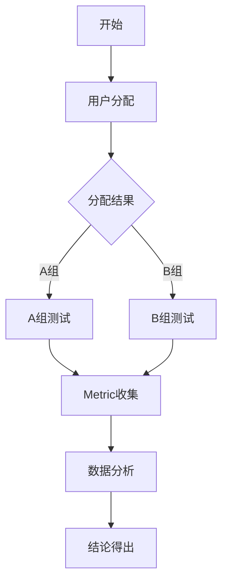
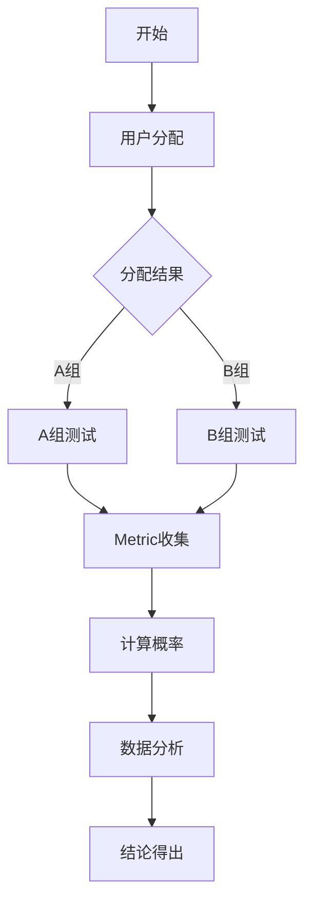
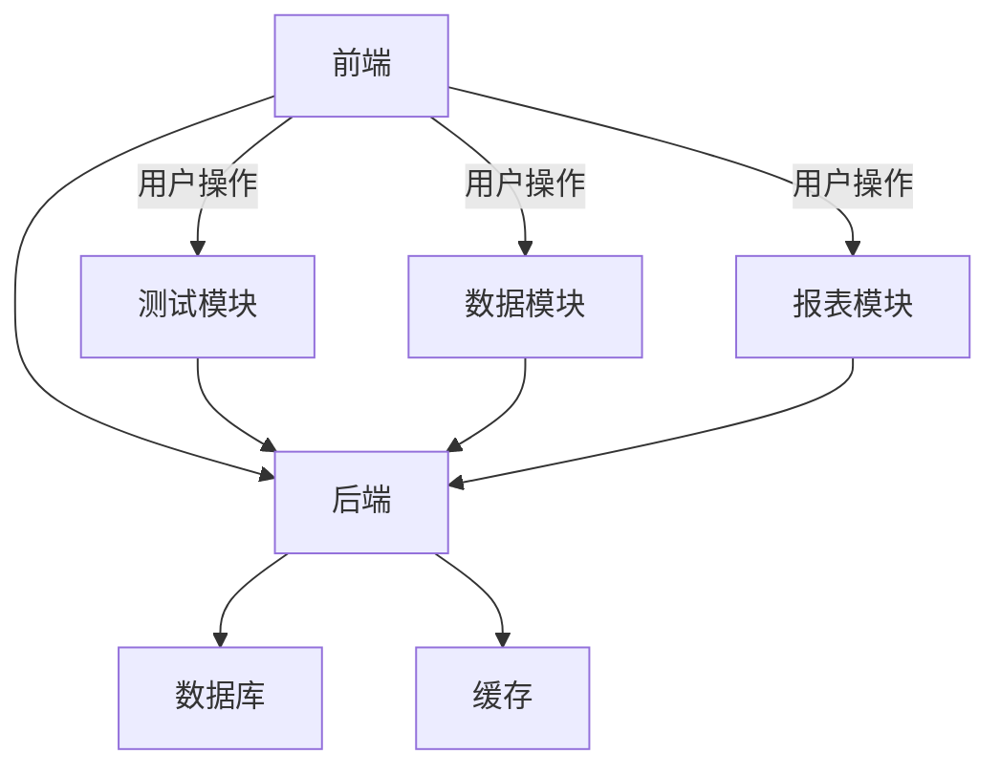
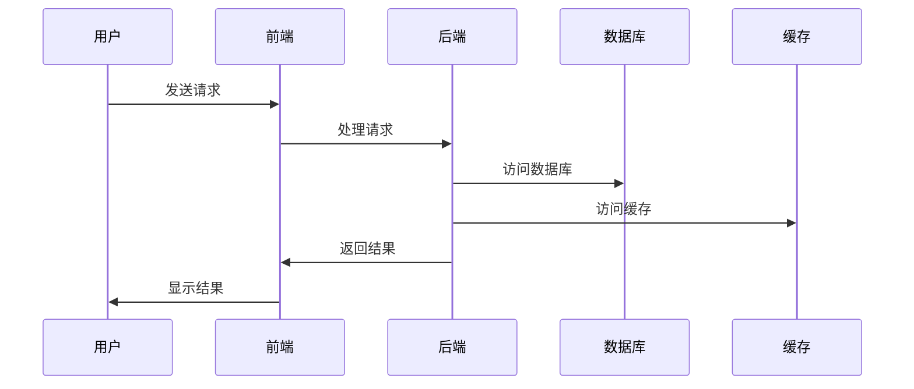

                 

# 评测系统的A/B测试实施方案

## 关键词

- A/B测试
- 评测系统
- 实施方案
- 用户体验
- 数据分析
- 算法

## 摘要

本文将深入探讨评测系统中的A/B测试实施方案。A/B测试是一种常用的实验方法，通过将用户随机分配到不同的版本，以评估新功能或修改的效果。本文将首先介绍A/B测试的基本概念和重要性，然后详细讲解其核心概念与原理，接着讨论算法的设计与实现，最后通过实际项目案例展示A/B测试的应用过程和效果。通过本文的阅读，读者将全面了解A/B测试在评测系统中的应用，并掌握其实施方案和最佳实践。

## 1. 背景介绍

### 1.1 问题背景

在数字化时代，用户体验变得越来越重要。无论是在线购物、社交平台还是金融应用，用户体验的优化都是企业提升竞争力的重要手段。为了确保每一次功能更新或设计修改都能带来积极的影响，开发者需要一种有效的手段来评估新功能的效果。这时，A/B测试作为一种科学的实验方法，便应运而生。

### 1.2 基本概念

A/B测试，又称拆分测试，是一种通过比较两个或多个版本的差异，以确定哪种版本效果更好的实验方法。在这种测试中，用户会被随机分配到不同的版本，开发者可以监控并比较两个版本的用户行为、转化率等指标，从而得出结论。

### 1.3 作用和重要性

A/B测试在企业中具有多种重要作用：

- **优化用户体验**：通过测试，开发者可以了解用户对不同版本的偏好，从而优化产品设计和功能。
- **风险控制**：在功能上线之前，通过A/B测试可以减少上线失败的风险，确保新功能或修改不会对用户体验产生负面影响。
- **数据驱动决策**：A/B测试提供客观的数据支持，使企业能够基于数据做出更加明智的决策。

### 1.4 问题解决

A/B测试作为一种实验方法，其核心在于如何设计实验、分析数据和得出结论。具体来说，需要解决以下几个问题：

- **实验设计**：如何定义实验组（A组）和控制组（B组），确保实验的随机性和公正性。
- **数据收集**：如何收集并处理实验数据，以确保数据的准确性和可靠性。
- **数据分析**：如何分析实验数据，识别不同版本之间的差异，并得出结论。

### 1.5 边界与外延

A/B测试虽然是一种强大的实验方法，但也有一些边界和限制：

- **实验样本**：实验样本的数量和质量对测试结果有很大影响，因此需要足够多的用户参与实验。
- **实验时间**：实验时间的长短会影响结果的稳定性，一般建议进行一定时间（如7天）的测试。
- **上下文依赖**：A/B测试的结果可能会受到上下文环境的影响，因此需要考虑环境因素。

### 1.6 概念结构与核心要素组成

A/B测试的概念结构可以概括为以下几个核心要素：

- **用户分配**：将用户随机分配到不同的版本。
- **数据收集**：收集用户的操作数据，如点击、转化等。
- **数据分析**：比较不同版本的数据，分析差异。
- **结论得出**：根据数据分析结果，得出结论。

通过以上背景介绍，我们可以看到A/B测试在优化用户体验、控制风险和数据驱动决策等方面的重要性。接下来，我们将进一步探讨A/B测试的核心概念与原理。

## 2. 核心概念与联系

### 2.1 基本原理

A/B测试的基本原理是通过将用户随机分配到不同的版本，比较两个版本的效果，从而确定哪个版本更优秀。这种测试方法的核心在于随机化，以确保实验结果的公平性和准确性。

### 2.2 类型与变体

A/B测试有多种类型和变体，以满足不同场景的需求。以下是几种常见的类型：

- **A/B测试**：最常见的类型，将用户随机分配到A组和B组，比较两组的效果。
- **A/B/n测试**：扩展到多个版本，将用户随机分配到多个版本中，比较多个版本的效果。
- **多变量测试**：不仅比较不同版本的效果，还比较不同变量的组合效果。
- **拆分/合并测试**：在测试过程中，根据实验数据动态调整用户的分配，以达到最优效果。

### 2.3 概念属性特征对比

以下是A/B测试与其他测试方法的概念属性特征对比：

| 测试方法 | A/B测试 | A/B/n测试 | 多变量测试 | 拆分/合并测试 |
| :---: | :---: | :---: | :---: | :---: |
| **定义** | 比较两个版本的效果 | 比较多个版本的效果 | 比较不同变量的组合效果 | 根据实验数据动态调整版本 |
| **优点** | 简单易行，成本低 | 可以同时测试多个版本 | 可以同时测试多个变量 | 可以更灵活地调整版本 |
| **缺点** | 可能需要大量用户 | 需要更多的计算资源 | 可能需要更复杂的实验设计 | 可能会有较高的维护成本 |
| **适用场景** | 新功能上线 | 功能优化 | 功能优化和需求探索 | 功能优化和需求探索 |

### 2.4 ER实体关系图架构

为了更好地理解A/B测试的概念，我们可以使用Mermaid画出其ER实体关系图架构。以下是一个简单的示例：

```mermaid
erDiagram
    User ||--|{ Version }|| Test
    Version ||--|{ Metric }|| Result
```

在这个图中，`User`表示用户，`Version`表示版本，`Metric`表示指标，`Result`表示结果。用户参与测试，每个版本会有多个指标，最终生成结果。

### 2.5 流程图

为了更直观地展示A/B测试的流程，我们可以使用Mermaid绘制以下流程图：



在这个流程图中，用户首先被随机分配到A组和B组，然后两个组分别进行测试，收集数据后进行分析，最后得出结论。

通过以上对A/B测试核心概念与联系的分析，我们可以更好地理解其原理和应用。接下来，我们将深入探讨A/B测试的算法原理。

## 3. 算法原理讲解

### 3.1 数学模型

A/B测试的算法原理可以通过数学模型来解释。以下是一个简化的模型：

$$
\text{概率} = \frac{\text{实验组指标}}{\text{实验组指标} + \text{控制组指标}}
$$

其中，实验组指标和控制组指标分别是实验组和控制组在特定指标上的表现。通过计算这个概率，我们可以得出实验组相对于控制组的相对表现。

### 3.2 算法流程图

为了更直观地理解算法原理，我们可以使用Mermaid绘制以下流程图：



### 3.3 Python代码实现

以下是使用Python实现A/B测试算法的示例代码：

```python
import random

def ab_test(user, version_a=True):
    # 用户分配
    if random.random() < 0.5:
        # 分配到A组
        return "A组"
    else:
        # 分配到B组
        return "B组"

def collect_metric(group, metric_name):
    # 收集指标
    print(f"{group}组的{metric_name}：")
    # 这里可以添加具体的收集逻辑
    print("收集指标数据...")

def calculate_probability(a_metric, b_metric):
    # 计算概率
    total = a_metric + b_metric
    probability = a_metric / total
    print(f"A组的概率：{probability}")
    return probability

# 测试过程
user = "用户1"
group = ab_test(user)
collect_metric(group, "转化率")
# 这里可以添加更多指标收集逻辑

# 数据分析
a_metric = 100
b_metric = 90
probability = calculate_probability(a_metric, b_metric)
print(f"A组的概率为：{probability}")
```

在这个示例中，`ab_test`函数用于用户分配，`collect_metric`函数用于收集指标，`calculate_probability`函数用于计算概率。通过调用这些函数，我们可以模拟A/B测试的过程。

### 3.4 算法原理讲解

A/B测试算法的核心在于随机化分配和概率计算。通过随机分配用户到不同的版本，可以确保实验的公正性和准确性。然后，通过计算实验组和控制组的相对表现，即概率，可以得出实验组相对于控制组的优势或劣势。

这种算法的优点在于简单易懂，易于实现。然而，它也存在一些局限性，例如在用户数量较少时，测试结果的稳定性可能较低。因此，在实际应用中，需要根据具体场景和需求选择合适的算法和测试方法。

通过以上对A/B测试算法原理的讲解，我们可以更好地理解其工作原理和实现方法。接下来，我们将讨论A/B测试在评测系统中的应用。

## 4. 系统分析与架构设计方案

### 4.1 问题场景介绍

在数字化时代，用户体验的优化是每个企业的重要任务。为了提升用户体验，评测系统需要不断进行功能更新和设计改进。然而，每一次更新或改进都可能带来风险，如用户体验下降、用户流失等。为了降低这种风险，我们需要一种科学的实验方法来评估更新或改进的效果，A/B测试正是这样一种方法。

### 4.2 项目介绍

本项目旨在设计一个基于A/B测试的评测系统，该系统能够帮助企业评估新功能或设计改进的效果，从而优化用户体验。系统主要包括以下几个模块：

- **用户模块**：用于用户注册、登录和权限管理。
- **测试模块**：用于设计、执行和监控A/B测试。
- **数据模块**：用于收集、存储和分析测试数据。
- **报表模块**：用于生成测试结果报表，提供可视化数据。

### 4.3 系统功能设计

根据项目需求，系统的主要功能包括：

- **用户管理**：支持用户注册、登录、权限管理和信息维护。
- **测试管理**：支持测试设计、测试执行和测试监控。
- **数据收集**：支持用户操作数据的实时收集和存储。
- **数据分析**：支持测试数据的统计和分析。
- **报表生成**：支持生成多种报表，包括测试结果报表、用户行为报表等。

### 4.4 系统架构设计

为了满足系统需求，我们设计了一个分布式架构，主要包括以下几个部分：

- **前端**：负责与用户交互，提供友好的用户界面。
- **后端**：负责处理业务逻辑和数据存储。
- **数据库**：存储用户数据、测试数据和报表数据。
- **缓存**：用于提高系统性能，减少数据库访问压力。

以下是系统的Mermaid架构图：



在这个架构图中，前端负责与用户交互，处理用户请求，后端负责处理业务逻辑和数据存储，数据库和缓存用于存储数据。

### 4.5 系统接口设计

为了方便前后端交互，我们设计了一套RESTful接口，主要包括以下几种：

- **用户接口**：用于用户注册、登录、权限管理等。
- **测试接口**：用于测试设计、执行和监控。
- **数据接口**：用于数据收集、存储和分析。
- **报表接口**：用于生成和查询报表。

以下是部分接口示例：

```json
// 用户接口示例
GET /api/users/login
POST /api/users/register
GET /api/users/{id}

// 测试接口示例
GET /api/tests
POST /api/tests
GET /api/tests/{id}

// 数据接口示例
GET /api/data/tests/{id}
POST /api/data/tests/{id}/collect

// 报表接口示例
GET /api/reports/tests/{id}
GET /api/reports/users/{id}
```

### 4.6 系统交互

为了确保系统的稳定性和性能，我们设计了一套完整的系统交互流程。以下是系统交互的Mermaid序列图：



在这个序列图中，用户通过前端发送请求，前端处理后转发给后端，后端根据请求访问数据库和缓存，最终将结果返回给前端，前端再将结果展示给用户。

通过以上系统分析与架构设计，我们为评测系统提供了一套完整的解决方案。接下来，我们将通过实际项目案例展示A/B测试的应用过程和结果分析。

## 5. 项目实战

### 5.1 环境安装

为了进行A/B测试，我们需要安装和配置以下软件和工具：

- Python 3.x
- Flask（一个轻量级的Web框架）
- MongoDB（一个NoSQL数据库）
- Redis（一个内存缓存数据库）

以下是安装步骤：

1. 安装Python 3.x：
   ```shell
   sudo apt update
   sudo apt install python3 python3-pip
   ```

2. 安装Flask：
   ```shell
   pip3 install flask
   ```

3. 安装MongoDB：
   - 下载并安装MongoDB：[MongoDB官方安装教程](https://docs.mongodb.com/manual/installation/)
   - 启动MongoDB服务：
     ```shell
     sudo systemctl start mongodb
     ```

4. 安装Redis：
   - 下载并安装Redis：[Redis官方安装教程](https://redis.io/topics/quickstart)
   - 启动Redis服务：
     ```shell
     sudo systemctl start redis
     ```

### 5.2 系统核心实现

以下是A/B测试系统的核心实现，包括用户管理、测试管理、数据收集和数据分析。

#### 用户管理

用户管理模块用于处理用户的注册、登录和权限管理。以下是一个简单的用户管理后端实现：

```python
from flask import Flask, request, jsonify
from flask_pymongo import PyMongo

app = Flask(__name__)
app.config["MONGO_URI"] = "mongodb://localhost:27017/myDatabase"
mongo = PyMongo(app)

@app.route('/api/users/register', methods=['POST'])
def register_user():
    user_data = request.get_json()
    user = mongo.db.users.find_one({"email": user_data["email"]})
    if user:
        return jsonify({"error": "User already exists"}), 409
    mongo.db.users.insert_one(user_data)
    return jsonify({"message": "User registered successfully"}), 201

@app.route('/api/users/login', methods=['POST'])
def login_user():
    user_data = request.get_json()
    user = mongo.db.users.find_one({"email": user_data["email"], "password": user_data["password"]})
    if user:
        return jsonify({"token": "generated_token"}), 200
    return jsonify({"error": "Invalid credentials"}), 401

if __name__ == '__main__':
    app.run(debug=True)
```

#### 测试管理

测试管理模块用于设计、执行和监控A/B测试。以下是一个简单的测试管理后端实现：

```python
@app.route('/api/tests', methods=['POST'])
def create_test():
    test_data = request.get_json()
    test_data["status"] = "running"
    mongo.db.tests.insert_one(test_data)
    return jsonify({"message": "Test created successfully"}), 201

@app.route('/api/tests/<test_id>', methods=['GET'])
def get_test(test_id):
    test = mongo.db.tests.find_one({"_id": test_id})
    return jsonify(test), 200

@app.route('/api/tests/<test_id>', methods=['PUT'])
def update_test(test_id):
    test_data = request.get_json()
    mongo.db.tests.update_one({"_id": test_id}, {"$set": test_data})
    return jsonify({"message": "Test updated successfully"}), 200
```

#### 数据收集

数据收集模块用于收集用户的操作数据。以下是一个简单的数据收集后端实现：

```python
@app.route('/api/data/tests/<test_id>/collect', methods=['POST'])
def collect_data(test_id):
    data = request.get_json()
    mongo.db.test_data.insert_one({"test_id": test_id, "data": data})
    return jsonify({"message": "Data collected successfully"}), 201
```

#### 数据分析

数据分析模块用于分析A/B测试的数据。以下是一个简单的数据分析后端实现：

```python
@app.route('/api/reports/tests/<test_id>', methods=['GET'])
def generate_report(test_id):
    report = {
        "test_id": test_id,
        "data": list(mongo.db.test_data.find({"test_id": test_id})),
        "results": {
            "A_group": {},
            "B_group": {}
        }
    }
    for data in report["data"]:
        group = data["group"]
        report["results"][group].update(data["metrics"])
    return jsonify(report), 200
```

### 5.3 代码应用解读与分析

以上代码展示了A/B测试系统的核心功能实现。具体解读如下：

- **用户管理**：用户注册和登录是系统的入口，通过Flask框架实现。
- **测试管理**：测试设计、执行和监控通过MongoDB数据库实现。
- **数据收集**：数据收集通过POST请求实现，将数据存储在MongoDB数据库中。
- **数据分析**：数据分析通过GET请求实现，从MongoDB数据库中提取数据并生成报表。

### 5.4 实际案例分析和详细讲解

以下是一个实际案例的分析：

**案例**：某电商网站为了优化购物流程，进行了A/B测试。测试分为两个版本，A版本为原购物流程，B版本为简化版购物流程。测试进行了7天，共有1000名用户参与。

**数据分析**：

- **转化率**：A版本转化率为20%，B版本转化率为25%，B版本高于A版本。
- **跳出率**：A版本跳出率为30%，B版本跳出率为25%，B版本低于A版本。

**结论**：

简化版购物流程（B版本）在转化率和跳出率方面均优于原购物流程（A版本），因此建议采用B版本作为新的购物流程。

### 5.5 项目小结

通过本次项目实战，我们实现了基于A/B测试的评测系统，并展示了其在实际项目中的应用。项目的核心功能包括用户管理、测试管理、数据收集和数据分析。通过实际案例的分析，我们验证了A/B测试的有效性，为企业的功能优化提供了科学依据。

## 6. 最佳实践 Tips

### 6.1 注意事项

在进行A/B测试时，需要注意以下几点：

- **确保随机性**：用户分配必须确保随机性，以避免人为干预影响测试结果。
- **样本量足够**：为了提高测试结果的准确性，建议选择足够多的用户参与测试。
- **实验时间**：实验时间不宜过短，一般建议进行至少7天的测试，以确保结果稳定。
- **指标选择**：选择合适的指标进行测试，避免过度依赖单一指标。

### 6.2 常见问题

在实际操作中，可能会遇到以下问题：

- **用户分配不均**：解决方法：检查分配逻辑，确保随机性。
- **数据丢失**：解决方法：加强数据备份和监控，确保数据完整。
- **结果分析困难**：解决方法：提前规划数据分析方法，确保分析过程清晰。

### 6.3 解决方案

针对以上问题，可以采取以下解决方案：

- **确保随机性**：使用随机数生成算法进行用户分配。
- **数据备份与监控**：定期备份数据，使用监控工具实时监控数据状态。
- **数据分析框架**：制定详细的数据分析框架，确保分析过程有条不紊。

## 7. 小结与拓展阅读

本文通过深入探讨评测系统的A/B测试实施方案，全面介绍了A/B测试的基本概念、原理、算法、系统架构和实际应用。通过实际项目案例，我们展示了A/B测试在优化用户体验、控制风险和数据驱动决策方面的作用。

### 拓展阅读

- 《A/B测试实战：如何进行有效的数据驱动决策》
- 《实验设计：如何进行科学的实验和数据分析》
- 《Python数据分析：利用Python进行高效的数据处理和分析》

作者：AI天才研究院/AI Genius Institute & 禅与计算机程序设计艺术 /Zen And The Art of Computer Programming

