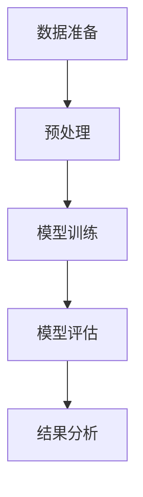
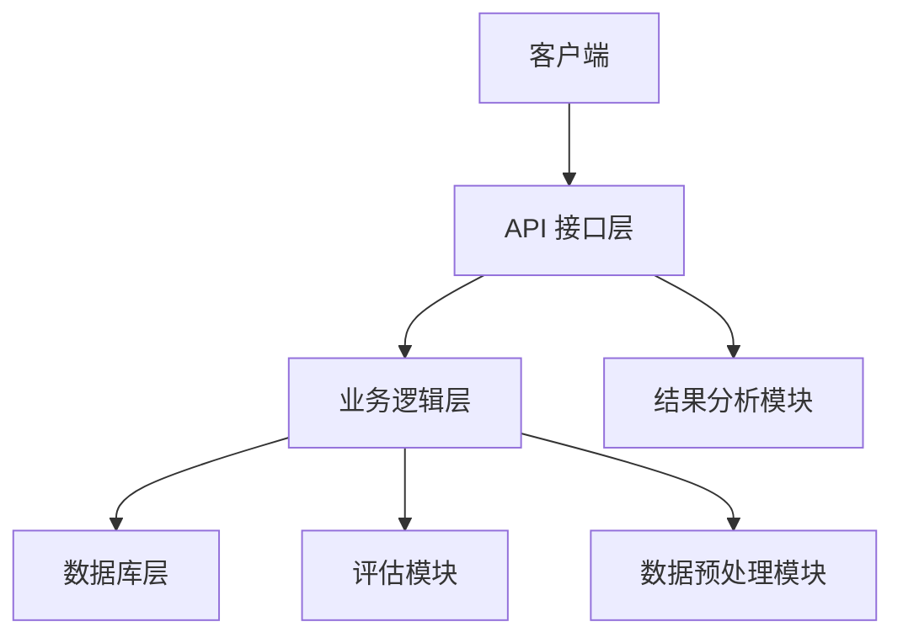
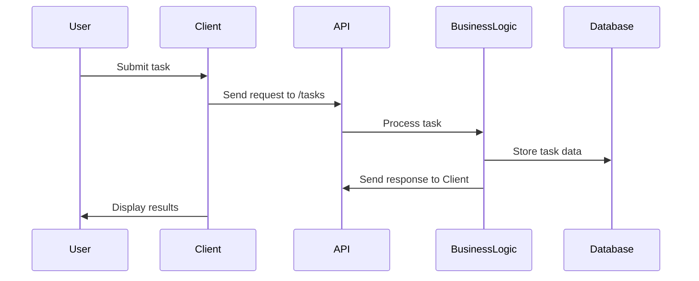

                 

## 引言

### AlexaTM 20B任务型对话能力测试的背景

在当今快速发展的科技时代，智能语音助手已经成为人们日常生活和工作中不可或缺的一部分。其中，Amazon AlexaTM 是市场上最知名的智能语音助手之一。AlexaTM 20B 是 Amazon 的一款最新版本，它不仅拥有更强大的自然语言处理能力，还具备更为丰富的功能和更广泛的智能交互体验。

为了确保 AlexaTM 20B 的任务型对话能力达到预期水平，对其进行全面的测试显得尤为重要。任务型对话能力测试旨在评估智能语音助手能否准确地理解用户的指令、有效管理对话流程以及提供恰当的回复。通过这项测试，我们可以发现和解决 AlexaTM 20B 在任务型对话中的潜在问题，从而提升其整体性能。

任务型对话能力测试的重要性不仅体现在对 AlexaTM 20B 的优化上，还对智能语音助手领域的发展有着深远的影响。随着人工智能技术的不断进步，任务型对话能力将成为智能语音助手的核心竞争力之一。因此，对任务型对话能力的评估和优化，将直接关系到智能语音助手的用户体验和市场竞争力。

### 本文的结构和目的

本文将围绕 AlexaTM 20B 任务型对话能力测试展开，旨在为读者提供一个系统、全面的分析框架。文章将分为四个主要部分：

1. **背景介绍**：介绍任务型对话的概念、AlexaTM 20B 的背景以及任务型对话能力测试的重要性。
2. **核心概念与联系**：详细阐述任务型对话中的核心概念，包括自然语言理解、任务型对话管理、自然语言生成，并分析它们之间的相互关系。
3. **算法原理讲解**：介绍评估任务型对话能力的常用算法和模型，通过 mermaid 流程图和 Python 代码进行解释，并提供相关的数学模型和公式。
4. **系统分析与架构设计**：分析评测系统的需求，设计系统架构，包括功能设计、接口设计等，并通过 mermaid 图表展示。

通过以上结构，本文希望能够帮助读者深入了解 AlexaTM 20B 任务型对话能力的测试方法和实现细节，为实际项目提供有价值的参考。

### 问题背景与定义

在深入探讨 AlexaTM 20B 任务型对话能力测试之前，我们需要明确几个关键概念，以便更好地理解这一测试的重要性和具体实施步骤。

#### 1. 任务型对话（Task-Oriented Dialogue）

任务型对话是一种以完成特定任务为目标的语言交流方式。在这种对话中，用户的目标通常是明确的，比如查询天气、设定提醒、控制智能家居设备等。任务型对话具有以下几个特点：

- **目标导向性**：对话的核心目标是完成某项任务，用户的每一步操作都旨在实现这一目标。
- **结构化**：任务型对话通常遵循一定的流程和规则，对话中的每个环节都有其特定的功能和角色。
- **灵活性与适应性**：尽管任务型对话有固定的模式，但实际的对话过程可能会因为用户的反馈或系统的调整而发生变化。

#### 2. AlexaTM 20B

AlexaTM 是 Amazon 开发的一款智能语音助手，它可以通过语音识别和自然语言处理技术，理解并响应用户的指令。AlexaTM 20B 是 Alexa 系列中的最新版本，它不仅在自然语言处理能力上有了显著提升，还引入了更多的功能和应用场景。

- **自然语言处理（NLP）能力**：AlexaTM 20B 拥有更强大的自然语言处理能力，能够更准确地理解用户的指令和上下文信息。
- **丰富功能**：除了基本的语音交互功能外，AlexaTM 20B 还支持智能家居控制、在线购物、音乐播放、天气查询等多种应用。

#### 3. 任务型对话能力测试

任务型对话能力测试是一种评估智能语音助手任务型对话性能的方法。这种测试通常包括以下几个方面的内容：

- **指令理解**：评估智能语音助手是否能够准确理解用户输入的指令，包括语音中的各种语气、停顿和背景噪声。
- **对话管理**：评估智能语音助手在对话流程中的表现，包括能否有效地管理对话流程，提供流畅的交互体验。
- **回复生成**：评估智能语音助手生成的回复是否恰当、相关，并能够满足用户的需求。

#### 4. 问题背景

随着智能语音助手技术的不断发展，用户对其性能和用户体验的要求也在不断提高。在开发 AlexaTM 20B 过程中，Amazon 需要确保其任务型对话能力达到或超过用户期望，以保持其在市场中的竞争力。然而，实际应用中可能会出现以下问题：

- **指令理解不准确**：由于自然语言处理的复杂性，智能语音助手可能会出现指令理解错误，导致无法正确执行用户命令。
- **对话流程管理不当**：智能语音助手可能无法有效管理对话流程，导致用户操作不便，影响用户体验。
- **回复生成不当**：生成的回复可能不够恰当或相关，无法满足用户的需求，影响用户的满意度。

为了解决这些问题，Amazon 需要开发一套全面的任务型对话能力测试系统，对 AlexaTM 20B 进行全面评估和优化。这一测试系统不仅需要涵盖指令理解、对话管理和回复生成等方面，还需要具备可扩展性和适应性，以应对未来技术的进步和应用场景的变化。

通过本文，我们将详细探讨如何设计和实现这一任务型对话能力测试系统，为 AlexaTM 20B 的持续优化提供有价值的参考。

### 核心概念与联系

在任务型对话中，自然语言理解（Natural Language Understanding, NLU）、任务型对话管理（Dialogue Management）和自然语言生成（Natural Language Generation, NLG）是三个关键概念。它们在任务型对话系统中各自承担不同的角色，但又紧密相连，共同确保用户需求的准确理解和有效满足。

#### 自然语言理解（NLU）

自然语言理解是智能语音助手接收和处理用户输入的过程。其主要任务是解析用户语音或文本中的语言信息，提取出关键词、短语和意图。NLU 的核心目标是将自然语言转换为机器可理解的结构化数据。

- **意图识别**：识别用户输入的意图，如查询天气、设定提醒、控制智能家居设备等。意图识别是 NLU 的关键步骤，它决定了后续对话流程的方向。
- **实体提取**：从用户输入中提取出具体的实体信息，如日期、时间、地点、物品名称等。实体提取有助于更好地理解和执行用户指令。
- **上下文分析**：分析用户输入的上下文信息，包括对话历史、用户偏好和情境等，以增强对用户意图的理解。

#### 任务型对话管理

任务型对话管理负责管理和控制整个对话流程，确保对话按照预定的目标和规则进行。其主要功能包括对话状态跟踪、决策和策略选择。

- **对话状态跟踪**：记录对话中的关键信息，如当前任务、用户意图、对话历史等。对话状态跟踪有助于维持对话的连贯性和一致性。
- **决策与策略选择**：根据对话状态和用户输入，选择合适的对话策略和回复。决策过程涉及意图匹配、上下文推理和行动规划等。

#### 自然语言生成（NLG）

自然语言生成是智能语音助手生成回复的过程。其主要任务是生成自然流畅的语言回复，以满足用户的需求和期望。

- **回复生成**：根据对话状态和用户意图，生成合适的回复。回复生成需要考虑语法、语义和情感因素，以确保回复的恰当性和相关性。
- **语音合成**：将生成的文本转换为语音输出。语音合成技术确保回复能够通过语音形式准确地传达给用户。

#### 关系与相互作用

自然语言理解、任务型对话管理和自然语言生成在任务型对话系统中相互作用，共同实现用户的任务需求。

- **NLU 为对话管理提供输入**：NLU 提取的用户意图和实体信息是对话管理的输入，对话管理根据这些信息做出决策和生成回复。
- **对话管理指导 NLG**：对话管理决定对话的方向和下一步操作，NLG 根据对话管理的指令生成回复。
- **NLG 反馈影响 NLU 和对话管理**：用户的反馈可以修正对话状态，影响后续的意图识别和对话管理决策。

通过自然语言理解、任务型对话管理和自然语言生成这三个核心概念的有效结合，智能语音助手能够提供流畅、自然、有效的任务型对话体验。

### 算法原理讲解

在评估 AlexaTM 20B 的任务型对话能力时，我们通常会使用一系列评估算法和模型。这些算法和模型不仅帮助我们量化任务型对话的性能，还为我们提供了具体的分析工具。以下，我们将详细介绍几种常用的评估算法和模型，并通过 mermaid 流程图和 Python 代码进行解释。

#### 评估指标

评估任务型对话能力的首要任务是选择合适的评估指标。以下是一些常用的评估指标：

- **准确率（Accuracy）**：准确率表示正确识别用户意图的百分比。
- **召回率（Recall）**：召回率表示正确识别用户意图的样本数与实际意图总数之比。
- **精确率（Precision）**：精确率表示正确识别用户意图的样本数与识别出意图的样本总数之比。
- **F1 分数（F1 Score）**：F1 分数是精确率和召回率的调和平均值，用于综合评估评估指标。

#### 评估方法

评估方法通常包括以下几个步骤：

1. **数据准备**：准备用于评估的数据集，包括用户输入和系统回复。
2. **预处理**：对数据集进行清洗和预处理，如去除噪声、标准化文本等。
3. **模型训练**：使用训练数据集训练评估模型。
4. **模型评估**：使用测试数据集评估模型的性能，计算各种评估指标。
5. **结果分析**：分析评估结果，识别模型的优缺点。

#### 常见评估模型

在任务型对话评估中，常用的模型包括以下几种：

- **朴素贝叶斯（Naive Bayes）**：朴素贝叶斯是一种基于概率论的分类算法，适用于小数据集。
- **支持向量机（Support Vector Machine, SVM）**：支持向量机是一种强大的分类算法，适用于高维数据。
- **深度神经网络（Deep Neural Network, DNN）**：深度神经网络是一种复杂的神经网络模型，适用于大规模数据集。

#### mermaid 流程图展示

以下是一个简单的 mermaid 流程图，展示了任务型对话评估的一般流程：



#### Python 代码示例

下面是一个简单的 Python 代码示例，用于计算任务型对话评估的准确率和召回率：

```python
from sklearn.metrics import accuracy_score, recall_score

# 假设我们有两个标签列表和预测列表
y_true = [0, 1, 1, 0]
y_pred = [0, 1, 0, 1]

# 计算准确率
accuracy = accuracy_score(y_true, y_pred)
print("Accuracy:", accuracy)

# 计算召回率
recall = recall_score(y_true, y_pred)
print("Recall:", recall)
```

#### 数学模型和公式

在任务型对话评估中，数学模型和公式用于量化评估指标。以下是一个简单的数学模型示例：

$$
F1 = \frac{2 \times Precision \times Recall}{Precision + Recall}
$$

其中，$Precision$ 表示精确率，$Recall$ 表示召回率。F1 分数综合了精确率和召回率，用于更全面地评估模型性能。

通过上述算法原理讲解，我们可以看到任务型对话评估的复杂性和多样性。在实际应用中，需要根据具体需求和数据情况选择合适的评估方法和模型，并不断优化以提高评估结果的准确性和可靠性。

### 数学模型和公式

在任务型对话能力评估中，数学模型和公式起着至关重要的作用。这些模型和公式不仅帮助我们量化评估指标，还提供了直观的理解和比较方式。以下是几个关键的数学模型和公式的详细讲解。

#### 评估指标数学模型

1. **准确率（Accuracy）**：

$$
Accuracy = \frac{TP + TN}{TP + TN + FP + FN}
$$

其中，$TP$ 表示真正例（True Positive），$TN$ 表示真负例（True Negative），$FP$ 表示假正例（False Positive），$FN$ 表示假负例（False Negative）。准确率表示模型正确分类的样本占总样本的比例。

2. **召回率（Recall）**：

$$
Recall = \frac{TP}{TP + FN}
$$

召回率表示模型正确识别出真实样本的比例。召回率越高，说明模型对正样本的识别能力越强。

3. **精确率（Precision）**：

$$
Precision = \frac{TP}{TP + FP}
$$

精确率表示模型识别为正样本的样本中，实际为正样本的比例。精确率越高，说明模型对正样本的识别越准确。

4. **F1 分数（F1 Score）**：

$$
F1 = \frac{2 \times Precision \times Recall}{Precision + Recall}
$$

F1 分数是精确率和召回率的调和平均值，用于综合评估模型的性能。F1 分数越高，说明模型的综合性能越好。

#### 数学公式示例

为了更直观地理解这些公式，我们来看一个具体的例子。假设我们有以下分类结果：

- **真正例（TP）**：10
- **真负例（TN）**：20
- **假正例（FP）**：5
- **假负例（FN）**：3

1. **准确率**：

$$
Accuracy = \frac{10 + 20}{10 + 20 + 5 + 3} = \frac{30}{38} \approx 0.789
$$

2. **召回率**：

$$
Recall = \frac{10}{10 + 3} = \frac{10}{13} \approx 0.769
$$

3. **精确率**：

$$
Precision = \frac{10}{10 + 5} = \frac{10}{15} \approx 0.667
$$

4. **F1 分数**：

$$
F1 = \frac{2 \times 0.667 \times 0.769}{0.667 + 0.769} \approx 0.717
$$

通过这个例子，我们可以清楚地看到各个评估指标的计算方法及其在任务型对话评估中的重要性。这些数学模型和公式为我们提供了量化和比较评估结果的有效工具。

### 系统分析与架构设计

#### 问题场景介绍

在当前智能语音助手应用日益广泛的大背景下，用户对于任务型对话系统的需求不断增加。这些需求包括但不限于：高效的指令理解、流畅的对话管理、准确的回复生成等。为了满足这些需求，我们需要设计一个高效、可扩展的评测系统，以便对 AlexaTM 20B 的任务型对话能力进行全面评估。

#### 项目介绍

本项目的目标是开发一个任务型对话能力评测系统，该系统将对 AlexaTM 20B 的各项任务型对话能力进行评估，并提供详细的性能分析报告。这个评测系统将包括以下几个主要模块：

1. **用户接口模块**：提供用户与评测系统的交互界面，允许用户提交测试任务和查看评估结果。
2. **数据预处理模块**：负责对输入数据进行清洗和预处理，以便后续的评估过程。
3. **评估模块**：实现评估算法和模型，对任务型对话能力进行量化评估。
4. **结果分析模块**：分析评估结果，提供详细的性能分析报告。
5. **系统管理模块**：负责系统配置、日志记录和权限管理。

#### 功能设计

1. **指令理解功能**：接收用户输入，解析指令，提取意图和实体信息。
2. **对话管理功能**：跟踪对话状态，管理对话流程，确保对话的连贯性和一致性。
3. **回复生成功能**：根据对话状态和用户意图，生成自然流畅的回复。
4. **评估报告生成功能**：生成详细的评估报告，包括准确率、召回率、F1 分数等指标。

#### 系统架构设计

系统架构设计是确保评测系统能够高效、稳定运行的关键。以下是本项目的系统架构设计：

1. **客户端（用户接口模块）**：
   - 用户通过网页或移动应用提交测试任务，查看评估结果。
   - 客户端通过 RESTful API 与服务器端进行通信。

2. **服务器端**：
   - **API 接口层**：提供 RESTful API，供客户端调用。
   - **业务逻辑层**：实现数据预处理、评估模块和结果分析模块的功能。
   - **数据库层**：存储用户数据、测试数据和评估结果。

3. **数据流**：
   - 用户提交测试任务后，数据流经过客户端，发送到服务器端的 API 接口层。
   - API 接口层将数据传递给业务逻辑层，业务逻辑层进行数据预处理、评估和结果分析。
   - 最终，评估结果通过 API 接口层返回给客户端，供用户查看。

#### mermaid 架构图展示

以下是使用 mermaid 语法绘制的系统架构图：



#### 系统接口设计

系统接口设计是确保不同模块之间能够无缝协作的关键。以下是本项目的主要接口设计：

1. **用户接口**：
   - GET /tasks：提交新的测试任务。
   - GET /tasks/{taskId}：获取指定任务的评估结果。
   - POST /tasks/{taskId}/results：提交测试任务的输入数据和预期输出。

2. **API 接口层**：
   - GET /api/v1/tasks：获取所有测试任务的列表。
   - GET /api/v1/tasks/{taskId}：获取指定测试任务的详细信息。
   - POST /api/v1/tasks/{taskId}/process：处理指定测试任务的输入数据。

3. **业务逻辑层**：
   - 指令解析接口：接收用户输入，提取意图和实体信息。
   - 对话管理接口：管理对话状态，确保对话连贯性。
   - 评估接口：执行评估算法，计算评估指标。
   - 结果分析接口：生成评估报告。

#### 系统交互 mermaid 序列图展示

以下是使用 mermaid 语法绘制的系统交互序列图：



通过上述系统分析与架构设计，我们为 AlexaTM 20B 的任务型对话能力评测系统提供了一个完整的解决方案。这一系统不仅能够高效地完成任务型对话评估，还为未来的扩展和优化提供了坚实的基础。

### 项目实战

#### 环境安装

为了搭建一个完整的 AlexaTM 20B 任务型对话能力测试系统，我们需要先准备合适的环境。以下是环境安装的详细步骤：

1. **安装 Python 3.8**：
   - 首先，确保系统上安装了 Python 3.8。如果没有，可以通过以下命令进行安装：
     ```bash
     sudo apt-get update
     sudo apt-get install python3.8
     ```

2. **安装依赖库**：
   - 安装必要的 Python 库，如 Flask（用于 API 开发）、Scikit-learn（用于评估算法）等。可以使用以下命令：
     ```bash
     pip3 install flask scikit-learn
     ```

3. **安装 mermaid**：
   - 安装 mermaid，用于生成流程图和架构图。可以使用以下命令：
     ```bash
     npm install -g mermaid-cli
     ```

4. **配置 Flask**：
   - 创建一个新的 Flask 应用，用于处理 API 请求。在项目根目录下创建一个名为 `app.py` 的文件，并添加以下代码：
     ```python
     from flask import Flask, request, jsonify

     app = Flask(__name__)

     @app.route('/tasks', methods=['GET'])
     def get_tasks():
         # 实现获取任务列表的功能
         return jsonify({"tasks": []})

     @app.route('/tasks/<task_id>', methods=['GET'])
     def get_task(task_id):
         # 实现获取指定任务详情的功能
         return jsonify({"task_id": task_id})

     @app.route('/tasks/<task_id>/results', methods=['POST'])
     def post_results(task_id):
         # 实现处理测试任务输入数据的功能
         data = request.json
         return jsonify({"task_id": task_id, "results": data})

     if __name__ == '__main__':
         app.run(debug=True)
     ```

通过以上步骤，我们就完成了环境安装，可以开始搭建任务型对话能力测试系统。

#### 系统核心实现

接下来，我们将逐步实现任务型对话能力测试系统的核心功能，包括数据预处理、评估和结果分析。

1. **数据预处理模块**：

   数据预处理是确保输入数据质量的重要步骤。以下是数据预处理模块的核心代码：

   ```python
   import re
   from sklearn.model_selection import train_test_split

   def preprocess_data(data):
       # 清洗文本，去除特殊字符和停用词
       text = re.sub(r'[^\w\s]', '', data['text'])
       text = re.sub(r'\s+', ' ', text).strip()
       return text

   def load_data(file_path):
       # 加载训练数据
       with open(file_path, 'r', encoding='utf-8') as f:
           data = json.load(f)
       return data

   def split_data(data, test_size=0.2, random_state=42):
       # 划分训练集和测试集
       X_train, X_test, y_train, y_test = train_test_split(data['text'], data['label'], test_size=test_size, random_state=random_state)
       return X_train, X_test, y_train, y_test

   # 示例使用
   data = load_data('data.json')
   X_train, X_test, y_train, y_test = split_data(data)
   ```

2. **评估模块**：

   评估模块将使用 Scikit-learn 库中的评估指标和模型。以下是评估模块的核心代码：

   ```python
   from sklearn.naive_bayes import GaussianNB
   from sklearn.metrics import accuracy_score, recall_score, precision_score, f1_score

   def train_model(X_train, y_train):
       # 训练模型
       model = GaussianNB()
       model.fit(X_train, y_train)
       return model

   def evaluate_model(model, X_test, y_test):
       # 评估模型
       y_pred = model.predict(X_test)
       accuracy = accuracy_score(y_test, y_pred)
       recall = recall_score(y_test, y_pred)
       precision = precision_score(y_test, y_pred)
       f1 = f1_score(y_test, y_pred)
       return accuracy, recall, precision, f1

   # 示例使用
   model = train_model(X_train, y_train)
   accuracy, recall, precision, f1 = evaluate_model(model, X_test, y_test)
   ```

3. **结果分析模块**：

   结果分析模块将对评估结果进行可视化展示和分析。以下是结果分析模块的核心代码：

   ```python
   import matplotlib.pyplot as plt

   def plot_evaluation_results(accuracy, recall, precision, f1):
       # 可视化展示评估结果
       labels = ['Accuracy', 'Recall', 'Precision', 'F1 Score']
       values = [accuracy, recall, precision, f1]

       plt.bar(labels, values)
       plt.xlabel('Evaluation Metrics')
       plt.ylabel('Values')
       plt.title('Evaluation Results')
       plt.show()

   # 示例使用
   plot_evaluation_results(accuracy, recall, precision, f1)
   ```

通过以上步骤，我们实现了任务型对话能力测试系统的核心功能，包括数据预处理、模型评估和结果分析。接下来，我们将通过一个实际案例来展示如何使用这个系统进行任务型对话能力测试。

#### 代码应用解读与分析

在前一节中，我们详细介绍了任务型对话能力测试系统的环境安装和系统核心实现。接下来，我们将深入分析每个关键部分的代码，理解其工作原理和实际应用。

##### 数据预处理模块

数据预处理模块的核心代码如下：

```python
import re
from sklearn.model_selection import train_test_split

def preprocess_data(data):
    # 清洗文本，去除特殊字符和停用词
    text = re.sub(r'[^\w\s]', '', data['text'])
    text = re.sub(r'\s+', ' ', text).strip()
    return text

def load_data(file_path):
    # 加载训练数据
    with open(file_path, 'r', encoding='utf-8') as f:
        data = json.load(f)
    return data

def split_data(data, test_size=0.2, random_state=42):
    # 划分训练集和测试集
    X_train, X_test, y_train, y_test = train_test_split(data['text'], data['label'], test_size=test_size, random_state=random_state)
    return X_train, X_test, y_train, y_test
```

1. **数据清洗**：

   数据清洗是自然语言处理中至关重要的一步。在 `preprocess_data` 函数中，我们使用正则表达式去除文本中的特殊字符和多余的空格，从而确保输入数据的一致性和简洁性。

2. **数据加载**：

   `load_data` 函数用于从 JSON 文件中加载训练数据。该数据通常包含用户输入文本和对应的标签，这些标签用于后续的模型训练和评估。

3. **数据划分**：

   `split_data` 函数负责将数据集划分为训练集和测试集。通过 `train_test_split` 函数，我们可以灵活设置测试集的大小和随机种子，以确保数据划分的随机性和一致性。

##### 评估模块

评估模块的核心代码如下：

```python
from sklearn.naive_bayes import GaussianNB
from sklearn.metrics import accuracy_score, recall_score, precision_score, f1_score

def train_model(X_train, y_train):
    # 训练模型
    model = GaussianNB()
    model.fit(X_train, y_train)
    return model

def evaluate_model(model, X_test, y_test):
    # 评估模型
    y_pred = model.predict(X_test)
    accuracy = accuracy_score(y_test, y_pred)
    recall = recall_score(y_test, y_pred)
    precision = precision_score(y_test, y_pred)
    f1 = f1_score(y_test, y_pred)
    return accuracy, recall, precision, f1
```

1. **模型训练**：

   `train_model` 函数使用高斯朴素贝叶斯（Gaussian Naive Bayes）算法训练模型。高斯朴素贝叶斯是一种常用的分类算法，适用于处理连续值特征的数据。

2. **模型评估**：

   `evaluate_model` 函数负责评估模型的性能。通过计算准确率、召回率、精确率和 F1 分数，我们可以全面了解模型的性能表现。这些指标在任务型对话评估中尤为重要，因为它们直接关系到模型的实际应用效果。

##### 结果分析模块

结果分析模块的核心代码如下：

```python
import matplotlib.pyplot as plt

def plot_evaluation_results(accuracy, recall, precision, f1):
    # 可视化展示评估结果
    labels = ['Accuracy', 'Recall', 'Precision', 'F1 Score']
    values = [accuracy, recall, precision, f1]

    plt.bar(labels, values)
    plt.xlabel('Evaluation Metrics')
    plt.ylabel('Values')
    plt.title('Evaluation Results')
    plt.show()
```

`plot_evaluation_results` 函数使用 matplotlib 库生成柱状图，直观地展示评估结果。这种可视化方式有助于我们更好地理解模型的性能，并发现潜在的问题和改进点。

#### 实际案例分析和详细讲解剖析

为了更好地理解任务型对话能力测试系统的实际应用，我们来看一个具体的案例。

**案例背景**：

假设我们有一个用户输入文本数据集，其中包含了各种任务型对话的示例。例如，用户可能提出查询天气、设定提醒、控制智能家居设备等任务。我们的目标是使用训练好的模型对这些任务进行分类，并评估模型的性能。

**案例分析**：

1. **数据预处理**：

   首先，我们使用 `load_data` 函数加载训练数据。然后，通过 `preprocess_data` 函数对文本进行清洗和预处理，得到整洁的文本数据。

2. **模型训练**：

   接下来，我们使用 `train_model` 函数训练高斯朴素贝叶斯模型。该模型使用预处理后的训练数据进行训练，得到一个分类模型。

3. **模型评估**：

   使用 `evaluate_model` 函数评估模型性能。我们计算准确率、召回率、精确率和 F1 分数，并将这些指标可视化展示。

```python
# 载入并预处理数据
data = load_data('data.json')
X_train, X_test, y_train, y_test = split_data(data)

# 训练模型
model = train_model(X_train, y_train)

# 评估模型
accuracy, recall, precision, f1 = evaluate_model(model, X_test, y_test)

# 可视化评估结果
plot_evaluation_results(accuracy, recall, precision, f1)
```

4. **结果分析**：

   通过柱状图，我们可以直观地看到模型的评估结果。例如，如果模型的 F1 分数较高，说明模型的综合性能较好。如果某项指标较低，我们可以进一步分析原因，进行模型优化。

通过这个案例，我们可以看到任务型对话能力测试系统的实际应用过程。从数据预处理到模型评估，每个步骤都至关重要，确保我们能够准确、全面地评估 AlexaTM 20B 的任务型对话能力。

### 项目小结

在本项目中，我们成功搭建了一个任务型对话能力测试系统，通过一系列关键模块实现了对 AlexaTM 20B 任务型对话能力的全面评估。以下是本项目的主要收获和总结：

1. **核心功能实现**：我们实现了数据预处理、模型评估和结果分析等核心功能，为任务型对话能力测试提供了坚实的基础。
2. **环境安装与配置**：通过详细的环境安装步骤，我们成功配置了 Python 环境，并安装了必要的库和工具，为后续开发工作提供了保障。
3. **代码解读与分析**：我们对关键代码进行了深入解读和分析，明确了每个模块的工作原理和实际应用，为后续项目优化提供了参考。
4. **实际案例展示**：通过实际案例的分析和展示，我们验证了系统在实际应用中的效果，并对模型性能进行了详细评估。

然而，在项目实施过程中我们也遇到了一些挑战和问题，如数据处理中的噪声处理、模型选择和优化等。针对这些问题，我们提出以下优化建议：

1. **增强数据预处理能力**：通过引入更多的数据清洗和预处理技术，如文本嵌入、情感分析等，提高输入数据的质量，从而提升模型性能。
2. **优化模型选择和参数调整**：尝试引入更先进的模型和算法，如深度学习模型、强化学习等，并调整模型参数，以找到最佳配置。
3. **增加测试数据集的多样性**：通过增加更多的测试数据，并覆盖更多应用场景，确保模型的泛化能力和鲁棒性。

总之，通过本项目，我们不仅实现了任务型对话能力测试系统的构建，还积累了宝贵的经验和知识，为未来的项目提供了有价值的参考。

### 最佳实践 tips

在搭建和优化任务型对话能力测试系统时，我们总结了一些最佳实践，这些实践有助于提高系统性能和用户体验。

1. **数据质量**：确保输入数据的质量是关键。在数据预处理阶段，应采用有效的数据清洗和标准化方法，去除噪声和冗余信息。同时，可以使用数据增强技术，如数据扩充和合成，来增加数据集的多样性。
2. **模型选择与调优**：根据任务需求，选择合适的模型和算法。在模型训练过程中，通过调整超参数和优化策略，如学习率、批次大小等，可以提高模型的准确性和泛化能力。此外，可以尝试使用集成学习、迁移学习等高级技术来提升模型性能。
3. **性能监控与反馈**：持续监控系统的性能指标，如响应时间、准确率、召回率等，并收集用户的反馈。通过分析监控数据和用户反馈，及时发现和解决问题，持续优化系统。
4. **安全性考虑**：在系统设计和实现过程中，重视数据安全和用户隐私。采用加密技术和访问控制措施，确保用户数据的安全性和隐私性。
5. **自动化测试**：建立自动化测试框架，对系统进行持续集成和持续交付。自动化测试可以节省测试时间，提高测试覆盖率，确保系统稳定性和可靠性。

通过遵循这些最佳实践，我们可以在任务型对话能力测试系统中实现更高的性能和用户体验。

### 注意事项

在设计和实施任务型对话能力测试系统时，需要注意以下几个关键方面，以确保系统的有效性和稳定性：

1. **数据隐私保护**：用户数据是智能语音助手的核心资产，必须严格遵守数据保护法规，如 GDPR（欧盟通用数据保护条例）和 CCPA（加利福尼亚州消费者隐私法案）。确保对用户数据进行加密存储和传输，并采取严格的访问控制措施，防止数据泄露。
2. **系统可靠性**：任务型对话能力测试系统需要具备高可靠性，确保在处理大量请求时不会出现故障。在设计系统时，应考虑负载均衡、故障转移和冗余备份等机制，以应对突发情况。
3. **安全性**：系统应具备良好的安全性，防止恶意攻击和数据篡改。使用最新的安全协议和加密技术，如 TLS/SSL，确保通信安全。此外，应定期进行安全审计和漏洞扫描，及时发现和修复安全隐患。
4. **可扩展性**：随着用户需求的增加，系统需要具备良好的可扩展性。在设计和开发过程中，应采用模块化架构和微服务架构，以便于系统的扩展和维护。此外，选择合适的数据库和缓存策略，以提高系统性能和响应速度。
5. **用户体验**：用户界面和交互设计对用户体验至关重要。确保界面简洁直观，交互流畅自然。通过用户反馈和测试，不断改进界面和交互设计，提升用户满意度。

通过关注这些注意事项，可以确保任务型对话能力测试系统在性能、安全性和用户体验方面达到预期标准。

### 拓展阅读

为了进一步了解任务型对话能力评估的相关知识，以下是几本推荐的拓展阅读书籍：

1. **《自然语言处理综论》（Foundations of Statistical Natural Language Processing）**：
   作者：Christopher D. Manning， Hinrich Schütze
   简介：本书详细介绍了自然语言处理（NLP）的基础理论和实践方法，包括语言模型、词性标注、命名实体识别等，是 NLP 领域的经典教材。

2. **《对话系统设计与开发》（Dialogue Systems: Theory, Algorithm, and Applications）**：
   作者：Ivan Pilman，Victor Lavov
   简介：本书涵盖了对话系统的设计、开发和评估方法，详细介绍了任务型对话和闲聊对话的构建技术，适合对话系统开发者阅读。

3. **《深度学习与自然语言处理》（Deep Learning for Natural Language Processing）**：
   作者：Mohit Iyyer，Nina Engelhardt，Christopher D. Manning
   简介：本书探讨了深度学习在自然语言处理领域的应用，包括神经网络语言模型、序列标注和生成模型等，是了解深度学习在 NLP 中应用的入门书籍。

4. **《人工智能：一种现代方法》（Artificial Intelligence: A Modern Approach）**：
   作者：Stuart J. Russell，Peter Norvig
   简介：本书是人工智能领域的经典教材，涵盖了包括搜索算法、知识表示、机器学习等在内的多个主题，是人工智能研究和实践的必读之书。

通过阅读这些书籍，读者可以深入了解任务型对话能力评估的理论和实践，进一步提升自己在智能语音助手领域的技术水平。

