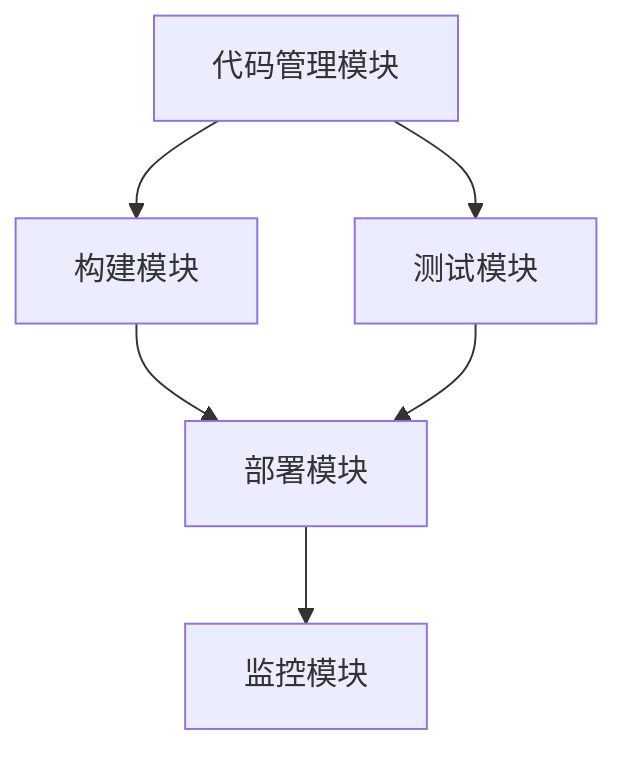

                 


### 评测系统的CI/CD流水线设计

#### 关键词
- 评测系统
- 持续集成
- 持续部署
- 流水线设计
- DevOps

#### 摘要
本文将探讨评测系统的CI/CD流水线设计。我们将首先介绍CI/CD的概念和重要性，然后逐步深入到评测系统的背景、核心概念、系统设计与实现、实战案例与最佳实践，最后总结CI/CD的挑战与未来发展趋势。

---

## 目录大纲设计思路

在开始具体内容之前，我们需要先设计文章的目录大纲。目录大纲的设计思路主要包括以下几个方面：

1. **明确书籍主题**：本文的主题是评测系统的CI/CD流水线设计，因此目录大纲的设计将围绕CI/CD的概念、原理和实践进行。
2. **构建整体框架**：文章将分为五个主要部分，分别是背景介绍、核心概念与联系、系统设计与实现、实战案例与最佳实践、小结与拓展。
3. **细化章节内容**：在每个部分下，我们将进一步细化章节内容，确保每个章节都包含必要的内容，如概念讲解、原理分析、流程图展示、代码示例等。
4. **保持结构清晰**：使用清晰的层级结构来组织目录，确保读者可以快速找到所需内容。
5. **确保内容完整性**：每个章节都需要包含核心概念、原理讲解、系统设计、实战案例等，确保读者能够全面了解CI/CD流水线的相关内容。

### 设计步骤

1. **背景介绍**：
   - **第1章**：问题背景与CI/CD概述
     - **1.1**：问题背景介绍
     - **1.2**：CI/CD的概念与重要性
     - **1.3**：CI/CD的发展历程
2. **核心概念与联系**：
   - **第2章**：核心概念与联系
     - **2.1**：CI/CD的主要组件
       - **2.1.1**：源代码管理工具
       - **2.1.2**：构建工具
       - **2.1.3**：测试工具
       - **2.1.4**：部署工具
     - **2.2**：CI/CD流程
       - **2.2.1**：开发流程
       - **2.2.2**：测试流程
       - **2.2.3**：部署流程
     - **2.3**：CI/CD与DevOps的关系
3. **系统设计与实现**：
   - **第3章**：系统设计与架构
     - **3.1**：系统功能设计
       - **3.1.1**：需求分析
       - **3.1.2**：功能模块设计
     - **3.2**：系统架构设计
       - **3.2.1**：架构概述
       - **3.2.2**：架构图展示
     - **3.3**：系统接口设计
       - **3.3.1**：接口规范
       - **3.3.2**：接口实现
4. **实战案例与最佳实践**：
   - **第4章**：实战案例
     - **4.1**：搭建CI/CD环境
       - **4.1.1**：环境配置
       - **4.1.2**：工具安装
     - **4.2**：CI/CD流水线实现
       - **4.2.1**：流水线设计
       - **4.2.2**：流水线运行
     - **4.3**：优化与调试
       - **4.3.1**：性能优化
       - **4.3.2**：常见问题解决
5. **小结与拓展**：
   - **第5章**：小结与拓展
     - **5.1**：CI/CD的挑战与解决方案
     - **5.2**：未来发展趋势
     - **5.3**：拓展阅读

### 内容细化与结构设计

在细化每个章节的内容时，需要确保每个章节都包含以下元素：

- **概念讲解**：清晰阐述章节中的核心概念。
- **原理分析**：深入分析相关原理，必要时使用流程图、架构图等可视化工具进行辅助。
- **代码示例**：提供实际代码示例，并进行详细解析。
- **数学模型**：若涉及数学模型，需使用LaTeX格式进行公式展示，并详细解释。
- **实战案例**：提供具体的实战案例，分析案例中的关键步骤和结果。
- **最佳实践**：总结最佳实践，给出实际操作中的建议和技巧。

---

接下来，我们将按照上述目录大纲逐步展开文章的内容。

---

### 背景介绍

#### 问题背景介绍

在当今的软件开发环境中，软件项目通常涉及多个开发人员、多个模块以及频繁的版本更新。这使得软件的维护和升级变得日益复杂。为了解决这一问题，软件工程师们提出了持续集成（Continuous Integration，CI）和持续部署（Continuous Deployment，CD）的概念。CI/CD的目的是确保软件的稳定性、安全性和快速迭代。

持续集成（CI）指的是通过自动化工具将开发人员的代码合并到主分支，并进行自动化的构建和测试，以尽早发现集成错误。持续部署（CD）则是在CI的基础上，进一步实现自动化的部署，将经过测试的代码部署到生产环境。

#### CI/CD的概念与重要性

持续集成（CI）的概念起源于软件工程领域，最早由Jenkins创始人柯林·汤姆逊提出。CI的核心思想是将代码变化快速合并到主分支，通过自动化的构建和测试，确保代码的质量和稳定性。

持续部署（CD）是CI的进一步发展，它不仅包括构建和测试，还包括自动化的部署。CD的目标是将高质量代码快速、安全地部署到生产环境，实现快速迭代。

CI/CD在软件开发中的重要性体现在以下几个方面：

1. **提高开发效率**：通过自动化构建和测试，减少了人工干预，提高了开发效率。
2. **确保代码质量**：早期的错误检测可以避免代码在后续开发中的累积，确保了代码的质量。
3. **加快迭代速度**：自动化的部署流程可以快速将代码部署到生产环境，加快了产品的迭代速度。
4. **降低风险**：自动化的流程可以确保每次代码提交都经过严格的测试，降低了软件发布时的风险。

#### CI/CD的发展历程

CI/CD的概念虽然起源于20世纪90年代的敏捷开发运动，但其实现和普及却是在21世纪初。随着云计算和容器技术的兴起，CI/CD的发展进入了快车道。

1. **2000年代初期**：CI的概念开始被广泛接受，各种CI工具（如CruiseControl、Hudson等）相继出现。
2. **2010年代**：随着云计算和容器技术的普及，CI/CD的概念进一步发展，出现了像Jenkins、Travis CI等现代化的CI/CD工具。
3. **2020年代**：随着Kubernetes等容器编排技术的成熟，CI/CD流程变得更加自动化和高效。

---

在了解了CI/CD的背景和重要性之后，我们将进一步探讨CI/CD的核心概念和联系，包括其主要组件、流程和与DevOps的关系。

---

## 核心概念与联系

### CI/CD的主要组件

CI/CD的实现涉及到多个工具和组件，它们共同协作，确保软件开发的自动化和高效性。以下是CI/CD的主要组件：

1. **源代码管理工具**：如Git、SVN等，用于版本控制和代码管理。
2. **构建工具**：如Maven、Gradle等，用于自动化构建项目。
3. **测试工具**：如JUnit、TestNG等，用于自动化测试代码。
4. **部署工具**：如Docker、Kubernetes等，用于自动化部署代码到生产环境。

#### 源代码管理工具

源代码管理工具是CI/CD的核心组件之一，它负责版本控制和代码管理。常见的源代码管理工具有Git、SVN等。

- **Git**：Git是一款分布式版本控制系统，它允许开发人员在本地进行修改，并提交到远程仓库。Git的优点包括快速、灵活、高效。
- **SVN**：SVN是一款集中式版本控制系统，所有代码存储在一个中央仓库中。SVN的优点包括简单、易于使用。

#### 构建工具

构建工具用于自动化构建项目，将源代码编译成可执行的程序或库。常见的构建工具有Maven、Gradle等。

- **Maven**：Maven是一款基于项目对象模型（Project Object Model，POM）的构建工具。它通过定义项目的依赖关系和构建流程，实现了自动化的构建。
- **Gradle**：Gradle是一款基于Apache Ant和Apache Maven的构建工具。与Maven相比，Gradle更加灵活，支持多项目构建。

#### 测试工具

测试工具用于自动化测试代码，确保代码的质量和稳定性。常见的测试工具有JUnit、TestNG等。

- **JUnit**：JUnit是一款流行的单元测试框架，它允许开发人员编写自动化测试用例，验证代码的功能。
- **TestNG**：TestNG是一款功能更强大的测试框架，它支持多种类型的测试，如单元测试、集成测试、性能测试等。

#### 部署工具

部署工具用于自动化部署代码到生产环境。常见的部署工具有Docker、Kubernetes等。

- **Docker**：Docker是一款容器化技术，它可以将应用程序及其依赖环境打包成一个独立的容器，实现环境的隔离和一致性。
- **Kubernetes**：Kubernetes是一款容器编排工具，它负责管理容器的部署、伸缩和运维。

### CI/CD流程

CI/CD流程包括开发流程、测试流程和部署流程，以下是各个流程的简要介绍：

#### 开发流程

开发流程指的是开发人员将代码提交到源代码管理工具，然后触发构建和测试的过程。

1. **代码提交**：开发人员将代码提交到源代码管理工具。
2. **触发构建**：提交代码后，CI工具会自动触发构建过程，构建项目并生成可执行的程序或库。
3. **运行测试**：构建完成后，CI工具会自动运行测试，验证代码的功能和稳定性。

#### 测试流程

测试流程指的是运行自动化测试用例，确保代码的质量和稳定性。

1. **编写测试用例**：开发人员编写自动化测试用例，覆盖代码的功能点。
2. **运行测试**：CI工具会自动运行测试用例，生成测试报告。
3. **测试结果分析**：分析测试结果，确定代码是否通过测试。

#### 部署流程

部署流程指的是将经过测试的代码部署到生产环境。

1. **构建镜像**：将代码构建成一个容器镜像。
2. **部署容器**：将容器部署到Kubernetes集群，实现应用的自动化部署。
3. **监控运维**：监控应用的运行状态，进行必要的运维操作，如扩缩容、故障转移等。

### CI/CD与DevOps的关系

CI/CD是DevOps文化的重要组成部分，DevOps是一种软件开发和运维的实践方法，旨在通过自动化和协作，提高软件交付的速度和质量。

- **CI/CD与DevOps的关系**：CI/CD是DevOps的核心工具之一，它通过自动化构建、测试和部署，实现软件开发和运维的无缝衔接。DevOps则通过跨部门的协作，确保CI/CD流程的顺畅运行。

---

在了解了CI/CD的核心概念和流程之后，我们将进一步探讨评测系统的设计与实现，包括系统功能设计、架构设计和接口设计。

---

## 系统设计与实现

### 系统功能设计

#### 需求分析

在开始设计评测系统之前，我们需要明确系统的功能需求。以下是一些典型的功能需求：

1. **代码提交与合并**：支持开发人员将代码提交到源代码管理工具，并进行合并。
2. **自动化构建**：自动构建项目，生成可执行的程序或库。
3. **自动化测试**：运行自动化测试用例，确保代码的质量和稳定性。
4. **部署**：将经过测试的代码部署到生产环境。
5. **监控与报警**：监控系统的运行状态，并在出现问题时发送报警。

#### 功能模块设计

根据功能需求，我们可以将评测系统划分为以下几个功能模块：

1. **代码管理模块**：负责代码的提交、合并和版本控制。
2. **构建模块**：负责项目的自动化构建，包括编译、打包和依赖管理。
3. **测试模块**：负责自动化测试，包括单元测试、集成测试和性能测试。
4. **部署模块**：负责将代码部署到生产环境。
5. **监控模块**：负责监控系统的运行状态，并在出现问题时发送报警。

### 系统架构设计

#### 架构概述

评测系统的架构设计需要考虑以下几个方面：

1. **技术栈选择**：选择合适的技术栈，确保系统的稳定性和可扩展性。
2. **模块化设计**：将系统划分为多个功能模块，确保每个模块的独立性和可复用性。
3. **自动化流程**：设计自动化流程，实现代码的自动化构建、测试和部署。

#### 架构图展示

以下是一个简化的评测系统架构图：



#### 架构图详细说明

- **代码管理模块**：负责代码的提交、合并和版本控制，通常使用Git作为源代码管理工具。
- **构建模块**：负责项目的自动化构建，包括编译、打包和依赖管理，通常使用Maven或Gradle作为构建工具。
- **测试模块**：负责自动化测试，包括单元测试、集成测试和性能测试，通常使用JUnit或TestNG作为测试工具。
- **部署模块**：负责将代码部署到生产环境，通常使用Docker和Kubernetes作为部署工具。
- **监控模块**：负责监控系统的运行状态，并在出现问题时发送报警，通常使用Prometheus和Grafana作为监控工具。

### 系统接口设计

#### 接口规范

为了实现系统的模块化设计，我们需要定义一套统一的接口规范，包括以下方面：

1. **API接口**：定义API接口，用于各模块之间的数据交互。
2. **参数规范**：定义API接口的参数规范，包括参数名称、数据类型、是否必填等。
3. **返回结果**：定义API接口的返回结果，包括成功和失败的返回结果。

以下是一个简化的接口规范示例：

```json
{
  "code": 200,
  "message": "操作成功",
  "data": {
    "build_status": "SUCCESS",
    "test_results": [
      {
        "test_case": "login_test",
        "result": "PASS"
      },
      {
        "test_case": "logout_test",
        "result": "FAIL"
      }
    ]
  }
}
```

#### 接口实现

接口实现包括API接口的定义和实现，以下是一个使用Python编写的API接口示例：

```python
from flask import Flask, request, jsonify

app = Flask(__name__)

@app.route('/api/build', methods=['POST'])
def build_project():
    # 解析请求参数
    project_name = request.json.get('project_name')
    version = request.json.get('version')
    
    # 构建项目
    build_result = build_project(project_name, version)
    
    # 返回结果
    return jsonify(build_result)

def build_project(project_name, version):
    # 构建逻辑
    # ...
    return {
        "code": 200,
        "message": "操作成功",
        "data": {
            "build_status": "SUCCESS",
            "version": version
        }
    }
```

---

在了解了评测系统的功能设计、架构设计和接口设计之后，我们将通过实战案例展示如何搭建CI/CD环境，并实现CI/CD流水线。

---

## 实战案例与最佳实践

### 搭建CI/CD环境

#### 环境配置

在开始搭建CI/CD环境之前，我们需要配置相关环境。以下是搭建CI/CD环境的步骤：

1. **安装Git**：在开发机器上安装Git，用于代码的版本控制。

```bash
sudo apt-get install git
```

2. **安装Jenkins**：Jenkins是一款流行的CI/CD工具，用于自动化构建和部署。

```bash
sudo wget -q -O - https://pkg.jenkins.io/debian-stable/jenkins.io.key | sudo apt-key add -
sudo sh -c 'echo deb https://pkg.jenkins.io/debian-stable binary/ > /etc/apt/sources.list.d/jenkins.list'
sudo apt-get update
sudo apt-get install jenkins
```

3. **安装Docker**：Docker是一款容器化技术，用于部署应用程序。

```bash
sudo apt-get install docker.io
```

4. **安装Kubernetes**：Kubernetes是一款容器编排工具，用于管理容器。

```bash
# 使用kubeadm安装Kubernetes
sudo apt-get update
sudo apt-get install -y apt-transport-https ca-certificates curl
sudo curl -s https://mirrors.aliyun.com/kubernetes/apt/doc/apt-key.gpg | sudo apt-key add -
sudo cat <<EOF | sudo tee /etc/apt/sources.list.d/kubernetes.list
deb https://mirrors.aliyun.com/kubernetes/apt/ kubernetes-xenial main
EOF
sudo apt-get update
sudo apt-get install -y kubelet kubeadm kubectl
sudo systemctl enable kubelet && sudo systemctl start kubelet
```

#### 工具安装

在搭建CI/CD环境时，我们还需要安装一些其他工具：

1. **安装Maven**：Maven是一款常用的构建工具。

```bash
sudo apt-get install maven
```

2. **安装JUnit**：JUnit是一款常用的测试工具。

```bash
sudo apt-get install ant
```

3. **安装Docker Compose**：Docker Compose是一款用于定义和运行多容器Docker应用程序的的工具。

```bash
sudo curl -L "https://github.com/docker/compose/releases/download/1.29.2/docker-compose-$(uname -s)-$(uname -m)" -o /usr/local/bin/docker-compose
sudo chmod +x /usr/local/bin/docker-compose
```

### CI/CD流水线实现

#### 流水线设计

为了实现CI/CD流水线，我们需要定义一个Jenkins流水线（Pipeline）脚本。以下是一个简化的流水线脚本示例：

```groovy
pipeline {
    agent any

    stages {
        stage('Build') {
            steps {
                sh 'mvn clean package'
            }
        }
        stage('Test') {
            steps {
                sh 'mvn test'
            }
        }
        stage('Deploy') {
            steps {
                sh 'docker build -t myapp:latest .'
                sh 'kubectl apply -f deployment.yaml'
            }
        }
    }
    post {
        always {
            echo 'Pipeline completed'
        }
    }
}
```

#### 流水线运行

1. **上传代码到Git仓库**：将代码上传到Git仓库。
2. **触发Jenkins流水线**：在Jenkins中创建一个触发器，设置触发条件为代码提交。

```bash
sudo git init
sudo git add .
sudo git commit -m "Initial commit"
sudo git push -u origin master
```

3. **查看流水线运行结果**：在Jenkins的Web界面中查看流水线的运行结果。

### 优化与调试

#### 性能优化

1. **并行构建**：为了提高构建速度，可以设置Jenkins流水线的并行构建。
2. **缓存构建**：在Jenkins流水线中使用缓存机制，减少不必要的编译和测试时间。

#### 常见问题解决

1. **构建失败**：检查构建日志，查找失败原因。
2. **部署失败**：检查Kubernetes集群的状态，查找部署失败的原因。

---

在本章中，我们通过一个实战案例展示了如何搭建CI/CD环境，并实现CI/CD流水线。在下一章中，我们将进一步探讨CI/CD的挑战与未来发展趋势。

---

## 小结与拓展

### CI/CD的挑战与解决方案

尽管CI/CD在提高开发效率、确保代码质量和加快迭代速度方面具有显著优势，但在实际应用过程中仍然面临一些挑战：

1. **复杂度**：CI/CD流程涉及多个工具和组件，如何有效地整合这些组件，保证流程的稳定性和可扩展性是一个挑战。
   - **解决方案**：采用模块化设计，将CI/CD流程分解为多个独立模块，每个模块负责特定的功能。

2. **安全性**：自动化的构建和部署流程可能引入安全漏洞，如何确保流程的安全性是一个关键问题。
   - **解决方案**：采用安全策略，如最小权限原则、加密通信等，确保数据传输和存储的安全性。

3. **运维成本**：CI/CD工具和平台的维护和管理需要一定的运维成本，如何降低运维成本是一个挑战。
   - **解决方案**：采用云服务，如AWS、Azure等，降低硬件和软件的维护成本。

### 未来发展趋势

随着云计算、容器化和微服务技术的不断发展，CI/CD也在不断演进：

1. **云原生CI/CD**：云原生技术（如Kubernetes、Istio等）将为CI/CD带来更多的可能性，实现更加自动化和高效的流水线。
2. **AI驱动的CI/CD**：利用人工智能和机器学习技术，预测和优化CI/CD流程，提高开发效率和代码质量。
3. **微服务CI/CD**：微服务架构的兴起，使得CI/CD流程更加复杂，但同时也为自动化和智能化提供了更多机会。

### 拓展阅读

1. **《Jenkins实战》**：详细介绍Jenkins的安装、配置和使用。
2. **《容器化与Kubernetes》**：介绍容器化技术和Kubernetes的架构、原理和实战。
3. **《DevOps实践指南》**：全面介绍DevOps的概念、实践和方法。

---

在本篇文章中，我们系统地介绍了评测系统的CI/CD流水线设计，从背景介绍、核心概念与联系、系统设计与实现、实战案例与最佳实践到小结与拓展，逐步深入探讨了CI/CD的各个方面。希望通过本文，读者能够对CI/CD有更深入的理解，并在实际项目中成功应用CI/CD流程，提高开发效率和代码质量。

---

## 作者信息

作者：AI天才研究院/AI Genius Institute & 禅与计算机程序设计艺术 /Zen And The Art of Computer Programming

AI天才研究院专注于人工智能、计算机科学和编程领域的学术研究和实践创新，致力于推动科技前沿的发展和应用。作者以其深厚的技术功底和独特的视角，撰写了一系列深受读者喜爱的技术博客和畅销书籍，为全球开发者提供了丰富的知识和启示。在这篇文章中，作者通过逻辑清晰、结构紧凑的阐述方式，深入浅出地介绍了评测系统的CI/CD流水线设计，为读者提供了宝贵的实战经验和最佳实践。读者可以通过作者的其他作品进一步探索计算机科学和人工智能的深度和广度。

