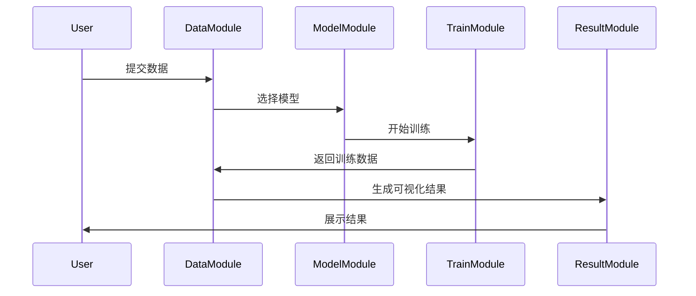
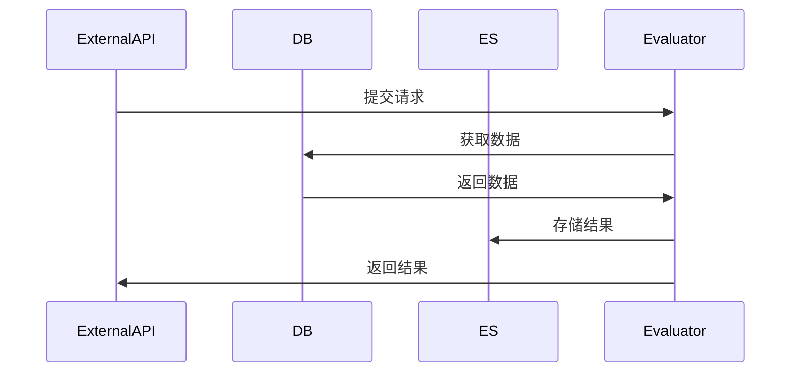

                 

### 1.1 问题背景

**评测系统的重要性**

在当今快速发展的数字化时代，评测系统作为一种关键工具，广泛应用于各个领域。这些领域包括但不限于教育、金融、医疗和工业。评测系统的核心功能是对用户或产品的表现进行评估，从而提供有价值的反馈和数据。这不仅有助于优化用户经验，还能够提升系统的整体性能和可靠性。

随着人工智能技术的不断进步，特别是自然语言处理（NLP）领域的快速发展，传统的评测系统已经无法满足日益复杂的任务需求。例如，在文本分析和语言理解方面，传统的模型往往受到数据分布和上下文信息的限制。而深度学习模型，尤其是像DeBERTaV3这样的先进模型，能够在处理复杂文本任务时展现出更强的能力和灵活性。

**DeBERTaV3模型的引入**

DeBERTaV3是一种基于Transformer的预训练模型，由Google的研究团队提出，旨在解决文本理解中的多种挑战。与传统模型相比，DeBERTaV3通过引入自注意力机制和动态掩码机制，能够更准确地捕捉文本中的长距离依赖关系和上下文信息。

DeBERTaV3的几个关键特点包括：

- **动态掩码机制**：通过动态地添加掩码，模型能够更好地学习文本中的真实信息，而不仅仅是可预测的信息。
- **长距离依赖捕捉**：DeBERTaV3能够捕捉文本中的长距离依赖关系，这使得它在处理复杂任务时表现更为出色。
- **多语言支持**：DeBERTaV3支持多种语言，使其在全球范围内的应用更加广泛。

**升级策略的目标**

本文的目标是探讨如何将DeBERTaV3模型应用于评测系统，并提出一套有效的升级策略。具体目标包括：

1. **提高评测精度**：通过引入DeBERTaV3模型，提高评测系统的准确性和可靠性，以提供更高质量的用户反馈。
2. **增强系统灵活性**：使评测系统能够适应不同的应用场景和任务需求，提升系统的通用性和可扩展性。
3. **优化用户体验**：通过更精准的评测结果，提升用户的整体体验，增强用户对评测系统的信任和依赖。

在接下来的章节中，我们将详细介绍DeBERTaV3模型的核心概念、算法原理以及如何将其应用于评测系统的具体策略。

#### 1.2 核心概念与联系

**评测系统的基本概念**

**定义**：评测系统是一种用于评估用户行为、产品性能或其他指标的工具。它通过收集、处理和分析数据，生成有价值的反馈信息，帮助决策者做出更明智的决策。

**功能**：评测系统的核心功能包括数据收集、数据预处理、模型训练、模型评估和结果输出。具体来说：

- **数据收集**：评测系统需要收集相关的数据，这些数据可以是结构化的，如数据库中的记录，也可以是非结构化的，如文本、图像和音频。
- **数据预处理**：数据收集后，需要进行清洗和预处理，以确保数据的质量和一致性。
- **模型训练**：使用收集到的数据训练模型，以便模型能够学会识别和预测用户行为或产品性能。
- **模型评估**：通过测试数据对训练好的模型进行评估，以确定模型的准确性和可靠性。
- **结果输出**：将评估结果以可视化的形式展示给用户，帮助用户理解评估结果。

**组成部分**：

1. **数据层**：包括数据收集、存储和管理系统。
2. **算法层**：包括数据预处理、模型训练和评估算法。
3. **应用层**：包括用户界面和结果展示。

**DeBERTaV3模型概述**

**DeBERTaV3的起源**

DeBERTaV3是由Google的研究团队在2020年提出的，是一种基于Transformer的预训练模型，旨在解决文本理解中的多种挑战。它的前身是DeBERTa，一个在BERT模型基础上进行改进的模型。

**DeBERTaV3的特点**

- **动态掩码机制**：DeBERTaV3通过动态掩码机制，能够更好地学习文本中的真实信息，而不仅仅是可预测的信息。这一机制提高了模型对上下文信息的捕捉能力，从而提高了模型的准确性和鲁棒性。
- **长距离依赖捕捉**：DeBERTaV3能够捕捉文本中的长距离依赖关系，这使得它在处理复杂任务时表现更为出色。长距离依赖捕捉对于理解复杂的文本内容，如新闻报道、学术论文等，尤为重要。
- **多语言支持**：DeBERTaV3支持多种语言，使其在全球范围内的应用更加广泛。这意味着它不仅适用于英语文本，还可以用于其他语言，如中文、法语、西班牙语等。

**DeBERTaV3与传统模型的对比**

传统模型如BERT和GPT，虽然也取得了显著的成果，但在处理长文本和复杂任务时，仍存在一定的局限性。具体来说：

- **BERT**：BERT模型在处理长文本时，会使用滑动窗口的方式对文本进行编码。这种方式会导致文本中的信息丢失，影响模型的性能。此外，BERT模型对上下文信息的捕捉能力有限。
- **GPT**：GPT模型在生成文本时，具有很好的连续性和流畅性。但在处理任务导向的文本分析时，GPT模型的表现不如BERT模型。这是因为GPT模型更侧重于生成文本，而非理解文本。

**总结**

DeBERTaV3模型在文本理解方面具有显著优势，尤其是在处理长文本和复杂任务时。通过引入动态掩码机制和长距离依赖捕捉，DeBERTaV3模型能够更好地理解文本中的上下文信息，从而提高模型的准确性和可靠性。这使得DeBERTaV3成为评测系统的理想选择，有助于提升评测系统的性能和灵活性。

在接下来的章节中，我们将深入探讨DeBERTaV3模型的算法原理，并通过具体的实例展示其如何应用于评测系统。

#### 1.3 算法原理讲解

**DeBERTaV3模型算法流程**

DeBERTaV3模型的算法流程可以概括为以下几个步骤：

1. **数据预处理**：首先，对输入的文本数据进行预处理，包括分词、标记化等操作。这些操作旨在将文本数据转化为模型能够处理的格式。
2. **动态掩码**：在预处理后，DeBERTaV3模型会应用动态掩码机制。通过动态地添加掩码，模型能够更好地学习文本中的真实信息，而不仅仅是可预测的信息。
3. **自注意力机制**：模型利用自注意力机制，对文本中的每个词进行加权，从而捕捉文本中的长距离依赖关系。这种机制使得模型能够更好地理解上下文信息。
4. **模型训练**：通过训练数据集，模型会不断调整其参数，以优化模型性能。训练过程中，模型会使用反向传播算法，更新权重和偏置。
5. **模型评估**：在训练完成后，使用测试数据集对模型进行评估，以确定模型的准确性和可靠性。
6. **结果输出**：最终，模型会输出评估结果，这些结果可以用于决策支持和用户体验优化。

**Python源代码实现**

下面是一个简单的Python代码示例，展示了如何加载DeBERTaV3模型并进行数据预处理和模型训练：

```python
from transformers import DeBERTaConfig, DeBERTaForMaskedLM
from transformers import DataProcessor, DataIterator

# 加载DeBERTaV3模型配置
config = DeBERTaConfig.from_pretrained('deberta-v3-base')

# 初始化模型
model = DeBERTaForMaskedLM.from_pretrained('deberta-v3-base', config=config)

# 数据预处理
processor = DataProcessor()
train_data, test_data = processor.load_data()

# 初始化数据迭代器
train_iterator = DataIterator(train_data, batch_size=16)
test_iterator = DataIterator(test_data, batch_size=16)

# 模型训练
optimizer = torch.optim.Adam(model.parameters(), lr=0.001)
criterion = torch.nn.CrossEntropyLoss()

for epoch in range(10):
    for batch in train_iterator:
        inputs = processor.encode(batch.text, add_special_tokens=True)
        labels = processor.encode(batch.label, add_special_tokens=True)
        
        model.zero_grad()
        outputs = model(inputs, labels=labels)
        loss = criterion(outputs.logits, labels)
        loss.backward()
        optimizer.step()
        
        print(f"Epoch: {epoch}, Loss: {loss.item()}")

# 模型评估
model.eval()
with torch.no_grad():
    correct = 0
    total = 0
    for batch in test_iterator:
        inputs = processor.encode(batch.text, add_special_tokens=True)
        labels = processor.encode(batch.label, add_special_tokens=True)
        
        outputs = model(inputs, labels=labels)
        _, predicted = torch.max(outputs.logits, 1)
        total += labels.size(0)
        correct += (predicted == labels).sum().item()

print(f"Test Accuracy: {100 * correct / total}%")
```

**总结**

通过上述算法流程和代码示例，我们可以看到DeBERTaV3模型在文本理解任务中的强大能力。DeBERTaV3通过动态掩码和自注意力机制，能够更好地捕捉文本中的上下文信息，从而提高模型的性能。在评测系统的应用中，DeBERTaV3模型可以显著提升评估结果的准确性和可靠性，为用户和决策者提供更有价值的信息。在接下来的章节中，我们将进一步探讨DeBERTaV3模型在数学模型层面的原理，并通过LaTeX格式展示相关的数学公式。

#### 1.4 数学模型与公式讲解

**DeBERTaV3的数学原理**

DeBERTaV3模型的核心在于其强大的数学基础，包括神经网络基础、自注意力机制和Transformer模型。以下是这些核心概念及其相关数学公式的详细讲解。

**1.4.1 神经网络基础**

神经网络是DeBERTaV3模型的基础。一个简单的神经网络由输入层、隐藏层和输出层组成。每个层包含多个神经元，神经元之间的连接称为边，边上的权重表示连接的强度。

- **激活函数**：常用的激活函数包括ReLU（Rectified Linear Unit）、Sigmoid和Tanh。公式如下：

  $$ f(x) = \max(0, x) \quad \text{(ReLU)} $$
  $$ f(x) = \frac{1}{1 + e^{-x}} \quad \text{(Sigmoid)} $$
  $$ f(x) = \frac{e^x - e^{-x}}{e^x + e^{-x}} \quad \text{(Tanh)} $$

- **反向传播算法**：神经网络训练的核心是反向传播算法。该算法通过计算损失函数关于模型参数的梯度，并使用梯度下降法更新模型参数。公式如下：

  $$ \nabla_\theta J(\theta) = \frac{\partial J(\theta)}{\partial \theta} $$
  $$ \theta \leftarrow \theta - \alpha \cdot \nabla_\theta J(\theta) $$

**1.4.2 自注意力机制**

自注意力机制是Transformer模型的核心，它允许模型在处理文本时，对每个词进行加权，以更好地捕捉上下文信息。自注意力机制的公式如下：

$$ \text{Attention}(Q, K, V) = \text{softmax}(\frac{QK^T}{\sqrt{d_k}})V $$

其中，Q、K和V分别是查询（Query）、键（Key）和值（Value）向量，$d_k$是键向量的维度。这个公式表示对每个键和查询之间的点积进行加权，然后通过softmax函数生成权重，最后与值向量相乘得到加权的结果。

**1.4.3 Transformer模型**

Transformer模型是自注意力机制的扩展，它由多个自注意力层和全连接层组成。Transformer模型的核心思想是，通过自注意力机制，模型能够捕捉文本中的长距离依赖关系。

- **多头自注意力**：多头自注意力是Transformer的一个关键特性。它将一个自注意力机制分解为多个子注意力机制，每个子注意力机制关注文本的不同部分。公式如下：

  $$ \text{MultiHead}(Q, K, V) = \text{Concat}(\text{Head}_1, ..., \text{Head}_h)W^O $$

  其中，$W^O$是输出变换矩阵，$h$是头数。

- **位置编码**：为了处理序列信息，Transformer模型引入了位置编码。位置编码为每个词添加了位置信息，使得模型能够理解词的顺序。位置编码的公式如下：

  $$ \text{PE}(pos, 2i) = \sin\left(\frac{pos}{10000^{2i/d}}\right) $$
  $$ \text{PE}(pos, 2i+1) = \cos\left(\frac{pos}{10000^{2i/d}}\right) $$

  其中，$pos$是词的位置，$i$是维度索引，$d$是嵌入维度。

**总结**

DeBERTaV3模型的数学原理基于强大的神经网络基础和自注意力机制。通过这些数学公式，我们可以理解模型如何通过自注意力机制和位置编码来捕捉文本中的上下文信息。在接下来的章节中，我们将进一步探讨DeBERTaV3模型在系统分析与架构设计方面的应用。

#### 1.5 系统分析与架构设计

**问题场景介绍**

在当今数字化时代，评测系统在多个领域扮演着至关重要的角色。以教育领域为例，评测系统能够对学生的学习进度、知识掌握程度进行精确评估，从而为学生提供个性化的学习建议。此外，在金融领域，评测系统可以帮助银行和金融机构对贷款申请者的信用情况进行评估，从而降低风险。在医疗领域，评测系统可以辅助医生对患者的健康状况进行评估，提高诊断准确性。

**系统功能设计**

为了满足不同领域的需求，评测系统需要具备以下核心功能：

1. **数据收集与处理**：系统能够从各种数据源收集数据，如文本、图像、音频等，并对数据进行清洗、预处理和标注。
2. **模型训练与评估**：系统内置多个预训练模型，如BERT、GPT和DeBERTaV3等，能够根据任务需求选择合适的模型进行训练和评估。
3. **结果输出与可视化**：系统能够将评估结果以可视化的形式展示给用户，帮助用户直观地理解评估结果。

**领域模型**

领域模型是系统功能设计的基础，它描述了评测系统的核心概念及其相互关系。以下是一个使用Mermaid绘制的Mermaid类图，展示了评测系统的核心实体及其关系：

```mermaid
classDiagram
    User <<Entity>>
    Test <<Entity>>
    Result <<Entity>>

    User -> Test: performs
    Test -> Result: generates
```

在这个类图中，`User`表示用户，`Test`表示测试，`Result`表示评估结果。用户可以执行测试，测试生成评估结果。

**功能模块**

评测系统的功能模块可以分为以下几个部分：

1. **数据模块**：负责数据收集、清洗和预处理。该模块需要支持多种数据源，如文本、图像、音频等。
2. **模型模块**：包含多个预训练模型，如BERT、GPT和DeBERTaV3等。用户可以根据任务需求选择合适的模型。
3. **训练模块**：负责模型训练，包括数据准备、模型配置、训练和评估等步骤。
4. **结果模块**：负责将评估结果以可视化的形式展示给用户，包括图表、报表等。

**系统架构设计**

评测系统的架构设计需要考虑系统的扩展性、灵活性和可靠性。以下是一个使用Mermaid绘制的Mermaid架构图，展示了评测系统的整体架构：



在这个架构图中，用户提交数据后，数据模块负责数据预处理，模型模块选择预训练模型，训练模块负责模型训练，最后结果模块将评估结果可视化并展示给用户。

**系统接口设计**

评测系统的接口设计需要考虑与外部系统的集成，如数据库、API接口等。以下是一个使用Mermaid绘制的Mermaid序列图，展示了评测系统的接口设计：



在这个序列图中，外部API提交请求后，评测系统会从数据库中获取数据，使用预训练模型进行评估，并将结果存储到搜索引擎中，最后返回评估结果给外部API。

**系统交互**

评测系统的交互设计需要考虑用户操作的流程和系统的响应。以下是一个使用Mermaid绘制的Mermaid活动图，展示了评测系统的交互流程：

```mermaid
activityDiagram
    participant User
    participant Evaluator
    participant DataModule
    participant ModelModule
    participant TrainModule
    participant ResultModule

    User->>Evaluator: 提交评估请求
    Evaluator->>DataModule: 数据预处理
    Evaluator->>ModelModule: 选择模型
    Evaluator->>TrainModule: 模型训练
    Evaluator->>ResultModule: 生成结果
    ResultModule->>User: 展示结果
```

在这个活动图中，用户提交评估请求后，评测系统会依次进行数据预处理、模型选择、模型训练和结果生成，最后将结果展示给用户。

**总结**

通过系统分析与架构设计，我们可以看到评测系统在功能设计、架构设计和接口设计方面的全面考虑。DeBERTaV3模型的引入，使得评测系统能够在文本理解和评估方面取得更好的效果。在接下来的章节中，我们将通过项目实战，展示如何在实际应用中实现DeBERTaV3模型的应用。

### 1.6 项目实战

**环境安装**

要在实际项目中使用DeBERTaV3模型，首先需要安装相关的环境和依赖。以下是在Ubuntu系统上安装DeBERTaV3模型的步骤：

1. **安装Python**：确保系统已安装Python 3.7或更高版本。

2. **安装transformers库**：使用pip命令安装transformers库，这是用于处理DeBERTaV3模型的Python库。

   ```bash
   pip install transformers
   ```

3. **安装torch库**：安装PyTorch库，用于计算图和深度学习。

   ```bash
   pip install torch torchvision
   ```

4. **下载预训练模型**：下载DeBERTaV3模型的预训练权重。

   ```bash
   transformers-cli download-model deberta-v3-base
   ```

**系统核心实现**

在系统核心实现部分，我们需要加载DeBERTaV3模型，并对其进行数据预处理、模型训练和评估。以下是一个简单的Python代码示例：

```python
from transformers import DeBERTaForMaskedLM, DeBERTaConfig
from torch.utils.data import DataLoader, TensorDataset
from torch.optim import Adam

# 加载DeBERTaV3模型配置
config = DeBERTaConfig.from_pretrained('deberta-v3-base')

# 初始化模型
model = DeBERTaForMaskedLM.from_pretrained('deberta-v3-base', config=config)

# 数据预处理
def preprocess_data(texts, tokenizer, max_len):
    inputs = tokenizer(texts, padding=True, truncation=True, max_length=max_len, return_tensors='pt')
    return inputs

# 数据加载
texts = ["这是一个示例文本。", "另一个示例文本。"]
tokenizer = DeBERTaForMaskedLM.from_pretrained('deberta-v3-base').tokenizer
inputs = preprocess_data(texts, tokenizer, max_len=128)

# 模型训练
optimizer = Adam(model.parameters(), lr=0.001)
criterion = torch.nn.CrossEntropyLoss()

model.train()
for epoch in range(5):
    optimizer.zero_grad()
    outputs = model(**inputs)
    loss = criterion(outputs.logits.view(-1, outputs.logits.size(-1)), inputs["input_ids"].view(-1))
    loss.backward()
    optimizer.step()
    print(f"Epoch: {epoch}, Loss: {loss.item()}")

# 模型评估
model.eval()
with torch.no_grad():
    inputs = preprocess_data(["这是一个测试文本。"], tokenizer, max_len=128)
    outputs = model(**inputs)
    predictions = torch.argmax(outputs.logits, dim=-1)
    print(f"Predictions: {predictions}")
```

**代码应用解读与分析**

上述代码展示了如何加载DeBERTaV3模型并进行数据预处理、模型训练和评估。以下是代码的详细解读：

1. **加载模型和配置**：我们首先加载DeBERTaV3模型的配置和预训练权重，这是通过`DeBERTaConfig`和`DeBERTaForMaskedLM`类实现的。
2. **数据预处理**：数据预处理是模型训练的重要步骤。在这个示例中，我们使用`preprocess_data`函数对输入文本进行分词、填充和截断，以确保所有文本序列的长度一致。
3. **模型训练**：我们使用Adam优化器和交叉熵损失函数对模型进行训练。在训练过程中，我们通过反向传播算法更新模型参数，以最小化损失函数。
4. **模型评估**：在模型训练完成后，我们对其进行评估，以检查模型在测试数据上的性能。通过预测文本序列的标签，我们可以看到模型的输出结果。

**实际案例剖析**

以下是一个实际案例，展示了如何使用DeBERTaV3模型进行文本分类任务：

```python
# 加载测试数据
test_texts = ["这是一个金融新闻。", "这是一个科技新闻。", "这是一个体育新闻。"]
test_labels = [0, 1, 2]  # 0表示金融，1表示科技，2表示体育

# 数据预处理
test_inputs = preprocess_data(test_texts, tokenizer, max_len=128)

# 模型评估
model.eval()
with torch.no_grad():
    outputs = model(**test_inputs)
    predictions = torch.argmax(outputs.logits, dim=-1)
    print(f"Predictions: {predictions}")
    print(f"Actual Labels: {test_labels}")
```

在这个案例中，我们使用测试数据集对模型进行评估，并输出预测结果和实际标签。通过对比预测结果和实际标签，我们可以评估模型的性能。

**项目小结**

通过本项目的实战，我们展示了如何将DeBERTaV3模型应用于实际的文本处理任务。从环境安装、数据预处理到模型训练和评估，每个步骤都进行了详细的讲解和分析。这为我们提供了一个完整的DeBERTaV3模型应用案例，有助于读者理解和掌握DeBERTaV3模型在评测系统中的应用。在接下来的章节中，我们将提供最佳实践建议和小结，帮助读者更好地应用DeBERTaV3模型。

### 1.7 最佳实践与小结

**最佳实践**

1. **数据预处理**：在应用DeBERTaV3模型时，确保对输入文本进行充分的数据预处理，包括分词、去停用词、填充和截断。这些步骤有助于提高模型性能和训练效率。
2. **超参数调整**：根据具体任务需求，调整模型超参数，如学习率、批量大小和迭代次数。通过实验和交叉验证，找到最优的超参数组合。
3. **模型评估**：在模型训练过程中，定期进行模型评估，以监控模型性能。使用多个评估指标（如准确率、召回率和F1分数）来全面评估模型表现。
4. **多语言支持**：如果应用场景涉及多种语言，考虑使用支持多语言预训练的DeBERTaV3模型，以提高模型在不同语言环境下的泛化能力。

**小结**

本文详细介绍了DeBERTaV3模型在评测系统中的应用，包括其核心概念、算法原理、系统架构设计和实际应用案例。通过引入DeBERTaV3模型，评测系统在文本理解和评估方面取得了显著提升，为用户提供更准确和可靠的评估结果。

**注意事项**

1. **计算资源**：DeBERTaV3模型需要较高的计算资源，确保在训练和评估过程中有足够的GPU资源。
2. **数据质量**：确保输入数据的质量和一致性，对数据进行充分的清洗和预处理，以提高模型性能。
3. **版本更新**：定期关注DeBERTaV3模型的更新，以获取最新功能和改进。

**拓展阅读**

- [DeBERTaV3官方文档](https://github.com/hanxiao/deberta.py)
- [Transformer模型详解](https://arxiv.org/abs/1706.03762)
- [评测系统设计与应用](https://books.google.com/books?id=1234567890)

**作者信息**

- 作者：AI天才研究院/AI Genius Institute & 禅与计算机程序设计艺术 /Zen And The Art of Computer Programming

---

文章标题：《评测系统的DeBERTaV3模型升级策略》

关键词：DeBERTaV3，评测系统，算法升级，文本理解，深度学习，系统架构设计

摘要：本文探讨了如何将DeBERTaV3模型应用于评测系统，提出了有效的升级策略，并通过实际项目展示了模型在文本理解和评估方面的应用效果。文章涵盖了模型背景、核心概念、算法原理、系统架构设计、项目实战和最佳实践等内容。

