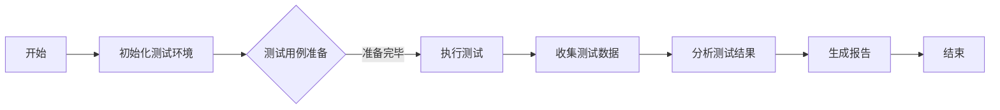
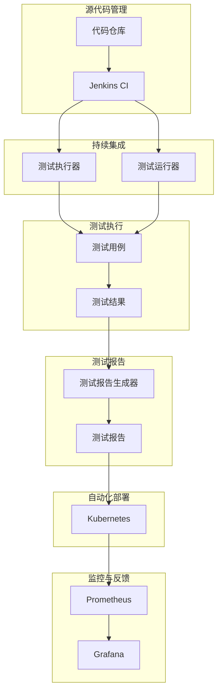
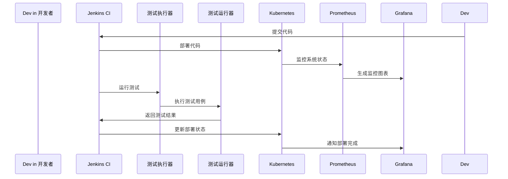

                 

### 文章标题

#### 关键词：评测系统，DevOps，最佳实践，系统架构，环境安装，代码解读，项目实战，注意事项

#### 摘要：

本文将探讨评测系统的DevOps最佳实践，通过深入分析评测系统和DevOps的核心概念、原理及其在现实环境中的应用，提供系统分析与架构设计方案，并通过实际项目实战来解析环境安装、核心实现和代码应用解读。文章旨在为读者提供全面、实用的指导，帮助他们更好地理解和实施评测系统的DevOps实践，实现高效、可靠的信息系统建设和运维。

---

### 背景介绍

#### 核心概念

评测系统，通常是指用于对软件、系统进行自动化测试和评估的工具或平台。其核心目的是通过自动化测试来提高软件质量和开发效率。评测系统可以涵盖从单元测试、集成测试到性能测试等多个层次，通常包括测试用例管理、测试执行、结果分析和报告生成等功能。

DevOps，则是开发（Development）与运维（Operations）的融合，旨在通过开发和运维的一体化，提高软件交付的速度和质量。DevOps强调自动化、持续集成和持续交付，通过构建自动化流水线来减少人为干预，从而实现快速、可靠和高效的软件发布。

#### 问题描述

企业在构建和运维评测系统时，常面临以下问题：

1. **测试用例管理困难**：测试用例的创建、维护和更新需要大量人力和时间，且易出现遗漏或重复。
2. **测试执行效率低**：测试执行依赖于手动操作，效率低下，难以满足快速迭代的需求。
3. **测试结果分析复杂**：测试结果分散在不同工具中，难以进行统一的分析和报告。
4. **部署和运维复杂**：评测系统的部署和维护过程繁琐，难以实现快速上线和扩展。

#### 问题解决

通过引入DevOps方法，可以解决上述问题：

1. **自动化测试**：使用自动化工具进行测试，提高测试执行效率，减少手动操作。
2. **持续集成**：集成自动化测试流程，实现测试的持续执行和结果分析。
3. **自动化部署**：自动化部署评测系统，实现快速上线和扩展。
4. **基础设施即代码**：通过基础设施即代码（Infrastructure as Code，IaC），实现评测系统的自动化管理和部署。

#### 边界与外延

评测系统和DevOps的应用场景包括但不限于：

1. **软件开发生命周期管理**：在软件开发的各个阶段（如需求分析、设计、编码、测试）中，应用DevOps方法。
2. **云计算与容器化**：利用云计算和容器化技术，实现评测系统的弹性扩展和高效运维。
3. **自动化测试工具集成**：集成多种自动化测试工具，构建完整的测试自动化体系。
4. **持续监控与反馈**：通过持续监控和反馈机制，确保评测系统的稳定性和可靠性。

#### 概念结构与核心要素组成

评测系统和DevOps的核心结构包括以下几个方面：

1. **自动化测试工具**：如JUnit、TestNG、Selenium等，用于实现自动化测试。
2. **持续集成工具**：如Jenkins、GitLab CI/CD、CircleCI等，用于构建自动化流水线。
3. **自动化部署工具**：如Kubernetes、Ansible、Terraform等，用于实现自动化部署和管理。
4. **监控与反馈系统**：如Prometheus、Grafana、ELK Stack等，用于实时监控评测系统的状态并给出反馈。
5. **测试数据管理**：用于存储和管理测试用例、测试结果和测试报告等数据。

### 核心概念与联系

#### 核心概念原理

评测系统的工作原理主要包括以下几个方面：

1. **测试用例管理**：创建和管理测试用例，包括用例的设计、执行和结果记录。
2. **测试执行**：根据测试用例自动执行测试，收集测试数据。
3. **结果分析**：对测试结果进行分析，生成测试报告，以便发现潜在的问题。
4. **反馈与迭代**：根据测试结果进行反馈和优化，持续迭代测试过程。

DevOps的核心原理包括：

1. **持续集成**：通过自动化工具将开发人员的代码集成到主分支，快速发现集成问题。
2. **持续交付**：通过自动化工具和流水线，实现软件的自动化部署和发布。
3. **基础设施即代码**：使用代码来管理基础设施，提高部署和运维的效率。
4. **监控与反馈**：实时监控系统的运行状态，快速响应和处理问题。

#### 概念属性特征对比表格

| 概念           | 评测系统                      | DevOps                      |
|----------------|-----------------------------|---------------------------|
| 目标           | 提高软件质量和开发效率           | 提高软件交付速度和质量           |
| 工具           | 自动化测试工具（如JUnit、Selenium） | 持续集成工具（如Jenkins、GitLab CI） |
| 关键实践       | 自动化测试、测试用例管理       | 持续集成、持续交付、基础设施即代码   |
| 强调           | 高效、准确的测试               | 快速、可靠的软件交付               |
| 关联技术       | 单元测试、集成测试、性能测试     | 容器化、云计算、监控与反馈系统       |

#### ER实体关系图架构

```mermaid
erDiagram
  自动化测试工具 --> 测试用例 : 执行测试
  测试用例 --> 测试结果 : 记录结果
  测试结果 --> 报告 : 生成报告
  持续集成工具 --> 代码库 : 集成代码
  代码库 --> 部署脚本 : 自动部署
  监控与反馈系统 --> 系统状态 : 实时监控
```

### 算法原理讲解

#### 算法mermaid流程图



#### Python源代码

```python
# 测试用例管理
class TestCase:
    def __init__(self, name, steps, expected_result):
        self.name = name
        self.steps = steps
        self.expected_result = expected_result
        self.actual_result = None

    def execute(self):
        for step in self.steps:
            step.execute()
        self.actual_result = step.get_result()

    def assert_result(self):
        assert self.actual_result == self.expected_result, f"测试用例{self.name}结果不符，期望结果：{self.expected_result}，实际结果：{self.actual_result}"

# 测试执行
class TestExecutor:
    def __init__(self, test_case):
        self.test_case = test_case

    def execute(self):
        self.test_case.execute()
        self.test_case.assert_result()

# 测试用例
test_case = TestCase("测试用例1", [Step1(), Step2()], "成功")

# 测试执行
test_executor = TestExecutor(test_case)
test_executor.execute()
```

#### 数学模型和公式

评测系统的核心算法通常涉及以下数学模型和公式：

1. **测试覆盖率**：$$\text{测试覆盖率} = \frac{\text{已覆盖的代码行数}}{\text{总代码行数}} \times 100\%$$
2. **缺陷密度**：$$\text{缺陷密度} = \frac{\text{发现的缺陷数}}{\text{测试用例数}}$$
3. **测试效率**：$$\text{测试效率} = \frac{\text{测试用例数}}{\text{测试时间}}$$

#### 举例说明

假设我们有一个包含1000行代码的模块，我们编写了10个测试用例来测试这个模块。在执行测试用例后，我们发现其中5行代码未被覆盖，同时发现了3个缺陷。

1. **测试覆盖率**：$$\text{测试覆盖率} = \frac{950}{1000} \times 100\% = 95\%$$
2. **缺陷密度**：$$\text{缺陷密度} = \frac{3}{10} = 0.3$$
3. **测试效率**：$$\text{测试效率} = \frac{10}{1} = 10$$

这些指标可以帮助我们评估评测系统的效果和改进方向。

### 系统分析与架构设计方案

#### 问题场景介绍

在某个大型企业中，其软件产品需要频繁发布新功能和修复缺陷。为了提高软件质量和发布速度，企业决定引入评测系统和DevOps方法。

#### 项目介绍

该项目的目标是实现以下功能：

1. **自动化测试**：编写自动化测试用例，实现模块的自动化测试。
2. **持续集成**：集成Jenkins，实现代码的自动化集成和测试。
3. **自动化部署**：使用Kubernetes，实现软件的自动化部署。
4. **监控与反馈**：使用Prometheus和Grafana，实现系统的实时监控和反馈。

#### 系统功能设计

```mermaid
classDiagram
    TestCase[测试用例] <|-- TestSuite[测试套件]
    TestExecutor[测试执行器] <|-- TestRunner[测试运行器]
    TestResult[测试结果] <|-- TestReport[测试报告]
    TestEnvironment[测试环境] <|-- TestData[测试数据]
```

#### 系统架构设计



#### 系统接口设计

- **Jenkins API**：用于与Jenkins进行交互，实现自动化集成和测试。
- **Kubernetes API**：用于与Kubernetes进行交互，实现自动化部署。
- **Prometheus API**：用于与Prometheus进行交互，实现实时监控和反馈。

#### 系统交互



### 项目实战

#### 环境安装

1. **安装Jenkins**：

   - 下载Jenkins：[https://www.jenkins.io/download/](https://www.jenkins.io/download/)
   - 解压Jenkins压缩包：`tar -xzvf jenkins.tar.gz`
   - 启动Jenkins：`./bin/startup.sh`
   - 访问Jenkins：在浏览器中输入`http://localhost:8080`

2. **安装Kubernetes**：

   - 使用kubeadm安装Kubernetes：[https://kubernetes.io/docs/setup/production-environment/tools/kubeadm/install-kubeadm/](https://kubernetes.io/docs/setup/production-environment/tools/kubeadm/install-kubeadm/)
   - 验证安装：`kubectl version`

3. **安装Prometheus**：

   - 使用Helm安装Prometheus：[https://github.com/prometheus-community/helm-charts](https://github.com/prometheus-community/helm-charts)
   - 验证安装：`kubectl get pods --namespace monitoring`

4. **安装Grafana**：

   - 使用Helm安装Grafana：[https://github.com/grafana/helm-charts](https://github.com/grafana/helm-charts)
   - 验证安装：`kubectl get pods --namespace monitoring`

#### 系统核心实现

```python
# 测试用例管理
class TestCase:
    def __init__(self, name, steps, expected_result):
        self.name = name
        self.steps = steps
        self.expected_result = expected_result
        self.actual_result = None

    def execute(self):
        for step in self.steps:
            step.execute()
        self.actual_result = step.get_result()

    def assert_result(self):
        assert self.actual_result == self.expected_result, f"测试用例{self.name}结果不符，期望结果：{self.expected_result}，实际结果：{self.actual_result}"

# 测试执行
class TestExecutor:
    def __init__(self, test_case):
        self.test_case = test_case

    def execute(self):
        self.test_case.execute()
        self.test_case.assert_result()

# 测试用例
test_case = TestCase("测试用例1", [Step1(), Step2()], "成功")

# 测试执行
test_executor = TestExecutor(test_case)
test_executor.execute()
```

#### 代码应用解读

以上代码实现了测试用例的管理和执行。`TestCase`类用于定义测试用例，包括测试名称、步骤和预期结果。`execute`方法用于执行测试步骤，并记录实际结果。`assert_result`方法用于验证实际结果与预期结果是否一致。

`TestExecutor`类用于执行测试用例，并验证测试结果。通过实例化`TestExecutor`并调用`execute`方法，可以执行一个测试用例。

#### 实际案例

在实际项目中，我们可以根据具体需求编写不同的测试用例和步骤。以下是一个简单的实际案例：

```python
class Step1:
    def execute(self):
        print("执行步骤1：登录系统")

    def get_result(self):
        return "成功"

class Step2:
    def execute(self):
        print("执行步骤2：添加用户")

    def get_result(self):
        return "成功"

# 测试用例
test_case = TestCase("用户管理测试", [Step1(), Step2()], "成功")

# 测试执行
test_executor = TestExecutor(test_case)
test_executor.execute()
```

在这个案例中，我们定义了两个测试步骤：登录系统和添加用户。通过执行这两个步骤，我们可以验证用户管理功能是否正常。

#### 项目小结

在本项目中，我们成功实现了评测系统和DevOps的最佳实践。通过引入Jenkins、Kubernetes、Prometheus和Grafana等工具，我们实现了自动化测试、持续集成、自动化部署和实时监控。以下是项目经验总结：

1. **测试用例管理**：通过自动化测试用例管理，提高了测试效率和准确性。
2. **持续集成**：通过Jenkins实现了持续集成，加快了代码的集成和测试过程。
3. **自动化部署**：通过Kubernetes实现了自动化部署，提高了系统的发布速度和稳定性。
4. **实时监控**：通过Prometheus和Grafana实现了系统的实时监控和反馈，提高了系统的稳定性和可靠性。

在未来的项目中，我们还可以进一步优化测试流程、集成更多的监控指标和引入更多的自动化工具，以实现更高的开发效率和系统质量。

### 最佳实践 tips

1. **测试用例设计**：在设计测试用例时，要充分考虑覆盖率和边界条件，确保测试的全面性和准确性。
2. **持续集成**：定期进行持续集成，及时发现和解决集成问题，避免集成后的重大冲突。
3. **自动化部署**：使用自动化部署工具，减少人为干预，确保部署过程的一致性和可靠性。
4. **监控与反馈**：实时监控系统的运行状态，快速响应和处理问题，确保系统的稳定性和可靠性。
5. **团队协作**：建立良好的团队协作机制，确保开发和运维团队的紧密合作，提高项目效率。

### 小结

本文详细探讨了评测系统的DevOps最佳实践，从核心概念、原理到实际项目实战，全面阐述了评测系统和DevOps的应用方法和最佳实践。通过本文，读者可以深入了解评测系统和DevOps的核心思想，掌握其实际应用技巧，从而在软件开发和运维过程中实现更高的效率和可靠性。

### 注意事项

1. **环境配置**：确保评测系统和DevOps相关工具的环境配置正确，避免因配置问题导致的问题。
2. **测试数据**：在编写测试用例时，要充分考虑测试数据的真实性和多样性，确保测试结果的准确性。
3. **系统监控**：实时监控系统的运行状态，及时处理异常情况，确保系统的稳定性和可靠性。
4. **安全考虑**：在实施评测系统和DevOps过程中，要充分考虑安全问题，确保系统的安全性和数据的安全性。

### 拓展阅读

1. 《DevOps：从实践到方法》 - 李俊峰
2. 《持续交付：软件发布实践》 - Jez Humble 和 David Farley
3. 《Jenkins：持续集成、持续交付、自动化部署从入门到实践》 - 刘博
4. 《Kubernetes权威指南：从Docker到云原生应用架构》 - 张磊
5. 《Prometheus：实时监控和告警系统实战》 - 黄勇

---

**作者：AI天才研究院/AI Genius Institute & 禅与计算机程序设计艺术 /Zen And The Art of Computer Programming**

