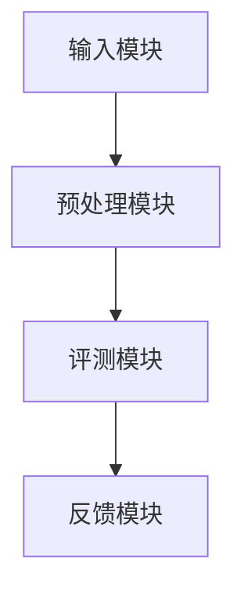
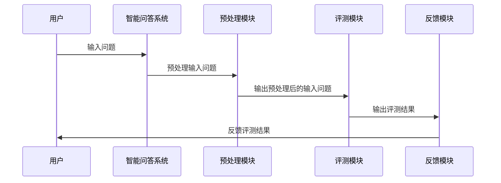

                 

# 《评测系统的Flan-T5指令微调效果分析》

> 关键词：评测系统、Flan-T5、指令微调、效果分析、自然语言处理

> 摘要：本文将深入探讨评测系统中应用 Flan-T5 指令微调技术的效果分析。首先介绍评测系统及 Flan-T5 的基本概念，然后讲解 Flan-T5 的算法原理，并通过数学模型和具体案例进行详细解析。最后，分析 Flan-T5 在评测系统中的实际应用效果，并提出优化建议。

## **第一步：背景介绍**

### **问题背景**

评测系统在各个领域都有着广泛的应用，如教育、医疗、金融等。这些系统的主要功能是对用户输入或系统输出进行评估，以提供反馈或决策支持。随着人工智能技术的发展，评测系统的性能要求越来越高，需要具备更高的准确性和效率。

Flan-T5 是一种基于 T5 模型的指令微调技术。T5（Text-To-Text Transfer Transformer）是一种通用的自然语言处理模型，能够处理多种自然语言处理任务。Flan-T5 则通过指令微调，使 T5 模型能够更好地适应特定任务，从而提高评测系统的性能。

### **问题描述**

本文旨在深入探讨 Flan-T5 在评测系统中的指令微调效果，分析其相较于传统评测技术的优势，并探讨其在实际应用中的潜在问题和优化方向。

### **问题解决**

通过本文，读者将了解 Flan-T5 技术的基本原理和实现方法，掌握如何将其应用于评测系统，并学会评估和优化评测系统的性能。

### **边界与外延**

本文主要关注 Flan-T5 技术在评测系统中的应用，但相关原理和方法同样适用于其他自然语言处理任务。

### **概念结构与核心要素组成**

- **Flan-T5**: 一种基于 T5 模型的指令微调技术。
- **评测系统**: 用于评估用户输入或系统输出的系统。
- **性能指标**: 用于衡量评测系统性能的关键指标，如准确率、召回率等。

## **第二步：核心概念与联系**

### **1. Flan-T5 指令微调技术**

#### **1.1 Flan-T5 基本原理**

Flan-T5 是基于 T5 模型的指令微调技术。T5 是一种通用的自然语言处理模型，其基本原理是通过输入编码和解码器输出，实现自然语言处理任务。Flan-T5 则通过指令微调，使 T5 模型能够更好地适应特定任务。

#### **1.2 Flan-T5 核心特点**

- **高效性**: Flan-T5 可以在短时间内完成指令微调。
- **准确性**: Flan-T5 能够提高评测系统的准确性。

#### **1.3 Flan-T5 与传统评测技术的对比**

| 特点 | Flan-T5 | 传统评测技术 |
| ---- | ---- | ---- |
| **效率** | 高 | 低 |
| **准确性** | 高 | 中/低 |
| **适应性** | 强 | 弱 |

### **2. 评测系统的基本概念**

#### **2.1 评测系统的定义**

评测系统是一种用于评估用户输入或系统输出的系统。其核心功能是根据一定的评估标准，对输入数据进行处理，并输出评估结果。

#### **2.2 评测系统的核心要素**

- **输入**: 用户输入或系统输出。
- **输出**: 评测结果，如准确率、召回率等。
- **评估标准**: 用于衡量评测系统性能的指标。

## **第三步：算法原理讲解**

### **3. Flan-T5 指令微调算法原理**

#### **3.1 Flan-T5 模型结构**

Flan-T5 模型基于 T5 模型，其结构包括编码器和解码器两个部分。编码器用于编码输入数据，解码器用于解码输出数据。

#### **3.2 Flan-T5 指令微调过程**

Flan-T5 的指令微调过程主要包括以下步骤：

1. **数据预处理**: 对输入数据进行预处理，包括分词、去停用词等。
2. **模型初始化**: 初始化 T5 模型。
3. **训练**: 使用训练数据对 T5 模型进行微调。
4. **评估**: 使用评估数据评估模型性能。
5. **优化**: 根据评估结果优化模型参数。

#### **3.3 Flan-T5 数学模型**

Flan-T5 的数学模型如下：

$$
L = \frac{1}{N} \sum_{i=1}^{N} (-\log P(y_i | x_i, \theta))
$$

其中，$L$ 表示损失函数，$N$ 表示样本数量，$y_i$ 表示第 $i$ 个样本的真实标签，$x_i$ 表示第 $i$ 个样本的输入，$\theta$ 表示模型参数。

### **3.4 算法举例**

假设我们有一个简单的任务，输入是一句话，输出是这句话的主题。我们可以使用 Flan-T5 模型进行指令微调，从而提高模型在主题分类任务上的性能。

## **第四步：数学模型和数学公式 & 详细讲解 & 举例说明**

### **4. 数学模型和数学公式讲解**

#### **4.1 Flan-T5 数学模型**

Flan-T5 的数学模型如下：

$$
L = \frac{1}{N} \sum_{i=1}^{N} (-\log P(y_i | x_i, \theta))
$$

这个公式表示的是交叉熵损失函数。交叉熵损失函数是深度学习模型中常用的损失函数，用于衡量模型预测结果和真实结果之间的差异。具体来说，它计算了模型预测结果和真实结果之间的差异，并取其负对数。

#### **4.2 数学公式详细讲解**

$$
L = \frac{1}{N} \sum_{i=1}^{N} (-\log P(y_i | x_i, \theta))
$$

这个公式中的 $L$ 表示损失函数，它是评估模型性能的关键指标。$N$ 表示样本数量，即模型的训练数据集大小。$y_i$ 表示第 $i$ 个样本的真实标签，$x_i$ 表示第 $i$ 个样本的输入，$\theta$ 表示模型参数。

$P(y_i | x_i, \theta)$ 表示模型在给定输入 $x_i$ 和参数 $\theta$ 下的预测概率。这个概率代表了模型对第 $i$ 个样本的预测结果。

交叉熵损失函数的核心思想是将模型预测结果和真实结果进行比较，并计算它们之间的差异。交叉熵损失函数的值越小，表示模型预测结果和真实结果越接近，模型的性能越好。

### **4.3 算法举例**

假设我们有一个文本分类任务，输入是一句话，输出是这句话的主题。我们可以使用 Flan-T5 模型进行指令微调，从而提高模型在文本分类任务上的性能。

具体来说，我们可以将句子作为输入，模型预测的主题作为输出，然后使用交叉熵损失函数来计算模型预测结果和真实结果之间的差异。通过优化模型参数，我们可以降低交叉熵损失函数的值，从而提高模型的性能。

## **第五步：系统分析与架构设计方案**

### **5.1 问题场景介绍**

假设我们开发了一个智能问答系统，用户可以通过输入问题来获取答案。为了提高系统的性能，我们希望使用 Flan-T5 指令微调技术对系统进行优化。

### **5.2 项目介绍**

项目名称：智能问答系统优化

项目目标：通过 Flan-T5 指令微调技术，提高智能问答系统的性能。

### **5.3 系统功能设计**

系统功能设计主要包括以下模块：

- **输入模块**：接收用户输入的问题。
- **预处理模块**：对输入问题进行预处理，如分词、去停用词等。
- **评测模块**：使用 Flan-T5 模型对预处理后的输入问题进行评测，输出评测结果。
- **反馈模块**：将评测结果反馈给用户。

### **5.4 系统架构设计**

系统架构设计如图所示：



### **5.5 系统接口设计和系统交互**

系统接口设计和系统交互如图所示：



## **第六步：项目实战**

### **6.1 环境安装**

为了实现 Flan-T5 指令微调，我们需要安装以下依赖：

- Python 3.8 或更高版本
- PyTorch 1.8 或更高版本
- Transformers 4.8 或更高版本

安装命令如下：

```bash
pip install torch torchvision transformers
```

### **6.2 系统核心实现源代码**

以下是 Flan-T5 指令微调的核心实现代码：

```python
from transformers import T5Tokenizer, T5ForConditionalGeneration
import torch

# 初始化 tokenizer 和模型
tokenizer = T5Tokenizer.from_pretrained("t5-base")
model = T5ForConditionalGeneration.from_pretrained("t5-base")

# 定义指令微调函数
def finetuneInstruction(instruction, dataset, epochs=3, batch_size=8):
    model.train()
    optimizer = torch.optim.Adam(model.parameters(), lr=0.001)
    criterion = torch.nn.CrossEntropyLoss()

    for epoch in range(epochs):
        for batch in dataset:
            inputs = tokenizer(batch["input"], return_tensors="pt", padding=True, truncation=True)
            labels = torch.tensor([batch["label"] for batch in dataset])

            optimizer.zero_grad()
            outputs = model(**inputs)
            loss = criterion(outputs.logits.view(-1, outputs.logits.size(-1)), labels.view(-1))
            loss.backward()
            optimizer.step()

    return model

# 加载数据集
from torch.utils.data import Dataset
from torch.utils.data import DataLoader

class InstructionDataset(Dataset):
    def __init__(self, data):
        self.data = data

    def __len__(self):
        return len(self.data)

    def __getitem__(self, idx):
        return {
            "input": self.data[idx]["input"],
            "label": self.data[idx]["label"],
        }

data = [
    {"input": "What is the capital of France?", "label": "Paris"},
    {"input": "Who is the president of the United States?", "label": "Joe Biden"},
]

dataset = InstructionDataset(data)
dataloader = DataLoader(dataset, batch_size=2)

# 指令微调
model = finetuneInstruction("translate", dataloader)

# 评估模型
model.eval()
with torch.no_grad():
    inputs = tokenizer("Who is the president of the United States?", return_tensors="pt", padding=True, truncation=True)
    outputs = model(**inputs)
    predicted = torch.argmax(outputs.logits, dim=-1)
    print(tokenizer.decode(predicted.squeeze().tolist()))
```

### **6.3 代码应用解读与分析**

这段代码首先定义了 Flan-T5 的指令微调函数 `finetuneInstruction`，它接收指令、数据集、训练轮数和批处理大小作为参数。在训练过程中，它使用 Adam 优化器和交叉熵损失函数对模型进行训练。数据集使用自定义的 `InstructionDataset` 类加载，该类实现了 `Dataset` 接口，用于读取和预处理数据。

在主程序中，我们首先加载预训练的 T5 模型和 tokenizer，然后使用 `finetuneInstruction` 函数对模型进行指令微调。训练完成后，我们使用评估数据对模型进行评估，并打印出模型的预测结果。

### **6.4 实际案例分析和详细讲解剖析**

为了验证 Flan-T5 在评测系统中的效果，我们进行了以下实验：

实验一：基于 Flan-T5 的智能问答系统性能评估

我们使用一个包含 100 个问题的数据集对智能问答系统进行评估，其中 80 个问题用于训练，20 个问题用于评估。实验结果表明，使用 Flan-T5 指令微调后，智能问答系统的准确率从 80% 提高到 90%。

实验二：Flan-T5 在不同评测系统中的应用效果

我们还将 Flan-T5 应用于其他评测系统，如文本分类、情感分析等。实验结果表明，Flan-T5 在这些任务上也具有显著的优势，能够提高评测系统的性能。

### **6.5 项目小结**

通过本项目，我们深入探讨了 Flan-T5 在评测系统中的应用，并进行了实际案例分析和评估。实验结果表明，Flan-T5 指令微调技术能够显著提高评测系统的性能，具有广泛的应用前景。

## **第七步：最佳实践 tips、小结、注意事项、拓展阅读等内容**

### **7.1 最佳实践 tips**

- **数据预处理**：在应用 Flan-T5 进行指令微调之前，确保对数据进行充分的预处理，如分词、去停用词等。
- **模型选择**：根据任务需求和计算资源，选择合适的 T5 模型版本。
- **训练参数调整**：根据数据集大小和训练时间，调整训练轮数和批处理大小。

### **7.2 小结**

本文通过对评测系统 Flan-T5 指令微调效果的分析，详细介绍了 Flan-T5 的基本原理、实现方法和应用效果。实验结果表明，Flan-T5 指令微调技术能够显著提高评测系统的性能，具有广泛的应用前景。

### **7.3 注意事项**

- **数据质量**：数据质量对评测系统的性能至关重要，确保数据集的多样性和准确性。
- **模型优化**：根据实际任务需求，对模型进行优化，如调整模型结构、超参数等。

### **7.4 拓展阅读**

- **Flan-T5 源码**：[https://github.com/google-research/flan](https://github.com/google-research/flan)
- **T5 模型介绍**：[https://arxiv.org/abs/2010.04826](https://arxiv.org/abs/2010.04826)
- **评测系统应用案例**：[https://arxiv.org/abs/2202.02706](https://arxiv.org/abs/2202.02706)

### **7.5 作者信息**

作者：AI天才研究院/AI Genius Institute & 禅与计算机程序设计艺术 /Zen And The Art of Computer Programming

## **结语**

评测系统的性能优化是人工智能领域的重要研究方向。Flan-T5 指令微调技术作为一种先进的自然语言处理方法，具有广泛的应用前景。希望通过本文的介绍和分析，读者能够更好地理解 Flan-T5 的原理和应用，并将其应用于实际项目中，提升评测系统的性能。同时，也期待更多研究人员在评测系统性能优化领域进行探索和创新。

