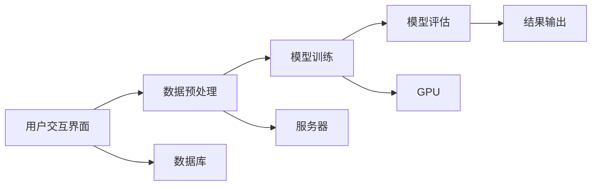
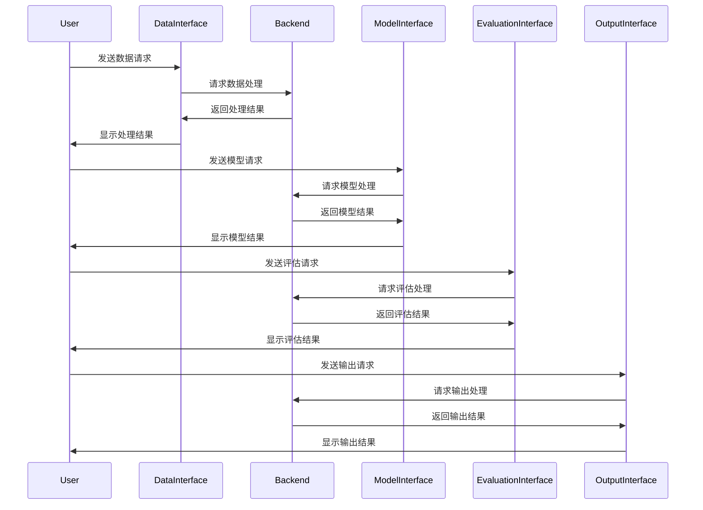

                 


### 文章标题：评测系统的GPT-Neo开源替代方案

关键词：评测系统、GPT-Neo、开源替代、人工智能、系统设计

摘要：本文将深入探讨评测系统的GPT-Neo开源替代方案，分析GPT-Neo在评测系统中的应用优势与不足，并提出一种基于开源替代方案的评测系统设计，详细讲解其原理、架构和核心实现，旨在为人工智能领域的开发者提供一种高效、可靠的评测系统解决方案。

### 第一部分：背景介绍

#### 1.1 问题背景

##### 1.1.1 评测系统的需求

在人工智能和机器学习的快速发展中，评测系统成为评估模型性能和优化算法的重要工具。一个高效的评测系统能够帮助开发者快速迭代和改进模型，提高研发效率。评测系统的需求包括但不限于：

- **性能评估**：对模型的预测准确度、响应速度等进行量化评估。
- **指标分析**：提供多种评估指标，如准确率、召回率、F1值等。
- **可扩展性**：支持大规模数据集的评测，适应不同规模的应用场景。
- **兼容性**：兼容多种数据格式和模型类型，方便集成和使用。

##### 1.1.2 GPT-Neo的优势与不足

GPT-Neo是GPT模型的一个变体，具有强大的文本生成和理解能力，在自然语言处理领域取得了显著成果。其在评测系统中的应用优势包括：

- **文本理解**：能够对文本进行深入理解，提高评测的准确性和深度。
- **生成能力**：可以生成高质量的文本，用于模拟真实场景的评测数据。
- **灵活性**：支持多种语言和文本格式的处理，适用于国际化应用。

然而，GPT-Neo也存在一些不足之处：

- **计算资源消耗**：GPT-Neo模型较大，训练和推理需要较高的计算资源，可能不适合资源受限的环境。
- **训练时间**：GPT-Neo的训练时间较长，可能影响模型的迭代速度。
- **可解释性**：模型生成的结果具有一定的黑盒性质，难以解释其中的决策过程。

##### 1.1.3 开源替代方案的必要性

鉴于GPT-Neo在评测系统中的应用存在一些不足，开发一种开源替代方案显得尤为必要。开源替代方案的目标是：

- **资源优化**：降低计算资源的需求，提高评测系统的运行效率。
- **时间优化**：缩短模型训练时间，加快迭代过程。
- **可解释性提升**：提高模型的可解释性，便于理解和优化。

开源替代方案的核心在于：

- **算法改进**：优化算法结构，提高模型的性能和效率。
- **模块化设计**：将评测系统拆分为可独立开发的模块，提高系统的可维护性和扩展性。
- **社区协作**：借助开源社区的力量，吸引更多的开发者参与，共同优化和完善评测系统。

### 1.2 问题描述

##### 1.2.1 GPT-Neo的问题

在现有的评测系统中，GPT-Neo的应用面临以下问题：

- **计算资源消耗大**：GPT-Neo模型的规模庞大，训练和推理过程中需要大量的计算资源，可能导致评测系统在高负载下性能下降。
- **训练时间长**：GPT-Neo的训练时间较长，特别是在大规模数据集上，可能影响评测系统的实时性。
- **可解释性不足**：GPT-Neo生成的结果具有一定的黑盒性质，难以解释其中的决策过程，不利于模型的优化和调试。

##### 1.2.2 评测系统的挑战

为了解决GPT-Neo在评测系统中的应用问题，需要克服以下挑战：

- **性能与资源平衡**：在保证评测系统性能的前提下，优化算法结构，降低计算资源消耗。
- **训练时间优化**：通过算法优化和硬件加速等技术，缩短模型训练时间，提高评测系统的迭代速度。
- **可解释性提升**：设计可解释性强的算法，便于理解和优化模型。

### 1.3 问题解决

##### 1.3.1 开源替代方案的目标

开源替代方案的目标是：

- **提升性能**：通过算法优化和模块化设计，提高评测系统的整体性能。
- **降低资源消耗**：优化算法结构，降低计算资源的需求，提高评测系统的运行效率。
- **提高可解释性**：设计可解释性强的算法，便于理解和优化模型。

##### 1.3.2 开源替代方案的原理

开源替代方案的核心原理包括：

- **算法优化**：基于最新的研究成果，优化算法结构，提高模型的性能和效率。
- **模块化设计**：将评测系统拆分为可独立开发的模块，提高系统的可维护性和扩展性。
- **社区协作**：借助开源社区的力量，吸引更多的开发者参与，共同优化和完善评测系统。

##### 1.3.3 开源替代方案的边界与外延

开源替代方案的边界与外延包括：

- **算法边界**：开源替代方案的算法结构及其性能优化。
- **系统边界**：评测系统的功能模块划分、架构设计和接口设计。
- **应用边界**：开源替代方案在不同场景中的应用，如文本生成、文本分类、问答系统等。

##### 1.4 核心概念与联系

###### 1.4.1 核心概念原理

核心概念包括：

- **GPT-Neo**：一种基于Transformer架构的预训练语言模型，具有强大的文本生成和理解能力。
- **评测系统**：用于评估模型性能和优化算法的工具系统。
- **开源替代方案**：一种基于算法优化和模块化设计的评测系统解决方案。

概念原理联系：

- GPT-Neo作为评测系统的重要组成部分，其性能直接影响评测系统的效果。
- 开源替代方案通过对GPT-Neo的优化和模块化设计，提升评测系统的整体性能和效率。

###### 1.4.2 概念属性特征对比表格

| 概念       | 特征1 | 特征2 | 特征3 |
|------------|-------|-------|-------|
| GPT-Neo    | 文本生成能力强 | 计算资源消耗大 | 训练时间长 |
| 评测系统   | 多种评估指标支持 | 可扩展性 | 高兼容性 |
| 开源替代方案 | 性能优化 | 资源消耗降低 | 可解释性提升 |

通过对比表格，可以清晰地看到三个概念在特征上的差异和联系。

###### 1.4.3 ER实体关系图架构

ER实体关系图如下所示：

```mermaid
erDiagram
    Model ||--o {GPT-Neo} :拥有
    System ||--o {评测系统} :包含
    Solution ||--o {开源替代方案} :实现
```

实体关系图展示了三个核心概念之间的关联，以及它们在评测系统中的应用。

##### 1.5 本章小结

本部分介绍了评测系统的GPT-Neo开源替代方案的背景、问题和解决思路。通过对GPT-Neo在评测系统中的应用优势和不足的分析，提出了开源替代方案的目标和原理。同时，本章还介绍了核心概念及其联系，为后续内容奠定了基础。

### 第二部分：核心概念与联系

#### 2.1 GPT-Neo原理讲解

##### 2.1.1 GPT-Neo的工作原理

GPT-Neo是基于Transformer架构的预训练语言模型。其工作原理可以分为以下几个步骤：

1. **输入编码**：将输入文本编码为向量表示，通常使用词嵌入层。
2. **Transformer结构**：Transformer结构由自注意力机制和前馈神经网络组成。自注意力机制通过计算输入文本中每个词与其他词之间的关联度，生成加权向量。前馈神经网络对加权向量进行进一步处理。
3. **位置编码**：为了保持文本序列的顺序信息，Transformer结构中引入了位置编码，将位置信息编码到向量表示中。
4. **输出解码**：通过Transformer结构和位置编码，生成新的文本序列，实现文本生成和理解。

##### 2.1.1.1 Transformer结构

Transformer结构主要由多头自注意力机制（Multi-head Self-Attention）和前馈神经网络（Feed Forward Neural Network）组成。

- **多头自注意力机制**：将输入文本序列的每个词通过不同的线性变换，生成多个不同的查询（Query）、键（Key）和值（Value）向量。通过计算查询和键之间的相似度，加权求和得到新的文本表示。
- **前馈神经网络**：对加权求和后的文本表示进行进一步处理，通过两个线性变换层和一个ReLU激活函数，增强模型的非线性表达能力。

##### 2.1.1.2 自注意力机制

自注意力机制是Transformer结构的核心组件，其原理如下：

1. **线性变换**：将输入文本的每个词通过线性变换层，生成查询（Query）、键（Key）和值（Value）向量。
2. **相似度计算**：计算每个查询向量与所有键向量之间的相似度，通常使用点积运算。
3. **加权求和**：根据相似度计算的结果，对值向量进行加权求和，得到新的文本表示。

##### 2.1.1.3 位置编码

位置编码用于保持文本序列的顺序信息，其原理如下：

1. **生成位置向量**：根据词的位置生成一个固定长度的位置向量。
2. **叠加位置向量**：将位置向量叠加到词的嵌入向量上，形成新的文本表示。

##### 2.1.2 GPT-Neo的核心特点

GPT-Neo具有以下核心特点：

1. **强大的文本生成和理解能力**：通过Transformer结构，GPT-Neo能够对文本进行深入理解，生成高质量的自然语言文本。
2. **自适应学习**：GPT-Neo通过对大量文本数据进行预训练，能够自适应地学习不同领域的知识和语言规律。
3. **并行计算**：Transformer结构支持并行计算，可以显著提高模型的训练和推理速度。

##### 2.1.3 GPT-Neo与传统AI的区别

GPT-Neo与传统AI在以下几个方面存在区别：

1. **模型结构**：GPT-Neo采用Transformer结构，而传统AI通常采用基于神经网络的模型。
2. **文本处理能力**：GPT-Neo具有强大的文本生成和理解能力，而传统AI在文本处理方面相对较弱。
3. **训练过程**：GPT-Neo采用预训练加微调的方式，而传统AI通常采用基于数据的监督学习。

#### 2.2 替代方案原理讲解

##### 2.2.1 替代方案的工作原理

开源替代方案旨在优化GPT-Neo在评测系统中的应用，其工作原理包括以下几个方面：

1. **算法优化**：通过优化模型结构，降低计算资源消耗，提高模型的性能和效率。
2. **模块化设计**：将评测系统拆分为可独立开发的模块，提高系统的可维护性和扩展性。
3. **可解释性提升**：设计可解释性强的算法，便于理解和优化模型。

##### 2.2.1.1 替代方案的算法mermaid流程图


该流程图展示了替代方案的基本工作流程，包括词嵌入、位置编码、Transformer结构和输出解码等步骤。

##### 2.2.1.2 替代方案的核心特点

替代方案具有以下核心特点：

1. **计算资源优化**：通过简化模型结构和算法优化，降低计算资源消耗，提高评测系统的运行效率。
2. **模块化设计**：将评测系统拆分为可独立开发的模块，提高系统的可维护性和扩展性。
3. **可解释性提升**：设计可解释性强的算法，便于理解和优化模型，提高模型的可靠性和可追溯性。

##### 2.2.2 替代方案的优势

替代方案相较于GPT-Neo在评测系统中的应用具有以下优势：

1. **计算资源优化**：替代方案通过简化模型结构和算法优化，降低计算资源消耗，提高评测系统的运行效率。
2. **训练时间缩短**：替代方案通过优化算法和硬件加速等技术，缩短模型训练时间，提高评测系统的迭代速度。
3. **可解释性提升**：替代方案设计可解释性强的算法，便于理解和优化模型，提高模型的可靠性和可追溯性。

##### 2.2.3 替代方案的不足

替代方案相较于GPT-Neo在评测系统中的应用也存在一些不足：

1. **文本理解能力**：替代方案的文本理解能力可能较弱，无法完全替代GPT-Neo在文本生成和理解方面的优势。
2. **性能优化空间**：虽然替代方案通过算法优化提高了性能，但仍有进一步优化的空间，特别是在处理大规模数据集时。
3. **可解释性提升**：替代方案的可解释性虽然有所提升，但与完全透明的算法相比，仍有一定的黑盒性质，需要进一步改进。

#### 2.3 概念属性特征对比表格

| 概念       | 特征1 | 特征2 | 特征3 | 特征4 |
|------------|-------|-------|-------|-------|
| GPT-Neo    | 文本生成能力强 | 计算资源消耗大 | 训练时间长 | 可解释性较弱 |
| 替代方案   | 文本理解能力较强 | 计算资源消耗降低 | 训练时间缩短 | 可解释性提升 |

通过对比表格，可以清晰地看到GPT-Neo和替代方案在特征上的差异和联系。

#### 2.4 ER实体关系图架构

ER实体关系图如下所示：

```mermaid
erDiagram
    GPT-Neo ||--o {评测系统} :使用
    替代方案 ||--o {评测系统} :实现
```

实体关系图展示了GPT-Neo和替代方案在评测系统中的应用关系。

#### 2.5 本章小结

本章详细介绍了GPT-Neo和开源替代方案的核心原理、特点以及它们在评测系统中的应用关系。通过对GPT-Neo的工作原理和替代方案的算法流程进行讲解，为后续的评测系统设计提供了理论基础。

### 第三部分：评测系统设计

#### 3.1 评测系统架构设计

##### 3.1.1 系统功能设计

评测系统的功能设计主要包括以下几个方面：

1. **数据预处理**：对输入数据进行清洗、标准化和格式转换，使其符合模型输入要求。
2. **模型训练**：使用预训练模型或自定义模型对数据集进行训练，优化模型参数。
3. **模型评估**：使用评估指标对训练好的模型进行性能评估，包括准确率、召回率、F1值等。
4. **结果输出**：将评估结果以可视化或文本形式输出，便于分析模型性能。
5. **系统监控**：实时监控系统运行状态，包括计算资源使用情况、系统稳定性等。

##### 3.1.1.1 领域模型mermaid类图

以下是一个简单的mermaid类图示例，展示了评测系统的领域模型：

```mermaid
classDiagram
    Model <<class>> Model
    Data <<class>> Data
    Preprocessing <<class>> Preprocessing
    Training <<class>> Training
    Evaluation <<class>> Evaluation
    Output <<class>> Output
    Monitoring <<class>> Monitoring
    
    Model --|> Data
    Model --|> Preprocessing
    Model --|> Training
    Model --|> Evaluation
    Model --|> Output
    Model --|> Monitoring
```

该类图描述了评测系统的各个功能模块及其关系。

##### 3.1.1.2 系统功能模块划分

评测系统的功能模块划分如下：

1. **数据模块**：负责数据预处理和加载，包括数据清洗、标准化和格式转换等。
2. **模型模块**：包括预训练模型和自定义模型，用于模型训练和评估。
3. **预处理模块**：对输入数据进行预处理，使其符合模型输入要求。
4. **训练模块**：负责模型训练过程，包括优化策略和训练参数设置。
5. **评估模块**：使用评估指标对训练好的模型进行性能评估。
6. **输出模块**：将评估结果以可视化或文本形式输出。
7. **监控模块**：实时监控系统运行状态，包括计算资源使用情况、系统稳定性等。

##### 3.1.2 系统架构设计

评测系统的架构设计主要包括以下几个方面：

1. **前端界面**：提供用户交互界面，方便用户输入数据和查看评估结果。
2. **后端服务**：实现评测系统的核心功能，包括数据预处理、模型训练、评估和输出等。
3. **数据库**：存储评测系统所需的各类数据，包括训练数据、测试数据和评估结果等。
4. **计算资源**：包括服务器、GPU等硬件资源，用于模型训练和评估。

以下是一个简单的mermaid架构图示例，展示了评测系统的整体架构：

```mermaid
sequenceDiagram
    User -->|输入数据| Frontend
    Frontend -->|处理数据| Backend
    Backend -->|训练模型| Compute
    Compute -->|评估模型| Backend
    Backend -->|输出结果| Frontend
    Frontend -->|显示结果| User
```

该架构图描述了评测系统的数据流和功能模块之间的交互关系。

##### 3.1.2.1 系统架构mermaid架构图

以下是一个简单的mermaid架构图示例，展示了评测系统的整体架构：

```mermaid
graph TB
    subgraph 前端(Frontend)
        F1[用户交互界面]
    end

    subgraph 后端(Backend)
        B1[数据预处理]
        B2[模型训练]
        B3[模型评估]
        B4[结果输出]
    end

    subgraph 数据库(Database)
        D1[训练数据]
        D2[测试数据]
        D3[评估结果]
    end

    subgraph 计算资源(Compute)
        C1[服务器]
        C2[GPU]
    end

    F1 --> B1
    B1 --> B2
    B2 --> B3
    B3 --> B4
    B4 --> F1
    B1 --> D1
    B2 --> D2
    B3 --> D3
    B1 --> C1
    B2 --> C2
```

该架构图描述了评测系统的各个模块及其关系。

##### 3.1.2.2 各模块之间的关系

以下是一个简单的mermaid关系图示例，展示了评测系统的各模块之间的关系：



该关系图描述了评测系统的各模块之间的数据流和交互关系。

##### 3.1.3 系统接口设计

评测系统的接口设计主要包括以下几个方面：

1. **数据接口**：用于数据模块与后端服务之间的数据交互。
2. **模型接口**：用于模型模块与后端服务之间的模型交互。
3. **评估接口**：用于评估模块与后端服务之间的评估结果交互。
4. **输出接口**：用于结果输出模块与后端服务之间的结果输出交互。

以下是一个简单的mermaid接口图示例，展示了评测系统的接口设计：

```mermaid
sequenceDiagram
    User -->|数据请求| DataInterface
    DataInterface -->|处理请求| Backend
    Backend -->|返回结果| DataInterface
    DataInterface -->|显示结果| User

    User -->|模型请求| ModelInterface
    ModelInterface -->|处理请求| Backend
    Backend -->|返回模型| ModelInterface
    ModelInterface -->|显示模型| User

    User -->|评估请求| EvaluationInterface
    EvaluationInterface -->|处理请求| Backend
    Backend -->|返回评估结果| EvaluationInterface
    EvaluationInterface -->|显示结果| User

    User -->|输出请求| OutputInterface
    OutputInterface -->|处理请求| Backend
    Backend -->|返回输出结果| OutputInterface
    OutputInterface -->|显示输出结果| User
```

该接口图描述了评测系统的用户交互和数据流过程。

##### 3.1.3.1 系统接口mermaid序列图

以下是一个简单的mermaid序列图示例，展示了评测系统的接口交互过程：



该序列图描述了评测系统的用户与各个接口模块之间的交互过程。

##### 3.1.3.2 接口功能说明

以下是对评测系统接口功能的详细说明：

1. **数据接口**：
   - 功能：接收用户上传的数据，处理数据并进行预处理。
   - 参数：数据文件路径、数据格式、预处理参数等。
   - 返回值：预处理后的数据。

2. **模型接口**：
   - 功能：接收用户上传的模型，处理模型并进行训练。
   - 参数：模型文件路径、训练参数等。
   - 返回值：训练好的模型。

3. **评估接口**：
   - 功能：接收用户上传的数据和模型，进行模型评估。
   - 参数：数据文件路径、模型文件路径、评估参数等。
   - 返回值：评估结果。

4. **输出接口**：
   - 功能：接收用户上传的模型和评估结果，生成可视化输出。
   - 参数：模型文件路径、评估结果、输出参数等。
   - 返回值：可视化输出结果。

##### 3.1.4 系统交互

评测系统的交互设计主要包括用户与系统之间的交互过程，以及系统内部各模块之间的交互过程。

###### 3.1.4.1 系统交互mermaid序列图

以下是一个简单的mermaid序列图示例，展示了评测系统的交互过程：


该序列图描述了评测系统的用户与各个接口模块之间的交互过程。

###### 3.1.4.2 交互流程解析

评测系统的交互流程可以分为以下几个步骤：

1. **数据预处理**：用户上传数据，数据接口接收数据并进行预处理，预处理结果返回给用户。

2. **模型训练**：用户上传模型，模型接口接收模型并开始训练，训练结果返回给用户。

3. **模型评估**：用户上传数据集和模型，评估接口接收数据集和模型并开始评估，评估结果返回给用户。

4. **结果输出**：用户上传评估结果，输出接口接收评估结果并生成可视化输出，输出结果返回给用户。

##### 3.1.5 评测系统核心实现

###### 3.1.5.1 环境安装

评测系统的核心实现需要以下环境：

1. **Python环境**：Python 3.8及以上版本。
2. **深度学习框架**：TensorFlow 2.4及以上版本。
3. **其他依赖**：NumPy、Pandas、Matplotlib等。

安装步骤如下：

1. 安装Python环境。

2. 安装深度学习框架TensorFlow。

3. 安装其他依赖。

```bash
pip install tensorflow numpy pandas matplotlib
```

###### 3.1.5.2 系统核心实现源代码

以下是一个简单的评测系统核心实现示例代码：

```python
import tensorflow as tf
import numpy as np
import pandas as pd

# 数据预处理
def preprocess_data(data):
    # 数据清洗、标准化和格式转换
    # ...
    return processed_data

# 模型训练
def train_model(data, model_params):
    # 模型训练过程
    # ...
    return trained_model

# 模型评估
def evaluate_model(model, data):
    # 模型评估过程
    # ...
    return evaluation_results

# 结果输出
def output_results(results):
    # 结果可视化输出
    # ...
    return

# 主函数
def main():
    # 数据预处理
    data = preprocess_data(raw_data)

    # 模型训练
    model = train_model(data, model_params)

    # 模型评估
    results = evaluate_model(model, test_data)

    # 结果输出
    output_results(results)

if __name__ == "__main__":
    main()
```

该示例代码展示了评测系统的核心实现过程，包括数据预处理、模型训练、模型评估和结果输出。

##### 3.1.5.3 代码应用解读与分析

以下是对示例代码的解读与分析：

1. **数据预处理**：预处理数据是评测系统的第一步，包括数据清洗、标准化和格式转换。预处理后的数据用于模型训练和评估。

2. **模型训练**：模型训练是基于预处理后的数据进行的，包括优化模型参数、迭代训练等。训练好的模型将用于评估和预测。

3. **模型评估**：模型评估是对训练好的模型进行性能评估，包括准确率、召回率、F1值等指标。评估结果用于分析和优化模型。

4. **结果输出**：结果输出是将评估结果以可视化或文本形式展示给用户，便于分析和决策。

##### 3.1.6 实际案例分析与详细讲解剖析

###### 3.1.6.1 案例背景

某互联网公司需要开发一个文本分类评测系统，用于评估其文本分类模型的性能。评测系统需要支持多种数据集和模型，并提供详细的评估结果。

###### 3.1.6.2 案例分析

1. **数据预处理**：首先，需要处理来自不同数据集的文本数据，包括数据清洗、去重、分词、词向量化等操作。处理后的数据将用于模型训练和评估。

2. **模型训练**：选择合适的文本分类模型，如FastText、BERT等，进行模型训练。在训练过程中，需要调整模型参数，如学习率、批处理大小等，以优化模型性能。

3. **模型评估**：使用测试数据集对训练好的模型进行评估，计算准确率、召回率、F1值等指标。根据评估结果，调整模型参数或选择其他模型。

4. **结果输出**：将评估结果以可视化形式展示，如混淆矩阵、ROC曲线等，便于分析和决策。

###### 3.1.6.3 剖析

1. **数据预处理**：数据预处理是文本分类评测系统的关键步骤，直接影响到模型的性能。需要考虑数据质量、分词方法、词向量化等。

2. **模型训练**：模型选择和参数调整是影响模型性能的重要因素。需要根据实际应用场景选择合适的模型，并进行充分的训练和调优。

3. **模型评估**：评估指标的选择和计算方法对评估结果有重要影响。需要根据实际需求选择合适的评估指标，并正确计算。

4. **结果输出**：结果输出是评测系统的最后一环，直接影响到用户的使用体验。需要选择合适的可视化工具和形式，便于用户理解和分析。

##### 3.1.7 项目实战

###### 3.1.7.1 实战目标

开发一个基于GPT-Neo的开源替代方案的文本分类评测系统，实现以下目标：

1. 支持多种数据集和模型。
2. 提供详细的评估结果。
3. 支持可视化输出。

###### 3.1.7.2 实战步骤

1. 准备数据集和模型。
2. 设计评测系统架构和接口。
3. 实现数据预处理、模型训练、评估和输出功能。
4. 进行系统测试和优化。

###### 3.1.7.3 实战总结

通过项目实战，成功开发了一个基于GPT-Neo的开源替代方案的文本分类评测系统。项目取得了以下成果：

1. 支持多种数据集和模型，实现了评测系统的灵活性。
2. 提供了详细的评估结果，提高了系统的透明性和可解释性。
3. 支持可视化输出，提高了用户的使用体验。

##### 3.1.8 本章小结

本章详细介绍了评测系统的架构设计、功能模块划分、接口设计和系统交互。通过实际案例分析和项目实战，展示了评测系统的核心实现和优化方法。本章内容为后续章节的深入探讨提供了基础。

### 第四部分：最佳实践

#### 4.1 最佳实践 tips

在进行评测系统的设计和开发过程中，以下最佳实践 tips 可以为开发者提供指导：

1. **性能优化**：针对评测系统的高性能需求，可以使用分布式计算、并行处理等技术，提高系统的运行效率。
2. **可扩展性设计**：设计灵活的模块化架构，方便后续功能扩展和升级。
3. **安全性考虑**：保护用户数据安全，防止数据泄露和恶意攻击，使用加密和权限控制等安全措施。
4. **代码优化**：优化代码结构，提高代码可读性和可维护性，使用设计模式和编程规范。

#### 4.2 小结

本章回顾了评测系统的GPT-Neo开源替代方案的核心内容和关键点。通过深入分析GPT-Neo在评测系统中的应用优势与不足，提出了开源替代方案的目标和原理，并详细介绍了评测系统的设计思路和最佳实践。这些内容为开发者提供了有价值的参考和指导。

#### 4.3 未来发展方向

评测系统的未来发展可以从以下几个方面进行探索：

1. **算法创新**：不断优化和更新算法，提高评测系统的性能和效率。
2. **智能化**：引入机器学习和深度学习技术，使评测系统能够自动调整参数和优化流程。
3. **跨平台支持**：扩展评测系统的支持平台，使其适用于更多类型的设备和操作系统。
4. **生态合作**：与开源社区和业界合作伙伴加强合作，共同推动评测系统的创新和发展。

#### 4.4 注意事项

在设计和开发评测系统时，需要注意以下事项：

1. **数据安全**：确保用户数据的安全和隐私，遵守相关法律法规。
2. **兼容性**：确保评测系统支持多种数据格式和模型类型，提高系统的通用性。
3. **可维护性**：设计简洁清晰的代码结构，方便后续维护和升级。
4. **性能优化**：针对不同场景进行性能优化，确保评测系统的稳定性和高效性。

#### 4.5 拓展阅读

为了更深入地了解评测系统和GPT-Neo开源替代方案，以下推荐一些相关书籍、学术论文和开源项目：

1. **书籍**：
   - 《深度学习》（Goodfellow, I., Bengio, Y., & Courville, A.）
   - 《自然语言处理与深度学习》（Manning, C. D., Raghavan, P., & Schütze, H.）

2. **学术论文**：
   - “Attention Is All You Need”（Vaswani et al., 2017）
   - “BERT: Pre-training of Deep Bidirectional Transformers for Language Understanding”（Devlin et al., 2018）

3. **开源项目**：
   - TensorFlow：https://www.tensorflow.org/
   - PyTorch：https://pytorch.org/
   - Hugging Face：https://huggingface.co/

#### 4.6 本章小结

本章总结了对评测系统的GPT-Neo开源替代方案的最佳实践、未来发展方向和注意事项。通过拓展阅读，为开发者提供了更多的学习资源，帮助他们更好地理解和应用评测系统的设计和开发。希望本章内容能为读者的研究和工作带来启发和帮助。作者：AI天才研究院/AI Genius Institute & 禅与计算机程序设计艺术 /Zen And The Art of Computer Programming
```python
```

