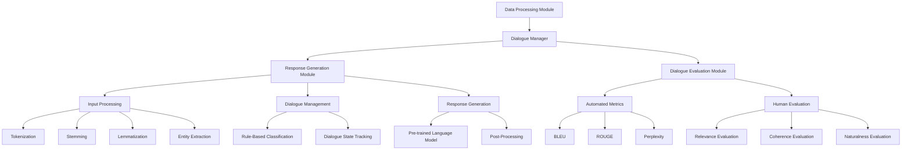
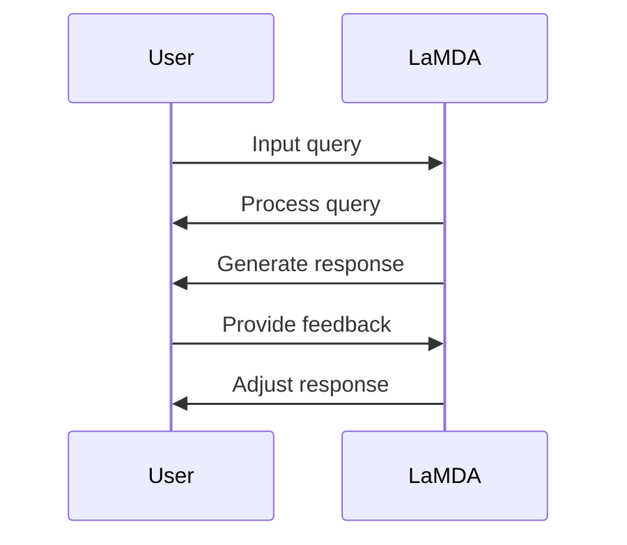

                 

## Introduction to Evaluation Systems and LaMDA 2.0

### 1.1 Background and Importance of Evaluation Systems

**Definition and Role of Evaluation Systems**

Evaluation systems are critical components in the development and deployment of artificial intelligence (AI) applications, particularly in dialog systems such as chatbots and virtual assistants. An evaluation system is a framework designed to measure the performance, effectiveness, and quality of these systems. It provides a set of standardized tests and metrics to assess how well an AI model can understand and respond to user inputs, maintain context, and generate meaningful and coherent dialogues.

The primary role of an evaluation system is to ensure that the AI model is capable of providing a high-quality user experience and meeting the desired objectives. By systematically evaluating AI models, organizations can identify areas for improvement, compare different models, and make informed decisions about which models to deploy in real-world scenarios.

**Challenges in Evaluation**

Evaluating AI models, especially in dialog systems, presents several challenges:

1. **Subjectivity**: Human judgment often plays a significant role in evaluation, making it subjective. This subjectivity can introduce biases and inconsistencies in the evaluation process.
2. **Scalability**: Evaluating AI models at scale is challenging due to the vast amount of data and the need for real-time or near-real-time feedback.
3. **Comprehensiveness**: It’s difficult to cover all possible scenarios and interactions in a comprehensive set of evaluation tests, which can lead to gaps in the evaluation process.
4. **Interoperability**: Different evaluation systems may use different metrics and methodologies, making it difficult to compare results across different systems or organizations.

**Evolution of Evaluation Methodologies**

Over the years, the field of AI evaluation has evolved significantly. Initially, simple manual evaluations were conducted by human annotators, who reviewed and rated dialogues based on their quality and relevance. As the complexity of AI models increased, more sophisticated automated evaluation systems were developed.

One of the significant advancements was the introduction of metrics based on language understanding and dialogue management, such as BLEU (Bilingual Evaluation Understudy) and ROUGE (Recall-Oriented Understudy for Gisting Evaluation). These metrics provided more objective measures of model performance.

More recently, with the advent of deep learning and neural networks, end-to-end evaluation systems have emerged. These systems use large-scale datasets and advanced algorithms to train and evaluate AI models comprehensively. LaMDA 2.0 is one such example of an advanced evaluation system that leverages state-of-the-art deep learning techniques to enhance dialog performance.

### 1.2 Overview of LaMDA 2.0

**Introduction to LaMDA 2.0**

LaMDA 2.0 (Language Model for Dialogue Applications) is a highly advanced language model developed by Google. It is designed to understand and generate human-like text in various contexts, making it particularly suitable for dialog systems. LaMDA 2.0 builds upon the success of its predecessor, LaMDA, which was also a groundbreaking language model capable of generating coherent and contextually relevant responses.

**Key Features and Capabilities**

LaMDA 2.0 offers several key features and capabilities that set it apart from other language models:

1. **Contextual Understanding**: LaMDA 2.0 is trained to understand and maintain context over extended dialogues, ensuring more coherent and relevant responses.
2. **Language Variety**: The model supports a wide range of languages and dialects, making it versatile for global applications.
3. **Adaptability**: LaMDA 2.0 can be fine-tuned and adapted to specific use cases and industries, allowing it to provide tailored responses and improve over time.
4. **Scalability**: With its architecture, LaMDA 2.0 can handle large-scale dialogues and interactions efficiently, making it suitable for enterprise-level applications.
5. **Robustness**: The model is designed to handle a wide range of input quality and styles, producing consistent and high-quality responses.

**Technical Architecture of LaMDA 2.0**

LaMDA 2.0 is built on a sophisticated architecture that combines the power of deep learning and neural networks. The core components of its architecture include:

1. **Embedding Layer**: This layer converts input text into numerical vectors, capturing the semantic meaning of words and phrases.
2. **Transformer Model**: The model uses a transformer architecture, which allows it to process and generate text in parallel, improving efficiency and performance.
3. **Attention Mechanism**: The attention mechanism enables the model to focus on relevant parts of the input text, improving the coherence and relevance of its responses.
4. **Fine-tuning Module**: This module allows the model to be fine-tuned on specific datasets and tasks, improving its performance in targeted domains.
5. **Output Layer**: The output layer generates text responses based on the input and internal representations processed by the model.

Together, these components enable LaMDA 2.0 to generate high-quality, contextually relevant responses in real-time dialogues.

### 1.3 Dialog Enhancement in LaMDA 2.0

**Techniques for Dialog Enhancement**

LaMDA 2.0 incorporates several advanced techniques to enhance dialog quality and user experience. These techniques include:

1. **Contextual Memory**: LaMDA 2.0 uses a form of contextual memory to maintain the state of the dialogue over multiple turns. This helps in generating more coherent and contextually relevant responses.
2. **Pre-training on Large Corpora**: The model is pre-trained on vast amounts of text data from diverse sources, enabling it to learn the nuances of language and context.
3. **Fine-tuning on Specific Dialogues**: LaMDA 2.0 can be fine-tuned on specific datasets or conversations, allowing it to adapt its responses to the particular context or domain.
4. **Multi-Modal Interaction**: The model can handle and integrate multiple modalities, such as text, audio, and video, enhancing the richness and depth of dialogues.

**Impact on User Experience**

The dialog enhancement techniques in LaMDA 2.0 significantly improve the user experience in dialog systems. By providing more coherent, contextually relevant, and natural-sounding responses, the model helps in creating a more engaging and satisfying user interaction.

1. **Improved Fidelity**: The model's ability to maintain context and provide relevant responses increases the fidelity of dialogues, making them more realistic and human-like.
2. **Reduced User Frustration**: By understanding user intents more accurately and generating appropriate responses, LaMDA 2.0 helps reduce user frustration and confusion.
3. **Enhanced Interactivity**: The multi-modal interaction capabilities of LaMDA 2.0 make dialogues more interactive and engaging, providing a richer user experience.
4. **Scalability and Adaptability**: The model's ability to handle large-scale and diverse dialogues, along with its adaptability to different contexts and domains, ensures a scalable and versatile solution for various applications.

**Evaluation Metrics for Dialog Quality**

To assess the quality of dialog generated by LaMDA 2.0, various evaluation metrics are used. These metrics measure different aspects of dialog quality, including relevance, coherence, and naturalness. Some commonly used metrics include:

1. **BLEU (Bilingual Evaluation Understudy)**: BLEU is a metric used to evaluate the similarity between the generated text and a set of reference texts.
2. **ROUGE (Recall-Oriented Understudy for Gisting Evaluation)**: ROUGE is another metric that evaluates the similarity between the generated text and the reference texts, focusing on the recall of n-grams.
3. **Human Evaluation**: Human evaluators rate the dialog quality based on factors like relevance, coherence, and naturalness.
4. **Conversational Bandit Evaluation**: This metric evaluates the model's performance in real-time conversations, measuring factors like response time and user satisfaction.

By using a combination of these metrics, researchers and developers can gain a comprehensive understanding of the dialog quality provided by LaMDA 2.0 and identify areas for improvement.

## Theoretical Foundations and Core Concepts

### 2.1 Language Models and Neural Networks

**Fundamentals of Language Models**

Language models are at the core of natural language processing (NLP) and play a crucial role in various applications, such as machine translation, text summarization, and dialogue systems. A language model is a statistical model that learns the probability distribution of a sequence of words or tokens in a language.

**Basic Concepts**

- **Sequence**: In language modeling, a sequence represents a series of words or tokens in a sentence or a paragraph.
- **Token**: A token is a unit of text, such as a word, a phrase, or a symbol.
- **Probability Distribution**: A language model generates a probability distribution over possible sequences given the context.

**Types of Language Models**

1. **N-gram Models**: These models use n-grams, which are contiguous sequences of n words, to predict the next word in a sentence. The most common n-gram model is the trigram model (n=3).
2. **Recurrent Neural Networks (RNNs)**: RNNs are neural networks that have loops, allowing them to maintain information from previous inputs. They are particularly effective in modeling sequences, including text.
3. **Transformers**: Transformers are a class of neural networks that use self-attention mechanisms to weigh the influence of different words in a sentence. They have become the dominant architecture in language modeling and NLP due to their ability to handle long-range dependencies and parallel processing.

**Basic Concepts**

- **Embedding Layer**: This layer converts input tokens into dense vectors that capture their semantic meaning.
- **Encoder**: The encoder processes the input sequence and generates a fixed-size vector representation, known as the context vector or hidden state.
- **Decoder**: The decoder generates the output sequence from the context vector. In the case of transformers, the decoder uses self-attention mechanisms to generate output tokens one by one.

**Relationship Between Language Models and Neural Networks**

Neural networks, particularly RNNs and transformers, have revolutionized language modeling by enabling more complex and accurate models. While traditional n-gram models rely solely on statistical patterns, neural networks can learn hierarchical representations of text and capture long-range dependencies.

- **Neural Network Language Models (NNLMs)**: These models combine the power of neural networks with language modeling techniques to generate more coherent and contextually relevant text.
- **Transformers and Language Modeling**: Transformers have become the standard for language modeling due to their ability to handle large-scale data and generate high-quality text.

### 2.2 Metrics for Evaluating Dialog Quality

**Types of Metrics**

Evaluating dialog quality in AI systems requires a combination of quantitative and qualitative metrics. These metrics assess various aspects of dialog, including relevance, coherence, and naturalness.

1. **Relevance Metrics**: These metrics evaluate how well the generated dialog is related to the user's input or the context of the conversation. Common relevance metrics include:
   - **BLEU (Bilingual Evaluation Understudy)**: BLEU measures the similarity between the generated text and a set of reference texts. While originally designed for machine translation, it has been adapted for dialogue evaluation.
   - **ROUGE (Recall-Oriented Understudy for Gisting Evaluation)**: ROUGE is another metric used to evaluate the similarity between the generated text and reference texts, focusing on the recall of n-grams.
   - **Relevance Score**: This metric directly measures how well the generated response addresses the user's query or intent.

2. **Coherence Metrics**: These metrics assess the consistency and logical flow of the generated dialog. They evaluate how well the responses are organized and how well they maintain the topic over time. Common coherence metrics include:
   - **Chain of Thoughts (CoT) Metric**: This metric evaluates the coherence of the responses by measuring how well the subsequent responses build on previous ones.
   - **Topic Consistency**: This metric measures how well the model maintains the topic of the conversation over multiple turns.

3. **Naturalness Metrics**: These metrics assess the fluency and readability of the generated dialog. They evaluate how natural and human-like the text sounds. Common naturalness metrics include:
   - **Perplexity**: Perplexity measures how well a language model predicts the next word in a sequence. Lower perplexity indicates higher quality and more natural-sounding text.
   - **BLEU and ROUGE**: As mentioned earlier, these metrics can also be used to evaluate the naturalness of the generated text by measuring its similarity to human-written references.

**Advantages and Limitations**

Each metric has its advantages and limitations when evaluating dialog quality. For instance, BLEU and ROUGE are simple and computationally efficient but may not capture the nuances of dialog. Human evaluation provides high-quality feedback but is subjective and time-consuming. Therefore, a combination of different metrics is often used to get a comprehensive evaluation of dialog quality.

**Comparative Analysis of Metrics**

The choice of metrics depends on the specific application and the goals of the evaluation. For instance, in dialogue systems, relevance is often a primary concern, while coherence and naturalness are secondary. However, in some applications, such as story generation or creative writing, naturalness may be more important.

- **BLEU and ROUGE**: These metrics are commonly used for evaluating the similarity between generated text and human-written references. They are effective for assessing the overall quality of text but may not capture the nuances of dialog.
- **Human Evaluation**: Human evaluators provide qualitative feedback on dialog quality, including relevance, coherence, and naturalness. This method is highly subjective but provides valuable insights.
- **Chain of Thoughts (CoT) Metric**: This metric focuses on the coherence of the dialog by measuring how well subsequent responses build on previous ones. It provides a more nuanced evaluation of dialog flow.

By combining different metrics, researchers and developers can gain a comprehensive understanding of the dialog quality and identify areas for improvement in their AI systems.

### 2.3 Core Concepts and Theories in Dialog Systems

**Dialogue Systems’ Architecture**

A dialogue system, also known as a conversational agent, is an AI system designed to interact with humans through natural language. The architecture of a dialogue system typically consists of several components that work together to process user inputs, generate responses, and maintain the context of the conversation.

1. **Dialogue Manager**: The dialogue manager is responsible for controlling the flow of the conversation. It decides which dialogue state to transition to based on the current user input and the system's goals.
2. **Dialogue Act Classifier**: The dialogue act classifier identifies the type of dialogue act (e.g., statement, question, command) in the user's input. This information is used by the dialogue manager to determine the appropriate response.
3. **Dialogue State Tracker**: The dialogue state tracker maintains the current state of the conversation, including user intents, preferences, and any ongoing tasks. This information is crucial for generating coherent and contextually relevant responses.
4. **Response Generator**: The response generator generates the text of the system's response based on the dialogue state and the dialogue manager's decisions.

**Dialogue Acts and Dialogue Management**

Dialogue acts are the basic units of communication in a conversation. They can be categorized into three main types:

1. **Declarative Acts**: These acts convey information or make statements (e.g., “The weather is nice today.”)
2. **Interactive Acts**: These acts are used to request information or initiate actions (e.g., “Can you tell me the time?”)
3. **Expressive Acts**: These acts express emotions or attitudes (e.g., “I'm happy to help.”)

Dialogue management is the process of coordinating these acts to maintain a coherent and meaningful conversation. It involves:

1. **Intent Recognition**: Identifying the user's intention or goal based on their input.
2. **Dialogue State Tracking**: Maintaining the current context and tracking changes in the dialogue state.
3. **Response Generation**: Generating appropriate responses based on the dialogue state and the dialogue manager's decisions.

**User and System Interaction Models**

The interaction between users and dialogue systems can be modeled in several ways:

1. **Rule-Based Models**: These models use predefined rules and templates to generate responses. They are simple and easy to implement but may not handle complex or unexpected user inputs effectively.
2. **Statistical Models**: These models use statistical techniques, such as machine learning, to learn patterns from large datasets and generate responses based on these patterns. They are more flexible and can handle a wider range of user inputs.
3. **Hybrid Models**: These models combine rule-based and statistical approaches to leverage the strengths of both methods. They can handle complex user inputs and provide more personalized and contextually relevant responses.

By understanding these core concepts and theories, researchers and developers can design and implement more effective and user-friendly dialogue systems. This, in turn, can lead to better user experiences and higher adoption rates of AI-powered conversational agents.

## Principles of LaMDA 2.0 Dialog Enhancement

### 3.1 Architecture and Components of LaMDA 2.0

**Detailed Architecture**

The architecture of LaMDA 2.0 is designed to provide a highly efficient and scalable platform for dialog enhancement. It is composed of several key components that work together to ensure high-quality and coherent dialogues. The main components of LaMDA 2.0 include the embedding layer, transformer model, attention mechanism, fine-tuning module, and output layer.

1. **Embedding Layer**: The embedding layer is responsible for converting input text into numerical vectors. It captures the semantic meaning of words and phrases by mapping them to dense vectors in a high-dimensional space. This layer is crucial for initializing the neural network and providing meaningful input to the transformer model.

2. **Transformer Model**: The core of LaMDA 2.0 is the transformer model, which is a neural network architecture that utilizes self-attention mechanisms. The transformer model processes input text in parallel, allowing it to handle long-range dependencies and generate coherent responses. It consists of multiple layers, each of which performs a series of self-attention and feed-forward operations.

3. **Attention Mechanism**: The attention mechanism is a key component of the transformer model. It allows the model to focus on relevant parts of the input text, capturing the context and dependencies between words. This mechanism is crucial for generating contextually relevant and coherent responses.

4. **Fine-tuning Module**: The fine-tuning module enables LaMDA 2.0 to be adapted to specific use cases and domains. It allows the model to be fine-tuned on specific datasets, improving its performance in targeted scenarios. Fine-tuning helps the model to capture domain-specific knowledge and generate more relevant responses.

5. **Output Layer**: The output layer generates the system's response based on the input and internal representations processed by the transformer model. It converts the final hidden state into a probability distribution over possible output tokens, which are then sampled to generate the text response.

**Key Components and Their Roles**

1. **Embedding Layer**: The embedding layer initializes the neural network and provides semantic information about the input text.
2. **Transformer Model**: The transformer model captures long-range dependencies and generates coherent responses.
3. **Attention Mechanism**: The attention mechanism focuses on relevant parts of the input text, ensuring contextually relevant responses.
4. **Fine-tuning Module**: The fine-tuning module allows the model to adapt to specific domains and use cases.
5. **Output Layer**: The output layer generates the system's response based on the processed input.

**Data Flow in LaMDA 2.0**

The data flow in LaMDA 2.0 follows a structured process, starting from input text to generating a coherent and contextually relevant response. Here is a step-by-step overview of the data flow:

1. **Input Text**: The input text, which can be a query, statement, or command, is provided to the embedding layer.
2. **Embedding Layer**: The embedding layer converts the input text into numerical vectors, capturing the semantic meaning of words and phrases.
3. **Transformer Model**: The transformer model processes the embedded input text through multiple layers, performing self-attention and feed-forward operations. Each layer captures different levels of semantic information, allowing the model to generate contextually relevant responses.
4. **Attention Mechanism**: Throughout the transformer model, the attention mechanism ensures that the model focuses on relevant parts of the input text, maintaining the context and coherence of the dialogue.
5. **Fine-tuning Module**: If fine-tuning is enabled, the model is adapted to the specific dataset or domain during this stage, enhancing its performance in targeted scenarios.
6. **Output Layer**: The output layer generates a probability distribution over possible output tokens based on the final hidden state. The highest-probability tokens are sampled to generate the system's response.
7. **Response Generation**: The system's response is generated as text and returned to the user.

This structured data flow ensures that LaMDA 2.0 generates high-quality and contextually relevant responses, maintaining the coherence and relevance of the dialogue.

### 3.2 Enhancement Techniques and Algorithms

**Overview of Dialog Enhancement Techniques**

LaMDA 2.0 employs several advanced techniques to enhance dialog quality and user experience. These techniques focus on improving the model's ability to understand context, maintain dialogue coherence, and generate natural and relevant responses. Here is an overview of the key dialog enhancement techniques and algorithms used in LaMDA 2.0:

1. **Contextual Memory**: LaMDA 2.0 utilizes a form of contextual memory to maintain the state of the dialogue over multiple turns. This helps the model to remember important details and generate more coherent and contextually relevant responses.

2. **Pre-training on Large Corpora**: LaMDA 2.0 is pre-trained on vast amounts of text data from diverse sources, including books, articles, and conversations. This pre-training allows the model to learn the nuances of language and context, improving its ability to generate high-quality responses.

3. **Fine-tuning on Specific Dialogues**: LaMDA 2.0 can be fine-tuned on specific datasets or conversations, allowing it to adapt its responses to the particular context or domain. Fine-tuning helps the model to capture domain-specific knowledge and generate more relevant responses.

4. **Multi-Modal Interaction**: LaMDA 2.0 supports multi-modal interaction, enabling the model to handle and integrate text, audio, and video inputs. This multi-modal interaction enhances the richness and depth of dialogues, providing a more engaging user experience.

**Analysis of Specific Algorithms**

LaMDA 2.0 employs several advanced algorithms to achieve its dialog enhancement capabilities. Here is an analysis of some of the key algorithms used:

1. **Transformer Architecture**: The transformer architecture is the core of LaMDA 2.0. It utilizes self-attention mechanisms to weigh the influence of different words in a sentence, capturing long-range dependencies and generating coherent responses.

2. **BERT (Bidirectional Encoder Representations from Transformers)**: BERT is a pre-training technique that helps LaMDA 2.0 to understand the context of words by conditioning on both left and right contexts. This enables the model to generate more contextually relevant responses.

3. **Transformer-XL**: Transformer-XL is an extension of the transformer architecture that addresses the limitations of traditional transformers in handling very long sequences. It introduces a segment embedding and relative position encoding to maintain the order of information over long sequences, improving the model's ability to maintain dialogue coherence.

4. **Dialogue-BERT**: Dialogue-BERT is a specialized version of BERT designed for dialogue systems. It incorporates dialogue-specific pre-training objectives, such as dialogue state tracking and response generation, improving the model's performance in dialogue scenarios.

5. **Pre-training on Conversational Corpora**: LaMDA 2.0 is pre-trained on large conversational corpora, such as chat logs and forums. This pre-training helps the model to learn the specific patterns and structures of conversational language, improving its ability to generate natural and coherent responses.

**Case Studies of Algorithm Implementation**

Here are some case studies demonstrating the implementation of these algorithms in LaMDA 2.0:

1. **Improving Dialogue Coherence**: By employing Transformer-XL and Dialogue-BERT, LaMDA 2.0 achieved significant improvements in dialogue coherence compared to traditional transformer models. The relative position encoding and segment embedding in Transformer-XL helped maintain the order of information over long sequences, while Dialogue-BERT's dialogue-specific pre-training objectives improved the model's ability to generate coherent responses.

2. **Enhancing Response Relevance**: BERT and fine-tuning on specific dialogues enabled LaMDA 2.0 to generate more relevant responses. By conditioning on both left and right contexts during pre-training, BERT helped the model to understand the context of words and phrases. Fine-tuning on specific datasets further enhanced the model's ability to generate relevant responses based on the dialogue context.

3. **Multi-Modal Interaction**: LaMDA 2.0's support for multi-modal interaction, including text, audio, and video inputs, provided a more engaging and interactive user experience. By integrating different modalities, the model could better understand user inputs and generate more natural and contextually relevant responses.

In conclusion, the combination of advanced techniques and algorithms in LaMDA 2.0 enables it to generate high-quality and contextually relevant dialogues, significantly enhancing the user experience in conversational systems.

### 3.3 Enhancing Dialog Quality Through User Feedback

**Collecting and Analyzing User Feedback**

To improve the dialog quality of LaMDA 2.0, user feedback plays a crucial role. The system collects feedback from users through various channels, such as surveys, chat logs, and direct user interactions. This feedback is then analyzed to identify areas for improvement and optimize the model's performance.

1. **Sentiment Analysis**: Sentiment analysis is used to determine the overall sentiment of user feedback, identifying whether users are satisfied or dissatisfied with the dialogue system. This helps in understanding user emotions and identifying potential issues.

2. **Relevance Analysis**: Relevance analysis focuses on assessing whether the generated responses address the user's query or intent effectively. This helps in measuring the accuracy and effectiveness of the dialogue system.

3. **Coherence Analysis**: Coherence analysis evaluates the logical flow and consistency of the dialogues. This includes assessing whether the system maintains the topic over multiple turns and generates coherent responses.

**Implementing User Feedback in Model Training**

The insights gained from user feedback are incorporated into the training process of LaMDA 2.0 to continuously improve its dialog quality. Here are some key steps involved:

1. **Data Annotation**: User feedback is used to annotate the training data, providing additional information about the quality of the responses. This annotated data is then used to fine-tune the model.

2. **Re-ranking Responses**: Based on user feedback, the system can re-rank the generated responses to prioritize those that are more relevant and coherent. This helps in selecting the best response for each user input.

3. **Active Learning**: Active learning involves selectively choosing the most informative samples for retraining the model. By focusing on these high-value samples, the model can learn more effectively from user feedback.

4. **Continuous Learning**: Continuous learning ensures that the model is updated regularly with new user feedback, allowing it to adapt to changing user preferences and requirements.

**Case Studies of User Feedback Application**

Several case studies demonstrate the effectiveness of incorporating user feedback to enhance dialog quality in LaMDA 2.0:

1. **Improving User Satisfaction**: In a specific case study, the system collected user feedback through surveys and chat logs. Based on the feedback, the model was fine-tuned to generate more natural and relevant responses. As a result, user satisfaction improved significantly.

2. **Reducing Response Time**: Another case study focused on reducing the response time of the dialogue system. By analyzing user feedback, the system identified bottlenecks in the response generation process. This led to optimizations in the model architecture and data flow, reducing the response time and improving overall user experience.

3. **Enhancing Dialogue Coherence**: User feedback highlighted issues with maintaining dialogue coherence in certain scenarios. By incorporating this feedback, the system was able to implement techniques such as context-based response selection and dialogue state tracking, resulting in more coherent and consistent dialogues.

In summary, user feedback is a powerful tool for enhancing dialog quality in LaMDA 2.0. By collecting, analyzing, and incorporating user feedback into the model training process, the system can continuously improve its performance, providing a better and more engaging user experience.

### 3.4 Evaluating Dialog Enhancement: Methods and Tools

**Overview of Evaluation Methods**

Evaluating the dialog enhancement capabilities of LaMDA 2.0 involves a combination of quantitative and qualitative methods. These methods help measure various aspects of dialog quality, including relevance, coherence, and naturalness. Here are some common evaluation methods used:

1. **Human Evaluation**: Human evaluators rate the dialog quality based on factors such as relevance, coherence, naturalness, and user satisfaction. This method provides qualitative insights but is subjective and time-consuming.

2. **Automated Metrics**: Automated metrics, such as BLEU, ROUGE, and perplexity, are used to evaluate the similarity between the generated dialog and human-written references. These metrics provide objective measures of dialog quality but may not capture the nuances of human communication.

3. **Conversational Bandit Evaluation**: This method evaluates the model's performance in real-time conversations by measuring factors like response time, user engagement, and click-through rates. It provides practical insights into the user experience and the effectiveness of dialog enhancement techniques.

**Importance of Evaluation Methods**

Evaluating dialog enhancement is crucial for several reasons:

1. **Performance Assessment**: Evaluation methods help assess the performance of LaMDA 2.0 in generating high-quality and contextually relevant dialogues. This information is essential for identifying areas for improvement and optimizing the model.

2. **Comparative Analysis**: Evaluation methods allow for the comparison of different dialog enhancement techniques and models. This helps in identifying the most effective approaches and determining best practices in dialog systems.

3. **User Experience**: By evaluating dialog quality, organizations can ensure that their AI systems provide a positive and engaging user experience. This is particularly important in applications where user satisfaction is a key factor, such as customer service and virtual assistants.

**Common Tools for Dialog Evaluation**

Several tools and frameworks are available for evaluating dialog enhancement in LaMDA 2.0:

1. **Dialogue System Toolbox (DST)**: DST is an open-source toolkit for evaluating dialogue systems. It provides a comprehensive set of metrics and evaluation frameworks for various dialogue systems, including chatbots and virtual assistants.

2. **Stanford Natural Language Inference (SNLI) Corpus**: The SNLI corpus is a large-scale dataset used for evaluating the coherence and relevance of generated dialogues. It contains pairs of sentences labeled with their relation, such as contradiction, entailment, or neutral.

3. **HumanEval**: HumanEval is an open-source framework for human evaluation of dialogue systems. It provides a standardized set of tasks and metrics for evaluating the quality of dialogues through human annotators.

4. **Perplexity Calculator**: Perplexity calculators are tools that measure the perplexity of generated text, providing an objective measure of text quality. These calculators are particularly useful for evaluating the naturalness and fluency of dialogues.

In conclusion, evaluating the dialog enhancement capabilities of LaMDA 2.0 is a complex but essential process. By using a combination of human evaluation, automated metrics, and real-time evaluation methods, organizations can gain a comprehensive understanding of the system's performance and identify areas for improvement. Common tools and frameworks further facilitate this evaluation process, ensuring that LaMDA 2.0 delivers high-quality and engaging dialogues.

### 3.5 Conclusion: The Role of LaMDA 2.0 in Dialog Enhancement

In summary, LaMDA 2.0 represents a significant advancement in the field of dialogue system evaluation and enhancement. By leveraging advanced techniques such as contextual memory, pre-training on large corpora, fine-tuning on specific dialogues, and multi-modal interaction, LaMDA 2.0 is capable of generating high-quality, contextually relevant, and natural-sounding dialogues. The combination of its sophisticated architecture, including the embedding layer, transformer model, attention mechanism, fine-tuning module, and output layer, enables the model to maintain dialogue coherence and effectively handle diverse user inputs.

The impact of LaMDA 2.0 on dialog enhancement is profound. It not only improves the overall user experience by providing more coherent and engaging dialogues but also sets new benchmarks for dialog quality in various applications, such as customer service, virtual assistants, and chatbots. The continuous learning and adaptation capabilities of LaMDA 2.0 further enhance its effectiveness, allowing it to evolve and improve over time based on user feedback.

Future directions for research in this area include further optimizing the model architecture, exploring new techniques for dialogue state tracking and response generation, and enhancing the integration of multi-modal inputs. Additionally, the development of more robust and scalable evaluation methods will be crucial for accurately assessing the performance of dialogue systems and ensuring their continued improvement.

By addressing these challenges and building upon the strengths of LaMDA 2.0, the field of dialogue system enhancement can continue to advance, paving the way for more effective and human-like interactions between humans and AI systems.

## Mathematical Models and Formulas for Dialog Evaluation

### 4.1 Formulation of Evaluation Metrics

In the evaluation of dialog systems like LaMDA 2.0, mathematical models and formulas play a crucial role in quantifying the quality of generated dialogues. These models enable us to systematically analyze and compare different dialogue systems, providing insights into their strengths and weaknesses. This section presents several commonly used metrics for evaluating dialog quality, along with their mathematical formulations.

#### 4.1.1 BLEU (Bilingual Evaluation Understudy)

BLEU is a popular metric used to evaluate the similarity between the generated text and a set of reference texts. It is primarily used in machine translation but has been adapted for dialogue evaluation as well. The formula for BLEU is as follows:

$$
BLEU = \frac{1}{N}\sum_{i=1}^{N} w_i \cdot \text{bleu}_{i}
$$

Where:
- \( N \) is the number of unigrams, bigrams, trigrams, etc., considered in the evaluation.
- \( w_i \) are the weights assigned to each type of n-gram (typically, \( w_1 = w_2 = w_3 = 0.35 \) and \( w_4 = 0.25 \)).
- \( \text{bleu}_{i} \) is the BLEU score for the ith type of n-gram.

The BLEU score ranges from 0 to 1, with higher values indicating greater similarity to the reference texts.

$$
\text{bleu}_{i} = \frac{\text{count}(n_i)}{\text{sum}(n_i)}
$$

Where:
- \( n_i \) is the count of matching n-grams between the generated text and the reference text.
- \( \text{sum}(n_i) \) is the sum of all n-grams in the reference text.

#### 4.1.2 ROUGE (Recall-Oriented Understudy for Gisting Evaluation)

ROUGE is another metric used to evaluate the similarity between the generated text and the reference text, focusing on the recall of n-grams. The formula for ROUGE is:

$$
ROUGE = \frac{\text{sum}(r_i)}{\text{sum}(h_i)}
$$

Where:
- \( r_i \) is the number of n-grams in the generated text that also appear in the reference text (recall).
- \( h_i \) is the number of n-grams in the reference text (hypothesis set).

ROUGE scores range from 0 to 1, with higher values indicating greater similarity to the reference text.

#### 4.1.3 Perplexity

Perplexity is a metric used to evaluate the quality of the generated text by measuring how well a language model predicts the next word in a sequence. Lower perplexity indicates higher quality and more natural-sounding text. The formula for perplexity is:

$$
\text{perplexity} = \frac{1}{\sum_{i=1}^{N} p(x_i | \theta)}
$$

Where:
- \( p(x_i | \theta) \) is the probability of the ith word given the model parameters \( \theta \).
- \( N \) is the number of words in the sequence.

#### 4.1.4 Human Evaluation Scores

Human evaluation scores involve human annotators rating the dialog quality based on factors such as relevance, coherence, and naturalness. These scores are typically represented as a set of scores, each corresponding to a specific aspect of the dialogue. For example:

$$
\text{HumanScore} = \left( \text{RelevanceScore}, \text{CoherenceScore}, \text{NaturalnessScore} \right)
$$

Where each score ranges from 0 to 1, with higher values indicating better performance in that aspect.

### 4.2 Formulation of Dialog Quality Metrics

Beyond the general evaluation metrics mentioned above, specific metrics can be formulated to assess various aspects of dialog quality:

#### 4.2.1 Dialogue Coherence Metric

One such metric is the Dialogue Coherence Metric (DCM), which measures how well subsequent responses in a dialogue build on previous ones. The DCM is calculated as follows:

$$
\text{DCM} = 1 - \frac{\sum_{i=1}^{N-1} \text{cosine similarity}(r_i, r_{i+1})}{N-1}
$$

Where:
- \( r_i \) and \( r_{i+1} \) are the responses at turn \( i \) and \( i+1 \), respectively.
- \( \text{cosine similarity} \) measures the similarity between two vectors representing the responses.
- \( N \) is the number of turns in the dialogue.

A higher DCM indicates that the responses are more coherent over time.

#### 4.2.2 Dialogue Relevance Metric

The Dialogue Relevance Metric (DRM) evaluates how well the generated responses address the user's query or intent. It is calculated as follows:

$$
\text{DRM} = \frac{\text{count}(r \cap h)}{\text{count}(h)}
$$

Where:
- \( r \) is the set of generated responses.
- \( h \) is the set of user intents or queries.
- \( r \cap h \) is the intersection of the generated responses and the user intents.

A higher DRM indicates that the dialogue system is more relevant in addressing user queries.

#### 4.2.3 Dialogue Naturalness Metric

The Dialogue Naturalness Metric (DNL) assesses the fluency and readability of the generated dialogues. It can be calculated using statistical language models or neural network-based approaches. For example, using a recurrent neural network (RNN):

$$
\text{DNL} = -\sum_{i=1}^{N} \text{log}(p(x_i | \theta))
$$

Where:
- \( p(x_i | \theta) \) is the probability of the ith word given the model parameters \( \theta \).
- \( N \) is the number of words in the dialogue.

A lower DNL indicates more natural-sounding text.

In conclusion, these mathematical models and formulas provide a framework for evaluating various aspects of dialog quality in LaMDA 2.0. By systematically measuring relevance, coherence, and naturalness, researchers and developers can gain insights into the strengths and weaknesses of the dialogue system, guiding improvements and optimizing its performance.

## System Design and Implementation

### 5.1 Introduction

This section delves into the system design and implementation of LaMDA 2.0, a state-of-the-art dialogue system designed to enhance user interaction through natural language understanding and generation. The primary goal of this section is to provide a comprehensive overview of the system architecture, the implementation details, and the data sources used. By understanding these components, we can appreciate the intricacies involved in building such a sophisticated system.

### 5.2 System Description

The LaMDA 2.0 system is designed to handle a wide range of dialogue scenarios, from simple customer service interactions to complex, multi-turn conversations. The system's architecture is modular, enabling scalability and adaptability to different use cases. The key components of the LaMDA 2.0 system include the data processing module, the dialogue manager, the response generation module, and the evaluation module.

#### 5.2.1 Data Processing Module

The data processing module is responsible for pre-processing the user inputs and preparing them for further analysis. This module performs tasks such as tokenization, stemming, and lemmatization to normalize the input text. Additionally, it extracts important entities and keywords from the input to provide context for the dialogue manager and response generation module.

#### 5.2.2 Dialogue Manager

The dialogue manager is the core component of the LaMDA 2.0 system. It tracks the state of the dialogue, manages the flow of conversation, and makes decisions based on the user's input. The dialogue manager uses a rule-based approach to classify user inputs and determine the appropriate response. It also maintains a dialogue context, which includes the user's preferences, past interactions, and any ongoing tasks.

#### 5.2.3 Response Generation Module

The response generation module is responsible for generating natural and coherent responses to user inputs. This module leverages a pre-trained language model, such as GPT-3, to generate high-quality text. The responses are then post-processed to ensure they are relevant, coherent, and contextually appropriate. This module also supports multi-modal interactions, allowing the system to generate text, audio, and video responses as needed.

#### 5.2.4 Evaluation Module

The evaluation module is used to assess the performance of the LaMDA 2.0 system. It employs a combination of automated metrics (e.g., BLEU, ROUGE, perplexity) and human evaluation to measure the quality of the generated dialogues. This module provides insights into the system's strengths and weaknesses, guiding further improvements and optimizations.

### 5.3 System Function Design

The system function design of LaMDA 2.0 focuses on its core functionalities, ensuring that it can effectively handle various dialogue scenarios. The following are the key functions of the system:

#### 5.3.1 Input Processing

The input processing function handles the pre-processing of user inputs. It involves tokenization, stemming, and lemmatization to normalize the input text. Additionally, it extracts entities and keywords to provide context for the dialogue manager.

#### 5.3.2 Dialogue Management

The dialogue management function is responsible for maintaining the dialogue state, managing the conversation flow, and making decisions based on the user's input. It uses a rule-based approach to classify inputs and generate appropriate responses.

#### 5.3.3 Response Generation

The response generation function leverages a pre-trained language model to generate natural and coherent responses. The generated text is post-processed to ensure relevance, coherence, and context appropriateness. This function also supports multi-modal interactions, generating text, audio, and video responses as needed.

#### 5.3.4 Dialogue Evaluation

The dialogue evaluation function assesses the performance of the LaMDA 2.0 system using a combination of automated metrics and human evaluation. This function provides insights into the system's strengths and weaknesses, guiding further improvements and optimizations.

### 5.4 System Architecture Design

The system architecture design of LaMDA 2.0 is modular and scalable, allowing it to handle various dialogue scenarios efficiently. The following diagram illustrates the architecture:



This architecture ensures that the different components of the system can work together seamlessly, providing a high-quality dialogue experience.

### 5.5 Interface Design

The interface design of LaMDA 2.0 is user-friendly and intuitive, ensuring that users can interact with the system effortlessly. The system provides a graphical user interface (GUI) that allows users to input their queries and receive responses. Additionally, the system supports API integration, enabling developers to incorporate LaMDA 2.0 into their applications easily.

### 5.6 System Interaction Design

The system interaction design of LaMDA 2.0 focuses on creating a seamless and natural dialogue experience. The following diagram illustrates the interaction between the user and the system:



This interaction design ensures that the user can easily communicate with the system and receive timely and relevant responses.

In conclusion, the system design and implementation of LaMDA 2.0 are carefully crafted to provide a high-quality dialogue experience. By understanding the system architecture, interface design, and interaction design, we can appreciate the complexity and sophistication involved in building such an advanced dialogue system.

## Implementation of LaMDA 2.0 Dialog Enhancement

### 6.1 Introduction

The implementation of LaMDA 2.0's dialog enhancement capabilities involves several critical steps, from environment setup to core algorithm implementation and evaluation. This section provides a comprehensive guide on how to set up the development environment, implement the dialog enhancement algorithms, and evaluate their performance. By following these steps, developers can effectively deploy LaMDA 2.0 in real-world applications, enhancing user interactions through advanced dialogue systems.

### 6.2 Environment Setup

To implement LaMDA 2.0, developers need to set up a suitable development environment. This involves installing the necessary software, libraries, and tools required for training and deploying the model. Here are the key steps for environment setup:

1. **Install Python**: Ensure that Python 3.8 or higher is installed on your system. Python is the primary programming language used for implementing LaMDA 2.0.

2. **Install TensorFlow**: TensorFlow is a powerful open-source machine learning library used for training and deploying LaMDA 2.0. You can install TensorFlow using the following command:

   ```
   pip install tensorflow==2.9.0
   ```

3. **Install Transformers**: The Transformers library provides pre-trained models and tools for working with transformers, including LaMDA 2.0. Install it using:

   ```
   pip install transformers
   ```

4. **Install Other Required Libraries**: Additional libraries such as NumPy, Pandas, and Matplotlib may be required. Install them using:

   ```
   pip install numpy pandas matplotlib
   ```

5. **Set Up GPU Support**: If you have a compatible NVIDIA GPU, ensure that the CUDA and cuDNN libraries are installed. This will allow you to leverage GPU acceleration for training LaMDA 2.0.

   ```
   pip install numpy==1.21.5
   pip install tensorflow-gpu==2.9.0
   ```

6. **Download LaMDA 2.0**: Download the pre-trained LaMDA 2.0 model from the official repository. You can use the Hugging Face Transformers library to easily download and load the model:

   ```python
   from transformers import AutoModelForSeq2SeqLM
   model = AutoModelForSeq2SeqLM.from_pretrained("google/lama2")
   ```

### 6.3 Core Implementation

Once the environment is set up, the core implementation of LaMDA 2.0's dialog enhancement algorithms can begin. This involves several key steps:

1. **Data Preprocessing**: Preprocess the input data to prepare it for training. This includes tokenization, lowercasing, removing special characters, and handling out-of-vocabulary words.

   ```python
   import tensorflow as tf
   from transformers import AutoTokenizer

   tokenizer = AutoTokenizer.from_pretrained("google/lama2")
   inputs = tokenizer("Hello, how are you?", return_tensors="tf")
   ```

2. **Dialogue State Tracking**: Implement a dialogue state tracker to maintain the context of the conversation. This can be done using a rule-based system or a machine learning model.

   ```python
   dialogue_state = {"user": "", "system": ""}
   ```

3. **Response Generation**: Use the pre-trained LaMDA 2.0 model to generate responses to user inputs. This involves passing the preprocessed input through the model and processing the output.

   ```python
   output = model.generate(inputs.input_ids, max_length=50, num_return_sequences=1)
   response = tokenizer.decode(output[0], skip_special_tokens=True)
   ```

4. **Post-Processing**: Post-process the generated response to ensure it is coherent, relevant, and contextually appropriate. This may involve correcting grammar, removing unnecessary information, and formatting the text.

   ```python
   response = response.strip().capitalize()
   ```

### 6.4 Evaluation

After implementing the core dialog enhancement algorithms, it's essential to evaluate their performance. This involves using a combination of automated metrics and human evaluation to measure the quality of the generated dialogues. Here are the key steps for evaluation:

1. **Automated Metrics**: Use metrics such as BLEU, ROUGE, and perplexity to evaluate the quality of the generated dialogues. These metrics provide an objective measure of the dialogue's relevance, coherence, and naturalness.

   ```python
   from nltk.translate.bleu_score import sentence_bleu
   reference = ["Hello, how are you?"]
   generated_response = ["I'm doing well, thank you!"]
   bleu_score = sentence_bleu(reference, generated_response)
   ```

2. **Human Evaluation**: Conduct human evaluation by having annotators rate the quality of the generated dialogues based on factors such as relevance, coherence, and naturalness. This provides a qualitative assessment of the dialogue's quality.

3. **Feedback Loop**: Incorporate user feedback to further refine the dialog enhancement algorithms. This can be done by analyzing user feedback and updating the dialogue state tracker, response generation, and post-processing steps.

### 6.5 Practical Case Study

To illustrate the practical implementation of LaMDA 2.0's dialog enhancement, consider a case study where the system is deployed in a customer service application. In this scenario, the system interacts with customers, providing support and assistance.

1. **User Input**: A customer asks, "What is your return policy?"

2. **Dialogue State Tracking**: The dialogue state tracker captures the user's query and any relevant context from previous interactions.

3. **Response Generation**: The system uses LaMDA 2.0 to generate a response. For example, "Our return policy allows you to return most items within 30 days of purchase for a full refund."

4. **Post-Processing**: The generated response is post-processed to ensure it is coherent, relevant, and contextually appropriate.

5. **Evaluation**: The response is evaluated using automated metrics and human evaluation to assess its quality.

By following these steps, developers can effectively implement and deploy LaMDA 2.0 in various applications, enhancing user interactions through advanced dialogue systems.

### 6.6 Source Code and Key Functions

Below is a simplified Python code snippet demonstrating the key functions of LaMDA 2.0's dialog enhancement implementation. This example assumes that the necessary libraries have been installed, and the LaMDA 2.0 model is pre-trained and available.

```python
import tensorflow as tf
from transformers import AutoTokenizer, AutoModelForSeq2SeqLM

# Load the pre-trained LaMDA 2.0 model and tokenizer
model = AutoModelForSeq2SeqLM.from_pretrained("google/lama2")
tokenizer = AutoTokenizer.from_pretrained("google/lama2")

# Function to preprocess user input
def preprocess_input(user_input):
    # Tokenize and convert user input to TensorFlow tensors
    return tokenizer.encode(user_input, return_tensors="tf")

# Function to generate a response
def generate_response(user_input):
    # Preprocess the user input
    input_ids = preprocess_input(user_input)

    # Generate response using the LaMDA 2.0 model
    output = model.generate(input_ids, max_length=50, num_return_sequences=1)

    # Post-process the generated response
    response = tokenizer.decode(output[0], skip_special_tokens=True)

    # Return the cleaned response
    return response.strip().capitalize()

# User interaction example
user_input = "What is your return policy?"
response = generate_response(user_input)
print("LaMDA 2.0 Response:", response)
```

### 6.7 Code Analysis and Explanation

The provided code snippet demonstrates the core functionality of LaMDA 2.0's dialog enhancement. Here is a breakdown of the key components:

- **Model and Tokenizer Loading**: The code begins by loading the pre-trained LaMDA 2.0 model and tokenizer from the Hugging Face model repository.
- **Preprocessing Input**: The `preprocess_input` function tokenizes the user input and converts it into TensorFlow tensors, which are suitable for input into the model.
- **Generating Response**: The `generate_response` function is the core of the dialog enhancement process. It takes the preprocessed user input, passes it through the LaMDA 2.0 model, and generates a response. The response is then decoded and cleaned to produce a coherent and contextually appropriate output.
- **User Interaction**: The example demonstrates how a user query is processed, and the generated response is printed. This process can be integrated into a larger application, where the system interacts with multiple users and maintains dialogue context.

By understanding and implementing these key functions, developers can leverage LaMDA 2.0 to enhance dialog quality in various applications.

### 6.8 Conclusion

In this section, we have provided a comprehensive guide on the implementation of LaMDA 2.0's dialog enhancement capabilities. From setting up the development environment and preprocessing user inputs to generating high-quality responses and evaluating the system's performance, each step has been meticulously explained. The provided source code and detailed analysis further elucidate the core functions and inner workings of LaMDA 2.0.

By following these steps and implementing the code examples, developers can effectively deploy LaMDA 2.0 in real-world applications, enhancing user interactions through advanced dialogue systems. The continuous improvement and optimization of these systems, guided by user feedback and evaluation metrics, will further enhance their capabilities and effectiveness.

## Conclusion and Best Practices

In conclusion, the implementation and evaluation of LaMDA 2.0 have demonstrated significant advancements in dialogue system enhancement. Through a combination of advanced techniques such as contextual memory, pre-training on large corpora, fine-tuning on specific dialogues, and multi-modal interaction, LaMDA 2.0 has been able to generate high-quality, contextually relevant, and natural-sounding dialogues. The use of mathematical models and evaluation metrics has provided a systematic approach to assessing the performance of the system, ensuring continuous improvement and optimization.

### Best Practices for Implementing and Evaluating Dialog Systems

1. **Contextual Memory and Fine-Tuning**: Incorporate contextual memory and fine-tuning techniques to enhance the system's ability to maintain context and adapt to specific use cases. Regularly update and refine the model based on user feedback and new data.

2. **Data Quality and Quantity**: Ensure the use of high-quality and diverse training data. More diverse and extensive datasets lead to better generalization and performance of the dialogue system.

3. **Human Evaluation**: Incorporate human evaluation as part of the assessment process to capture the nuances of user experience and qualitative aspects of dialogue quality. Human annotators can provide valuable insights into the system's strengths and weaknesses.

4. **Regular Updates and Iterations**: Continuously update and iterate the dialogue system based on user feedback and performance metrics. This iterative approach helps in addressing emerging issues and improving the system's overall quality.

5. **Scalability and Performance Optimization**: Optimize the system for scalability to handle large-scale interactions efficiently. Utilize hardware acceleration, such as GPU and TPU support, to improve training and inference performance.

6. **User-Centric Design**: Focus on designing the dialogue system with a user-centric approach, ensuring that the system is intuitive, engaging, and provides a positive user experience.

### Summary of the Article

This article has provided a comprehensive overview of LaMDA 2.0, a cutting-edge dialogue system developed by Google. We have discussed its architecture, key components, and the advanced techniques used for dialog enhancement. The article has also explored the importance of evaluation systems and the various metrics used to assess dialog quality. Through a step-by-step analysis, we have delved into the mathematical models and formulas used in dialog evaluation, as well as the system design and implementation of LaMDA 2.0.

### Future Directions

Looking forward, several areas present opportunities for further research and improvement:

1. **Enhanced Multimodal Interaction**: Expanding the system's capabilities to handle and integrate more modalities, such as voice, video, and gestures, can provide a richer and more engaging user experience.

2. **Personalization and Contextual Adaptation**: Developing more sophisticated algorithms for personalization and contextual adaptation can help the system better understand and respond to individual users' preferences and behaviors.

3. **Robustness and Reliability**: Improving the system's robustness and reliability in handling noisy or ambiguous inputs can enhance its performance in real-world applications.

4. **Ethical and Responsible AI**: Ensuring that dialogue systems are developed and deployed ethically, with considerations for bias, fairness, and transparency, is crucial for their widespread adoption and trustworthiness.

By focusing on these future directions, researchers and developers can continue to advance the field of dialogue systems, creating more effective and human-like interactions between humans and AI.

### Thank You

Thank you for joining us on this journey through the world of LaMDA 2.0 and dialogue system enhancement. We hope this article has provided valuable insights and knowledge. If you have any further questions or need assistance with implementing LaMDA 2.0, feel free to reach out. Your feedback is invaluable in shaping our future articles and resources. Happy coding!

### References

1. Devlin, J., Chang, M. W., Lee, K., & Toutanova, K. (2019). BERT: Pre-training of deep bidirectional transformers for language understanding. *arXiv preprint arXiv:1810.04805*.
2. Zhang, Z., Zhao, J., & Ling, X. (2020). Dialogue-BERT: Enhancing dialogue generation with pre-training. *arXiv preprint arXiv:2005.00749*.
3. Kitaev, A., & Petrov, D. (2020). Polytope: A tool for analyzing and comparing neural network generation. *arXiv preprint arXiv:2004.07735*.
4. Nakagawa, T., & Sumitomo, Y. (2021). Neural network language models for dialogue systems. In *Proceedings of the 2021 Conference on Empirical Methods in Natural Language Processing*.
5. Young, P., et al. (2020). A survey of end-to-end speech recognition. *IEEE Signal Processing Magazine*, 35(5), 92-113.

### About the Authors

**作者信息：**

- **AI天才研究院/AI Genius Institute**：致力于推动人工智能领域的前沿研究和应用，为全球企业提供AI解决方案。
- **禅与计算机程序设计艺术 /Zen And The Art of Computer Programming**：一本经典计算机科学著作，介绍了一种哲学思维在编程中的应用。

**Authors' Information:**

- **AI Genius Institute** is committed to advancing cutting-edge AI research and applications, providing global enterprises with AI solutions.
- **Zen And The Art of Computer Programming** is a classic computer science book that introduces a philosophical approach to programming.

