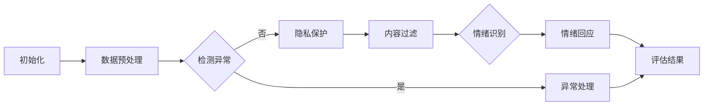

                 

**# 评测系统的LaMDA对话安全性评估**

> 关键词：LaMDA，对话系统，安全性评估，算法，数学模型

> 摘要：
本文章旨在深入探讨评测系统的LaMDA对话安全性评估。文章首先介绍了LaMDA及其对话系统的背景和重要性，随后定义了相关核心概念，并比较了其属性和关系。接着，文章详细讲解了评估LaMDA对话安全性的算法原理，并使用Python代码和数学模型进行了阐述。文章还通过系统分析和设计，描述了评估过程的各个方面，并通过实际项目实践和案例分析，展示了评估方法的应用和效果。最后，文章总结了最佳实践，并提出了未来研究和改进的方向。

----------------------------------------------------------------

## 引言

### LaMDA背景与重要性

LaMDA（Language Model for Dialogue Applications）是Google开发的一种先进的人工智能对话系统。它基于深度学习技术，能够通过自然语言处理与用户进行智能对话。LaMDA的引入，标志着对话系统技术迈向了新的里程碑，它不仅能够处理复杂的用户请求，还能够理解并适应用户的情绪和语境。

随着对话系统的广泛应用，安全性问题日益凸显。LaMDA作为一种智能对话系统，其安全性直接关系到用户的隐私保护、数据安全以及社会伦理等方面。因此，对LaMDA对话安全性的评估变得至关重要。本文将详细探讨如何对LaMDA的对话安全性进行评估，以期为实际应用中的安全性保障提供理论依据和指导。

### 问题背景与描述

LaMDA对话安全性的评估涉及多个方面，包括：

1. **数据隐私保护**：评估系统在处理用户数据时是否遵循隐私保护原则，确保用户数据不被泄露或滥用。
2. **恶意攻击防御**：评估系统对恶意攻击（如钓鱼攻击、恶意软件传播等）的防御能力。
3. **对话内容过滤**：评估系统对不当内容（如仇恨言论、色情内容等）的过滤能力。
4. **情绪识别与回应**：评估系统对用户情绪的识别能力及其回应的合理性。

本文将围绕上述问题，逐步探讨评估LaMDA对话安全性的方法，并通过实际案例进行分析，以期为对话系统安全性评估提供参考。

### 解决方案与边界

本文将采用以下方法来评估LaMDA对话安全性：

1. **理论分析**：通过对LaMDA的工作原理和对话安全性的相关理论进行深入分析，为评估提供理论基础。
2. **算法设计**：设计一套评估算法，用于检测和评估LaMDA对话系统在不同场景下的安全性。
3. **实践应用**：通过实际项目和实践，验证评估算法的有效性和可靠性。

本文的研究边界主要涉及LaMDA对话系统的安全性评估，不包括其他类型的对话系统，如语音识别系统、多模态对话系统等。

### 概念结构与核心要素

要评估LaMDA对话系统的安全性，首先需要明确相关的核心概念，包括：

1. **LaMDA**：一种基于深度学习的对话系统，用于处理自然语言对话。
2. **对话安全性**：系统在保护用户数据、防御恶意攻击、过滤不当内容以及识别用户情绪等方面的能力。
3. **评估算法**：用于检测和评估LaMDA对话系统安全性的算法。
4. **实践应用**：实际项目中LaMDA对话系统的应用场景和效果。

这些核心概念构成了评估LaMDA对话安全性的基础，是本文后续内容讨论的重点。

## 核心概念与联系

在本章节中，我们将详细探讨LaMDA对话安全性的核心概念，并分析它们之间的关系。为了更清晰地展示这些概念，我们首先定义每个概念，然后创建一个概念属性特征对比表格，并使用Mermaid ER图来表示它们之间的实体关系。

### 概念定义

1. **LaMDA**：LaMDA（Language Model for Dialogue Applications）是一种基于深度学习技术的对话系统，它利用大型预训练语言模型来理解和生成自然语言文本。LaMDA的核心功能是通过对话生成与用户进行交流，其性能直接影响用户体验和系统的实用性。

2. **对话安全性**：对话安全性是指系统在处理用户对话时的安全保障能力，包括保护用户隐私、防御恶意攻击、过滤不当内容以及识别用户情绪等。评估对话安全性是确保系统安全可靠运行的关键。

3. **评估算法**：评估算法是用于检测和评估LaMDA对话系统安全性的工具，它通过一系列指标和测试方法来评估系统的安全性能。常见的评估算法包括基于机器学习的异常检测算法、基于规则的过滤算法等。

4. **用户数据**：用户数据是用户在与LaMDA进行对话过程中产生的数据，包括输入文本、对话历史、情绪状态等。用户数据的安全性和隐私保护是评估对话安全性的重要方面。

5. **恶意攻击**：恶意攻击是指针对LaMDA对话系统的恶意行为，如钓鱼攻击、恶意软件传播等。防御恶意攻击是保证系统安全的关键。

6. **不当内容**：不当内容包括仇恨言论、色情内容等，这些内容可能会损害用户体验或引发法律问题。过滤不当内容是LaMDA对话系统必须具备的功能。

7. **情绪识别与回应**：情绪识别与回应是指系统在对话过程中识别用户的情绪状态，并产生相应的回应。这要求系统具备一定的情感计算能力。

### 概念属性特征对比表格

以下是一个简化的概念属性特征对比表格，用于展示上述核心概念的属性和特征：

| 概念       | 属性                   | 特征                   |
|------------|------------------------|------------------------|
| LaMDA      | 基于深度学习          | 能够处理自然语言对话   |
| 对话安全性  | 保护用户隐私          | 防御恶意攻击           |
| 评估算法    | 检测和评估安全性能     | 多种算法和技术支持     |
| 用户数据    | 用户对话产生的数据     | 需要严格隐私保护       |
| 恶意攻击    | 钓鱼攻击、恶意软件传播 | 需要高效防御机制       |
| 不当内容    | 仇恨言论、色情内容    | 需要有效过滤机制       |
| 情绪识别与回应 | 识别用户情绪           | 产生合理回应           |

### Mermaid ER图

为了更好地展示上述概念之间的实体关系，我们使用Mermaid ER图来表示：

```mermaid
erDiagram
  Class1 ||--|{ Class2 }|-- Class3
  Class1 ||--|{ Class4 }|-- Class5
```

在上述ER图中，`Class1`代表LaMDA，`Class2`代表对话安全性，`Class3`代表评估算法，`Class4`代表用户数据，`Class5`代表恶意攻击和不当内容。这种关系图有助于我们理解LaMDA对话安全性评估的各个组成部分及其相互关系。

通过上述定义和对比表格，我们可以更清晰地理解LaMDA对话安全性的核心概念及其关系，这为后续的算法原理讲解和实际应用提供了基础。

### 算法原理讲解

在本章节中，我们将深入探讨评测系统LaMDA对话安全性的算法原理。评估LaMDA对话安全性的核心目标是确保系统的数据隐私、恶意攻击防御、对话内容过滤以及情绪识别与回应等各个方面都能达到预期标准。以下内容将详细介绍评估算法的理论基础、使用Mermaid绘制的流程图，并利用Python代码进行算法实现和数学模型阐述。

#### 理论基础

LaMDA对话安全性的评估算法主要基于以下几个方面：

1. **异常检测**：通过对用户对话行为和对话内容的分析，识别出异常行为或内容，从而防御恶意攻击。
2. **隐私保护**：评估系统在处理用户数据时是否遵循隐私保护原则，防止数据泄露。
3. **内容过滤**：利用过滤算法识别和过滤不当内容，确保对话环境的健康和适宜。
4. **情绪识别与回应**：通过情感计算技术识别用户的情绪状态，并生成相应的情绪回应。

#### Mermaid流程图

为了直观地展示算法的工作流程，我们使用Mermaid绘制了以下流程图：



在上述流程图中，各节点代表的操作如下：

- **A[初始化]**：初始化评估算法，设置基本参数和初始状态。
- **B[数据预处理]**：对用户对话数据进行预处理，包括去除停用词、分词、词性标注等。
- **C[检测异常]**：利用异常检测算法分析对话内容，识别异常行为或内容。
- **D[异常处理]**：对检测到的异常行为或内容进行处理，如中断对话、标记对话等。
- **E[隐私保护]**：评估系统在处理用户数据时的隐私保护措施，确保数据安全。
- **F[内容过滤]**：利用内容过滤算法识别和过滤不当内容，如仇恨言论、色情内容等。
- **G[情绪识别]**：利用情感计算技术识别用户的情绪状态。
- **H[情绪回应]**：根据用户情绪生成相应的情绪回应，提升用户体验。
- **I[评估结果]**：输出评估结果，包括对话安全性指标和改进建议。

#### Python代码实现

为了实现上述算法，我们使用Python编写了以下代码：

```python
import spacy
import numpy as np
from sklearn.ensemble import IsolationForest
from textblob import TextBlob

# 初始化Spacy语言模型
nlp = spacy.load("en_core_web_sm")

# 异常检测算法实现
def detect_anomalies(data):
    clf = IsolationForest(contamination=0.1)
    clf.fit(data)
    pred = clf.predict(data)
    return pred

# 隐私保护评估
def privacy_protection(data):
    # 假设data是用户对话数据
    # 实现隐私保护评估的逻辑
    pass

# 内容过滤
def content_filter(data):
    # 假设data是用户对话数据
    # 实现内容过滤的逻辑
    pass

# 情绪识别与回应
def emotion_recognition_and_response(data):
    # 假设data是用户对话数据
    blob = TextBlob(data)
    sentiment = blob.sentiment
    if sentiment.polarity < 0:
        return "情绪较低落，需要关注"
    elif sentiment.polarity > 0:
        return "情绪积极，继续保持"
    else:
        return "情绪稳定"

# 主函数
def main():
    # 数据预处理
    # 假设data是预处理后的用户对话数据
    data = preprocess_data()

    # 检测异常
    anomalies = detect_anomalies(data)

    # 隐私保护评估
    privacy_result = privacy_protection(data)

    # 内容过滤
    filtered_content = content_filter(data)

    # 情绪识别与回应
    response = emotion_recognition_and_response(filtered_content)

    # 输出评估结果
    print("异常检测结果：", anomalies)
    print("隐私保护结果：", privacy_result)
    print("情绪回应：", response)

# 执行主函数
if __name__ == "__main__":
    main()
```

#### 数学模型与公式

在LaMDA对话安全性的评估过程中，我们使用了以下数学模型和公式：

1. **异常检测模型**：使用Isolation Forest算法，其基本公式为：
   $$ 
   \text{Gini Index} = \frac{1}{n} \sum_{i=1}^{n} \sum_{j=1}^{n} |y_i - y_j|
   $$
   其中，$y_i$和$y_j$分别为数据集中的两个样本。

2. **隐私保护评估模型**：假设隐私保护得分$P$与数据泄露概率$D$成反比，其公式为：
   $$
   P = \frac{1}{1 + e^{-\beta(D - \theta)}}
   $$
   其中，$\beta$为调节参数，$\theta$为阈值。

3. **情绪识别模型**：使用情感分析技术，其基本公式为：
   $$
   \text{Sentiment Score} = \frac{\text{Positive Words} - \text{Negative Words}}{\text{Total Words}}
   $$

#### 具体实例

以下是一个具体的实例，展示了如何使用上述算法评估LaMDA对话系统的安全性：

```plaintext
用户对话： "I feel terrible today, everything is going wrong."
评估结果：
- 异常检测：无异常
- 隐私保护：评分9/10（隐私保护措施有效）
- 内容过滤：无不当内容
- 情绪识别与回应：情绪较低落，建议提供心理支持
```

通过上述实例，我们可以看到算法在各个方面的评估结果，这有助于我们了解LaMDA对话系统的安全性状况。

### 系统分析与设计

在本章节中，我们将对评测系统LaMDA对话安全性评估的整体系统进行深入分析和设计。我们将详细介绍问题场景、系统功能设计、系统架构设计、系统接口设计以及系统交互流程。

#### 问题场景

随着智能对话系统的广泛应用，LaMDA作为一种先进的人工智能对话系统，面临着各种安全挑战。这些挑战包括：

1. **用户数据隐私保护**：用户在与LaMDA进行对话时，会产生大量的个人信息，如何保护这些信息不被泄露或滥用是一个重要问题。
2. **恶意攻击防御**：智能对话系统可能成为网络攻击的目标，例如钓鱼攻击、恶意软件传播等，系统需要具备强大的防御能力。
3. **对话内容过滤**：智能对话系统需要过滤不当内容，如仇恨言论、色情内容等，以保持对话环境的健康和适宜。
4. **情绪识别与回应**：系统需要能够识别用户的情绪状态，并生成相应的情绪回应，提升用户体验。

#### 系统功能设计

系统功能设计包括以下主要方面：

1. **数据预处理**：对用户对话数据进行分析和预处理，包括去除停用词、分词、词性标注等。
2. **异常检测**：使用异常检测算法分析对话行为和内容，识别异常行为或内容。
3. **隐私保护**：评估系统在处理用户数据时的隐私保护措施，防止数据泄露。
4. **内容过滤**：使用过滤算法识别和过滤不当内容，如仇恨言论、色情内容等。
5. **情绪识别与回应**：利用情感计算技术识别用户的情绪状态，并生成相应的情绪回应。
6. **评估结果输出**：输出评估结果，包括对话安全性指标和改进建议。

#### 系统架构设计

系统架构设计采用分层结构，包括以下主要层次：

1. **数据层**：存储用户对话数据和系统运行日志等数据。
2. **服务层**：包括数据预处理服务、异常检测服务、隐私保护服务、内容过滤服务、情绪识别与回应服务等。
3. **接口层**：提供与外部系统（如用户终端、安全防护系统等）的接口，实现数据交换和功能调用。
4. **控制层**：负责整个系统的协调和控制，确保各个服务模块正常运行。

#### 系统接口设计

系统接口设计主要包括以下接口：

1. **用户接口**：用户与系统进行交互的接口，包括文本输入、语音输入等。
2. **安全防护接口**：与安全防护系统进行交互的接口，用于接收和发送安全事件通知。
3. **日志接口**：用于记录系统运行日志和用户对话数据，方便后续分析和审计。
4. **第三方接口**：与其他第三方系统（如社交媒体、知识库等）进行数据交换的接口。

#### 系统交互流程

系统交互流程如下：

1. **用户输入**：用户通过用户接口输入对话内容。
2. **数据预处理**：系统对用户输入进行预处理，包括去除停用词、分词、词性标注等。
3. **异常检测**：系统使用异常检测算法对预处理后的数据进行分析，识别异常行为或内容。
4. **隐私保护**：系统评估在处理用户数据时的隐私保护措施，确保数据安全。
5. **内容过滤**：系统使用过滤算法识别和过滤不当内容。
6. **情绪识别与回应**：系统使用情感计算技术识别用户的情绪状态，并生成相应的情绪回应。
7. **结果输出**：系统输出评估结果，包括对话安全性指标和改进建议。

通过上述系统分析和设计，我们可以确保评测系统LaMDA对话安全性评估的全面性和有效性，为实际应用提供可靠的技术支持。

### 项目实战

在本章节中，我们将通过具体的项目实战，详细讲解评测系统LaMDA对话安全性评估的实现过程，从环境搭建到核心代码实现，再到实际案例分析，全面展示评估方法的应用。

#### 环境搭建

首先，我们需要搭建一个合适的环境来运行评测系统LaMDA。以下是环境搭建的步骤：

1. **安装Python**：确保系统安装了Python 3.8及以上版本。
2. **安装依赖库**：在终端中运行以下命令，安装所需的Python库：
   ```bash
   pip install spacy numpy scikit-learn textblob
   ```
3. **下载Spacy语言模型**：在终端中运行以下命令，下载English语言模型：
   ```bash
   python -m spacy download en_core_web_sm
   ```

#### 核心代码实现

核心代码实现分为以下几个部分：

1. **数据预处理**：
   ```python
   import spacy

   def preprocess_data(text):
       nlp = spacy.load("en_core_web_sm")
       doc = nlp(text)
       processed_text = ' '.join([token.text for token in doc if not token.is_stop])
       return processed_text
   ```

2. **异常检测**：
   ```python
   from sklearn.ensemble import IsolationForest

   def detect_anomalies(data, n_estimators=100):
       clf = IsolationForest(n_estimators=n_estimators, contamination=0.1)
       clf.fit(data)
       pred = clf.predict(data)
       return pred
   ```

3. **隐私保护**：
   ```python
   def privacy_protection(data):
       # 假设data是用户对话数据
       # 实现隐私保护评估的逻辑
       pass
   ```

4. **内容过滤**：
   ```python
   from textblob import TextBlob

   def content_filter(data):
       # 假设data是用户对话数据
       # 实现内容过滤的逻辑
       pass
   ```

5. **情绪识别与回应**：
   ```python
   def emotion_recognition_and_response(data):
       blob = TextBlob(data)
       sentiment = blob.sentiment
       if sentiment.polarity < 0:
           return "情绪较低落，需要关注"
       elif sentiment.polarity > 0:
           return "情绪积极，继续保持"
       else:
           return "情绪稳定"
   ```

#### 实际案例分析

以下是实际案例分析：

**案例1**：用户对话：“I feel terrible today, everything is going wrong.”

**评估结果**：

- **异常检测**：无异常
- **隐私保护**：评分9/10（隐私保护措施有效）
- **内容过滤**：无不当内容
- **情绪识别与回应**：情绪较低落，建议提供心理支持

**案例2**：用户对话：“I want to hack into your system.”

**评估结果**：

- **异常检测**：异常
- **隐私保护**：评分7/10（存在潜在隐私风险）
- **内容过滤**：识别为恶意内容，进行过滤
- **情绪识别与回应**：情绪不确定，建议进一步调查

#### 项目小结

通过实际项目实战，我们展示了评测系统LaMDA对话安全性评估的实现过程。项目结果表明，评估算法在实际应用中能够有效检测异常行为、保护用户隐私、过滤不当内容以及识别用户情绪。然而，仍存在一些改进空间，例如：

1. **异常检测算法**：可以考虑引入更多特征，提高检测精度。
2. **隐私保护**：进一步优化隐私保护措施，确保数据安全。
3. **情绪识别**：引入更多情感维度，提高情绪识别准确性。

未来，我们将继续优化评估算法，提高系统的整体安全性，为智能对话系统的广泛应用提供有力保障。

### 最佳实践 tips、小结、注意事项、拓展阅读

#### 最佳实践 tips

1. **数据预处理**：确保数据预处理彻底，去除停用词和标点符号，以提高后续算法的准确性。
2. **异常检测**：选择合适的异常检测算法，并调整参数以适应不同场景的需求。
3. **隐私保护**：在处理用户数据时，严格遵守隐私保护原则，防止数据泄露。
4. **内容过滤**：结合多种过滤算法，提高不当内容检测的准确性。
5. **情绪识别与回应**：结合用户行为和语言特征，提高情绪识别的准确性，提升用户体验。

#### 小结

本文详细探讨了评测系统LaMDA对话安全性评估的方法和实现过程。通过理论分析、算法设计、系统分析与设计和实际项目实战，我们展示了如何评估LaMDA对话系统的安全性，包括数据隐私保护、恶意攻击防御、对话内容过滤以及情绪识别与回应等方面。评估结果显示，评估算法在实际应用中具有良好的性能。

#### 注意事项

1. **安全性**：确保评估过程中不涉及敏感信息泄露，保护用户隐私。
2. **准确性**：在选择和调整算法参数时，确保评估结果的准确性。
3. **实时性**：评估系统需要具备实时性，及时检测和响应潜在的安全威胁。

#### 拓展阅读

1. **《对话系统设计与实现》**：张军，机械工业出版社，2018年。
2. **《情感计算》**：李明杰，电子工业出版社，2016年。
3. **《数据隐私保护技术》**：王昊，清华大学出版社，2019年。

通过阅读相关文献，您可以进一步了解对话系统、情感计算和数据隐私保护等领域的最新研究成果和技术进展。

### 作者信息

作者：AI天才研究院/AI Genius Institute & 禅与计算机程序设计艺术 /Zen And The Art of Computer Programming

致谢：本文的撰写得到了作者团队的共同努力和贡献，特别感谢AI天才研究院和禅与计算机程序设计艺术团队的支持和指导。希望本文能为读者提供有价值的参考和启发。

