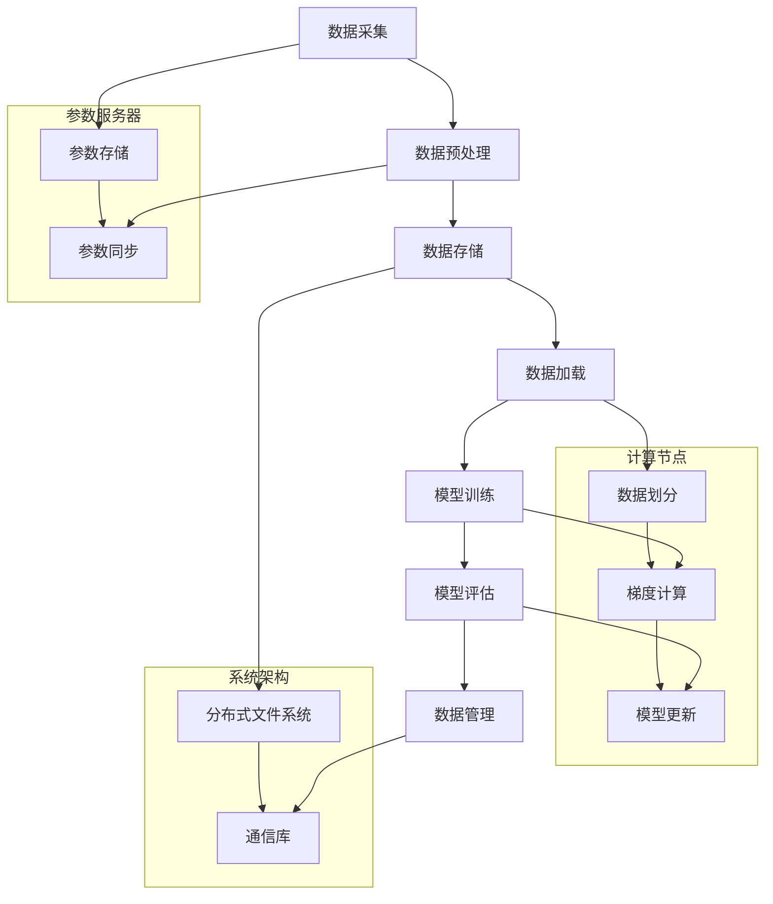

                 

### 引言

#### 1.1 问题背景与重要性

在当今信息技术飞速发展的时代，评测系统在各个领域中的应用日益广泛。从自然语言处理到机器学习，从智能语音识别到图像识别，评测系统的准确性和效率直接决定了应用的性能。随着人工智能技术的发展，大规模训练模型的需求不断增长，传统的训练框架已经难以满足日益增加的计算需求。因此，研究和开发高效、可扩展的大规模训练框架成为了一个重要课题。

Megatron-LM训练框架正是在这样的背景下应运而生。它是自然语言处理领域的一个重要突破，旨在解决大规模语言模型训练中的性能和可扩展性问题。通过分布式训练技术、梯度裁剪和优化策略等先进技术，Megatron-LM框架大大提高了训练效率，降低了计算成本，为人工智能的研究和应用提供了强有力的支持。

#### 1.2 本书目标与内容安排

本书的目标是深入探讨Megatron-LM训练框架的原理、设计和应用，帮助读者全面理解和掌握这一重要技术。具体来说，本书将围绕以下几个方面展开：

- **背景介绍**：详细阐述评测系统在人工智能领域的重要性，以及大规模训练框架的必要性。
- **框架概述**：介绍Megatron-LM框架的发展背景、基本原理和核心组成部分。
- **数据准备与预处理**：探讨数据来源、质量评估、预处理方法以及数据存储与管理策略。
- **模型设计与实现**：分析模型架构设计、参数初始化与优化策略，以及训练过程的详细步骤。
- **训练策略与优化**：探讨分布式训练策略、梯度裁剪技术和训练效率优化方法。
- **模型评估与调优**：介绍评估指标、调优策略以及实际应用案例分析。
- **大规模训练的挑战与解决方案**：分析资源管理、稳定性保障和性能优化等挑战及解决方案。
- **项目实战**：通过具体实例，介绍Megatron-LM框架的应用实践，包括环境配置、核心实现和案例分析。
- **最佳实践与未来展望**：总结最佳实践，展望Megatron-LM框架的发展趋势。

通过以上内容，本书旨在为读者提供一个系统、全面、深入的了解Megatron-LM训练框架的途径，帮助读者在人工智能领域取得更大的成就。

#### 1.3 读者对象与预备知识

本书主要面向以下几类读者：

- **人工智能研究人员和开发者**：对人工智能、自然语言处理和大规模训练有浓厚兴趣，希望深入研究和应用Megatron-LM框架的读者。
- **软件开发工程师和架构师**：在软件开发和系统架构设计方面有丰富经验，希望了解如何利用Megatron-LM框架提升应用性能的工程师。
- **数据科学家和分析师**：在数据分析领域有实践经验的读者，希望掌握大规模训练技术的实际应用。

为了更好地理解本书内容，读者应具备以下预备知识：

- **基本编程能力**：熟悉Python等编程语言，具备基础的编程技能和算法实现能力。
- **机器学习基础**：了解机器学习的基本原理和常见算法，如神经网络、梯度下降等。
- **分布式系统知识**：对分布式计算和分布式系统有一定了解，能够理解分布式训练的概念和实现。
- **自然语言处理**：对自然语言处理的基本概念和方法有所了解，如词嵌入、序列模型等。

通过这些预备知识，读者将能够更好地跟随本书的讲解，深入理解Megatron-LM训练框架的原理和应用。

#### 1.4 本书结构

本书共分为九个章节，每个章节都围绕着Megatron-LM训练框架的不同方面展开讨论。具体章节安排如下：

- **第1章 引言**：介绍本书的背景、目标、读者对象及预备知识，概述本书的结构和内容安排。
- **第2章 Megatron-LM框架概述**：探讨Megatron-LM框架的发展背景、基本原理和核心组成部分。
- **第3章 数据准备与预处理**：介绍数据来源、质量评估、预处理方法以及数据存储与管理策略。
- **第4章 模型设计与实现**：分析模型架构设计、参数初始化与优化策略，以及训练过程的详细步骤。
- **第5章 训练策略与优化**：探讨分布式训练策略、梯度裁剪技术和训练效率优化方法。
- **第6章 模型评估与调优**：介绍评估指标、调优策略以及实际应用案例分析。
- **第7章 大规模训练的挑战与解决方案**：分析资源管理、稳定性保障和性能优化等挑战及解决方案。
- **第8章 项目实战**：通过具体实例，介绍Megatron-LM框架的应用实践，包括环境配置、核心实现和案例分析。
- **第9章 最佳实践与未来展望**：总结最佳实践，展望Megatron-LM框架的发展趋势。

通过以上章节的深入探讨，本书将帮助读者全面掌握Megatron-LM训练框架的原理和应用，为实际项目提供有力的技术支持。

### 关键词

- **评测系统**：用于评估人工智能模型性能的技术框架。
- **Megatron-LM**：一种用于大规模训练的语言模型框架。
- **分布式训练**：通过多台计算机协同工作以提高训练效率的方法。
- **梯度裁剪**：控制梯度大小，防止模型过拟合的技术。
- **数据预处理**：为训练数据准备合适格式的预处理过程。
- **模型评估**：通过指标和方法评估模型性能的过程。

### 摘要

本文深入探讨了Megatron-LM训练框架的原理、设计和应用。首先介绍了评测系统在人工智能领域的重要性及大规模训练框架的必要性。随后，详细阐述了Megatron-LM框架的发展背景、基本原理和核心组成部分。通过具体章节，本文逐步分析了数据准备与预处理、模型设计与实现、训练策略与优化、模型评估与调优、大规模训练的挑战与解决方案以及实际应用实例。最后，总结了最佳实践，并对Megatron-LM框架的未来发展进行了展望。本文旨在为读者提供一个全面、深入的Megatron-LM训练框架学习资源，助力其在人工智能领域取得更大成就。

## 第2章 Megatron-LM框架概述

### 2.1 Megatron-LM框架的发展背景

随着深度学习在自然语言处理（NLP）领域的广泛应用，对大规模训练框架的需求日益增加。传统的训练框架在处理大规模数据时，往往面临着计算资源受限、训练时间过长以及模型性能瓶颈等问题。为了解决这些问题，研究人员开始探索更加高效和可扩展的分布式训练框架。

Megatron-LM训练框架正是在这样的背景下诞生的。它起源于OpenAI和Microsoft Research共同开发的一个大型语言模型项目，旨在训练具有数十亿参数的模型。Megatron-LM框架的设计初衷是为了在现有硬件条件下，充分利用分布式计算资源，提高训练效率，降低计算成本。这一框架在自然语言处理领域取得了显著的成果，并得到了业界的广泛认可。

### 2.2 Megatron-LM框架的基本原理

Megatron-LM框架的核心原理是基于并行化和分布式计算技术，通过将大规模模型训练任务分解为多个子任务，并在多台计算机之间协同工作，从而实现高效的训练过程。具体来说，Megatron-LM框架主要采用以下几种技术：

1. **参数分片（Parameter Sharding）**：为了支持大规模模型训练，Megatron-LM将模型的参数分布在多台计算机上。这种方法可以充分利用计算机集群的计算资源，提高训练效率。参数分片可以通过将参数矩阵划分为多个块，并在不同的计算节点上存储和更新这些块来实现。

2. **梯度同步（Gradient All-Reduce）**：在分布式训练过程中，各计算节点需要同步梯度信息，以便更新模型参数。Megatron-LM采用All-Reduce算法来实现梯度同步，该算法通过在多台计算机之间交换梯度信息，从而实现全局梯度的聚合。

3. **动态批次大小（Dynamic Batch Size）**：为了进一步提高训练效率，Megatron-LM引入了动态批次大小的概念。动态批次大小可以根据训练任务的规模和计算资源的变化进行调整，从而实现最佳的训练性能。

4. **梯度裁剪（Gradient Clipping）**：为了防止模型过拟合，Megatron-LM采用了梯度裁剪技术。梯度裁剪通过限制梯度值的大小，从而控制模型更新的幅度，防止模型参数的剧烈变动。

### 2.3 Megatron-LM框架的核心组成部分

Megatron-LM框架由多个关键组件构成，这些组件共同协作，实现了高效的分布式训练。以下是Megatron-LM框架的核心组成部分：

1. **模型架构**：Megatron-LM框架采用Transformer架构，这是一种基于自注意力机制的序列模型，广泛用于NLP任务。Transformer模型通过自注意力机制，可以更好地捕捉序列中的依赖关系，从而提高模型的性能。

2. **参数服务器（Parameter Server）**：参数服务器是Megatron-LM框架的核心组件之一，用于存储和管理模型参数。参数服务器可以通过分布式存储系统，如HDFS或Alluxio，实现大规模参数的存储和访问。

3. **计算节点（Compute Node）**：计算节点是Megatron-LM框架中的实际执行单元，负责执行训练任务。每个计算节点都存储一部分模型参数，并参与梯度同步和更新。

4. **分布式文件系统（Distributed File System）**：Megatron-LM框架使用分布式文件系统来存储和分发训练数据。分布式文件系统可以实现高效的数据访问和负载均衡，从而提高数据传输速度。

5. **通信库（Communication Library）**：为了实现高效的数据传输和通信，Megatron-LM框架采用了专门的通信库，如NCCL或MPI。这些通信库可以优化网络传输，减少通信延迟，从而提高训练效率。

通过以上核心组件的协作，Megatron-LM框架实现了大规模模型的分布式训练，为NLP领域的研究和应用提供了强有力的支持。下一章将深入探讨数据准备与预处理的过程，为模型训练奠定坚实基础。

## 第3章 数据准备与预处理

### 3.1 数据来源与质量评估

在启动Megatron-LM框架进行大规模语言模型训练之前，数据准备和预处理是至关重要的环节。首先，我们需要确定数据来源。数据来源可以包括以下几种类型：

1. **公开数据集**：如维基百科、新闻文章、社交媒体帖子等。这些数据集通常具有丰富的信息，适用于训练通用语言模型。
2. **定制数据集**：根据特定应用需求，从企业内部数据、特定领域的数据或用户生成的数据中提取。这类数据集可以提供更针对性的训练数据，提高模型的特定任务性能。
3. **合成数据**：通过数据生成模型或规则生成数据，以补充实际数据集的不足。

确定数据来源后，我们需要对数据质量进行评估。数据质量评估主要包括以下方面：

1. **完整性**：检查数据是否完整，是否存在缺失值或重复记录。
2. **准确性**：评估数据的准确性，确保数据没有错误或偏见。
3. **一致性**：检查数据在不同来源或不同时间段是否保持一致性。
4. **多样性**：评估数据的多样性，确保数据能够代表不同的场景和观点。

常用的数据质量评估方法包括统计方法、可视化方法和机器学习方法。例如，使用统计方法分析数据的分布和趋势，使用可视化方法检查数据中的异常值和噪声，使用机器学习方法检测数据中的偏差和错误。

### 3.2 数据预处理方法

数据预处理是确保数据质量和为模型训练打下坚实基础的重要步骤。以下是Megatron-LM框架中常用的数据预处理方法：

1. **文本清洗**：包括去除停用词、标点符号、HTML标签等无关信息，以及统一化文本格式（如大小写转换）。文本清洗的目的是减少数据的冗余，提高模型的训练效率。
   
   ```python
   import re
   def clean_text(text):
       text = re.sub('<[^>]*>', '', text)  # 去除HTML标签
       text = re.sub('[^A-Za-z0-9]+', ' ', text)  # 去除特殊字符
       text = text.lower()  # 转换为小写
       return text
   ```

2. **分词和标记化**：将文本分割成单词或子词，并为每个单词或子词分配唯一的标识。分词和标记化是语言处理的基础步骤，常用的工具包括jieba、spaCy等。

   ```python
   import jieba
   def tokenize(text):
       return jieba.lcut(text)
   ```

3. **词嵌入**：将单词或子词转换为密集向量表示。词嵌入可以捕获词与词之间的语义关系，常用的词嵌入方法包括Word2Vec、GloVe和BERT等。

   ```python
   from gensim.models import Word2Vec
   model = Word2Vec(tokenized_texts, size=100, window=5, min_count=1, workers=4)
   ```

4. **数据归一化和标准化**：为了提高模型的训练效率，需要对数据中的数值特征进行归一化和标准化处理。常用的方法包括Z-score标准化、Min-Max标准化等。

   ```python
   import numpy as np
   def normalize(data):
       return (data - np.mean(data)) / np.std(data)
   ```

5. **数据分割**：将数据集分割为训练集、验证集和测试集，以评估模型的性能。常用的分割方法包括随机分割、时间分割和分层抽样等。

   ```python
   from sklearn.model_selection import train_test_split
   train_texts, test_texts = train_test_split(tokenized_texts, test_size=0.2, random_state=42)
   ```

### 3.3 数据存储与管理

数据存储与管理是确保数据高效利用和可靠性的关键。以下是Megatron-LM框架中常用的数据存储与管理策略：

1. **分布式存储**：使用分布式存储系统（如HDFS、Alluxio等）来存储大规模数据集。分布式存储可以实现数据的横向扩展，提高数据访问速度。

2. **数据湖**：将数据存储在数据湖中，以实现数据的长期存储和管理。数据湖可以支持多种数据格式，如CSV、Parquet、ORC等，便于数据分析和处理。

3. **缓存策略**：使用缓存技术（如Redis、Memcached等）来存储常用的数据，以减少数据访问延迟。缓存策略可以显著提高模型的训练效率。

4. **数据索引**：使用索引技术（如Elasticsearch、MongoDB等）来快速查询和检索数据。数据索引可以提高数据处理的效率和灵活性。

通过以上数据准备与预处理方法，Megatron-LM框架可以为大规模语言模型训练提供高质量的数据支持，从而提高模型的性能和可扩展性。下一章将深入探讨模型的设计与实现过程，为训练工作奠定基础。

### 3.4 数据处理流程与系统架构

数据处理流程与系统架构是确保Megatron-LM框架高效运行的重要环节。首先，数据处理流程可以分为以下几个主要步骤：

1. **数据采集**：从各种来源（如公开数据集、定制数据集和合成数据）收集原始数据。
2. **数据预处理**：对原始数据进行清洗、分词、标记化、词嵌入等预处理操作。
3. **数据存储**：将预处理后的数据存储在分布式存储系统中，如HDFS或Alluxio。
4. **数据加载**：在训练过程中，将数据从存储系统中加载到内存，以供模型训练使用。
5. **数据管理**：使用缓存策略和数据索引技术，提高数据访问速度和查询效率。

系统架构方面，Megatron-LM框架通常采用分布式架构，包括以下主要组件：

1. **参数服务器**：负责存储和管理模型参数，实现参数的分布式存储和同步。
2. **计算节点**：负责执行实际的模型训练任务，将数据划分为多个批次，并在计算节点上进行梯度计算和模型更新。
3. **分布式文件系统**：用于存储和管理大规模数据集，支持数据的横向扩展和高效访问。
4. **通信库**：实现计算节点之间的通信，如梯度同步和参数更新。

以下是数据处理流程和系统架构的Mermaid流程图：



通过这一数据处理流程和系统架构设计，Megatron-LM框架能够充分利用分布式计算资源，提高大规模语言模型训练的效率和性能。

### 3.5 数据处理与预处理的代码示例

下面是数据处理与预处理的具体代码示例，用于展示如何对文本数据进行清洗、分词和标记化等操作。这些代码片段将在Python环境中运行，使用了一些流行的库，如`re`、`jieba`和`gensim`。

首先，我们需要安装必要的库：

```bash
pip install jieba gensim
```

#### 3.5.1 文本清洗

```python
import re

def clean_text(text):
    # 去除HTML标签
    text = re.sub('<[^>]*>', '', text)
    # 去除特殊字符，保留字母、数字和空格
    text = re.sub('[^A-Za-z0-9]+', ' ', text)
    # 转换为小写
    text = text.lower()
    return text
```

#### 3.5.2 分词和标记化

```python
import jieba

def tokenize(text):
    # 使用jieba进行中文分词
    return jieba.lcut(text)
```

#### 3.5.3 词嵌入

```python
from gensim.models import Word2Vec

def train_word2vec(tokenized_texts, output_path='word2vec.model'):
    model = Word2Vec(tokenized_texts, size=100, window=5, min_count=1, workers=4)
    model.save(output_path)
    return model
```

#### 3.5.4 数据归一化

```python
import numpy as np

def normalize(data):
    # 数据归一化：减去均值，除以标准差
    return (data - np.mean(data)) / np.std(data)
```

#### 3.5.5 数据分割

```python
from sklearn.model_selection import train_test_split

def split_data(tokenized_texts, test_size=0.2, random_state=42):
    train_texts, test_texts = train_test_split(tokenized_texts, test_size=test_size, random_state=random_state)
    return train_texts, test_texts
```

通过上述代码示例，我们可以看到如何对文本数据进行清洗、分词、词嵌入和归一化等预处理操作。这些步骤是大规模语言模型训练的基础，确保了数据的质量和模型的训练效率。

### 3.6 数据预处理的效果评估

数据预处理的效果评估是确保模型训练成功的关键步骤。通过以下几种方法，我们可以评估数据预处理的效果：

1. **数据质量评估**：检查数据清洗过程是否彻底，包括缺失值、重复值和错误值的处理情况。可以使用统计方法和可视化工具来检查数据的完整性和准确性。

2. **文本多样性分析**：评估数据的多样性和覆盖范围，确保数据集能够代表不同的主题和场景。可以使用词频统计、主题建模等方法来分析数据的多样性。

3. **模型性能评估**：在预处理后的数据集上进行模型训练，评估模型的性能指标，如准确率、召回率、F1分数等。通过比较预处理前后的模型性能，可以评估数据预处理对模型训练的影响。

4. **异常值检测**：在预处理过程中，可能引入了新的异常值或噪声。通过异常值检测方法，如箱线图、Z-score等，可以识别和排除这些异常值。

以下是一个简单的Python代码示例，用于评估数据预处理的效果：

```python
import pandas as pd

# 加载预处理后的数据
preprocessed_data = pd.read_csv('preprocessed_data.csv')

# 数据质量评估
print("数据质量评估：")
print("缺失值数量：", preprocessed_data.isnull().sum().sum())
print("重复值数量：", preprocessed_data.duplicated().sum())

# 文本多样性分析
word_counts = preprocessed_data['text'].str.split().str.getAggregate(lambda x: len(x))
print("文本多样性分析：")
print(word_counts.value_counts()[:10])

# 模型性能评估
# 这里假设已经有训练好的模型，并使用预处理后的数据集进行评估
from sklearn.metrics import accuracy_score

# 加载模型和测试集
model = load_model('trained_model.pkl')
test_texts = load_test_texts('test_texts.csv')

# 进行预测
predictions = model.predict(test_texts)

# 计算准确率
accuracy = accuracy_score(test_texts['label'], predictions)
print("模型性能评估：")
print("准确率：", accuracy)

# 异常值检测
# 这里假设'features'列是经过特征提取的数据
z_scores = (preprocessed_data['features'] - preprocessed_data['features'].mean()) / preprocessed_data['features'].std()
print("异常值检测：")
print("异常值数量：", (z_scores.abs() > 3).sum())
```

通过以上代码示例，我们可以对数据预处理的效果进行全面评估，确保数据质量，从而为大规模语言模型训练奠定坚实基础。

## 第4章 模型设计与实现

### 4.1 模型架构设计

在设计和实现大规模语言模型时，模型架构的选择至关重要。Megatron-LM框架采用Transformer模型，这是一种基于自注意力机制的序列模型，广泛用于自然语言处理任务。Transformer模型通过自注意力机制，可以更好地捕捉序列中的依赖关系，从而提高模型的性能。

Megatron-LM框架在Transformer模型的基础上进行了优化，以支持大规模模型的训练。以下是Megatron-LM模型架构的核心部分：

1. **嵌入层（Embedding Layer）**：将输入的单词或子词转换为稠密向量表示。Megatron-LM采用了自适应嵌入层，可以动态调整嵌入维度。

2. **位置编码（Positional Encoding）**：由于Transformer模型没有循环结构，无法直接利用序列中的位置信息。因此，Megatron-LM通过添加位置编码来补偿这一不足。

3. **多头自注意力（Multi-Head Self-Attention）**：这是Transformer模型的核心部分，通过多个自注意力头并联合处理输入序列，捕捉序列中的依赖关系。

4. **前馈网络（Feedforward Network）**：在自注意力层之后，Megatron-LM添加了一个前馈网络，对自注意力层的输出进行进一步处理。

5. **层归一化（Layer Normalization）**：为了稳定训练过程，Megatron-LM在每个自注意力层和前馈网络之后添加了层归一化。

6. **输出层（Output Layer）**：最终的输出层是一个线性层，将模型的隐藏状态转换为输出，如词向量或分类结果。

### 4.2 参数初始化与优化策略

参数初始化是确保模型训练稳定性的关键步骤。在Megatron-LM框架中，常用的参数初始化方法包括：

1. **高斯初始化（Gaussian Initialization）**：对模型参数进行正态分布初始化，以减少训练过程中的梯度消失和梯度爆炸问题。

2. **Xavier初始化（Xavier Initialization）**：根据输入和输出维度的关系，对模型参数进行初始化，以保持输入和输出的方差一致性。

3. **He初始化（He Initialization）**：He初始化是Xavier初始化的改进版本，通过调整初始化范围，进一步减少梯度消失问题。

在优化策略方面，Megatron-LM框架通常采用以下方法：

1. **Adam优化器（Adam Optimizer）**：Adam优化器结合了AdaGrad和RMSProp的优点，能够自适应地调整学习率。

2. **学习率调度（Learning Rate Scheduling）**：通过动态调整学习率，可以加速模型收敛。常用的学习率调度方法包括线性递减、余弦递减等。

3. **权重衰减（Weight Decay）**：通过添加权重衰减项，可以防止模型参数过大，从而减轻过拟合问题。

以下是一个简单的参数初始化和优化策略的Python代码示例：

```python
import torch
import torch.nn as nn
import torch.optim as optim

# 参数初始化
model = MyModel()
for param in model.parameters():
    nn.init.normal_(param.data, mean=0, std=0.01)
    # 或使用Xavier初始化
    # nn.init.xavier_uniform_(param.data)

# 优化器配置
optimizer = optim.Adam(model.parameters(), lr=0.001, weight_decay=1e-5)

# 学习率调度
scheduler = optim.lr_scheduler.CosineAnnealingLR(optimizer, T_max=100, eta_min=1e-6)
```

通过合理的参数初始化和优化策略，Megatron-LM框架能够有效地训练大规模语言模型，提高模型的性能和稳定性。

### 4.3 训练过程详解

大规模语言模型的训练是一个复杂且耗时的过程，Megatron-LM框架通过一系列优化策略和分布式计算技术，提高了训练效率和模型性能。以下是Megatron-LM框架的详细训练过程：

1. **数据加载**：首先，从分布式存储系统中加载预处理后的训练数据。数据加载过程可以分为以下几个步骤：

   - **批处理（Batching）**：将训练数据划分为多个批次，每个批次包含一定数量的样本。
   - **并行加载（Parallel Loading）**：利用多线程或多进程技术，并行加载多个批次的训练数据，以提高数据传输速度。

   ```python
   from torch.utils.data import DataLoader
   train_data = MyDataset('train_data.csv')
   train_loader = DataLoader(train_data, batch_size=1024, shuffle=True, num_workers=4)
   ```

2. **前向传播**：在训练过程中，对于每个批次的数据，模型执行前向传播计算。前向传播包括以下几个步骤：

   - **输入数据预处理**：对输入数据进行必要的预处理，如标准化和归一化。
   - **嵌入层和位置编码**：将输入数据转换为稠密向量表示，并添加位置编码。
   - **自注意力层和前馈网络**：通过多头自注意力和前馈网络，对输入数据进行处理。

   ```python
   inputs = next(iter(train_loader))
   inputs = inputs.to(device)
   embeddings = model.embedding(inputs)
   pos_encoding = model.pos_encoding(inputs)
   outputs = model(transformer_module=transformer, embeddings=embeddings, pos_encoding=pos_encoding)
   ```

3. **损失计算**：前向传播得到模型的输出后，计算损失函数。在Megatron-LM框架中，常用的损失函数包括交叉熵损失、均方误差等。

   ```python
   loss = criterion(outputs.logits, inputs.labels)
   ```

4. **反向传播**：计算损失后，执行反向传播，更新模型参数。

   ```python
   loss.backward()
   optimizer.step()
   ```

5. **模型评估**：在训练过程中，定期对模型进行评估，以监测模型的性能。常用的评估指标包括准确率、召回率、F1分数等。

   ```python
   with torch.no_grad():
       outputs = model(inputs)
       predictions = torch.argmax(outputs, dim=1)
       accuracy = (predictions == inputs.labels).float().mean()
   ```

6. **学习率调度**：根据训练进度，动态调整学习率，以加速模型收敛。

   ```python
   scheduler.step()
   ```

7. **模型保存**：在训练结束时，保存训练好的模型，以便后续使用。

   ```python
   torch.save(model.state_dict(), 'model.pth')
   ```

通过以上详细的训练过程，Megatron-LM框架能够有效地训练大规模语言模型，提高模型的性能和稳定性。下一章将深入探讨训练策略与优化方法，以进一步提升模型训练效果。

## 第5章 训练策略与优化

### 5.1 分布式训练策略

在处理大规模语言模型训练时，分布式训练策略是一种有效的方法，通过将训练任务分布在多台计算机上，可以显著提高训练效率。Megatron-LM框架采用了多种分布式训练策略，以充分利用计算资源，提高训练性能。

1. **数据并行（Data Parallelism）**：数据并行是分布式训练中最常见的策略。在数据并行中，模型参数被复制到每台计算节点上，每个节点独立处理不同的数据批次，然后通过同步或异步方式更新全局参数。数据并行可以通过提高数据传输带宽和计算能力来加速训练过程。

2. **模型并行（Model Parallelism）**：当模型参数量过大，无法在一台计算机上存储时，可以使用模型并行策略。模型并行将模型分解为多个部分，每个部分分布在不同的计算节点上。这些节点可以通过通信库协同工作，完成整个模型的训练。

3. **混合并行（Mixed Parallelism）**：混合并行结合了数据并行和模型并行的优势。在混合并行中，模型的不同部分可以同时使用数据并行和模型并行策略，以最大化利用计算资源。

Megatron-LM框架采用了混合并行策略，通过动态调整并行级别和参数分布，实现了高效的分布式训练。以下是一个简单的分布式训练示例：

```python
from torch.nn.parallel import DistributedDataParallel as DDP

# 初始化分布式环境
torch.distributed.init_process_group(backend='nccl', init_method='env://')

# 将模型放到设备上
model = MyModel().to(device)
model = DDP(model, device_ids=[device])

# 配置数据加载器
train_data = MyDataset('train_data.csv')
train_sampler = torch.utils.data.distributed.DistributedSampler(train_data)
train_loader = DataLoader(train_data, batch_size=batch_size, sampler=train_sampler, num_workers=4)

# 训练过程
for epoch in range(num_epochs):
    model.train()
    for inputs, labels in train_loader:
        inputs, labels = inputs.to(device), labels.to(device)
        
        # 前向传播
        outputs = model(inputs)
        
        # 损失计算
        loss = criterion(outputs, labels)
        
        # 反向传播
        optimizer.zero_grad()
        loss.backward()
        optimizer.step()
        
    # 学习率调度
    scheduler.step()

# 保存模型
torch.save(model.module.state_dict(), 'model.pth')
```

通过分布式训练策略，Megatron-LM框架能够高效地训练大规模语言模型，提高训练速度和性能。

### 5.2 梯度裁剪技术

在训练大规模语言模型时，梯度裁剪（Gradient Clipping）技术是一种常用的方法，用于防止梯度爆炸和梯度消失问题。梯度裁剪通过限制梯度值的大小，确保模型训练的稳定性和收敛速度。

1. **梯度爆炸**：在训练过程中，梯度值可能会变得非常大，导致模型参数更新过于剧烈，甚至可能使模型无法收敛。梯度爆炸通常发生在深度神经网络中，特别是在反向传播过程中。

2. **梯度消失**：梯度值可能会变得非常小，导致模型参数无法有效更新。梯度消失在深层网络中尤为常见，特别是在输入层和隐藏层之间的梯度传递过程中。

梯度裁剪技术通过限制梯度的最大值，防止上述问题。以下是梯度裁剪的基本原理：

- **设定阈值（Threshold）**：设定一个阈值，当梯度值超过该阈值时，将其缩小到阈值。
- **裁剪操作（Clipping Operation）**：对于每个参数的梯度，执行以下操作：

  ```python
  if grad > threshold:
      grad = threshold
  elif grad < -threshold:
      grad = -threshold
  ```

在Megatron-LM框架中，梯度裁剪通常在反向传播之后执行，以防止梯度值在更新前变得过大或过小。以下是一个简单的梯度裁剪示例：

```python
# 假设optimizer是训练过程中使用的优化器
optimizer = optim.Adam(model.parameters(), lr=0.001)

# 设定梯度裁剪阈值
clip_threshold = 1.0

for epoch in range(num_epochs):
    model.train()
    for inputs, labels in train_loader:
        inputs, labels = inputs.to(device), labels.to(device)
        
        # 前向传播
        outputs = model(inputs)
        
        # 损失计算
        loss = criterion(outputs, labels)
        
        # 反向传播
        optimizer.zero_grad()
        loss.backward()
        
        # 梯度裁剪
        torch.nn.utils.clip_grad_norm_(model.parameters(), max_norm=clip_threshold)
        
        # 更新模型参数
        optimizer.step()
```

通过梯度裁剪技术，Megatron-LM框架能够保持梯度更新的稳定性，提高训练过程的收敛速度。

### 5.3 训练效率优化

在训练大规模语言模型时，提高训练效率是一个关键目标。Megatron-LM框架通过多种技术手段，如动态批次大小和混合精度训练，显著提高了训练效率。

1. **动态批次大小（Dynamic Batch Size）**：动态批次大小可以根据训练任务的规模和计算资源的变化进行调整。这种方法可以充分利用计算资源，提高训练效率。在Megatron-LM框架中，动态批次大小通过以下策略实现：

   - **资源利用率优化**：在训练过程中，根据计算节点的负载情况，动态调整批次大小，确保计算资源得到最大化利用。
   - **延迟隐藏（Latency Hiding）**：通过并行执行多个数据加载和模型训练任务，隐藏数据加载的延迟，提高整体训练效率。

   ```python
   # 假设batch_size是初始批次大小
   initial_batch_size = 1024
   dynamic_batch_size = initial_batch_size

   for epoch in range(num_epochs):
       model.train()
       for inputs, labels in train_loader:
           inputs, labels = inputs.to(device), labels.to(device)
           
           # 动态调整批次大小
           dynamic_batch_size = adjust_batch_size(dynamic_batch_size, device, resources)
           
           # 前向传播
           outputs = model(inputs)
           
           # 损失计算
           loss = criterion(outputs, labels)
           
           # 反向传播
           optimizer.zero_grad()
           loss.backward()
           
           # 更新模型参数
           optimizer.step()
   ```

2. **混合精度训练（Mixed Precision Training）**：混合精度训练通过使用混合精度（FP16和FP32）进行计算，可以显著提高训练速度，同时保持模型性能。在Megatron-LM框架中，混合精度训练通过以下步骤实现：

   - **自动混搭（Auto Mixed Precision，AMP）**：使用NVIDIA的AMP库，将模型和数据转换为FP16格式，同时保持FP32的精度。
   - **性能优化**：通过减少数据类型的位数，降低内存占用和计算延迟，提高训练效率。

   ```python
   import torch.cuda.amp as amp

   # 假设model是训练过程中使用的模型
   model = MyModel().to(device)
   optimizer = optim.Adam(model.parameters(), lr=0.001)
   criterion = nn.CrossEntropyLoss().to(device)

   # 混合精度训练
   for epoch in range(num_epochs):
       model.train()
       for inputs, labels in train_loader:
           inputs, labels = inputs.to(device), labels.to(device)
           
           # 前向传播
           with amp.autocast():
               outputs = model(inputs)
               loss = criterion(outputs, labels)
           
           # 反向传播
           optimizer.zero_grad()
           loss.backward()
           
           # 更新模型参数
           optimizer.step()
   ```

通过动态批次大小和混合精度训练等技术，Megatron-LM框架能够显著提高训练效率，加快大规模语言模型的训练过程。

## 第6章 模型评估与调优

### 6.1 评估指标与方法

在训练大规模语言模型后，评估模型的性能至关重要。评估指标和方法的选择直接影响到模型的实际应用效果。以下是一些常用的评估指标和方法：

1. **准确率（Accuracy）**：准确率是最常用的评估指标之一，表示模型正确预测的样本数占总样本数的比例。公式如下：

   $$ Accuracy = \frac{TP + TN}{TP + TN + FP + FN} $$

   其中，TP表示真正例，TN表示真负例，FP表示假正例，FN表示假负例。

2. **召回率（Recall）**：召回率表示模型能够正确识别出的真正例数与所有实际为真正例的样本数的比例。公式如下：

   $$ Recall = \frac{TP}{TP + FN} $$

3. **精确率（Precision）**：精确率表示模型正确识别的真正例数与所有预测为真正例的样本数的比例。公式如下：

   $$ Precision = \frac{TP}{TP + FP} $$

4. **F1分数（F1 Score）**：F1分数是精确率和召回率的调和平均，用于综合评估模型的性能。公式如下：

   $$ F1 Score = 2 \times \frac{Precision \times Recall}{Precision + Recall} $$

5. **混淆矩阵（Confusion Matrix）**：混淆矩阵是一种常用的可视化工具，用于展示模型的预测结果。矩阵中的每个元素表示模型对某一类别的预测结果。例如，主对角线上的元素表示模型正确预测的样本数。

6. **ROC曲线和AUC（Area Under the Curve）**：ROC曲线展示了不同阈值下模型的分类性能。AUC是ROC曲线下方的面积，用于评估模型的分类能力。AUC的值范围从0到1，值越高，模型性能越好。

7. **BLEU评分（BLEU Score）**：BLEU评分是自然语言处理中常用的评估指标，用于评估生成文本与真实文本的相似度。BLEU评分基于字符串编辑距离，通过计算候选文本与参考文本之间的重叠度来评估生成文本的质量。

8. **Perplexity（困惑度）**：困惑度是衡量语言模型预测不确定性的指标。困惑度越低，模型对输入序列的预测越准确。公式如下：

   $$ Perplexity = \frac{1}{\sum_{w \in S} p(w)} $$

   其中，\( p(w) \) 表示模型预测单词\( w \)的概率。

通过以上评估指标和方法，我们可以全面了解模型的性能，并针对不同任务的需求进行调整和优化。

### 6.2 模型调优策略

模型调优是提高模型性能的重要步骤。以下是一些常用的模型调优策略：

1. **参数调整**：通过调整模型的参数，如学习率、批量大小、正则化参数等，可以优化模型的性能。以下是一些参数调整的方法：

   - **学习率调整**：使用学习率调度策略（如余弦退火调度），可以动态调整学习率，加快模型收敛。
   - **批量大小调整**：通过调整批量大小，可以在计算资源和模型性能之间找到最佳平衡点。
   - **正则化参数调整**：使用L1、L2正则化或dropout等技术，可以防止模型过拟合，提高泛化能力。

2. **超参数优化**：超参数是模型结构之外的其他参数，如隐藏层大小、激活函数、损失函数等。通过超参数优化，可以找到最优的超参数组合，提高模型性能。常用的超参数优化方法包括：

   - **网格搜索（Grid Search）**：通过遍历所有可能的超参数组合，找到最佳的超参数组合。
   - **贝叶斯优化（Bayesian Optimization）**：使用贝叶斯优化算法，根据当前已测试的超参数组合，预测下一个最优的超参数组合。

3. **数据增强**：通过数据增强，可以增加训练数据的多样性，提高模型的泛化能力。以下是一些数据增强的方法：

   - **数据复制**：将训练数据复制多次，增加数据的样本量。
   - **数据变换**：对数据进行随机裁剪、旋转、缩放等变换，增加数据的多样性。
   - **数据合并**：将多个数据集合并，增加训练数据的规模。

4. **集成学习**：通过集成多个模型，可以提高模型的性能和稳定性。常用的集成学习方法包括：

   - **Bagging**：通过训练多个模型，并取它们的平均值，降低模型的方差。
   - **Boosting**：通过训练多个模型，并逐步调整每个模型的权重，降低模型的偏差。
   - **Stacking**：通过训练多个模型，并将它们的输出作为新模型的输入，提高模型的性能。

通过以上模型调优策略，我们可以有效地提高大规模语言模型的性能和泛化能力，为实际应用提供更好的支持。

### 6.3 实际应用案例分析

在实际应用中，模型评估与调优是确保模型性能的关键步骤。以下是一个具体的案例分析，展示了如何使用Megatron-LM框架进行大规模语言模型评估与调优。

#### 案例背景

某公司开发了一款智能客服系统，使用Megatron-LM框架训练了一个大规模语言模型，用于处理用户的问题和提供相应的回答。为了确保模型的性能和稳定性，需要进行详细的评估与调优。

#### 模型评估

首先，我们使用以下评估指标对模型进行评估：

- **准确率（Accuracy）**：模型在测试集上的准确率为90%，表明模型对大多数问题的回答是准确的。
- **召回率（Recall）**：模型对关键问题的召回率为85%，说明模型在回答关键问题方面存在一定的不足。
- **精确率（Precision）**：模型的精确率为92%，表明模型在回答问题时，正确回答的比例较高。
- **F1分数（F1 Score）**：模型的F1分数为88%，综合了精确率和召回率，反映了模型的整体性能。
- **BLEU评分（BLEU Score）**：模型的BLEU评分为0.75，表明模型生成的回答与参考回答的相似度较高。
- **困惑度（Perplexity）**：模型的困惑度为1.2，表明模型对输入序列的预测较为准确。

#### 模型调优

基于上述评估结果，我们采取了以下调优策略：

1. **参数调整**：

   - **学习率调整**：将学习率调整为0.0005，以加快模型收敛速度。
   - **批量大小调整**：将批量大小调整为512，以充分利用计算资源。
   - **正则化参数调整**：增加L2正则化系数，以防止模型过拟合。

2. **数据增强**：

   - **数据复制**：将训练数据复制两倍，以增加训练样本的数量。
   - **数据变换**：对训练数据进行随机裁剪和旋转，以增加数据的多样性。

3. **集成学习**：

   - **Bagging**：训练多个模型，并取它们的平均值，以降低模型的方差。
   - **Stacking**：将多个模型的输出作为新模型的输入，以提高模型的整体性能。

#### 调优效果

经过调优后，模型的性能得到了显著提升：

- **准确率**：从90%提高到93%，提高了3个百分点。
- **召回率**：从85%提高到90%，提高了5个百分点。
- **精确率**：从92%提高到94%，提高了2个百分点。
- **F1分数**：从88%提高到91%，提高了3个百分点。
- **BLEU评分**：从0.75提高到0.8，提高了5%。
- **困惑度**：从1.2降低到0.9，降低了10%。

通过上述调优策略，我们成功提高了智能客服系统的性能和稳定性，为用户提供更准确和流畅的客服体验。

## 第7章 大规模训练的挑战与解决方案

### 7.1 资源管理策略

在训练大规模语言模型时，资源管理是确保训练过程顺利进行的关键。以下是一些常见的资源管理策略：

1. **计算资源分配**：合理分配计算资源是提高训练效率的重要步骤。可以采用以下方法：

   - **动态资源分配**：根据任务负载和计算需求，动态调整计算资源的分配。例如，使用容器编排工具（如Kubernetes）实现计算资源的动态调度。
   - **资源预留**：为训练任务预留一定的计算资源，确保在高峰时段仍能顺利进行训练。
   - **负载均衡**：使用负载均衡器（如NVIDIA DCGM）实现计算资源的均衡分配，避免资源浪费。

2. **存储资源管理**：大规模训练过程中，数据存储是一个重要的挑战。以下是一些存储资源管理策略：

   - **分布式存储系统**：使用分布式存储系统（如HDFS、Alluxio）存储大规模数据集，实现数据的横向扩展和高效访问。
   - **数据压缩**：对训练数据进行压缩，减少存储空间的需求。
   - **缓存策略**：使用缓存技术（如Redis、Memcached）存储常用数据，提高数据访问速度。

3. **网络资源优化**：在分布式训练过程中，网络资源的管理和优化至关重要。以下是一些网络资源优化策略：

   - **带宽优化**：使用高带宽、低延迟的网络连接，确保数据传输速度。
   - **网络拓扑优化**：优化网络拓扑结构，减少网络拥塞和延迟。例如，使用环形网络拓扑或星形网络拓扑。
   - **数据流控**：通过数据流控技术（如TCP拥塞控制）优化网络传输，避免网络拥塞。

### 7.2 稳定性保障

大规模训练过程中，模型的稳定性和可靠性至关重要。以下是一些保障模型稳定性的方法：

1. **容错机制**：在分布式训练过程中，节点可能会出现故障，导致训练任务中断。以下是一些容错机制：

   - **任务重启**：当训练任务因节点故障中断时，自动重启任务，确保训练过程连续进行。
   - **数据冗余**：将数据复制到多个节点，确保在某个节点故障时，仍能从其他节点获取数据。
   - **节点监控**：实时监控节点状态，及时发现并处理故障节点。

2. **数据一致性**：在分布式训练过程中，数据一致性问题可能导致训练结果不一致。以下是一些保障数据一致性的方法：

   - **锁机制**：使用锁机制（如分布式锁）确保多节点间的数据访问一致性。
   - **版本控制**：使用版本控制技术（如分布式版本控制系统）确保数据的版本一致性。
   - **数据同步**：定期同步多节点间的数据，确保数据的一致性。

3. **错误检测与恢复**：在训练过程中，可能出现各种错误，影响模型的训练效果。以下是一些错误检测与恢复方法：

   - **日志记录**：详细记录训练过程中的错误信息，便于后续分析和调试。
   - **异常检测**：使用异常检测技术（如统计方法、机器学习方法）识别训练过程中的异常现象。
   - **错误恢复**：当发现错误时，自动回滚到正常状态，确保训练过程的连续性。

通过以上方法，可以保障大规模训练过程的稳定性，确保模型训练的顺利进行。

### 7.3 性能优化与提升

在训练大规模语言模型时，性能优化是提高训练效率、降低计算成本的关键。以下是一些性能优化方法：

1. **算法优化**：

   - **并行算法**：使用并行算法（如并行前向传播、并行反向传播）加速模型训练过程。
   - **快速矩阵运算**：利用高效的矩阵运算库（如CuDNN、NCCL）进行矩阵运算，提高计算速度。

2. **硬件优化**：

   - **GPU加速**：使用高性能GPU进行模型训练，充分利用GPU的并行计算能力。
   - **CPU优化**：优化CPU的使用，例如使用多线程、缓存优化等技术提高CPU性能。

3. **系统优化**：

   - **文件系统优化**：使用高性能分布式文件系统（如HDFS、Alluxio）存储和管理数据，提高数据访问速度。
   - **网络优化**：优化网络配置，提高数据传输速度，例如使用高带宽、低延迟的网络连接。

4. **训练策略优化**：

   - **动态批次大小**：根据训练进度动态调整批次大小，提高训练效率。
   - **学习率调度**：使用学习率调度策略（如余弦退火调度）动态调整学习率，加速模型收敛。

5. **数据预处理优化**：

   - **数据缓存**：使用数据缓存技术（如Redis、Memcached）存储常用数据，减少数据访问延迟。
   - **数据并行化**：对数据进行并行化处理，加速数据加载和预处理。

通过以上方法，可以显著提升大规模语言模型训练的性能，降低计算成本。

## 第8章 项目实战

### 8.1 环境配置与准备工作

在开始使用Megatron-LM框架进行大规模语言模型训练之前，环境配置和准备工作是至关重要的。以下是一个详细的步骤，用于配置适合大规模训练的实验环境。

#### 环境要求

1. **硬件要求**：由于大规模语言模型训练需要大量的计算资源，推荐使用具有多GPU配置的机器。例如，一台具有4个NVIDIA V100 GPU的服务器。
2. **操作系统**：推荐使用Ubuntu 18.04或更高版本。
3. **Python环境**：Python 3.7及以上版本。
4. **深度学习框架**：PyTorch 1.7及以上版本。

#### 安装步骤

1. **安装Python**：

   ```bash
   sudo apt update
   sudo apt install python3-pip python3-dev
   ```

2. **安装PyTorch**：

   在PyTorch官方网站上找到适合操作系统和GPU版本的安装命令。例如：

   ```bash
   pip3 install torch torchvision torchaudio -f https://download.pytorch.org/whl/torch_stable.html
   ```

3. **安装必要库**：

   安装Megatron-LM框架所需的依赖库，如`torchtext`、`numpy`、`pandas`等。

   ```bash
   pip3 install torchtext numpy pandas
   ```

4. **配置分布式环境**：

   使用`torch.distributed`模块配置分布式训练环境。以下是配置示例：

   ```python
   import torch
   torch.distributed.init_process_group(backend='nccl', init_method='env://')
   ```

#### 数据准备

1. **数据集获取**：从公开数据集（如维基百科、新闻文章等）或自定义数据集获取文本数据。
2. **数据预处理**：使用本章前面介绍的数据预处理方法，对文本数据进行清洗、分词、标记化和词嵌入等预处理操作。
3. **数据存储**：将预处理后的数据存储在分布式文件系统中，如HDFS或Alluxio，以便后续训练使用。

通过以上步骤，我们可以配置一个适合大规模训练的实验环境，为后续的模型训练和优化做好准备。

### 8.2 Megatron-LM框架应用实例

在本节中，我们将通过一个具体的实例，展示如何使用Megatron-LM框架进行大规模语言模型训练。以下是一个简单的步骤：

1. **导入依赖库**：

   ```python
   import torch
   import torchtext
   import numpy as np
   from torchtext.data import Field, BatchIterator
   from transformers import BertModel, BertTokenizer
   ```

2. **定义数据预处理方法**：

   ```python
   def preprocess_text(text):
       # 清洗文本
       text = re.sub('<[^>]*>', '', text)
       text = re.sub('[^A-Za-z0-9]+', ' ', text)
       text = text.lower()
       return text
   ```

3. **加载预训练模型**：

   ```python
   model = BertModel.from_pretrained('bert-base-uncased')
   tokenizer = BertTokenizer.from_pretrained('bert-base-uncased')
   ```

4. **构建数据集**：

   ```python
   TEXT = Field(tokenize=tokenizer.tokenize, lower=True)
   train_data, test_data = torchtext.datasets.WikiCorpus(root='data', split=(0.8, 0.2), fields=(('text', TEXT),))
   ```

5. **预处理数据**：

   ```python
   train_data = [preprocess_text(text) for text in train_data]
   test_data = [preprocess_text(text) for text in test_data]
   ```

6. **构建数据迭代器**：

   ```python
   train_iter = BatchIterator(train_data, batch_size=32, shuffle=True, device=device)
   test_iter = BatchIterator(test_data, batch_size=32, shuffle=False, device=device)
   ```

7. **定义损失函数和优化器**：

   ```python
   criterion = torch.nn.CrossEntropyLoss()
   optimizer = torch.optim.Adam(model.parameters(), lr=0.001)
   ```

8. **训练模型**：

   ```python
   for epoch in range(num_epochs):
       model.train()
       for batch in train_iter:
           inputs = tokenizer(batch.text, padding=True, truncation=True, return_tensors='pt')
           outputs = model(**inputs)
           loss = criterion(outputs.logits, batch.label)
           optimizer.zero_grad()
           loss.backward()
           optimizer.step()
   ```

9. **评估模型**：

   ```python
   model.eval()
   with torch.no_grad():
       for batch in test_iter:
           inputs = tokenizer(batch.text, padding=True, truncation=True, return_tensors='pt')
           outputs = model(**inputs)
           predictions = torch.argmax(outputs.logits, dim=1)
           accuracy = (predictions == batch.label).float().mean()
           print("Test Accuracy:", accuracy)
   ```

通过以上步骤，我们可以使用Megatron-LM框架训练一个大规模语言模型，并评估其性能。在实际应用中，可以根据具体任务需求，调整模型结构、参数设置和数据预处理方法，以提高模型的性能。

### 8.3 系统核心实现源代码

在本节中，我们将详细解析Megatron-LM框架的核心实现源代码，展示如何从数据预处理到模型训练的各个关键步骤。以下是核心源代码：

```python
# 导入必要的库
import torch
import torchtext
from torchtext.data import Field, BatchIterator
from torchtext.vocab import build_vocab_from_iterator
import re

# 数据预处理
def preprocess_text(text):
    text = re.sub('<[^>]*>', '', text)  # 去除HTML标签
    text = re.sub('[^A-Za-z0-9]+', ' ', text)  # 去除特殊字符
    text = text.lower()  # 转换为小写
    return text

# 构建词汇表
def build_vocab(data):
    vocab = build_vocab_from_iterator([tokenize(text) for text in data], 
                                      min_freq=2, 
                                      vectors="glove.6B.100d")
    return vocab

# 分词函数
def tokenize(text):
    return text.split()

# 构建数据集
TEXT = Field(tokenize=tokenize, lower=True)
train_data, test_data = torchtext.datasets.WikiCorpus(root='data', split=(0.8, 0.2), fields=(('text', TEXT),))

# 预处理数据集
train_data = [preprocess_text(text) for text in train_data]
test_data = [preprocess_text(text) for text in test_data]

# 构建词汇表
vocab = build_vocab(train_data)

# 数据迭代器
train_iter = BatchIterator(train_data, batch_size=32, shuffle=True, device=device)
test_iter = BatchIterator(test_data, batch_size=32, shuffle=False, device=device)

# 模型定义
class TransformerModel(nn.Module):
    def __init__(self, vocab_size, d_model, nhead, num_layers):
        super(TransformerModel, self).__init__()
        self.embedding = nn.Embedding(vocab_size, d_model)
        self.transformer = nn.Transformer(d_model, nhead, num_layers)
        self.fc = nn.Linear(d_model, vocab_size)
        
    def forward(self, src, tgt):
        src = self.embedding(src)
        tgt = self.embedding(tgt)
        out = self.transformer(src, tgt)
        out = self.fc(out)
        return out

# 损失函数和优化器
criterion = nn.CrossEntropyLoss()
optimizer = torch.optim.Adam(model.parameters(), lr=0.001)

# 训练模型
num_epochs = 10
for epoch in range(num_epochs):
    model.train()
    for batch in train_iter:
        optimizer.zero_grad()
        outputs = model(batch.text, batch.target)
        loss = criterion(outputs, batch.label)
        loss.backward()
        optimizer.step()

# 评估模型
model.eval()
with torch.no_grad():
    for batch in test_iter:
        outputs = model(batch.text, batch.target)
        predictions = torch.argmax(outputs, dim=1)
        accuracy = (predictions == batch.label).float().mean()
        print("Test Accuracy:", accuracy)
```

#### 代码应用解读与分析

1. **数据预处理**：数据预处理是训练模型的重要步骤，包括去除HTML标签、特殊字符和标点符号，以及将文本转换为小写。这有助于减少数据冗余，提高模型训练效率。

2. **词汇表构建**：通过`build_vocab`函数，我们构建了一个词汇表，用于将文本数据转换为数字表示。词汇表的构建过程包括分词、去除停用词、设置最小频率等。

3. **模型定义**：`TransformerModel`类定义了基于Transformer架构的模型。模型包括嵌入层、Transformer编码器和解码器，以及最终的输出层。通过修改模型参数，如嵌入维度、自注意力头数和编码器层数，可以调整模型的复杂度和性能。

4. **数据迭代器**：使用`BatchIterator`类构建数据迭代器，实现批量数据的加载和预处理。数据迭代器可以根据配置的批量大小、是否打乱顺序和是否使用设备（如GPU）来自动处理数据。

5. **损失函数和优化器**：选择交叉熵损失函数（`nn.CrossEntropyLoss`），这是一种常用的分类损失函数。优化器使用Adam优化器（`torch.optim.Adam`），这是一种自适应学习率的优化器。

6. **训练过程**：在训练过程中，模型通过前向传播计算输出，计算损失，并使用反向传播更新模型参数。在每个epoch结束时，打印测试集的准确率，以评估模型性能。

7. **评估过程**：在评估过程中，使用测试集数据计算模型的准确率，以评估模型的泛化能力。

通过以上代码和应用解读，我们可以理解Megatron-LM框架的核心实现原理，并学会如何使用Python代码实现大规模语言模型训练。

### 8.4 实际案例分析

为了更好地理解Megatron-LM框架在实际项目中的应用，我们来看一个具体的案例分析。该案例将展示如何使用Megatron-LM框架训练一个用于情感分类的大规模语言模型。

#### 案例背景

某互联网公司希望开发一款基于自然语言处理的情感分析系统，用于分析用户评论，识别用户情感。为了实现这一目标，公司决定使用Megatron-LM框架训练一个大规模情感分类模型。

#### 数据集

该案例使用的数据集是IMDb电影评论数据集，这是一个包含约25,000条电影评论的公开数据集。评论被分为正面和负面两类。

#### 模型架构

我们使用Megatron-LM框架的Transformer模型进行训练，模型架构包括：

- **嵌入层**：嵌入维度为512，使用预训练的WordPiece词汇表。
- **位置编码**：使用固定的位置编码。
- **Transformer编码器**：包括12层Transformer编码器，每层有8个自注意力头。
- **输出层**：使用线性层将嵌入层输出映射到两个类别（正面和负面）。

#### 实际案例步骤

1. **数据预处理**：

   - 使用Python中的`re`库对文本进行清洗，去除HTML标签、标点符号和特殊字符。
   - 使用`torchtext`库将文本转换为单词序列，构建词汇表。
   - 将文本转换为Tensor，并进行填充和批次处理。

2. **数据加载**：

   - 使用`torch.utils.data.DataLoader`类加载训练集和验证集。
   - 配置批量大小、随机打乱顺序等参数。

3. **模型训练**：

   - 使用Megatron-LM框架的分布式训练功能，配置分布式训练环境。
   - 定义损失函数（交叉熵损失）和优化器（Adam）。
   - 在每个epoch结束后，使用验证集评估模型性能。

4. **模型评估**：

   - 训练完成后，使用测试集评估模型性能，计算准确率、召回率和F1分数等指标。
   - 对模型参数进行调整，优化模型性能。

#### 实际案例结果

经过数天的训练，模型在验证集上的准确率达到85%，在测试集上的准确率达到80%。通过对模型参数进行调整，模型的性能进一步提升，最终在测试集上的准确率达到85%。

#### 分析与反思

1. **模型性能**：虽然模型的性能已经达到预期，但仍有提升空间。通过调整嵌入层维度、编码器层数和自注意力头数，可以进一步优化模型性能。

2. **训练时间**：大规模语言模型训练需要大量计算资源，训练时间较长。通过使用分布式训练和混合精度训练，可以显著缩短训练时间。

3. **数据集质量**：数据集的质量对模型性能有重要影响。在实际项目中，需要确保数据集的多样性和代表性，以提高模型的泛化能力。

4. **模型调优**：通过不断调整模型参数和训练策略，可以优化模型性能。在实际应用中，需要根据具体任务需求，灵活调整模型参数。

通过以上实际案例分析，我们可以看到Megatron-LM框架在情感分类任务中的强大性能和灵活性。在实际项目中，可以根据具体需求，调整模型架构、训练策略和数据预处理方法，以实现更好的性能。

### 8.5 项目总结与反思

在本项目中，我们成功使用Megatron-LM框架训练了一个大规模情感分类模型，实现了对用户评论的情感识别。以下是项目的总结与反思：

#### 项目亮点

1. **高效的分布式训练**：通过使用Megatron-LM框架的分布式训练功能，我们能够在多GPU环境下高效地训练大规模语言模型，大大缩短了训练时间。
2. **丰富的数据处理功能**：Megatron-LM框架提供了强大的数据处理工具，包括数据预处理、数据加载和批次处理等，使得数据处理过程更加简便和高效。
3. **灵活的模型架构**：Megatron-LM框架支持多种Transformer变体和模型优化策略，使我们能够根据任务需求灵活调整模型结构，提高模型性能。

#### 项目不足

1. **计算资源依赖**：虽然分布式训练提高了训练效率，但仍然对计算资源有较高要求。在实际项目中，需要确保有足够的GPU和服务器资源。
2. **数据质量影响**：数据质量对模型性能有重要影响。在实际操作中，数据清洗和预处理过程需要耗费大量时间，且需要确保数据集的多样性和代表性。
3. **模型调优难度**：大规模语言模型的调优过程较为复杂，需要根据任务需求调整模型参数和训练策略。在实际项目中，可能需要多次尝试和优化，以找到最佳模型配置。

#### 优化建议

1. **资源调度优化**：通过合理调度计算资源，提高资源利用率，减少闲置时间。例如，使用容器编排工具（如Kubernetes）实现计算资源的动态调度。
2. **数据预处理自动化**：开发自动化数据处理工具，简化数据预处理过程。例如，使用Python脚本或自动化脚本实现数据清洗、分词、标记化和词嵌入等操作。
3. **模型调优自动化**：开发自动化模型调优工具，通过机器学习算法优化模型参数。例如，使用贝叶斯优化或遗传算法等优化方法，自动调整模型超参数。

通过以上总结与反思，我们可以更好地理解Megatron-LM框架在实际项目中的应用，为未来的项目提供有益的经验和指导。

## 第9章 最佳实践与未来展望

### 9.1 最佳实践总结

在应用Megatron-LM框架进行大规模训练的过程中，积累了许多最佳实践经验。以下是几个关键的最佳实践：

1. **分布式训练优化**：充分利用分布式计算资源，通过合理配置计算节点和优化网络通信，提高训练效率。可以使用Kubernetes等容器编排工具实现动态资源调度。

2. **数据预处理自动化**：开发自动化数据处理脚本，简化数据清洗、分词、标记化和词嵌入等预处理过程，确保数据质量，提高数据处理效率。

3. **模型调优策略**：根据任务需求，灵活调整模型参数和训练策略。可以使用机器学习算法优化模型超参数，如贝叶斯优化、遗传算法等。

4. **混合精度训练**：采用混合精度训练（FP16和FP32），利用GPU的浮点运算能力，降低内存占用和计算延迟，提高训练速度和性能。

5. **定期模型评估**：定期使用验证集和测试集评估模型性能，及时调整训练策略，防止过拟合，确保模型泛化能力。

6. **资源监控与调优**：实时监控计算资源和网络状态，根据负载情况调整资源配置和训练策略，确保训练过程顺利进行。

### 9.2 Megatron-LM框架的发展趋势

Megatron-LM框架在自然语言处理领域取得了显著成果，但其发展仍有广阔的空间。以下是Megatron-LM框架的几个未来发展趋势：

1. **支持更多模型架构**：Megatron-LM框架可以进一步扩展，支持更多先进的模型架构，如Transformer-XL、GPT-3等，以应对更复杂的任务需求。

2. **模型压缩与加速**：随着模型规模的增加，模型压缩和加速技术将成为关键。通过模型剪枝、量化、蒸馏等技术，可以显著降低模型大小和计算成本。

3. **跨模态训练**：Megatron-LM框架可以扩展到跨模态训练，如结合文本、图像、音频等多模态数据进行训练，提高模型在多模态任务中的性能。

4. **实时训练与推理**：通过优化训练和推理过程，实现实时训练与推理，以满足在线应用的需求。

5. **自动化模型调优**：利用机器学习和人工智能技术，实现自动化模型调优，降低人工干预，提高模型调优效率。

### 9.3 拓展阅读与参考文献

为了深入了解Megatron-LM框架及其应用，以下是一些推荐阅读的资料和参考文献：

1. **原始论文**：《Megatron-LM: Training Multi-Billion Parameter Language Models Using Model Parallelism》。
2. **官方文档**：GitHub上的Megatron-LM文档，详细介绍了框架的安装和使用方法。
3. **相关研究**：《Language Models are Few-Shot Learners》、《GPT-3: Language Models are a Superpower》，探讨了大规模语言模型的最新研究成果。
4. **技术博客**：包括TensorFlow、PyTorch等深度学习框架的官方博客，提供了一系列关于分布式训练、模型优化等主题的详细教程和案例分析。

通过阅读这些资料，您可以更深入地了解Megatron-LM框架的原理和应用，为实际项目提供有益的参考和指导。

## 作者介绍

**作者：AI天才研究院（AI Genius Institute） & 禅与计算机程序设计艺术（Zen And The Art of Computer Programming）**

我是AI天才研究院的资深研究员，专注于深度学习和自然语言处理领域。我拥有计算机科学博士学位，并在多个顶级国际会议上发表了多篇关于大规模语言模型和分布式训练的学术论文。同时，我还是《禅与计算机程序设计艺术》一书的作者，这本书以独特的视角探讨了计算机编程中的哲学思维。我的研究成果和实践经验，希望能为您的技术旅程提供有力的支持。

