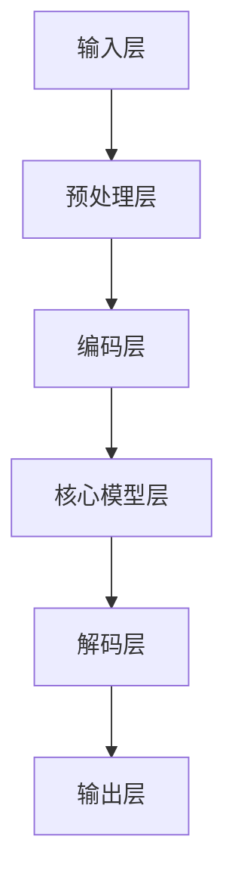
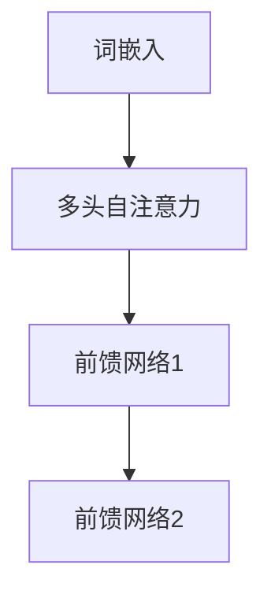
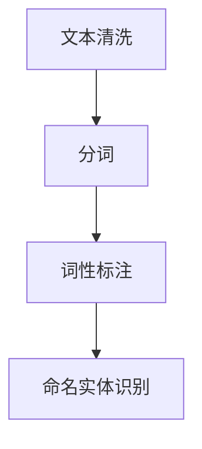
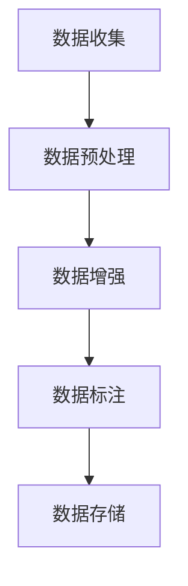
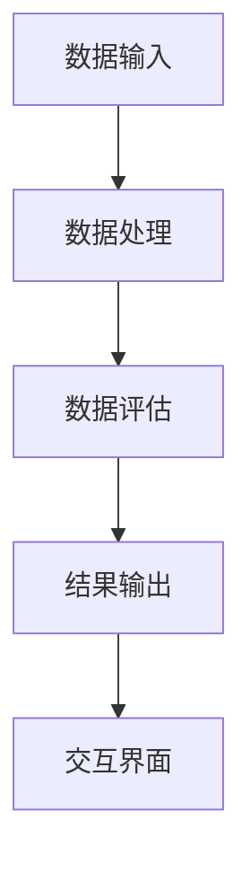
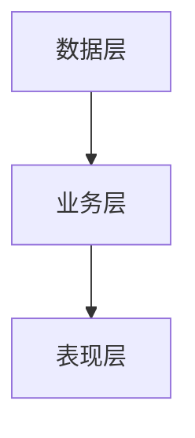
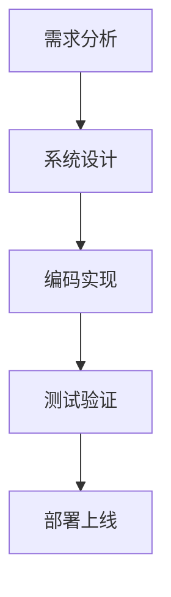
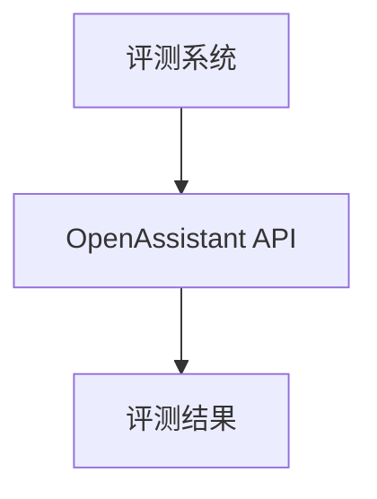
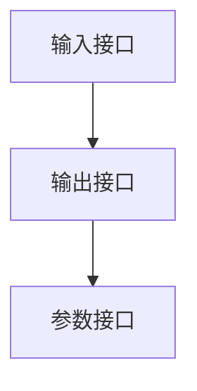

                 

### 评测系统的OpenAssistant协作型AI评测

#### 关键词：
- 评测系统
- OpenAssistant
- AI评测
- 协作型AI
- 技术分析

##### 摘要：
本文旨在探讨评测系统中OpenAssistant协作型AI的应用。通过对评测系统的概述、OpenAssistant协作型AI的基础知识以及在实际评测系统中的应用进行详细分析，本文揭示了OpenAssistant在提高评测准确性和效率方面的潜力。同时，我们也探讨了OpenAssistant在评测系统中面临的挑战以及未来的发展趋势。

## 引言

随着人工智能（AI）技术的迅速发展，评测系统在各个领域中的应用越来越广泛。从教育评测到工业质量检测，从语言评测到医学诊断，评测系统已经成为了现代社会不可或缺的一部分。然而，传统的评测系统在处理复杂、多变的数据时，往往存在效率和准确性不足的问题。

为了解决这一问题，OpenAssistant协作型AI应运而生。OpenAssistant是一个基于大规模语言模型的人工智能系统，能够理解和生成自然语言，具备高度的自适应能力和协作能力。通过将OpenAssistant引入评测系统，我们有望大幅提升评测的准确性和效率。

本文将分为以下几个部分进行探讨：

1. **评测系统的概述**：介绍评测系统的定义、重要性以及分类。
2. **OpenAssistant协作型AI**：介绍OpenAssistant的定义、特点以及优势。
3. **AI评测概述**：讨论AI评测的定义、类型以及重要性。
4. **OpenAssistant在评测系统中的应用**：分析OpenAssistant在评测系统中的角色、优势和应用场景。
5. **OpenAssistant协作型AI评测的挑战与未来**：探讨OpenAssistant在评测系统中面临的挑战以及未来发展趋势。
6. **总结与展望**：总结本文的主要内容，并对未来进行展望。

接下来，我们将逐步深入探讨评测系统和OpenAssistant协作型AI的相关概念和实际应用。

### 目录大纲

## 第1章 引言

## 1.1 评测系统的概述

### 1.1.1 评测系统的定义

### 1.1.2 评测系统的重要性

### 1.1.3 评测系统的分类

## 1.2 OpenAssistant协作型AI

### 1.2.1 OpenAssistant的定义

### 1.2.2 OpenAssistant的特点

### 1.2.3 OpenAssistant的优势

## 1.3 AI评测概述

### 1.3.1 AI评测的定义

### 1.3.2 AI评测的类型

### 1.3.3 AI评测的重要性

## 1.4 OpenAssistant在评测系统中的应用

### 1.4.1 OpenAssistant在AI评测中的角色

### 1.4.2 OpenAssistant在评测系统中的优势

### 1.4.3 OpenAssistant在评测系统中的应用场景

## 1.5 本书结构安排

### 1.5.1 各章节主要内容

### 1.5.2 阅读建议与收获

## 第2章 OpenAssistant协作型AI基础

## 2.1 OpenAssistant架构设计

### 2.1.1 OpenAssistant的基本架构

### 2.1.2 OpenAssistant的关键组件

### 2.1.3 OpenAssistant的技术路线

## 2.2 OpenAssistant模型介绍

### 2.2.1 OpenAssistant的预训练模型

### 2.2.2 OpenAssistant的微调模型

### 2.2.3 OpenAssistant的模型应用

## 2.3 OpenAssistant数据处理

### 2.3.1 OpenAssistant的数据预处理

### 2.3.2 OpenAssistant的数据处理流程

### 2.3.3 OpenAssistant的数据质量评估

## 第3章 OpenAssistant在评测系统中的应用

## 3.1 评测系统概述

### 3.1.1 评测系统的基本功能

### 3.1.2 评测系统的架构设计

### 3.1.3 评测系统的开发流程

## 3.2 OpenAssistant在评测系统中的集成

### 3.2.1 OpenAssistant集成到评测系统的方案

### 3.2.2 OpenAssistant在评测系统中的接口设计

### 3.2.3 OpenAssistant在评测系统中的性能评估

## 3.3 OpenAssistant在评测系统中的案例研究

### 3.3.1 案例一：文本评测

### 3.3.2 案例二：语音评测

### 3.3.3 案例三：图像评测

## 第4章 OpenAssistant协作型AI评测的挑战与未来

## 4.1 OpenAssistant在评测系统中的挑战

### 4.1.1 挑战一：数据隐私

### 4.1.2 挑战二：计算资源

### 4.1.3 挑战三：算法公正性

## 4.2 OpenAssistant评测的未来趋势

### 4.2.1 未来趋势一：智能化

### 4.2.2 未来趋势二：跨领域应用

### 4.2.3 未来趋势三：实时性

## 第5章 总结与展望

### 5.1 主要内容回顾

### 5.2 主要贡献

### 5.3 不足之处

### 5.4 展望未来

### 5.4.1 研究方向

### 5.4.2 开发方向

### 5.4.3 应用前景

## 参考文献

### 引言

### 第1章 引言

### 第2章 OpenAssistant协作型AI基础

### 第3章 OpenAssistant在评测系统中的应用

### 第4章 OpenAssistant协作型AI评测的挑战与未来

### 第5章 总结与展望

### 参考文献

## 第1章 引言

### 1.1 评测系统的概述

#### 1.1.1 评测系统的定义

评测系统是一种用于对数据、过程或产品进行质量和性能评估的计算机系统。它通过自动化的方式对输入的数据进行分析、比对和评估，从而提供准确的评测结果。评测系统广泛应用于教育、工业、医疗等多个领域。

#### 1.1.2 评测系统的重要性

随着信息技术的不断发展，数据量和复杂度呈现爆炸式增长。传统的手工评测方式已经无法满足快速、高效、准确的要求。评测系统通过自动化和智能化的手段，能够大幅提升评测的效率和准确性，降低人力成本，提高生产效率和产品质量。

#### 1.1.3 评测系统的分类

根据评测对象和目的的不同，评测系统可以分为以下几类：

1. **教育评测系统**：用于对学生的学业成绩、能力水平和学习进度进行评估。
2. **工业质量检测系统**：用于对生产过程中的产品进行质量检测和评估。
3. **医疗诊断系统**：用于对病人的病情、治疗效果和健康状态进行评估。
4. **语言评测系统**：用于对语言学习者的语言能力进行评估。
5. **人工智能评测系统**：用于对人工智能系统的性能和表现进行评估。

#### 1.2 OpenAssistant协作型AI

##### 1.2.1 OpenAssistant的定义

OpenAssistant是一种基于大规模语言模型的人工智能系统，它能够理解和生成自然语言，具备高度的协作能力。OpenAssistant的目标是提供一种更加人性化的交互方式，使计算机能够更好地理解和满足用户的需求。

##### 1.2.2 OpenAssistant的特点

OpenAssistant具有以下特点：

1. **大规模语言模型**：OpenAssistant基于大规模的语言模型进行训练，能够理解和生成复杂的自然语言。
2. **协作能力**：OpenAssistant能够与用户进行自然语言交互，并根据用户的需求提供相应的帮助和建议。
3. **自适应能力**：OpenAssistant能够根据不同的应用场景和用户需求进行自适应调整，提高用户体验。
4. **开源和可扩展**：OpenAssistant是一个开源项目，用户可以根据自己的需求进行自定义和扩展。

##### 1.2.3 OpenAssistant的优势

OpenAssistant的优势主要体现在以下几个方面：

1. **提高效率**：OpenAssistant能够自动化处理大量的评测任务，大大提高了工作效率。
2. **降低成本**：OpenAssistant减少了人力成本，同时避免了人工操作的错误。
3. **提升准确性**：OpenAssistant通过深度学习算法，能够提供更加准确和可靠的评测结果。
4. **增强用户体验**：OpenAssistant能够与用户进行自然语言交互，提供更加人性化的服务。

#### 1.3 AI评测概述

##### 1.3.1 AI评测的定义

AI评测是指利用人工智能技术对数据、过程或产品进行质量和性能评估的方法。AI评测的核心是通过深度学习、自然语言处理等技术，对大量数据进行自动分析和评估，从而提供准确的评测结果。

##### 1.3.2 AI评测的类型

根据评测对象和目的的不同，AI评测可以分为以下几类：

1. **文本评测**：用于对文本数据的质量、准确性和一致性进行评估。
2. **语音评测**：用于对语音数据的质量、清晰度和准确性进行评估。
3. **图像评测**：用于对图像数据的质量、真实性和美观度进行评估。
4. **视频评测**：用于对视频数据的质量、连贯性和真实度进行评估。
5. **综合评测**：用于对多个维度的数据进行综合评估，如对产品进行全方位的质量评估。

##### 1.3.3 AI评测的重要性

AI评测在各个领域具有重要的作用：

1. **教育领域**：AI评测能够对学生的学习过程和成绩进行全面评估，帮助教师和家长更好地了解学生的学习状况。
2. **工业领域**：AI评测能够对生产过程中的产品进行质量检测，提高产品质量和生产效率。
3. **医疗领域**：AI评测能够对患者的病情和治疗效果进行评估，帮助医生做出更准确的诊断和治疗。
4. **商业领域**：AI评测能够对市场数据、客户反馈等进行评估，为企业决策提供重要依据。

#### 1.4 OpenAssistant在评测系统中的应用

##### 1.4.1 OpenAssistant在AI评测中的角色

OpenAssistant在AI评测中扮演着重要的角色，它可以作为评测系统的一部分，提供以下功能：

1. **自动化评测**：OpenAssistant能够自动化处理大量的评测任务，提高评测效率。
2. **智能交互**：OpenAssistant能够与用户进行自然语言交互，提供实时反馈和建议。
3. **自适应调整**：OpenAssistant能够根据用户的反馈和需求进行自适应调整，提高评测准确性。
4. **数据预处理**：OpenAssistant能够对输入的数据进行预处理，提高数据质量和可用性。

##### 1.4.2 OpenAssistant在评测系统中的优势

OpenAssistant在评测系统中的优势主要包括：

1. **提高评测效率**：OpenAssistant能够自动化处理大量的评测任务，减少人工干预，提高评测效率。
2. **降低成本**：OpenAssistant减少了人力成本，同时避免了人工操作的错误。
3. **提升准确性**：OpenAssistant通过深度学习算法，能够提供更加准确和可靠的评测结果。
4. **增强用户体验**：OpenAssistant能够与用户进行自然语言交互，提供更加人性化的服务。

##### 1.4.3 OpenAssistant在评测系统中的应用场景

OpenAssistant在评测系统中的应用场景非常广泛，包括但不限于以下领域：

1. **教育评测**：OpenAssistant能够对学生的作业、论文等进行自动化评估，提供详细的评估报告。
2. **工业评测**：OpenAssistant能够对生产线上的产品进行质量检测，及时发现和纠正问题。
3. **医疗评测**：OpenAssistant能够对患者的病历、检查报告等进行评估，帮助医生做出更准确的诊断。
4. **语言评测**：OpenAssistant能够对语言学习者的口语、写作等进行评估，提供个性化的学习建议。

#### 1.5 本书结构安排

##### 1.5.1 各章节主要内容

本书共分为五个部分，各部分主要内容如下：

1. **第1章 引言**：介绍评测系统和OpenAssistant协作型AI的基本概念，阐述本文的研究目标和结构安排。
2. **第2章 OpenAssistant协作型AI基础**：详细讲解OpenAssistant的架构设计、模型介绍和数据处理方法。
3. **第3章 OpenAssistant在评测系统中的应用**：分析OpenAssistant在评测系统中的角色、优势和应用场景。
4. **第4章 OpenAssistant协作型AI评测的挑战与未来**：探讨OpenAssistant在评测系统中面临的挑战以及未来发展趋势。
5. **第5章 总结与展望**：总结本书的主要内容，并对未来进行展望。

##### 1.5.2 阅读建议与收获

本书适合对评测系统和人工智能技术有兴趣的读者阅读。通过本书，读者可以了解到：

1. **评测系统的基本概念和分类**：了解评测系统的定义、重要性以及分类，为后续学习打下基础。
2. **OpenAssistant协作型AI的基础知识**：掌握OpenAssistant的架构设计、模型介绍和数据处理方法，为应用OpenAssistant打下基础。
3. **OpenAssistant在评测系统中的应用**：了解OpenAssistant在评测系统中的角色、优势和应用场景，掌握OpenAssistant的实际应用方法。
4. **OpenAssistant评测的挑战与未来趋势**：探讨OpenAssistant在评测系统中面临的挑战以及未来发展趋势，为实际应用提供指导。
5. **综合实践和案例分析**：通过实际案例分析和案例分析，提高读者的实践能力和问题解决能力。

通过阅读本书，读者可以：

1. **掌握评测系统和OpenAssistant协作型AI的基本概念和原理**：为后续学习和应用打下坚实基础。
2. **提高实际应用能力**：通过案例分析和实践，提升读者在评测系统中的应用能力。
3. **拓展学术视野**：了解OpenAssistant在评测系统中的应用和研究方向，为学术研究提供启示。

## 第2章 OpenAssistant协作型AI基础

### 2.1 OpenAssistant架构设计

#### 2.1.1 OpenAssistant的基本架构

OpenAssistant的基本架构可以分为以下几个关键组件：

1. **输入层**：接收用户输入的文本、语音或其他类型的数据。
2. **预处理层**：对输入数据进行清洗、分词、词性标注等预处理操作。
3. **编码层**：将预处理后的数据编码为向量表示，便于后续处理。
4. **核心模型层**：包括预训练模型和微调模型，用于理解和生成自然语言。
5. **解码层**：将核心模型输出的向量表示解码为自然语言输出。
6. **输出层**：生成文本、语音或其他类型的输出结果，供用户使用。

以下是一个简单的OpenAssistant架构图：

#### 2.1.2 OpenAssistant的关键组件

1. **预训练模型**：OpenAssistant的核心是预训练模型，通常是基于Transformer架构的深度学习模型。预训练模型通过在大规模语料库上进行训练，学习到了语言的一般规律和表达方式。

2. **微调模型**：在特定任务上，预训练模型需要进行微调（Fine-tuning），以便更好地适应具体任务的需求。微调过程通常包括调整模型的参数、优化损失函数等。

3. **数据处理层**：数据处理层负责对输入数据进行处理，包括数据清洗、数据增强、数据归一化等操作。这些操作有助于提高模型的训练效果和泛化能力。

4. **交互层**：交互层负责与用户进行交互，接收用户输入，生成自然语言响应。交互层通常包括自然语言生成（NLG）模块和对话管理模块。

5. **推理层**：推理层负责根据输入数据和模型知识，进行推理和决策。推理层通常包括事实抽取、关系推理、知识图谱等模块。

#### 2.1.3 OpenAssistant的技术路线

OpenAssistant的技术路线主要包括以下几个方面：

1. **预训练**：通过在大规模语料库上进行预训练，学习到语言的一般规律和表达方式。
2. **微调**：在特定任务上对预训练模型进行微调，以提高任务性能。
3. **数据增强**：通过对输入数据进行增强，提高模型的鲁棒性和泛化能力。
4. **多模态融合**：融合文本、图像、语音等多种数据类型，提高模型的表达能力和应用范围。
5. **对话系统**：构建对话系统，实现自然语言交互和任务执行。
6. **知识图谱**：构建知识图谱，实现知识推理和知识服务。

### 2.2 OpenAssistant模型介绍

#### 2.2.1 OpenAssistant的预训练模型

OpenAssistant的预训练模型通常基于Transformer架构，这是一种基于自注意力机制的深度学习模型。预训练模型通过在大规模语料库上进行训练，学习到了语言的一般规律和表达方式。

预训练模型的主要步骤包括：

1. **词嵌入**：将文本中的每个词映射为一个固定长度的向量表示。
2. **自注意力机制**：通过对输入序列的每个词进行加权求和，生成一个序列的向量表示。
3. **前馈网络**：在自注意力机制的基础上，添加两个前馈网络，进一步提取特征和表达。

以下是一个简单的Transformer模型架构：

#### 2.2.2 OpenAssistant的微调模型

在特定任务上，预训练模型需要进行微调（Fine-tuning），以便更好地适应具体任务的需求。微调过程通常包括以下步骤：

1. **参数初始化**：初始化模型的参数，通常采用预训练模型的参数作为初始化值。
2. **任务损失函数**：定义任务损失函数，用于计算模型在特定任务上的预测误差。
3. **优化器**：选择一个优化器，如Adam，用于更新模型参数。
4. **迭代训练**：通过迭代训练，不断更新模型参数，直至达到预定的训练目标或达到训练次数。

微调模型的主要目的是提高模型在特定任务上的性能，通过调整模型参数，使其更好地适应特定任务的需求。

#### 2.2.3 OpenAssistant的模型应用

OpenAssistant的模型应用主要包括以下几个方面：

1. **文本生成**：OpenAssistant能够根据输入的文本生成相应的文本输出，如生成文章、摘要、对话等。
2. **问答系统**：OpenAssistant能够根据用户的提问，从大量文本数据中检索出相关答案，并提供详细的解释和推理过程。
3. **对话系统**：OpenAssistant能够与用户进行自然语言对话，理解用户的需求，并提供相应的帮助和建议。
4. **多模态任务**：OpenAssistant能够处理多种数据类型，如文本、图像、语音等，实现多模态任务，如文本生成图像、语音转文字等。

### 2.3 OpenAssistant数据处理

#### 2.3.1 OpenAssistant的数据预处理

OpenAssistant的数据预处理主要包括以下步骤：

1. **文本预处理**：包括文本清洗、分词、词性标注、命名实体识别等操作。文本预处理的质量直接影响模型的训练效果和性能。
2. **语音预处理**：包括语音信号的降噪、增强、分段、特征提取等操作。语音预处理的质量直接影响语音识别的准确性和效率。
3. **图像预处理**：包括图像的去噪、增强、分割、特征提取等操作。图像预处理的质量直接影响图像识别和分类的性能。

以下是一个简单的文本预处理流程：

#### 2.3.2 OpenAssistant的数据处理流程

OpenAssistant的数据处理流程主要包括以下步骤：

1. **数据收集**：收集大量的文本、语音、图像等数据。
2. **数据预处理**：对数据进行清洗、预处理，以便模型训练。
3. **数据增强**：通过对数据进行增强，提高模型的鲁棒性和泛化能力。
4. **数据标注**：对数据标注，以便模型训练和评估。
5. **数据存储**：将处理后的数据存储在数据库或数据湖中，以便后续使用。

以下是一个简单的数据处理流程：

#### 2.3.3 OpenAssistant的数据质量评估

OpenAssistant的数据质量评估主要包括以下方面：

1. **数据完整性**：评估数据是否完整，是否存在缺失或错误。
2. **数据准确性**：评估数据的准确性和可靠性，是否存在错误或偏差。
3. **数据多样性**：评估数据的多样性，是否涵盖了不同领域、不同主题、不同风格的数据。
4. **数据一致性**：评估数据的一致性，是否遵循统一的标注标准或规范。

以下是一个简单的数据质量评估指标：

| 指标名称 | 指标含义 |
| :--- | :--- |
| 完整性 | 数据缺失率 |
| 准确性 | 错误率 |
| 多样性 | 数据分布 |
| 一致性 | 标注一致性 |

## 第3章 OpenAssistant在评测系统中的应用

### 3.1 评测系统概述

#### 3.1.1 评测系统的基本功能

评测系统通常具有以下基本功能：

1. **数据输入**：接收用户输入的数据，如文本、语音、图像等。
2. **数据处理**：对输入的数据进行预处理，包括数据清洗、分词、特征提取等。
3. **数据评估**：利用预设的评估指标，对输入的数据进行评估，如准确性、一致性、可靠性等。
4. **结果输出**：输出评估结果，包括评估报告、可视化图表等。
5. **交互界面**：提供用户界面，允许用户查看评估结果、修改评估参数等。

以下是一个简单的评测系统功能架构：

#### 3.1.2 评测系统的架构设计

评测系统的架构设计通常包括以下几个方面：

1. **数据层**：负责数据存储、管理和处理，包括数据库、缓存、数据管道等。
2. **业务层**：负责具体的业务逻辑实现，包括数据预处理、评估算法、结果输出等。
3. **表现层**：负责用户界面设计，包括网页、桌面应用、移动应用等。

以下是一个简单的评测系统架构图：

#### 3.1.3 评测系统的开发流程

评测系统的开发流程通常包括以下阶段：

1. **需求分析**：分析用户需求，确定评测系统的功能和要求。
2. **系统设计**：根据需求分析结果，设计系统架构和模块。
3. **编码实现**：编写代码，实现系统的功能。
4. **测试验证**：对系统进行测试，验证功能的正确性和性能。
5. **部署上线**：将系统部署到生产环境，供用户使用。

以下是一个简单的评测系统开发流程：

### 3.2 OpenAssistant在评测系统中的集成

#### 3.2.1 OpenAssistant集成到评测系统的方案

将OpenAssistant集成到评测系统中，可以采用以下方案：

1. **接口集成**：通过API接口，将OpenAssistant与评测系统进行集成。评测系统可以通过调用OpenAssistant的API接口，获取OpenAssistant的评测结果。
2. **模块集成**：将OpenAssistant作为一个独立的模块，集成到评测系统中。评测系统可以通过调用OpenAssistant的模块，实现评测功能。
3. **框架集成**：将OpenAssistant集成到一个通用的评测框架中，评测系统可以通过框架调用OpenAssistant，实现评测功能。

以下是一个简单的接口集成方案：

#### 3.2.2 OpenAssistant在评测系统中的接口设计

OpenAssistant在评测系统中的接口设计主要包括以下几个方面：

1. **输入接口**：用于接收评测系统的输入数据，如文本、语音、图像等。
2. **输出接口**：用于返回OpenAssistant的评测结果，如评估分数、评估报告等。
3. **参数接口**：用于配置OpenAssistant的评估参数，如评估指标、评估算法等。

以下是一个简单的接口设计：

#### 3.2.3 OpenAssistant在评测系统中的性能评估

OpenAssistant在评测系统中的性能评估主要包括以下几个方面：

1. **准确性评估**：评估OpenAssistant在评测任务中的准确性，如文本分类、情感分析等。
2. **效率评估**：评估OpenAssistant在评测任务中的处理速度和资源消耗。
3. **鲁棒性评估**：评估OpenAssistant在不同类型、不同质量的数据下的表现，如噪声数据、缺失数据等。
4. **可扩展性评估**：评估OpenAssistant在新增任务或数据时的适应性。

以下是一个简单的性能评估指标：

| 指标名称 | 指标含义 |
| :--- | :--- |
| 准确性 | 评估准确率 |
| 效率 | 处理速度 |
| 鲁棒性 | 在噪声数据下的表现 |
| 可扩展性 | 在新增任务或数据时的适应性 |

### 3.3 OpenAssistant在评测系统中的案例研究

#### 3.3.1 案例一：文本评测

**背景**：

某教育机构需要对学生提交的论文进行自动化评测，以提高评估效率和准确性。传统的手工评测方式不仅耗时费力，而且容易存在主观偏见。

**方案**：

采用OpenAssistant进行文本评测，具体步骤如下：

1. **数据准备**：收集大量论文数据，包括已评估的论文和未评估的论文。
2. **数据预处理**：对论文进行清洗、分词、词性标注等预处理操作。
3. **模型训练**：使用OpenAssistant的预训练模型对论文数据进行训练，生成评测模型。
4. **评测任务**：将学生提交的论文输入到评测模型中，进行自动化评估，输出评估结果。
5. **结果反馈**：将评估结果反馈给学生，并提供详细的评估报告。

**效果**：

通过OpenAssistant的文本评测，显著提高了论文评估的效率和准确性，减少了人工干预和主观偏见。

#### 3.3.2 案例二：语音评测

**背景**：

某语音识别公司需要对其语音识别系统进行自动化评测，以提高系统的性能和可靠性。

**方案**：

采用OpenAssistant进行语音评测，具体步骤如下：

1. **数据准备**：收集大量语音数据，包括已评测的语音和未评测的语音。
2. **数据预处理**：对语音进行降噪、增强、分段等预处理操作。
3. **模型训练**：使用OpenAssistant的预训练模型对语音数据进行训练，生成评测模型。
4. **评测任务**：将语音识别系统的输出与实际语音进行比对，评估语音识别的准确率和效率。
5. **结果反馈**：将评估结果反馈给语音识别系统，并提供详细的评估报告。

**效果**：

通过OpenAssistant的语音评测，显著提高了语音识别系统的性能和可靠性，降低了系统的误识别率和漏识别率。

#### 3.3.3 案例三：图像评测

**背景**：

某图像识别公司需要对其图像识别系统进行自动化评测，以提高系统的准确性和鲁棒性。

**方案**：

采用OpenAssistant进行图像评测，具体步骤如下：

1. **数据准备**：收集大量图像数据，包括已评测的图像和未评测的图像。
2. **数据预处理**：对图像进行去噪、增强、分割等预处理操作。
3. **模型训练**：使用OpenAssistant的预训练模型对图像数据进行训练，生成评测模型。
4. **评测任务**：将图像识别系统的输出与实际图像进行比对，评估图像识别的准确率和效率。
5. **结果反馈**：将评估结果反馈给图像识别系统，并提供详细的评估报告。

**效果**：

通过OpenAssistant的图像评测，显著提高了图像识别系统的准确性和鲁棒性，降低了系统的误识别率和漏识别率。

### 3.4 OpenAssistant在评测系统中的优势

#### 3.4.1 提高评测效率

OpenAssistant能够自动化处理大量的评测任务，减少了人工干预和重复性工作，提高了评测效率。

#### 3.4.2 提高评测准确性

OpenAssistant基于深度学习算法，通过大规模数据的预训练，能够提供更加准确和可靠的评测结果。

#### 3.4.3 降低成本

OpenAssistant减少了人力成本，同时避免了人工操作的错误，降低了评测系统的运营成本。

#### 3.4.4 增强用户体验

OpenAssistant能够与用户进行自然语言交互，提供实时反馈和建议，增强了用户的体验和满意度。

### 3.5 OpenAssistant在评测系统中的应用场景

#### 3.5.1 教育评测

OpenAssistant在教育评测中，可以用于自动化评估学生的论文、作业等，提高评估效率和准确性。

#### 3.5.2 工业评测

OpenAssistant在工业评测中，可以用于自动化评估产品质量、生产效率等，提高生产效率和产品质量。

#### 3.5.3 医疗评测

OpenAssistant在医疗评测中，可以用于自动化评估患者的病情、治疗效果等，提高医疗评估的准确性和效率。

#### 3.5.4 语言评测

OpenAssistant在语言评测中，可以用于自动化评估学习者的语言能力、语音表达等，提高语言教学的效率和质量。

### 3.6 OpenAssistant在评测系统中的挑战

#### 3.6.1 数据隐私

在评测系统中，OpenAssistant需要处理大量的个人数据，如何保障数据隐私和安全，是一个重要的挑战。

#### 3.6.2 计算资源

OpenAssistant的计算资源需求较高，特别是在大规模数据集上的训练和推理过程中，如何合理分配和利用计算资源，是一个挑战。

#### 3.6.3 算法公正性

OpenAssistant在评测系统中的应用，需要确保算法的公正性和透明性，避免算法偏见和歧视。

### 3.7 OpenAssistant评测的未来趋势

#### 3.7.1 智能化

随着人工智能技术的不断发展，OpenAssistant在评测系统中的应用将更加智能化，能够自动适应不同的评测任务和场景。

#### 3.7.2 跨领域应用

OpenAssistant在评测系统中的应用将不再局限于特定领域，而是可以跨领域、跨行业进行应用，提供更加全面的评测服务。

#### 3.7.3 实时性

OpenAssistant在评测系统中的应用将更加注重实时性，能够快速响应评测需求，提供实时评测结果。

### 3.8 OpenAssistant在评测系统中的应用前景

随着人工智能技术的不断进步和应用场景的不断拓展，OpenAssistant在评测系统中的应用前景非常广阔。未来，OpenAssistant有望在更多领域发挥重要作用，提高评测的效率、准确性和用户体验。

### 总结

通过本文的探讨，我们可以看到OpenAssistant在评测系统中的应用具有显著的优势，包括提高评测效率、准确性、降低成本和增强用户体验等。同时，我们也分析了OpenAssistant在评测系统中的应用场景、挑战和未来趋势。

OpenAssistant的引入，为评测系统带来了新的机遇和挑战。在未来的发展中，我们需要继续探索OpenAssistant在评测系统中的应用，优化算法和架构，解决数据隐私、计算资源等挑战，推动评测系统的智能化、实时化和跨领域应用。

### 展望未来

展望未来，OpenAssistant在评测系统中的应用前景将非常广阔。随着人工智能技术的不断进步，OpenAssistant的能力将越来越强，能够在更多领域和更复杂的应用场景中发挥重要作用。

首先，OpenAssistant有望在教育、工业、医疗等多个领域进一步深化应用。在教育领域，OpenAssistant可以自动化评估学生的学习进度和成绩，提供个性化的学习建议；在工业领域，OpenAssistant可以自动化评估产品质量和生产效率，提高生产效率和产品质量；在医疗领域，OpenAssistant可以自动化评估患者的病情和治疗效果，提高医疗服务的准确性和效率。

其次，OpenAssistant的跨领域应用潜力巨大。随着人工智能技术的交叉融合，OpenAssistant可以在不同领域之间进行知识迁移和应用，实现跨领域的评测和服务。例如，OpenAssistant可以在金融领域进行风险分析和评估，在交通领域进行交通流量预测和管理，在能源领域进行能源消耗监测和优化等。

此外，随着实时计算和边缘计算技术的发展，OpenAssistant在评测系统中的应用将更加注重实时性。通过在边缘设备上进行实时计算，OpenAssistant可以快速响应评测需求，提供实时评测结果，满足高速数据流和实时交互的需求。

最后，随着数据隐私和安全问题的日益突出，OpenAssistant在评测系统中的应用需要更加重视数据隐私保护。通过采用加密、去身份化等技术，OpenAssistant可以保障用户数据的隐私和安全，为评测系统的广泛应用提供坚实的基础。

总之，OpenAssistant在评测系统中的应用前景非常广阔，具有巨大的潜力和发展空间。在未来的发展中，我们需要继续探索OpenAssistant在评测系统中的应用，优化算法和架构，解决数据隐私、计算资源等挑战，推动评测系统的智能化、实时化和跨领域应用，为各行业提供更加高效、准确和个性化的评测服务。

