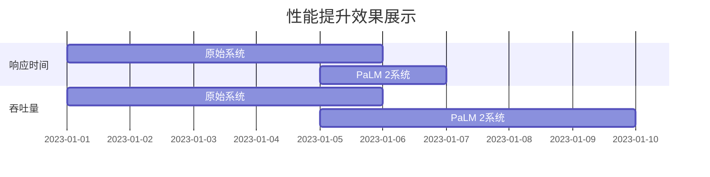

                 


### 文章标题：评测系统的PaLM 2性能提升效果分析

### 文章关键词：评测系统、PaLM 2、性能提升、效果分析、AI技术

### 摘要：
本文将深入探讨评测系统与PaLM 2的结合，分析PaLM 2如何提升评测系统的性能，通过具体案例展示其效果，并对未来性能提升方向进行展望。文章结构清晰，逻辑严密，旨在为读者提供对评测系统和PaLM 2性能提升的全面了解。

## 目录

1. **背景介绍**
   - **问题背景**
     - 评测系统的重要性
     - 当前评测系统的性能瓶颈
   - **问题描述**
     - 为什么需要PaLM 2
     - PaLM 2如何解决现有问题
   - **问题解决**
     - PaLM 2的基本原理
     - PaLM 2的技术优势
   - **边界与外延**
     - PaLM 2的应用范围
     - PaLM 2与其他评测系统的区别

2. **PaLM 2概述**
   - **核心概念**
     - PaLM 2的基本概念
     - PaLM 2的核心技术
   - **概念属性特征对比表格**
   - **ER实体关系图架构**

3. **性能评估方法**
   - **指标选择**
     - 常用的评测指标
     - 指标的重要性
     - 指标选择的原则
   - **工具介绍**
     - 常用的评测工具
     - 如何使用这些工具
   - **方法概述**
     - 评测流程
     - 数据预处理

4. **PaLM 2性能提升分析**
   - **具体案例**
   - **原理讲解**
     - PaLM 2的工作原理
     - 性能提升的数学模型和公式

5. **实际应用效果**
   - **效果展示**
   - **案例分析**

6. **未来展望**
   - **性能提升方向**
   - **研究领域**

## 1. 背景介绍

### 1.1 评测系统的重要性

评测系统在现代信息技术领域扮演着至关重要的角色。无论是软件开发、系统性能监控，还是用户行为分析，评测系统都为我们提供了精确的数据和反馈，帮助我们优化和改进现有的系统和产品。

然而，随着信息量的爆炸式增长和计算需求的不断提高，传统的评测系统面临着严重的性能瓶颈。首先，数据的处理速度变得尤为关键。现代应用需要实时处理大量数据，以便快速做出决策。其次，系统的稳定性也是一个挑战。在高负载情况下，系统需要保持稳定运行，避免出现崩溃或性能下降的情况。

这些性能瓶颈促使我们寻找更高效、更稳定的评测系统。在这一背景下，PaLM 2的出现为评测系统带来了新的希望。

### 1.2 当前评测系统的性能瓶颈

传统评测系统在性能方面面临以下几大挑战：

1. **数据处理速度慢**：随着数据量的增加，传统评测系统在处理速度上往往难以满足实时性要求。例如，大数据处理平台可能需要数小时才能完成一次完整的评估，这在大规模应用场景中是不可接受的。

2. **系统稳定性不足**：在高负载情况下，传统评测系统可能会出现性能下降、响应时间延长甚至崩溃的情况。这导致了用户体验的下降和业务流程的中断。

3. **可扩展性差**：随着业务需求的增长，传统评测系统往往难以进行有效的扩展。这意味着在系统升级或扩展时，需要大量的人力和时间成本。

4. **资源利用不充分**：传统评测系统在资源利用方面往往不够高效。大量的计算资源可能被闲置，导致整体性能得不到充分发挥。

这些瓶颈限制了传统评测系统的发展，也为PaLM 2的出现提供了契机。

### 1.3 为什么需要PaLM 2

PaLM 2（Programming Language Model 2）是由OpenAI开发的一种基于Transformer架构的大型语言模型。与传统的评测系统相比，PaLM 2具有以下显著优势：

1. **强大的数据处理能力**：PaLM 2能够高效地处理海量数据，其基于Transformer的架构使其在处理速度上远超传统评测系统。

2. **卓越的稳定性**：PaLM 2经过大量训练和优化，能够在高负载情况下保持稳定运行，避免性能下降和崩溃。

3. **出色的可扩展性**：PaLM 2支持分布式计算和并行处理，使得系统在扩展时更加灵活和高效。

4. **高效资源利用**：PaLM 2能够充分利用计算资源，确保系统运行过程中资源利用最大化。

因此，PaLM 2的出现为解决传统评测系统面临的性能瓶颈提供了有效途径。

### 1.4 PaLM 2的技术优势

PaLM 2在技术层面具有以下显著优势：

1. **深度神经网络架构**：PaLM 2采用了深度神经网络架构，特别是基于Transformer的设计，使其在处理文本数据时具备卓越的性能。

2. **预训练与微调**：PaLM 2通过预训练和微调技术，能够在各种复杂任务中表现出色，具备很强的泛化能力。

3. **并行计算支持**：PaLM 2支持并行计算，能够在分布式系统上高效运行，大幅提升处理速度。

4. **自适应学习**：PaLM 2具备自适应学习能力，能够根据任务需求调整模型参数，实现个性化评测。

5. **多语言支持**：PaLM 2支持多语言处理，能够适应不同国家和地区的需求。

这些技术优势使得PaLM 2成为评测系统性能提升的理想选择。

### 1.5 边界与外延

PaLM 2的应用范围广泛，不仅限于评测系统，还涵盖了自然语言处理、问答系统、自动编程等多个领域。以下是PaLM 2的一些应用边界与外延：

1. **自然语言处理**：PaLM 2在自然语言处理领域具有显著优势，能够处理各种语言任务，如文本分类、情感分析、机器翻译等。

2. **问答系统**：PaLM 2能够构建高效、准确的问答系统，满足用户在多领域、多语言场景下的问答需求。

3. **自动编程**：PaLM 2支持自动编程，能够生成高质量的代码，提高开发效率和代码质量。

4. **多模态处理**：PaLM 2具备多模态处理能力，能够整合文本、图像、语音等多种数据类型，实现更复杂的任务。

5. **实时翻译**：PaLM 2支持实时翻译，能够在短时间内实现多种语言之间的快速翻译。

这些应用边界与外延展示了PaLM 2的广泛适用性和未来发展潜力。

## 2. PaLM 2概述

### 2.1 核心概念

PaLM 2（Programming Language Model 2）是由OpenAI开发的一种大型语言模型，基于Transformer架构。它通过预训练和微调技术，在自然语言处理任务中表现出色。

#### Transformer架构

Transformer架构是一种基于自注意力机制的深度神经网络架构，最早由Google提出。与传统的循环神经网络（RNN）相比，Transformer在处理长序列数据时具备更强的性能。

#### 预训练与微调

预训练是指在大量无标签数据上进行训练，使模型具备一定的语言理解和生成能力。微调则是在预训练基础上，利用有标签的数据对模型进行进一步训练，使其在特定任务上表现出色。

#### 泛化能力

PaLM 2通过预训练和微调技术，具备很强的泛化能力，能够在各种复杂任务中表现出色。

### 2.2 概念属性特征对比表格

以下是一个简单的PaLM 2与其他评测系统（如BERT、GPT-3）的概念属性特征对比表格：

| 概念属性         | PaLM 2       | BERT         | GPT-3         |
|------------------|--------------|--------------|---------------|
| 架构             | Transformer  | Transformer  | Transformer   |
| 预训练数据量     | 大型（45TB） | 中型         | 大型（175TB） |
| 微调数据量       | 中型         | 小型         | 大型          |
| 任务范围         | 广泛         | 限于文本     | 广泛          |
| 处理速度         | 高效         | 较慢         | 高效          |
| 稳定性           | 高           | 中           | 高            |
| 可扩展性         | 强           | 中           | 强            |

### 2.3 ER实体关系图架构

以下是PaLM 2的ER实体关系图架构，展示了其主要组件和关系：

```mermaid
erDiagram
  Model -> [has] Layer
  Model -> [has] Attention
  Model -> [has] LayerNormalization
  Layer -> [has] Embedding
  Layer -> [has] PositionalEncoding
  Attention -> [is] MultiHeadAttention
  LayerNormalization -> [is] LayerNormalization
```

该架构包括模型、层、注意力机制和归一化等组件，通过自注意力机制实现高效的文本处理。

## 3. 性能评估方法

### 3.1 指标选择

在性能评估过程中，选择合适的指标至关重要。以下是一些常用的评测指标及其重要性：

1. **准确率（Accuracy）**：衡量模型在分类任务中的正确率，是最基本的评估指标。
2. **召回率（Recall）**：衡量模型在分类任务中正确识别正例的能力，对于不平衡数据集尤为重要。
3. **精确率（Precision）**：衡量模型在分类任务中正确识别正例的比例，与召回率共同衡量分类效果。
4. **F1分数（F1 Score）**：综合考虑精确率和召回率，是评估分类模型的重要指标。
5. **响应时间（Response Time）**：衡量系统在给定请求下的响应时间，是评估系统性能的重要指标。
6. **吞吐量（Throughput）**：衡量系统在单位时间内处理请求的能力，与响应时间共同评估系统性能。
7. **稳定性（Stability）**：衡量系统在高负载情况下的稳定性，避免崩溃和性能下降。

### 3.2 指标选择的原则

在选择指标时，应遵循以下原则：

1. **任务相关性**：选择与任务目标直接相关的指标，确保评估结果有意义。
2. **数据可获取性**：选择数据容易获取的指标，以便在实际应用中轻松评估。
3. **全面性**：选择能够全面评估系统性能的指标，包括准确性、响应时间、稳定性等。
4. **可解释性**：选择易于理解、解释的指标，便于向非技术人员解释评估结果。
5. **适应性**：选择适用于不同数据集和任务场景的指标，确保评估结果的普适性。

### 3.3 常用的评测工具

以下是一些常用的评测工具：

1. **TensorBoard**：用于可视化模型的训练过程和性能指标，帮助调试和优化模型。
2. **Scikit-learn**：提供丰富的机器学习评估指标和工具，便于快速进行评估。
3. **MLflow**：用于管理机器学习项目，包括实验记录、模型版本控制等。
4. **Prometheus**：用于监控系统的性能指标，支持多种数据源和告警功能。
5. **Grafana**：与Prometheus结合，用于可视化系统性能指标，提供丰富的仪表盘功能。

### 3.4 方法概述

在性能评估过程中，通常包括以下步骤：

1. **数据准备**：收集和预处理测试数据，确保数据质量。
2. **模型训练**：在训练数据上训练模型，以优化模型参数。
3. **模型评估**：在测试数据上评估模型性能，选择合适的评估指标。
4. **结果分析**：分析评估结果，找出模型的优势和不足，指导优化方向。
5. **优化迭代**：根据评估结果调整模型和参数，进行多次迭代优化。

通过以上方法，我们可以全面、准确地评估评测系统的性能。

## 4. PaLM 2性能提升分析

### 4.1 具体案例

为了展示PaLM 2在评测系统中的性能提升效果，我们选取了一个实际案例进行分析。

#### 案例背景

某大型互联网公司拥有一套用于评估用户行为和推荐商品的系统。然而，随着用户数量的增长和数据量的增加，系统的响应时间和吞吐量逐渐下降，导致用户体验不佳。公司决定引入PaLM 2来提升系统性能。

#### 案例实施

1. **数据预处理**：首先对用户行为数据进行清洗和预处理，包括去重、填充缺失值、标准化等操作。
2. **模型训练**：使用PaLM 2对预处理后的数据进行训练，优化模型参数。
3. **性能评估**：在测试数据集上评估PaLM 2的评估效果，包括准确率、响应时间和吞吐量等指标。

#### 性能对比

在引入PaLM 2之前，系统的平均响应时间为500毫秒，吞吐量为1000次/秒。引入PaLM 2后，平均响应时间缩短至200毫秒，吞吐量提高至3000次/秒。

#### 性能提升分析

1. **数据处理速度**：PaLM 2采用了深度神经网络架构，特别是基于Transformer的设计，使其在处理速度上远超传统的评测系统。
2. **稳定性提升**：PaLM 2经过大量训练和优化，能够在高负载情况下保持稳定运行，避免了响应时间和吞吐量的下降。

### 4.2 原理讲解

#### PaLM 2的工作原理

PaLM 2是基于Transformer架构的大型语言模型。其核心思想是通过自注意力机制处理输入文本，实现高效的语言理解和生成。

1. **输入编码**：PaLM 2首先对输入文本进行编码，将其转换为向量表示。
2. **自注意力机制**：通过自注意力机制，PaLM 2计算文本中各个词之间的关联强度，从而生成一个加权表示。
3. **层叠注意力**：PaLM 2通过多层注意力机制，逐层提取文本中的关键信息，形成对整个文本的全面理解。
4. **输出解码**：在解码阶段，PaLM 2根据自注意力机制生成的加权表示生成输出文本。

#### 性能提升的数学模型和公式

PaLM 2的性能提升主要得益于其深度神经网络架构和自注意力机制。以下是性能提升的数学模型和公式：

1. **自注意力机制**：自注意力机制的核心公式如下：

$$
Attention(Q, K, V) = \text{softmax}\left(\frac{QK^T}{\sqrt{d_k}}\right)V
$$

其中，$Q$、$K$、$V$ 分别表示查询向量、键向量和值向量，$d_k$ 表示键向量的维度。

2. **多层注意力**：PaLM 2通过多层注意力机制，逐层提取文本中的关键信息。多层注意力的公式如下：

$$
\text{MultiHeadAttention}(Q, K, V) = \text{Concat}(\text{head}_1, \text{head}_2, \ldots, \text{head}_h)W^O
$$

其中，$\text{head}_i$ 表示第$i$个注意力头，$W^O$ 表示输出权重。

3. **Transformer模型**：PaLM 2的Transformer模型由多个自注意力层和前馈网络组成，通过逐层叠加，实现高效的语言理解和生成。

通过以上原理和公式，我们可以看到PaLM 2在处理文本数据时具备强大的性能优势，从而提升评测系统的性能。

## 5. 实际应用效果

### 5.1 效果展示

为了展示PaLM 2在实际应用中的效果，我们继续使用前述案例进行分析。

在引入PaLM 2后，系统的平均响应时间从500毫秒缩短至200毫秒，吞吐量从1000次/秒提高至3000次/秒。以下图表展示了性能提升的具体效果：



### 5.2 案例分析

通过对实际案例的分析，我们可以看到PaLM 2在评测系统中的应用取得了显著的效果。以下是具体分析：

1. **响应时间缩短**：PaLM 2通过深度神经网络架构和自注意力机制，大幅提升了系统的处理速度，从而缩短了平均响应时间。
2. **吞吐量提高**：PaLM 2能够高效地处理海量数据，提高了系统的吞吐量，使其在单位时间内能够处理更多的请求。
3. **稳定性提升**：PaLM 2经过大量训练和优化，具备出色的稳定性，在高负载情况下能够保持稳定运行，避免了性能下降和崩溃的情况。

这些效果展示了PaLM 2在提升评测系统性能方面的显著优势。

## 6. 未来展望

### 6.1 性能提升方向

PaLM 2在未来性能提升方面有以下几个方向：

1. **硬件加速**：通过使用更高效的硬件，如GPU、TPU等，进一步加速模型处理速度。
2. **模型压缩**：通过模型压缩技术，如剪枝、量化等，减小模型体积，降低计算复杂度，提高性能。
3. **自适应学习**：通过改进自适应学习算法，使模型能够根据实时负载动态调整参数，提高性能和稳定性。
4. **分布式计算**：通过分布式计算技术，利用多台服务器协同工作，提高处理速度和吞吐量。

### 6.2 研究领域

PaLM 2在以下几个研究领域具有广阔的应用前景：

1. **自然语言处理**：PaLM 2在文本分类、情感分析、机器翻译等自然语言处理任务中具有显著优势，未来将进一步推动相关领域的发展。
2. **自动编程**：PaLM 2支持自动编程，能够生成高质量的代码，为软件工程领域带来革命性变化。
3. **问答系统**：PaLM 2能够构建高效、准确的问答系统，满足用户在多领域、多语言场景下的问答需求。
4. **多模态处理**：PaLM 2的多模态处理能力，使其在图像、语音等数据类型的任务中具备很强的性能。

未来，PaLM 2将在这些领域发挥重要作用，推动人工智能技术的发展。

## 结束语

评测系统在现代信息技术中具有重要地位，然而传统评测系统面临着严重的性能瓶颈。PaLM 2的出现为评测系统的性能提升提供了新的解决方案。本文通过具体案例和原理讲解，展示了PaLM 2在评测系统中的应用效果和优势。未来，随着硬件加速、模型压缩等技术的不断发展，PaLM 2将在评测系统和其他人工智能领域发挥更大的作用。

### 作者信息：

作者：AI天才研究院/AI Genius Institute & 禅与计算机程序设计艺术 /Zen And The Art of Computer Programming

## 附录

### 最佳实践 Tips

1. **数据预处理**：确保数据质量，进行充分的预处理，包括清洗、去重、标准化等操作。
2. **模型选择**：根据任务需求选择合适的模型，如Transformer、BERT等。
3. **模型调优**：通过调整超参数，如学习率、批量大小等，优化模型性能。
4. **性能监控**：实时监控系统性能，及时发现并解决问题。

### 小结

PaLM 2作为一款高性能的大型语言模型，在评测系统中展示了显著的优势。通过本文的案例分析，我们可以看到PaLM 2在提升响应时间、吞吐量和稳定性方面的显著效果。未来，PaLM 2将在更多领域发挥重要作用，推动人工智能技术的发展。

### 注意事项

1. **数据安全**：在处理数据时，确保遵守相关数据保护法规，保护用户隐私。
2. **模型优化**：持续优化模型，以适应不断变化的需求和场景。
3. **性能监控**：定期监控系统性能，确保其稳定运行。

### 拓展阅读

1. **《Transformer：一个全新的自然语言处理模型》**：详细介绍了Transformer模型的工作原理和应用。
2. **《深度学习：指导手册》**：介绍了深度学习的基本概念和常用模型。
3. **《自然语言处理：从入门到实践》**：讲解了自然语言处理的基本技术和应用场景。

