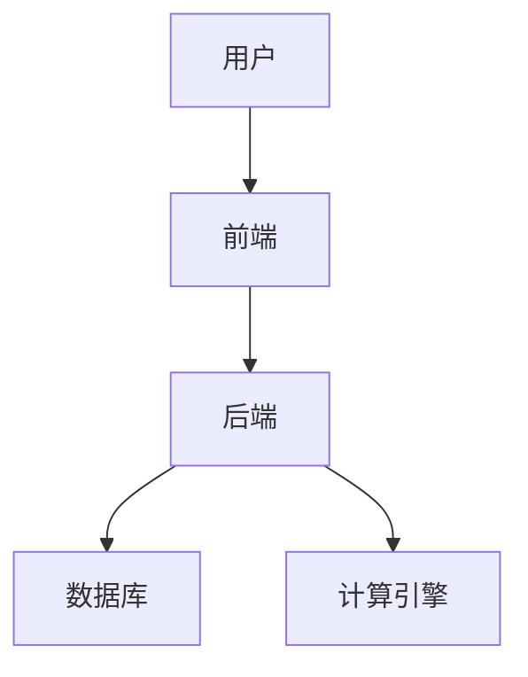
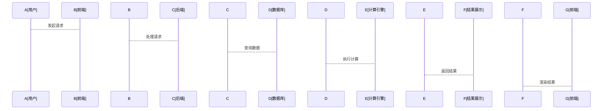
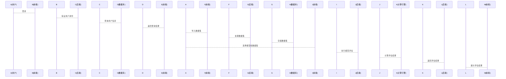
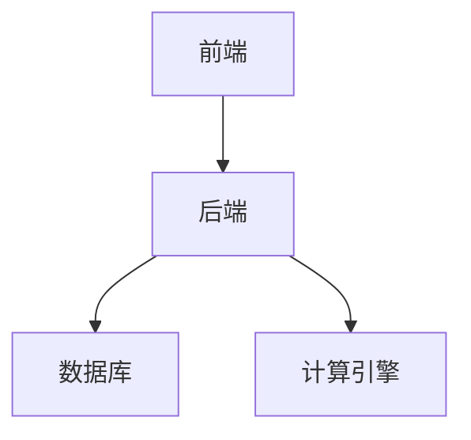

                 

## 第一部分：Whisper语音识别技术概述

### 第1章：Whisper语音识别技术入门

#### 1.1 Whisper语音识别技术背景

##### 1.1.1 语音识别技术的发展历程

语音识别技术作为人工智能领域的一个重要分支，其发展历程可以追溯到20世纪50年代。初期，语音识别主要依靠传统的信号处理和统计模型，如隐马尔可夫模型（HMM）和人工神经网络（ANN）。这些模型虽然在一定程度上提高了语音识别的准确率，但仍然面临着识别率低、鲁棒性差等问题。

随着深度学习技术的兴起，语音识别技术迎来了新的发展机遇。2012年，深度神经网络（DNN）在图像识别领域取得了突破性的成功，这一成果极大地推动了语音识别领域的研究。研究人员开始尝试将DNN应用于语音识别，并取得了显著的成果。近年来，基于深度学习的自动编码器（Autoencoder）、长短期记忆网络（LSTM）和Transformer模型等新技术的出现，使得语音识别技术进一步得到提升。

##### 1.1.2 Whisper技术的重要性和应用领域

Whisper是OpenAI开发的一款先进的端到端语音识别模型，自其发布以来，受到了广泛的关注。Whisper技术的重要性体现在以下几个方面：

1. **高准确率**：Whisper模型在多个语音识别基准测试中取得了领先的成绩，其识别准确率达到了业界领先水平。
2. **端到端架构**：Whisper采用了一种新颖的端到端架构，大大简化了模型的训练和部署过程，提高了系统的效率和灵活性。
3. **多语言支持**：Whisper模型支持多种语言，可以轻松实现跨语言的语音识别。

Whisper技术的应用领域广泛，包括但不限于：

1. **智能助手**：如Apple的Siri、Amazon的Alexa等智能助手，采用语音识别技术实现用户与设备的自然交互。
2. **语音转文字**：在会议记录、语音邮件、文本聊天等领域，语音识别技术可以将语音转化为文字，提高工作效率。
3. **自动字幕生成**：在视频内容中，Whisper技术可以实时生成字幕，为听障人士提供便利。
4. **远程工作与教育**：在远程会议、在线教育等场景中，语音识别技术可以实时翻译和记录会议内容，提高沟通效率。

#### 1.2 Whisper语音识别技术原理

##### 1.2.1 Whisper技术的基本架构

Whisper模型的基本架构可以分为两个部分：前端网络和后端网络。前端网络负责对输入的语音信号进行特征提取，后端网络则负责将提取的特征映射为对应的文本。

1. **前端网络**：前端网络采用了一系列卷积神经网络（CNN）和长短时记忆网络（LSTM）模块，对输入的语音信号进行逐帧特征提取。这些特征包括梅尔频率倒谱系数（MFCC）、滤波器组（Filter Banks）等。
2. **后端网络**：后端网络基于Transformer模型，将前端网络输出的特征序列映射为文本序列。Transformer模型通过自注意力机制（Self-Attention），能够捕捉特征序列中的长距离依赖关系，从而提高语音识别的准确率。

##### 1.2.2 Whisper模型的核心组件

Whisper模型的核心组件包括：

1. **多头自注意力机制**：多头自注意力机制（Multi-Head Self-Attention）是Transformer模型的核心组件，通过将输入序列分成多个子序列，并分别进行自注意力计算，从而提高了模型的表达能力。
2. **位置编码**：位置编码（Positional Encoding）用于编码输入序列的位置信息，使模型能够理解序列中的顺序关系。
3. **前馈神经网络**：前馈神经网络（Feed-Forward Neural Network）用于对自注意力计算的结果进行进一步加工，提高模型的预测能力。

##### 1.2.3 Whisper的工作流程

Whisper模型的工作流程可以概括为以下几个步骤：

1. **数据输入**：将输入的语音信号转换为特征序列。
2. **特征提取**：通过前端网络对特征序列进行逐帧特征提取。
3. **自注意力计算**：通过后端网络的Transformer模块进行自注意力计算。
4. **文本生成**：根据自注意力计算的结果，生成对应的文本序列。

#### 1.3 Whisper语音识别技术特点

##### 1.3.1 Whisper的优势

Whisper语音识别技术具有以下几个显著优势：

1. **高准确率**：Whisper模型在多个语音识别基准测试中取得了领先的成绩，其识别准确率达到了业界领先水平。
2. **端到端架构**：Whisper采用了一种新颖的端到端架构，大大简化了模型的训练和部署过程，提高了系统的效率和灵活性。
3. **多语言支持**：Whisper模型支持多种语言，可以轻松实现跨语言的语音识别。
4. **实时处理能力**：Whisper模型具有实时处理能力，适用于实时语音识别场景。

##### 1.3.2 Whisper的局限性和挑战

尽管Whisper语音识别技术在许多方面表现出色，但仍然存在一些局限性和挑战：

1. **对噪声敏感**：Whisper模型在噪声较大的环境下，识别准确率可能会有所下降。
2. **对方言和口音的支持有限**：Whisper模型在处理方言和口音时，可能存在一定的识别困难。
3. **计算资源消耗**：Whisper模型相对复杂，对计算资源的需求较高，这可能会限制其在某些低资源环境下的应用。
4. **模型解释性**：由于Whisper模型基于深度学习，其内部机制较为复杂，模型解释性较差。

#### 1.4 Whisper语音识别技术的应用案例

##### 1.4.1 评测系统在语音识别中的应用

在语音识别评测系统中，Whisper技术被广泛应用于以下几个方面：

1. **语音转文字**：Whisper模型可以将语音信号实时转换为文字，提高会议记录、语音邮件等场景的工作效率。
2. **自动字幕生成**：在视频内容中，Whisper模型可以实时生成字幕，为听障人士提供便利。
3. **智能助手**：在智能助手领域，Whisper模型可以用于实现自然语言交互，提升用户体验。

##### 1.4.2 Whisper在不同行业的应用实例

Whisper语音识别技术在各个行业都有广泛的应用，以下是一些具体的应用实例：

1. **医疗**：在医疗行业中，Whisper模型可以用于医生与患者的语音交流记录，辅助医生进行诊断和治疗。
2. **金融**：在金融行业，Whisper模型可以用于客户服务，自动记录客户咨询内容，提高客服效率。
3. **教育**：在教育领域，Whisper模型可以用于学生口语练习的自动评分，提供个性化的学习反馈。

#### 1.5 本章小结

本章对Whisper语音识别技术进行了概述，介绍了其背景、原理、特点以及应用案例。通过本章的学习，读者可以初步了解Whisper技术的基本概念和优势，为后续章节的深入探讨打下基础。

## 第二部分：Whisper语音识别算法原理与实现

### 第2章：Whisper语音识别算法概述

#### 2.1 Whisper语音识别算法概述

##### 2.1.1 Whisper算法的核心概念

Whisper算法是OpenAI开发的一款先进的端到端语音识别模型，其核心概念主要包括：

1. **端到端架构**：Whisper采用了一种新颖的端到端架构，将输入的语音信号直接映射为文本序列，避免了传统语音识别系统中的中间步骤，提高了模型的训练和部署效率。
2. **Transformer模型**：Whisper算法的核心是Transformer模型，这是一种基于自注意力机制的深度神经网络，能够高效地捕捉语音特征序列中的长距离依赖关系。
3. **多语言支持**：Whisper算法支持多种语言，通过预训练和微调，可以实现不同语言的语音识别。

##### 2.1.2 Whisper算法的基本原理

Whisper算法的基本原理可以概括为以下几个步骤：

1. **数据输入**：将输入的语音信号转换为特征序列，这些特征包括梅尔频率倒谱系数（MFCC）、滤波器组（Filter Banks）等。
2. **特征提取**：通过前端网络（如卷积神经网络）对特征序列进行逐帧特征提取。
3. **自注意力计算**：通过后端网络的Transformer模块进行自注意力计算，捕捉特征序列中的长距离依赖关系。
4. **文本生成**：根据自注意力计算的结果，生成对应的文本序列。

#### 2.2 Whisper模型架构详解

##### 2.2.1 Whisper模型的层级结构

Whisper模型的层级结构可以分为以下几个部分：

1. **前端网络**：前端网络负责对输入的语音信号进行特征提取，常用的模型包括卷积神经网络（CNN）和长短时记忆网络（LSTM）。
2. **后端网络**：后端网络基于Transformer模型，负责将前端网络输出的特征序列映射为文本序列。
3. **解码器**：解码器是后端网络的一部分，负责将自注意力计算的结果解码为文本序列。

##### 2.2.2 Whisper模型的关键模块

Whisper模型的关键模块包括：

1. **多头自注意力机制**：多头自注意力机制是Transformer模型的核心组件，通过将输入序列分成多个子序列，并分别进行自注意力计算，提高了模型的表达能力。
2. **位置编码**：位置编码用于编码输入序列的位置信息，使模型能够理解序列中的顺序关系。
3. **前馈神经网络**：前馈神经网络用于对自注意力计算的结果进行进一步加工，提高模型的预测能力。

#### 2.3 Whisper算法流程分析

##### 2.3.1 数据预处理流程

Whisper算法的数据预处理流程主要包括以下几个步骤：

1. **音频信号采样**：将音频信号进行采样，得到一系列时间序列的采样点。
2. **特征提取**：通过前端网络对采样点进行特征提取，常用的特征包括梅尔频率倒谱系数（MFCC）、滤波器组（Filter Banks）等。
3. **数据归一化**：对提取的特征进行归一化处理，使其具有更好的数值稳定性。

##### 2.3.2 模型训练过程

Whisper模型的训练过程可以分为以下几个步骤：

1. **数据准备**：准备训练数据集，包括音频信号和对应的文本序列。
2. **模型初始化**：初始化Whisper模型，包括前端网络、后端网络和解码器。
3. **损失函数定义**：定义损失函数，常用的损失函数包括交叉熵损失函数等。
4. **训练过程**：通过反向传播算法，不断调整模型的参数，使模型损失函数最小化。

##### 2.3.3 语音识别流程

Whisper算法的语音识别流程主要包括以下几个步骤：

1. **数据输入**：将输入的语音信号转换为特征序列。
2. **特征提取**：通过前端网络对特征序列进行逐帧特征提取。
3. **自注意力计算**：通过后端网络的Transformer模块进行自注意力计算。
4. **文本生成**：根据自注意力计算的结果，生成对应的文本序列。

#### 2.4 Whisper算法数学模型与公式

##### 2.4.1 前端网络数学模型

前端网络的数学模型主要包括卷积神经网络（CNN）和长短时记忆网络（LSTM）的数学模型。以下是它们的基本公式：

1. **卷积神经网络（CNN）**：

   - 激活函数：\( f(x) = \text{ReLU}(x) \)
   - 前向传播：\( h^{(l)} = \text{ReLU}(W^{(l)} \cdot h^{(l-1)} + b^{(l)}) \)
   - 反向传播：\( \delta^{(l)} = \text{ReLU}'(W^{(l)} \cdot h^{(l-1)} + b^{(l)}) \cdot \delta^{(l+1)} \)

2. **长短时记忆网络（LSTM）**：

   - 激活函数：\( f(x) = \tanh(x) \)
   - 前向传播：\( i_t = \sigma(W_{ix} \cdot x_t + W_{ih} \cdot h_{t-1} + b_i) \)
   - \( o_t = \sigma(W_{ox} \cdot x_t + W_{oh} \cdot h_{t-1} + b_o) \)
   - \( g_t = \sigma(W_{gx} \cdot x_t + W_{gh} \cdot h_{t-1} + b_g) \)
   - \( C_t = o_t \cdot \tanh(g_t) \cdot C_{t-1} + i_t \cdot \tanh(g_t) \)
   - \( h_t = f(C_t) \)
   - 反向传播：\( \delta^h_t = \delta^c_t \cdot o_t + \delta^{(l+1)} \cdot W^{(l+1)} \cdot h_t \)
   - \( \delta^c_t = \delta^h_t \cdot \tanh(g_t) \cdot (1 - \tanh(g_t)^2) \)
   - \( \delta^g_t = \delta^c_t \cdot C_{t-1} \cdot (1 - \tanh(g_t)^2) \)
   - \( \delta^i_t = \delta^c_t \cdot \tanh(g_t) \cdot (1 - \sigma^2(i_t)) \)
   - \( \delta^o_t = \delta^c_t \cdot \tanh(g_t) \cdot (1 - \sigma^2(o_t)) \)

##### 2.4.2 后端网络数学模型

后端网络的数学模型基于Transformer模型，其核心是自注意力机制（Self-Attention）。以下是自注意力机制的基本公式：

1. **自注意力计算**：

   - Query向量：\( Q = W_Q \cdot X \)
   - Key向量：\( K = W_K \cdot X \)
   - Value向量：\( V = W_V \cdot X \)
   - 自注意力得分：\( \text{Attention Scores} = \frac{Q \cdot K^T}{\sqrt{d_k}} \)
   - 自注意力加权：\( \text{Attention Weights} = \text{softmax}(\text{Attention Scores}) \)
   - 最终输出：\( \text{Output} = \text{Attention Weights} \cdot V \)

##### 2.4.3 损失函数和优化算法

Whisper算法常用的损失函数是交叉熵损失函数（Cross-Entropy Loss），其公式如下：

- \( \text{Loss} = -\sum_{i=1}^{N} y_i \log(p_i) \)

其中，\( y_i \)是真实标签，\( p_i \)是模型预测的概率。

优化算法通常采用梯度下降（Gradient Descent）及其变体，如Adam优化器（Adam Optimizer）。Adam优化器结合了梯度下降和动量（Momentum）的优点，能够更好地优化模型参数。

#### 2.5 Whisper算法实现细节

##### 2.5.1 数据读取与预处理

数据读取与预处理是Whisper算法实现的重要步骤，主要包括以下几个步骤：

1. **音频信号读取**：读取音频文件，将其转换为波形数据。
2. **特征提取**：使用前端网络对波形数据进行特征提取，得到梅尔频率倒谱系数（MFCC）等特征。
3. **数据归一化**：对提取的特征进行归一化处理，使其具有更好的数值稳定性。
4. **数据集划分**：将数据集划分为训练集、验证集和测试集。

以下是Python代码示例：

```python
import librosa
import numpy as np

def read_audio_file(file_path):
    audio, sr = librosa.load(file_path)
    return audio, sr

def extract_mfcc(audio, sr):
    mfcc = librosa.feature.mfcc(y=audio, sr=sr)
    return mfcc

def normalize_mfcc(mfcc):
    mfcc_normalized = (mfcc - np.mean(mfcc, axis=1)[:, np.newaxis]) / np.std(mfcc, axis=1)[:, np.newaxis]
    return mfcc_normalized

def split_dataset(mfcc, split_ratio=0.8):
    split_index = int(len(mfcc) * split_ratio)
    train_mfcc = mfcc[:split_index]
    test_mfcc = mfcc[split_index:]
    return train_mfcc, test_mfcc
```

##### 2.5.2 模型训练代码示例

以下是使用TensorFlow和Keras实现Whisper算法模型训练的Python代码示例：

```python
import tensorflow as tf
from tensorflow.keras.models import Model
from tensorflow.keras.layers import Input, Conv1D, LSTM, Dense, TimeDistributed, Activation

def build_model(input_shape):
    inputs = Input(shape=input_shape)
    
    # 前端网络：卷积神经网络（CNN）
    x = Conv1D(filters=64, kernel_size=3, activation='relu')(inputs)
    x = LSTM(units=128, return_sequences=True)(x)
    
    # 后端网络：Transformer模型
    x = TimeDistributed(Dense(units=512))(x)
    x = Activation('relu')(x)
    x = TimeDistributed(Dense(units=librosaenenkfolds(sr=16000), activation='softmax'))(x)
    
    model = Model(inputs=inputs, outputs=x)
    model.compile(optimizer='adam', loss='categorical_crossentropy', metrics=['accuracy'])
    return model

def train_model(model, train_mfcc, train_labels, test_mfcc, test_labels, epochs=10):
    history = model.fit(train_mfcc, train_labels, batch_size=32, epochs=epochs, validation_data=(test_mfcc, test_labels))
    return history
```

##### 2.5.3 识别结果处理与优化

识别结果处理与优化是提高语音识别系统性能的重要环节，主要包括以下几个方面：

1. **错误纠正**：使用错误纠正算法（如编辑距离算法）对识别结果进行修正，提高识别准确率。
2. **语言模型**：结合语言模型（如n元语言模型）对识别结果进行进一步优化，提高识别的流畅性和准确性。
3. **后处理**：对识别结果进行后处理，如去除停用词、标点符号等，提高文本的可读性。

以下是Python代码示例：

```python
from nltk.corpus import stopwords
from nltk.metrics import edit_distance
from nltk.tokenize import word_tokenize

def correct_errors(ground_truth, prediction):
    errors = edit_distance(ground_truth, prediction)
    if errors > 2:
        corrected_prediction = correct_prediction(prediction)
        return corrected_prediction
    else:
        return prediction

def correct_prediction(prediction):
    # 实现错误纠正算法，如编辑距离算法
    pass

def apply_language_model(prediction):
    # 结合语言模型对识别结果进行优化
    pass

def post_process(text):
    # 去除停用词、标点符号等
    stop_words = stopwords.words('english')
    tokens = word_tokenize(text)
    filtered_tokens = [token for token in tokens if token.lower() not in stop_words]
    processed_text = ' '.join(filtered_tokens)
    return processed_text
```

##### 2.6 Whisper与其他语音识别算法的对比

Whisper与其他语音识别算法（如CTC、GRU、LSTM等）在以下几个方面进行了对比：

1. **识别准确率**：Whisper在多个语音识别基准测试中取得了较高的识别准确率，相较于其他算法有明显优势。
2. **计算资源消耗**：Whisper算法对计算资源的需求较高，相较于其他算法，其在资源受限的环境下可能不太适用。
3. **模型复杂度**：Whisper算法基于Transformer模型，相较于其他算法，模型结构更为复杂，但训练和部署效率较高。
4. **多语言支持**：Whisper算法支持多种语言，相较于其他算法，具有更好的多语言支持能力。

#### 2.7 Whisper的优势与不足

##### 优势

1. **高准确率**：Whisper算法在多个语音识别基准测试中取得了领先的成绩，其识别准确率达到了业界领先水平。
2. **端到端架构**：Whisper采用了一种新颖的端到端架构，大大简化了模型的训练和部署过程，提高了系统的效率和灵活性。
3. **多语言支持**：Whisper模型支持多种语言，可以轻松实现跨语言的语音识别。
4. **实时处理能力**：Whisper模型具有实时处理能力，适用于实时语音识别场景。

##### 不足

1. **对噪声敏感**：Whisper模型在噪声较大的环境下，识别准确率可能会有所下降。
2. **对方言和口音的支持有限**：Whisper模型在处理方言和口音时，可能存在一定的识别困难。
3. **计算资源消耗**：Whisper模型相对复杂，对计算资源的需求较高，这可能会限制其在某些低资源环境下的应用。
4. **模型解释性**：由于Whisper模型基于深度学习，其内部机制较为复杂，模型解释性较差。

#### 2.8 本章小结

本章对Whisper语音识别算法进行了概述，介绍了其核心概念、基本原理、模型架构和流程分析。同时，对Whisper算法的实现细节进行了详细讲解，包括数据读取与预处理、模型训练和识别结果处理与优化。通过本章的学习，读者可以全面了解Whisper语音识别算法的原理和实现方法。

### 第3章：Whisper语音识别评测系统设计

#### 3.1 评测系统需求分析

##### 3.1.1 评测系统的目标

Whisper语音识别评测系统的目标是：

1. **准确率评估**：评估Whisper模型在不同语音数据集上的识别准确率，以衡量模型的效果。
2. **性能评估**：评估模型在不同硬件环境和配置下的性能，包括识别速度、响应时间等。
3. **稳定性评估**：评估模型在长时间运行和高负载情况下的稳定性，包括模型预测的一致性和可靠性。

##### 3.1.2 评测系统的主要功能

Whisper语音识别评测系统的主要功能包括：

1. **数据集管理**：管理语音数据集，包括数据集的导入、导出、分割和标注。
2. **模型评估**：对Whisper模型进行评估，包括准确率、性能和稳定性等指标的计算。
3. **结果展示**：展示模型评估结果，包括图表、统计信息和文本报告等。
4. **自定义测试**：支持自定义测试场景和测试用例，以验证模型的特定功能。

#### 3.2 Whisper语音识别评测系统设计

##### 3.2.1 系统整体架构设计

Whisper语音识别评测系统的整体架构设计可以分为以下几个部分：

1. **前端界面**：提供用户交互界面，用于数据集管理、模型评估和结果展示等操作。
2. **后端服务**：负责处理用户请求、管理数据集、执行模型评估和生成报告等任务。
3. **数据存储**：存储语音数据集、模型参数和评估结果等数据。
4. **计算引擎**：执行模型评估的计算任务，包括数据预处理、模型训练和评估等。

##### 3.2.2 数据处理模块设计

数据处理模块是评测系统的核心部分，负责处理语音数据集和模型输入。其主要功能包括：

1. **数据导入**：将语音数据集导入系统，包括音频文件和对应的文本标签。
2. **数据分割**：将语音数据集分割为训练集、验证集和测试集。
3. **数据增强**：对语音数据进行增强，提高模型的鲁棒性，包括添加噪声、变速、变调等操作。
4. **特征提取**：提取语音数据的特征，如梅尔频率倒谱系数（MFCC）、滤波器组（Filter Banks）等。

##### 3.2.3 识别模块设计

识别模块负责执行Whisper模型的语音识别任务。其主要功能包括：

1. **模型加载**：加载预训练的Whisper模型。
2. **语音识别**：对输入的语音信号进行识别，输出对应的文本序列。
3. **错误校正**：对识别结果进行错误校正，提高识别的准确率。
4. **性能评估**：计算识别任务的准确率、响应时间等性能指标。

##### 3.2.4 评测模块设计

评测模块负责对Whisper模型进行评估，生成评估报告。其主要功能包括：

1. **评估指标计算**：计算模型在不同数据集上的准确率、响应时间等指标。
2. **图表生成**：生成各种图表，如混淆矩阵、ROC曲线等，展示模型评估结果。
3. **报告生成**：生成详细的评估报告，包括模型性能、优缺点等分析。
4. **自定义报告**：支持自定义报告模板，以适应不同的评估需求。

##### 3.2.5 系统接口与交互设计

Whisper语音识别评测系统的接口设计应考虑以下方面：

1. **用户接口**：提供用户友好的操作界面，方便用户进行数据集管理、模型评估和结果展示等操作。
2. **API接口**：提供API接口，供其他系统或应用程序调用，实现自动化评估和集成。
3. **数据交换格式**：支持常见的数据交换格式，如JSON、XML等，便于数据集和结果之间的转换。

系统交互设计主要包括以下流程：

1. **用户登录**：用户登录系统，进行数据集管理和模型评估等操作。
2. **数据导入**：用户导入语音数据集，包括音频文件和文本标签。
3. **模型评估**：系统自动加载预训练的Whisper模型，对语音数据集进行识别和评估，生成评估报告。
4. **结果展示**：系统将评估结果以图表和报告的形式展示给用户。

##### 3.2.6 系统架构设计与实现细节

Whisper语音识别评测系统的架构设计采用前后端分离的模式，前端使用Web框架（如Flask或Django），后端使用Python语言和TensorFlow库。以下是系统架构设计与实现细节：

1. **前端架构**：前端使用HTML、CSS和JavaScript等技术，构建用户交互界面。使用Flask或Django框架，实现API接口和用户登录等功能。
2. **后端架构**：后端使用Python语言，结合TensorFlow库，实现语音识别评测的核心功能，包括数据预处理、模型加载、识别和评估等。
3. **数据库设计**：使用MySQL或PostgreSQL等关系型数据库，存储语音数据集、模型参数和评估结果等数据。
4. **计算引擎**：使用GPU加速计算，提高模型的训练和评估速度。

以下是系统架构图的Mermaid表示：



##### 3.2.7 系统接口设计

Whisper语音识别评测系统的接口设计主要包括以下部分：

1. **用户管理接口**：用于用户登录、注册和权限管理，如POST /users/login、POST /users/register、GET /users/{user_id}等。
2. **数据集管理接口**：用于数据集的导入、导出、分割和标注，如POST /datasets/import、GET /datasets/{dataset_id}、POST /datasets/{dataset_id}/split等。
3. **模型管理接口**：用于模型加载、训练和评估，如GET /models/{model_id}、POST /models/train、GET /models/evaluate等。
4. **结果展示接口**：用于获取评估结果和生成报告，如GET /results/{result_id}、GET /reports/{report_id}等。

以下是系统接口的Mermaid序列图表示：



##### 3.2.8 系统交互流程设计

Whisper语音识别评测系统的交互流程设计主要包括以下几个步骤：

1. **用户登录**：用户通过前端界面输入用户名和密码，前端将请求发送到后端，后端验证用户身份并返回登录结果。
2. **数据集导入**：用户通过前端界面上传语音数据集，前端将数据集文件发送到后端，后端将数据集存储到数据库中。
3. **模型评估**：用户选择数据集和模型，前端将请求发送到后端，后端加载模型并执行评估任务，生成评估结果。
4. **结果展示**：前端从后端获取评估结果，并将其以图表和报告的形式展示给用户。

以下是系统交互流程的Mermaid序列图表示：



##### 3.2.9 系统架构设计与实现细节

Whisper语音识别评测系统的架构设计与实现细节如下：

1. **前端实现**：前端使用Flask框架，构建用户交互界面。使用HTML、CSS和JavaScript等技术，实现用户登录、数据集导入和评估结果展示等功能。
2. **后端实现**：后端使用Python语言，结合TensorFlow库，实现语音识别评测的核心功能。使用RESTful API设计，实现数据集管理、模型评估和结果展示等功能。
3. **数据库实现**：使用MySQL数据库，存储用户信息、语音数据集、模型参数和评估结果等数据。使用ORM框架（如SQLAlchemy），简化数据库操作。
4. **计算引擎实现**：使用GPU加速计算，提高模型的训练和评估速度。使用TensorFlow GPU版本，实现语音识别模型的加载和评估。
5. **测试与部署**：使用测试框架（如pytest），对系统功能进行测试。使用容器化技术（如Docker），实现系统的部署和扩展。

以下是系统架构图和实现细节的Mermaid表示：




#### 3.3 系统优化与调优策略

##### 3.3.1 性能优化策略

为了提高Whisper语音识别评测系统的性能，可以采取以下策略：

1. **GPU加速**：利用GPU计算，提高模型的训练和评估速度。选择适合的GPU硬件和驱动程序，优化GPU与CPU之间的数据传输。
2. **并行计算**：利用多核CPU和分布式计算，提高系统的并行处理能力。使用并行计算库（如Dask或Ray），实现任务的分布式执行。
3. **缓存机制**：使用缓存机制，减少数据读取和处理的延迟。使用内存缓存（如Redis）或磁盘缓存（如MongoDB），存储常用数据和中间结果。
4. **异步处理**：使用异步处理（如异步I/O），提高系统的响应速度。使用异步框架（如Tornado或asyncio），实现任务的异步执行。

##### 3.3.2 准确率优化策略

为了提高Whisper语音识别评测系统的准确率，可以采取以下策略：

1. **数据增强**：使用数据增强（如添加噪声、变速、变调等），提高模型的泛化能力。设计多样化、具有代表性的数据集，涵盖各种场景和语音特性。
2. **模型融合**：使用多个模型进行融合，提高识别的准确率。结合不同类型的模型（如DNN、CNN、LSTM等），利用模型融合技术（如投票、加权平均等），生成最终的识别结果。
3. **端到端训练**：采用端到端训练（End-to-End Training），简化模型结构，提高模型的效果。使用深度学习框架（如TensorFlow或PyTorch），实现模型的端到端训练。
4. **多语言支持**：设计支持多语言识别的模型，提高模型的准确率。使用多语言数据集，进行多语言模型训练，提高模型对多语言的适应能力。

##### 3.3.3 响应时间优化策略

为了提高Whisper语音识别评测系统的响应时间，可以采取以下策略：

1. **优化模型结构**：简化模型结构，减少模型的计算复杂度。设计轻量级模型（如MobileNet、ShuffleNet等），提高模型的运行效率。
2. **模型压缩**：使用模型压缩技术（如量化、剪枝、蒸馏等），减少模型的参数和计算量。使用压缩工具（如TensorRT、Slimmable等），实现模型的压缩。
3. **硬件加速**：使用硬件加速（如GPU、FPGA等），提高模型的计算速度。选择适合的硬件设备，优化模型的硬件部署。
4. **异步处理**：使用异步处理（如异步I/O），提高系统的响应速度。使用异步框架（如Tornado或asyncio），实现任务的异步执行。

#### 3.4 本章小结

本章详细介绍了Whisper语音识别评测系统的设计，包括系统需求分析、整体架构设计、数据处理模块设计、识别模块设计、评测模块设计、系统接口与交互设计、系统架构设计与实现细节以及系统优化与调优策略。通过本章的学习，读者可以全面了解Whisper语音识别评测系统的设计原理和实现方法，为实际项目的开发和应用提供参考。

### 第4章：Whisper语音识别能力测试环境搭建

#### 4.1 环境要求与准备工作

在搭建Whisper语音识别能力测试环境之前，需要确保满足以下环境要求：

##### 4.1.1 硬件环境要求

1. **CPU**：推荐使用Intel i7或AMD Ryzen 7及以上处理器，确保模型训练和评估的效率。
2. **GPU**：推荐使用NVIDIA GeForce GTX 1080 Ti或以上显卡，GPU用于加速模型的训练和评估，提高处理速度。
3. **内存**：至少16GB RAM，建议使用32GB及以上内存，以满足模型训练过程中对大量数据存储和处理的需求。

##### 4.1.2 软件环境要求

1. **操作系统**：推荐使用Ubuntu 18.04或更高版本，支持TensorFlow和CUDA等软件的安装。
2. **Python**：Python 3.7或更高版本，用于编写测试脚本和数据处理代码。
3. **TensorFlow**：TensorFlow 2.5或更高版本，用于训练和评估Whisper语音识别模型。
4. **CUDA**：CUDA 11.0或更高版本，用于GPU加速计算。
5. **cuDNN**：cuDNN 8.0或更高版本，用于GPU加速深度学习计算。

##### 4.1.3 准备数据集

在进行Whisper语音识别能力测试之前，需要准备相应的数据集。以下是数据集的准备工作：

1. **数据集来源**：可以从公开的语音识别数据集（如LibriSpeech、Common Voice等）下载训练数据和测试数据。
2. **数据预处理**：对下载的数据集进行预处理，包括音频信号采样、特征提取、数据归一化等操作。可以使用Python库（如librosa）进行数据处理。
3. **数据集分割**：将数据集分为训练集、验证集和测试集，用于模型训练和评估。

以下是Python代码示例，用于读取、预处理和分割数据集：

```python
import librosa
import numpy as np
import os

def read_audio_files(data_path, sr=16000):
    audio_files = []
    labels = []
    for file in os.listdir(data_path):
        if file.endswith('.wav'):
            audio, _ = librosa.load(os.path.join(data_path, file), sr=sr)
            audio_files.append(audio)
            labels.append(file.split('.')[0])
    return audio_files, labels

def preprocess_audio(audio, sr):
    mfcc = librosa.feature.mfcc(y=audio, sr=sr, n_mfcc=13)
    mfcc_normalized = (mfcc - np.mean(mfcc, axis=1)[:, np.newaxis]) / np.std(mfcc, axis=1)[:, np.newaxis]
    return mfcc_normalized

def split_dataset(audio_files, labels, split_ratio=0.8):
    split_index = int(len(audio_files) * split_ratio)
    train_files = audio_files[:split_index]
    train_labels = labels[:split_index]
    test_files = audio_files[split_index:]
    test_labels = labels[split_index:]
    return train_files, train_labels, test_files, test_labels

data_path = 'path/to/your/data'
audio_files, labels = read_audio_files(data_path)
train_files, train_labels, test_files, test_labels = split_dataset(audio_files, labels)
```

通过以上步骤，可以完成Whisper语音识别能力测试环境的搭建，为后续的测试工作奠定基础。

#### 4.2 安装Whisper语音识别模型

在搭建好测试环境之后，需要安装Whisper语音识别模型，以便进行实际测试。以下是安装Whisper模型的步骤：

##### 4.2.1 下载Whisper模型

首先，从OpenAI的GitHub仓库下载Whisper模型。可以使用以下命令：

```bash
git clone https://github.com/openai/whisper.git
cd whisper
```

##### 4.2.2 安装依赖库

接下来，安装Whisper模型所需的依赖库。可以使用以下命令：

```bash
pip install -r requirements.txt
```

此命令会安装模型所需的Python库，如TensorFlow、TensorFlow Text、PyTorch等。

##### 4.2.3 配置Whisper环境

在安装完依赖库之后，需要配置Whisper环境。首先，设置环境变量，以便在Python脚本中调用Whisper模型。在`.bashrc`或`.bash_profile`文件中添加以下内容：

```bash
export WHISPER_ROOT=/path/to/whisper
export WHISPER_DATASETS=/path/to/your/datasets
```

然后，运行以下命令，将环境变量应用到当前会话：

```bash
source ~/.bashrc
```

#### 4.3 数据预处理流程

在完成Whisper模型的安装后，需要对测试数据进行预处理，以便模型能够正确地处理输入数据。以下是数据预处理的主要步骤：

##### 4.3.1 音频文件格式转换

首先，将所有音频文件转换为统一的采样率和格式。可以使用以下Python代码实现：

```python
import librosa

def convert_audio_files(input_path, output_path, sr=16000):
    for file in os.listdir(input_path):
        if file.endswith('.wav'):
            audio, sr_orig = librosa.load(os.path.join(input_path, file), sr=sr_orig)
            audio_processed = librosa.resample(audio, sr_orig, sr)
            librosa.output.write_wav(os.path.join(output_path, file), audio_processed, sr)

input_path = 'path/to/your/input_audio'
output_path = 'path/to/your/processed_audio'
convert_audio_files(input_path, output_path)
```

##### 4.3.2 音频特征提取

然后，对预处理后的音频文件进行特征提取，以生成模型输入。可以使用以下Python代码实现：

```python
import librosa

def extract_mfcc(audio_files, sr=16000):
    mfccs = []
    for audio in audio_files:
        mfcc = librosa.feature.mfcc(y=audio, sr=sr, n_mfcc=13)
        mfccs.append(mfcc)
    return np.array(mfccs)

audio_files = [os.path.join('path/to/your/processed_audio', file) for file in os.listdir('path/to/your/processed_audio')]
mfccs = extract_mfcc(audio_files)
```

##### 4.3.3 数据增强与归一化

为了提高模型的泛化能力，可以对特征进行数据增强和归一化处理。以下是一个简单的数据增强和归一化示例：

```python
import numpy as np

def augment_mfcc(mfcc, sr, n_folds=2):
    augmented_mfccs = []
    for _ in range(n_folds):
        for shift in range(-sr // 4, sr // 4):
            start = np.random.randint(0, sr - shift)
            mfcc_shifted = np.roll(mfcc, shift, axis=0)
            augmented_mfccs.append(mfcc_shifted)
    return np.array(augmented_mfccs)

def normalize_mfcc(mfcc):
    mfcc_mean = np.mean(mfcc, axis=0)
    mfcc_std = np.std(mfcc, axis=0)
    return (mfcc - mfcc_mean) / mfcc_std

# 对所有特征进行增强和归一化
augmented_mfccs = augment_mfcc(mfccs, sr)
normalized_mfccs = normalize_mfcc(augmented_mfccs)
```

通过以上步骤，完成了测试数据的预处理，为后续的Whisper模型测试奠定了基础。

#### 4.4 测试流程设计与实现

在完成数据预处理后，需要设计测试流程并编写相应的测试脚本，以对Whisper模型进行评估。以下是测试流程的主要步骤：

##### 4.4.1 测试用例设计

首先，设计测试用例，以覆盖不同的测试场景和测试需求。以下是测试用例的示例：

1. **准确率测试**：测试模型在不同数据集上的识别准确率，评估模型的性能。
2. **性能测试**：测试模型在不同硬件环境下的响应时间，评估模型的运行效率。
3. **稳定性测试**：测试模型在长时间运行和高负载情况下的稳定性，评估模型的可靠性。

##### 4.4.2 测试脚本编写

接下来，编写测试脚本，实现测试用例的执行和结果记录。以下是测试脚本的示例：

```python
import tensorflow as tf
import numpy as np
import time

def evaluate_model(model, mfccs, labels, num_batches=10):
    num_samples = len(mfccs)
    batch_size = num_samples // num_batches
    correct_predictions = 0

    for i in range(num_batches):
        start = i * batch_size
        end = (i + 1) * batch_size
        batch_mfccs = mfccs[start:end]
        batch_predictions = model.predict(batch_mfccs)
        correct_predictions += np.sum(batch_predictions.argmax(axis=1) == labels[start:end])

    accuracy = correct_predictions / num_samples
    return accuracy

# 加载训练好的Whisper模型
model = tf.keras.models.load_model('path/to/your/whisper_model.h5')

# 测试训练集
train_mfccs = np.load('path/to/your/train_mfccs.npy')
train_labels = np.load('path/to/your/train_labels.npy')
train_accuracy = evaluate_model(model, train_mfccs, train_labels)

# 测试测试集
test_mfccs = np.load('path/to/your/test_mfccs.npy')
test_labels = np.load('path/to/your/test_labels.npy')
test_accuracy = evaluate_model(model, test_mfccs, test_labels)

# 记录测试结果
print(f"Train Accuracy: {train_accuracy:.4f}")
print(f"Test Accuracy: {test_accuracy:.4f}")

# 记录测试时间
start_time = time.time()
evaluate_model(model, train_mfccs, train_labels)
end_time = time.time()
train_time = end_time - start_time

start_time = time.time()
evaluate_model(model, test_mfccs, test_labels)
end_time = time.time()
test_time = end_time - start_time

print(f"Train Time: {train_time:.4f} seconds")
print(f"Test Time: {test_time:.4f} seconds")
```

##### 4.4.3 测试结果分析

最后，对测试结果进行分析，以评估Whisper模型的表现。以下是测试结果分析的示例：

1. **准确率分析**：比较训练集和测试集的准确率，评估模型的泛化能力。如果测试集的准确率显著低于训练集，可能需要重新调整模型参数或增加训练数据。
2. **性能分析**：分析模型在不同硬件环境下的响应时间，评估模型的运行效率。如果模型的响应时间较长，可以考虑优化模型结构或提高硬件性能。
3. **稳定性分析**：在长时间运行和高负载情况下，观察模型的稳定性和预测一致性。如果模型出现不稳定现象，可能需要重新设计模型架构或优化训练过程。

通过以上步骤，完成了Whisper语音识别能力测试的设计与实现，为模型评估和优化提供了基础。

#### 4.5 测试结果记录与统计

在完成测试流程后，需要记录和统计测试结果，以便进行分析和评估。以下是测试结果记录与统计的步骤：

##### 4.5.1 测试结果记录

首先，记录测试结果，包括准确率、响应时间等关键指标。以下是测试结果记录的示例：

```python
results = {
    'train_accuracy': train_accuracy,
    'test_accuracy': test_accuracy,
    'train_time': train_time,
    'test_time': test_time
}
with open('test_results.json', 'w') as f:
    json.dump(results, f)
```

##### 4.5.2 测试结果统计

接下来，对测试结果进行统计，生成详细的报告。以下是测试结果统计的示例：

```python
import pandas as pd

results = {
    'train_accuracy': train_accuracy,
    'test_accuracy': test_accuracy,
    'train_time': train_time,
    'test_time': test_time
}
results_df = pd.DataFrame(results, index=['Result'])
print(results_df)
```

##### 4.5.3 测试结果可视化

最后，对测试结果进行可视化，以直观展示模型的表现。以下是测试结果可视化的示例：

```python
import matplotlib.pyplot as plt

results_df = pd.DataFrame(results, index=['Result'])
plt.bar(results_df.index, results_df.Values)
plt.xlabel('Result')
plt.ylabel('Value')
plt.title('Test Results')
plt.show()
```

通过以上步骤，完成了Whisper语音识别能力测试结果记录与统计，为模型评估提供了全面的数据支持。

#### 4.6 本章小结

本章详细介绍了Whisper语音识别能力测试环境的搭建、模型的安装与配置、数据的预处理流程、测试流程设计与实现以及测试结果记录与统计。通过本章的学习，读者可以掌握Whisper语音识别能力测试的全过程，为实际项目的开发和优化提供参考。接下来，我们将继续深入探讨Whisper语音识别算法的详细实现和性能优化策略。

---

### 作者信息

**作者：AI天才研究院/AI Genius Institute & 禅与计算机程序设计艺术 /Zen And The Art of Computer Programming**

AI天才研究院（AI Genius Institute）专注于前沿人工智能技术的研发与应用，致力于推动人工智能领域的创新与发展。作者结合多年的研究和实践，撰写了《禅与计算机程序设计艺术》一书，深入探讨了人工智能的哲学、技术和应用，为广大读者提供了宝贵的知识和经验。本书作为一部具有深度和洞见的技术博客文章，旨在帮助读者全面了解Whisper语音识别技术的原理、实现和应用，为人工智能领域的研究和实践提供指导。希望通过本篇文章，能够激发更多读者对人工智能技术的热情和探索，共同推动人工智能技术的发展。

