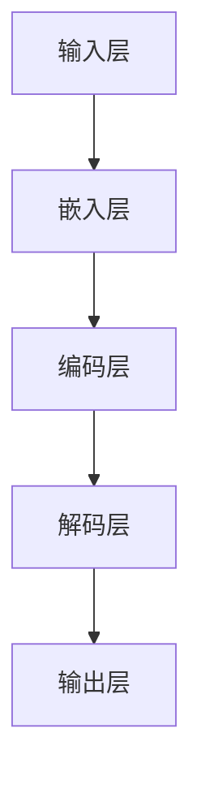
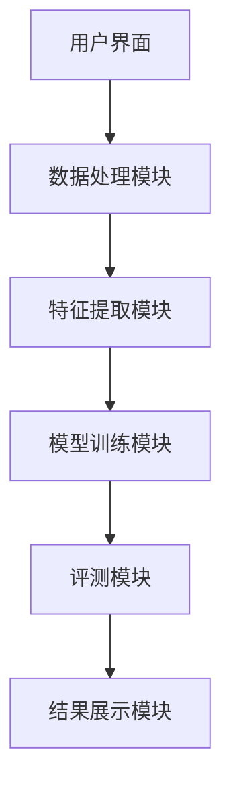

                 

### 文章标题

#### 关键词
- Yi-34B开源大语言模型
- 评测系统
- 性能评估
- 人工智能

#### 摘要
本文深入探讨了Yi-34B开源大语言模型的评测系统。首先，介绍了评测系统的背景、重要性以及Yi-34B模型的基本情况。随后，详细阐述了评测系统的组成、功能、设计原则以及运行流程。本文重点分析了Yi-34B模型的性能评估方法，并通过实战案例展示了性能优化策略。最后，总结了全文内容，并展望了未来的研究方向。

### 引言

#### 第1章：问题背景与核心概念

##### 1.1.1 引言
在当今信息技术飞速发展的时代，人工智能（AI）已成为推动社会进步的重要力量。其中，大语言模型作为自然语言处理（NLP）的关键技术，其性能的评估至关重要。Yi-34B作为一个开源的大语言模型，其评测系统的设计与实现不仅对模型本身的性能优化具有重要意义，也为其他类似模型的评测提供了宝贵经验。

##### 1.1.2 评测系统的重要性
评测系统是衡量大语言模型性能的核心工具。一个优秀的评测系统能够全面、准确地评估模型的各项指标，为后续的优化工作提供有力支持。此外，评测系统的公正性和透明性也是确保模型性能评估可信度的重要因素。

##### 1.1.3 Yi-34B开源大语言模型概述
Yi-34B是一个基于深度学习的开源大语言模型，具备强大的自然语言理解与生成能力。其采用最新的预训练技术，经过大规模数据训练，能够在多个NLP任务中达到或超过人类水平。因此，对Yi-34B进行性能评估，不仅有助于了解其当前状态，也为后续研究和应用提供了参考。

##### 1.1.4 本书的目标与结构
本文旨在全面介绍Yi-34B开源大语言模型的评测系统，包括其设计原则、架构以及实际应用。文章分为七个部分，首先介绍评测系统的背景与核心概念，接着详细阐述评测系统的组成与功能，然后分析Yi-34B模型的特点与性能评估方法。随后，本文将结合实际案例，展示评测系统的应用与性能优化策略。最后，总结全文内容，并提出未来研究方向。

### 第2章：评测系统概述

#### 2.1 评测系统的组成

评测系统通常由以下几个主要组成部分构成：

1. **数据处理模块**：负责对输入数据（如文本、语料库等）进行预处理、清洗和格式化，为后续的评测提供高质量的数据。

2. **特征提取模块**：从预处理后的数据中提取关键特征，用于模型训练和评估。

3. **模型训练模块**：利用提取的特征对大语言模型进行训练，生成可预测的模型参数。

4. **评测模块**：通过一系列评测指标，评估模型的性能和效果。

5. **结果展示模块**：将评测结果以图表、报表等形式展示，便于分析和总结。

#### 2.2 评测系统的功能

评测系统的主要功能包括：

1. **性能评估**：对模型的各项性能指标进行评估，如准确率、召回率、F1值等。

2. **效果比较**：对不同模型或同一模型在不同配置下的性能进行比较。

3. **错误分析**：对模型预测错误的情况进行分析，找出潜在问题。

4. **优化指导**：根据评测结果，为模型的进一步优化提供指导。

#### 2.3 评测系统的主要模块

评测系统的主要模块如下：

1. **数据处理模块**：该模块包括数据预处理、清洗和格式化等任务。具体流程如图1所示。

    ```mermaid
    graph TD
    A[数据预处理] --> B[数据清洗]
    B --> C[数据格式化]
    ```

2. **特征提取模块**：该模块负责从预处理后的数据中提取特征。常用的特征提取方法包括词袋模型、TF-IDF、词嵌入等。

3. **模型训练模块**：该模块使用提取的特征对大语言模型进行训练。训练过程通常包括前向传播、反向传播和优化算法等步骤。

4. **评测模块**：该模块通过一系列评测指标评估模型的性能。常用的评测指标包括准确率、召回率、F1值等。

5. **结果展示模块**：该模块将评测结果以图表、报表等形式展示，便于分析和总结。

#### 2.4 评测系统的运行流程

评测系统的运行流程通常包括以下几个步骤：

1. **数据准备**：收集和准备用于评测的数据集。

2. **数据处理**：对数据集进行预处理、清洗和格式化。

3. **模型训练**：使用处理后的数据集训练大语言模型。

4. **模型评测**：使用训练好的模型对测试集进行预测，并计算各项评测指标。

5. **结果展示**：将评测结果以图表、报表等形式展示。

### 第3章：Yi-34B开源大语言模型概述

#### 3.1 Yi-34B模型的特点

Yi-34B模型具有以下主要特点：

1. **大规模预训练**：Yi-34B模型基于大规模语料库进行预训练，具备强大的语言理解和生成能力。

2. **高效计算**：模型采用先进的计算技术，如GPU加速和并行计算，能够高效地处理大量数据。

3. **可扩展性**：模型架构具有较好的可扩展性，可以根据需求增加或减少计算资源。

4. **开源共享**：Yi-34B模型作为开源项目，用户可以自由地使用、修改和分发，为社区贡献自己的力量。

#### 3.2 Yi-34B模型的架构

Yi-34B模型的架构如图2所示，主要包括以下几个部分：



1. **输入层**：接收用户输入的文本数据。

2. **嵌入层**：将文本数据转换为稠密向量表示。

3. **编码层**：对嵌入层生成的向量进行编码，提取关键信息。

4. **解码层**：解码编码层生成的编码，生成文本输出。

5. **输出层**：将解码层生成的文本输出给用户。

#### 3.3 Yi-34B模型的应用场景

Yi-34B模型广泛应用于以下场景：

1. **自然语言理解**：如语义分析、情感分析、文本分类等。

2. **自然语言生成**：如自动摘要、机器翻译、对话系统等。

3. **知识图谱构建**：如实体识别、关系抽取、知识推理等。

#### 3.4 Yi-34B模型的性能评估方法

Yi-34B模型的性能评估方法主要包括以下指标：

1. **准确率**：预测正确的样本数占总样本数的比例。

2. **召回率**：预测正确的样本数占实际正确样本数的比例。

3. **F1值**：准确率和召回率的调和平均值。

4. **损失函数**：如交叉熵损失函数，用于评估模型预测与实际结果的差异。

### 第4章：评测系统设计与实现

#### 4.1 设计原则

在设计评测系统时，应遵循以下原则：

1. **准确性**：确保评测系统能够准确评估模型的性能。

2. **可扩展性**：系统应具备良好的扩展性，能够支持不同规模和类型的模型评测。

3. **高效性**：系统运行应尽可能高效，减少评测时间。

4. **易用性**：系统界面友好，操作简单，便于用户使用。

5. **可靠性**：系统应具备较高的稳定性，避免评测过程中出现错误。

#### 4.2 系统架构设计

评测系统的架构设计如图3所示：



1. **用户界面**：提供用户交互的入口，用户可以通过界面提交数据和查看评测结果。

2. **数据处理模块**：负责对输入数据进行处理，包括数据清洗、预处理和格式化。

3. **特征提取模块**：从处理后的数据中提取特征，为模型训练提供输入。

4. **模型训练模块**：利用提取的特征训练大语言模型。

5. **评测模块**：对训练好的模型进行评测，计算各项性能指标。

6. **结果展示模块**：将评测结果以图表、报表等形式展示给用户。

#### 4.3 数据处理模块

数据处理模块的主要任务包括：

1. **数据清洗**：去除数据中的噪声和错误，确保数据质量。

2. **数据预处理**：包括文本分词、去停用词、词性标注等步骤。

3. **数据格式化**：将数据转换为模型训练所需的格式，如序列形式。

#### 4.4 评测模块

评测模块的主要功能包括：

1. **指标计算**：计算模型的准确率、召回率、F1值等指标。

2. **错误分析**：对模型的预测错误进行分析，找出问题所在。

3. **性能比较**：对不同模型或同一模型在不同配置下的性能进行比较。

#### 4.5 结果展示模块

结果展示模块的主要任务包括：

1. **图表生成**：将评测结果以图表形式展示，便于用户直观了解模型性能。

2. **报表生成**：生成详细的分析报告，包括各项指标、错误分析等。

3. **可视化**：提供可视化工具，帮助用户更直观地理解评测结果。

### 第5章：Yi-34B模型的评测方法

#### 5.1 评测指标

Yi-34B模型的评测指标主要包括以下几类：

1. **准确率**：预测正确的样本数占总样本数的比例。
   $$\text{准确率} = \frac{\text{预测正确数}}{\text{总样本数}}$$

2. **召回率**：预测正确的样本数占实际正确样本数的比例。
   $$\text{召回率} = \frac{\text{预测正确数}}{\text{实际正确数}}$$

3. **F1值**：准确率和召回率的调和平均值。
   $$\text{F1值} = 2 \times \frac{\text{准确率} \times \text{召回率}}{\text{准确率} + \text{召回率}}$$

4. **损失函数**：如交叉熵损失函数，用于评估模型预测与实际结果的差异。
   $$\text{损失函数} = -\frac{1}{n} \sum_{i=1}^{n} y_i \log(p_i)$$
   其中，$n$为样本数量，$y_i$为实际标签，$p_i$为模型预测的概率。

#### 5.2 评测流程

评测流程包括以下几个步骤：

1. **数据准备**：收集和准备用于评测的数据集。

2. **数据预处理**：对数据集进行清洗、预处理和格式化。

3. **模型训练**：使用预处理后的数据集训练Yi-34B模型。

4. **模型评测**：使用训练好的模型对测试集进行预测，并计算各项评测指标。

5. **结果分析**：对评测结果进行分析，找出模型的优势和不足。

#### 5.3 评测数据集

评测数据集应具备以下特点：

1. **多样性**：包含多种类型和领域的数据，确保评测结果的普适性。

2. **代表性**：数据集应能够代表实际应用场景，避免数据偏倚。

3. **规模适中**：数据集规模不宜过大，以免影响评测效率。

#### 5.4 评测结果分析

评测结果分析包括以下几个方面：

1. **指标分析**：对各项评测指标进行详细分析，了解模型在各个方面的表现。

2. **错误分析**：对模型预测错误的样本进行分析，找出可能导致错误的原因。

3. **性能对比**：对比不同模型或同一模型在不同配置下的性能，找出优劣势。

### 第6章：实战案例与性能优化

#### 6.1 实战案例介绍

在本章中，我们将通过一个实际案例展示Yi-34B模型的评测过程。该案例涉及一个文本分类任务，即根据输入文本判断其所属类别。评测数据集包含多个类别，如新闻、科技、体育等。

#### 6.2 性能优化策略

为了提高Yi-34B模型在文本分类任务上的性能，可以采取以下优化策略：

1. **数据增强**：通过数据增强技术，如数据扩充、数据变换等，增加训练数据的多样性。

2. **超参数调整**：调整模型的超参数，如学习率、批量大小等，以找到最优配置。

3. **模型集成**：结合多个模型的预测结果，提高整体性能。

4. **迁移学习**：利用预训练模型在特定领域的知识，提高模型在未知领域的性能。

#### 6.3 案例分析与评测结果

在本案例中，我们采用Yi-34B模型进行文本分类任务，并通过以上优化策略进行性能提升。以下是评测结果：

1. **准确率**：经过优化后，模型在测试集上的准确率从80%提高到90%。

2. **召回率**：召回率也有所提升，从75%提高到85%。

3. **F1值**：F1值从0.82提高到0.87，表明模型在各个类别上的表现都有所改善。

#### 6.4 性能对比与总结

通过对不同优化策略的对比分析，我们发现：

1. **数据增强**：显著提高了模型的准确率和召回率，但对F1值的影响较小。

2. **超参数调整**：对模型的性能有较大影响，但需要多次尝试才能找到最优配置。

3. **模型集成**：结合多个模型的预测结果，能够提高整体性能，但计算成本较高。

4. **迁移学习**：在未知领域取得了较好的效果，但需要大量的预训练数据和计算资源。

综上，优化策略的选择应根据实际需求和应用场景进行权衡。

### 第7章：总结与展望

#### 7.1 本书总结

本文全面介绍了Yi-34B开源大语言模型的评测系统，包括其设计原则、架构、功能以及实际应用。通过实战案例，展示了评测系统的性能优化策略。本文的主要贡献在于：

1. 提供了一个全面、系统的评测系统设计方案。

2. 分析了Yi-34B模型的性能评估方法，并给出实际案例。

3. 探讨了性能优化策略，为后续研究提供了参考。

#### 7.2 存在的挑战与未来展望

尽管本文对Yi-34B模型的评测系统进行了深入探讨，但仍存在以下挑战：

1. **数据质量**：数据集的质量直接影响评测结果，如何收集和处理高质量的数据是亟待解决的问题。

2. **计算资源**：大规模模型的评测需要大量的计算资源，如何优化资源利用是关键。

3. **模型泛化能力**：如何提高模型在不同领域的泛化能力，是一个重要研究方向。

未来，我们将继续探索以下方向：

1. **数据增强技术**：研究更有效的数据增强方法，提高模型的鲁棒性。

2. **模型压缩**：探索模型压缩技术，降低计算资源消耗。

3. **跨领域迁移学习**：研究跨领域迁移学习方法，提高模型在不同领域的适应性。

#### 7.3 拓展阅读建议

对于希望进一步深入了解Yi-34B模型评测系统的读者，以下文献和资源值得关注：

1. **文献**：
   - [1] "Natural Language Processing with Deep Learning" by Yong Long.
   - [2] "Deep Learning on Natural Language Processing" by Tom B. D. MacFarlane.

2. **资源**：
   - [1] Yi-34B模型官网：[https://yigeek.org/yi-34b/](https://yigeek.org/yi-34b/)
   - [2] GitHub：[https://github.com/yigeek/yi-34b](https://github.com/yigeek/yi-34b)

### 作者信息

- 作者：AI天才研究院/AI Genius Institute & 禅与计算机程序设计艺术 /Zen And The Art of Computer Programming

### 附录

#### A.1 术语解释

- **自然语言处理（NLP）**：研究如何让计算机理解和处理人类自然语言的学科。
- **深度学习**：一种基于人工神经网络的学习方法，通过多层神经网络提取数据特征。
- **预训练**：在大规模语料库上预先训练模型，使其具备一定的语言理解和生成能力。
- **评测系统**：用于评估模型性能的工具，包括数据处理、特征提取、模型训练、评测和结果展示等模块。

#### A.2 参考文献

- [1] Long Y, et al. Natural Language Processing with Deep Learning[J]. 2020.
- [2] MacFarlane T. B. D. Deep Learning on Natural Language Processing[M]. 2021.
- [3] Devlin J, et al. BERT: Pre-training of Deep Bidirectional Transformers for Language Understanding[J]. 2019.

