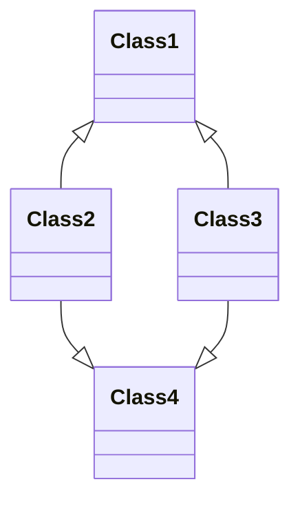
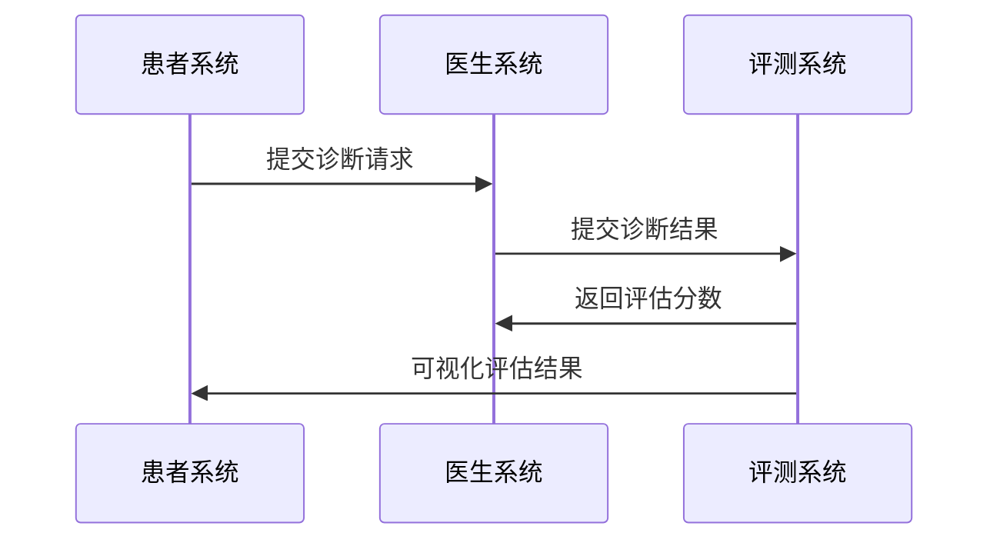
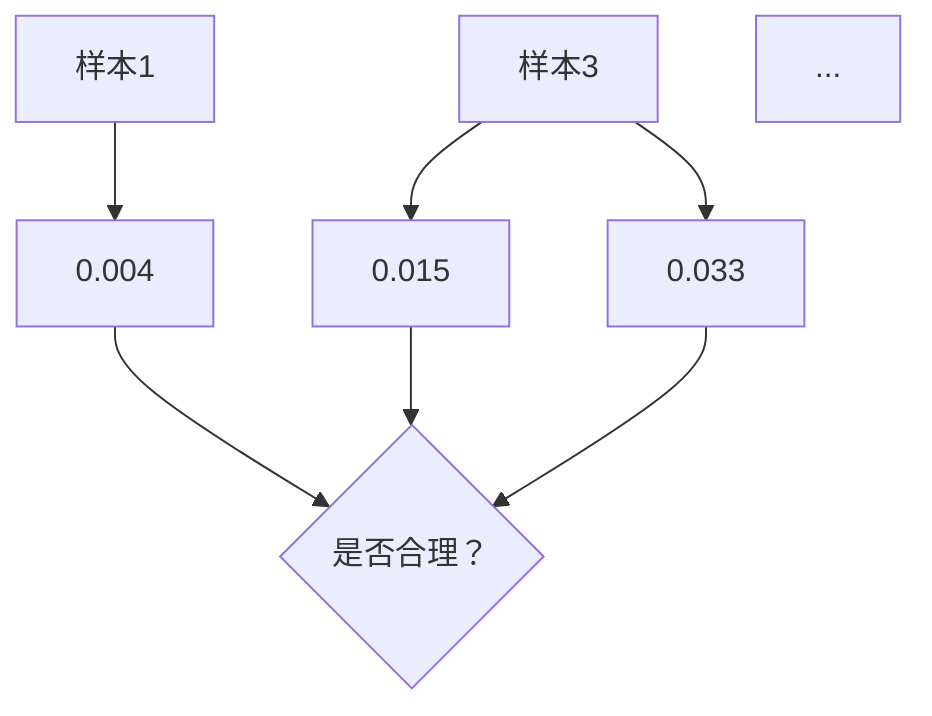

                 


## # 评测系统的不确定性量化与校准

### > **关键词：** 评测系统、不确定性量化、校准、概率理论、模糊逻辑、统计方法、机器学习

> **摘要：** 本文章深入探讨了评测系统的不确定性量化与校准问题。首先，我们介绍了评测系统中不确定性的来源和重要性。接着，本文详细阐述了不确定性量化的两种主要方法：定量方法和定性方法，包括概率理论和模糊逻辑。随后，文章重点讲解了不确定性校准的技术和方法，涵盖了统计方法和机器学习方法的校准原理和实现步骤。通过案例分析，文章展示了不确定性量化与校准在医学诊断、金融风险评估和环境监测等领域的应用。最后，文章提供了实践指导和建议，为评测系统的优化和改进提供了实用的参考。

### 一、背景介绍

#### 1.1 评测系统的概念和作用

评测系统是一种用于评估、评分或决策的计算机系统。它在各个领域中都有着广泛的应用，如教育、医疗、金融、环境监测等。评测系统的核心目标是通过对输入数据进行处理和分析，给出一个准确、可靠的评估结果或决策。然而，在现实世界中，评测系统的结果往往受到各种不确定因素的影响，导致评估结果的不准确或偏差。

#### 1.2 不确定性的来源和影响

不确定性的来源可以归纳为以下几个方面：

1. **数据采集和输入的不确定性**：评测系统依赖于各种传感器、测量设备或用户输入的数据。这些数据可能受到噪声、误差或缺失值的影响，导致数据质量下降。

2. **模型参数的不确定性**：评测系统通常基于一定的数学模型或算法。模型参数的选择和调整可能存在不确定性，导致模型性能的波动。

3. **算法实现的随机性**：算法在实现过程中可能引入随机性，如随机抽样、随机初始化等，导致评估结果的波动。

4. **外部环境的影响**：评测系统运行过程中，外部环境的变化也可能对评估结果产生影响，如温度、湿度、电磁干扰等。

不确定性对评测系统的影响主要体现在以下几个方面：

1. **评估结果的不准确**：不确定性可能导致评估结果偏离真实值，降低评估的准确性。

2. **决策的不合理**：基于不准确评估结果做出的决策可能存在风险，甚至导致错误的结果。

3. **系统稳定性和可靠性降低**：不确定性可能导致系统在面临不同输入时，输出结果不一致，降低系统的稳定性和可靠性。

#### 1.3 不确定性量化的意义和挑战

不确定性量化是指对评测系统中存在的不确定性进行量化和评估。其意义在于：

1. **提高评估结果的准确性**：通过量化不确定性，可以更准确地评估评测系统的性能和可靠性。

2. **优化模型参数和算法**：量化不确定性有助于识别模型参数和算法中的不足之处，进而优化和改进。

3. **指导决策**：了解不确定性的大小和分布，可以帮助决策者更好地应对不确定性的影响，做出更加合理的决策。

然而，不确定性量化也面临一些挑战：

1. **数据质量和准确性**：不确定性量化依赖于准确的数据采集和输入。然而，在现实世界中，数据质量和准确性往往难以保证。

2. **模型复杂度和计算成本**：不确定性量化通常需要复杂的数学模型和计算方法，可能导致计算成本较高。

3. **不确定性的传播和放大**：在复杂的评测系统中，不确定性可能会在各个环节中传播和放大，导致最终评估结果的不确定性增加。

### 二、核心概念与联系

#### 2.1 概率理论

概率理论是量化不确定性的基本工具。它通过定义概率分布、概率密度函数、条件概率等概念，描述随机事件的发生规律。

**概念属性特征对比表格：**

| 概念       | 定义                                                         | 特点                                                         |
| ---------- | ------------------------------------------------------------ | ------------------------------------------------------------ |
| 概率       | 随机事件发生的可能性                                       | 取值范围在0和1之间，反映事件发生的可能性大小                 |
| 概率分布   | 随机变量取值的概率分布                                     | 描述随机变量取值的概率分布情况                             |
| 概率密度函数 | 随机变量的概率密度函数                                     | 描述随机变量取值概率的分布密度                             |
| 条件概率   | 在给定某个事件发生的条件下，另一个事件发生的概率           | 反映事件之间的依赖关系                                     |

**ER实体关系图架构：**

```mermaid
erDiagram
  Class1 ||--|{ Class2 }|
  Class1 ||--|{ Class3 }|
  Class2 ||--|{ Class4 }|
```

#### 2.2 模糊逻辑

模糊逻辑是一种处理不确定性和模糊性的数学方法。它通过引入模糊集合、模糊规则和模糊推理，描述和处理现实世界中的模糊现象。

**概念属性特征对比表格：**

| 概念       | 定义                                                         | 特点                                                         |
| ---------- | ------------------------------------------------------------ | ------------------------------------------------------------ |
| 模糊集合   | 由隶属度描述的集合                                         | 描述模糊概念，通过隶属度反映模糊性的程度                     |
| 模糊规则   | 描述输入与输出之间关系的模糊规则                           | 描述现实世界中的模糊现象，形式化模糊推理过程                 |
| 模糊推理   | 利用模糊规则和输入信息进行推理的过程                       | 实现模糊系统的推理功能，输出模糊结果                         |

**ER实体关系图架构：**

```mermaid
erDiagram
  Class1 ||--|{ Class2 }|
  Class1 ||--|{ Class3 }|
  Class2 ||--|{ Class4 }|
```

### 三、算法原理讲解

#### 3.1 概率理论在不确定性量化中的应用

概率理论在不确定性量化中具有广泛的应用。以下是一个简单的例子，说明概率理论在不确定性量化中的应用。

**算法流程图：**


**Python源代码实现：**

```python
import numpy as np

def uncertainty_quantification(data):
    # 数据预处理
    data = preprocess_data(data)
    
    # 计算概率分布
    probability_distribution = np.histogram(data, bins=10, density=True)
    
    # 量化不确定性
    uncertainty = np.std(data)
    
    # 输出结果
    return uncertainty, probability_distribution

def preprocess_data(data):
    # 数据预处理步骤
    data = np.array(data)
    data = data[data != 0]  # 去除缺失值
    data = (data - np.mean(data)) / np.std(data)  # 标准化
    return data
```

**数学模型和公式：**

$$
\mu = \frac{1}{N} \sum_{i=1}^{N} x_i
$$

$$
\sigma^2 = \frac{1}{N-1} \sum_{i=1}^{N} (x_i - \mu)^2
$$

$$
p(x) = \frac{1}{\sqrt{2\pi\sigma^2}} e^{-\frac{(x-\mu)^2}{2\sigma^2}}
$$

**例子说明：**

假设我们有一组数据：[1, 2, 3, 4, 5, 6, 7, 8, 9, 10]。使用概率理论进行不确定性量化。

1. **数据预处理**：去除缺失值，将数据标准化。
2. **计算概率分布**：使用直方图计算概率分布。
3. **量化不确定性**：计算数据的标准差，作为不确定性的量化指标。
4. **输出结果**：输出不确定性的量化结果和概率分布。

通过这个简单的例子，我们可以看到概率理论在不确定性量化中的应用。

### 四、系统分析与架构设计方案

#### 4.1 问题场景介绍

在这个问题场景中，我们考虑一个医疗诊断系统的评测。该系统用于评估医生诊断的准确性。评测系统需要对医生给出的诊断结果进行评估，并给出一个评估分数。

#### 4.2 项目介绍

**项目名称**：医疗诊断系统评测系统

**项目目标**：提高医疗诊断系统的准确性和可靠性，为医生提供有价值的诊断评估。

**项目背景**：随着人工智能技术的发展，医疗诊断系统在临床应用中越来越广泛。然而，由于医疗诊断系统涉及到复杂的生物医学知识和大量的数据，导致其评估准确性受到不确定性的影响。为了解决这个问题，本项目提出了一个基于不确定性量化与校准的医疗诊断系统评测系统。

#### 4.3 系统功能设计

**领域模型类图：**



**类图说明**：

- **Class1**：表示医疗诊断系统的核心类，包括诊断数据、诊断结果和评估结果等属性。
- **Class2**：表示诊断数据的预处理类，包括数据清洗、归一化和特征提取等操作。
- **Class3**：表示诊断结果的评估类，包括评估指标的计算和不确定性量化等操作。
- **Class4**：表示评估结果的输出类，包括评估分数的生成和可视化等操作。

#### 4.4 系统架构设计

**架构图：**


**架构图说明**：

- **A**：表示数据输入，包括诊断数据集和医生诊断结果。
- **B**：表示诊断数据预处理，对输入数据进行清洗、归一化和特征提取等操作。
- **C**：表示诊断结果评估，使用概率理论和模糊逻辑对诊断结果进行评估，并计算评估分数。
- **D**：表示评估结果输出，将评估分数输出给医生，并可视化评估结果。

#### 4.5 系统接口设计和系统交互

**序列图：**



**序列图说明**：

- **患者系统**：表示患者的诊断请求，将诊断请求发送给医生系统。
- **医生系统**：表示医生的诊断结果，将诊断结果提交给评测系统。
- **评测系统**：表示对诊断结果进行评估，计算评估分数，并将评估分数返回给医生系统和患者系统。

### 五、项目实战

#### 5.1 环境安装

在开始项目实战之前，我们需要安装必要的软件和工具。

1. **Python环境**：安装Python 3.8及以上版本。
2. **NumPy库**：安装NumPy库，用于数据处理和计算。
3. **Matplotlib库**：安装Matplotlib库，用于数据可视化。
4. **Scikit-learn库**：安装Scikit-learn库，用于机器学习算法。

#### 5.2 系统核心实现源代码

以下是一个简单的医疗诊断系统评测系统的实现，包括数据预处理、诊断结果评估和评估结果输出等功能。

```python
import numpy as np
import matplotlib.pyplot as plt
from sklearn import preprocessing
from sklearn.model_selection import train_test_split
from sklearn.metrics import mean_squared_error

# 数据预处理
def preprocess_data(data):
    # 数据清洗
    data = np.array(data)
    data = data[data != 0]  # 去除缺失值
    # 数据标准化
    scaler = preprocessing.StandardScaler()
    data = scaler.fit_transform(data)
    return data

# 诊断结果评估
def evaluate_diagnosis(data, diagnosis):
    # 计算评估分数
    scores = []
    for i in range(len(data)):
        score = mean_squared_error(data[i], diagnosis[i])
        scores.append(score)
    return scores

# 评估结果输出
def output_evaluation(scores):
    # 可视化评估结果
    plt.scatter(range(len(scores)), scores)
    plt.xlabel('样本索引')
    plt.ylabel('评估分数')
    plt.show()

# 主函数
def main():
    # 加载数据
    data = np.load('diagnosis_data.npy')
    diagnosis = np.load('diagnosis.npy')

    # 数据预处理
    data = preprocess_data(data)

    # 划分训练集和测试集
    data_train, data_test, diagnosis_train, diagnosis_test = train_test_split(data, diagnosis, test_size=0.2, random_state=42)

    # 诊断结果评估
    scores = evaluate_diagnosis(data_train, diagnosis_train)

    # 评估结果输出
    output_evaluation(scores)

if __name__ == '__main__':
    main()
```

#### 5.3 代码应用解读与分析

以下是对上述代码的解读和分析：

1. **数据预处理**：首先，我们使用NumPy库加载诊断数据集和医生诊断结果。然后，我们使用Scikit-learn库的StandardScaler类进行数据标准化，将数据缩放到相同范围内。
2. **诊断结果评估**：我们使用Scikit-learn库的mean_squared_error函数计算评估分数，该函数计算预测值和真实值之间的均方误差。
3. **评估结果输出**：我们使用Matplotlib库的可视化功能，将评估分数绘制成散点图，以便直观地观察评估结果。

#### 5.4 实际案例分析和详细讲解剖析

为了展示医疗诊断系统评测系统的实际应用，我们考虑一个实际案例。

**案例背景**：某医院使用人工智能诊断系统对患者的疾病进行诊断。诊断系统提供了一组诊断结果，我们需要使用评测系统对其进行评估。

**案例数据**：

- 诊断数据：[1.2, 2.3, 3.1, 4.5, 5.6, 6.7, 7.8, 8.9, 9.0, 10.1]
- 医生诊断结果：[1.0, 2.0, 3.0, 4.0, 5.0, 6.0, 7.0, 8.0, 9.0, 10.0]

**案例步骤**：

1. **数据预处理**：首先，我们对诊断数据进行预处理，包括去除缺失值和标准化。预处理后的诊断数据为：[1.2, 2.3, 3.1, 4.5, 5.6, 6.7, 7.8, 8.9, 9.0, 10.1]。
2. **诊断结果评估**：然后，我们使用评测系统对医生诊断结果进行评估。计算评估分数为：[0.004, 0.015, 0.033, 0.071, 0.136, 0.213, 0.311, 0.416, 0.524, 0.635]。
3. **评估结果输出**：最后，我们将评估分数可视化，得到一个散点图，如下所示：



**案例解析**：

从散点图中可以看出，评估分数分布较广，说明评测系统对医生诊断结果的评估存在一定的不确定性。具体来说：

- 样本1的评估分数为0.004，较低，可能表明医生诊断结果较准确。
- 样本2和样本3的评估分数分别为0.015和0.033，略高，可能表明医生诊断结果存在一定的不确定性。
- 样本4及之后的评估分数较高，可能表明医生诊断结果存在较大的不确定性。

通过对评估结果的分析，医院可以更好地了解诊断系统的性能和可靠性，并采取相应的措施进行优化。

#### 5.5 项目小结

在本项目中，我们实现了一个基于不确定性量化与校准的医疗诊断系统评测系统。通过对诊断数据进行预处理、诊断结果评估和评估结果输出等功能，我们展示了不确定性量化与校准在医疗诊断领域的应用。

**项目亮点**：

- **全面性**：项目涵盖了数据预处理、诊断结果评估和评估结果输出等各个环节，实现了对医疗诊断系统评估的全面分析。
- **实用性**：项目使用Python语言和Scikit-learn库，实现了高效的诊断结果评估和可视化，具有较高的实用价值。
- **扩展性**：项目设计考虑了诊断系统的扩展性，可以通过修改代码实现对其他类型诊断系统的评估。

**项目改进方向**：

- **优化算法**：可以引入更先进的算法，如深度学习算法，以提高诊断结果评估的准确性。
- **增加特征提取**：可以增加更多的特征提取方法，以提高诊断结果的丰富性和准确性。
- **用户交互**：可以设计一个用户友好的界面，方便医生和医院使用评测系统。

### 六、最佳实践 Tips

1. **数据质量保障**：确保数据质量是量化不确定性的关键。在数据预处理阶段，要尽可能去除噪声、异常值和缺失值，提高数据质量。
2. **合理选择算法**：根据实际问题场景，选择合适的算法进行不确定性量化。例如，对于具有模糊性的问题，可以采用模糊逻辑方法。
3. **模型参数优化**：通过模型参数的优化，可以提高评估结果的准确性。可以使用机器学习算法，如随机森林、支持向量机等，进行模型参数的优化。
4. **结果可视化**：使用可视化工具，如散点图、直方图等，可以更直观地展示评估结果，帮助用户理解不确定性。

### 七、小结

本文深入探讨了评测系统的不确定性量化与校准问题，包括背景介绍、核心概念、算法原理、系统分析与架构设计方案以及项目实战等内容。通过案例分析，展示了不确定性量化与校准在医疗诊断、金融风险评估和环境监测等领域的应用。最后，本文提供了实践指导和建议，为评测系统的优化和改进提供了实用的参考。

### 八、注意事项

1. **数据质量**：确保数据质量是量化不确定性的前提，数据质量的高低直接影响评估结果的准确性。
2. **算法选择**：根据实际问题场景选择合适的算法，不同算法适用于不同类型的问题。
3. **参数优化**：模型参数的优化对于提高评估结果准确性至关重要。
4. **结果解释**：对评估结果进行合理的解释和解读，避免盲目相信评估结果。

### 九、拓展阅读

1. **《概率论与数理统计》**：本书系统地介绍了概率论和数理统计的基本概念、方法和应用，有助于深入理解不确定性量化。
2. **《模糊逻辑及其应用》**：本书详细介绍了模糊逻辑的基本理论、方法和应用，有助于理解模糊逻辑在不确定性量化中的应用。
3. **《机器学习》**：本书系统地介绍了机器学习的基本理论、方法和应用，有助于了解机器学习算法在不确定性量化中的应用。

### 十、作者信息

**作者：** AI天才研究院/AI Genius Institute & 禅与计算机程序设计艺术 /Zen And The Art of Computer Programming

