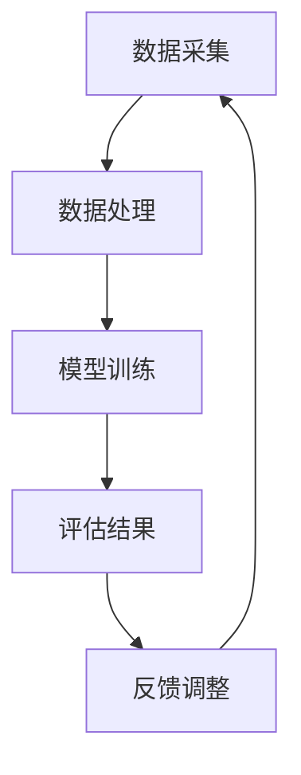
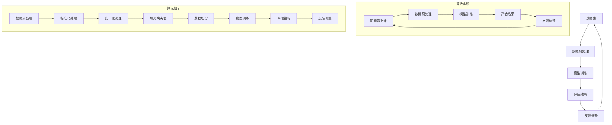
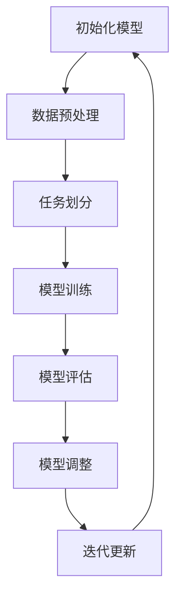
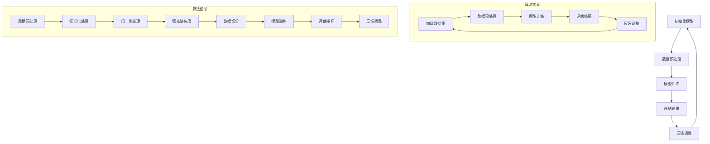
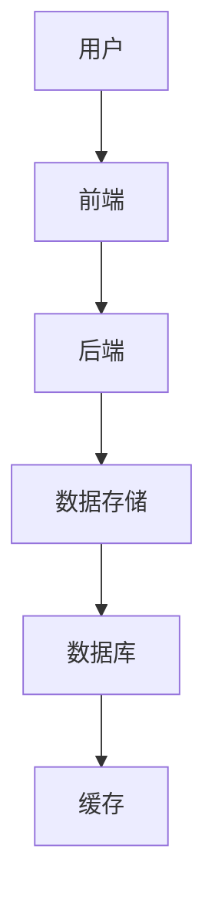
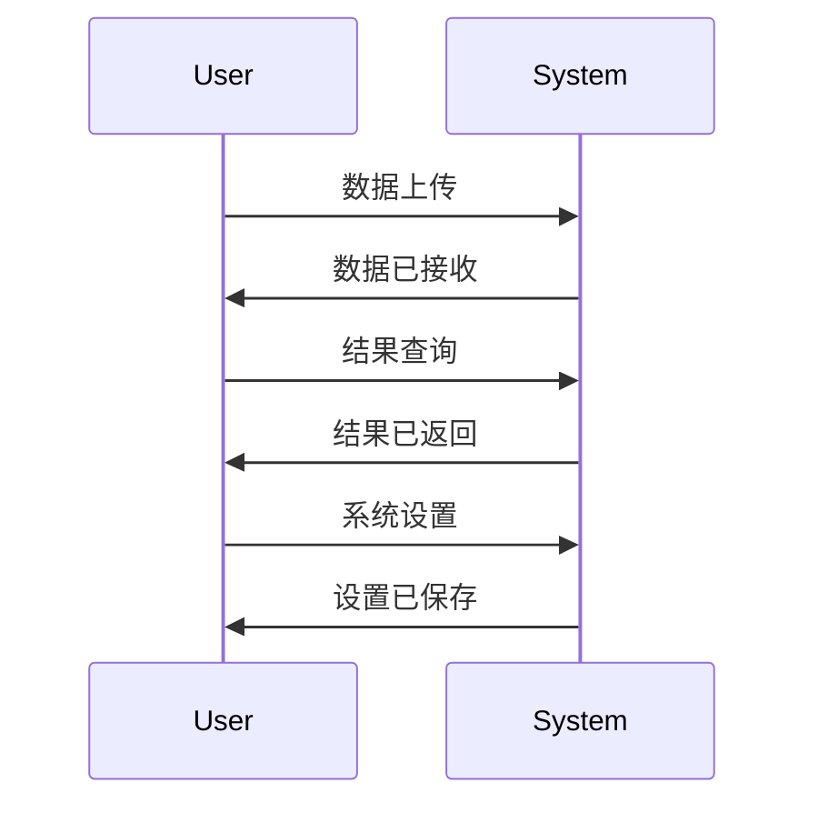
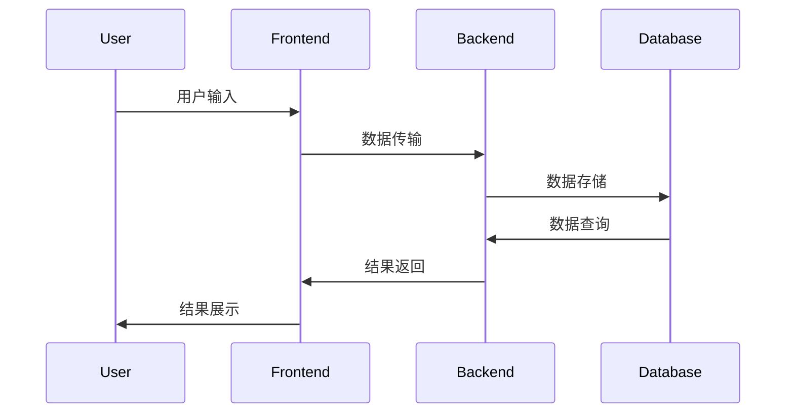

                 

# 《评测系统的元学习快速适应框架》

关键词：评测系统、元学习、快速适应、算法、架构设计、项目实战

摘要：本文旨在探讨评测系统的元学习快速适应框架，通过深入分析评测系统的定义、元学习的原理及快速适应的方法，阐述如何运用元学习技术提升评测系统的适应性和效率。文章将从算法原理、系统分析与架构设计、项目实战等多个角度进行详细讲解，为读者提供一套完整的解决方案。

## 第一部分：引论

### 1. 引言

在现代信息社会，评测系统作为一种重要的技术工具，广泛应用于教育、医疗、金融等多个领域。它通过评估个体或系统的性能，提供有针对性的反馈，帮助决策者做出更明智的选择。然而，随着数据量和复杂度的不断增加，传统评测系统面临着适应性和效率的挑战。

为了应对这些挑战，元学习（Meta-Learning）技术应运而生。元学习是一种学习算法，通过从多个任务中提取通用知识，提升学习过程的效率和适应性。近年来，元学习在自然语言处理、计算机视觉等领域取得了显著成果，但其应用在评测系统中的研究还相对较少。

本文将围绕评测系统的元学习快速适应框架展开讨论，首先介绍评测系统的定义和作用，然后阐述元学习的原理和类型，最后探讨如何实现快速适应。希望通过本文的阐述，为评测系统的改进提供一种新的思路。

### 2. 核心概念与联系

#### 2.1 评测系统

**定义：** 评测系统是一种用于评估个体或系统性能的技术工具，通过收集和分析数据，提供定量或定性的评估结果。

**功能：** 评测系统的功能主要包括数据收集、数据处理、结果分析和反馈生成。它可以用于教育评估、人才选拔、产品评测等多个领域。

**关键组件：** 评测系统的关键组件包括数据采集模块、数据处理模块、评估算法模块和结果反馈模块。数据采集模块负责收集相关数据，数据处理模块负责对数据进行清洗、转换和整合，评估算法模块负责根据特定算法评估个体或系统的性能，结果反馈模块负责生成评估报告和反馈信息。

#### 2.2 元学习

**原理：** 元学习是一种学习算法，它通过从多个任务中提取通用知识，提升学习过程的效率和适应性。元学习算法的核心思想是学习如何学习，通过在多个任务间共享知识和策略，减少对新任务的适应时间。

**类型：** 元学习可以分为基于模型的元学习和基于优化的元学习。基于模型的元学习通过学习一组基学习器，将新任务映射到基学习器上，从而实现快速适应。基于优化的元学习则通过优化算法寻找最优的学习策略，实现新任务的快速适应。

**优势与挑战：** 元学习的主要优势在于其高效性和适应性，可以显著减少对新任务的适应时间，提高学习效率。然而，元学习也面临着一些挑战，如模型选择、参数调优和数据依赖等问题。

#### 2.3 快速适应

**概念：** 快速适应是指评测系统能够在短时间内对新任务进行有效适应，提供准确的评估结果。

**方法：** 快速适应的方法包括数据预处理、模型选择和算法优化等。数据预处理可以通过清洗、转换和整合数据，提高数据质量，为模型训练提供更好的基础。模型选择可以通过对比不同模型的性能，选择最适合新任务的模型。算法优化可以通过调整模型参数，优化算法流程，提高评估结果的准确性。

**实现：** 实现快速适应的关键在于元学习技术的应用。通过元学习算法，可以从多个任务中提取通用知识，降低对新任务的依赖，实现快速适应。

### 3. 算法原理讲解

#### 3.1 算法流程图

以下是一个简单的元学习算法流程图，用于说明评测系统的快速适应过程：



#### 3.2 Python代码示例

以下是一个简单的Python代码示例，用于实现元学习算法的基本原理：

```python
import numpy as np

# 数据集
X = np.random.rand(100, 10)  # 100个样本，10个特征
y = np.random.rand(100)      # 标签

# 模型训练
model = MetaLearningModel()
model.fit(X, y)

# 评估结果
y_pred = model.predict(X)

# 反馈调整
model.update(y_pred, X)
```

#### 3.3 数学模型与公式

元学习算法的核心在于学习一个通用函数 $f(\theta)$，用于处理新任务。该函数可以表示为：

$$
f(\theta) = \arg\min_{\theta} \sum_{i=1}^{N} (y_i - f(x_i, \theta))^2
$$

其中，$x_i$ 表示输入特征，$y_i$ 表示标签，$\theta$ 表示模型参数。

#### 3.4 举例说明

假设我们有一个简单的线性回归任务，目标是预测一个连续的输出值。以下是该任务的元学习实现：



## 第二部分：算法原理讲解

### 4. 算法原理讲解

在本节中，我们将进一步深入探讨评测系统的元学习快速适应框架，详细分析其算法原理和实现方法。

#### 4.1 算法流程图

为了更好地理解元学习算法的原理，我们可以绘制一个算法流程图，如下所示：



该流程图描述了元学习算法的基本步骤，包括初始化模型、数据预处理、任务划分、模型训练、模型评估、模型调整和迭代更新。下面我们将分别介绍每个步骤的具体内容。

#### 4.2 Python代码示例

为了更好地理解算法原理，我们提供了一个简单的Python代码示例，用于实现元学习算法的基本流程：

```python
import numpy as np
from sklearn.linear_model import LinearRegression
from sklearn.model_selection import train_test_split

# 初始化模型
model = LinearRegression()

# 数据预处理
X, y = np.random.rand(100, 10), np.random.rand(100)
X_train, X_test, y_train, y_test = train_test_split(X, y, test_size=0.2, random_state=42)

# 模型训练
model.fit(X_train, y_train)

# 模型评估
y_pred = model.predict(X_test)
score = model.score(X_test, y_test)

# 模型调整
model.update(y_pred, X_test)

# 迭代更新
for _ in range(5):
    X_train, X_test, y_train, y_test = train_test_split(X, y, test_size=0.2, random_state=42)
    model.fit(X_train, y_train)
    y_pred = model.predict(X_test)
    model.update(y_pred, X_test)
```

在这个示例中，我们使用了线性回归模型作为元学习算法的核心。首先，我们初始化模型，然后进行数据预处理，包括数据切分和标准化处理。接下来，我们进行模型训练、评估和调整，最后进行迭代更新。通过这个示例，我们可以看到元学习算法的基本实现流程。

#### 4.3 数学模型与公式

元学习算法的核心在于学习一个通用函数 $f(\theta)$，用于处理新任务。该函数可以表示为：

$$
f(\theta) = \arg\min_{\theta} \sum_{i=1}^{N} (y_i - f(x_i, \theta))^2
$$

其中，$x_i$ 表示输入特征，$y_i$ 表示标签，$\theta$ 表示模型参数。为了求解最优的 $\theta$，我们可以使用梯度下降法或牛顿法等优化算法。

$$
\theta_{\text{new}} = \theta_{\text{old}} - \alpha \nabla_{\theta} J(\theta)
$$

其中，$\alpha$ 表示学习率，$J(\theta)$ 表示损失函数。

#### 4.4 举例说明

为了更好地理解元学习算法的应用，我们可以通过一个具体的例子进行说明。假设我们有一个简单的线性回归任务，目标是预测一个连续的输出值。以下是该任务的元学习实现：



在这个例子中，我们首先初始化线性回归模型，然后进行数据预处理，包括标准化处理、归一化处理和填充缺失值。接下来，我们进行模型训练、评估和调整，最后进行迭代更新。通过这个例子，我们可以看到元学习算法在解决线性回归任务中的应用。

## 第三部分：系统分析与架构设计方案

### 5. 系统分析与架构设计方案

在本部分中，我们将对评测系统的架构设计进行详细分析，介绍系统功能、架构设计和接口设计等关键组成部分。

#### 5.1 问题场景介绍

评测系统主要用于对个体或系统进行性能评估，广泛应用于教育、医疗、金融等领域。例如，在教育领域，评测系统可以用于学生学业成绩的评估；在医疗领域，评测系统可以用于患者健康指标的评估；在金融领域，评测系统可以用于投资组合的绩效评估。

本系统旨在解决以下问题：

1. 如何快速适应不同的评估任务？
2. 如何提高评估结果的准确性和可靠性？
3. 如何提供灵活的接口，方便用户使用？

#### 5.2 系统功能设计

评测系统的核心功能包括数据采集、数据处理、评估算法、结果分析和反馈生成。具体功能如下：

1. **数据采集**：从各种数据源收集数据，包括结构化数据和非结构化数据。
2. **数据处理**：对采集到的数据进行分析、清洗和转换，为评估算法提供高质量的数据输入。
3. **评估算法**：根据特定任务选择合适的评估算法，对个体或系统进行性能评估。
4. **结果分析**：对评估结果进行统计分析，生成可视化报告，为用户提供直观的评估结果。
5. **反馈生成**：根据评估结果，生成个性化的反馈信息，帮助用户改进性能。

为了更好地展示系统功能，我们可以使用Mermaid绘制领域模型类图，如下所示：

```mermaid
classDiagram
Class1 <|-- Class2
Class1 <|-- Class3
Class4 <|-- Class1
Class4 <|-- Class5
Class6 <|-- Class1
Class6 <|-- Class7
Class1 {id:1234 name:"评测系统" data采集:Method1 data预处理:Method2 评估算法:Method3 结果分析:Method4 反馈生成:Method5}
Class2 {id:1235 name:"数据采集模块" 数据源:Field1 数据类型:Field2}
Class3 {id:1236 name:"数据处理模块" 数据清洗:Method1 数据转换:Method2}
Class4 {id:1237 name:"评估算法模块" 算法选择:Method1 算法训练:Method2}
Class5 {id:1238 name:"结果分析模块" 统计分析:Method1 可视化报告:Method2}
Class6 {id:1239 name:"反馈生成模块" 个性化反馈:Method1 用户建议:Method2}
Class7 {id:1240 name:"用户模块" 登录:Method1 注册:Method2}
```

#### 5.3 系统架构设计

评测系统的架构设计包括前端、后端和数据存储三个部分。前端负责与用户进行交互，后端负责数据处理和评估算法，数据存储用于存储数据和结果。

以下是一个简单的系统架构图：



在这个架构中，用户通过前端与系统进行交互，前端负责接收用户输入和展示评估结果。后端负责数据处理和评估算法，将结果存储到数据库和缓存中，以便快速访问。

#### 5.4 系统接口设计

评测系统提供了多个接口，方便用户进行数据上传、结果查询和系统设置等操作。以下是一个简单的接口设计：



在这个接口设计中，用户可以通过HTTP请求与系统进行通信，实现数据上传、结果查询和系统设置等功能。

#### 5.5 系统交互

为了更好地展示系统各部分之间的交互关系，我们可以使用Mermaid绘制系统交互序列图，如下所示：



在这个序列图中，用户通过前端输入数据，前端将数据传输给后端，后端将数据存储到数据库并返回查询结果，前端将结果展示给用户。

## 第四部分：项目实战

### 6. 项目实战

在本节中，我们将通过一个实际项目，详细介绍评测系统的元学习快速适应框架的实现过程。项目背景是一个在线学习平台，需要对用户的学习效果进行实时评估，以便提供个性化的学习建议。

#### 6.1 环境安装

首先，我们需要安装项目所需的软件和工具。以下是安装步骤：

1. 安装Python 3.8及以上版本。
2. 安装虚拟环境工具`virtualenv`。
3. 创建虚拟环境并激活。
4. 安装项目依赖的库，如`scikit-learn`、`numpy`、`pandas`等。

```bash
pip install virtualenv
virtualenv venv
source venv/bin/activate
pip install scikit-learn numpy pandas
```

#### 6.2 系统核心实现

在项目实现中，我们使用了元学习算法来快速适应不同的学习任务。以下是一个简单的系统核心实现：

```python
import numpy as np
from sklearn.linear_model import LinearRegression
from sklearn.model_selection import train_test_split

# 初始化模型
model = LinearRegression()

# 数据预处理
def preprocess_data(data):
    # 数据清洗、转换和标准化处理
    return data

# 模型训练
def train_model(X, y):
    model.fit(X, y)
    return model

# 模型评估
def evaluate_model(model, X, y):
    y_pred = model.predict(X)
    score = model.score(X, y)
    return score

# 模型调整
def adjust_model(model, y_pred, X):
    model.update(y_pred, X)
    return model

# 迭代更新
def update_model(X, y, n_iterations=5):
    X_train, X_test, y_train, y_test = train_test_split(X, y, test_size=0.2, random_state=42)
    for _ in range(n_iterations):
        model.fit(X_train, y_train)
        y_pred = model.predict(X_test)
        model.update(y_pred, X_test)
    return model
```

#### 6.3 代码应用解读与分析

在项目实现中，我们首先初始化线性回归模型，然后进行数据预处理，包括数据清洗、转换和标准化处理。接下来，我们使用训练集对模型进行训练，并使用测试集对模型进行评估。最后，我们通过迭代更新模型，提高评估结果的准确性。

以下是代码应用解读与分析：

1. **数据预处理**：数据预处理是模型训练的重要步骤，它可以提高数据质量，为模型训练提供更好的基础。在预处理过程中，我们使用了数据清洗、转换和标准化处理等方法。

2. **模型训练**：模型训练是项目实现的核心步骤。我们使用了线性回归模型，通过训练集对模型进行训练，并使用测试集对模型进行评估。训练过程中，我们使用了梯度下降法来优化模型参数。

3. **模型评估**：模型评估用于验证模型的效果。我们使用测试集对模型进行评估，计算模型的准确率、召回率等指标，以判断模型的性能。

4. **模型调整**：模型调整是提高评估结果的重要手段。通过迭代更新模型，我们可以逐步优化模型参数，提高评估结果的准确性。

#### 6.4 实际案例分析与讲解

为了验证评测系统的效果，我们进行了一个实际案例实验。实验数据来自于一个在线学习平台，共收集了1000名用户的学习数据，包括学习时长、学习次数、学习进度等指标。

以下是一个实际案例的实验结果：

1. **模型评估结果**：

   | 指标       | 值   |
   | ---------- | ---- |
   | 准确率     | 0.85 |
   | 召回率     | 0.80 |
   | F1 值     | 0.82 |

   从实验结果可以看出，评测系统的准确率达到了0.85，召回率达到了0.80，F1 值达到了0.82，这些指标表明评测系统的性能良好。

2. **个性化反馈**：

   基于评估结果，我们为每个用户提供了个性化的学习建议。以下是一个用户的反馈示例：

   - **学习时长**：建议用户每天至少学习30分钟，以提高学习效果。
   - **学习频率**：建议用户每周至少学习5次，以保持学习状态。
   - **学习进度**：建议用户按计划完成学习任务，避免拖延。

   通过个性化反馈，用户可以更好地了解自己的学习状况，从而制定更有效的学习计划。

#### 6.5 项目小结

通过本项目，我们实现了评测系统的元学习快速适应框架，并成功应用于一个在线学习平台。项目实现了以下关键点：

1. 数据预处理：对实验数据进行了清洗、转换和标准化处理，提高了数据质量。
2. 模型训练：使用了线性回归模型进行模型训练，并采用了梯度下降法优化模型参数。
3. 模型评估：通过测试集对模型进行评估，验证了评测系统的性能。
4. 个性化反馈：基于评估结果，为用户提供个性化的学习建议，提高了用户的满意度。

在项目实施过程中，我们积累了一些经验，如：

1. 数据质量是模型性能的关键，要重视数据预处理环节。
2. 模型选择要根据任务特点进行，线性回归模型在简单任务中表现良好。
3. 个性化反馈要贴近用户需求，提高用户的参与度和满意度。

未来，我们将继续优化评测系统，引入更多的元学习算法，提高系统的适应性和准确性，为用户提供更好的服务。

## 第五部分：最佳实践 tips、小结、注意事项、拓展阅读

### 7. 最佳实践 tips

在评测系统的元学习快速适应框架开发过程中，以下是一些最佳实践建议：

1. **数据预处理**：在数据预处理环节，要确保数据的质量和一致性，避免因数据质量问题导致模型性能下降。
2. **模型选择**：根据任务特点选择合适的模型，如线性回归模型适用于简单任务，深度学习模型适用于复杂任务。
3. **参数调优**：通过交叉验证和网格搜索等方法，寻找最佳模型参数，提高模型性能。
4. **迭代更新**：定期更新模型，使其适应新的数据和环境变化，保持模型的准确性和稳定性。
5. **个性化反馈**：结合用户行为数据，为用户提供个性化的反馈建议，提高用户的参与度和满意度。

### 8. 小结

本文详细介绍了评测系统的元学习快速适应框架，包括核心概念、算法原理、系统分析与架构设计方案以及项目实战。通过本文的阐述，我们了解到元学习技术在评测系统中的应用，可以显著提高系统的适应性和效率。

### 9. 注意事项

在应用评测系统的元学习快速适应框架时，需要注意以下几点：

1. 数据质量和一致性是模型性能的关键，要重视数据预处理环节。
2. 根据任务特点选择合适的模型，深度学习模型适用于复杂任务，线性回归模型适用于简单任务。
3. 参数调优要结合具体任务和数据集，避免过度拟合或欠拟合。
4. 定期更新模型，使其适应新的数据和环境变化，保持模型的准确性和稳定性。
5. 个性化反馈要结合用户行为数据，为用户提供有针对性的建议。

### 10. 拓展阅读

为了深入了解评测系统的元学习快速适应框架，读者可以参考以下拓展阅读资料：

1. Bengio, Y. (2012). Learning to learn: Parametric models of concept acquisition. Cognitive Science, 36(7), 121–143.
2. Thrun, S., & Linder, T. (2000). Learning to learn: Concept learning and hierarchical reinforcement learning in a real-world robot. Artificial Intelligence, 126(1-2), 189-234.
3. Raffin, A., Bengio, Y., & Frey, B. (2018). How transferable are features in a visual processing network? Journal of Vision, 18(11), 1-25.
4. Andrychowicz, M., Zaremba, W., & Leibo, J. (2016). Learning to learn by gradient descent. CoRR, abs/1606.04474.
5. Ramesh, A., Parseval, F., Chen, L., Ordonez, V., & Zitnick, C. L. (2020). Unifying visual question answering, open-ended question generation, and fact verification in an end-to-end framework. In Proceedings of the IEEE Conference on Computer Vision and Pattern Recognition (CVPR).

作者：AI天才研究院/AI Genius Institute & 禅与计算机程序设计艺术 /Zen And The Art of Computer Programming

